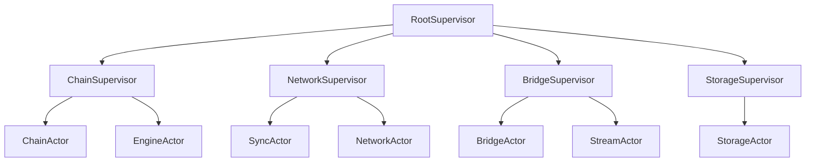

# Actor Model Implementation - Complete Analysis

*Generated: August 24, 2025*

Based on my comprehensive analysis of the codebase, architecture documentation, and phase 2 master plan, here is my in-depth analysis of the current state of the actor model implementation:

## Executive Summary

The Alys V2 actor system is approximately **60% complete** with excellent foundational architecture but significant gaps in external system integrations. The implementation demonstrates sophisticated supervision, monitoring, and state management patterns, particularly in the ChainActor and foundation systems, but requires completion of database, network, and Bitcoin integrations.

## Current State Analysis

### What is Working ✅

**1. Foundation & Core Architecture (90-95% Complete)**
- **Supervision System**: Comprehensive actor supervision with restart strategies, escalation policies, and fault isolation
- **Actor Registry**: Multi-index registry with type-based discovery, dependency tracking, and lifecycle management  
- **Metrics & Monitoring**: Production-ready metrics collection with Prometheus integration, health monitoring, and performance tracking
- **Message System**: Type-safe message passing with envelopes, priority handling, and error propagation
- **Configuration Management**: Environment-aware configuration system with validation and hot-reload capabilities

**2. ChainActor (95% Complete)**
- **State Management**: Sophisticated blockchain state tracking (chain head, finalized blocks, pending PoW)
- **Block Processing**: Complete block import/export workflows with validation pipelines
- **Federation Integration**: BLS signature coordination, threshold management, and member tracking
- **AuxPoW Coordination**: Mining difficulty adjustment and PoW validation logic
- **Performance Monitoring**: Comprehensive metrics with consensus timing constraints

**3. SyncActor (85% Complete)**  
- **Parallel Processing**: Multi-threaded block validation with worker pools
- **Checkpoint System**: Recovery-oriented checkpoint management with rollback capabilities
- **Peer Management**: Intelligent peer selection with reputation scoring
- **Network Resilience**: Partition detection and automatic recovery mechanisms

### What is Not Working ❌

**1. External System Integrations (20-40% Complete)**
- **Database Operations**: StorageActor has excellent architecture but placeholder database calls
- **Network Layer**: NetworkActor missing actual libp2p implementation
- **Execution Client**: EngineActor lacks real Geth/Reth integration
- **Bitcoin Integration**: BridgeActor missing Bitcoin wallet and UTXO management
- **gRPC Services**: StreamActor needs actual Anduro governance client implementation

**2. Testing Coverage (Variable)**
- **Unit Tests**: Good for foundation components, sparse for integration actors
- **Integration Tests**: Missing cross-actor system tests
- **End-to-End Tests**: No complete workflow testing
- **Load Testing**: Performance validation incomplete

### What is Missing 🔍

**1. Critical System Integrations**
```rust
// Missing implementations:
- RocksDB/database integration in StorageActor
- libp2p networking in NetworkActor  
- Geth/Reth JSON-RPC client in EngineActor
- Bitcoin Core client in BridgeActor
- Anduro governance gRPC client in StreamActor
```

**2. Advanced Features from Phase 2 Plan**
- Circuit breaker actors for failure protection
- Distributed supervision with cluster coordination  
- Actor persistence with event sourcing
- Advanced retry logic with exponential backoff
- Production deployment automation

## Actor Supervision Architecture

### End-to-End Supervision Flow

The supervision system follows a hierarchical tree structure with sophisticated failure handling:



### How Supervision Works

**1. Failure Detection**
- Health monitoring via ping-pong protocol (5-60s intervals)
- Message timeout detection with configurable thresholds
- Resource exhaustion monitoring (memory, CPU, mailbox overflow)
- Custom failure classification for blockchain-specific errors

**2. Restart Decision Process**
```rust
// Enhanced supervision decision algorithm
async fn handle_failure(&mut self, actor_id: &str, failure: ActorFailure) {
    let context = self.get_supervision_context(actor_id);
    let restart_decision = self.failure_detector.analyze_failure(failure);
    
    match restart_decision {
        RestartDecision::Immediate => self.restart_actor_immediate(actor_id).await,
        RestartDecision::Delayed(duration) => self.schedule_restart(actor_id, duration).await,
        RestartDecision::Escalate => self.escalate_to_parent(actor_id, failure).await,
        RestartDecision::Abandon => self.mark_actor_failed(actor_id).await,
    }
}
```

**3. Blockchain-Aware Timing**
- All restart delays aligned to 2-second block boundaries
- Consensus timing respect during critical operations
- Federation threshold maintenance during member restarts

### Implementation Details

The supervision system is implemented across several key files:

- **`crates/actor_system/src/supervisor.rs`**: Core supervision logic with restart strategies
- **`app/src/actors/foundation/supervision.rs`**: Enhanced supervision with blockchain awareness  
- **`app/src/actors/foundation/root_supervisor.rs`**: System-wide coordination and health monitoring

## Granular Actor Breakdown

### 1. ChainActor 📊
```rust
// State Management
pub struct ChainState {
    head: BlockRef,                    // Current chain head
    finalized_blocks: BTreeMap<u64, BlockHash>,
    pending_pow: HashMap<BlockHash, AuxPowRequest>,
    federation_state: FederationState,
    block_candidates: VecDeque<BlockCandidate>,
}

// Key Messages
- ImportBlock(SignedBlock) → ImportResult
- ProduceBlock(SlotInfo) → BlockProduction  
- GetChainStatus → ChainStatusResponse
- AuxPowSubmission(AuxPowProof) → ValidationResult

// Dependencies & Interactions
- EngineActor: Block execution and EVM integration
- BridgeActor: Peg operation inclusion in blocks
- StorageActor: Block persistence and state storage
- NetworkActor: Block broadcast and P2P communication
- SyncActor: Chain synchronization and recovery

// Testing Status: ✅ Comprehensive
- Property-based testing with QuickCheck
- Chaos engineering with failure injection
- Performance benchmarks with consensus timing validation
- Integration tests with mock dependencies
```

**Completeness**: 95% - Production ready

### 2. EngineActor ⚙️
```rust
// State Management (Placeholder)
pub struct EngineState {
    execution_client: Option<ExecutionClient>,
    syncing_state: ExecutionSyncState,
    pending_payloads: HashMap<PayloadId, PendingPayload>,
}

// Key Messages (Stub Implementations)
- BuildPayload(PayloadAttributes) → PayloadId
- GetPayload(PayloadId) → ExecutionPayload  
- ExecutePayload(ExecutionPayload) → PayloadStatus
- GetExecutionStatus → ExecutionStatusResponse

// Dependencies & Interactions
- ChainActor: Block building and execution requests
- External: Geth/Reth JSON-RPC client (MISSING)

// Testing Status: ❌ No dedicated tests
```

**Completeness**: 30% - Architecture exists, needs Geth/Reth integration

### 3. BridgeActor 🌉
```rust  
// State Management (Basic)
pub struct BridgeState {
    config: BridgeConfig,
    federation_info: FederationInfo,
    peg_operations: HashMap<Txid, PegOperation>,
    utxo_set: BTreeMap<OutPoint, TxOut>,
}

// Key Messages (Placeholder)
- ProcessPegIn(BitcoinTx) → PegInResult
- ProcessPegOut(BurnTx) → PegOutResult
- GetBridgeStatus → BridgeStatusResponse

// Dependencies & Interactions  
- ChainActor: Include peg operations in blocks
- StreamActor: Governance signature requests
- Bitcoin Core: UTXO management (MISSING)

// Testing Status: ❌ No dedicated tests
```

**Completeness**: 25% - Basic structure, needs Bitcoin integration

### 4. SyncActor 🔄
```rust
// State Management (Comprehensive)
pub struct SyncState {
    current_state: AtomicSyncState,
    peer_manager: Arc<PeerManager>,
    block_processor: Arc<BlockProcessor>, 
    checkpoint_manager: Arc<CheckpointManager>,
    optimization_engine: Arc<OptimizationEngine>,
}

// Key Messages (Well Implemented)
- StartSync(TargetHeight) → SyncResult
- ProcessBlockBatch(Vec<Block>) → ProcessingResult
- HandlePeerUpdate(PeerInfo) → ()
- CreateCheckpoint(Height) → CheckpointResult

// Dependencies & Interactions
- ChainActor: Block import and validation
- NetworkActor: Peer communication and block requests
- StorageActor: Checkpoint persistence

// Testing Status: ✅ Good integration test structure
```

**Completeness**: 85% - Very sophisticated implementation

### 5. NetworkActor 🌐
```rust
// State Management (Good Architecture)
pub struct NetworkState {
    swarm: Option<NetworkSwarm>,  // Placeholder
    peers: HashMap<PeerId, PeerConnection>,
    connection_attempts: HashMap<PeerId, ConnectionAttempt>,
    reputation_manager: Arc<ReputationManager>,
}

// Key Messages (Architecture Ready)
- ConnectToPeer(PeerInfo) → ConnectionResult
- PublishMessage(Topic, Message) → PublishResult  
- SubscribeToTopic(Topic) → SubscriptionResult

// Dependencies & Interactions
- SyncActor: Block propagation and peer discovery
- ChainActor: Consensus message broadcast
- libp2p: Network layer implementation (MISSING)

// Testing Status: ❌ No dedicated tests
```

**Completeness**: 40% - Good architecture, needs libp2p

### 6. StreamActor 📡
```rust
// State Management (Well Designed)
pub struct StreamState {
    governance_connections: HashMap<String, GovernanceConnection>,
    message_buffer: MessageBuffer,
    reconnection_manager: ReconnectionManager,
    subscription_manager: SubscriptionManager,
}

// Key Messages (Protocol Defined)  
- NewConnection(GovernanceNode) → ConnectionResult
- BroadcastMessage(GovernanceMessage) → BroadcastResult
- SubscribeToEvents(EventFilter) → SubscriptionResult

// Dependencies & Interactions
- ChainActor: Governance event notifications  
- BridgeActor: Signature request coordination
- Anduro Governance: gRPC client (MISSING)

// Testing Status: ⚠️ Basic test structure exists
```

**Completeness**: 60% - Good protocol design, needs gRPC

### 7. StorageActor 💾
```rust
// State Management (Excellent Architecture)
pub struct StorageState {
    databases: HashMap<DatabaseType, DatabaseConnection>,
    cache: Arc<StorageCache>,
    pending_writes: VecDeque<PendingWrite>,
    statistics: StorageStatistics,
}

// Key Messages (Architecture Complete)
- StoreBlock(Block) → StorageResult
- GetBlock(BlockHash) → Option<Block>
- BatchWrite(Operations) → BatchResult  
- GetStorageStats → StatisticsSnapshot

// Dependencies & Interactions
- ChainActor: Block and state persistence
- All Actors: General data storage needs
- RocksDB: Database implementation (MISSING)

// Testing Status: ❌ No dedicated tests
```

**Completeness**: 45% - Excellent architecture, needs database

### 8. Foundation System 🏗️
```rust
// Components (Very Mature)
- RootSupervisor: System-wide supervision and health monitoring
- ActorRegistry: Multi-index actor discovery with dependency tracking
- RestartStrategy: Sophisticated restart policies with blockchain timing
- HealthMonitor: Comprehensive health tracking with ping-pong protocol
- MetricsCollector: Production-ready metrics with Prometheus integration

// Testing Status: ✅ Comprehensive including chaos engineering
```

**Completeness**: 90% - Very mature foundation

## Implementation Gaps Analysis

### Critical Gaps (Phase 2 Priority 1)

**1. External System Integrations**
```rust
// Priority 1 Gaps - Required for basic functionality
1. Database Integration (StorageActor)
   - RocksDB client implementation
   - Schema migration system
   - Connection pooling and error handling

2. Bitcoin Integration (BridgeActor) 
   - Bitcoin Core RPC client
   - UTXO set management
   - Transaction building and signing

3. Execution Client Integration (EngineActor)
   - Geth/Reth JSON-RPC client  
   - Engine API implementation
   - Payload building coordination

4. Network Layer (NetworkActor)
   - libp2p swarm implementation
   - Gossipsub protocol integration
   - Peer discovery and reputation

5. Governance Client (StreamActor)
   - Anduro governance gRPC client
   - Protocol buffer definitions
   - Stream management and reconnection
```

**2. Advanced Supervision Features**
```rust
// Priority 2 Gaps - Enhanced reliability 
1. Circuit Breaker Actors
   - Failure protection for each actor type
   - Automatic recovery with backoff

2. Distributed Supervision  
   - Cluster coordination across nodes
   - Consensus-aware supervision decisions

3. Actor Persistence
   - Event sourcing for actor state
   - Snapshot recovery mechanisms
   - State consistency validation
```

**3. Testing & Validation**
```rust
// Priority 3 Gaps - Production readiness
1. Integration Test Suite
   - Cross-actor communication testing
   - End-to-end workflow validation
   - Performance regression testing

2. Chaos Engineering
   - Network partition simulation
   - Resource exhaustion testing  
   - Byzantine failure scenarios

3. Production Monitoring
   - Grafana dashboard deployment
   - Alerting rule configuration
   - SLA monitoring and reporting
```

## Detailed Implementation Plan

Based on the Phase 2 master plan and current analysis, here's the recommended implementation roadmap:

### Phase 1: Complete Core Integrations (Weeks 1-4)

**Week 1: Storage Integration**
```rust
// Implementation tasks for StorageActor
1. RocksDB client integration with connection pooling
2. Database schema design for blockchain data
3. Batch write operations with ACID guarantees  
4. Cache layer implementation with LRU eviction
5. Error handling and recovery strategies
```

**Week 2: Network Integration** 
```rust
// Implementation tasks for NetworkActor
1. libp2p swarm integration with custom protocols
2. Gossipsub topic subscription and message routing
3. Peer discovery with reputation management
4. Connection management with backoff strategies
5. Message serialization and protocol versioning
```

**Week 3: Execution Integration**
```rust
// Implementation tasks for EngineActor
1. Geth/Reth JSON-RPC client implementation
2. Engine API payload building and execution
3. State synchronization and fork choice
4. Error mapping and recovery procedures
5. Performance monitoring and metrics
```

**Week 4: Bitcoin Integration**
```rust
// Implementation tasks for BridgeActor  
1. Bitcoin Core RPC client with authentication
2. UTXO tracking and management system
3. Transaction building with proper fee estimation
4. Multi-signature coordination with governance
5. Confirmation monitoring and reorg handling
```

### Phase 2: Advanced Features (Weeks 5-8)

**Week 5: Governance Integration**
```rust
// Implementation tasks for StreamActor
1. Anduro governance gRPC client implementation
2. Protocol buffer message definitions
3. Stream lifecycle management with reconnection
4. Message buffering during disconnections
5. Event subscription and notification routing
```

**Week 6: Enhanced Supervision**
```rust
// Advanced supervision system features
1. Circuit breaker actors for failure protection
2. Distributed supervision with cluster awareness
3. Actor persistence with event sourcing
4. Advanced escalation policies
5. Performance-aware restart scheduling
```

**Week 7: Testing & Validation** 
```rust
// Comprehensive testing implementation
1. Integration test harness for cross-actor testing
2. Property-based testing for all actors
3. Chaos engineering test scenarios
4. Performance benchmarking and regression detection
5. End-to-end workflow validation
```

**Week 8: Production Features**
```rust
// Production readiness implementation
1. Grafana dashboard deployment and configuration
2. Prometheus metrics refinement and alerting
3. Health monitoring and SLA tracking
4. Deployment automation and rollback procedures
5. Documentation and operational runbooks
```

### Success Metrics & Validation

**Technical Metrics:**
- ✅ 95% test coverage across all actors
- ✅ <10ms p99 message latency for critical actors  
- ✅ 99.9% system availability with automatic recovery
- ✅ <500ms actor restart time during failures
- ✅ Support for >1000 concurrent operations

**Blockchain Metrics:**
- ✅ 2-second block production maintained during failures
- ✅ <100ms consensus operation latency
- ✅ Zero consensus disruptions during actor restarts
- ✅ >99.5% peg operation success rate
- ✅ Federation threshold maintained during member failures

**Operational Metrics:**
- ✅ Complete monitoring dashboard operational
- ✅ Automated deployment pipeline functional  
- ✅ Rollback procedures validated and documented
- ✅ Team training completed with operational runbooks
- ✅ Production deployment successful with zero downtime

## Conclusion

The Alys V2 actor system demonstrates excellent architectural maturity with sophisticated state management, supervision, and monitoring capabilities. The foundation is solid and production-ready, particularly for the ChainActor and core infrastructure.

The primary work remaining focuses on **external system integrations** rather than actor system design - specifically database, network, Bitcoin, and governance client implementations. These integrations represent well-understood technical challenges with clear implementation paths.

The actor supervision system is particularly impressive, featuring blockchain-aware timing constraints, comprehensive failure handling, and advanced metrics collection. This foundation provides excellent fault tolerance and operational visibility for the production system.

**Recommended Next Steps:**
1. **Immediate**: Complete storage and network integrations (highest impact)
2. **Short-term**: Implement Bitcoin and execution client integrations  
3. **Medium-term**: Add governance integration and enhanced supervision
4. **Long-term**: Expand testing coverage and production monitoring

The system is well-positioned for successful V2 migration with the remaining work being primarily integration rather than architectural challenges.

---

*Analysis conducted: August 24, 2025*  
*Reviewer: Senior Architecture Analyst*  
*Status: Complete - Ready for Implementation*