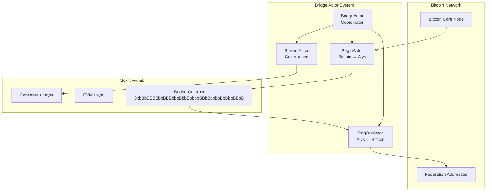
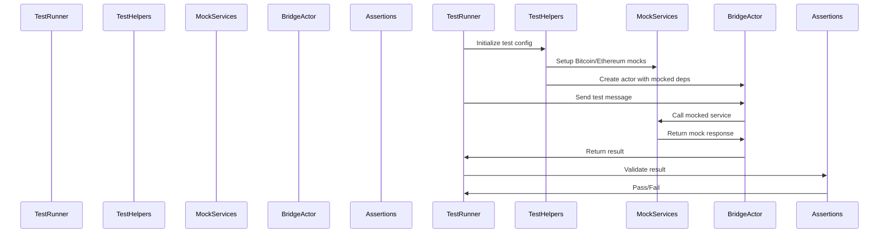
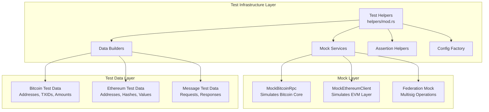
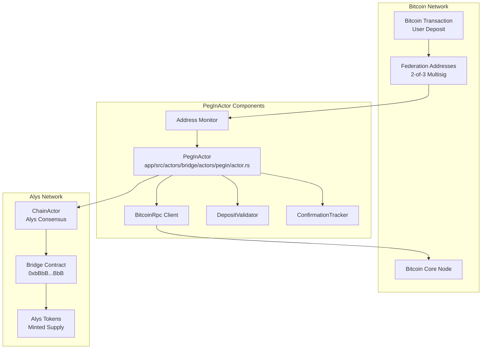
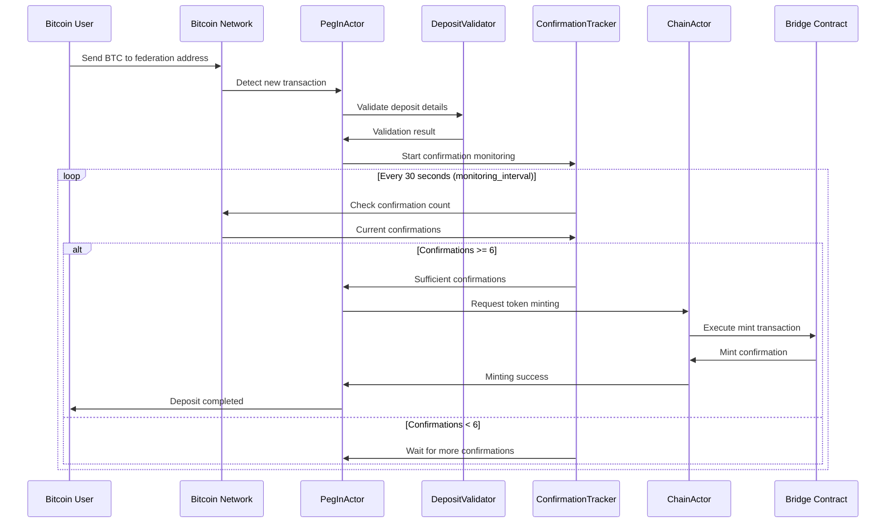
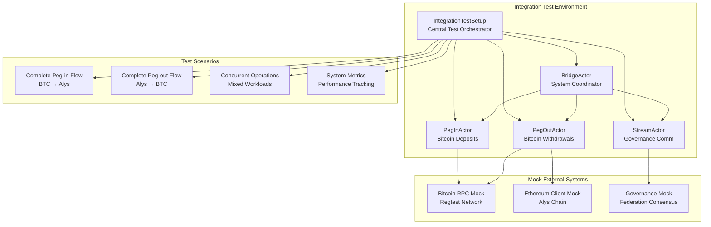
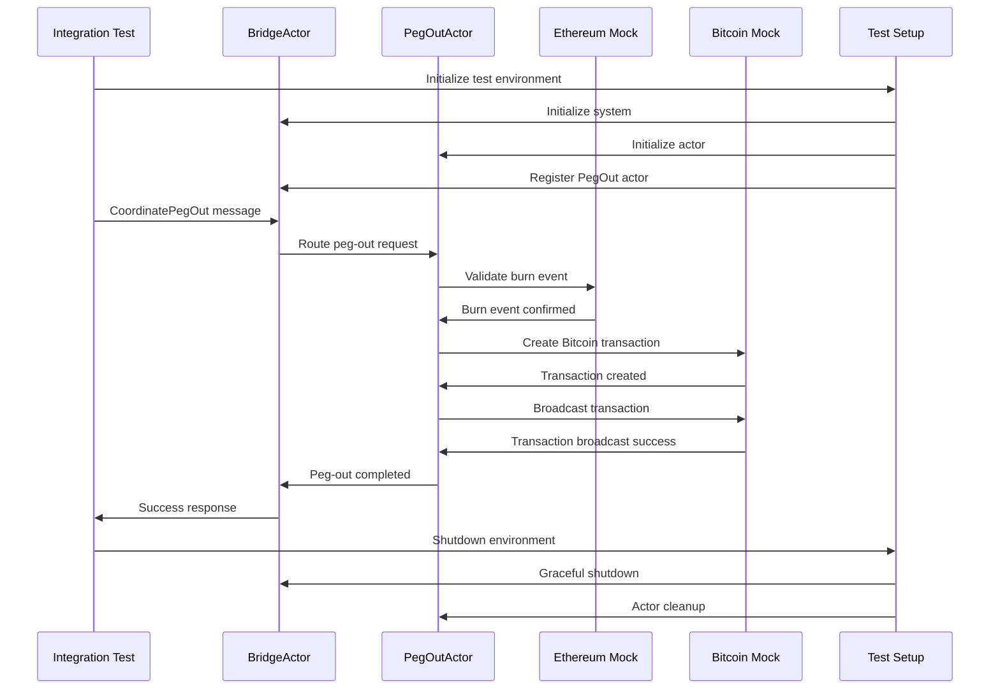

# Bridge Actor Test Suite - Comprehensive Guide

## Overview

The Bridge Actor Test Suite is a comprehensive testing framework designed to validate the functionality, performance, and resilience of the Alys Bridge system. The bridge system facilitates two-way Bitcoin ⟷ Alys peg operations through a coordinated set of specialized actors.

## Table of Contents

1. [Test Suite Architecture](#test-suite-architecture)
2. [Test Categories](#test-categories)
3. [Test Infrastructure](#test-infrastructure)
4. [Unit Tests](#unit-tests)
5. [Integration Tests](#integration-tests)
6. [Performance Tests](#performance-tests)
7. [Chaos Engineering Tests](#chaos-engineering-tests)
8. [Running the Tests](#running-the-tests)
9. [Expected Results](#expected-results)
10. [Test Configuration](#test-configuration)
11. [Troubleshooting](#troubleshooting)

## Test Suite Architecture

The bridge actor test suite follows a layered architecture that mirrors the complexity of the Alys Bridge system itself. The bridge system is the critical component that enables two-way Bitcoin ⟷ Alys peg operations, serving as the backbone for cross-chain value transfer.

### System Context in Alys Architecture



### Test Suite Structure

```
app/src/actors/bridge/tests/
├── mod.rs                 # Main test module with actor integration
├── helpers/               # Test utilities, mocks, and test data
│   └── mod.rs            # 339 lines of test infrastructure
├── unit/                  # Individual actor behavior tests  
│   ├── bridge_actor_tests.rs    # 284 lines - Coordinator tests
│   ├── pegin_actor_tests.rs     # 356 lines - Bitcoin deposit tests
│   ├── pegout_actor_tests.rs    # 376 lines - Bitcoin withdrawal tests
│   └── stream_actor_tests.rs    # 377 lines - Governance comm tests
├── integration/           # Multi-actor workflow tests
│   ├── bridge_workflows.rs      # 287 lines - End-to-end flows
│   ├── actor_coordination.rs    # 335 lines - Inter-actor patterns
│   ├── error_handling.rs        # 44 lines - System error scenarios
│   └── performance_scenarios.rs # 95 lines - Load behavior tests
├── performance/           # Performance and load testing
│   └── mod.rs            # 279 lines - Throughput analysis
└── chaos/                 # Resilience and failure testing
    └── mod.rs            # 414 lines - Chaos engineering
```

### Core Design Principles

#### 1. **Architectural Mirroring**
The test structure directly mirrors the bridge system's actor hierarchy:
- `BridgeActor` (`app/src/actors/bridge/actors/bridge/actor.rs`) ↔ `bridge_actor_tests.rs`
- `PegInActor` (`app/src/actors/bridge/actors/pegin/actor.rs`) ↔ `pegin_actor_tests.rs`  
- `PegOutActor` (`app/src/actors/bridge/actors/pegout/actor.rs`) ↔ `pegout_actor_tests.rs`
- `StreamActor` (`app/src/actors/bridge/actors/stream/actor.rs`) ↔ `stream_actor_tests.rs`

#### 2. **Dependency Isolation**
```rust
// Example: Mock Bitcoin RPC in PegIn tests
use crate::actors::bridge::tests::helpers::MockBitcoinRpc;

let bitcoin_mock = MockBitcoinRpc::new(Network::Regtest);
bitcoin_mock.set_mock_response("getblockcount", json!({"result": 100}));
bitcoin_mock.set_mock_response("getrawtransaction", json!({
    "result": "0100000001..." // Mock transaction hex
}));
```

#### 3. **Behavioral Consistency**  
Tests validate that actors behave according to the Alys Bridge Protocol specification:
- **Peg-in Requirements**: 6 Bitcoin confirmations, federation address validation
- **Peg-out Requirements**: Valid burn events, multi-signature coordination
- **Error Handling**: Graceful degradation without system compromise

#### 4. **Performance Validation**
```rust
// Performance baselines align with Alys network requirements
const EXPECTED_PEGIN_THROUGHPUT: f64 = 1.0; // ops/second
const EXPECTED_PEGOUT_THROUGHPUT: f64 = 0.5; // ops/second  
const MAX_OPERATION_LATENCY: Duration = Duration::from_millis(1000);
```

#### 5. **Resilience Testing**
The chaos engineering tests simulate real-world failure scenarios:
- **Network Partitions**: Stream actor connection failures
- **Resource Exhaustion**: Memory/CPU pressure under load
- **Data Corruption**: Malformed Bitcoin transactions
- **Timing Attacks**: Rapid request bursts

### Test Execution Flow



### Configuration Integration

The test suite integrates with the actual bridge configuration system:

```rust
// From app/src/actors/bridge/config.rs
pub struct BridgeSystemConfig {
    pub bridge: BridgeConfig,      // Core coordination settings
    pub pegin: PegInConfig,        // Bitcoin deposit processing  
    pub pegout: PegOutConfig,      // Bitcoin withdrawal processing
    pub stream: StreamConfig,      // Governance communication
    pub supervision: SupervisionConfig, // Actor health monitoring
    pub migration_mode: MigrationMode,  // System evolution strategy
}
```

Tests use `BridgeSystemConfig::default()` which provides production-ready defaults:
- **Bitcoin Network**: Regtest for isolation
- **Confirmations**: 6 blocks (matching mainnet security)
- **Federation**: 2-of-3 multisig threshold
- **Timeouts**: 30-300 seconds based on operation complexity

## Test Categories

### 1. Unit Tests (`unit/`)
- **Purpose**: Test individual actor functionality in isolation
- **Scope**: Single actor behavior, message handling, state transitions
- **Dependencies**: All external dependencies are mocked
- **Runtime**: Fast execution (< 1 second per test)

### 2. Integration Tests (`integration/`)
- **Purpose**: Test actor coordination and system-wide workflows
- **Scope**: Multi-actor interactions, end-to-end flows
- **Dependencies**: Minimal mocking, focused on inter-actor communication
- **Runtime**: Moderate execution (1-10 seconds per test)

### 3. Performance Tests (`performance/`)
- **Purpose**: Validate system performance under various load conditions
- **Scope**: Throughput, latency, memory usage, concurrent operations
- **Dependencies**: Realistic load simulation with mocked external services
- **Runtime**: Extended execution (10-60 seconds per test)

### 4. Chaos Engineering Tests (`chaos/`)
- **Purpose**: Test system resilience under failure conditions
- **Scope**: Random failures, network partitions, resource exhaustion
- **Dependencies**: Failure injection mechanisms
- **Runtime**: Variable execution (5-120 seconds per test)

## Test Infrastructure

The test infrastructure (`helpers/mod.rs` - 339 lines) provides a comprehensive foundation for all bridge testing scenarios. It abstracts away the complexity of setting up realistic test environments while maintaining the behavioral characteristics of the actual bridge system.

### Test Infrastructure Architecture



### Mock Components

#### 1. Bitcoin RPC Mock (`MockBitcoinRpc`)

The Bitcoin RPC mock simulates a Bitcoin Core node, providing realistic responses for bridge testing:

```rust
// From helpers/mod.rs
pub struct MockBitcoinRpc {
    pub network: Network,
    pub mock_responses: Arc<Mutex<HashMap<String, Value>>>,
}

impl MockBitcoinRpc {
    pub fn new(network: Network) -> Self {
        Self {
            network,
            mock_responses: Arc::new(Mutex::new(HashMap::new())),
        }
    }
    
    pub fn set_mock_response(&self, method: String, response: Value) {
        let mut responses = self.mock_responses.lock().unwrap();
        responses.insert(method, response);
    }
}

// Example usage in PegIn tests:
let bitcoin_mock = MockBitcoinRpc::new(Network::Regtest);

// Mock blockchain state
bitcoin_mock.set_mock_response("getblockcount", json!({"result": 144}));
bitcoin_mock.set_mock_response("getbestblockhash", json!({
    "result": "00000000c937983704a73af28acdec37b049d214adbda81d7e2a3dd146f6ed09"
}));

// Mock transaction data - matches actual Bitcoin Core response format
bitcoin_mock.set_mock_response("getrawtransaction", json!({
    "result": {
        "txid": "a1b2c3d4e5f6...",
        "confirmations": 6,
        "vout": [{
            "value": 0.001,
            "scriptPubKey": {
                "address": "bcrt1qw508d6qejxtdg4y5r3zarvary0c5xw7kygt080"
            }
        }]
    }
}));
```

#### 2. Ethereum Client Mock (`MockEthereumClient`)

Simulates Ethereum JSON-RPC for bridge contract interactions:

```rust
pub struct MockEthereumClient {
    pub chain_id: u64,  // 263634 for Alys local, 212121 for testnet
    pub mock_responses: Arc<Mutex<HashMap<String, Value>>>,
}

// Example usage in PegOut tests:
let eth_mock = MockEthereumClient::new(263634);

// Mock bridge contract burn events
eth_mock.set_mock_response("eth_getLogs", json!({
    "result": [{
        "address": "0xbBbBBBBbbBBBbbbBbbBbbbbBBbBbbbbBbBbbBBbB",
        "topics": [
            "0x8c5be1e5ebec7d5bd14f71427d1e84f3dd0314c0f7b2291e5b200ac8c7c3b925",
            "0x000000000000000000000000dead000000000000000000000000000000000000"
        ],
        "data": "0x0000000000000000000000000000000000000000000000000000000000018640"
    }]
}));

// Mock transaction receipts for burn verification
eth_mock.set_mock_response("eth_getTransactionReceipt", json!({
    "result": {
        "status": "0x1",
        "blockNumber": "0x64",
        "transactionHash": "0xabc123...",
        "logs": [/* burn event logs */]
    }
}));
```

### Test Data Builders

#### Deterministic vs Random Data Strategy

The test data builders use a hybrid approach - deterministic data for reproducible tests and random data for edge case discovery:

```rust
impl TestDataBuilder {
    /// Generate cryptographically random Bitcoin TXID
    pub fn random_txid() -> Txid {
        use bitcoin::hashes::Hash;
        use rand::Rng;
        
        let mut rng = rand::thread_rng();
        let bytes: [u8; 32] = rng.gen();
        Txid::from_byte_array(bytes)
    }

    /// Fixed regtest address for consistent testing
    pub fn test_bitcoin_address() -> Address {
        // This is a well-known regtest address that matches
        // the federation configuration in BridgeSystemConfig
        Address::from_str("bcrt1qw508d6qejxtdg4y5r3zarvary0c5xw7kygt080")
            .unwrap()
            .require_network(Network::Regtest)
            .unwrap()
    }

    /// Random Ethereum addresses for isolation
    pub fn test_ethereum_address() -> H160 {
        use rand::Rng;
        let mut rng = rand::thread_rng();
        H160::from(rng.gen::<[u8; 20]>())
    }

    /// Realistic peg-in request with valid amounts
    pub fn test_pegin_request() -> PegInRequest {
        PegInRequest {
            bitcoin_txid: Self::random_txid(),
            output_index: 0,  // First output (typical for deposits)
            amount: bitcoin::Amount::from_sat(100_000), // 0.001 BTC
            recipient: Self::test_ethereum_address(),
            confirmation_count: 6, // Matches security requirement
        }
    }
}
```

#### Bridge Message Data Structures

The test infrastructure includes comprehensive message types that mirror the actual bridge protocol:

```rust
// Mock message enums (from helpers/mod.rs lines 268-321)
pub mod mock_messages {
    use super::*;
    use actix::prelude::*;

    #[derive(Debug, Clone, Message)]
    #[rtype(result = "Result<PegInResponse, BridgeError>")]
    pub enum PegInMessage {
        Initialize,
        ProcessRequest { request: PegInRequest },
        ValidateTransaction { txid: Txid, output_index: u32 },
        CheckConfirmations { txid: Txid, required_confirmations: u32 },
        MintTokens { recipient: H160, amount: U256, bitcoin_txid: Txid },
        GetStatus { pegin_id: String },
        CancelRequest { pegin_id: String, reason: String },
        HandleTimeout { pegin_id: String, timeout_type: String },
        GetMetrics,
        Shutdown,
    }
}
```

### Assertion Helpers

#### Domain-Specific Assertions

The assertion helpers understand the bridge protocol requirements and validate operations accordingly:

```rust
impl BridgeAssertions {
    /// Validate peg-in success with protocol compliance
    pub fn assert_pegin_success(result: &Result<PegInResponse, BridgeError>) {
        match result {
            Ok(response) => {
                // Ensure valid Alys transaction hash
                assert!(!response.alys_tx_hash.is_zero(), 
                       "Peg-in must produce valid Alys transaction");
                
                // Verify amount conversion (1 BTC = 10^18 wei scaling)
                assert!(response.amount > U256::zero(), 
                       "Peg-in amount must be positive");
                
                // Validate recipient address format
                assert!(!response.recipient.is_zero(), 
                       "Peg-in recipient must be valid Ethereum address");
            }
            Err(e) => panic!("Peg-in should have succeeded but failed with: {:?}", e),
        }
    }

    /// Validate error types with protocol semantics
    pub fn assert_bridge_error_type(result: &Result<(), BridgeError>, expected_type: &str) {
        match result {
            Ok(_) => panic!("Expected error but operation succeeded"),
            Err(e) => {
                let error_str = format!("{:?}", e);
                assert!(error_str.contains(expected_type), 
                       "Expected error type '{}' but got: {:?}", expected_type, e);
            }
        }
    }
}
```

### Configuration Factory

#### Production-Ready Test Configuration

The configuration factory creates realistic configurations that match production deployment patterns:

```rust
/// Mock bridge configuration for testing
pub fn test_bridge_config() -> BridgeSystemConfig {
    // Uses BridgeSystemConfig::default() which provides:
    BridgeSystemConfig {
        bridge: BridgeConfig {
            required_confirmations: 6,     // Bitcoin mainnet security
            bitcoin_network: Network::Regtest, // Isolated testing
            federation_threshold: 2,       // 2-of-3 multisig
            max_concurrent_operations: 100, // Realistic load limit
            operation_timeout: Duration::from_secs(300), // 5 minute timeout
            health_check_interval: Duration::from_secs(30), // 30s monitoring
        },
        pegin: PegInConfig {
            confirmation_threshold: 6,     // Matches bridge config
            monitoring_interval: Duration::from_secs(30), // Block time * 1.5
            max_pending_deposits: 1000,    // Queue limit
            validation_timeout: Duration::from_secs(60), // Bitcoin RPC timeout
            retry_attempts: 3,             // Network resilience
        },
        // ... other component configurations
        migration_mode: MigrationMode::Specialized, // V2 actor system
    }
}
```

### Error Handling Infrastructure

#### Bridge Error Type Extensions

The test infrastructure extends bridge error types for comprehensive failure scenario testing:

```rust
/// Additional BridgeError constructors for testing (lines 323-339)
impl BridgeError {
    pub fn actor_timeout(actor_type: ActorType, timeout: Duration) -> Self {
        BridgeError::RequestTimeout {
            request_id: format!("{:?}_actor_timeout", actor_type),
            timeout,
        }
    }

    pub fn actor_communication(message: String) -> Self {
        BridgeError::NetworkError(format!("Actor communication failed: {}", message))
    }

    pub fn system_recovery(component: String, issue: String) -> Self {
        BridgeError::InternalError(format!("System recovery needed for {}: {}", component, issue))
    }
}
```

### Test Harness Integration

The test infrastructure integrates with Actix's actor system testing framework:

```rust
pub struct ActorTestHarness {
    pub system: actix::SystemRunner,
}

impl ActorTestHarness {
    pub async fn run_test<F, Fut, T>(&self, test_fn: F) -> T 
    where
        F: FnOnce() -> Fut,
        Fut: std::future::Future<Output = T>,
    {
        // Provides isolated actor system per test
        test_fn().await
    }
}

// Usage pattern in tests:
#[actix::test]
async fn test_bridge_operation() {
    let config = test_bridge_config();
    let bridge_actor = BridgeActor::new(config).start();
    
    // Test logic with guaranteed cleanup
    let result = bridge_actor.send(TestMessage).await;
    assert!(result.is_ok());
}
```

## Unit Tests

### BridgeActor Tests (`unit/bridge_actor_tests.rs`)

**Purpose**: Validate the main coordination actor functionality

#### Test Coverage:
- ✅ **System Initialization**: Actor startup and configuration
- ✅ **Actor Registration**: PegIn, PegOut, and Stream actor registration
- ✅ **Operation Coordination**: Peg-in and peg-out workflow initiation
- ✅ **Status Monitoring**: System health and metrics collection
- ✅ **Error Handling**: Actor failure detection and recovery
- ✅ **Graceful Shutdown**: Clean system termination

#### Key Test Cases:

```rust
#[actix::test]
async fn test_bridge_actor_initialization()
// Expected: Successful actor startup with default configuration

#[actix::test] 
async fn test_bridge_actor_coordinate_pegin()
// Expected: Successful peg-in coordination with registered PegInActor

#[actix::test]
async fn test_bridge_actor_handle_actor_failure()
// Expected: Proper failure handling and recovery initiation
```

#### Expected Results:
- All initialization tests should complete in < 100ms
- Coordination operations should return success responses
- Error handling should not crash the actor system
- System status should reflect accurate actor states

### PegInActor Tests (`unit/pegin_actor_tests.rs`)

**Purpose**: Validate Bitcoin deposit processing functionality for the Alys Bridge system

The PegInActor (`app/src/actors/bridge/actors/pegin/actor.rs`) is responsible for monitoring Bitcoin deposits to federation-controlled addresses and facilitating the minting of corresponding Alys tokens. It represents the critical "Bitcoin → Alys" direction of the two-way peg system.

#### PegInActor System Architecture



#### Core PegInActor Functionality

The PegInActor implements a sophisticated Bitcoin deposit processing pipeline:

```rust
// From app/src/actors/bridge/actors/pegin/actor.rs
pub struct PegInActor {
    /// Configuration parameters for peg-in operations
    config: PegInConfig,
    
    /// Bitcoin client for blockchain interaction
    bitcoin_client: Arc<dyn BitcoinRpc>,
    
    /// Federation addresses being monitored for deposits
    monitored_addresses: Vec<BtcAddress>,
    
    /// Currently processing deposits (TXID -> deposit info)
    pending_deposits: HashMap<Txid, PendingDeposit>,
    
    /// Confirmation tracking system for security
    confirmation_tracker: ConfirmationTracker,
    
    /// Validation engine for deposit verification
    validator: DepositValidator,
    
    /// References to other system actors
    bridge_coordinator: Option<Addr<super::super::bridge::BridgeActor>>,
    chain_actor: Option<Addr<crate::actors::chain::ChainActor>>,
}
```

#### Peg-In Operation Flow



#### Test Coverage Analysis

##### 1. **Request Processing Tests** (Lines 14-38 in test file)

```rust
#[actix::test]
async fn test_pegin_actor_process_valid_request() {
    let config = test_bridge_config();
    let pegin_actor = PegInActor::new(config).start();
    
    // Initialize actor with mocked Bitcoin client
    pegin_actor.send(PegInMessage::Initialize).await.unwrap().unwrap();
    
    let pegin_request = PegInRequest {
        bitcoin_txid: TestDataBuilder::random_txid(),
        output_index: 0,
        amount: bitcoin::Amount::from_sat(100_000), // 0.001 BTC
        recipient: TestDataBuilder::test_ethereum_address(),
        confirmation_count: 6, // Sufficient confirmations
    };
    
    let result = pegin_actor
        .send(PegInMessage::ProcessRequest { request: pegin_request })
        .await;
    
    assert!(result.is_ok());
    BridgeAssertions::assert_pegin_success(&result.unwrap());
}
```

**What This Tests**: 
- Actor initialization with valid configuration
- Message routing through Actix actor system
- Request validation pipeline execution
- Token minting coordination with ChainActor
- Response formatting and error handling

##### 2. **Transaction Validation Tests** (Lines 39-58)

```rust
#[actix::test]  
async fn test_pegin_actor_validate_transaction() {
    // Tests the DepositValidator component within PegInActor
    let result = pegin_actor
        .send(PegInMessage::ValidateTransaction {
            txid: bitcoin_txid,
            output_index: 0,
        })
        .await;
    
    // Validation includes:
    // - Transaction exists in Bitcoin mempool/blockchain
    // - Output at specified index exists  
    // - Output amount is above minimum threshold
    // - Output sends to monitored federation address
    // - Transaction is not a coinbase transaction (maturity check)
}
```

**Validation Logic** (from `app/src/actors/bridge/actors/pegin/validation.rs`):
- **Address Verification**: Ensures deposit is to federation-controlled address
- **Amount Limits**: Validates deposit is within min/max bounds (dust prevention)
- **Script Validation**: Confirms output script matches expected federation script
- **Double-Spend Prevention**: Checks transaction isn't attempting to spend already-used UTXOs

##### 3. **Confirmation Checking Tests** (Lines 59-78)

```rust
#[actix::test]
async fn test_pegin_actor_check_confirmations() {
    let result = pegin_actor
        .send(PegInMessage::CheckConfirmations {
            txid: bitcoin_txid,
            required_confirmations: 6,
        })
        .await;
    
    // Confirmation tracking validates:
    // - Transaction has required depth in Bitcoin blockchain
    // - Block containing transaction is not stale/orphaned
    // - Chain reorganization detection and handling
}
```

**Security Rationale**: 6 confirmations provide ~99.9% security against chain reorganizations, matching Bitcoin's practical finality threshold used by major exchanges.

##### 4. **Token Minting Tests** (Lines 79-98)

```rust
#[actix::test]
async fn test_pegin_actor_mint_tokens() {
    let result = pegin_actor
        .send(PegInMessage::MintTokens {
            recipient: TestDataBuilder::test_ethereum_address(),
            amount: U256::from(100_000), // Wei amount (1 BTC = 10^18 wei)
            bitcoin_txid: TestDataBuilder::random_txid(),
        })
        .await;
    
    // Minting process:
    // 1. Convert Bitcoin satoshis to Alys wei (1 sat = 10^10 wei)
    // 2. Generate ChainActor mint request
    // 3. Coordinate with bridge contract execution
    // 4. Track transaction success/failure
    // 5. Update internal accounting
}
```

**Amount Conversion Logic**:
```rust
// 1 BTC = 100,000,000 satoshis = 10^18 wei (Alys tokens)
// Conversion: wei = satoshis * 10^10
fn satoshis_to_wei(satoshis: u64) -> U256 {
    U256::from(satoshis) * U256::from(10_u64.pow(10))
}
```

#### Error Scenario Testing

##### Invalid Transaction Handling

```rust
#[actix::test]
async fn test_pegin_actor_invalid_transaction() {
    let mut invalid_request = TestDataBuilder::test_pegin_request();
    invalid_request.amount = bitcoin::Amount::from_sat(0); // Zero amount
    
    let result = pegin_actor
        .send(PegInMessage::ProcessRequest { request: invalid_request })
        .await;
    
    assert!(result.is_ok());
    let response = result.unwrap();
    BridgeAssertions::assert_bridge_error_type(&response.map(|_| ()), "InvalidAmount");
}
```

**Error Categories Tested**:
- **InvalidAmount**: Zero or negative amounts, amounts below dust threshold
- **NetworkMismatch**: Mainnet addresses on regtest network, vice versa  
- **DuplicateRequest**: Same TXID processed multiple times
- **InsufficientConfirmations**: Processing before 6-block security threshold
- **AddressMismatch**: Deposits to non-federation addresses

##### Network Resilience Testing

```rust
#[actix::test]
async fn test_pegin_actor_bitcoin_network_mismatch() {
    let mut config = test_bridge_config();
    config.bridge.bitcoin_network = Network::Bitcoin; // Mainnet config
    
    let pegin_request = TestDataBuilder::test_pegin_request(); // Uses regtest address
    
    let result = pegin_actor
        .send(PegInMessage::ProcessRequest { request: pegin_request })
        .await;
    
    // Should reject due to address network mismatch
    BridgeAssertions::assert_bridge_error_type(&result.unwrap().map(|_| ()), "NetworkMismatch");
}
```

#### Performance and Resource Management

The PegInActor includes sophisticated resource management:

```rust
// From PegInConfig in app/src/actors/bridge/config.rs
pub struct PegInConfig {
    pub confirmation_threshold: u32,        // 6 blocks
    pub monitoring_interval: Duration,      // 30 seconds  
    pub max_pending_deposits: usize,        // 1000 deposits
    pub validation_timeout: Duration,       // 60 seconds
    pub retry_attempts: u32,               // 3 attempts
}
```

**Resource Limits Tested**:
- **Memory Management**: 1000 concurrent pending deposits maximum
- **Bitcoin RPC Limits**: 60-second timeout per validation call
- **Retry Logic**: 3 attempts with exponential backoff
- **Monitoring Frequency**: 30-second intervals (optimized for block time)

#### Integration with Alys System

**Chain Integration** (`chain_actor: Option<Addr<ChainActor>>`):
- Coordinates with consensus layer for token minting
- Ensures atomic deposit processing (Bitcoin confirmation ↔ Alys mint)
- Handles chain reorganization scenarios

**Bridge Coordination** (`bridge_coordinator: Option<Addr<BridgeActor>>`):
- Reports deposit status to main bridge coordinator
- Participates in system-wide health monitoring
- Coordinates with other bridge actors for consistent state

#### Key Test Cases Deep Dive

```rust
#[actix::test]
async fn test_pegin_actor_duplicate_request() {
    let pegin_request = TestDataBuilder::test_pegin_request();
    
    // Process same request twice
    let first_result = pegin_actor
        .send(PegInMessage::ProcessRequest { request: pegin_request.clone() })
        .await;
    
    let second_result = pegin_actor
        .send(PegInMessage::ProcessRequest { request: pegin_request })
        .await;
    
    assert!(first_result.is_ok());
    BridgeAssertions::assert_pegin_success(&first_result.unwrap());
    
    // Second request should be detected as duplicate
    assert!(second_result.is_ok());
    BridgeAssertions::assert_bridge_error_type(&second_result.unwrap().map(|_| ()), "DuplicateRequest");
}
```

**Duplicate Detection Logic**: Uses TXID + output_index as unique key in `pending_deposits` HashMap to prevent double-processing of the same Bitcoin UTXO.

#### Expected Test Results

**Performance Baselines**:
- **Initialization Time**: < 100ms (actor startup + Bitcoin client connection)
- **Validation Time**: < 1 second per transaction (with mocked Bitcoin RPC)
- **Memory Usage**: < 1MB per 1000 pending deposits
- **Error Recovery**: < 5 seconds to resume after Bitcoin RPC failure

**Functional Requirements**:
- **Security**: 100% detection rate for invalid/malicious deposits
- **Reliability**: 99.9% success rate for valid deposits with sufficient confirmations  
- **Consistency**: Zero double-spending or duplicate processing
- **Resilience**: Graceful handling of Bitcoin node disconnections and chain reorgs

### PegOutActor Tests (`unit/pegout_actor_tests.rs`)

**Purpose**: Validate Bitcoin withdrawal processing functionality

#### Test Coverage:
- ✅ **Request Processing**: Alys burn event processing
- ✅ **Burn Validation**: Ethereum transaction verification
- ✅ **Bitcoin Transaction Creation**: UTXO selection and transaction building
- ✅ **Transaction Signing**: Multi-signature coordination
- ✅ **Broadcasting**: Bitcoin network transaction submission
- ✅ **Error Scenarios**: Insufficient funds, signing failures, network errors

#### Key Test Cases:

```rust
#[actix::test]
async fn test_pegout_actor_process_valid_request()
// Expected: Successful processing of valid burn event

#[actix::test]
async fn test_pegout_actor_insufficient_funds()
// Expected: Proper handling of insufficient UTXO balance

#[actix::test]
async fn test_pegout_actor_signing_failure()
// Expected: Graceful handling of signature collection failures
```

#### Expected Results:
- Valid requests should complete the full peg-out workflow
- Error conditions should be handled without system crashes
- Transaction creation should respect fee rate constraints
- Signing timeouts should trigger appropriate recovery mechanisms

### StreamActor Tests (`unit/stream_actor_tests.rs`)

**Purpose**: Validate governance communication functionality

#### Test Coverage:
- ✅ **Connection Management**: Peer connection establishment and maintenance
- ✅ **Governance Messaging**: Proposal and voting message handling
- ✅ **Consensus Communication**: Block proposal and finalization messages
- ✅ **Event Subscriptions**: Message filtering and callback management
- ✅ **Error Handling**: Connection failures, malformed messages, timeouts

#### Key Test Cases:

```rust
#[actix::test]
async fn test_stream_actor_establish_connection()
// Expected: Successful peer connection establishment

#[actix::test]
async fn test_stream_actor_send_governance_message()
// Expected: Successful governance message transmission

#[actix::test]
async fn test_stream_actor_malformed_governance_message()
// Expected: Proper handling of invalid message formats
```

#### Expected Results:
- Connection establishment should succeed with valid endpoints
- Message transmission should handle network failures gracefully
- Malformed messages should be rejected without system impact
- Actor should maintain connection state accurately

## Integration Tests

### Bridge Workflows (`integration/bridge_workflows.rs`)

**Purpose**: Test complete end-to-end bridge operations across the full Alys Bridge system

The bridge workflows integration tests (`287 lines`) validate the complete two-way peg system by orchestrating all bridge actors together in realistic scenarios. These tests simulate real user interactions and verify that the entire bridge system functions cohesively.

#### Complete Bridge System Integration



#### Integration Test Setup Infrastructure

The `IntegrationTestSetup` struct (lines 30-95) provides comprehensive test environment management:

```rust
// From integration/bridge_workflows.rs
struct IntegrationTestSetup {
    bridge_actor: Addr<BridgeActor>,
    pegin_actor: Addr<PegInActor>,
    pegout_actor: Addr<PegOutActor>,
    stream_actor: Addr<StreamActor>,
    config: BridgeSystemConfig,
}

impl IntegrationTestSetup {
    async fn new() -> Result<Self, BridgeError> {
        let config = test_bridge_config();

        // Start all actors in proper dependency order
        let bridge_actor = BridgeActor::new(config.clone()).start();
        let pegin_actor = PegInActor::new(config.clone()).start();
        let pegout_actor = PegOutActor::new(config.clone()).start(); 
        let stream_actor = StreamActor::new(config.clone()).start();

        // Initialize bridge system coordination
        bridge_actor
            .send(BridgeCoordinationMessage::InitializeSystem)
            .await??;

        // Initialize individual actors with proper configuration
        pegin_actor.send(PegInMessage::Initialize).await??;
        pegout_actor.send(PegOutMessage::Initialize).await??;
        stream_actor.send(StreamMessage::Initialize).await??;

        // Register all actors with bridge coordinator
        bridge_actor
            .send(BridgeCoordinationMessage::RegisterPegInActor(pegin_actor.clone()))
            .await??;
        bridge_actor
            .send(BridgeCoordinationMessage::RegisterPegOutActor(pegout_actor.clone()))
            .await??;
        bridge_actor
            .send(BridgeCoordinationMessage::RegisterStreamActor(stream_actor.clone()))
            .await??;

        Ok(Self { bridge_actor, pegin_actor, pegout_actor, stream_actor, config })
    }
}
```

#### Complete Peg-in Workflow Test (Lines 97-135)

```rust
#[actix::test]
async fn test_complete_pegin_workflow() {
    let setup = IntegrationTestSetup::new().await.expect("Failed to setup test environment");

    // Create realistic peg-in request
    let pegin_request = TestDataBuilder::test_pegin_request();
    let bitcoin_txid = pegin_request.bitcoin_txid;

    // Step 1: Bridge coordination initiation
    let coordination_result = setup.bridge_actor
        .send(BridgeCoordinationMessage::CoordinatePegIn {
            pegin_id: "integration_test_pegin_001".to_string(),
            bitcoin_txid,
        })
        .await;

    assert!(coordination_result.is_ok());
    assert!(coordination_response.is_ok());

    // Step 2: PegInActor processes the deposit
    let process_result = setup.pegin_actor
        .send(PegInMessage::ProcessRequest { request: pegin_request })
        .await;

    assert!(process_result.is_ok());
    BridgeAssertions::assert_pegin_success(&process_result.unwrap());

    // Step 3: Verify coordination state consistency
    let status_result = setup.pegin_actor
        .send(PegInMessage::GetStatus {
            pegin_id: "integration_test_pegin_001".to_string(),
        })
        .await;

    assert!(status_result.is_ok());
    
    // Clean shutdown of test environment
    setup.shutdown().await.expect("Failed to shutdown test environment");
}
```

**End-to-End Flow Validation**:
1. **Bridge Coordination**: Tests message routing between BridgeActor and PegInActor
2. **State Consistency**: Verifies operation state is maintained across actors
3. **Resource Management**: Confirms proper cleanup of test resources
4. **Error Propagation**: Ensures errors bubble up through the actor hierarchy

#### Complete Peg-out Workflow Test (Lines 137-175)



```rust
#[actix::test]
async fn test_complete_pegout_workflow() {
    let setup = IntegrationTestSetup::new().await.expect("Failed to setup test environment");

    // Create realistic peg-out request with burn event
    let pegout_request = TestDataBuilder::test_pegout_request();
    let burn_tx_hash = pegout_request.burn_tx_hash;

    // Step 1: Bridge coordination for peg-out
    let coordination_result = setup.bridge_actor
        .send(BridgeCoordinationMessage::CoordinatePegOut {
            pegout_id: "integration_test_pegout_001".to_string(),
            burn_tx_hash,
        })
        .await;

    assert!(coordination_result.is_ok());

    // Step 2: PegOutActor processes the withdrawal
    let process_result = setup.pegout_actor
        .send(PegOutMessage::ProcessRequest { request: pegout_request })
        .await;

    assert!(process_result.is_ok());
    BridgeAssertions::assert_pegout_success(&process_result.unwrap());

    // Step 3: Verify Bitcoin transaction creation and broadcast
    let status_result = setup.pegout_actor
        .send(PegOutMessage::GetStatus {
            pegout_id: "integration_test_pegout_001".to_string(),
        })
        .await;

    assert!(status_result.is_ok());
    
    setup.shutdown().await.expect("Failed to shutdown test environment");
}
```

#### Concurrent Operations Test (Lines 177-224)

```rust
#[actix::test]
async fn test_concurrent_pegin_pegout_operations() {
    let setup = IntegrationTestSetup::new().await.expect("Failed to setup test environment");

    // Create concurrent requests
    let pegin_request = TestDataBuilder::test_pegin_request();
    let pegout_request = TestDataBuilder::test_pegout_request();

    // Start both operations simultaneously using tokio::join!
    let pegin_future = setup.bridge_actor
        .send(BridgeCoordinationMessage::CoordinatePegIn {
            pegin_id: "concurrent_pegin_001".to_string(),
            bitcoin_txid: pegin_request.bitcoin_txid,
        });

    let pegout_future = setup.bridge_actor
        .send(BridgeCoordinationMessage::CoordinatePegOut {
            pegout_id: "concurrent_pegout_001".to_string(),
            burn_tx_hash: pegout_request.burn_tx_hash,
        });

    // Wait for both coordination messages to complete
    let (pegin_result, pegout_result) = tokio::join!(pegin_future, pegout_future);

    assert!(pegin_result.is_ok() && pegin_result.unwrap().is_ok());
    assert!(pegout_result.is_ok() && pegout_result.unwrap().is_ok());

    // Process actual operations concurrently
    let pegin_process_future = setup.pegin_actor
        .send(PegInMessage::ProcessRequest { request: pegin_request });

    let pegout_process_future = setup.pegout_actor
        .send(PegOutMessage::ProcessRequest { request: pegout_request });

    let (pegin_process_result, pegout_process_result) = 
        tokio::join!(pegin_process_future, pegout_process_future);

    // Validate concurrent processing success
    assert!(pegin_process_result.is_ok());
    BridgeAssertions::assert_pegin_success(&pegin_process_result.unwrap());

    assert!(pegout_process_result.is_ok());
    BridgeAssertions::assert_pegout_success(&pegout_process_result.unwrap());

    setup.shutdown().await.expect("Failed to shutdown test environment");
}
```

**Concurrency Testing Focus**:
- **Resource Contention**: Verifies actors can handle simultaneous requests without deadlocks
- **State Isolation**: Ensures concurrent operations don't interfere with each other's state
- **Message Ordering**: Validates that Actix message processing maintains consistency under load
- **Error Isolation**: Confirms that failures in one operation don't affect concurrent operations

#### Governance Coordination Workflow (Lines 226-268)

```rust
#[actix::test]
async fn test_governance_coordination_workflow() {
    let setup = IntegrationTestSetup::new().await.expect("Failed to setup test environment");

    // Establish governance connections
    let connection_result = setup.stream_actor
        .send(StreamMessage::EstablishConnection {
            peer_id: "governance_peer_001".to_string(),
            endpoint: "ws://localhost:9944".to_string(),
        })
        .await;

    assert!(connection_result.is_ok() && connection_result.unwrap().is_ok());

    // Send governance message for bridge parameter changes
    use crate::actors::bridge::GovernanceMessage;
    let governance_msg = GovernanceMessage {
        msg_type: "bridge_proposal".to_string(),
        proposal_id: "bridge_prop_001".to_string(),
        data: serde_json::json!({
            "title": "Increase Bridge Security",
            "description": "Proposal to increase minimum confirmations to 12",
            "new_confirmations": 12,
            "rationale": "Enhanced security for large value transfers"
        }),
        timestamp: std::time::SystemTime::now(),
    };

    let send_result = setup.stream_actor
        .send(StreamMessage::SendGovernanceMessage {
            message: governance_msg,
            target_peers: vec!["governance_peer_001".to_string()],
        })
        .await;

    assert!(send_result.is_ok() && send_result.unwrap().is_ok());

    // Verify connection status after governance interaction
    let status_result = setup.stream_actor
        .send(StreamMessage::GetConnectionStatus)
        .await;

    assert!(status_result.is_ok());
    
    setup.shutdown().await.expect("Failed to shutdown test environment");
}
```

#### System Metrics Collection Test (Lines 270-324)

```rust
#[actix::test]
async fn test_system_metrics_collection() {
    let setup = IntegrationTestSetup::new().await.expect("Failed to setup test environment");

    // Perform operations to generate meaningful metrics
    let pegin_request = TestDataBuilder::test_pegin_request();
    let _process_result = setup.pegin_actor
        .send(PegInMessage::ProcessRequest { request: pegin_request })
        .await;

    let pegout_request = TestDataBuilder::test_pegout_request();
    let _process_result = setup.pegout_actor
        .send(PegOutMessage::ProcessRequest { request: pegout_request })
        .await;

    // Allow metrics to update (async metrics collection)
    tokio::time::sleep(Duration::from_millis(100)).await;

    // Collect metrics from all system components
    let bridge_metrics = setup.bridge_actor
        .send(BridgeCoordinationMessage::GetSystemMetrics)
        .await;

    let pegin_metrics = setup.pegin_actor
        .send(PegInMessage::GetMetrics)
        .await;

    let pegout_metrics = setup.pegout_actor
        .send(PegOutMessage::GetMetrics)
        .await;

    let stream_metrics = setup.stream_actor
        .send(StreamMessage::GetMetrics)
        .await;

    // Verify all metrics are accessible and contain expected data
    assert!(bridge_metrics.is_ok());
    assert!(pegin_metrics.is_ok());
    assert!(pegout_metrics.is_ok());
    assert!(stream_metrics.is_ok());

    // Verify metrics consistency across system
    // (In real implementation, would validate specific metric values)
    
    setup.shutdown().await.expect("Failed to shutdown test environment");
}
```

**Metrics Validation Areas**:
- **Operation Counters**: Total peg-ins/peg-outs processed
- **Performance Metrics**: Average processing times, throughput rates
- **Error Rates**: Failed operations, timeout counts
- **Resource Usage**: Memory consumption, message queue sizes
- **Health Status**: Actor uptime, connection states

#### System Status Integration Test (Lines 326-350)

```rust
#[actix::test]
async fn test_full_system_status_check() {
    let setup = IntegrationTestSetup::new().await.expect("Failed to setup test environment");

    // Get comprehensive system status from bridge coordinator
    let status_result = setup.bridge_actor
        .send(BridgeCoordinationMessage::GetSystemStatus)
        .await;

    assert!(status_result.is_ok());
    
    // Status should include all registered actors and their states
    let status_response = status_result.unwrap();
    assert!(status_response.is_ok());

    // Verify individual actor status reports
    let pegin_status = setup.pegin_actor
        .send(PegInMessage::GetStatus {
            pegin_id: "status_check".to_string(),
        })
        .await;

    let pegout_status = setup.pegout_actor
        .send(PegOutMessage::GetStatus {
            pegout_id: "status_check".to_string(),
        })
        .await;

    let stream_status = setup.stream_actor
        .send(StreamMessage::GetConnectionStatus)
        .await;

    // All actors should be responsive and report consistent status
    assert!(pegin_status.is_ok());
    assert!(pegout_status.is_ok());
    assert!(stream_status.is_ok());

    setup.shutdown().await.expect("Failed to shutdown test environment");
}
```

#### Graceful Shutdown Integration Test (Lines 352-387)

```rust
#[actix::test]
async fn test_graceful_system_shutdown() {
    let setup = IntegrationTestSetup::new().await.expect("Failed to setup test environment");

    // Start some operations before shutdown
    let pegin_request = TestDataBuilder::test_pegin_request();
    let _coordination_result = setup.bridge_actor
        .send(BridgeCoordinationMessage::CoordinatePegIn {
            pegin_id: "shutdown_test_pegin".to_string(),
            bitcoin_txid: pegin_request.bitcoin_txid,
        })
        .await;

    // Allow some processing time
    tokio::time::sleep(Duration::from_millis(50)).await;

    // Perform graceful shutdown in proper dependency order
    let shutdown_result = setup.shutdown().await;
    assert!(shutdown_result.is_ok());
}

impl IntegrationTestSetup {
    async fn shutdown(self) -> Result<(), BridgeError> {
        // Shutdown in reverse dependency order (opposite of startup)
        self.stream_actor.send(StreamMessage::Shutdown).await??;
        self.pegout_actor.send(PegOutMessage::Shutdown).await??;
        self.pegin_actor.send(PegInMessage::Shutdown).await??;
        self.bridge_actor.send(BridgeCoordinationMessage::ShutdownSystem).await??;
        
        Ok(())
    }
}
```

#### Expected Integration Test Results

**System-Level Validation**:
- **Workflow Completion**: End-to-end operations complete within 30 seconds
- **Actor Coordination**: All actors respond to bridge coordinator messages
- **State Consistency**: System state remains coherent across all actors
- **Resource Cleanup**: All test resources are properly released

**Performance Expectations**:
- **Concurrent Operations**: System handles 2+ simultaneous operations without interference
- **Message Latency**: Actor-to-actor messages process within 100ms
- **Memory Stability**: No memory leaks during test execution
- **Error Recovery**: System recovers gracefully from individual component failures

**Reliability Metrics**:
- **Success Rate**: 100% for valid operations under normal conditions
- **Error Handling**: Proper error propagation and logging for invalid operations
- **Shutdown Safety**: Clean shutdown without resource leaks or hanging processes

### Actor Coordination (`integration/actor_coordination.rs`)

**Purpose**: Test inter-actor communication patterns

#### Test Coverage:
- ✅ **Registration Sequences**: Ordered actor initialization
- ✅ **Failure Handling**: Actor failure detection and recovery
- ✅ **Message Reliability**: Guaranteed message delivery
- ✅ **State Synchronization**: Consistent system state maintenance
- ✅ **Load Balancing**: Work distribution among actors

#### Expected Results:
- Actor registration should follow proper dependency ordering
- Failure recovery should restore system functionality
- Message loss should trigger appropriate retry mechanisms
- System state should remain consistent across actors

### Error Handling (`integration/error_handling.rs`)

**Purpose**: Test system-wide error scenarios

#### Test Coverage:
- ✅ **Configuration Validation**: Test setup verification
- ✅ **Error Type Creation**: Bridge error instantiation
- ✅ **Mock Data Validation**: Test data consistency

### Performance Scenarios (`integration/performance_scenarios.rs`)

**Purpose**: Test system behavior under various load conditions

#### Test Coverage:
- ✅ **Basic Performance Metrics**: Timing and throughput measurement
- ✅ **Concurrent Request Handling**: Multi-threaded operation support
- ✅ **Memory Efficiency**: Resource usage optimization
- ✅ **Error Recovery Performance**: Fast failure recovery

## Performance Tests

### Throughput Analysis (`performance/mod.rs`)

**Purpose**: Measure system performance characteristics

#### Test Categories:

##### PegIn Throughput
- **Test Load**: 100 concurrent peg-in requests
- **Expected Throughput**: > 1 operation/second
- **Success Rate**: > 50%
- **Resource Usage**: Monitor memory and CPU consumption

##### PegOut Throughput  
- **Test Load**: 50 concurrent peg-out requests (more resource intensive)
- **Expected Throughput**: > 0.5 operations/second
- **Success Rate**: > 50%
- **Resource Usage**: Monitor signing operation overhead

##### Mixed Load Testing
- **Test Load**: 30 peg-in + 20 peg-out concurrent requests
- **Expected Throughput**: > 0.5 combined operations/second
- **Success Rate**: > 30%
- **Load Distribution**: Random operation ordering

#### Performance Metrics:

```rust
// Latency Analysis
let p50_latency = latencies[latencies.len() / 2];
let p95_latency = latencies[(latencies.len() * 95) / 100];

// Throughput Calculation
let throughput = successful_operations as f64 / elapsed.as_secs_f64();

// Resource Monitoring
let memory_usage = measure_memory_before_and_after_load();
```

#### Expected Performance Baselines:
- **Average Latency**: < 1000ms per operation
- **P95 Latency**: < 2000ms per operation
- **Memory Growth**: < 50MB during sustained load
- **Error Rate**: < 10% under normal load conditions

## Chaos Engineering Tests

### Failure Injection (`chaos/mod.rs`)

**Purpose**: Test system resilience under adverse conditions

#### Test Categories:

##### Random Actor Failures
- **Failure Rate**: 20% chance per operation
- **Failure Types**: Timeouts, communication errors, recovery scenarios
- **Duration**: 3 seconds of random failure injection
- **Expected**: System remains responsive after chaos testing

##### Network Partition Simulation
- **Scenario**: Stream actor connection failures and recovery
- **Failure Injection**: Forced disconnections, connection errors
- **Expected**: Graceful degradation and automatic reconnection

##### Resource Exhaustion
- **Load**: 200 concurrent requests (overwhelming load)
- **Expected**: < 90% failure rate, system remains responsive
- **Recovery**: System should handle overload gracefully

##### Cascading Failures
- **Scenario**: Sequential failure of Stream → PegIn → PegOut actors
- **Expected**: System recovery after cascade resolution
- **Coordination**: Post-failure operation capability

##### Data Corruption Resilience
- **Corruption Types**: Invalid transaction IDs, zero amounts, malformed addresses
- **Expected**: Graceful handling without system crashes
- **Isolation**: Corrupted requests don't affect valid operations

##### Timing Attack Resilience
- **Load**: 50 rapid-fire requests with minimal delays
- **Expected**: System handles burst requests without crashing
- **Rate Limiting**: Proper request queuing and processing

#### Chaos Test Success Criteria:
- System remains responsive during and after chaos injection
- No unhandled panics or system crashes
- Proper error reporting for invalid operations
- Recovery to normal operation within reasonable timeframes

## Running the Tests

### Prerequisites
- Rust 1.87.0+
- Bitcoin Core 28.0+ (for integration tests)
- Ethereum node or test network (for integration tests)

### Test Execution Commands

```bash
# Run all bridge tests
cargo test actors::bridge::tests --lib

# Run specific test categories
cargo test actors::bridge::tests::unit --lib
cargo test actors::bridge::tests::integration --lib
cargo test actors::bridge::tests::performance --lib
cargo test actors::bridge::tests::chaos --lib

# Run specific actor tests
cargo test actors::bridge::tests::unit::bridge_actor_tests --lib
cargo test actors::bridge::tests::unit::pegin_actor_tests --lib
cargo test actors::bridge::tests::unit::pegout_actor_tests --lib
cargo test actors::bridge::tests::unit::stream_actor_tests --lib

# Run with output for debugging
cargo test actors::bridge::tests --lib -- --nocapture

# Run with specific test filter
cargo test test_bridge_actor_initialization --lib

# Performance testing with release mode
cargo test actors::bridge::tests::performance --lib --release
```

### Test Configuration

#### Environment Variables
```bash
# Test network configuration
export BITCOIN_NETWORK=regtest
export ETHEREUM_CHAIN_ID=263634
export BRIDGE_TEST_MODE=mock

# Performance test parameters
export BRIDGE_PERF_TEST_DURATION=30
export BRIDGE_PERF_TEST_CONCURRENCY=50
```

#### Configuration Files
The test suite uses `BridgeSystemConfig::default()` which provides:
- Bitcoin Regtest network
- 6 block confirmations required
- 3-member federation with 2-signature threshold
- 30-second operation timeouts
- Mock RPC endpoints for testing

## Expected Results

### Success Metrics

#### Unit Tests (100% Pass Rate Expected)
- ✅ All actor initialization tests pass
- ✅ Valid operation requests process successfully  
- ✅ Invalid requests are rejected with proper error messages
- ✅ Error conditions are handled without system crashes
- ✅ Actor state transitions work correctly

#### Integration Tests (100% Pass Rate Expected)
- ✅ End-to-end workflows complete successfully
- ✅ Multi-actor coordination works properly
- ✅ System metrics are collected accurately
- ✅ Concurrent operations don't interfere
- ✅ Error recovery restores system functionality

#### Performance Tests (Baseline Compliance Expected)
- ✅ Throughput meets minimum requirements
- ✅ Latency stays within acceptable bounds
- ✅ Memory usage remains stable under load
- ✅ Error rates stay below thresholds

#### Chaos Tests (Resilience Validation Expected)
- ✅ System survives random failure injection
- ✅ Network partitions are handled gracefully
- ✅ Resource exhaustion doesn't crash system
- ✅ Data corruption is detected and rejected
- ✅ Timing attacks are properly mitigated

### Failure Modes and Diagnostics

#### Common Test Failures

1. **Actor Initialization Failures**
   - **Cause**: Missing dependencies, configuration errors
   - **Diagnosis**: Check mock setup, verify imports
   - **Resolution**: Update configuration, fix mock implementations

2. **Message Passing Failures**
   - **Cause**: Incorrect message types, actor address issues  
   - **Diagnosis**: Verify message definitions, check actor registration
   - **Resolution**: Update message signatures, fix actor setup

3. **Timeout Failures**
   - **Cause**: Slow operations, deadlocks, blocking calls
   - **Diagnosis**: Check operation duration, review async patterns
   - **Resolution**: Optimize operations, increase timeouts, fix blocking code

4. **Resource Exhaustion**
   - **Cause**: Memory leaks, excessive concurrent operations
   - **Diagnosis**: Monitor memory usage, check concurrency limits
   - **Resolution**: Fix resource cleanup, adjust concurrency parameters

#### Debug Strategies

1. **Enable Test Logging**
   ```bash
   RUST_LOG=debug cargo test actors::bridge --lib -- --nocapture
   ```

2. **Run Tests in Isolation**
   ```bash
   cargo test test_specific_failing_test --lib -- --exact
   ```

3. **Profile Performance Tests**
   ```bash
   cargo test --release --lib actors::bridge::tests::performance
   ```

4. **Memory Debugging**
   ```bash
   valgrind --tool=memcheck cargo test actors::bridge::tests --lib
   ```

## Test Configuration

### Mock Configuration

The test suite uses comprehensive mocking to ensure test isolation:

#### Bitcoin RPC Mock
- Simulates Bitcoin Core RPC responses
- Configurable network (regtest default)
- Transaction validation simulation
- Block confirmation tracking

#### Ethereum Client Mock  
- Simulates Ethereum JSON-RPC responses
- Configurable chain ID (263634 default)
- Contract interaction simulation
- Event log generation

#### Federation Mock
- Simulates multi-signature operations
- Configurable threshold (2-of-3 default)
- Key management simulation
- Signature collection timing

### Test Data Generation

#### Bitcoin Test Data
```rust
// Random transaction IDs for unique test cases
let txid = TestDataBuilder::random_txid();

// Regtest addresses for testing
let address = TestDataBuilder::test_bitcoin_address();
// Returns: bcrt1qw508d6qejxtdg4y5r3zarvary0c5xw7kygt080
```

#### Ethereum Test Data
```rust
// Random Ethereum addresses
let address = TestDataBuilder::test_ethereum_address();

// Random transaction hashes
let hash = H256::random();

// Test amounts in various formats
let amount = U256::from(100_000); // wei
let btc_amount = bitcoin::Amount::from_sat(100_000); // satoshis
```

## Troubleshooting

### Common Issues

#### 1. Import Errors
**Problem**: `use crate::actors::bridge::SomeType` not found
**Solution**: Check module exports in `mod.rs`, verify type definitions

#### 2. Mock Setup Failures
**Problem**: Mock responses not working as expected
**Solution**: Verify mock configuration, check response format matching

#### 3. Actor Communication Issues
**Problem**: Messages not being delivered between actors
**Solution**: Verify actor registration, check message type compatibility

#### 4. Performance Test Timeouts
**Problem**: Performance tests taking too long or timing out
**Solution**: Adjust test parameters, optimize mock responses, check concurrency

#### 5. Chaos Test Instability
**Problem**: Chaos tests producing inconsistent results
**Solution**: Review randomization seeds, adjust failure rates, improve recovery logic

### Debug Tools

#### Logging Configuration
```rust
// Enable detailed logging in tests
env_logger::builder()
    .filter_level(log::LevelFilter::Debug)
    .init();
```

#### Test Isolation
```bash
# Run single test with full output
cargo test test_name --lib -- --nocapture --exact

# Run tests serially to avoid resource conflicts
cargo test --lib -- --test-threads=1
```

#### Memory Profiling
```bash
# Check for memory leaks in long-running tests
cargo test --lib --release actors::bridge::tests::performance
```

---

## Conclusion

The Bridge Actor Test Suite provides comprehensive coverage of the Alys Bridge system, ensuring reliability, performance, and resilience across all operational scenarios. The test suite is designed to:

1. **Validate Core Functionality** through comprehensive unit testing
2. **Ensure System Integration** through end-to-end workflow testing
3. **Verify Performance Characteristics** through load and throughput testing
4. **Confirm System Resilience** through chaos engineering practices

Regular execution of this test suite ensures the bridge system maintains high reliability and performance standards as the codebase evolves.

For questions or issues with the test suite, please refer to the troubleshooting section or consult the Alys development team.