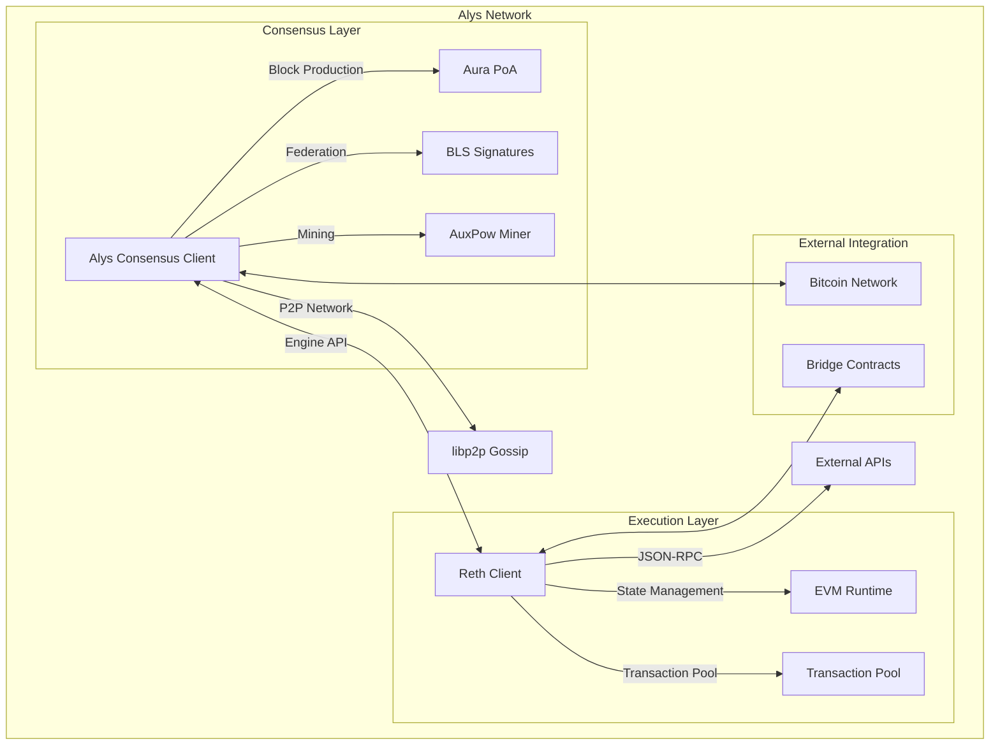
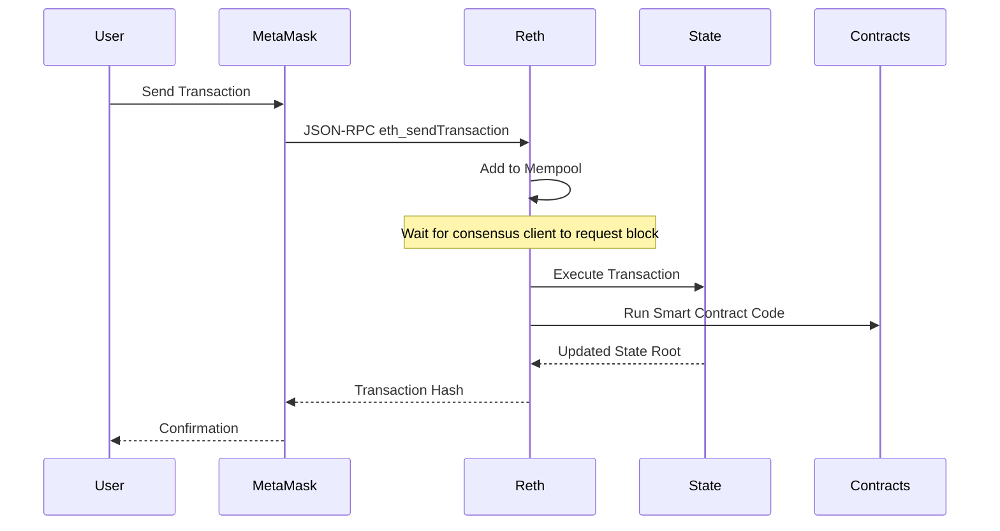
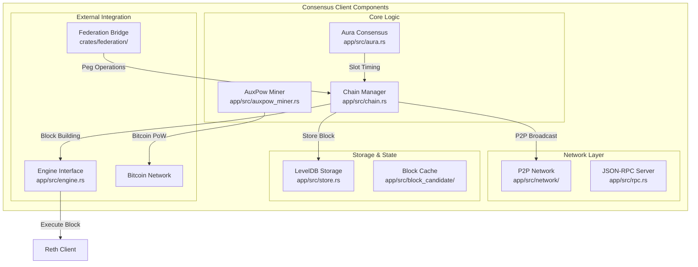
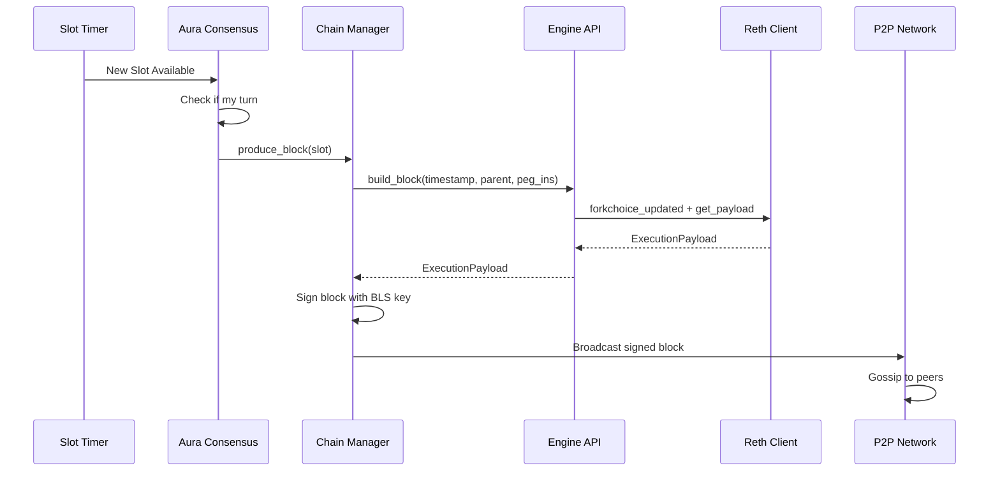
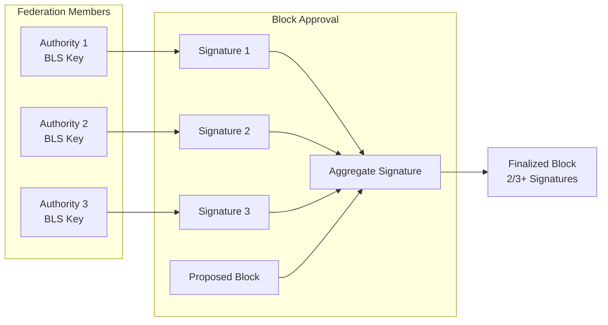
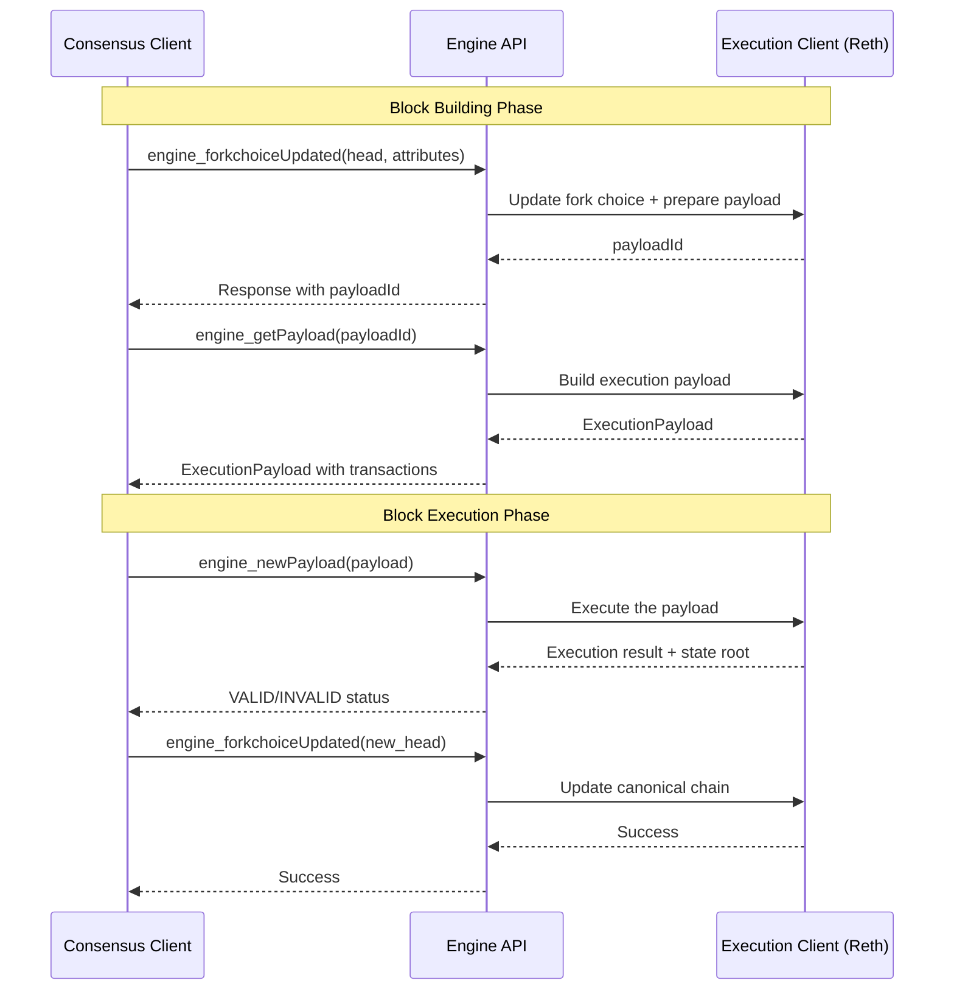
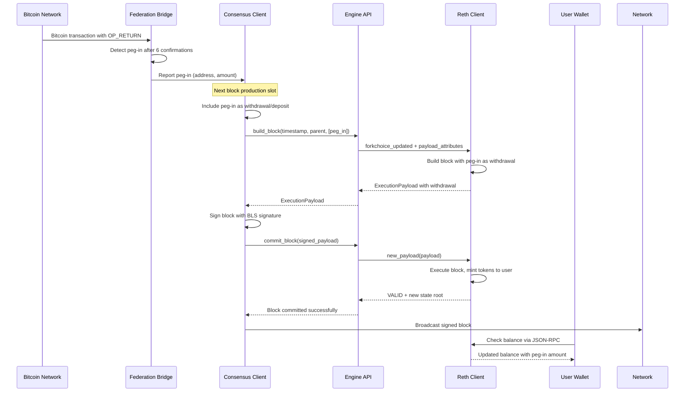

# Alys Client Architecture Knowledge Graph

## Introduction for Junior Engineers

Alys implements a **dual-client architecture** similar to modern Ethereum networks. This document will break down the two main clients that power the Alys network and how they work together to create a secure, high-performance Bitcoin sidechain.

Think of blockchain clients like a restaurant kitchen:
- The **Execution Client** (Reth) is like the cooking station - it handles all the "work" (processing transactions, executing smart contracts, managing state)
- The **Consensus Client** (Alys consensus layer built on Lighthouse) is like the head chef - it decides what gets cooked when, coordinates the kitchen, and ensures everyone follows the same recipe

## System Overview



## Client 1: Execution Client (Reth)

### What is Reth?

Reth is a **high-performance Ethereum execution client** written in Rust. In the Alys architecture, Reth serves as the execution layer that:
- Processes all transactions and smart contract calls
- Maintains the blockchain state (account balances, contract storage, etc.)
- Provides the EVM (Ethereum Virtual Machine) runtime
- Exposes JSON-RPC APIs for external applications

### Reth's Role in Alys



### Key Reth Components in Alys

**1. Transaction Pool (Mempool)**
```rust
// Reth maintains pending transactions
// Location: Inside Reth's transaction pool manager
pub struct TxPool {
    pending: HashMap<Address, Vec<Transaction>>,
    queued: HashMap<Address, Vec<Transaction>>,
    // Gas price sorting, nonce ordering, etc.
}
```

**2. State Management**
- **State Trie**: Merkle Patricia Trie storing all account states
- **Storage Trie**: Per-contract storage in separate tries
- **State Root**: Single hash representing entire world state
- **State Transitions**: Atomic updates during block execution

**3. EVM Runtime**
- **Bytecode Execution**: Runs smart contract code
- **Gas Metering**: Prevents infinite loops and DoS attacks
- **Precompiled Contracts**: Optimized implementations (ECRECOVER, SHA256, etc.)
- **EIP Support**: Implements Ethereum Improvement Proposals

### Configuration and Startup

**Reth Configuration** (`etc/config/eth-config.toml`):
```toml
[stages.execution]
max_blocks = 500000                 # Maximum blocks to process at once
max_changes = 5000000              # Maximum state changes per batch
max_cumulative_gas = 1500000000000 # Gas limit for batch processing
max_duration = "10m"               # Maximum execution time per batch

[peers]
max_outbound = 30      # Maximum outbound peer connections
max_inbound = 30       # Maximum inbound peer connections
trusted_nodes = ["enode://4a131d635e3b1ab30..."] # Trusted bootstrap nodes
```

**Starting Reth** (`scripts/start_reth.sh`):
```bash
#!/usr/bin/env bash
# Starts Reth execution client
start_reth $NUM    # NUM determines instance (0, 1, 2 for multi-node)
tail -f "$(get_log_path $NUM)"  # Follow logs
```

### Integration Points

**1. Engine API Integration** (`app/src/engine.rs`):
```rust
pub struct Engine {
    pub api: HttpJsonRpc,          // Authenticated Engine API connection
    pub execution_api: HttpJsonRpc, // Public JSON-RPC connection
    finalized: RwLock<Option<ExecutionBlockHash>>,
}

impl Engine {
    // Builds a new block with given transactions and withdrawals
    pub async fn build_block(
        &self,
        timestamp: Duration,
        payload_head: Option<ExecutionBlockHash>,
        add_balances: Vec<AddBalance>,  // Peg-in deposits
    ) -> Result<ExecutionPayload<MainnetEthSpec>, Error>
    
    // Commits the block to Reth's chain
    pub async fn commit_block(
        &self,
        execution_payload: ExecutionPayload<MainnetEthSpec>,
    ) -> Result<ExecutionBlockHash, Error>
}
```

**2. RPC Communication Ports**:
- **Port 8551**: Engine API (authenticated with JWT)
- **Port 8545**: Public JSON-RPC (MetaMask, dApps, etc.)
- **Port 30303**: P2P networking for peer discovery

### Practical Example: Processing a Transaction

Let's trace what happens when someone sends 1 BTC to another address:

```javascript
// User sends transaction via MetaMask
const tx = await signer.sendTransaction({
    to: "0x742d35Cc6634C0532925a3b8D4D2A9c8f70e5e08",
    value: ethers.utils.parseEther("1.0"), // 1 BTC in wei
    gasLimit: 21000,
    gasPrice: ethers.utils.parseGwei("20")
});
```

**What Reth Does:**
1. **Validation**: Checks signature, nonce, gas limit, balance
2. **Mempool**: Adds transaction to pending transaction pool
3. **Waiting**: Holds transaction until consensus client requests a block
4. **Execution**: When block is built, executes transaction and updates state
5. **State Root**: Calculates new state root hash
6. **Receipt**: Generates transaction receipt with logs and gas usage

## Client 2: Consensus Client (Alys Custom - Built on Lighthouse)

### What is the Alys Consensus Client?

The Alys consensus client is a **custom-built consensus layer** that uses Lighthouse components but implements its own unique consensus mechanism. Unlike traditional Proof-of-Stake, Alys uses:

- **Aura Proof-of-Authority**: Federation members take turns producing blocks every 2 seconds
- **Optimistic Merged Mining**: Blocks are produced optimistically, then finalized by Bitcoin miners
- **BLS Signatures**: Federation uses cryptographically secure signatures for block approval

### Consensus Architecture Deep Dive



### Key Consensus Components

**1. Aura Proof-of-Authority** (`app/src/aura.rs`)

Aura implements a round-robin consensus where federation members take turns producing blocks:

```rust
pub struct Aura {
    pub authorities: Vec<PublicKey>,    // Federation member public keys
    pub slot_duration: u64,            // Time between slots (2000ms)
    pub authority: Option<Authority>,   // This node's authority info (if validator)
}

// Determines which authority should produce the block for a given slot
fn slot_author<AuthorityId>(slot: u64, authorities: &[AuthorityId]) -> Option<(u8, &AuthorityId)> {
    if authorities.is_empty() {
        return None;
    }
    let idx = slot % (authorities.len() as u64);  // Round-robin selection
    let current_author = authorities.get(idx as usize)?;
    Some((idx as u8, current_author))
}
```

**Analogy**: Think of Aura like a meeting where members take turns speaking. Every 2 seconds, it's someone else's turn to propose what should happen next. The other members can approve or reject the proposal.

**2. Slot-based Block Production** (`app/src/aura.rs:187`)

```rust
pub struct AuraSlotWorker<DB> {
    last_slot: u64,
    slot_duration: Duration,         // 2 seconds
    until_next_slot: Option<Delay>,  // Timer until next slot
    authorities: Vec<PublicKey>,     // Federation members
    maybe_signer: Option<Keypair>,   // This node's signing key (if validator)
    chain: Arc<Chain<DB>>,          // Reference to blockchain state
}

impl<DB: ItemStore<MainnetEthSpec>> AuraSlotWorker<DB> {
    async fn on_slot(&self, slot: u64) -> Option<Result<(), Error>> {
        // Check if it's this node's turn to produce a block
        let _ = self.claim_slot(slot, &self.authorities[..])?;
        debug!("My turn");

        // Produce and broadcast the block
        let res = self.chain.produce_block(slot, duration_now()).await;
        // Handle result...
    }
}
```

**3. Block Production Flow** (`app/src/chain.rs`)

When it's a federation member's turn to produce a block:



### Lighthouse Integration (`crates/lighthouse_wrapper/`)

Alys leverages specific Lighthouse components through a clean wrapper:

```rust
// Re-exported Lighthouse modules
pub use bls;              // BLS cryptographic operations  
pub use execution_layer;  // Engine API and execution client interface
pub use sensitive_url;    // Secure URL handling with credential protection
pub use store;           // Database abstractions and type-safe operations
pub use types;           // Ethereum consensus types and specifications
```

**Why Use Lighthouse Components?**
- **Battle-tested Crypto**: BLS signature implementation used by Ethereum validators
- **Standard Types**: Compatible with Ethereum tooling and specifications
- **Engine API**: Proven interface for execution client communication
- **Type Safety**: Prevents serialization errors and consensus bugs

**Example BLS Usage** (`app/src/aura.rs`):
```rust
use lighthouse_wrapper::bls::{Keypair, PublicKey, SecretKey};

// Each federation member has a BLS keypair
pub struct Authority {
    pub signer: Keypair,  // Used to sign blocks
    pub index: u8,        // Position in authority set
}

// Block signature verification
impl SignedConsensusBlock<MainnetEthSpec> {
    pub fn verify_signature(&self, authorities: &[PublicKey]) -> bool {
        // Verifies BLS signature against authority set
        // Uses lighthouse_wrapper::bls verification functions
    }
}
```

### Federation and Multi-Signature

The consensus layer coordinates with the federation system for secure operations:



**Multi-signature Requirements**:
```rust
pub fn majority_approved(&self, block: &SignedConsensusBlock<MainnetEthSpec>) -> Result<bool, AuraError> {
    // Calculate required signatures (2/3 + 1 majority)
    let required_signatures = ((self.authorities.len() * 2) + 2) / 3;
    
    if block.num_approvals() < required_signatures {
        return Ok(false);
    }
    
    // Verify the aggregate BLS signature
    if block.verify_signature(&self.authorities) {
        Ok(true)
    } else {
        Err(AuraError::BadSignature)
    }
}
```

### Optimistic Merged Mining Integration

The consensus client coordinates with Bitcoin miners for final block confirmation:

**AuxPow (Auxiliary Proof of Work)** (`app/src/auxpow_miner.rs`):
```rust
pub struct AuxPowMiner<BI> {
    chain_manager: Arc<BI>,
    retarget_params: BitcoinConsensusParams,
    pow_block_cache: RwLock<BTreeMap<u64, AuxPow>>,
}

// Provides work to Bitcoin miners
impl<BI: ChainManager<BI>> AuxPowMiner<BI> {
    pub async fn create_auxblock(&self) -> Result<(BlockIndex, Hash256), AuxPowMiningError> {
        // Creates work package for Bitcoin miners
        // Returns block template and target hash
    }
    
    pub async fn submit_auxblock(&self, block_index: &BlockIndex, auxpow: AuxPow) -> Result<bool, AuxPowMiningError> {
        // Processes submitted proof-of-work from Bitcoin miners
        // Validates and applies the PoW to finalize blocks
    }
}
```

**Mining Flow**:
1. **Block Production**: Federation produces signed blocks every 2 seconds
2. **Bundle Creation**: Consensus client bundles multiple signed blocks
3. **Mining Distribution**: Provides bundle to Bitcoin miners as AuxPow work
4. **PoW Submission**: Miners submit valid proof-of-work solutions
5. **Finalization**: Consensus client finalizes all blocks in the bundle

## Client Interaction and Communication

### Engine API: The Communication Bridge

The Engine API is the standardized interface between consensus and execution clients:



**Key Engine API Methods** (`app/src/engine.rs`):

**1. `build_block()` - Request Block Construction**
```rust
pub async fn build_block(
    &self,
    timestamp: Duration,           // When block should be produced
    payload_head: Option<ExecutionBlockHash>, // Parent block
    add_balances: Vec<AddBalance>, // Peg-in deposits to include
) -> Result<ExecutionPayload<MainnetEthSpec>, Error> {
    
    // 1. Create payload attributes with withdrawals (for peg-ins)
    let payload_attributes = PayloadAttributes::new(
        timestamp.as_secs(),
        Default::default(), // randao (not used in PoA)
        Address::from_str(DEAD_ADDRESS).unwrap(), // fee recipient (burned)
        Some(add_balances.into_iter().map(Into::into).collect()),
    );
    
    // 2. Update forkchoice to prepare block building
    let response = self.api.forkchoice_updated(forkchoice_state, Some(payload_attributes)).await?;
    let payload_id = response.payload_id.ok_or(Error::PayloadIdUnavailable)?;
    
    // 3. Get the built payload from execution client
    let response = self.api.get_payload::<MainnetEthSpec>(types::ForkName::Capella, payload_id).await?;
    
    Ok(response.execution_payload_ref().clone_from_ref())
}
```

**2. `commit_block()` - Execute and Finalize Block**
```rust
pub async fn commit_block(
    &self,
    execution_payload: ExecutionPayload<MainnetEthSpec>,
) -> Result<ExecutionBlockHash, Error> {
    
    // 1. Submit payload for execution
    let response = self.api.new_payload::<MainnetEthSpec>(execution_payload).await?;
    let head = response.latest_valid_hash.ok_or(Error::InvalidBlockHash)?;
    
    // 2. Update forkchoice to make block canonical
    self.api.forkchoice_updated(
        ForkchoiceState {
            head_block_hash: head,
            safe_block_hash: finalized,
            finalized_block_hash: finalized,
        },
        None,
    ).await?;
    
    Ok(head)
}
```

### Network Communication Layers

**1. P2P Gossip Network** (`app/src/network/mod.rs`):
```rust
pub enum PubsubMessage {
    ConsensusBlock(SignedConsensusBlock<MainnetEthSpec>),  // New blocks
    ApproveBlock(ApproveBlock),                           // Block approvals
    QueuePow(Hash256),                                    // Mining coordination
    PegoutSignatures(SingleMemberTransactionSignatures), // Peg-out signatures
}

// libp2p integration for efficient message broadcasting
pub struct MyBehaviour {
    gossipsub: gossipsub::Behaviour,    // Message broadcasting
    identify: identify::Behaviour,      // Peer identification
    autonat: autonat::Behaviour,       // NAT detection
    rpc: rpc::RpcBehaviour,            // Direct peer RPC
}
```

**2. Direct RPC Communication** (`app/src/network/rpc/`):
```rust
// Rate-limited request/response communication
pub struct RpcBehaviour {
    connected_peers: HashMap<PeerId, ConnectedPoint>,
    rate_limiter: RateLimiter,
    pending_requests: HashMap<RequestId, (PeerId, Instant)>,
}

// RPC method implementations
impl RpcBehaviour {
    pub fn request_approval(&mut self, peer_id: PeerId, block_hash: Hash256) -> RequestId {
        // Direct request for block approval from specific peer
    }
    
    pub fn send_sync_request(&mut self, peer_id: PeerId, from_slot: u64, count: u64) -> RequestId {
        // Request block range for synchronization
    }
}
```

### Practical Integration Example: Processing a Peg-in

Let's trace a complete peg-in operation showing how both clients work together:



**Code Flow**:

1. **Detection** (`crates/federation/src/bitcoin_stream.rs`):
```rust
// Federation detects Bitcoin peg-in transaction
async fn process_bitcoin_block(&self, block: &bitcoin::Block) -> Result<Vec<PegInInfo>> {
    // Parse OP_RETURN data for peg-in information
    // Verify transaction has sufficient confirmations
    // Return peg-in details (amount, destination address)
}
```

2. **Block Building** (`app/src/chain.rs`):
```rust
pub async fn produce_block(&self, slot: u64, timestamp: Duration) -> Result<(), Error> {
    // Get pending peg-ins from federation
    let peg_ins = self.bridge.get_pending_peg_ins().await?;
    
    // Convert to execution layer withdrawals
    let add_balances: Vec<AddBalance> = peg_ins.into_iter()
        .map(|peg_in| AddBalance::from((peg_in.address, ConsensusAmount::from_satoshi(peg_in.amount))))
        .collect();
    
    // Request block from execution layer
    let payload = self.engine.build_block(timestamp, parent_hash, add_balances).await?;
    
    // Sign and broadcast block
    let signed_block = self.sign_block(payload, slot).await?;
    self.network.broadcast(PubsubMessage::ConsensusBlock(signed_block)).await?;
    
    Ok(())
}
```

3. **Execution** (Reth processes the withdrawal):
```rust
// Inside Reth's execution engine
// Withdrawals are processed as balance increases
fn process_withdrawals(state: &mut State, withdrawals: &[Withdrawal]) -> Result<()> {
    for withdrawal in withdrawals {
        let account = state.get_account_mut(withdrawal.address)?;
        account.balance += withdrawal.amount * GWEI_TO_WEI; // Convert from Gwei to Wei
    }
    Ok(())
}
```

## Configuration and Deployment

### Development Setup

**Starting Both Clients** (`scripts/start_network.sh`):
```bash
#!/usr/bin/env bash

# Start execution client (Reth)
start_reth 0 &    # Node 0
start_reth 1 &    # Node 1  
start_reth 2 &    # Node 2

# Start consensus clients
start_consensus 0 &
start_consensus 1 &
start_consensus 2 &

# Start Bitcoin regtest for testing
start_bitcoin_regtest &

echo "Multi-node Alys network started"
wait
```

**Docker Compose Production** (`etc/docker-compose.full-node.yml`):
```yaml
services:
  execution:
    image: ghcr.io/paradigmxyz/reth:v1.1.3
    ports:
      - '8545:8545'   # JSON-RPC for dApps
      - '8551:8551'   # Engine API  
      - '30303:30303' # P2P networking
    command: >
      node
      --chain "/opt/alys/execution/config/genesis.json"
      --authrpc.jwtsecret /opt/alys/execution/config/jwtsecret.hex
      --http --http.addr 0.0.0.0 --http.port 8545
      --authrpc.addr 0.0.0.0 --authrpc.port 8551
  
  consensus:
    image: ghcr.io/anduroproject/alys:master
    ports:
      - '3000:3000'   # Consensus RPC
      - '55444:55444' # P2P networking
    command:
      - /bin/alys
      - --chain /lib/alys/config/chain.json
      - --geth-url http://execution:8551/
      - --geth-execution-url http://execution:8545
      - --jwt-secret /opt/alys/execution/config/jwtsecret.hex
    depends_on:
      - execution
```

### Key Configuration Files

**Chain Specification** (`etc/config/chain.json`):
```json
{
  "slotDuration": 2000,                    // 2 second block times
  "authorities": [                         // Federation BLS public keys
    "0x97f1d3a73197d7942695638c4fa9ac0fc3688c4f9774b905a14e3a3f171bac586c55e83ff97a1aeffb3af00adb22c6bb"
  ],
  "federation": [                          // Federation Ethereum addresses  
    "2e80ab37dfb510a64526296fd1f295c42ef19c29"
  ],
  "chainId": 212121,                      // Network identifier
  "maxBlocksWithoutPow": 50000,           // Halt if no PoW for this many blocks
  "requiredBtcTxnConfirmations": 6,       // Bitcoin confirmations for peg-ins
  "bitcoinStartHeight": 95800,            // Start monitoring from this Bitcoin block
  "isValidator": true                     // This node participates in consensus
}
```

**Genesis Block** (`etc/config/genesis.json`):
```json
{
  "config": {
    "chainId": 212121,
    "homesteadBlock": 0,
    "eip150Block": 0,
    "eip155Block": 0,
    "eip158Block": 0,
    "byzantiumBlock": 0,
    "constantinopleBlock": 0,
    "petersburgBlock": 0,
    "istanbulBlock": 0,
    "berlinBlock": 0,
    "londonBlock": 0,
    "shanghaiTime": 0,
    "cancunTime": 0,
    "terminalTotalDifficulty": 0
  },
  "alloc": {
    "0xbBbBBBBbbBBBbbbBbbBbbbbBBbBbbbbBbBbbBBbB": {
      "balance": "0x0",
      "code": "0x608060405234801561001057600080fd5b50..." // Bridge contract bytecode
    }
  },
  "gasLimit": "0x1c9c380"  // 30M gas limit per block
}
```

## Monitoring and Debugging

### Metrics and Observability

Both clients expose Prometheus metrics for monitoring:

**Consensus Client Metrics** (`app/src/metrics.rs`):
```rust
// Block production metrics
pub static AURA_PRODUCED_BLOCKS: Lazy<CounterVec> = Lazy::new(|| {
    CounterVec::new(Opts::new("aura_produced_blocks_total", "Total blocks produced"), &["result"])
});

// Network metrics  
pub static CHAIN_DISCOVERED_PEERS: Lazy<Gauge> = Lazy::new(|| {
    Gauge::new("chain_discovered_peers", "Number of discovered peers")
});

// Mining metrics
pub static CHAIN_BLOCK_HEIGHT: Lazy<Gauge> = Lazy::new(|| {
    Gauge::new("chain_block_height", "Current blockchain height")
});
```

**Reth Metrics**: 
- Execution performance (gas usage, transaction throughput)
- State database size and sync progress  
- P2P network connectivity and peer counts
- JSON-RPC request rates and response times

### Debugging Common Issues

**1. Clients Not Communicating**
```bash
# Check Engine API connectivity
curl -X POST http://localhost:8551 \
  -H "Content-Type: application/json" \
  -H "Authorization: Bearer <JWT_TOKEN>" \
  -d '{"jsonrpc":"2.0","method":"engine_exchangeCapabilities","params":[],"id":1}'
```

**2. Block Production Stalled**
```rust
// Check logs for consensus issues
RUST_LOG=debug ./target/debug/app --dev

// Common issues:
// - Authority keys not matching chain spec
// - Engine API authentication failures  
// - Network connectivity problems
// - Insufficient peer connections
```

**3. Synchronization Problems**
```bash
# Check consensus client sync status
curl -X POST http://localhost:3000 \
  -H "Content-Type: application/json" \
  -d '{"jsonrpc":"2.0","method":"sync_status","params":[],"id":1}'

# Check execution client sync
curl -X POST http://localhost:8545 \
  -H "Content-Type: application/json" \
  -d '{"jsonrpc":"2.0","method":"eth_syncing","params":[],"id":1}'
```

## Summary for Junior Engineers

**Key Takeaways**:

1. **Two-Client Architecture**: Alys separates consensus (block ordering) from execution (transaction processing) for better modularity and performance

2. **Reth = Execution**: Handles all the "computational work" - transactions, smart contracts, state management, and provides APIs for dApps

3. **Alys Consensus = Block Production**: Implements Aura PoA with BLS signatures for fast block production, plus optimistic merged mining with Bitcoin for security

4. **Engine API Bridge**: Standard interface allows consensus and execution clients to work together while being developed independently

5. **Lighthouse Components**: Alys reuses battle-tested Ethereum infrastructure (BLS crypto, types, storage) rather than reimplementing everything

6. **Federation Model**: Multiple authorities coordinate using cryptographic signatures, providing decentralization while maintaining fast finality

7. **Bitcoin Integration**: Unique merged mining approach leverages Bitcoin's security while maintaining EVM compatibility and fast transaction processing

This dual-client architecture allows Alys to combine the best of both worlds: Ethereum's rich smart contract ecosystem with Bitcoin's proven security model, all while maintaining high performance through modern Rust implementations.

## Next Steps

As you dive deeper into the codebase:
- Study the Engine API integration in `app/src/engine.rs`
- Understand the Aura consensus implementation in `app/src/aura.rs`  
- Explore the network layer in `app/src/network/`
- Examine the federation integration in `crates/federation/`
- Practice with the development scripts in `scripts/`

The dual-client architecture might seem complex at first, but it provides a clean separation of concerns that makes the system more maintainable, testable, and upgradeable. Each client can focus on what it does best, while the Engine API ensures they work seamlessly together.