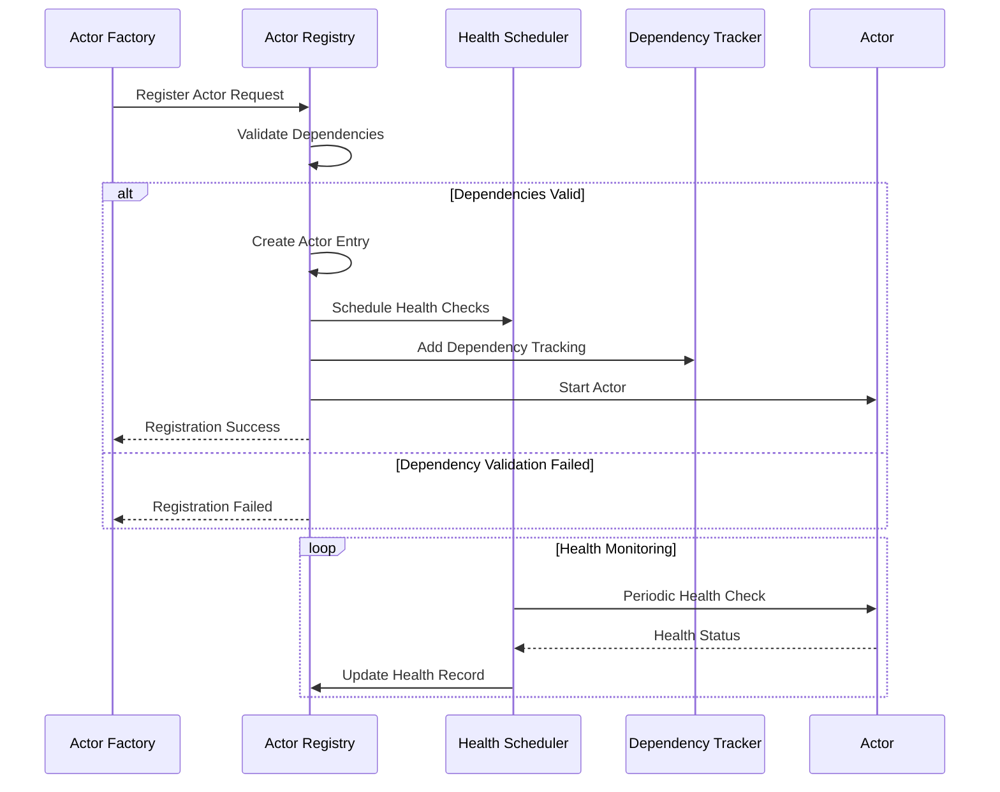

# Core Actor System Architecture Knowledge Graph

## Overview

The Alys V2 Core Actor System represents a fundamental architectural shift from shared-state concurrency (`Arc<RwLock<>>`) to message-passing actor model concurrency. This system eliminates deadlock risks, improves fault isolation, and enables true parallelism through hierarchical supervision trees.

## System Architecture


## Core Components Deep Dive

### 1. Supervision System (`supervisor.rs`)

The supervision system implements hierarchical fault tolerance with automatic restart strategies and escalation policies.

#### Supervision Tree Structure


#### Restart Strategies

**Location**: `crates/actor_system/src/supervisor.rs:23-85`

```rust
#[derive(Debug, Clone, Copy, PartialEq, Eq, Serialize, Deserialize)]
pub enum RestartStrategy {
    Never,
    Immediate,
    Delayed { delay: Duration },
    ExponentialBackoff {
        initial_delay: Duration,
        max_delay: Duration,
        multiplier: f64,
    },
    Progressive {
        initial_delay: Duration,
        max_attempts: u32,
        delay_multiplier: f64,
    },
}
```

**Key Implementation Details**:

1. **ExponentialBackoff**: Used for transient failures with exponential delay scaling
   - Initial delay: 100ms, max delay: 30s, multiplier: 2.0
   - Prevents cascade failures during system stress

2. **Progressive**: Used for actors with limited retry capacity
   - Increases delay progressively, stops after max attempts
   - Ideal for external service connections

3. **Delayed**: Fixed delay restart for predictable recovery times
   - Used for bridge operations requiring transaction cleanup

#### Escalation Strategies

**Location**: `crates/actor_system/src/supervisor.rs:87-95`

```rust
#[derive(Debug, Clone, Copy, PartialEq, Eq, Serialize, Deserialize)]
pub enum EscalationStrategy {
    Stop,                    // Stop the supervisor
    RestartTree,            // Restart entire supervision tree
    EscalateToParent,       // Escalate to parent supervisor
    ContinueWithoutActor,   // Continue without the failed actor
}
```

#### Child Failure Handling Flow


### 2. Enhanced Mailbox System (`mailbox.rs`)

The mailbox system provides priority-based message queuing with backpressure management and bounded channels.

#### Priority Queue Architecture

**Location**: `crates/actor_system/src/mailbox.rs:95-175`

```rust
#[derive(Debug)]
pub struct PriorityQueue<M> {
    /// Priority heap for high/critical messages
    high_priority: BinaryHeap<QueuedMessage<M>>,
    /// FIFO queue for normal priority messages
    normal_priority: VecDeque<QueuedMessage<M>>,
    /// FIFO queue for low priority messages
    low_priority: VecDeque<QueuedMessage<M>>,
    /// Total message count
    total_count: usize,
}
```

#### Message Processing Flow


#### Backpressure States

**Location**: `crates/actor_system/src/mailbox.rs:35-44`

```rust
#[derive(Debug, Clone, Copy, PartialEq, Eq)]
pub enum BackpressureState {
    Normal,    // < 50% capacity
    Warning,   // 50-80% capacity
    Critical,  // 80-100% capacity
    Blocked,   // At capacity
}
```

**Backpressure Thresholds**:
- Warning: 50% of mailbox capacity
- Critical: 80% of mailbox capacity (configurable)
- Blocked: 100% capacity

### 3. Lifecycle Management (`lifecycle.rs`)

The lifecycle management system handles actor state transitions, health monitoring, and graceful shutdown coordination.

#### Actor State Machine


#### Health Check System

**Location**: `crates/actor_system/src/lifecycle.rs:447-509`

```rust
impl LifecycleManager {
    /// Record health check result
    pub async fn record_health_check(&self, actor_id: &str, healthy: bool) -> ActorResult<()> {
        // Health failure tracking and escalation logic
        if healthy {
            metadata.health_failures.store(0, Ordering::Relaxed);
        } else {
            let failures = metadata.health_failures.fetch_add(1, Ordering::Relaxed) + 1;
            
            if failures >= metadata.config.max_health_failures as u64 {
                self.transition_state(
                    actor_id,
                    ActorState::Failed,
                    Some("Too many health check failures".to_string()),
                    Some(ActorError::SystemFailure { /* ... */ }),
                ).await?;
            }
        }
        Ok(())
    }
}
```

#### Lifecycle Event Flow


### 4. Actor Registry and Health Tracking (`registry.rs`)

The actor registry provides centralized actor management with health monitoring and dependency tracking.

#### Registration Flow

**Location**: `crates/actor_system/src/registry.rs:71-128`



#### Dependency Validation

**Location**: `crates/actor_system/src/registry.rs:157-186`

The registry implements circular dependency detection using depth-first search:

```rust
impl ActorRegistry {
    /// Check for circular dependencies
    pub fn has_circular_dependency(&self) -> bool {
        for actor_id in self.actors.keys() {
            if self.has_circular_dependency_from(actor_id, actor_id, &mut HashSet::new()) {
                return true;
            }
        }
        false
    }
}
```

### 5. Communication Bus (`bus.rs`)

The communication bus enables system-wide messaging with topic-based subscriptions and priority routing.

#### Message Routing Architecture


#### Subscription Management

**Location**: `crates/actor_system/src/bus.rs:125-197`

```rust
impl CommunicationBus {
    /// Subscribe to a topic with filtering
    pub async fn subscribe<M>(
        &self,
        subscriber_id: String,
        topic: String,
        recipient: Recipient<M>,
        filters: Vec<MessageFilter>,
        priority: SubscriptionPriority,
    ) -> ActorResult<String>
}
```

#### Message Filtering System

```rust
#[derive(Debug, Clone, Serialize, Deserialize)]
pub enum MessageFilter {
    MessageType(String),     // Filter by message type
    Sender(String),          // Filter by actor sender
    Priority(MessagePriority), // Filter by priority level
    Custom(String),          // Custom filter predicate
}
```

### 6. Domain-Specific Supervisors (`supervisors.rs`)

Each domain has specialized supervision policies tailored to its operational characteristics.

#### ChainSupervisor Configuration

**Location**: `crates/actor_system/src/supervisors.rs:18-36`

```rust
#[derive(Debug, Clone, Serialize, Deserialize)]
pub struct ChainSupervisorConfig {
    pub max_block_failures: u32,           // 3
    pub consensus_timeout: Duration,        // 30s
    pub fast_restart_block_producers: bool, // true
    pub max_sync_failures: u32,            // 5
}
```

**Key Features**:
- Fast restart for block producers to minimize consensus disruption
- Exponential backoff for sync failures
- Escalation to parent for critical consensus failures

#### NetworkSupervisor Configuration

**Location**: `crates/actor_system/src/supervisors.rs:119-133`

```rust
#[derive(Debug, Clone, Serialize, Deserialize)]
pub struct NetworkSupervisorConfig {
    pub max_connection_failures: u32,      // 10
    pub discovery_retry_interval: Duration, // 30s
    pub partition_timeout: Duration,        // 2 minutes
    pub max_sync_retries: u32,             // 5
    pub aggressive_peer_recovery: bool,     // true
}
```

**Key Features**:
- Progressive restart strategy for connection failures
- Continue without actor policy for non-critical network components
- Aggressive peer recovery for network partitions

#### BridgeSupervisor Configuration

**Location**: `crates/actor_system/src/supervisors.rs:220-237`

```rust
#[derive(Debug, Clone, Serialize, Deserialize)]
pub struct BridgeSupervisorConfig {
    pub max_tx_retries: u32,               // 5
    pub tx_timeout: Duration,              // 10 minutes
    pub max_governance_failures: u32,      // 3
    pub bitcoin_retry_interval: Duration,  // 30s
    pub enable_fee_bumping: bool,          // true
}
```

**Key Features**:
- Delayed restart strategy for transaction cleanup
- Fee bumping capability for stuck transactions
- Longer shutdown timeout for transaction finalization

#### StorageSupervisor Configuration

**Location**: `crates/actor_system/src/supervisors.rs:326-340`

```rust
#[derive(Debug, Clone, Serialize, Deserialize)]
pub struct StorageSupervisorConfig {
    pub connection_pool_size: u32,         // 10
    pub connection_retry_interval: Duration, // 5s
    pub query_timeout: Duration,           // 30s
    pub enable_health_checks: bool,        // true
    pub failover_timeout: Duration,        // 10s
}
```

**Key Features**:
- Connection pooling management
- Database failover capabilities
- Query timeout enforcement

## System Integration Patterns

### 1. Actor Creation and Supervision


### 2. Message Flow Through System


### 3. Failure Recovery Flow


## Performance Characteristics

### Memory Usage Optimization

1. **Message Pooling**: Reuse message envelopes to reduce allocation overhead
2. **Bounded Channels**: Prevent memory exhaustion through backpressure
3. **Metrics Aggregation**: Efficient storage with periodic cleanup

### Latency Optimization

1. **Priority Queues**: Critical messages bypass normal queue delays
2. **Zero-Copy Message Passing**: Minimize data copying between actors
3. **Batch Processing**: Group related operations for efficiency

### Throughput Optimization

1. **Parallel Processing**: Independent actors process concurrently
2. **Load Balancing**: Distribution across multiple worker actors
3. **Adaptive Backpressure**: Dynamic adjustment based on system load

## Configuration Management

### System-Level Configuration

**Location**: `crates/actor_system/src/system.rs:38-71`

```rust
#[derive(Debug, Clone, Serialize, Deserialize)]
pub struct AlysSystemConfig {
    pub system_name: String,
    pub root_supervision_policy: SupervisionPolicy,
    pub health_check_interval: Duration,
    pub metrics_interval: Duration,
    pub startup_timeout: Duration,
    pub shutdown_timeout: Duration,
    pub auto_discovery: bool,
    pub resource_limits: ResourceLimits,
}
```

### Actor-Level Configuration

Each actor type implements the `AlysActor` trait with configuration support:

```rust
pub trait AlysActor: Actor + LifecycleAware + Send + Sync + 'static {
    type Config: Clone + Send + Sync + 'static;
    
    fn new(config: Self::Config) -> Result<Self, Self::Error>;
    fn config(&self) -> &Self::Config;
    fn mailbox_config(&self) -> MailboxConfig;
    fn supervision_policy(&self) -> SupervisionPolicy;
}
```

## Monitoring and Observability

### Metrics Collection

The system collects comprehensive metrics at multiple levels:

1. **System Metrics**: Overall health, resource usage, actor counts
2. **Actor Metrics**: Message processing rates, error rates, response times
3. **Mailbox Metrics**: Queue depths, backpressure events, delivery failures
4. **Supervision Metrics**: Restart counts, escalation events, failure patterns

### Health Monitoring

**Location**: `crates/actor_system/src/system.rs:371-436`

```rust
impl AlysSystem {
    /// Perform system health check
    pub async fn perform_health_check(&self) -> ActorResult<SystemHealthStatus> {
        // Comprehensive health evaluation including:
        // - Actor health status
        // - Resource usage limits
        // - Dependency validation
        // - System performance metrics
    }
}
```

### Distributed Tracing

Messages carry correlation IDs for distributed tracing:

```rust
#[derive(Debug, Clone, Serialize, Deserialize)]
pub struct MessageMetadata {
    pub correlation_id: Option<Uuid>,
    pub created_at: SystemTime,
    pub priority: MessagePriority,
    // ... other fields
}
```

## Error Handling Strategy

### Error Classification

**Location**: `crates/actor_system/src/error.rs:106-126`

```rust
impl ActorError {
    /// Get error severity level
    pub fn severity(&self) -> ErrorSeverity {
        match self {
            ActorError::SystemFailure { .. } => ErrorSeverity::Critical,
            ActorError::DeadlockDetected { .. } => ErrorSeverity::Critical,
            ActorError::MessageDeliveryFailed { .. } => ErrorSeverity::High,
            // ... other classifications
        }
    }
}
```

### Recovery Strategies

1. **Automatic Recovery**: Restart failed actors within configured limits
2. **Graceful Degradation**: Continue operation without failed non-critical components
3. **Circuit Breaker**: Prevent cascade failures through dependency isolation
4. **Backoff and Retry**: Progressive delays for transient failures

## Testing Strategy

### Unit Testing

Each component includes comprehensive unit tests:

```rust
#[cfg(test)]
mod tests {
    use super::*;
    
    #[test]
    fn test_restart_strategy_calculation() {
        let exponential = RestartStrategy::ExponentialBackoff { /* ... */ };
        assert_eq!(exponential.calculate_delay(0), Some(Duration::from_millis(100)));
        assert_eq!(exponential.calculate_delay(1), Some(Duration::from_millis(200)));
    }
}
```

### Integration Testing

The system supports integration testing through `ActorTestHarness`:

```rust
// Example integration test setup
let system = AlysSystem::new("test_system".to_string(), config);
let supervisor = system.create_domain_supervisor("test_domain".to_string(), None).await?;
let actor = system.register_actor::<TestActor>("test_actor".to_string(), "test_domain".to_string(), config).await?;
```

### Chaos Testing

The architecture supports chaos testing scenarios:

1. **Random Actor Failures**: Test supervision tree resilience
2. **Network Partitions**: Test distributed system behavior
3. **Resource Exhaustion**: Test backpressure mechanisms
4. **Message Loss**: Test retry and reliability mechanisms

## Migration Guide

### From V1 to V2 Actor System

1. **Replace Shared State**: Convert `Arc<RwLock<T>>` to message passing
2. **Implement Actor Traits**: Define `AlysActor` implementations
3. **Configure Supervision**: Set up appropriate supervision policies
4. **Update Error Handling**: Use structured actor errors
5. **Migrate Tests**: Update test code to use actor system patterns

### Backward Compatibility

The system maintains compatibility during migration:

1. **Wrapper Actors**: Wrap existing components in actor interfaces
2. **Bridge Patterns**: Connect old and new systems during transition
3. **Gradual Migration**: Migrate components incrementally
4. **Rollback Support**: Maintain ability to rollback if needed

This comprehensive actor system provides the foundation for building resilient, scalable, and maintainable distributed systems with strong fault tolerance and observability characteristics.