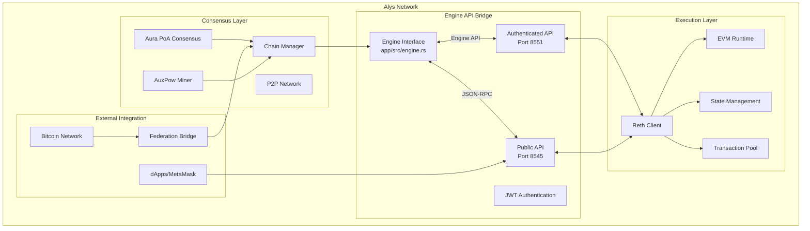
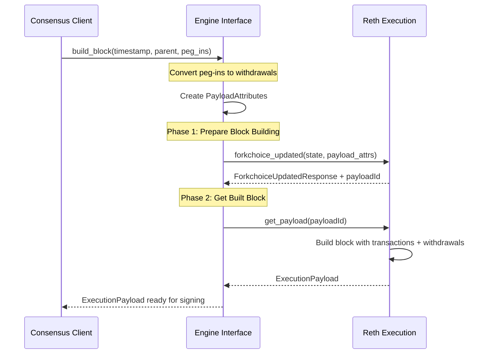
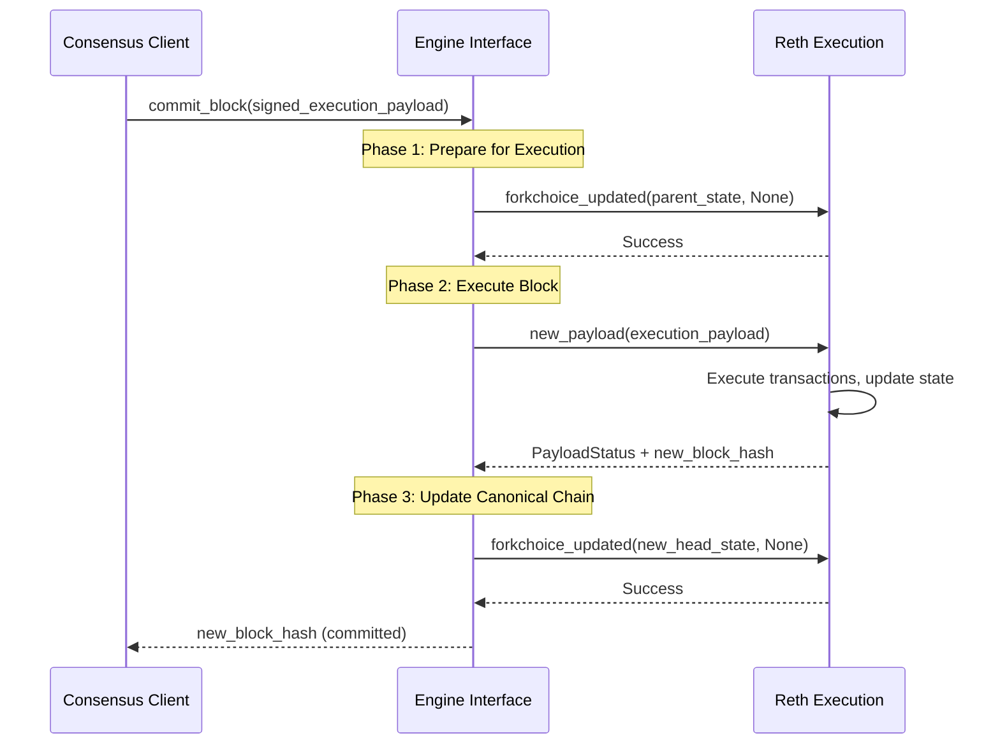
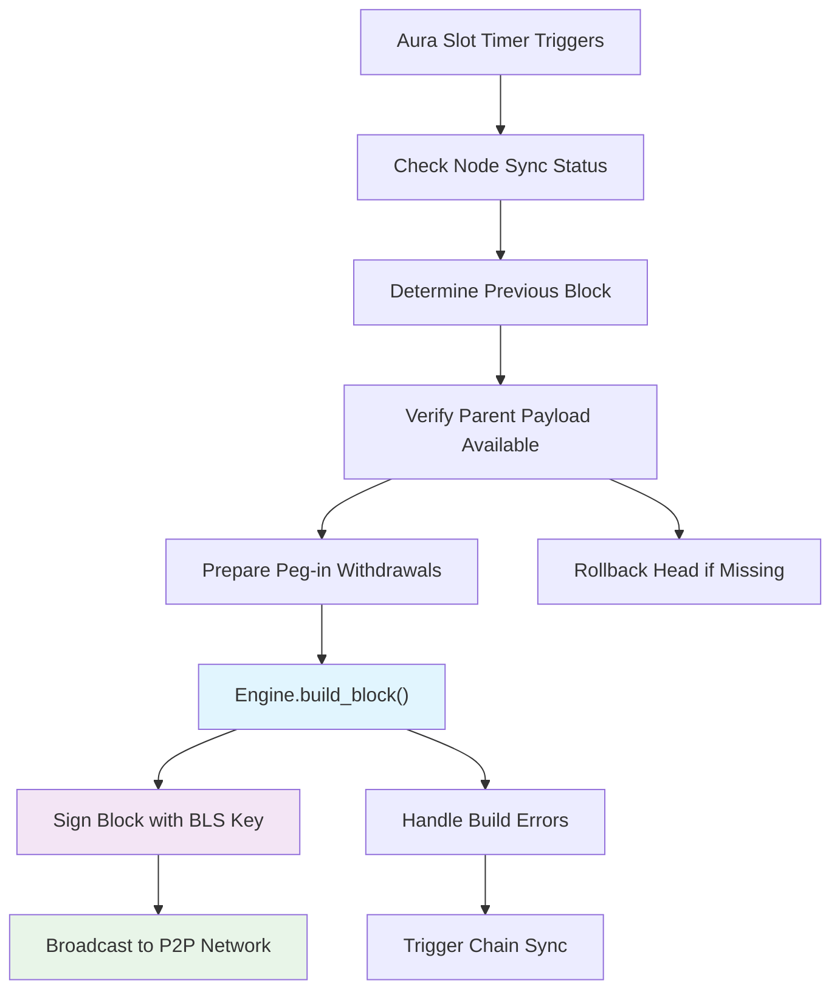

# Alys Engine API Knowledge Graph

## Introduction for Junior Engineers

The **Engine API** is the critical communication bridge that enables Alys's dual-client architecture to function seamlessly. Think of it as a standardized "translator" that allows the consensus layer (Alys custom client) to coordinate with the execution layer (Reth) without needing to understand each other's internal complexities.

**Analogy**: The Engine API is like the kitchen order system in a restaurant:
- The **Head Chef (Consensus)** decides what dishes to prepare and when
- The **Cooking Station (Execution)** handles the actual food preparation 
- The **Order Ticket System (Engine API)** ensures clear communication between them
- Orders go one way (consensus → execution), confirmations come back the other way

This knowledge graph provides deep architectural insights into how the Engine API enables Alys to leverage standard Ethereum execution clients while implementing its unique consensus mechanisms.

## System Context and Architecture

### Engine API in the Alys Ecosystem



### Key Relationships

**1. Consensus → Engine API → Execution Flow:**
- **Consensus layer** makes high-level decisions about block production
- **Engine API** translates these decisions into execution-specific operations  
- **Execution layer** performs the computational work and returns results

**2. Dual RPC Interface:**
- **Authenticated Engine API (8551)**: Secure consensus ↔ execution communication
- **Public JSON-RPC (8545)**: External dApps and user wallet access

## Engine API Implementation Deep Dive

### Core Data Structures

**1. Engine Struct** (`app/src/engine.rs:78-82`):
```rust
pub struct Engine {
    pub api: HttpJsonRpc,                         // Authenticated Engine API (port 8551)
    pub execution_api: HttpJsonRpc,               // Public JSON-RPC (port 8545) 
    finalized: RwLock<Option<ExecutionBlockHash>>, // Thread-safe finalized block tracker
}
```

**Key Design Decisions:**
- **Dual RPC connections**: Separates privileged operations from public access
- **Thread-safe finalization**: Uses `RwLock` for concurrent access to finalized state
- **Lighthouse integration**: Leverages proven Ethereum execution layer abstractions

**2. Amount Conversion System** (`app/src/engine.rs:30-74`):
```rust
#[derive(Debug, Default, Clone)]
pub struct ConsensusAmount(pub u64); // Stored in Gwei (1e9 wei)

impl ConsensusAmount {
    // Convert from Ethereum Wei to consensus layer Gwei
    pub fn from_wei(amount: Uint256) -> Self {
        Self(amount.div(10u32.pow(9)).try_into().unwrap())
    }

    // Convert Bitcoin satoshis to consensus amount (1 sat = 10 Gwei)
    pub fn from_satoshi(amount: u64) -> Self {
        Self(amount.mul(10))  // 1 satoshi = 10 Gwei scaling factor
    }
}

// Bridge structure for peg-in operations
pub struct AddBalance(Address, ConsensusAmount);

// Conversion to Ethereum withdrawal format
impl From<AddBalance> for Withdrawal {
    fn from(value: AddBalance) -> Self {
        Withdrawal {
            index: 0,
            validator_index: 0, 
            address: value.0,       // Recipient address
            amount: (value.1).0,    // Amount in Gwei
        }
    }
}
```

**Critical Insight**: Alys uses **withdrawals** (normally used for validator rewards in Proof-of-Stake) to implement **peg-in deposits**. This clever reuse allows seamless integration with standard Ethereum execution clients.

### Engine API Method Analysis

**1. Block Building: `build_block()`** (`app/src/engine.rs:97-172`):



**Detailed Implementation:**
```rust
pub async fn build_block(
    &self,
    timestamp: Duration,                    // When block should be produced
    payload_head: Option<ExecutionBlockHash>, // Parent block (None for genesis)
    add_balances: Vec<AddBalance>,          // Peg-in deposits as withdrawals
) -> Result<ExecutionPayload<MainnetEthSpec>, Error> {
    
    // Step 1: Create payload attributes
    let payload_attributes = PayloadAttributes::new(
        timestamp.as_secs(),
        Default::default(),                 // randao (unused in PoA)
        Address::from_str(DEAD_ADDRESS).unwrap(), // Burn transaction fees
        Some(add_balances.into_iter().map(Into::into).collect()), // Convert to withdrawals
    );

    // Step 2: Determine parent block
    let head = match payload_head {
        Some(head) => head,    // Use provided parent
        None => {              // Genesis case - get latest block
            let latest_block = self.api
                .get_block_by_number(BlockByNumberQuery::Tag(LATEST_TAG))
                .await?.unwrap();
            latest_block.block_hash
        }
    };

    // Step 3: Set forkchoice state
    let finalized = self.finalized.read().await.unwrap_or_default();
    let forkchoice_state = ForkchoiceState {
        head_block_hash: head,
        finalized_block_hash: finalized,
        safe_block_hash: finalized,         // In PoA, safe = finalized
    };

    // Step 4: Request payload building
    let response = self.api
        .forkchoice_updated(forkchoice_state, Some(payload_attributes))
        .await?;
    let payload_id = response.payload_id.ok_or(Error::PayloadIdUnavailable)?;

    // Step 5: Get the built payload
    let response = self.api
        .get_payload::<MainnetEthSpec>(types::ForkName::Capella, payload_id)
        .await?;
    
    Ok(response.execution_payload_ref().clone_from_ref())
}
```

**Key Engine API Methods Used:**
- **`forkchoice_updated`**: Updates the canonical chain and requests block building
- **`get_payload`**: Retrieves the constructed execution payload

**2. Block Commitment: `commit_block()`** (`app/src/engine.rs:174-230`):



**Implementation Details:**
```rust
pub async fn commit_block(
    &self,
    execution_payload: ExecutionPayload<MainnetEthSpec>,
) -> Result<ExecutionBlockHash, Error> {
    
    let finalized = self.finalized.read().await.unwrap_or_default();

    // Step 1: Prepare forkchoice for new payload
    self.api.forkchoice_updated(
        ForkchoiceState {
            head_block_hash: execution_payload.parent_hash(),
            safe_block_hash: finalized,
            finalized_block_hash: finalized,
        },
        None,  // No new payload request
    ).await.unwrap();

    // Step 2: Execute the payload
    let response = self.api
        .new_payload::<MainnetEthSpec>(execution_payload)
        .await?;
    let head = response.latest_valid_hash
        .ok_or(Error::InvalidBlockHash)?;

    // Step 3: Update canonical chain to new head
    self.api.forkchoice_updated(
        ForkchoiceState {
            head_block_hash: head,
            safe_block_hash: finalized, 
            finalized_block_hash: finalized,
        },
        None,
    ).await.unwrap();

    Ok(head)
}
```

**Key Engine API Methods Used:**
- **`new_payload`**: Executes the block and validates state transitions
- **`forkchoice_updated`**: Updates the canonical chain head after execution

**3. Finalization Management: `set_finalized()`** (`app/src/engine.rs:93-95`):

```rust
pub async fn set_finalized(&self, block_hash: ExecutionBlockHash) {
    *self.finalized.write().await = Some(block_hash);
}
```

**Usage in Bitcoin Finalization** (`app/src/chain.rs`):
```rust
// When Bitcoin miners finalize a bundle of blocks via AuxPow
if let Some(pow) = self.queued_pow.read().await.clone() {
    let finalized_block = self.storage.get_block(&pow.range_end)?.unwrap();
    self.engine
        .set_finalized(finalized_block.message.execution_payload.block_hash)
        .await;
}
```

**Design Pattern**: Alys separates **optimistic finality** (2-second federation blocks) from **cryptographic finality** (Bitcoin PoW confirmation). The `set_finalized` method tracks which blocks have Bitcoin security.

### Integration Points and Usage Patterns

**1. Block Production Flow** (`app/src/chain.rs:437-629`):



**Code Integration:**
```rust
// Called by Aura consensus every 2 seconds
pub async fn produce_block(
    self: &Arc<Self>,
    slot: u64,
    timestamp: Duration,
) -> Result<(), Error> {
    
    // Prepare peg-in deposits from federation bridge
    let mut add_balances = if let Some(ref header) = queued_pow {
        self.split_fees(self.queued_fees(&prev)?, header.fee_recipient)
    } else {
        Default::default()
    };
    
    let pegins = self.fill_pegins(&mut add_balances).await;
    
    // Build block via Engine API
    let payload = self.engine.build_block(
        timestamp,
        prev_payload_head,
        add_balances.into_iter().map(Into::into).collect(),
    ).await?;
    
    // Create signed consensus block and broadcast
    let signed_block = self.sign_consensus_block(payload, slot).await?;
    self.network.broadcast(PubsubMessage::ConsensusBlock(signed_block)).await?;
    
    Ok(())
}
```

**2. Block Import and Validation** (`app/src/chain.rs`):

```rust
pub async fn import_verified_block(
    &self,
    verified_block: SignedConsensusBlock<MainnetEthSpec>,
) -> Result<(), Error> {
    // Commit execution payload to Reth
    self.engine
        .commit_block(verified_block.message.execution_payload.clone().into())
        .await?;

    // Import the consensus block to local storage
    self.import_verified_block_no_commit(verified_block).await
}
```

**Integration Flow:**
1. **Receive signed block** from P2P network
2. **Validate consensus signatures** (BLS, federation thresholds)
3. **Commit execution payload** via Engine API
4. **Store consensus metadata** in local database
5. **Update chain head** and notify other components

## Engine API Protocol Specifications

### Standard Engine API Methods Used

**1. `engine_forkchoiceUpdated`**
```json
{
  "jsonrpc": "2.0",
  "method": "engine_forkchoiceUpdatedV2", 
  "params": [
    {
      "headBlockHash": "0x...",      // Current chain head
      "safeBlockHash": "0x...",      // Safe block (= finalized in PoA)
      "finalizedBlockHash": "0x..."  // Finalized by Bitcoin PoW
    },
    {
      "timestamp": "0x64c30f78",     // Block timestamp
      "prevRandao": "0x00...00",     // Unused in PoA (all zeros)
      "suggestedFeeRecipient": "0x000000000000000000000000000000000000dEaD",
      "withdrawals": [               // Peg-in deposits as withdrawals
        {
          "index": "0x0",
          "validatorIndex": "0x0", 
          "address": "0x742d35Cc...",
          "amount": "0x64"           // Amount in Gwei
        }
      ]
    }
  ],
  "id": 1
}
```

**2. `engine_getPayloadV2`**
```json
{
  "jsonrpc": "2.0",
  "method": "engine_getPayloadV2",
  "params": ["0x123456789abcdef"], // payloadId from forkchoice_updated
  "id": 2
}
```

**3. `engine_newPayloadV2`**
```json
{
  "jsonrpc": "2.0", 
  "method": "engine_newPayloadV2",
  "params": [
    {
      "parentHash": "0x...",
      "feeRecipient": "0x000000000000000000000000000000000000dEaD",
      "stateRoot": "0x...",
      "receiptsRoot": "0x...",
      "logsBloom": "0x...", 
      "prevRandao": "0x00...00",
      "blockNumber": "0x123",
      "gasLimit": "0x1c9c380",
      "gasUsed": "0x5208",
      "timestamp": "0x64c30f78",
      "extraData": "0x",
      "baseFeePerGas": "0x7",
      "blockHash": "0x...",
      "transactions": ["0x..."],     // RLP-encoded transactions
      "withdrawals": [...]           // Processed peg-ins
    }
  ],
  "id": 3
}
```

### Authentication and Security

**JWT Authentication** (`app/src/engine.rs:361-367`):
```rust
pub fn new_http_engine_json_rpc(url_override: Option<String>, jwt_key: JwtKey) -> HttpJsonRpc {
    let rpc_auth = Auth::new(jwt_key, None, None);
    let rpc_url = SensitiveUrl::parse(
        &url_override.unwrap_or(DEFAULT_EXECUTION_ENDPOINT.to_string())
    ).unwrap();
    HttpJsonRpc::new_with_auth(rpc_url, rpc_auth, Some(3)).unwrap()
}
```

**Security Features:**
- **JWT tokens**: Cryptographically signed authentication for Engine API
- **Sensitive URL handling**: Credentials are redacted from logs and debug output
- **Separate RPC endpoints**: Engine API (privileged) vs public JSON-RPC
- **Connection pooling**: Configurable connection limits for reliability

### Error Handling and Resilience

**1. Comprehensive Error Mapping** (`app/src/engine.rs`):
```rust
// Build block error handling with metrics
let response = self.api
    .forkchoice_updated(forkchoice_state, Some(payload_attributes))
    .await
    .map_err(|err| {
        ENGINE_BUILD_BLOCK_CALLS
            .with_label_values(&["failed", "engine_api_forkchoice_updated_error"])
            .inc();
        Error::EngineApiError(format!("{:?}", err))
    })?;
```

**2. Retry Logic for Public RPC** (`app/src/engine.rs:261-287`):
```rust
pub async fn get_transaction_receipt(
    &self,
    transaction_hash: H256,
) -> Result<Option<TransactionReceipt>, execution_layer::Error> {
    
    let params = json!([transaction_hash]);
    
    // Retry logic for potentially unreliable public RPC
    for i in 0..ENGINE_API_QUERY_RETRY_COUNT {
        let rpc_result = self.execution_api
            .rpc_request::<Option<TransactionReceipt>>(
                "eth_getTransactionReceipt",
                params.clone(),
                Duration::from_secs(3),
            )
            .await;
            
        if rpc_result.is_ok() {
            return Ok(rpc_result?);
        } else if i > 0 {
            sleep(Duration::from_millis(500)).await;
        }
    }
    
    Err(execution_layer::Error::InvalidPayloadBody(
        "Failed to fetch transaction receipt".to_string(),
    ))
}
```

**3. Graceful Degradation Patterns:**
- **Payload availability checks**: Verify execution payloads exist before building new blocks
- **Chain rollback logic**: Automatically recover from missing or invalid parent blocks
- **Sync triggers**: Initiate chain synchronization when block building fails
- **Circuit breaker patterns**: Prevent cascading failures during network issues

## Advanced Features and Optimizations

### 1. Peg-in Integration via Withdrawals

**Conceptual Innovation**: Alys repurposes Ethereum's **withdrawal mechanism** (designed for validator rewards in PoS) to implement **Bitcoin peg-in deposits**:

```rust
// Convert Bitcoin peg-in to Ethereum withdrawal
impl From<AddBalance> for Withdrawal {
    fn from(value: AddBalance) -> Self {
        Withdrawal {
            index: 0,
            validator_index: 0,
            address: value.0,       // Peg-in destination address
            amount: (value.1).0,    // Amount in Gwei (Bitcoin sats * 10)
        }
    }
}
```

**Benefits of this Approach:**
- **Standard compatibility**: Works with any Ethereum execution client
- **Atomic processing**: Peg-ins are processed atomically with block execution
- **Gas-free deposits**: Withdrawals don't consume gas, perfect for deposit operations
- **State root integrity**: Maintained through standard Ethereum state transition

### 2. Fee Management and Burn Mechanism

**Fee Burn Strategy** (`app/src/engine.rs:112-113`):
```rust
// NOTE: we burn fees at the EL and mint later
Address::from_str(DEAD_ADDRESS).unwrap(),  // 0x000000000000000000000000000000000000dEaD
```

**Economic Design:**
- **Transaction fees are burned** to dead address (0x...dEaD)
- **Fee distribution** occurs through separate consensus-layer mechanisms  
- **Prevents inflation** while enabling flexible fee reward policies
- **Compatible with EIP-1559** base fee burning requirements

### 3. Multi-Fork Support and Capella Integration

**Fork Management** (`app/src/engine.rs:153, 312`):
```rust
// Always use Capella fork features
let response = self.api
    .get_payload::<MainnetEthSpec>(types::ForkName::Capella, payload_id)
    .await?;

// Handle withdrawal support from Capella fork
ExecutionBlockWithTransactions::Capella(capella_block) => {
    let withdrawals = VariableList::new(
        capella_block.withdrawals.into_iter().map(Into::into).collect(),
    ).unwrap();
    // ... construct ExecutionPayloadCapella
}
```

**Capella Fork Features Used:**
- **Withdrawals support**: Essential for peg-in implementation
- **Enhanced payload structure**: Better transaction and state management
- **Improved gas mechanics**: More efficient block building and execution

### 4. Prometheus Metrics Integration

**Engine API Observability** (`app/src/engine.rs`):
```rust
// Track build_block performance
ENGINE_BUILD_BLOCK_CALLS
    .with_label_values(&["called", "default"])
    .inc();

// Monitor different failure modes
ENGINE_BUILD_BLOCK_CALLS
    .with_label_values(&["failed", "engine_api_forkchoice_updated_error"])
    .inc();

// Success tracking
ENGINE_BUILD_BLOCK_CALLS
    .with_label_values(&["success", "default"])
    .inc();
```

**Key Metrics Tracked:**
- **Block building success/failure rates** by error type
- **Engine API call latencies** and response times
- **Payload ID availability** and timeout rates
- **Forkchoice update frequency** and success patterns

## Performance Considerations and Optimizations

### 1. Connection Management

**Dual RPC Strategy:**
```rust
pub struct Engine {
    pub api: HttpJsonRpc,          // Authenticated Engine API (8551)
    pub execution_api: HttpJsonRpc, // Public JSON-RPC (8545)
    // ...
}
```

**Performance Benefits:**
- **Load distribution**: Separates privileged operations from public queries
- **Connection pooling**: Independent connection limits for different use cases
- **Timeout management**: Different timeout policies for Engine API vs public RPC
- **Authentication overhead**: JWT validation only on privileged endpoint

### 2. Async/Await Patterns

**Non-blocking Engine Operations:**
```rust
pub async fn build_block(&self, ...) -> Result<ExecutionPayload<MainnetEthSpec>, Error> {
    // All Engine API calls are async and non-blocking
    let response = self.api
        .forkchoice_updated(forkchoice_state, Some(payload_attributes))
        .await?;
    
    let payload_response = self.api
        .get_payload::<MainnetEthSpec>(types::ForkName::Capella, payload_id)
        .await?;
    
    Ok(payload_response.execution_payload_ref().clone_from_ref())
}
```

**Concurrency Benefits:**
- **Parallel block building**: Multiple slots can be processed simultaneously
- **Non-blocking I/O**: Engine operations don't block consensus logic
- **Graceful error handling**: Async errors can be handled without blocking other operations

### 3. Memory Management

**Zero-copy Optimizations:**
```rust
// Avoid unnecessary cloning of large payloads
let execution_payload = response.execution_payload_ref().clone_from_ref();
```

**Memory Efficiency:**
- **Reference-based operations**: Minimize copying of large execution payloads
- **RwLock for finalized state**: Allows concurrent reads while protecting writes
- **Selective cloning**: Only clone data when absolutely necessary for ownership

## Integration Testing and Development

### Development Environment Setup

**Docker Compose Configuration** (`etc/docker-compose.full-node.yml`):
```yaml
services:
  execution:
    image: ghcr.io/paradigmxyz/reth:v1.1.3
    ports:
      - '8545:8545'   # Public JSON-RPC
      - '8551:8551'   # Engine API
    command: >
      --authrpc.jwtsecret /opt/alys/execution/config/jwtsecret.hex
      --http --http.addr 0.0.0.0 --http.port 8545
      --authrpc.addr 0.0.0.0 --authrpc.port 8551

  consensus:
    image: ghcr.io/anduroproject/alys:master  
    command:
      - --geth-url http://execution:8551/     # Engine API connection
      - --geth-execution-url http://execution:8545  # Public RPC connection
      - --jwt-secret /opt/alys/execution/config/jwtsecret.hex
    depends_on:
      - execution
```

### Testing Engine API Communication

**1. Verify Engine API Connectivity:**
```bash
# Test Engine API authentication
curl -X POST http://localhost:8551 \
  -H "Content-Type: application/json" \
  -H "Authorization: Bearer $(cat /path/to/jwt_secret)" \
  -d '{"jsonrpc":"2.0","method":"engine_exchangeCapabilities","params":[],"id":1}'
```

**2. Test Public RPC Access:**  
```bash
# Test public JSON-RPC
curl -X POST http://localhost:8545 \
  -H "Content-Type: application/json" \
  -d '{"jsonrpc":"2.0","method":"eth_blockNumber","params":[],"id":1}'
```

**3. Monitor Engine Metrics:**
```bash  
# Check Engine API performance metrics
curl http://localhost:9001/metrics | grep engine_
```

### Common Integration Issues

**1. JWT Authentication Failures:**
```rust
// Error: InvalidJwtTokenFormat
// Solution: Ensure JWT secret file contains valid hex-encoded key
// Verify: jwt_secret file should contain 64 hex characters (32 bytes)
```

**2. Forkchoice State Mismatches:**
```rust
// Error: PayloadIdUnavailable
// Cause: Parent block not available in execution client
// Solution: Trigger chain sync and wait for execution client to catch up
```

**3. Withdrawal Limit Constraints:**
```rust
// FIXME: geth is not accepting >4 withdrawals
// Current workaround in place, potential future optimization
```

## Future Evolution and Roadmap

### 1. Engine API Enhancement Opportunities

**Multi-client Execution Support:**
- **Geth integration**: Currently supported via compatibility layer
- **Reth optimization**: Native integration for better performance  
- **Execution client abstraction**: Pluggable execution backends

**Enhanced Peg-in Processing:**
- **Batch withdrawal processing**: Support for larger peg-in batches
- **Dynamic fee adjustment**: Real-time gas price optimization
- **Cross-chain deposit validation**: Enhanced security for large deposits

### 2. Performance Optimization Vectors

**Connection Pool Enhancements:**
```rust
// Future improvement: Dynamic connection scaling
pub struct EnginePool {
    authenticated_pool: ConnectionPool,
    public_pool: ConnectionPool,
    health_checker: HealthMonitor,
}
```

**Payload Caching:**
```rust
// Future optimization: Payload result caching
pub struct PayloadCache {
    recent_payloads: LruCache<PayloadId, ExecutionPayload>,
    build_time_cache: HashMap<PayloadId, Duration>,
}
```

### 3. Advanced Engine API Features

**Stateful Block Building:**
- **Mempool optimization**: Smart transaction selection for better block value
- **MEV protection**: Builder-proposer separation implementation
- **Gas limit adjustment**: Dynamic gas limit based on network conditions

**Enhanced Error Recovery:**
- **Automatic failover**: Multiple execution client support with failover
- **State repair mechanisms**: Automatic recovery from state inconsistencies  
- **Diagnostic tooling**: Enhanced debugging and monitoring capabilities

## Summary for Junior Engineers

### Key Takeaways

**1. Critical Bridge Component**: The Engine API is what makes Alys's dual-client architecture work, enabling clean separation between consensus and execution logic.

**2. Standard Protocol**: Uses the same Engine API specification as Ethereum, ensuring compatibility with mature execution clients like Reth and Geth.

**3. Innovative Peg-in Design**: Cleverly repurposes Ethereum withdrawals to implement Bitcoin peg-in deposits, maintaining compatibility while adding novel functionality.

**4. Security-First Approach**: JWT authentication, separate RPC endpoints, and comprehensive error handling ensure robust operation.

**5. Performance Optimized**: Async operations, connection pooling, and careful memory management enable high-throughput block production.

**6. Observable and Debuggable**: Extensive metrics, logging, and error categorization make the system maintainable and monitorable.

**7. Extensible Architecture**: Clean abstractions allow for future enhancements without breaking existing functionality.

### Understanding the Engine API's Role

The Engine API is more than just a communication protocol—it's the architectural foundation that enables Alys to:

- **Leverage existing infrastructure**: Use proven Ethereum execution clients
- **Maintain compatibility**: Support standard Ethereum tooling and dApps  
- **Add unique features**: Implement Bitcoin integration without execution client changes
- **Scale efficiently**: Separate consensus and execution workloads for better performance
- **Evolve independently**: Update consensus mechanisms without touching execution logic

As you work with the Engine API in Alys, remember that it represents a careful balance between **innovation** (unique Bitcoin sidechain features) and **compatibility** (standard Ethereum infrastructure). This balance is what makes Alys both powerful and practical for real-world deployment.

### Next Steps for Development

1. **Study the integration patterns** in `app/src/chain.rs` to understand how consensus logic coordinates with the Engine API
2. **Examine the error handling** in `app/src/engine.rs` to understand resilience patterns
3. **Trace through a complete block production cycle** from Aura consensus through Engine API to Reth execution
4. **Experiment with the development environment** using `scripts/start_network.sh` to see the Engine API in action
5. **Monitor the metrics** to understand performance characteristics and potential optimization opportunities

The Engine API is where the theoretical meets the practical in Alys—understanding it deeply will give you insight into both blockchain fundamentals and real-world system engineering.