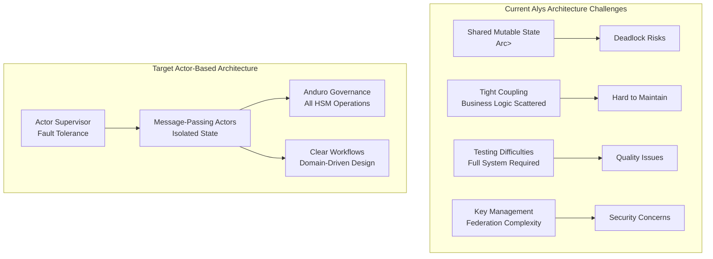
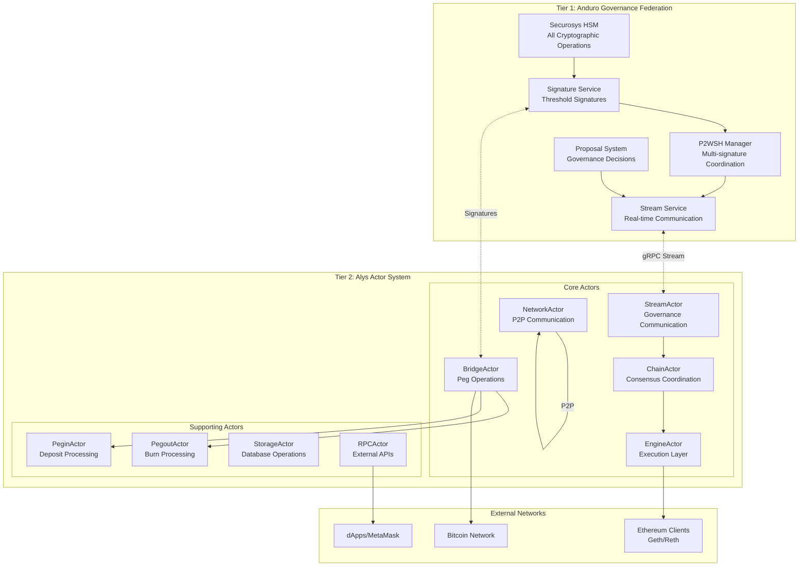
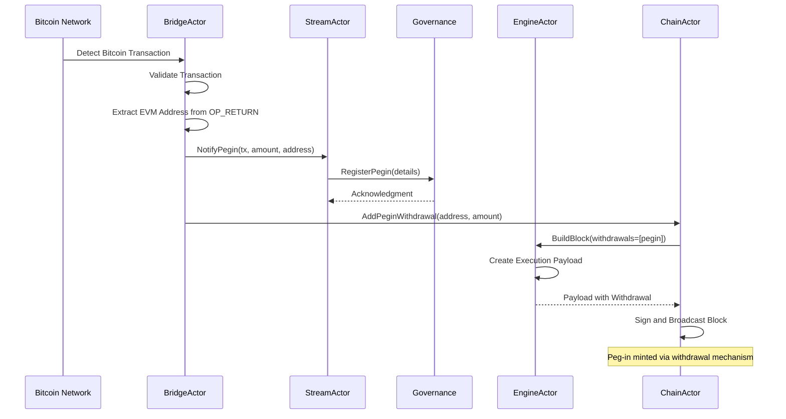
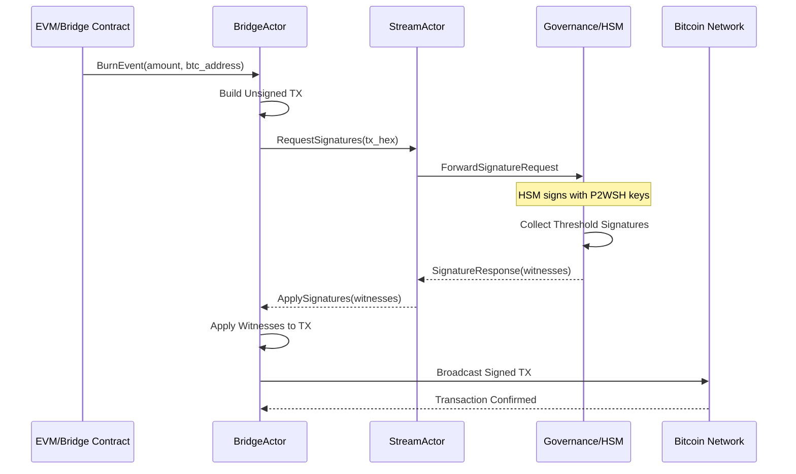

# Alys-Anduro Governance Integration Knowledge Graph

## Executive Summary

This knowledge graph consolidates the comprehensive integration strategy for incorporating Anduro Governance into the Alys sidechain architecture. The integration leverages actor-based patterns to modernize Alys's architecture while enabling HSM-based P2WSH signatures, cross-chain coordination, and dynamic federation management. All cryptographic operations are abstracted to Anduro Governance, with Alys focusing solely on transaction orchestration and network operations.

## Architecture Overview

### Current State Analysis



### Integration Architecture



## Actor Model Implementation

### Core Actor System Design

**Key Principles:**
1. **Message-Passing Architecture**: No shared mutable state between actors
2. **Supervision Trees**: Automatic recovery from failures
3. **Location Transparency**: Actors can be local or remote
4. **Isolated State**: Each actor owns and manages its own state

```rust
/// Root supervisor for the Alys actor system
pub struct AlysSupervisor {
    // Core actors with automatic restart on failure
    pub stream_actor: Addr<StreamActor>,
    pub bridge_actor: Addr<BridgeActor>,
    pub chain_actor: Addr<ChainActor>,
    pub engine_actor: Addr<EngineActor>,
    pub network_actor: Addr<NetworkActor>,
    
    // Configuration and monitoring
    config: AlysConfig,
    metrics: ActorMetrics,
}

impl AlysSupervisor {
    pub async fn start(config: AlysConfig) -> Result<Self> {
        // Start actors with supervision strategies
        let stream_actor = Supervisor::start_in_arbiter(
            &Arbiter::new().handle(),
            |_| StreamActor::new(config.stream_config)
        );
        
        // Configure restart strategies
        stream_actor.set_mailbox_capacity(1000);
        stream_actor.set_restart_strategy(RestartStrategy::ExponentialBackoff {
            min_backoff: Duration::from_secs(1),
            max_backoff: Duration::from_secs(60),
            max_restarts: 10,
        });
        
        Ok(Self { /* ... */ })
    }
}
```

### StreamActor: Governance Communication

**Responsibilities:**
- Maintain persistent connection to Anduro Governance
- Route messages between governance and local actors
- Handle reconnection and message buffering
- NO cryptographic operations (all handled by governance)

```rust
pub struct StreamActor {
    governance_endpoint: String,
    stream: Option<Streaming<StreamResponse>>,
    
    // Message routing
    chain_actor: Option<Addr<ChainActor>>,
    bridge_actor: Option<Addr<BridgeActor>>,
    
    // Resilience features
    reconnect_strategy: ExponentialBackoff,
    message_buffer: VecDeque<OutgoingMessage>,
    health_monitor: HealthMonitor,
}

#[derive(Message)]
#[rtype(result = "Result<()>")]
pub enum StreamMessage {
    // Request signatures from governance (no local HSM)
    RequestSignatures {
        tx_hex: String,
        input_indices: Vec<usize>,
        amounts: Vec<u64>,
    },
    
    // Receive completed signatures
    SignatureResponse {
        request_id: String,
        witnesses: Vec<WitnessData>,
    },
    
    // Federation membership updates
    MembershipUpdate {
        version: u32,
        members: Vec<Member>,
        threshold: usize,
        p2wsh_address: Address,  // New address from governance
    },
    
    // Governance proposals
    ProposalNotification {
        proposal_id: String,
        category: ProposalCategory,
        data: serde_json::Value,
    },
}
```

### BridgeActor: Peg Operations Management

**Responsibilities:**
- Build unsigned Bitcoin transactions
- Coordinate signature collection via governance
- Broadcast signed transactions
- Track peg operation state

```rust
pub struct BridgeActor {
    // Governance communication
    stream_actor: Addr<StreamActor>,
    
    // Bitcoin operations (no key management)
    bitcoin_core: Arc<BitcoinCore>,
    utxo_manager: Arc<UtxoManager>,  // Read-only UTXO tracking
    
    // Operation tracking
    pending_pegouts: HashMap<String, PendingPegout>,
    pending_pegins: HashMap<Txid, PendingPegin>,
    
    // State machine for operations
    operation_fsm: PegOperationStateMachine,
}

impl Handler<ProcessPegout> for BridgeActor {
    type Result = ResponseActFuture<Self, Result<PegoutResult>>;
    
    fn handle(&mut self, msg: ProcessPegout, _ctx: &mut Context<Self>) -> Self::Result {
        Box::pin(async move {
            // Step 1: Build unsigned transaction
            let unsigned_tx = self.build_pegout_transaction(
                msg.amount,
                msg.destination
            ).await?;
            
            // Step 2: Request signatures from governance
            // Note: NO local signing or HSM operations
            let sig_request = SignatureRequest {
                chain: "Alys".to_string(),
                tx_hex: hex::encode(serialize(&unsigned_tx)),
                input_indices: (0..unsigned_tx.input.len()).collect(),
                amounts: self.get_input_amounts(&unsigned_tx).await?,
            };
            
            self.stream_actor.send(StreamMessage::RequestSignatures(sig_request)).await?;
            
            // Step 3: Track pending operation
            self.pending_pegouts.insert(request_id, PendingPegout {
                unsigned_tx,
                burn_tx_hash: msg.burn_tx_hash,
                state: PegoutState::SignatureRequested,
            });
            
            Ok(PegoutResult::Pending(request_id))
        }.into_actor(self))
    }
}
```

### EngineActor: Execution Layer Integration

**Current Engine.rs Analysis:**
The existing `Engine` struct in `app/src/engine.rs` is already well-structured but could benefit from actor model refactoring:

**Current Issues:**
1. Direct RwLock usage for finalized state (line 81)
2. Synchronous error handling mixed with async operations
3. Tight coupling between Engine API calls

**Actor-Based Refactoring:**

```rust
pub struct EngineActor {
    // Engine API connections
    authenticated_api: HttpJsonRpc,    // Port 8551
    public_api: HttpJsonRpc,          // Port 8545
    
    // State management (owned by actor)
    finalized_block: Option<ExecutionBlockHash>,
    pending_payloads: HashMap<PayloadId, ExecutionPayload>,
    
    // Metrics and monitoring
    metrics: EngineMetrics,
}

#[derive(Message)]
#[rtype(result = "Result<ExecutionPayload>")]
pub struct BuildBlock {
    pub timestamp: Duration,
    pub parent: Option<ExecutionBlockHash>,
    pub withdrawals: Vec<Withdrawal>,  // Peg-ins as withdrawals
}

#[derive(Message)]
#[rtype(result = "Result<ExecutionBlockHash>")]
pub struct CommitBlock {
    pub payload: ExecutionPayload<MainnetEthSpec>,
}

impl Handler<BuildBlock> for EngineActor {
    type Result = ResponseActFuture<Self, Result<ExecutionPayload>>;
    
    fn handle(&mut self, msg: BuildBlock, _ctx: &mut Context<Self>) -> Self::Result {
        Box::pin(async move {
            // Isolated state management - no RwLock needed
            let finalized = self.finalized_block.unwrap_or_default();
            
            // Build forkchoice state
            let forkchoice_state = ForkchoiceState {
                head_block_hash: msg.parent.unwrap_or(self.get_latest_block().await?),
                finalized_block_hash: finalized,
                safe_block_hash: finalized,
            };
            
            // Create payload attributes
            let payload_attributes = PayloadAttributes::new(
                msg.timestamp.as_secs(),
                Default::default(),  // randao
                Address::from_str(DEAD_ADDRESS).unwrap(),  // fee recipient
                Some(msg.withdrawals),  // peg-in deposits
            );
            
            // Request payload building
            let response = self.authenticated_api
                .forkchoice_updated(forkchoice_state, Some(payload_attributes))
                .await
                .map_err(|e| self.record_error("forkchoice_updated", e))?;
            
            let payload_id = response.payload_id
                .ok_or(Error::PayloadIdUnavailable)?;
            
            // Get built payload
            let payload = self.authenticated_api
                .get_payload::<MainnetEthSpec>(ForkName::Capella, payload_id)
                .await
                .map_err(|e| self.record_error("get_payload", e))?;
            
            // Cache payload for potential reuse
            self.pending_payloads.insert(payload_id, payload.clone());
            
            Ok(payload.execution_payload_ref().clone_from_ref())
        }.into_actor(self))
    }
}
```

### ChainActor: Consensus Coordination

**Refactoring the monolithic Chain struct:**

```rust
pub struct ChainActor {
    // Consensus components
    aura: AuraConsensus,
    auxpow: Option<AuxPowMiner>,
    
    // Child actors for specific responsibilities
    engine_actor: Addr<EngineActor>,
    bridge_actor: Addr<BridgeActor>,
    storage_actor: Addr<StorageActor>,
    
    // Chain state (owned by this actor)
    head: ConsensusBlock,
    finalized: Option<ConsensusBlock>,
    pending_pow: Option<AuxPowHeader>,
}

#[derive(Message)]
#[rtype(result = "Result<()>")]
pub enum ChainMessage {
    ProduceBlock { slot: u64, timestamp: Duration },
    ImportBlock { block: SignedConsensusBlock },
    UpdateFederation { version: u32, members: Vec<Member> },
    FinalizeBlocks { pow_header: AuxPowHeader },
}

impl Handler<ChainMessage> for ChainActor {
    type Result = ResponseActFuture<Self, Result<()>>;
    
    fn handle(&mut self, msg: ChainMessage, ctx: &mut Context<Self>) -> Self::Result {
        match msg {
            ChainMessage::ProduceBlock { slot, timestamp } => {
                Box::pin(self.handle_produce_block(slot, timestamp).into_actor(self))
            },
            ChainMessage::ImportBlock { block } => {
                Box::pin(self.handle_import_block(block).into_actor(self))
            },
            // ... other message handlers
        }
    }
}

impl ChainActor {
    async fn handle_produce_block(&mut self, slot: u64, timestamp: Duration) -> Result<()> {
        // Step 1: Check if we should produce
        if !self.aura.should_produce(slot) {
            return Ok(());
        }
        
        // Step 2: Prepare withdrawals (peg-ins)
        let withdrawals = self.bridge_actor
            .send(GetPendingPegins)
            .await??
            .into_iter()
            .map(Into::into)
            .collect();
        
        // Step 3: Build execution payload
        let payload = self.engine_actor
            .send(BuildBlock {
                timestamp,
                parent: Some(self.head.execution_payload.block_hash),
                withdrawals,
            })
            .await??;
        
        // Step 4: Create and sign consensus block
        let signed_block = self.aura.sign_block(payload, slot)?;
        
        // Step 5: Broadcast to network
        self.network_actor
            .send(BroadcastBlock(signed_block))
            .await??;
        
        Ok(())
    }
}
```

## Consolidated Workflows

### Peg-In Workflow



### Peg-Out Workflow



## Implementation Milestones

### Phase 1: Foundation (Weeks 1-2)
**Objective**: Establish actor system and governance communication

- [ ] Set up Actix actor system with supervision
- [ ] Implement StreamActor for governance connection
- [ ] Create message routing infrastructure
- [ ] Remove all HSM/key management from Alys
- [ ] Implement reconnection and buffering strategies

### Phase 2: Core Actor Migration (Weeks 3-4)
**Objective**: Migrate core components to actor model

- [ ] Convert BridgeActor for peg operations
- [ ] Refactor Engine to EngineActor
- [ ] Create ChainActor from monolithic Chain
- [ ] Implement actor message protocols
- [ ] Create test harnesses with mocks

### Phase 3: Federation Integration (Weeks 5-6)
**Objective**: Integrate P2WSH federation management

- [ ] Implement membership synchronization
- [ ] Add P2WSH address management
- [ ] Create signature collection workflows
- [ ] Handle federation updates dynamically
- [ ] Test threshold signature operations

### Phase 4: Extended Actors (Weeks 7-8)
**Objective**: Complete actor migration for all components

- [ ] NetworkActor for P2P operations
- [ ] StorageActor for database operations
- [ ] RPCActor for external API handling
- [ ] MiningActor for AuxPow coordination
- [ ] Implement event bus for cross-actor communication

### Phase 5: Advanced Features (Weeks 9-10)
**Objective**: Add governance-specific features

- [ ] Proposal handling system
- [ ] Cross-chain coordination
- [ ] Emergency pause mechanisms
- [ ] Validator set management
- [ ] Comprehensive metrics and monitoring

### Phase 6: Technical Debt Reduction (Weeks 11-12)
**Objective**: Clean up and optimize

- [ ] Remove Arc<RwLock<>> patterns
- [ ] Consolidate business logic
- [ ] Update to Lighthouse v5.0.0
- [ ] Evaluate Reth compatibility
- [ ] Implement domain-driven design patterns

### Phase 7: Testing & Production (Weeks 13-14)
**Objective**: Ensure production readiness

- [ ] End-to-end integration tests
- [ ] Property-based testing
- [ ] Performance benchmarking
- [ ] Chaos testing for resilience
- [ ] Documentation and runbooks

## Actor Model Benefits Analysis

### Current Problems Solved

**1. Shared Mutable State Issues**
```rust
// Current problematic pattern:
let chain = Arc::new(RwLock::new(Chain::new(...)));
let chain_clone = chain.clone();
tokio::spawn(async move {
    chain_clone.write().await.process_block(block);  // Potential deadlock
});

// Actor solution:
chain_actor.send(ProcessBlock { block }).await?;  // Message-based, no locks
```

**2. Testing Complexity**
```rust
// Current: Need full system setup
let chain = setup_entire_chain_with_deps().await;
let result = chain.process_pegout(...);

// Actor: Test in isolation
let bridge = BridgeActor::new(mock_config());
let result = bridge.send(ProcessPegout { ... }).await?;
assert!(result.is_ok());
```

**3. Error Recovery**
```rust
// Actor supervision provides automatic recovery
impl Supervised for StreamActor {}

impl Actor for StreamActor {
    fn started(&mut self, ctx: &mut Context<Self>) {
        // Automatic restart on panic
    }
    
    fn stopped(&mut self, ctx: &mut Context<Self>) {
        // Cleanup and restart logic
    }
}
```

### Components That Benefit from Actor Model

**1. Network Layer**
- Each peer connection as an actor
- Message routing actor for protocol handling
- Gossipsub actor for block/tx propagation
- Benefits: Isolated peer failures, easy testing, clean protocol separation

**2. Storage Layer**
- Database connection pool actor
- Cache management actor
- UTXO tracking actor
- Benefits: Transaction isolation, connection pooling, cache coherency

**3. RPC Layer**
- Request handler actors (one per connection)
- Rate limiting actor
- Response aggregator actor
- Benefits: Request isolation, backpressure handling, resource management

**4. Mining Coordination**
- AuxPow coordinator actor
- Miner connection actors
- Work distribution actor
- Benefits: Parallel work distribution, miner fault tolerance

## Technical Debt Reduction Strategies

### 1. Domain-Driven Design

```rust
/// Clear domain entities with state machines
pub struct PegOperation {
    pub id: Uuid,
    pub operation_type: PegType,
    pub state: PegState,
    pub bitcoin_tx: Option<Txid>,
    pub evm_tx: Option<H256>,
    pub amount: u64,
    pub created_at: DateTime<Utc>,
    pub updated_at: DateTime<Utc>,
}

#[derive(Debug, Clone)]
pub enum PegState {
    Pending,
    BitcoinConfirmed,
    SignatureRequested,
    SignaturesReceived { count: usize, required: usize },
    Broadcast,
    Completed,
    Failed { reason: String, recoverable: bool },
}

impl PegOperation {
    /// Type-safe state transitions
    pub fn transition(&mut self, event: PegEvent) -> Result<()> {
        self.state = match (&self.state, event) {
            (PegState::Pending, PegEvent::BitcoinConfirmed) => {
                PegState::BitcoinConfirmed
            },
            (PegState::BitcoinConfirmed, PegEvent::SignatureRequested) => {
                PegState::SignatureRequested
            },
            (PegState::SignatureRequested, PegEvent::SignatureReceived(n, r)) => {
                PegState::SignaturesReceived { count: n, required: r }
            },
            (PegState::SignaturesReceived { count, required }, _) 
                if count >= required => {
                PegState::Broadcast
            },
            _ => return Err(Error::InvalidStateTransition),
        };
        self.updated_at = Utc::now();
        Ok(())
    }
}
```

### 2. Event-Driven Architecture

```rust
/// Centralized event bus with tracing
pub struct EventBus {
    subscribers: HashMap<EventType, Vec<Addr<dyn EventHandler>>>,
    metrics: EventMetrics,
}

#[derive(Debug, Clone)]
pub enum AlysEvent {
    // Peg events
    PegInDetected { tx: Txid, amount: u64, address: H160 },
    PegOutRequested { burn_tx: H256, amount: u64, destination: String },
    SignaturesCollected { request_id: String, count: usize },
    
    // Consensus events
    BlockProduced { slot: u64, hash: H256 },
    BlockFinalized { hash: H256, height: u64 },
    
    // Network events
    PeerConnected { peer_id: PeerId },
    PeerDisconnected { peer_id: PeerId, reason: String },
    
    // System events
    ActorRestarted { actor: String, attempt: u32 },
    Error { context: String, error: String, recoverable: bool },
}

impl EventBus {
    pub async fn publish(&self, event: AlysEvent) {
        let span = tracing::span!(Level::INFO, "event", ?event);
        let _enter = span.enter();
        
        // Update metrics
        self.metrics.record_event(&event);
        
        // Notify subscribers
        if let Some(subscribers) = self.subscribers.get(&event.event_type()) {
            for subscriber in subscribers {
                subscriber.send(HandleEvent(event.clone())).await.ok();
            }
        }
    }
}
```

### 3. Dependency Updates

**Lighthouse Migration Strategy:**
```toml
# Staged migration approach
[dependencies.lighthouse]
version = "5.0.0"
default-features = false
features = ["minimal", "capella"]

# Compatibility layer for gradual migration
[dependencies.lighthouse-compat]
path = "crates/lighthouse-compat"
```

**Reth Integration:**
```rust
/// Abstraction for multiple execution clients
pub enum ExecutionClient {
    Geth(GethClient),
    Reth(RethClient),
}

impl ExecutionClient {
    pub async fn build_block(&self, attrs: PayloadAttributes) -> Result<ExecutionPayload> {
        match self {
            Self::Geth(client) => client.build_block_geth(attrs).await,
            Self::Reth(client) => client.build_block_reth(attrs).await,
        }
    }
}
```

## Security Considerations

### Key Security Improvements

**1. No Key Material in Alys**
- All private keys remain in Anduro Governance HSM
- Alys only handles unsigned transactions and witness application
- Eliminates key exposure risk in Alys codebase

**2. Actor Isolation**
- Each actor has isolated state
- Failure in one actor doesn't compromise others
- Clear security boundaries between components

**3. Message Authentication**
- All governance messages are authenticated
- TLS + JWT for stream connections
- Message signing for critical operations

## Performance Optimizations

### Actor Performance Patterns

```rust
/// Batching for efficiency
impl BridgeActor {
    fn handle_batch(&mut self, ctx: &mut Context<Self>) {
        // Process pegouts in batches
        ctx.run_interval(Duration::from_secs(10), |act, _| {
            if act.pending_pegouts.len() >= 5 {
                act.batch_process_pegouts();
            }
        });
    }
}

/// Caching for repeated operations
impl EngineActor {
    async fn get_latest_block_cached(&mut self) -> Result<ExecutionBlockHash> {
        if let Some((hash, time)) = self.latest_block_cache {
            if time.elapsed() < Duration::from_secs(2) {
                return Ok(hash);
            }
        }
        let hash = self.fetch_latest_block().await?;
        self.latest_block_cache = Some((hash, Instant::now()));
        Ok(hash)
    }
}
```

## Testing Strategy

### Comprehensive Test Framework

```rust
/// Actor test harness
pub struct ActorTestHarness {
    system: System,
    supervisor: AlysSupervisor,
    mock_governance: MockGovernanceSimulator,
    mock_bitcoin: MockBitcoinNetwork,
    mock_evm: MockEvmEngine,
}

impl ActorTestHarness {
    /// Test complete peg cycle
    pub async fn test_full_peg_cycle(&mut self) -> Result<()> {
        // Peg-in
        let pegin_tx = self.mock_bitcoin.create_pegin(1_000_000_000);
        self.supervisor.bridge_actor
            .send(ProcessPegin { tx: pegin_tx })
            .await??;
        assert!(self.mock_evm.verify_mint(1_000_000_000).await);
        
        // Peg-out
        let burn_event = self.mock_evm.create_burn(1_000_000_000);
        self.supervisor.bridge_actor
            .send(ProcessPegout { event: burn_event })
            .await??;
        assert!(self.mock_bitcoin.verify_broadcast().await);
        
        Ok(())
    }
    
    /// Test actor recovery
    pub async fn test_actor_recovery(&mut self) -> Result<()> {
        // Kill stream actor
        self.supervisor.stream_actor.stop();
        
        // Verify automatic restart
        tokio::time::sleep(Duration::from_secs(2)).await;
        assert!(self.supervisor.stream_actor.connected());
        
        Ok(())
    }
}

/// Property-based testing
proptest! {
    #[test]
    fn test_concurrent_pegouts(num_pegouts in 1usize..100) {
        let runtime = tokio::runtime::Runtime::new().unwrap();
        runtime.block_on(async {
            let mut harness = ActorTestHarness::new().await;
            let futures = (0..num_pegouts)
                .map(|i| harness.process_pegout(1_000_000 * i as u64));
            
            let results = futures::future::join_all(futures).await;
            assert!(results.iter().all(|r| r.is_ok()));
        });
    }
}
```

## Metrics and Monitoring

```rust
lazy_static! {
    // Actor metrics
    pub static ref ACTOR_MESSAGE_LATENCY: Histogram = register_histogram!(
        "alys_actor_message_latency_seconds",
        "Time to process actor messages"
    ).unwrap();
    
    pub static ref ACTOR_MAILBOX_SIZE: IntGauge = register_int_gauge!(
        "alys_actor_mailbox_size",
        "Current mailbox size per actor"
    ).unwrap();
    
    pub static ref ACTOR_RESTARTS: IntCounter = register_int_counter!(
        "alys_actor_restarts_total",
        "Total actor restarts"
    ).unwrap();
    
    // Governance integration metrics
    pub static ref GOVERNANCE_STREAM_STATUS: IntGauge = register_int_gauge!(
        "alys_governance_stream_connected",
        "Governance stream connection status"
    ).unwrap();
    
    pub static ref SIGNATURE_COLLECTION_TIME: Histogram = register_histogram!(
        "alys_signature_collection_duration_seconds",
        "Time to collect threshold signatures"
    ).unwrap();
    
    pub static ref MEMBERSHIP_VERSION: IntGauge = register_int_gauge!(
        "alys_federation_membership_version",
        "Current federation membership version"
    ).unwrap();
}
```

## Risk Analysis

### Technical Risks

| Risk | Impact | Probability | Mitigation |
|------|--------|-------------|------------|
| Actor system complexity | Medium | Medium | Gradual migration, extensive testing, training |
| Stream connection instability | High | Medium | Exponential backoff, message buffering, fallback endpoints |
| Signature collection timeout | High | Low | Adequate timeouts, retry logic, monitoring alerts |
| Lighthouse breaking changes | High | Medium | Compatibility layer, staged migration |
| Performance regression | Medium | Low | Benchmarking, profiling, optimization |

### Operational Risks

| Risk | Impact | Mitigation |
|------|--------|------------|
| Governance node unavailability | High | Multiple endpoints, client-side failover, caching |
| Migration disruption | High | Feature flags, phased rollout, rollback procedures |
| Monitoring gaps | Medium | Comprehensive metrics, alerting, runbooks |
| Documentation lag | Low | Automated docs generation, code comments |

## Success Metrics

### Performance Targets
- **Actor message latency**: < 10ms p99
- **Stream reconnection**: < 5s
- **Signature collection**: < 5s for threshold
- **Peg-in processing**: < 500ms
- **Peg-out completion**: < 2 minutes end-to-end
- **System availability**: > 99.9%

### Quality Targets
- **Test coverage**: > 90% for critical paths
- **Actor supervision recovery**: 100%
- **Code complexity reduction**: 50%
- **Developer onboarding**: < 1 week

## Conclusion

The integration of Anduro Governance with Alys through actor-based architecture represents a transformative upgrade that addresses current architectural limitations while enabling advanced features:

### Key Benefits Achieved

1. **Enhanced Security**: Complete abstraction of cryptographic operations to Anduro Governance HSM
2. **Improved Testability**: Isolated actors enable comprehensive unit and integration testing
3. **Better Resilience**: Supervision trees provide automatic recovery from failures
4. **Cleaner Architecture**: Message-passing eliminates shared mutable state issues
5. **Scalability**: Actor model naturally supports horizontal scaling
6. **Maintainability**: Clear separation of concerns and domain-driven design
7. **Developer Experience**: Self-documenting patterns and clear execution flows

### Strategic Advantages

1. **Cross-chain Interoperability**: Unified custody across Anduro ecosystem
2. **Dynamic Federation Management**: Membership updates without disruption
3. **Governance Integration**: Proposal system for configuration and upgrades
4. **Future Flexibility**: Actor model provides foundation for future enhancements

The phased implementation approach ensures minimal disruption while progressively modernizing the codebase. The comprehensive testing strategy and monitoring infrastructure provide confidence in the refactored system's reliability and performance.

### Next Steps

1. **Prototype Development**: Build proof-of-concept for StreamActor and BridgeActor
2. **Performance Baseline**: Benchmark current system for comparison
3. **Team Training**: Conduct actor model workshops for development team
4. **Testnet Deployment**: Deploy initial actors to testnet for validation
5. **Gradual Rollout**: Use feature flags for progressive production deployment

This architecture positions Alys as a modern, resilient sidechain that leverages the best of both actor-based design patterns and secure governance infrastructure, setting the foundation for long-term success in the Anduro ecosystem.