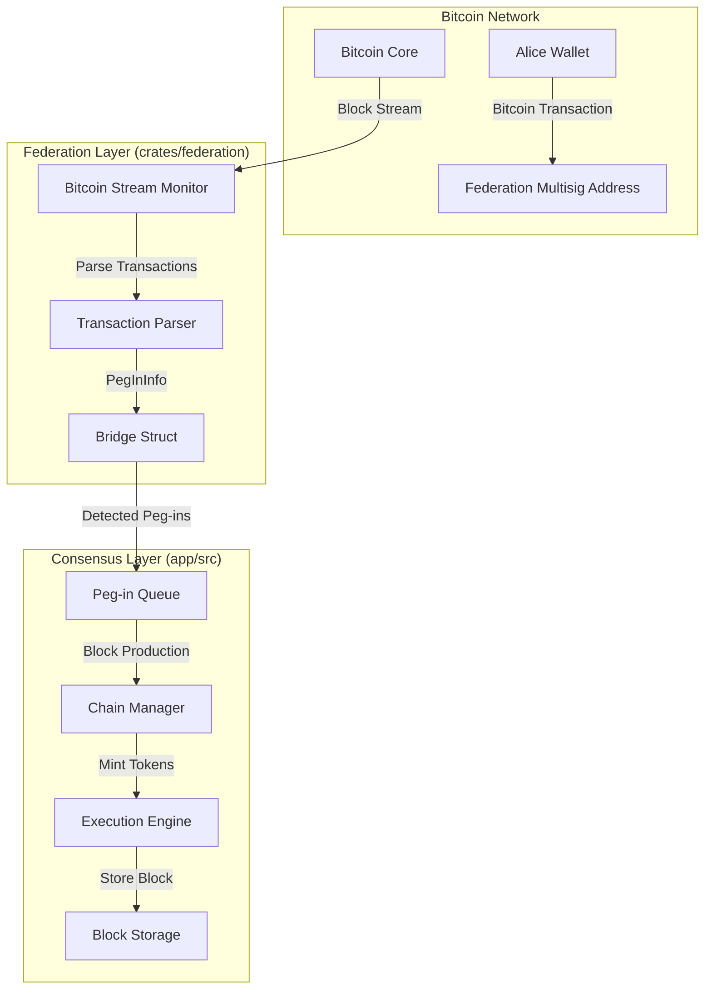
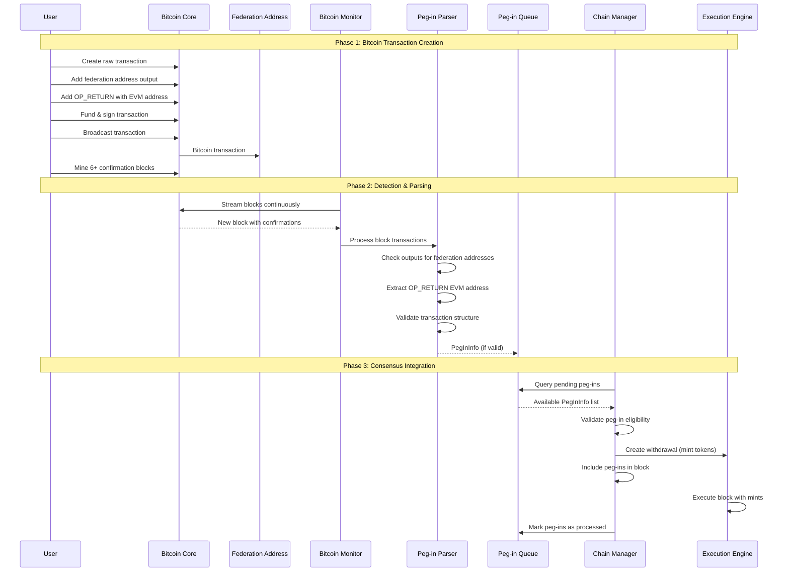

# Alys Peg-In Technical Guide

## Overview

This comprehensive technical guide covers the peg-in (Bitcoin → Alys) transaction system in the Alys Bitcoin sidechain. Peg-ins allow users to transfer Bitcoin from the Bitcoin mainnet to the Alys sidechain, where it becomes bridged BTC that can be used within the Ethereum-compatible execution environment.

## Table of Contents

1. [System Architecture](#system-architecture)
2. [Peg-In Data Structures](#peg-in-data-structures)
3. [Complete Flow Diagram](#complete-flow-diagram)
4. [Implementation Deep Dive](#implementation-deep-dive)
5. [Code References](#code-references)
6. [Testing Guide](#testing-guide)
7. [Troubleshooting](#troubleshooting)
8. [Security Considerations](#security-considerations)

## System Architecture

The peg-in system involves three main layers:



## Peg-In Data Structures

### Core Data Types

#### PegInInfo Structure
```rust
// Location: crates/federation/src/lib.rs:76-82
pub struct PegInInfo {
    pub txid: Txid,           // Bitcoin transaction ID
    pub block_hash: BlockHash, // Bitcoin block hash containing the transaction
    pub amount: u64,          // Amount in satoshis
    pub evm_account: H160,    // Destination EVM address
    pub block_height: u32,    // Bitcoin block height
}
```

#### Bridge Configuration
```rust
// Location: crates/federation/src/lib.rs:84-88
pub struct Bridge {
    pegin_addresses: Vec<BitcoinAddress>,  // Federation multisig addresses
    bitcoin_core: BitcoinCore,             // Bitcoin RPC interface
    required_confirmations: u16,           // Minimum confirmations (typically 6)
}
```

#### Block Integration
```rust
// Location: app/src/block.rs:66
pub struct ConsensusBlockMessage<E: EthSpec> {
    // ... other fields
    pub pegins: Vec<(Txid, BlockHash)>,    // Peg-ins to process in this block
    // ... other fields
}
```

## Complete Flow Diagram



## Implementation Deep Dive

### 1. Bitcoin Transaction Creation

**Location**: `scripts/utils/bitcoin.sh:34-47`

The peg-in process starts with creating a Bitcoin transaction that has:
- An output to the federation multisig address with the BTC amount
- An OP_RETURN output containing the destination EVM address

```bash
# Core function for creating peg-in transaction
function pegin() {
    payment='[{"'$1'":"'$2'"},{"data":"'$3'"}]'
    # Step 1: Generate the transaction
    unfunded=$(bitcoin-cli createrawtransaction '[]' $payment)
    # Step 2: Fund the transaction  
    funded=$(bitcoin-cli fundrawtransaction $unfunded | jq -r '.hex')
    # Step 3: Sign the transaction
    signed=$(bitcoin-cli signrawtransactionwithwallet $funded | jq -r '.hex')
    # Step 4: Send the transaction
    txid=$(bitcoin-cli sendrawtransaction $signed)
    # Step 5: Mine with 7 confirmations (> 6 required)
    block=$(bitcoin-cli generatetoaddress 7 bcrt1qewndkwr0evznxz7urnhlv5eav9rx2clsf0lh77)
    echo $block
}
```

**Key Parameters**:
- `$1`: Federation multisig address
- `$2`: BTC amount to transfer  
- `$3`: EVM address (without 0x prefix)

### 2. Bitcoin Block Monitoring

**Location**: `crates/federation/src/lib.rs:107-146`

The federation continuously monitors Bitcoin blocks for new peg-in transactions:

```rust
pub async fn stream_blocks_for_pegins<F, R>(&self, start_height: u32, cb: F)
where
    F: Fn(Vec<PegInInfo>, u32) -> R,
    R: Future<Output = ()>,
{
    info!("Starting to stream blocks for peg-ins from height {}", start_height);

    let mut stream = stream_blocks(
        self.bitcoin_core.clone(),
        start_height,
        self.required_confirmations.into(),
    ).await;
    
    while let Some(x) = stream.next().await {
        let (block, height) = x.unwrap();
        let block_hash = block.block_hash();
        
        // Extract peg-ins from block transactions
        let pegins: Vec<PegInInfo> = block
            .txdata
            .iter()
            .filter_map(|tx| self.pegin_info(tx, block_hash, height))
            .collect();
            
        info!("Found {} peg-ins in block at height {}", pegins.len(), height);
        cb(pegins, height).await;
    }
}
```

### 3. Transaction Parsing and Validation

**Location**: `crates/federation/src/lib.rs:201-256`

Each Bitcoin transaction is parsed to determine if it's a valid peg-in:

```rust
fn pegin_info(
    &self,
    tx: &Transaction,
    block_hash: BlockHash,
    block_height: u32,
) -> Option<PegInInfo> {
    // Extract EVM address from OP_RETURN output
    fn extract_evm_address(tx_out: &TxOut) -> Option<H160> {
        if !tx_out.script_pubkey.is_provably_unspendable() 
            || !tx_out.script_pubkey.is_op_return() {
            return None;
        }
        
        let opreturn = tx_out.script_pubkey.to_asm_string();
        let op_return_hex_string = opreturn.split(' ').last().unwrap().to_string();
        
        // Try parsing as direct hex first
        if let Ok(data) = Vec::from_hex(&op_return_hex_string) {
            // Try UTF-8 string format
            if let Ok(address_str) = String::from_utf8(data) {
                if let Ok(address) = H160::from_str(&address_str) {
                    return Some(address);
                }
            }
            // Try direct hex format  
            if let Ok(address) = H160::from_str(&op_return_hex_string) {
                return Some(address);
            }
        }
        None
    }

    // Find output to federation address
    let amount = tx.output
        .iter()
        .find(|output| {
            self.pegin_addresses
                .iter()
                .any(|pegin_address| pegin_address.matches_script_pubkey(&output.script_pubkey))
        })
        .map(|x| x.value)?;

    // Extract EVM address from OP_RETURN
    let evm_account = tx.output.iter().find_map(extract_evm_address)?;

    Some(PegInInfo {
        txid: tx.txid(),
        block_hash,
        block_height,
        amount,
        evm_account,
    })
}
```

### 4. Peg-In Queue Management

**Location**: `app/src/chain.rs:2444-2469`

Detected peg-ins are queued for processing:

```rust
// Bitcoin monitoring integration in Chain
self.bridge
    .stream_blocks_for_pegins(start_height, |pegins, bitcoin_height| async move {
        for pegin in pegins.into_iter() {
            if is_synced {
                info!(
                    "Found pegin {} for {} in {}",
                    pegin.amount, pegin.evm_account, pegin.txid
                );
                chain.queued_pegins.write().await.insert(pegin.txid, pegin);
                CHAIN_BTC_BLOCK_MONITOR_TOTALS
                    .with_label_values(&["queued_pegins", "synced"])
                    .inc();
            } else {
                debug!(
                    "Not synced, ignoring pegin {} for {} in {}",
                    pegin.amount, pegin.evm_account, pegin.txid
                );
                break;
            }
        }
    })
    .await;
```

### 5. Block Production Integration  

**Location**: `app/src/chain.rs:252-381`

During block production, queued peg-ins are processed:

```rust
async fn fill_pegins(
    &self,
    add_balances: &mut Vec<(Address, ConsensusAmount)>,
) -> Vec<(Txid, BlockHash)> {
    let mut processed_pegins = Vec::new();
    let mut total_pegin_amount: u64 = 0;
    
    // Remove already processed peg-ins
    let mut txids = self.queued_pegins.read().await.keys().copied().collect::<Vec<_>>();
    
    // Filter for existing transactions in wallet
    {
        let wallet = self.bitcoin_wallet.read().await;
        txids.retain(|txid| wallet.get_tx(txid).unwrap().is_some());
    }
    
    // Remove processed transactions from queue
    for already_processed_txid in txids {
        self.queued_pegins.write().await.remove(&already_processed_txid);
    }
    
    // Process remaining peg-ins
    let queued_pegins = self.queued_pegins.read().await;
    for pegin in queued_pegins.values() {
        // Check withdrawal limits
        let current_amount = withdrawals.get(&pegin.evm_account).unwrap_or(&0u64);
        if *current_amount == 0 || withdrawals.contains_key(&pegin.evm_account) {
            withdrawals
                .entry(pegin.evm_account)
                .and_modify(|x| *x += pegin.amount)
                .or_insert(pegin.amount);
                
            processed_pegins.push((pegin.txid, pegin.block_hash));
            total_pegin_amount += pegin.amount;
            
            info!(
                "Added pegin to processing queue: {} sats to {}",
                pegin.amount, pegin.evm_account
            );
        }
    }
    
    // Convert to consensus layer withdrawals (mints)
    for (address, amount) in withdrawals {
        add_balances.push((address, ConsensusAmount::from_satoshi(amount)));
    }
    
    processed_pegins
}
```

### 6. Token Minting via Engine API

**Location**: `app/src/chain.rs:575-640` and `app/src/engine.rs:97-150`

The execution engine mints bridged BTC tokens:

```rust
// In chain.rs - block production
let pegins = self.fill_pegins(&mut add_balances).await;
debug!("Filled pegins: {:?}", pegins.len());

let signed_block = SignedConsensusBlock {
    message: ConsensusBlockMessage {
        // ... other fields
        pegins,  // Include processed peg-ins
        // ... other fields
    },
    signature: signature.into(),
};

// In engine.rs - block building with withdrawals
pub async fn build_block(
    &self,
    timestamp: Duration,
    payload_head: Option<ExecutionBlockHash>,
    withdrawals: Vec<AddBalance>,  // Includes peg-in mints
) -> Result<ExecutionPayload<MainnetEthSpec>, Error> {
    
    let withdrawals_lighthouse: VariableList<Withdrawal, MainnetEthSpec::MaxWithdrawalsPerPayload> = 
        withdrawals
            .into_iter()
            .enumerate()
            .map(|(index, withdrawal)| withdrawal.into())
            .collect::<Vec<Withdrawal>>()
            .try_into()
            .unwrap();

    // Build payload with minted tokens as withdrawals
    let payload_attributes = PayloadAttributes {
        timestamp: timestamp.as_secs(),
        prev_randao: Hash256::zero(),
        suggested_fee_recipient: Address::zero(),
        withdrawals: Some(withdrawals_lighthouse),
        parent_beacon_block_root: Some(Hash256::zero()),
    };
    
    // Execute via Engine API
    self.api.get_payload().await
}
```

### 7. Finalization and Storage

**Location**: `app/src/chain.rs:1700-1715`

After block validation, peg-ins are finalized:

```rust
// Process finalized peg-ins
for (txid, block_hash) in verified_block.message.pegins.iter() {
    // Remove from queue
    self.queued_pegins.write().await.remove(txid);
    
    // Register in wallet for UTXO management
    if let Some(tx) = self.bridge.fetch_transaction(txid, block_hash) {
        self.bitcoin_wallet
            .write()
            .await
            .register_pegin(&tx)
            .map_err(|e| error!("Failed to register pegin in wallet: {}", e))
            .ok();
    }
}
```

## Code References

### Key Files and Functions

| Component | File | Function/Struct | Line Numbers |
|-----------|------|-----------------|--------------|
| **Peg-in Data** | `crates/federation/src/lib.rs` | `PegInInfo` | 76-82 |
| **Bridge Setup** | `crates/federation/src/lib.rs` | `Bridge::new()` | 93-103 |
| **Block Monitoring** | `crates/federation/src/lib.rs` | `stream_blocks_for_pegins()` | 107-146 |
| **Transaction Parsing** | `crates/federation/src/lib.rs` | `pegin_info()` | 201-256 |
| **EVM Address Extraction** | `crates/federation/src/lib.rs` | `extract_evm_address()` | 207-235 |
| **Queue Management** | `app/src/chain.rs` | `queued_pegins: RwLock<BTreeMap<Txid, PegInInfo>>` | 141 |
| **Bitcoin Integration** | `app/src/chain.rs` | `monitor_bitcoin_blocks()` | 2444-2469 |
| **Peg-in Processing** | `app/src/chain.rs` | `fill_pegins()` | 252-381 |
| **Block Production** | `app/src/chain.rs` | `produce_consensus_block()` | 575-640 |
| **Wallet Registration** | `crates/federation/src/bitcoin_signing.rs` | `register_pegin()` | 94-101 |
| **Transaction Creation** | `scripts/utils/bitcoin.sh` | `pegin()` | 34-47 |
| **Test Script** | `scripts/regtest_pegin.sh` | Main script | 1-28 |

### Error Handling

| Error Type | Location | Description |
|------------|----------|-------------|
| `PegInAlreadyIncluded` | `app/src/error.rs:33` | Peg-in already processed in block |
| `InsufficientConfirmations` | `crates/federation/src/lib.rs:65-66` | Less than required confirmations |
| `NotAPegin` | `crates/federation/src/lib.rs:67-68` | Transaction not a valid peg-in |
| `BitcoinBlockNotFound` | `crates/federation/src/lib.rs:69-71` | Bitcoin block not found |

### Metrics and Monitoring

| Metric | Location | Description |
|--------|----------|-------------|
| `CHAIN_PEGIN_TOTALS` | `app/src/metrics.rs:89-95` | Total peg-in operations by type |
| `CHAIN_TOTAL_PEGIN_AMOUNT` | `app/src/metrics.rs:96-100` | Total BTC amount processed |
| `CHAIN_BTC_BLOCK_MONITOR_TOTALS` | Various | Bitcoin block monitoring stats |

## Testing Guide

### Local Development Testing

1. **Start Local Network**:
```bash
./scripts/start_network.sh
```

2. **Execute Peg-in**:
```bash
# Basic peg-in with default values
./scripts/regtest_pegin.sh

# Custom amount and address
./scripts/regtest_pegin.sh "2.5" "0x742d35Cc6634C0532925a3b8D4C97FD8D3aD5E70"
```

3. **Verify Balance**:
```bash
cast balance 0x742d35Cc6634C0532925a3b8D4C97FD8D3aD5E70 --rpc-url localhost:8545
```

### Unit Tests

**Location**: `crates/federation/src/lib.rs:368-408`

```rust
#[test]
fn test_pegin_info() {
    let raw_tx = hex::decode("02000000000101d590828406d3a14f...").unwrap();
    let tx: Transaction = deserialize(&raw_tx).unwrap();
    
    let federation = Bridge::new(
        BitcoinCore::new("http://127.0.0.1:18443", "rpcuser", "rpcpassword"),
        vec!["bcrt1pnv0qv2q86ny0my4tycezez7e72jnjns2ays3l4w98v6l383k2h7q0lwmyh"
            .parse().unwrap()],
        2,
    );
    
    let info = federation.pegin_info(&tx, BlockHash::all_zeros(), 0).unwrap();
    assert!(info.amount > 0);
    assert!(info.evm_account != H160::zero());
}
```

### Integration Tests

**Location**: `scripts/tests/3_peg_in.sh`

```bash
#!/usr/bin/env bash
# Test complete peg-in flow
FEDERATION_ADDRESS=$(get_federation_address)
EVM_ADDRESS="09Af4E864b84706fbCFE8679BF696e8c0B472201"

echo "Testing peg-in functionality"
echo "Federation Address: $FEDERATION_ADDRESS"  
echo "EVM Address: $EVM_ADDRESS"

echo "Sending BTC for pegin"
pegin $FEDERATION_ADDRESS "1.0" $EVM_ADDRESS

echo "Waiting for processing..."
sleep 10

# Verify balance increased
BALANCE=$(cast balance 0x$EVM_ADDRESS --rpc-url localhost:8545)
echo "Final balance: $BALANCE"
```

## Troubleshooting

### Common Issues

#### 1. Peg-in Not Detected
**Symptoms**: Bitcoin transaction confirmed but no tokens minted on Alys

**Debugging Steps**:
```bash
# Check if transaction has proper structure
bitcoin-cli getrawtransaction <txid> true

# Verify federation address match
grep "Federation Address" /path/to/alys/logs

# Check Alys logs for parsing errors
grep -i pegin /path/to/alys/logs/consensus.log
```

**Common Causes**:
- OP_RETURN format incorrect
- Insufficient confirmations (< 6)
- Wrong federation address
- EVM address format issues

#### 2. Address Format Issues
**Symptoms**: Valid Bitcoin transaction but EVM address extraction fails

**Solutions**:
- EVM address in OP_RETURN must be without '0x' prefix
- Address should be 40 hex characters exactly
- UTF-8 encoding should be valid

```bash
# Correct format examples:
echo -n "742d35Cc6634C0532925a3b8D4C97FD8D3aD5E70" | xxd
# Not: 0x742d35Cc6634C0532925a3b8D4C97FD8D3aD5E70
```

#### 3. Confirmation Delays
**Symptoms**: Long delays before peg-in processing

**Solutions**:
- Ensure 6+ Bitcoin confirmations
- Check Bitcoin node sync status
- Verify Alys sync status

```bash
# Check Bitcoin confirmations
bitcoin-cli gettransaction <txid>

# Check Alys sync
curl -X POST -H "Content-Type: application/json" \
  -d '{"jsonrpc":"2.0","method":"eth_syncing","params":[],"id":1}' \
  http://localhost:8545
```

### Debug Logging

Enable detailed logging in `app/src/chain.rs`:

```rust
// Add to fill_pegins function
debug!(
    txid = %pegin.txid,
    amount = pegin.amount,
    evm_account = %pegin.evm_account,
    "Processing peg-in"
);
```

### Monitoring Commands

```bash
# Monitor peg-in queue size
curl -s http://localhost:9090/metrics | grep chain_pegin

# Check Bitcoin monitoring
curl -s http://localhost:9090/metrics | grep chain_btc_block_monitor

# View recent blocks
cast block latest --rpc-url localhost:8545
```

## Security Considerations

### 1. Confirmation Requirements
- **Minimum**: 6 Bitcoin confirmations required
- **Rationale**: Protection against chain reorganizations
- **Implementation**: `crates/federation/src/lib.rs:164`

### 2. Address Validation
- **Federation Address**: Must match configured multisig addresses exactly
- **EVM Address**: Validated as proper 20-byte Ethereum address
- **OP_RETURN**: Parsed safely with error handling

### 3. Double Spend Prevention
- **UTXO Tracking**: All peg-ins registered in wallet database
- **Queue Management**: Duplicate processing prevention
- **Block Validation**: Cross-reference with existing transactions

### 4. Amount Validation
- **Minimum Amounts**: No technical minimum, but fee considerations apply
- **Precision**: Satoshi-level accuracy maintained
- **Overflow Protection**: Safe arithmetic operations used

### 5. Network Security
- **Authentication**: Bitcoin RPC requires authentication
- **TLS**: Secure communication channels recommended  
- **Access Control**: Restrict RPC access to authorized nodes only

## Performance Optimizations

### 1. Caching Strategies
- **Block Hash Cache**: Frequent hash lookups optimized
- **Transaction Cache**: Recently processed transactions cached
- **Address Cache**: Federation address validation cached

### 2. Concurrent Processing
- **Async Operations**: Non-blocking I/O throughout
- **Parallel Parsing**: Multiple transactions processed concurrently
- **Queue Management**: Lock-free queue operations where possible

### 3. Database Optimization
- **Indexed Queries**: Primary keys on transaction IDs
- **Batch Operations**: Multiple peg-ins processed together
- **Connection Pooling**: Efficient database connection reuse

This technical guide provides comprehensive coverage of the peg-in system, enabling new engineers to understand the architecture, implementation details, and operational aspects necessary to contribute effectively to the Alys project.