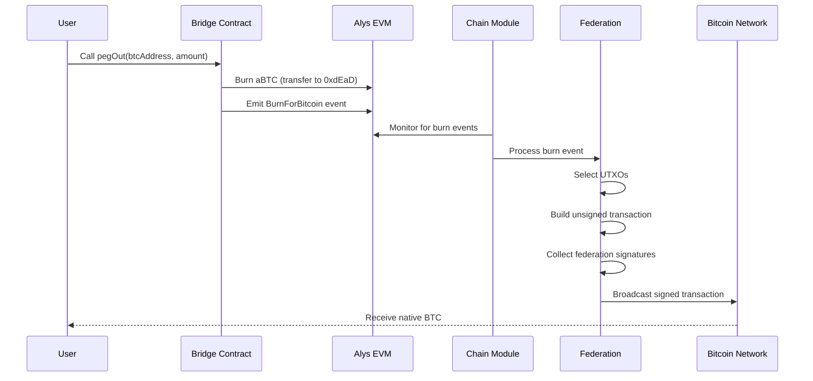

# Alys Peg-Out Technical Guide

## Executive Summary

The peg-out process in Alys enables users to move assets from the Alys sidechain back to the Bitcoin mainchain. This guide provides a comprehensive technical overview of the entire peg-out workflow, from the initial burn event on the EVM to the final Bitcoin transaction broadcast.

## Table of Contents

1. [Overview](#overview)
2. [Architecture Components](#architecture-components)
3. [Peg-Out Workflow](#peg-out-workflow)
4. [Burn Event Detection](#burn-event-detection)
5. [Transaction Building](#transaction-building)
6. [Federation Signing](#federation-signing)
7. [Bitcoin Broadcasting](#bitcoin-broadcasting)
8. [Error Handling & Recovery](#error-handling--recovery)
9. [Security Considerations](#security-considerations)
10. [Testing & Verification](#testing--verification)

## Overview

### What is a Peg-Out?

A peg-out is the process of converting Alys BTC (aBTC) back to native Bitcoin. The process involves:
1. Burning aBTC on the Alys EVM
2. Federation members detecting the burn event
3. Creating an unsigned Bitcoin transaction
4. Collecting federation signatures
5. Broadcasting the signed transaction to Bitcoin

### Key Properties

- **Trustless Verification**: Burn events are cryptographically proven on-chain
- **Threshold Security**: Requires M-of-N federation signatures
- **Atomic Operations**: Either completes fully or fails completely
- **Decentralized Coordination**: No single point of failure

## Architecture Components

### 1. Bridge Contract (Ethereum/EVM Side)

```solidity
// Located at: contracts/src/Alys.sol
// Deployed at: 0xbBbBBBBbbBBBbbbBbbBbbbbBBbBbbbbBbBbbBBbB

contract AlysBridge {
    event BurnForBitcoin(
        address indexed burner,
        uint256 amount,
        string btcAddress
    );
    
    function pegOut(string memory btcAddress) external payable {
        require(msg.value >= MIN_PEGOUT_AMOUNT, "Amount too small");
        
        // Burn the aBTC
        payable(BURN_ADDRESS).transfer(msg.value);
        
        // Emit event for federation detection
        emit BurnForBitcoin(msg.sender, msg.value, btcAddress);
    }
}
```

### 2. Federation Module (`crates/federation/`)

```rust
// Key components:
// - src/pegout.rs: Peg-out orchestration
// - src/bitcoin_wallet.rs: Bitcoin transaction management
// - src/signatures.rs: Multi-signature coordination
// - src/utxo.rs: UTXO selection and management

pub struct PegoutManager {
    bitcoin_wallet: Arc<BitcoinWallet>,
    signature_coordinator: Arc<SignatureCoordinator>,
    utxo_manager: Arc<UtxoManager>,
    event_monitor: Arc<EventMonitor>,
}
```

### 3. Chain Integration (`app/src/chain.rs`)

```rust
// Coordinates between consensus and federation
impl Chain {
    pub async fn process_burn_events(&self) -> Result<Vec<BurnEvent>> {
        let events = self.engine.get_burn_events().await?;
        
        for event in &events {
            self.federation.process_pegout(event).await?;
        }
        
        Ok(events)
    }
}
```

## Peg-Out Workflow

### Complete Flow Diagram



## Burn Event Detection

### 1. Event Monitoring (`app/src/engine.rs`)

```rust
impl Engine {
    pub async fn get_burn_events(&self) -> Result<Vec<BurnEvent>> {
        // Query logs from the bridge contract
        let filter = Filter::new()
            .address(BRIDGE_ADDRESS)
            .event("BurnForBitcoin(address,uint256,string)")
            .from_block(self.last_processed_block)
            .to_block(BlockNumber::Latest);
        
        let logs = self.eth_client.get_logs(&filter).await?;
        
        // Parse and validate events
        logs.into_iter()
            .map(|log| self.parse_burn_event(log))
            .collect()
    }
    
    fn parse_burn_event(&self, log: Log) -> Result<BurnEvent> {
        let topics = &log.topics;
        let data = &log.data;
        
        Ok(BurnEvent {
            burner: Address::from(topics[1]),
            amount: U256::from_big_endian(&data[0..32]),
            btc_address: decode_string(&data[32..]),
            block_number: log.block_number,
            tx_hash: log.transaction_hash,
        })
    }
}
```

### 2. Event Validation (`crates/federation/src/pegout.rs`)

```rust
impl PegoutManager {
    pub async fn validate_burn_event(&self, event: &BurnEvent) -> Result<bool> {
        // 1. Verify Bitcoin address format
        let btc_addr = Address::from_str(&event.btc_address)
            .map_err(|_| Error::InvalidBitcoinAddress)?;
        
        // 2. Check minimum amount (dust limit)
        if event.amount < MIN_PEGOUT_AMOUNT {
            return Ok(false);
        }
        
        // 3. Verify event hasn't been processed
        if self.is_processed(&event.tx_hash).await? {
            return Ok(false);
        }
        
        // 4. Confirm sufficient confirmations
        let confirmations = self.get_confirmations(&event.block_number).await?;
        if confirmations < REQUIRED_CONFIRMATIONS {
            return Ok(false);
        }
        
        Ok(true)
    }
}
```

## Transaction Building

### 1. UTXO Selection (`crates/federation/src/utxo.rs`)

```rust
pub struct UtxoManager {
    available_utxos: RwLock<Vec<Utxo>>,
    reserved_utxos: RwLock<HashSet<OutPoint>>,
}

impl UtxoManager {
    pub async fn select_utxos_for_amount(
        &self,
        amount: Amount,
    ) -> Result<Vec<Utxo>> {
        let mut selected = Vec::new();
        let mut total = Amount::ZERO;
        
        // Sort UTXOs by value (largest first for efficiency)
        let mut utxos = self.available_utxos.read().await.clone();
        utxos.sort_by_key(|u| std::cmp::Reverse(u.value));
        
        // Select UTXOs until we have enough
        for utxo in utxos {
            if self.is_reserved(&utxo.outpoint).await {
                continue;
            }
            
            selected.push(utxo.clone());
            total += utxo.value;
            
            if total >= amount + ESTIMATED_FEE {
                break;
            }
        }
        
        if total < amount + ESTIMATED_FEE {
            return Err(Error::InsufficientFunds);
        }
        
        // Reserve selected UTXOs
        for utxo in &selected {
            self.reserve_utxo(utxo.outpoint).await?;
        }
        
        Ok(selected)
    }
}
```

### 2. Transaction Construction (`crates/federation/src/bitcoin_wallet.rs`)

```rust
impl BitcoinWallet {
    pub async fn build_pegout_transaction(
        &self,
        burn_event: &BurnEvent,
        utxos: Vec<Utxo>,
    ) -> Result<Transaction> {
        let mut tx = Transaction {
            version: 2,
            lock_time: 0,
            input: vec![],
            output: vec![],
        };
        
        // Add inputs from selected UTXOs
        for utxo in &utxos {
            tx.input.push(TxIn {
                previous_output: utxo.outpoint,
                script_sig: Script::new(), // Will be filled with witness
                sequence: 0xffffffff,
                witness: Witness::default(),
            });
        }
        
        // Convert amount from wei to satoshis
        let amount_sats = self.wei_to_sats(burn_event.amount);
        
        // Add peg-out output
        let recipient_script = Address::from_str(&burn_event.btc_address)?
            .script_pubkey();
        
        tx.output.push(TxOut {
            value: amount_sats,
            script_pubkey: recipient_script,
        });
        
        // Calculate and add change output if needed
        let total_input: u64 = utxos.iter().map(|u| u.value).sum();
        let fee = self.calculate_fee(&tx);
        let change = total_input - amount_sats - fee;
        
        if change > DUST_LIMIT {
            tx.output.push(TxOut {
                value: change,
                script_pubkey: self.federation_address.script_pubkey(),
            });
        }
        
        Ok(tx)
    }
    
    fn calculate_fee(&self, tx: &Transaction) -> u64 {
        // Estimate size with witness data
        let base_size = tx.base_size();
        let witness_size = tx.input.len() * WITNESS_SIZE_PER_INPUT;
        let total_vbytes = base_size + (witness_size / 4);
        
        // Use dynamic fee rate from mempool
        let fee_rate = self.get_fee_rate().unwrap_or(10); // sats/vbyte
        
        total_vbytes * fee_rate
    }
}
```

## Federation Signing

### 1. Signature Request Distribution (`crates/federation/src/signatures.rs`)

```rust
pub struct SignatureCoordinator {
    federation_members: Vec<FederationMember>,
    threshold: usize,
    signing_sessions: RwLock<HashMap<Txid, SigningSession>>,
}

impl SignatureCoordinator {
    pub async fn request_signatures(
        &self,
        tx: &Transaction,
        utxos: &[Utxo],
    ) -> Result<Vec<Witness>> {
        let txid = tx.txid();
        
        // Create signing session
        let session = SigningSession {
            transaction: tx.clone(),
            utxos: utxos.to_vec(),
            signatures: HashMap::new(),
            started_at: Instant::now(),
        };
        
        self.signing_sessions.write().await.insert(txid, session);
        
        // Broadcast signature request to all federation members
        let request = SignatureRequest {
            txid,
            transaction_hex: encode::serialize_hex(tx),
            prevouts: utxos.iter().map(|u| u.to_prevout()).collect(),
        };
        
        self.broadcast_signature_request(request).await?;
        
        // Wait for threshold signatures
        self.wait_for_signatures(txid).await
    }
    
    async fn wait_for_signatures(&self, txid: Txid) -> Result<Vec<Witness>> {
        let timeout = Duration::from_secs(30);
        let start = Instant::now();
        
        loop {
            let session = self.signing_sessions.read().await;
            if let Some(session) = session.get(&txid) {
                if session.signatures.len() >= self.threshold {
                    // Construct witness from collected signatures
                    return self.build_witness_from_signatures(session);
                }
            }
            
            if start.elapsed() > timeout {
                return Err(Error::SignatureTimeout);
            }
            
            tokio::time::sleep(Duration::from_millis(100)).await;
        }
    }
}
```

### 2. Individual Member Signing (`crates/federation/src/federation_member.rs`)

```rust
impl FederationMember {
    pub async fn sign_transaction(
        &self,
        request: &SignatureRequest,
    ) -> Result<SignatureResponse> {
        // Decode and validate transaction
        let tx = self.decode_and_validate_tx(&request.transaction_hex)?;
        
        // Create signature hash for each input
        let mut signatures = Vec::new();
        
        for (index, prevout) in request.prevouts.iter().enumerate() {
            // Verify this is a federation UTXO
            if !self.is_federation_utxo(prevout).await? {
                return Err(Error::InvalidUtxo);
            }
            
            // Create sighash
            let sighash = SighashCache::new(&tx).segwit_signature_hash(
                index,
                &prevout.script_pubkey,
                prevout.value,
                EcdsaSighashType::All,
            )?;
            
            // Sign with private key (or HSM)
            let signature = self.sign_hash(sighash)?;
            signatures.push(signature);
        }
        
        Ok(SignatureResponse {
            member_id: self.id,
            txid: tx.txid(),
            signatures,
        })
    }
    
    fn sign_hash(&self, hash: Sighash) -> Result<Signature> {
        // In production, this would use HSM
        let secp = Secp256k1::new();
        let message = Message::from_slice(&hash[..])?;
        let signature = secp.sign_ecdsa(&message, &self.private_key);
        
        Ok(signature)
    }
}
```

### 3. Witness Assembly (`crates/federation/src/signatures.rs`)

```rust
impl SignatureCoordinator {
    fn build_witness_from_signatures(
        &self,
        session: &SigningSession,
    ) -> Result<Vec<Witness>> {
        let mut witnesses = Vec::new();
        
        for (input_index, utxo) in session.utxos.iter().enumerate() {
            // Collect signatures for this input from different members
            let mut input_sigs = Vec::new();
            
            for (member_id, member_sigs) in &session.signatures {
                if let Some(sig) = member_sigs.get(input_index) {
                    input_sigs.push((member_id, sig));
                }
            }
            
            // Sort signatures by member ID for deterministic ordering
            input_sigs.sort_by_key(|(id, _)| *id);
            
            // Take threshold number of signatures
            let selected_sigs: Vec<_> = input_sigs
                .into_iter()
                .take(self.threshold)
                .map(|(_, sig)| sig.clone())
                .collect();
            
            // Build witness for P2WSH multisig
            let witness = self.build_p2wsh_witness(
                selected_sigs,
                &utxo.redeem_script,
            )?;
            
            witnesses.push(witness);
        }
        
        Ok(witnesses)
    }
    
    fn build_p2wsh_witness(
        &self,
        signatures: Vec<Signature>,
        redeem_script: &Script,
    ) -> Result<Witness> {
        let mut witness = Witness::new();
        
        // Empty item for CHECKMULTISIG bug
        witness.push(vec![]);
        
        // Add signatures
        for sig in signatures {
            let mut sig_bytes = sig.serialize_der().to_vec();
            sig_bytes.push(EcdsaSighashType::All as u8);
            witness.push(sig_bytes);
        }
        
        // Add redeem script
        witness.push(redeem_script.to_bytes());
        
        Ok(witness)
    }
}
```

## Bitcoin Broadcasting

### 1. Transaction Finalization (`crates/federation/src/bitcoin_wallet.rs`)

```rust
impl BitcoinWallet {
    pub async fn finalize_and_broadcast(
        &self,
        mut tx: Transaction,
        witnesses: Vec<Witness>,
    ) -> Result<Txid> {
        // Apply witnesses to transaction
        for (input, witness) in tx.input.iter_mut().zip(witnesses) {
            input.witness = witness;
        }
        
        // Final validation
        self.validate_final_transaction(&tx)?;
        
        // Broadcast to Bitcoin network
        let txid = self.broadcast_transaction(tx).await?;
        
        Ok(txid)
    }
    
    fn validate_final_transaction(&self, tx: &Transaction) -> Result<()> {
        // Check transaction size
        let size = encode::serialize(tx).len();
        if size > MAX_STANDARD_TX_SIZE {
            return Err(Error::TransactionTooLarge);
        }
        
        // Verify all witnesses are present
        for input in &tx.input {
            if input.witness.is_empty() {
                return Err(Error::MissingWitness);
            }
        }
        
        // Verify fee is reasonable
        let fee = self.calculate_actual_fee(tx)?;
        if fee > MAX_FEE_SATS {
            return Err(Error::FeeTooHigh);
        }
        
        Ok(())
    }
}
```

### 2. Network Broadcasting (`crates/federation/src/bitcoin_core.rs`)

```rust
impl BitcoinCore {
    pub async fn broadcast_transaction(
        &self,
        tx: Transaction,
    ) -> Result<Txid> {
        let tx_hex = encode::serialize_hex(&tx);
        
        // Try multiple broadcast methods for resilience
        
        // Method 1: Direct to Bitcoin Core
        if let Ok(txid) = self.send_raw_transaction(&tx_hex).await {
            info!("Transaction broadcast via Bitcoin Core: {}", txid);
            return Ok(txid);
        }
        
        // Method 2: Via public APIs (backup)
        for api in &self.backup_apis {
            if let Ok(txid) = api.broadcast(&tx_hex).await {
                info!("Transaction broadcast via {}: {}", api.name, txid);
                return Ok(txid);
            }
        }
        
        // Method 3: Direct P2P broadcast
        if let Ok(txid) = self.p2p_broadcast(&tx).await {
            info!("Transaction broadcast via P2P: {}", txid);
            return Ok(txid);
        }
        
        Err(Error::BroadcastFailed)
    }
    
    async fn send_raw_transaction(&self, tx_hex: &str) -> Result<Txid> {
        let response = self.rpc_client
            .call("sendrawtransaction", &[json!(tx_hex)])
            .await?;
        
        let txid = Txid::from_str(response.as_str().unwrap())?;
        Ok(txid)
    }
    
    pub async fn monitor_transaction(&self, txid: Txid) -> Result<TxStatus> {
        loop {
            // Check mempool
            if let Ok(entry) = self.get_mempool_entry(txid).await {
                info!("Transaction {} in mempool", txid);
            }
            
            // Check for confirmation
            if let Ok(confirmations) = self.get_confirmations(txid).await {
                if confirmations >= 1 {
                    info!("Transaction {} confirmed with {} confirmations", 
                          txid, confirmations);
                    return Ok(TxStatus::Confirmed(confirmations));
                }
            }
            
            tokio::time::sleep(Duration::from_secs(10)).await;
        }
    }
}
```

## Error Handling & Recovery

### 1. Failure Modes and Recovery

```rust
pub enum PegoutError {
    // Recoverable errors
    InsufficientUtxos { available: u64, required: u64 },
    SignatureTimeout { collected: usize, required: usize },
    BroadcastFailed { attempts: u32 },
    
    // Non-recoverable errors
    InvalidBitcoinAddress(String),
    InvalidBurnEvent(String),
    DoubleSpend(Txid),
}

impl PegoutManager {
    pub async fn handle_pegout_failure(
        &self,
        event: &BurnEvent,
        error: PegoutError,
    ) -> Result<RecoveryAction> {
        match error {
            PegoutError::InsufficientUtxos { .. } => {
                // Wait for more UTXOs to become available
                self.queue_for_retry(event, Duration::from_secs(600)).await?;
                Ok(RecoveryAction::Retry)
            }
            
            PegoutError::SignatureTimeout { collected, required } => {
                if collected >= required * 2 / 3 {
                    // We have 2/3, try with degraded threshold
                    Ok(RecoveryAction::RetryWithDegradedThreshold)
                } else {
                    // Need manual intervention
                    self.alert_operators(event, "Signature collection failed").await?;
                    Ok(RecoveryAction::ManualIntervention)
                }
            }
            
            PegoutError::BroadcastFailed { attempts } => {
                if attempts < MAX_BROADCAST_ATTEMPTS {
                    // Retry with exponential backoff
                    let delay = Duration::from_secs(2_u64.pow(attempts));
                    self.queue_for_retry(event, delay).await?;
                    Ok(RecoveryAction::Retry)
                } else {
                    // May need RBF or manual broadcast
                    Ok(RecoveryAction::RequiresRbf)
                }
            }
            
            PegoutError::InvalidBitcoinAddress(_) |
            PegoutError::InvalidBurnEvent(_) => {
                // Cannot recover - refund on Alys side needed
                self.initiate_refund(event).await?;
                Ok(RecoveryAction::Refunded)
            }
            
            PegoutError::DoubleSpend(txid) => {
                // Critical error - investigate immediately
                self.alert_operators(event, &format!("Double spend detected: {}", txid)).await?;
                Ok(RecoveryAction::CriticalError)
            }
        }
    }
}
```

### 2. Retry Queue Management

```rust
pub struct RetryQueue {
    pending: BTreeMap<Instant, Vec<BurnEvent>>,
    processing: HashSet<H256>,
}

impl RetryQueue {
    pub async fn process_retries(&mut self) -> Result<()> {
        let now = Instant::now();
        
        // Get all events ready for retry
        let ready: Vec<_> = self.pending
            .range(..=now)
            .flat_map(|(_, events)| events.clone())
            .collect();
        
        for event in ready {
            if self.processing.contains(&event.tx_hash) {
                continue; // Already being processed
            }
            
            self.processing.insert(event.tx_hash);
            
            // Spawn retry task
            tokio::spawn(async move {
                match process_pegout_with_retry(&event).await {
                    Ok(txid) => {
                        info!("Retry successful for {}: Bitcoin tx {}", 
                              event.tx_hash, txid);
                    }
                    Err(e) => {
                        error!("Retry failed for {}: {}", event.tx_hash, e);
                        // Will be retried again later
                    }
                }
            });
        }
        
        // Clean up processed entries
        self.pending.retain(|time, _| *time > now);
        
        Ok(())
    }
}
```

## Security Considerations

### 1. Validation Layers

```rust
/// Multi-layer validation for pegout security
pub struct PegoutValidator {
    checks: Vec<Box<dyn ValidationCheck>>,
}

impl PegoutValidator {
    pub async fn validate_pegout(&self, request: &PegoutRequest) -> Result<()> {
        // Layer 1: Event authenticity
        self.verify_burn_event_authentic(request).await?;
        
        // Layer 2: Amount validation
        self.verify_amount_valid(request).await?;
        
        // Layer 3: Address validation
        self.verify_bitcoin_address(request).await?;
        
        // Layer 4: Duplicate check
        self.verify_not_duplicate(request).await?;
        
        // Layer 5: Federation consensus
        self.verify_federation_consensus(request).await?;
        
        // Layer 6: Rate limiting
        self.verify_rate_limits(request).await?;
        
        Ok(())
    }
    
    async fn verify_burn_event_authentic(&self, request: &PegoutRequest) -> Result<()> {
        // Verify event came from legitimate bridge contract
        if request.event.address != BRIDGE_CONTRACT_ADDRESS {
            return Err(Error::InvalidEventSource);
        }
        
        // Verify event signature matches expected format
        let expected_sig = keccak256("BurnForBitcoin(address,uint256,string)");
        if request.event.topics[0] != expected_sig {
            return Err(Error::InvalidEventSignature);
        }
        
        // Verify block containing event is finalized
        let confirmations = self.get_block_confirmations(request.event.block).await?;
        if confirmations < MIN_CONFIRMATIONS {
            return Err(Error::InsufficientConfirmations);
        }
        
        Ok(())
    }
}
```

### 2. Double-Spend Prevention

```rust
pub struct DoubleSpendGuard {
    processed_burns: RwLock<HashSet<H256>>,
    pending_txs: RwLock<HashMap<H256, Txid>>,
    utxo_locks: RwLock<HashMap<OutPoint, H256>>,
}

impl DoubleSpendGuard {
    pub async fn check_and_lock(&self, event: &BurnEvent, utxos: &[Utxo]) -> Result<()> {
        let mut processed = self.processed_burns.write().await;
        let mut locks = self.utxo_locks.write().await;
        
        // Check if burn already processed
        if processed.contains(&event.tx_hash) {
            return Err(Error::BurnAlreadyProcessed);
        }
        
        // Check if any UTXO is already locked
        for utxo in utxos {
            if let Some(existing) = locks.get(&utxo.outpoint) {
                if existing != &event.tx_hash {
                    return Err(Error::UtxoAlreadyLocked);
                }
            }
        }
        
        // Lock UTXOs for this burn
        for utxo in utxos {
            locks.insert(utxo.outpoint, event.tx_hash);
        }
        
        // Mark burn as being processed
        processed.insert(event.tx_hash);
        
        Ok(())
    }
}
```

### 3. Rate Limiting and Monitoring

```rust
pub struct PegoutRateLimiter {
    limits: RateLimits,
    counters: RwLock<HashMap<Address, UserCounters>>,
}

#[derive(Clone)]
pub struct RateLimits {
    max_per_user_per_day: u64,
    max_amount_per_day: u64,
    max_global_per_hour: u64,
    min_time_between_pegouts: Duration,
}

impl PegoutRateLimiter {
    pub async fn check_limits(&self, event: &BurnEvent) -> Result<()> {
        let mut counters = self.counters.write().await;
        let user_counter = counters.entry(event.burner).or_default();
        
        // Check per-user daily limit
        if user_counter.daily_count >= self.limits.max_per_user_per_day {
            return Err(Error::UserDailyLimitExceeded);
        }
        
        // Check per-user amount limit
        if user_counter.daily_amount + event.amount > self.limits.max_amount_per_day {
            return Err(Error::UserAmountLimitExceeded);
        }
        
        // Check time since last pegout
        if let Some(last) = user_counter.last_pegout {
            if last.elapsed() < self.limits.min_time_between_pegouts {
                return Err(Error::TooFrequent);
            }
        }
        
        // Update counters
        user_counter.daily_count += 1;
        user_counter.daily_amount += event.amount;
        user_counter.last_pegout = Some(Instant::now());
        
        Ok(())
    }
}
```

## Testing & Verification

### 1. Unit Tests

```rust
#[cfg(test)]
mod pegout_tests {
    use super::*;
    
    #[tokio::test]
    async fn test_burn_event_parsing() {
        let log = create_mock_burn_log();
        let event = parse_burn_event(&log).unwrap();
        
        assert_eq!(event.burner, Address::from_str("0x123...").unwrap());
        assert_eq!(event.amount, U256::from(1_000_000_000_000_000_000u128));
        assert_eq!(event.btc_address, "bc1q...");
    }
    
    #[tokio::test]
    async fn test_utxo_selection() {
        let manager = UtxoManager::new();
        manager.add_utxos(create_test_utxos()).await;
        
        let selected = manager.select_utxos_for_amount(
            Amount::from_sat(100_000)
        ).await.unwrap();
        
        assert!(!selected.is_empty());
        assert!(selected.iter().map(|u| u.value).sum::<u64>() >= 100_000);
    }
    
    #[tokio::test]
    async fn test_signature_collection() {
        let coordinator = create_test_coordinator();
        let tx = create_test_transaction();
        
        // Simulate federation members signing
        let signatures = coordinator.collect_signatures(&tx).await.unwrap();
        
        assert_eq!(signatures.len(), THRESHOLD);
    }
}
```

### 2. Integration Tests

```rust
#[tokio::test]
async fn test_full_pegout_flow() {
    let test_env = TestEnvironment::new().await;
    
    // Step 1: Create burn event on EVM
    let burn_tx = test_env.create_burn_transaction(
        "bc1qtest...",
        1_000_000_000_000_000_000, // 1 BTC in wei
    ).await.unwrap();
    
    // Step 2: Wait for federation to detect
    test_env.wait_for_burn_detection(&burn_tx).await;
    
    // Step 3: Verify Bitcoin transaction created
    let btc_tx = test_env.wait_for_bitcoin_tx().await.unwrap();
    
    // Step 4: Verify transaction details
    assert_eq!(btc_tx.output[0].value, 100_000_000); // 1 BTC in sats
    assert_eq!(
        btc_tx.output[0].script_pubkey,
        Address::from_str("bc1qtest...").unwrap().script_pubkey()
    );
    
    // Step 5: Verify signatures
    assert!(verify_transaction_signatures(&btc_tx).await);
}
```

### 3. Testnet Verification Script

```bash
#!/bin/bash
# scripts/test_pegout.sh

set -e

# Configuration
BRIDGE_ADDRESS="0xbBbBBBBbbBBBbbbBbbBbbbbBBbBbbbbBbBbbBBbB"
BURN_ADDRESS="0x000000000000000000000000000000000000dEaD"
RPC_URL="http://localhost:8545"
BTC_ADDRESS="tb1q..." # Testnet address

# Step 1: Check balance
echo "Checking aBTC balance..."
BALANCE=$(cast balance $USER_ADDRESS --rpc-url $RPC_URL)
echo "Balance: $BALANCE wei"

# Step 2: Initiate peg-out
echo "Initiating peg-out..."
TX_HASH=$(cast send $BRIDGE_ADDRESS \
    "pegOut(string)" "$BTC_ADDRESS" \
    --value 1000000000000000000 \
    --private-key $PRIVATE_KEY \
    --rpc-url $RPC_URL)

echo "Burn transaction: $TX_HASH"

# Step 3: Wait for burn confirmation
echo "Waiting for burn confirmation..."
cast receipt $TX_HASH --rpc-url $RPC_URL

# Step 4: Monitor Bitcoin network
echo "Monitoring Bitcoin network for peg-out..."
watch -n 10 "bitcoin-cli -testnet listtransactions '*' 10"

# Step 5: Verify completion
echo "Verifying peg-out completion..."
bitcoin-cli -testnet getreceivedbyaddress "$BTC_ADDRESS" 0
```

## Monitoring and Observability

### Key Metrics to Track

```rust
lazy_static! {
    // Pegout flow metrics
    pub static ref PEGOUT_BURN_EVENTS: IntCounter = register_int_counter!(
        "alys_pegout_burn_events_total",
        "Total burn events detected"
    ).unwrap();
    
    pub static ref PEGOUT_TRANSACTIONS: IntCounter = register_int_counter!(
        "alys_pegout_transactions_total",
        "Total Bitcoin transactions created"
    ).unwrap();
    
    pub static ref PEGOUT_SUCCESS: IntCounter = register_int_counter!(
        "alys_pegout_success_total",
        "Successfully completed pegouts"
    ).unwrap();
    
    pub static ref PEGOUT_FAILURES: IntCounterVec = register_int_counter_vec!(
        "alys_pegout_failures_total",
        "Failed pegouts by reason",
        &["reason"]
    ).unwrap();
    
    // Performance metrics
    pub static ref PEGOUT_DURATION: Histogram = register_histogram!(
        "alys_pegout_duration_seconds",
        "Time from burn to Bitcoin broadcast"
    ).unwrap();
    
    pub static ref SIGNATURE_COLLECTION_TIME: Histogram = register_histogram!(
        "alys_pegout_signature_time_seconds",
        "Time to collect required signatures"
    ).unwrap();
    
    // UTXO metrics
    pub static ref AVAILABLE_UTXOS: IntGauge = register_int_gauge!(
        "alys_federation_utxos_available",
        "Number of available UTXOs"
    ).unwrap();
    
    pub static ref TOTAL_UTXO_VALUE: IntGauge = register_int_gauge!(
        "alys_federation_utxo_value_sats",
        "Total value of federation UTXOs"
    ).unwrap();
}
```

## Conclusion

The peg-out process in Alys represents a critical bridge between the EVM-compatible sidechain and the Bitcoin mainchain. Through careful orchestration of burn event detection, UTXO management, multi-signature coordination, and transaction broadcasting, the system enables secure and reliable asset transfers while maintaining the security properties of both networks.

Key takeaways:
- **Multi-layer validation** ensures only legitimate peg-outs are processed
- **Threshold signatures** prevent any single point of failure
- **Robust error handling** provides recovery paths for various failure modes
- **Comprehensive monitoring** enables early detection of issues
- **Careful UTXO management** prevents double-spending and ensures liquidity

The system is designed to be resilient, secure, and maintainable, with clear separation of concerns and extensive testing to ensure reliability in production environments.