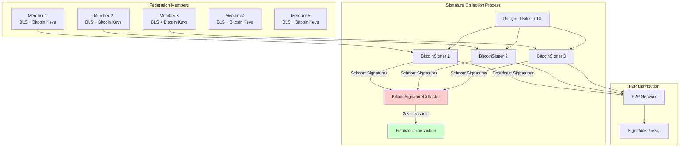
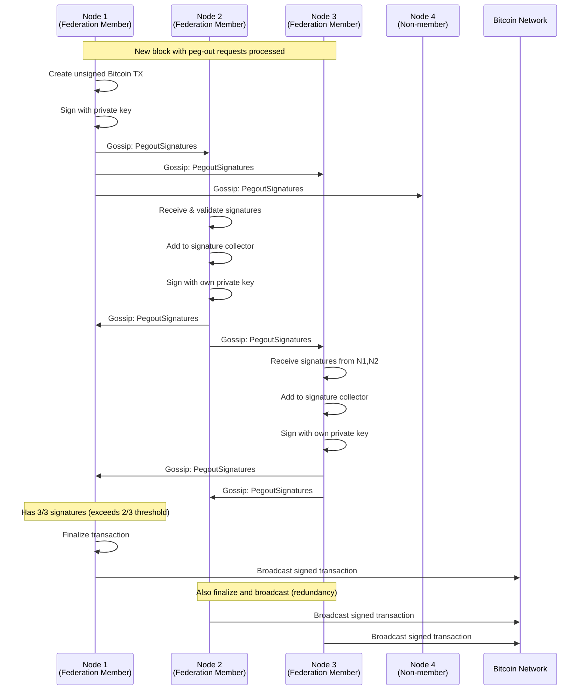

# Alys Peg-out Technical Guide

## Introduction for Engineers

Peg-outs in Alys represent the process of moving value from the Alys sidechain back to the Bitcoin mainchain. This technical guide provides a comprehensive deep-dive into how users can convert their wrapped BTC on Alys back to native Bitcoin, focusing on the intricate technical processes that make this possible in a secure, decentralized manner.

**Analogy**: Think of peg-outs like a secure ATM withdrawal system:
- The **Bridge Contract** is like an ATM machine - you insert your card (make a transaction) and request cash
- The **Federation** is like the bank's authorization system - multiple parties must approve the withdrawal
- The **Bitcoin Network** is like the actual cash dispensing - the final delivery of your requested Bitcoin
- The **Multi-signature Process** is like requiring multiple bank manager signatures for large withdrawals

This guide is designed for blockchain engineers who need to understand, implement, or debug the peg-out system at a technical level.

## System Architecture Overview

### Peg-out Flow at 30,000 Feet

```mermaid
graph TB
    subgraph "Alys Sidechain"
        USER[User Wallet]
        BRIDGE[Bridge Contract<br/>0xbBbB...BbB]
        ENGINE[Execution Layer<br/>Reth]
        CONSENSUS[Consensus Layer]
    end
    
    subgraph "Federation Layer"
        MONITOR[Event Monitor]
        WALLET[Bitcoin Wallet]
        SIGNER[Multi-sig Signer]
        COLLECTOR[Signature Collector]
    end
    
    subgraph "Bitcoin Network"
        MEMPOOL[Bitcoin Mempool]
        MINERS[Bitcoin Miners]
        BLOCKCHAIN[Bitcoin Blockchain]
    end
    
    USER --> |1. requestPegOut()| BRIDGE
    BRIDGE --> |2. Burn Tokens| ENGINE
    BRIDGE --> |3. Emit Event| MONITOR
    MONITOR --> |4. Parse Event| WALLET
    WALLET --> |5. Create TX| SIGNER
    SIGNER --> |6. Sign TX| COLLECTOR
    COLLECTOR --> |7. Broadcast| MEMPOOL
    MEMPOOL --> MINERS
    MINERS --> BLOCKCHAIN
    
    style BRIDGE fill:#ffcccc
    style WALLET fill:#ccffcc
    style COLLECTOR fill:#ccccff
```

### Key Components Deep Dive

**1. Bridge Contract (`contracts/src/Bridge.sol`):**
- **Address**: `0xbBbBBBBbbBBBbbbBbbBbbbbBBbBbbbbBbBbbBBbB` (pre-deployed)
- **Function**: Burns wrapped BTC and emits peg-out request events
- **Security**: Immutable, auditable Solidity contract

**2. Federation System (`crates/federation/`):**
- **Event Detection**: Monitors Ethereum logs for `RequestPegOut` events
- **UTXO Management**: Tracks and manages Bitcoin UTXOs for the federation
- **Transaction Building**: Creates unsigned Bitcoin transactions for peg-outs
- **Multi-signature**: Coordinates threshold signatures among federation members

**3. Consensus Integration (`app/src/chain.rs`):**
- **Block Processing**: Processes peg-out events during block production
- **Signature Coordination**: Distributes and collects signatures via P2P network
- **Transaction Finalization**: Broadcasts completed transactions to Bitcoin

## Phase 1: User-Initiated Peg-out Request

### Bridge Contract Implementation

**Smart Contract Structure** (`contracts/src/Bridge.sol`):
```solidity
contract Bridge {
    address payable public constant BURN_ADDRESS = 
        payable(0x000000000000000000000000000000000000dEaD);
    
    event RequestPegOut(
        address indexed _evmAddress,    // Source account (indexed for filtering)
        bytes _bitcoinAddress,          // Destination Bitcoin address (not indexed - unlimited size)
        uint256 _value                  // Amount in wei to convert to Bitcoin
    );
    
    function requestPegOut(bytes calldata _bitcoinAddress) public payable {
        require(msg.value >= 0, "Insufficient amount");
        
        // Burn the wrapped BTC to prevent double-spending
        BURN_ADDRESS.transfer(msg.value);
        
        // Emit event for federation to process
        emit RequestPegOut(msg.sender, _bitcoinAddress, msg.value);
    }
}
```

**Key Technical Details:**
- **Token Burning**: Prevents inflation by permanently removing tokens from circulation
- **Event Emission**: Creates an immutable, queryable record of the peg-out request  
- **Address Validation**: User responsible for providing valid Bitcoin address (no client-side validation)
- **Minimum Amount**: 1M satoshis (0.01 BTC) minimum enforced by federation, not contract

### User Interaction Patterns

**Example 1: Using Cast CLI:**
```bash
# Peg out 0.1 BTC to Bitcoin address
cast send 0xbBbBBBBbbBBBbbbBbbBbbbbBBbBbbbbBbBbbBBbB \
  "requestPegOut(bytes)" \
  "bc1qxy2kgdygjrsqtzq2n0yrf2493p83kkfjhx0wlh" \
  --value 0.1ether \
  --private-key $PRIVATE_KEY \
  --rpc-url http://localhost:8545
```

**Example 2: Using ethers.js:**
```javascript
const bridge = new ethers.Contract(
  "0xbBbBBBBbbBBBbbbBbbBbbbbBBbBbbbbBbBbbBBbB",
  ["function requestPegOut(bytes calldata _bitcoinAddress) payable"],
  signer
);

const tx = await bridge.requestPegOut(
  ethers.utils.toUtf8Bytes("bc1qxy2kgdygjrsqtzq2n0yrf2493p83kkfjhx0wlh"),
  { value: ethers.utils.parseEther("0.1") }
);
```

**Example 3: Using Foundry Script:**
```solidity
contract RequestPegOut is Script {
    function run() external {
        uint256 privateKey = vm.envUint("PRIVATE_KEY");
        vm.startBroadcast(privateKey);
        
        Bridge bridge = Bridge(payable(0xbBbBBBBbbBBBbbbBbbBbbbbBBbBbbbbBbBbbBBbB));
        bridge.requestPegOut{value: 0.1 ether}("bc1qxy2kgdygjrsqtzq2n0yrf2493p83kkfjhx0wlh");
        
        vm.stopBroadcast();
    }
}
```

### Event Structure and Indexing

**Event Signature Analysis:**
```solidity
// Event signature: 0x8c5be1e5ebec7d5bd14f71427d1e84f3dd0314c0f7b2291e5b200ac8c7c3b925
event RequestPegOut(
    address indexed _evmAddress,    // Topic 1: Source address (indexed)
    bytes _bitcoinAddress,          // Data: Destination address (not indexed due to dynamic size)
    uint256 _value                  // Data: Amount in wei
);
```

**Why This Indexing Strategy?**
- **Indexed `_evmAddress`**: Enables efficient filtering by source address for user UIs
- **Non-indexed `_bitcoinAddress`**: Dynamic bytes can't be indexed, stored in event data
- **Non-indexed `_value`**: Amount stored in data section for precise value retrieval

## Phase 2: Event Detection and Processing

### Federation Event Monitoring

**Event Detection Implementation** (`crates/federation/src/lib.rs:258-307`):
```rust
pub fn filter_pegouts(receipts: Vec<TransactionReceipt>) -> Vec<TxOut> {
    // Event structure matching Bridge.sol
    #[derive(Clone, Debug, EthEvent)]
    pub struct RequestPegOut {
        #[ethevent(indexed)]
        pub evm_address: Address,     // Source EVM address
        pub bitcoin_address: Bytes,   // Destination Bitcoin address
        pub value: U256,             // Amount in wei
    }

    let contract_address = "0xbBbBBBBbbBBBbbbBbbBbbbbBBbBbbbbBbBbbBBbB"
        .parse::<Address>()
        .expect("Bridge address is valid");

    let mut pegouts = Vec::new();

    for receipt in receipts {
        // Only process transactions to the bridge contract
        if let Some(address) = receipt.to {
            if address != contract_address {
                debug!("Skipping receipt to {}", address);
                continue;
            }
        }

        // Parse each log for RequestPegOut events
        for log in receipt.logs {
            if let Ok(event) = parse_log::<RequestPegOut>(log) {
                let event_amount_in_sats = wei_to_sats(event.value);
                
                // Enforce minimum peg-out amount (1M sats = 0.01 BTC)
                if event_amount_in_sats >= 1000000 {
                    if let Some(address) = parse_bitcoin_address(event.bitcoin_address) {
                        let txout = TxOut {
                            script_pubkey: address.script_pubkey(),
                            value: event_amount_in_sats,
                        };
                        pegouts.push(txout);
                    }
                } else {
                    info!(
                        "Ignoring pegout for {} sats from {}:{}",
                        event_amount_in_sats, event.evm_address, event.bitcoin_address
                    );
                }
            }
        }
    }

    pegouts
}

// Convert wei to satoshis (wei has 18 decimals, Bitcoin 8)
pub fn wei_to_sats(wei: U256) -> u64 {
    (wei / U256::from(10_000_000_000u64)).as_u64()
}

// Parse Bitcoin address from bytes
fn parse_bitcoin_address(data: Bytes) -> Option<BitcoinAddress> {
    let address_str = std::str::from_utf8(&data).ok()?;
    let address = BitcoinAddress::from_str(address_str).ok()?;
    Some(address.assume_checked())
}
```

**Processing Flow:**
1. **Receipt Filtering**: Only examine transactions sent to bridge contract address
2. **Event Parsing**: Decode `RequestPegOut` events using ethers-rs event parsing
3. **Amount Conversion**: Convert wei (18 decimals) to satoshis (8 decimals) using division by 10^10
4. **Minimum Validation**: Enforce 1M satoshi minimum for economic viability
5. **Address Parsing**: Convert bytes to valid Bitcoin address with error handling
6. **UTXO Creation**: Build `TxOut` structure for Bitcoin transaction construction

### Integration with Block Processing

**Chain-Level Integration** (`app/src/chain.rs`):
```rust
async fn create_pegout_payments(
    &self,
    payload_hash: Option<ExecutionBlockHash>,
) -> Option<BitcoinTransaction> {
    let (_execution_block, execution_receipts) = self
        .get_block_and_receipts(&payload_hash?)
        .await
        .unwrap();

    let fee_rate = self.bridge.fee_rate();
    
    match Bridge::filter_pegouts(execution_receipts) {
        x if x.is_empty() => {
            info!("Adding 0 pegouts to block");
            None
        }
        payments => {
            info!("Adding {} pegouts to block", payments.len());
            let mut wallet = self.bitcoin_wallet.write().await;
            
            // Create unsigned Bitcoin transaction
            match wallet.create_payment(payments, fee_rate) {
                Ok(tx) => Some(tx),
                Err(e) => {
                    warn!("Failed to create pegout transaction: {}", e);
                    None
                }
            }
        }
    }
}
```

**Key Integration Points:**
- **Block Processing**: Called during block production for each new block
- **Receipt Retrieval**: Gets transaction receipts from execution layer (Reth)
- **Fee Estimation**: Queries Bitcoin network for current fee rates
- **Transaction Creation**: Uses UTXO manager to build unsigned Bitcoin transaction
- **Error Handling**: Graceful degradation if transaction creation fails

## Phase 3: Bitcoin Transaction Construction

### UTXO Management System

**UtxoManager Core Structure** (`crates/federation/src/bitcoin_signing.rs:30-58`):
```rust
pub struct UtxoManager<T: Database> {
    pub(crate) tree: T,          // Database backend (Sled or Memory for testing)
    federation: Federation,      // Federation configuration and taproot info
    secp: Secp256k1<All>,       // Secp256k1 context for cryptographic operations
}

impl<T: Database> UtxoManager<T> {
    const TRANSACTION_VERSION: i32 = 2;    // Use BIP68 relative locktime
    const LOCK_TIME: LockTime = LockTime::ZERO;  // No time-based locktime
    
    pub fn new_with_db(db: T, federation: Federation) -> Self {
        Self {
            tree: db,
            federation,
            secp: Secp256k1::new(),
        }
    }
}
```

### Transaction Building Algorithm

**Payment Creation Process** (`crates/federation/src/bitcoin_signing.rs:280-355`):
```rust
pub fn create_payment(
    &mut self,
    output: Vec<TxOut>,         // Peg-out destinations
    fee_rate: FeeRate,          // Current Bitcoin fee rate
) -> Result<Transaction, Error> {
    let num_pegouts = output.len() as u64;

    // Step 1: Gather available UTXOs
    let utxos = self.tree
        .iter_utxos()
        .map_err(|_| Error::DbError)?
        .into_iter()
        .filter(|utxo| !utxo.is_spent)  // Only unspent UTXOs
        .map(|utxo| WeightedUtxo {
            satisfaction_weight: self.federation.satisfaction_weight,
            utxo: bdk::Utxo::Local(utxo),
        })
        .collect();

    // Step 2: Create base transaction structure
    let mut tx = Transaction {
        version: Self::TRANSACTION_VERSION,
        lock_time: Self::LOCK_TIME,
        input: vec![],
        output,
    };

    let total_out_value: u64 = tx.output.iter().map(|x| x.value).sum();

    // Step 3: Coin selection using Branch and Bound algorithm
    let selected = BranchAndBoundCoinSelection::default()
        .coin_select(
            &self.tree,
            vec![],                                    // No required UTXOs
            utxos,                                    // Available UTXOs
            fee_rate,                                 // Fee rate
            total_out_value,                          // Target amount
            &self.federation.taproot_address.script_pubkey(), // Change address
        )
        .unwrap();

    // Step 4: Set transaction inputs
    tx.input = selected.selected
        .into_iter()
        .map(|x| TxIn {
            previous_output: x.outpoint(),
            script_sig: ScriptBuf::new(),           // Empty for taproot
            sequence: bitcoin::Sequence::ENABLE_RBF_NO_LOCKTIME,
            witness: Witness::default(),            // Will be populated during signing
        })
        .collect();

    // Step 5: Add change output if necessary
    if let Excess::Change { amount, fee: _ } = selected.excess {
        tx.output.push(TxOut {
            script_pubkey: self.federation.taproot_address.script_pubkey(),
            value: amount,
        });
    }

    // Step 6: Deduct fees from pegout outputs proportionally
    let total_weight = tx.weight();
    let total_fee = fee_rate.fee_wu(total_weight);
    let fee_per_output = total_fee.div_ceil(num_pegouts);
    
    for output in tx.output.iter_mut().take(num_pegouts as usize) {
        if output.value <= fee_per_output {
            return Err(Error::FeesExceedPegoutValue);
        } else {
            output.value -= fee_per_output;
        }
    }

    Ok(tx)
}
```

**Advanced UTXO Features:**

**1. Missing UTXO Recovery** (`crates/federation/src/bitcoin_signing.rs:197-250`):
```rust
fn try_fetch_utxo(
    &self,
    outpoint: OutPoint,
    bridge: &crate::Bridge,
) -> Result<LocalUtxo, Error> {
    // Fetch transaction from Bitcoin network
    let tx = bridge.bitcoin_core.rpc
        .get_raw_transaction(&outpoint.txid, None)
        .map_err(|_| Error::BitcoinError)?;

    // Validate output exists
    if outpoint.vout as usize >= tx.output.len() {
        return Err(Error::UnknownOrSpentInput);
    }

    let txout = &tx.output[outpoint.vout as usize];

    // Verify output belongs to federation
    if !self.federation.taproot_address
        .matches_script_pubkey(&txout.script_pubkey) {
        return Err(Error::UnknownOrSpentInput);
    }

    // Check if output is unspent using Bitcoin Core RPC
    match bridge.bitcoin_core.rpc
        .get_tx_out(&outpoint.txid, outpoint.vout, None) {
        Ok(Some(_)) => {
            // Output exists and is unspent - create LocalUtxo
            Ok(LocalUtxo {
                txout: txout.clone(),
                outpoint,
                is_spent: false,
                keychain: KeychainKind::External,
            })
        }
        Ok(None) => Err(Error::UnknownOrSpentInput),
        Err(_) => Err(Error::UnknownOrSpentInput),
    }
}
```

**2. Coin Selection Strategy:**
- **Algorithm**: Branch and Bound (optimal for fee minimization)
- **Weight Calculation**: Accounts for taproot script spending weight
- **Change Logic**: Creates change output only when economically viable
- **Fee Distribution**: Proportionally deducts fees from all peg-out outputs

## Phase 4: Multi-Signature Coordination

### Federation Signature Architecture



### Taproot Multi-Signature Implementation

**Federation Configuration** (`crates/federation/src/bitcoin_signing.rs`):
```rust
pub struct Federation {
    pub pubkeys: Vec<PublicKey>,           // Individual member public keys
    pub threshold: usize,                  // Required signatures (2/3 + 1)
    pub taproot_address: Address,          // Federation's Bitcoin address
    pub spend_info: TaprootSpendInfo,     // Taproot spending information
    pub satisfaction_weight: u64,          // Transaction weight for fee calculation
    pub internal_pubkey: XOnlyPublicKey,  // Internal key (unspendable)
}

impl Federation {
    pub fn new(pubkeys: Vec<PublicKey>, threshold: usize, network: Network) -> Self {
        // Create taproot tree with threshold script
        let script = Self::create_threshold_script(&pubkeys, threshold);
        let script_leaf = ScriptLeaf::new(LeafVersion::TapScript, script.clone());
        
        // Use unspendable internal key (nothing-up-my-sleeve)
        let internal_pubkey = UNSPENDABLE_INTERNAL_KEY;
        
        // Build taproot spending info
        let spend_info = TaprootBuilder::new()
            .add_leaf(0, script.clone())
            .expect("Valid taproot tree")
            .finalize(&secp, internal_pubkey)
            .expect("Valid finalization");

        let taproot_address = Address::p2tr_tweaked(
            spend_info.output_key(),
            network
        );

        Self {
            pubkeys,
            threshold,
            taproot_address,
            spend_info,
            satisfaction_weight: Self::calculate_satisfaction_weight(&script),
            internal_pubkey,
        }
    }

    fn create_threshold_script(pubkeys: &[PublicKey], threshold: usize) -> ScriptBuf {
        let mut script = Builder::new();
        
        // Add all public keys to script
        for pubkey in pubkeys {
            script = script.push_x_only_key(&XOnlyPublicKey::from(*pubkey));
        }
        
        // Add threshold check
        script = script
            .push_int(threshold as i64)
            .push_opcode(all::OP_CHECKMULTISIG);
            
        script.into_script()
    }
}
```

### Individual Signature Generation

**BitcoinSigner Implementation** (`crates/federation/src/bitcoin_signing.rs`):
```rust
pub struct BitcoinSigner {
    pub keypair: KeyPair,         // Secp256k1 key pair for signing
    secp: Secp256k1<All>,        // Secp256k1 context
}

impl BitcoinSigner {
    pub fn new(private_key: SecretKey) -> Self {
        let secp = Secp256k1::new();
        Self {
            keypair: KeyPair::from_secret_key(&secp, &private_key),
            secp,
        }
    }

    pub fn get_input_signatures<T: Database>(
        &self,
        wallet: &UtxoManager<T>,
        transaction: &Transaction,
    ) -> Result<SingleMemberTransactionSignatures, Error> {
        // Get signature messages for all inputs
        let signing_inputs = wallet.get_signing_inputs(transaction)?;
        
        // Sign each input with Schnorr signatures
        let signatures = signing_inputs
            .into_iter()
            .map(|message| {
                self.secp.sign_schnorr(&message, &self.keypair)
            })
            .collect();

        Ok(SingleMemberTransactionSignatures(
            self.keypair.public_key(),
            signatures
        ))
    }
}

// Container for a member's signatures on all transaction inputs
pub struct SingleMemberTransactionSignatures(
    pub PublicKey,              // Signer's public key
    pub Vec<SchnorrSignature>   // Signatures for each input
);
```

### Signature Collection and Aggregation

**BitcoinSignatureCollector System** (`crates/federation/src/bitcoin_signing.rs`):
```rust
pub struct BitcoinSignatureCollector {
    transactions: HashMap<Txid, PartiallySignedTaprootTransaction>,
    federation: Federation,
}

#[derive(Debug, Clone)]
pub struct PartiallySignedTaprootTransaction {
    transaction: Transaction,
    signatures: HashMap<PublicKey, Vec<SchnorrSignature>>, // Per-member signatures
}

impl BitcoinSignatureCollector {
    pub fn new(federation: Federation) -> Self {
        Self {
            transactions: HashMap::new(),
            federation,
        }
    }

    pub fn add_signature<T: Database>(
        &mut self,
        wallet: &UtxoManager<T>,
        txid: Txid,
        signature: SingleMemberTransactionSignatures,
    ) -> Result<(), Error> {
        let SingleMemberTransactionSignatures(pubkey, sigs) = signature;

        // Validate signature count matches input count
        let transaction = wallet.get_transaction(&txid)?;
        if sigs.len() != transaction.input.len() {
            return Err(Error::InvalidNumberOfSignatures);
        }

        // Verify each signature
        let signing_inputs = wallet.get_signing_inputs(&transaction)?;
        for (sig, message) in sigs.iter().zip(signing_inputs.iter()) {
            if self.secp.verify_schnorr(sig, message, &pubkey.x_only_public_key().0).is_err() {
                return Err(Error::IncorrectSignature);
            }
        }

        // Add to partially signed transaction
        let psbt = self.transactions.entry(txid).or_insert_with(|| {
            PartiallySignedTaprootTransaction {
                transaction: transaction.clone(),
                signatures: HashMap::new(),
            }
        });

        psbt.signatures.insert(pubkey, sigs);
        Ok(())
    }

    pub fn get_finalized(&self, txid: Txid) -> Result<Transaction, Error> {
        let psbt = self.transactions.get(&txid).ok_or(Error::TxidNotFound)?;
        let tx = psbt.finalize_transaction(&self.federation)?;
        Ok(tx)
    }
}
```

### Transaction Finalization Process

**Witness Construction** (`crates/federation/src/bitcoin_signing.rs`):
```rust
impl PartiallySignedTaprootTransaction {
    fn finalize_transaction(&self, federation: &Federation) -> Result<Transaction, Error> {
        // Check we have enough signatures (threshold requirement)
        if self.signatures.len() < federation.threshold {
            return Err(Error::InvalidNumberOfSignatures);
        }

        let mut finalized_tx = self.transaction.clone();

        // Build witness for each input
        for (input_idx, input) in finalized_tx.input.iter_mut().enumerate() {
            let mut witness = Witness::new();

            // Add signatures from threshold members
            let mut sig_count = 0;
            for (pubkey, sigs) in &self.signatures {
                if sig_count >= federation.threshold {
                    break;
                }
                
                // Add signature for this input
                let sig = SchnorrSig {
                    sig: sigs[input_idx],
                    hash_ty: TapSighashType::Default,
                };
                witness.push(sig.to_vec());
                sig_count += 1;
            }

            // Add the script and control block for taproot spending
            witness.push(federation.threshold_script.to_bytes());
            witness.push(federation.spend_info.control_block(&script_path).serialize());

            input.witness = witness;
        }

        Ok(finalized_tx)
    }
}
```

## Phase 5: P2P Signature Coordination

### Network Message Types

**Signature Distribution** (`app/src/network/mod.rs`):
```rust
pub enum PubsubMessage {
    ConsensusBlock(SignedConsensusBlock<MainnetEthSpec>),
    ApproveBlock(ApproveBlock),
    QueuePow(Hash256),
    PegoutSignatures(SingleMemberTransactionSignatures), // Bitcoin peg-out signatures
}

// P2P behavior for signature gossip
pub struct MyBehaviour {
    gossipsub: gossipsub::Behaviour,    // For broadcasting signatures
    identify: identify::Behaviour,      // Peer identification
    autonat: autonat::Behaviour,       // NAT traversal
    rpc: rpc::RpcBehaviour,            // Direct peer communication
}
```

### Signature Gossip Protocol

**Signature Broadcasting Flow**:


### Signature Validation Process

**Chain-Level Signature Handling** (`app/src/chain.rs`):
```rust
pub async fn create_pegout_signatures(&self, pow: &AuxPow) -> Result<Vec<(Txid, SingleMemberTransactionSignatures)>, Error> {
    let bitcoin_signer = match &self.bitcoin_signer {
        Some(signer) => signer,
        None => {
            debug!("No bitcoin signer available for pegout signatures");
            return Ok(vec![]);
        }
    };

    let wallet = self.bitcoin_wallet.read().await;
    
    // Get all Bitcoin payment proposals in the finalized range
    let signatures = self
        .get_bitcoin_payment_proposals_in_range(pow.range_start, pow.range_end)?
        .into_iter()
        .map(|tx| {
            // Sign each transaction
            bitcoin_signer
                .get_input_signatures(&wallet, &tx)
                .map(|sig| (tx.txid(), sig))
        })
        .collect::<Result<HashMap<_, _>, _>>()?;

    Ok(signatures.into_iter().collect())
}

// Handle incoming signatures from other federation members
pub async fn process_pegout_signatures(&self, txid: Txid, signatures: SingleMemberTransactionSignatures) -> Result<(), Error> {
    let wallet = self.bitcoin_wallet.read().await;
    let mut signature_collector = self.bitcoin_signature_collector.write().await;
    
    // Validate and add signatures
    signature_collector.add_signature(&wallet, txid, signatures)?;
    
    // Check if we have enough signatures to finalize
    if signature_collector.can_finalize(txid)? {
        let finalized_tx = signature_collector.get_finalized(txid)?;
        
        // Broadcast to Bitcoin network
        match self.bridge.broadcast_signed_tx(&finalized_tx) {
            Ok(broadcast_txid) => {
                info!("Broadcast peg-out transaction: {}", broadcast_txid);
                Ok(())
            }
            Err(e) => {
                warn!("Failed to broadcast peg-out transaction: {}", e);
                Err(e.into())
            }
        }
    } else {
        // Wait for more signatures
        debug!("Waiting for more signatures for transaction {}", txid);
        Ok(())
    }
}
```

## Phase 6: Bitcoin Network Finalization

### Transaction Broadcasting

**Bitcoin Core Integration** (`crates/federation/src/lib.rs:191-199`):
```rust
impl Bridge {
    pub fn broadcast_signed_tx(&self, transaction: &Transaction) -> Result<Txid, Error> {
        self.bitcoin_core
            .rpc
            .send_raw_transaction(transaction)
            .map_err(|err| {
                warn!("send_raw_transaction error {err}");
                Error::BitcoinError
            })
    }
}
```

**Bitcoin Core RPC Configuration**:
```rust
pub struct BitcoinCore {
    pub rpc: bitcoincore_rpc::Client,
}

impl BitcoinCore {
    pub fn new(url: &str, user: impl Into<String>, pass: impl Into<String>) -> Self {
        use bitcoincore_rpc::Auth;
        let auth = Auth::UserPass(user.into(), pass.into());
        let rpc = bitcoincore_rpc::Client::new(url, auth)
            .expect("Valid Bitcoin Core connection");
        Self { rpc }
    }
}
```

### Fee Rate Estimation

**Dynamic Fee Management** (`crates/federation/src/lib.rs:309-317`):
```rust
impl Bridge {
    pub fn fee_rate(&self) -> FeeRate {
        self.bitcoin_core
            .rpc
            .estimate_smart_fee(1, None)  // Estimate for next block inclusion
            .ok()
            .and_then(|x| x.fee_rate)
            .map(|x| FeeRate::from_btc_per_kvb(x.to_btc() as f32))
            .unwrap_or(FeeRate::from_sat_per_vb(2.0)) // Fallback: 2 sat/vB
    }
}
```

**Fee Distribution Strategy**:
- **Fee Source**: Deducted proportionally from all peg-out outputs
- **Minimum Viability**: Ensures no output becomes dust after fee deduction
- **Rate Estimation**: Uses Bitcoin Core's `estimatesmartfee` for current rates
- **Fallback Rate**: Conservative 2 sat/vB if estimation fails

### Transaction Confirmation Monitoring

**Confirmation Tracking** (Future Enhancement):
```rust
// Conceptual implementation for monitoring confirmations
impl Bridge {
    pub async fn monitor_transaction_confirmations(&self, txid: &Txid) -> Result<u32, Error> {
        loop {
            match self.bitcoin_core.rpc.get_transaction(txid, None) {
                Ok(tx_info) => {
                    if let Some(confirmations) = tx_info.info.confirmations {
                        if confirmations >= 6 { // Wait for 6 confirmations
                            return Ok(confirmations as u32);
                        }
                    }
                }
                Err(e) => {
                    warn!("Error monitoring transaction {}: {}", txid, e);
                }
            }
            
            // Wait before next check
            tokio::time::sleep(Duration::from_secs(60)).await;
        }
    }
}
```

## Security Considerations and Attack Vectors

### 1. Double-Spending Prevention

**Token Burning Mechanism**:
- **Immediate Burn**: Tokens burned before event emission prevents re-use
- **Burn Address**: `0x000000000000000000000000000000000000dEaD` is provably unspendable
- **Atomic Operation**: Burn and event emission in single transaction

**UTXO Tracking**:
- **Spent State**: UTXOs marked as spent immediately when used in proposals
- **Database Consistency**: Sled database ensures ACID properties
- **Recovery Mechanism**: Missing UTXOs fetched from Bitcoin network during validation

### 2. Federation Security Model

**Threshold Requirements**:
- **2/3 + 1 Majority**: Requires supermajority agreement for peg-outs
- **Byzantine Fault Tolerance**: Can tolerate up to 1/3 malicious federation members
- **Key Distribution**: Federation keys managed independently by different entities

**Signature Validation**:
- **Cryptographic Verification**: Each signature validated against known public keys
- **Message Integrity**: Schnorr signatures ensure message hasn't been tampered with
- **Replay Protection**: Transaction IDs (txids) prevent signature reuse

### 3. Economic Security

**Minimum Thresholds**:
- **1M Satoshi Minimum**: Prevents dust attacks and ensures economic viability
- **Fee Deduction**: Proportional fee distribution maintains economic incentives
- **Value Validation**: Total output value checked against available UTXOs

**Fee Griefing Protection**:
- **Fee Caps**: Maximum fee deduction prevents total value loss
- **Rate Limits**: P2P network rate limiting prevents spam
- **Validation Requirements**: Invalid signatures rejected without processing

### 4. Network-Level Security

**P2P Vulnerabilities**:
- **Signature Flooding**: Rate limiting and validation prevent DoS
- **Partition Attacks**: Multiple redundant connections maintain network integrity
- **Eclipse Attacks**: Trusted peer configuration provides connectivity guarantees

**Consensus Integration**:
- **Block Production Tie-in**: Peg-outs processed only during normal block production
- **Chain Reorganization**: Handles chain reorgs by re-processing affected blocks
- **Finalization Requirements**: Only processes peg-outs in finalized blocks

## Development and Testing

### Local Development Setup

**1. Start Multi-Node Network** (`scripts/start_network.sh`):
```bash
#!/usr/bin/env bash
# Start full 3-node development network
start_bitcoin_regtest &
start_reth 0 &
start_reth 1 &  
start_reth 2 &
start_consensus 0 &
start_consensus 1 &
start_consensus 2 &
echo "Alys network with Bitcoin regtest started"
wait
```

**2. Test Peg-out Flow** (`scripts/regtest_pegout.sh`):
```bash
#!/usr/bin/env bash
PRIVATE_KEY=${1:-"0xac0974bec39a17e36ba4a6b4d238ff944bacb478cbed5efcae784d7bf4f2ff80"}
BTC_ADDRESS=${2:-"bcrt1qxy2kgdygjrsqtzq2n0yrf2493p83kkfjhx0wlh"}
AMOUNT=${3:-"0.1"}

echo "Requesting peg-out of $AMOUNT BTC to $BTC_ADDRESS"

# Submit peg-out request
cast send 0xbBbBBBBbbBBBbbbBbbBbbbbBBbBbbbbBbBbbBBbB \
  "requestPegOut(bytes)" \
  "$BTC_ADDRESS" \
  --value "${AMOUNT}ether" \
  --private-key $PRIVATE_KEY \
  --rpc-url http://localhost:8545

echo "Peg-out request submitted. Check Bitcoin regtest for transaction."
```

### Integration Tests

**Federation Testing Framework** (`crates/federation/src/lib.rs:455-544`):
```rust
#[test]
fn test_bitcoin_signer() {
    let secp = Secp256k1::new();

    // Generate test keys for 3-member federation
    let secret_keys = [
        "0000000000000000000000000000000000000000000000000000000000000001",
        "0000000000000000000000000000000000000000000000000000000000000002", 
        "0000000000000000000000000000000000000000000000000000000000000003",
    ]
    .into_iter()
    .map(|x| SecretKey::from_str(x).unwrap())
    .collect::<Vec<_>>();
    
    let pubkeys = secret_keys
        .iter()
        .map(|x| x.public_key(&secp))
        .collect::<Vec<_>>();

    // Create federation with 2-of-3 threshold
    let federation = Federation::new(pubkeys.clone(), 2, Network::Regtest);

    // Fund federation address
    let funding_tx = send_to_address(&federation.taproot_address, 10000000);

    // Setup wallet and signature collector
    let mut wallet = UtxoManager::new_with_db(
        bdk::database::MemoryDatabase::new(), 
        federation.clone()
    );
    wallet.register_pegin(&funding_tx).unwrap();

    let mut signature_collector = BitcoinSignatureCollector::new(federation.clone());

    // Create peg-out transaction
    let unsigned_tx = wallet
        .create_payment(
            vec![
                TxOut {
                    script_pubkey: get_arbitrary_output(),
                    value: 5000000,
                },
                TxOut {
                    script_pubkey: get_arbitrary_output(), 
                    value: 400000,
                },
            ],
            FeeRate::from_sat_per_vb(2.0),
        )
        .unwrap();

    // Collect signatures from 2 members (meets threshold)
    for i in 1..3 {
        let signer = BitcoinSigner::new(secret_keys[i]);
        let sigs = signer.get_input_signatures(&wallet, &unsigned_tx).unwrap();
        signature_collector
            .add_signature(&wallet, unsigned_tx.txid(), sigs)
            .unwrap();
    }

    // Finalize and validate transaction
    let signed_tx = signature_collector
        .get_finalized(unsigned_tx.txid())
        .unwrap();

    wallet
        .check_transaction_signatures(&signed_tx, false)
        .unwrap();

    // Test broadcasting to regtest
    get_bitcoin_rpc()
        .0
        .send_raw_transaction(&signed_tx)
        .unwrap();
}
```

### Monitoring and Debugging

**Prometheus Metrics** (`app/src/metrics.rs`):
```rust
// Peg-out specific metrics
pub static CHAIN_BLOCK_PRODUCTION_TOTALS: Lazy<CounterVec> = Lazy::new(|| {
    CounterVec::new(
        Opts::new("chain_block_production_total", "Block production events"),
        &["result", "type"]
    )
});

// Usage in code
CHAIN_BLOCK_PRODUCTION_TOTALS
    .with_label_values(&["pegouts_created", "success"])
    .inc();
```

**Log Analysis**:
```bash
# Monitor peg-out processing
RUST_LOG=debug ./target/debug/app --dev 2>&1 | grep -i pegout

# Track signature collection
RUST_LOG=debug ./target/debug/app --dev 2>&1 | grep -i signature

# Bitcoin transaction monitoring  
tail -f ~/.bitcoin/regtest/debug.log | grep -i "accept to memory pool"
```

**Common Debugging Scenarios**:

**1. Insufficient Signatures**:
```rust
// Error: Error::InvalidNumberOfSignatures
// Check: Federation member connectivity and key configuration
// Solution: Ensure 2/3 + 1 members are online and signing
```

**2. UTXO Not Found**:
```rust
// Error: Error::UnspendableInput
// Check: UTXO database synchronization with Bitcoin network
// Solution: Enable missing UTXO recovery in payment validation
```

**3. Transaction Broadcasting Failure**:
```rust
// Error: Error::BitcoinError from send_raw_transaction
// Check: Bitcoin Core connection and transaction validity
// Solution: Verify Bitcoin Core RPC configuration and network connectivity
```

## Performance Optimization

### 1. Database Performance

**UTXO Storage Optimization**:
```rust
// Use Sled database for production performance
let db = sled::open("federation_data").expect("Database connection");
let wallet = UtxoManager::new("federation_data", federation)?;

// Index optimization for UTXO lookups
impl<T: Database> UtxoManager<T> {
    pub fn get_utxos_by_amount(&self, min_amount: u64) -> Result<Vec<LocalUtxo>, Error> {
        self.tree
            .iter_utxos()?
            .into_iter()
            .filter(|utxo| !utxo.is_spent && utxo.txout.value >= min_amount)
            .collect()
    }
}
```

### 2. Network Optimization

**Signature Batching**:
```rust
// Batch signature collection to reduce P2P overhead
pub struct BatchedSignatures {
    signatures: HashMap<Txid, SingleMemberTransactionSignatures>,
}

impl BatchedSignatures {
    pub fn add_signature(&mut self, txid: Txid, sig: SingleMemberTransactionSignatures) {
        self.signatures.insert(txid, sig);
    }
    
    pub fn broadcast_batch(&self, network: &NetworkClient) {
        // Send all signatures in single P2P message
        for (txid, sig) in &self.signatures {
            network.broadcast(PubsubMessage::PegoutSignatures(sig.clone()));
        }
    }
}
```

### 3. Fee Optimization

**Dynamic Fee Adjustment**:
```rust
impl Bridge {
    pub fn get_optimal_fee_rate(&self) -> FeeRate {
        // Try multiple fee estimation strategies
        let strategies = [
            || self.bitcoin_core.rpc.estimate_smart_fee(1, None),   // Next block
            || self.bitcoin_core.rpc.estimate_smart_fee(6, None),   // 1 hour
            || self.bitcoin_core.rpc.estimate_smart_fee(144, None), // 1 day
        ];
        
        for strategy in strategies {
            if let Ok(Some(fee_info)) = strategy() {
                if let Some(fee_rate) = fee_info.fee_rate {
                    return FeeRate::from_btc_per_kvb(fee_rate.to_btc() as f32);
                }
            }
        }
        
        // Conservative fallback
        FeeRate::from_sat_per_vb(10.0)
    }
}
```

## Future Enhancements

### 1. Advanced Signature Schemes

**Schnorr Multi-Signatures (MuSig2)**:
```rust
// Future implementation for aggregated signatures
pub struct MuSig2Coordinator {
    participants: Vec<PublicKey>,
    session: Option<MuSig2Session>,
}

impl MuSig2Coordinator {
    // Single aggregated signature instead of threshold signatures
    pub fn create_aggregated_signature(&mut self, message: &[u8]) -> Result<Signature, Error> {
        // Implementation would use MuSig2 protocol for signature aggregation
        todo!("MuSig2 implementation")
    }
}
```

### 2. Cross-Chain Integration

**Multi-Chain Peg-outs**:
```solidity
// Future bridge contract supporting multiple destinations
contract MultichainBridge {
    enum DestinationChain { Bitcoin, Litecoin, Dogecoin }
    
    event RequestPegOut(
        address indexed _evmAddress,
        bytes _destinationAddress,
        uint256 _value,
        DestinationChain _chain
    );
    
    function requestPegOut(
        bytes calldata _destinationAddress,
        DestinationChain _chain
    ) public payable {
        // Emit event with chain specification
        emit RequestPegOut(msg.sender, _destinationAddress, msg.value, _chain);
    }
}
```

### 3. Enhanced Monitoring

**Real-time Peg-out Dashboard**:
```rust
// Enhanced metrics and monitoring
pub struct PegoutMetrics {
    pub total_pegouts: Counter,
    pub average_confirmation_time: Histogram,
    pub federation_signature_latency: Histogram,
    pub bitcoin_fee_rates: Gauge,
}

impl PegoutMetrics {
    pub fn record_pegout_completion(&self, duration: Duration) {
        self.total_pegouts.inc();
        self.average_confirmation_time.observe(duration.as_secs_f64());
    }
}
```

## Summary for Engineers

### Key Technical Insights

**1. Multi-Phase Security Model**: Peg-outs use a sophisticated multi-phase approach that separates user intent (smart contract) from execution coordination (federation) and final settlement (Bitcoin network).

**2. Advanced Cryptographic Integration**: Combines Ethereum's event-driven architecture with Bitcoin's taproot multi-signatures for optimal security and efficiency.

**3. Economic Incentive Alignment**: Fee distribution, minimum thresholds, and proportional deduction ensure economic sustainability while preventing attacks.

**4. Robust Error Handling**: Comprehensive error types, missing UTXO recovery, and graceful degradation enable production-ready reliability.

**5. P2P Coordination Protocol**: Gossip-based signature distribution with validation ensures Byzantine fault tolerance across federation members.

**6. Performance-Optimized Architecture**: Database indexing, batched operations, and dynamic fee estimation provide scalable transaction processing.

### Critical Implementation Details

- **Bridge Contract**: `0xbBbBBBBbbBBBbbbBbbBbbbbBBbBbbbbBbBbbBBbB` (immutable, pre-deployed)
- **Minimum Peg-out**: 1,000,000 satoshis (0.01 BTC) for economic viability
- **Federation Threshold**: 2/3 + 1 majority required for transaction signatures
- **Fee Strategy**: Proportional deduction from peg-out amounts with fallback rates
- **Confirmation Requirements**: 6 Bitcoin confirmations for finality (future enhancement)

### Development Best Practices

1. **Test with Regtest**: Always use Bitcoin regtest for development and testing
2. **Monitor P2P Network**: Use metrics and logging to track signature collection
3. **Validate UTXOs**: Implement missing UTXO recovery for production robustness
4. **Handle Edge Cases**: Account for fee estimation failures and network partitions
5. **Secure Key Management**: Federation keys must be managed with hardware security modules

The Alys peg-out system represents a sophisticated bridge between Ethereum's programmable smart contracts and Bitcoin's secure settlement layer, providing users with a trustless, efficient mechanism for moving value between the two networks while maintaining the security guarantees of both systems.