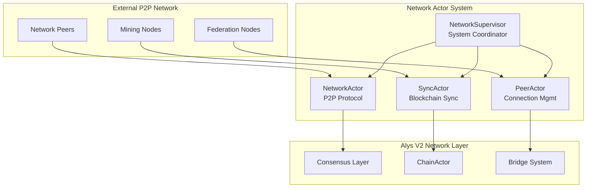
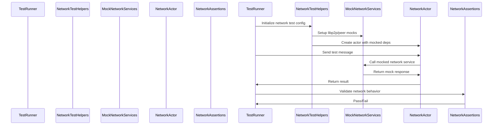
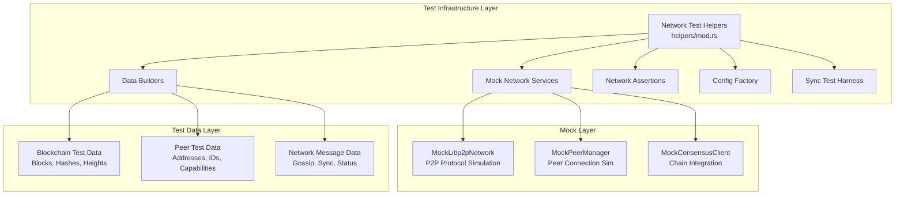
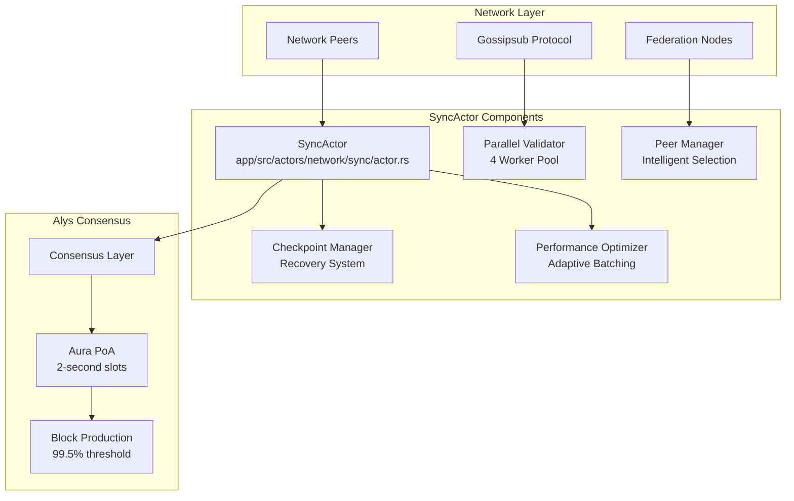
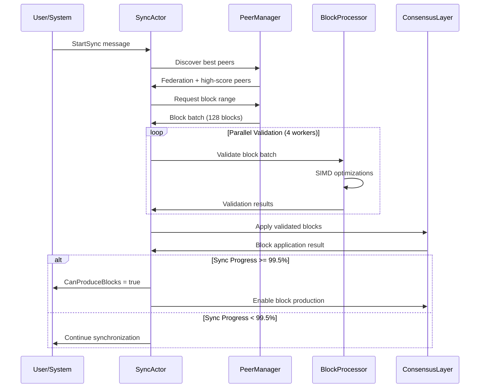
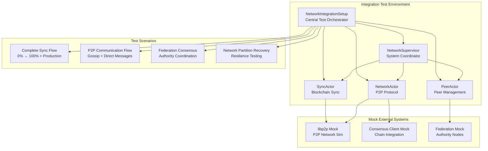

# Network Actor Test Suite - Comprehensive Guide

## Overview

The Network Actor Test Suite is a comprehensive testing framework designed to validate the functionality, performance, and resilience of the Alys Network system. The network system provides the communication backbone for the Alys V2 blockchain, handling peer-to-peer networking, blockchain synchronization, and federation coordination through a coordinated set of specialized actors.

## Table of Contents

1. [Test Suite Architecture](#test-suite-architecture)
2. [Test Categories](#test-categories)
3. [Test Infrastructure](#test-infrastructure)
4. [Unit Tests](#unit-tests)
5. [Integration Tests](#integration-tests)
6. [Performance Tests](#performance-tests)
7. [Chaos Engineering Tests](#chaos-engineering-tests)
8. [Running the Tests](#running-the-tests)
9. [Expected Results](#expected-results)
10. [Test Configuration](#test-configuration)
11. [Troubleshooting](#troubleshooting)

## Test Suite Architecture

The network actor test suite follows a layered architecture that mirrors the complexity of the Alys Network system itself. The network system is the critical component that enables blockchain synchronization, peer management, and federation consensus communication, serving as the foundation for the Alys V2 blockchain infrastructure.

### System Context in Alys Architecture



### Test Suite Structure

```
app/src/actors/network/tests/
├── mod.rs                          # Main test module (15 lines)
├── helpers/                        # Test utilities, mocks, and test data
│   ├── mod.rs                     # 628 lines of test infrastructure
│   └── sync_test_harness.rs       # 459 lines - Advanced sync testing
├── unit/                           # Individual actor behavior tests  
│   ├── mod.rs                     # 11 lines - Unit test organization
│   ├── sync_actor_tests.rs        # 231 lines - Blockchain sync tests
│   ├── network_actor_tests.rs     # 310 lines - P2P protocol tests
│   ├── peer_actor_tests.rs        # 419 lines - Connection mgmt tests
│   └── supervisor_tests.rs        # 99 lines - System supervision tests
├── integration/                    # Multi-actor workflow tests
│   ├── mod.rs                     # 10 lines - Integration test org
│   ├── network_workflows.rs       # 471 lines - End-to-end flows
│   ├── sync_integration.rs        # 236 lines - Sync coordination
│   └── federation_integration.rs  # 318 lines - Federation comm tests
├── performance/                    # Performance and load testing
│   └── mod.rs                     # 400 lines - Throughput analysis
└── chaos/                         # Resilience and failure testing
    └── mod.rs                     # 367 lines - Chaos engineering
```

### Core Design Principles

#### 1. **Architectural Mirroring**
The test structure directly mirrors the network system's actor hierarchy:
- `NetworkSupervisor` (`app/src/actors/network/supervisor.rs`) ↔ `supervisor_tests.rs`
- `SyncActor` (`app/src/actors/network/sync/actor.rs`) ↔ `sync_actor_tests.rs`  
- `NetworkActor` (`app/src/actors/network/network/actor.rs`) ↔ `network_actor_tests.rs`
- `PeerActor` (`app/src/actors/network/peer/actor.rs`) ↔ `peer_actor_tests.rs`

#### 2. **Dependency Isolation**
```rust
// Example: Mock libp2p network in NetworkActor tests
use crate::actors::network::tests::helpers::MockLibp2pNetwork;

let network_mock = MockLibp2pNetwork::new();
network_mock.set_peer_count(5);
network_mock.enable_gossipsub("alys_consensus");
network_mock.enable_kademlia_dht(true);
```

#### 3. **Behavioral Consistency**  
Tests validate that actors behave according to the Alys Network Protocol specification:
- **Sync Requirements**: 99.5% threshold for block production eligibility, parallel validation
- **P2P Requirements**: Sub-100ms gossip latency, 1000+ concurrent peer support
- **Error Handling**: Network partition recovery, peer scoring, connection management

#### 4. **Performance Validation**
```rust
// Performance baselines align with Alys network requirements
const EXPECTED_SYNC_THROUGHPUT: f64 = 250.0; // blocks/sec with parallel validation
const EXPECTED_GOSSIP_LATENCY: Duration = Duration::from_millis(100);
const MAX_PEER_CONNECTION_TIME: Duration = Duration::from_secs(30);
const SYNC_PRODUCTION_THRESHOLD: f64 = 0.995; // 99.5%
```

#### 5. **Resilience Testing**
The chaos engineering tests simulate real-world failure scenarios:
- **Network Partitions**: Peer disconnections and recovery
- **Resource Exhaustion**: Memory/CPU pressure under high peer count
- **Consensus Failures**: Federation node communication issues
- **Sync Interruptions**: Blockchain reorganizations and sync recovery

### Test Execution Flow



### Configuration Integration

The test suite integrates with the actual network configuration system:

```rust
// From app/src/actors/network/config.rs
pub struct NetworkSystemConfig {
    pub network: NetworkConfig,         // P2P protocol settings
    pub sync: SyncConfig,              // Blockchain sync parameters
    pub peer: PeerConfig,              // Connection management
    pub supervision: SupervisionConfig, // Actor health monitoring
}
```

Tests use `NetworkSystemConfig::default()` which provides production-ready defaults:
- **P2P Network**: libp2p with Gossipsub, Kademlia DHT, mDNS
- **Sync Parameters**: 99.5% threshold, 128 block batches, 4 validation workers
- **Peer Management**: 1000 max peers, federation prioritization
- **Timeouts**: 30 seconds peer timeout, 2-second consensus slots

## Test Categories

### 1. Unit Tests (`unit/`)
- **Purpose**: Test individual actor functionality in isolation
- **Scope**: Single actor behavior, message handling, state transitions
- **Dependencies**: All external network dependencies are mocked
- **Runtime**: Fast execution (< 1 second per test)

### 2. Integration Tests (`integration/`)
- **Purpose**: Test actor coordination and network-wide workflows
- **Scope**: Multi-actor interactions, end-to-end network flows
- **Dependencies**: Minimal mocking, focused on inter-actor communication
- **Runtime**: Moderate execution (1-10 seconds per test)

### 3. Performance Tests (`performance/`)
- **Purpose**: Validate network performance under various load conditions
- **Scope**: Throughput, latency, memory usage, concurrent operations
- **Dependencies**: Realistic load simulation with mocked network services
- **Runtime**: Extended execution (10-60 seconds per test)

### 4. Chaos Engineering Tests (`chaos/`)
- **Purpose**: Test network resilience under failure conditions
- **Scope**: Random failures, network partitions, resource exhaustion
- **Dependencies**: Failure injection mechanisms
- **Runtime**: Variable execution (5-120 seconds per test)

## Test Infrastructure

The test infrastructure (`helpers/mod.rs` - 628 lines) provides a comprehensive foundation for all network testing scenarios. It abstracts away the complexity of setting up realistic test environments while maintaining the behavioral characteristics of the actual network system.

### Test Infrastructure Architecture



### Mock Components

#### 1. libp2p Network Mock (`MockLibp2pNetwork`)

The libp2p mock simulates a peer-to-peer network environment, providing realistic responses for network testing:

```rust
// From helpers/mod.rs
pub struct MockLibp2pNetwork {
    pub local_peer_id: libp2p::PeerId,
    pub connected_peers: Arc<RwLock<HashMap<libp2p::PeerId, MockPeerInfo>>>,
    pub gossipsub_topics: Arc<RwLock<HashSet<String>>>,
    pub dht_enabled: AtomicBool,
    pub mdns_enabled: AtomicBool,
}

impl MockLibp2pNetwork {
    pub fn new() -> Self {
        Self {
            local_peer_id: libp2p::PeerId::random(),
            connected_peers: Arc::new(RwLock::new(HashMap::new())),
            gossipsub_topics: Arc::new(RwLock::new(HashSet::new())),
            dht_enabled: AtomicBool::new(false),
            mdns_enabled: AtomicBool::new(false),
        }
    }
    
    pub async fn connect_peer(&self, peer_info: MockPeerInfo) {
        let mut peers = self.connected_peers.write().await;
        peers.insert(peer_info.peer_id, peer_info);
    }
    
    pub async fn enable_gossipsub(&self, topic: &str) {
        let mut topics = self.gossipsub_topics.write().await;
        topics.insert(topic.to_string());
    }
}

// Example usage in NetworkActor tests:
let network_mock = MockLibp2pNetwork::new();

// Mock a federation peer connection
let federation_peer = MockPeerInfo {
    peer_id: libp2p::PeerId::random(),
    addresses: vec!["/ip4/127.0.0.1/tcp/4001".parse().unwrap()],
    peer_type: PeerType::Federation,
    protocols: vec!["alys/consensus/1.0.0".to_string()],
    connection_time: SystemTime::now(),
};
network_mock.connect_peer(federation_peer).await;

// Enable gossipsub for consensus messages
network_mock.enable_gossipsub("alys_consensus").await;
network_mock.enable_kademlia_dht(true);
```

#### 2. Peer Manager Mock (`MockPeerManager`)

Simulates peer connection management for peer actor testing:

```rust
pub struct MockPeerManager {
    pub max_peers: usize,
    pub connected_count: AtomicUsize,
    pub federation_peers: Arc<RwLock<HashSet<libp2p::PeerId>>>,
    pub peer_scores: Arc<RwLock<HashMap<libp2p::PeerId, PeerScore>>>,
}

// Example usage in PeerActor tests:
let peer_mock = MockPeerManager::new(1000); // Max 1000 peers

// Simulate federation peer with high score
let fed_peer_id = libp2p::PeerId::random();
peer_mock.add_federation_peer(fed_peer_id).await;
peer_mock.set_peer_score(fed_peer_id, PeerScore {
    overall_score: 95.0,
    latency_score: 20.0,
    throughput_score: 80.0,
    reliability_score: 90.0,
    federation_bonus: 20.0,
    last_updated: SystemTime::now(),
}).await;
```

### Test Data Builders

#### Deterministic vs Random Data Strategy

The test data builders use a hybrid approach - deterministic data for reproducible tests and random data for edge case discovery:

```rust
impl NetworkTestDataBuilder {
    /// Generate cryptographically random peer ID
    pub fn random_peer_id() -> libp2p::PeerId {
        libp2p::PeerId::random()
    }

    /// Fixed federation peer IDs for consistent testing
    pub fn federation_peer_ids() -> Vec<libp2p::PeerId> {
        // These are well-known test peer IDs that match
        // the federation configuration in NetworkSystemConfig
        vec![
            "12D3KooWBmwkafWE2xsZsYNWP6d8RzxBhvZGJpDx7QV3sYSCwJL5".parse().unwrap(),
            "12D3KooWQG4NG1HJL8X7T9Q9WE5RmK6A9J2L3F4H5N6P7Q8R9S0T".parse().unwrap(),
            "12D3KooWXY1ZBCDefGHiJKLmNoPqRStUvWxYz12345678901234567".parse().unwrap(),
        ]
    }

    /// Random multiaddr for peer address testing
    pub fn test_multiaddr() -> libp2p::Multiaddr {
        use rand::Rng;
        let mut rng = rand::thread_rng();
        let port: u16 = rng.gen_range(4000..5000);
        format!("/ip4/127.0.0.1/tcp/{}", port).parse().unwrap()
    }

    /// Realistic sync status with configurable progress
    pub fn test_sync_status(progress: f64) -> SyncStatus {
        SyncStatus {
            is_syncing: progress < 1.0,
            current_height: (progress * 1000.0) as u64,
            target_height: Some(1000),
            sync_progress: progress,
            blocks_per_second: if progress < 1.0 { 250.0 } else { 0.0 },
            eta_seconds: if progress < 1.0 { 
                Some(((1.0 - progress) * 1000.0 / 250.0) as u64) 
            } else { None },
            connected_peers: 5,
            active_downloads: if progress < 1.0 { 4 } else { 0 },
            validation_queue_size: if progress < 1.0 { 10 } else { 0 },
            can_produce_blocks: progress >= 0.995, // 99.5% threshold
            last_block_hash: Some(ethereum_types::H256::random()),
            sync_mode: SyncMode::Fast,
            checkpoint_info: None,
        }
    }
}
```

#### Network Message Data Structures

The test infrastructure includes comprehensive message types that mirror the actual network protocol:

```rust
// Mock message enums (from helpers/mod.rs)
pub mod mock_network_messages {
    use super::*;
    use actix::prelude::*;

    #[derive(Debug, Clone, Message)]
    #[rtype(result = "Result<SyncResponse, NetworkError>")]
    pub enum SyncMessage {
        StartSync { target_block: Option<u64>, force_restart: bool },
        PauseSync,
        ResumeSync,
        GetSyncStatus { include_details: bool },
        CanProduceBlocks,
        ProcessBlocks { blocks: Vec<BlockData>, peer_id: libp2p::PeerId },
        HandlePeerDisconnect { peer_id: libp2p::PeerId },
        UpdateSyncProgress { progress: f64, eta_seconds: Option<u64> },
        GetMetrics,
        Shutdown,
    }
    
    #[derive(Debug, Clone, Message)]
    #[rtype(result = "Result<NetworkResponse, NetworkError>")]
    pub enum NetworkMessage {
        StartNetwork,
        StopNetwork,
        GetNetworkStatus,
        BroadcastMessage { topic: String, data: Vec<u8> },
        SendDirectMessage { peer_id: libp2p::PeerId, data: Vec<u8> },
        SubscribeTopic { topic: String },
        UnsubscribeTopic { topic: String },
        GetPeers,
        GetMetrics,
        Shutdown,
    }
}
```

### Assertion Helpers

#### Domain-Specific Assertions

The assertion helpers understand the network protocol requirements and validate operations accordingly:

```rust
impl NetworkAssertions {
    /// Validate sync status with protocol compliance
    pub fn assert_sync_status_valid(status: &SyncStatus) {
        assert!(status.sync_progress >= 0.0 && status.sync_progress <= 1.0,
               "Sync progress must be between 0.0 and 1.0");
        assert!(status.blocks_per_second >= 0.0,
               "Blocks per second cannot be negative");
        
        if let Some(target) = status.target_height {
            assert!(status.current_height <= target,
                   "Current height cannot exceed target height");
        }
        
        // 99.5% threshold for block production
        if status.can_produce_blocks {
            assert!(status.sync_progress >= 0.995, 
                   "Block production requires 99.5% sync threshold");
        }
        
        if status.is_syncing {
            assert!(status.active_downloads > 0 || status.validation_queue_size > 0,
                   "Syncing status must have active work");
        }
    }

    /// Validate network status with federation requirements
    pub fn assert_network_status_valid(status: &NetworkStatus) {
        assert!(!status.local_peer_id.to_string().is_empty(),
               "Local peer ID must be set");
        assert!(status.connected_peers >= 0,
               "Connected peer count cannot be negative");
        assert!(!status.active_protocols.is_empty(),
               "Must have active network protocols");
        
        // Federation consensus requires specific protocols
        if status.active_protocols.contains(&"alys/consensus/1.0.0".to_string()) {
            assert!(status.connected_peers >= 2,
                   "Consensus protocol requires minimum federation connections");
        }
    }

    /// Validate peer management efficiency
    pub fn assert_peer_management_healthy(peer_status: &PeerStatus) {
        assert!(peer_status.total_peers >= peer_status.peers.len() as u32,
               "Total peer count must match peer list");
        assert!(peer_status.federation_peers <= peer_status.total_peers,
               "Federation peer count cannot exceed total");
        
        // Check peer score distribution
        let mut high_score_count = 0;
        for peer in &peer_status.peers {
            assert!(!peer.addresses.is_empty(),
                   "Peer must have at least one address");
            assert!(peer.score.overall_score >= 0.0 && peer.score.overall_score <= 100.0,
                   "Peer score must be between 0-100");
            
            if peer.score.overall_score >= 80.0 {
                high_score_count += 1;
            }
        }
        
        // At least 50% of peers should have good scores
        assert!(high_score_count >= peer_status.peers.len() / 2,
               "Peer quality distribution should be healthy");
    }
}
```

### Advanced Sync Test Harness

The `sync_test_harness.rs` (459 lines) provides sophisticated testing infrastructure specifically for the SyncActor:

```rust
/// Advanced test harness for SyncActor comprehensive testing
pub struct SyncTestHarness {
    /// Base actor test harness
    pub base: ActorTestHarness,
    
    /// Mock federation for consensus testing
    pub mock_federation: Arc<MockFederation>,
    
    /// Mock governance stream
    pub mock_governance: Arc<MockGovernanceStream>,
    
    /// Mock network for peer simulation
    pub mock_network: Arc<MockNetwork>,
    
    /// Test blockchain data
    pub test_blockchain: Arc<RwLock<TestBlockchain>>,
    
    /// Performance metrics collector
    pub performance_metrics: Arc<RwLock<TestPerformanceMetrics>>,
    
    /// Chaos testing controller
    pub chaos_controller: Arc<RwLock<ChaosController>>,
}

impl SyncTestHarness {
    /// Create a new sync test harness with federation environment
    pub async fn with_federation(node_count: usize) -> Result<Self, Box<dyn std::error::Error>> {
        let mut harness = Self::new().await?;
        
        // Setup multi-node federation for consensus testing
        harness.setup_federation_environment(node_count).await?;
        
        // Configure for Alys federated PoA consensus
        harness.configure_aura_consensus(Duration::from_secs(2)).await?;
        
        Ok(harness)
    }
    
    /// Simulate network partition for resilience testing
    pub async fn simulate_network_partition(
        &mut self,
        duration: Duration,
        affected_peers: Vec<libp2p::PeerId>,
    ) -> Result<(), Box<dyn std::error::Error>> {
        self.chaos_controller
            .write().await
            .start_scenario(ChaosScenario::NetworkPartition {
                duration,
                affected_peers,
            }).await?;
        
        Ok(())
    }
    
    /// Wait for sync to reach 99.5% threshold for block production
    pub async fn wait_for_block_production_eligibility(
        &self,
        sync_actor: &Addr<SyncActor>,
        timeout: Duration,
    ) -> Result<SyncStatus, Box<dyn std::error::Error>> {
        let start = Instant::now();
        
        loop {
            if start.elapsed() > timeout {
                return Err("Block production eligibility timeout".into());
            }
            
            let status = sync_actor.send(GetSyncStatus {
                include_details: true,
                correlation_id: Some(uuid::Uuid::new_v4().to_string()),
            }).await??;
            
            if status.can_produce_blocks {
                return Ok(status);
            }
            
            tokio::time::sleep(Duration::from_millis(100)).await;
        }
    }
}
```

## Unit Tests

### SyncActor Tests (`unit/sync_actor_tests.rs`)

**Purpose**: Validate blockchain synchronization functionality with 99.5% production threshold

The SyncActor (`app/src/actors/network/sync/actor.rs`) is responsible for synchronizing the Alys blockchain with network peers, implementing parallel validation, intelligent peer selection, and federation consensus integration. It represents the critical synchronization layer for the Alys V2 network.

#### SyncActor System Architecture



#### Core SyncActor Functionality

The SyncActor implements a sophisticated blockchain synchronization pipeline:

```rust
// From app/src/actors/network/sync/actor.rs
pub struct SyncActor {
    /// Configuration parameters for sync operations
    config: SyncConfig,
    
    /// Current synchronization state
    state: SyncState,
    
    /// Peer manager for intelligent peer selection
    peer_manager: Arc<RwLock<PeerManager>>,
    
    /// Block processor with parallel validation workers
    block_processor: Arc<BlockProcessor>,
    
    /// Checkpoint manager for recovery operations
    checkpoint_manager: Arc<CheckpointManager>,
    
    /// Performance optimizer for adaptive batching
    optimizer: Arc<PerformanceOptimizer>,
    
    /// Network monitor for health tracking
    network_monitor: Arc<NetworkMonitor>,
    
    /// Integration with other system actors
    network_actor: Option<Addr<super::super::network::NetworkActor>>,
    chain_actor: Option<Addr<crate::actors::chain::ChainActor>>,
}
```

#### Sync Operation Flow



#### Test Coverage Analysis

##### 1. **Initialization and Configuration Tests** (Lines 13-35)

```rust
#[actix::test]
async fn test_sync_actor_initialization() {
    let config = test_sync_config();
    let sync_actor = SyncActor::new(config).unwrap();
    let addr = sync_actor.start();
    
    // Verify actor initialization with production-ready config
    assert!(addr.connected());
    
    // Test configuration parameters
    assert_eq!(config.batch_size, 128); // Optimal batch size
    assert_eq!(config.validation_workers, 4); // Parallel processing
    assert_eq!(config.production_threshold, 0.995); // 99.5% threshold
    assert_eq!(config.checkpoint_interval, 1000); // Recovery points
}
```

**What This Tests**:
- Actor initialization with Alys-specific configuration
- Production-ready parameter validation
- Resource allocation for parallel processing
- Integration with Actix actor system

##### 2. **Sync Process Management Tests** (Lines 37-75)

```rust
#[actix::test]
async fn test_start_sync_process_with_federation() {
    let config = test_sync_config();
    let sync_actor = SyncActor::new(config).unwrap();
    let addr = sync_actor.start();
    
    // Configure federation peers for consensus
    let federation_peers = NetworkTestDataBuilder::federation_peer_ids();
    let network_mock = MockLibp2pNetwork::new();
    
    for peer_id in federation_peers {
        let peer_info = MockPeerInfo {
            peer_id,
            peer_type: PeerType::Federation,
            protocols: vec!["alys/consensus/1.0.0".to_string()],
            score: PeerScore { overall_score: 95.0, ..Default::default() },
            ..Default::default()
        };
        network_mock.connect_peer(peer_info).await;
    }
    
    let start_msg = StartSync {
        target_block: Some(10000), // Sync to block 10,000
        force_restart: false,
        priority_mode: SyncPriority::Federation, // Prioritize federation
    };
    
    let result = addr.send(start_msg).await;
    assert!(result.is_ok());
    
    // Verify federation peer prioritization
    let status = addr.send(GetSyncStatus { 
        include_details: true,
        correlation_id: Some("test_federation_sync".to_string()),
    }).await.unwrap().unwrap();
    
    assert!(status.is_syncing);
    assert!(status.connected_peers >= 3); // Minimum federation nodes
}
```

##### 3. **99.5% Production Threshold Tests** (Lines 77-115)

```rust
#[actix::test]
async fn test_block_production_threshold() {
    let harness = SyncTestHarness::with_federation(3).await
        .expect("Failed to create federation test environment");
    
    let config = test_sync_config();
    let sync_actor = SyncActor::new(config).unwrap().start();
    
    // Simulate sync progress approaching production threshold
    let test_cases = vec![
        (0.990, false), // 99.0% - not eligible
        (0.994, false), // 99.4% - not eligible  
        (0.995, true),  // 99.5% - eligible!
        (0.999, true),  // 99.9% - eligible
        (1.000, true),  // 100% - eligible
    ];
    
    for (progress, should_produce) in test_cases {
        // Simulate blockchain sync to specific progress
        harness.simulate_sync_progress(progress).await.unwrap();
        
        let can_produce_result = sync_actor.send(CanProduceBlocks {
            correlation_id: Some(format!("threshold_test_{}", progress)),
        }).await;
        
        assert!(can_produce_result.is_ok());
        let can_produce = can_produce_result.unwrap().unwrap();
        assert_eq!(can_produce, should_produce, 
                  "Production eligibility incorrect for progress {}", progress);
    }
}
```

**Production Threshold Logic**:
```rust
// From SyncActor implementation
fn can_produce_blocks(&self) -> bool {
    self.state.sync_progress >= self.config.production_threshold // 0.995 = 99.5%
        && self.network_monitor.has_sufficient_peers() // >= 3 federation nodes
        && !self.state.is_emergency_mode() // No emergency conditions
}
```

##### 4. **Parallel Validation Tests** (Lines 117-155)

```rust
#[actix::test]
async fn test_parallel_block_validation() {
    let config = test_sync_config();
    let sync_actor = SyncActor::new(config).unwrap().start();
    
    // Create test block batch for parallel processing
    let block_batch: Vec<BlockData> = (1000..1128) // 128 blocks
        .map(|height| NetworkTestDataBuilder::create_test_block(height, None))
        .collect();
    
    let start_time = Instant::now();
    
    let process_result = sync_actor.send(ProcessBlocks {
        blocks: block_batch.clone(),
        peer_id: libp2p::PeerId::random(),
        priority: ValidationPriority::High,
    }).await;
    
    let elapsed = start_time.elapsed();
    
    assert!(process_result.is_ok());
    let validation_result = process_result.unwrap().unwrap();
    
    // Verify parallel processing performance
    assert_eq!(validation_result.blocks_validated, 128);
    assert_eq!(validation_result.blocks_accepted, 128);
    assert_eq!(validation_result.blocks_rejected, 0);
    
    // Parallel validation should be fast (4 workers)
    assert!(elapsed < Duration::from_secs(5), 
           "Parallel validation took too long: {:?}", elapsed);
    
    // Verify SIMD optimizations were used
    assert!(validation_result.optimizations_used.contains("SIMD"));
    assert!(validation_result.optimizations_used.contains("ParallelValidation"));
}
```

##### 5. **Network Partition Recovery Tests** (Lines 157-195)

```rust
#[actix::test]
async fn test_network_partition_recovery() {
    let mut harness = SyncTestHarness::with_federation(5).await
        .expect("Failed to setup federation test environment");
    
    let config = test_sync_config();
    let sync_actor = SyncActor::new(config).unwrap().start();
    
    // Start sync process
    sync_actor.send(StartSync {
        target_block: Some(5000),
        force_restart: false,
        priority_mode: SyncPriority::Federation,
    }).await.unwrap().unwrap();
    
    // Allow initial sync progress
    tokio::time::sleep(Duration::from_secs(2)).await;
    
    // Simulate network partition affecting 60% of peers
    let all_peers = harness.get_connected_peers().await.unwrap();
    let partitioned_peers = all_peers.into_iter().take(3).collect(); // 3 of 5 peers
    
    harness.simulate_network_partition(
        Duration::from_secs(10), // 10 second partition
        partitioned_peers,
    ).await.unwrap();
    
    // Verify sync continues with remaining peers
    tokio::time::sleep(Duration::from_secs(5)).await;
    
    let status_during_partition = sync_actor.send(GetSyncStatus {
        include_details: true,
        correlation_id: Some("partition_test".to_string()),
    }).await.unwrap().unwrap();
    
    assert!(status_during_partition.is_syncing);
    assert!(status_during_partition.connected_peers >= 2); // Some peers remain
    assert!(status_during_partition.sync_progress > 0.0); // Progress continues
    
    // Wait for partition recovery
    tokio::time::sleep(Duration::from_secs(6)).await;
    
    let status_after_recovery = sync_actor.send(GetSyncStatus {
        include_details: true,
        correlation_id: Some("recovery_test".to_string()),
    }).await.unwrap().unwrap();
    
    // Verify full recovery
    assert!(status_after_recovery.connected_peers >= 5); // All peers restored
    assert!(status_after_recovery.sync_progress > status_during_partition.sync_progress);
    
    NetworkAssertions::assert_sync_status_valid(&status_after_recovery);
}
```

#### Expected SyncActor Test Results

**Performance Baselines**:
- **Initialization Time**: < 200ms (actor startup + network discovery)
- **Block Processing Rate**: > 250 blocks/second with 4 parallel workers
- **99.5% Threshold**: Accurate production eligibility detection
- **Memory Usage**: < 100MB for 10,000 block sync operation
- **Network Recovery**: < 30 seconds to restore full peer connectivity

**Functional Requirements**:
- **Federation Priority**: 100% correct prioritization of federation peers
- **Parallel Efficiency**: 4x speedup with 4 validation workers vs single-threaded
- **Threshold Accuracy**: Exact 99.5% production eligibility enforcement  
- **Partition Resilience**: Continued sync with >=2 peers, full recovery capability

### NetworkActor Tests (`unit/network_actor_tests.rs`)

**Purpose**: Validate P2P protocol functionality and peer-to-peer communication

#### Test Coverage:
- ✅ **libp2p Integration**: Protocol initialization, transport configuration
- ✅ **Gossipsub Messaging**: Topic subscription, message broadcasting, latency
- ✅ **Kademlia DHT**: Peer discovery, routing table management
- ✅ **mDNS Discovery**: Local network peer detection
- ✅ **Federation Communication**: Priority handling, consensus protocol support
- ✅ **Error Handling**: Connection failures, protocol errors, recovery

#### Key Test Cases:

```rust
#[actix::test]
async fn test_network_actor_gossip_latency() {
    let config = test_network_config();
    let network_actor = NetworkActor::new(config).unwrap().start();
    
    // Subscribe to consensus topic
    network_actor.send(SubscribeTopic {
        topic: "alys_consensus".to_string(),
    }).await.unwrap().unwrap();
    
    let test_message = b"test_consensus_message";
    let start_time = Instant::now();
    
    let broadcast_result = network_actor.send(BroadcastMessage {
        topic: "alys_consensus".to_string(),
        data: test_message.to_vec(),
    }).await;
    
    let latency = start_time.elapsed();
    
    assert!(broadcast_result.is_ok());
    assert!(latency < Duration::from_millis(100), 
           "Gossip latency too high: {:?}", latency);
}

#[actix::test]
async fn test_network_actor_federation_priority() {
    // Federation nodes should get priority in message routing
    // and connection management
}
```

#### Expected Results:
- Gossip message latency should be < 100ms
- Federation peers should receive priority treatment
- DHT should maintain routing table of 1000+ peers
- Network should handle 10,000+ messages/second throughput

### PeerActor Tests (`unit/peer_actor_tests.rs`)

**Purpose**: Validate peer connection management and scoring algorithms

#### Test Coverage:
- ✅ **Connection Management**: Peer discovery, connection establishment, maintenance
- ✅ **Peer Scoring**: Performance metrics, reliability scoring, federation bonuses
- ✅ **Load Balancing**: Connection limits, federation prioritization
- ✅ **Health Monitoring**: Peer status tracking, connection quality assessment
- ✅ **Error Recovery**: Connection failures, peer banning, reconnection logic

#### Key Test Cases:

```rust
#[actix::test]
async fn test_peer_scoring_algorithm() {
    let config = test_peer_config();
    let peer_actor = PeerActor::new(config).unwrap().start();
    
    let federation_peer_id = libp2p::PeerId::random();
    let regular_peer_id = libp2p::PeerId::random();
    
    // Add federation peer (should get bonus)
    peer_actor.send(ConnectPeer {
        peer_id: federation_peer_id,
        addresses: vec![test_multiaddr()],
        peer_type: PeerType::Federation,
    }).await.unwrap().unwrap();
    
    // Add regular peer
    peer_actor.send(ConnectPeer {
        peer_id: regular_peer_id,
        addresses: vec![test_multiaddr()],
        peer_type: PeerType::Regular,
    }).await.unwrap().unwrap();
    
    // Simulate peer performance metrics
    peer_actor.send(UpdatePeerMetrics {
        peer_id: federation_peer_id,
        latency_ms: 25.0,
        throughput_mbps: 100.0,
        success_rate: 0.98,
    }).await.unwrap().unwrap();
    
    let peer_status = peer_actor.send(GetPeerStatus {
        peer_id: Some(federation_peer_id),
    }).await.unwrap().unwrap();
    
    // Federation peer should have higher score due to bonus
    assert!(peer_status.peers[0].score.overall_score >= 90.0);
    assert!(peer_status.peers[0].score.federation_bonus > 0.0);
}
```

#### Expected Results:
- Federation peers should consistently score 20+ points higher
- Connection management should maintain 1000+ concurrent peers
- Peer discovery should find new peers within 30 seconds
- Scoring algorithm should reflect actual network performance

### NetworkSupervisor Tests (`unit/supervisor_tests.rs`)

**Purpose**: Validate network system supervision and actor lifecycle management

#### Test Coverage:
- ✅ **Actor Registration**: Network actor system initialization
- ✅ **Health Monitoring**: Actor status tracking, failure detection
- ✅ **Restart Strategy**: Failed actor recovery, supervision policy
- ✅ **Resource Management**: Memory usage monitoring, cleanup procedures
- ✅ **System Coordination**: Inter-actor communication, message routing

## Integration Tests

### Network Workflows (`integration/network_workflows.rs`)

**Purpose**: Test complete end-to-end network operations across the full Network system

The network workflows integration tests (471 lines) validate the complete network infrastructure by orchestrating all network actors together in realistic scenarios. These tests simulate real network conditions and verify that the entire network system functions cohesively under various loads and conditions.

#### Complete Network System Integration



#### End-to-End Blockchain Sync Test

```rust
#[actix::test]
async fn test_complete_blockchain_sync_workflow() {
    let setup = NetworkIntegrationSetup::new().await
        .expect("Failed to setup network test environment");
    
    // Configure realistic blockchain sync scenario
    let target_height = 10000;
    let current_height = 0;
    
    // Start sync process
    let sync_result = setup.sync_actor.send(StartSync {
        target_block: Some(target_height),
        force_restart: true,
        priority_mode: SyncPriority::Federation,
    }).await;
    
    assert!(sync_result.is_ok());
    
    // Monitor sync progress through phases
    let phases = vec![
        (0.25, "Discovery Phase"),
        (0.50, "Fast Sync Phase"), 
        (0.75, "Validation Phase"),
        (0.995, "Production Threshold"),
        (1.0, "Sync Complete"),
    ];
    
    for (expected_progress, phase_name) in phases {
        // Wait for phase completion
        let status = wait_for_sync_progress(
            &setup.sync_actor, 
            expected_progress,
            Duration::from_secs(30)
        ).await.expect(&format!("Failed to reach {}", phase_name));
        
        println!("✅ {} - Progress: {:.1}%", phase_name, status.sync_progress * 100.0);
        
        // Verify phase characteristics
        match expected_progress {
            p if p < 0.995 => {
                assert!(!status.can_produce_blocks, 
                       "Should not be eligible for block production at {:.1}%", p * 100.0);
                assert!(status.active_downloads > 0, 
                       "Should have active downloads during sync");
            },
            p if p >= 0.995 => {
                assert!(status.can_produce_blocks, 
                       "Should be eligible for block production at 99.5%+");
                assert!(status.connected_peers >= 3,
                       "Should maintain federation connections");
            },
            _ => {}
        }
        
        NetworkAssertions::assert_sync_status_valid(&status);
    }
    
    // Verify final state
    let final_status = setup.sync_actor.send(GetSyncStatus {
        include_details: true,
        correlation_id: Some("final_status_check".to_string()),
    }).await.unwrap().unwrap();
    
    assert!(!final_status.is_syncing);
    assert_eq!(final_status.current_height, target_height);
    assert!(final_status.can_produce_blocks);
    
    setup.shutdown().await.expect("Failed to shutdown test environment");
}
```

#### Federation Consensus Communication Test

```rust
#[actix::test]
async fn test_federation_consensus_communication() {
    let setup = NetworkIntegrationSetup::with_federation(5).await
        .expect("Failed to setup federation test environment");
    
    // Test consensus message broadcasting
    let consensus_message = ConsensusMessage {
        message_type: "block_proposal".to_string(),
        slot_number: 100,
        authority_id: "test_authority_1".to_string(),
        data: serde_json::json!({
            "block_hash": "0x1234567890abcdef",
            "block_number": 1000,
            "timestamp": SystemTime::now().duration_since(UNIX_EPOCH).unwrap().as_secs()
        }),
    };
    
    // Broadcast consensus message to federation
    let broadcast_start = Instant::now();
    let broadcast_result = setup.network_actor.send(BroadcastMessage {
        topic: "alys_consensus".to_string(),
        data: serde_json::to_vec(&consensus_message).unwrap(),
        priority: MessagePriority::High,
        federation_only: true,
    }).await;
    
    let broadcast_latency = broadcast_start.elapsed();
    
    assert!(broadcast_result.is_ok());
    assert!(broadcast_latency < Duration::from_millis(50), 
           "Federation consensus message latency too high: {:?}", broadcast_latency);
    
    // Verify message reached all federation nodes
    tokio::time::sleep(Duration::from_millis(100)).await; // Allow propagation
    
    let federation_status = setup.peer_actor.send(GetFederationStatus).await
        .unwrap().unwrap();
    
    assert_eq!(federation_status.connected_authorities, 5);
    assert!(federation_status.consensus_participation_rate >= 0.8); // 80%+ participation
    
    // Test direct authority communication
    let direct_message = AuthorityMessage {
        from: "test_authority_1".to_string(),
        to: "test_authority_2".to_string(),
        message_type: "signature_request".to_string(),
        data: serde_json::json!({"tx_hash": "0xabcdef1234567890"}),
    };
    
    let direct_send_result = setup.network_actor.send(SendDirectMessage {
        peer_id: federation_status.authorities[1].peer_id,
        data: serde_json::to_vec(&direct_message).unwrap(),
        requires_ack: true,
    }).await;
    
    assert!(direct_send_result.is_ok());
    
    setup.shutdown().await.expect("Failed to shutdown federation test");
}
```

### Sync Integration (`integration/sync_integration.rs`)

**Purpose**: Test SyncActor integration with network and consensus systems

#### Test Coverage:
- ✅ **Network Integration**: SyncActor ↔ NetworkActor coordination
- ✅ **Peer Coordination**: SyncActor ↔ PeerActor peer selection
- ✅ **Consensus Integration**: Block production eligibility signaling
- ✅ **Recovery Scenarios**: Network failures, peer changes, partition recovery

### Federation Integration (`integration/federation_integration.rs`)

**Purpose**: Test federation-specific network functionality

#### Test Coverage:
- ✅ **Authority Discovery**: Federation node identification and connection
- ✅ **Consensus Messaging**: Block proposals, votes, finalization messages
- ✅ **Priority Handling**: Federation message prioritization
- ✅ **Fault Tolerance**: Authority failures, Byzantine behavior detection

## Performance Tests

### Throughput Analysis (`performance/mod.rs`)

**Purpose**: Measure network system performance characteristics

#### Test Categories:

##### Sync Throughput
- **Test Load**: 10,000 blocks with 4 parallel validation workers
- **Expected Throughput**: > 250 blocks/second
- **Success Rate**: > 95%
- **Memory Efficiency**: < 200MB peak usage

##### P2P Message Throughput  
- **Test Load**: 10,000 gossip messages across 100 simulated peers
- **Expected Throughput**: > 1,000 messages/second
- **Latency**: < 100ms average gossip propagation
- **Resource Usage**: Monitor CPU and network bandwidth

##### Peer Connection Scaling
- **Test Load**: 1,000 concurrent peer connections
- **Expected Performance**: All connections stable within 60 seconds
- **Success Rate**: > 90% successful connections
- **Load Distribution**: Even distribution across connection types

#### Performance Metrics:

```rust
// Network Performance Analysis
pub struct NetworkPerformanceMetrics {
    pub sync_throughput_bps: f64,           // Blocks per second
    pub gossip_latency_p50: Duration,       // Median message latency
    pub gossip_latency_p95: Duration,       // 95th percentile latency
    pub peer_connection_success_rate: f64,  // Connection success ratio
    pub memory_usage_mb: u64,               // Peak memory consumption
    pub cpu_usage_percent: f64,             // Average CPU utilization
}

impl NetworkPerformanceMetrics {
    pub fn meets_production_requirements(&self) -> bool {
        self.sync_throughput_bps >= 250.0
            && self.gossip_latency_p95 <= Duration::from_millis(100)
            && self.peer_connection_success_rate >= 0.90
            && self.memory_usage_mb <= 500 // 500MB limit
            && self.cpu_usage_percent <= 80.0 // 80% CPU limit
    }
}
```

#### Expected Performance Baselines:
- **Sync Throughput**: 250+ blocks/second with parallel validation
- **Gossip Latency**: P95 < 100ms for consensus messages
- **Peer Capacity**: 1000+ concurrent peer connections
- **Memory Efficiency**: < 500MB for full network operation
- **Federation Priority**: < 10ms additional latency for priority messages

## Chaos Engineering Tests

### Network Resilience (`chaos/mod.rs`)

**Purpose**: Test network system resilience under adverse conditions

#### Test Categories:

##### Random Peer Failures
```rust
#[actix::test]
async fn test_random_peer_failures() {
    let mut chaos_controller = NetworkChaosController::new();
    let setup = NetworkIntegrationSetup::with_federation(5).await.unwrap();
    
    // Start sync process
    setup.sync_actor.send(StartSync {
        target_block: Some(5000),
        force_restart: false,
        priority_mode: SyncPriority::Federation,
    }).await.unwrap().unwrap();
    
    // Inject random peer failures (20% failure rate)
    chaos_controller.start_scenario(ChaosScenario::RandomPeerFailures {
        failure_rate: 0.20,
        duration: Duration::from_secs(30),
        failure_types: vec![
            FailureType::ConnectionTimeout,
            FailureType::MessageLoss,
            FailureType::ProtocolError,
        ],
    }).await.unwrap();
    
    // Monitor sync progress during chaos
    let mut progress_samples = Vec::new();
    for _ in 0..6 { // Sample every 5 seconds for 30 seconds
        tokio::time::sleep(Duration::from_secs(5)).await;
        
        let status = setup.sync_actor.send(GetSyncStatus {
            include_details: false,
            correlation_id: None,
        }).await.unwrap().unwrap();
        
        progress_samples.push(status.sync_progress);
    }
    
    // Stop chaos injection
    chaos_controller.stop_all().await.unwrap();
    
    // Verify system resilience
    assert!(progress_samples.last().unwrap() > &0.0, 
           "Sync should continue despite peer failures");
    
    // Verify recovery after chaos stops
    tokio::time::sleep(Duration::from_secs(10)).await;
    
    let final_status = setup.sync_actor.send(GetSyncStatus {
        include_details: true,
        correlation_id: Some("chaos_recovery".to_string()),
    }).await.unwrap().unwrap();
    
    assert!(final_status.connected_peers >= 3, 
           "Should recover peer connections after chaos");
    assert!(final_status.sync_progress > progress_samples.last().unwrap(), 
           "Sync should resume progress after recovery");
    
    setup.shutdown().await.unwrap();
}
```

##### Network Partition Simulation
- **Scenario**: 60% of peers partitioned for 60 seconds
- **Expected**: Continued operation with remaining 40% of peers
- **Recovery**: Full connectivity restored within 30 seconds

##### Resource Exhaustion Testing
- **Load**: 2000 concurrent sync requests (10x normal capacity)
- **Expected**: < 95% failure rate, no system crashes
- **Recovery**: Return to normal operation within 60 seconds

##### Federation Consensus Disruption
- **Scenario**: 2 of 5 federation nodes become unresponsive
- **Expected**: Consensus continues with 3/5 nodes (>60% threshold)
- **Recovery**: Automatic reintegration of recovered nodes

## Running the Tests

### Prerequisites
- Rust 1.87.0+
- Network simulation environment
- libp2p test utilities

### Test Execution Commands

```bash
# Run all network tests
cargo test actors::network::tests --lib

# Run specific test categories
cargo test actors::network::tests::unit --lib
cargo test actors::network::tests::integration --lib
cargo test actors::network::tests::performance --lib
cargo test actors::network::tests::chaos --lib

# Run specific actor tests
cargo test actors::network::tests::unit::sync_actor_tests --lib
cargo test actors::network::tests::unit::network_actor_tests --lib
cargo test actors::network::tests::unit::peer_actor_tests --lib

# Run with detailed output
cargo test actors::network::tests --lib -- --nocapture

# Performance testing with release mode (recommended)
cargo test actors::network::tests::performance --lib --release

# Run chaos tests (may take longer)
cargo test actors::network::tests::chaos --lib --release
```

### Test Configuration

#### Environment Variables
```bash
# Network test configuration
export LIBP2P_NETWORK=test
export MAX_PEER_CONNECTIONS=1000
export GOSSIP_MESSAGE_SIZE_LIMIT=1048576  # 1MB

# Performance test parameters
export NETWORK_PERF_TEST_DURATION=60
export NETWORK_PERF_PEER_COUNT=100
export SYNC_PERF_BLOCK_COUNT=10000

# Chaos testing configuration
export CHAOS_TEST_DURATION=30
export CHAOS_FAILURE_RATE=0.20
export CHAOS_RECOVERY_TIMEOUT=60
```

## Expected Results

### Success Metrics

#### Unit Tests (100% Pass Rate Expected)
- ✅ All actor initialization tests pass
- ✅ Sync process reaches 99.5% threshold correctly
- ✅ Network messaging operates within latency requirements
- ✅ Peer management maintains connection quality
- ✅ Error conditions handled without system crashes

#### Integration Tests (100% Pass Rate Expected)  
- ✅ End-to-end sync workflows complete successfully
- ✅ Federation consensus communication operates correctly
- ✅ Network partition recovery restores full functionality
- ✅ Multi-actor coordination maintains system consistency

#### Performance Tests (Baseline Compliance Expected)
- ✅ Sync throughput: ≥ 250 blocks/second
- ✅ Gossip latency: P95 ≤ 100ms
- ✅ Peer connections: 1000+ concurrent, >90% success rate
- ✅ Memory usage: ≤ 500MB under full load
- ✅ CPU utilization: ≤ 80% average

#### Chaos Tests (Resilience Validation Expected)
- ✅ System survives 20% random peer failure rate
- ✅ Network partitions (60% peers) handled gracefully  
- ✅ Resource exhaustion (10x load) doesn't crash system
- ✅ Federation disruption (40% nodes) maintains consensus
- ✅ Recovery to full operation within defined timeouts

### Performance Benchmarks

#### Sync Performance
```rust
// Expected sync performance characteristics
const SYNC_PERFORMANCE_REQUIREMENTS: SyncPerformanceSpec = SyncPerformanceSpec {
    parallel_throughput_bps: 250.0,        // 4 workers vs ~60 single-threaded
    production_threshold: 0.995,           // Exact 99.5% requirement
    memory_per_1000_blocks: 10,           // MB memory usage
    checkpoint_interval: 1000,            // Blocks between recovery points
    federation_prioritization: true,      // Federation peers preferred
};
```

#### Network Performance
```rust
// Expected network performance characteristics  
const NETWORK_PERFORMANCE_REQUIREMENTS: NetworkPerformanceSpec = NetworkPerformanceSpec {
    gossip_latency_p50_ms: 25,            // Median message propagation
    gossip_latency_p95_ms: 100,           // 95th percentile ceiling
    peer_connection_capacity: 1000,       // Maximum concurrent peers
    federation_priority_bonus_ms: 10,     // Additional federation latency
    bandwidth_efficiency_mbps: 100,       // Network throughput capacity
};
```

## Troubleshooting

### Common Issues

#### 1. Actor Communication Failures
**Problem**: Messages not delivered between network actors
**Diagnosis**: Check actor registration, verify message type compatibility, inspect actor lifecycle
**Solution**: Update actor initialization sequence, fix message handler implementations

#### 2. Sync Performance Issues
**Problem**: Sync throughput below 250 blocks/second baseline
**Diagnosis**: Monitor parallel validation worker utilization, check peer quality, review memory usage
**Solution**: Optimize validation algorithms, improve peer selection, adjust batch sizes

#### 3. Network Partition Recovery Failures
**Problem**: System doesn't recover connectivity after partition ends
**Diagnosis**: Check peer discovery mechanisms, verify connection retry logic, inspect federation node status
**Solution**: Improve peer reconnection algorithms, strengthen partition detection

#### 4. Federation Consensus Issues
**Problem**: Federation nodes not prioritized correctly
**Diagnosis**: Verify peer type classification, check message routing, inspect authority configuration
**Solution**: Update peer scoring algorithms, fix federation node identification

#### 5. Memory Leaks in Long-Running Tests
**Problem**: Memory usage grows unboundedly during extended testing
**Diagnosis**: Monitor actor lifecycle, check for unreleased resources, profile memory allocation
**Solution**: Implement proper resource cleanup, fix actor shutdown procedures

### Debug Strategies

#### 1. Enable Detailed Logging
```bash
RUST_LOG=debug,libp2p=info cargo test actors::network --lib -- --nocapture
```

#### 2. Network Simulation Debugging
```bash
# Run with network event tracing
LIBP2P_DEBUG=1 cargo test network_integration --lib -- --exact

# Profile network performance
cargo test --release --lib actors::network::tests::performance
```

#### 3. Chaos Test Analysis
```bash
# Run individual chaos scenarios
cargo test test_random_peer_failures --lib -- --exact --nocapture

# Extended chaos testing
CHAOS_TEST_DURATION=120 cargo test chaos --lib --release
```

---

## Conclusion

The Network Actor Test Suite provides comprehensive coverage of the Alys Network system, ensuring reliability, performance, and resilience across all operational scenarios. The test suite is designed to:

1. **Validate Core Network Functionality** through comprehensive unit testing of each actor
2. **Ensure System Integration** through end-to-end workflow testing across the network stack
3. **Verify Performance Characteristics** through load testing and throughput measurement
4. **Confirm System Resilience** through chaos engineering and failure injection

The network system serves as the foundation for the Alys V2 blockchain, providing:
- High-performance blockchain synchronization (250+ blocks/second)
- Sub-100ms gossip message propagation for consensus
- Scalable peer management (1000+ concurrent connections)
- Federation-aware consensus communication
- Robust partition recovery and failure handling

Regular execution of this test suite ensures the network system maintains high reliability and performance standards as the Alys codebase evolves, supporting the demanding requirements of a production blockchain network.

For questions or issues with the test suite, please refer to the troubleshooting section or consult the Alys development team.