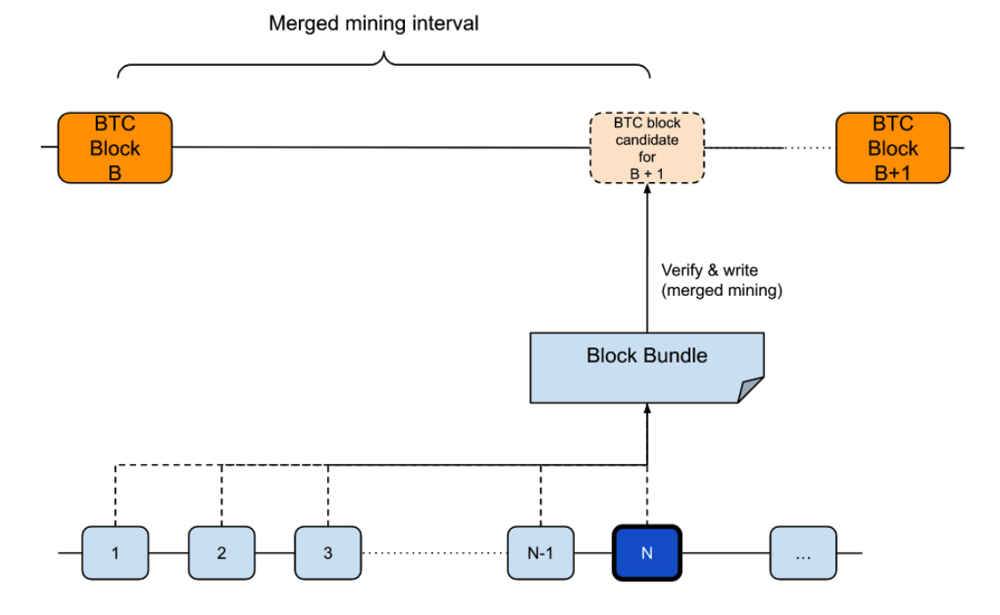
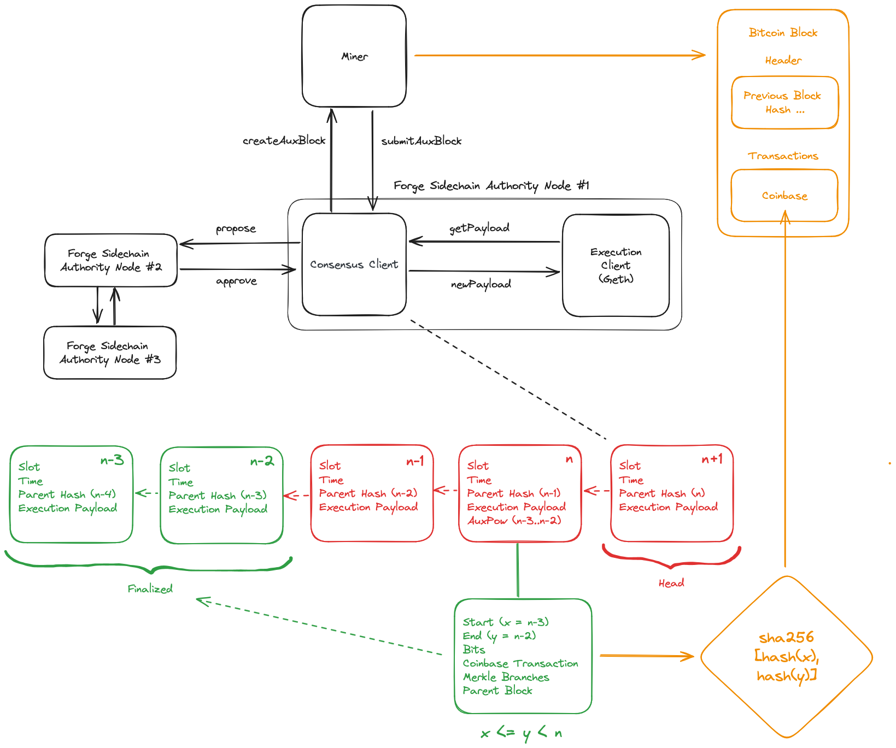

# Optimistic Merged Mining

Alice leverages the OptiMine merged mining protocol.
OptiMine is a protocol that extends merged mining to separate block production from Proof-of-Work finalization, following the hybrid consensus model. In a nutshell, blocks are produced optimistically while PoW eventually finalizes batches of blocks.

Federation consensus nodes create signed blocks optimistically by collecting transactions in the network and assembling blocks. Block finalization is achieved by Bitcoin Miners running the auxiliary (side-) chain full node to verify the correctness of the signed blocks. Miners periodically submit PoW solutions according to the auxiliary chain difficulty. Miners and the federation finalize multiple signed blocks at once by including the signed blocks’ combined hashes into the PoW solutions produced by mining, i.e., so-called “mined blocks”. The mined blocks are verified and signed by the federation to prevent attacks by miners.

If no valid PoW mined blocks are generated for a pre-defined timeout period, the rollup/sidechain considers this a consensus failure and block production is halted - until a mined block is found.

## Preliminaries

**Actors**

- *Federation:* a trusted, permissioned set of block producers that propose signed sidechain blocks.
- *Miners:* Bitcoin miners that participate in merged mining the sidechain. Miners are assumed to run an Alice full node.

**Notation**

- *Signed blocks*: Blocks proposed and signed by the Federation.
- *Mined blocks*: Blocks created by miners (have PoW) that commit to a set of existing signed blocks.
- *Block bundle*: A block bundle refers to a set `N` of signed blocks that are not yet merged mined. For data efficiency, the block bundle is a single hash derived from a vector of `N` signed block hashes that are not yet merged mined. Note that we use a vector instead of a Merkle tree or similar since the Alice sidechain full nodes operated both by the miners and the federation need to validate that all signed block hashes are correctly included in the block bundle.

Figure 1: Optimistic Merged Mining

## Federated Proof-of-Authority Block Production

The Federation produces and validates blocks with a Proof-of-Authority (PoA) consensus protocol. Each federation member runs a separate instance of the Alice sidechain node.

In the alpha version (current release), the Federation employs [Aura](https://openethereum.github.io/Aura), a round-robin block production mechanism:

- Block production is separated into discrete rounds where each round the current federation leader as determined by Aura produces a block. The leader signs the block and sends it to the other federation members for signing.
- Once a block is signed by 50% + 1 of the federation members, it is considered a signed block and can be included in the sidechain.
- Signed blocks are not yet finalized. Finalization is achieved by merged mining.

There are issues with Aura in networks with high latency as well as liveness failures of nodes. For the beta version, we will switch to a suitable BFT consensus protocol.

## Sequenced Merged Mining Block Finalization

Every `N` sidechain blocks, the state of the sidechain will be subject to a merged mining "block bundle", akin to a finality gadget in hybrid consensus protocols.

### Protocol

**Sidechain block production.** The Federation collects transactions and creates sidechain blocks as described above using Aura.

**Prepare merged mining block bundle.** Merged miners query the sidechain for the latest block bundle. The sidechain node will provide a block bundle that includes a reference to all `N` blocks that have not yet been finalized. The block bundle is a hash of the `N` sidechain block hashes.

**Merge mining.**

<!-- TODO: link to the createAuxPlock and submitAuxBlock RPCs. -->

- The miner fetches the block bundle and other merged mining information from the Alice federation sidechain node(s) and verifies the signatures of the block bundle.
- The miner includes the block bundle in the coinbase transaction of the next Bitcoin block template.
- The miner performs AuxPoW over this block template until an AuxPoW solution matches the required sidechain difficulty.
- The miner sends the AuxPoW solution (Bitcoin block) to the Federation sidechain node.

**Sidechain finalizes N signed blocks.**

- The Federation sidechain node verifies the AuxPoW solution. Verification includes verifying the coinbase transaction of the Bitcoin block, the Federation signature, and the sidechain AuxPoW.
- The federation sidechain leader distributes the fees since the last block bundle to the miners and other federation members as part of the EVM block that includes the AuxPoW. Other federation members verify the inclusion of the fee as part of consensus and sign the block.

**Block intervals**

The merged mining interval will be determined by the sidechain AuxPoW difficulty target, i.e., miners continuously mine and submit a mined block whenever a valid AuxPoW solution is found. The initial target merged mining interval shall be 1 minute.

### Sidechain consensus rules

Follow the longest chain of Federation signed blocks. If no merged mined block bundles are created for a predefined number of blocks ("mining timeout period"), e.g., 10,000 blocks, the Federation nodes will stop producing new signed blocks. This is considered a critical failure.

- If merged mining block bundles are submitted again, the chain will resume producing blocks.
- If merged mining block bundles are never submitted or not for a very long time mitigation out of band is required.

We assume that the Federation always has an honest majority and that there will be no conflicting chains created on purpose. Federation members will always build on the sidechain block they have seen first.

## Architecture

The figure below describes in a simplified way how Alice is implemented. For simplicity, we are using three Alice sidechain authority nodes (Federation members) and one miner.

Figure 2: Overview of the Alice Architecture

### Communication between Alice and Bitcoin

In black, we show the interaction between the Alice sidechain nodes (authority nodes) and the miner (mining pool):

- Authority nodes are responsible for block production and verification as part of the PoA consensus protocol.
- The authority nodes run the consensus client and the execution client (geth). Alice implements a custom consensus client integrated with vanilla [go-ethereum](https://github.com/ethereum/go-ethereum) as an execution client that interfaces via the [Engine API](https://hackmd.io/@danielrachi/engine_api). This means Alice adopts the [same architecture as the PoS Ethereum clients](https://ethresear.ch/t/eth1-eth2-client-relationship/7248).
  - The execution client is responsible for transaction gossiping, executing transactions and smart contracts. Alice does not modify geth and therefore, other execution clients such as [reth](https://github.com/paradigmxyz/reth) can also be used.
  - The consensus client is responsible for block gossiping, block production, and finalization. The leader of the current slot proposes a block to the other federation members (to their authority nodes). The other federation members approve the blocks by signing the block.
  - The consensus and execution client communicate via the via the `getPayload` and `newPayload` RPCs.
- The mining pool connects to the Alice sidechain node. This can be an authority node (as in the figure). In practice, we imagine that miners run their own Alice full ndoes.
  - The `createAuxBlock` RPC is used to create a Bitcoin block template that includes the block bundle.
  - The `submitAuxBlock` RPC is used to submit the mined block to the Alice sidechain node.

### Inclusion of Block Bundle in Bitcoin Block

In orange, we show the inclusion of the block bundle in the Bitcoin block:

- The miner receives the block template that includes the latest block bundle from the Alice sidechain node `createAuxBlock` RPC.
- The miner mines Bitcoin blocks and includes the block bundle hash in the output of the coinbase transaction.
- When the miner has found a Bitcoin block that meets the Alice sidechain difficulty, it submits the block to the Alice sidechain node using the `submitAuxBlock` RPC.

### Sidechain Block States

In green and red, we show how each Alice federation node keeps its view of the finalized and non-finalized blocks:

- The green blocks `n-3` and `n-2` are finalized blocks.
- The red blocks `n-1`, `n`, `n+1` are non-finalized blocks.
- The red blocks `n-1` and `n` are signed blocks, i.e., they are signed by the other federation members.
- The red block `n+1` is the head of the sidechain. It is not yet signed by the other federation members and currently being prepared by the leader of the current slot.
- Finalization of blocks consists of the successful submission of the AuxPoW (via the `submitAuxBlock` RPC) and the federation members including and signing the AuxPoW confirmation as part of a Alice sidechain block.
  - On block `n`, the leader producing block `n` added an extra data to the Alice sidechain block:
    - The leader received a Bitcoin block with a coinbase output that included the block bundle `sha256(sha256(x), sha256(y))`.
    - The leader verified that the Bitcoin block meets the Alice sidechain difficulty.
    - The leader then added the data to the Alice sidechain block:
      - `start`: The start height of the block bundle `n-3`.
      - `end`: The end height of the block bundle `n-2`.
      - `bits`: The difficulty of the block bundle `n-3` to `n-2`.
      - `coinbase_txn`: The coinbase transaction of the Bitcoin block and includes the block bundle hash.
      - `merkle branches`: The Merkle proof of the coinbase transaction to the Bitcoin block Merkle root.
      - `parent block`: The parent block header of the Bitcoin block.
  - The leader sent block `n` including the merged mining data to the other federation member authority nodes.
  - The other federation members verified the merged mining data and signed the block.

### Notes on Block Bundle Design (Mined Block)

The merged mining block bundle can be implemented in various ways. The simplest approach is to use the hash of the Nth block, i.e., the tip of the sidechain. To achieve better provenance of the sidechain execution on Bitcoin, the entire list of N sidechain blocks can be submitted to miners. Since including N hashes in a Bitcoin block incurs high storage costs, a more efficient approach is to submit the root of a Merkle tree that stores the hashes of N sidechain blocks as leaves or a hash of a vector of N sidechain block hashes.

## References

- [EVM Overview](https://takenobu-hs.github.io/downloads/ethereum_evm_illustrated.pdf)
- [Ethereum Block Architecture](https://ethereum.stackexchange.com/a/6413/5370)