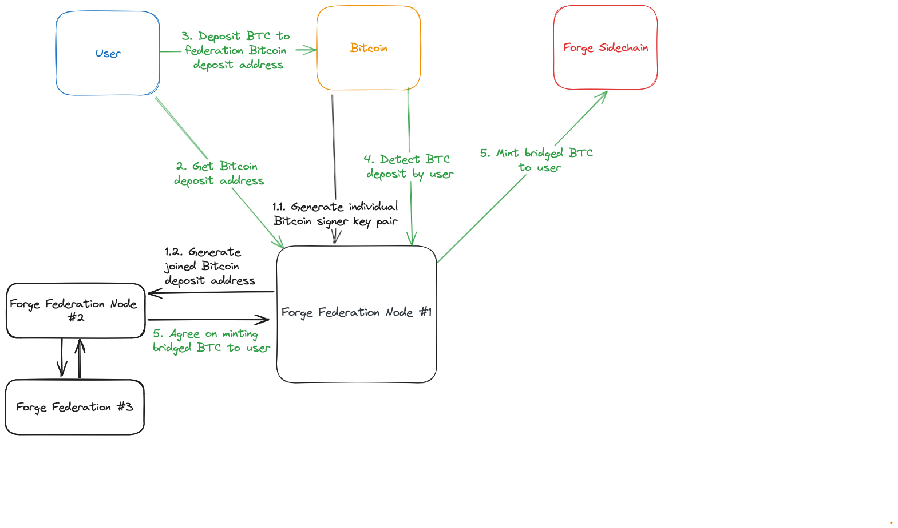
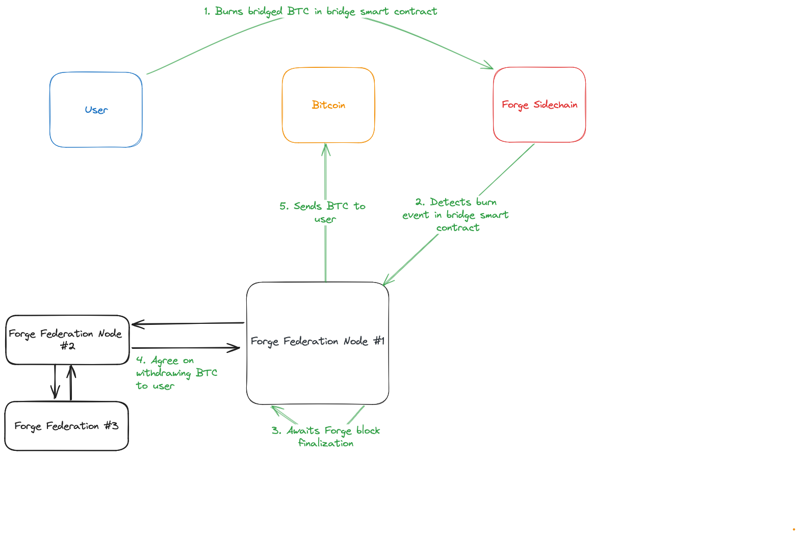

# Two-way Peg

The two-way peg is a mechanism that allows users to move BTC from Bitcoin mainnet to the Alice sidechain and vice versa.

The two-way peg is implemented by a federation of members that are responsible for processing peg-in and peg-out transactions. Peg-in transactions are Bitcoin transactions that are processed by the federation members and result in the minting of bridged BTC in the consensus layer. Peg-out transactions are Ethereum transactions that are processed by the federation members and result in the burning of bridged BTC in the consensus layer.

## Preliminaries

**Actors**

- *Federation*: a trusted, permissioned set of entities that each hold a share of a key to facilitate the two-way peg.

**Notation**

- *Peg-in*: the process of moving BTC from Bitcoin mainnet to the Alice sidechain.
- *Peg-out*: the process of moving BTC from the Alice sidechain to Bitcoin mainnet.
- *Bridge Smart Contract*: A smart contract on Alice that provides a function for users to burn their bridged BTC, generating an event that triggers the processing of a peg-out transaction by the federation members. Burned bridged BTC are sent to the `0x000000000000000000000000000000000000dEaD` address which is commonly used for burning tokens.

## Peg-in

The peg-in process is initiated by a user who wants to move BTC from Bitcoin mainnet to the Alice sidechain.

1. The Federation generates a multisignature script Bitcoin deposit address.
    1. Each federation member generates a signer key pair.
    2. The federation members generate a joined taproot multisignature with the signer public keys.
2. The user gets the deposit address from the Federation.
3. The user sends BTC to the deposit address.
4. The Federation detects the deposit transactions on the deposit address. The federation nodes parse the Alice destination address in the OP return and require at least 6 Bitcoin confirmations before completing the peg-in.
5. The Federation mints bridged BTC in the consensus layer to the user via a simple majority signing by the federation when the deposit transaction has reached 6 Bitcoin confirmations.

## Peg-out

The peg-out process is initiated by a user who wants to move BTC from the Alice sidechain to Bitcoin mainnet.

1. The user burns bridged BTC by sending it to the bridge smart contract and including the Bitcoin address to which the BTC should be sent.
2. The Federation detects the burn transaction on the bridge smart contract.
3. The Federation includes an unsigned Bitcoin transaction into the Alice sidechain block for the federation members to reach consensus on the withdrawal transaction and tracking the UTXO set.
4. The Federation awaits the burn transaction to be finalized (merged mined and signed).
5. The Federation members sign the withdrawal Bitcoin transaction and include it in Bitcoin when a simple majority is reached.

## UTXO Set

For both peg-in and peg-out, the Federation members maintain a view of the UTXO set through the deposits made to the deposit address and adding peg-out transactions into the Alice sidechain blocks.

## Decimal Conversion

The Alice sidechain will use bridged BTC (via the two-way peg) as its base currency. However, the EVM and software interacting with it (e.g., MetaMask, Solidity, ...) assume that the base currency has 18 decimals. Thus, the Alice sidechain will use bridged BTC with 18 decimals. This means that the smallest unit of the bridged BTC is 1 wei (10^-18 BTC). This splits satoshis into smaller units and thus there needs to be an explicit conversion between BTC and bridged BTC.

### Peg-in

On peg-in, the deposited satoshis will directly be converted without any rounding.

- The amount of BTC deposited into the foundation for that deposit is equal to the bridged BTC received by the user.

### Peg-out

On peg-out, when a user withdraws an amount that can be represented in satoshis, the user receives BTC equal to the burned bridged BTC minus BTC transaction fees.

- The BTC withdrawn from the foundation is equal to the bridged BTC burned.

On peg-out, when a user withdraws fractional satoshis:

- The BTC sent by the federation will round down to the nearest full satoshi.
- The full (fractional) amount of bridged BTC will be burned.
- The BTC withdrawn from the foundation is less than the bridged BTC burned.
