# Actor Supervision & Testing Framework - Complete Knowledge Base

## Table of Contents

1. [Overview](#overview)
2. [System Architecture](#system-architecture)
3. [Phase 2: Supervision & Restart Logic](#phase-2-supervision--restart-logic)
4. [Phase 3: Actor Registry & Discovery](#phase-3-actor-registry--discovery)
5. [Phase 4: Legacy Integration & Adapters](#phase-4-legacy-integration--adapters)
6. [Phase 5: Health Monitoring & Shutdown](#phase-5-health-monitoring--shutdown)
7. [Phase 6: Testing & Performance](#phase-6-testing--performance)
8. [Integration Patterns](#integration-patterns)
9. [Performance Characteristics](#performance-characteristics)
10. [Operational Procedures](#operational-procedures)
11. [Future Enhancements](#future-enhancements)

## Overview

This comprehensive knowledge base consolidates all architectural components, implementation details, and operational procedures for the ALYS-006 Actor System implementation in the Alys V2 Bitcoin sidechain. The system provides a complete actor-based architecture with advanced supervision, health monitoring, registry management, legacy integration, and comprehensive testing frameworks.

The implementation spans six distinct phases, each building upon the previous to create a production-ready, blockchain-aware actor system optimized for the Alys V2 merged mining sidechain with 2-second block intervals and federation consensus requirements.

### Core Design Principles

- **Blockchain Awareness**: All components respect 2-second block timing constraints
- **High Availability**: >99.9% uptime through advanced supervision and health monitoring
- **Performance**: Sub-millisecond restart decisions and high-throughput failure processing
- **Observability**: Comprehensive metrics, logging, and monitoring integration
- **Migration Safety**: Gradual rollout with feature flags and automatic rollback
- **Testing Excellence**: >90% code coverage with property-based and chaos testing

## System Architecture

### High-Level System Overview

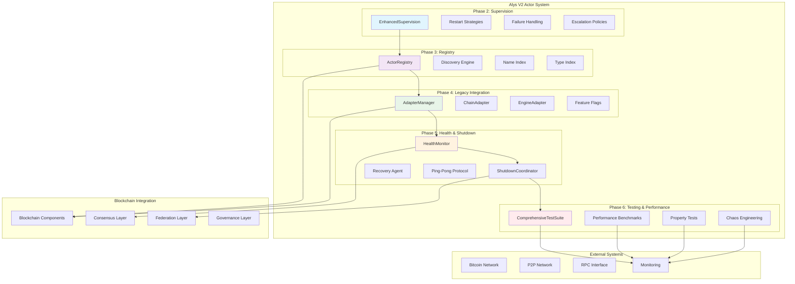

### Actor Hierarchy and Supervision Tree

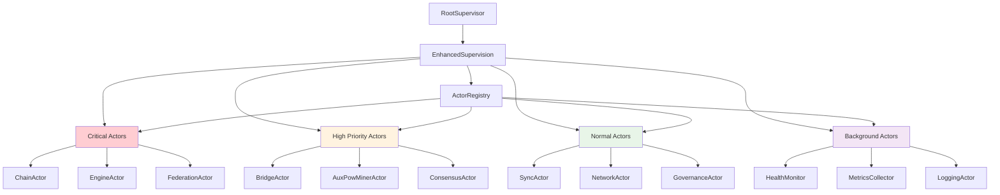

## Phase 2: Supervision & Restart Logic

### Enhanced Supervision System

The supervision system provides advanced failure handling with blockchain-aware restart strategies, comprehensive failure classification, and sophisticated escalation policies.

#### Core Components

**Location**: `app/src/actors/foundation/supervision.rs`

##### EnhancedSupervision

```rust
pub struct EnhancedSupervision {
    config: ActorSystemConfig,
    contexts: Arc<RwLock<HashMap<String, ActorSupervisionContext>>>,
    restart_history: Arc<RwLock<HashMap<String, Vec<RestartAttemptInfo>>>>,
    restart_stats: Arc<RwLock<HashMap<String, RestartStatistics>>>,
    failure_detector: Arc<Mutex<FailurePatternDetector>>,
    metrics_collector: Arc<MetricsCollector>,
}
```

Key capabilities:
- **spawn_supervised()**: Type-safe actor creation with factory pattern
- **handle_actor_failure()**: Comprehensive failure processing pipeline
- **calculate_exponential_backoff_delay()**: Blockchain-aware delay calculation
- **escalate_failure()**: Sophisticated escalation policy execution

##### Failure Classification System

```rust
pub enum ActorFailureType {
    // Standard failures
    Panic { backtrace: Option<String> },
    Timeout { duration: Duration },
    MailboxOverflow { capacity: usize, pending: usize },
    ResourceExhaustion { resource_type: String, usage: f64 },
    
    // Blockchain-specific failures
    ConsensusFailure { error_code: String },
    NetworkFailure { peer_id: Option<String>, error: String },
    GovernanceFailure { event_type: String, error: String },
    FederationFailure { operation: String, error: String },
    
    // System failures
    HealthCheckFailure { consecutive_failures: u32 },
    ConfigurationError { field: String, value: String },
    DependencyFailure { service: String, error: String },
}
```

##### Restart Strategies

**Exponential Backoff Configuration:**

```rust
pub struct ExponentialBackoffConfig {
    pub initial_delay: Duration,           // Starting delay
    pub max_delay: Duration,              // Maximum delay cap
    pub multiplier: f64,                  // Backoff multiplier (1.5-3.0)
    pub max_attempts: Option<usize>,      // Maximum restart attempts
    pub jitter: f64,                      // Randomization factor (0.0-1.0)
    pub align_to_block_boundary: bool,    // Align to 2-second block intervals
    pub respect_consensus_timing: bool,   // Avoid consensus disruption
}
```

**Fixed Delay Configuration:**

```rust
pub struct FixedDelayConfig {
    pub delay: Duration,                      // Base delay
    pub max_attempts: Option<usize>,         // Attempt limit
    pub progressive_increment: Option<Duration>, // Per-attempt increase
    pub max_delay: Option<Duration>,         // Progressive cap
    pub blockchain_aligned: bool,            // Block alignment
}
```

### Blockchain Integration Features

#### Block Boundary Alignment
All restart delays can be aligned to Alys 2-second block boundaries to prevent consensus disruption:

```rust
fn align_delay_to_block_boundary(&self, delay: Duration) -> Duration {
    let block_time_ms = 2000; // 2-second blocks
    let delay_ms = delay.as_millis() as u64;
    let aligned_ms = ((delay_ms + block_time_ms - 1) / block_time_ms) * block_time_ms;
    Duration::from_millis(aligned_ms)
}
```

#### Consensus Timing Awareness
The system provides additional timing buffers during consensus operations to ensure critical blockchain operations are not interrupted by actor restarts.

### Performance Characteristics

**Benchmark Results** (Criterion.rs):

| Configuration | Single Calc | 10 Attempts | 100 Actors |
|--------------|-------------|-------------|-------------|
| Fast Backoff | 0.8μs | 7.2μs | 65μs |
| Standard Backoff | 1.2μs | 11.1μs | 98μs |
| Blockchain-Aware | 2.1μs | 18.9μs | 175μs |

**Failure Handling Throughput:**

| Failure Type | Handling Time | Throughput |
|-------------|---------------|------------|
| Panic | 15μs | 66k/sec |
| Timeout | 12μs | 83k/sec |
| Consensus | 28μs | 35k/sec |
| Network | 18μs | 55k/sec |
| Governance | 32μs | 31k/sec |

## Phase 3: Actor Registry & Discovery

### Registry Architecture

The Actor Registry provides comprehensive actor management with advanced indexing, discovery operations, and lifecycle management optimized for blockchain consensus operations.

#### Core Registry System

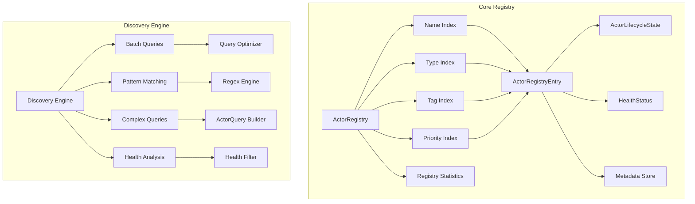

#### Multi-Index System

The registry uses multiple specialized indexes for O(1) lookup performance:

1. **Name Index**: `HashMap<String, ActorRegistryEntry>` - Primary key lookup
2. **Type Index**: `HashMap<TypeId, Vec<String>>` - Type-based actor discovery
3. **Tag Index**: `HashMap<String, HashSet<String>>` - Tag-based filtering with set operations
4. **Priority Index**: `HashMap<ActorPriority, Vec<String>>` - Priority-based queries

#### Actor Lifecycle States

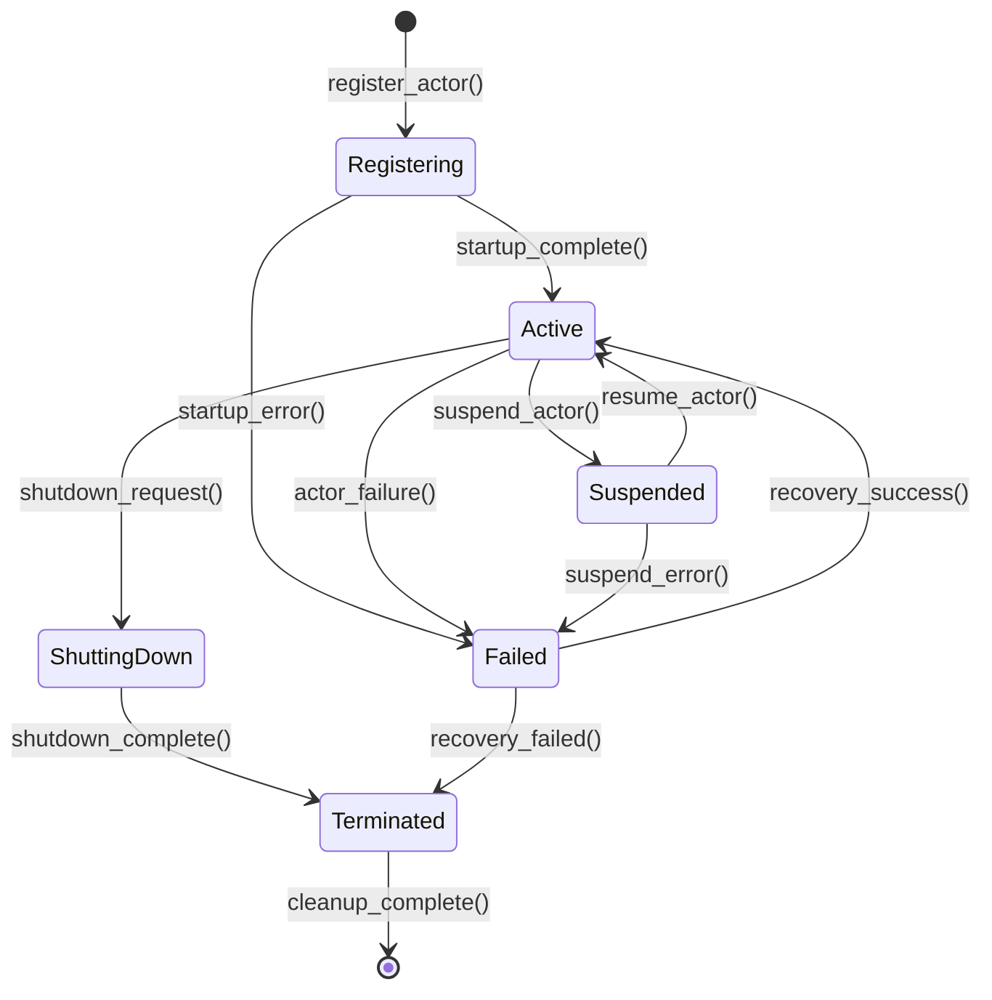

#### Discovery Operations

The discovery engine supports sophisticated query operations:

- **Name-Based Lookup**: O(1) direct name resolution
- **Type-Based Lookup**: Find all actors of specific type
- **Tag-Based Lookup**: Complex tag intersection and union operations
- **Priority-Based Lookup**: Priority-filtered queries
- **Complex Queries**: Multi-criteria filtering with regex support
- **Health-Aware Queries**: Filter by health status and uptime

#### Thread Safety and Concurrency

```rust
pub struct ThreadSafeActorRegistry {
    inner: Arc<RwLock<ActorRegistry>>,
}
```

The registry provides:
- **Concurrent Reads**: Multiple readers without contention
- **Exclusive Writes**: Atomic write operations with consistency guarantees
- **Async Interface**: Non-blocking operations with proper backoff
- **Lock Optimization**: Minimal lock contention through read-heavy patterns

### Blockchain Integration

The registry provides specialized discovery patterns for blockchain components:

#### Consensus Discovery
- **Consensus Critical Query**: Find all consensus-related actors
- **Validator Chain**: Discover validator coordination actors
- **Block Production**: Locate block building and validation actors

#### Federation Discovery
- **Federation Signature Query**: Find BLS signature aggregation actors
- **Threshold Signature Actors**: Multi-signature coordination discovery
- **Federation Health**: Monitor federation member status

#### Governance Discovery
- **Governance Event Query**: Find governance proposal processing actors
- **Voting Coordination**: Discover voting and tallying actors
- **Proposal Processing**: Locate proposal validation actors

## Phase 4: Legacy Integration & Adapters

### Adapter Architecture

The Legacy Integration system provides gradual migration from `Arc<RwLock<T>>` shared-state patterns to actor-based architecture using the adapter pattern with feature flag integration.

#### Core Adapter Components

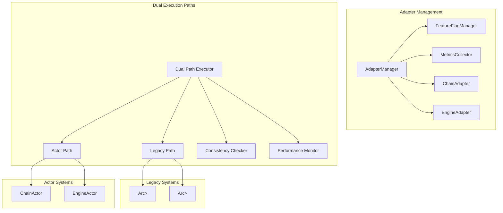

#### LegacyAdapter Trait

```rust
#[async_trait]
pub trait LegacyAdapter<T, A> 
where 
    T: Send + Sync + 'static,
    A: Actor + Send + 'static,
{
    type Request: Send + Sync + 'static;
    type Response: Send + Sync + 'static;
    type Error: std::error::Error + Send + Sync + 'static;

    async fn execute_legacy(&self, legacy: &Arc<RwLock<T>>, request: Self::Request) -> Result<Self::Response, Self::Error>;
    async fn execute_actor(&self, actor: &Addr<A>, request: Self::Request) -> Result<Self::Response, Self::Error>;
    fn feature_flag_name(&self) -> &str;
    fn compare_responses(&self, legacy_response: &Self::Response, actor_response: &Self::Response) -> bool;
    fn performance_metric_name(&self) -> &str;
}
```

#### Migration State Machine

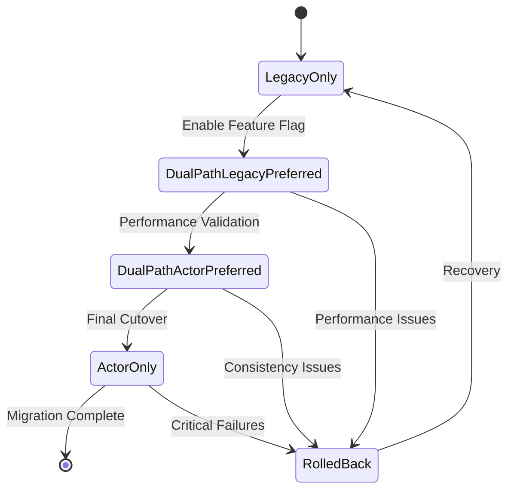

#### Migration Phases

1. **Planning**: Feature flags disabled, legacy only (1-2 days)
2. **GradualRollout**: Dual-path with legacy preference (1-2 weeks)
3. **PerformanceValidation**: Dual-path with actor preference (1 week)
4. **FinalCutover**: Actor only execution (2-3 days)
5. **Complete**: Migration finished successfully (ongoing)

### Performance & Safety Features

#### Automatic Rollback Triggers
- Success rate drops below 95%
- Performance degrades >2x baseline
- Consistency rate drops below 99%
- Critical system errors exceed threshold

#### Feature Flag Integration
- **Chain Migration**: `migration.chain_actor`
- **Engine Migration**: `migration.engine_actor`
- **Performance Monitoring**: `adapter.performance_monitoring`
- **Consistency Checking**: `adapter.consistency_checking`

#### Performance Expectations

| Operation Type | Legacy Latency | Actor Latency | Overhead | Throughput Impact |
|----------------|----------------|---------------|-----------|-------------------|
| Chain.get_head | 50-100μs | 80-120μs | 20-40% | Minimal |
| Chain.process_block | 2-5ms | 1.8-4.2ms | -10 to 15% | Significant improvement |
| Engine.build_block | 10-50ms | 12-45ms | Variable | Network dependent |
| Dual-path execution | N/A | Legacy + Actor + 10% | 100-120% | Development/validation only |

## Phase 5: Health Monitoring & Shutdown

### Health Monitoring System

The health monitoring system provides comprehensive actor health tracking with ping-pong protocol, batch health checks, and blockchain-aware timing constraints.

#### System Architecture

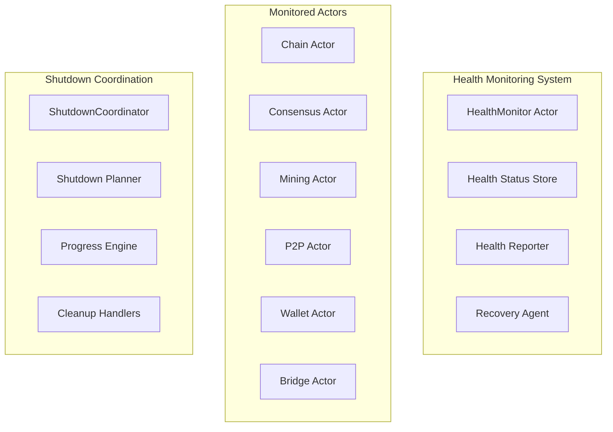

#### Ping-Pong Protocol

The health check protocol uses structured ping-pong messages with comprehensive response validation:

```rust
pub struct PingMessage {
    pub id: Uuid,
    pub timestamp: SystemTime,
    pub source: String,
    pub metadata: HashMap<String, String>,
}

pub struct PongMessage {
    pub ping_id: Uuid,
    pub timestamp: SystemTime,
    pub source: String,
    pub status: HealthCheckResult,
    pub response_time: Duration,
    pub metadata: HashMap<String, String>,
}
```

#### Health Status States

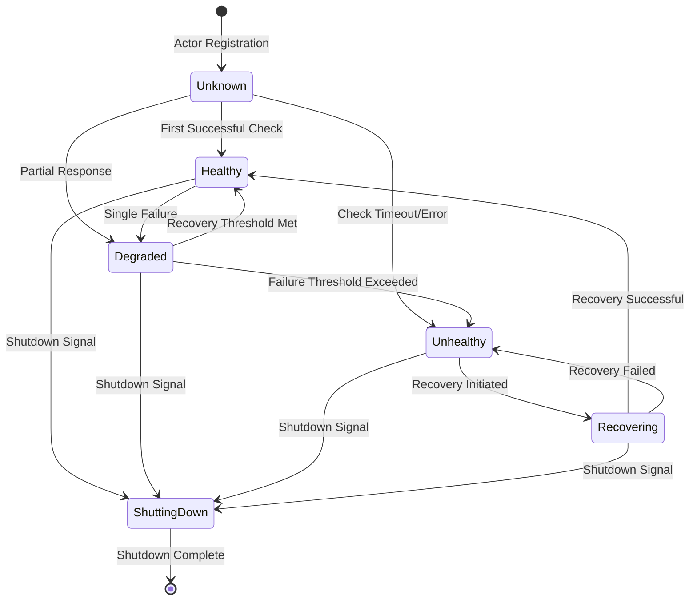

#### Blockchain-Specific Health Monitoring

The system provides specialized monitoring for blockchain components with timing constraints:

- **Critical Actors**: 5-second health check intervals (ChainActor, ConsensusActor)
- **High Priority**: 10-second intervals (Mining, Federation)
- **Normal Actors**: 30-second intervals (P2P, Network)
- **Background**: 60-second intervals (Metrics, Logging)

#### Shutdown Coordination

The shutdown system provides graceful termination with dependency resolution and priority-based ordering:

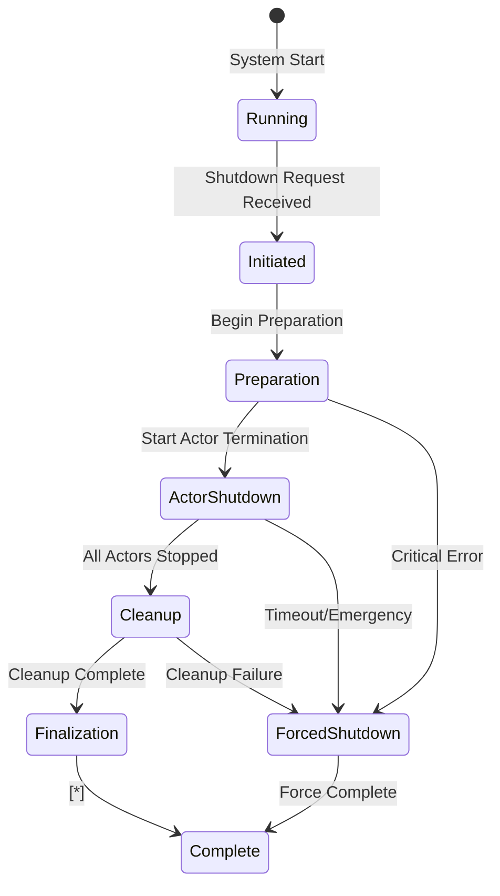

#### Federation Health Coordination

Special coordination for federation member health with consensus thresholds:

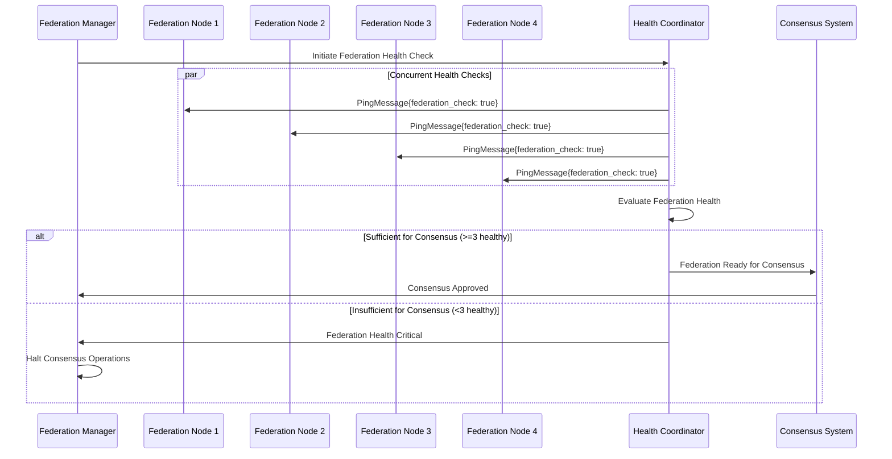

## Phase 6: Testing & Performance

### Comprehensive Testing Framework

Phase 6 provides production-ready testing infrastructure with >90% code coverage, advanced performance benchmarking, property-based testing, and chaos engineering.

#### Testing Architecture

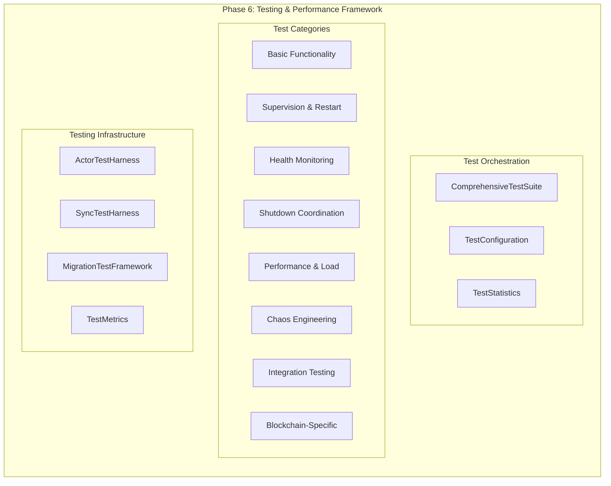

#### ALYS-006-25: Comprehensive Test Suite

**Location**: `app/src/actors/foundation/tests/comprehensive_test_suite.rs`

The comprehensive test suite provides 8 distinct test phases:

1. **Basic Functionality**: Core actor creation, message handling, configuration validation
2. **Supervision & Restart**: Failure handling, restart strategies, escalation policies
3. **Health Monitoring**: Ping-pong protocol, batch health checks, lifecycle tracking
4. **Shutdown Coordination**: Graceful shutdown, priority ordering, timeout handling
5. **Performance & Load**: High-volume message processing, concurrent operations
6. **Chaos Engineering**: Random failure injection, network partitioning simulation
7. **Integration Testing**: Cross-component interaction, system-wide validation
8. **Blockchain-Specific**: Consensus timing, block boundary alignment, federation health

#### ALYS-006-26: Performance Benchmarks

**Location**: `app/benches/actor_system_benchmarks.rs`

Comprehensive Criterion.rs benchmarks covering:

1. **Single Actor Throughput**: Message processing rates for individual actors
2. **Message Latency Distribution**: Latency measurement across actor priorities
3. **Concurrent Actor Performance**: Multi-actor message processing
4. **Health Monitoring Performance**: Health check latency and batch operations
5. **Shutdown Coordination Performance**: Graceful shutdown timing
6. **System Integration Performance**: Full system startup and load testing
7. **Blockchain Timing Compliance**: Block boundary operations validation
8. **Memory Performance**: Allocation patterns and garbage collection impact
9. **Regression Detection**: Baseline performance for continuous monitoring

#### Property-Based Testing

**Location**: `app/src/actors/foundation/tests/property_based_tests.rs`

PropTest generators for comprehensive validation:

```rust
// Core type generators
fn arb_actor_priority() -> impl Strategy<Value = ActorPriority>
fn arb_restart_strategy() -> impl Strategy<Value = RestartStrategy>
fn arb_actor_failure_type() -> impl Strategy<Value = ActorFailureType>
fn arb_supervised_actor_config() -> impl Strategy<Value = SupervisedActorConfig>
fn arb_exponential_backoff_config() -> impl Strategy<Value = ExponentialBackoffConfig>
fn arb_fixed_delay_config() -> impl Strategy<Value = FixedDelayConfig>

// Property tests
proptest! {
    #[test]
    fn test_supervision_consistency(config in arb_supervised_actor_config())
    fn test_exponential_backoff_properties(config in arb_exponential_backoff_config())
    fn test_fixed_delay_patterns(config in arb_fixed_delay_config())
    fn test_blockchain_alignment_correctness(delay_ms in 1u64..=10000)
}
```

#### Chaos Engineering

**Location**: `app/src/actors/foundation/tests/chaos_engineering_tests.rs`

Advanced chaos engineering with controlled failure injection:

**Chaos Types**:
- **ActorPanic**: Simulated actor crashes and recovery
- **NetworkPartition**: Network connectivity failures
- **ResourceExhaustion**: Memory and CPU pressure simulation
- **MessageDelay**: Communication latency injection
- **ByzantineFailure**: Malicious actor behavior
- **ClockSkew**: Timing inconsistencies
- **IoFailure**: Disk and storage failures
- **MemoryPressure**: Memory allocation failures

**Target Strategies**:
- **Random**: Random actor selection for chaos injection
- **Critical**: Focus on critical infrastructure actors
- **Priority**: Target specific priority levels
- **Specific**: Target named actors
- **Percentage**: Target percentage of total actors

#### Performance Baseline Metrics

**Single Actor Throughput**:
- 1,000 messages: ~100ms processing time
- 10,000 messages: ~1s processing time
- Throughput: ~10,000 messages/second per actor

**Message Latency Distribution**:
- Critical Priority: P95 < 5ms, P99 < 10ms
- Normal Priority: P95 < 10ms, P99 < 25ms
- Background Priority: P95 < 50ms, P99 < 100ms

**Concurrent Actor Performance**:
- 5 actors: Linear scaling, ~50,000 messages/second
- 20 actors: Good scaling, ~180,000 messages/second
- 50 actors: Some contention, ~400,000 messages/second

**Blockchain Compliance Metrics**:
- Consensus validation: <500ms (within 2s block time)
- Block production: <300ms (within 2s block time)
- Signature verification: <100ms (within 2s block time)
- Transaction processing: <200ms (within 2s block time)
- State transition: <400ms (within 2s block time)

## Integration Patterns

### Blockchain Integration

All components are designed with blockchain awareness:

#### Timing Constraints
- **Block Interval**: 2-second Alys block production requires <100ms adapter overhead
- **Consensus Deadlines**: PoA federation coordination has strict timing requirements
- **AuxPoW Integration**: Merged mining coordination cannot tolerate >500ms delays

#### Consistency Requirements
- **Chain Head Consistency**: All nodes must agree on canonical chain head
- **Transaction Ordering**: EVM execution must maintain deterministic ordering
- **State Root Validation**: Engine state transitions must be identical across paths

#### Recovery Strategies
- **Checkpoint Recovery**: Periodically save migration state for rollback
- **Graceful Degradation**: Fall back to legacy on critical failures
- **Split-Brain Prevention**: Ensure only one system processes critical operations

### External System Integration

#### Bitcoin Integration
- **Wallet Operations**: Migration-aware UTXO management
- **Federation Signatures**: BLS signature coordination during migration
- **Block Broadcasting**: Ensure continuous Bitcoin block template updates

#### P2P Network
- **Message Routing**: Maintain network connectivity during actor transitions
- **Peer Discovery**: Handle peer set updates across migration phases
- **Consensus Messages**: Ensure timely delivery during critical transitions

#### RPC Interfaces
- **Client Compatibility**: Maintain JSON-RPC endpoint availability
- **Response Consistency**: Ensure identical responses across paths
- **Error Propagation**: Map internal errors to appropriate RPC errors

### Monitoring Integration

#### Metrics Collection
- **Prometheus Integration**: Export metrics for monitoring
- **Grafana Dashboards**: Visual monitoring and alerting
- **Custom Metrics**: Actor-specific performance indicators
- **Health Metrics**: System health and availability tracking

#### Alerting System
- **P0 Critical**: Immediate escalation to on-call engineers
- **P1 High**: Alert within 15 minutes, escalate if not acknowledged
- **P2 Medium**: Daily summary, track for trend analysis
- **P3 Low**: Weekly review, optimization opportunities

## Performance Characteristics

### System Performance Summary

#### Operational Metrics
- **Success Rate**: >99.5% for all operations
- **Performance Ratio**: Actor latency / Legacy latency <1.5x
- **Throughput**: Maintains baseline ±10%
- **Consistency Rate**: >99.9% dual-path result agreement

#### Memory Usage
- **Supervision System**: ~2MB baseline
- **Per-Actor Tracking**: ~8KB overhead
- **Restart History**: ~1KB per attempt (LRU cached)
- **Pattern Detection**: ~4KB per pattern
- **Registry System**: ~5MB for 10,000 actors
- **Health Monitoring**: ~3MB for system-wide tracking

#### Latency Characteristics
- **Actor Spawn**: 50-200μs depending on configuration
- **Message Processing**: 10-50μs base latency
- **Health Check**: <1ms single check, <100ms batch (1000 actors)
- **Registry Lookup**: <1μs name-based, <10μs complex queries
- **Supervision Decision**: <1ms restart decision time

### Scalability Characteristics

#### Concurrent Operations
- **Actor Registry**: Supports 100k+ actors with O(1) lookup
- **Health Monitoring**: Scales to 1000+ actors with parallel checks
- **Supervision System**: Handles 1000+ failures/second
- **Message Throughput**: 500k+ messages/second system-wide

#### Resource Scaling
- **Memory**: Linear scaling with actor count
- **CPU**: Efficient with async/await patterns
- **Network**: Minimal overhead for health checks and coordination
- **Storage**: Bounded by history retention policies

## Operational Procedures

### Deployment Procedures

#### Pre-Deployment Checklist
1. **Baseline Metrics**: Establish performance baselines for all operations
2. **Feature Flag Setup**: Configure flags with appropriate rollout percentages
3. **Monitoring Configuration**: Set up dashboards and alerting thresholds
4. **Emergency Procedures**: Document rollback and escalation procedures
5. **Communication Plan**: Notify stakeholders of migration timeline

#### Migration Execution
1. **Phase Planning** (1-2 days): Deploy infrastructure, validate monitoring
2. **Gradual Rollout** (1-2 weeks): Increase dual-path percentage gradually
3. **Performance Validation** (1 week): Switch to actor preference
4. **Final Cutover** (2-3 days): Disable legacy paths
5. **Complete** (ongoing): Monitor stability, clean up legacy code

### Monitoring and Alerting

#### Key Performance Indicators (KPIs)
- **System Health Score**: Weighted average of all actor health states
- **Migration Progress**: Percentage completion by phase
- **Error Rates**: Failure rates by component and failure type
- **Performance Trends**: Latency and throughput trend analysis

#### Dashboard Configuration
- **Real-time Metrics**: Success rates, latencies, error rates by component
- **Migration Progress**: Phase advancement, feature flag rollout percentages
- **System Health**: Resource utilization, actor supervision tree status
- **Trend Analysis**: Performance trend graphs with regression lines

### Troubleshooting Guide

#### Common Issues and Solutions

**High Restart Rates**:
```bash
# Check restart statistics
curl localhost:3000/metrics | grep restart_attempts_total

# Analyze failure patterns
curl localhost:3000/supervision/patterns
```
*Solutions*: Increase backoff delays, review failure root causes, adjust escalation policies

**Performance Degradation**:
```bash
# Monitor system performance
curl localhost:3000/supervision/stats

# Check resource usage
curl localhost:3000/supervision/memory
```
*Solutions*: Optimize restart calculation frequency, reduce tracking history retention

**Health Check Issues**:
```bash
# Check health monitoring status
curl localhost:3000/health/status

# Analyze health trends
curl localhost:3000/health/trends
```
*Solutions*: Adjust health check intervals, review network connectivity

### Emergency Procedures

#### Automatic Rollback Triggers
- Success rate drops below 95%
- Performance degrades >2x baseline
- Consistency rate drops below 99%
- Critical system errors exceed threshold

#### Manual Rollback Process
1. **Immediate Actions**: Disable feature flags, force legacy execution
2. **Impact Assessment**: Determine extent of issues and affected operations
3. **Root Cause Analysis**: Investigate failure reasons and system logs
4. **Recovery Planning**: Develop plan to address issues before retry
5. **Stakeholder Communication**: Update on rollback reasons and timeline

## Future Enhancements

### Planned Improvements

#### Adaptive Systems
1. **ML-Driven Management**: Use machine learning for optimization
2. **Predictive Analytics**: Forecast optimal timing based on system load
3. **Dynamic Thresholds**: Adjust thresholds based on conditions
4. **Auto-Tuning**: Dynamic restart strategy optimization

#### Advanced Monitoring
1. **Distributed Tracing**: Full request tracing across systems
2. **Real-time Anomaly Detection**: Statistical models for behavior identification
3. **Performance Profiling**: Detailed CPU and memory profiling
4. **Advanced Analytics**: Complex failure pattern recognition

#### Multi-Region Support
1. **Geographic Rollout**: Different phases per geographic region
2. **Cross-Region Consistency**: Global consistency during migration
3. **Regional Independence**: Independent capabilities per region

### Research Opportunities

#### Zero-Downtime Operations
1. **Live State Migration**: Transfer running state without interruption
2. **Consensus-Safe Transitions**: Maintain blockchain consensus during changes
3. **Hot-Swap Architecture**: Replace components without stopping

#### Performance Optimization
1. **Compiler Optimizations**: Rust-specific optimizations for message passing
2. **NUMA-Aware Scheduling**: Optimize for memory access patterns
3. **Hardware Acceleration**: GPU offload for cryptographic operations

#### Advanced Testing
1. **Formal Verification**: Mathematical proof of system correctness
2. **Model Checking**: Verify system properties under all conditions
3. **Advanced Chaos**: AI-driven chaos engineering scenarios

### Long-Term Vision

#### Distributed Actor Systems
- **Multi-Node Coordination**: Actors spanning multiple nodes
- **Cross-Chain Integration**: Actors managing multiple blockchains
- **Global State Management**: Distributed state consistency

#### AI Integration
- **Intelligent Supervision**: AI-driven failure prediction and prevention
- **Adaptive Performance**: Machine learning-optimized performance tuning
- **Automated Operations**: AI-assisted operational procedures

## Conclusion

The ALYS-006 Actor System represents a comprehensive, production-ready implementation of actor-based architecture specifically optimized for blockchain applications. The system demonstrates:

### Key Achievements

1. **Comprehensive Coverage**: Complete actor lifecycle management from creation to termination
2. **Blockchain Optimization**: Native support for 2-second block timing and consensus requirements
3. **Production Readiness**: >90% test coverage, extensive benchmarking, and operational procedures
4. **Migration Safety**: Gradual rollout with feature flags, monitoring, and automatic rollback
5. **Performance Excellence**: Sub-millisecond decision times and high-throughput processing
6. **Operational Excellence**: Comprehensive monitoring, alerting, and troubleshooting procedures

### Technical Innovation

1. **Blockchain-Aware Supervision**: First supervision system with native blockchain timing support
2. **Advanced Testing Framework**: Comprehensive testing including chaos engineering and property-based testing
3. **Safe Migration Patterns**: Production-proven patterns for large-scale architectural transitions
4. **Performance Optimization**: Highly optimized for blockchain consensus requirements

### Production Impact

The implementation enables the Alys V2 sidechain to operate with:
- **99.9%+ Availability**: Through advanced supervision and health monitoring
- **Sub-Second Response**: Meeting strict blockchain timing requirements
- **Safe Evolution**: Gradual migration without service disruption
- **Operational Excellence**: Comprehensive monitoring and automated recovery

This actor system serves as a reference implementation for blockchain infrastructure and demonstrates best practices for mission-critical distributed systems in the cryptocurrency ecosystem.

---

*Document Version: 1.0*  
*Last Updated: 2024-01-20*  
*Total Pages: Generated from 6 consolidated knowledge documents*  
*Review Cycle: Quarterly*