# Alys V2 Actor Implementation Roadmap

## Overview

This document provides the recommended implementation order for the remaining Alys V2 actors, based on the completed ChainActor implementation and observed dependencies in the codebase. The ChainActor serves as the foundation and is **95% complete**, providing integration patterns for all other actors.

---

## 🎯 **Recommended Actor Implementation Order**

### **Phase 1: Core Infrastructure Actors (High Priority)**

#### 1. **Storage Actor** 📦 
**Priority: HIGHEST**
- **Why First**: ChainActor needs block persistence immediately
- **Dependencies**: None (uses RocksDB/database directly)
- **ChainActor Integration**: Already has `extend_canonical_chain()` and storage hooks ready
- **Key Messages**: `PersistBlockRequest`, `RetrieveBlockRequest`, `PruneOldBlocksRequest`
- **Estimated Effort**: 2-3 weeks
- **Validation**: ChainActor block production can persist immediately

#### 2. **Engine Actor** ⚙️
**Priority: HIGHEST** 
- **Why Second**: Block production requires execution payloads
- **Dependencies**: Geth/Reth execution clients
- **ChainActor Integration**: Already has `build_execution_payload()` with Engine Actor hooks
- **Key Messages**: `BuildExecutionPayloadRequest`, `ValidatePayloadRequest`, `ForkchoiceUpdateRequest`
- **Estimated Effort**: 3-4 weeks
- **Validation**: ChainActor can build real execution payloads

### **Phase 2: Network & Communication Actors (Medium Priority)**

#### 3. **Network Actor** 🌐
**Priority: HIGH**
- **Why Third**: Block broadcasting enables multi-node consensus
- **Dependencies**: libp2p networking stack
- **ChainActor Integration**: Already has `broadcast_block_to_network()` ready
- **Key Messages**: `BroadcastBlockRequest`, `SubscribeToBlocksRequest`, `PeerHealthRequest`
- **Estimated Effort**: 4-5 weeks
- **Validation**: ChainActor blocks propagate across federation

#### 4. **Supervisor Actor** 👁️
**Priority: HIGH**
- **Why Fourth**: Health monitoring becomes critical with multiple actors
- **Dependencies**: None (monitors other actors)
- **ChainActor Integration**: Already has health check handler and registration
- **Key Messages**: `RegisterActorRequest`, `HealthCheckRequest`, `RestartActorRequest`
- **Estimated Effort**: 2-3 weeks
- **Validation**: All actors are monitored and auto-restart on failure

### **Phase 3: Specialized Business Logic Actors (Lower Priority)**

#### 5. **Bridge Actor** 🌉
**Priority: MEDIUM**
- **Why Fifth**: Peg operations are important but not critical for basic consensus
- **Dependencies**: Bitcoin Core RPC, federation key management
- **ChainActor Integration**: Already has `process_block_peg_operations()` ready
- **Key Messages**: `ProcessPeginsRequest`, `FinalizePegoutsRequest`, `MonitorBitcoinRequest`
- **Estimated Effort**: 5-6 weeks
- **Validation**: Bitcoin ↔ Alys transfers work end-to-end

### **Phase 4: Advanced & Optional Actors (Future)**

#### 6. **Metrics Actor** 📊
**Priority: LOW**
- **Why Later**: Metrics collection can be handled by existing Prometheus integration
- **Dependencies**: Prometheus, monitoring infrastructure
- **ChainActor Integration**: ChainActor already has comprehensive metrics
- **Key Messages**: `CollectMetricsRequest`, `ExportMetricsRequest`, `AlertRequest`
- **Estimated Effort**: 1-2 weeks
- **Validation**: Centralized metrics collection and alerting

#### 7. **Federation Actor** 🤝
**Priority: LOW** 
- **Why Last**: Federation logic can initially remain in ChainActor
- **Dependencies**: BLS signature libraries, key management
- **ChainActor Integration**: Extract federation logic from ChainActor state
- **Key Messages**: `CollectSignatureRequest`, `ValidateMemberRequest`, `UpdateThresholdRequest`
- **Estimated Effort**: 3-4 weeks
- **Validation**: Distributed federation member management

---

## 🏗️ **Implementation Strategy by Phase**

### **Phase 1: Foundation (Weeks 1-7)**

```mermaid
graph LR
    CA[ChainActor ✅] --> SA[Storage Actor]
    SA --> EA[Engine Actor]
    EA --> Validate1[Phase 1 Validation]
```

**Goal**: ChainActor can produce, persist, and execute real blocks

### **Phase 2: Network (Weeks 8-15)**

**Goal**: Multi-node federation with health monitoring

### **Phase 3: Business Logic (Weeks 16-25)**

**Goal**: Complete two-way peg functionality

### **Phase 4: Enhancement (Weeks 26+)**

**Goal**: Production-ready with advanced features

---

## 💡 **Key Decision Factors**

### **Why Storage First?**
1. **ChainActor Readiness**: All integration hooks already implemented
2. **Zero Dependencies**: Only needs database connection
3. **Immediate Value**: Enables block persistence and chain history
4. **Testing Foundation**: Enables comprehensive integration testing

### **Why Engine Second?**
1. **Block Production**: Critical for real block creation
2. **EVM Integration**: Enables smart contract execution  
3. **ChainActor Dependency**: `build_execution_payload()` needs real Engine
4. **Execution Layer**: Connects to Geth/Reth for EVM compatibility

### **Why Network Third?**
1. **Multi-Node**: Enables federation consensus across nodes
2. **Complex Dependencies**: Requires libp2p and P2P protocols
3. **Performance Critical**: Must handle high-throughput block propagation
4. **Federation Coordination**: Required for signature collection

### **Why Supervisor Fourth?**
1. **Stability**: Becomes critical once multiple actors are running
2. **Clean Architecture**: Separate monitoring from business logic
3. **Production Readiness**: Essential for production deployment
4. **Health Management**: Prevents cascading failures

### **Why Bridge Later?**
1. **Business Logic**: Important but not critical for core consensus
2. **Complex Integration**: Requires Bitcoin Core and key management
3. **ChainActor Works**: Basic consensus works without peg operations
4. **Extended Timeline**: Complex Bitcoin integration patterns

---

## 🎯 **Success Metrics by Phase**

### **Phase 1 Success Criteria:**
- ✅ ChainActor produces blocks with real execution payloads
- ✅ Blocks persist to disk and survive restarts
- ✅ Chain state rebuilds from storage on startup
- ✅ Integration tests pass for Storage + Engine actors

### **Phase 2 Success Criteria:**
- ✅ 3-node federation runs with block propagation
- ✅ Supervisor monitors all actors and restarts failures
- ✅ Network partitions handled gracefully
- ✅ End-to-end consensus works across nodes

### **Phase 3 Success Criteria:**
- ✅ Bitcoin deposits mint Alys tokens
- ✅ Alys burn transactions trigger Bitcoin withdrawals
- ✅ 6-confirmation deposit security works
- ✅ Federation key management is secure

### **Phase 4 Success Criteria:**
- ✅ Centralized metrics collection and alerting
- ✅ Federation member addition/removal works
- ✅ Production monitoring and operations ready
- ✅ Complete Alys V2 actor system operational

---

## 🔧 **Implementation Guidelines**

### **For Each Actor Implementation:**

1. **Start with ChainActor Integration Points**
   - ChainActor already has integration hooks for all actors
   - Use existing TODO comments as implementation guides
   - Follow the established message passing patterns

2. **Follow the ChainActor Architecture Pattern**
   - Use the same module organization (`actor.rs`, `messages.rs`, `handlers/`, `state.rs`, `metrics.rs`)
   - Implement comprehensive health monitoring
   - Include full metrics integration from the start
   - Create complete test suites (unit, integration, performance)

3. **Message Protocol Design**
   - Design clear, typed messages for all actor communication
   - Use Request-Response pattern for synchronous operations
   - Use Fire-and-Forget for asynchronous notifications
   - Include timeout and retry mechanisms

4. **Integration Testing Priority**
   - Test actor communication patterns immediately
   - Validate message serialization/deserialization
   - Test failure scenarios and recovery
   - Performance test under load

### **Development Environment Setup:**

```bash
# 1. Ensure ChainActor is working
cargo test --lib chain --verbose

# 2. Start with Storage Actor implementation
mkdir -p app/src/actors/storage
cd app/src/actors/storage

# 3. Create basic structure following ChainActor pattern
touch mod.rs actor.rs messages.rs state.rs handlers/mod.rs metrics.rs

# 4. Implement integration with ChainActor first
# Update ChainActor's extend_canonical_chain() to call Storage Actor

# 5. Test integration immediately
cargo test --test storage_integration_tests
```

---

## ⚡ **Quick Start Recommendation**

**Start with Storage Actor immediately** because:
1. **ChainActor Integration Complete**: All hooks already implemented in `extend_canonical_chain()`
2. **Zero Complex Dependencies**: Only needs RocksDB database connection
3. **Immediate Validation**: Proves actor communication patterns work
4. **Foundation for Testing**: Enables comprehensive integration testing of actor system
5. **High Impact, Low Risk**: Maximum value with minimal complexity

### **Storage Actor First Steps:**

1. **Examine ChainActor Integration Points**:
   ```rust
   // In ChainActor's extend_canonical_chain method:
   // TODO: Implement Storage Actor integration for block persistence
   // let storage_request = PersistBlockRequest {
   //     block: block.clone(),
   //     is_finalized: false,
   //     storage_priority: StoragePriority::High,
   // };
   // self.storage_actor.send(storage_request).await??;
   ```

2. **Create Storage Actor Structure**:
   - Implement `PersistBlockRequest` message handling
   - Add RocksDB backend for block storage
   - Include block indexing and retrieval capabilities
   - Add comprehensive metrics for storage operations

3. **Validate Integration**:
   - Update ChainActor to use real Storage Actor
   - Test block persistence and retrieval
   - Verify chain state rebuilding from storage
   - Run integration tests with both actors

The Storage Actor will validate that the actor integration patterns implemented in ChainActor work correctly and provide the foundation for implementing all subsequent actors! 🚀