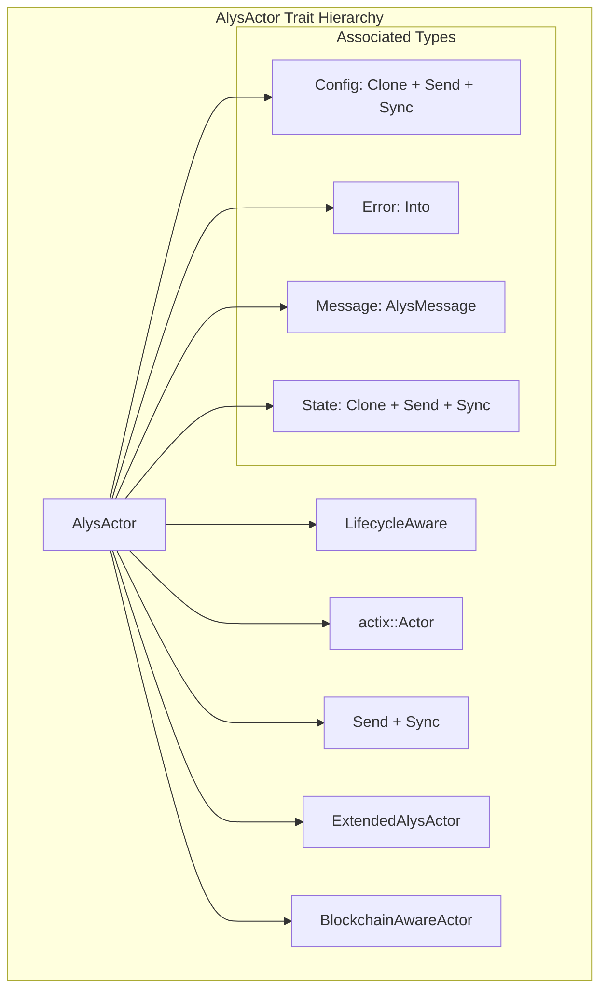
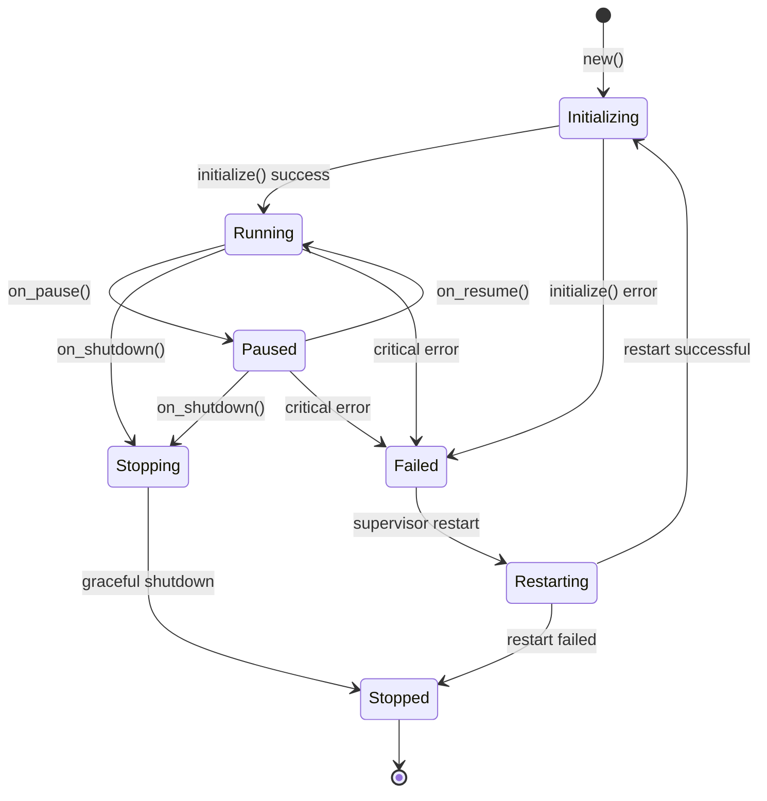
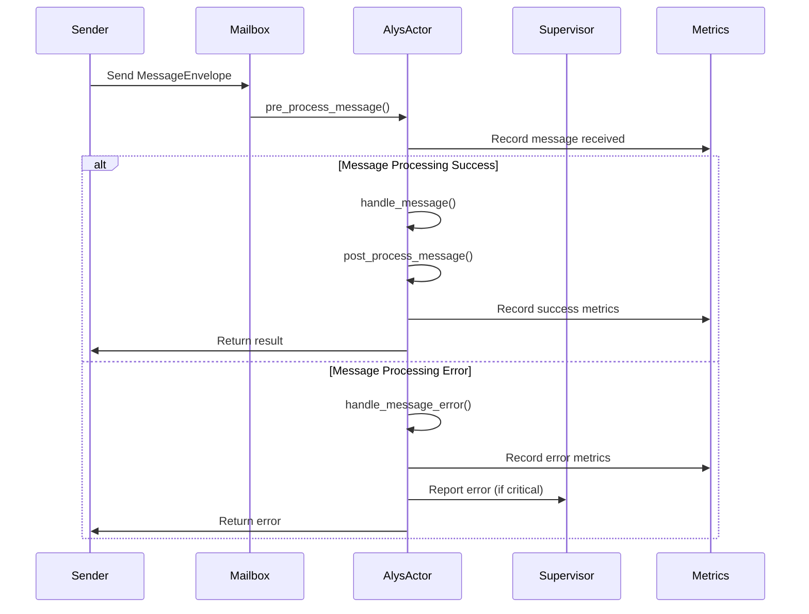

# AlysActor Deep Dive - Comprehensive Educational Guide

> **🎯 Purpose**: In-depth exploration of the `AlysActor` trait, the foundational interface for all actors in the Alys V2 blockchain system

## Table of Contents

1. [AlysActor Trait Architecture](#alysactor-trait-architecture)
2. [Type System & Generics](#type-system--generics)
3. [Lifecycle Integration](#lifecycle-integration)
4. [Message Processing Pipeline](#message-processing-pipeline)
5. [Actor Registry & Management](#actor-registry--management)
6. [Practical Implementation Examples](#practical-implementation-examples)
7. [Advanced Patterns](#advanced-patterns)
8. [Integration with Blockchain Systems](#integration-with-blockchain-systems)

## AlysActor Trait Architecture

### Core Design Philosophy

The `AlysActor` trait serves as the unified interface for all actors in the Alys V2 system, providing:

- **Standardized lifecycle management** across all actor types
- **Type-safe configuration and state management**  
- **Integrated message processing with observability**
- **Seamless supervision and error handling**
- **Built-in metrics collection and health monitoring**



### Trait Bounds Analysis

```rust
pub trait AlysActor: Actor + LifecycleAware + Send + Sync + 'static
```

Let's break down each bound:

- **`Actor`**: Base Actix actor trait providing fundamental actor capabilities
- **`LifecycleAware`**: Alys-specific lifecycle management (initialization, health checks, shutdown)
- **`Send + Sync`**: Thread-safety requirements for distributed actor system
- **`'static`**: Ensures actor can live for program duration (no borrowed references)

## Type System & Generics

### Associated Types Deep Dive

#### `type Config: Clone + Send + Sync + 'static`

The configuration type encapsulates all actor initialization parameters:

```rust
// Example: ChainActor configuration
#[derive(Debug, Clone, Serialize, Deserialize)]
pub struct ChainActorConfig {
    pub bitcoin_rpc_url: String,
    pub federation_threshold: usize,
    pub block_production_interval: Duration,
    pub auxpow_validation: bool,
}

impl AlysActor for ChainActor {
    type Config = ChainActorConfig;
    // ... other implementations
}
```

**Design Rationale:**
- **`Clone`**: Allows configuration to be shared and updated
- **`Send + Sync`**: Enables configuration updates across threads
- **`'static`**: No lifetime dependencies for long-lived actors

#### `type Error: Into<ActorError> + std::error::Error + Send + Sync + 'static`

Unified error handling with automatic conversion:

```rust
// Actor-specific error types
#[derive(Debug, thiserror::Error)]
pub enum ChainActorError {
    #[error("Bitcoin RPC connection failed: {reason}")]
    BitcoinRpcError { reason: String },
    
    #[error("Federation threshold not met: {current}/{required}")]
    FederationThresholdError { current: usize, required: usize },
}

// Automatic conversion to ActorError
impl Into<ActorError> for ChainActorError {
    fn into(self) -> ActorError {
        match self {
            ChainActorError::BitcoinRpcError { reason } => 
                ActorError::ExternalServiceFailure { service: "bitcoin".to_string(), reason },
            ChainActorError::FederationThresholdError { current, required } => 
                ActorError::ConsensusFailure { reason: format!("Federation {current}/{required}") },
        }
    }
}
```

#### `type Message: AlysMessage + 'static`

Enhanced message interface with metadata and tracing:

```rust
// Example: ChainActor messages
#[derive(Debug, Clone, Serialize, Deserialize)]
pub enum ChainMessage {
    ProduceBlock { height: u64, parent_hash: [u8; 32] },
    ValidateBlock { block_header: BlockHeader },
    UpdateFederation { members: Vec<String>, threshold: usize },
    ProcessAuxPow { auxpow_data: AuxPowData },
}

impl Message for ChainMessage {
    type Result = ActorResult<ChainResponse>;
}

impl AlysMessage for ChainMessage {
    fn priority(&self) -> MessagePriority {
        match self {
            ChainMessage::ProduceBlock { .. } => MessagePriority::Critical,
            ChainMessage::ValidateBlock { .. } => MessagePriority::High,
            ChainMessage::UpdateFederation { .. } => MessagePriority::High,
            ChainMessage::ProcessAuxPow { .. } => MessagePriority::Normal,
        }
    }
    
    fn timeout(&self) -> Duration {
        match self {
            ChainMessage::ProduceBlock { .. } => Duration::from_millis(500),
            ChainMessage::ValidateBlock { .. } => Duration::from_secs(2),
            _ => Duration::from_secs(10),
        }
    }
}
```

#### `type State: Clone + Send + Sync + 'static`

Actor internal state management:

```rust
// Example: ChainActor state
#[derive(Debug, Clone, Serialize, Deserialize)]
pub struct ChainActorState {
    pub current_height: u64,
    pub last_block_hash: [u8; 32],
    pub federation_members: Vec<String>,
    pub federation_threshold: usize,
    pub sync_status: SyncStatus,
    pub pending_auxpow: HashMap<u64, AuxPowData>,
}

impl Default for ChainActorState {
    fn default() -> Self {
        Self {
            current_height: 0,
            last_block_hash: [0u8; 32],
            federation_members: Vec::new(),
            federation_threshold: 3,
            sync_status: SyncStatus::NotSynced,
            pending_auxpow: HashMap::new(),
        }
    }
}
```

## Lifecycle Integration

### Actor Lifecycle State Machine



### Lifecycle Method Implementation

```rust
impl LifecycleAware for ChainActor {
    async fn initialize(&mut self) -> ActorResult<()> {
        // Initialize Bitcoin RPC connection
        self.bitcoin_client = BitcoinClient::new(&self.config.bitcoin_rpc_url)?;
        
        // Verify federation configuration
        if self.config.federation_threshold > self.state.federation_members.len() {
            return Err(ChainActorError::FederationThresholdError {
                current: self.state.federation_members.len(),
                required: self.config.federation_threshold,
            }.into());
        }
        
        // Initialize metrics
        self.metrics.record_initialization_complete();
        
        info!(
            actor_type = self.actor_type(),
            federation_members = self.state.federation_members.len(),
            "ChainActor initialized successfully"
        );
        
        Ok(())
    }
    
    async fn health_check(&self) -> ActorResult<bool> {
        // Check Bitcoin RPC connectivity
        if !self.bitcoin_client.is_connected().await? {
            return Ok(false);
        }
        
        // Check federation health
        let healthy_members = self.count_healthy_federation_members().await?;
        if healthy_members < self.config.federation_threshold {
            warn!(
                healthy_members = healthy_members,
                required = self.config.federation_threshold,
                "Federation health below threshold"
            );
            return Ok(false);
        }
        
        // Check sync status
        match self.state.sync_status {
            SyncStatus::Synced | SyncStatus::SyncedForProduction => Ok(true),
            _ => Ok(false),
        }
    }
    
    async fn on_shutdown(&mut self, timeout: Duration) -> ActorResult<()> {
        info!("ChainActor shutting down gracefully");
        
        // Stop block production
        self.stop_block_production().await?;
        
        // Close Bitcoin RPC connection
        self.bitcoin_client.disconnect().await?;
        
        // Save state for restart
        self.persist_state().await?;
        
        Ok(())
    }
    
    fn actor_type(&self) -> &str {
        "ChainActor"
    }
}
```

## Message Processing Pipeline

### Enhanced Message Handling Flow



### Message Processing Implementation

```rust
impl AlysActor for ChainActor {
    async fn pre_process_message(&mut self, envelope: &MessageEnvelope<Self::Message>) -> ActorResult<()> {
        // Update vector clock for message ordering
        envelope.update_vector_clock(&self.actor_type());
        
        // Check if actor is ready to process messages
        match self.lifecycle_state {
            ActorState::Running => Ok(()),
            ActorState::Paused => {
                // Queue message for when actor resumes
                self.paused_messages.push(envelope.clone());
                Err(ActorError::ActorPaused { name: self.actor_type().to_string() })
            },
            state => Err(ActorError::InvalidStateTransition { 
                from: state.to_string(),
                to: "processing".to_string(),
                reason: "Actor not in running state".to_string(),
            })
        }
    }
    
    async fn post_process_message(
        &mut self, 
        envelope: &MessageEnvelope<Self::Message>, 
        result: &<Self::Message as Message>::Result
    ) -> ActorResult<()> {
        // Record processing metrics
        if let Some(processing_time) = envelope.metadata.performance.processing_time {
            self.metrics.record_message_processed(processing_time);
        }
        
        // Update actor state based on message result
        match (&envelope.payload, result) {
            (ChainMessage::ProduceBlock { height, .. }, Ok(ChainResponse::BlockProduced { hash })) => {
                self.state.current_height = *height;
                self.state.last_block_hash = *hash;
                self.metrics.record_block_produced(*height);
            },
            (ChainMessage::ValidateBlock { .. }, Ok(ChainResponse::BlockValidated { valid: true })) => {
                self.metrics.record_block_validated(true);
            },
            _ => {}
        }
        
        Ok(())
    }
    
    async fn handle_message_error(
        &mut self, 
        envelope: &MessageEnvelope<Self::Message>, 
        error: &ActorError
    ) -> ActorResult<()> {
        // Log error with full context
        error!(
            actor_type = self.actor_type(),
            message_type = envelope.payload.message_type(),
            message_id = %envelope.id,
            error = %error,
            correlation_id = ?envelope.metadata.correlation_id,
            "Message processing failed"
        );
        
        // Record error metrics
        self.metrics.record_message_failed(&error.to_string());
        
        // Handle specific error types
        match error {
            ActorError::ConsensusFailure { reason } => {
                // Consensus failures are critical - may need to pause block production
                if self.is_block_producer() {
                    warn!("Pausing block production due to consensus failure: {}", reason);
                    self.pause_block_production().await?;
                }
            },
            ActorError::ExternalServiceFailure { service: "bitcoin", .. } => {
                // Bitcoin RPC failures - attempt reconnection
                self.attempt_bitcoin_reconnection().await?;
            },
            _ => {}
        }
        
        // Check if error requires actor restart
        if error.severity().is_critical() {
            self.request_supervisor_restart(error.clone()).await?;
        }
        
        Ok(())
    }
}
```

## Actor Registry & Management

### Actor Factory Pattern

The `ActorFactory` provides convenient methods for creating and managing actors:

```rust
// Standard actor creation
let chain_actor = ActorFactory::create_actor::<ChainActor>("chain-1".to_string()).await?;

// Actor with custom configuration
let config = ChainActorConfig {
    bitcoin_rpc_url: "http://localhost:8332".to_string(),
    federation_threshold: 3,
    block_production_interval: Duration::from_secs(2),
    auxpow_validation: true,
};

let chain_actor = ActorFactory::create_actor_with_config::<ChainActor>(
    "chain-1".to_string(), 
    config
).await?;

// Supervised actor with automatic restart
let supervisor = SupervisorActor::new().start();
let supervised_actor = ActorFactory::create_supervised_actor::<ChainActor>(
    "chain-1".to_string(),
    config,
    supervisor.recipient(),
).await?;
```

### Registry Integration

```rust
// Actor registration example
let mut registry = ActorRegistry::new();
let metrics = Arc::new(ActorMetrics::default());

// Register actor
registry.register(
    "chain-1".to_string(),
    chain_actor_addr,
    metrics.clone(),
)?;

// Set up dependencies
registry.add_dependency("chain-1".to_string(), "storage-1".to_string())?;
registry.add_dependency("chain-1".to_string(), "network-1".to_string())?;

// Get startup order based on dependencies
let startup_order = registry.get_startup_order();
println!("Actor startup order: {:?}", startup_order);

// Check for circular dependencies
if registry.has_circular_dependency() {
    return Err(ActorError::ConfigurationError { 
        reason: "Circular dependency detected in actor registry".to_string() 
    });
}
```

## Practical Implementation Examples

### Complete ChainActor Implementation

```rust
pub struct ChainActor {
    id: String,
    config: ChainActorConfig,
    state: ChainActorState,
    metrics: ActorMetrics,
    bitcoin_client: Option<BitcoinClient>,
    lifecycle_manager: Arc<LifecycleManager>,
    paused_messages: Vec<MessageEnvelope<ChainMessage>>,
}

impl AlysActor for ChainActor {
    type Config = ChainActorConfig;
    type Error = ChainActorError;
    type Message = ChainMessage;
    type State = ChainActorState;
    
    fn new(config: Self::Config) -> Result<Self, Self::Error> {
        Ok(Self {
            id: Uuid::new_v4().to_string(),
            config,
            state: ChainActorState::default(),
            metrics: ActorMetrics::default(),
            bitcoin_client: None,
            lifecycle_manager: Arc::new(LifecycleManager::new()),
            paused_messages: Vec::new(),
        })
    }
    
    fn actor_type(&self) -> String {
        "ChainActor".to_string()
    }
    
    fn config(&self) -> &Self::Config {
        &self.config
    }
    
    fn config_mut(&mut self) -> &mut Self::Config {
        &mut self.config
    }
    
    fn metrics(&self) -> &ActorMetrics {
        &self.metrics
    }
    
    fn metrics_mut(&mut self) -> &mut ActorMetrics {
        &mut self.metrics
    }
    
    async fn get_state(&self) -> Self::State {
        self.state.clone()
    }
    
    async fn set_state(&mut self, state: Self::State) -> ActorResult<()> {
        self.state = state;
        self.persist_state().await?;
        Ok(())
    }
    
    fn dependencies(&self) -> Vec<String> {
        vec![
            "storage-actor".to_string(),
            "network-actor".to_string(),
        ]
    }
    
    // ... message processing methods implemented above
}

impl Actor for ChainActor {
    type Context = Context<Self>;
    
    fn started(&mut self, ctx: &mut Self::Context) {
        info!(actor_id = %self.id, "ChainActor started");
        
        // Start periodic health checks
        ctx.run_interval(Duration::from_secs(30), |actor, _ctx| {
            actor.perform_health_check();
        });
        
        // Start block production timer
        if self.is_block_producer() {
            ctx.run_interval(self.config.block_production_interval, |actor, _ctx| {
                actor.produce_block_if_ready();
            });
        }
    }
    
    fn stopped(&mut self, _ctx: &mut Self::Context) {
        info!(actor_id = %self.id, "ChainActor stopped");
    }
}

impl Handler<ChainMessage> for ChainActor {
    type Result = ResponseActFuture<Self, ActorResult<ChainResponse>>;
    
    fn handle(&mut self, msg: ChainMessage, _ctx: &mut Self::Context) -> Self::Result {
        Box::pin(async move {
            match msg {
                ChainMessage::ProduceBlock { height, parent_hash } => {
                    self.handle_produce_block(height, parent_hash).await
                }
                ChainMessage::ValidateBlock { block_header } => {
                    self.handle_validate_block(block_header).await
                }
                ChainMessage::UpdateFederation { members, threshold } => {
                    self.handle_update_federation(members, threshold).await
                }
                ChainMessage::ProcessAuxPow { auxpow_data } => {
                    self.handle_process_auxpow(auxpow_data).await
                }
            }
        }.into_actor(self))
    }
}
```

## Advanced Patterns

### Actor Composition Pattern

```rust
/// Composite actor that manages multiple sub-actors
pub struct CompositeBlockchainActor {
    chain_actor: Addr<ChainActor>,
    engine_actor: Addr<EngineActor>,
    storage_actor: Addr<StorageActor>,
    coordinator: BlockchainCoordinator,
}

impl CompositeBlockchainActor {
    pub async fn coordinate_block_production(&mut self, height: u64) -> ActorResult<Block> {
        // Coordinate between chain, engine, and storage actors
        let parent_hash = self.storage_actor
            .send(GetBlockHash { height: height - 1 })
            .await??;
            
        let transactions = self.engine_actor
            .send(GetPendingTransactions { limit: 1000 })
            .await??;
            
        let block = self.chain_actor
            .send(ProduceBlock { 
                height, 
                parent_hash,
                transactions,
            })
            .await??;
            
        // Store the new block
        self.storage_actor
            .send(StoreBlock { block: block.clone() })
            .await??;
            
        Ok(block)
    }
}
```

### Actor Pool Pattern

```rust
/// Pool of identical actors for load balancing
pub struct ActorPool<A: AlysActor> {
    actors: Vec<Addr<A>>,
    current_index: AtomicUsize,
    load_balancer: LoadBalanceStrategy,
}

impl<A: AlysActor> ActorPool<A> {
    pub fn new(size: usize, config: A::Config) -> ActorResult<Self> {
        let mut actors = Vec::with_capacity(size);
        
        for i in 0..size {
            let actor_config = config.clone();
            let addr = ActorFactory::create_actor_with_config::<A>(
                format!("pool-actor-{}", i),
                actor_config,
            ).await?;
            actors.push(addr);
        }
        
        Ok(Self {
            actors,
            current_index: AtomicUsize::new(0),
            load_balancer: LoadBalanceStrategy::RoundRobin,
        })
    }
    
    pub fn get_next_actor(&self) -> &Addr<A> {
        let index = match self.load_balancer {
            LoadBalanceStrategy::RoundRobin => {
                self.current_index.fetch_add(1, Ordering::SeqCst) % self.actors.len()
            }
            LoadBalanceStrategy::LeastLoaded => {
                // Implementation would check actor metrics to find least loaded
                0
            }
        };
        
        &self.actors[index]
    }
}
```

## Integration with Blockchain Systems

### Blockchain-Aware Actor Extension

```rust
impl BlockchainAwareActor for ChainActor {
    fn timing_constraints(&self) -> BlockchainTimingConstraints {
        BlockchainTimingConstraints {
            block_interval: self.config.block_production_interval,
            max_consensus_latency: Duration::from_millis(100),
            federation_timeout: Duration::from_millis(500),
            auxpow_window: Duration::from_secs(600),
        }
    }
    
    fn blockchain_priority(&self) -> BlockchainActorPriority {
        BlockchainActorPriority::Consensus // Highest priority for consensus
    }
    
    fn is_consensus_critical(&self) -> bool {
        true // ChainActor is critical for consensus
    }
    
    async fn handle_blockchain_event(&mut self, event: BlockchainEvent) -> ActorResult<()> {
        match event {
            BlockchainEvent::BlockProduced { height, hash } => {
                info!(
                    height = height,
                    hash = ?hash,
                    "Block produced event received"
                );
                
                // Update internal state
                self.state.current_height = height;
                self.state.last_block_hash = hash;
                
                // Trigger any dependent operations
                self.process_block_produced(height, hash).await?;
                
                Ok(())
            }
            BlockchainEvent::BlockFinalized { height, hash } => {
                info!(
                    height = height,
                    hash = ?hash,
                    "Block finalized event received"
                );
                
                // Process finalization
                self.process_block_finalized(height, hash).await?;
                
                Ok(())
            }
            BlockchainEvent::FederationChange { members, threshold } => {
                info!(
                    members = ?members,
                    threshold = threshold,
                    "Federation change event received"
                );
                
                // Update federation configuration
                self.state.federation_members = members;
                self.state.federation_threshold = threshold;
                
                // Validate new configuration
                self.validate_federation_config().await?;
                
                Ok(())
            }
            BlockchainEvent::ConsensusFailure { reason } => {
                error!(
                    reason = %reason,
                    "Consensus failure event received"
                );
                
                // Handle consensus failure
                self.handle_consensus_failure(reason).await?;
                
                Ok(())
            }
        }
    }
    
    async fn validate_blockchain_readiness(&self) -> ActorResult<BlockchainReadiness> {
        let bitcoin_connected = self.bitcoin_client
            .as_ref()
            .map(|client| client.is_connected())
            .unwrap_or(false);
            
        let federation_healthy = self.count_healthy_federation_members().await? 
            >= self.state.federation_threshold;
            
        let can_produce = bitcoin_connected 
            && federation_healthy 
            && matches!(self.state.sync_status, SyncStatus::Synced | SyncStatus::SyncedForProduction);
        
        Ok(BlockchainReadiness {
            can_produce_blocks: can_produce,
            can_validate_blocks: bitcoin_connected,
            federation_healthy,
            sync_status: self.state.sync_status,
            last_validated: SystemTime::now(),
        })
    }
}
```

### Specialized Factory Functions

```rust
/// Create consensus-critical blockchain actor with appropriate configuration
pub async fn create_consensus_chain_actor(
    id: String,
    config: ChainActorConfig,
) -> ActorResult<Addr<ChainActor>> {
    // Create with consensus-optimized configuration
    let blockchain_config = BlockchainActorConfig {
        priority: BlockchainActorPriority::Consensus,
        timing_constraints: BlockchainTimingConstraints {
            block_interval: Duration::from_secs(2),
            max_consensus_latency: Duration::from_millis(50), // Very tight timing
            federation_timeout: Duration::from_millis(200),
            auxpow_window: Duration::from_secs(600),
        },
        event_subscriptions: vec![
            BlockchainEventType::BlockProduction,
            BlockchainEventType::BlockFinalization,
            BlockchainEventType::ConsensusFailures,
            BlockchainEventType::FederationChanges,
        ],
        restart_strategy: BlockchainRestartStrategy {
            max_consensus_downtime: Duration::from_millis(100),
            align_to_blocks: true,
            respect_consensus: true,
            federation_requirements: Some(FederationHealthRequirement {
                min_healthy_members: 3,
                max_wait_time: Duration::from_secs(10),
                allow_degraded_operation: false,
            }),
            ..Default::default()
        },
        ..Default::default()
    };
    
    BlockchainActorFactory::create_blockchain_actor(id, config, blockchain_config).await
}
```

---

## Summary

The `AlysActor` trait provides a comprehensive foundation for building robust, observable, and maintainable actors in the Alys V2 blockchain system. Key takeaways:

1. **Unified Interface**: Standardized actor interface with strong typing
2. **Lifecycle Integration**: Built-in lifecycle management and health monitoring  
3. **Message Processing**: Enhanced message handling with tracing and metrics
4. **Error Handling**: Comprehensive error management with supervisor integration
5. **Blockchain Integration**: Native support for blockchain-specific requirements
6. **Extensibility**: Multiple extension points for specialized actor behavior

This architecture enables building complex blockchain systems with reliable actor coordination, comprehensive observability, and robust error handling - essential for the mission-critical nature of blockchain consensus and bridge operations.