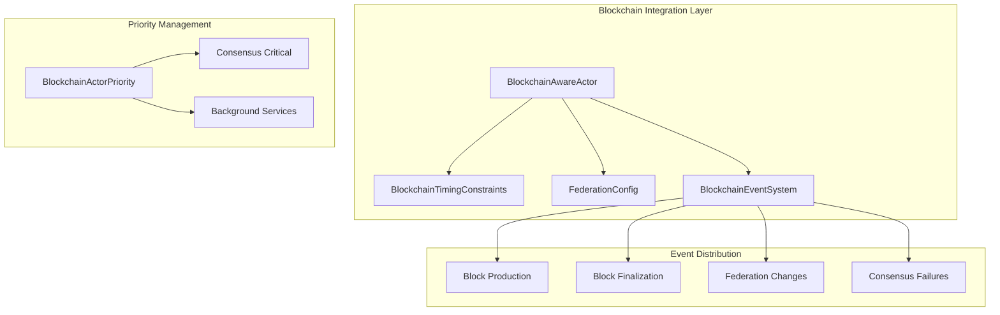

# Blockchain Integration Deep Dive - Alys V2 Actor System

This document provides a comprehensive guide to the blockchain-aware actor system extensions in Alys V2, covering the specialized traits, timing constraints, federation management, and event systems that enable seamless integration with the Alys merged mining sidechain.

## Table of Contents
1. [Introduction & Architecture](#1-introduction--architecture)
2. [Blockchain-Aware Actor Traits](#2-blockchain-aware-actor-traits)
3. [Timing Constraints & Performance](#3-timing-constraints--performance)
4. [Federation Management](#4-federation-management)
5. [Event System & Subscriptions](#5-event-system--subscriptions)
6. [Priority System & Consensus Critical Actors](#6-priority-system--consensus-critical-actors)
7. [Advanced Patterns & Examples](#7-advanced-patterns--examples)
8. [Best Practices & Production Guidelines](#8-best-practices--production-guidelines)

## 1. Introduction & Architecture

The Alys V2 blockchain integration system extends the core actor framework with blockchain-specific capabilities, enabling actors to participate effectively in the merged mining consensus process, federation operations, and real-time blockchain events.

### Core Architecture



### Key Design Principles

1. **Timing Awareness**: All blockchain actors understand the 2-second block timing and sub-100ms consensus requirements
2. **Federation Integration**: Seamless participation in the 3-of-5 multisig federation consensus
3. **Event-Driven Architecture**: Real-time blockchain event distribution to subscribed actors
4. **Priority-Based Execution**: Consensus-critical actors get guaranteed resources and minimal latency
5. **Fault Tolerance**: Blockchain-aware restart strategies that respect consensus timing

## 2. Blockchain-Aware Actor Traits

### BlockchainAwareActor Trait

The `BlockchainAwareActor` trait extends the core `AlysActor` trait with blockchain-specific capabilities:

```rust
#[async_trait]
pub trait BlockchainAwareActor: AlysActor {
    /// Get blockchain timing constraints for this actor
    fn timing_constraints(&self) -> BlockchainTimingConstraints;
    
    /// Get federation configuration if this actor participates in federation
    fn federation_config(&self) -> Option<FederationConfig>;
    
    /// Get blockchain-specific priority level
    fn blockchain_priority(&self) -> BlockchainActorPriority;
    
    /// Check if actor is critical for consensus operations
    fn is_consensus_critical(&self) -> bool;
    
    /// Handle blockchain-specific events
    async fn handle_blockchain_event(&mut self, event: BlockchainEvent) -> ActorResult<()>;
    
    /// Validate blockchain readiness
    async fn validate_blockchain_readiness(&self) -> ActorResult<BlockchainReadiness>;
}
```

### Implementation Example

Here's how a consensus-critical actor implements the blockchain-aware trait:

```rust
use crate::blockchain::*;

pub struct ChainActor {
    // Actor state...
}

#[async_trait]
impl BlockchainAwareActor for ChainActor {
    fn timing_constraints(&self) -> BlockchainTimingConstraints {
        BlockchainTimingConstraints {
            block_interval: Duration::from_secs(2),
            max_consensus_latency: Duration::from_millis(50), // Tighter than default
            federation_timeout: Duration::from_millis(300),
            auxpow_window: Duration::from_secs(600),
        }
    }
    
    fn blockchain_priority(&self) -> BlockchainActorPriority {
        BlockchainActorPriority::Consensus
    }
    
    fn is_consensus_critical(&self) -> bool {
        true
    }
    
    async fn handle_blockchain_event(&mut self, event: BlockchainEvent) -> ActorResult<()> {
        match event {
            BlockchainEvent::BlockProduced { height, hash } => {
                info!("New block produced: {} @ {}", height, hex::encode(hash));
                self.process_new_block(height, hash).await?;
            }
            BlockchainEvent::ConsensusFailure { reason } => {
                error!("Consensus failure: {}", reason);
                self.handle_consensus_failure(&reason).await?;
            }
            _ => {} // Handle other events as needed
        }
        Ok(())
    }
}
```

## 3. Timing Constraints & Performance

### BlockchainTimingConstraints Structure

The timing constraints ensure actors operate within the performance requirements of the Alys blockchain:

```rust
#[derive(Debug, Clone, Serialize, Deserialize)]
pub struct BlockchainTimingConstraints {
    /// Block production interval (2 seconds for Alys)
    pub block_interval: Duration,
    /// Maximum allowed consensus operation latency
    pub max_consensus_latency: Duration,
    /// Federation coordination timeout
    pub federation_timeout: Duration,
    /// AuxPoW submission window
    pub auxpow_window: Duration,
}
```

### Performance Requirements by Actor Type

| Actor Type | Max Consensus Latency | Federation Timeout | Purpose |
|------------|----------------------|-------------------|---------|
| Consensus Critical | 50ms | 300ms | Block production, validation |
| Bridge Operations | 100ms | 500ms | Peg-in/peg-out processing |
| Network Services | 200ms | 1000ms | P2P sync, gossip |
| Background | 1000ms | 5000ms | Storage, metrics |

### Timing Validation Example

```rust
impl ChainActor {
    async fn validate_timing_compliance(&self) -> ActorResult<()> {
        let constraints = self.timing_constraints();
        let start_time = Instant::now();
        
        // Perform consensus operation
        self.execute_consensus_operation().await?;
        
        let elapsed = start_time.elapsed();
        if elapsed > constraints.max_consensus_latency {
            warn!(
                elapsed_ms = elapsed.as_millis(),
                max_allowed_ms = constraints.max_consensus_latency.as_millis(),
                "Consensus operation exceeded timing constraints"
            );
            
            // Escalate to supervisor if consistently slow
            if self.timing_violations > 3 {
                return Err(ActorError::TimingConstraintViolation(elapsed));
            }
        }
        
        Ok(())
    }
}
```

## 4. Federation Management

### Federation Configuration

The federation system manages the 3-of-5 multisig consensus for peg operations:

```rust
#[derive(Debug, Clone, Serialize, Deserialize)]
pub struct FederationConfig {
    /// Current federation members (public keys)
    pub members: Vec<String>,
    /// Signature threshold (e.g., 3 of 5)
    pub threshold: usize,
    /// Federation health check interval
    pub health_interval: Duration,
    /// Minimum healthy members for operation
    pub min_healthy: usize,
}
```

### Federation Health Requirements

```rust
#[derive(Debug, Clone, Serialize, Deserialize)]
pub struct FederationHealthRequirement {
    /// Minimum number of healthy federation members required
    pub min_healthy_members: usize,
    /// Maximum time to wait for federation health
    pub max_wait_time: Duration,
    /// Whether to proceed with degraded federation
    pub allow_degraded_operation: bool,
}
```

### Federation Actor Implementation

```rust
pub struct BridgeActor {
    federation_config: FederationConfig,
    member_health: HashMap<String, FederationMemberHealth>,
}

impl BridgeActor {
    async fn check_federation_health(&mut self) -> ActorResult<bool> {
        let healthy_members = self.member_health
            .values()
            .filter(|health| health.is_healthy())
            .count();
        
        let is_healthy = healthy_members >= self.federation_config.min_healthy;
        
        if !is_healthy {
            warn!(
                healthy_members = healthy_members,
                required = self.federation_config.min_healthy,
                total_members = self.federation_config.members.len(),
                "Federation health below threshold"
            );
        }
        
        Ok(is_healthy)
    }
    
    async fn coordinate_federation_operation(&mut self, operation: FederationOperation) -> ActorResult<()> {
        // Wait for minimum federation health
        let start_time = Instant::now();
        while !self.check_federation_health().await? {
            if start_time.elapsed() > Duration::from_secs(30) {
                return Err(ActorError::FederationUnavailable);
            }
            tokio::time::sleep(Duration::from_millis(100)).await;
        }
        
        // Execute federated operation with threshold signatures
        self.execute_with_federation_consensus(operation).await
    }
}
```

## 5. Event System & Subscriptions

### Blockchain Event Types

The system supports multiple types of blockchain events:

```rust
#[derive(Debug, Clone, Serialize, Deserialize)]
pub enum BlockchainEvent {
    /// New block has been produced
    BlockProduced { height: u64, hash: [u8; 32] },
    /// Block has been finalized via AuxPoW
    BlockFinalized { height: u64, hash: [u8; 32] },
    /// Federation membership has changed
    FederationChange { members: Vec<String>, threshold: usize },
    /// Consensus operation failed
    ConsensusFailure { reason: String },
}

#[derive(Debug, Clone, PartialEq, Eq, Hash)]
pub enum BlockchainEventType {
    BlockProduction,
    BlockFinalization, 
    FederationChanges,
    ConsensusFailures,
    SyncStatusChanges,
}
```

### Event Subscription System

```rust
#[derive(Debug, Clone, Message)]
#[rtype(result = "ActorResult<()>")]
pub struct SubscribeToBlockchainEvents {
    pub subscriber: actix::Recipient<BlockchainEvent>,
    pub event_types: Vec<BlockchainEventType>,
}

// Usage example
impl SyncActor {
    async fn subscribe_to_blockchain_events(&mut self) -> ActorResult<()> {
        let subscription = SubscribeToBlockchainEvents {
            subscriber: ctx.address().recipient(),
            event_types: vec![
                BlockchainEventType::BlockProduction,
                BlockchainEventType::BlockFinalization,
            ],
        };
        
        // Send to blockchain event coordinator
        self.event_coordinator
            .send(subscription)
            .await
            .map_err(|e| ActorError::Communication(e.to_string()))?
    }
}
```

### Event Processing Patterns

```rust
impl Handler<BlockchainEvent> for SyncActor {
    type Result = ActorResult<()>;
    
    fn handle(&mut self, msg: BlockchainEvent, ctx: &mut Context<Self>) -> Self::Result {
        match msg {
            BlockchainEvent::BlockProduced { height, hash } => {
                // Update sync progress
                self.update_sync_target(height);
                
                // Trigger sync if we're behind
                if height > self.current_height + 1 {
                    ctx.address().do_send(StartSync { target_height: height });
                }
                
                Ok(())
            }
            
            BlockchainEvent::BlockFinalized { height, hash } => {
                // Mark block as finalized in local storage
                self.mark_block_finalized(height, hash);
                
                // Clean up old unfinalized blocks
                self.cleanup_old_blocks(height);
                
                Ok(())
            }
            
            _ => Ok(())
        }
    }
}
```

## 6. Priority System & Consensus Critical Actors

### BlockchainActorPriority Levels

```rust
#[derive(Debug, Clone, Copy, PartialEq, Eq, PartialOrd, Ord)]
pub enum BlockchainActorPriority {
    /// Critical consensus operations (ChainActor, EngineActor)
    Consensus = 0,
    /// High priority bridge operations (BridgeActor, StreamActor)  
    Bridge = 1,
    /// Normal network operations (SyncActor, NetworkActor)
    Network = 2,
    /// Background services (StorageActor, MetricsActor)
    Background = 3,
}
```

### Resource Allocation by Priority

```rust
impl BlockchainActorPriority {
    pub fn max_restart_time(&self) -> Duration {
        match self {
            Self::Consensus => Duration::from_millis(100),
            Self::Bridge => Duration::from_millis(500),
            Self::Network => Duration::from_secs(2),
            Self::Background => Duration::from_secs(10),
        }
    }
    
    pub fn thread_pool_size(&self) -> usize {
        match self {
            Self::Consensus => 4,  // Dedicated threads
            Self::Bridge => 2,
            Self::Network => 1,
            Self::Background => 1, // Shared pool
        }
    }
    
    pub fn message_queue_size(&self) -> usize {
        match self {
            Self::Consensus => 1000,   // Large buffer
            Self::Bridge => 500,
            Self::Network => 100,
            Self::Background => 50,
        }
    }
}
```

### Consensus Critical Actor Factory

```rust
pub async fn create_consensus_actor<A>(
    id: String,
    config: A::Config,
) -> ActorResult<Addr<A>>
where
    A: BlockchainAwareActor + Actor<Context = Context<A>> + 'static,
{
    let blockchain_config = BlockchainActorConfig {
        priority: BlockchainActorPriority::Consensus,
        timing_constraints: BlockchainTimingConstraints::default(),
        event_subscriptions: vec![
            BlockchainEventType::BlockProduction,
            BlockchainEventType::BlockFinalization,
            BlockchainEventType::ConsensusFailures,
        ],
        restart_strategy: BlockchainRestartStrategy {
            max_consensus_downtime: Duration::from_millis(100),
            ..Default::default()
        },
        ..Default::default()
    };
    
    BlockchainActorFactory::create_blockchain_actor(id, config, blockchain_config).await
}
```

## 7. Advanced Patterns & Examples

### Blockchain Readiness Validation

```rust
#[derive(Debug, Clone, Serialize, Deserialize)]
pub struct BlockchainReadiness {
    /// Can participate in block production
    pub can_produce_blocks: bool,
    /// Can validate incoming blocks
    pub can_validate_blocks: bool,
    /// Federation is healthy enough for operations
    pub federation_healthy: bool,
    /// Current sync status
    pub sync_status: SyncStatus,
    /// Last validation timestamp
    pub last_validated: SystemTime,
}

impl EngineActor {
    async fn validate_blockchain_readiness(&self) -> ActorResult<BlockchainReadiness> {
        let sync_progress = self.get_sync_progress().await?;
        let federation_health = self.check_federation_health().await?;
        
        let readiness = BlockchainReadiness {
            can_produce_blocks: sync_progress > 99.5 && federation_health,
            can_validate_blocks: sync_progress > 95.0,
            federation_healthy: federation_health,
            sync_status: match sync_progress {
                p if p < 50.0 => SyncStatus::NotSynced,
                p if p < 99.5 => SyncStatus::Syncing { progress: p },
                p if p < 100.0 => SyncStatus::SyncedForProduction,
                _ => SyncStatus::Synced,
            },
            last_validated: SystemTime::now(),
        };
        
        Ok(readiness)
    }
}
```

### Cross-Actor Coordination Pattern

```rust
pub struct CoordinatedOperation {
    pub operation_id: Uuid,
    pub participants: Vec<String>,
    pub timing_constraint: Duration,
    pub federation_requirement: bool,
}

impl ChainActor {
    async fn coordinate_consensus_operation(
        &mut self,
        operation: CoordinatedOperation
    ) -> ActorResult<()> {
        let start_time = Instant::now();
        
        // Phase 1: Validate all participants are ready
        let mut ready_participants = Vec::new();
        for participant in &operation.participants {
            let readiness = self.check_participant_readiness(participant).await?;
            if readiness.can_participate() {
                ready_participants.push(participant.clone());
            }
        }
        
        // Phase 2: Check federation requirements
        if operation.federation_requirement {
            let federation_ready = self.validate_federation_consensus().await?;
            if !federation_ready {
                return Err(ActorError::FederationNotReady);
            }
        }
        
        // Phase 3: Execute coordinated operation
        let coordination_result = self.execute_coordinated_operation(
            &operation,
            &ready_participants
        ).await?;
        
        // Phase 4: Validate timing constraints
        let elapsed = start_time.elapsed();
        if elapsed > operation.timing_constraint {
            warn!(
                operation_id = %operation.operation_id,
                elapsed_ms = elapsed.as_millis(),
                constraint_ms = operation.timing_constraint.as_millis(),
                "Coordinated operation exceeded timing constraint"
            );
        }
        
        Ok(())
    }
}
```

### Blockchain-Aware Restart Strategy

```rust
impl BlockchainRestartStrategy {
    pub fn calculate_blockchain_delay(
        &self, 
        attempt: u32, 
        timing_constraints: &BlockchainTimingConstraints
    ) -> Option<Duration> {
        let mut base_delay = self.base_strategy.calculate_delay(attempt)?;
        
        // Align to block boundaries if requested
        if self.align_to_blocks {
            base_delay = self.align_to_block_boundary(base_delay, timing_constraints);
        }
        
        // Respect consensus timing constraints
        if self.respect_consensus {
            base_delay = base_delay.min(self.max_consensus_downtime);
        }
        
        Some(base_delay)
    }
    
    fn align_to_block_boundary(
        &self, 
        delay: Duration, 
        constraints: &BlockchainTimingConstraints
    ) -> Duration {
        let block_time_ms = constraints.block_interval.as_millis() as u64;
        let delay_ms = delay.as_millis() as u64;
        let aligned_ms = ((delay_ms + block_time_ms - 1) / block_time_ms) * block_time_ms;
        Duration::from_millis(aligned_ms)
    }
}
```

## 8. Best Practices & Production Guidelines

### Timing Constraint Management

1. **Consensus Critical Actors** (ChainActor, EngineActor):
   - Maximum 50ms latency for consensus operations
   - Restart time under 100ms
   - Dedicated thread pools and memory allocation

2. **Bridge Operations** (BridgeActor, StreamActor):
   - Maximum 100ms latency for federation coordination
   - 3-of-5 signature collection within 500ms
   - Graceful degradation when federation members are offline

3. **Network Services** (SyncActor, NetworkActor):
   - 200ms maximum for P2P operations
   - Background sync that doesn't impact consensus
   - Rate limiting to prevent resource exhaustion

### Federation Health Monitoring

```rust
impl FederationHealthMonitor {
    pub async fn continuous_health_check(&mut self) {
        let mut interval = tokio::time::interval(Duration::from_secs(10));
        
        loop {
            interval.tick().await;
            
            let health_results = self.check_all_members().await;
            let healthy_count = health_results.iter()
                .filter(|(_, health)| health.is_healthy())
                .count();
            
            if healthy_count < self.config.min_healthy {
                error!(
                    healthy_members = healthy_count,
                    required = self.config.min_healthy,
                    "Federation health below critical threshold"
                );
                
                // Trigger federation failover procedures
                self.initiate_federation_failover().await;
            }
            
            // Update metrics
            self.metrics.federation_health_score.set(
                (healthy_count as f64 / self.config.members.len() as f64) * 100.0
            );
        }
    }
}
```

### Error Handling & Recovery

```rust
#[derive(Debug, thiserror::Error)]
pub enum BlockchainActorError {
    #[error("Timing constraint violated: {0:?}")]
    TimingConstraintViolation(Duration),
    
    #[error("Federation not available: {healthy}/{total} members")]
    FederationUnavailable { healthy: usize, total: usize },
    
    #[error("Consensus operation failed: {reason}")]
    ConsensusFailure { reason: String },
    
    #[error("Blockchain not ready: {status:?}")]
    BlockchainNotReady { status: BlockchainReadiness },
}

impl From<BlockchainActorError> for ActorError {
    fn from(err: BlockchainActorError) -> Self {
        match err {
            BlockchainActorError::TimingConstraintViolation(_) => {
                ActorError::Critical(err.to_string())
            }
            BlockchainActorError::ConsensusFailure { .. } => {
                ActorError::Critical(err.to_string())
            }
            _ => ActorError::Recoverable(err.to_string()),
        }
    }
}
```

### Production Monitoring & Alerting

Essential metrics to monitor for blockchain-aware actors:

```rust
pub struct BlockchainActorMetrics {
    // Timing metrics
    pub consensus_operation_latency: Histogram,
    pub federation_coordination_time: Histogram,
    pub block_processing_time: Histogram,
    
    // Health metrics
    pub federation_health_score: Gauge,
    pub consensus_failures_total: Counter,
    pub timing_violations_total: Counter,
    
    // Performance metrics
    pub blocks_produced_total: Counter,
    pub blocks_finalized_total: Counter,
    pub peg_operations_total: CounterVec, // by type and status
}
```

### Configuration Best Practices

1. **Environment-Specific Timing**:
   ```toml
   [blockchain.timing.mainnet]
   block_interval = "2s"
   max_consensus_latency = "50ms"
   federation_timeout = "500ms"
   
   [blockchain.timing.testnet]
   block_interval = "2s"
   max_consensus_latency = "100ms"
   federation_timeout = "1s"
   ```

2. **Federation Configuration**:
   ```toml
   [federation]
   threshold = 3
   min_healthy = 3
   health_check_interval = "30s"
   allow_degraded_operation = false
   ```

3. **Actor Priority Tuning**:
   ```rust
   // Production settings for consensus-critical actors
   let consensus_config = BlockchainActorConfig {
       priority: BlockchainActorPriority::Consensus,
       timing_constraints: BlockchainTimingConstraints {
           max_consensus_latency: Duration::from_millis(50),
           ..Default::default()
       },
       restart_strategy: BlockchainRestartStrategy {
           max_consensus_downtime: Duration::from_millis(100),
           respect_consensus: true,
           align_to_blocks: true,
           ..Default::default()
       },
       ..Default::default()
   };
   ```

This blockchain integration system ensures that Alys V2 actors can participate effectively in the merged mining consensus process while maintaining the strict timing and coordination requirements of a production blockchain network.