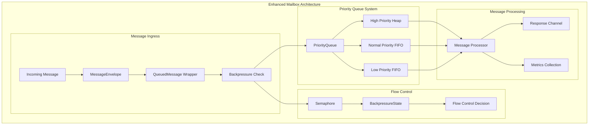
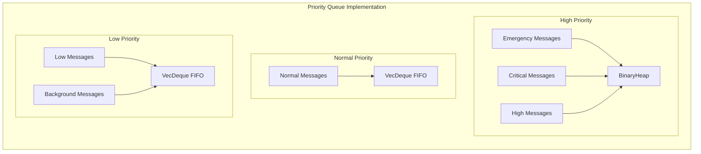
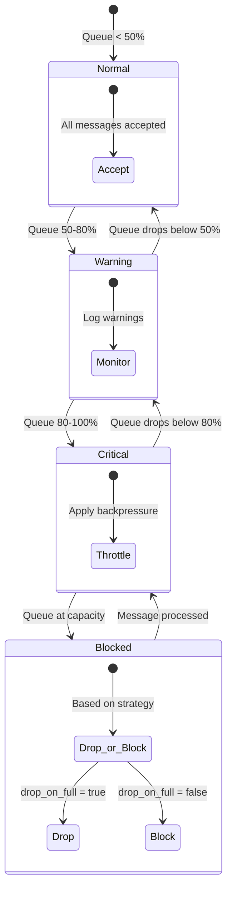
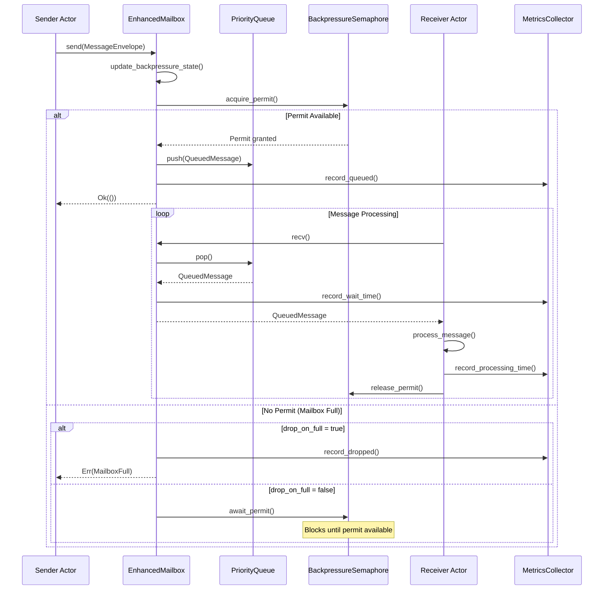

# Enhanced Mailbox Deep Dive - Comprehensive Educational Guide

> **🎯 Purpose**: In-depth exploration of the Enhanced Mailbox system, the sophisticated message queuing infrastructure that powers all actor communication in Alys V2

## Table of Contents

1. [Enhanced Mailbox Architecture](#enhanced-mailbox-architecture)
2. [Priority Queue System](#priority-queue-system)
3. [Backpressure & Flow Control](#backpressure--flow-control)
4. [Message Lifecycle Management](#message-lifecycle-management)
5. [Request-Response Pattern](#request-response-pattern)
6. [Metrics & Observability](#metrics--observability)
7. [Configuration & Tuning](#configuration--tuning)
8. [Practical Examples](#practical-examples)

## Enhanced Mailbox Architecture

### Core Design Philosophy

The Enhanced Mailbox system provides a sophisticated message queuing infrastructure that goes far beyond simple FIFO queues. It's designed specifically for blockchain applications where:

- **Message priorities** determine processing order (consensus > bridge > network > background)
- **Backpressure control** prevents system overload during high-traffic periods
- **Request-response patterns** enable synchronous-like communication in async environments
- **Comprehensive metrics** provide deep insights into message processing performance



### Key Components Overview

#### 1. **EnhancedMailbox<M>** - The Core Container

```rust
pub struct EnhancedMailbox<M>
where
    M: AlysMessage + 'static,
{
    /// Mailbox configuration parameters
    config: MailboxConfig,
    
    /// Thread-safe priority queue for message storage
    queue: Arc<parking_lot::Mutex<PriorityQueue<M>>>,
    
    /// Semaphore for backpressure control
    backpressure_semaphore: Arc<Semaphore>,
    
    /// Performance metrics collection
    metrics: Arc<MailboxMetrics>,
    
    /// Atomic backpressure state tracking
    backpressure_state: Arc<std::sync::atomic::AtomicU8>,
    
    /// Internal message processing channels
    message_tx: mpsc::UnboundedSender<QueuedMessage<M>>,
    message_rx: Arc<parking_lot::Mutex<Option<mpsc::UnboundedReceiver<QueuedMessage<M>>>>>,
}
```

**Design Rationale:**
- **Generic over AlysMessage**: Type-safe message handling with compile-time guarantees
- **Arc<parking_lot::Mutex>**: High-performance shared mutable access
- **Semaphore-based flow control**: Prevents unbounded queue growth
- **Atomic state tracking**: Lock-free backpressure state updates
- **Channel-based processing**: Decoupled message queuing and processing

## Priority Queue System

### Three-Tier Priority Architecture

The priority queue system uses a sophisticated three-tier architecture optimized for blockchain message processing patterns:



### Priority Queue Implementation Details

```rust
impl<M> PriorityQueue<M>
where
    M: AlysMessage,
{
    /// Push message to appropriate queue based on priority
    pub fn push(&mut self, message: QueuedMessage<M>) {
        match message.envelope.metadata.priority {
            // High-priority messages go into binary heap for optimal ordering
            MessagePriority::Emergency | MessagePriority::Critical | MessagePriority::High => {
                self.high_priority.push(message);
            }
            // Normal priority uses FIFO for fair processing
            MessagePriority::Normal => {
                self.normal_priority.push_back(message);
            }
            // Low priority also uses FIFO but processed last
            MessagePriority::Low | MessagePriority::Background => {
                self.low_priority.push_back(message);
            }
        }
        self.total_count += 1;
    }

    /// Pop messages in strict priority order
    pub fn pop(&mut self) -> Option<QueuedMessage<M>> {
        // 1. Process high-priority messages first (consensus, critical operations)
        if let Some(message) = self.high_priority.pop() {
            self.total_count -= 1;
            return Some(message);
        }

        // 2. Process normal priority messages (regular operations)
        if let Some(message) = self.normal_priority.pop_front() {
            self.total_count -= 1;
            return Some(message);
        }

        // 3. Process low priority messages last (background tasks)
        if let Some(message) = self.low_priority.pop_front() {
            self.total_count -= 1;
            return Some(message);
        }

        None
    }
}
```

### QueuedMessage Ordering Logic

The `QueuedMessage` wrapper implements sophisticated ordering logic for high-priority messages:

```rust
impl<M> Ord for QueuedMessage<M>
where
    M: AlysMessage,
{
    fn cmp(&self, other: &Self) -> std::cmp::Ordering {
        // Primary sort: Higher priority messages come first
        match self.envelope.metadata.priority.cmp(&other.envelope.metadata.priority) {
            std::cmp::Ordering::Equal => {
                // Secondary sort: Older messages come first (FIFO within same priority)
                other.queued_at.cmp(&self.queued_at)
            }
            other => other,
        }
    }
}
```

This ensures:
1. **Priority ordering**: Higher priority messages are always processed first
2. **FIFO within priority**: Messages of the same priority are processed in arrival order
3. **Starvation prevention**: Lower priority queues will eventually be processed

## Backpressure & Flow Control

### Semaphore-Based Flow Control

The mailbox uses a semaphore-based approach for sophisticated flow control:



### Backpressure State Management

```rust
impl<M> EnhancedMailbox<M>
where
    M: AlysMessage + 'static,
{
    /// Update backpressure state based on current queue utilization
    fn update_backpressure_state(&self) {
        let current_size = self.len();
        let capacity = self.config.capacity;
        let threshold = (capacity as f64 * self.config.backpressure_threshold) as usize;

        let new_state = if current_size >= capacity {
            BackpressureState::Blocked        // 100% capacity - block or drop
        } else if current_size >= threshold {
            BackpressureState::Critical       // 80%+ capacity - apply backpressure
        } else if current_size >= capacity / 2 {
            BackpressureState::Warning        // 50%+ capacity - monitor closely
        } else {
            BackpressureState::Normal         // < 50% capacity - normal operation
        };

        self.backpressure_state.store(new_state as u8, Ordering::Relaxed);
    }
    
    /// Send message with backpressure handling
    pub async fn send(&self, envelope: MessageEnvelope<M>) -> ActorResult<()> {
        // Check current backpressure state
        self.update_backpressure_state();
        
        let current_state = BackpressureState::from(
            self.backpressure_state.load(Ordering::Relaxed)
        );

        match current_state {
            BackpressureState::Blocked => {
                if self.config.drop_on_full {
                    // Drop strategy: reject message and record drop
                    warn!("Mailbox full, dropping message");
                    self.metrics.messages_dropped.fetch_add(1, Ordering::Relaxed);
                    return Err(ActorError::MailboxFull {
                        actor_name: "mailbox".to_string(),
                        current_size: self.len(),
                        max_size: self.config.capacity,
                    });
                }
                // Block strategy: will wait for semaphore permit below
            }
            BackpressureState::Critical => {
                warn!("Mailbox at critical capacity, applying backpressure");
            }
            BackpressureState::Warning => {
                debug!("Mailbox approaching capacity threshold");
            }
            BackpressureState::Normal => {}
        }

        // Acquire semaphore permit (blocks if no permits available)
        let _permit = self.backpressure_semaphore.acquire().await
            .map_err(|_| ActorError::MailboxFull {
                actor_name: "mailbox".to_string(),
                current_size: self.len(),
                max_size: self.config.capacity,
            })?;

        // Message accepted - add to queue
        let queued_message = QueuedMessage {
            envelope,
            queued_at: SystemTime::now(),
            message_id: Uuid::new_v4(),
            response_tx: None,
        };

        {
            let mut queue = self.queue.lock();
            queue.push(queued_message);
        }

        // Update metrics
        self.metrics.messages_queued.fetch_add(1, Ordering::Relaxed);
        self.metrics.current_size.store(self.len(), Ordering::Relaxed);

        Ok(())
    }
}
```

### Flow Control Benefits

1. **Memory Protection**: Prevents unbounded queue growth that could cause OOM
2. **Performance Stability**: Maintains predictable performance under load
3. **Graceful Degradation**: Multiple strategies for handling overload conditions
4. **Priority Preservation**: High-priority messages can still be processed during backpressure

## Message Lifecycle Management

### Complete Message Journey



### QueuedMessage Structure

The `QueuedMessage` wrapper provides comprehensive tracking for each message:

```rust
pub struct QueuedMessage<M>
where
    M: AlysMessage,
{
    /// Enhanced message envelope with full tracing context
    pub envelope: MessageEnvelope<M>,
    
    /// Timestamp when message entered queue
    pub queued_at: SystemTime,
    
    /// Unique identifier for message tracking
    pub message_id: Uuid,
    
    /// Optional response channel for request-response pattern
    pub response_tx: Option<oneshot::Sender<M::Result>>,
}
```

### Message Metadata Tracking

Each message carries rich metadata throughout its lifecycle:

```rust
// From MessageEnvelope (inherited)
pub struct MessageMetadata {
    pub created_at: SystemTime,              // When message was created
    pub priority: MessagePriority,           // Processing priority
    pub timeout: Duration,                   // Processing timeout
    pub correlation_id: Option<Uuid>,        // Request correlation
    pub trace_context: TraceContext,         // Distributed tracing
    pub performance: MessagePerformanceMetrics, // Timing metrics
    // ... other metadata fields
}

// Enhanced in QueuedMessage
impl<M> QueuedMessage<M> {
    /// Calculate total message latency from creation to processing
    pub fn total_latency(&self) -> Duration {
        self.queued_at.duration_since(self.envelope.metadata.created_at)
            .unwrap_or_default()
    }
    
    /// Calculate queue wait time
    pub fn queue_wait_time(&self) -> Duration {
        SystemTime::now().duration_since(self.queued_at)
            .unwrap_or_default()
    }
}
```

## Request-Response Pattern

### Synchronous-Style Communication in Async Environment

The Enhanced Mailbox provides built-in support for request-response messaging patterns:

```rust
impl<M> EnhancedMailbox<M>
where
    M: AlysMessage + 'static,
{
    /// Send message and wait for response with timeout
    pub async fn send_and_wait(&self, envelope: MessageEnvelope<M>) -> ActorResult<M::Result> {
        // Create response channel
        let (tx, rx) = oneshot::channel();

        let queued_message = QueuedMessage {
            envelope,
            queued_at: SystemTime::now(),
            message_id: Uuid::new_v4(),
            response_tx: Some(tx), // Include response channel
        };

        // Send via internal channel (bypasses normal queuing for direct processing)
        self.message_tx.send(queued_message)
            .map_err(|_| ActorError::MessageDeliveryFailed {
                from: "mailbox".to_string(),
                to: "actor".to_string(),
                reason: "Channel closed".to_string(),
            })?;

        // Wait for response with configurable timeout
        let response = tokio::time::timeout(self.config.processing_timeout, rx).await
            .map_err(|_| ActorError::Timeout {
                operation: "message_processing".to_string(),
                timeout: self.config.processing_timeout,
            })?
            .map_err(|_| ActorError::MessageHandlingFailed {
                message_type: std::any::type_name::<M>().to_string(),
                reason: "Response channel closed".to_string(),
            })?;

        Ok(response)
    }
}
```

### Request-Response Usage Example

```rust
// Example: Synchronous-style blockchain query
pub async fn get_block_height(
    mailbox: &EnhancedMailbox<ChainMessage>
) -> ActorResult<u64> {
    let request = MessageEnvelope::new(ChainMessage::GetBlockHeight)
        .with_correlation_id(Uuid::new_v4())
        .start_trace();
    
    // This will block until response is received or timeout occurs
    let response = mailbox.send_and_wait(request).await?;
    
    match response {
        ChainResponse::BlockHeight { height } => Ok(height),
        _ => Err(ActorError::UnexpectedResponse {
            expected: "BlockHeight".to_string(),
            received: format!("{:?}", response),
        }),
    }
}
```

## Metrics & Observability

### Comprehensive Metrics Collection

The Enhanced Mailbox provides extensive metrics for monitoring and debugging:

```rust
/// Mailbox metrics with detailed tracking
pub struct MailboxMetrics {
    /// Total messages queued
    pub messages_queued: AtomicU64,
    
    /// Total messages processed successfully
    pub messages_processed: AtomicU64,
    
    /// Total messages dropped due to overflow
    pub messages_dropped: AtomicU64,
    
    /// Current queue size
    pub current_size: AtomicUsize,
    
    /// Maximum size reached during operation
    pub max_size_reached: AtomicUsize,
    
    /// Total cumulative wait time (nanoseconds)
    pub total_wait_time: AtomicU64,
    
    /// Sliding window of processing times
    pub processing_times: parking_lot::RwLock<Vec<Duration>>,
}

impl MailboxMetrics {
    /// Record message wait time in queue
    pub fn record_wait_time(&self, wait_time: Duration) {
        self.total_wait_time.fetch_add(wait_time.as_nanos() as u64, Ordering::Relaxed);
    }

    /// Record message processing time
    pub fn record_processing_time(&self, processing_time: Duration) {
        let mut times = self.processing_times.write();
        times.push(processing_time);
        
        // Maintain sliding window (keep only recent 1000 measurements)
        if times.len() > 1000 {
            times.drain(..500); // Remove oldest 500 measurements
        }
    }

    /// Calculate average wait time across all processed messages
    pub fn average_wait_time(&self) -> Duration {
        let total_wait = self.total_wait_time.load(Ordering::Relaxed);
        let processed = self.messages_processed.load(Ordering::Relaxed);
        
        if processed > 0 {
            Duration::from_nanos(total_wait / processed)
        } else {
            Duration::ZERO
        }
    }

    /// Calculate current queue utilization percentage
    pub fn queue_utilization(&self, max_capacity: usize) -> f64 {
        let current = self.current_size.load(Ordering::Relaxed) as f64;
        let max = max_capacity as f64;
        if max > 0.0 { current / max } else { 0.0 }
    }
    
    /// Get priority distribution statistics
    pub fn priority_distribution(&self, mailbox: &EnhancedMailbox<impl AlysMessage>) -> PriorityStats {
        let (high, normal, low) = mailbox.priority_distribution();
        PriorityStats {
            high_priority_count: high,
            normal_priority_count: normal,
            low_priority_count: low,
            total_count: high + normal + low,
        }
    }
}

/// Priority distribution statistics
pub struct PriorityStats {
    pub high_priority_count: usize,
    pub normal_priority_count: usize,
    pub low_priority_count: usize,
    pub total_count: usize,
}

impl PriorityStats {
    /// Calculate percentage distribution
    pub fn percentages(&self) -> (f64, f64, f64) {
        if self.total_count == 0 {
            return (0.0, 0.0, 0.0);
        }
        
        let total = self.total_count as f64;
        (
            (self.high_priority_count as f64 / total) * 100.0,
            (self.normal_priority_count as f64 / total) * 100.0,
            (self.low_priority_count as f64 / total) * 100.0,
        )
    }
}
```

### Prometheus Integration

```rust
// Example Prometheus metrics export
impl MailboxMetrics {
    pub fn prometheus_metrics(&self, actor_name: &str, max_capacity: usize) -> String {
        format!(
            r#"
            # HELP mailbox_messages_queued_total Total messages queued
            # TYPE mailbox_messages_queued_total counter
            mailbox_messages_queued_total{{actor="{}"}} {}
            
            # HELP mailbox_messages_processed_total Total messages processed
            # TYPE mailbox_messages_processed_total counter
            mailbox_messages_processed_total{{actor="{}"}} {}
            
            # HELP mailbox_messages_dropped_total Total messages dropped
            # TYPE mailbox_messages_dropped_total counter
            mailbox_messages_dropped_total{{actor="{}"}} {}
            
            # HELP mailbox_queue_size Current queue size
            # TYPE mailbox_queue_size gauge
            mailbox_queue_size{{actor="{}"}} {}
            
            # HELP mailbox_queue_utilization Queue utilization percentage
            # TYPE mailbox_queue_utilization gauge
            mailbox_queue_utilization{{actor="{}"}} {:.2}
            
            # HELP mailbox_average_wait_time_seconds Average message wait time
            # TYPE mailbox_average_wait_time_seconds gauge
            mailbox_average_wait_time_seconds{{actor="{}"}} {:.6}
            "#,
            actor_name, self.messages_queued.load(Ordering::Relaxed),
            actor_name, self.messages_processed.load(Ordering::Relaxed),
            actor_name, self.messages_dropped.load(Ordering::Relaxed),
            actor_name, self.current_size.load(Ordering::Relaxed),
            actor_name, self.queue_utilization(max_capacity),
            actor_name, self.average_wait_time().as_secs_f64(),
        )
    }
}
```

## Configuration & Tuning

### MailboxConfig Parameters

```rust
/// Comprehensive mailbox configuration
#[derive(Debug, Clone, Serialize, Deserialize)]
pub struct MailboxConfig {
    /// Maximum number of messages in mailbox
    /// - Blockchain consensus actors: 500-1000 (low latency required)
    /// - Bridge actors: 2000-5000 (higher throughput)
    /// - Background actors: 10000+ (can tolerate larger queues)
    pub capacity: usize,
    
    /// Enable priority queue for messages
    /// - True for all actors in production (priority is essential)
    /// - False only for testing/debugging scenarios
    pub enable_priority: bool,
    
    /// Maximum processing time per message before timeout
    /// - Consensus messages: 100ms (strict timing requirements)
    /// - Bridge messages: 5s (may involve network calls)
    /// - Background messages: 30s+ (less time-sensitive)
    pub processing_timeout: Duration,
    
    /// Backpressure threshold (percentage of capacity)
    /// - 0.8 (80%) recommended for most actors
    /// - 0.9 (90%) for actors with predictable load
    /// - 0.7 (70%) for actors with bursty traffic
    pub backpressure_threshold: f64,
    
    /// Drop old messages when full instead of blocking
    /// - True for background actors (acceptable to drop)
    /// - False for consensus actors (must process all messages)
    pub drop_on_full: bool,
    
    /// Metrics collection interval
    /// - 1s for high-frequency actors
    /// - 10s for normal actors
    /// - 60s for background actors
    pub metrics_interval: Duration,
}
```

### Actor-Specific Configurations

```rust
/// Mailbox manager for different actor types
impl MailboxManager {
    /// Create manager with blockchain-optimized configurations
    pub fn blockchain_optimized() -> Self {
        let mut manager = MailboxManager::new();
        
        // Consensus actors - ultra-low latency, no drops allowed
        manager.add_config("chain_actor".to_string(), MailboxConfig {
            capacity: 1000,
            enable_priority: true,
            processing_timeout: Duration::from_millis(100),
            backpressure_threshold: 0.7,
            drop_on_full: false,  // Never drop consensus messages
            metrics_interval: Duration::from_secs(1),
        });
        
        // Bridge actors - higher throughput, some drops acceptable
        manager.add_config("bridge_actor".to_string(), MailboxConfig {
            capacity: 5000,
            enable_priority: true,
            processing_timeout: Duration::from_secs(5),
            backpressure_threshold: 0.8,
            drop_on_full: true,   // Can drop low-priority bridge messages
            metrics_interval: Duration::from_secs(5),
        });
        
        // Background actors - large buffers, drops encouraged
        manager.add_config("storage_actor".to_string(), MailboxConfig {
            capacity: 20000,
            enable_priority: true,
            processing_timeout: Duration::from_secs(30),
            backpressure_threshold: 0.9,
            drop_on_full: true,   // Drop background tasks under pressure
            metrics_interval: Duration::from_secs(10),
        });
        
        manager
    }
}
```

### Performance Tuning Guidelines

#### For Consensus Actors (ChainActor, EngineActor)
```rust
MailboxConfig {
    capacity: 500,                           // Small queue for low latency
    processing_timeout: Duration::from_millis(50), // Tight timing requirements
    backpressure_threshold: 0.6,            // Early backpressure warning
    drop_on_full: false,                     // Never drop consensus messages
    metrics_interval: Duration::from_secs(1), // High-frequency monitoring
}
```

#### For Bridge Actors (BridgeActor, StreamActor)
```rust
MailboxConfig {
    capacity: 2000,                          // Medium queue for throughput
    processing_timeout: Duration::from_secs(2), // Allow for network operations
    backpressure_threshold: 0.8,            // Standard backpressure threshold
    drop_on_full: true,                      // Can drop non-critical bridge messages
    metrics_interval: Duration::from_secs(5), // Regular monitoring
}
```

#### For Background Actors (StorageActor, MetricsActor)
```rust
MailboxConfig {
    capacity: 10000,                         // Large queue for batch processing
    processing_timeout: Duration::from_secs(60), // Relaxed timing
    backpressure_threshold: 0.95,           // Very high threshold
    drop_on_full: true,                      // Actively drop under pressure
    metrics_interval: Duration::from_secs(30), // Infrequent monitoring
}
```

## Practical Examples

### Example 1: High-Throughput Message Processing

```rust
use crate::mailbox::{EnhancedMailbox, MailboxConfig};
use crate::message::{MessageEnvelope, MessagePriority};
use std::time::Duration;

// Configure mailbox for high-throughput scenario
let config = MailboxConfig {
    capacity: 10000,
    enable_priority: true,
    processing_timeout: Duration::from_secs(1),
    backpressure_threshold: 0.85,
    drop_on_full: false,
    metrics_interval: Duration::from_secs(5),
};

let mailbox = EnhancedMailbox::new(config);

// Send messages with different priorities
for i in 0..1000 {
    let priority = match i % 10 {
        0..=1 => MessagePriority::Critical,   // 20% critical
        2..=5 => MessagePriority::Normal,     // 40% normal  
        _ => MessagePriority::Low,            // 40% low priority
    };
    
    let envelope = MessageEnvelope::new(ProcessingMessage { id: i })
        .priority(priority)
        .with_correlation_id(Uuid::new_v4());
    
    if let Err(e) = mailbox.send(envelope).await {
        eprintln!("Failed to send message {}: {:?}", i, e);
        break;
    }
}

// Monitor mailbox performance
let metrics = mailbox.metrics();
println!("Queue utilization: {:.2}%", 
    metrics.queue_utilization(config.capacity) * 100.0);
println!("Average wait time: {:?}", metrics.average_wait_time());
println!("Priority distribution: {:?}", mailbox.priority_distribution());
```

### Example 2: Request-Response with Timeout

```rust
// Implement request-response pattern for blockchain queries
pub struct BlockchainQueryService {
    chain_mailbox: EnhancedMailbox<ChainMessage>,
}

impl BlockchainQueryService {
    pub async fn get_block_by_height(&self, height: u64) -> ActorResult<Block> {
        let request = MessageEnvelope::new(ChainMessage::GetBlock { height })
            .priority(MessagePriority::High)
            .timeout(Duration::from_secs(5))
            .start_trace();
        
        // Send request and wait for response
        let response = self.chain_mailbox.send_and_wait(request).await?;
        
        match response {
            ChainResponse::Block { block } => Ok(block),
            ChainResponse::BlockNotFound => Err(ActorError::NotFound {
                resource: format!("block_{}", height),
                reason: "Block does not exist".to_string(),
            }),
            _ => Err(ActorError::UnexpectedResponse {
                expected: "Block or BlockNotFound".to_string(),
                received: format!("{:?}", response),
            }),
        }
    }
    
    pub async fn get_balance(&self, address: &str) -> ActorResult<u64> {
        let request = MessageEnvelope::new(ChainMessage::GetBalance {
            address: address.to_string(),
        })
            .priority(MessagePriority::Normal)
            .timeout(Duration::from_secs(3));
        
        // This will automatically handle timeout and retries
        let response = self.chain_mailbox.send_and_wait(request).await?;
        
        match response {
            ChainResponse::Balance { amount } => Ok(amount),
            _ => Err(ActorError::UnexpectedResponse {
                expected: "Balance".to_string(),
                received: format!("{:?}", response),
            }),
        }
    }
}
```

### Example 3: Advanced Flow Control

```rust
// Implement smart load balancing with multiple mailboxes
pub struct LoadBalancedMailboxPool<M>
where
    M: AlysMessage + 'static,
{
    mailboxes: Vec<EnhancedMailbox<M>>,
    current_index: AtomicUsize,
    load_balancing_strategy: LoadBalanceStrategy,
}

impl<M> LoadBalancedMailboxPool<M>
where
    M: AlysMessage + 'static,
{
    pub fn new(pool_size: usize, base_config: MailboxConfig) -> Self {
        let mut mailboxes = Vec::with_capacity(pool_size);
        
        for i in 0..pool_size {
            // Customize configuration per mailbox
            let mut config = base_config.clone();
            config.capacity = base_config.capacity / pool_size;
            
            mailboxes.push(EnhancedMailbox::new(config));
        }
        
        Self {
            mailboxes,
            current_index: AtomicUsize::new(0),
            load_balancing_strategy: LoadBalanceStrategy::LeastLoaded,
        }
    }
    
    /// Select mailbox based on load balancing strategy
    pub async fn send_balanced(&self, envelope: MessageEnvelope<M>) -> ActorResult<()> {
        let selected_mailbox = match self.load_balancing_strategy {
            LoadBalanceStrategy::RoundRobin => {
                let index = self.current_index.fetch_add(1, Ordering::SeqCst) % self.mailboxes.len();
                &self.mailboxes[index]
            }
            LoadBalanceStrategy::LeastLoaded => {
                // Find mailbox with lowest utilization
                self.mailboxes.iter()
                    .min_by_key(|mailbox| mailbox.len())
                    .unwrap()
            }
            LoadBalanceStrategy::PriorityAware => {
                // High-priority messages go to least loaded, others use round-robin
                if envelope.metadata.priority.is_urgent() {
                    self.mailboxes.iter()
                        .min_by_key(|mailbox| mailbox.len())
                        .unwrap()
                } else {
                    let index = self.current_index.fetch_add(1, Ordering::SeqCst) % self.mailboxes.len();
                    &self.mailboxes[index]
                }
            }
        };
        
        selected_mailbox.send(envelope).await
    }
    
    /// Get aggregate metrics across all mailboxes
    pub fn aggregate_metrics(&self) -> AggregateMailboxMetrics {
        let mut total_queued = 0u64;
        let mut total_processed = 0u64;
        let mut total_dropped = 0u64;
        let mut total_current_size = 0usize;
        
        for mailbox in &self.mailboxes {
            let metrics = mailbox.metrics();
            total_queued += metrics.messages_queued.load(Ordering::Relaxed);
            total_processed += metrics.messages_processed.load(Ordering::Relaxed);
            total_dropped += metrics.messages_dropped.load(Ordering::Relaxed);
            total_current_size += metrics.current_size.load(Ordering::Relaxed);
        }
        
        AggregateMailboxMetrics {
            total_queued,
            total_processed,
            total_dropped,
            total_current_size,
            pool_size: self.mailboxes.len(),
            average_utilization: total_current_size as f64 / self.mailboxes.len() as f64,
        }
    }
}

#[derive(Debug, Clone, Copy)]
pub enum LoadBalanceStrategy {
    RoundRobin,
    LeastLoaded,
    PriorityAware,
}

pub struct AggregateMailboxMetrics {
    pub total_queued: u64,
    pub total_processed: u64,
    pub total_dropped: u64,
    pub total_current_size: usize,
    pub pool_size: usize,
    pub average_utilization: f64,
}
```

## Summary

The Enhanced Mailbox system provides a sophisticated foundation for actor communication in the Alys V2 blockchain system. Key benefits include:

1. **Priority-Based Processing**: Ensures consensus-critical messages are processed first
2. **Sophisticated Flow Control**: Prevents system overload with multiple backpressure strategies
3. **Request-Response Pattern**: Enables synchronous-style communication in async environments
4. **Comprehensive Metrics**: Provides deep insights into message processing performance
5. **Configuration Flexibility**: Allows fine-tuning for different actor types and use cases
6. **Thread-Safe Design**: Supports high-concurrency scenarios with minimal contention

This architecture enables building robust, high-performance blockchain systems that can handle the demanding requirements of consensus operations, bridge communications, and background processing while maintaining system stability and observability.