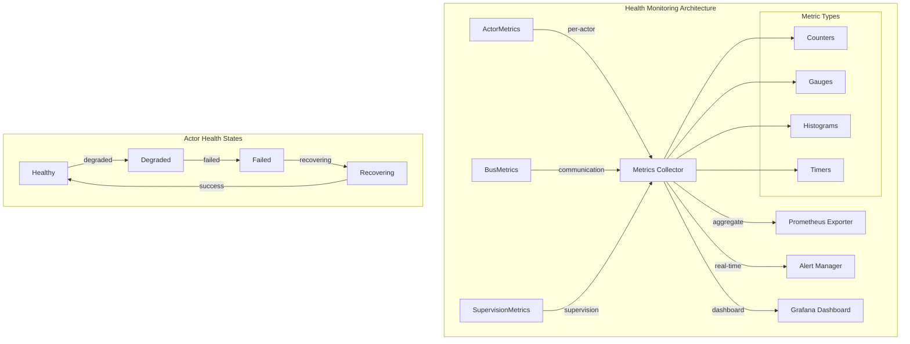

# Health Monitoring Deep Dive: Complete Guide to Alys V2 Observability System

> **🎯 Objective**: Master the comprehensive health monitoring and metrics collection system that provides production-ready observability for all Alys V2 blockchain actors

## Table of Contents

1. [Introduction & Architecture](#1-introduction--architecture)
2. [Core Metrics Components](#2-core-metrics-components)
3. [Actor Health Monitoring](#3-actor-health-monitoring)
4. [Performance Tracking](#4-performance-tracking)
5. [Prometheus Integration](#5-prometheus-integration)
6. [Alerting & Diagnostics](#6-alerting--diagnostics)
7. [Production Monitoring](#7-production-monitoring)
8. [Best Practices](#8-best-practices)

## 1. Introduction & Architecture

### What is Health Monitoring?

Health Monitoring in Alys V2 is a **comprehensive observability system** that tracks actor performance, system health, and operational metrics in real-time. It provides the foundation for production monitoring, alerting, and performance optimization across the entire blockchain infrastructure.



### Core Design Principles

1. **Zero-Overhead Monitoring**: Metrics collection uses atomic operations and lock-free structures
2. **Comprehensive Coverage**: Tracks message processing, lifecycle events, resource usage, and errors
3. **Production-Ready**: Native Prometheus integration with standardized metric naming
4. **Extensible Framework**: Custom counters and gauges for application-specific metrics
5. **Real-Time Alerting**: Configurable thresholds with automated alert generation

## 2. Core Metrics Components

### 2.1 ActorMetrics - Per-Actor Performance Tracking

The `ActorMetrics` struct (`crates/actor_system/src/metrics.rs:9-37`) provides comprehensive per-actor monitoring:

```rust
/// Actor performance metrics with zero-overhead collection
#[derive(Debug)]
pub struct ActorMetrics {
    /// Whether metrics collection is enabled (can be disabled for performance)
    enabled: bool,
    
    /// Message processing metrics
    pub messages_processed: AtomicU64,        // Total messages handled
    pub messages_failed: AtomicU64,           // Failed message processing
    pub message_processing_time: AtomicU64,   // Total processing time in nanoseconds
    pub mailbox_size: AtomicU64,              // Current mailbox depth
    
    /// Lifecycle metrics
    pub restarts: AtomicU64,                  // Total actor restarts
    pub state_transitions: AtomicU64,         // Lifecycle state changes
    pub last_activity: parking_lot::RwLock<SystemTime>,  // Most recent activity
    
    /// Performance metrics
    pub avg_response_time: parking_lot::RwLock<Duration>, // Rolling average response time
    pub peak_memory_usage: AtomicU64,         // Peak memory consumption
    pub cpu_time: AtomicU64,                  // Total CPU time in nanoseconds
    
    /// Error tracking with categorization
    pub error_counts: Arc<dashmap::DashMap<String, AtomicU64>>,
    
    /// Custom application metrics
    pub custom_counters: Arc<dashmap::DashMap<String, AtomicU64>>,
    pub custom_gauges: Arc<dashmap::DashMap<String, parking_lot::RwLock<f64>>>,
}
```

**Key Implementation Details:**

```rust
impl ActorMetrics {
    /// Record successful message processing with timing
    pub fn record_message_processed(&self, processing_time: Duration) {
        if !self.enabled {
            return;  // No-op when disabled
        }
        
        self.messages_processed.fetch_add(1, Ordering::Relaxed);
        self.message_processing_time.fetch_add(processing_time.as_nanos() as u64, Ordering::Relaxed);
        self.record_activity();
        
        // Update rolling average response time (lockless calculation)
        let total_messages = self.messages_processed.load(Ordering::Relaxed);
        if total_messages > 0 {
            let total_time_nanos = self.message_processing_time.load(Ordering::Relaxed);
            let avg_nanos = total_time_nanos / total_messages;
            *self.avg_response_time.write() = Duration::from_nanos(avg_nanos);
        }
    }
    
    /// Record message processing failure with error categorization
    pub fn record_message_failed(&self, error_type: &str) {
        if !self.enabled {
            return;
        }
        
        self.messages_failed.fetch_add(1, Ordering::Relaxed);
        
        // Categorize error for analysis
        self.error_counts
            .entry(error_type.to_string())
            .or_insert_with(|| AtomicU64::new(0))
            .fetch_add(1, Ordering::Relaxed);
        
        self.record_activity();
    }
    
    /// Record custom counter increment
    pub fn increment_counter(&self, counter_name: &str, value: u64) {
        if !self.enabled {
            return;
        }
        
        self.custom_counters
            .entry(counter_name.to_string())
            .or_insert_with(|| AtomicU64::new(0))
            .fetch_add(value, Ordering::Relaxed);
    }
    
    /// Set custom gauge value
    pub fn set_gauge(&self, gauge_name: &str, value: f64) {
        if !self.enabled {
            return;
        }
        
        let gauge = self.custom_gauges
            .entry(gauge_name.to_string())
            .or_insert_with(|| parking_lot::RwLock::new(0.0));
        
        *gauge.write() = value;
    }
    
    /// Get current health score (0.0 = unhealthy, 1.0 = perfect health)
    pub fn health_score(&self) -> f64 {
        if !self.enabled {
            return 1.0;  // Assume healthy when monitoring disabled
        }
        
        let total_messages = self.messages_processed.load(Ordering::Relaxed);
        let failed_messages = self.messages_failed.load(Ordering::Relaxed);
        
        if total_messages == 0 {
            return 1.0;  // No activity yet
        }
        
        let success_rate = (total_messages - failed_messages) as f64 / total_messages as f64;
        let avg_response_time = self.avg_response_time.read().as_millis();
        
        // Calculate composite health score
        let response_time_penalty = match avg_response_time {
            0..=10 => 1.0,      // Excellent response time
            11..=50 => 0.9,     // Good response time
            51..=100 => 0.8,    // Acceptable response time
            101..=500 => 0.6,   // Slow response time
            _ => 0.4,           // Very slow response time
        };
        
        success_rate * response_time_penalty
    }
    
    /// Check if actor is considered healthy
    pub fn is_healthy(&self) -> bool {
        self.health_score() >= 0.8
    }
    
    /// Record activity timestamp
    fn record_activity(&self) {
        *self.last_activity.write() = SystemTime::now();
    }
}
```

### 2.2 BusMetrics - Communication Performance

The `BusMetrics` struct (`crates/actor_system/src/bus.rs:74-100`) tracks communication bus performance:

```rust
/// Communication bus performance metrics
#[derive(Debug, Default)]
pub struct BusMetrics {
    /// Total messages published to all topics
    pub messages_published: AtomicU64,
    
    /// Total successful message deliveries
    pub messages_delivered: AtomicU64,
    
    /// Failed delivery attempts
    pub delivery_failures: AtomicU64,
    
    /// Current active subscriptions
    pub active_subscriptions: AtomicU64,
    
    /// Total number of topics
    pub total_topics: AtomicU64,
    
    /// Total message processing time (nanoseconds)
    pub processing_time: AtomicU64,
}

impl BusMetrics {
    /// Calculate key performance indicators
    pub fn delivery_success_rate(&self) -> f64 {
        let delivered = self.messages_delivered.load(Ordering::Relaxed) as f64;
        let failed = self.delivery_failures.load(Ordering::Relaxed) as f64;
        let total = delivered + failed;
        
        if total > 0.0 {
            delivered / total
        } else {
            1.0  // Perfect rate when no messages processed
        }
    }
    
    pub fn average_processing_time(&self) -> Duration {
        let total_messages = self.messages_published.load(Ordering::Relaxed);
        if total_messages > 0 {
            let total_time_nanos = self.processing_time.load(Ordering::Relaxed);
            Duration::from_nanos(total_time_nanos / total_messages)
        } else {
            Duration::ZERO
        }
    }
    
    pub fn messages_per_topic(&self) -> f64 {
        let total_messages = self.messages_published.load(Ordering::Relaxed) as f64;
        let total_topics = self.total_topics.load(Ordering::Relaxed) as f64;
        
        if total_topics > 0.0 {
            total_messages / total_topics
        } else {
            0.0
        }
    }
}
```

### 2.3 SupervisionMetrics - Fault Tolerance Tracking

Supervision tree health metrics from the [Supervisor Deep Dive](./supervisor_deep_dive.md):

```rust
/// Supervision tree health and performance metrics
#[derive(Debug, Default, Clone, Serialize, Deserialize)]
pub struct SupervisionMetrics {
    /// Total number of child actors being supervised
    pub total_children: usize,
    
    /// Number of currently healthy children
    pub healthy_children: usize,
    
    /// Cumulative restart operations performed
    pub total_restarts: u64,
    
    /// Number of failures escalated to parent
    pub escalations: u64,
    
    /// Total uptime of this supervision tree
    pub uptime: Duration,
    
    /// Timestamp of most recent health check
    pub last_health_check: Option<SystemTime>,
}

impl SupervisionMetrics {
    /// Calculate supervision tree health ratio
    pub fn health_ratio(&self) -> f64 {
        if self.total_children > 0 {
            self.healthy_children as f64 / self.total_children as f64
        } else {
            1.0
        }
    }
    
    /// Calculate restart rate per hour
    pub fn restart_rate_per_hour(&self) -> f64 {
        if self.uptime.as_secs() > 0 {
            let hours = self.uptime.as_secs() as f64 / 3600.0;
            self.total_restarts as f64 / hours
        } else {
            0.0
        }
    }
    
    /// Check if supervision tree is considered healthy
    pub fn is_healthy(&self) -> bool {
        self.health_ratio() >= 0.8 && self.restart_rate_per_hour() < 10.0
    }
}
```

## 3. Actor Health Monitoring

### 3.1 Health Check Framework

The health check system provides configurable actor health monitoring:

```rust
/// Health check configuration per actor type
#[derive(Debug, Clone, Serialize, Deserialize)]
pub struct HealthCheckConfig {
    /// Health check interval
    pub interval: Duration,
    
    /// Health check timeout
    pub timeout: Duration,
    
    /// Number of consecutive failures before marking unhealthy
    pub failure_threshold: u32,
    
    /// Number of consecutive successes before marking healthy
    pub recovery_threshold: u32,
    
    /// Enable automatic health checks
    pub enabled: bool,
    
    /// Custom health check parameters
    pub custom_params: HashMap<String, serde_json::Value>,
}

impl Default for HealthCheckConfig {
    fn default() -> Self {
        Self {
            interval: Duration::from_secs(30),
            timeout: Duration::from_secs(5),
            failure_threshold: 3,
            recovery_threshold: 2,
            enabled: true,
            custom_params: HashMap::new(),
        }
    }
}

/// Health check status and details
#[derive(Debug, Clone, Serialize, Deserialize)]
pub struct HealthStatus {
    /// Overall health state
    pub state: HealthState,
    
    /// Health score (0.0 - 1.0)
    pub score: f64,
    
    /// Last health check timestamp
    pub last_check: SystemTime,
    
    /// Health check latency
    pub check_latency: Duration,
    
    /// Consecutive failure count
    pub consecutive_failures: u32,
    
    /// Consecutive success count
    pub consecutive_successes: u32,
    
    /// Detailed health information
    pub details: HealthDetails,
    
    /// Health trends over time
    pub trends: HealthTrends,
}

/// Detailed health state enumeration
#[derive(Debug, Clone, Copy, PartialEq, Eq, Serialize, Deserialize)]
pub enum HealthState {
    /// Actor is operating normally
    Healthy,
    
    /// Actor is operating but with degraded performance
    Degraded,
    
    /// Actor is experiencing issues but still functional
    Warning,
    
    /// Actor has failed health checks
    Unhealthy,
    
    /// Actor is not responding to health checks
    Unresponsive,
    
    /// Health check is in progress
    Checking,
    
    /// Health status is unknown (e.g., just started)
    Unknown,
}

/// Comprehensive health details
#[derive(Debug, Clone, Serialize, Deserialize)]
pub struct HealthDetails {
    /// Performance metrics summary
    pub performance: PerformanceSummary,
    
    /// Resource utilization
    pub resources: ResourceUtilization,
    
    /// Error information
    pub errors: ErrorSummary,
    
    /// Dependencies status
    pub dependencies: Vec<DependencyHealth>,
    
    /// Custom health indicators
    pub custom_indicators: HashMap<String, serde_json::Value>,
}

/// Performance metrics summary for health reporting
#[derive(Debug, Clone, Serialize, Deserialize)]
pub struct PerformanceSummary {
    /// Average response time
    pub avg_response_time: Duration,
    
    /// 95th percentile response time
    pub p95_response_time: Duration,
    
    /// Message processing rate (messages/second)
    pub processing_rate: f64,
    
    /// Success rate (0.0 - 1.0)
    pub success_rate: f64,
    
    /// Queue depth
    pub queue_depth: usize,
}
```

### 3.2 Health Check Implementation

```rust
/// Health check manager for actor system
pub struct HealthCheckManager {
    /// Health check configurations per actor type
    configs: HashMap<String, HealthCheckConfig>,
    
    /// Current health status for all monitored actors
    health_status: Arc<RwLock<HashMap<String, HealthStatus>>>,
    
    /// Health check scheduler
    scheduler: Arc<HealthCheckScheduler>,
    
    /// Health event subscribers
    subscribers: Vec<Recipient<HealthEvent>>,
}

impl HealthCheckManager {
    /// Perform comprehensive health check on actor
    pub async fn check_actor_health(&self, actor_name: &str, metrics: &ActorMetrics) -> HealthStatus {
        let start_time = SystemTime::now();
        let config = self.configs.get(actor_name)
            .unwrap_or(&HealthCheckConfig::default());
        
        // Gather health information
        let performance = self.assess_performance(metrics);
        let resources = self.assess_resources(actor_name, metrics).await;
        let errors = self.assess_errors(metrics);
        let dependencies = self.check_dependencies(actor_name).await;
        
        // Calculate overall health score
        let health_score = self.calculate_health_score(&performance, &resources, &errors);
        
        // Determine health state
        let health_state = self.determine_health_state(health_score, &errors);
        
        let check_latency = start_time.elapsed().unwrap_or_default();
        
        // Update health status
        let health_status = HealthStatus {
            state: health_state,
            score: health_score,
            last_check: start_time,
            check_latency,
            consecutive_failures: 0, // TODO: Track from previous status
            consecutive_successes: 0, // TODO: Track from previous status
            details: HealthDetails {
                performance,
                resources,
                errors,
                dependencies,
                custom_indicators: HashMap::new(),
            },
            trends: self.calculate_health_trends(actor_name, health_score).await,
        };
        
        // Store updated status
        {
            let mut status_map = self.health_status.write().await;
            status_map.insert(actor_name.to_string(), health_status.clone());
        }
        
        // Notify subscribers of health changes
        if health_state != HealthState::Healthy {
            self.notify_health_change(actor_name, &health_status).await;
        }
        
        health_status
    }
    
    /// Assess actor performance metrics
    fn assess_performance(&self, metrics: &ActorMetrics) -> PerformanceSummary {
        let total_messages = metrics.messages_processed.load(Ordering::Relaxed);
        let failed_messages = metrics.messages_failed.load(Ordering::Relaxed);
        let success_rate = if total_messages > 0 {
            (total_messages - failed_messages) as f64 / total_messages as f64
        } else {
            1.0
        };
        
        PerformanceSummary {
            avg_response_time: *metrics.avg_response_time.read(),
            p95_response_time: self.calculate_p95_response_time(metrics),
            processing_rate: self.calculate_processing_rate(metrics),
            success_rate,
            queue_depth: metrics.mailbox_size.load(Ordering::Relaxed) as usize,
        }
    }
    
    /// Assess resource utilization
    async fn assess_resources(&self, actor_name: &str, metrics: &ActorMetrics) -> ResourceUtilization {
        ResourceUtilization {
            memory_usage: metrics.peak_memory_usage.load(Ordering::Relaxed) as f64,
            cpu_usage: self.calculate_cpu_usage(metrics),
            network_io: self.get_network_io(actor_name).await,
            disk_io: self.get_disk_io(actor_name).await,
            file_descriptors: self.get_file_descriptor_count(actor_name).await,
        }
    }
    
    /// Calculate composite health score
    fn calculate_health_score(
        &self,
        performance: &PerformanceSummary,
        resources: &ResourceUtilization,
        errors: &ErrorSummary,
    ) -> f64 {
        // Performance score (40% weight)
        let perf_score = self.score_performance(performance);
        
        // Resource score (30% weight)
        let resource_score = self.score_resources(resources);
        
        // Error score (30% weight)
        let error_score = self.score_errors(errors);
        
        // Weighted average
        (perf_score * 0.4) + (resource_score * 0.3) + (error_score * 0.3)
    }
    
    /// Score performance metrics
    fn score_performance(&self, performance: &PerformanceSummary) -> f64 {
        let response_score = match performance.avg_response_time.as_millis() {
            0..=10 => 1.0,
            11..=50 => 0.9,
            51..=100 => 0.8,
            101..=500 => 0.6,
            501..=1000 => 0.4,
            _ => 0.2,
        };
        
        let success_score = performance.success_rate;
        
        let queue_score = match performance.queue_depth {
            0..=10 => 1.0,
            11..=50 => 0.9,
            51..=100 => 0.8,
            101..=500 => 0.6,
            501..=1000 => 0.4,
            _ => 0.2,
        };
        
        (response_score + success_score + queue_score) / 3.0
    }
}
```

## 4. Performance Tracking

### 4.1 Real-Time Performance Monitoring

```rust
/// Performance monitoring with real-time tracking
pub struct PerformanceMonitor {
    /// Sliding window metrics
    sliding_windows: HashMap<String, SlidingWindowMetrics>,
    
    /// Performance thresholds
    thresholds: PerformanceThresholds,
    
    /// Alert manager for threshold violations
    alert_manager: Arc<AlertManager>,
}

/// Sliding window metrics for trend analysis
pub struct SlidingWindowMetrics {
    /// Window duration
    window_duration: Duration,
    
    /// Response time samples
    response_times: VecDeque<(SystemTime, Duration)>,
    
    /// Throughput samples (messages per interval)
    throughput_samples: VecDeque<(SystemTime, u64)>,
    
    /// Error rate samples
    error_rates: VecDeque<(SystemTime, f64)>,
    
    /// Memory usage samples
    memory_samples: VecDeque<(SystemTime, u64)>,
}

impl SlidingWindowMetrics {
    /// Add new performance sample
    pub fn add_sample(&mut self, response_time: Duration, throughput: u64, error_rate: f64, memory_usage: u64) {
        let now = SystemTime::now();
        
        // Add samples
        self.response_times.push_back((now, response_time));
        self.throughput_samples.push_back((now, throughput));
        self.error_rates.push_back((now, error_rate));
        self.memory_samples.push_back((now, memory_usage));
        
        // Remove old samples outside window
        let cutoff = now.checked_sub(self.window_duration).unwrap_or(now);
        
        while let Some((timestamp, _)) = self.response_times.front() {
            if *timestamp < cutoff {
                self.response_times.pop_front();
            } else {
                break;
            }
        }
        
        // Similar cleanup for other metrics...
    }
    
    /// Calculate performance percentiles
    pub fn calculate_percentiles(&self) -> PerformancePercentiles {
        let mut response_times: Vec<Duration> = self.response_times.iter()
            .map(|(_, duration)| *duration)
            .collect();
        
        response_times.sort();
        
        PerformancePercentiles {
            p50: self.percentile(&response_times, 0.5),
            p90: self.percentile(&response_times, 0.9),
            p95: self.percentile(&response_times, 0.95),
            p99: self.percentile(&response_times, 0.99),
            min: response_times.first().copied().unwrap_or_default(),
            max: response_times.last().copied().unwrap_or_default(),
        }
    }
    
    /// Calculate throughput statistics
    pub fn throughput_stats(&self) -> ThroughputStats {
        if self.throughput_samples.is_empty() {
            return ThroughputStats::default();
        }
        
        let throughputs: Vec<u64> = self.throughput_samples.iter()
            .map(|(_, throughput)| *throughput)
            .collect();
        
        let sum: u64 = throughputs.iter().sum();
        let count = throughputs.len();
        let avg = sum as f64 / count as f64;
        
        let min = *throughputs.iter().min().unwrap_or(&0);
        let max = *throughputs.iter().max().unwrap_or(&0);
        
        ThroughputStats {
            average: avg,
            min: min as f64,
            max: max as f64,
            total: sum,
            samples: count,
        }
    }
    
    fn percentile(&self, sorted_values: &[Duration], percentile: f64) -> Duration {
        if sorted_values.is_empty() {
            return Duration::ZERO;
        }
        
        let index = ((sorted_values.len() as f64 - 1.0) * percentile) as usize;
        sorted_values.get(index).copied().unwrap_or_default()
    }
}
```

### 4.2 Performance Threshold Management

```rust
/// Performance thresholds for alerting
#[derive(Debug, Clone, Serialize, Deserialize)]
pub struct PerformanceThresholds {
    /// Response time thresholds
    pub response_time: ResponseTimeThresholds,
    
    /// Throughput thresholds
    pub throughput: ThroughputThresholds,
    
    /// Error rate thresholds
    pub error_rate: ErrorRateThresholds,
    
    /// Resource utilization thresholds
    pub resources: ResourceThresholds,
}

#[derive(Debug, Clone, Serialize, Deserialize)]
pub struct ResponseTimeThresholds {
    /// Warning threshold
    pub warning: Duration,
    
    /// Critical threshold  
    pub critical: Duration,
    
    /// P95 warning threshold
    pub p95_warning: Duration,
    
    /// P95 critical threshold
    pub p95_critical: Duration,
}

impl PerformanceMonitor {
    /// Check thresholds and generate alerts
    pub async fn check_thresholds(&self, actor_name: &str, metrics: &ActorMetrics) -> Vec<PerformanceAlert> {
        let mut alerts = Vec::new();
        
        // Check response time thresholds
        let avg_response_time = *metrics.avg_response_time.read();
        if avg_response_time > self.thresholds.response_time.critical {
            alerts.push(PerformanceAlert {
                alert_type: AlertType::ResponseTimeCritical,
                actor_name: actor_name.to_string(),
                metric_name: "avg_response_time".to_string(),
                current_value: avg_response_time.as_millis() as f64,
                threshold: self.thresholds.response_time.critical.as_millis() as f64,
                severity: AlertSeverity::Critical,
                timestamp: SystemTime::now(),
                description: format!(
                    "Average response time {}ms exceeds critical threshold of {}ms",
                    avg_response_time.as_millis(),
                    self.thresholds.response_time.critical.as_millis()
                ),
            });
        } else if avg_response_time > self.thresholds.response_time.warning {
            alerts.push(PerformanceAlert {
                alert_type: AlertType::ResponseTimeWarning,
                actor_name: actor_name.to_string(),
                metric_name: "avg_response_time".to_string(),
                current_value: avg_response_time.as_millis() as f64,
                threshold: self.thresholds.response_time.warning.as_millis() as f64,
                severity: AlertSeverity::Warning,
                timestamp: SystemTime::now(),
                description: format!(
                    "Average response time {}ms exceeds warning threshold of {}ms",
                    avg_response_time.as_millis(),
                    self.thresholds.response_time.warning.as_millis()
                ),
            });
        }
        
        // Check error rate thresholds
        let total_messages = metrics.messages_processed.load(Ordering::Relaxed);
        let failed_messages = metrics.messages_failed.load(Ordering::Relaxed);
        if total_messages > 0 {
            let error_rate = failed_messages as f64 / total_messages as f64;
            
            if error_rate > self.thresholds.error_rate.critical {
                alerts.push(PerformanceAlert {
                    alert_type: AlertType::ErrorRateCritical,
                    actor_name: actor_name.to_string(),
                    metric_name: "error_rate".to_string(),
                    current_value: error_rate * 100.0,
                    threshold: self.thresholds.error_rate.critical * 100.0,
                    severity: AlertSeverity::Critical,
                    timestamp: SystemTime::now(),
                    description: format!(
                        "Error rate {:.2}% exceeds critical threshold of {:.2}%",
                        error_rate * 100.0,
                        self.thresholds.error_rate.critical * 100.0
                    ),
                });
            }
        }
        
        // Send alerts to alert manager
        for alert in &alerts {
            self.alert_manager.send_alert(alert.clone()).await;
        }
        
        alerts
    }
}
```

## 5. Prometheus Integration

### 5.1 Native Prometheus Metrics Export

```rust
/// Prometheus metrics exporter for actor system
pub struct PrometheusExporter {
    /// Registry for all metrics
    registry: prometheus::Registry,
    
    /// Actor-specific metric families
    actor_metrics: ActorMetricFamilies,
    
    /// Bus-specific metric families
    bus_metrics: BusMetricFamilies,
    
    /// System-wide metric families
    system_metrics: SystemMetricFamilies,
}

/// Prometheus metric families for actors
pub struct ActorMetricFamilies {
    /// Messages processed counter
    pub messages_processed: prometheus::CounterVec,
    
    /// Message processing time histogram
    pub processing_time: prometheus::HistogramVec,
    
    /// Actor health gauge
    pub health_score: prometheus::GaugeVec,
    
    /// Mailbox size gauge
    pub mailbox_size: prometheus::GaugeVec,
    
    /// Error count by type
    pub error_counts: prometheus::CounterVec,
    
    /// Restart count
    pub restart_count: prometheus::CounterVec,
}

impl PrometheusExporter {
    /// Initialize Prometheus exporter with standard metrics
    pub fn new() -> ActorResult<Self> {
        let registry = prometheus::Registry::new();
        
        // Actor metrics
        let actor_metrics = ActorMetricFamilies {
            messages_processed: prometheus::CounterVec::new(
                prometheus::Opts::new(
                    "actor_messages_processed_total",
                    "Total number of messages processed by actor"
                ),
                &["actor_name", "actor_type", "message_type"]
            )?,
            
            processing_time: prometheus::HistogramVec::new(
                prometheus::HistogramOpts::new(
                    "actor_message_processing_seconds",
                    "Time spent processing messages"
                ).buckets(vec![0.001, 0.005, 0.01, 0.025, 0.05, 0.1, 0.25, 0.5, 1.0, 2.5, 5.0, 10.0]),
                &["actor_name", "actor_type", "message_type"]
            )?,
            
            health_score: prometheus::GaugeVec::new(
                prometheus::Opts::new(
                    "actor_health_score",
                    "Actor health score (0-1)"
                ),
                &["actor_name", "actor_type"]
            )?,
            
            mailbox_size: prometheus::GaugeVec::new(
                prometheus::Opts::new(
                    "actor_mailbox_size",
                    "Current number of messages in actor mailbox"
                ),
                &["actor_name", "actor_type"]
            )?,
            
            error_counts: prometheus::CounterVec::new(
                prometheus::Opts::new(
                    "actor_errors_total",
                    "Total number of errors by actor and error type"
                ),
                &["actor_name", "actor_type", "error_type"]
            )?,
            
            restart_count: prometheus::CounterVec::new(
                prometheus::Opts::new(
                    "actor_restarts_total",
                    "Total number of actor restarts"
                ),
                &["actor_name", "actor_type", "reason"]
            )?,
        };
        
        // Register all metrics
        registry.register(Box::new(actor_metrics.messages_processed.clone()))?;
        registry.register(Box::new(actor_metrics.processing_time.clone()))?;
        registry.register(Box::new(actor_metrics.health_score.clone()))?;
        registry.register(Box::new(actor_metrics.mailbox_size.clone()))?;
        registry.register(Box::new(actor_metrics.error_counts.clone()))?;
        registry.register(Box::new(actor_metrics.restart_count.clone()))?;
        
        // Initialize bus and system metrics similarly...
        
        Ok(Self {
            registry,
            actor_metrics,
            // bus_metrics,
            // system_metrics,
        })
    }
    
    /// Update actor metrics from ActorMetrics
    pub fn update_actor_metrics(&self, actor_name: &str, actor_type: &str, metrics: &ActorMetrics) {
        // Update health score
        self.actor_metrics.health_score
            .with_label_values(&[actor_name, actor_type])
            .set(metrics.health_score());
        
        // Update mailbox size
        self.actor_metrics.mailbox_size
            .with_label_values(&[actor_name, actor_type])
            .set(metrics.mailbox_size.load(Ordering::Relaxed) as f64);
        
        // Update error counts
        for error_entry in metrics.error_counts.iter() {
            let error_type = error_entry.key();
            let count = error_entry.value().load(Ordering::Relaxed);
            
            self.actor_metrics.error_counts
                .with_label_values(&[actor_name, actor_type, error_type])
                .set(count as f64);
        }
        
        // Update restart count
        self.actor_metrics.restart_count
            .with_label_values(&[actor_name, actor_type, "supervision"])
            .set(metrics.restarts.load(Ordering::Relaxed) as f64);
    }
    
    /// Export all metrics in Prometheus format
    pub fn export_metrics(&self) -> ActorResult<String> {
        let metric_families = self.registry.gather();
        let encoder = prometheus::TextEncoder::new();
        
        encoder.encode_to_string(&metric_families)
            .map_err(|e| ActorError::MetricsExportFailed {
                reason: e.to_string(),
            })
    }
    
    /// Serve metrics via HTTP endpoint
    pub async fn serve_metrics(&self, bind_address: &str) -> ActorResult<()> {
        use warp::Filter;
        
        let exporter = Arc::new(self);
        
        let metrics_route = warp::path("metrics")
            .map(move || {
                match exporter.export_metrics() {
                    Ok(metrics) => warp::reply::with_status(
                        metrics,
                        warp::http::StatusCode::OK,
                    ),
                    Err(e) => warp::reply::with_status(
                        format!("Error exporting metrics: {}", e),
                        warp::http::StatusCode::INTERNAL_SERVER_ERROR,
                    ),
                }
            });
        
        let health_route = warp::path("health")
            .map(|| warp::reply::with_status(
                "OK",
                warp::http::StatusCode::OK,
            ));
        
        let routes = metrics_route.or(health_route);
        
        info!("Starting Prometheus metrics server on {}", bind_address);
        
        warp::serve(routes)
            .run(bind_address.parse().map_err(|e| ActorError::InvalidAddress {
                address: bind_address.to_string(),
                reason: e.to_string(),
            })?)
            .await;
        
        Ok(())
    }
}
```

### 5.2 Custom Metrics Registration

```rust
/// Manager for custom application metrics
pub struct CustomMetricsManager {
    /// Prometheus registry
    registry: Arc<prometheus::Registry>,
    
    /// Custom counter families
    custom_counters: HashMap<String, prometheus::CounterVec>,
    
    /// Custom gauge families
    custom_gauges: HashMap<String, prometheus::GaugeVec>,
    
    /// Custom histogram families
    custom_histograms: HashMap<String, prometheus::HistogramVec>,
}

impl CustomMetricsManager {
    /// Register a custom counter metric
    pub fn register_counter(
        &mut self,
        name: &str,
        help: &str,
        labels: &[&str],
    ) -> ActorResult<prometheus::CounterVec> {
        let counter = prometheus::CounterVec::new(
            prometheus::Opts::new(name, help),
            labels,
        )?;
        
        self.registry.register(Box::new(counter.clone()))?;
        self.custom_counters.insert(name.to_string(), counter.clone());
        
        info!(
            metric_name = %name,
            metric_type = "counter",
            labels = ?labels,
            "Registered custom counter metric"
        );
        
        Ok(counter)
    }
    
    /// Register a custom gauge metric
    pub fn register_gauge(
        &mut self,
        name: &str,
        help: &str,
        labels: &[&str],
    ) -> ActorResult<prometheus::GaugeVec> {
        let gauge = prometheus::GaugeVec::new(
            prometheus::Opts::new(name, help),
            labels,
        )?;
        
        self.registry.register(Box::new(gauge.clone()))?;
        self.custom_gauges.insert(name.to_string(), gauge.clone());
        
        info!(
            metric_name = %name,
            metric_type = "gauge", 
            labels = ?labels,
            "Registered custom gauge metric"
        );
        
        Ok(gauge)
    }
    
    /// Register a custom histogram metric
    pub fn register_histogram(
        &mut self,
        name: &str,
        help: &str,
        labels: &[&str],
        buckets: Vec<f64>,
    ) -> ActorResult<prometheus::HistogramVec> {
        let histogram = prometheus::HistogramVec::new(
            prometheus::HistogramOpts::new(name, help).buckets(buckets),
            labels,
        )?;
        
        self.registry.register(Box::new(histogram.clone()))?;
        self.custom_histograms.insert(name.to_string(), histogram.clone());
        
        info!(
            metric_name = %name,
            metric_type = "histogram",
            labels = ?labels,
            "Registered custom histogram metric"
        );
        
        Ok(histogram)
    }
}

/// Example: Register blockchain-specific metrics
impl CustomMetricsManager {
    /// Register metrics specific to blockchain operations
    pub fn register_blockchain_metrics(&mut self) -> ActorResult<BlockchainMetrics> {
        let block_processing_time = self.register_histogram(
            "blockchain_block_processing_seconds",
            "Time spent processing blockchain blocks",
            &["block_type", "actor_name"],
            vec![0.01, 0.05, 0.1, 0.25, 0.5, 1.0, 2.5, 5.0, 10.0],
        )?;
        
        let peg_operations = self.register_counter(
            "blockchain_peg_operations_total",
            "Total number of peg operations processed",
            &["operation_type", "status", "actor_name"],
        )?;
        
        let federation_health = self.register_gauge(
            "blockchain_federation_health_score",
            "Federation health score (0-1)",
            &["federation_id"],
        )?;
        
        let consensus_participation = self.register_gauge(
            "blockchain_consensus_participation_rate",
            "Consensus participation rate (0-1)",
            &["actor_name"],
        )?;
        
        Ok(BlockchainMetrics {
            block_processing_time,
            peg_operations,
            federation_health,
            consensus_participation,
        })
    }
}

/// Blockchain-specific metrics collection
pub struct BlockchainMetrics {
    pub block_processing_time: prometheus::HistogramVec,
    pub peg_operations: prometheus::CounterVec,
    pub federation_health: prometheus::GaugeVec,
    pub consensus_participation: prometheus::GaugeVec,
}

impl BlockchainMetrics {
    /// Record block processing time
    pub fn record_block_processing(&self, block_type: &str, actor_name: &str, duration: Duration) {
        self.block_processing_time
            .with_label_values(&[block_type, actor_name])
            .observe(duration.as_secs_f64());
    }
    
    /// Record peg operation
    pub fn record_peg_operation(&self, operation_type: &str, status: &str, actor_name: &str) {
        self.peg_operations
            .with_label_values(&[operation_type, status, actor_name])
            .inc();
    }
    
    /// Update federation health score
    pub fn update_federation_health(&self, federation_id: &str, health_score: f64) {
        self.federation_health
            .with_label_values(&[federation_id])
            .set(health_score);
    }
}
```

## 6. Alerting & Diagnostics

### 6.1 Alert Management System

```rust
/// Comprehensive alert management for actor system
pub struct AlertManager {
    /// Alert configuration
    config: AlertConfig,
    
    /// Alert channels (email, Slack, webhook, etc.)
    channels: Vec<Box<dyn AlertChannel>>,
    
    /// Alert suppression rules
    suppression_rules: Vec<SuppressionRule>,
    
    /// Alert history for deduplication
    alert_history: Arc<RwLock<HashMap<String, AlertHistory>>>,
    
    /// Escalation policies
    escalation_policies: HashMap<AlertSeverity, EscalationPolicy>,
}

/// Alert configuration
#[derive(Debug, Clone, Serialize, Deserialize)]
pub struct AlertConfig {
    /// Enable alerting
    pub enabled: bool,
    
    /// Default alert channels
    pub default_channels: Vec<String>,
    
    /// Alert deduplication window
    pub deduplication_window: Duration,
    
    /// Maximum alerts per minute (rate limiting)
    pub max_alerts_per_minute: u32,
    
    /// Alert retention period
    pub retention_period: Duration,
}

/// Alert severity levels
#[derive(Debug, Clone, Copy, PartialEq, Eq, Hash, Serialize, Deserialize)]
pub enum AlertSeverity {
    Info,
    Warning,
    Error,
    Critical,
    Emergency,
}

/// Alert types for actor system
#[derive(Debug, Clone, Serialize, Deserialize)]
pub enum AlertType {
    /// Actor health alerts
    ActorUnhealthy,
    ActorUnresponsive,
    ActorRestartLoop,
    
    /// Performance alerts
    ResponseTimeHigh,
    ThroughputLow,
    ErrorRateHigh,
    QueueOverflow,
    
    /// Resource alerts
    MemoryUsageHigh,
    CpuUsageHigh,
    DiskSpacelow,
    
    /// System alerts
    SupervisionTreeUnhealthy,
    CommunicationBusFailure,
    MetricsCollectionFailure,
    
    /// Blockchain-specific alerts
    BlockchainNotSynced,
    FederationUnhealthy,
    ConsensusFailure,
    PegOperationFailed,
}

/// Comprehensive alert structure
#[derive(Debug, Clone, Serialize, Deserialize)]
pub struct Alert {
    /// Unique alert identifier
    pub id: Uuid,
    
    /// Alert type
    pub alert_type: AlertType,
    
    /// Alert severity
    pub severity: AlertSeverity,
    
    /// Actor or component name
    pub source: String,
    
    /// Alert title
    pub title: String,
    
    /// Detailed description
    pub description: String,
    
    /// Alert timestamp
    pub timestamp: SystemTime,
    
    /// Current metric value
    pub current_value: Option<f64>,
    
    /// Alert threshold
    pub threshold: Option<f64>,
    
    /// Alert metadata
    pub metadata: HashMap<String, serde_json::Value>,
    
    /// Suggested actions
    pub suggested_actions: Vec<String>,
}

impl AlertManager {
    /// Send alert with deduplication and rate limiting
    pub async fn send_alert(&self, mut alert: Alert) -> ActorResult<()> {
        if !self.config.enabled {
            return Ok(());
        }
        
        // Generate alert key for deduplication
        let alert_key = self.generate_alert_key(&alert);
        
        // Check for suppression
        if self.is_suppressed(&alert) {
            debug!(
                alert_id = %alert.id,
                alert_type = ?alert.alert_type,
                source = %alert.source,
                "Alert suppressed by suppression rules"
            );
            return Ok(());
        }
        
        // Check deduplication
        {
            let mut history = self.alert_history.write().await;
            if let Some(existing) = history.get(&alert_key) {
                if existing.last_sent.elapsed().unwrap_or_default() < self.config.deduplication_window {
                    debug!(
                        alert_key = %alert_key,
                        last_sent = ?existing.last_sent,
                        "Alert deduplicated"
                    );
                    
                    // Update count but don't send
                    history.get_mut(&alert_key).unwrap().count += 1;
                    return Ok(());
                }
            }
            
            // Update or create history entry
            history.insert(alert_key.clone(), AlertHistory {
                first_seen: alert.timestamp,
                last_sent: SystemTime::now(),
                count: 1,
                last_alert: alert.clone(),
            });
        }
        
        // Add suggested actions based on alert type
        alert.suggested_actions = self.generate_suggested_actions(&alert);
        
        // Send to all configured channels
        let channels = self.get_channels_for_alert(&alert);
        let mut send_errors = Vec::new();
        
        for channel in channels {
            match channel.send_alert(&alert).await {
                Ok(()) => {
                    info!(
                        alert_id = %alert.id,
                        channel = %channel.name(),
                        "Alert sent successfully"
                    );
                }
                Err(e) => {
                    error!(
                        alert_id = %alert.id,
                        channel = %channel.name(),
                        error = %e,
                        "Failed to send alert"
                    );
                    send_errors.push(e);
                }
            }
        }
        
        // Handle escalation if needed
        if alert.severity >= AlertSeverity::Critical {
            self.handle_escalation(&alert).await?;
        }
        
        // Log alert
        info!(
            alert_id = %alert.id,
            alert_type = ?alert.alert_type,
            severity = ?alert.severity,
            source = %alert.source,
            title = %alert.title,
            "Alert processed"
        );
        
        if !send_errors.is_empty() {
            return Err(ActorError::AlertDeliveryFailed {
                alert_id: alert.id,
                errors: send_errors,
            });
        }
        
        Ok(())
    }
    
    /// Generate suggested actions based on alert type
    fn generate_suggested_actions(&self, alert: &Alert) -> Vec<String> {
        match alert.alert_type {
            AlertType::ActorUnhealthy => vec![
                "Check actor logs for error messages".to_string(),
                "Verify actor dependencies are healthy".to_string(),
                "Consider restarting the actor if issues persist".to_string(),
            ],
            
            AlertType::ResponseTimeHigh => vec![
                "Check system resource utilization".to_string(),
                "Review recent message volume increases".to_string(),
                "Consider scaling up actor instances".to_string(),
            ],
            
            AlertType::ErrorRateHigh => vec![
                "Examine recent error logs for patterns".to_string(),
                "Verify external service availability".to_string(),
                "Check for configuration changes".to_string(),
            ],
            
            AlertType::MemoryUsageHigh => vec![
                "Check for memory leaks in actor implementation".to_string(),
                "Review message queue sizes".to_string(),
                "Consider increasing memory limits".to_string(),
            ],
            
            AlertType::BlockchainNotSynced => vec![
                "Check blockchain node connectivity".to_string(),
                "Verify network connectivity to peers".to_string(),
                "Review blockchain node logs for sync issues".to_string(),
            ],
            
            AlertType::FederationUnhealthy => vec![
                "Check federation member connectivity".to_string(),
                "Verify federation member health status".to_string(),
                "Review federation configuration".to_string(),
            ],
            
            _ => vec![
                "Review system logs for related errors".to_string(),
                "Check system resource availability".to_string(),
                "Contact system administrator if issues persist".to_string(),
            ],
        }
    }
}
```

## 7. Production Monitoring

### 7.1 Production Dashboard Configuration

```rust
/// Production monitoring dashboard configuration
pub struct DashboardConfig {
    /// Dashboard panels
    pub panels: Vec<DashboardPanel>,
    
    /// Refresh interval
    pub refresh_interval: Duration,
    
    /// Time range for charts
    pub time_range: Duration,
    
    /// Alert integration
    pub alert_integration: AlertIntegrationConfig,
}

/// Dashboard panel types
#[derive(Debug, Clone, Serialize, Deserialize)]
pub enum DashboardPanel {
    /// System overview panel
    SystemOverview {
        title: String,
        metrics: Vec<String>,
    },
    
    /// Actor performance panel
    ActorPerformance {
        title: String,
        actors: Vec<String>,
        metrics: Vec<String>,
    },
    
    /// Time series chart
    TimeSeriesChart {
        title: String,
        metrics: Vec<TimeSeriesMetric>,
        chart_type: ChartType,
    },
    
    /// Health status panel
    HealthStatus {
        title: String,
        components: Vec<String>,
    },
    
    /// Alert panel
    AlertPanel {
        title: String,
        severities: Vec<AlertSeverity>,
    },
}

/// Production monitoring best practices implementation
impl HealthMonitoringSystem {
    /// Create production-ready monitoring configuration
    pub fn create_production_config() -> MonitoringConfig {
        MonitoringConfig {
            // Enable comprehensive metrics collection
            metrics_enabled: true,
            
            // Collect metrics every 10 seconds
            collection_interval: Duration::from_secs(10),
            
            // Keep metrics for 7 days
            retention_period: Duration::from_secs(7 * 24 * 3600),
            
            // Health checks every 30 seconds
            health_check_interval: Duration::from_secs(30),
            
            // Alert on high error rates
            error_rate_threshold: 0.05, // 5%
            
            // Alert on slow response times
            response_time_threshold: Duration::from_millis(100),
            
            // Alert on high resource usage
            memory_usage_threshold: 0.80, // 80%
            cpu_usage_threshold: 0.80,    // 80%
            
            // Enable Prometheus export
            prometheus_enabled: true,
            prometheus_port: 9090,
            
            // Enable alerting
            alerting_enabled: true,
            alert_channels: vec![
                AlertChannelConfig::Email {
                    recipients: vec!["ops@example.com".to_string()],
                },
                AlertChannelConfig::Slack {
                    webhook_url: "https://hooks.slack.com/...".to_string(),
                    channel: "#alerts".to_string(),
                },
            ],
            
            // Log monitoring events
            log_level: LogLevel::Info,
        }
    }
    
    /// Generate production health report
    pub async fn generate_production_report(&self) -> ProductionHealthReport {
        let system_health = self.assess_system_health().await;
        let performance_summary = self.generate_performance_summary().await;
        let alert_summary = self.generate_alert_summary().await;
        let capacity_analysis = self.analyze_capacity().await;
        
        ProductionHealthReport {
            timestamp: SystemTime::now(),
            overall_health_score: system_health.overall_score,
            system_health,
            performance_summary,
            alert_summary,
            capacity_analysis,
            recommendations: self.generate_operational_recommendations().await,
        }
    }
}
```

## 8. Best Practices

### 8.1 Metrics Collection Best Practices

#### ✅ DO: Use Atomic Operations for Metrics

```rust
/// Efficient metrics collection using atomic operations
impl ActorMetrics {
    /// Record metrics efficiently without blocking
    pub fn record_operation(&self, operation_type: &str, duration: Duration, success: bool) {
        if !self.enabled {
            return;
        }
        
        // Atomic increments - no locks needed
        self.messages_processed.fetch_add(1, Ordering::Relaxed);
        self.message_processing_time.fetch_add(duration.as_nanos() as u64, Ordering::Relaxed);
        
        if !success {
            self.messages_failed.fetch_add(1, Ordering::Relaxed);
            
            // Categorize error type
            self.error_counts
                .entry(operation_type.to_string())
                .or_insert_with(|| AtomicU64::new(0))
                .fetch_add(1, Ordering::Relaxed);
        }
        
        // Update activity timestamp (use RwLock only when necessary)
        *self.last_activity.write() = SystemTime::now();
    }
    
    /// Batch metric updates for better performance
    pub fn record_batch_operations(&self, operations: &[OperationResult]) {
        if !self.enabled || operations.is_empty() {
            return;
        }
        
        let mut total_processed = 0u64;
        let mut total_failed = 0u64;
        let mut total_time_nanos = 0u64;
        let mut error_counts = HashMap::<String, u64>::new();
        
        // Process batch in memory first
        for op in operations {
            total_processed += 1;
            total_time_nanos += op.duration.as_nanos() as u64;
            
            if !op.success {
                total_failed += 1;
                *error_counts.entry(op.operation_type.clone()).or_insert(0) += 1;
            }
        }
        
        // Single atomic update per metric
        self.messages_processed.fetch_add(total_processed, Ordering::Relaxed);
        self.messages_failed.fetch_add(total_failed, Ordering::Relaxed);
        self.message_processing_time.fetch_add(total_time_nanos, Ordering::Relaxed);
        
        // Update error counts
        for (error_type, count) in error_counts {
            self.error_counts
                .entry(error_type)
                .or_insert_with(|| AtomicU64::new(0))
                .fetch_add(count, Ordering::Relaxed);
        }
        
        *self.last_activity.write() = SystemTime::now();
    }
}
```

#### ❌ AVOID: Expensive Metrics Collection

```rust
// Bad: Expensive operations in metrics collection
impl BadActorMetrics {
    pub fn record_message(&self, msg: &Message) {
        // ❌ Don't serialize entire messages for metrics
        let serialized = serde_json::to_string(msg).unwrap();
        self.message_sizes.push(serialized.len());
        
        // ❌ Don't perform expensive calculations synchronously
        let complexity_score = self.calculate_message_complexity(msg);
        self.complexity_histogram.observe(complexity_score);
        
        // ❌ Don't hold locks for extended periods
        let mut guard = self.expensive_state.lock().unwrap();
        guard.perform_expensive_analysis(msg);
    }
}
```

### 8.2 Health Check Implementation

#### ✅ DO: Implement Comprehensive Health Checks

```rust
/// Example: Comprehensive health check for ChainActor
#[async_trait]
impl LifecycleAware for ChainActor {
    async fn health_check(&self) -> ActorResult<bool> {
        let mut health_indicators = Vec::new();
        
        // Check basic actor health
        let basic_health = self.check_basic_health().await?;
        health_indicators.push(("basic_health", basic_health));
        
        // Check blockchain-specific health
        let sync_health = self.check_sync_status().await?;
        health_indicators.push(("sync_health", sync_health));
        
        // Check federation connectivity
        if let Some(federation_config) = self.federation_config() {
            let federation_health = self.check_federation_health(&federation_config).await?;
            health_indicators.push(("federation_health", federation_health));
        }
        
        // Check resource availability
        let resource_health = self.check_resource_health().await?;
        health_indicators.push(("resource_health", resource_health));
        
        // Check dependencies
        let dependency_health = self.check_dependencies_health().await?;
        health_indicators.push(("dependency_health", dependency_health));
        
        // Log detailed health status
        for (indicator, status) in &health_indicators {
            debug!(
                actor = "ChainActor",
                indicator = %indicator,
                status = status,
                "Health check indicator result"
            );
        }
        
        // Overall health is true if all indicators pass
        let overall_health = health_indicators.iter().all(|(_, status)| *status);
        
        // Update custom health metrics
        self.metrics().set_gauge("health_check_passed", if overall_health { 1.0 } else { 0.0 });
        
        Ok(overall_health)
    }
    
    async fn check_sync_status(&self) -> ActorResult<bool> {
        let current_height = self.get_current_block_height().await?;
        let network_height = self.get_network_block_height().await?;
        
        // Consider synced if within 2 blocks of network
        let is_synced = current_height >= network_height.saturating_sub(2);
        
        self.metrics().set_gauge("sync_lag", (network_height - current_height) as f64);
        
        Ok(is_synced)
    }
    
    async fn check_federation_health(&self, config: &FederationConfig) -> ActorResult<bool> {
        let mut healthy_members = 0;
        
        for member in &config.members {
            match self.ping_federation_member(member).await {
                Ok(true) => healthy_members += 1,
                Ok(false) => {
                    warn!(member = %member, "Federation member unhealthy");
                }
                Err(e) => {
                    error!(member = %member, error = %e, "Failed to check federation member");
                }
            }
        }
        
        let health_ratio = healthy_members as f64 / config.members.len() as f64;
        self.metrics().set_gauge("federation_health_ratio", health_ratio);
        
        // Need at least threshold members healthy
        Ok(healthy_members >= config.threshold)
    }
}
```

### 8.3 Alert Configuration

#### ✅ DO: Configure Appropriate Alert Thresholds

```rust
/// Production alert configuration
impl AlertManager {
    pub fn create_production_thresholds() -> HashMap<String, AlertThresholds> {
        let mut thresholds = HashMap::new();
        
        // Consensus actors - very strict thresholds
        thresholds.insert("ChainActor".to_string(), AlertThresholds {
            response_time_warning: Duration::from_millis(50),
            response_time_critical: Duration::from_millis(100),
            error_rate_warning: 0.01,  // 1%
            error_rate_critical: 0.05, // 5%
            memory_usage_warning: 0.70, // 70%
            memory_usage_critical: 0.85, // 85%
            health_score_warning: 0.9,
            health_score_critical: 0.8,
        });
        
        // Bridge actors - moderate thresholds  
        thresholds.insert("BridgeActor".to_string(), AlertThresholds {
            response_time_warning: Duration::from_millis(100),
            response_time_critical: Duration::from_millis(500),
            error_rate_warning: 0.02,  // 2%
            error_rate_critical: 0.10, // 10%
            memory_usage_warning: 0.75,
            memory_usage_critical: 0.90,
            health_score_warning: 0.85,
            health_score_critical: 0.75,
        });
        
        // Background actors - relaxed thresholds
        thresholds.insert("MetricsActor".to_string(), AlertThresholds {
            response_time_warning: Duration::from_secs(1),
            response_time_critical: Duration::from_secs(5),
            error_rate_warning: 0.05,  // 5%
            error_rate_critical: 0.20, // 20%
            memory_usage_warning: 0.80,
            memory_usage_critical: 0.95,
            health_score_warning: 0.75,
            health_score_critical: 0.60,
        });
        
        thresholds
    }
}
```

---

## Summary

The Alys V2 Health Monitoring system provides comprehensive production-ready observability through:

1. **Zero-Overhead Metrics**: Atomic operations and lock-free structures for efficient collection
2. **Comprehensive Coverage**: Actor performance, lifecycle events, resource usage, and error tracking  
3. **Production Integration**: Native Prometheus export with standardized metric naming
4. **Real-Time Alerting**: Configurable thresholds with multi-channel alert delivery
5. **Health Assessment**: Composite health scoring with automated failure detection
6. **Custom Extensibility**: Application-specific counters and gauges for business metrics

Master these patterns to build observable, maintainable blockchain applications with production-grade monitoring that enables proactive issue detection and system optimization.