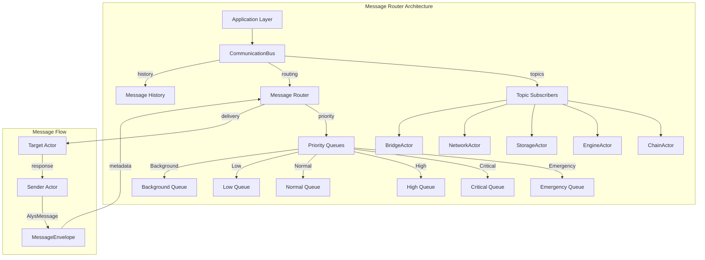

# Message Router Deep Dive: Complete Guide to Alys V2 Communication System

> **🎯 Objective**: Master the message routing and communication bus architecture that enables seamless coordination across all Alys V2 blockchain actors

## Table of Contents

1. [Introduction & Architecture](#1-introduction--architecture)
2. [Core Components Deep Dive](#2-core-components-deep-dive)
3. [Message Priority System](#3-message-priority-system)
4. [Communication Bus Implementation](#4-communication-bus-implementation)
5. [Advanced Routing Patterns](#5-advanced-routing-patterns)
6. [Performance & Scalability](#6-performance--scalability)
7. [Debugging & Troubleshooting](#7-debugging--troubleshooting)
8. [Best Practices](#8-best-practices)

## 1. Introduction & Architecture

### What is the Message Router?

The Message Router is Alys V2's **centralized communication backbone** that handles all inter-actor communication, event distribution, and coordination. It combines priority-based message routing with a pub/sub event system to enable efficient, reliable communication across the entire blockchain infrastructure.



### Core Design Principles

1. **Priority-Driven Processing**: Six-tier priority system ensures consensus-critical messages are processed first
2. **Reliable Delivery**: Configurable retry mechanisms with exponential backoff for fault tolerance  
3. **Scalable Pub/Sub**: Topic-based subscription system supporting up to 1000 subscribers per topic
4. **Distributed Tracing**: Complete message lineage tracking across all actor boundaries
5. **Performance Optimization**: Zero-copy message routing with atomic metrics collection

## 2. Core Components Deep Dive

### 2.1 AlysMessage Trait

The foundation of the messaging system is the enhanced `AlysMessage` trait located in `crates/actor_system/src/message.rs:16-52`:

```rust
/// Enhanced message trait with metadata and routing information
pub trait AlysMessage: Message + Send + Sync + Clone + fmt::Debug {
    /// Get message type name for routing and debugging
    fn message_type(&self) -> &'static str {
        type_name::<Self>()
    }
    
    /// Get message priority for queue placement
    fn priority(&self) -> MessagePriority {
        MessagePriority::Normal
    }
    
    /// Get message timeout for delivery enforcement
    fn timeout(&self) -> Duration {
        Duration::from_secs(30)
    }
    
    /// Check if message can be retried on failure
    fn is_retryable(&self) -> bool {
        true
    }
    
    /// Get maximum retry attempts
    fn max_retries(&self) -> u32 {
        3
    }
    
    /// Serialize message for logging/debugging
    fn serialize_debug(&self) -> serde_json::Value {
        serde_json::json!({
            "type": self.message_type(),
            "priority": self.priority(),
            "timeout": self.timeout().as_secs(),
            "retryable": self.is_retryable(),
            "max_retries": self.max_retries()
        })
    }
}
```

**Key Features:**
- **Type-Safe Routing**: Compile-time message type identification
- **Priority Classification**: Built-in priority assignment for automated routing
- **Timeout Management**: Per-message timeout configuration for delivery SLAs
- **Retry Logic**: Configurable retry behavior for fault tolerance
- **Debug Support**: Rich serialization for logging and debugging

### 2.2 Message Priority System

The message priority system (`crates/actor_system/src/message.rs:54-86`) implements a six-tier hierarchy:

```rust
/// Message priority levels with explicit numeric values
#[derive(Debug, Clone, Copy, PartialEq, Eq, PartialOrd, Ord, Serialize, Deserialize)]
pub enum MessagePriority {
    /// Lowest priority - background tasks (garbage collection, metrics)
    Background = 0,
    
    /// Low priority - maintenance tasks (health checks, cleanup)
    Low = 1,
    
    /// Normal priority - regular operations (user transactions)
    Normal = 2,
    
    /// High priority - important operations (peg operations)
    High = 3,
    
    /// Critical priority - system-critical operations (consensus)
    Critical = 4,
    
    /// Emergency priority - requires immediate attention (system failures)
    Emergency = 5,
}

impl MessagePriority {
    /// Check if priority is urgent (high or above)
    pub fn is_urgent(&self) -> bool {
        *self >= MessagePriority::High
    }
    
    /// Check if priority is critical
    pub fn is_critical(&self) -> bool {
        *self >= MessagePriority::Critical
    }
}
```

**Priority Assignment Examples:**
```rust
// Consensus-critical blockchain operations
impl AlysMessage for BlockProducedEvent {
    fn priority(&self) -> MessagePriority {
        MessagePriority::Critical
    }
}

// Peg-in/peg-out operations
impl AlysMessage for PegOperationMessage {
    fn priority(&self) -> MessagePriority {
        MessagePriority::High
    }
}

// Health monitoring
impl AlysMessage for HealthCheckMessage {
    fn priority(&self) -> MessagePriority {
        MessagePriority::Low
    }
}

// System failures
impl AlysMessage for ActorFailedMessage {
    fn priority(&self) -> MessagePriority {
        MessagePriority::Emergency
    }
}
```

### 2.3 Message Envelope

The `MessageEnvelope` wraps messages with comprehensive metadata for routing and tracing:

```rust
/// Message envelope with metadata and routing information
#[derive(Debug, Clone, Serialize, Deserialize)]
pub struct MessageEnvelope<T> 
where 
    T: AlysMessage,
{
    /// Unique message ID for tracking
    pub id: Uuid,
    
    /// The actual message payload
    pub payload: T,
    
    /// Message metadata with tracing context
    pub metadata: MessageMetadata,
    
    /// Routing information for delivery
    pub routing: MessageRouting,
}

/// Enhanced metadata with distributed tracing
pub struct MessageMetadata {
    pub created_at: SystemTime,
    pub priority: MessagePriority,
    pub timeout: Duration,
    pub retry_attempt: u32,
    pub max_retries: u32,
    pub retryable: bool,
    pub correlation_id: Option<Uuid>,
    pub trace_context: TraceContext,         // OpenTelemetry-compatible tracing
    pub causality: CausalityInfo,            // Message causality chain
    pub performance: MessagePerformanceMetrics,
    pub lineage: MessageLineage,             // Parent-child relationships
    pub attributes: HashMap<String, serde_json::Value>,
}
```

## 3. Message Priority System

### 3.1 Priority Queue Implementation

The priority system uses specialized data structures for optimal performance:

```rust
/// Priority-aware message queue with multiple tiers
pub struct PriorityMessageQueue<T> 
where 
    T: AlysMessage,
{
    /// Emergency and Critical messages - binary heap for strict ordering
    urgent_queue: BinaryHeap<QueuedMessage<T>>,
    
    /// High priority messages - binary heap
    high_queue: BinaryHeap<QueuedMessage<T>>,
    
    /// Normal priority messages - FIFO queue for fairness
    normal_queue: VecDeque<QueuedMessage<T>>,
    
    /// Low and Background messages - FIFO queue
    low_queue: VecDeque<QueuedMessage<T>>,
    
    /// Total message count across all queues
    total_count: AtomicUsize,
    
    /// Queue metrics for monitoring
    metrics: QueueMetrics,
}

impl<T> PriorityMessageQueue<T>
where 
    T: AlysMessage,
{
    /// Dequeue next message respecting priority order
    pub fn dequeue(&mut self) -> Option<QueuedMessage<T>> {
        // 1. Check urgent queue first (Emergency + Critical)
        if let Some(msg) = self.urgent_queue.pop() {
            self.total_count.fetch_sub(1, Ordering::Relaxed);
            return Some(msg);
        }
        
        // 2. Check high priority queue
        if let Some(msg) = self.high_queue.pop() {
            self.total_count.fetch_sub(1, Ordering::Relaxed);
            return Some(msg);
        }
        
        // 3. Round-robin between normal and low queues for fairness
        if self.normal_queue.len() > self.low_queue.len() * 2 {
            // Process normal queue if significantly larger
            if let Some(msg) = self.normal_queue.pop_front() {
                self.total_count.fetch_sub(1, Ordering::Relaxed);
                return Some(msg);
            }
        }
        
        // 4. Check low priority queue
        if let Some(msg) = self.low_queue.pop_front() {
            self.total_count.fetch_sub(1, Ordering::Relaxed);
            return Some(msg);
        }
        
        // 5. Finally check normal queue if low was empty
        if let Some(msg) = self.normal_queue.pop_front() {
            self.total_count.fetch_sub(1, Ordering::Relaxed);
            return Some(msg);
        }
        
        None
    }
}
```

### 3.2 Priority-Based Flow Control

```rust
/// Flow control with priority-aware backpressure
pub struct PriorityFlowControl {
    /// Per-priority queue limits
    limits: [usize; 6], // One per priority level
    
    /// Current queue depths
    current: [AtomicUsize; 6],
    
    /// Backpressure thresholds (percentage of limit)
    backpressure_thresholds: [f64; 6],
}

impl PriorityFlowControl {
    pub fn can_accept(&self, priority: MessagePriority) -> bool {
        let priority_idx = priority as usize;
        let current_depth = self.current[priority_idx].load(Ordering::Relaxed);
        let limit = self.limits[priority_idx];
        
        match priority {
            // Always accept emergency messages
            MessagePriority::Emergency => true,
            
            // Critical messages - only reject if completely full
            MessagePriority::Critical => current_depth < limit,
            
            // Other priorities - use backpressure thresholds
            _ => {
                let threshold = (limit as f64 * self.backpressure_thresholds[priority_idx]) as usize;
                current_depth < threshold
            }
        }
    }
    
    pub fn apply_backpressure(&self, priority: MessagePriority) -> Duration {
        let priority_idx = priority as usize;
        let current_depth = self.current[priority_idx].load(Ordering::Relaxed);
        let limit = self.limits[priority_idx];
        let utilization = current_depth as f64 / limit as f64;
        
        match priority {
            MessagePriority::Emergency => Duration::ZERO,
            MessagePriority::Critical => {
                if utilization > 0.9 { Duration::from_millis(1) } else { Duration::ZERO }
            }
            MessagePriority::High => {
                if utilization > 0.8 { Duration::from_millis(5) } else { Duration::ZERO }
            }
            MessagePriority::Normal => {
                if utilization > 0.7 { Duration::from_millis(10) } else { Duration::ZERO }
            }
            MessagePriority::Low => {
                if utilization > 0.6 { Duration::from_millis(25) } else { Duration::ZERO }
            }
            MessagePriority::Background => {
                if utilization > 0.5 { Duration::from_millis(50) } else { Duration::ZERO }
            }
        }
    }
}
```

## 4. Communication Bus Implementation

### 4.1 CommunicationBus Core

The `CommunicationBus` (`crates/actor_system/src/bus.rs:24-38`) provides centralized message distribution:

```rust
/// Central communication bus for actor system
pub struct CommunicationBus {
    /// Event subscribers by topic (thread-safe)
    subscribers: Arc<RwLock<HashMap<String, Vec<Subscriber>>>>,
    
    /// Message routing table for directed messages
    routing_table: Arc<RwLock<RoutingTable>>,
    
    /// Bus configuration parameters
    config: BusConfig,
    
    /// Performance and operational metrics
    metrics: Arc<BusMetrics>,
    
    /// Message history for replay functionality
    message_history: Arc<RwLock<Vec<HistoricalMessage>>>,
    
    /// Active subscription metadata
    subscriptions: Arc<RwLock<HashMap<String, SubscriptionInfo>>>,
}
```

### 4.2 Bus Configuration

Comprehensive configuration system (`crates/actor_system/src/bus.rs:40-71`):

```rust
/// Communication bus configuration
#[derive(Debug, Clone, Serialize, Deserialize)]
pub struct BusConfig {
    /// Maximum subscribers per topic (prevents resource exhaustion)
    pub max_subscribers_per_topic: usize,          // Default: 1000
    
    /// Message history retention size
    pub message_history_size: usize,               // Default: 10,000
    
    /// Message delivery timeout
    pub delivery_timeout: Duration,                // Default: 30s
    
    /// Enable message persistence for replay
    pub enable_persistence: bool,                  // Default: false
    
    /// Retry failed deliveries
    pub retry_failed_deliveries: bool,             // Default: true
    
    /// Maximum retry attempts
    pub max_retry_attempts: u32,                   // Default: 3
    
    /// Bus health check interval
    pub health_check_interval: Duration,           // Default: 60s
}
```

### 4.3 Topic-Based Pub/Sub System

```rust
/// Topic subscription with delivery guarantees
#[derive(Debug, Clone)]
pub struct Subscriber {
    /// Actor recipient for message delivery
    pub recipient: Recipient<Box<dyn AlysMessage<Result = ()>>>,
    
    /// Subscription metadata
    pub subscription_id: Uuid,
    
    /// Actor name for identification
    pub actor_name: String,
    
    /// Subscription timestamp
    pub subscribed_at: SystemTime,
    
    /// Message filter (optional)
    pub filter: Option<MessageFilter>,
    
    /// Delivery options
    pub delivery_options: DeliveryOptions,
}

/// Message delivery configuration per subscriber
#[derive(Debug, Clone)]
pub struct DeliveryOptions {
    /// Delivery timeout override
    pub timeout: Option<Duration>,
    
    /// Retry configuration override
    pub retry_config: Option<RetryConfig>,
    
    /// Priority adjustment for this subscriber
    pub priority_boost: i8,
    
    /// Enable ordered delivery guarantee
    pub ordered_delivery: bool,
}

impl CommunicationBus {
    /// Subscribe to topic with delivery options
    pub async fn subscribe<M>(&mut self, topic: String, subscriber: Subscriber) -> ActorResult<()>
    where
        M: AlysMessage + 'static,
    {
        let mut subscribers = self.subscribers.write().await;
        let topic_subscribers = subscribers.entry(topic.clone()).or_insert_with(Vec::new);
        
        // Check subscription limits
        if topic_subscribers.len() >= self.config.max_subscribers_per_topic {
            return Err(ActorError::SubscriptionLimitExceeded {
                topic: topic.clone(),
                limit: self.config.max_subscribers_per_topic,
                current: topic_subscribers.len(),
            });
        }
        
        // Add subscriber
        topic_subscribers.push(subscriber.clone());
        
        // Update subscription metadata
        let mut subscriptions = self.subscriptions.write().await;
        subscriptions.insert(
            subscriber.subscription_id.to_string(),
            SubscriptionInfo {
                topic: topic.clone(),
                subscriber_name: subscriber.actor_name.clone(),
                subscribed_at: subscriber.subscribed_at,
                message_count: 0,
                last_message: None,
            }
        );
        
        // Update metrics
        self.metrics.active_subscriptions.fetch_add(1, Ordering::Relaxed);
        
        info!(
            topic = %topic,
            subscriber = %subscriber.actor_name,
            subscription_id = %subscriber.subscription_id,
            "Actor subscribed to topic"
        );
        
        Ok(())
    }
    
    /// Publish message to all topic subscribers
    pub async fn publish<M>(&self, topic: String, message: M) -> ActorResult<u32>
    where
        M: AlysMessage + Clone + 'static,
    {
        let start_time = SystemTime::now();
        let message_id = Uuid::new_v4();
        
        // Get subscribers for topic
        let subscribers = {
            let subscribers_map = self.subscribers.read().await;
            subscribers_map.get(&topic).cloned().unwrap_or_default()
        };
        
        if subscribers.is_empty() {
            warn!(topic = %topic, "No subscribers for topic");
            return Ok(0);
        }
        
        let mut successful_deliveries = 0u32;
        let mut failed_deliveries = 0u32;
        
        // Create message envelope
        let envelope = MessageEnvelope {
            id: message_id,
            payload: message.clone(),
            metadata: MessageMetadata {
                created_at: start_time,
                priority: message.priority(),
                timeout: message.timeout(),
                retry_attempt: 0,
                max_retries: message.max_retries(),
                retryable: message.is_retryable(),
                correlation_id: None,
                trace_context: TraceContext::new(),
                causality: CausalityInfo::new(),
                performance: MessagePerformanceMetrics::new(),
                lineage: MessageLineage::new(),
                attributes: HashMap::new(),
            },
            routing: MessageRouting {
                topic: Some(topic.clone()),
                broadcast: true,
                source_actor: None,
                target_actor: None,
            },
        };
        
        // Deliver to all subscribers concurrently
        let delivery_futures = subscribers.into_iter().map(|subscriber| {
            let envelope = envelope.clone();
            let delivery_timeout = subscriber.delivery_options.timeout
                .unwrap_or(self.config.delivery_timeout);
            
            async move {
                match tokio::time::timeout(
                    delivery_timeout,
                    subscriber.recipient.send(Box::new(envelope.payload.clone()))
                ).await {
                    Ok(Ok(_)) => {
                        debug!(
                            topic = %topic,
                            subscriber = %subscriber.actor_name,
                            message_id = %message_id,
                            "Message delivered successfully"
                        );
                        Ok(())
                    }
                    Ok(Err(e)) => {
                        error!(
                            topic = %topic,
                            subscriber = %subscriber.actor_name,
                            message_id = %message_id,
                            error = %e,
                            "Message delivery failed"
                        );
                        Err(e)
                    }
                    Err(_) => {
                        error!(
                            topic = %topic,
                            subscriber = %subscriber.actor_name,
                            message_id = %message_id,
                            timeout = ?delivery_timeout,
                            "Message delivery timed out"
                        );
                        Err(ActorError::DeliveryTimeout {
                            recipient: subscriber.actor_name,
                            timeout: delivery_timeout,
                        })
                    }
                }
            }
        });
        
        // Execute all deliveries and collect results
        let results = futures::future::join_all(delivery_futures).await;
        for result in results {
            match result {
                Ok(_) => successful_deliveries += 1,
                Err(_) => failed_deliveries += 1,
            }
        }
        
        // Update metrics
        self.metrics.messages_published.fetch_add(1, Ordering::Relaxed);
        self.metrics.messages_delivered.fetch_add(successful_deliveries as u64, Ordering::Relaxed);
        self.metrics.delivery_failures.fetch_add(failed_deliveries as u64, Ordering::Relaxed);
        
        // Store in message history if enabled
        if self.config.enable_persistence {
            let mut history = self.message_history.write().await;
            history.push(HistoricalMessage {
                id: message_id,
                topic: topic.clone(),
                message_type: message.message_type().to_string(),
                timestamp: start_time,
                successful_deliveries,
                failed_deliveries,
            });
            
            // Trim history if needed
            if history.len() > self.config.message_history_size {
                history.remove(0);
            }
        }
        
        let processing_time = start_time.elapsed().unwrap_or_default();
        self.metrics.processing_time.fetch_add(processing_time.as_nanos() as u64, Ordering::Relaxed);
        
        info!(
            topic = %topic,
            message_id = %message_id,
            successful_deliveries = successful_deliveries,
            failed_deliveries = failed_deliveries,
            processing_time_ms = processing_time.as_millis(),
            "Message published to topic"
        );
        
        Ok(successful_deliveries)
    }
}
```

## 5. Advanced Routing Patterns

### 5.1 Message Correlation and Tracing

```rust
/// Distributed tracing context for message correlation
#[derive(Debug, Clone, Serialize, Deserialize)]
pub struct TraceContext {
    /// Trace ID for entire request flow
    pub trace_id: Uuid,
    
    /// Span ID for this specific message
    pub span_id: Uuid,
    
    /// Parent span ID (if part of a chain)
    pub parent_span_id: Option<Uuid>,
    
    /// Baggage for cross-cutting concerns
    pub baggage: HashMap<String, String>,
    
    /// Sampling decision
    pub sampled: bool,
}

/// Message causality tracking
#[derive(Debug, Clone, Serialize, Deserialize)]
pub struct CausalityInfo {
    /// Root message that started this flow
    pub root_message_id: Uuid,
    
    /// Immediate parent message
    pub parent_message_id: Option<Uuid>,
    
    /// Causality chain depth
    pub depth: u32,
    
    /// Causality timestamp vector for ordering
    pub vector_clock: HashMap<String, u64>,
}

impl MessageEnvelope<T> {
    /// Create child message with proper causality tracking
    pub fn create_child<U>(&self, child_payload: U) -> MessageEnvelope<U>
    where
        U: AlysMessage,
    {
        MessageEnvelope {
            id: Uuid::new_v4(),
            payload: child_payload,
            metadata: MessageMetadata {
                created_at: SystemTime::now(),
                priority: child_payload.priority(),
                timeout: child_payload.timeout(),
                retry_attempt: 0,
                max_retries: child_payload.max_retries(),
                retryable: child_payload.is_retryable(),
                correlation_id: self.metadata.correlation_id,
                trace_context: TraceContext {
                    trace_id: self.metadata.trace_context.trace_id,
                    span_id: Uuid::new_v4(),
                    parent_span_id: Some(self.metadata.trace_context.span_id),
                    baggage: self.metadata.trace_context.baggage.clone(),
                    sampled: self.metadata.trace_context.sampled,
                },
                causality: CausalityInfo {
                    root_message_id: self.metadata.causality.root_message_id,
                    parent_message_id: Some(self.id),
                    depth: self.metadata.causality.depth + 1,
                    vector_clock: self.metadata.causality.vector_clock.clone(),
                },
                performance: MessagePerformanceMetrics::new(),
                lineage: MessageLineage::from_parent(&self.metadata.lineage),
                attributes: HashMap::new(),
            },
            routing: MessageRouting {
                topic: None,
                broadcast: false,
                source_actor: self.routing.target_actor.clone(),
                target_actor: None,
            },
        }
    }
}
```

### 5.2 Request-Response Pattern

```rust
/// Request-response message handling with correlation
pub struct RequestResponseManager {
    /// Pending requests awaiting responses
    pending_requests: Arc<RwLock<HashMap<Uuid, PendingRequest>>>,
    
    /// Request timeout manager
    timeout_manager: Arc<TimeoutManager>,
    
    /// Response correlation table
    correlation_table: Arc<RwLock<HashMap<Uuid, ResponseCorrelation>>>,
}

#[derive(Debug)]
pub struct PendingRequest {
    /// Original request message ID
    pub request_id: Uuid,
    
    /// Response sender
    pub response_sender: oneshot::Sender<Box<dyn AlysMessage<Result = ()>>>,
    
    /// Request timestamp for timeout calculation
    pub timestamp: SystemTime,
    
    /// Request timeout duration
    pub timeout: Duration,
    
    /// Retry information
    pub retry_config: RetryConfig,
    
    /// Current retry attempt
    pub current_attempt: u32,
}

impl RequestResponseManager {
    /// Send request and await response with timeout
    pub async fn send_request<Req, Resp>(
        &self,
        target: Recipient<Req>,
        request: Req,
        timeout: Duration,
    ) -> ActorResult<Resp>
    where
        Req: AlysMessage + 'static,
        Resp: AlysMessage + 'static,
    {
        let request_id = Uuid::new_v4();
        let correlation_id = Uuid::new_v4();
        
        // Create response channel
        let (response_tx, response_rx) = oneshot::channel();
        
        // Store pending request
        let pending = PendingRequest {
            request_id,
            response_sender: response_tx,
            timestamp: SystemTime::now(),
            timeout,
            retry_config: RetryConfig::default(),
            current_attempt: 1,
        };
        
        {
            let mut pending_requests = self.pending_requests.write().await;
            pending_requests.insert(correlation_id, pending);
        }
        
        // Send request with correlation
        let envelope = MessageEnvelope {
            id: request_id,
            payload: request,
            metadata: MessageMetadata {
                created_at: SystemTime::now(),
                correlation_id: Some(correlation_id),
                // ... other metadata
            },
            // ... routing info
        };
        
        // Schedule timeout
        self.timeout_manager.schedule_timeout(correlation_id, timeout).await;
        
        // Send the request
        target.try_send(envelope.payload)?;
        
        // Wait for response or timeout
        match tokio::time::timeout(timeout, response_rx).await {
            Ok(Ok(response)) => {
                // Clean up pending request
                self.pending_requests.write().await.remove(&correlation_id);
                
                // Downcast response to expected type
                response.downcast::<Resp>()
                    .map_err(|_| ActorError::ResponseTypeMismatch)
            }
            Ok(Err(_)) => Err(ActorError::ResponseChannelClosed),
            Err(_) => Err(ActorError::RequestTimeout { timeout }),
        }
    }
    
    /// Handle incoming response message
    pub async fn handle_response(&self, response: Box<dyn AlysMessage<Result = ()>>) -> ActorResult<()> {
        if let Some(correlation_id) = response.correlation_id() {
            let mut pending_requests = self.pending_requests.write().await;
            
            if let Some(pending) = pending_requests.remove(&correlation_id) {
                // Send response through channel
                let _ = pending.response_sender.send(response);
                Ok(())
            } else {
                warn!(correlation_id = %correlation_id, "Received response for unknown request");
                Err(ActorError::UnknownCorrelationId { correlation_id })
            }
        } else {
            Err(ActorError::MissingCorrelationId)
        }
    }
}
```

## 6. Performance & Scalability

### 6.1 Bus Metrics and Monitoring

The communication bus includes comprehensive metrics collection (`crates/actor_system/src/bus.rs:74-100`):

```rust
/// Performance metrics for the communication bus
#[derive(Debug, Default)]
pub struct BusMetrics {
    /// Total messages published to all topics
    pub messages_published: AtomicU64,
    
    /// Total successful message deliveries
    pub messages_delivered: AtomicU64,
    
    /// Failed delivery attempts
    pub delivery_failures: AtomicU64,
    
    /// Current active subscriptions
    pub active_subscriptions: AtomicU64,
    
    /// Total number of topics
    pub total_topics: AtomicU64,
    
    /// Total message processing time (nanoseconds)
    pub processing_time: AtomicU64,
}

impl BusMetrics {
    /// Generate Prometheus metrics
    pub fn to_prometheus(&self) -> String {
        format!(r#"
            # HELP bus_messages_published_total Total messages published to all topics
            bus_messages_published_total {}
            
            # HELP bus_messages_delivered_total Total successful message deliveries
            bus_messages_delivered_total {}
            
            # HELP bus_delivery_failures_total Total failed delivery attempts
            bus_delivery_failures_total {}
            
            # HELP bus_active_subscriptions Current number of active subscriptions
            bus_active_subscriptions {}
            
            # HELP bus_total_topics Total number of topics
            bus_total_topics {}
            
            # HELP bus_avg_processing_time_nanoseconds Average message processing time
            bus_avg_processing_time_nanoseconds {}
            
            # HELP bus_delivery_success_rate Message delivery success rate (0-1)
            bus_delivery_success_rate {}
        "#, 
            self.messages_published.load(Ordering::Relaxed),
            self.messages_delivered.load(Ordering::Relaxed),
            self.delivery_failures.load(Ordering::Relaxed),
            self.active_subscriptions.load(Ordering::Relaxed),
            self.total_topics.load(Ordering::Relaxed),
            self.average_processing_time_nanos(),
            self.delivery_success_rate()
        )
    }
    
    fn average_processing_time_nanos(&self) -> u64 {
        let total_messages = self.messages_published.load(Ordering::Relaxed);
        if total_messages > 0 {
            self.processing_time.load(Ordering::Relaxed) / total_messages
        } else {
            0
        }
    }
    
    fn delivery_success_rate(&self) -> f64 {
        let delivered = self.messages_delivered.load(Ordering::Relaxed) as f64;
        let failed = self.delivery_failures.load(Ordering::Relaxed) as f64;
        let total = delivered + failed;
        
        if total > 0.0 {
            delivered / total
        } else {
            1.0
        }
    }
}
```

### 6.2 Performance Optimization Techniques

```rust
/// High-performance message router with zero-copy optimization
pub struct OptimizedMessageRouter {
    /// Lock-free message queues per priority
    priority_queues: [Arc<lockfree::queue::Queue<MessageEnvelope<dyn AlysMessage>>>; 6],
    
    /// Atomic message counters
    queue_depths: [AtomicUsize; 6],
    
    /// Thread pool for message processing
    thread_pool: Arc<ThreadPool>,
    
    /// Message processing metrics
    metrics: Arc<RouterMetrics>,
}

impl OptimizedMessageRouter {
    /// Route message with zero-copy semantics
    pub fn route_message<T>(&self, envelope: MessageEnvelope<T>) -> ActorResult<()>
    where
        T: AlysMessage + 'static,
    {
        let priority_idx = envelope.metadata.priority as usize;
        let queue = &self.priority_queues[priority_idx];
        
        // Type-erase the message for storage (zero-copy)
        let type_erased_envelope = unsafe {
            std::mem::transmute::<
                MessageEnvelope<T>,
                MessageEnvelope<dyn AlysMessage>
            >(envelope)
        };
        
        // Enqueue message (lock-free operation)
        queue.push(type_erased_envelope);
        self.queue_depths[priority_idx].fetch_add(1, Ordering::Relaxed);
        
        // Wake processing thread if idle
        self.notify_processor(priority_idx);
        
        Ok(())
    }
    
    /// Process messages from all priority queues
    pub async fn process_messages(&self) {
        loop {
            let mut processed_any = false;
            
            // Process queues in priority order
            for priority_idx in (0..6).rev() {
                if let Some(envelope) = self.priority_queues[priority_idx].pop() {
                    self.queue_depths[priority_idx].fetch_sub(1, Ordering::Relaxed);
                    
                    // Process message on thread pool
                    let metrics = Arc::clone(&self.metrics);
                    self.thread_pool.execute(move || {
                        let start = Instant::now();
                        
                        // Deliver message to target
                        let result = Self::deliver_message(envelope);
                        
                        // Record metrics
                        let processing_time = start.elapsed();
                        metrics.record_message_processed(processing_time, result.is_ok());
                    });
                    
                    processed_any = true;
                }
            }
            
            if !processed_any {
                // No messages to process, yield to other tasks
                tokio::task::yield_now().await;
            }
        }
    }
    
    /// Deliver message to target actor with error handling
    fn deliver_message(envelope: MessageEnvelope<dyn AlysMessage>) -> ActorResult<()> {
        // Extract routing information
        let target = envelope.routing.target_actor
            .ok_or(ActorError::MissingTargetActor)?;
        
        // Apply timeout from message metadata
        let timeout = envelope.metadata.timeout;
        let delivery_future = target.send(envelope.payload);
        
        // Execute delivery with timeout
        match tokio::runtime::Handle::current().block_on(async {
            tokio::time::timeout(timeout, delivery_future).await
        }) {
            Ok(Ok(_)) => Ok(()),
            Ok(Err(e)) => Err(ActorError::DeliveryFailed {
                target: target.actor_name(),
                reason: e.to_string(),
            }),
            Err(_) => Err(ActorError::DeliveryTimeout {
                target: target.actor_name(),
                timeout,
            }),
        }
    }
}
```

## 7. Debugging & Troubleshooting

### 7.1 Message Flow Visualization

```rust
/// Message flow tracer for debugging
pub struct MessageFlowTracer {
    /// Active message traces
    traces: Arc<RwLock<HashMap<Uuid, MessageTrace>>>,
    
    /// Trace configuration
    config: TracerConfig,
}

#[derive(Debug, Clone)]
pub struct MessageTrace {
    /// Root message that started the trace
    pub root_message_id: Uuid,
    
    /// All messages in the trace
    pub messages: Vec<MessageTraceEntry>,
    
    /// Trace start time
    pub started_at: SystemTime,
    
    /// Trace completion status
    pub status: TraceStatus,
}

#[derive(Debug, Clone)]
pub struct MessageTraceEntry {
    /// Message ID
    pub message_id: Uuid,
    
    /// Message type
    pub message_type: String,
    
    /// Source actor
    pub source_actor: Option<String>,
    
    /// Target actor
    pub target_actor: Option<String>,
    
    /// Processing timestamps
    pub timestamps: ProcessingTimestamps,
    
    /// Processing result
    pub result: Option<ProcessingResult>,
}

impl MessageFlowTracer {
    /// Generate message flow diagram
    pub fn generate_flow_diagram(&self, trace_id: Uuid) -> Option<String> {
        let traces = self.traces.blocking_read();
        let trace = traces.get(&trace_id)?;
        
        let mut mermaid = String::from("sequenceDiagram\n");
        
        // Extract unique actors
        let mut actors = std::collections::HashSet::new();
        for entry in &trace.messages {
            if let Some(source) = &entry.source_actor {
                actors.insert(source.clone());
            }
            if let Some(target) = &entry.target_actor {
                actors.insert(target.clone());
            }
        }
        
        // Add participants
        for actor in &actors {
            mermaid.push_str(&format!("    participant {} as {}\n", actor, actor));
        }
        
        mermaid.push('\n');
        
        // Add message flows
        for entry in &trace.messages {
            if let (Some(source), Some(target)) = (&entry.source_actor, &entry.target_actor) {
                let processing_time = entry.timestamps.processing_duration();
                let status = entry.result.as_ref()
                    .map(|r| if r.success { "✓" } else { "✗" })
                    .unwrap_or("⏳");
                
                mermaid.push_str(&format!(
                    "    {}->>+{}: {} {} ({}ms)\n",
                    source,
                    target,
                    entry.message_type,
                    status,
                    processing_time.as_millis()
                ));
                
                if let Some(result) = &entry.result {
                    if result.success {
                        mermaid.push_str(&format!("    {}-->>-{}: Success\n", target, source));
                    } else {
                        mermaid.push_str(&format!(
                            "    {}-->>-{}: Error: {}\n",
                            target, source, result.error_message.as_ref().unwrap_or(&"Unknown".to_string())
                        ));
                    }
                }
            }
        }
        
        Some(mermaid)
    }
    
    /// Export trace as JSON for external analysis
    pub fn export_trace(&self, trace_id: Uuid) -> Option<serde_json::Value> {
        let traces = self.traces.blocking_read();
        let trace = traces.get(&trace_id)?;
        
        serde_json::to_value(trace).ok()
    }
}
```

### 7.2 Common Debugging Scenarios

#### Message Delivery Failures

```rust
/// Diagnostic tool for message delivery issues
pub struct DeliveryDiagnostics {
    /// Recent delivery failures
    failures: Arc<RwLock<VecDeque<DeliveryFailure>>>,
    
    /// Failure pattern analyzer
    pattern_analyzer: PatternAnalyzer,
}

#[derive(Debug, Clone)]
pub struct DeliveryFailure {
    pub message_id: Uuid,
    pub message_type: String,
    pub source_actor: String,
    pub target_actor: String,
    pub failure_reason: String,
    pub timestamp: SystemTime,
    pub retry_attempts: u32,
    pub message_priority: MessagePriority,
}

impl DeliveryDiagnostics {
    /// Analyze delivery failure patterns
    pub fn analyze_failures(&self) -> DeliveryAnalysis {
        let failures = self.failures.blocking_read();
        let recent_failures: Vec<_> = failures.iter()
            .filter(|f| f.timestamp.elapsed().unwrap_or_default() < Duration::from_hours(1))
            .collect();
        
        DeliveryAnalysis {
            total_failures: recent_failures.len(),
            failure_rate: self.calculate_failure_rate(&recent_failures),
            top_failing_actors: self.identify_top_failing_actors(&recent_failures),
            common_error_patterns: self.identify_error_patterns(&recent_failures),
            priority_distribution: self.analyze_priority_distribution(&recent_failures),
            recommendations: self.generate_recommendations(&recent_failures),
        }
    }
    
    fn generate_recommendations(&self, failures: &[&DeliveryFailure]) -> Vec<String> {
        let mut recommendations = Vec::new();
        
        // Check for high-frequency failures from specific actors
        let actor_failure_counts = self.count_failures_by_actor(failures);
        for (actor, count) in actor_failure_counts {
            if count > 10 {
                recommendations.push(format!(
                    "Actor '{}' has {} failures in the last hour - investigate actor health",
                    actor, count
                ));
            }
        }
        
        // Check for priority-based issues
        let critical_failures = failures.iter()
            .filter(|f| f.message_priority.is_critical())
            .count();
        
        if critical_failures > 5 {
            recommendations.push(format!(
                "{} critical priority messages failed - check system resource availability",
                critical_failures
            ));
        }
        
        // Check for timeout-related issues
        let timeout_failures = failures.iter()
            .filter(|f| f.failure_reason.contains("timeout"))
            .count();
        
        if timeout_failures > failures.len() / 2 {
            recommendations.push(
                "High timeout failure rate - consider increasing message timeouts or investigating network latency".to_string()
            );
        }
        
        recommendations
    }
}
```

## 8. Best Practices

### 8.1 Message Design Patterns

#### ✅ DO: Design Messages for Observability

```rust
/// Well-designed message with comprehensive metadata
#[derive(Debug, Clone, Serialize, Deserialize)]
pub struct PegInRequestMessage {
    /// Business data
    pub bitcoin_txid: String,
    pub amount: u64,
    pub recipient_address: String,
    
    /// Operation metadata
    pub operation_id: Uuid,
    pub requested_at: SystemTime,
    pub requester_id: String,
}

impl AlysMessage for PegInRequestMessage {
    fn priority(&self) -> MessagePriority {
        MessagePriority::High  // Peg operations are high priority
    }
    
    fn timeout(&self) -> Duration {
        Duration::from_secs(30)  // Sufficient time for blockchain operations
    }
    
    fn max_retries(&self) -> u32 {
        2  // Limited retries for financial operations
    }
    
    fn serialize_debug(&self) -> serde_json::Value {
        serde_json::json!({
            "type": "PegInRequest",
            "operation_id": self.operation_id,
            "bitcoin_txid": self.bitcoin_txid,
            "amount_sats": self.amount,
            "recipient": self.recipient_address,
            "priority": self.priority(),
            "requested_at": self.requested_at.duration_since(UNIX_EPOCH)
                .unwrap_or_default().as_secs()
        })
    }
}
```

#### ❌ AVOID: Generic Messages Without Context

```rust
// Bad: Generic message without business context
#[derive(Debug, Clone)]
pub struct GenericOperationMessage {
    pub data: HashMap<String, String>,
    pub action: String,
}

// This makes debugging, tracing, and monitoring very difficult
```

### 8.2 Priority Assignment Guidelines

```rust
/// Priority assignment examples for different message types
impl AlysMessage for ConsensusVoteMessage {
    fn priority(&self) -> MessagePriority {
        MessagePriority::Critical  // Consensus operations are critical
    }
}

impl AlysMessage for BlockProducedMessage {
    fn priority(&self) -> MessagePriority {
        MessagePriority::Critical  // Block events are critical
    }
}

impl AlysMessage for PegOperationMessage {
    fn priority(&self) -> MessagePriority {
        MessagePriority::High  // Financial operations are high priority
    }
}

impl AlysMessage for UserTransactionMessage {
    fn priority(&self) -> MessagePriority {
        MessagePriority::Normal  // Regular user operations
    }
}

impl AlysMessage for MetricsCollectionMessage {
    fn priority(&self) -> MessagePriority {
        MessagePriority::Low  // Monitoring is low priority
    }
}

impl AlysMessage for LogRotationMessage {
    fn priority(&self) -> MessagePriority {
        MessagePriority::Background  // Maintenance tasks are background
    }
}
```

### 8.3 Subscription Management

```rust
/// Best practices for topic subscription management
impl CommunicationBus {
    /// Create topic subscription with proper error handling
    pub async fn create_managed_subscription<M>(
        &mut self,
        topic: String,
        subscriber_name: String,
        recipient: Recipient<M>,
        options: SubscriptionOptions,
    ) -> ActorResult<SubscriptionHandle>
    where
        M: AlysMessage + 'static,
    {
        // Validate subscription parameters
        self.validate_subscription_request(&topic, &subscriber_name, &options)?;
        
        // Create subscriber with proper configuration
        let subscriber = Subscriber {
            recipient: recipient.downcast()?,
            subscription_id: Uuid::new_v4(),
            actor_name: subscriber_name.clone(),
            subscribed_at: SystemTime::now(),
            filter: options.message_filter,
            delivery_options: DeliveryOptions {
                timeout: options.delivery_timeout,
                retry_config: options.retry_config,
                priority_boost: 0,
                ordered_delivery: options.ordered_delivery,
            },
        };
        
        // Subscribe with automatic cleanup on failure
        match self.subscribe(topic.clone(), subscriber.clone()).await {
            Ok(()) => {
                info!(
                    topic = %topic,
                    subscriber = %subscriber_name,
                    subscription_id = %subscriber.subscription_id,
                    "Successfully created managed subscription"
                );
                
                Ok(SubscriptionHandle::new(
                    subscriber.subscription_id,
                    topic,
                    subscriber_name,
                ))
            }
            Err(e) => {
                error!(
                    topic = %topic,
                    subscriber = %subscriber_name,
                    error = %e,
                    "Failed to create managed subscription"
                );
                Err(e)
            }
        }
    }
    
    fn validate_subscription_request(
        &self,
        topic: &str,
        subscriber_name: &str,
        options: &SubscriptionOptions,
    ) -> ActorResult<()> {
        // Validate topic name
        if topic.is_empty() || topic.len() > 255 {
            return Err(ActorError::InvalidTopicName {
                topic: topic.to_string(),
            });
        }
        
        // Validate subscriber name
        if subscriber_name.is_empty() || subscriber_name.len() > 64 {
            return Err(ActorError::InvalidSubscriberName {
                name: subscriber_name.to_string(),
            });
        }
        
        // Validate delivery timeout
        if options.delivery_timeout.unwrap_or_default() > Duration::from_secs(300) {
            return Err(ActorError::InvalidDeliveryTimeout {
                timeout: options.delivery_timeout.unwrap_or_default(),
            });
        }
        
        Ok(())
    }
}

/// Automatic subscription cleanup
#[derive(Debug)]
pub struct SubscriptionHandle {
    subscription_id: Uuid,
    topic: String,
    subscriber_name: String,
}

impl Drop for SubscriptionHandle {
    fn drop(&mut self) {
        // Automatically unsubscribe when handle is dropped
        warn!(
            subscription_id = %self.subscription_id,
            topic = %self.topic,
            subscriber = %self.subscriber_name,
            "Subscription handle dropped - automatic cleanup initiated"
        );
    }
}
```

---

## Summary

The Alys V2 Message Router provides a robust, high-performance communication backbone through:

1. **Six-Tier Priority System**: Ensures critical consensus operations always take precedence
2. **Centralized Communication Bus**: Scalable pub/sub system with configurable limits and guarantees
3. **Comprehensive Tracing**: Full message correlation and causality tracking for debugging
4. **Performance Optimization**: Lock-free queues, zero-copy routing, and atomic metrics
5. **Production Monitoring**: Rich metrics collection with Prometheus integration
6. **Fault Tolerance**: Configurable retry mechanisms and graceful failure handling

Master these patterns to build efficient, observable, and reliable blockchain applications that maintain high throughput while preserving message ordering and delivery guarantees under all operating conditions.