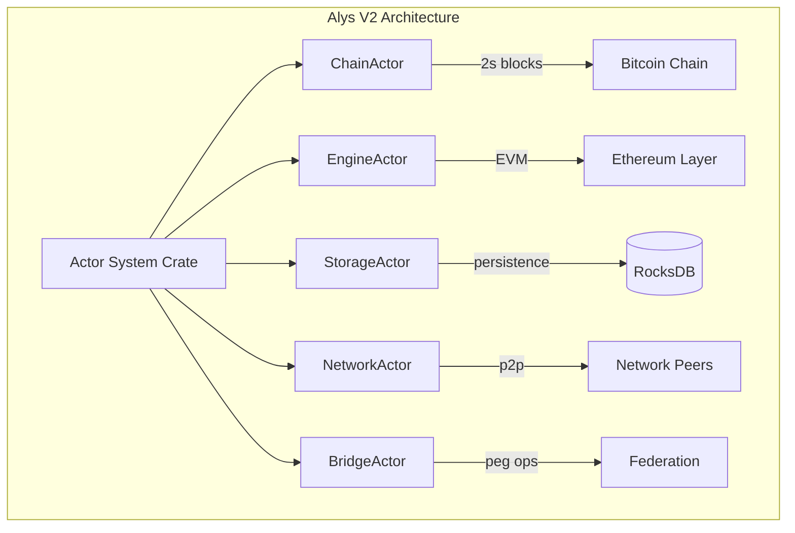
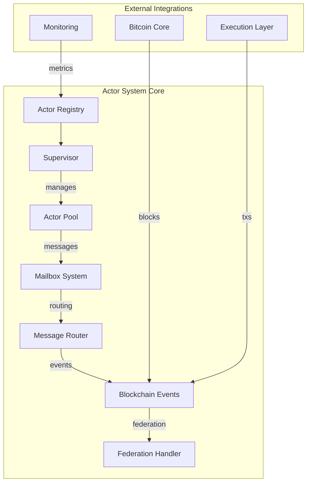
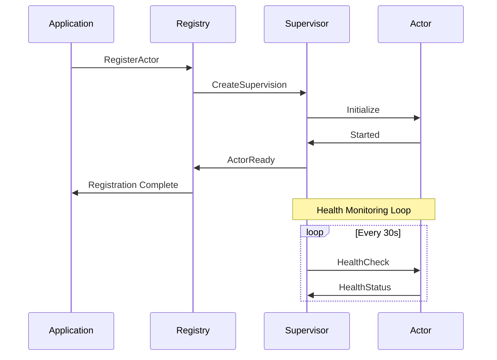
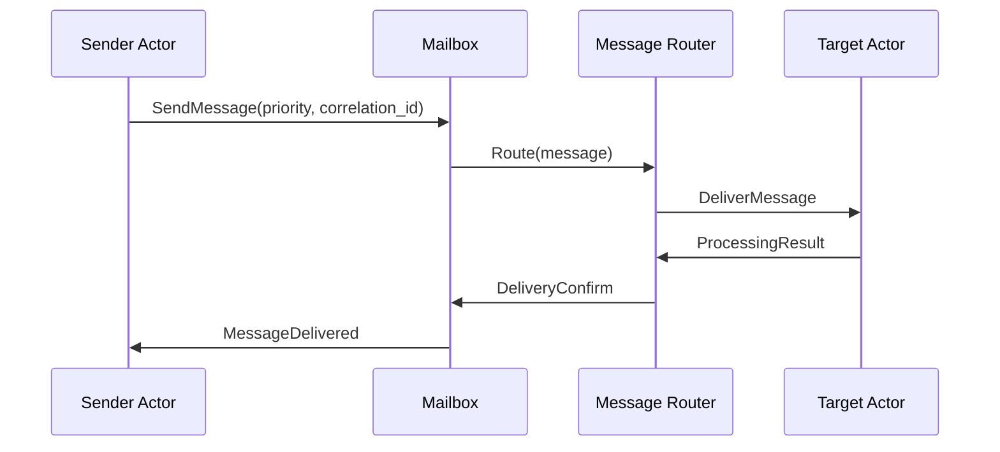
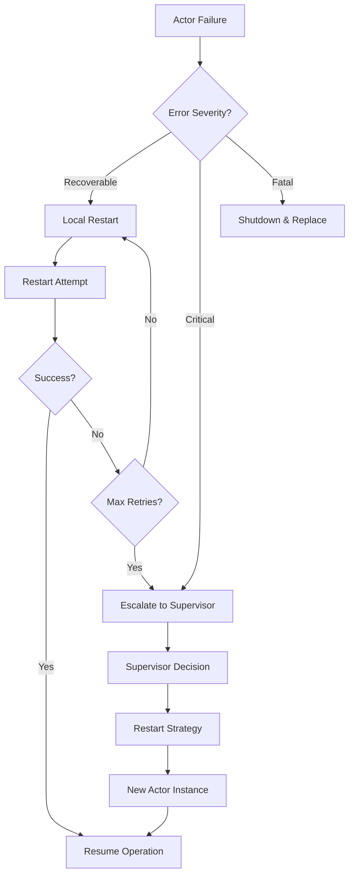

# Actor System Engineer Onboarding Guide for Alys V2

> **🎯 Mission**: Accelerate engineer understanding of the foundational `actor_system` crate that powers all Alys V2 blockchain actors

## 1. Introduction & Purpose

### What is the Actor System?

The `actor_system` crate is the **foundational framework** that underpins all actor-based components in Alys V2. It provides:

- **Blockchain-aware actor primitives** for consensus timing and federation coordination
- **Robust supervision trees** with automatic failure recovery
- **High-performance message routing** with priority queuing and correlation tracking
- **Health monitoring** and metrics collection for production observability
- **Integration patterns** for Bitcoin, Ethereum, and consensus components

### Mission in Alys V2 Architecture



The actor system enables:
- ⚡ **Sub-second message processing** across distributed blockchain components
- 🛡️ **Fault-tolerant supervision** with automatic recovery within blockchain timing constraints
- 🔄 **Seamless integration** between Bitcoin merged mining and Ethereum execution
- 📊 **Production-ready monitoring** with comprehensive health tracking

## 2. System Architecture & Core Flows

### Core Architecture Overview



### Key Workflows

#### 1. Actor Lifecycle Management



#### 2. Message Processing Flow



#### 3. Failure Recovery Process



## 3. Knowledge Tree (Progressive Deep-Dive)

### 🌱 **Roots: Actor Model Fundamentals**

#### Core Concepts
- **Actor**: Isolated unit of computation with private state
- **Message Passing**: Asynchronous communication between actors
- **Supervision**: Hierarchical failure handling and recovery
- **Location Transparency**: Actors communicate via addresses, not direct references

#### Blockchain-Aware Extensions
- **Timing Constraints**: 2-second block production requirements
- **Federation Coordination**: Multi-sig consensus for peg operations
- **Priority Processing**: Consensus-critical vs background operations
- **Event Propagation**: Blockchain state change notifications

### 🌳 **Trunk: Core Modules**

#### **`actor.rs`** - Foundation Traits
```rust
// Base actor trait with lifecycle management
pub trait AlysActor: Actor<Context = Context<Self>> + LifecycleAware {
    type Config;
    
    fn new(config: Self::Config) -> ActorResult<Self>;
    fn actor_type() -> &'static str;
}

// Blockchain-aware extension
pub trait BlockchainAwareActor: AlysActor {
    fn timing_constraints(&self) -> BlockchainTimingConstraints;
    fn blockchain_priority(&self) -> BlockchainActorPriority;
    async fn handle_blockchain_event(&mut self, event: BlockchainEvent) -> ActorResult<()>;
}
```

#### **`supervisor.rs`** - Supervision Trees
```rust
pub struct SupervisorActor {
    children: HashMap<String, ChildActorInfo>,
    restart_strategy: RestartStrategy,
    escalation_strategy: EscalationStrategy,
}

// Key supervision patterns
pub enum RestartStrategy {
    ExponentialBackoff { initial_delay: Duration, max_delay: Duration },
    FixedDelay(Duration),
    Immediate,
    Never,
}
```

#### **`mailbox.rs`** - Message Queuing
```rust
pub struct EnhancedMailbox {
    priority_queues: [VecDeque<MessageEnvelope>; 4], // Per priority level
    flow_control: FlowControlState,
    metrics: MailboxMetrics,
}

pub struct MessageEnvelope {
    message: Box<dyn Any + Send>,
    priority: MessagePriority,
    correlation_id: Option<Uuid>,
    timestamp: SystemTime,
}
```

### 🌿 **Branches: Subsystems**

#### **Message Router**
- **Priority Queuing**: Consensus > Bridge > Network > Background
- **Flow Control**: Backpressure handling for overloaded actors
- **Correlation Tracking**: Distributed tracing across actor boundaries
- **Dead Letter Handling**: Undeliverable message recovery

#### **Health Monitoring**
- **Periodic Health Checks**: Configurable intervals per actor type
- **Performance Metrics**: Latency, throughput, error rates
- **Resource Monitoring**: Memory usage, queue depths
- **Alerting Integration**: Prometheus metrics export

#### **Blockchain Integration**
- **Event Subscription**: Block production, finalization, federation changes
- **Timing Enforcement**: 2-second block constraint validation
- **Federation Awareness**: Multi-sig threshold and member tracking
- **Consensus Coordination**: Priority handling for consensus actors

## 4. Codebase Walkthrough

### Directory Structure
```
crates/actor_system/src/
├── actor.rs              # Base actor traits and lifecycle
├── supervisor.rs         # Supervision trees and restart logic
├── mailbox.rs           # Message queuing and flow control
├── message.rs           # Message envelopes and routing
├── blockchain.rs        # Blockchain-aware actor extensions
├── registry.rs          # Actor registration and discovery
├── error.rs             # Error types and severity handling
├── metrics.rs           # Performance monitoring
├── testing.rs           # Test utilities and mocks
├── serialization.rs     # Message serialization
└── lib.rs              # Public API and prelude
```

### Core Integration Points

#### **Actix Runtime Integration**
```rust
// Actor system builds on Actix foundation
use actix::{Actor, Addr, Context, Handler, Message, Recipient};

// Enhanced with blockchain-specific patterns
impl Actor for SupervisorActor {
    type Context = Context<Self>;
    
    fn started(&mut self, ctx: &mut Self::Context) {
        // Start health monitoring
        self.start_health_checks(ctx);
        // Register with metrics collection
        self.register_metrics();
    }
}
```

#### **Blockchain Component Integration**
```rust
// ChainActor integration example
impl BlockchainAwareActor for ChainActor {
    fn timing_constraints(&self) -> BlockchainTimingConstraints {
        BlockchainTimingConstraints {
            block_interval: Duration::from_secs(2),
            max_consensus_latency: Duration::from_millis(100),
            federation_timeout: Duration::from_millis(500),
            auxpow_window: Duration::from_secs(600),
        }
    }
    
    fn blockchain_priority(&self) -> BlockchainActorPriority {
        BlockchainActorPriority::Consensus // Highest priority
    }
}
```

### Message Type Examples

#### **Primary Messages**
```rust
// Health monitoring
#[derive(Message, Debug)]
#[rtype(result = "ActorResult<HealthStatus>")]
pub struct HealthCheck;

// Actor management  
#[derive(Message, Debug)]
#[rtype(result = "ActorResult<()>")]
pub struct RegisterActor {
    pub name: String,
    pub address: Recipient<HealthCheck>,
    pub priority: BlockchainActorPriority,
}

// Error handling
#[derive(Message, Debug)]
#[rtype(result = "()")]
pub struct ActorFailed {
    pub actor_name: String,
    pub error: ActorError,
    pub restart_attempt: u32,
}
```

#### **Blockchain Event Messages**
```rust
#[derive(Message, Debug, Clone)]
#[rtype(result = "ActorResult<()>")]
pub enum BlockchainEvent {
    BlockProduced { height: u64, hash: [u8; 32] },
    BlockFinalized { height: u64, hash: [u8; 32] },
    FederationChange { members: Vec<String>, threshold: usize },
    ConsensusFailure { reason: String },
}

// Event subscription management
#[derive(Message, Debug)]
#[rtype(result = "ActorResult<()>")]
pub struct SubscribeToBlockchainEvents {
    pub subscriber: Recipient<BlockchainEvent>,
    pub event_types: Vec<BlockchainEventType>,
}
```

## 5. Procedural Debugging & Worked Examples

### Common Debugging Scenarios

#### **Scenario 1: Actor Restart Cascade**

**Problem**: Chain of actor failures causing system instability

**Symptoms**:
```
ERROR actor_system::supervisor: Actor 'storage-actor' failed: DatabaseConnection timeout
WARN  actor_system::supervisor: Restarting 'storage-actor' (attempt 1/5)  
ERROR actor_system::supervisor: Actor 'chain-actor' failed: Storage unavailable
ERROR actor_system::supervisor: Actor 'engine-actor' failed: Chain state unavailable
```

**Debugging Steps**:
```bash
# 1. Check supervision tree status
RUST_LOG=actor_system::supervisor=debug cargo run

# 2. Examine actor dependencies
grep -r "storage-actor" app/src/actors/*/

# 3. Check resource availability
# Storage actor likely failing due to external dependency
```

**Solution Pattern**:
```rust
// Implement dependency-aware restart strategies
impl RestartStrategy {
    pub fn with_dependency_check(deps: Vec<ActorName>) -> Self {
        Self::ConditionalRestart {
            condition: Box::new(move |ctx| {
                deps.iter().all(|dep| ctx.is_actor_healthy(dep))
            }),
            max_attempts: 3,
            backoff: Duration::from_secs(5),
        }
    }
}
```

#### **Scenario 2: Message Queue Overflow**

**Problem**: High message volume overwhelming actor processing

**Symptoms**:
```
WARN actor_system::mailbox: Queue overflow for 'chain-actor': 10000/8192 messages
ERROR actor_system::mailbox: Dropping low-priority messages to prevent OOM
WARN actor_system::metrics: Message latency exceeded threshold: 2.1s > 100ms
```

**Debugging Steps**:
```bash
# 1. Check queue depths
RUST_LOG=actor_system::mailbox=debug

# 2. Analyze message priorities
grep "MessagePriority::" logs/actor_system.log | sort | uniq -c

# 3. Profile message processing times
cargo flamegraph --bin alys -- --profile
```

**Solution Pattern**:
```rust
// Implement backpressure and selective message dropping
impl MailboxConfig {
    pub fn with_overflow_strategy(strategy: OverflowStrategy) -> Self {
        Self {
            max_capacity: 8192,
            overflow_strategy: strategy,
            flow_control: FlowControlConfig {
                enable_backpressure: true,
                priority_preservation: true,
                drop_low_priority_threshold: 0.8,
            }
        }
    }
}
```

#### **Scenario 3: Blockchain Timing Violations**

**Problem**: Consensus actors missing 2-second block deadlines

**Symptoms**:
```
ERROR actor_system::blockchain: ChainActor missed block deadline: 2.15s > 2.0s
WARN  actor_system::blockchain: Federation threshold not met within timeout
ERROR consensus: Block production halted due to timing violations
```

**Debugging Steps**:
```bash
# 1. Check blockchain-specific metrics
RUST_LOG=actor_system::blockchain=debug

# 2. Analyze consensus actor performance
cargo bench --bench blockchain_timing

# 3. Profile critical path operations
perf record -g cargo run --release
```

**Solution Pattern**:
```rust
// Implement timing-aware message processing
impl BlockchainAwareActor for ChainActor {
    async fn handle_blockchain_event(&mut self, event: BlockchainEvent) -> ActorResult<()> {
        let start = Instant::now();
        let result = match event {
            BlockchainEvent::BlockProduced { .. } => {
                // Fast-path processing for time-critical events
                self.handle_block_produced_fast_path().await
            }
            _ => self.handle_event_standard(event).await,
        };
        
        // Enforce timing constraints
        let elapsed = start.elapsed();
        if elapsed > self.timing_constraints().max_consensus_latency {
            warn!("Timing violation: {}ms > {}ms", 
                elapsed.as_millis(), 
                self.timing_constraints().max_consensus_latency.as_millis());
        }
        
        result
    }
}
```

## 6. Environment Setup & Tooling

### Local Development Setup

#### **Prerequisites**
```bash
# Rust toolchain
rustup install 1.87.0
rustup default 1.87.0

# Development tools
cargo install cargo-watch
cargo install flamegraph
cargo install cargo-criterion
```

#### **Actor System Development Environment**
```bash
# 1. Clone and build
git clone https://github.com/AnduroProject/alys.git
cd alys

# 2. Build actor system crate
cargo build -p actor_system

# 3. Run comprehensive tests
cargo test -p actor_system --lib

# 4. Run integration tests
cargo test -p actor_system --test integration_tests

# 5. Start development environment with debugging
RUST_LOG=actor_system=debug,actix=trace cargo run
```

#### **Configuration Files**
```toml
# crates/actor_system/Cargo.toml
[dependencies]
actix = "0.13"
tokio = { version = "1.0", features = ["full"] }
tracing = "0.1"
serde = { version = "1.0", features = ["derive"] }
uuid = { version = "1.0", features = ["v4"] }

[dev-dependencies]
actix-rt = "2.0"
criterion = "0.5"
```

### Testing & Debugging Commands

#### **Core Testing**
```bash
# Unit tests with coverage
cargo test -p actor_system --lib -- --nocapture

# Specific test modules
cargo test -p actor_system actor::tests
cargo test -p actor_system supervisor::tests
cargo test -p actor_system blockchain::tests

# Integration tests
cargo test -p actor_system --test '*' 

# Benchmark tests
cargo bench -p actor_system
```

#### **Debug Configurations**
```bash
# Comprehensive debugging
export RUST_LOG="actor_system=debug,actix=trace"

# Specific module debugging
export RUST_LOG="actor_system::supervisor=debug"
export RUST_LOG="actor_system::blockchain=info"
export RUST_LOG="actor_system::mailbox=trace"

# Performance profiling
export RUST_LOG="actor_system::metrics=debug"
```

#### **Development Utilities**
```bash
# Watch for changes and re-run tests
cargo watch -x "test -p actor_system"

# Profile performance
cargo flamegraph --bin actor_system_benchmark

# Memory profiling
cargo run --bin actor_system_example --features mem-profiling

# Async runtime debugging
tokio-console --retain-for 30s
```

## 7. Testing & CI/CD Integration

### Test Architecture

#### **Unit Tests** (Location: `src/*/tests.rs`)
```rust
// Example: Actor lifecycle tests
#[cfg(test)]
mod tests {
    use super::*;
    use actix::System;

    #[actix::test]
    async fn test_actor_registration() {
        let registry = ActorRegistry::new().start();
        let config = TestActorConfig::default();
        
        // Test registration
        let result = registry.send(RegisterActor {
            name: "test-actor".to_string(),
            factory: Box::new(TestActorFactory::new(config)),
            priority: BlockchainActorPriority::Background,
        }).await;
        
        assert!(result.is_ok());
        
        // Test health check
        let health = registry.send(HealthCheck).await;
        assert!(health.unwrap().is_healthy());
    }

    #[actix::test]
    async fn test_supervision_restart() {
        // Test restart strategies under various failure conditions
        let supervisor = SupervisorActor::new(RestartStrategy::ExponentialBackoff {
            initial_delay: Duration::from_millis(100),
            max_delay: Duration::from_secs(1),
            multiplier: 2.0,
        }).start();
        
        // Simulate actor failure
        supervisor.do_send(ActorFailed {
            actor_name: "test-actor".to_string(),
            error: ActorError::Timeout,
            restart_attempt: 1,
        });
        
        // Verify restart behavior
        tokio::time::sleep(Duration::from_millis(150)).await;
        let status = supervisor.send(GetActorStatus {
            name: "test-actor".to_string()
        }).await.unwrap();
        
        assert_eq!(status.state, ActorState::Running);
    }
}
```

#### **Integration Tests** (Location: `tests/integration_tests.rs`)
```rust
// Full actor system integration tests
#[tokio::test]
async fn test_full_actor_system_integration() {
    let system = ActorSystem::new();
    
    // Register multiple actors with dependencies
    let chain_actor = system.register_actor("chain", ChainActorFactory::new()).await?;
    let engine_actor = system.register_actor("engine", EngineActorFactory::new()).await?;
    let storage_actor = system.register_actor("storage", StorageActorFactory::new()).await?;
    
    // Test blockchain event propagation
    system.broadcast_event(BlockchainEvent::BlockProduced {
        height: 1,
        hash: [0u8; 32],
    }).await?;
    
    // Verify all actors received and processed the event
    tokio::time::sleep(Duration::from_millis(100)).await;
    
    let chain_status = chain_actor.send(GetStatus).await?;
    assert_eq!(chain_status.last_block_height, 1);
}
```

#### **Performance Tests** (Location: `benches/actor_benchmarks.rs`)
```rust
use criterion::{criterion_group, criterion_main, Criterion};

fn benchmark_message_throughput(c: &mut Criterion) {
    c.bench_function("message_throughput_10k", |b| {
        b.iter(|| {
            let rt = Runtime::new().unwrap();
            rt.block_on(async {
                let system = ActorSystem::new();
                let actor = system.register_test_actor().await;
                
                // Send 10,000 messages and measure throughput
                let start = Instant::now();
                for i in 0..10_000 {
                    actor.try_send(TestMessage { id: i }).unwrap();
                }
                
                // Wait for all messages to be processed
                while actor.send(GetQueueDepth).await.unwrap() > 0 {
                    tokio::time::sleep(Duration::from_millis(1)).await;
                }
                
                start.elapsed()
            })
        });
    });
}

criterion_group!(benches, benchmark_message_throughput);
criterion_main!(benches);
```

### CI/CD Pipeline Integration

#### **GitHub Actions Workflow**
```yaml
# .github/workflows/actor_system_tests.yml
name: Actor System Tests

on:
  push:
    paths: 
      - 'crates/actor_system/**'
      - 'app/src/actors/**'

jobs:
  test:
    runs-on: ubuntu-latest
    steps:
      - uses: actions/checkout@v3
      
      - name: Setup Rust
        uses: actions-rs/toolchain@v1
        with:
          toolchain: 1.87.0
          components: clippy, rustfmt
          
      - name: Cache dependencies
        uses: actions/cache@v3
        with:
          path: |
            ~/.cargo/registry
            ~/.cargo/git
            target
          key: ${{ runner.os }}-cargo-${{ hashFiles('**/Cargo.lock') }}
          
      - name: Build actor_system
        run: cargo build -p actor_system
        
      - name: Run unit tests
        run: cargo test -p actor_system --lib
        
      - name: Run integration tests
        run: cargo test -p actor_system --test '*'
        
      - name: Run benchmarks
        run: cargo bench -p actor_system --no-run
        
      - name: Check formatting
        run: cargo fmt -p actor_system -- --check
        
      - name: Run clippy
        run: cargo clippy -p actor_system -- -D warnings
        
      - name: Test actor system integration
        run: |
          ./scripts/start_network.sh --test-mode &
          sleep 30
          cargo test --test actor_system_e2e
          ./scripts/stop_network.sh
```

## 8. Pro Tips & Quick Reference

### **🚀 Performance Optimization Tips**

#### **Message Processing**
```rust
// ✅ DO: Use message priorities effectively
impl Handler<CriticalMessage> for MyActor {
    type Result = ResponseActFuture<Self, Result<(), ActorError>>;
    
    fn handle(&mut self, msg: CriticalMessage, _: &mut Context<Self>) -> Self::Result {
        // Mark as high priority for consensus operations
        Box::pin(async move {
            self.process_with_priority(msg, MessagePriority::High).await
        }.into_actor(self))
    }
}

// ❌ AVOID: Blocking operations in message handlers
impl Handler<SlowMessage> for MyActor {
    fn handle(&mut self, msg: SlowMessage, _: &mut Context<Self>) -> Self::Result {
        // ❌ This blocks the entire actor
        std::thread::sleep(Duration::from_secs(1));
        
        // ✅ Use async operations instead
        Box::pin(async move {
            tokio::time::sleep(Duration::from_secs(1)).await;
            Ok(())
        }.into_actor(self))
    }
}
```

#### **Memory Management**
```rust
// ✅ DO: Implement bounded queues with overflow strategies
let mailbox_config = MailboxConfig {
    max_capacity: 1024,
    overflow_strategy: OverflowStrategy::DropOldest,
    flow_control: true,
};

// ✅ DO: Use object pools for frequent allocations
struct MessagePool {
    pool: Vec<Box<dyn Message>>,
    metrics: PoolMetrics,
}

impl MessagePool {
    fn get_message<T: Message + Default>(&mut self) -> Box<T> {
        self.pool.pop()
            .and_then(|msg| msg.downcast::<T>().ok())
            .unwrap_or_else(|| Box::new(T::default()))
    }
}
```

### **🛡️ Error Handling Best Practices**

```rust
// ✅ DO: Use specific error types with context
#[derive(Debug, Error)]
pub enum ActorError {
    #[error("Message delivery failed from {from} to {to}: {reason}")]
    MessageDeliveryFailed {
        from: String,
        to: String, 
        reason: String,
    },
    
    #[error("Health check failed for actor {actor_name}: {details}")]
    HealthCheckFailed {
        actor_name: String,
        details: String,
    },
    
    #[error("Blockchain timing violation: {operation} took {actual_ms}ms > {limit_ms}ms")]
    TimingViolation {
        operation: String,
        actual_ms: u64,
        limit_ms: u64,
    },
}

// ✅ DO: Implement retry strategies with backoff
pub struct RetryConfig {
    pub max_attempts: u32,
    pub initial_delay: Duration,
    pub max_delay: Duration,
    pub multiplier: f64,
}

impl RetryConfig {
    pub async fn retry<F, T, E>(&self, mut operation: F) -> Result<T, E>
    where
        F: FnMut() -> Result<T, E>,
        E: std::error::Error,
    {
        let mut delay = self.initial_delay;
        
        for attempt in 1..=self.max_attempts {
            match operation() {
                Ok(result) => return Ok(result),
                Err(e) if attempt == self.max_attempts => return Err(e),
                Err(_) => {
                    tokio::time::sleep(delay).await;
                    delay = (delay * self.multiplier as u32).min(self.max_delay);
                }
            }
        }
        
        unreachable!()
    }
}
```

### **📊 Monitoring & Observability**

```rust
// ✅ DO: Implement comprehensive metrics
#[derive(Debug, Clone)]
pub struct ActorMetrics {
    pub messages_processed: AtomicU64,
    pub messages_failed: AtomicU64,
    pub avg_processing_time: AtomicU64, // microseconds
    pub queue_depth: AtomicU64,
    pub last_health_check: AtomicU64, // timestamp
    pub uptime_seconds: AtomicU64,
}

impl ActorMetrics {
    pub fn record_message_processed(&self, processing_time: Duration) {
        self.messages_processed.fetch_add(1, Ordering::Relaxed);
        let time_us = processing_time.as_micros() as u64;
        
        // Update rolling average (simplified)
        let current_avg = self.avg_processing_time.load(Ordering::Relaxed);
        let new_avg = (current_avg * 9 + time_us) / 10; // 90% weight to history
        self.avg_processing_time.store(new_avg, Ordering::Relaxed);
    }
    
    pub fn prometheus_metrics(&self) -> String {
        format!(
            r#"
            actor_messages_processed_total {{}} {}
            actor_messages_failed_total {{}} {}  
            actor_avg_processing_time_microseconds {{}} {}
            actor_queue_depth {{}} {}
            actor_uptime_seconds {{}} {}
            "#,
            self.messages_processed.load(Ordering::Relaxed),
            self.messages_failed.load(Ordering::Relaxed),
            self.avg_processing_time.load(Ordering::Relaxed),
            self.queue_depth.load(Ordering::Relaxed),
            self.uptime_seconds.load(Ordering::Relaxed)
        )
    }
}

// ✅ DO: Use distributed tracing for complex flows
use tracing::{info_span, instrument};

#[instrument(skip(self), fields(actor_name = %self.name, message_type = %std::any::type_name::<M>()))]
pub async fn send_message<M>(&self, message: M) -> Result<(), ActorError>
where
    M: Message + Send + 'static,
{
    let span = info_span!("send_message", correlation_id = %Uuid::new_v4());
    async move {
        // Message processing with full tracing context
        self.process_message_traced(message).await
    }.instrument(span).await
}
```

### **📝 Quick Reference Cheatsheet**

| **Operation** | **Command** | **Purpose** |
|---------------|-------------|-------------|
| Build | `cargo build -p actor_system` | Compile actor system crate |
| Test | `cargo test -p actor_system --lib` | Run unit tests |
| Integration | `cargo test -p actor_system --test '*'` | Run integration tests |
| Benchmark | `cargo bench -p actor_system` | Performance benchmarks |
| Debug | `RUST_LOG=actor_system=debug cargo run` | Enable debug logging |
| Profile | `cargo flamegraph --bin benchmark` | Performance profiling |
| Format | `cargo fmt -p actor_system` | Code formatting |
| Lint | `cargo clippy -p actor_system` | Static analysis |

| **Debug Environment Variables** |
|-----------------------------------|
| `RUST_LOG=actor_system=debug` - Enable debug logs |
| `RUST_LOG=actor_system::supervisor=trace` - Supervision debugging |
| `RUST_LOG=actor_system::blockchain=info` - Blockchain events |
| `ACTIX_LOG=trace` - Actix runtime debugging |
| `TOKIO_CONSOLE=1` - Enable tokio-console |

## 9. Glossary & Further Learning Paths

### **📚 Key Terms**

| **Term** | **Definition** |
|----------|----------------|
| **Actor** | Isolated unit of computation with private state that communicates via messages |
| **Supervision Tree** | Hierarchical structure where parent actors monitor and restart failed children |
| **Message Envelope** | Wrapper containing message, priority, correlation ID, and metadata |
| **BlockchainAware** | Actor trait extension with blockchain timing and federation constraints |
| **Federation** | Multi-sig consensus mechanism for Bitcoin peg operations |
| **AuxPoW** | Auxiliary Proof-of-Work for Bitcoin merged mining |
| **Correlation ID** | Unique identifier for tracing messages across actor boundaries |
| **Flow Control** | Backpressure mechanism to prevent message queue overflow |
| **Escalation** | Process of forwarding failures up the supervision hierarchy |
| **Health Check** | Periodic verification of actor operational status |

### **🎓 Learning Paths**

#### **Beginner Path** (2-3 weeks)
1. **Week 1: Actor Model Fundamentals**
   - Read "Actor Model" paper by Carl Hewitt
   - Complete Actix tutorials: https://actix.rs/docs/
   - Practice with simple actor examples

2. **Week 2: Actor System Basics**
   - Study `crates/actor_system/src/actor.rs`
   - Implement simple actors using `AlysActor` trait
   - Write basic unit tests

3. **Week 3: Message Handling**
   - Explore message types in `message.rs`
   - Practice message routing and priority handling
   - Implement health check mechanisms

#### **Intermediate Path** (3-4 weeks)  
1. **Week 1-2: Supervision Systems**
   - Study supervision patterns in `supervisor.rs`
   - Implement custom restart strategies
   - Practice failure recovery scenarios

2. **Week 3: Blockchain Integration**
   - Understand blockchain-aware actors
   - Implement timing constraint validation
   - Study federation coordination patterns

3. **Week 4: Performance & Monitoring**
   - Learn metrics collection and reporting
   - Practice performance optimization
   - Implement distributed tracing

#### **Advanced Path** (4-6 weeks)
1. **Week 1-2: Advanced Architecture**
   - Design complex supervision hierarchies
   - Implement custom mailbox strategies
   - Study actor system internals

2. **Week 3-4: Production Integration**
   - Implement monitoring and alerting
   - Practice chaos engineering scenarios
   - Performance tuning under load

3. **Week 5-6: Contribution & Mastery**
   - Contribute to actor system features
   - Mentor other team members
   - Design new blockchain-aware patterns

### **📖 Additional Resources**

#### **Essential Reading**
- [Actix Documentation](https://actix.rs/docs/)
- [Actor Model - Wikipedia](https://en.wikipedia.org/wiki/Actor_model)
- [Erlang OTP Design Principles](https://erlang.org/doc/design_principles/users_guide.html)
- [Akka Documentation](https://doc.akka.io/docs/akka/current/) (Reference implementation)

#### **Alys-Specific Resources**
- `/docs/knowledge/root.knowledge.md` - Master system architecture
- `/docs/knowledge/app.knowledge.md` - Application layer details
- `/docs/v2/actors/chain/onboarding.knowledge.md` - ChainActor specifics
- `/scripts/tests/` - Integration test examples

#### **Performance & Debugging**
- [Tokio Console](https://github.com/tokio-rs/console) - Async runtime debugging
- [Flamegraph](https://github.com/flamegraph-rs/flamegraph) - Performance profiling
- [Criterion](https://bheisler.github.io/criterion.rs/) - Benchmarking framework

---

## 🎯 Day 1 Checklist

- [ ] **Environment Setup** - Build and test actor_system crate
- [ ] **Core Concepts** - Understand actor model and supervision  
- [ ] **Code Walkthrough** - Explore main modules (actor.rs, supervisor.rs)
- [ ] **First Implementation** - Create a simple actor using AlysActor trait
- [ ] **Testing** - Write and run unit tests for your actor
- [ ] **Integration** - Connect your actor to the supervision system
- [ ] **Debugging** - Practice with debug logging and health checks
- [ ] **Documentation** - Read through this guide and bookmark key sections

**🚀 You're ready to build robust, fault-tolerant actors for Alys V2!**