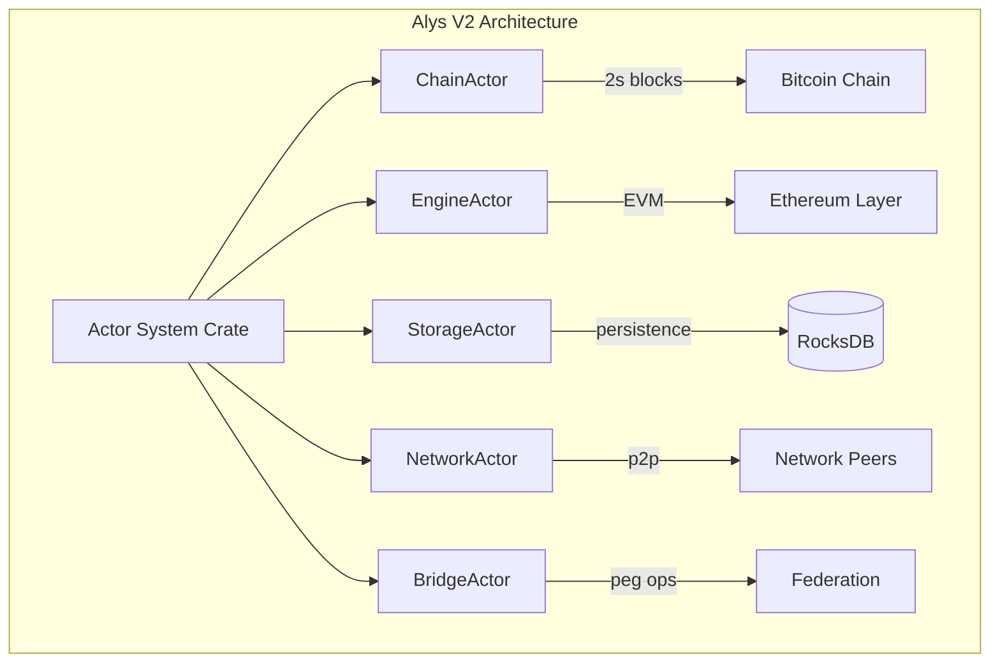
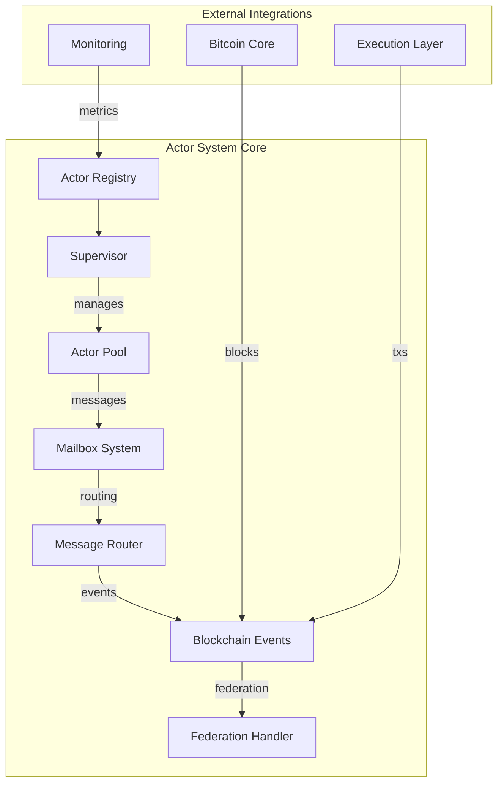
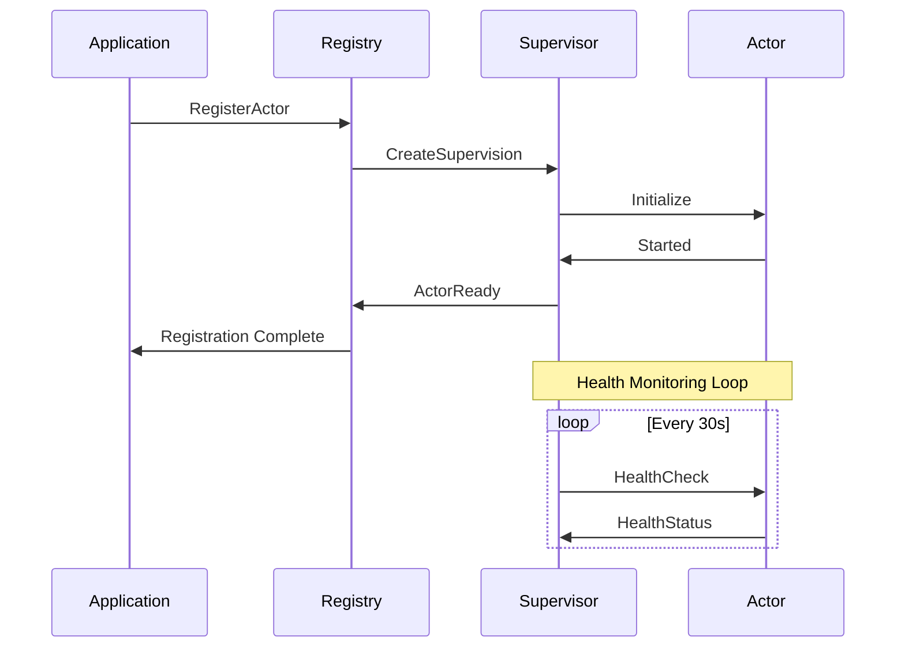
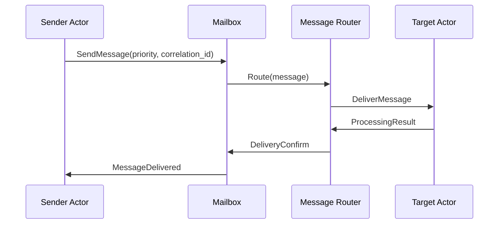
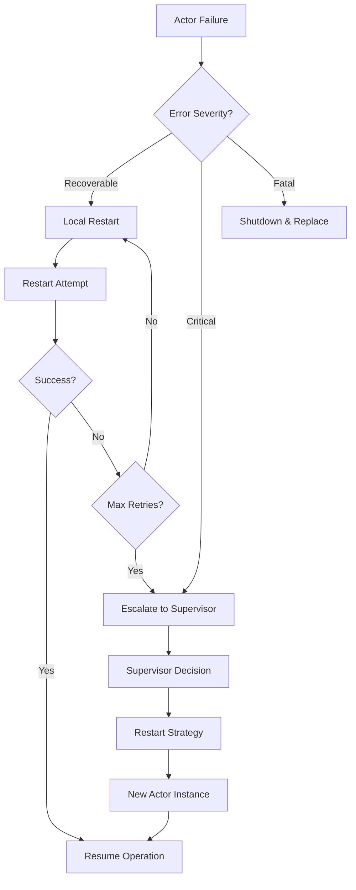

# Actor System Engineer Onboarding Guide for Alys V2

> **🎯 Mission**: Accelerate engineer understanding of the foundational `actor_system` crate that powers all Alys V2 blockchain actors

## 1. Introduction & Purpose

### What is the Actor System?

The `actor_system` crate is the **foundational framework** that underpins all actor-based components in Alys V2. It provides:

- **Blockchain-aware actor primitives** for consensus timing and federation coordination
- **Robust supervision trees** with automatic failure recovery
- **High-performance message routing** with priority queuing and correlation tracking
- **Health monitoring** and metrics collection for production observability
- **Integration patterns** for Bitcoin, Ethereum, and consensus components

### Mission in Alys V2 Architecture


```mermaid
graph TB
    subgraph "Alys V2 Architecture"
        AS[Actor System Crate] --> CA[ChainActor]
        AS --> EA[EngineActor] 
        AS --> SA[StorageActor]
        AS --> NA[NetworkActor]
        AS --> BA[BridgeActor]
        
        CA --> |2s blocks| BC[Bitcoin Chain]
        EA --> |EVM| ETH[Ethereum Layer]
        SA --> |persistence| DB[(RocksDB)]
        NA --> |p2p| PEERS[Network Peers]
        BA --> |peg ops| FED[Federation]
    end
```

The actor system enables:
- ⚡ **Sub-second message processing** across distributed blockchain components
- 🛡️ **Fault-tolerant supervision** with automatic recovery within blockchain timing constraints
- 🔄 **Seamless integration** between Bitcoin merged mining and Ethereum execution
- 📊 **Production-ready monitoring** with comprehensive health tracking

## 2. System Architecture & Core Flows

### Core Architecture Overview


```mermaid
graph TD
    subgraph "Actor System Core"
        REG[Actor Registry] --> SUP[Supervisor]
        SUP --> |manages| ACTORS[Actor Pool]
        ACTORS --> |messages| MB[Mailbox System]
        MB --> |routing| MR[Message Router]
        MR --> |events| BE[Blockchain Events]
        BE --> |federation| FED[Federation Handler]
    end
    
    subgraph "External Integrations"
        BTC[Bitcoin Core] --> |blocks| BE
        ETH[Execution Layer] --> |txs| BE
        MON[Monitoring] --> |metrics| REG
    end
```

### Key Workflows

#### 1. Actor Lifecycle Management


```mermaid
sequenceDiagram
    participant App as Application
    participant Reg as Registry
    participant Sup as Supervisor
    participant Act as Actor
    
    App->>Reg: RegisterActor
    Reg->>Sup: CreateSupervision
    Sup->>Act: Initialize
    Act->>Sup: Started
    Sup->>Reg: ActorReady
    Reg->>App: Registration Complete
    
    Note over Act,Sup: Health Monitoring Loop
    loop Every 30s
        Sup->>Act: HealthCheck
        Act->>Sup: HealthStatus
    end
```

#### 2. Message Processing Flow


```mermaid
sequenceDiagram
    participant Sender as Sender Actor
    participant MB as Mailbox
    participant Router as Message Router  
    participant Target as Target Actor
    
    Sender->>MB: SendMessage(priority, correlation_id)
    MB->>Router: Route(message)
    Router->>Target: DeliverMessage
    Target->>Router: ProcessingResult
    Router->>MB: DeliveryConfirm
    MB->>Sender: MessageDelivered
```

#### 3. Failure Recovery Process


```mermaid
flowchart TD
    A[Actor Failure] --> B{Error Severity?}
    B -->|Recoverable| C[Local Restart]
    B -->|Critical| D[Escalate to Supervisor]
    B -->|Fatal| E[Shutdown & Replace]
    
    C --> F[Restart Attempt]
    F --> G{Success?}
    G -->|Yes| H[Resume Operation]
    G -->|No| I{Max Retries?}
    I -->|No| C
    I -->|Yes| D
    
    D --> J[Supervisor Decision]
    J --> K[Restart Strategy]
    K --> L[New Actor Instance]
    L --> H
```

## 3. Knowledge Tree (Progressive Deep-Dive)

### 🌱 **Roots: Actor Model Fundamentals**

#### Core Concepts
- **Actor**: Isolated unit of computation with private state
- **Message Passing**: Asynchronous communication between actors
- **Supervision**: Hierarchical failure handling and recovery
- **Location Transparency**: Actors communicate via addresses, not direct references

#### Blockchain-Aware Extensions  
- **Timing Constraints**: 2-second block production with sub-100ms consensus latency
- **Federation Coordination**: Multi-sig consensus for peg operations with health monitoring
- **Priority Processing**: Four-tier priority system (Consensus > Bridge > Network > Background)
- **Event Propagation**: Comprehensive blockchain event system with distributed tracing
- **Readiness Validation**: Real-time blockchain readiness assessment for consensus participation

### 🌳 **Trunk: Core Modules**

#### **`actor.rs`** - Foundation Traits

The `actor.rs` module provides the core actor trait definitions and management infrastructure for the Alys V2 actor system. See the comprehensive [AlysActor Deep Dive](./alys_actor_deep_dive.md) for detailed educational content.

```rust
/// Core trait for Alys actors with standardized interface
#[async_trait]
pub trait AlysActor: Actor + LifecycleAware + Send + Sync + 'static {
    /// Configuration type for this actor
    type Config: Clone + Send + Sync + 'static;
    
    /// Error type for this actor (unified with ActorError)
    type Error: Into<ActorError> + std::error::Error + Send + Sync + 'static;
    
    /// Message types this actor can handle
    type Message: AlysMessage + 'static;
    
    /// State type for this actor
    type State: Clone + Send + Sync + 'static;
    
    /// Create new actor instance with configuration
    fn new(config: Self::Config) -> Result<Self, Self::Error>
    where
        Self: Sized;

    /// Get actor type name
    fn actor_type(&self) -> String;
    
    /// Get actor configuration
    fn config(&self) -> &Self::Config;
    
    /// Get actor metrics
    fn metrics(&self) -> &ActorMetrics;
    
    /// Get current actor state
    async fn get_state(&self) -> Self::State;
    
    /// Set actor state
    async fn set_state(&mut self, state: Self::State) -> ActorResult<()>;
    
    /// Get actor mailbox configuration
    fn mailbox_config(&self) -> MailboxConfig {
        MailboxConfig::default()
    }
    
    /// Get supervision policy for this actor
    fn supervision_policy(&self) -> SupervisionPolicy {
        SupervisionPolicy::default()
    }
    
    /// Get actor dependencies (other actors this actor depends on)
    fn dependencies(&self) -> Vec<String> {
        Vec::new()
    }
    
    /// Handle supervisor message
    async fn handle_supervisor_message(&mut self, msg: SupervisorMessage) -> ActorResult<()>;
    
    /// Pre-process message before handling
    async fn pre_process_message(&mut self, envelope: &MessageEnvelope<Self::Message>) -> ActorResult<()>;
    
    /// Post-process message after handling
    async fn post_process_message(&mut self, envelope: &MessageEnvelope<Self::Message>, result: &<Self::Message as Message>::Result) -> ActorResult<()>;
    
    /// Handle message processing error
    async fn handle_message_error(&mut self, envelope: &MessageEnvelope<Self::Message>, error: &ActorError) -> ActorResult<()>;
}

/// Extended actor trait with additional capabilities
#[async_trait]
pub trait ExtendedAlysActor: AlysActor {
    /// Custom initialization logic
    async fn custom_initialize(&mut self) -> ActorResult<()> {
        Ok(())
    }
    
    /// Handle critical errors that may require restart
    async fn handle_critical_error(&mut self, error: ActorError) -> ActorResult<bool> {
        // Return true to request restart, false to continue
        Ok(error.severity().is_critical())
    }
    
    /// Perform periodic maintenance tasks
    async fn maintenance_task(&mut self) -> ActorResult<()> {
        Ok(())
    }
    
    /// Export custom metrics
    async fn export_metrics(&self) -> ActorResult<serde_json::Value>;
    
    /// Handle resource cleanup on restart
    async fn cleanup_resources(&mut self) -> ActorResult<()> {
        Ok(())
    }
}
```

**Key Features:**
- **Unified Interface**: All actors implement `AlysActor` with standardized lifecycle and message handling
- **Type Safety**: Strong typing for configurations, errors, messages, and state
- **Lifecycle Integration**: Built-in integration with lifecycle management and supervision
- **Message Processing**: Enhanced message handling with pre/post processing and error handling
- **Metrics & Observability**: Integrated metrics collection and health monitoring
- **Extensibility**: `ExtendedAlysActor` provides additional capabilities for advanced use cases

#### **`supervisor.rs`** - Supervision Trees

The `supervisor.rs` module provides a comprehensive hierarchical supervision system with blockchain-aware fault tolerance and automatic restart capabilities. See the comprehensive [Supervisor Deep Dive](./supervisor_deep_dive.md) for detailed educational content.

```rust
/// Enhanced supervision system with blockchain timing awareness
pub struct Supervisor {
    /// Supervision tree state containing all child actors
    tree: SupervisionTree,
}

/// Comprehensive supervision tree state
#[derive(Debug)]
pub struct SupervisionTree {
    /// Supervisor identifier
    pub supervisor_id: String,
    /// Child actors being supervised with full metadata
    pub children: HashMap<String, ChildActorInfo>,
    /// Parent supervisor for escalation hierarchy
    pub parent: Option<Recipient<SupervisorMessage>>,
    /// Default supervision policy for new children
    pub default_policy: SupervisionPolicy,
    /// Tree-wide supervision metrics
    pub tree_metrics: SupervisionMetrics,
}

/// Advanced restart strategies with blockchain-aware timing
#[derive(Debug, Clone, Copy, PartialEq, Serialize, Deserialize)]
pub enum RestartStrategy {
    /// Never restart the actor
    Never,
    /// Restart immediately on failure
    Immediate,
    /// Restart after a fixed delay
    Delayed { delay: Duration },
    /// Exponential backoff with jitter for resilient recovery
    ExponentialBackoff {
        initial_delay: Duration,
        max_delay: Duration,
        multiplier: f64,
    },
    /// Progressive delay with max attempts
    Progressive {
        initial_delay: Duration,
        max_attempts: u32,
        delay_multiplier: f64,
    },
}

/// Enhanced escalation strategies for failure handling
#[derive(Debug, Clone, Copy, PartialEq, Eq, Serialize, Deserialize)]
pub enum EscalationStrategy {
    /// Stop the supervisor
    Stop,
    /// Restart the entire supervision tree
    RestartTree,
    /// Escalate to parent supervisor
    EscalateToParent,
    /// Continue without the failed actor
    ContinueWithoutActor,
}

/// Blockchain-aware supervision policy with federation support
#[derive(Debug, Clone, Serialize, Deserialize)]
pub struct BlockchainSupervisionPolicy {
    /// Base supervision policy
    pub base_policy: SupervisionPolicy,
    /// Blockchain-specific restart strategy
    pub blockchain_restart: BlockchainRestartStrategy,
    /// Federation health requirements for consensus operations
    pub federation_requirements: Option<FederationHealthRequirement>,
    /// Blockchain timing constraints (2-second blocks, sub-100ms consensus)
    pub timing_constraints: BlockchainTimingConstraints,
    /// Priority level for supervision decisions
    pub priority: BlockchainActorPriority,
    /// Whether this actor is consensus-critical
    pub consensus_critical: bool,
}
```

**Key Features:**
- **Hierarchical Supervision**: Full parent-child supervision trees with escalation policies
- **Blockchain Timing**: Restart strategies aware of 2-second block constraints and federation timeouts  
- **Advanced Restart Patterns**: Exponential backoff, progressive delays, immediate restarts
- **Federation Integration**: Supervision policies that consider federation health and consensus requirements
- **Metrics & Observability**: Comprehensive supervision metrics with health tracking
- **Fault Isolation**: Configurable failure isolation to prevent cascade failures

#### **`mailbox.rs`** - Enhanced Message Queuing

The `mailbox.rs` module provides sophisticated message queuing with priority handling, backpressure control, and comprehensive metrics. See the comprehensive [Enhanced Mailbox Deep Dive](./enhanced_mailbox_deep_dive.md) for detailed educational content.

```rust
/// Enhanced mailbox with backpressure and priority handling
pub struct EnhancedMailbox<M>
where
    M: AlysMessage + 'static,
{
    /// Mailbox configuration
    config: MailboxConfig,
    /// Message queue with priority support
    queue: Arc<parking_lot::Mutex<PriorityQueue<M>>>,
    /// Backpressure semaphore for flow control
    backpressure_semaphore: Arc<Semaphore>,
    /// Current mailbox metrics
    metrics: Arc<MailboxMetrics>,
    /// Backpressure state tracking
    backpressure_state: Arc<std::sync::atomic::AtomicU8>,
    /// Message processing channel
    message_tx: mpsc::UnboundedSender<QueuedMessage<M>>,
    /// Message processing receiver
    message_rx: Arc<parking_lot::Mutex<Option<mpsc::UnboundedReceiver<QueuedMessage<M>>>>>,
}

/// Priority queue implementation for messages
pub struct PriorityQueue<M>
where
    M: AlysMessage,
{
    /// Priority heap for high/critical messages (Emergency, Critical, High)
    high_priority: BinaryHeap<QueuedMessage<M>>,
    /// FIFO queue for normal priority messages
    normal_priority: VecDeque<QueuedMessage<M>>,
    /// FIFO queue for low priority messages (Low, Background)
    low_priority: VecDeque<QueuedMessage<M>>,
    /// Total message count across all queues
    total_count: usize,
}

/// Message wrapper with metadata for queuing
pub struct QueuedMessage<M>
where
    M: AlysMessage,
{
    /// Enhanced message envelope with tracing
    pub envelope: MessageEnvelope<M>,
    /// Queue entry timestamp
    pub queued_at: SystemTime,
    /// Unique message ID for tracking
    pub message_id: Uuid,
    /// Optional response channel for request-response pattern
    pub response_tx: Option<oneshot::Sender<M::Result>>,
}

/// Mailbox configuration with comprehensive options
#[derive(Debug, Clone, Serialize, Deserialize)]
pub struct MailboxConfig {
    /// Maximum number of messages in mailbox
    pub capacity: usize,
    /// Enable priority queue for messages
    pub enable_priority: bool,
    /// Maximum processing time per message
    pub processing_timeout: Duration,
    /// Backpressure threshold (percentage of capacity)
    pub backpressure_threshold: f64,
    /// Drop old messages when full
    pub drop_on_full: bool,
    /// Metrics collection interval
    pub metrics_interval: Duration,
}

/// Backpressure state for flow control
#[derive(Debug, Clone, Copy, PartialEq, Eq)]
pub enum BackpressureState {
    /// Normal operation (< 50% capacity)
    Normal,
    /// Warning level (50-80% capacity)
    Warning,
    /// Critical level (80-100% capacity)
    Critical,
    /// Blocked (at capacity)
    Blocked,
}

/// Strategy for handling mailbox overflow
#[derive(Debug, Clone, Copy, PartialEq, Eq)]
pub enum OverflowStrategy {
    /// Drop the oldest message
    DropOldest,
    /// Drop the newest message
    DropNewest,
    /// Drop messages based on priority (lowest priority first)
    DropByPriority,
    /// Block until space is available
    Block,
    /// Fail immediately
    Fail,
}
```

**Key Features:**
- **Priority Processing**: Three-tier priority system with binary heap for high-priority messages
- **Backpressure Control**: Semaphore-based flow control with configurable thresholds  
- **Request-Response Pattern**: Built-in support for async request-response messaging
- **Comprehensive Metrics**: Message counts, processing times, queue utilization tracking
- **Overflow Handling**: Multiple strategies for handling mailbox overflow conditions
- **Thread-Safe Operations**: Concurrent access with parking_lot mutex for performance
- **Configuration Flexibility**: Per-actor-type mailbox configuration via MailboxManager
```

### 🌿 **Branches: Subsystems**

#### **Message Router & Communication Bus**

The message routing system provides centralized communication and event distribution across all actors. See the comprehensive [Message Router Deep Dive](./message_router_deep_dive.md) for detailed educational content.

**Core Components:**
- **CommunicationBus** (`crates/actor_system/src/bus.rs`): Centralized message distribution with topic-based subscriptions
- **AlysMessage Trait** (`crates/actor_system/src/message.rs`): Enhanced message interface with priority, timeout, and retry capabilities
- **MessageEnvelope**: Message wrapper with metadata, routing information, and distributed tracing context

**Key Features:**
- **Six-Tier Priority System**: Emergency > Critical > High > Normal > Low > Background
- **Topic-Based Pub/Sub**: Scalable event distribution with configurable subscriber limits (max 1000 per topic)
- **Message Persistence**: Optional message history retention (configurable, default 10,000 messages)
- **Delivery Guarantees**: Configurable retry mechanisms with exponential backoff (max 3 attempts)
- **Flow Control**: Backpressure handling with delivery timeout enforcement (default 30s)
- **Distributed Tracing**: Full message correlation tracking across actor boundaries

#### **Health Monitoring & Metrics**

Comprehensive actor health monitoring with production-ready observability. See the comprehensive [Health Monitoring Deep Dive](./health_monitoring_deep_dive.md) for detailed educational content.

**Core Components:**
- **ActorMetrics** (`crates/actor_system/src/metrics.rs`): Per-actor performance and health metrics collection
- **BusMetrics**: Communication bus performance tracking with atomic counters
- **SupervisionMetrics**: Supervision tree health and restart statistics

**Key Features:**
- **Performance Tracking**: Message processing times, throughput, mailbox utilization, CPU/memory usage
- **Error Classification**: Categorized error counting with custom error type tracking via DashMap
- **Custom Metrics**: Extensible counter and gauge system for application-specific metrics
- **Lifecycle Monitoring**: State transition tracking, restart counting, activity timestamps
- **Prometheus Integration**: Native metrics export in Prometheus format for production monitoring
- **Health Check Framework**: Configurable health check intervals with automatic failure detection

#### **Blockchain Integration & Event System**

Blockchain-aware actor extensions with timing constraints and federation coordination. See the comprehensive [Blockchain Integration Deep Dive](./blockchain_integration_deep_dive.md) for detailed educational content.

**Core Components:**
- **BlockchainAwareActor** (`crates/actor_system/src/blockchain.rs`): Actor trait with blockchain-specific capabilities
- **BlockchainEvent System**: Comprehensive blockchain event types (BlockProduced, BlockFinalized, FederationChange, ConsensusFailure)
- **BlockchainReadiness**: Real-time blockchain operational status validation

**Key Features:**
- **Timing Constraint Enforcement**: 2-second block production windows with sub-100ms consensus latency requirements
- **Federation Health Monitoring**: Multi-sig threshold tracking and member health validation (default 3 of 5 consensus)
- **Priority-Based Actor Classification**: Four-tier system (Consensus > Bridge > Network > Background) for operation prioritization
- **Sync Status Management**: Real-time synchronization progress tracking with 99.5% sync threshold for block production
- **Event Subscription System**: Topic-based blockchain event distribution with type-safe message handling
- **Readiness Validation**: Continuous assessment of actor capability for block production and validation operations

## 4. Codebase Walkthrough

### Directory Structure
```
crates/actor_system/src/
├── actor.rs                    # Core actor traits (AlysActor, ExtendedAlysActor)
├── lifecycle.rs               # Lifecycle management and state transitions
├── supervisor.rs              # Supervision trees and restart logic  
├── supervisors.rs            # Supervisor implementations
├── supervision.rs            # Supervision policies and strategies
├── mailbox.rs                # Message queuing and flow control
├── message.rs                # Enhanced message types and routing
├── blockchain.rs             # Blockchain-aware actor extensions
├── registry.rs               # Actor registration and discovery
├── system.rs                 # Actor system coordination
├── bus.rs                    # Event bus and message routing
├── error.rs                  # Comprehensive error types
├── metrics.rs                # Performance monitoring and metrics
├── testing.rs                # Test utilities and mocks
├── actor_macros.rs          # Convenience macros for actors
├── serialization.rs         # Message serialization
├── prometheus_integration.rs # Prometheus metrics integration
├── prelude.rs               # Common imports and re-exports
├── integration_tests.rs     # Integration test utilities
├── supervision_tests.rs     # Supervision-specific tests
└── lib.rs                   # Public API and exports
```

### Core Integration Points

#### **Actix Runtime Integration**
```rust
// Actor system builds on Actix foundation
use actix::{Actor, Addr, Context, Handler, Message, Recipient};

// Enhanced with blockchain-specific patterns
impl Actor for SupervisorActor {
    type Context = Context<Self>;
    
    fn started(&mut self, ctx: &mut Self::Context) {
        // Start health monitoring
        self.start_health_checks(ctx);
        // Register with metrics collection
        self.register_metrics();
    }
}
```

#### **Blockchain Component Integration**
```rust
/// Enhanced actor trait with blockchain-specific capabilities
#[async_trait]
pub trait BlockchainAwareActor: AlysActor {
    /// Get blockchain timing constraints for this actor
    fn timing_constraints(&self) -> BlockchainTimingConstraints {
        BlockchainTimingConstraints::default()
    }
    
    /// Get federation configuration if this actor participates in federation
    fn federation_config(&self) -> Option<FederationConfig> {
        None
    }
    
    /// Get blockchain-specific priority level
    fn blockchain_priority(&self) -> BlockchainActorPriority {
        BlockchainActorPriority::Background
    }
    
    /// Check if actor is critical for consensus operations
    fn is_consensus_critical(&self) -> bool {
        self.blockchain_priority() == BlockchainActorPriority::Consensus
    }
    
    /// Handle blockchain-specific events (block production, finalization, etc.)
    async fn handle_blockchain_event(&mut self, event: BlockchainEvent) -> ActorResult<()>;
    
    /// Validate that actor can operate under current blockchain conditions
    async fn validate_blockchain_readiness(&self) -> ActorResult<BlockchainReadiness>;
}

// ChainActor integration example
impl BlockchainAwareActor for ChainActor {
    fn timing_constraints(&self) -> BlockchainTimingConstraints {
        BlockchainTimingConstraints {
            block_interval: Duration::from_secs(2),
            max_consensus_latency: Duration::from_millis(100),
            federation_timeout: Duration::from_millis(500),
            auxpow_window: Duration::from_secs(600),
        }
    }
    
    fn federation_config(&self) -> Option<FederationConfig> {
        Some(FederationConfig {
            members: self.state.federation_members.clone(),
            threshold: self.state.federation_threshold,
            health_interval: Duration::from_secs(30),
            min_healthy: 3,
        })
    }
    
    fn blockchain_priority(&self) -> BlockchainActorPriority {
        BlockchainActorPriority::Consensus // Highest priority
    }
    
    fn is_consensus_critical(&self) -> bool {
        true // ChainActor is critical for consensus
    }
    
    async fn handle_blockchain_event(&mut self, event: BlockchainEvent) -> ActorResult<()> {
        match event {
            BlockchainEvent::BlockProduced { height, hash } => {
                info!(height = height, hash = ?hash, "Block produced event received");
                self.state.current_height = height;
                self.state.last_block_hash = hash;
                self.process_block_produced(height, hash).await
            }
            BlockchainEvent::FederationChange { members, threshold } => {
                info!(members = ?members, threshold = threshold, "Federation change");
                self.state.federation_members = members;
                self.state.federation_threshold = threshold;
                self.validate_federation_config().await
            }
            BlockchainEvent::ConsensusFailure { reason } => {
                error!(reason = %reason, "Consensus failure event received");
                self.handle_consensus_failure(reason).await
            }
            _ => Ok(())
        }
    }
    
    async fn validate_blockchain_readiness(&self) -> ActorResult<BlockchainReadiness> {
        let federation_healthy = self.count_healthy_federation_members().await? 
            >= self.state.federation_threshold;
            
        Ok(BlockchainReadiness {
            can_produce_blocks: federation_healthy && self.is_synced(),
            can_validate_blocks: true,
            federation_healthy,
            sync_status: self.state.sync_status,
            last_validated: SystemTime::now(),
        })
    }
}
```

**BlockchainAwareActor Features:**
- **Timing Constraints**: Configurable blockchain timing requirements per actor
- **Federation Integration**: Optional federation participation with health monitoring  
- **Priority System**: Four-tier priority system for blockchain operations
- **Event Handling**: Comprehensive blockchain event processing with async support
- **Readiness Validation**: Real-time assessment of blockchain operational readiness
- **Consensus Criticality**: Built-in identification of consensus-critical actors

### Message Type Examples

#### **Enhanced Message System**

**AlysMessage Trait - Foundation for Enhanced Messaging:**
```rust
/// Enhanced message trait with metadata and routing information
pub trait AlysMessage: Message + Send + Sync + Clone + fmt::Debug {
    /// Get message type name
    fn message_type(&self) -> &'static str {
        type_name::<Self>()
    }
    
    /// Get message priority
    fn priority(&self) -> MessagePriority {
        MessagePriority::Normal
    }
    
    /// Get message timeout
    fn timeout(&self) -> Duration {
        Duration::from_secs(30)
    }
    
    /// Check if message can be retried on failure
    fn is_retryable(&self) -> bool {
        true
    }
    
    /// Get maximum retry attempts
    fn max_retries(&self) -> u32 {
        3
    }
}

/// Message priority levels
#[derive(Debug, Clone, Copy, PartialEq, Eq, PartialOrd, Ord)]
pub enum MessagePriority {
    Background = 0,  // Lowest priority - background tasks
    Low = 1,         // Low priority - maintenance tasks
    Normal = 2,      // Normal priority - regular operations
    High = 3,        // High priority - important operations
    Critical = 4,    // Critical priority - system-critical operations
    Emergency = 5,   // Emergency priority - requires immediate attention
}
```

**Message Envelope with Distributed Tracing:**
```rust
/// Message envelope with metadata and routing information
pub struct MessageEnvelope<T> where T: AlysMessage {
    pub id: Uuid,                    // Unique message ID
    pub payload: T,                  // The actual message payload
    pub metadata: MessageMetadata,   // Enhanced metadata with tracing
    pub routing: MessageRouting,     // Routing information
}

/// Message metadata with enhanced distributed tracing
pub struct MessageMetadata {
    pub created_at: SystemTime,
    pub priority: MessagePriority,
    pub timeout: Duration,
    pub retry_attempt: u32,
    pub max_retries: u32,
    pub retryable: bool,
    pub correlation_id: Option<Uuid>,
    pub trace_context: TraceContext,     // Distributed tracing
    pub causality: CausalityInfo,        // Message causality
    pub performance: MessagePerformanceMetrics,
    pub lineage: MessageLineage,         // Parent-child relationships
    pub attributes: HashMap<String, serde_json::Value>,
}
```

**Standard Message Types:**
```rust
// Health monitoring with enhanced metadata
#[derive(Debug, Clone, Serialize, Deserialize)]
pub struct HealthCheckMessage;

impl AlysMessage for HealthCheckMessage {
    fn message_type(&self) -> &'static str {
        "HealthCheck"
    }
    
    fn priority(&self) -> MessagePriority {
        MessagePriority::Low
    }
    
    fn timeout(&self) -> Duration {
        Duration::from_secs(5)
    }
}

// Lifecycle management messages
#[derive(Debug, Clone)]
pub enum LifecycleMessage {
    Initialize,
    Start,
    Pause,
    Resume,
    Stop { timeout: Duration },
    ForceStop,
    HealthCheck,
    GetState,
    GetStateHistory,
}

impl AlysMessage for LifecycleMessage {
    fn priority(&self) -> MessagePriority {
        match self {
            LifecycleMessage::ForceStop => MessagePriority::Emergency,
            LifecycleMessage::Stop { .. } => MessagePriority::Critical,
            LifecycleMessage::Initialize | LifecycleMessage::Start => MessagePriority::High,
            LifecycleMessage::HealthCheck => MessagePriority::Low,
            _ => MessagePriority::Normal,
        }
    }
}
```

#### **Blockchain Event Messages**
```rust
/// Blockchain events that actors can subscribe to
#[derive(Debug, Clone, Serialize, Deserialize)]
pub enum BlockchainEvent {
    /// New block has been produced
    BlockProduced { height: u64, hash: [u8; 32] },
    /// Block has been finalized via AuxPoW
    BlockFinalized { height: u64, hash: [u8; 32] },
    /// Federation membership has changed
    FederationChange { members: Vec<String>, threshold: usize },
    /// Consensus operation failed
    ConsensusFailure { reason: String },
}

impl Message for BlockchainEvent {
    type Result = ActorResult<()>;
}

/// Types of blockchain events actors can subscribe to
#[derive(Debug, Clone, PartialEq, Eq, Hash, Serialize, Deserialize)]
pub enum BlockchainEventType {
    BlockProduction,
    BlockFinalization,
    FederationChanges,
    ConsensusFailures,
    SyncStatusChanges,
}

/// Message for subscribing to blockchain events
#[derive(Debug, Clone, Message)]
#[rtype(result = "ActorResult<()>")]
pub struct SubscribeToBlockchainEvents {
    pub subscriber: actix::Recipient<BlockchainEvent>,
    pub event_types: Vec<BlockchainEventType>,
}

/// Message for updating blockchain readiness status
#[derive(Debug, Clone, Message)]
#[rtype(result = "ActorResult<BlockchainReadiness>")]
pub struct CheckBlockchainReadiness;
```

#### **Lifecycle Management System**

**Actor Lifecycle States:**
```rust
/// Actor lifecycle states
#[derive(Debug, Clone, Copy, PartialEq, Eq, Serialize, Deserialize)]
pub enum ActorState {
    /// Actor is initializing
    Initializing,
    /// Actor is running and healthy
    Running,
    /// Actor is paused
    Paused,
    /// Actor is shutting down gracefully
    Stopping,
    /// Actor has stopped
    Stopped,
    /// Actor failed and needs restart
    Failed,
    /// Actor is restarting
    Restarting,
}

/// Actor lifecycle configuration
#[derive(Debug, Clone, Serialize, Deserialize)]
pub struct LifecycleConfig {
    /// Maximum time for initialization
    pub init_timeout: Duration,
    /// Maximum time for graceful shutdown
    pub shutdown_timeout: Duration,
    /// Health check interval
    pub health_check_interval: Duration,
    /// Enable automatic health checks
    pub auto_health_check: bool,
    /// Maximum consecutive health check failures before marking failed
    pub max_health_failures: u32,
    /// Enable state transition logging
    pub log_state_transitions: bool,
}
```

**LifecycleAware Trait:**
```rust
/// Trait for lifecycle-aware actors
#[async_trait]
pub trait LifecycleAware: Actor {
    /// Initialize the actor (called after construction)
    async fn initialize(&mut self) -> ActorResult<()>;

    /// Handle actor startup (called after initialization)
    async fn on_start(&mut self) -> ActorResult<()>;

    /// Handle pause request
    async fn on_pause(&mut self) -> ActorResult<()>;

    /// Handle resume request
    async fn on_resume(&mut self) -> ActorResult<()>;

    /// Handle shutdown request
    async fn on_shutdown(&mut self, timeout: Duration) -> ActorResult<()>;

    /// Perform health check
    async fn health_check(&self) -> ActorResult<bool>;

    /// Handle state transition
    async fn on_state_change(&mut self, from: ActorState, to: ActorState) -> ActorResult<()>;

    /// Get actor type name
    fn actor_type(&self) -> &str;

    /// Get actor configuration
    fn lifecycle_config(&self) -> LifecycleConfig {
        LifecycleConfig::default()
    }
}

## 5. Procedural Debugging & Worked Examples

### Common Debugging Scenarios

#### **Scenario 1: Actor Restart Cascade**

**Problem**: Chain of actor failures causing system instability

**Symptoms**:
```
ERROR actor_system::supervisor: Actor 'storage-actor' failed: DatabaseConnection timeout
WARN  actor_system::supervisor: Restarting 'storage-actor' (attempt 1/5)  
ERROR actor_system::supervisor: Actor 'chain-actor' failed: Storage unavailable
ERROR actor_system::supervisor: Actor 'engine-actor' failed: Chain state unavailable
```

**Debugging Steps**:
```bash
# 1. Check supervision tree status
RUST_LOG=actor_system::supervisor=debug cargo run

# 2. Examine actor dependencies
grep -r "storage-actor" app/src/actors/*/

# 3. Check resource availability
# Storage actor likely failing due to external dependency
```

**Solution Pattern**:
```rust
// Implement dependency-aware restart strategies
impl RestartStrategy {
    pub fn with_dependency_check(deps: Vec<ActorName>) -> Self {
        Self::ConditionalRestart {
            condition: Box::new(move |ctx| {
                deps.iter().all(|dep| ctx.is_actor_healthy(dep))
            }),
            max_attempts: 3,
            backoff: Duration::from_secs(5),
        }
    }
}
```

#### **Scenario 2: Message Queue Overflow**

**Problem**: High message volume overwhelming actor processing

**Symptoms**:
```
WARN actor_system::mailbox: Queue overflow for 'chain-actor': 10000/8192 messages
ERROR actor_system::mailbox: Dropping low-priority messages to prevent OOM
WARN actor_system::metrics: Message latency exceeded threshold: 2.1s > 100ms
```

**Debugging Steps**:
```bash
# 1. Check queue depths
RUST_LOG=actor_system::mailbox=debug

# 2. Analyze message priorities
grep "MessagePriority::" logs/actor_system.log | sort | uniq -c

# 3. Profile message processing times
cargo flamegraph --bin alys -- --profile
```

**Solution Pattern**:
```rust
// Implement backpressure and selective message dropping
impl MailboxConfig {
    pub fn with_overflow_strategy(strategy: OverflowStrategy) -> Self {
        Self {
            max_capacity: 8192,
            overflow_strategy: strategy,
            flow_control: FlowControlConfig {
                enable_backpressure: true,
                priority_preservation: true,
                drop_low_priority_threshold: 0.8,
            }
        }
    }
}
```

#### **Scenario 3: Blockchain Timing Violations**

**Problem**: Consensus actors missing 2-second block deadlines

**Symptoms**:
```
ERROR actor_system::blockchain: ChainActor missed block deadline: 2.15s > 2.0s
WARN  actor_system::blockchain: Federation threshold not met within timeout
ERROR consensus: Block production halted due to timing violations
```

**Debugging Steps**:
```bash
# 1. Check blockchain-specific metrics
RUST_LOG=actor_system::blockchain=debug

# 2. Analyze consensus actor performance
cargo bench --bench blockchain_timing

# 3. Profile critical path operations
perf record -g cargo run --release
```

**Solution Pattern**:
```rust
// Implement timing-aware message processing
impl BlockchainAwareActor for ChainActor {
    async fn handle_blockchain_event(&mut self, event: BlockchainEvent) -> ActorResult<()> {
        let start = Instant::now();
        let result = match event {
            BlockchainEvent::BlockProduced { .. } => {
                // Fast-path processing for time-critical events
                self.handle_block_produced_fast_path().await
            }
            _ => self.handle_event_standard(event).await,
        };
        
        // Enforce timing constraints
        let elapsed = start.elapsed();
        if elapsed > self.timing_constraints().max_consensus_latency {
            warn!("Timing violation: {}ms > {}ms", 
                elapsed.as_millis(), 
                self.timing_constraints().max_consensus_latency.as_millis());
        }
        
        result
    }
}
```

## 6. Environment Setup & Tooling

### Local Development Setup

#### **Prerequisites**
```bash
# Rust toolchain
rustup install 1.87.0
rustup default 1.87.0

# Development tools
cargo install cargo-watch
cargo install flamegraph
cargo install cargo-criterion
```

#### **Actor System Development Environment**
```bash
# 1. Clone and build
git clone https://github.com/AnduroProject/alys.git
cd alys

# 2. Build actor system crate
cargo build -p actor_system

# 3. Run comprehensive tests
cargo test -p actor_system --lib

# 4. Run integration tests
cargo test -p actor_system --test integration_tests

# 5. Start development environment with debugging
RUST_LOG=actor_system=debug,actix=trace cargo run
```

#### **Configuration Files**
```toml
# crates/actor_system/Cargo.toml
[dependencies]
actix = "0.13"
tokio = { version = "1.0", features = ["full"] }
tracing = "0.1"
serde = { version = "1.0", features = ["derive"] }
uuid = { version = "1.0", features = ["v4"] }

[dev-dependencies]
actix-rt = "2.0"
criterion = "0.5"
```

### Testing & Debugging Commands

#### **Core Testing**
```bash
# Unit tests with coverage
cargo test -p actor_system --lib -- --nocapture

# Specific test modules
cargo test -p actor_system actor::tests
cargo test -p actor_system supervisor::tests
cargo test -p actor_system blockchain::tests

# Integration tests
cargo test -p actor_system --test '*' 

# Benchmark tests
cargo bench -p actor_system
```

#### **Debug Configurations**
```bash
# Comprehensive debugging
export RUST_LOG="actor_system=debug,actix=trace"

# Specific module debugging
export RUST_LOG="actor_system::supervisor=debug"
export RUST_LOG="actor_system::blockchain=info"
export RUST_LOG="actor_system::mailbox=trace"

# Performance profiling
export RUST_LOG="actor_system::metrics=debug"
```

#### **Development Utilities**
```bash
# Watch for changes and re-run tests
cargo watch -x "test -p actor_system"

# Profile performance
cargo flamegraph --bin actor_system_benchmark

# Memory profiling
cargo run --bin actor_system_example --features mem-profiling

# Async runtime debugging
tokio-console --retain-for 30s
```

## 7. Testing & CI/CD Integration

### Test Architecture

#### **Unit Tests** (Location: `src/*/tests.rs`)
```rust
// Example: Actor lifecycle tests
#[cfg(test)]
mod tests {
    use super::*;
    use actix::System;

    #[actix::test]
    async fn test_actor_registration() {
        let registry = ActorRegistry::new().start();
        let config = TestActorConfig::default();
        
        // Test registration
        let result = registry.send(RegisterActor {
            name: "test-actor".to_string(),
            factory: Box::new(TestActorFactory::new(config)),
            priority: BlockchainActorPriority::Background,
        }).await;
        
        assert!(result.is_ok());
        
        // Test health check
        let health = registry.send(HealthCheck).await;
        assert!(health.unwrap().is_healthy());
    }

    #[actix::test]
    async fn test_supervision_restart() {
        // Test restart strategies under various failure conditions
        let supervisor = SupervisorActor::new(RestartStrategy::ExponentialBackoff {
            initial_delay: Duration::from_millis(100),
            max_delay: Duration::from_secs(1),
            multiplier: 2.0,
        }).start();
        
        // Simulate actor failure
        supervisor.do_send(ActorFailed {
            actor_name: "test-actor".to_string(),
            error: ActorError::Timeout,
            restart_attempt: 1,
        });
        
        // Verify restart behavior
        tokio::time::sleep(Duration::from_millis(150)).await;
        let status = supervisor.send(GetActorStatus {
            name: "test-actor".to_string()
        }).await.unwrap();
        
        assert_eq!(status.state, ActorState::Running);
    }
}
```

#### **Integration Tests** (Location: `tests/integration_tests.rs`)
```rust
// Full actor system integration tests
#[tokio::test]
async fn test_full_actor_system_integration() {
    let system = ActorSystem::new();
    
    // Register multiple actors with dependencies
    let chain_actor = system.register_actor("chain", ChainActorFactory::new()).await?;
    let engine_actor = system.register_actor("engine", EngineActorFactory::new()).await?;
    let storage_actor = system.register_actor("storage", StorageActorFactory::new()).await?;
    
    // Test blockchain event propagation
    system.broadcast_event(BlockchainEvent::BlockProduced {
        height: 1,
        hash: [0u8; 32],
    }).await?;
    
    // Verify all actors received and processed the event
    tokio::time::sleep(Duration::from_millis(100)).await;
    
    let chain_status = chain_actor.send(GetStatus).await?;
    assert_eq!(chain_status.last_block_height, 1);
}
```

#### **Performance Tests** (Location: `benches/actor_benchmarks.rs`)
```rust
use criterion::{criterion_group, criterion_main, Criterion};

fn benchmark_message_throughput(c: &mut Criterion) {
    c.bench_function("message_throughput_10k", |b| {
        b.iter(|| {
            let rt = Runtime::new().unwrap();
            rt.block_on(async {
                let system = ActorSystem::new();
                let actor = system.register_test_actor().await;
                
                // Send 10,000 messages and measure throughput
                let start = Instant::now();
                for i in 0..10_000 {
                    actor.try_send(TestMessage { id: i }).unwrap();
                }
                
                // Wait for all messages to be processed
                while actor.send(GetQueueDepth).await.unwrap() > 0 {
                    tokio::time::sleep(Duration::from_millis(1)).await;
                }
                
                start.elapsed()
            })
        });
    });
}

criterion_group!(benches, benchmark_message_throughput);
criterion_main!(benches);
```

### CI/CD Pipeline Integration

#### **GitHub Actions Workflow**
```yaml
# .github/workflows/actor_system_tests.yml
name: Actor System Tests

on:
  push:
    paths: 
      - 'crates/actor_system/**'
      - 'app/src/actors/**'

jobs:
  test:
    runs-on: ubuntu-latest
    steps:
      - uses: actions/checkout@v3
      
      - name: Setup Rust
        uses: actions-rs/toolchain@v1
        with:
          toolchain: 1.87.0
          components: clippy, rustfmt
          
      - name: Cache dependencies
        uses: actions/cache@v3
        with:
          path: |
            ~/.cargo/registry
            ~/.cargo/git
            target
          key: ${{ runner.os }}-cargo-${{ hashFiles('**/Cargo.lock') }}
          
      - name: Build actor_system
        run: cargo build -p actor_system
        
      - name: Run unit tests
        run: cargo test -p actor_system --lib
        
      - name: Run integration tests
        run: cargo test -p actor_system --test '*'
        
      - name: Run benchmarks
        run: cargo bench -p actor_system --no-run
        
      - name: Check formatting
        run: cargo fmt -p actor_system -- --check
        
      - name: Run clippy
        run: cargo clippy -p actor_system -- -D warnings
        
      - name: Test actor system integration
        run: |
          ./scripts/start_network.sh --test-mode &
          sleep 30
          cargo test --test actor_system_e2e
          ./scripts/stop_network.sh
```

## 8. Pro Tips & Quick Reference

### **🚀 Performance Optimization Tips**

#### **Message Processing**
```rust
// ✅ DO: Use message priorities effectively
impl Handler<CriticalMessage> for MyActor {
    type Result = ResponseActFuture<Self, Result<(), ActorError>>;
    
    fn handle(&mut self, msg: CriticalMessage, _: &mut Context<Self>) -> Self::Result {
        // Mark as high priority for consensus operations
        Box::pin(async move {
            self.process_with_priority(msg, MessagePriority::High).await
        }.into_actor(self))
    }
}

// ❌ AVOID: Blocking operations in message handlers
impl Handler<SlowMessage> for MyActor {
    fn handle(&mut self, msg: SlowMessage, _: &mut Context<Self>) -> Self::Result {
        // ❌ This blocks the entire actor
        std::thread::sleep(Duration::from_secs(1));
        
        // ✅ Use async operations instead
        Box::pin(async move {
            tokio::time::sleep(Duration::from_secs(1)).await;
            Ok(())
        }.into_actor(self))
    }
}
```

#### **Memory Management**
```rust
// ✅ DO: Implement bounded queues with overflow strategies
let mailbox_config = MailboxConfig {
    max_capacity: 1024,
    overflow_strategy: OverflowStrategy::DropOldest,
    flow_control: true,
};

// ✅ DO: Use object pools for frequent allocations
struct MessagePool {
    pool: Vec<Box<dyn Message>>,
    metrics: PoolMetrics,
}

impl MessagePool {
    fn get_message<T: Message + Default>(&mut self) -> Box<T> {
        self.pool.pop()
            .and_then(|msg| msg.downcast::<T>().ok())
            .unwrap_or_else(|| Box::new(T::default()))
    }
}
```

### **🛡️ Error Handling Best Practices**

```rust
// ✅ DO: Use specific error types with context
#[derive(Debug, Error)]
pub enum ActorError {
    #[error("Message delivery failed from {from} to {to}: {reason}")]
    MessageDeliveryFailed {
        from: String,
        to: String, 
        reason: String,
    },
    
    #[error("Health check failed for actor {actor_name}: {details}")]
    HealthCheckFailed {
        actor_name: String,
        details: String,
    },
    
    #[error("Blockchain timing violation: {operation} took {actual_ms}ms > {limit_ms}ms")]
    TimingViolation {
        operation: String,
        actual_ms: u64,
        limit_ms: u64,
    },
}

// ✅ DO: Implement retry strategies with backoff
pub struct RetryConfig {
    pub max_attempts: u32,
    pub initial_delay: Duration,
    pub max_delay: Duration,
    pub multiplier: f64,
}

impl RetryConfig {
    pub async fn retry<F, T, E>(&self, mut operation: F) -> Result<T, E>
    where
        F: FnMut() -> Result<T, E>,
        E: std::error::Error,
    {
        let mut delay = self.initial_delay;
        
        for attempt in 1..=self.max_attempts {
            match operation() {
                Ok(result) => return Ok(result),
                Err(e) if attempt == self.max_attempts => return Err(e),
                Err(_) => {
                    tokio::time::sleep(delay).await;
                    delay = (delay * self.multiplier as u32).min(self.max_delay);
                }
            }
        }
        
        unreachable!()
    }
}
```

### **📊 Monitoring & Observability**

```rust
// ✅ DO: Implement comprehensive metrics
#[derive(Debug, Clone)]
pub struct ActorMetrics {
    pub messages_processed: AtomicU64,
    pub messages_failed: AtomicU64,
    pub avg_processing_time: AtomicU64, // microseconds
    pub queue_depth: AtomicU64,
    pub last_health_check: AtomicU64, // timestamp
    pub uptime_seconds: AtomicU64,
}

impl ActorMetrics {
    pub fn record_message_processed(&self, processing_time: Duration) {
        self.messages_processed.fetch_add(1, Ordering::Relaxed);
        let time_us = processing_time.as_micros() as u64;
        
        // Update rolling average (simplified)
        let current_avg = self.avg_processing_time.load(Ordering::Relaxed);
        let new_avg = (current_avg * 9 + time_us) / 10; // 90% weight to history
        self.avg_processing_time.store(new_avg, Ordering::Relaxed);
    }
    
    pub fn prometheus_metrics(&self) -> String {
        format!(
            r#"
            actor_messages_processed_total {{}} {}
            actor_messages_failed_total {{}} {}  
            actor_avg_processing_time_microseconds {{}} {}
            actor_queue_depth {{}} {}
            actor_uptime_seconds {{}} {}
            "#,
            self.messages_processed.load(Ordering::Relaxed),
            self.messages_failed.load(Ordering::Relaxed),
            self.avg_processing_time.load(Ordering::Relaxed),
            self.queue_depth.load(Ordering::Relaxed),
            self.uptime_seconds.load(Ordering::Relaxed)
        )
    }
}

// ✅ DO: Use distributed tracing for complex flows
use tracing::{info_span, instrument};

#[instrument(skip(self), fields(actor_name = %self.name, message_type = %std::any::type_name::<M>()))]
pub async fn send_message<M>(&self, message: M) -> Result<(), ActorError>
where
    M: Message + Send + 'static,
{
    let span = info_span!("send_message", correlation_id = %Uuid::new_v4());
    async move {
        // Message processing with full tracing context
        self.process_message_traced(message).await
    }.instrument(span).await
}
```

### **📝 Quick Reference Cheatsheet**

| **Operation** | **Command** | **Purpose** |
|---------------|-------------|-------------|
| Build | `cargo build -p actor_system` | Compile actor system crate |
| Test | `cargo test -p actor_system --lib` | Run unit tests |
| Integration | `cargo test -p actor_system --test '*'` | Run integration tests |
| Benchmark | `cargo bench -p actor_system` | Performance benchmarks |
| Debug | `RUST_LOG=actor_system=debug cargo run` | Enable debug logging |
| Profile | `cargo flamegraph --bin benchmark` | Performance profiling |
| Format | `cargo fmt -p actor_system` | Code formatting |
| Lint | `cargo clippy -p actor_system` | Static analysis |

| **Debug Environment Variables** |
|-----------------------------------|
| `RUST_LOG=actor_system=debug` - Enable debug logs |
| `RUST_LOG=actor_system::supervisor=trace` - Supervision debugging |
| `RUST_LOG=actor_system::blockchain=info` - Blockchain events |
| `ACTIX_LOG=trace` - Actix runtime debugging |
| `TOKIO_CONSOLE=1` - Enable tokio-console |

## 9. Glossary & Further Learning Paths

### **📚 Key Terms**

| **Term** | **Definition** |
|----------|----------------|
| **Actor** | Isolated unit of computation with private state that communicates via messages |
| **Supervision Tree** | Hierarchical structure where parent actors monitor and restart failed children |
| **Message Envelope** | Wrapper containing message, priority, correlation ID, and metadata |
| **BlockchainAware** | Actor trait extension with blockchain timing and federation constraints |
| **Federation** | Multi-sig consensus mechanism for Bitcoin peg operations |
| **AuxPoW** | Auxiliary Proof-of-Work for Bitcoin merged mining |
| **Correlation ID** | Unique identifier for tracing messages across actor boundaries |
| **Flow Control** | Backpressure mechanism to prevent message queue overflow |
| **Escalation** | Process of forwarding failures up the supervision hierarchy |
| **Health Check** | Periodic verification of actor operational status |

### **🎓 Learning Paths**

#### **Beginner Path** (2-3 weeks)
1. **Week 1: Actor Model Fundamentals**
   - Read "Actor Model" paper by Carl Hewitt
   - Complete Actix tutorials: https://actix.rs/docs/
   - Practice with simple actor examples

2. **Week 2: Actor System Basics**
   - Study `crates/actor_system/src/actor.rs`
   - Implement simple actors using `AlysActor` trait
   - Write basic unit tests

3. **Week 3: Message Handling**
   - Explore message types in `message.rs`
   - Practice message routing and priority handling
   - Implement health check mechanisms

#### **Intermediate Path** (3-4 weeks)  
1. **Week 1-2: Supervision Systems**
   - Study supervision patterns in `supervisor.rs`
   - Implement custom restart strategies
   - Practice failure recovery scenarios

2. **Week 3: Blockchain Integration**
   - Understand blockchain-aware actors
   - Implement timing constraint validation
   - Study federation coordination patterns

3. **Week 4: Performance & Monitoring**
   - Learn metrics collection and reporting
   - Practice performance optimization
   - Implement distributed tracing

#### **Advanced Path** (4-6 weeks)
1. **Week 1-2: Advanced Architecture**
   - Design complex supervision hierarchies
   - Implement custom mailbox strategies
   - Study actor system internals

2. **Week 3-4: Production Integration**
   - Implement monitoring and alerting
   - Practice chaos engineering scenarios
   - Performance tuning under load

3. **Week 5-6: Contribution & Mastery**
   - Contribute to actor system features
   - Mentor other team members
   - Design new blockchain-aware patterns

### **📖 Additional Resources**

#### **Essential Reading**
- [Actix Documentation](https://actix.rs/docs/)
- [Actor Model - Wikipedia](https://en.wikipedia.org/wiki/Actor_model)
- [Erlang OTP Design Principles](https://erlang.org/doc/design_principles/users_guide.html)
- [Akka Documentation](https://doc.akka.io/docs/akka/current/) (Reference implementation)

#### **Alys-Specific Resources**
- `/docs/knowledge/root.knowledge.md` - Master system architecture
- `/docs/knowledge/app.knowledge.md` - Application layer details
- `/docs/v2/actors/chain/onboarding.knowledge.md` - ChainActor specifics
- `/scripts/tests/` - Integration test examples

#### **Performance & Debugging**
- [Tokio Console](https://github.com/tokio-rs/console) - Async runtime debugging
- [Flamegraph](https://github.com/flamegraph-rs/flamegraph) - Performance profiling
- [Criterion](https://bheisler.github.io/criterion.rs/) - Benchmarking framework

---

## 🎯 Day 1 Checklist

- [ ] **Environment Setup** - Build and test actor_system crate
- [ ] **Core Concepts** - Understand actor model and supervision  
- [ ] **Code Walkthrough** - Explore main modules (actor.rs, supervisor.rs)
- [ ] **First Implementation** - Create a simple actor using AlysActor trait
- [ ] **Testing** - Write and run unit tests for your actor
- [ ] **Integration** - Connect your actor to the supervision system
- [ ] **Debugging** - Practice with debug logging and health checks
- [ ] **Documentation** - Read through this guide and bookmark key sections

**🚀 You're ready to build robust, fault-tolerant actors for Alys V2!**