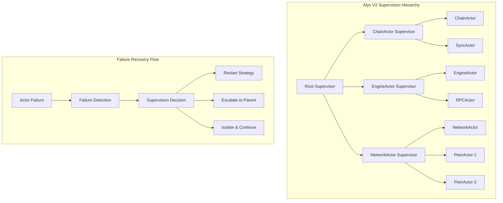
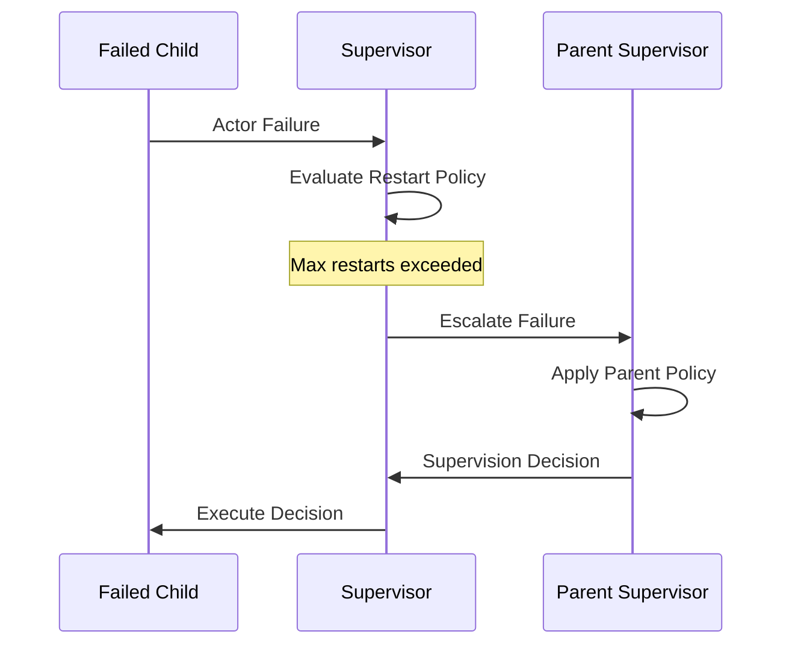

# Supervisor Deep Dive: Complete Guide to Alys V2 Actor Supervision

> **🎯 Objective**: Master the supervision tree architecture that powers fault-tolerant blockchain operations in Alys V2

## Table of Contents

1. [Introduction & Architecture](#1-introduction--architecture)
2. [Core Components Deep Dive](#2-core-components-deep-dive)  
3. [Supervision Strategies & Patterns](#3-supervision-strategies--patterns)
4. [Blockchain-Aware Supervision](#4-blockchain-aware-supervision)
5. [Implementation Examples](#5-implementation-examples)
6. [Advanced Use Cases](#6-advanced-use-cases)
7. [Debugging & Troubleshooting](#7-debugging--troubleshooting)
8. [Best Practices](#8-best-practices)

## 1. Introduction & Architecture

### What is Actor Supervision?

Actor supervision is a **hierarchical fault tolerance mechanism** where parent actors monitor and manage the lifecycle of their children. In Alys V2's blockchain context, supervision becomes critical for maintaining consensus timing and ensuring continuous block production.



### Core Principles

1. **Fault Isolation**: Failures are contained to prevent cascade failures
2. **Automatic Recovery**: Failed actors are automatically restarted based on policies
3. **Hierarchical Escalation**: Complex failures can be escalated up the supervision tree
4. **Blockchain Timing**: Supervision respects blockchain timing constraints (2-second blocks)
5. **Federation Awareness**: Supervision considers federation health for consensus actors

## 2. Core Components Deep Dive

### 2.1 The Supervisor Actor

```rust
/// The main supervisor actor that manages child actor lifecycle
pub struct Supervisor {
    /// Complete supervision tree state
    tree: SupervisionTree,
}

/// Supervision tree containing all management state
#[derive(Debug)]
pub struct SupervisionTree {
    /// Unique identifier for this supervisor
    pub supervisor_id: String,
    
    /// Map of child actor ID -> metadata and health info
    pub children: HashMap<String, ChildActorInfo>,
    
    /// Optional parent supervisor for escalation
    pub parent: Option<Recipient<SupervisorMessage>>,
    
    /// Default policy applied to new children
    pub default_policy: SupervisionPolicy,
    
    /// Aggregated metrics across all children
    pub tree_metrics: SupervisionMetrics,
}
```

**Key Implementation Details (`crates/actor_system/src/supervisor.rs:337-349`)**:
```rust
impl Supervisor {
    /// Create new supervisor with default policy
    pub fn new(supervisor_id: String) -> Self {
        Self {
            tree: SupervisionTree {
                supervisor_id,
                children: HashMap::new(),
                parent: None,
                default_policy: SupervisionPolicy::default(),
                tree_metrics: SupervisionMetrics::default(),
            },
        }
    }
}
```

### 2.2 Child Actor Information

```rust
/// Complete metadata tracked for each supervised child actor
#[derive(Debug)]
pub struct ChildActorInfo {
    /// Unique child identifier
    pub id: String,
    
    /// Type-erased actor address for communication
    pub addr: Box<dyn Any + Send>,
    
    /// Human-readable actor type (e.g., "ChainActor", "EngineActor")
    pub actor_type: String,
    
    /// Current restart count within the policy window
    pub restart_count: u32,
    
    /// Timestamp of most recent restart
    pub last_restart: Option<SystemTime>,
    
    /// Supervision policy specific to this child
    pub policy: SupervisionPolicy,
    
    /// Current health status
    pub is_healthy: bool,
    
    /// Performance and operational metrics
    pub metrics: ActorMetrics,
    
    /// List of other actors this one depends on
    pub dependencies: Vec<String>,
}
```

### 2.3 Supervision Metrics

```rust
/// Comprehensive metrics for supervision tree health monitoring
#[derive(Debug, Default, Clone, Serialize, Deserialize)]
pub struct SupervisionMetrics {
    /// Total number of child actors being supervised
    pub total_children: usize,
    
    /// Number of currently healthy children
    pub healthy_children: usize,
    
    /// Cumulative restart operations performed
    pub total_restarts: u64,
    
    /// Number of failures escalated to parent
    pub escalations: u64,
    
    /// Total uptime of this supervision tree
    pub uptime: Duration,
    
    /// Timestamp of most recent health check
    pub last_health_check: Option<SystemTime>,
}
```

**Prometheus Metrics Export**:
```rust
impl SupervisionMetrics {
    pub fn to_prometheus(&self, supervisor_id: &str) -> String {
        format!(r#"
            # HELP supervisor_children_total Total number of supervised children
            supervisor_children_total{{supervisor_id="{}"}} {}
            
            # HELP supervisor_healthy_children Number of healthy children
            supervisor_healthy_children{{supervisor_id="{}"}} {}
            
            # HELP supervisor_restarts_total Total restart operations
            supervisor_restarts_total{{supervisor_id="{}"}} {}
            
            # HELP supervisor_escalations_total Total escalations to parent
            supervisor_escalations_total{{supervisor_id="{}"}} {}
            
            # HELP supervisor_uptime_seconds Supervisor uptime in seconds
            supervisor_uptime_seconds{{supervisor_id="{}"}} {}
        "#, supervisor_id, self.total_children,
            supervisor_id, self.healthy_children,
            supervisor_id, self.total_restarts,
            supervisor_id, self.escalations,
            supervisor_id, self.uptime.as_secs())
    }
}
```

## 3. Supervision Strategies & Patterns

### 3.1 Restart Strategies

#### Exponential Backoff (Default)
```rust
/// Exponential backoff with configurable parameters
RestartStrategy::ExponentialBackoff {
    initial_delay: Duration::from_millis(100),  // Start with 100ms
    max_delay: Duration::from_secs(30),         // Cap at 30 seconds
    multiplier: 2.0,                            // Double each attempt
}
```

**Implementation (`crates/actor_system/src/supervisor.rs:100-107`)**:
```rust
RestartStrategy::ExponentialBackoff {
    initial_delay,
    max_delay,
    multiplier,
} => {
    let delay = initial_delay.as_millis() as f64 * multiplier.powi(attempt as i32);
    Some(Duration::from_millis(delay.min(max_delay.as_millis() as f64) as u64))
}
```

**Use Cases**:
- General-purpose fault tolerance
- Network connectivity issues
- Temporary resource unavailability
- Non-consensus actors (StorageActor, MetricsActor)

#### Progressive Delays
```rust
/// Progressive delays with maximum attempt limit
RestartStrategy::Progressive {
    initial_delay: Duration::from_millis(200),
    max_attempts: 5,                            // Stop after 5 attempts
    delay_multiplier: 2.0,
}
```

**Use Cases**:
- Federation-related actors where unlimited retries are problematic
- Resource-constrained environments
- Actors with external dependencies

#### Immediate Restart
```rust
/// Restart immediately without delay
RestartStrategy::Immediate
```

**Use Cases**:
- Consensus-critical actors (ChainActor, EngineActor)
- Time-sensitive blockchain operations
- Actors where downtime costs exceed restart costs

### 3.2 Escalation Strategies

#### Escalate to Parent (Default)


#### Restart Entire Tree
```rust
EscalationStrategy::RestartTree
```

**Implementation (`crates/actor_system/src/supervisor.rs:540-563`)**:
```rust
async fn restart_tree(&mut self) {
    info!(
        supervisor_id = %self.tree.supervisor_id,
        children_count = self.tree.children.len(),
        "Restarting supervision tree"
    );

    // Mark all children as unhealthy and increment restart counts
    for (child_id, child) in self.tree.children.iter_mut() {
        child.is_healthy = false;
        child.restart_count += 1;
        child.last_restart = Some(SystemTime::now());
    }

    self.tree.tree_metrics.total_restarts += 1;

    // Restart all children (implementation would send restart messages)
    for (child_id, child) in self.tree.children.iter_mut() {
        child.is_healthy = true;
        info!("Restarted child in tree restart: {}", child_id);
    }

    self.update_healthy_count();
}
```

## 4. Blockchain-Aware Supervision

### 4.1 Blockchain Supervision Policy

```rust
/// Enhanced supervision with blockchain-specific considerations
#[derive(Debug, Clone, Serialize, Deserialize)]
pub struct BlockchainSupervisionPolicy {
    /// Standard supervision policy base
    pub base_policy: SupervisionPolicy,
    
    /// Blockchain-specific restart logic
    pub blockchain_restart: BlockchainRestartStrategy,
    
    /// Federation health requirements for consensus operations  
    pub federation_requirements: Option<FederationHealthRequirement>,
    
    /// Blockchain timing constraints (2-second blocks, etc.)
    pub timing_constraints: BlockchainTimingConstraints,
    
    /// Actor priority level for blockchain operations
    pub priority: BlockchainActorPriority,
    
    /// Whether this actor is critical for consensus
    pub consensus_critical: bool,
}
```

### 4.2 Blockchain Timing Constraints

```rust
/// Timing constraints specific to Alys blockchain operations  
#[derive(Debug, Clone, Serialize, Deserialize)]
pub struct BlockchainTimingConstraints {
    /// Block production interval (2 seconds for Alys)
    pub block_interval: Duration,
    
    /// Maximum allowed consensus operation latency
    pub max_consensus_latency: Duration,      // 100ms default
    
    /// Federation coordination timeout
    pub federation_timeout: Duration,         // 500ms default
    
    /// AuxPoW submission window
    pub auxpow_window: Duration,             // 10 minutes default
}

impl Default for BlockchainTimingConstraints {
    fn default() -> Self {
        Self {
            block_interval: Duration::from_secs(2),
            max_consensus_latency: Duration::from_millis(100),
            federation_timeout: Duration::from_millis(500),
            auxpow_window: Duration::from_secs(600),
        }
    }
}
```

### 4.3 Federation Health Requirements

```rust
/// Federation health requirements for blockchain operations
#[derive(Debug, Clone, Serialize, Deserialize)]
pub struct FederationHealthRequirement {
    /// Minimum number of healthy federation members required
    pub min_healthy_members: usize,
    
    /// Whether to allow degraded operation mode
    pub allow_degraded_operation: bool,
    
    /// Health check interval for federation members
    pub health_check_interval: Duration,
    
    /// Timeout for federation health responses
    pub health_response_timeout: Duration,
}

impl BlockchainSupervisionPolicy {
    /// Check if restart is allowed based on federation health
    pub async fn can_restart_with_federation(&self) -> bool {
        if let Some(federation_req) = &self.federation_requirements {
            // In production, this would check actual federation health
            federation_req.allow_degraded_operation || 
            self.simulate_federation_health_check(federation_req.min_healthy_members).await
        } else {
            true
        }
    }
}
```

### 4.4 Consensus-Critical Actor Policy

```rust
impl BlockchainSupervisionPolicy {
    /// Create a consensus-critical supervision policy
    pub fn consensus_critical() -> Self {
        Self {
            base_policy: SupervisionPolicy {
                restart_strategy: RestartStrategy::ExponentialBackoff {
                    initial_delay: Duration::from_millis(50),   // Faster restart
                    max_delay: Duration::from_millis(500),      // Lower max delay  
                    multiplier: 1.5,                            // Conservative multiplier
                },
                max_restarts: 10,                               // More restart attempts
                restart_window: Duration::from_secs(30),        // Shorter window
                escalation_strategy: EscalationStrategy::RestartTree, // Escalate aggressively
                shutdown_timeout: Duration::from_secs(2),       // Fast shutdown
                isolate_failures: false,                        // Don't isolate consensus failures
            },
            blockchain_restart: BlockchainRestartStrategy {
                max_consensus_downtime: Duration::from_millis(100),
                respect_consensus: true,
                align_to_blocks: true,
                ..Default::default()
            },
            timing_constraints: BlockchainTimingConstraints::default(),
            priority: BlockchainActorPriority::Consensus,
            consensus_critical: true,
            ..Default::default()
        }
    }
}
```

## 5. Implementation Examples

### 5.1 Basic Supervisor Setup

```rust
use actix::prelude::*;
use actor_system::{
    Supervisor, SupervisionPolicy, RestartStrategy, EscalationStrategy
};

#[actix::main]
async fn main() -> Result<(), Box<dyn std::error::Error>> {
    // Create a supervisor for network actors
    let mut network_supervisor = Supervisor::new("network_supervisor".to_string());
    
    // Set a custom policy for network actors
    let network_policy = SupervisionPolicy {
        restart_strategy: RestartStrategy::ExponentialBackoff {
            initial_delay: Duration::from_millis(200),
            max_delay: Duration::from_secs(10),
            multiplier: 1.8,
        },
        max_restarts: 8,
        restart_window: Duration::from_secs(120),
        escalation_strategy: EscalationStrategy::EscalateToParent,
        shutdown_timeout: Duration::from_secs(15),
        isolate_failures: true,
    };
    
    // Start the supervisor
    let supervisor_addr = network_supervisor.start();
    
    // Add child actors to supervision
    // (In practice, you'd create actual actor addresses)
    supervisor_addr.do_send(SupervisorMessage::AddChild {
        child_id: "peer_actor_1".to_string(),
        actor_type: "PeerActor".to_string(),
        policy: Some(network_policy.clone()),
    });
    
    supervisor_addr.do_send(SupervisorMessage::AddChild {
        child_id: "sync_actor".to_string(), 
        actor_type: "SyncActor".to_string(),
        policy: Some(network_policy),
    });
    
    Ok(())
}
```

### 5.2 Blockchain-Aware Supervisor

```rust
use actor_system::blockchain::{
    BlockchainSupervisionPolicy, BlockchainActorPriority, 
    BlockchainTimingConstraints, FederationHealthRequirement
};

async fn setup_consensus_supervision() -> Addr<Supervisor> {
    let mut consensus_supervisor = Supervisor::new("consensus_supervisor".to_string());
    
    // Create federation health requirement
    let federation_req = FederationHealthRequirement {
        min_healthy_members: 3,
        allow_degraded_operation: false,
        health_check_interval: Duration::from_secs(30),
        health_response_timeout: Duration::from_secs(5),
    };
    
    // Create consensus-critical blockchain policy
    let blockchain_policy = BlockchainSupervisionPolicy::federation_aware(federation_req);
    
    let supervisor_addr = consensus_supervisor.start();
    
    // Add ChainActor with consensus-critical supervision
    supervisor_addr.do_send(SupervisorMessage::AddChild {
        child_id: "chain_actor".to_string(),
        actor_type: "ChainActor".to_string(),
        policy: Some(blockchain_policy.base_policy),
    });
    
    supervisor_addr
}
```

### 5.3 Custom Supervision Decision Logic

```rust
use actor_system::supervision::{SupervisionContext, SupervisionDecision, SupervisionPolicy};

/// Custom supervision policy for blockchain actors
pub struct BlockchainCustomPolicy {
    pub max_restarts: u32,
    pub consensus_priority: bool,
}

impl SupervisionPolicy for BlockchainCustomPolicy {
    fn decide(&self, context: &SupervisionContext) -> SupervisionDecision {
        match &context.error {
            // Network failures - always restart for consensus actors
            ActorError::NetworkFailure { .. } if self.consensus_priority => {
                SupervisionDecision::Restart
            }
            
            // Federation failures - check federation health first
            ActorError::FederationFailure { .. } => {
                if context.restart_count < 2 {
                    SupervisionDecision::Restart
                } else {
                    SupervisionDecision::Escalate
                }
            }
            
            // Timing violations - immediate restart for consensus
            ActorError::TimingViolation { .. } if self.consensus_priority => {
                if context.restart_count < 5 {
                    SupervisionDecision::Restart
                } else {
                    SupervisionDecision::Escalate
                }
            }
            
            // Message handling errors - try to resume first
            ActorError::MessageHandlingFailed { .. } => {
                SupervisionDecision::Resume
            }
            
            // Default fallback
            _ => {
                if context.restart_count < self.max_restarts {
                    SupervisionDecision::Restart
                } else {
                    SupervisionDecision::Stop
                }
            }
        }
    }
}
```

## 6. Advanced Use Cases

### 6.1 Dependency-Aware Restart

```rust
impl Supervisor {
    /// Enhanced restart logic that considers actor dependencies
    async fn handle_dependency_aware_restart(&mut self, child_id: String) -> ActorResult<()> {
        let dependencies = {
            let child = self.tree.children.get(&child_id)
                .ok_or_else(|| ActorError::ActorNotFound { id: child_id.clone() })?;
            child.dependencies.clone()
        };
        
        // Check if all dependencies are healthy before restarting
        for dep_id in &dependencies {
            if let Some(dep_child) = self.tree.children.get(dep_id) {
                if !dep_child.is_healthy {
                    info!(
                        child_id = %child_id,
                        dependency = %dep_id,
                        "Delaying restart due to unhealthy dependency"
                    );
                    
                    // Schedule retry in 5 seconds
                    self.schedule_dependency_check(child_id.clone(), Duration::from_secs(5)).await;
                    return Ok(());
                }
            }
        }
        
        // All dependencies are healthy, proceed with restart
        self.restart_child_immediate(&child_id).await;
        Ok(())
    }
    
    async fn schedule_dependency_check(&self, child_id: String, delay: Duration) {
        // Implementation would use Actix timers to retry
        info!("Scheduled dependency check for {} in {:?}", child_id, delay);
    }
}
```

### 6.2 Circuit Breaker Integration

```rust
/// Circuit breaker state for supervision decisions
#[derive(Debug, Clone)]
pub enum CircuitState {
    Closed,      // Normal operation
    Open,        // Too many failures, stop restarts
    HalfOpen,    // Testing if failures are resolved
}

pub struct CircuitBreakerPolicy {
    pub failure_threshold: u32,
    pub recovery_timeout: Duration,
    pub test_request_volume: u32,
    state: CircuitState,
    failure_count: u32,
    last_failure_time: Option<SystemTime>,
}

impl SupervisionPolicy for CircuitBreakerPolicy {
    fn decide(&self, context: &SupervisionContext) -> SupervisionDecision {
        match self.state {
            CircuitState::Closed => {
                if context.restart_count >= self.failure_threshold {
                    // Open circuit - stop restarts
                    SupervisionDecision::Stop
                } else {
                    SupervisionDecision::Restart
                }
            }
            
            CircuitState::Open => {
                // Check if recovery timeout has passed
                if let Some(last_failure) = self.last_failure_time {
                    if last_failure.elapsed().unwrap_or_default() > self.recovery_timeout {
                        // Move to half-open and allow one restart
                        SupervisionDecision::Restart
                    } else {
                        SupervisionDecision::Stop
                    }
                } else {
                    SupervisionDecision::Stop
                }
            }
            
            CircuitState::HalfOpen => {
                // Allow limited restarts to test recovery
                SupervisionDecision::Restart
            }
        }
    }
}
```

### 6.3 Multi-Level Supervision Hierarchy

```rust
/// Complete supervision hierarchy for Alys V2
async fn setup_full_supervision_hierarchy() -> ActorResult<Addr<Supervisor>> {
    // Root supervisor
    let root_supervisor = Supervisor::new("root".to_string()).start();
    
    // Consensus layer supervisor
    let consensus_policy = BlockchainSupervisionPolicy::consensus_critical();
    let consensus_supervisor = Supervisor::with_policy(
        "consensus".to_string(), 
        consensus_policy.base_policy.clone()
    ).start();
    
    // Network layer supervisor  
    let network_policy = SupervisionPolicy {
        restart_strategy: RestartStrategy::Progressive {
            initial_delay: Duration::from_millis(100),
            max_attempts: 5,
            delay_multiplier: 1.5,
        },
        escalation_strategy: EscalationStrategy::EscalateToParent,
        ..Default::default()
    };
    let network_supervisor = Supervisor::with_policy(
        "network".to_string(),
        network_policy
    ).start();
    
    // Storage layer supervisor
    let storage_policy = SupervisionPolicy {
        restart_strategy: RestartStrategy::ExponentialBackoff {
            initial_delay: Duration::from_millis(500),
            max_delay: Duration::from_secs(60),
            multiplier: 2.0,
        },
        ..Default::default()
    };
    let storage_supervisor = Supervisor::with_policy(
        "storage".to_string(), 
        storage_policy
    ).start();
    
    // Set up parent-child relationships
    consensus_supervisor.do_send(SupervisorMessage::SetParent {
        parent: root_supervisor.clone().recipient(),
    });
    
    network_supervisor.do_send(SupervisorMessage::SetParent {
        parent: root_supervisor.clone().recipient(),
    });
    
    storage_supervisor.do_send(SupervisorMessage::SetParent {
        parent: root_supervisor.clone().recipient(), 
    });
    
    Ok(root_supervisor)
}
```

## 7. Debugging & Troubleshooting

### 7.1 Supervision Metrics Dashboard

```rust
/// Comprehensive supervision health dashboard
pub struct SupervisionDashboard {
    supervisors: HashMap<String, Addr<Supervisor>>,
}

impl SupervisionDashboard {
    pub async fn generate_health_report(&self) -> SupervisionHealthReport {
        let mut report = SupervisionHealthReport::new();
        
        for (supervisor_id, supervisor_addr) in &self.supervisors {
            match supervisor_addr.send(SupervisorMessage::GetTreeStatus).await {
                Ok(Ok(SupervisorResponse::TreeStatus { metrics, .. })) => {
                    report.add_supervisor_metrics(supervisor_id.clone(), metrics);
                }
                Ok(Ok(SupervisorResponse::Error(error))) => {
                    report.add_error(supervisor_id.clone(), error);
                }
                Err(mailbox_error) => {
                    report.add_communication_error(supervisor_id.clone(), mailbox_error);
                }
                _ => {}
            }
        }
        
        report
    }
}

#[derive(Debug)]
pub struct SupervisionHealthReport {
    pub total_supervisors: usize,
    pub healthy_supervisors: usize,
    pub total_children: usize,
    pub healthy_children: usize,
    pub total_restarts: u64,
    pub recent_failures: Vec<FailureRecord>,
    pub supervisor_metrics: HashMap<String, SupervisionMetrics>,
}
```

### 7.2 Common Debugging Patterns

#### Restart Loop Detection
```rust
/// Detect and handle restart loops
impl Supervisor {
    fn detect_restart_loop(&self, child_id: &str) -> bool {
        if let Some(child) = self.tree.children.get(child_id) {
            // Check if restart count is high within a short time window
            if child.restart_count >= 5 {
                if let Some(last_restart) = child.last_restart {
                    if let Ok(elapsed) = last_restart.elapsed() {
                        // More than 5 restarts in less than 30 seconds = restart loop
                        return elapsed < Duration::from_secs(30);
                    }
                }
            }
        }
        false
    }
    
    async fn handle_restart_loop(&mut self, child_id: &str) {
        warn!(
            supervisor_id = %self.tree.supervisor_id,
            child_id = %child_id,
            "Restart loop detected, applying circuit breaker"
        );
        
        // Apply circuit breaker - stop restarts for a period
        if let Some(child) = self.tree.children.get_mut(child_id) {
            child.is_healthy = false;
            // In practice, you'd implement a timer to re-enable restarts
        }
        
        // Escalate to parent
        self.escalate_failure(child_id, ActorError::RestartLoop {
            actor_id: child_id.to_string(),
            restart_count: self.tree.children.get(child_id)
                .map(|c| c.restart_count)
                .unwrap_or(0),
        }).await;
    }
}
```

#### Supervision Tree Visualization
```rust
/// Generate supervision tree visualization for debugging
impl Supervisor {
    pub fn generate_tree_visualization(&self) -> String {
        let mut output = format!("Supervisor: {}\n", self.tree.supervisor_id);
        
        for (child_id, child) in &self.tree.children {
            let health_icon = if child.is_healthy { "✅" } else { "❌" };
            let restart_info = format!("(restarts: {})", child.restart_count);
            
            output.push_str(&format!(
                "  └── {} {} {} {}\n", 
                health_icon, 
                child.actor_type,
                child_id, 
                restart_info
            ));
        }
        
        output.push_str(&format!(
            "Metrics: {}/{} healthy, {} total restarts\n",
            self.tree.tree_metrics.healthy_children,
            self.tree.tree_metrics.total_children,
            self.tree.tree_metrics.total_restarts,
        ));
        
        output
    }
}
```

### 7.3 Performance Monitoring

```rust
/// Performance monitoring for supervision operations
#[derive(Debug, Clone)]
pub struct SupervisionPerformanceMetrics {
    pub restart_latency_histogram: HashMap<String, Vec<Duration>>,
    pub failure_detection_time: HashMap<String, Duration>,
    pub escalation_time: HashMap<String, Duration>,
    pub health_check_duration: Duration,
}

impl SupervisionPerformanceMetrics {
    pub fn record_restart_latency(&mut self, actor_type: &str, latency: Duration) {
        self.restart_latency_histogram
            .entry(actor_type.to_string())
            .or_insert_with(Vec::new)
            .push(latency);
    }
    
    pub fn average_restart_latency(&self, actor_type: &str) -> Option<Duration> {
        if let Some(latencies) = self.restart_latency_histogram.get(actor_type) {
            if !latencies.is_empty() {
                let total: Duration = latencies.iter().sum();
                Some(total / latencies.len() as u32)
            } else {
                None
            }
        } else {
            None
        }
    }
    
    pub fn percentile_restart_latency(&self, actor_type: &str, percentile: f64) -> Option<Duration> {
        if let Some(mut latencies) = self.restart_latency_histogram.get(actor_type).cloned() {
            if latencies.is_empty() {
                return None;
            }
            
            latencies.sort();
            let index = ((latencies.len() as f64 * percentile / 100.0) as usize).min(latencies.len() - 1);
            Some(latencies[index])
        } else {
            None
        }
    }
}
```

## 8. Best Practices

### 8.1 Supervision Policy Design

#### ✅ DO: Match Policy to Actor Criticality
```rust
// Consensus-critical actors: aggressive restart, fast escalation
let consensus_policy = SupervisionPolicy {
    restart_strategy: RestartStrategy::ExponentialBackoff {
        initial_delay: Duration::from_millis(50),
        max_delay: Duration::from_millis(500),
        multiplier: 1.5,
    },
    max_restarts: 10,
    escalation_strategy: EscalationStrategy::RestartTree,
    ..Default::default()
};

// Background actors: conservative restart, graceful degradation
let background_policy = SupervisionPolicy {
    restart_strategy: RestartStrategy::ExponentialBackoff {
        initial_delay: Duration::from_secs(1),
        max_delay: Duration::from_secs(60),
        multiplier: 2.0,
    },
    max_restarts: 3,
    escalation_strategy: EscalationStrategy::ContinueWithoutActor,
    ..Default::default()
};
```

#### ❌ AVOID: One-Size-Fits-All Policies
```rust
// Don't use the same policy for all actors
let bad_policy = SupervisionPolicy::default(); // Generic policy
// Apply to both consensus and background actors - BAD!
```

### 8.2 Error Classification

#### ✅ DO: Classify Errors by Recoverability
```rust
impl SupervisionPolicy for SmartPolicy {
    fn decide(&self, context: &SupervisionContext) -> SupervisionDecision {
        match &context.error {
            // Transient errors - retry
            ActorError::NetworkTimeout { .. } |
            ActorError::TemporaryResourceUnavailable { .. } => {
                SupervisionDecision::Restart
            }
            
            // Logic errors - resume with logging
            ActorError::MessageHandlingFailed { .. } => {
                SupervisionDecision::Resume  
            }
            
            // System errors - escalate quickly
            ActorError::SystemFailure { .. } |
            ActorError::OutOfMemory { .. } => {
                SupervisionDecision::Escalate
            }
            
            // Configuration errors - stop (won't resolve with restart)
            ActorError::ConfigurationError { .. } => {
                SupervisionDecision::Stop
            }
            
            _ => SupervisionDecision::Restart,
        }
    }
}
```

### 8.3 Monitoring Integration

#### ✅ DO: Implement Comprehensive Monitoring
```rust
/// Supervision monitoring integration
impl Supervisor {
    async fn publish_metrics(&self) {
        // Publish to Prometheus
        let metrics = self.tree.tree_metrics.to_prometheus(&self.tree.supervisor_id);
        prometheus::publish_metrics(metrics).await;
        
        // Log critical events
        if self.tree.tree_metrics.healthy_children < self.tree.tree_metrics.total_children / 2 {
            error!(
                supervisor_id = %self.tree.supervisor_id,
                healthy = self.tree.tree_metrics.healthy_children,
                total = self.tree.tree_metrics.total_children,
                "More than 50% of children are unhealthy"
            );
        }
        
        // Send alerts for high restart rates
        if self.tree.tree_metrics.total_restarts > 100 {
            alert::send_supervision_alert(SupervisionAlert {
                supervisor_id: self.tree.supervisor_id.clone(),
                message: format!("High restart rate: {} restarts", self.tree.tree_metrics.total_restarts),
                severity: AlertSeverity::Warning,
            }).await;
        }
    }
}
```

### 8.4 Resource Management

#### ✅ DO: Implement Resource Cleanup
```rust
impl Supervisor {
    async fn graceful_shutdown(&mut self, timeout: Duration) -> ActorResult<()> {
        let start_time = SystemTime::now();
        
        // Send shutdown messages to all children
        for (child_id, child) in &self.tree.children {
            if let Some(addr) = self.get_child_address(child_id) {
                let _ = addr.try_send(LifecycleMessage::Stop { timeout });
            }
        }
        
        // Wait for children to shutdown gracefully
        while !self.all_children_stopped() && start_time.elapsed()? < timeout {
            tokio::time::sleep(Duration::from_millis(100)).await;
        }
        
        // Force stop any remaining children
        for (child_id, child) in &mut self.tree.children {
            if child.is_healthy {
                warn!(child_id = %child_id, "Force stopping child actor");
                // Send force stop message
            }
        }
        
        Ok(())
    }
    
    fn all_children_stopped(&self) -> bool {
        self.tree.children.values().all(|child| !child.is_healthy)
    }
}
```

---

## Summary

The Alys V2 supervision system provides robust, blockchain-aware fault tolerance through:

1. **Hierarchical Architecture**: Multi-level supervision trees with clear escalation paths
2. **Flexible Policies**: Configurable restart strategies and escalation mechanisms  
3. **Blockchain Integration**: Timing constraints and federation health awareness
4. **Comprehensive Monitoring**: Detailed metrics and health tracking
5. **Production-Ready Features**: Circuit breakers, dependency management, and resource cleanup

Master these patterns to build resilient, fault-tolerant blockchain applications that maintain consensus timing and provide reliable block production under adverse conditions.

<function_calls>
<invoke name="TodoWrite">
<parameter name="todos">[{"content": "Examine current actor_system codebase structure and supervisor implementation", "status": "completed", "activeForm": "Examining current actor_system codebase structure and supervisor implementation"}, {"content": "Update onboarding.knowledge.md supervisor section with current implementation", "status": "completed", "activeForm": "Updating onboarding.knowledge.md supervisor section with current implementation"}, {"content": "Create comprehensive SupervisorActor deep dive educational content", "status": "completed", "activeForm": "Creating comprehensive SupervisorActor deep dive educational content"}]