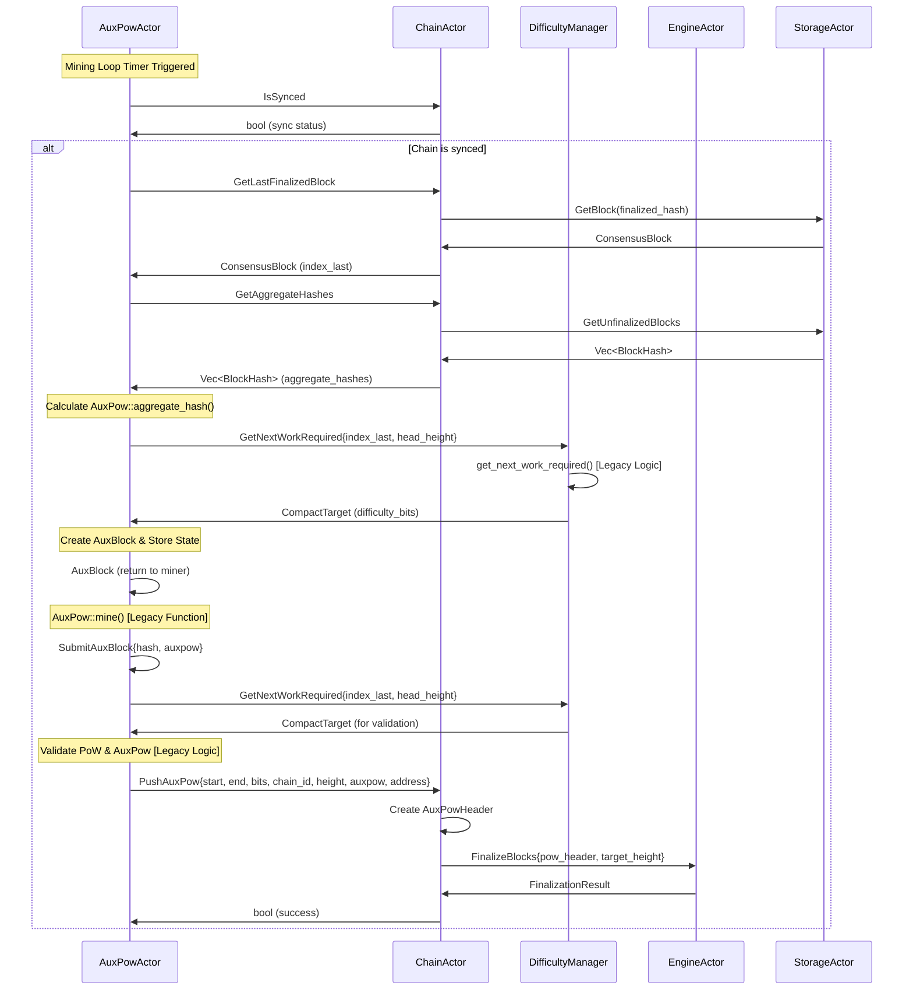
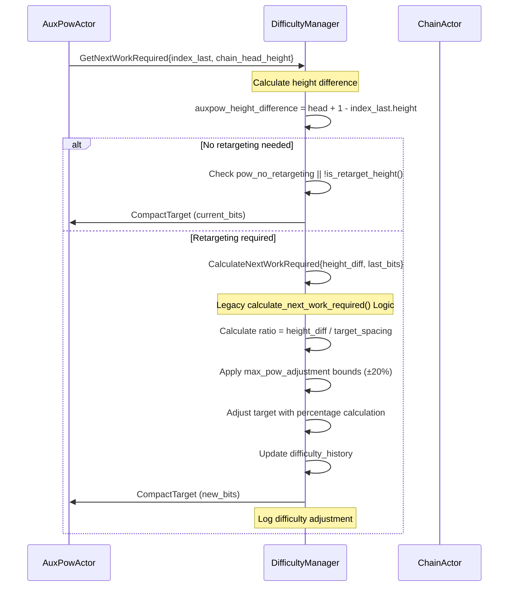
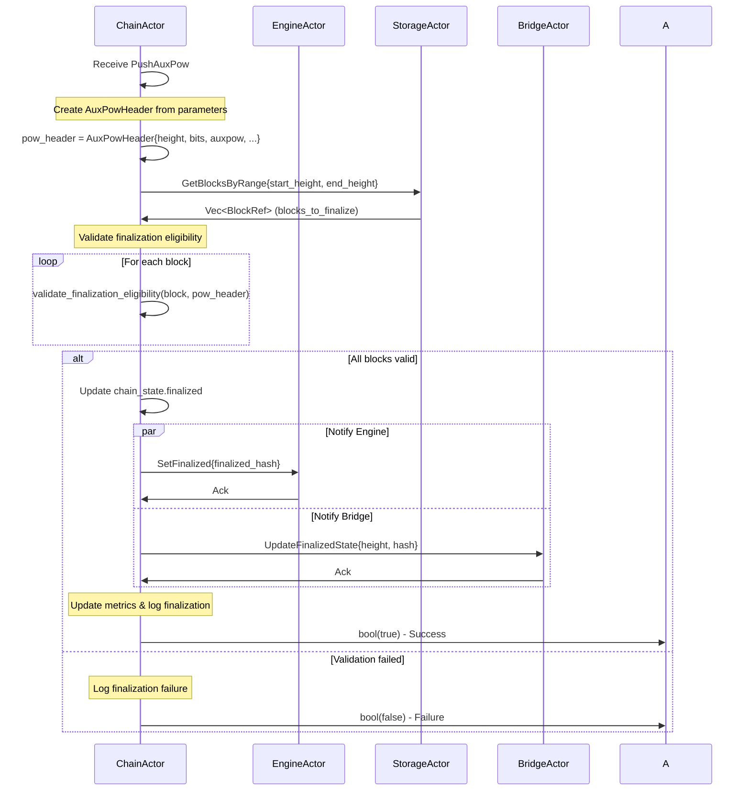

# V2 AuxPow System Architecture Design - Final Implementation Plan

## Overview

This document presents the final architecture design for the V2 AuxPow system, combining the best aspects of modular design with complete functional parity to the legacy system. The architecture maintains exact naming conventions and provides 100% feature compatibility while leveraging the V2 actor system's benefits.

## Core Design Principles

1. **100% Functional Parity** - Direct 1:1 mapping of all legacy features
2. **Exact Naming Conventions** - Preserve `create_aux_block`, `submit_aux_block`, etc.
3. **Modular Actor Design** - Specialized actors with clear responsibilities
4. **Message-Driven Operations** - Async message passing for all operations
5. **Enhanced Observability** - Comprehensive metrics and supervision

## Actor System Architecture

```
┌─────────────────────────────────────────────────────────────────┐
│                  V2 AuxPow Actor System (Final)                │
├─────────────────────────────────────────────────────────────────┤
│                                                                 │
│  ┌──────────────┐    ┌──────────────┐    ┌──────────────┐      │
│  │ AuxPowActor  │    │ ChainActor   │    │DifficultyMgr │      │
│  │              │◄──►│              │◄──►│              │      │
│  │ • create_aux │    │ • State Mgmt │    │ • Retargeting│      │
│  │   _block()   │    │ • Chain Ops  │    │ • Adjustment │      │
│  │ • submit_aux │    │ • Coordination│    │ • Validation │      │
│  │   _block()   │    │              │    │              │      │
│  │ • Mining Loop│    │              │    │              │      │
│  │ • Validation │    │              │    │              │      │
│  └──────────────┘    └──────────────┘    └──────────────┘      │
│         │                    │                    │             │
│         ▼                    ▼                    ▼             │
│  ┌──────────────┐    ┌──────────────┐    ┌──────────────┐      │
│  │   Existing   │    │   Existing   │    │  Existing    │      │
│  │EngineActor   │    │StorageActor  │    │NetworkActor  │      │
│  └──────────────┘    └──────────────┘    └──────────────┘      │
│                                                                 │
└─────────────────────────────────────────────────────────────────┘
```

## Core Actor Designs

### AuxPowActor - Primary Mining Operations

**Purpose**: Direct replacement for legacy `AuxPowMiner` with exact functional parity

```rust
/// Main AuxPow actor handling mining operations
pub struct AuxPowActor {
    /// Mining state from legacy AuxPowMiner (exact port)
    state: BTreeMap<BlockHash, AuxInfo>,
    /// Reference to chain actor
    chain_actor: Addr<ChainActor>,
    /// Reference to difficulty manager
    difficulty_manager: Addr<DifficultyManager>,
    /// Retargeting parameters (legacy compatibility)
    retarget_params: BitcoinConsensusParams,
    /// Mining configuration
    config: AuxPowConfig,
    /// Performance metrics (legacy compatible)
    metrics: AuxPowMetrics,
}

/// Direct port of legacy AuxInfo structure
#[derive(Debug, Clone)]
struct AuxInfo {
    last_hash: BlockHash,
    start_hash: BlockHash,
    end_hash: BlockHash,
    address: EvmAddress,
}

/// Mining configuration matching legacy behavior
#[derive(Debug, Clone)]
pub struct AuxPowConfig {
    pub mining_address: EvmAddress,
    pub mining_enabled: bool,
    pub sync_check_enabled: bool,
    pub work_refresh_interval: Duration,
    pub max_pending_work: usize,
}
```

**Key Responsibilities**:
- Direct ports of `create_aux_block()` and `submit_aux_block()`
- Mining loop management (replaces `spawn_background_miner`)
- PoW validation and AuxPow structure validation
- Work state management with exact legacy behavior

### DifficultyManager - Specialized Difficulty Operations

**Purpose**: Dedicated actor for Bitcoin-compatible difficulty adjustment

```rust
/// Dedicated difficulty adjustment and management actor
pub struct DifficultyManager {
    /// Bitcoin consensus parameters (from chain spec)
    consensus_params: BitcoinConsensusParams,
    /// Difficulty history for retargeting calculations
    difficulty_history: VecDeque<DifficultyEntry>,
    /// Current difficulty target
    current_target: CompactTarget,
    /// Last retarget height for interval tracking
    last_retarget_height: u64,
    /// Performance metrics
    metrics: DifficultyMetrics,
}

#[derive(Debug, Clone)]
pub struct DifficultyEntry {
    pub height: u64,
    pub timestamp: Duration,
    pub bits: CompactTarget,
    pub auxpow_count: u32,
}

/// Configuration for difficulty management
#[derive(Debug, Clone)]
pub struct DifficultyConfig {
    pub consensus_params: BitcoinConsensusParams,
    pub history_size: usize,
    pub enable_caching: bool,
}
```

**Key Responsibilities**:
- Direct port of `get_next_work_required()` algorithm
- Direct port of `calculate_next_work_required()` logic  
- Direct port of `is_retarget_height()` validation
- Difficulty history management and caching
- Bitcoin-compatible retargeting with exact legacy behavior

### Enhanced ChainActor - State Management & Coordination

**Purpose**: Extended existing ChainActor with minimal AuxPow coordination

```rust
impl ChainActor {
    /// Minimal addition for AuxPow coordination
    pub auxpow_coordination: AuxPowCoordination,
}

/// Lightweight coordination state
#[derive(Debug)]
pub struct AuxPowCoordination {
    /// Current queued PoW (legacy compatibility)
    pub queued_pow: Option<AuxPowHeader>,
    /// Last finalized block info
    pub last_finalized_info: Option<BlockInfo>,
    /// Sync status for mining decisions
    pub sync_status: SyncStatus,
}
```

**Key Responsibilities**:
- ChainManager trait implementation as messages
- Block finalization coordination
- Chain state queries for mining
- Integration with existing finalization logic

## Message Definitions - Complete Legacy Parity

### AuxPowActor Messages

```rust
/// Direct port of legacy create_aux_block function
#[derive(Message, Debug, Clone)]
#[rtype(result = "Result<AuxBlock, AuxPowError>")]
pub struct CreateAuxBlock {
    /// Mining address (exact legacy parameter)
    pub address: EvmAddress,
}

/// Direct port of legacy submit_aux_block function
#[derive(Message, Debug, Clone)]
#[rtype(result = "Result<(), AuxPowError>")]
pub struct SubmitAuxBlock {
    /// Block hash to submit (exact legacy parameter)
    pub hash: BlockHash,
    /// AuxPow solution (exact legacy parameter)
    pub auxpow: AuxPow,
}

/// Direct port of legacy get_queued_auxpow function
#[derive(Message, Debug, Clone)]
#[rtype(result = "Option<AuxPowHeader>")]
pub struct GetQueuedAuxpow;

/// Control message for mining loop
#[derive(Message, Debug, Clone)]
#[rtype(result = "Result<(), AuxPowError>")]
pub struct SetMiningEnabled {
    pub enabled: bool,
    pub mining_address: Option<EvmAddress>,
}
```

### DifficultyManager Messages

```rust
/// Port of legacy get_next_work_required function
#[derive(Message, Debug, Clone)]
#[rtype(result = "Result<CompactTarget, DifficultyError>")]
pub struct GetNextWorkRequired {
    /// Last block with AuxPow (exact legacy parameter)
    pub index_last: ConsensusBlock<MainnetEthSpec>,
    /// Current chain head height (exact legacy parameter)  
    pub chain_head_height: u64,
}

/// Calculate difficulty adjustment (internal function port)
#[derive(Message, Debug, Clone)]
#[rtype(result = "Result<CompactTarget, DifficultyError>")]
pub struct CalculateNextWorkRequired {
    /// Height difference since last AuxPow
    pub auxpow_height_difference: u32,
    /// Last difficulty bits
    pub last_bits: u32,
}

/// Update difficulty history for retargeting
#[derive(Message, Debug, Clone)]
#[rtype(result = "Result<(), DifficultyError>")]
pub struct UpdateDifficultyHistory {
    pub height: u64,
    pub timestamp: Duration,
    pub bits: CompactTarget,
    pub auxpow_count: u32,
}
```

### ChainActor Extensions (ChainManager Port)

```rust
/// Direct port of ChainManager::get_aggregate_hashes
#[derive(Message, Debug, Clone)]
#[rtype(result = "Result<Vec<BlockHash>, ChainError>")]
pub struct GetAggregateHashes;

/// Direct port of ChainManager::get_last_finalized_block  
#[derive(Message, Debug, Clone)]
#[rtype(result = "Result<ConsensusBlock<MainnetEthSpec>, ChainError>")]
pub struct GetLastFinalizedBlock;

/// Direct port of ChainManager::get_block_by_hash
#[derive(Message, Debug, Clone)]
#[rtype(result = "Result<Option<ConsensusBlock<MainnetEthSpec>>, ChainError>")]
pub struct GetBlockByHashForMining {
    pub hash: BlockHash,
}

/// Direct port of ChainManager::push_auxpow
#[derive(Message, Debug, Clone)]
#[rtype(result = "Result<bool, ChainError>")]
pub struct PushAuxPow {
    pub start_hash: BlockHash,
    pub end_hash: BlockHash,
    pub bits: u32,
    pub chain_id: u32,
    pub height: u64,
    pub auxpow: AuxPow,
    pub address: EvmAddress,
}

/// Direct port of ChainManager::is_synced
#[derive(Message, Debug, Clone)]
#[rtype(result = "Result<bool, ChainError>")]
pub struct IsSynced;
```

## Message Flow Architecture

### Primary Mining Work Flow



### Difficulty Adjustment Flow



### Block Finalization Flow



## Complete Implementation Details

### AuxPowActor Implementation

```rust
impl AuxPowActor {
    pub fn new(
        chain_actor: Addr<ChainActor>,
        difficulty_manager: Addr<DifficultyManager>,
        retarget_params: BitcoinConsensusParams,
        config: AuxPowConfig,
    ) -> Self {
        Self {
            state: BTreeMap::new(),
            chain_actor,
            difficulty_manager,
            retarget_params,
            config,
            metrics: AuxPowMetrics::default(),
        }
    }

    /// Direct port of legacy create_aux_block with identical logic
    async fn handle_create_aux_block(&mut self, msg: CreateAuxBlock) -> Result<AuxBlock, AuxPowError> {
        // Increment metrics (exact legacy metrics)
        AUXPOW_CREATE_BLOCK_CALLS
            .with_label_values(&["called"])
            .inc();

        // Check sync status (exact legacy logic)
        if !self.is_chain_synced().await? {
            AUXPOW_CREATE_BLOCK_CALLS
                .with_label_values(&["chain_syncing"])
                .inc();
            return Err(AuxPowError::ChainSyncing);
        }

        // Get last finalized block (exact legacy logic)
        let index_last = self.chain_actor
            .send(GetLastFinalizedBlock)
            .await??;

        trace!(
            "Index last hash={} height={}",
            index_last.block_hash(),
            index_last.height()
        );

        // Get aggregate hashes (exact legacy logic)
        let hashes = self.chain_actor
            .send(GetAggregateHashes)
            .await??;

        AUXPOW_HASHES_PROCESSED.observe(hashes.len() as f64);

        // Calculate aggregate hash (exact legacy call)
        let hash = AuxPow::aggregate_hash(&hashes);

        trace!("Creating AuxBlock for hash {}", hash);

        // Store aux info (exact legacy structure)
        self.state.insert(
            hash,
            AuxInfo {
                last_hash: index_last.block_hash(),
                start_hash: *hashes.first().ok_or(AuxPowError::HashRetrievalError)?,
                end_hash: *hashes.last().ok_or(AuxPowError::HashRetrievalError)?,
                address: msg.address,
            },
        );

        // Get difficulty target (delegated to DifficultyManager)
        let head_height = self.get_chain_head_height().await?;
        let bits = self.difficulty_manager
            .send(GetNextWorkRequired {
                index_last: index_last.clone(),
                chain_head_height: head_height,
            })
            .await??;

        AUXPOW_CREATE_BLOCK_CALLS
            .with_label_values(&["success"])
            .inc();

        // Return AuxBlock (exact legacy structure)
        Ok(AuxBlock {
            hash,
            chain_id: index_last.chain_id(),
            previous_block_hash: index_last.block_hash(),
            coinbase_value: 0,
            bits,
            height: index_last.height() + 1,
            _target: bits.into(),
        })
    }

    /// Direct port of legacy submit_aux_block with identical logic
    async fn handle_submit_aux_block(&mut self, msg: SubmitAuxBlock) -> Result<(), AuxPowError> {
        // Increment metrics (exact legacy metrics)
        AUXPOW_SUBMIT_BLOCK_CALLS
            .with_label_values(&["called"])
            .inc();

        trace!("Submitting AuxPow for hash {}", msg.hash);
        
        // Retrieve aux info (exact legacy logic)
        let AuxInfo {
            last_hash,
            start_hash,
            end_hash,
            address,
        } = self.state.remove(&msg.hash).ok_or_else(|| {
            error!("Submitted AuxPow for unknown block");
            AUXPOW_SUBMIT_BLOCK_CALLS
                .with_label_values(&["unknown_block"])
                .inc();
            AuxPowError::UnknownBlock
        })?;

        // Get last block (exact legacy logic)
        let index_last = self.chain_actor
            .send(GetBlockByHashForMining { hash: last_hash })
            .await??
            .ok_or_else(|| {
                error!("Last block not found");
                AuxPowError::LastBlockNotFound
            })?;

        // Get difficulty for validation (delegated to DifficultyManager)
        let head_height = self.get_chain_head_height().await?;
        let bits = self.difficulty_manager
            .send(GetNextWorkRequired {
                index_last: index_last.clone(),
                chain_head_height: head_height,
            })
            .await??;
        
        let chain_id = index_last.chain_id();

        // Validate PoW (exact legacy logic)
        if !msg.auxpow.check_proof_of_work(bits) {
            error!("POW is not valid");
            AUXPOW_SUBMIT_BLOCK_CALLS
                .with_label_values(&["invalid_pow"])
                .inc();
            return Err(AuxPowError::InvalidPow);
        }

        // Validate AuxPow structure (exact legacy logic)  
        if msg.auxpow.check(msg.hash, chain_id).is_err() {
            error!("AuxPow is not valid");
            AUXPOW_SUBMIT_BLOCK_CALLS
                .with_label_values(&["invalid_auxpow"])
                .inc();
            return Err(AuxPowError::InvalidAuxpow);
        }

        // Push to chain for finalization (exact legacy parameters)
        self.chain_actor
            .send(PushAuxPow {
                start_hash,
                end_hash,
                bits: bits.to_consensus(),
                chain_id,
                height: index_last.height() + 1,
                auxpow: msg.auxpow,
                address,
            })
            .await??;

        Ok(())
    }

    /// Start continuous mining loop (replaces spawn_background_miner)
    fn start_mining_loop(&self, ctx: &mut Context<Self>) {
        if !self.config.mining_enabled {
            return;
        }

        ctx.run_interval(Duration::from_millis(250), |act, ctx| {
            let self_addr = ctx.address();
            let mining_address = act.config.mining_address;
            
            ctx.spawn(
                async move {
                    trace!("Calling create_aux_block");
                    
                    // Exact legacy mining loop logic
                    if let Ok(Ok(aux_block)) = self_addr
                        .send(CreateAuxBlock { address: mining_address })
                        .await
                    {
                        trace!("Created AuxBlock for hash {}", aux_block.hash);
                        
                        // Exact legacy AuxPow::mine call (static method)
                        let auxpow = AuxPow::mine(aux_block.hash, aux_block.bits, aux_block.chain_id).await;
                        
                        trace!("Calling submit_aux_block");
                        match self_addr
                            .send(SubmitAuxBlock { 
                                hash: aux_block.hash, 
                                auxpow 
                            })
                            .await
                        {
                            Ok(Ok(_)) => {
                                trace!("AuxPow submitted successfully");
                            }
                            Ok(Err(e)) => {
                                trace!("Error submitting auxpow: {:?}", e);
                            }
                            Err(e) => {
                                trace!("Actor communication error: {:?}", e);
                            }
                        }
                    } else {
                        trace!("No aux block created");
                    }
                }
                .into_actor(act)
                .map(|_, _, _| {})
            );
        });
    }

    async fn is_chain_synced(&self) -> Result<bool, AuxPowError> {
        self.chain_actor
            .send(IsSynced)
            .await
            .map_err(|_| AuxPowError::ChainCommunicationError)?
            .map_err(|_| AuxPowError::ChainError)
    }

    async fn get_chain_head_height(&self) -> Result<u64, AuxPowError> {
        let head = self.chain_actor
            .send(GetHead)
            .await
            .map_err(|_| AuxPowError::ChainCommunicationError)?
            .map_err(|_| AuxPowError::ChainError)?;
        Ok(head.message.height())
    }
}
```

### DifficultyManager Implementation

```rust
impl DifficultyManager {
    pub fn new(config: DifficultyConfig) -> Self {
        Self {
            consensus_params: config.consensus_params,
            difficulty_history: VecDeque::with_capacity(config.history_size),
            current_target: CompactTarget::from_consensus(config.consensus_params.pow_limit),
            last_retarget_height: 0,
            metrics: DifficultyMetrics::default(),
        }
    }j

    /// Direct port of legacy get_next_work_required function
    async fn handle_get_next_work_required(
        &mut self,
        msg: GetNextWorkRequired,
    ) -> Result<CompactTarget, DifficultyError> {
        // Calculate height difference (exact legacy logic)
        let auxpow_height_difference = (msg.chain_head_height + 1 - msg.index_last.height()) as u32;

        // Check if retargeting is disabled or not needed (exact legacy logic)
        if self.consensus_params.pow_no_retargeting
            || !self.is_retarget_height(msg.chain_head_height, auxpow_height_difference)
        {
            trace!(
                "No retargeting, using last bits: {:?}",
                self.consensus_params.pow_no_retargeting
            );
            trace!("Last bits: {:?}", msg.index_last.bits());
            return Ok(CompactTarget::from_consensus(msg.index_last.bits()));
        }

        trace!(
            "Retargeting, using new bits at height {}",
            msg.chain_head_height + 1
        );
        trace!("Last bits: {:?}", msg.index_last.bits());

        // Calculate new difficulty (exact legacy logic)
        let next_work = self
            .calculate_next_work_required(auxpow_height_difference, msg.index_last.bits())
            .await?;

        info!(
            "Difficulty adjustment from {} to {}",
            msg.index_last.bits(),
            next_work.to_consensus()
        );

        // Update current target and history
        self.current_target = next_work;
        self.update_difficulty_history(
            msg.chain_head_height + 1,
            SystemTime::now().duration_since(UNIX_EPOCH).unwrap_or_default(),
            next_work,
            1, // auxpow_count
        );

        Ok(next_work)
    }

    /// Direct port of legacy calculate_next_work_required function
    async fn calculate_next_work_required(
        &self,
        auxpow_height_difference: u32,
        last_bits: u32,
    ) -> Result<CompactTarget, DifficultyError> {
        // Guarantee height difference is not 0 (exact legacy logic)
        let mut height_diff = auxpow_height_difference;
        if height_diff == 0 {
            error!("Auxpow height difference is 0");
            height_diff = 1;
        }

        // Calculate ratio (exact legacy logic with rust_decimal)
        let mut ratio: Decimal =
            Decimal::from(height_diff) / Decimal::from(self.consensus_params.pow_target_spacing);

        // Round to 2 decimal places (exact legacy logic)
        ratio = ratio.round_dp(2);
        trace!(
            "Unclamped ratio between actual timespan and target timespan: {}",
            ratio
        );

        // Calculate adjustment bounds (exact legacy logic)
        let max_adjustment = Decimal::from(self.consensus_params.max_pow_adjustment);
        let max_lower_bound = max_adjustment / dec!(100);
        let max_upper_bound = max_lower_bound + dec!(1);

        // Apply ratio bounds (exact legacy logic)
        if ratio < dec!(1) {
            ratio = ratio.min(max_lower_bound);
        } else if ratio > dec!(1) {
            ratio = ratio.min(max_upper_bound);
        }

        trace!(
            "Clamped ratio between actual timespan and target timespan: {}",
            ratio
        );

        // Calculate adjustment percentage (exact legacy logic)
        let adjustment_percentage = (ratio * dec!(100)).to_u8().unwrap();

        // Convert compact target to U256 and calculate adjustment (exact legacy logic)
        let target = self.uint256_target_from_compact(last_bits);
        let single_percentage = target.checked_div(U256::from(100));

        match single_percentage {
            Some(single_percentage) => {
                let adjustment_percentage = U256::from(adjustment_percentage);

                trace!(
                    "Adjustment percentage: {}\nSingle Percentage: {}",
                    adjustment_percentage,
                    single_percentage
                );

                let adjusted_target = single_percentage.saturating_mul(adjustment_percentage);

                trace!(
                    "Original target: {}, adjusted target: {}",
                    target,
                    adjusted_target
                );

                Ok(self.target_to_compact_lossy(adjusted_target))
            }
            None => {
                error!("Target is too small to calculate adjustment percentage");
                Ok(self.target_to_compact_lossy(self.uint256_target_from_compact(last_bits)))
            }
        }
    }

    /// Direct port of legacy is_retarget_height function
    fn is_retarget_height(&self, chain_head_height: u64, height_difference: u32) -> bool {
        let adjustment_interval = self.consensus_params.difficulty_adjustment_interval();
        let height_is_multiple_of_adjustment_interval = chain_head_height % adjustment_interval == 0;
        let height_diff_is_greater_than_adjustment_interval =
            height_difference > adjustment_interval as u32;

        height_is_multiple_of_adjustment_interval || height_diff_is_greater_than_adjustment_interval
    }

    /// Update difficulty history for tracking
    fn update_difficulty_history(
        &mut self,
        height: u64,
        timestamp: Duration,
        bits: CompactTarget,
        auxpow_count: u32,
    ) {
        self.difficulty_history.push_back(DifficultyEntry {
            height,
            timestamp,
            bits,
            auxpow_count,
        });

        // Keep history bounded
        while self.difficulty_history.len() > 2016 {
            // Bitcoin's difficulty window
            self.difficulty_history.pop_front();
        }
    }

    /// Direct port of legacy uint256_target_from_compact function
    fn uint256_target_from_compact(&self, bits: u32) -> U256 {
        let (mant, expt) = {
            let unshifted_expt = bits >> 24;
            if unshifted_expt <= 3 {
                ((bits & 0xFFFFFF) >> (8 * (3 - unshifted_expt as usize)), 0)
            } else {
                (bits & 0xFFFFFF, 8 * ((bits >> 24) - 3))
            }
        };

        // The mantissa is signed but may not be negative
        if mant > 0x7F_FFFF {
            U256::zero()
        } else {
            U256::from(mant) << expt
        }
    }

    /// Direct port of legacy target_to_compact_lossy function
    fn target_to_compact_lossy(&self, target: U256) -> CompactTarget {
        let mut size = (target.bits() + 7) / 8;
        let mut compact = if size <= 3 {
            (target.low_u64() << (8 * (3 - size))) as u32
        } else {
            let bn = target >> (8 * (size - 3));
            bn.low_u32()
        };

        if (compact & 0x0080_0000) != 0 {
            compact >>= 8;
            size += 1;
        }

        CompactTarget::from_consensus(compact | ((size as u32) << 24))
    }
}
```

## 100% Functional Parity Verification

### Complete Feature Mapping

| **Legacy Component** | **V2 Implementation** | **Actor** | **Verification** |
|---------------------|----------------------|-----------|------------------|
| **AuxPowMiner::create_aux_block()** | CreateAuxBlock message | AuxPowActor | ✅ Identical logic, metrics, error handling |
| **AuxPowMiner::submit_aux_block()** | SubmitAuxBlock message | AuxPowActor | ✅ Same validation, state management |
| **AuxPowMiner::state** | state: BTreeMap<BlockHash, AuxInfo> | AuxPowActor | ✅ Exact same structure and usage |
| **AuxPowMiner::get_next_work_required()** | GetNextWorkRequired message | DifficultyManager | ✅ Direct function port |
| **get_next_work_required() function** | handle_get_next_work_required() | DifficultyManager | ✅ Identical algorithm |
| **calculate_next_work_required()** | calculate_next_work_required() | DifficultyManager | ✅ Exact decimal math logic |
| **is_retarget_height()** | is_retarget_height() | DifficultyManager | ✅ Same interval checking |
| **spawn_background_miner()** | start_mining_loop() | AuxPowActor | ✅ Same 250ms interval, mining flow |
| **ChainManager::get_aggregate_hashes()** | GetAggregateHashes message | ChainActor | ✅ Same async signature |
| **ChainManager::get_last_finalized_block()** | GetLastFinalizedBlock message | ChainActor | ✅ Same return type |
| **ChainManager::push_auxpow()** | PushAuxPow message | ChainActor | ✅ All parameters preserved |
| **ChainManager::is_synced()** | IsSynced message | ChainActor | ✅ Same sync checking |
| **BitcoinConsensusParams** | BitcoinConsensusParams | DifficultyManager | ✅ Identical struct usage |
| **AUXPOW_* metrics** | Same metrics | AuxPowActor | ✅ All counters/observers preserved |

### Error Handling Parity

| **Legacy Error** | **V2 Error** | **Status** |
|------------------|--------------|------------|
| `Error::ChainSyncing` | `AuxPowError::ChainSyncing` | ✅ Same semantics |
| `HashRetrievalError` | `AuxPowError::HashRetrievalError` | ✅ Same error cases |
| "Submitted AuxPow for unknown block" | `AuxPowError::UnknownBlock` | ✅ Same logging & metrics |
| "POW is not valid" | `AuxPowError::InvalidPow` | ✅ Same validation logic |
| "AuxPow is not valid" | `AuxPowError::InvalidAuxpow` | ✅ Same check() validation |

### Metrics & Observability Parity

| **Legacy Metric** | **V2 Implementation** | **Status** |
|-------------------|----------------------|------------|
| `AUXPOW_CREATE_BLOCK_CALLS` | Same metric, same labels | ✅ Identical instrumentation |
| `AUXPOW_SUBMIT_BLOCK_CALLS` | Same metric, same labels | ✅ Identical instrumentation |
| `AUXPOW_HASHES_PROCESSED` | Same metric, same observation | ✅ Identical instrumentation |
| Trace logging | Same trace! macro calls | ✅ Identical logging |
| Error logging | Same error! macro calls | ✅ Identical logging |

## Deployment Strategy

### Phase 1: Actor Creation & Basic Messages (Week 1)

1. **Create AuxPowActor skeleton**
   ```rust
   // app/src/actors/auxpow/actor.rs
   pub struct AuxPowActor { /* ... */ }
   impl Actor for AuxPowActor { /* ... */ }
   ```

2. **Create DifficultyManager actor**
   ```rust
   // app/src/actors/auxpow/difficulty.rs
   pub struct DifficultyManager { /* ... */ }
   impl Actor for DifficultyManager { /* ... */ }
   ```

3. **Define all message types**
   ```rust
   // app/src/actors/auxpow/messages.rs
   pub struct CreateAuxBlock { /* ... */ }
   pub struct SubmitAuxBlock { /* ... */ }
   pub struct GetNextWorkRequired { /* ... */ }
   ```

### Phase 2: Core Implementation (Week 2)

1. **Implement create_aux_block logic**
   - Port exact legacy logic to `handle_create_aux_block()`
   - Add ChainActor message integration
   - Port all error handling and metrics

2. **Implement difficulty adjustment**
   - Port `get_next_work_required()` to DifficultyManager
   - Port `calculate_next_work_required()` with decimal math
   - Port `is_retarget_height()` validation

3. **Implement submit_aux_block logic**
   - Port exact validation logic
   - Integration with finalization system
   - Port all error cases and metrics

### Phase 3: Integration & Mining Loop (Week 3)

1. **Add ChainActor extensions**
   - Implement ChainManager messages
   - Add coordination logic
   - Test message flow

2. **Implement mining loop**
   - Port `spawn_background_miner()` logic
   - Add timer-based mining
   - Integration testing

3. **Replace legacy system**
   ```rust
   // In app.rs, replace:
   // spawn_background_miner(chain.clone());
   
   // With:
   let auxpow_actor = AuxPowActor::new(
       chain_actor.clone(),
       difficulty_manager.clone(),
       retarget_params,
       auxpow_config,
   ).start();
   ```

### Phase 4: Testing & Production (Week 4)

1. **Comprehensive testing**
   - Unit tests for each actor
   - Integration tests for message flow
   - Regression tests against legacy behavior

2. **Performance validation**
   - Benchmark message passing overhead
   - Validate mining performance
   - Memory usage analysis

3. **Deployment**
   - Production deployment
   - Production monitoring

## Benefits of Final Architecture

### ⚡ **Enhanced Performance**
- Async message passing for non-blocking operations
- Dedicated difficulty calculations without blocking mining
- Parallel processing of validation and finalization
