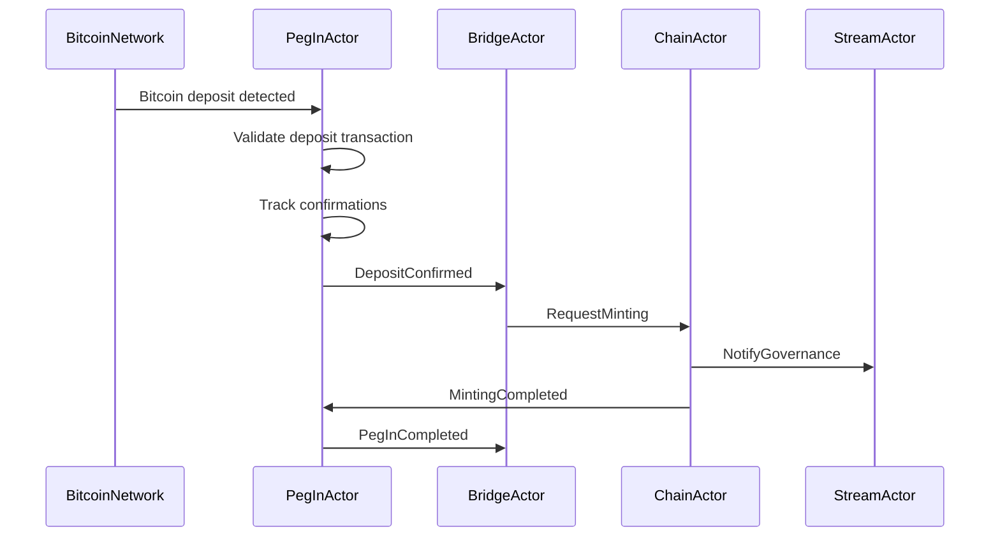
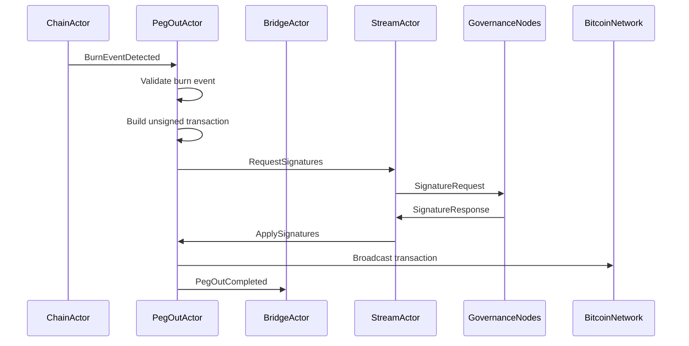

# Implementation Plan: Bridge Supervisor Actor Module Reorganization

## Executive Summary

This implementation plan details the reorganization of Bridge Supervisor actors (BridgeActor, PegInActor, PegOutActor, StreamActor) into a cohesive, modular architecture following the V2 actor system patterns established by the ChainActor implementation. The plan addresses the current scattered implementation state and establishes a foundation for specialized peg operation actors while maintaining backward compatibility.

## Current State Analysis

### Existing Implementation Assessment

**BridgeActor Current State:**
- Primary implementation in `app/src/actors/bridge_actor.rs` (basic structure, ~50 lines)
- Advanced V2 implementation in `app/src/actors/foundation/bridge/` (comprehensive, ~3,000+ lines)
  - Complete actor implementation with UTXO management
  - Message definitions and error handling
  - Comprehensive test suite (unit, integration, property-based, performance, chaos)
  - Metrics and monitoring infrastructure
- Legacy scattered logic across multiple files

**StreamActor Current State:**
- Comprehensive V2 implementation in `app/src/actors/governance_stream/`
- Complete gRPC protocol implementation with bidirectional streaming
- Robust reconnection strategy and message buffering
- Integration with governance system for signature requests
- Production-ready with metrics and error handling

**Missing Specialized Actors:**
- **PegInActor**: No dedicated implementation (logic embedded in BridgeActor)
- **PegOutActor**: No dedicated implementation (logic embedded in BridgeActor)

### Architecture Gaps Identified

1. **Monolithic BridgeActor**: Current implementation handles all bridge operations in a single actor
2. **Missing Specialization**: No dedicated actors for peg-in and peg-out workflows
3. **Supervision Structure**: Bridge supervisor not implemented as a distinct component
4. **Message Routing**: Inter-bridge-actor communication patterns not established
5. **Operational Complexity**: Single actor handling multiple complex workflows reduces maintainability

## Proposed Directory Structure

### Complete Bridge Supervisor Module

```
app/src/actors/bridge/
├── mod.rs                          # Bridge supervisor module exports and coordination
├── supervisor.rs                   # Bridge supervisor actor implementation
├── config.rs                       # Unified configuration for all bridge actors
├── messages/                       # Bridge system message definitions
│   ├── mod.rs
│   ├── bridge_messages.rs          # Core bridge coordination messages
│   ├── pegin_messages.rs           # Peg-in specific messages
│   ├── pegout_messages.rs          # Peg-out specific messages
│   └── stream_messages.rs          # Stream actor messages (bridge-specific)
├── actors/                         # Specialized bridge actor implementations
│   ├── mod.rs
│   ├── bridge/                     # Core BridgeActor (coordinator role)
│   │   ├── mod.rs
│   │   ├── actor.rs                # Main BridgeActor implementation
│   │   ├── handlers.rs             # Coordination and delegation handlers
│   │   ├── state.rs                # Bridge state and coordination data
│   │   └── metrics.rs              # Bridge coordination metrics
│   ├── pegin/                      # Specialized PegInActor
│   │   ├── mod.rs
│   │   ├── actor.rs                # PegInActor implementation
│   │   ├── handlers.rs             # Peg-in operation handlers
│   │   ├── validation.rs           # Bitcoin deposit validation logic
│   │   ├── confirmation.rs         # Confirmation tracking and processing
│   │   ├── state.rs                # Peg-in operation state management
│   │   └── metrics.rs              # Peg-in specific metrics
│   ├── pegout/                     # Specialized PegOutActor
│   │   ├── mod.rs
│   │   ├── actor.rs                # PegOutActor implementation
│   │   ├── handlers.rs             # Peg-out operation handlers
│   │   ├── transaction_builder.rs  # Bitcoin transaction construction
│   │   ├── signature_coordinator.rs# Signature collection coordination
│   │   ├── state.rs                # Peg-out operation state management
│   │   └── metrics.rs              # Peg-out specific metrics
│   └── stream/                     # StreamActor (governance communication)
│       ├── mod.rs
│       ├── actor.rs                # StreamActor implementation (moved/enhanced)
│       ├── governance.rs           # Governance protocol implementation
│       ├── reconnection.rs         # Connection management
│       └── metrics.rs              # Stream communication metrics
├── shared/                         # Shared utilities and components
│   ├── mod.rs
│   ├── utxo.rs                     # UTXO management (moved from foundation)
│   ├── federation.rs               # Federation management utilities
│   ├── bitcoin_client.rs           # Bitcoin RPC client abstraction
│   ├── validation.rs               # Shared validation logic
│   └── constants.rs                # Bridge system constants
├── supervision/                    # Supervision strategies and policies
│   ├── mod.rs
│   ├── strategies.rs               # Bridge-specific supervision strategies
│   ├── health.rs                   # Health monitoring for bridge actors
│   └── recovery.rs                 # Error recovery and restart policies
├── integration/                    # Cross-actor integration patterns
│   ├── mod.rs
│   ├── workflows.rs                # End-to-end peg operation workflows
│   ├── coordination.rs             # Inter-actor message coordination
│   └── state_sync.rs               # State synchronization between actors
├── metrics/                        # Comprehensive metrics system
│   ├── mod.rs
│   ├── aggregator.rs               # Bridge system metrics aggregation
│   ├── dashboards.rs               # Monitoring dashboard configuration
│   └── alerts.rs                   # Alert condition definitions
└── tests/                          # Comprehensive test suite
    ├── mod.rs
    ├── unit/                       # Unit tests for individual actors
    │   ├── bridge_tests.rs
    │   ├── pegin_tests.rs
    │   ├── pegout_tests.rs
    │   └── stream_tests.rs
    ├── integration/                # Integration tests
    │   ├── end_to_end_tests.rs     # Complete peg operation flows
    │   ├── actor_communication.rs  # Inter-actor messaging tests
    │   └── supervision_tests.rs    # Supervision and recovery tests
    ├── performance/                # Performance and load testing
    │   ├── throughput_tests.rs
    │   ├── latency_tests.rs
    │   └── stress_tests.rs
    ├── chaos/                      # Chaos engineering tests
    │   ├── network_partitions.rs
    │   ├── actor_failures.rs
    │   └── resource_exhaustion.rs
    └── helpers/                    # Test utilities and mocks
        ├── mock_bitcoin.rs
        ├── mock_governance.rs
        └── test_fixtures.rs
```

## Implementation Strategy

### Phase 1: Foundation and Infrastructure (Weeks 1-2)

#### 1.1 Directory Structure and Module Setup

**Objective**: Establish the complete bridge module structure and interfaces

**Implementation Steps**:
1. Create base directory structure for `app/src/actors/bridge/`
2. Create all subdirectories and stub files
3. Implement `mod.rs` files with proper module exports
4. Set up unified configuration system in `config.rs`
5. Create shared utilities in `shared/` module

**Deliverables**:
- Complete directory structure created
- Module interface definitions established
- Configuration system implemented
- Shared utilities extracted and centralized

#### 1.2 Message System Architecture

**Objective**: Design comprehensive message passing architecture for bridge actors

**Implementation Steps**:
1. Design message hierarchy in `messages/` module
2. Implement core bridge coordination messages
3. Create specialized peg-in and peg-out message types
4. Design inter-actor communication patterns
5. Implement message correlation and tracing system

**Key Message Categories**:
```rust
// Bridge coordination messages
pub enum BridgeCoordinationMessage {
    InitializeSystem,
    RegisterPegInActor(Addr<PegInActor>),
    RegisterPegOutActor(Addr<PegOutActor>),
    RegisterStreamActor(Addr<StreamActor>),
    GetSystemStatus,
    ShutdownSystem,
}

// Peg-in workflow messages
pub enum PegInMessage {
    ProcessDeposit { txid: Txid, confirmations: u32 },
    ValidateDeposit { deposit: DepositTransaction },
    ConfirmDeposit { pegin_id: String },
    NotifyMinting { pegin_id: String, amount: u64 },
}

// Peg-out workflow messages
pub enum PegOutMessage {
    ProcessBurnEvent { burn_tx: H256, destination: BtcAddress, amount: u64 },
    BuildWithdrawal { pegout_id: String },
    RequestSignatures { pegout_id: String, unsigned_tx: Transaction },
    ApplySignatures { pegout_id: String, witnesses: Vec<Witness> },
    BroadcastTransaction { pegout_id: String },
}

// Stream actor messages (enhanced)
pub enum StreamMessage {
    EstablishGovernanceConnection,
    RequestPegOutSignatures { request: SignatureRequest },
    ReceiveSignatureResponse { response: SignatureResponse },
    HandleFederationUpdate { update: FederationUpdate },
    NotifyPegIn { notification: PegInNotification },
}
```

**Deliverables**:
- Complete message type hierarchy
- Inter-actor communication patterns
- Message correlation system
- Documentation for message flows

### Phase 2: Specialized Actor Implementation (Weeks 3-5)

#### 2.1 BridgeActor Transformation (Coordinator Role)

**Objective**: Transform BridgeActor from monolithic implementation to coordination role

**Current State Migration**:
- Extract core coordination logic from `app/src/actors/foundation/bridge/actor.rs`
- Remove peg-specific implementations 
- Focus on actor supervision and workflow orchestration

**New BridgeActor Responsibilities**:
```rust
pub struct BridgeActor {
    config: BridgeConfig,
    
    // Child actor addresses
    pegin_actor: Option<Addr<PegInActor>>,
    pegout_actor: Option<Addr<PegOutActor>>,
    stream_actor: Option<Addr<StreamActor>>,
    
    // System state
    system_status: BridgeSystemStatus,
    active_operations: HashMap<String, OperationStatus>,
    
    // Metrics and monitoring
    metrics: BridgeCoordinationMetrics,
    health_monitor: ActorHealthMonitor,
}
```

**Implementation Steps**:
1. Create new coordinator-focused BridgeActor in `actors/bridge/actor.rs`
2. Implement child actor management and supervision
3. Create workflow orchestration handlers
4. Implement system health monitoring
5. Add comprehensive metrics collection

**Deliverables**:
- Coordinator BridgeActor implementation
- Child actor management system
- Workflow orchestration logic
- Health monitoring infrastructure

#### 2.2 PegInActor Implementation

**Objective**: Create specialized actor for Bitcoin deposit processing

**Core Responsibilities**:
- Bitcoin deposit detection and validation
- Confirmation tracking and threshold management
- EVM address extraction from OP_RETURN data
- Minting coordination with ChainActor

**Implementation Structure**:
```rust
pub struct PegInActor {
    config: PegInConfig,
    
    // Bitcoin monitoring
    bitcoin_client: Arc<BitcoinClient>,
    monitored_addresses: HashSet<BtcAddress>,
    
    // Operation state
    pending_deposits: HashMap<Txid, PendingDeposit>,
    confirmation_tracker: ConfirmationTracker,
    
    // Actor references
    bridge_coordinator: Addr<BridgeActor>,
    chain_actor: Addr<ChainActor>,
    
    // Metrics and performance
    metrics: PegInMetrics,
    performance_tracker: OperationTracker,
}

pub struct PendingDeposit {
    pub txid: Txid,
    pub bitcoin_tx: Transaction,
    pub federation_output: TxOut,
    pub evm_address: H160,
    pub amount: u64,
    pub confirmations: u32,
    pub status: DepositStatus,
    pub created_at: SystemTime,
    pub last_updated: SystemTime,
}

pub enum DepositStatus {
    Detected,
    Validating,
    ConfirmationPending { current: u32, required: u32 },
    Confirmed,
    Minting,
    Completed,
    Failed { reason: String },
}
```

**Key Features**:
1. **Bitcoin Chain Monitoring**: Real-time monitoring of Bitcoin blockchain for deposits
2. **Multi-Stage Validation**: Comprehensive validation pipeline for deposits
3. **Confirmation Tracking**: Sophisticated confirmation threshold management
4. **EVM Integration**: Seamless integration with Alys EVM for minting operations
5. **Error Recovery**: Robust error handling and retry mechanisms

**Implementation Steps**:
1. Create PegInActor structure and core implementation
2. Implement Bitcoin deposit monitoring and detection
3. Create validation pipeline for deposits
4. Implement confirmation tracking system
5. Add EVM minting coordination
6. Create comprehensive error handling and recovery

**Deliverables**:
- Complete PegInActor implementation
- Bitcoin monitoring system
- Deposit validation pipeline
- Confirmation tracking system
- Integration with ChainActor for minting

#### 2.3 PegOutActor Implementation

**Objective**: Create specialized actor for Bitcoin withdrawal processing

**Core Responsibilities**:
- EVM burn event detection and processing
- Bitcoin transaction construction and UTXO management
- Signature coordination with governance
- Transaction broadcasting and confirmation tracking

**Implementation Structure**:
```rust
pub struct PegOutActor {
    config: PegOutConfig,
    
    // UTXO and transaction management
    utxo_manager: UtxoManager,
    transaction_builder: TransactionBuilder,
    fee_estimator: FeeEstimator,
    
    // Operation state
    pending_pegouts: HashMap<String, PendingPegout>,
    signature_coordinator: SignatureCoordinator,
    
    // Actor references
    bridge_coordinator: Addr<BridgeActor>,
    stream_actor: Addr<StreamActor>,
    chain_actor: Addr<ChainActor>,
    
    // External services
    bitcoin_client: Arc<BitcoinClient>,
    
    // Metrics and performance
    metrics: PegOutMetrics,
    performance_tracker: OperationTracker,
}

pub struct PendingPegout {
    pub pegout_id: String,
    pub burn_tx_hash: H256,
    pub destination_address: BtcAddress,
    pub amount: u64,
    pub unsigned_tx: Option<Transaction>,
    pub signature_status: SignatureStatus,
    pub witnesses: Vec<Witness>,
    pub status: PegoutStatus,
    pub created_at: SystemTime,
    pub last_updated: SystemTime,
    pub retry_count: u32,
}

pub enum PegoutStatus {
    BurnDetected,
    ValidatingBurn,
    BuildingTransaction,
    RequestingSignatures,
    CollectingSignatures { collected: usize, required: usize },
    SignaturesComplete,
    Broadcasting,
    Broadcast { txid: Txid },
    Confirmed { confirmations: u32 },
    Completed,
    Failed { reason: String, recoverable: bool },
}
```

**Key Features**:
1. **Burn Event Processing**: Detection and validation of EVM burn events
2. **Advanced UTXO Management**: Sophisticated UTXO selection and management
3. **Transaction Construction**: Robust Bitcoin transaction building with fee optimization
4. **Signature Coordination**: Integration with governance for multi-signature collection
5. **Broadcasting and Tracking**: Transaction broadcasting and confirmation monitoring

**Implementation Steps**:
1. Create PegOutActor structure and core implementation
2. Implement burn event detection and validation
3. Create advanced transaction building system
4. Implement signature coordination with StreamActor
5. Add broadcasting and confirmation tracking
6. Create comprehensive error handling and recovery

**Deliverables**:
- Complete PegOutActor implementation
- Burn event processing system
- Advanced transaction construction
- Signature coordination system
- Broadcasting and tracking infrastructure

#### 2.4 StreamActor Enhancement and Integration

**Objective**: Enhance existing StreamActor for bridge-specific integration

**Current State**: StreamActor is well-implemented in `app/src/actors/governance_stream/`

**Enhancement Strategy**:
1. **Bridge-Specific Integration**: Add specialized bridge coordination messages
2. **Enhanced Signature Workflows**: Optimize for peg-out signature requests
3. **Performance Optimization**: Improve throughput for high-frequency operations
4. **Monitoring Enhancement**: Add bridge-specific metrics and monitoring

**Integration Requirements**:
```rust
// Enhanced StreamActor for bridge integration
impl StreamActor {
    pub async fn request_pegout_signatures(
        &mut self,
        pegout_request: PegOutSignatureRequest
    ) -> Result<String, StreamError> {
        // Enhanced signature request with peg-out specific optimizations
    }
    
    pub async fn notify_pegin_completed(
        &mut self,
        pegin_notification: PegInCompletedNotification
    ) -> Result<(), StreamError> {
        // Governance notification for peg-in completion
    }
    
    pub fn register_pegout_actor(&mut self, pegout_actor: Addr<PegOutActor>) {
        // Direct communication channel with PegOutActor
    }
}
```

**Implementation Steps**:
1. Analyze current StreamActor implementation
2. Add bridge-specific message handlers
3. Implement direct PegOutActor integration
4. Enhance signature request workflow
5. Add bridge-specific metrics and monitoring

**Deliverables**:
- Enhanced StreamActor with bridge integration
- Bridge-specific message handlers
- Optimized signature workflows
- Enhanced monitoring and metrics

### Phase 3: Bridge Supervisor Implementation (Week 6)

#### 3.1 Bridge Supervisor Actor

**Objective**: Create dedicated supervisor for bridge actor ecosystem

**Supervisor Responsibilities**:
- Bridge actor lifecycle management
- Health monitoring and failure detection
- Automatic restart and recovery strategies
- Resource allocation and load balancing
- Cross-actor message routing coordination

**Implementation Structure**:
```rust
pub struct BridgeSupervisor {
    config: BridgeSupervisionConfig,
    
    // Supervised actors
    bridge_actor: Option<Addr<BridgeActor>>,
    pegin_actor: Option<Addr<PegInActor>>,
    pegout_actor: Option<Addr<PegOutActor>>,
    stream_actor: Option<Addr<StreamActor>>,
    
    // Supervision state
    actor_health: HashMap<ActorId, ActorHealth>,
    restart_strategies: HashMap<ActorId, RestartStrategy>,
    supervision_metrics: SupervisionMetrics,
    
    // System integration
    root_supervisor: Addr<RootSupervisor>,
    system_registry: Addr<SystemRegistry>,
}

pub struct ActorHealth {
    pub status: HealthStatus,
    pub last_heartbeat: SystemTime,
    pub failure_count: u32,
    pub restart_count: u32,
    pub performance_metrics: PerformanceMetrics,
}

pub enum RestartStrategy {
    ImmediateRestart,
    ExponentialBackoff { base_delay: Duration, max_delay: Duration },
    CircuitBreaker { failure_threshold: u32, recovery_timeout: Duration },
    GracefulRestart { drain_timeout: Duration },
}
```

**Key Features**:
1. **Multi-Actor Supervision**: Comprehensive supervision of all bridge actors
2. **Health Monitoring**: Real-time health assessment and alerting
3. **Intelligent Restart**: Context-aware restart strategies
4. **Performance Monitoring**: Resource usage and performance tracking
5. **Integration Points**: Seamless integration with root supervisor system

**Implementation Steps**:
1. Create BridgeSupervisor actor structure
2. Implement multi-actor supervision logic
3. Create health monitoring and alerting system
4. Implement intelligent restart strategies
5. Add performance monitoring and resource management
6. Integrate with root supervisor system

**Deliverables**:
- Complete BridgeSupervisor implementation
- Multi-actor supervision system
- Health monitoring infrastructure
- Intelligent restart strategies
- Performance monitoring system

### Phase 4: Integration and Workflow Implementation (Weeks 7-8)

#### 4.1 End-to-End Workflow Implementation

**Objective**: Implement complete peg-in and peg-out workflows with actor coordination

**Peg-In Workflow**:


**Peg-Out Workflow**:


**Implementation Steps**:
1. Implement complete peg-in workflow coordination
2. Implement complete peg-out workflow coordination
3. Create error handling and recovery for each workflow step
4. Add comprehensive logging and monitoring
5. Implement performance optimization

**Deliverables**:
- Complete peg-in workflow implementation
- Complete peg-out workflow implementation
- Error handling and recovery systems
- Workflow monitoring and alerting

#### 4.2 State Synchronization and Consistency

**Objective**: Ensure state consistency across bridge actors

**State Synchronization Requirements**:
- UTXO state consistency between PegOutActor and BridgeActor
- Operation status synchronization across actors
- Federation configuration updates propagation
- Metrics and health status aggregation

**Implementation Strategy**:
```rust
pub struct BridgeStateCoordinator {
    // State synchronization
    state_version: u64,
    pending_updates: VecDeque<StateUpdate>,
    consistency_checker: ConsistencyChecker,
    
    // Actor state tracking
    actor_states: HashMap<ActorId, ActorState>,
    shared_state: SharedBridgeState,
}

pub struct SharedBridgeState {
    pub federation_config: FederationConfig,
    pub utxo_set: UtxoSet,
    pub active_operations: OperationRegistry,
    pub system_metrics: AggregatedMetrics,
}
```

**Implementation Steps**:
1. Design state synchronization architecture
2. Implement state consistency checking
3. Create state update propagation system
4. Add conflict resolution mechanisms
5. Implement state recovery procedures

**Deliverables**:
- State synchronization system
- Consistency checking infrastructure
- Conflict resolution mechanisms
- State recovery procedures

### Phase 5: Testing and Quality Assurance (Weeks 9-10)

#### 5.1 Comprehensive Testing Strategy

**Testing Categories**:

1. **Unit Tests**:
   - Individual actor behavior testing
   - Message handling validation
   - State management testing
   - Error condition coverage

2. **Integration Tests**:
   - End-to-end workflow testing
   - Inter-actor communication validation
   - External service integration testing
   - Error recovery scenario testing

3. **Performance Tests**:
   - Throughput benchmarking
   - Latency measurements
   - Resource usage profiling
   - Scalability testing

4. **Chaos Engineering Tests**:
   - Network partition resilience
   - Actor failure recovery
   - Resource exhaustion handling
   - Byzantine failure scenarios

**Test Implementation Plan**:
```rust
// Example comprehensive test suite structure
#[cfg(test)]
mod bridge_actor_tests {
    // Unit tests for BridgeActor coordination
    #[tokio::test]
    async fn test_actor_registration() { /* ... */ }
    
    #[tokio::test]
    async fn test_workflow_orchestration() { /* ... */ }
}

#[cfg(test)]
mod integration_tests {
    // End-to-end workflow tests
    #[tokio::test]
    async fn test_complete_pegin_flow() { /* ... */ }
    
    #[tokio::test]
    async fn test_complete_pegout_flow() { /* ... */ }
}

#[cfg(test)]
mod performance_tests {
    // Performance and load testing
    #[tokio::test]
    async fn test_high_throughput_operations() { /* ... */ }
    
    #[tokio::test]
    async fn test_concurrent_actor_operations() { /* ... */ }
}
```

#### 5.2 Migration and Deployment Strategy

**Migration Plan from Current State**:

1. **Phase 1**: Parallel implementation without breaking existing functionality
2. **Phase 2**: Gradual migration of functionality from monolithic to specialized actors
3. **Phase 3**: Feature flag controlled rollout
4. **Phase 4**: Complete migration and cleanup of legacy code

**Deployment Strategy**:
```rust
// Feature flag controlled migration
pub struct BridgeSystemConfig {
    pub enable_specialized_actors: bool,
    pub enable_pegin_actor: bool,
    pub enable_pegout_actor: bool,
    pub enable_bridge_supervisor: bool,
    pub migration_mode: MigrationMode,
}

pub enum MigrationMode {
    Legacy,           // Use existing monolithic BridgeActor
    Hybrid,           // Gradual migration with fallback
    Specialized,      // Full specialized actor system
}
```

**Rollback Procedures**:
- Immediate rollback to legacy implementation
- State migration between systems
- Data consistency validation
- Performance monitoring throughout migration

## Risk Mitigation and Contingencies

### Identified Risks

1. **Complexity Increase**: Specialized actors add system complexity
   - **Mitigation**: Comprehensive documentation and monitoring
   - **Contingency**: Gradual rollout with rollback capabilities

2. **Performance Impact**: Inter-actor communication overhead
   - **Mitigation**: Extensive performance testing and optimization
   - **Contingency**: Hybrid deployment mode with performance monitoring

3. **State Synchronization Issues**: Consistency problems between actors
   - **Mitigation**: Robust state synchronization and consistency checking
   - **Contingency**: Single-actor fallback mode

4. **Migration Complexity**: Complex transition from current state
   - **Mitigation**: Phased migration with extensive testing
   - **Contingency**: Parallel implementation with feature flags

### Success Metrics

**Performance Targets**:
- Peg-in processing: >10 operations/second
- Peg-out processing: >5 operations/second
- Inter-actor message latency: <10ms p99
- System uptime: >99.9%
- Error recovery time: <30 seconds

**Quality Metrics**:
- Test coverage: >95% for all bridge actors
- Documentation coverage: 100% for public APIs
- Security audit: Zero high-severity findings
- Performance benchmarks: Meet or exceed current implementation

## Timeline and Milestones

### Development Timeline (10 Weeks)

**Weeks 1-2**: Foundation and Infrastructure
- Directory structure and module setup
- Message system architecture
- Configuration system implementation

**Weeks 3-5**: Specialized Actor Implementation
- BridgeActor transformation to coordinator
- PegInActor implementation
- PegOutActor implementation
- StreamActor enhancement

**Week 6**: Bridge Supervisor Implementation
- Multi-actor supervision system
- Health monitoring and restart strategies

**Weeks 7-8**: Integration and Workflows
- End-to-end workflow implementation
- State synchronization system
- Performance optimization

**Weeks 9-10**: Testing and Deployment
- Comprehensive testing suite
- Migration strategy implementation
- Production deployment preparation

### Key Milestones

- **Week 2**: Foundation Complete - All infrastructure and interfaces ready
- **Week 5**: Actors Complete - All specialized actors fully implemented
- **Week 6**: Supervision Complete - Bridge supervisor operational
- **Week 8**: Integration Complete - Full workflow implementation ready
- **Week 10**: Production Ready - Complete system tested and deployable

## Conclusion

This implementation plan provides a comprehensive roadmap for transforming the current bridge implementation into a robust, specialized actor system. The plan leverages existing work (particularly the advanced BridgeActor and StreamActor implementations) while introducing necessary specialization for improved maintainability, scalability, and operational clarity.

The proposed architecture addresses the core requirements of the Bridge Supervisor tree while maintaining backward compatibility and providing clear migration paths. The comprehensive testing strategy and risk mitigation plans ensure a smooth transition to the new architecture while maintaining the high reliability standards required for cross-chain bridge operations.

The success of this implementation will provide a foundation for future enhancements and serve as a model for other actor system implementations within the Alys ecosystem.