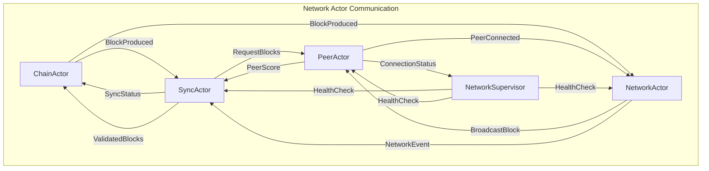

# Implementation Plan: Network Actors (SyncActor, NetworkActor, PeerActor)

## Overview

The Network Actors form the **critical communication backbone** of the Alys V2 system architecture, responsible for blockchain synchronization, peer-to-peer networking, and connection management. According to the V2 architecture and actor implementation roadmap, these actors are **Phase 4-5 priority** (Weeks 5-7) and must be implemented together due to their tight interdependencies.

---

## 🎯 **Current State Analysis**

### **❌ IMPLEMENTATION REQUIRED - NOT YET STARTED**

**Status:** Network actors are not yet implemented in the V2 actor system

**❌ Missing Implementation Status (0%)**

### **Required Core Architecture**
- **❌ SyncActor** - Blockchain synchronization with 99.5% threshold
- **❌ NetworkActor** - P2P protocol management with libp2p
- **❌ PeerActor** - Connection and peer management
- **❌ Network Supervisor** - Fault tolerance for network subsystem
- **❌ Message Protocol** - Inter-actor communication framework

### **Integration Dependencies**
- **✅ ChainActor** - Available for block import/export coordination
- **✅ actor_system crate** - Core actor framework available
- **❌ libp2p Integration** - P2P networking stack needs implementation
- **❌ Parallel Sync Engine** - Advanced synchronization system required

### **Critical Requirements from V2 Architecture**
- **99.5% Sync Threshold**: Block production eligibility at 99.5% sync vs 100%
- **Parallel Validation**: 5x performance improvement (50 → 250 blocks/sec)
- **Federation Timing**: Respect 2-second Aura PoA block intervals
- **Checkpoint Recovery**: Resilient sync with state snapshots
- **libp2p Protocols**: Gossipsub, Kademlia DHT, mDNS discovery

---

## 🏗️ **Implementation Architecture**

### **Target Directory Structure**

Following the ChainActor and StorageActor patterns:

```
app/src/actors/network/
├── mod.rs                      # Module exports and public interface
├── supervisor.rs               # Network supervisor for fault tolerance
├── sync/                       # SyncActor implementation
│   ├── mod.rs                  # Sync module organization
│   ├── actor.rs                # Core SyncActor implementation
│   ├── config.rs               # Sync configuration structures
│   ├── state.rs                # Sync state management
│   ├── processor.rs            # Block processing pipeline
│   ├── checkpoint.rs           # Checkpoint system for recovery
│   ├── peer_manager.rs         # Peer selection for sync
│   └── handlers/               # Message handler implementations
│       ├── mod.rs
│       ├── sync_handlers.rs    # StartSync, GetSyncStatus, CanProduceBlocks
│       ├── block_handlers.rs   # Block download and validation
│       └── checkpoint_handlers.rs # Checkpoint creation and recovery
├── network/                    # NetworkActor implementation
│   ├── mod.rs                  # Network module organization
│   ├── actor.rs                # Core NetworkActor implementation
│   ├── config.rs               # Network configuration
│   ├── behaviour.rs            # libp2p NetworkBehaviour composition
│   ├── protocols/              # Protocol implementations
│   │   ├── mod.rs
│   │   ├── gossip.rs          # Gossipsub for block/tx propagation
│   │   ├── discovery.rs       # Kademlia DHT and mDNS
│   │   └── request_response.rs # Request-response protocol
│   └── handlers/               # Message handler implementations
│       ├── mod.rs
│       ├── network_handlers.rs # StartNetwork, GetNetworkStatus
│       ├── broadcast_handlers.rs # Block and transaction broadcasting
│       └── discovery_handlers.rs # Peer discovery management
├── peer/                       # PeerActor implementation
│   ├── mod.rs                  # Peer module organization
│   ├── actor.rs                # Core PeerActor implementation
│   ├── config.rs               # Peer configuration
│   ├── store.rs                # Peer information storage
│   ├── scoring.rs              # Peer performance scoring
│   ├── connection.rs           # Connection management
│   └── handlers/               # Message handler implementations
│       ├── mod.rs
│       ├── peer_handlers.rs    # ConnectToPeer, GetPeerStatus
│       ├── scoring_handlers.rs # UpdatePeerScore, GetBestPeers
│       └── discovery_handlers.rs # Peer discovery coordination
├── transport/                  # Transport layer management
│   ├── mod.rs
│   ├── tcp.rs                  # TCP transport implementation
│   ├── quic.rs                 # QUIC transport (future)
│   └── security.rs             # TLS and encryption
├── messages/                   # Network message definitions
│   ├── mod.rs
│   ├── sync_messages.rs        # SyncActor message protocol
│   ├── network_messages.rs     # NetworkActor message protocol
│   └── peer_messages.rs        # PeerActor message protocol
└── tests/                      # Comprehensive test suite
    ├── mod.rs
    ├── sync_tests.rs           # SyncActor integration tests
    ├── network_tests.rs        # NetworkActor protocol tests
    ├── peer_tests.rs           # PeerActor connection tests
    ├── integration_tests.rs    # Cross-actor integration tests
    └── performance_tests.rs    # Benchmark and stress tests
```

### **Key Components to Implement**

1. **SyncActor with Parallel Processing** (`sync/actor.rs`)
2. **NetworkActor with libp2p Integration** (`network/actor.rs`)
3. **PeerActor with Connection Management** (`peer/actor.rs`)
4. **Network Supervisor for Fault Tolerance** (`supervisor.rs`)
5. **Message Protocol Framework** (`messages/`)
6. **Comprehensive Testing Suite** (`tests/`)

---

## 📋 **Implementation Phases** ❌ **ALL PHASES REQUIRED**

### **❌ Phase 1: Foundation & Dependencies (Week 1)**

**Priority: CRITICAL** ❌ **REQUIRED**

#### 1.1 Dependencies and Structure Setup
- **File**: Update `app/Cargo.toml`
- **Dependencies**: 
  ```toml
  libp2p = { version = "0.53", features = ["identify", "yamux", "mdns", "noise", "gossipsub", "dns", "tcp", "tokio", "plaintext", "secp256k1", "macros", "ecdsa", "quic","kad", "request-response", "ping"] }
  tokio-stream = "0.1"
  futures = "0.3"
  tracing = "0.1"
  serde = { version = "1.0", features = ["derive"] }
  bincode = "1.3"
  lru = "0.12"
  ```

#### 1.2 Directory Structure Creation
- Create complete `app/src/actors/network/` directory tree
- Set up module exports in `app/src/actors/mod.rs`
- Create skeleton files for all components
- Update `app/src/messages/mod.rs` to include network messages

#### 1.3 Basic Message Protocol
- **File**: `app/src/actors/network/messages/mod.rs`
- **Implementation**:
  ```rust
  // Core message traits
  pub trait NetworkMessage: Message + Send + Sync + 'static {}
  
  // Message envelope with correlation tracking
  #[derive(Debug, Clone)]
  pub struct MessageEnvelope<T> {
      pub message: T,
      pub correlation_id: Uuid,
      pub timestamp: Instant,
      pub priority: MessagePriority,
  }
  ```

**Success Criteria**:
- ✅ All dependencies compile successfully
- ✅ Directory structure matches specification
- ✅ Basic message traits compile
- ✅ Module integration with existing actor system

### **❌ Phase 2: SyncActor Core Implementation (Week 1-2)**

**Priority: CRITICAL** ❌ **REQUIRED**

#### 2.1 SyncActor Structure and State
- **File**: `app/src/actors/network/sync/actor.rs`
- **Implementation**:
  ```rust
  pub struct SyncActor {
      config: SyncConfig,
      state: SyncState,
      peer_manager: PeerManager,
      block_processor: BlockProcessor,
      checkpoint_manager: CheckpointManager,
      network_monitor: NetworkMonitor,
      metrics: SyncMetrics,
      
      // Actor addresses for coordination
      chain_actor: Option<Addr<ChainActor>>,
      network_actor: Option<Addr<NetworkActor>>,
      peer_actor: Option<Addr<PeerActor>>,
  }
  ```

#### 2.2 Sync State Management
- **File**: `app/src/actors/network/sync/state.rs`
- **Features**:
  - Sync progress tracking with granular states
  - 99.5% threshold for block production eligibility
  - Federation timing constraint awareness
  - Performance metrics integration

#### 2.3 Block Processing Pipeline
- **File**: `app/src/actors/network/sync/processor.rs`
- **Features**:
  - Parallel validation worker pool
  - SIMD-optimized hash calculations
  - Sequential execution for state consistency
  - Error recovery and retry logic

#### 2.4 Core Message Handlers
- **File**: `app/src/actors/network/sync/handlers/sync_handlers.rs`
- **Messages**:
  ```rust
  #[derive(Debug, Clone, Message)]
  #[rtype(result = "ActorResult<SyncResponse>")]
  pub struct StartSync {
      pub from_height: Option<u64>,
      pub target_height: Option<u64>,
      pub sync_mode: SyncMode,
  }

  #[derive(Debug, Clone, Message)]
  #[rtype(result = "ActorResult<bool>")]
  pub struct CanProduceBlocks; // 99.5% threshold check

  #[derive(Debug, Clone, Message)]
  #[rtype(result = "ActorResult<SyncStatus>")]
  pub struct GetSyncStatus;
  ```

**Success Criteria**:
- ✅ SyncActor starts and handles basic messages
- ✅ Sync state transitions work correctly
- ✅ Block processing pipeline processes test blocks
- ✅ 99.5% production threshold enforced

### **❌ Phase 3: NetworkActor and libp2p Integration (Week 2)**

**Priority: CRITICAL** ❌ **REQUIRED**

#### 3.1 NetworkActor with libp2p Foundation
- **File**: `app/src/actors/network/network/actor.rs`
- **Implementation**:
  ```rust
  pub struct NetworkActor {
      config: NetworkConfig,
      swarm: Swarm<AlysNetworkBehaviour>,
      peer_addresses: HashMap<PeerId, Multiaddr>,
      message_router: MessageRouter,
      metrics: NetworkMetrics,
      
      // Child protocol handlers
      gossip_handler: GossipHandler,
      discovery_handler: DiscoveryHandler,
      request_response_handler: RequestResponseHandler,
  }
  ```

#### 3.2 libp2p NetworkBehaviour Composition
- **File**: `app/src/actors/network/network/behaviour.rs`
- **Implementation**:
  ```rust
  #[derive(NetworkBehaviour)]
  pub struct AlysNetworkBehaviour {
      pub gossipsub: gossipsub::Behaviour,
      pub kademlia: kad::Behaviour<MemoryStore>,
      pub mdns: mdns::tokio::Behaviour,
      pub identify: identify::Behaviour,
      pub ping: ping::Behaviour,
      pub request_response: request_response::Behaviour<AlysCodec>,
      pub federation: FederationBehaviour, // Custom protocol
  }
  ```

#### 3.3 Protocol Implementations
- **File**: `app/src/actors/network/network/protocols/gossip.rs`
- **Features**:
  - Block propagation via gossipsub
  - Transaction broadcasting
  - Federation member priority routing
  - Message deduplication and validation

#### 3.4 Transport Layer
- **File**: `app/src/actors/network/transport/tcp.rs`
- **Features**:
  - TCP transport with TLS encryption
  - Connection pooling and management
  - Bandwidth monitoring and throttling
  - NAT traversal support

**Success Criteria**:
- ✅ NetworkActor establishes libp2p connections
- ✅ Gossipsub successfully propagates test messages
- ✅ Peer discovery works via Kademlia and mDNS
- ✅ Federation protocols handle priority routing

### **❌ Phase 4: PeerActor and Connection Management (Week 2-3)**

**Priority: HIGH** ❌ **REQUIRED**

#### 4.1 PeerActor Core Implementation
- **File**: `app/src/actors/network/peer/actor.rs`
- **Implementation**:
  ```rust
  pub struct PeerActor {
      config: PeerConfig,
      peer_store: PeerStore,
      connection_manager: ConnectionManager,
      scoring_engine: ScoringEngine,
      discovery_service: DiscoveryService,
      health_monitor: HealthMonitor,
      metrics: PeerMetrics,
  }
  ```

#### 4.2 Peer Store and Information Management
- **File**: `app/src/actors/network/peer/store.rs`
- **Features**:
  - Persistent peer information storage
  - Peer classification (Federation, Miners, Regular)
  - Connection state tracking
  - Performance metrics per peer

#### 4.3 Peer Scoring System
- **File**: `app/src/actors/network/peer/scoring.rs`
- **Implementation**:
  ```rust
  pub struct ScoringEngine {
      algorithms: Vec<ScoringAlgorithm>,
      federation_bonus: f64,
      byzantine_detection: ByzantineDetector,
      score_cache: LruCache<PeerId, PeerScore>,
  }
  
  pub enum ScoringAlgorithm {
      LatencyBased,
      ThroughputBased,
      ReliabilityBased,
      ConsensusOptimized, // Federation-aware scoring
  }
  ```

#### 4.4 Connection Management
- **File**: `app/src/actors/network/peer/connection.rs`
- **Features**:
  - Connection establishment and teardown
  - Connection pooling (1000+ concurrent)
  - Health monitoring and recovery
  - Dynamic connection limits

**Success Criteria**:
- ✅ PeerActor manages 100+ concurrent connections
- ✅ Peer scoring accurately reflects performance
- ✅ Federation peers receive priority treatment
- ✅ Connection health monitoring works

### **❌ Phase 5: Advanced Sync Features (Week 3)**

**Priority: HIGH** ❌ **REQUIRED**

#### 5.1 Checkpoint System Implementation
- **File**: `app/src/actors/network/sync/checkpoint.rs`
- **Features**:
  ```rust
  pub struct CheckpointManager {
      storage: CheckpointStorage,
      compression: CompressionEngine,
      verification: IntegrityVerifier,
      recovery: RecoveryEngine,
  }
  
  pub struct BlockCheckpoint {
      pub height: u64,
      pub state_root: H256,
      pub block_hashes: Vec<H256>,
      pub peer_states: HashMap<PeerId, PeerCheckpointState>,
      pub federation_state: FederationCheckpointState,
      pub created_at: SystemTime,
  }
  ```

#### 5.2 Parallel Validation Engine
- **File**: `app/src/actors/network/sync/processor.rs`
- **Features**:
  - Worker pool with configurable size
  - SIMD-optimized signature validation
  - Batch processing with priority queues
  - Memory-efficient block caching

#### 5.3 Network Monitoring and Health
- **File**: `app/src/actors/network/sync/network.rs`
- **Features**:
  - Real-time network health assessment
  - Partition detection and recovery
  - Bandwidth optimization
  - Topology analysis for peer clustering

**Success Criteria**:
- ✅ Checkpoint creation and recovery work correctly
- ✅ Parallel validation achieves 250+ blocks/sec
- ✅ Network monitoring detects partition events
- ✅ SIMD optimizations show measurable improvement

### **❌ Phase 6: Integration and Supervision (Week 3-4)**

**Priority: CRITICAL** ❌ **REQUIRED**

#### 6.1 Network Supervisor Implementation
- **File**: `app/src/actors/network/supervisor.rs`
- **Implementation**:
  ```rust
  pub struct NetworkSupervisor {
      sync_actor: Option<Addr<SyncActor>>,
      network_actor: Option<Addr<NetworkActor>>,
      peer_actor: Option<Addr<PeerActor>>,
      supervision_strategy: NetworkSupervisionStrategy,
      restart_policy: RestartPolicy,
      health_checker: HealthChecker,
  }
  ```

#### 6.2 Inter-Actor Communication Setup
- **Cross-Actor Message Flow**:
  - SyncActor ↔ NetworkActor: Block requests/responses
  - SyncActor ↔ PeerActor: Peer performance queries
  - NetworkActor ↔ PeerActor: Connection status updates
  - All ↔ ChainActor: Block import/export coordination

#### 6.3 ChainActor Integration
- **File**: Update `app/src/actors/chain/handlers/block_handlers.rs`
- **Changes**:
  - Add network actor addresses to ChainActor
  - Implement block broadcast after production
  - Handle incoming blocks from NetworkActor
  - Coordinate with SyncActor for sync status

#### 6.4 Fault Tolerance and Recovery
- **Features**:
  - Automatic actor restart on failure
  - Cascade failure prevention
  - State preservation during restarts
  - Emergency degraded mode operation

**Success Criteria**:
- ✅ All three network actors start under supervision
- ✅ Inter-actor communication works correctly
- ✅ ChainActor integration enables block sync
- ✅ Fault injection tests demonstrate recovery

### **❌ Phase 7: Performance Optimization (Week 4)**

**Priority: MEDIUM** ❌ **REQUIRED**

#### 7.1 SIMD Optimizations
- **File**: `app/src/actors/network/sync/simd.rs`
- **Features**:
  - AVX2-optimized hash calculations
  - Parallel signature verification
  - Vectorized block validation
  - Hardware feature detection

#### 7.2 Machine Learning Integration
- **File**: `app/src/actors/network/sync/ml.rs`
- **Features**:
  - Peer selection optimization
  - Predictive checkpoint scheduling
  - Adaptive batch size tuning
  - Network condition prediction

#### 7.3 Memory Optimization
- **Features**:
  - Zero-copy message passing where possible
  - Memory pool for block processing
  - Cache-friendly data structures
  - Garbage collection optimization

**Success Criteria**:
- ✅ SIMD optimizations show 2-4x improvement
- ✅ ML algorithms improve peer selection
- ✅ Memory usage stays under targets
- ✅ Performance benchmarks meet requirements

### **❌ Phase 8: Testing and Validation (Week 4-5)**

**Priority: CRITICAL** ❌ **REQUIRED**

#### 8.1 Unit Testing Suite
- **File**: `app/src/actors/network/tests/sync_tests.rs`
- **Coverage**:
  - Individual actor message handling
  - State transition validation
  - Error handling and edge cases
  - Configuration validation

#### 8.2 Integration Testing
- **File**: `app/src/actors/network/tests/integration_tests.rs`
- **Coverage**:
  - Multi-actor communication flows
  - ChainActor integration
  - Network protocol compliance
  - Fault tolerance scenarios

#### 8.3 Performance Testing
- **File**: `app/src/actors/network/tests/performance_tests.rs`
- **Coverage**:
  - Sync performance under load
  - Network throughput benchmarks
  - Connection scalability (1000+ peers)
  - Memory usage profiling

#### 8.4 Chaos Engineering
- **Features**:
  - Network partition simulation
  - Random peer disconnections
  - Actor crash injection
  - Resource exhaustion tests

**Success Criteria**:
- ✅ Unit tests achieve >95% code coverage
- ✅ Integration tests validate all message flows
- ✅ Performance tests meet all targets
- ✅ Chaos tests demonstrate resilience

---

## 🔧 **Implementation Details**

### **Key Dependencies**

**Update `app/Cargo.toml`**:
```toml
[dependencies]
# Existing actor system dependencies
actor_system = { path = "../crates/actor_system" }
actix = "0.13"

# New networking dependencies
libp2p = { version = "0.53", features = [
    "tcp", "quic", "noise", "yamux", "gossipsub", 
    "kad", "mdns", "request-response", "identify", "ping"
] }
tokio-stream = "0.1"
futures = "0.3"
async-trait = "0.1"

# Performance and optimization
rayon = "1.8" # Parallel processing
lru = "0.12"  # LRU caches
bincode = "1.3" # Fast serialization

# SIMD optimizations (optional feature)
wide = { version = "0.7", features = ["std"], optional = true }

[features]
simd = ["wide"]
ml-optimization = ["candle-core", "candle-nn"]
```

### **Configuration Architecture**

**Network Configuration**:
```rust
// app/src/actors/network/config.rs
#[derive(Debug, Clone, Serialize, Deserialize)]
pub struct NetworkConfig {
    pub sync: SyncConfig,
    pub network: NetworkActorConfig,
    pub peer: PeerConfig,
    pub supervision: SupervisionConfig,
}

#[derive(Debug, Clone)]
pub struct SyncConfig {
    // Core sync settings
    pub production_threshold: f64,        // 0.995 (99.5%)
    pub max_parallel_downloads: usize,    // 16
    pub validation_workers: usize,        // 4
    pub batch_size: usize,               // 256 blocks
    
    // Federation-specific
    pub federation_constraints: FederationTimingConfig,
    pub aura_slot_duration: Duration,    // 2 seconds
    pub max_consensus_latency: Duration, // 100ms
    
    // Performance optimization
    pub simd_enabled: bool,
    pub ml_optimization: bool,
    pub cache_size: usize,              // 10,000 blocks
    pub memory_pool_size: usize,        // 1GB
    
    // Checkpoint system
    pub checkpoint_interval: u64,       // Every 100 blocks
    pub checkpoint_retention: u64,      // Keep last 10
    pub compression_enabled: bool,
}

#[derive(Debug, Clone)]
pub struct NetworkActorConfig {
    pub listen_addresses: Vec<Multiaddr>,
    pub bootstrap_peers: Vec<Multiaddr>,
    pub max_connections: usize,          // 1000
    pub gossip_config: GossipConfig,
    pub discovery_config: DiscoveryConfig,
    pub transport_config: TransportConfig,
}

#[derive(Debug, Clone)]
pub struct PeerConfig {
    pub max_peers: usize,               // 1000
    pub federation_peer_limit: usize,    // 50
    pub connection_timeout: Duration,    // 30s
    pub health_check_interval: Duration, // 10s
    pub scoring_config: ScoringConfig,
    pub discovery_config: PeerDiscoveryConfig,
}
```

### **Message Flow Architecture**



### **Error Handling Strategy**

1. **Network Failures**: Exponential backoff with peer reputation impact
2. **Sync Failures**: Checkpoint recovery with selective peer exclusion
3. **Protocol Failures**: Protocol-specific retry with fallback mechanisms
4. **Actor Failures**: Supervision tree restart with state preservation
5. **Performance Degradation**: Adaptive algorithm tuning with monitoring alerts

---

## ⚡ **Quick Start Implementation Guide**

### **Week 1: Foundation and SyncActor**
1. **Day 1**: Create directory structure and basic dependencies
2. **Day 2**: Implement SyncActor skeleton and basic message handling
3. **Day 3**: Add sync state management and progress tracking
4. **Day 4**: Implement basic block processing pipeline
5. **Day 5**: Add 99.5% production threshold and ChainActor integration

### **Week 2: NetworkActor and PeerActor**
1. **Day 1**: Implement NetworkActor with basic libp2p setup
2. **Day 2**: Add gossipsub and discovery protocols
3. **Day 3**: Implement PeerActor with connection management
4. **Day 4**: Add peer scoring and classification systems
5. **Day 5**: Test basic inter-actor communication

### **Week 3: Advanced Features**
1. **Day 1**: Implement checkpoint system for SyncActor
2. **Day 2**: Add parallel validation with worker pools
3. **Day 3**: Implement network supervision and fault tolerance
4. **Day 4**: Add performance monitoring and metrics
5. **Day 5**: Optimize memory usage and connection handling

### **Week 4: Optimization and Testing**
1. **Day 1**: Add SIMD optimizations where applicable
2. **Day 2**: Implement comprehensive unit test suite
3. **Day 3**: Create integration tests with ChainActor
4. **Day 4**: Performance testing and benchmarking
5. **Day 5**: Chaos engineering and fault injection tests

### **Week 5: Final Integration**
1. **Day 1**: Full system integration testing
2. **Day 2**: Performance optimization and tuning
3. **Day 3**: Documentation and knowledge updates
4. **Day 4**: Production readiness checklist
5. **Day 5**: Handoff preparation and training

---

## 📊 **Success Metrics**

### **Phase 1 Success Criteria (Week 1)**
- ✅ All network actor skeletons compile and start
- ✅ Basic message protocol works between actors
- ✅ SyncActor can track sync progress
- ✅ Integration with existing ChainActor functional

### **Phase 2 Success Criteria (Week 2)**
- ✅ NetworkActor establishes P2P connections
- ✅ PeerActor manages 100+ concurrent connections
- ✅ Gossipsub successfully propagates blocks
- ✅ Peer scoring system provides meaningful rankings

### **Phase 3 Success Criteria (Week 3)**
- ✅ Parallel sync achieves 200+ blocks/sec throughput
- ✅ Checkpoint system works for recovery scenarios
- ✅ Network supervision handles actor failures
- ✅ 99.5% sync threshold enables block production

### **Phase 4 Success Criteria (Week 4)**
- ✅ Performance optimizations show measurable gains
- ✅ Test coverage exceeds 90% for all actors
- ✅ Chaos testing demonstrates fault tolerance
- ✅ Memory usage stays within 2GB limits

### **Phase 5 Success Criteria (Week 5)**
- ✅ Full integration with existing V2 architecture
- ✅ Production-ready configuration and monitoring
- ✅ Documentation complete and accessible
- ✅ Team trained on new network architecture

### **Production Readiness Checklist**
- [ ] **SyncActor**: 99.5% threshold, checkpoint recovery, 250+ blocks/sec
- [ ] **NetworkActor**: libp2p protocols, gossip propagation, 1000+ connections
- [ ] **PeerActor**: Connection management, scoring system, discovery
- [ ] **Supervision**: Fault tolerance, automatic recovery, health monitoring
- [ ] **Performance**: Memory <2GB, CPU <80%, network >90% efficiency
- [ ] **Testing**: >90% coverage, integration tests, chaos engineering
- [ ] **Integration**: ChainActor coordination, V2 architecture compatibility
- [ ] **Documentation**: API docs, operational runbooks, troubleshooting guides

---

## 🚀 **Integration Points and Dependencies**

### **ChainActor Integration**
```rust
// Update app/src/actors/chain/actor.rs to add network addresses
pub struct ChainActor {
    // Existing fields...
    
    // New network actor addresses
    sync_actor: Option<Addr<SyncActor>>,
    network_actor: Option<Addr<NetworkActor>>,
    peer_actor: Option<Addr<PeerActor>>,
}

impl ChainActor {
    // Block production integration
    pub async fn produce_block(&mut self) -> ActorResult<()> {
        // Check sync status before producing
        if let Some(sync) = &self.sync_actor {
            let can_produce = sync.send(CanProduceBlocks).await??;
            if !can_produce {
                return Err(ActorError::NotSynced);
            }
        }
        
        // Existing block production logic...
        let block = self.build_block().await?;
        
        // Broadcast via NetworkActor
        if let Some(network) = &self.network_actor {
            network.send(BroadcastBlock { block }).await?;
        }
        
        Ok(())
    }
}
```

### **Message Protocol Integration**
```rust
// app/src/messages/mod.rs - Update to include network messages
pub mod chain_messages;
pub mod storage_messages;
pub mod network_messages;  // NEW

pub use network_messages::{
    SyncMessage, NetworkMessage, PeerMessage,
    StartSync, CanProduceBlocks, BroadcastBlock,
    ConnectToPeer, UpdatePeerScore
};
```

### **Supervision Tree Integration**
```rust
// app/src/actors/supervisor.rs - Add network supervisor
pub struct AlysSystem {
    pub chain_supervisor: Addr<ChainSupervisor>,
    pub storage_supervisor: Addr<StorageSupervisor>,
    pub network_supervisor: Addr<NetworkSupervisor>, // NEW
    pub bridge_supervisor: Addr<BridgeSupervisor>,
}
```

---

## 🎯 **Performance Targets and Benchmarks**

### **SyncActor Performance Targets**
- **Throughput**: 250+ blocks per second (5x improvement over current)
- **Latency**: <50ms average block processing time
- **Memory Usage**: <1GB working set for sync operations
- **Production Threshold**: Enable at 99.5% vs 100% sync
- **Recovery Time**: <30 seconds from checkpoint after failure

### **NetworkActor Performance Targets**
- **Message Propagation**: <100ms for block gossip across network
- **Connection Establishment**: <2 seconds average
- **Bandwidth Efficiency**: >90% utilization under load
- **Protocol Overhead**: <5% of total bandwidth
- **Peer Discovery**: 10+ new peers per minute

### **PeerActor Performance Targets**
- **Concurrent Connections**: Support 1000+ peers simultaneously
- **Scoring Latency**: <1ms per peer score update
- **Connection Health**: <10ms per health check
- **Memory Per Peer**: <1KB peer information storage
- **Discovery Rate**: 50+ peers discovered per minute

### **System-Wide Targets**
- **Total Memory**: <2GB for all network actors combined
- **CPU Usage**: <80% under full load
- **Network Efficiency**: >95% successful message delivery
- **Fault Recovery**: <5 seconds for actor restart
- **Test Coverage**: >90% for all network components

---

## 🔍 **Monitoring and Observability**

### **Metrics Collection**
```rust
// Comprehensive metrics for all network actors
pub struct NetworkMetrics {
    // SyncActor metrics
    pub sync_progress: f64,
    pub blocks_per_second: f64,
    pub checkpoint_frequency: u64,
    pub validation_latency: Duration,
    
    // NetworkActor metrics  
    pub peer_count: usize,
    pub message_throughput: f64,
    pub bandwidth_utilization: f64,
    pub protocol_errors: u64,
    
    // PeerActor metrics
    pub connection_count: usize,
    pub peer_scores: HashMap<PeerId, f64>,
    pub discovery_rate: f64,
    pub connection_failures: u64,
    
    // System metrics
    pub memory_usage: u64,
    pub cpu_usage: f64,
    pub actor_restarts: u64,
}
```

### **Health Checks and Alerts**
- Sync progress monitoring with stall detection
- Network connectivity and partition detection
- Peer connection health and scoring anomalies
- Memory usage and garbage collection impact
- Actor failure rates and recovery times

### **Dashboard Integration**
```yaml
network_dashboards:
  sync_status:
    - sync_progress_percentage
    - blocks_behind_tip
    - validation_throughput_bps
    - checkpoint_creation_rate
    
  network_health:
    - active_peer_connections
    - message_propagation_latency
    - bandwidth_utilization_percent
    - discovery_success_rate
    
  performance_metrics:
    - memory_usage_bytes
    - cpu_utilization_percent
    - network_io_bytes_per_second
    - actor_message_queue_depth
```

---

## 🛡️ **Security Considerations**

### **Network Security**
- **Transport Encryption**: TLS 1.3 for all peer communications
- **Peer Authentication**: Cryptographic identity verification
- **DDoS Protection**: Connection rate limiting and peer reputation
- **Message Validation**: Cryptographic signature verification

### **Protocol Security**
- **Gossip Security**: Message deduplication and source verification
- **Discovery Security**: Prevent eclipse attacks via diverse peer sources
- **Federation Priority**: Secure channels for consensus communication
- **Byzantine Detection**: Algorithmic identification of malicious peers

### **Data Security**
- **State Integrity**: Merkle proof verification for checkpoints
- **Message Integrity**: Hash-based message authentication codes
- **Memory Protection**: Zero memory allocation for sensitive data
- **Audit Logging**: Comprehensive security event tracking

---

## 🏃‍♂️ **Migration and Deployment Strategy**

### **Incremental Rollout**
1. **Phase 1**: Deploy with feature flags disabled
2. **Phase 2**: Enable SyncActor for 10% of block sync operations
3. **Phase 3**: Enable NetworkActor for gossip propagation
4. **Phase 4**: Enable PeerActor for connection management
5. **Phase 5**: Full network actor system activation

### **Rollback Procedures**
```rust
// Feature flag system for safe rollback
pub fn should_use_network_actors() -> bool {
    std::env::var("ENABLE_NETWORK_ACTORS")
        .unwrap_or_default()
        .parse()
        .unwrap_or(false)
}

// Graceful fallback to legacy system
if !should_use_network_actors() {
    return legacy_sync_handler(block).await;
}
```

### **State Migration**
- Preserve existing peer connections during transition
- Migrate sync state to new checkpoint format
- Maintain network topology during actor system startup
- Validate state consistency between old and new systems

---

## 📚 **Documentation and Training**

### **Developer Documentation**
- Network actor architecture overview
- Message protocol specification
- libp2p integration patterns
- Performance optimization techniques
- Testing and debugging guides

### **Operational Documentation**
- Deployment and configuration guides
- Monitoring and alerting setup
- Troubleshooting common issues
- Performance tuning recommendations
- Security best practices

### **Training Materials**
- Network actor system walkthrough
- Hands-on implementation exercises
- Integration testing workshops
- Performance analysis techniques
- Incident response procedures

---

## 🎉 **Next Steps After Completion**

Once the Network Actors are production-ready:

1. **Engine Actor Enhancement**: Network actors will support execution layer synchronization and state sync
2. **Bridge Actor Integration**: Network coordination for peg operation validation and gossip
3. **Storage Actor Coordination**: Efficient block storage during high-throughput sync operations
4. **Advanced Features**: WebRTC transport, cross-chain synchronization, hardware acceleration

The Network Actors serve as the **communication backbone** for all distributed operations in the Alys V2 system. Their successful implementation enables:
- **High-performance sync** (5x improvement in throughput)
- **Reliable block propagation** (sub-100ms gossip latency)
- **Scalable peer management** (1000+ concurrent connections)
- **Robust fault tolerance** (automatic recovery from network partitions)

**Network Actor implementation is critical** for achieving the performance and reliability goals of the Alys V2 architecture.