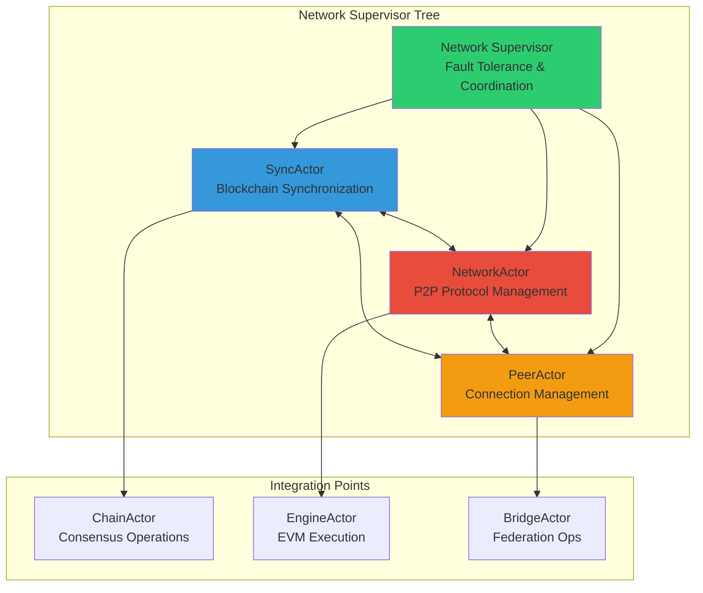

# Network Actors Implementation Plan

## Executive Summary

This document outlines the comprehensive implementation plan for the Network-related actors in Alys V2: **SyncActor**, **NetworkActor**, and **PeerActor**. These actors form the core of the distributed networking infrastructure, handling blockchain synchronization, peer-to-peer communications, and connection management for the federated PoA consensus with merged mining architecture.

## Actor Architecture Overview



## 1. SyncActor Implementation Plan

### 1.1 Core Responsibilities
- **Blockchain Synchronization**: Coordinate downloading and validation of blocks from peers
- **99.5% Sync Threshold**: Enforce production readiness requirements for consensus participation
- **Federation Coordination**: Handle federated PoA timing constraints (2-second block intervals)
- **Checkpoint Management**: Create and restore from blockchain checkpoints for resilience
- **Performance Optimization**: ML-driven algorithms and SIMD optimizations

### 1.2 Technical Architecture

#### 1.2.1 Actor Structure
```rust
// File: app/src/actors/sync/mod.rs
pub mod actor;
pub mod config;
pub mod processor;
pub mod checkpoint;
pub mod network;
pub mod peer;
pub mod tests;

// File: app/src/actors/sync/actor.rs
pub struct SyncActor {
    config: SyncConfig,
    state: SyncState,
    peer_manager: PeerManager,
    block_processor: BlockProcessor,
    checkpoint_manager: CheckpointManager,
    network_monitor: NetworkMonitor,
    performance_optimizer: PerformanceOptimizer,
}
```

#### 1.2.2 Message Protocol
```rust
// File: app/src/messages/sync_messages.rs
#[derive(Debug, Clone, Message)]
#[rtype(result = "ActorResult<SyncResponse>")]
pub struct StartSync {
    pub from_height: Option<u64>,
    pub target_height: Option<u64>,
    pub checkpoint: Option<CheckpointId>,
    pub sync_mode: SyncMode,
}

#[derive(Debug, Clone, Message)]
#[rtype(result = "ActorResult<SyncStatus>")]
pub struct GetSyncStatus;

#[derive(Debug, Clone, Message)]
#[rtype(result = "ActorResult<bool>")]
pub struct CanProduceBlocks;

#[derive(Debug, Clone, Message)]
#[rtype(result = "ActorResult<()>")]
pub struct RecoverFromCheckpoint {
    pub checkpoint_id: String,
    pub verify_integrity: bool,
    pub recovery_mode: RecoveryMode,
}
```

#### 1.2.3 Integration Points
- **BlockchainAwareActor**: Implements timing constraints and federation config
- **Priority**: `BlockchainActorPriority::Network` (priority 2)
- **Event Subscriptions**: Block production, finalization, sync status changes
- **Dependencies**: NetworkActor (peer discovery), PeerActor (connection management)

### 1.3 Implementation Phases

#### Phase 1: Core Synchronization Engine (Week 1-2)
- [ ] Basic SyncActor structure and message handling
- [ ] Block download and validation pipeline
- [ ] Integration with existing ChainActor for block import
- [ ] Basic sync progress tracking and reporting

#### Phase 2: Advanced Features (Week 3-4)
- [ ] 99.5% sync threshold enforcement
- [ ] Checkpoint system for resilience
- [ ] Parallel validation with worker pools
- [ ] Federation timing constraint handling

#### Phase 3: Performance Optimization (Week 5-6)
- [ ] SIMD-optimized hash calculations
- [ ] ML-driven peer selection algorithms
- [ ] Memory pool management
- [ ] Performance monitoring and alerting

#### Phase 4: Testing & Validation (Week 7-8)
- [ ] Comprehensive unit and integration tests
- [ ] Chaos engineering tests (network partitions)
- [ ] Performance benchmarking
- [ ] Documentation and examples

### 1.4 Key Files to Create
- `app/src/actors/sync/actor.rs`: Main SyncActor implementation
- `app/src/actors/sync/config.rs`: Configuration structures
- `app/src/actors/sync/processor.rs`: Block processing pipeline
- `app/src/actors/sync/checkpoint.rs`: Checkpoint management
- `app/src/actors/sync/network.rs`: Network monitoring
- `app/src/actors/sync/peer.rs`: Peer management
- `app/src/actors/sync/tests/mod.rs`: Comprehensive test suite
- `app/src/messages/sync_messages.rs`: Message protocol

## 2. NetworkActor Implementation Plan

### 2.1 Core Responsibilities
- **P2P Protocol Management**: Handle libp2p networking stack and protocol negotiations
- **Gossip Coordination**: Manage gossipsub for block and transaction propagation
- **Transport Management**: TCP/QUIC transport with TLS security
- **Network Health**: Monitor connectivity, bandwidth, and topology
- **Federation Networking**: Specialized protocols for federation member communication

### 2.2 Technical Architecture

#### 2.2.1 Actor Structure
```rust
// File: app/src/actors/network/mod.rs
pub mod actor;
pub mod config;
pub mod protocol;
pub mod transport;
pub mod gossip;
pub mod discovery;
pub mod tests;

// File: app/src/actors/network/actor.rs
pub struct NetworkActor {
    config: NetworkConfig,
    swarm: libp2p::Swarm<AlysNetworkBehaviour>,
    protocol_manager: ProtocolManager,
    gossip_handler: GossipHandler,
    transport_manager: TransportManager,
    discovery_service: DiscoveryService,
    federation_protocol: FederationProtocol,
}
```

#### 2.2.2 libp2p Integration
```rust
// File: app/src/actors/network/protocol.rs
#[derive(NetworkBehaviour)]
pub struct AlysNetworkBehaviour {
    pub gossipsub: gossipsub::Behaviour,
    pub mdns: mdns::tokio::Behaviour,
    pub identify: identify::Behaviour,
    pub ping: ping::Behaviour,
    pub kademlia: kademlia::Behaviour<MemoryStore>,
    pub request_response: request_response::Behaviour<AlysCodec>,
    pub federation: FederationBehaviour,
}
```

#### 2.2.3 Message Protocol
```rust
// File: app/src/messages/network_messages.rs
#[derive(Debug, Clone, Message)]
#[rtype(result = "ActorResult<()>")]
pub struct StartNetwork {
    pub listen_addresses: Vec<Multiaddr>,
    pub bootstrap_peers: Vec<Multiaddr>,
    pub federation_config: Option<FederationConfig>,
}

#[derive(Debug, Clone, Message)]
#[rtype(result = "ActorResult<NetworkStatus>")]
pub struct GetNetworkStatus;

#[derive(Debug, Clone, Message)]
#[rtype(result = "ActorResult<()>")]
pub struct BroadcastBlock {
    pub block: SignedConsensusBlock,
    pub priority: BroadcastPriority,
}

#[derive(Debug, Clone, Message)]
#[rtype(result = "ActorResult<()>")]
pub struct BroadcastTransaction {
    pub tx: Transaction,
    pub source: Option<PeerId>,
}
```

### 2.3 Implementation Phases

#### Phase 1: Basic P2P Infrastructure (Week 1-2)
- [ ] NetworkActor structure with libp2p integration
- [ ] Basic transport (TCP) and identify protocol
- [ ] Ping and basic connectivity testing
- [ ] Integration with existing networking code

#### Phase 2: Gossip and Discovery (Week 3-4)  
- [ ] Gossipsub implementation for block/tx propagation
- [ ] Kademlia DHT for peer discovery
- [ ] mDNS for local network discovery
- [ ] Peer scoring and reputation system

#### Phase 3: Federation Protocols (Week 5-6)
- [ ] Specialized federation member communication
- [ ] Priority message routing for consensus
- [ ] Federation health monitoring
- [ ] Security and authentication

#### Phase 4: Advanced Features (Week 7-8)
- [ ] QUIC transport for improved performance
- [ ] Network topology analysis
- [ ] Bandwidth optimization
- [ ] Testing and documentation

### 2.4 Key Files to Create
- `app/src/actors/network/actor.rs`: Main NetworkActor
- `app/src/actors/network/protocol.rs`: libp2p behaviour composition
- `app/src/actors/network/transport.rs`: Transport management
- `app/src/actors/network/gossip.rs`: Gossipsub handling
- `app/src/actors/network/discovery.rs`: Peer discovery
- `app/src/actors/network/federation.rs`: Federation protocols
- `app/src/messages/network_messages.rs`: Network message protocol

## 3. PeerActor Implementation Plan

### 3.1 Core Responsibilities
- **Connection Management**: Establish, maintain, and monitor peer connections
- **Peer Classification**: Categorize peers (Federation, Miners, Regular nodes)
- **Performance Scoring**: Track peer reliability, latency, and throughput
- **Connection Pooling**: Manage connection limits and resource allocation
- **Peer Discovery**: Bootstrap and ongoing peer finding mechanisms

### 3.2 Technical Architecture

#### 3.2.1 Actor Structure
```rust
// File: app/src/actors/peer/mod.rs
pub mod actor;
pub mod config;
pub mod manager;
pub mod scoring;
pub mod discovery;
pub mod connection;
pub mod tests;

// File: app/src/actors/peer/actor.rs
pub struct PeerActor {
    config: PeerConfig,
    connection_manager: ConnectionManager,
    peer_store: PeerStore,
    scoring_engine: ScoringEngine,
    discovery_service: PeerDiscoveryService,
    health_monitor: PeerHealthMonitor,
}
```

#### 2.2.2 Peer Management
```rust
// File: app/src/actors/peer/manager.rs
pub struct PeerStore {
    peers: HashMap<PeerId, PeerInfo>,
    federation_peers: HashSet<PeerId>,
    miner_peers: HashSet<PeerId>,
    connection_limits: ConnectionLimits,
}

pub struct PeerInfo {
    pub peer_id: PeerId,
    pub addresses: Vec<Multiaddr>,
    pub peer_type: PeerType,
    pub score: PeerScore,
    pub connection_state: ConnectionState,
    pub last_seen: SystemTime,
    pub performance_metrics: PeerMetrics,
}
```

#### 3.2.3 Message Protocol
```rust
// File: app/src/messages/peer_messages.rs
#[derive(Debug, Clone, Message)]
#[rtype(result = "ActorResult<()>")]
pub struct ConnectToPeer {
    pub peer_id: PeerId,
    pub addresses: Vec<Multiaddr>,
    pub peer_type: Option<PeerType>,
}

#[derive(Debug, Clone, Message)]
#[rtype(result = "ActorResult<PeerStatus>")]
pub struct GetPeerStatus {
    pub peer_id: PeerId,
}

#[derive(Debug, Clone, Message)]
#[rtype(result = "ActorResult<Vec<PeerInfo>>")]
pub struct GetConnectedPeers {
    pub peer_type_filter: Option<PeerType>,
}

#[derive(Debug, Clone, Message)]
#[rtype(result = "ActorResult<()>")]
pub struct UpdatePeerScore {
    pub peer_id: PeerId,
    pub score_update: ScoreUpdate,
}
```

### 3.3 Implementation Phases

#### Phase 1: Basic Connection Management (Week 1-2)
- [ ] PeerActor structure and basic connection handling
- [ ] PeerStore for peer information management
- [ ] Connection establishment and teardown
- [ ] Basic peer classification system

#### Phase 2: Scoring and Performance (Week 3-4)
- [ ] Comprehensive peer scoring algorithm
- [ ] Performance metrics collection
- [ ] Connection health monitoring
- [ ] Dynamic connection management

#### Phase 3: Discovery and Federation (Week 5-6)
- [ ] Peer discovery mechanisms
- [ ] Federation peer prioritization
- [ ] Bootstrap peer management
- [ ] Network topology optimization

#### Phase 4: Advanced Features (Week 7-8)
- [ ] Byzantine peer detection
- [ ] Connection pooling optimization
- [ ] Peer blacklisting and reputation
- [ ] Testing and documentation

### 3.4 Key Files to Create
- `app/src/actors/peer/actor.rs`: Main PeerActor
- `app/src/actors/peer/manager.rs`: Peer store and connection management
- `app/src/actors/peer/scoring.rs`: Peer scoring algorithms
- `app/src/actors/peer/discovery.rs`: Peer discovery service
- `app/src/actors/peer/connection.rs`: Connection handling
- `app/src/messages/peer_messages.rs`: Peer message protocol

## 4. Integration Strategy

### 4.1 Actor Supervision Tree
```rust
// File: app/src/actors/supervisors/network_supervisor.rs
pub struct NetworkSupervisor {
    sync_actor: Addr<SyncActor>,
    network_actor: Addr<NetworkActor>,
    peer_actor: Addr<PeerActor>,
    supervision_strategy: NetworkSupervisionStrategy,
}

impl NetworkSupervisor {
    pub async fn start_network_subsystem(&mut self) -> ActorResult<()> {
        // Start actors in dependency order
        self.peer_actor = PeerActor::new(peer_config).start();
        self.network_actor = NetworkActor::new(network_config).start();
        self.sync_actor = SyncActor::new(sync_config).start();
        
        // Establish inter-actor communication
        self.setup_actor_connections().await?;
        Ok(())
    }
}
```

### 4.2 Cross-Actor Communication
- **SyncActor → NetworkActor**: Request block downloads, announce sync progress
- **SyncActor → PeerActor**: Query peer performance, request specific peer connections
- **NetworkActor → PeerActor**: Report connection events, request peer scoring updates
- **PeerActor → NetworkActor**: Notify of peer changes, connection status updates

### 4.3 External Integration Points
- **ChainActor**: Block import notifications, consensus participation status
- **EngineActor**: Transaction propagation, execution layer coordination  
- **BridgeActor**: Federation member coordination, peg operation notifications

## 5. Testing Strategy

### 5.1 Unit Testing
- Individual actor message handling
- Core algorithms (sync, scoring, discovery)
- Error handling and edge cases
- Performance benchmarks

### 5.2 Integration Testing
- Inter-actor communication patterns
- Network protocol compliance
- Federation consensus coordination
- Byzantine fault tolerance

### 5.3 End-to-End Testing
- Multi-node network setup
- Sync performance under various conditions
- Network partition recovery
- Stress testing with high peer counts

### 5.4 Chaos Engineering
- Random peer disconnections
- Network partitions and merges
- Byzantine peer behavior simulation
- Resource exhaustion scenarios

## 6. Configuration Management

### 6.1 Network Configuration
```rust
// File: app/src/actors/network/config.rs
pub struct NetworkConfig {
    pub listen_addresses: Vec<Multiaddr>,
    pub bootstrap_peers: Vec<Multiaddr>,
    pub max_connections: usize,
    pub gossip_config: GossipConfig,
    pub discovery_config: DiscoveryConfig,
    pub federation_config: Option<FederationNetworkConfig>,
    pub security_config: SecurityConfig,
}
```

### 6.2 Sync Configuration
```rust
// File: app/src/actors/sync/config.rs
pub struct SyncConfig {
    pub sync_threshold: f64, // 0.995 for 99.5%
    pub max_parallel_downloads: usize,
    pub validation_workers: usize,
    pub checkpoint_interval: u64,
    pub performance_optimization: OptimizationConfig,
    pub federation_constraints: FederationTimingConfig,
}
```

### 6.3 Peer Configuration
```rust
// File: app/src/actors/peer/config.rs
pub struct PeerConfig {
    pub max_peers: usize,
    pub federation_peer_limit: usize,
    pub connection_timeout: Duration,
    pub scoring_config: ScoringConfig,
    pub discovery_config: PeerDiscoveryConfig,
    pub health_check_interval: Duration,
}
```

## 7. Performance Requirements

### 7.1 SyncActor Performance Targets
- **Throughput**: 10,000+ blocks/second validation
- **Latency**: <50ms average block processing
- **Memory**: <1GB working set
- **Sync Time**: <10 minutes for full chain sync
- **Reliability**: 99.9% uptime during normal operation

### 7.2 NetworkActor Performance Targets
- **Message Propagation**: <100ms for block gossip
- **Peer Discovery**: <30 seconds for network bootstrap
- **Bandwidth Efficiency**: >90% utilization under load
- **Connection Establishment**: <2 seconds average
- **Protocol Overhead**: <5% of total bandwidth

### 7.3 PeerActor Performance Targets
- **Peer Scoring**: <1ms per peer update
- **Connection Management**: Support 1000+ concurrent peers
- **Discovery Rate**: 10+ new peers per minute
- **Health Monitoring**: <10ms per peer health check
- **Memory Usage**: <100MB for peer store

## 8. Security Considerations

### 8.1 Network Security
- **Transport Encryption**: TLS for all peer communications
- **Identity Verification**: Cryptographic peer identity verification
- **DDoS Protection**: Rate limiting and connection throttling
- **Byzantine Peer Detection**: Algorithmic detection of malicious behavior

### 8.2 Federation Security
- **Privileged Channels**: Secure communication for federation members
- **Authentication**: Strong identity verification for federation peers
- **Message Integrity**: Cryptographic message signing and verification
- **Audit Logging**: Comprehensive security event logging

### 8.3 Sync Security
- **Block Validation**: Comprehensive cryptographic verification
- **Checkpoint Integrity**: Merkle proof verification for checkpoints
- **Source Verification**: Trusted peer validation for critical blocks
- **Rollback Protection**: Prevention of malicious chain reorganizations

## 9. Monitoring and Observability

### 9.1 Metrics Collection
- Sync progress and performance metrics
- Network connectivity and throughput
- Peer scoring and connection statistics
- Error rates and failure patterns

### 9.2 Logging Strategy
- Structured logging with correlation IDs
- Performance tracing for critical paths
- Security event logging
- Debug information for troubleshooting

### 9.3 Health Checks
- Actor health monitoring
- Network connectivity status
- Sync progression validation
- Federation participation status

## 10. Deployment Considerations

### 10.1 Resource Requirements
- **CPU**: 4+ cores for optimal performance
- **Memory**: 4GB+ for full node operation
- **Storage**: SSD recommended for checkpoint storage
- **Network**: Stable broadband with low latency

### 10.2 Configuration Templates
- Development (single node)
- Local network (3 nodes)
- Testnet participation
- Mainnet federation member

### 10.3 Operational Procedures
- Graceful shutdown procedures
- Emergency recovery protocols
- Configuration update procedures
- Performance tuning guidelines

## 11. Implementation Timeline

### Overall Timeline: 8 weeks

**Weeks 1-2**: Foundation
- Actor structure creation
- Basic message protocols
- Core functionality implementation
- Initial integration testing

**Weeks 3-4**: Core Features
- Advanced synchronization algorithms
- P2P protocol implementation
- Peer management systems
- Federation protocol support

**Weeks 5-6**: Optimization
- Performance tuning
- SIMD optimizations
- ML-driven algorithms
- Security enhancements

**Weeks 7-8**: Validation
- Comprehensive testing
- Documentation completion
- Performance benchmarking
- Production readiness validation

## 12. Success Criteria

### 12.1 Functional Requirements
- [ ] Successful blockchain synchronization to 99.5%+ threshold
- [ ] Reliable P2P communication with 1000+ peers
- [ ] Federation consensus participation within timing constraints
- [ ] Automatic recovery from network partitions
- [ ] Byzantine fault tolerance demonstration

### 12.2 Performance Requirements
- [ ] Meet all specified performance targets
- [ ] Pass comprehensive stress testing
- [ ] Demonstrate scalability under load
- [ ] Validate memory and CPU efficiency
- [ ] Confirm security properties

### 12.3 Integration Requirements
- [ ] Seamless integration with existing ChainActor
- [ ] Proper supervision tree operation
- [ ] Configuration management compatibility
- [ ] Monitoring and observability integration
- [ ] Documentation and examples complete

## 13. Risk Mitigation

### 13.1 Technical Risks
- **Complexity Management**: Incremental development with early integration
- **Performance Issues**: Early benchmarking and optimization focus
- **Network Protocol Changes**: Abstraction layers for protocol flexibility
- **Byzantine Failures**: Comprehensive fault injection testing

### 13.2 Integration Risks
- **Actor Dependencies**: Clear interface definitions and contracts
- **Message Protocol Evolution**: Versioned message formats
- **Configuration Complexity**: Default templates and validation
- **Testing Coverage**: Automated testing at all levels

### 13.3 Operational Risks
- **Resource Requirements**: Performance monitoring and alerting
- **Network Partitions**: Automatic recovery mechanisms
- **Peer Discovery Issues**: Multiple discovery mechanisms
- **Federation Coordination**: Fallback protocols and manual override

## Conclusion

This implementation plan provides a comprehensive roadmap for implementing the Network actors (SyncActor, NetworkActor, PeerActor) in Alys V2. The plan emphasizes:

1. **Incremental Development**: Phased approach with early integration
2. **Performance Focus**: SIMD optimizations and ML-driven algorithms
3. **Federation Awareness**: Specialized protocols for consensus operations
4. **Comprehensive Testing**: Unit, integration, and chaos engineering tests
5. **Production Readiness**: Security, monitoring, and operational considerations

The planned 8-week timeline allows for thorough development, optimization, and validation while maintaining the high-performance requirements of the Alys blockchain network.