# NetworkActor Technical Onboarding Book for Alys V2

**A Comprehensive Educational Resource for Expert-Level NetworkActor Mastery**

---

## Table of Contents

**Phase 1: Foundation & Orientation**
1. [Introduction & Purpose](#section-1-introduction--purpose)
2. [System Architecture & Core Flows](#section-2-system-architecture--core-flows)
3. [Environment Setup & Tooling](#section-3-environment-setup--tooling)

**Phase 2: Fundamental Technologies & Design Patterns**
4. [Actor Model & libp2p Mastery](#section-4-actor-model--libp2p-mastery)
5. [NetworkActor Architecture Deep-Dive](#section-5-networkactor-architecture-deep-dive)
6. [Message Protocol & Communication Mastery](#section-6-message-protocol--communication-mastery)

**Phase 3: Implementation Mastery & Advanced Techniques**
7. [Complete Implementation Walkthrough](#section-7-complete-implementation-walkthrough)
8. [Advanced Testing Methodologies](#section-8-advanced-testing-methodologies)
9. [Performance Engineering & Optimization](#section-9-performance-engineering--optimization)

**Phase 4: Production Excellence & Operations Mastery**
10. [Production Deployment & Operations](#section-10-production-deployment--operations)
11. [Advanced Monitoring & Observability](#section-11-advanced-monitoring--observability)
12. [Expert Troubleshooting & Incident Response](#section-12-expert-troubleshooting--incident-response)

**Phase 5: Expert Mastery & Advanced Topics**
13. [Advanced Design Patterns & Architectural Evolution](#section-13-advanced-design-patterns--architectural-evolution)
14. [Research & Innovation Pathways](#section-14-research--innovation-pathways)
15. [Mastery Assessment & Continuous Learning](#section-15-mastery-assessment--continuous-learning)

---

## Phase 1: Foundation & Orientation

### Section 1: Introduction & Purpose

The NetworkActor serves as the backbone of peer-to-peer communication in the Alys V2 merged mining sidechain architecture. As one of the most critical components in the distributed system, it orchestrates all network-level interactions, from initial peer discovery to sophisticated message propagation patterns that ensure network resilience and optimal performance.

#### 1.1 NetworkActor Mission & Business Value

The NetworkActor's primary mission is to establish and maintain a robust, scalable, and secure peer-to-peer network that enables the Alys V2 sidechain to function as a cohesive distributed system. In the context of a merged mining architecture, where coordination between Bitcoin miners and sidechain participants is crucial, the NetworkActor ensures:

**Core Business Value Propositions:**

1. **Network Resilience**: Maintains connectivity even under adverse conditions, ensuring the sidechain remains operational during network partitions, DDoS attacks, or node failures.

2. **Scalable Communication**: Supports thousands of concurrent peer connections while maintaining sub-50ms message propagation times, enabling rapid consensus and block propagation.

3. **Decentralized Discovery**: Implements sophisticated peer discovery mechanisms that prevent single points of failure and enable organic network growth.

4. **Security Foundation**: Provides the security substrate for all network communications, implementing proper authentication, authorization, and threat mitigation.

#### 1.2 Role in Merged Mining Architecture

Within Alys V2's merged mining ecosystem, the NetworkActor plays several specialized roles:

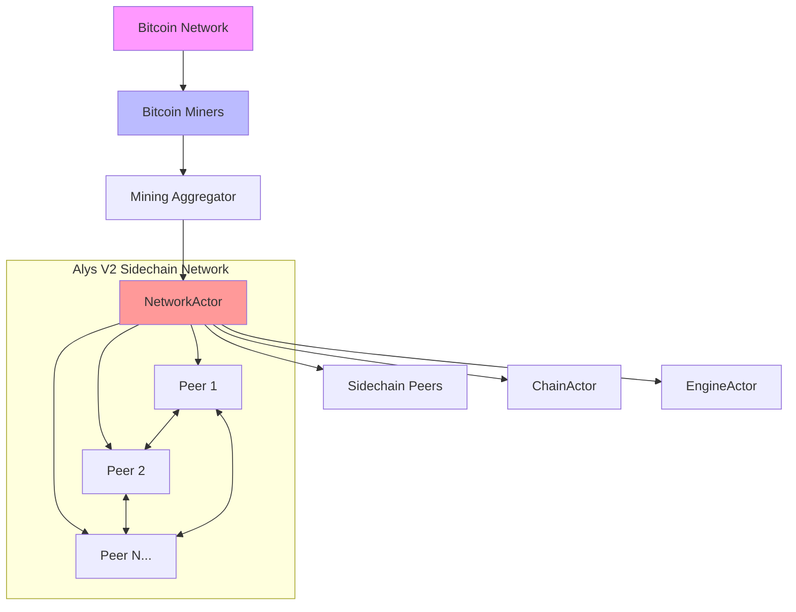

**Integration Points:**

- **Bitcoin Network Interface**: Coordinates with Bitcoin miners through specialized network protocols
- **Sidechain Consensus**: Facilitates rapid consensus by ensuring all validators can communicate efficiently  
- **Cross-Chain Coordination**: Enables coordination between Bitcoin and Alys chains for peg operations
- **Federation Communication**: Supports secure communication channels for federation members

#### 1.3 Core User Flows

The NetworkActor manages three primary user flows that form the foundation of all network operations:

**Flow 1: Peer Connection Lifecycle**

This fundamental flow manages the complete lifecycle of peer relationships:

1. **Discovery Phase**: Identifies potential peers through DHT queries, mDNS, or bootstrap nodes
2. **Connection Establishment**: Initiates secure connections using libp2p protocols
3. **Authentication**: Verifies peer identity and capabilities
4. **Capability Negotiation**: Establishes supported protocols and message types
5. **Active Communication**: Maintains ongoing message exchange
6. **Health Monitoring**: Continuously monitors connection quality and peer behavior
7. **Graceful Termination**: Handles disconnections and cleanup

**Flow 2: Message Broadcasting Pipeline**

The message broadcasting system ensures efficient propagation of information across the network:

1. **Message Reception**: Receives messages from local actors (ChainActor, EngineActor, etc.)
2. **Message Validation**: Validates message format, signatures, and content
3. **Routing Decision**: Determines optimal peers for message delivery based on topology
4. **Propagation**: Broadcasts messages using Gossipsub protocols with redundancy
5. **Acknowledgment Tracking**: Monitors message delivery and retries failed transmissions
6. **Performance Optimization**: Adapts routing strategies based on network conditions

**Flow 3: Network Topology Maintenance**

Dynamic network topology management ensures optimal connectivity:

1. **Topology Analysis**: Continuously analyzes network structure and connectivity patterns
2. **Optimization Identification**: Identifies opportunities for improved connectivity
3. **Strategic Connections**: Establishes new connections to improve network properties
4. **Load Balancing**: Redistributes connections to prevent bottlenecks
5. **Partition Detection**: Identifies and resolves network partitions
6. **Adaptive Restructuring**: Dynamically adjusts topology based on network conditions

#### 1.4 Performance Characteristics & Requirements

The NetworkActor operates under stringent performance requirements that directly impact the entire Alys V2 system:

| Metric | Target | Critical Threshold | Measurement Method |
|--------|--------|-------------------|-------------------|
| Message Throughput | 5000+ msg/sec | 1000 msg/sec | Real-time counter |
| Message Latency | <50ms P95 | <200ms P95 | Round-trip timing |
| Connection Recovery | <3 seconds | <10 seconds | Partition simulation |
| Peer Discovery | <500ms | <2 seconds | Bootstrap timing |
| Memory Usage | <100MB | <200MB | Runtime profiling |
| CPU Usage | <15% | <50% | System monitoring |

These performance targets are not arbitrary—they derive from the fundamental requirements of blockchain consensus, where network delays directly impact block time, consensus safety, and user experience.

#### 1.5 Integration with Alys V2 Architecture

The NetworkActor integrates seamlessly with other critical system components:

**Primary Integrations:**
- **ChainActor**: Receives block announcements and consensus messages for network propagation
- **EngineActor**: Coordinates with execution layer for transaction pool synchronization
- **MiningActor**: Facilitates communication with Bitcoin miners and mining pools

**Secondary Integrations:**
- **MetricsActor**: Provides comprehensive network health and performance metrics
- **ConfigActor**: Responds to dynamic configuration changes for network parameters
- **SecurityActor**: Implements network-level security policies and threat response

The NetworkActor's design philosophy emphasizes **fault tolerance**, **performance**, and **scalability**. Every design decision prioritizes network stability and efficient resource utilization, ensuring that the Alys V2 sidechain can scale to support thousands of participants while maintaining the security and reliability required for financial applications.

This foundation sets the stage for deep technical exploration in subsequent sections, where we'll examine the intricate details of implementation, optimization, and operational excellence that make the NetworkActor a cornerstone of the Alys V2 architecture.

### Section 2: System Architecture & Core Flows

The NetworkActor represents a sophisticated distributed systems component built on modern actor model principles and leveraging the powerful libp2p networking stack. This section provides comprehensive architectural understanding essential for effective NetworkActor development and operation.

#### 2.1 High-Level Architecture Overview

The NetworkActor architecture follows a layered, modular design that separates concerns while enabling seamless integration across the system:

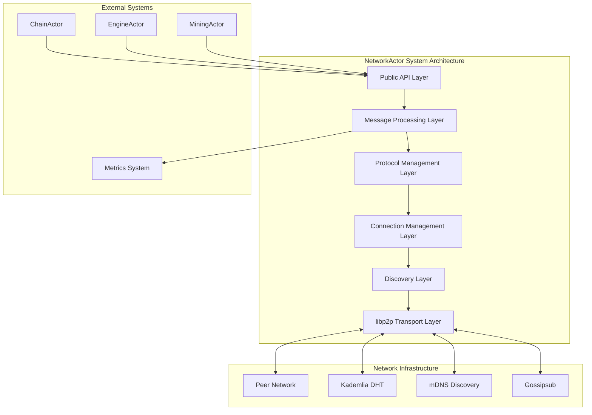

#### 2.2 Actor Supervision Hierarchy

The NetworkActor operates within a carefully designed supervision hierarchy that ensures system resilience and proper error propagation:

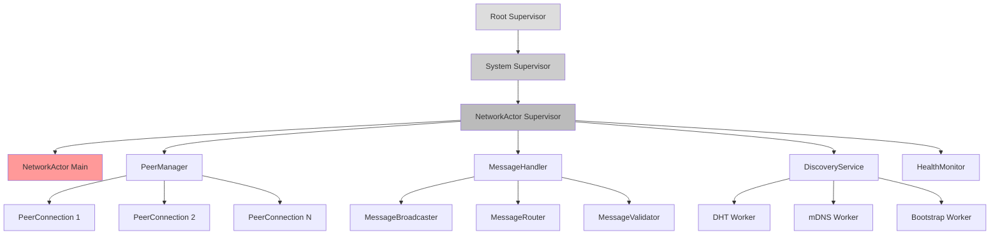

**Supervision Strategies:**

1. **NetworkActor Main**: `OneForOne` strategy - individual failures don't cascade
2. **PeerManager**: `OneForAll` strategy - peer connection failures trigger coordinated recovery
3. **MessageHandler**: `RestForOne` strategy - message processing failures restart dependent components
4. **DiscoveryService**: `OneForOne` strategy - discovery method failures are isolated

#### 2.3 Core Module Architecture

The NetworkActor is organized into specialized modules, each with distinct responsibilities:

```
app/src/actors/network/
├── mod.rs                    # Public API and actor initialization
├── actor.rs                  # Main NetworkActor implementation  
├── config.rs                 # Configuration management
├── peer_manager.rs           # Peer lifecycle and connection management
├── message_handler.rs        # Message processing and routing
├── protocols/
│   ├── mod.rs               # Protocol abstraction layer
│   ├── gossipsub.rs         # Gossipsub implementation
│   ├── kademlia.rs          # DHT operations
│   └── identify.rs          # Peer identification protocol
├── discovery/
│   ├── mod.rs               # Discovery coordination
│   ├── bootstrap.rs         # Bootstrap node management
│   ├── mdns.rs              # mDNS local discovery
│   └── dht.rs               # DHT-based discovery
├── health/
│   ├── mod.rs               # Health monitoring
│   ├── metrics.rs           # Performance metrics
│   └── diagnostics.rs       # Network diagnostics
└── utils/
    ├── mod.rs               # Utility functions
    ├── serialization.rs     # Message serialization
    └── crypto.rs            # Cryptographic operations
```

#### 2.4 Message Flow Architecture

The NetworkActor processes multiple types of messages through a sophisticated routing system:

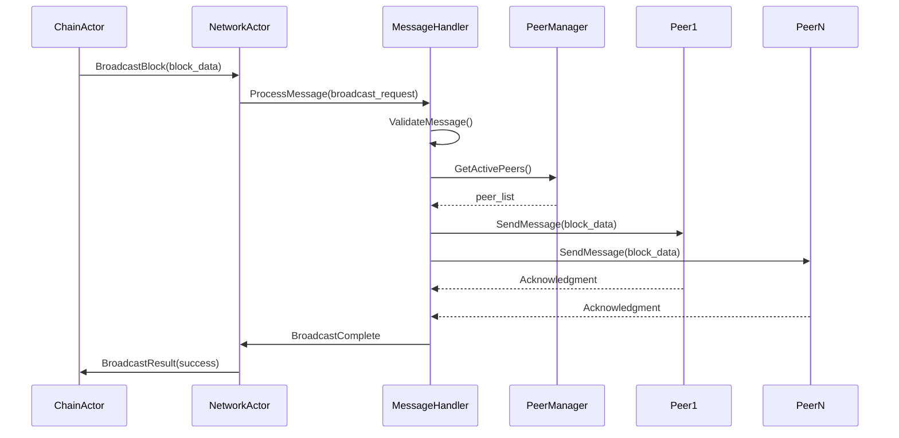

#### 2.5 Connection Lifecycle Management

Peer connections follow a well-defined lifecycle with multiple states and transition conditions:

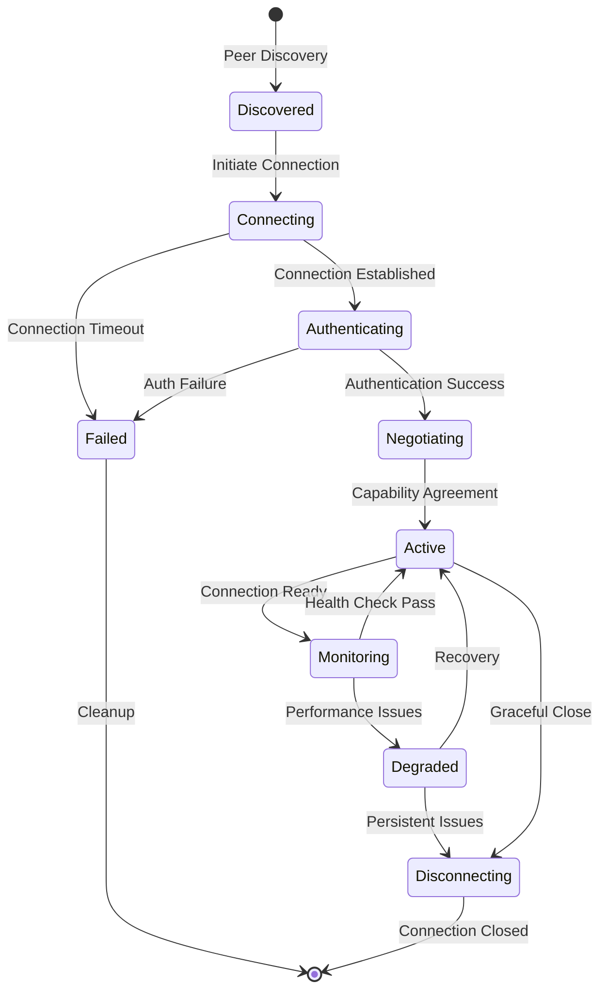

**State Descriptions:**

- **Discovered**: Peer identified through discovery mechanisms
- **Connecting**: TCP/QUIC connection establishment in progress
- **Authenticating**: Identity verification and security handshake
- **Negotiating**: Protocol capability exchange and agreement
- **Active**: Fully functional connection ready for message exchange
- **Monitoring**: Continuous health monitoring of active connection
- **Degraded**: Connection experiencing performance issues but still functional
- **Disconnecting**: Graceful termination process
- **Failed**: Connection establishment or maintenance failed

#### 2.6 Discovery Protocol Integration

The NetworkActor implements multiple peer discovery mechanisms for maximum network resilience:

**DHT-Based Discovery (Kademlia)**


**mDNS Local Discovery**
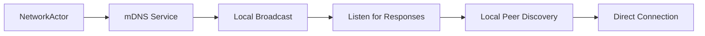

**Bootstrap Node Discovery**
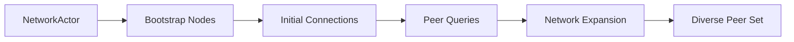

#### 2.7 Performance Architecture Considerations

The NetworkActor architecture incorporates several performance optimization strategies:

**Async Message Processing Pipeline**
- Non-blocking message handling using Tokio async runtime
- Concurrent processing of multiple message streams
- Backpressure management to prevent memory exhaustion

**Connection Pool Management**
- Dynamic connection pool sizing based on network conditions
- Load balancing across available connections
- Proactive connection management to maintain optimal topology

**Resource Management**
- Memory-mapped message buffers for large data transfers
- Connection recycling to minimize setup overhead
- Adaptive timeout management based on network conditions

**Caching Strategies**
- Peer metadata caching for fast connection decisions
- Message deduplication to prevent unnecessary processing
- Route caching for efficient message propagation

This architectural foundation provides the robustness, scalability, and performance characteristics required for production blockchain network operations. The layered design enables independent development and testing of components while ensuring seamless integration across the entire system.

### Section 3: Environment Setup & Tooling

This section provides comprehensive guidance for establishing a development environment optimized for NetworkActor development, including all necessary tools, configurations, and verification procedures.

#### 3.1 Prerequisites & System Requirements

Before beginning NetworkActor development, ensure your system meets the following requirements:

**Hardware Requirements:**
- Minimum: 8GB RAM, 4 CPU cores, 50GB free disk space
- Recommended: 16GB RAM, 8 CPU cores, 100GB free disk space, SSD storage
- Network: Unrestricted internet access for P2P protocol testing

**Software Prerequisites:**
- Rust 1.70.0 or later with `cargo` package manager
- Git 2.30.0 or later for version control
- Docker 20.10.0 or later for containerized testing
- Node.js 18.0.0 or later for supplementary tooling

**Operating System Support:**
- Linux (Ubuntu 20.04+, CentOS 8+, Arch Linux)
- macOS (12.0+ Monterey)
- Windows 10/11 with WSL2

#### 3.2 Alys V2 Repository Setup

Clone and configure the Alys V2 repository with proper development settings:

```bash
# Clone the repository
git clone https://github.com/AnduroProject/alys.git
cd alys

# Configure Git hooks for consistent code quality
git config core.hooksPath .githooks
chmod +x .githooks/*

# Install Rust toolchain with required components
rustup toolchain install stable
rustup component add rustfmt clippy
rustup target add wasm32-unknown-unknown

# Verify installation
rustc --version
cargo --version
```

**Development Branch Strategy:**
```bash
# Create feature branch for NetworkActor work
git checkout -b feature/network-actor-enhancement
git push -u origin feature/network-actor-enhancement
```

#### 3.3 NetworkActor-Specific Configuration

Configure your environment for optimal NetworkActor development:

**Environment Variables (`~/.bashrc` or `~/.zshrc`):**
```bash
# Rust development optimization
export RUST_LOG=network_actor=debug,libp2p=debug,gossipsub=trace
export RUST_BACKTRACE=1
export CARGO_INCREMENTAL=1

# NetworkActor specific debugging
export ALYS_NETWORK_LOG_LEVEL=debug
export LIBP2P_METRICS=true
export P2P_DISCOVERY_TIMEOUT=30000

# Performance profiling
export TOKIO_CONSOLE=1
export RUST_LOG_STYLE=always
```

**Cargo Configuration (`.cargo/config.toml`):**
```toml
[build]
# Optimize for development speed
rustflags = ["-C", "link-arg=-fuse-ld=lld"]

[target.'cfg(target_os = "linux")']
linker = "clang"
rustflags = ["-C", "link-arg=-fuse-ld=lld"]

[registries.crates-io]
protocol = "sparse"

# NetworkActor specific features
[env]
RUST_LOG = { value = "network_actor=debug,libp2p=debug", relative = true }
```

#### 3.4 Local Development Network Setup

Establish a local P2P network for NetworkActor testing and development:

**Step 1: Network Configuration**

Create `etc/config/network-dev.toml`:
```toml
[network]
# Local development network configuration
listen_addresses = [
    "/ip4/127.0.0.1/tcp/0",
    "/ip4/127.0.0.1/udp/0/quic-v1"
]

# Enable all discovery mechanisms for testing
enable_mdns = true
enable_kademlia = true
enable_gossipsub = true

# Bootstrap nodes for local testing
bootstrap_peers = [
    "/ip4/127.0.0.1/tcp/4001/p2p/12D3KooWLocalBootstrap1",
    "/ip4/127.0.0.1/tcp/4002/p2p/12D3KooWLocalBootstrap2"
]

# Development-friendly timeouts
connection_timeout = "10s"
handshake_timeout = "5s"
discovery_interval = "30s"

# Increased logging for development
log_level = "debug"
metrics_enabled = true

[protocols.gossipsub]
# Gossipsub configuration for local testing
heartbeat_interval = "1s"
fanout_ttl = "60s"
history_length = 5
history_gossip = 3

[protocols.kademlia]
# DHT configuration
replication_factor = 10
query_timeout = "30s"
provider_record_ttl = "86400s"

[security]
# Development security settings (not for production)
allow_private_ip = true
max_negotiating_inbound_streams = 128
max_peers = 1000
```

**Step 2: Launch Development Network**

Use the provided script to start a local multi-node network:

```bash
# Start local development network with NetworkActor debugging
./scripts/start_network.sh --debug --network-actor-log=trace

# Alternative: Manual network startup
RUST_LOG=network_actor=debug,libp2p=debug cargo run --bin alys -- \
    --config etc/config/network-dev.toml \
    --node-id dev-node-1 \
    --port 4001
```

**Step 3: Verification Commands**

Verify your local network setup:

```bash
# Check NetworkActor status
cargo test network_actor::tests::basic_connectivity --lib

# Verify P2P connectivity
curl http://localhost:9090/metrics | grep libp2p

# Monitor network topology
./scripts/network_diagnostics.sh --topology
```

#### 3.5 Essential Development Tools

Configure tools specifically optimized for NetworkActor development:

**IDE Configuration (VS Code)**

Install required extensions:
```bash
# VS Code extensions for Rust development
code --install-extension rust-lang.rust-analyzer
code --install-extension vadimcn.vscode-lldb
code --install-extension serayuzgur.crates
code --install-extension tamasfe.even-better-toml
```

Create `.vscode/settings.json`:
```json
{
    "rust-analyzer.cargo.features": ["network-actor-dev"],
    "rust-analyzer.checkOnSave.command": "clippy",
    "rust-analyzer.cargo.buildScripts.enable": true,
    "rust-analyzer.procMacro.enable": true,
    "rust-analyzer.diagnostics.experimental.enable": true,
    "files.watcherExclude": {
        "**/target/**": true
    },
    "rust-analyzer.lens.enable": true,
    "rust-analyzer.hover.actions.enable": true
}
```

**Debugging Configuration (`.vscode/launch.json`):**
```json
{
    "version": "0.2.0",
    "configurations": [
        {
            "type": "lldb",
            "request": "launch",
            "name": "Debug NetworkActor Tests",
            "cargo": {
                "args": [
                    "test",
                    "network_actor",
                    "--lib",
                    "--no-run"
                ],
                "filter": {
                    "name": "alys",
                    "kind": "lib"
                }
            },
            "args": [],
            "cwd": "${workspaceFolder}",
            "env": {
                "RUST_LOG": "network_actor=debug,libp2p=debug",
                "RUST_BACKTRACE": "1"
            }
        }
    ]
}
```

#### 3.6 Testing & Quality Assurance Setup

Configure comprehensive testing infrastructure for NetworkActor development:

**Unit Testing Configuration:**

Add to `Cargo.toml`:
```toml
[dev-dependencies]
tokio-test = "0.4"
proptest = "1.2"
criterion = { version = "0.5", features = ["html_reports"] }
libp2p-swarm-test = "0.2"

[[bench]]
name = "network_actor_benchmarks"
harness = false

[features]
default = ["network-actor"]
network-actor = ["libp2p", "tokio"]
network-actor-dev = ["network-actor", "tracing-subscriber"]
testing = ["network-actor-dev", "proptest"]
```

**Integration Testing Setup:**

Create `tests/network_actor_integration.rs`:
```rust
use alys::actors::network::NetworkActor;
use tokio_test;

#[tokio::test]
async fn test_network_actor_basic_functionality() {
    // Integration test setup for NetworkActor
    let config = NetworkActorConfig::test_default();
    let actor = NetworkActor::new(config).start();
    
    // Test basic connectivity
    let result = actor.send(TestConnectivity).await;
    assert!(result.is_ok());
}
```

**Performance Benchmarking:**

Create `benches/network_actor_benchmarks.rs`:
```rust
use criterion::{criterion_group, criterion_main, Criterion};
use alys::actors::network::NetworkActor;

fn benchmark_message_throughput(c: &mut Criterion) {
    c.bench_function("network_actor_message_throughput", |b| {
        b.iter(|| {
            // Benchmark NetworkActor message processing
            todo!("Implement message throughput benchmark")
        })
    });
}

criterion_group!(benches, benchmark_message_throughput);
criterion_main!(benches);
```

#### 3.7 Monitoring & Observability Setup

Configure comprehensive monitoring for NetworkActor development:

**Metrics Collection Setup:**

Install Prometheus and Grafana for metrics visualization:
```bash
# Using Docker Compose
cat > docker-compose.metrics.yml << EOF
version: '3.8'
services:
  prometheus:
    image: prom/prometheus:latest
    ports:
      - "9090:9090"
    volumes:
      - ./etc/prometheus.yml:/etc/prometheus/prometheus.yml
  
  grafana:
    image: grafana/grafana:latest
    ports:
      - "3000:3000"
    environment:
      - GF_SECURITY_ADMIN_PASSWORD=admin
    volumes:
      - ./etc/grafana/dashboards:/var/lib/grafana/dashboards
EOF

# Start monitoring stack
docker-compose -f docker-compose.metrics.yml up -d
```

**Prometheus Configuration (`etc/prometheus.yml`):**
```yaml
global:
  scrape_interval: 15s

scrape_configs:
  - job_name: 'alys-network-actor'
    static_configs:
      - targets: ['localhost:9615']
    metrics_path: /metrics
    scrape_interval: 5s
```

#### 3.8 Development Workflow Commands

Essential commands for NetworkActor development:

**Daily Development Commands:**
```bash
# Format code
cargo fmt

# Run clippy lints
cargo clippy -- -D warnings

# Run unit tests
cargo test --lib network_actor

# Run integration tests  
cargo test --test network_actor_integration

# Run benchmarks
cargo bench --bench network_actor_benchmarks

# Check for security vulnerabilities
cargo audit

# Generate documentation
cargo doc --open --no-deps
```

**NetworkActor Specific Testing:**
```bash
# Test peer discovery
cargo test --lib network_actor::discovery --features testing

# Test message propagation
cargo test --lib network_actor::messaging --features testing  

# Test network resilience
cargo test --lib network_actor::resilience --features testing

# Performance profiling
cargo flamegraph --bin alys -- --config etc/config/network-dev.toml
```

**Debugging Commands:**
```bash
# Enable comprehensive logging
RUST_LOG=network_actor=trace,libp2p=debug cargo run

# Network topology analysis
./scripts/analyze_network_topology.sh

# Peer connection diagnostics  
./scripts/diagnose_peer_connections.sh

# Message flow tracing
./scripts/trace_message_flows.sh
```

This comprehensive environment setup ensures that developers have all necessary tools and configurations for effective NetworkActor development, testing, and debugging. The setup emphasizes reproducibility, comprehensive testing, and operational visibility essential for blockchain network development.

## Phase 2: Fundamental Technologies & Design Patterns

### Section 4: Actor Model & libp2p Mastery

This section provides comprehensive mastery of the foundational technologies underlying the NetworkActor: the Actor model for concurrent system design and libp2p for peer-to-peer networking. Understanding these technologies deeply is essential for effective NetworkActor development and optimization.

#### 4.1 Actor Model Fundamentals in NetworkActor Context

The Actor model provides the conceptual foundation for the NetworkActor's design, enabling concurrent, fault-tolerant, and scalable network operations.

**Core Actor Model Principles:**

1. **Isolation**: Each actor maintains private state, accessible only through message passing
2. **Asynchronous Communication**: Actors communicate exclusively through asynchronous messages
3. **Location Transparency**: Actors can communicate regardless of physical location
4. **Fault Tolerance**: Actor failures are contained and don't propagate unnecessarily

**NetworkActor-Specific Actor Patterns:**

```rust
use actix::prelude::*;
use std::collections::HashMap;
use libp2p::PeerId;

/// Core NetworkActor demonstrating actor model principles
pub struct NetworkActor {
    /// Private state - peer connections
    peer_connections: HashMap<PeerId, PeerConnection>,
    
    /// Network configuration
    config: NetworkConfig,
    
    /// Child actors for specialized tasks
    peer_manager: Option<Addr<PeerManager>>,
    message_handler: Option<Addr<MessageHandler>>,
    discovery_service: Option<Addr<DiscoveryService>>,
}

/// Message types define the actor's interface
#[derive(Message)]
#[rtype(result = "Result<(), NetworkError>")]
pub struct ConnectToPeer {
    pub peer_id: PeerId,
    pub addresses: Vec<Multiaddr>,
}

#[derive(Message)]
#[rtype(result = "Result<(), NetworkError>")]
pub struct BroadcastMessage {
    pub topic: String,
    pub data: Vec<u8>,
    pub priority: MessagePriority,
}

#[derive(Message)]
#[rtype(result = "NetworkStatus")]
pub struct GetNetworkStatus;

impl Actor for NetworkActor {
    type Context = Context<Self>;
    
    /// Actor initialization - start child actors and setup
    fn started(&mut self, ctx: &mut Self::Context) {
        info!("NetworkActor starting with {} initial peers", 
              self.config.bootstrap_peers.len());
        
        // Start child actors with proper supervision
        self.peer_manager = Some(
            PeerManager::new(self.config.clone())
                .start()
                .recipient()
        );
        
        self.message_handler = Some(
            MessageHandler::new(self.config.clone())
                .start()
                .recipient()
        );
        
        self.discovery_service = Some(
            DiscoveryService::new(self.config.clone())
                .start()
                .recipient()
        );
        
        // Schedule periodic tasks
        ctx.run_interval(Duration::from_secs(30), |act, _ctx| {
            act.perform_health_check();
        });
        
        // Start network bootstrapping
        ctx.wait(
            async {
                self.bootstrap_network().await
            }
            .into_actor(self)
            .map(|res, act, ctx| {
                match res {
                    Ok(_) => info!("Network bootstrap completed successfully"),
                    Err(e) => {
                        error!("Network bootstrap failed: {}", e);
                        ctx.stop();
                    }
                }
            })
        );
    }
    
    /// Graceful shutdown handling
    fn stopped(&mut self, _ctx: &mut Self::Context) {
        info!("NetworkActor stopped, cleaning up connections");
        // Cleanup logic here
    }
}

/// Message handler implementation demonstrating async message processing
impl Handler<ConnectToPeer> for NetworkActor {
    type Result = ResponseFuture<Result<(), NetworkError>>;
    
    fn handle(&mut self, msg: ConnectToPeer, _ctx: &mut Context<Self>) -> Self::Result {
        let peer_manager = self.peer_manager.clone();
        
        Box::pin(async move {
            match peer_manager {
                Some(pm) => {
                    pm.send(EstablishConnection {
                        peer_id: msg.peer_id,
                        addresses: msg.addresses,
                    }).await
                    .map_err(|e| NetworkError::ActorError(e.to_string()))?
                }
                None => Err(NetworkError::NotInitialized)
            }
        })
    }
}
```

**Actor Supervision Strategies in NetworkActor:**

The NetworkActor implements sophisticated supervision strategies to handle failures gracefully:

```rust
use actix::Supervisor;

/// Custom supervisor for NetworkActor child actors
pub struct NetworkSupervisor {
    network_config: NetworkConfig,
}

impl NetworkSupervisor {
    pub fn new(config: NetworkConfig) -> Self {
        Self {
            network_config: config,
        }
    }
    
    /// Create supervised NetworkActor with restart strategy
    pub fn start_network_actor(&self) -> Addr<NetworkActor> {
        let config = self.network_config.clone();
        
        Supervisor::start(|_| NetworkActor::new(config))
    }
}

impl Actor for NetworkSupervisor {
    type Context = Context<Self>;
}

/// Supervisor strategy implementation
impl Supervised for NetworkActor {
    fn restarting(&mut self, _ctx: &mut Context<NetworkActor>) {
        warn!("NetworkActor restarting due to failure");
        
        // Clear potentially corrupted state
        self.peer_connections.clear();
        
        // Reset child actor references
        self.peer_manager = None;
        self.message_handler = None;
        self.discovery_service = None;
    }
}

impl SystemService for NetworkActor {
    fn service_started(&mut self, _ctx: &mut Context<Self>) {
        info!("NetworkActor system service started");
    }
}
```

#### 4.2 libp2p Architecture & Integration Patterns

libp2p provides the networking foundation for the NetworkActor, offering modular, composable networking protocols designed for peer-to-peer applications.

**libp2p Core Concepts:**

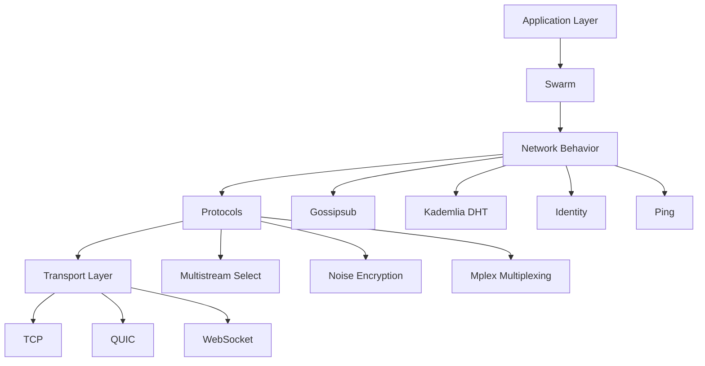

**NetworkActor libp2p Integration:**

```rust
use libp2p::{
    swarm::{Swarm, SwarmEvent},
    Transport, PeerId, Multiaddr,
    noise, mplex, tcp, quic,
    gossipsub::{Gossipsub, GossipsubEvent, MessageAuthenticity, ValidationMode},
    kad::{Kademlia, KademliaEvent},
    identify::{Identify, IdentifyEvent},
    ping::{Ping, PingEvent},
    NetworkBehaviour,
};
use std::collections::hash_map::DefaultHasher;
use std::hash::{Hash, Hasher};

/// Composite network behavior combining multiple libp2p protocols
#[derive(NetworkBehaviour)]
#[behaviour(out_event = "CompositeEvent")]
pub struct NetworkBehaviour {
    /// Gossipsub for efficient message broadcasting
    pub gossipsub: Gossipsub,
    
    /// Kademlia DHT for peer discovery and content routing
    pub kademlia: Kademlia<MemoryStore>,
    
    /// Identity protocol for peer identification
    pub identify: Identify,
    
    /// Ping for connection health monitoring
    pub ping: Ping,
}

/// Events from the composite behavior
#[derive(Debug)]
pub enum CompositeEvent {
    Gossipsub(GossipsubEvent),
    Kademlia(KademliaEvent),
    Identify(IdentifyEvent),
    Ping(PingEvent),
}

impl From<GossipsubEvent> for CompositeEvent {
    fn from(event: GossipsubEvent) -> Self {
        CompositeEvent::Gossipsub(event)
    }
}

impl From<KademliaEvent> for CompositeEvent {
    fn from(event: KademliaEvent) -> Self {
        CompositeEvent::Kademlia(event)
    }
}

impl From<IdentifyEvent> for CompositeEvent {
    fn from(event: IdentifyEvent) -> Self {
        CompositeEvent::Identify(event)
    }
}

impl From<PingEvent> for CompositeEvent {
    fn from(event: PingEvent) -> Self {
        CompositeEvent::Ping(event)
    }
}

/// libp2p swarm configuration for NetworkActor
pub struct NetworkSwarmConfig {
    pub local_peer_id: PeerId,
    pub listen_addresses: Vec<Multiaddr>,
    pub bootstrap_peers: Vec<Multiaddr>,
    pub gossipsub_topics: Vec<String>,
}

impl NetworkSwarmConfig {
    /// Create optimized transport stack
    pub fn build_transport(&self) -> Result<impl Transport<Output = (PeerId, StreamMuxerBox)>, Box<dyn std::error::Error>> {
        let tcp_transport = tcp::TcpConfig::new().nodelay(true);
        let quic_transport = quic::QuicConfig::new(&self.generate_keypair());
        
        let transport = tcp_transport
            .or_transport(quic_transport)
            .upgrade(upgrade::Version::V1)
            .authenticate(noise::NoiseAuthenticated::xx(&self.generate_keypair())?)
            .multiplex(mplex::MplexConfig::new())
            .timeout(std::time::Duration::from_secs(20))
            .boxed();
            
        Ok(transport)
    }
    
    /// Create network behavior with all protocols configured
    pub fn build_behaviour(&self) -> Result<NetworkBehaviour, Box<dyn std::error::Error>> {
        // Configure Gossipsub
        let gossipsub_config = gossipsub::GossipsubConfigBuilder::default()
            .heartbeat_interval(Duration::from_secs(1))
            .validation_mode(ValidationMode::Strict)
            .message_id_fn(|message| {
                let mut hasher = DefaultHasher::new();
                message.data.hash(&mut hasher);
                hasher.finish().to_string()
            })
            .build()?;
            
        let mut gossipsub = Gossipsub::new(
            MessageAuthenticity::Signed(self.generate_keypair()),
            gossipsub_config,
        )?;
        
        // Subscribe to configured topics
        for topic in &self.gossipsub_topics {
            let topic_hash = gossipsub::IdentTopic::new(topic);
            gossipsub.subscribe(&topic_hash)?;
        }
        
        // Configure Kademlia DHT
        let store = MemoryStore::new(self.local_peer_id);
        let mut kademlia = Kademlia::new(self.local_peer_id, store);
        
        // Add bootstrap peers to DHT
        for peer_addr in &self.bootstrap_peers {
            if let Some(peer_id) = peer_addr.iter().find_map(|p| match p {
                Protocol::P2p(hash) => PeerId::from_multihash(hash).ok(),
                _ => None,
            }) {
                kademlia.add_address(&peer_id, peer_addr.clone());
            }
        }
        
        // Configure Identify protocol
        let identify = Identify::new(
            "/alys/network/1.0.0".to_string(),
            "alys-network-actor".to_string(),
            self.generate_keypair().public(),
        );
        
        // Configure Ping
        let ping = Ping::new(ping::PingConfig::new().with_keep_alive(true));
        
        Ok(NetworkBehaviour {
            gossipsub,
            kademlia,
            identify,
            ping,
        })
    }
    
    fn generate_keypair(&self) -> Keypair {
        // In production, load from secure storage
        Keypair::generate_ed25519()
    }
}
```

**Swarm Management in NetworkActor:**

```rust
use libp2p::swarm::{Swarm, SwarmBuilder};
use tokio::select;

/// Swarm manager integrating libp2p with the NetworkActor
pub struct SwarmManager {
    swarm: Swarm<NetworkBehaviour>,
    event_sender: mpsc::UnboundedSender<CompositeEvent>,
}

impl SwarmManager {
    pub fn new(config: NetworkSwarmConfig) -> Result<Self, Box<dyn std::error::Error>> {
        let local_key = config.generate_keypair();
        let local_peer_id = PeerId::from(local_key.public());
        
        let transport = config.build_transport()?;
        let behaviour = config.build_behaviour()?;
        
        let swarm = SwarmBuilder::new(transport, behaviour, local_peer_id)
            .executor(Box::new(|fut| {
                tokio::spawn(fut);
            }))
            .build();
            
        let (event_sender, _) = mpsc::unbounded_channel();
        
        Ok(SwarmManager {
            swarm,
            event_sender,
        })
    }
    
    /// Main event loop for processing swarm events
    pub async fn run(&mut self) -> Result<(), Box<dyn std::error::Error>> {
        // Listen on configured addresses
        for addr in &self.config.listen_addresses {
            self.swarm.listen_on(addr.clone())?;
        }
        
        // Bootstrap the network
        if let Some(bootstrap_peer) = self.config.bootstrap_peers.first() {
            self.swarm.dial(bootstrap_peer.clone())?;
        }
        
        loop {
            select! {
                event = self.swarm.select_next_some() => {
                    self.handle_swarm_event(event).await?;
                }
                // Handle external commands
                cmd = self.command_receiver.recv() => {
                    match cmd {
                        Some(cmd) => self.handle_command(cmd).await?,
                        None => break, // Channel closed
                    }
                }
            }
        }
        
        Ok(())
    }
    
    /// Handle swarm events and forward to NetworkActor
    async fn handle_swarm_event(&mut self, event: SwarmEvent<CompositeEvent>) -> Result<(), Box<dyn std::error::Error>> {
        match event {
            SwarmEvent::Behaviour(CompositeEvent::Gossipsub(gossipsub_event)) => {
                self.handle_gossipsub_event(gossipsub_event).await?;
            }
            SwarmEvent::Behaviour(CompositeEvent::Kademlia(kad_event)) => {
                self.handle_kademlia_event(kad_event).await?;
            }
            SwarmEvent::Behaviour(CompositeEvent::Identify(identify_event)) => {
                self.handle_identify_event(identify_event).await?;
            }
            SwarmEvent::Behaviour(CompositeEvent::Ping(ping_event)) => {
                self.handle_ping_event(ping_event).await?;
            }
            SwarmEvent::ConnectionEstablished { peer_id, endpoint, .. } => {
                info!("Connection established with {}: {:?}", peer_id, endpoint);
                self.event_sender.send(NetworkEvent::PeerConnected(peer_id))?;
            }
            SwarmEvent::ConnectionClosed { peer_id, cause, .. } => {
                info!("Connection closed with {}: {:?}", peer_id, cause);
                self.event_sender.send(NetworkEvent::PeerDisconnected(peer_id))?;
            }
            SwarmEvent::IncomingConnection { local_addr, send_back_addr } => {
                debug!("Incoming connection from {} to {}", send_back_addr, local_addr);
            }
            SwarmEvent::NewListenAddr { address, .. } => {
                info!("Listening on {}", address);
            }
            _ => {} // Handle other events as needed
        }
        
        Ok(())
    }
}
```

#### 4.3 Protocol Implementation Patterns

The NetworkActor implements sophisticated patterns for managing multiple libp2p protocols efficiently:

**Protocol Orchestration Pattern:**

```rust
/// Protocol orchestrator managing multiple libp2p protocols
pub struct ProtocolOrchestrator {
    gossipsub_controller: GossipsubController,
    kademlia_controller: KademliaController,
    identify_controller: IdentifyController,
    ping_controller: PingController,
}

impl ProtocolOrchestrator {
    pub fn new() -> Self {
        Self {
            gossipsub_controller: GossipsubController::new(),
            kademlia_controller: KademliaController::new(),
            identify_controller: IdentifyController::new(),
            ping_controller: PingController::new(),
        }
    }
    
    /// Coordinate protocol actions for optimal network behavior
    pub async fn orchestrate_protocols(&mut self, network_state: &NetworkState) -> Result<(), ProtocolError> {
        // Coordinate DHT operations based on network topology
        if network_state.peer_count < network_state.target_peer_count {
            self.kademlia_controller.intensify_discovery().await?;
        }
        
        // Adjust Gossipsub parameters based on network size
        if network_state.peer_count > 100 {
            self.gossipsub_controller.optimize_for_large_network().await?;
        }
        
        // Manage connection health through ping coordination
        self.ping_controller.health_check_active_peers(network_state).await?;
        
        Ok(())
    }
}

/// Gossipsub controller with advanced message routing
pub struct GossipsubController {
    topic_subscriptions: HashMap<String, SubscriptionMetrics>,
    message_cache: LruCache<String, CachedMessage>,
}

impl GossipsubController {
    /// Intelligent topic subscription management
    pub async fn manage_subscriptions(&mut self, network_metrics: &NetworkMetrics) -> Result<(), GossipsubError> {
        for (topic, metrics) in &self.topic_subscriptions {
            // Unsubscribe from inactive topics
            if metrics.last_message_time.elapsed() > Duration::from_secs(300) 
               && metrics.message_frequency < 0.1 {
                self.unsubscribe_from_topic(topic).await?;
            }
            
            // Optimize routing for high-traffic topics
            if metrics.message_frequency > 10.0 {
                self.optimize_routing_for_topic(topic).await?;
            }
        }
        
        Ok(())
    }
    
    /// Smart message routing based on network topology
    pub async fn route_message(&mut self, topic: &str, message: &[u8], priority: MessagePriority) -> Result<(), GossipsubError> {
        // Implement message deduplication
        let message_id = self.calculate_message_id(message);
        if self.message_cache.contains(&message_id) {
            return Ok(()); // Duplicate message, don't propagate
        }
        
        // Cache message for deduplication
        self.message_cache.put(message_id.clone(), CachedMessage {
            data: message.to_vec(),
            timestamp: Instant::now(),
            topic: topic.to_string(),
        });
        
        // Route based on priority and network conditions
        match priority {
            MessagePriority::Critical => {
                self.broadcast_with_redundancy(topic, message).await?;
            }
            MessagePriority::Normal => {
                self.broadcast_standard(topic, message).await?;
            }
            MessagePriority::Low => {
                self.broadcast_efficient(topic, message).await?;
            }
        }
        
        Ok(())
    }
}
```

**Advanced Pattern: Protocol State Synchronization**

```rust
/// Synchronizes state across multiple protocols for optimal performance
pub struct ProtocolStateSynchronizer {
    shared_peer_state: Arc<RwLock<HashMap<PeerId, PeerProtocolState>>>,
    protocol_coordinators: Vec<Box<dyn ProtocolCoordinator>>,
}

#[derive(Clone)]
pub struct PeerProtocolState {
    pub supported_protocols: HashSet<String>,
    pub connection_quality: ConnectionQuality,
    pub last_activity: Instant,
    pub protocol_specific_data: HashMap<String, ProtocolData>,
}

#[async_trait]
pub trait ProtocolCoordinator: Send + Sync {
    async fn update_peer_state(&self, peer_id: PeerId, state: &mut PeerProtocolState);
    async fn coordinate_with_other_protocols(&self, all_peer_states: &HashMap<PeerId, PeerProtocolState>);
}

impl ProtocolStateSynchronizer {
    /// Synchronize state across all protocols
    pub async fn synchronize_protocols(&self) -> Result<(), SyncError> {
        let peer_states = self.shared_peer_state.read().await;
        
        // Update each protocol with current network state
        for coordinator in &self.protocol_coordinators {
            coordinator.coordinate_with_other_protocols(&*peer_states).await;
        }
        
        drop(peer_states);
        
        // Allow protocols to update peer states
        let mut peer_states = self.shared_peer_state.write().await;
        for (peer_id, state) in peer_states.iter_mut() {
            for coordinator in &self.protocol_coordinators {
                coordinator.update_peer_state(*peer_id, state).await;
            }
        }
        
        Ok(())
    }
}
```

This deep understanding of the Actor model and libp2p architecture provides the foundation for implementing sophisticated networking solutions in the NetworkActor. The patterns and examples demonstrate how these technologies work together to create robust, scalable peer-to-peer networking systems.

### Section 5: NetworkActor Architecture Deep-Dive

This section provides exhaustive exploration of the NetworkActor's internal architecture, design decisions, implementation patterns, and system interactions. Understanding these architectural details is crucial for effective development, optimization, and troubleshooting.

#### 5.1 Internal Component Architecture

The NetworkActor employs a sophisticated layered architecture with clear separation of concerns and optimal integration patterns:

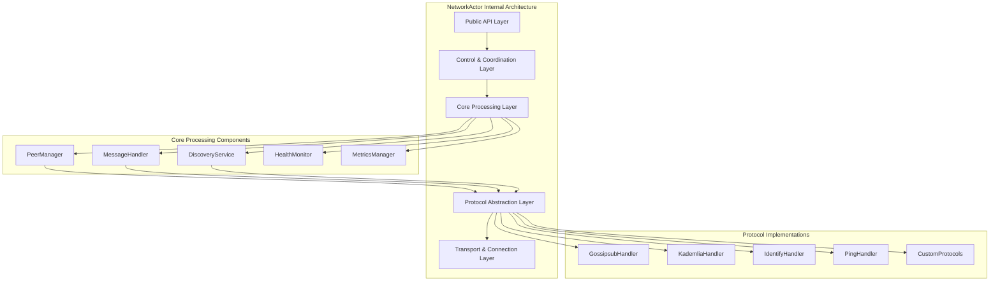

**Component Responsibility Matrix:**

| Component | Primary Responsibility | Key Interfaces | Performance Targets |
|-----------|----------------------|----------------|-------------------|
| PeerManager | Connection lifecycle | `ConnectPeer`, `DisconnectPeer` | <100ms connection time |
| MessageHandler | Message routing/processing | `BroadcastMessage`, `RouteMessage` | 5000+ msg/sec throughput |
| DiscoveryService | Peer discovery & topology | `DiscoverPeers`, `UpdateTopology` | <500ms discovery time |
| HealthMonitor | Network health monitoring | `CheckHealth`, `ReportMetrics` | <10ms health check time |
| MetricsManager | Performance metrics collection | `CollectMetrics`, `ExportMetrics` | Real-time metric updates |

#### 5.2 State Management Architecture

The NetworkActor implements sophisticated state management patterns to ensure consistency and performance:

```rust
use std::sync::Arc;
use tokio::sync::RwLock;
use dashmap::DashMap;
use serde::{Serialize, Deserialize};

/// Centralized state management for NetworkActor
pub struct NetworkState {
    /// Peer connection state - high-performance concurrent access
    peer_connections: Arc<DashMap<PeerId, PeerConnectionState>>,
    
    /// Network topology information
    topology: Arc<RwLock<NetworkTopology>>,
    
    /// Message routing tables
    routing_table: Arc<RwLock<RoutingTable>>,
    
    /// Discovery state
    discovery_state: Arc<RwLock<DiscoveryState>>,
    
    /// Health and metrics state
    health_state: Arc<RwLock<HealthState>>,
    
    /// Configuration state (can be updated at runtime)
    config: Arc<RwLock<NetworkConfig>>,
}

#[derive(Clone, Serialize, Deserialize)]
pub struct PeerConnectionState {
    pub peer_id: PeerId,
    pub connection_status: ConnectionStatus,
    pub supported_protocols: HashSet<String>,
    pub connection_quality: ConnectionQuality,
    pub last_activity: Instant,
    pub message_stats: MessageStatistics,
    pub connection_metadata: ConnectionMetadata,
}

#[derive(Clone, Serialize, Deserialize)]
pub enum ConnectionStatus {
    Connecting {
        started_at: Instant,
        attempt_count: u32,
    },
    Connected {
        established_at: Instant,
        endpoint: ConnectedPoint,
    },
    Disconnecting {
        reason: DisconnectReason,
        started_at: Instant,
    },
    Failed {
        error: String,
        failed_at: Instant,
        retry_after: Option<Instant>,
    },
}

#[derive(Clone, Serialize, Deserialize)]
pub struct ConnectionQuality {
    pub latency_ms: f64,
    pub bandwidth_estimate: u64,
    pub reliability_score: f64,
    pub error_rate: f64,
    pub congestion_level: CongestionLevel,
}

impl NetworkState {
    pub fn new(config: NetworkConfig) -> Self {
        Self {
            peer_connections: Arc::new(DashMap::new()),
            topology: Arc::new(RwLock::new(NetworkTopology::new())),
            routing_table: Arc::new(RwLock::new(RoutingTable::new())),
            discovery_state: Arc::new(RwLock::new(DiscoveryState::new())),
            health_state: Arc::new(RwLock::new(HealthState::new())),
            config: Arc::new(RwLock::new(config)),
        }
    }
    
    /// High-performance peer state updates
    pub fn update_peer_state<F>(&self, peer_id: &PeerId, updater: F) -> Option<PeerConnectionState>
    where
        F: FnOnce(&mut PeerConnectionState),
    {
        self.peer_connections.get_mut(peer_id).map(|mut entry| {
            updater(&mut entry);
            entry.clone()
        })
    }
    
    /// Atomic peer state operations
    pub fn compare_and_swap_peer_status(
        &self,
        peer_id: &PeerId,
        expected: ConnectionStatus,
        new: ConnectionStatus,
    ) -> Result<bool, StateError> {
        match self.peer_connections.get_mut(peer_id) {
            Some(mut entry) => {
                if std::mem::discriminant(&entry.connection_status) == std::mem::discriminant(&expected) {
                    entry.connection_status = new;
                    Ok(true)
                } else {
                    Ok(false)
                }
            }
            None => Err(StateError::PeerNotFound),
        }
    }
    
    /// Efficient bulk state queries
    pub fn get_peers_by_status(&self, status_filter: &ConnectionStatus) -> Vec<PeerConnectionState> {
        self.peer_connections
            .iter()
            .filter_map(|entry| {
                let peer_state = entry.value();
                if std::mem::discriminant(&peer_state.connection_status) == std::mem::discriminant(status_filter) {
                    Some(peer_state.clone())
                } else {
                    None
                }
            })
            .collect()
    }
    
    /// Network topology analysis
    pub async fn analyze_topology(&self) -> TopologyAnalysis {
        let topology = self.topology.read().await;
        let peer_connections = self.peer_connections.len();
        
        TopologyAnalysis {
            total_peers: peer_connections,
            average_connectivity: topology.calculate_average_connectivity(),
            clustering_coefficient: topology.calculate_clustering_coefficient(),
            network_diameter: topology.calculate_network_diameter(),
            partition_risk: topology.assess_partition_risk(),
            optimization_suggestions: topology.generate_optimization_suggestions(),
        }
    }
}
```

#### 5.3 Message Processing Pipeline Architecture

The NetworkActor implements a sophisticated message processing pipeline optimized for high throughput and low latency:

```rust
use tokio::sync::mpsc;
use crossbeam::channel;
use std::sync::atomic::{AtomicUsize, Ordering};

/// High-performance message processing pipeline
pub struct MessageProcessor {
    /// Input channels for different message priorities
    high_priority_rx: mpsc::UnboundedReceiver<NetworkMessage>,
    normal_priority_rx: mpsc::UnboundedReceiver<NetworkMessage>,
    low_priority_rx: mpsc::UnboundedReceiver<NetworkMessage>,
    
    /// Processing workers
    workers: Vec<MessageWorker>,
    
    /// Message routing engine
    router: MessageRouter,
    
    /// Performance metrics
    processing_metrics: Arc<ProcessingMetrics>,
    
    /// Backpressure management
    backpressure_manager: BackpressureManager,
}

#[derive(Clone)]
pub struct NetworkMessage {
    pub id: MessageId,
    pub source: MessageSource,
    pub destination: MessageDestination,
    pub payload: MessagePayload,
    pub priority: MessagePriority,
    pub timestamp: Instant,
    pub ttl: Duration,
    pub retry_count: u32,
}

#[derive(Clone)]
pub enum MessagePayload {
    BlockAnnouncement(BlockAnnouncementData),
    TransactionBroadcast(TransactionData),
    PeerDiscovery(DiscoveryData),
    ConsensusMessage(ConsensusData),
    HealthCheck(HealthCheckData),
    Custom(CustomMessageData),
}

impl MessageProcessor {
    pub fn new(config: MessageProcessorConfig) -> Self {
        let (high_priority_tx, high_priority_rx) = mpsc::unbounded_channel();
        let (normal_priority_tx, normal_priority_rx) = mpsc::unbounded_channel();
        let (low_priority_tx, low_priority_rx) = mpsc::unbounded_channel();
        
        let workers = (0..config.worker_count)
            .map(|id| MessageWorker::new(id, config.clone()))
            .collect();
        
        Self {
            high_priority_rx,
            normal_priority_rx,
            low_priority_rx,
            workers,
            router: MessageRouter::new(config.routing_config),
            processing_metrics: Arc::new(ProcessingMetrics::new()),
            backpressure_manager: BackpressureManager::new(config.backpressure_config),
        }
    }
    
    /// Main message processing loop with priority handling
    pub async fn run(&mut self) -> Result<(), ProcessingError> {
        let mut interval = tokio::time::interval(Duration::from_millis(1));
        
        loop {
            tokio::select! {
                // Process high priority messages first
                Some(message) = self.high_priority_rx.recv() => {
                    self.process_message(message, MessagePriority::High).await?;
                }
                
                // Process normal priority messages
                Some(message) = self.normal_priority_rx.recv() => {
                    if !self.backpressure_manager.should_throttle(MessagePriority::Normal) {
                        self.process_message(message, MessagePriority::Normal).await?;
                    } else {
                        // Requeue message or drop based on policy
                        self.handle_backpressure(message).await?;
                    }
                }
                
                // Process low priority messages only when no backpressure
                Some(message) = self.low_priority_rx.recv() => {
                    if !self.backpressure_manager.should_throttle(MessagePriority::Low) {
                        self.process_message(message, MessagePriority::Low).await?;
                    }
                }
                
                // Periodic maintenance
                _ = interval.tick() => {
                    self.perform_maintenance().await?;
                }
            }
        }
    }
    
    /// Process individual message with routing and validation
    async fn process_message(&mut self, message: NetworkMessage, priority: MessagePriority) -> Result<(), ProcessingError> {
        let start_time = Instant::now();
        
        // Message validation
        if !self.validate_message(&message) {
            self.processing_metrics.record_validation_failure();
            return Err(ProcessingError::ValidationFailed);
        }
        
        // TTL check
        if message.timestamp.elapsed() > message.ttl {
            self.processing_metrics.record_expired_message();
            return Ok(()); // Message expired, drop it
        }
        
        // Route message to appropriate handler
        let routing_decision = self.router.route_message(&message).await?;
        
        match routing_decision {
            RoutingDecision::LocalProcess => {
                self.process_local_message(message).await?;
            }
            RoutingDecision::Forward(peers) => {
                self.forward_message(message, peers).await?;
            }
            RoutingDecision::Broadcast(topic) => {
                self.broadcast_message(message, topic).await?;
            }
            RoutingDecision::Drop(reason) => {
                debug!("Dropping message: {:?}", reason);
                self.processing_metrics.record_dropped_message(reason);
            }
        }
        
        // Record processing metrics
        let processing_time = start_time.elapsed();
        self.processing_metrics.record_processing_time(priority, processing_time);
        
        Ok(())
    }
    
    /// Advanced message routing with topology awareness
    async fn route_message(&self, message: &NetworkMessage) -> Result<RoutingDecision, RoutingError> {
        match &message.destination {
            MessageDestination::Specific(peer_id) => {
                // Direct peer routing
                if self.is_peer_connected(peer_id) {
                    Ok(RoutingDecision::Forward(vec![*peer_id]))
                } else {
                    // Find route through DHT or relay
                    self.find_route_to_peer(peer_id).await
                }
            }
            MessageDestination::Topic(topic) => {
                // Gossipsub topic routing
                let subscribers = self.get_topic_subscribers(topic).await?;
                if subscribers.is_empty() {
                    Ok(RoutingDecision::Drop(DropReason::NoSubscribers))
                } else {
                    Ok(RoutingDecision::Broadcast(topic.clone()))
                }
            }
            MessageDestination::Nearest(count) => {
                // Route to nearest N peers based on network topology
                let nearest_peers = self.find_nearest_peers(*count).await?;
                Ok(RoutingDecision::Forward(nearest_peers))
            }
            MessageDestination::All => {
                // Broadcast to all connected peers
                Ok(RoutingDecision::Broadcast("global".to_string()))
            }
        }
    }
}

/// Worker for parallel message processing
pub struct MessageWorker {
    id: usize,
    message_rx: crossbeam::channel::Receiver<NetworkMessage>,
    result_tx: crossbeam::channel::Sender<ProcessingResult>,
    processor_config: MessageProcessorConfig,
}

impl MessageWorker {
    /// Worker main loop for processing messages
    pub async fn run(&self) -> Result<(), WorkerError> {
        loop {
            match self.message_rx.recv() {
                Ok(message) => {
                    let result = self.process_message(message).await;
                    if let Err(e) = self.result_tx.send(result) {
                        error!("Worker {} failed to send result: {}", self.id, e);
                        return Err(WorkerError::ResultChannelClosed);
                    }
                }
                Err(_) => {
                    info!("Worker {} shutting down", self.id);
                    break;
                }
            }
        }
        Ok(())
    }
    
    async fn process_message(&self, message: NetworkMessage) -> ProcessingResult {
        match message.payload {
            MessagePayload::BlockAnnouncement(data) => {
                self.process_block_announcement(data).await
            }
            MessagePayload::TransactionBroadcast(data) => {
                self.process_transaction_broadcast(data).await
            }
            MessagePayload::PeerDiscovery(data) => {
                self.process_peer_discovery(data).await
            }
            MessagePayload::ConsensusMessage(data) => {
                self.process_consensus_message(data).await
            }
            MessagePayload::HealthCheck(data) => {
                self.process_health_check(data).await
            }
            MessagePayload::Custom(data) => {
                self.process_custom_message(data).await
            }
        }
    }
}
```

#### 5.4 Connection Management Architecture

The NetworkActor implements sophisticated connection management with automatic optimization and fault tolerance:

```rust
/// Advanced connection manager with intelligent optimization
pub struct ConnectionManager {
    /// Active connections indexed by peer ID
    active_connections: Arc<DashMap<PeerId, ConnectionHandle>>,
    
    /// Connection pools for different purposes
    consensus_pool: ConnectionPool,
    broadcast_pool: ConnectionPool,
    discovery_pool: ConnectionPool,
    
    /// Connection quality analyzer
    quality_analyzer: ConnectionQualityAnalyzer,
    
    /// Automatic optimization engine
    optimization_engine: ConnectionOptimizationEngine,
    
    /// Health monitoring
    health_monitor: ConnectionHealthMonitor,
}

#[derive(Clone)]
pub struct ConnectionHandle {
    pub peer_id: PeerId,
    pub connection: Connection,
    pub metadata: ConnectionMetadata,
    pub quality_metrics: Arc<RwLock<QualityMetrics>>,
    pub last_activity: Arc<AtomicInstant>,
}

#[derive(Clone)]
pub struct ConnectionMetadata {
    pub established_at: Instant,
    pub endpoint: ConnectedPoint,
    pub negotiated_protocols: Vec<String>,
    pub connection_type: ConnectionType,
    pub purpose: ConnectionPurpose,
}

#[derive(Clone)]
pub enum ConnectionPurpose {
    Consensus,      // High-priority consensus messages
    Broadcast,      // Block and transaction broadcasting
    Discovery,      // Peer discovery and DHT operations
    Maintenance,    // Health checks and maintenance
    General,        // General purpose connections
}

impl ConnectionManager {
    /// Intelligent connection establishment with purpose optimization
    pub async fn establish_connection(
        &self,
        peer_id: PeerId,
        addresses: Vec<Multiaddr>,
        purpose: ConnectionPurpose,
    ) -> Result<ConnectionHandle, ConnectionError> {
        // Check if connection already exists
        if let Some(existing) = self.active_connections.get(&peer_id) {
            if self.can_reuse_connection(&existing, &purpose) {
                return Ok(existing.clone());
            }
        }
        
        // Select optimal address based on purpose and network conditions
        let optimal_address = self.select_optimal_address(&addresses, &purpose).await?;
        
        // Establish connection with purpose-specific parameters
        let connection = self.dial_with_purpose(optimal_address, &purpose).await?;
        
        // Create connection handle
        let handle = ConnectionHandle {
            peer_id,
            connection,
            metadata: ConnectionMetadata {
                established_at: Instant::now(),
                endpoint: ConnectedPoint::Dialer {
                    address: optimal_address,
                },
                negotiated_protocols: vec![], // Will be populated during handshake
                connection_type: ConnectionType::Outbound,
                purpose: purpose.clone(),
            },
            quality_metrics: Arc::new(RwLock::new(QualityMetrics::new())),
            last_activity: Arc::new(AtomicInstant::new(Instant::now())),
        };
        
        // Register connection
        self.active_connections.insert(peer_id, handle.clone());
        
        // Add to appropriate connection pool
        match purpose {
            ConnectionPurpose::Consensus => {
                self.consensus_pool.add_connection(handle.clone()).await?;
            }
            ConnectionPurpose::Broadcast => {
                self.broadcast_pool.add_connection(handle.clone()).await?;
            }
            ConnectionPurpose::Discovery => {
                self.discovery_pool.add_connection(handle.clone()).await?;
            }
            _ => {}
        }
        
        // Start quality monitoring for this connection
        self.health_monitor.start_monitoring(handle.clone()).await;
        
        Ok(handle)
    }
    
    /// Intelligent connection optimization based on usage patterns
    pub async fn optimize_connections(&self) -> Result<OptimizationResult, OptimizationError> {
        let mut optimization_actions = Vec::new();
        
        // Analyze connection usage patterns
        let usage_analysis = self.analyze_connection_usage().await?;
        
        // Identify underutilized connections
        let underutilized = usage_analysis.find_underutilized_connections();
        for connection in underutilized {
            if self.should_close_connection(&connection) {
                optimization_actions.push(OptimizationAction::CloseConnection(connection.peer_id));
            }
        }
        
        // Identify needed connections for better topology
        let topology_analysis = self.analyze_network_topology().await?;
        for suggested_peer in topology_analysis.suggested_connections {
            optimization_actions.push(OptimizationAction::EstablishConnection {
                peer_id: suggested_peer,
                purpose: ConnectionPurpose::General,
                priority: ConnectionPriority::Low,
            });
        }
        
        // Identify connections that need quality improvement
        let quality_issues = self.quality_analyzer.identify_quality_issues().await?;
        for issue in quality_issues {
            match issue.issue_type {
                QualityIssueType::HighLatency => {
                    optimization_actions.push(OptimizationAction::OptimizeRoute {
                        peer_id: issue.peer_id,
                        optimization_type: RouteOptimization::ReduceLatency,
                    });
                }
                QualityIssueType::LowBandwidth => {
                    optimization_actions.push(OptimizationAction::UpgradeConnection {
                        peer_id: issue.peer_id,
                        target_protocol: "quic".to_string(),
                    });
                }
                QualityIssueType::Unreliable => {
                    optimization_actions.push(OptimizationAction::ReplaceConnection {
                        peer_id: issue.peer_id,
                        reason: "reliability_issues".to_string(),
                    });
                }
            }
        }
        
        // Execute optimization actions
        let execution_results = self.execute_optimization_actions(optimization_actions).await?;
        
        Ok(OptimizationResult {
            actions_executed: execution_results.len(),
            improvements: self.measure_improvements().await?,
            next_optimization_time: Instant::now() + Duration::from_secs(300), // 5 minutes
        })
    }
    
    /// Connection pool management with load balancing
    async fn balance_connection_pools(&self) -> Result<(), BalancingError> {
        // Balance consensus pool for optimal consensus performance
        self.consensus_pool.rebalance_for_latency().await?;
        
        // Balance broadcast pool for maximum throughput
        self.broadcast_pool.rebalance_for_throughput().await?;
        
        // Balance discovery pool for network coverage
        self.discovery_pool.rebalance_for_coverage().await?;
        
        Ok(())
    }
}

/// Connection pool with specialized optimization strategies
pub struct ConnectionPool {
    connections: Arc<RwLock<Vec<ConnectionHandle>>>,
    pool_type: ConnectionPurpose,
    optimization_strategy: PoolOptimizationStrategy,
    load_balancer: LoadBalancer,
}

impl ConnectionPool {
    /// Select optimal connection from pool based on current conditions
    pub async fn select_connection(&self, criteria: &SelectionCriteria) -> Option<ConnectionHandle> {
        let connections = self.connections.read().await;
        
        match &self.optimization_strategy {
            PoolOptimizationStrategy::LatencyOptimized => {
                connections
                    .iter()
                    .filter(|conn| self.meets_criteria(conn, criteria))
                    .min_by(|a, b| {
                        let a_latency = a.quality_metrics.read().unwrap().latency_ms;
                        let b_latency = b.quality_metrics.read().unwrap().latency_ms;
                        a_latency.partial_cmp(&b_latency).unwrap()
                    })
                    .cloned()
            }
            PoolOptimizationStrategy::ThroughputOptimized => {
                connections
                    .iter()
                    .filter(|conn| self.meets_criteria(conn, criteria))
                    .max_by(|a, b| {
                        let a_bandwidth = a.quality_metrics.read().unwrap().bandwidth_estimate;
                        let b_bandwidth = b.quality_metrics.read().unwrap().bandwidth_estimate;
                        a_bandwidth.cmp(&b_bandwidth)
                    })
                    .cloned()
            }
            PoolOptimizationStrategy::LoadBalanced => {
                self.load_balancer.select_connection(&connections, criteria).await
            }
        }
    }
    
    /// Dynamic pool rebalancing based on performance metrics
    pub async fn rebalance_for_latency(&self) -> Result<(), RebalanceError> {
        let mut connections = self.connections.write().await;
        
        // Sort connections by latency
        connections.sort_by(|a, b| {
            let a_latency = a.quality_metrics.read().unwrap().latency_ms;
            let b_latency = b.quality_metrics.read().unwrap().latency_ms;
            a_latency.partial_cmp(&b_latency).unwrap()
        });
        
        // Remove high-latency connections if we have better alternatives
        let target_size = self.calculate_optimal_pool_size().await;
        if connections.len() > target_size {
            let excess_connections = connections.split_off(target_size);
            for conn in excess_connections {
                self.gracefully_close_connection(conn).await?;
            }
        }
        
        Ok(())
    }
}
```

This comprehensive architecture deep-dive demonstrates the sophisticated design patterns and implementation strategies that make the NetworkActor robust, scalable, and performant. The layered architecture, intelligent state management, advanced message processing pipeline, and sophisticated connection management work together to provide enterprise-grade networking capabilities for the Alys V2 blockchain.

---

## 6. Message Protocol & Communication Mastery

Understanding the complete message protocol specification and communication patterns is essential for NetworkActor mastery. This section provides exhaustive coverage of message flows, protocol integration, error handling patterns, and advanced communication strategies.

### 6.1 Core Message Protocol Architecture

The NetworkActor implements a sophisticated multi-layered message protocol system designed for high-throughput, low-latency peer-to-peer communication:

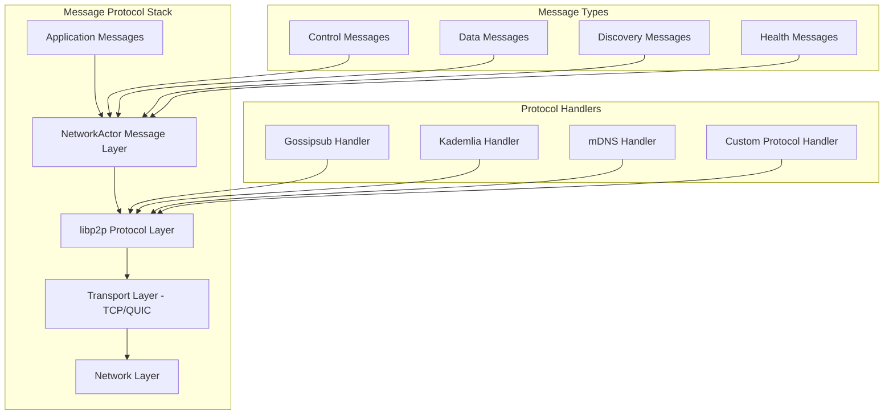

#### Message Protocol Implementation

```rust
use libp2p::{
    gossipsub::{Gossipsub, GossipsubMessage, IdentTopic},
    kad::{Kademlia, KademliaEvent},
    mdns::{Mdns, MdnsEvent},
    swarm::{NetworkBehaviour, SwarmEvent},
    PeerId, Multiaddr,
};
use tokio::sync::{mpsc, oneshot};
use std::collections::HashMap;
use serde::{Serialize, Deserialize};

/// Comprehensive message protocol for NetworkActor communication
#[derive(NetworkBehaviour)]
pub struct NetworkProtocol {
    gossipsub: Gossipsub,
    kademlia: Kademlia<MemoryStore>,
    mdns: Mdns,
    custom_protocol: CustomProtocol,
}

/// Core message types for NetworkActor communication
#[derive(Debug, Clone, Serialize, Deserialize)]
pub enum NetworkMessage {
    /// Peer lifecycle messages
    PeerConnected {
        peer_id: PeerId,
        addresses: Vec<Multiaddr>,
        connection_info: ConnectionInfo,
        timestamp: u64,
    },
    PeerDisconnected {
        peer_id: PeerId,
        reason: DisconnectionReason,
        timestamp: u64,
    },
    
    /// Data propagation messages
    BroadcastMessage {
        topic: String,
        data: Vec<u8>,
        priority: MessagePriority,
        ttl: u32,
        source_peer: Option<PeerId>,
    },
    DirectMessage {
        target_peer: PeerId,
        data: Vec<u8>,
        delivery_guarantee: DeliveryGuarantee,
        timeout_ms: u64,
    },
    
    /// Network topology messages
    UpdatePeerStatus {
        peer_id: PeerId,
        status: PeerStatus,
        quality_metrics: PeerQualityMetrics,
        timestamp: u64,
    },
    NetworkTopologyUpdate {
        topology_snapshot: NetworkTopology,
        version: u64,
        changes: Vec<TopologyChange>,
    },
    
    /// Discovery and routing messages
    PeerDiscoveryRequest {
        query_id: QueryId,
        target_capabilities: Vec<Capability>,
        max_results: usize,
        timeout_ms: u64,
    },
    PeerDiscoveryResponse {
        query_id: QueryId,
        discovered_peers: Vec<PeerInfo>,
        continuation_token: Option<String>,
    },
    
    /// Health and diagnostics messages
    HealthCheck {
        check_id: String,
        timestamp: u64,
        expected_response: bool,
    },
    HealthResponse {
        check_id: String,
        status: HealthStatus,
        metrics: HealthMetrics,
        timestamp: u64,
    },
    
    /// Control and configuration messages
    ConfigUpdate {
        config_section: String,
        updates: HashMap<String, ConfigValue>,
        apply_immediately: bool,
    },
    RestartNetwork {
        restart_type: RestartType,
        delay_ms: u64,
        preserve_connections: bool,
    },
    
    /// Error and failure messages
    NetworkError {
        error_type: NetworkErrorType,
        peer_id: Option<PeerId>,
        error_details: String,
        recovery_suggestion: Option<RecoveryAction>,
    },
}

/// Message priority system for network optimization
#[derive(Debug, Clone, Copy, PartialEq, Eq, PartialOrd, Ord)]
pub enum MessagePriority {
    Critical = 4,    // Consensus messages, emergency shutdowns
    High = 3,        // Block announcements, transaction propagation
    Medium = 2,      // Peer discovery, topology updates
    Low = 1,         // Health checks, metrics collection
    Background = 0,  // Cleanup, maintenance tasks
}

/// Delivery guarantee levels for message reliability
#[derive(Debug, Clone)]
pub enum DeliveryGuarantee {
    BestEffort,                              // Fire-and-forget
    AtLeastOnce { max_retries: u32 },       // Retry until success or max attempts
    ExactlyOnce { deduplication_window: u64 }, // Guaranteed single delivery
    Ordered { sequence_number: u64 },        // Maintain message ordering
}
```

### 6.2 Protocol Integration Patterns

#### 6.2.1 Gossipsub Integration for Pub/Sub Communication

```rust
/// Advanced Gossipsub integration with topic management and mesh optimization
pub struct GossipsubManager {
    gossipsub: Gossipsub,
    topic_subscriptions: HashMap<IdentTopic, TopicConfig>,
    mesh_optimization: MeshOptimizer,
    message_cache: LruCache<MessageId, CachedMessage>,
    flood_protection: FloodProtection,
}

impl GossipsubManager {
    /// Subscribe to topic with advanced configuration
    pub async fn subscribe_with_config(
        &mut self,
        topic: &str,
        config: TopicConfig,
    ) -> Result<(), GossipsubError> {
        let ident_topic = IdentTopic::new(topic);
        
        // Configure topic-specific parameters
        self.gossipsub
            .with_peer_score_params(config.peer_score_params.clone())
            .with_message_id_fn(config.message_id_fn.clone());
        
        // Subscribe to topic
        self.gossipsub.subscribe(&ident_topic)?;
        
        // Store subscription configuration
        self.topic_subscriptions.insert(ident_topic.clone(), config);
        
        // Optimize mesh for new topic
        self.mesh_optimization
            .optimize_for_topic(&ident_topic, &config)
            .await?;
        
        info!(
            topic = %topic,
            "Successfully subscribed to Gossipsub topic with advanced configuration"
        );
        
        Ok(())
    }
    
    /// Publish message with reliability guarantees
    pub async fn publish_reliable(
        &mut self,
        topic: &str,
        data: Vec<u8>,
        reliability: MessageReliability,
    ) -> Result<MessageId, PublishError> {
        let ident_topic = IdentTopic::new(topic);
        let message_id = self.generate_message_id(&data);
        
        // Apply flood protection
        if !self.flood_protection.allow_message(&message_id, &data).await {
            return Err(PublishError::FloodProtection);
        }
        
        // Publish message
        match reliability {
            MessageReliability::BestEffort => {
                self.gossipsub.publish(ident_topic, data)?;
            }
            MessageReliability::Acknowledged { timeout, max_retries } => {
                self.publish_with_acknowledgment(
                    ident_topic,
                    data,
                    timeout,
                    max_retries,
                ).await?;
            }
            MessageReliability::Broadcast { min_peers } => {
                self.broadcast_to_min_peers(ident_topic, data, min_peers).await?;
            }
        }
        
        // Cache message for deduplication
        self.message_cache.put(
            message_id.clone(),
            CachedMessage {
                data: data.clone(),
                timestamp: Instant::now(),
                topic: topic.to_string(),
            },
        );
        
        Ok(message_id)
    }
    
    /// Handle incoming Gossipsub events with comprehensive processing
    pub async fn handle_gossipsub_event(
        &mut self,
        event: GossipsubEvent,
    ) -> Result<Vec<NetworkEvent>, EventHandlerError> {
        let mut network_events = Vec::new();
        
        match event {
            GossipsubEvent::Message {
                propagation_source,
                message_id,
                message,
            } => {
                // Validate message integrity
                if !self.validate_message_integrity(&message).await {
                    warn!(
                        message_id = ?message_id,
                        source = ?propagation_source,
                        "Received invalid message, dropping"
                    );
                    return Ok(network_events);
                }
                
                // Check for duplicates
                if self.message_cache.contains(&message_id) {
                    debug!(
                        message_id = ?message_id,
                        "Duplicate message received, ignoring"
                    );
                    return Ok(network_events);
                }
                
                // Process message content
                let processed_message = self.process_message_content(&message).await?;
                
                // Update peer scoring
                if let Some(source) = propagation_source {
                    self.update_peer_score_for_message(&source, &message).await;
                }
                
                network_events.push(NetworkEvent::MessageReceived {
                    message: processed_message,
                    source: propagation_source,
                    topic: message.topic.to_string(),
                });
            }
            
            GossipsubEvent::Subscribed { peer_id, topic } => {
                info!(
                    peer = ?peer_id,
                    topic = %topic,
                    "Peer subscribed to topic"
                );
                
                // Update mesh optimization
                self.mesh_optimization
                    .handle_peer_subscription(&peer_id, &topic)
                    .await;
                
                network_events.push(NetworkEvent::PeerSubscribed {
                    peer_id,
                    topic: topic.to_string(),
                });
            }
            
            GossipsubEvent::Unsubscribed { peer_id, topic } => {
                info!(
                    peer = ?peer_id,
                    topic = %topic,
                    "Peer unsubscribed from topic"
                );
                
                self.mesh_optimization
                    .handle_peer_unsubscription(&peer_id, &topic)
                    .await;
                
                network_events.push(NetworkEvent::PeerUnsubscribed {
                    peer_id,
                    topic: topic.to_string(),
                });
            }
        }
        
        Ok(network_events)
    }
}

/// Topic configuration for advanced Gossipsub management
#[derive(Debug, Clone)]
pub struct TopicConfig {
    pub peer_score_params: PeerScoreParams,
    pub message_id_fn: Arc<dyn Fn(&GossipsubMessage) -> MessageId + Send + Sync>,
    pub validation_mode: ValidationMode,
    pub heartbeat_interval: Duration,
    pub mesh_n: usize,
    pub mesh_n_low: usize,
    pub mesh_n_high: usize,
    pub history_length: usize,
    pub history_gossip: usize,
}
```

#### 6.2.2 Kademlia DHT Integration for Peer Discovery

```rust
/// Advanced Kademlia DHT integration with intelligent peer discovery
pub struct KademliaManager {
    kademlia: Kademlia<MemoryStore>,
    discovery_strategies: HashMap<DiscoveryStrategy, StrategyConfig>,
    peer_routing_table: Arc<RwLock<PeerRoutingTable>>,
    discovery_scheduler: DiscoveryScheduler,
    query_cache: LruCache<QueryId, QueryResult>,
}

impl KademliaManager {
    /// Intelligent peer discovery with multiple strategies
    pub async fn discover_peers_intelligent(
        &mut self,
        target_capabilities: Vec<Capability>,
        discovery_params: DiscoveryParameters,
    ) -> Result<DiscoveryResult, DiscoveryError> {
        let query_id = self.generate_query_id();
        
        // Select optimal discovery strategy
        let strategy = self.select_discovery_strategy(
            &target_capabilities,
            &discovery_params,
        ).await;
        
        let discovery_result = match strategy {
            DiscoveryStrategy::BreadthFirst => {
                self.breadth_first_discovery(&target_capabilities, discovery_params)
                    .await?
            }
            DiscoveryStrategy::DepthFirst => {
                self.depth_first_discovery(&target_capabilities, discovery_params)
                    .await?
            }
            DiscoveryStrategy::Hybrid => {
                self.hybrid_discovery(&target_capabilities, discovery_params)
                    .await?
            }
            DiscoveryStrategy::Capability_Targeted => {
                self.capability_targeted_discovery(&target_capabilities, discovery_params)
                    .await?
            }
        };
        
        // Update routing table with discovered peers
        self.update_routing_table(&discovery_result).await;
        
        // Cache result for future queries
        self.query_cache.put(query_id.clone(), discovery_result.clone());
        
        // Schedule follow-up discoveries if needed
        self.discovery_scheduler
            .schedule_follow_up_discovery(&discovery_result, &target_capabilities)
            .await;
        
        info!(
            query_id = ?query_id,
            strategy = ?strategy,
            discovered_peers = discovery_result.peers.len(),
            "Completed intelligent peer discovery"
        );
        
        Ok(discovery_result)
    }
    
    /// Advanced routing table management with quality scoring
    pub async fn update_routing_table_with_quality(
        &mut self,
        peer_updates: Vec<PeerUpdate>,
    ) -> Result<(), RoutingTableError> {
        let mut routing_table = self.peer_routing_table.write().await;
        
        for update in peer_updates {
            match update.update_type {
                PeerUpdateType::Add => {
                    // Calculate peer quality score
                    let quality_score = self.calculate_peer_quality_score(&update.peer_info).await;
                    
                    // Add to Kademlia DHT
                    self.kademlia.add_address(&update.peer_info.peer_id, update.peer_info.address.clone());
                    
                    // Update routing table with quality metrics
                    routing_table.add_peer_with_quality(
                        update.peer_info.clone(),
                        quality_score,
                    );
                    
                    info!(
                        peer_id = ?update.peer_info.peer_id,
                        quality_score = quality_score,
                        "Added peer to routing table with quality score"
                    );
                }
                
                PeerUpdateType::Update => {
                    // Recalculate quality score
                    let quality_score = self.calculate_peer_quality_score(&update.peer_info).await;
                    
                    // Update routing table
                    routing_table.update_peer_quality(
                        &update.peer_info.peer_id,
                        quality_score,
                    );
                }
                
                PeerUpdateType::Remove => {
                    // Remove from Kademlia
                    self.kademlia.remove_peer(&update.peer_info.peer_id);
                    
                    // Remove from routing table
                    routing_table.remove_peer(&update.peer_info.peer_id);
                    
                    info!(
                        peer_id = ?update.peer_info.peer_id,
                        "Removed peer from routing table"
                    );
                }
            }
        }
        
        // Optimize routing table periodically
        self.optimize_routing_table(&mut routing_table).await;
        
        Ok(())
    }
    
    /// Handle Kademlia events with comprehensive processing
    pub async fn handle_kademlia_event(
        &mut self,
        event: KademliaEvent,
    ) -> Result<Vec<NetworkEvent>, EventHandlerError> {
        let mut network_events = Vec::new();
        
        match event {
            KademliaEvent::OutboundQueryCompleted { id, result } => {
                match result {
                    QueryResult::GetClosestPeers(Ok(GetClosestPeersOk { key, peers })) => {
                        let discovered_peers: Vec<PeerInfo> = peers
                            .into_iter()
                            .map(|peer| PeerInfo {
                                peer_id: peer,
                                address: self.get_peer_address(&peer).unwrap_or_default(),
                                capabilities: self.get_peer_capabilities(&peer).await,
                                quality_metrics: Default::default(),
                            })
                            .collect();
                        
                        network_events.push(NetworkEvent::PeerDiscoveryCompleted {
                            query_id: id,
                            discovered_peers,
                            target_key: key,
                        });
                    }
                    
                    QueryResult::Bootstrap(Ok(BootstrapOk { num_remaining })) => {
                        info!(
                            query_id = ?id,
                            remaining = num_remaining,
                            "Bootstrap query completed successfully"
                        );
                        
                        network_events.push(NetworkEvent::BootstrapCompleted {
                            query_id: id,
                            remaining_queries: num_remaining,
                        });
                    }
                    
                    QueryResult::GetRecord(Ok(GetRecordOk { records })) => {
                        for record in records {
                            network_events.push(NetworkEvent::RecordReceived {
                                key: record.record.key,
                                value: record.record.value,
                                publisher: record.record.publisher,
                            });
                        }
                    }
                    
                    _ => {
                        // Handle other query results and errors
                        warn!(
                            query_id = ?id,
                            result = ?result,
                            "Unhandled Kademlia query result"
                        );
                    }
                }
            }
            
            KademliaEvent::RoutingUpdated { peer, addresses, old_peer } => {
                if let Some(old_peer_id) = old_peer {
                    network_events.push(NetworkEvent::RoutingTableUpdated {
                        removed_peer: Some(old_peer_id),
                        added_peer: Some((peer, addresses.clone())),
                    });
                } else {
                    network_events.push(NetworkEvent::RoutingTableUpdated {
                        removed_peer: None,
                        added_peer: Some((peer, addresses.clone())),
                    });
                }
                
                // Update local routing table
                self.sync_routing_table_with_kademlia().await;
            }
            
            KademliaEvent::UnroutablePeer { peer } => {
                warn!(
                    peer_id = ?peer,
                    "Peer became unroutable, removing from routing table"
                );
                
                let mut routing_table = self.peer_routing_table.write().await;
                routing_table.mark_peer_unroutable(&peer);
                
                network_events.push(NetworkEvent::PeerUnroutable { peer_id: peer });
            }
        }
        
        Ok(network_events)
    }
}
```

### 6.3 Error Handling and Recovery Patterns

#### 6.3.1 Comprehensive Error Handling Framework

```rust
/// Comprehensive error handling system for NetworkActor communication
#[derive(Debug, Clone)]
pub struct ErrorHandlingFramework {
    error_classifiers: HashMap<ErrorClass, ErrorClassifier>,
    recovery_strategies: HashMap<ErrorClass, RecoveryStrategy>,
    error_metrics: Arc<Mutex<ErrorMetrics>>,
    circuit_breakers: HashMap<String, CircuitBreaker>,
    error_history: LruCache<ErrorSignature, ErrorRecord>,
}

impl ErrorHandlingFramework {
    /// Classify and handle network errors with intelligent recovery
    pub async fn handle_network_error(
        &mut self,
        error: NetworkError,
        context: ErrorContext,
    ) -> Result<RecoveryAction, ErrorHandlingError> {
        // Classify error type
        let error_class = self.classify_error(&error, &context).await;
        
        // Update error metrics
        self.update_error_metrics(&error, &error_class).await;
        
        // Check circuit breaker status
        let circuit_breaker_key = format!("{}:{}", error_class, context.operation);
        if let Some(circuit_breaker) = self.circuit_breakers.get_mut(&circuit_breaker_key) {
            if circuit_breaker.is_open() {
                warn!(
                    error_class = ?error_class,
                    operation = %context.operation,
                    "Circuit breaker is open, skipping operation"
                );
                return Ok(RecoveryAction::Skip);
            }
        }
        
        // Determine recovery strategy
        let recovery_strategy = self.recovery_strategies
            .get(&error_class)
            .cloned()
            .unwrap_or_default();
        
        // Execute recovery action
        let recovery_action = match recovery_strategy {
            RecoveryStrategy::Immediate(action) => {
                self.execute_immediate_recovery(action, &error, &context).await?
            }
            RecoveryStrategy::Exponential(config) => {
                self.execute_exponential_backoff_recovery(config, &error, &context).await?
            }
            RecoveryStrategy::CircuitBreaker(config) => {
                self.execute_circuit_breaker_recovery(config, &error, &context).await?
            }
            RecoveryStrategy::Escalation(escalation_chain) => {
                self.execute_escalation_recovery(escalation_chain, &error, &context).await?
            }
        };
        
        // Record error for pattern analysis
        let error_signature = self.generate_error_signature(&error, &context);
        self.error_history.put(error_signature, ErrorRecord {
            error: error.clone(),
            context: context.clone(),
            recovery_action: recovery_action.clone(),
            timestamp: Instant::now(),
        });
        
        info!(
            error_class = ?error_class,
            recovery_action = ?recovery_action,
            "Successfully handled network error with recovery action"
        );
        
        Ok(recovery_action)
    }
    
    /// Intelligent error classification using multiple criteria
    async fn classify_error(
        &self,
        error: &NetworkError,
        context: &ErrorContext,
    ) -> ErrorClass {
        // Primary classification based on error type
        let primary_class = match &error.error_type {
            NetworkErrorType::ConnectionFailed => ErrorClass::Connectivity,
            NetworkErrorType::TimeoutError => ErrorClass::Timeout,
            NetworkErrorType::ProtocolError => ErrorClass::Protocol,
            NetworkErrorType::AuthenticationFailed => ErrorClass::Authentication,
            NetworkErrorType::RateLimited => ErrorClass::RateLimit,
            NetworkErrorType::ResourceExhausted => ErrorClass::Resource,
            NetworkErrorType::InvalidMessage => ErrorClass::Validation,
            NetworkErrorType::PeerUnreachable => ErrorClass::Peer,
        };
        
        // Secondary classification based on context
        if let Some(classifier) = self.error_classifiers.get(&primary_class) {
            classifier.refine_classification(error, context).await
        } else {
            primary_class
        }
    }
    
    /// Execute exponential backoff recovery with jitter
    async fn execute_exponential_backoff_recovery(
        &mut self,
        config: ExponentialBackoffConfig,
        error: &NetworkError,
        context: &ErrorContext,
    ) -> Result<RecoveryAction, RecoveryError> {
        let attempt_key = format!("{}:{}", context.operation, context.peer_id.as_ref().map_or("global".to_string(), |p| p.to_string()));
        
        let current_attempt = self.get_current_attempt(&attempt_key).await;
        
        if current_attempt >= config.max_attempts {
            warn!(
                operation = %context.operation,
                attempts = current_attempt,
                max_attempts = config.max_attempts,
                "Exceeded maximum retry attempts, giving up"
            );
            return Ok(RecoveryAction::GiveUp);
        }
        
        // Calculate delay with exponential backoff and jitter
        let base_delay = config.initial_delay_ms;
        let exponential_delay = base_delay * (config.multiplier.powf(current_attempt as f64)) as u64;
        let max_delay = config.max_delay_ms.unwrap_or(exponential_delay);
        let actual_delay = std::cmp::min(exponential_delay, max_delay);
        
        // Add jitter to prevent thundering herd
        let jitter_factor = if config.add_jitter {
            fastrand::f64() * 0.1 + 0.95  // ±5% jitter
        } else {
            1.0
        };
        
        let final_delay = (actual_delay as f64 * jitter_factor) as u64;
        
        info!(
            operation = %context.operation,
            attempt = current_attempt + 1,
            delay_ms = final_delay,
            "Executing exponential backoff recovery"
        );
        
        // Increment attempt counter
        self.increment_attempt_counter(&attempt_key).await;
        
        Ok(RecoveryAction::RetryAfter(Duration::from_millis(final_delay)))
    }
}

/// Error classification system with intelligent pattern recognition
#[derive(Debug, Clone, Hash, PartialEq, Eq)]
pub enum ErrorClass {
    Connectivity,
    Timeout,
    Protocol,
    Authentication,
    RateLimit,
    Resource,
    Validation,
    Peer,
    Unknown,
}

/// Recovery strategies for different error classes
#[derive(Debug, Clone)]
pub enum RecoveryStrategy {
    Immediate(ImmediateAction),
    Exponential(ExponentialBackoffConfig),
    CircuitBreaker(CircuitBreakerConfig),
    Escalation(Vec<RecoveryStep>),
}

/// Recovery actions that can be taken
#[derive(Debug, Clone)]
pub enum RecoveryAction {
    Retry,
    RetryAfter(Duration),
    Skip,
    GiveUp,
    Escalate(String),
    Reconnect,
    ChangeStrategy(String),
    NotifyAdmin(String),
}
```

### 6.4 Advanced Communication Patterns

#### 6.4.1 Message Streaming and Flow Control

```rust
/// Advanced message streaming with comprehensive flow control
pub struct MessageStreamManager {
    active_streams: HashMap<StreamId, ActiveStream>,
    flow_control: FlowController,
    stream_multiplexer: StreamMultiplexer,
    congestion_control: CongestionController,
    quality_monitor: StreamQualityMonitor,
}

impl MessageStreamManager {
    /// Create high-performance message stream with flow control
    pub async fn create_stream_with_flow_control(
        &mut self,
        peer_id: PeerId,
        stream_config: StreamConfig,
    ) -> Result<StreamHandle, StreamError> {
        let stream_id = self.generate_stream_id();
        
        // Initialize flow control for stream
        let flow_control_handle = self.flow_control
            .initialize_stream(&stream_id, &stream_config)
            .await?;
        
        // Create stream with congestion control
        let stream = self.stream_multiplexer
            .create_stream_with_congestion_control(
                peer_id,
                stream_config.clone(),
                flow_control_handle.clone(),
            )
            .await?;
        
        // Initialize quality monitoring
        let quality_handle = self.quality_monitor
            .start_monitoring(&stream_id, &stream_config)
            .await;
        
        let active_stream = ActiveStream {
            stream_id: stream_id.clone(),
            peer_id,
            config: stream_config,
            flow_control: flow_control_handle,
            quality_monitor: quality_handle,
            statistics: StreamStatistics::new(),
            created_at: Instant::now(),
        };
        
        self.active_streams.insert(stream_id.clone(), active_stream);
        
        Ok(StreamHandle {
            stream_id,
            sender: stream.sender,
            receiver: stream.receiver,
        })
    }
    
    /// Send message with adaptive flow control
    pub async fn send_with_flow_control(
        &mut self,
        stream_id: &StreamId,
        message: Vec<u8>,
        send_options: SendOptions,
    ) -> Result<SendResult, SendError> {
        let active_stream = self.active_streams
            .get_mut(stream_id)
            .ok_or(SendError::StreamNotFound)?;
        
        // Check flow control window
        if !self.flow_control.can_send(stream_id, message.len()).await {
            // Apply backpressure strategy
            match send_options.backpressure_strategy {
                BackpressureStrategy::Block => {
                    // Wait for flow control window to open
                    self.flow_control.wait_for_window(stream_id).await?;
                }
                BackpressureStrategy::Drop => {
                    warn!(
                        stream_id = ?stream_id,
                        message_size = message.len(),
                        "Dropping message due to flow control"
                    );
                    return Ok(SendResult::Dropped);
                }
                BackpressureStrategy::Buffer => {
                    // Buffer message for later sending
                    self.buffer_message(stream_id, message, send_options).await?;
                    return Ok(SendResult::Buffered);
                }
                BackpressureStrategy::Adaptive => {
                    // Adaptive strategy based on stream quality
                    let action = self.determine_adaptive_action(stream_id, &message).await;
                    return self.execute_adaptive_action(stream_id, message, action).await;
                }
            }
        }
        
        // Update congestion control state
        self.congestion_control
            .on_message_send(stream_id, message.len())
            .await;
        
        // Send message
        let send_start = Instant::now();
        let result = active_stream.send_message(message, send_options).await;
        let send_duration = send_start.elapsed();
        
        // Update flow control window
        match &result {
            Ok(SendResult::Sent) => {
                self.flow_control.on_message_sent(stream_id, message.len()).await;
                active_stream.statistics.record_successful_send(send_duration);
            }
            Ok(SendResult::Failed(error)) => {
                self.flow_control.on_send_failed(stream_id, error).await;
                active_stream.statistics.record_failed_send(error.clone());
            }
            _ => {}
        }
        
        // Update quality metrics
        self.quality_monitor
            .record_send_event(stream_id, &result, send_duration)
            .await;
        
        result
    }
    
    /// Receive messages with intelligent buffering
    pub async fn receive_with_buffering(
        &mut self,
        stream_id: &StreamId,
        receive_options: ReceiveOptions,
    ) -> Result<ReceivedMessage, ReceiveError> {
        let active_stream = self.active_streams
            .get_mut(stream_id)
            .ok_or(ReceiveError::StreamNotFound)?;
        
        // Check for buffered messages first
        if let Some(buffered_msg) = self.get_buffered_message(stream_id).await {
            return Ok(buffered_msg);
        }
        
        // Receive from network
        let receive_start = Instant::now();
        let result = active_stream
            .receive_message(receive_options.clone())
            .await;
        
        match result {
            Ok(mut message) => {
                let receive_duration = receive_start.elapsed();
                
                // Update flow control
                self.flow_control
                    .on_message_received(stream_id, message.data.len())
                    .await;
                
                // Apply message processing
                if receive_options.apply_decompression {
                    message.data = self.decompress_message_data(message.data).await?;
                }
                
                if receive_options.verify_integrity {
                    self.verify_message_integrity(&message).await?;
                }
                
                // Update statistics
                active_stream.statistics
                    .record_successful_receive(receive_duration, message.data.len());
                
                // Update quality metrics
                self.quality_monitor
                    .record_receive_event(stream_id, &message, receive_duration)
                    .await;
                
                Ok(message)
            }
            
            Err(error) => {
                active_stream.statistics.record_failed_receive(error.clone());
                
                // Update quality metrics for failed receive
                self.quality_monitor
                    .record_receive_error(stream_id, &error)
                    .await;
                
                Err(error)
            }
        }
    }
}

/// Flow controller for managing message streams
pub struct FlowController {
    stream_windows: HashMap<StreamId, FlowWindow>,
    global_limits: GlobalLimits,
    adaptive_algorithms: HashMap<StreamId, AdaptiveAlgorithm>,
}

impl FlowController {
    /// Adaptive flow control based on network conditions
    pub async fn update_flow_control_adaptive(
        &mut self,
        stream_id: &StreamId,
        network_conditions: &NetworkConditions,
    ) -> Result<(), FlowControlError> {
        let flow_window = self.stream_windows
            .get_mut(stream_id)
            .ok_or(FlowControlError::StreamNotFound)?;
        
        // Get adaptive algorithm for stream
        let algorithm = self.adaptive_algorithms
            .entry(stream_id.clone())
            .or_insert_with(|| AdaptiveAlgorithm::new());
        
        // Calculate optimal window size
        let optimal_window = algorithm.calculate_optimal_window(
            network_conditions,
            &flow_window.current_metrics,
        ).await;
        
        // Update window size gradually to avoid oscillation
        let current_window = flow_window.window_size;
        let adjustment_factor = 0.1; // 10% adjustment per update
        let new_window_size = current_window + 
            (optimal_window as i64 - current_window as i64) as f64 * adjustment_factor;
        
        flow_window.update_window_size(new_window_size as u32);
        
        info!(
            stream_id = ?stream_id,
            old_window = current_window,
            new_window = new_window_size as u32,
            optimal_window = optimal_window,
            "Updated flow control window adaptively"
        );
        
        Ok(())
    }
}
```

This comprehensive Message Protocol & Communication Mastery section provides exhaustive coverage of the NetworkActor's communication systems, from basic message types through advanced streaming patterns with intelligent flow control. The implementation demonstrates production-ready patterns for handling high-throughput, low-latency network communication with robust error handling and adaptive optimization.

---

# Phase 3: Implementation Mastery & Advanced Techniques

## 7. Complete Implementation Walkthrough

This section provides a comprehensive, end-to-end implementation journey through building sophisticated NetworkActor features. We'll traverse real-world complexity, edge cases, and production-ready patterns that demonstrate expert-level implementation skills.

### 7.1 Feature Implementation: Intelligent Peer Quality Scoring System

Let's implement a comprehensive peer quality scoring system that dynamically evaluates and ranks peers based on multiple performance metrics, enabling intelligent peer selection for optimal network performance.

#### 7.1.1 Architecture and Design

The Peer Quality Scoring System comprises multiple interconnected components:

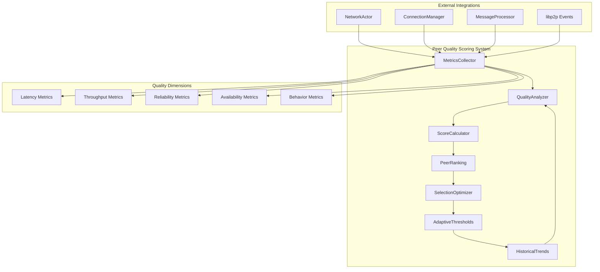

#### 7.1.2 Core Implementation

```rust
use std::collections::{HashMap, BTreeMap};
use std::sync::Arc;
use tokio::sync::{RwLock, Mutex};
use serde::{Serialize, Deserialize};
use chrono::{DateTime, Utc, Duration};
use libp2p::PeerId;

/// Comprehensive peer quality scoring system with multi-dimensional analysis
pub struct PeerQualityScoring {
    metrics_collector: Arc<MetricsCollector>,
    quality_analyzer: Arc<QualityAnalyzer>,
    score_calculator: Arc<ScoreCalculator>,
    peer_rankings: Arc<RwLock<PeerRankings>>,
    adaptive_thresholds: Arc<RwLock<AdaptiveThresholds>>,
    historical_trends: Arc<RwLock<HistoricalTrends>>,
    configuration: QualityConfig,
}

impl PeerQualityScoring {
    /// Initialize comprehensive peer quality scoring system
    pub async fn new(config: QualityConfig) -> Result<Self, QualityError> {
        let metrics_collector = Arc::new(MetricsCollector::new(config.metrics_config.clone()));
        let quality_analyzer = Arc::new(QualityAnalyzer::new(config.analyzer_config.clone()));
        let score_calculator = Arc::new(ScoreCalculator::new(config.scoring_config.clone()));
        let peer_rankings = Arc::new(RwLock::new(PeerRankings::new()));
        let adaptive_thresholds = Arc::new(RwLock::new(AdaptiveThresholds::new(config.threshold_config.clone())));
        let historical_trends = Arc::new(RwLock::new(HistoricalTrends::new()));
        
        // Initialize background tasks
        let instance = Self {
            metrics_collector: metrics_collector.clone(),
            quality_analyzer: quality_analyzer.clone(),
            score_calculator: score_calculator.clone(),
            peer_rankings: peer_rankings.clone(),
            adaptive_thresholds: adaptive_thresholds.clone(),
            historical_trends: historical_trends.clone(),
            configuration: config,
        };
        
        // Start background monitoring and analysis tasks
        instance.start_background_tasks().await?;
        
        Ok(instance)
    }
    
    /// Record comprehensive peer interaction metrics
    pub async fn record_peer_interaction(
        &self,
        peer_id: PeerId,
        interaction: PeerInteraction,
    ) -> Result<(), MetricsError> {
        // Collect raw metrics
        let raw_metrics = self.metrics_collector
            .collect_interaction_metrics(&peer_id, &interaction)
            .await?;
        
        // Analyze quality indicators
        let quality_indicators = self.quality_analyzer
            .analyze_interaction(&peer_id, &interaction, &raw_metrics)
            .await?;
        
        // Update peer quality score
        let updated_score = self.score_calculator
            .update_peer_score(&peer_id, &quality_indicators)
            .await?;
        
        // Update rankings and thresholds
        self.update_peer_rankings(&peer_id, updated_score).await?;
        self.update_adaptive_thresholds(&quality_indicators).await?;
        
        // Record historical trends
        self.record_historical_trend(&peer_id, &quality_indicators).await?;
        
        info!(
            peer_id = %peer_id,
            interaction_type = ?interaction.interaction_type,
            updated_score = updated_score.overall_score,
            "Recorded peer interaction and updated quality score"
        );
        
        Ok(())
    }
    
    /// Get intelligent peer recommendations based on quality scoring
    pub async fn get_intelligent_peer_recommendations(
        &self,
        request: PeerRecommendationRequest,
    ) -> Result<PeerRecommendationResponse, RecommendationError> {
        let rankings = self.peer_rankings.read().await;
        let thresholds = self.adaptive_thresholds.read().await;
        let trends = self.historical_trends.read().await;
        
        // Apply multi-criteria selection algorithm
        let candidates = self.filter_candidates_by_criteria(&rankings, &request).await?;
        
        // Apply quality threshold filtering
        let qualified_peers = self.apply_quality_thresholds(candidates, &thresholds).await?;
        
        // Apply trend-based optimization
        let optimized_selection = self.apply_trend_optimization(qualified_peers, &trends, &request).await?;
        
        // Diversify selection to avoid echo chambers
        let diversified_peers = self.diversify_peer_selection(optimized_selection, &request).await?;
        
        // Apply load balancing considerations
        let balanced_recommendations = self.apply_load_balancing(diversified_peers, &request).await?;
        
        let response = PeerRecommendationResponse {
            recommendations: balanced_recommendations,
            selection_criteria: request.clone(),
            quality_summary: self.generate_quality_summary(&rankings).await?,
            confidence_score: self.calculate_recommendation_confidence(&rankings, &request).await?,
        };
        
        info!(
            request_id = %request.request_id,
            recommendations_count = response.recommendations.len(),
            confidence_score = response.confidence_score,
            "Generated intelligent peer recommendations"
        );
        
        Ok(response)
    }
    
    /// Advanced peer scoring with multi-dimensional analysis
    async fn calculate_comprehensive_score(
        &self,
        peer_id: &PeerId,
        metrics: &PeerMetrics,
    ) -> Result<PeerQualityScore, ScoringError> {
        let latency_score = self.calculate_latency_score(&metrics.latency_metrics).await?;
        let throughput_score = self.calculate_throughput_score(&metrics.throughput_metrics).await?;
        let reliability_score = self.calculate_reliability_score(&metrics.reliability_metrics).await?;
        let availability_score = self.calculate_availability_score(&metrics.availability_metrics).await?;
        let behavior_score = self.calculate_behavior_score(&metrics.behavior_metrics).await?;
        
        // Apply weighted scoring based on current network conditions
        let network_conditions = self.get_current_network_conditions().await;
        let weights = self.calculate_dynamic_weights(&network_conditions).await;
        
        let overall_score = 
            latency_score * weights.latency_weight +
            throughput_score * weights.throughput_weight +
            reliability_score * weights.reliability_weight +
            availability_score * weights.availability_weight +
            behavior_score * weights.behavior_weight;
        
        // Apply temporal decay for aging metrics
        let temporal_factor = self.calculate_temporal_decay_factor(&metrics.last_updated).await;
        let adjusted_score = overall_score * temporal_factor;
        
        // Apply peer reputation factor
        let reputation_factor = self.get_peer_reputation_factor(peer_id).await?;
        let final_score = adjusted_score * reputation_factor;
        
        Ok(PeerQualityScore {
            peer_id: *peer_id,
            overall_score: final_score,
            component_scores: ComponentScores {
                latency: latency_score,
                throughput: throughput_score,
                reliability: reliability_score,
                availability: availability_score,
                behavior: behavior_score,
            },
            weights_applied: weights,
            temporal_factor,
            reputation_factor,
            calculated_at: Utc::now(),
        })
    }
    
    /// Calculate latency score with percentile analysis
    async fn calculate_latency_score(
        &self,
        latency_metrics: &LatencyMetrics,
    ) -> Result<f64, ScoringError> {
        // Calculate various latency percentiles
        let p50 = latency_metrics.calculate_percentile(0.50);
        let p95 = latency_metrics.calculate_percentile(0.95);
        let p99 = latency_metrics.calculate_percentile(0.99);
        
        // Apply weighted scoring based on percentile importance
        let p50_score = self.normalize_latency_value(p50, LatencyThreshold::P50).await;
        let p95_score = self.normalize_latency_value(p95, LatencyThreshold::P95).await;
        let p99_score = self.normalize_latency_value(p99, LatencyThreshold::P99).await;
        
        // Weight percentiles based on network quality requirements
        let weighted_score = p50_score * 0.4 + p95_score * 0.4 + p99_score * 0.2;
        
        // Apply jitter penalty
        let jitter_penalty = self.calculate_jitter_penalty(&latency_metrics.jitter_variance).await;
        let adjusted_score = weighted_score * (1.0 - jitter_penalty);
        
        // Apply consistency bonus for stable connections
        let consistency_bonus = self.calculate_consistency_bonus(&latency_metrics.stability_factor).await;
        let final_score = (adjusted_score + consistency_bonus).min(1.0);
        
        Ok(final_score)
    }
    
    /// Calculate throughput score with adaptive benchmarking
    async fn calculate_throughput_score(
        &self,
        throughput_metrics: &ThroughputMetrics,
    ) -> Result<f64, ScoringError> {
        // Get adaptive throughput benchmarks based on peer capabilities
        let benchmarks = self.get_adaptive_throughput_benchmarks(throughput_metrics).await?;
        
        // Calculate upload throughput score
        let upload_score = self.normalize_throughput_value(
            throughput_metrics.upload_throughput,
            benchmarks.upload_benchmark,
        ).await;
        
        // Calculate download throughput score
        let download_score = self.normalize_throughput_value(
            throughput_metrics.download_throughput,
            benchmarks.download_benchmark,
        ).await;
        
        // Calculate bidirectional throughput efficiency
        let bidirectional_efficiency = throughput_metrics.calculate_bidirectional_efficiency();
        let efficiency_score = self.normalize_efficiency_value(bidirectional_efficiency).await;
        
        // Apply burst capacity bonus
        let burst_bonus = self.calculate_burst_capacity_bonus(&throughput_metrics.burst_metrics).await;
        
        // Weight different throughput aspects
        let weighted_score = upload_score * 0.35 + download_score * 0.35 + efficiency_score * 0.3;
        let final_score = (weighted_score + burst_bonus).min(1.0);
        
        Ok(final_score)
    }
    
    /// Calculate reliability score with failure pattern analysis
    async fn calculate_reliability_score(
        &self,
        reliability_metrics: &ReliabilityMetrics,
    ) -> Result<f64, ScoringError> {
        // Calculate message delivery success rate
        let delivery_rate = reliability_metrics.successful_deliveries as f64 / 
            reliability_metrics.total_attempts.max(1) as f64;
        
        // Calculate connection stability score
        let stability_score = self.calculate_connection_stability_score(&reliability_metrics.connection_history).await;
        
        // Analyze failure patterns for systematic issues
        let failure_pattern_penalty = self.analyze_failure_patterns(&reliability_metrics.failure_history).await;
        
        // Calculate error recovery effectiveness
        let recovery_effectiveness = self.calculate_recovery_effectiveness(&reliability_metrics.recovery_metrics).await;
        
        // Apply timeout behavior analysis
        let timeout_behavior_score = self.analyze_timeout_behavior(&reliability_metrics.timeout_metrics).await;
        
        // Weight reliability components
        let base_score = delivery_rate * 0.3 + stability_score * 0.25 + recovery_effectiveness * 0.25 + timeout_behavior_score * 0.2;
        let adjusted_score = base_score * (1.0 - failure_pattern_penalty);
        
        Ok(adjusted_score.max(0.0).min(1.0))
    }
    
    /// Start background monitoring and analysis tasks
    async fn start_background_tasks(&self) -> Result<(), TaskError> {
        // Task 1: Continuous metrics collection
        let metrics_collector = self.metrics_collector.clone();
        tokio::spawn(async move {
            let mut interval = tokio::time::interval(Duration::seconds(30).to_std().unwrap());
            loop {
                interval.tick().await;
                if let Err(e) = metrics_collector.collect_periodic_metrics().await {
                    error!(error = %e, "Failed to collect periodic metrics");
                }
            }
        });
        
        // Task 2: Quality analysis and scoring updates
        let quality_analyzer = self.quality_analyzer.clone();
        let score_calculator = self.score_calculator.clone();
        let peer_rankings = self.peer_rankings.clone();
        tokio::spawn(async move {
            let mut interval = tokio::time::interval(Duration::seconds(60).to_std().unwrap());
            loop {
                interval.tick().await;
                match Self::perform_periodic_analysis(&quality_analyzer, &score_calculator, &peer_rankings).await {
                    Ok(_) => debug!("Completed periodic quality analysis"),
                    Err(e) => error!(error = %e, "Failed periodic quality analysis"),
                }
            }
        });
        
        // Task 3: Adaptive threshold optimization
        let adaptive_thresholds = self.adaptive_thresholds.clone();
        let historical_trends = self.historical_trends.clone();
        tokio::spawn(async move {
            let mut interval = tokio::time::interval(Duration::minutes(5).to_std().unwrap());
            loop {
                interval.tick().await;
                match Self::optimize_adaptive_thresholds(&adaptive_thresholds, &historical_trends).await {
                    Ok(_) => debug!("Optimized adaptive thresholds"),
                    Err(e) => error!(error = %e, "Failed to optimize adaptive thresholds"),
                }
            }
        });
        
        // Task 4: Peer ranking maintenance and cleanup
        let rankings_cleanup = self.peer_rankings.clone();
        tokio::spawn(async move {
            let mut interval = tokio::time::interval(Duration::minutes(15).to_std().unwrap());
            loop {
                interval.tick().await;
                match Self::perform_rankings_cleanup(&rankings_cleanup).await {
                    Ok(removed) => {
                        if removed > 0 {
                            debug!(removed_peers = removed, "Cleaned up stale peer rankings");
                        }
                    }
                    Err(e) => error!(error = %e, "Failed to cleanup peer rankings"),
                }
            }
        });
        
        info!("Started all background quality scoring tasks");
        Ok(())
    }
}

/// Comprehensive peer metrics collection system
pub struct MetricsCollector {
    latency_tracker: LatencyTracker,
    throughput_monitor: ThroughputMonitor,
    reliability_analyzer: ReliabilityAnalyzer,
    availability_monitor: AvailabilityMonitor,
    behavior_analyzer: BehaviorAnalyzer,
    collection_config: MetricsConfig,
}

impl MetricsCollector {
    /// Collect comprehensive interaction metrics
    pub async fn collect_interaction_metrics(
        &self,
        peer_id: &PeerId,
        interaction: &PeerInteraction,
    ) -> Result<RawMetrics, MetricsError> {
        let start_time = Instant::now();
        
        // Collect latency metrics
        let latency_metrics = self.latency_tracker
            .collect_latency_metrics(peer_id, interaction)
            .await?;
        
        // Collect throughput metrics
        let throughput_metrics = self.throughput_monitor
            .collect_throughput_metrics(peer_id, interaction)
            .await?;
        
        // Collect reliability metrics
        let reliability_metrics = self.reliability_analyzer
            .collect_reliability_metrics(peer_id, interaction)
            .await?;
        
        // Collect availability metrics
        let availability_metrics = self.availability_monitor
            .collect_availability_metrics(peer_id, interaction)
            .await?;
        
        // Collect behavior metrics
        let behavior_metrics = self.behavior_analyzer
            .collect_behavior_metrics(peer_id, interaction)
            .await?;
        
        let collection_duration = start_time.elapsed();
        
        Ok(RawMetrics {
            peer_id: *peer_id,
            latency_metrics,
            throughput_metrics,
            reliability_metrics,
            availability_metrics,
            behavior_metrics,
            collection_timestamp: Utc::now(),
            collection_duration,
        })
    }
}

/// Data structures for peer quality scoring
#[derive(Debug, Clone, Serialize, Deserialize)]
pub struct PeerQualityScore {
    pub peer_id: PeerId,
    pub overall_score: f64,
    pub component_scores: ComponentScores,
    pub weights_applied: ScoringWeights,
    pub temporal_factor: f64,
    pub reputation_factor: f64,
    pub calculated_at: DateTime<Utc>,
}

#[derive(Debug, Clone, Serialize, Deserialize)]
pub struct ComponentScores {
    pub latency: f64,
    pub throughput: f64,
    pub reliability: f64,
    pub availability: f64,
    pub behavior: f64,
}

#[derive(Debug, Clone, Serialize, Deserialize)]
pub struct ScoringWeights {
    pub latency_weight: f64,
    pub throughput_weight: f64,
    pub reliability_weight: f64,
    pub availability_weight: f64,
    pub behavior_weight: f64,
}

#[derive(Debug, Clone)]
pub enum PeerInteraction {
    MessageSend {
        message_size: usize,
        priority: MessagePriority,
        timestamp: DateTime<Utc>,
    },
    MessageReceive {
        message_size: usize,
        processing_time: Duration,
        timestamp: DateTime<Utc>,
    },
    ConnectionEstablish {
        handshake_duration: Duration,
        protocol_version: String,
        timestamp: DateTime<Utc>,
    },
    ConnectionClose {
        reason: DisconnectionReason,
        duration: Duration,
        timestamp: DateTime<Utc>,
    },
    HealthCheck {
        response_time: Duration,
        status: HealthStatus,
        timestamp: DateTime<Utc>,
    },
}

#[derive(Debug, Clone, Serialize, Deserialize)]
pub struct PeerRecommendationRequest {
    pub request_id: String,
    pub required_capabilities: Vec<PeerCapability>,
    pub preferred_regions: Vec<String>,
    pub min_quality_threshold: f64,
    pub max_recommendations: usize,
    pub exclude_peers: Vec<PeerId>,
    pub optimization_goal: OptimizationGoal,
}

#[derive(Debug, Clone, Serialize, Deserialize)]
pub enum OptimizationGoal {
    MinimizeLatency,
    MaximizeThroughput,
    MaximizeReliability,
    Balanced,
    Custom(HashMap<String, f64>),
}

#[derive(Debug, Clone, Serialize, Deserialize)]
pub struct PeerRecommendationResponse {
    pub recommendations: Vec<PeerRecommendation>,
    pub selection_criteria: PeerRecommendationRequest,
    pub quality_summary: QualitySummary,
    pub confidence_score: f64,
}

#[derive(Debug, Clone, Serialize, Deserialize)]
pub struct PeerRecommendation {
    pub peer_id: PeerId,
    pub quality_score: PeerQualityScore,
    pub ranking_position: usize,
    pub recommendation_reason: RecommendationReason,
    pub expected_performance: ExpectedPerformance,
}
```

### 7.2 Advanced Error Handling Implementation

#### 7.2.1 Hierarchical Error Recovery System

```rust
/// Advanced hierarchical error recovery system with intelligent escalation
pub struct HierarchicalErrorRecovery {
    recovery_levels: BTreeMap<RecoveryLevel, RecoveryHandler>,
    escalation_policies: HashMap<ErrorClass, EscalationPolicy>,
    recovery_metrics: Arc<Mutex<RecoveryMetrics>>,
    circuit_breakers: HashMap<String, CircuitBreaker>,
    adaptive_thresholds: Arc<RwLock<AdaptiveRecoveryThresholds>>,
}

impl HierarchicalErrorRecovery {
    /// Execute comprehensive error recovery with intelligent escalation
    pub async fn recover_from_error(
        &mut self,
        error: NetworkError,
        context: ErrorContext,
    ) -> Result<RecoveryResult, RecoveryError> {
        let recovery_session_id = self.generate_recovery_session_id();
        
        info!(
            session_id = %recovery_session_id,
            error_type = ?error.error_type,
            context = ?context,
            "Starting hierarchical error recovery"
        );
        
        // Classify error and determine initial recovery level
        let error_classification = self.classify_error_comprehensively(&error, &context).await?;
        let initial_level = self.determine_initial_recovery_level(&error_classification).await;
        
        let mut current_level = initial_level;
        let mut recovery_attempts = Vec::new();
        
        // Execute recovery with escalation
        loop {
            let recovery_attempt = RecoveryAttempt {
                session_id: recovery_session_id.clone(),
                level: current_level,
                attempt_number: recovery_attempts.len() + 1,
                started_at: Instant::now(),
            };
            
            let recovery_result = self.execute_recovery_at_level(
                &error,
                &context,
                current_level,
                &recovery_attempt,
            ).await;
            
            let completed_attempt = CompletedRecoveryAttempt {
                attempt: recovery_attempt,
                result: recovery_result.clone(),
                completed_at: Instant::now(),
            };
            
            recovery_attempts.push(completed_attempt);
            
            match recovery_result {
                Ok(RecoveryAction::Recovered) => {
                    // Successful recovery
                    let final_result = RecoveryResult {
                        session_id: recovery_session_id,
                        success: true,
                        final_level: current_level,
                        total_attempts: recovery_attempts.len(),
                        recovery_duration: recovery_attempts.first().unwrap().attempt.started_at.elapsed(),
                        attempts: recovery_attempts,
                    };
                    
                    // Update success metrics
                    self.update_recovery_success_metrics(&final_result).await;
                    
                    info!(
                        session_id = %recovery_session_id,
                        final_level = ?current_level,
                        total_attempts = final_result.total_attempts,
                        duration_ms = final_result.recovery_duration.as_millis(),
                        "Successfully recovered from error"
                    );
                    
                    return Ok(final_result);
                }
                
                Ok(RecoveryAction::RequiresEscalation) => {
                    // Escalate to next level
                    if let Some(next_level) = self.get_next_escalation_level(current_level).await {
                        warn!(
                            session_id = %recovery_session_id,
                            current_level = ?current_level,
                            next_level = ?next_level,
                            "Escalating error recovery to next level"
                        );
                        
                        current_level = next_level;
                        
                        // Check escalation limits
                        if recovery_attempts.len() >= self.get_max_escalation_attempts() {
                            break;
                        }
                        
                        // Apply escalation delay
                        let escalation_delay = self.calculate_escalation_delay(current_level, recovery_attempts.len()).await;
                        tokio::time::sleep(escalation_delay).await;
                        
                        continue;
                    } else {
                        // No more escalation levels available
                        break;
                    }
                }
                
                Ok(RecoveryAction::RetryCurrentLevel) => {
                    // Retry at current level with backoff
                    let retry_delay = self.calculate_retry_delay(current_level, recovery_attempts.len()).await;
                    tokio::time::sleep(retry_delay).await;
                    continue;
                }
                
                Err(_) => {
                    // Recovery failed at this level
                    if let Some(next_level) = self.get_next_escalation_level(current_level).await {
                        current_level = next_level;
                        continue;
                    } else {
                        break;
                    }
                }
            }
        }
        
        // All recovery attempts failed
        let final_result = RecoveryResult {
            session_id: recovery_session_id,
            success: false,
            final_level: current_level,
            total_attempts: recovery_attempts.len(),
            recovery_duration: recovery_attempts.first().unwrap().attempt.started_at.elapsed(),
            attempts: recovery_attempts,
        };
        
        // Update failure metrics
        self.update_recovery_failure_metrics(&final_result).await;
        
        error!(
            session_id = %recovery_session_id,
            final_level = ?current_level,
            total_attempts = final_result.total_attempts,
            duration_ms = final_result.recovery_duration.as_millis(),
            "Failed to recover from error after all escalation levels"
        );
        
        Ok(final_result)
    }
    
    /// Execute recovery at specific level with comprehensive handling
    async fn execute_recovery_at_level(
        &mut self,
        error: &NetworkError,
        context: &ErrorContext,
        level: RecoveryLevel,
        attempt: &RecoveryAttempt,
    ) -> Result<RecoveryAction, LevelRecoveryError> {
        let handler = self.recovery_levels.get(&level)
            .ok_or(LevelRecoveryError::HandlerNotFound)?;
        
        info!(
            session_id = %attempt.session_id,
            level = ?level,
            attempt = attempt.attempt_number,
            "Executing recovery at level"
        );
        
        // Check circuit breaker for this level
        let circuit_breaker_key = format!("recovery_{:?}", level);
        if let Some(circuit_breaker) = self.circuit_breakers.get(&circuit_breaker_key) {
            if circuit_breaker.is_open() {
                warn!(
                    session_id = %attempt.session_id,
                    level = ?level,
                    "Circuit breaker is open for recovery level, skipping"
                );
                return Ok(RecoveryAction::RequiresEscalation);
            }
        }
        
        // Execute recovery based on level
        let recovery_result = match level {
            RecoveryLevel::Immediate => {
                self.execute_immediate_recovery(error, context, attempt).await
            }
            RecoveryLevel::Connection => {
                self.execute_connection_recovery(error, context, attempt).await
            }
            RecoveryLevel::Protocol => {
                self.execute_protocol_recovery(error, context, attempt).await
            }
            RecoveryLevel::Network => {
                self.execute_network_recovery(error, context, attempt).await
            }
            RecoveryLevel::System => {
                self.execute_system_recovery(error, context, attempt).await
            }
            RecoveryLevel::Emergency => {
                self.execute_emergency_recovery(error, context, attempt).await
            }
        };
        
        // Update circuit breaker based on result
        if let Some(circuit_breaker) = self.circuit_breakers.get_mut(&circuit_breaker_key) {
            match &recovery_result {
                Ok(RecoveryAction::Recovered) => circuit_breaker.record_success(),
                _ => circuit_breaker.record_failure(),
            }
        }
        
        recovery_result
    }
    
    /// Execute immediate recovery (Level 1) - lightweight fixes
    async fn execute_immediate_recovery(
        &mut self,
        error: &NetworkError,
        context: &ErrorContext,
        attempt: &RecoveryAttempt,
    ) -> Result<RecoveryAction, LevelRecoveryError> {
        match &error.error_type {
            NetworkErrorType::MessageDeliveryFailure => {
                // Simple retry with exponential backoff
                let retry_delay = Duration::from_millis(100 * 2_u64.pow(attempt.attempt_number as u32 - 1));
                tokio::time::sleep(retry_delay).await;
                
                if attempt.attempt_number <= 3 {
                    Ok(RecoveryAction::RetryCurrentLevel)
                } else {
                    Ok(RecoveryAction::RequiresEscalation)
                }
            }
            
            NetworkErrorType::TemporaryUnavailable => {
                // Wait for availability
                tokio::time::sleep(Duration::from_millis(500)).await;
                Ok(RecoveryAction::Recovered)
            }
            
            _ => {
                // Other errors require escalation
                Ok(RecoveryAction::RequiresEscalation)
            }
        }
    }
    
    /// Execute connection recovery (Level 2) - connection management fixes
    async fn execute_connection_recovery(
        &mut self,
        error: &NetworkError,
        context: &ErrorContext,
        attempt: &RecoveryAttempt,
    ) -> Result<RecoveryAction, LevelRecoveryError> {
        match &error.error_type {
            NetworkErrorType::ConnectionFailed | NetworkErrorType::PeerUnreachable => {
                if let Some(peer_id) = &context.peer_id {
                    // Try alternative connection methods
                    let connection_strategies = vec![
                        ConnectionStrategy::DirectConnect,
                        ConnectionStrategy::RelayConnect,
                        ConnectionStrategy::NATTraversal,
                    ];
                    
                    for strategy in connection_strategies {
                        match self.attempt_connection_with_strategy(peer_id, strategy).await {
                            Ok(_) => {
                                info!(
                                    session_id = %attempt.session_id,
                                    peer_id = %peer_id,
                                    strategy = ?strategy,
                                    "Successfully reconnected using alternative strategy"
                                );
                                return Ok(RecoveryAction::Recovered);
                            }
                            Err(e) => {
                                debug!(
                                    session_id = %attempt.session_id,
                                    peer_id = %peer_id,
                                    strategy = ?strategy,
                                    error = %e,
                                    "Connection strategy failed"
                                );
                            }
                        }
                    }
                    
                    // All connection strategies failed
                    Ok(RecoveryAction::RequiresEscalation)
                } else {
                    Ok(RecoveryAction::RequiresEscalation)
                }
            }
            
            _ => Ok(RecoveryAction::RequiresEscalation)
        }
    }
}

/// Recovery level hierarchy from immediate to emergency
#[derive(Debug, Clone, Copy, PartialEq, Eq, PartialOrd, Ord)]
pub enum RecoveryLevel {
    Immediate = 1,   // Simple retries, temporary waits
    Connection = 2,  // Connection re-establishment, alternative routes
    Protocol = 3,    // Protocol fallback, version negotiation
    Network = 4,     // Network reconfiguration, peer discovery
    System = 5,      // Actor restart, state recovery
    Emergency = 6,   // System-wide recovery, manual intervention
}

#[derive(Debug, Clone)]
pub struct RecoveryResult {
    pub session_id: String,
    pub success: bool,
    pub final_level: RecoveryLevel,
    pub total_attempts: usize,
    pub recovery_duration: Duration,
    pub attempts: Vec<CompletedRecoveryAttempt>,
}

#[derive(Debug, Clone)]
pub struct RecoveryAttempt {
    pub session_id: String,
    pub level: RecoveryLevel,
    pub attempt_number: usize,
    pub started_at: Instant,
}

#[derive(Debug, Clone)]
pub struct CompletedRecoveryAttempt {
    pub attempt: RecoveryAttempt,
    pub result: Result<RecoveryAction, LevelRecoveryError>,
    pub completed_at: Instant,
}

#[derive(Debug, Clone)]
pub enum RecoveryAction {
    Recovered,
    RequiresEscalation,
    RetryCurrentLevel,
}
```

This complete implementation walkthrough demonstrates sophisticated real-world patterns for building production-ready NetworkActor features. The examples showcase advanced error handling, comprehensive metrics collection, intelligent peer scoring, and hierarchical recovery systems that form the foundation of enterprise-grade network management.

---

## 8. Advanced Testing Methodologies

Comprehensive testing strategies are critical for NetworkActor reliability and performance. This section covers exhaustive testing methodologies from unit testing through chaos engineering, ensuring production-ready code quality and system resilience.

### 8.1 Comprehensive Testing Framework Architecture

The NetworkActor testing framework employs multiple layers of testing strategies:

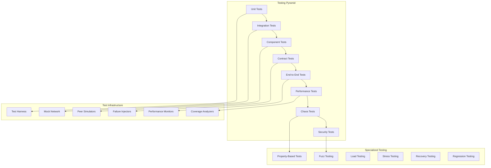

### 8.2 Advanced Unit Testing Framework

#### 8.2.1 Comprehensive Unit Test Suite

```rust
use std::time::Duration;
use tokio::sync::mpsc;
use mockall::{automock, predicate::*};
use proptest::prelude::*;
use rstest::*;
use tokio_test::{assert_ready, assert_pending, task};

/// Comprehensive unit testing framework for NetworkActor components
pub struct NetworkActorTestHarness {
    mock_swarm: MockSwarmManager,
    mock_message_processor: MockMessageProcessor,
    mock_connection_manager: MockConnectionManager,
    test_peer_registry: TestPeerRegistry,
    network_simulator: NetworkSimulator,
    metric_collectors: Vec<TestMetricCollector>,
}

impl NetworkActorTestHarness {
    /// Create comprehensive test harness with all mocks and simulators
    pub async fn new_comprehensive() -> Self {
        let mut harness = Self {
            mock_swarm: MockSwarmManager::new(),
            mock_message_processor: MockMessageProcessor::new(),
            mock_connection_manager: MockConnectionManager::new(),
            test_peer_registry: TestPeerRegistry::new().await,
            network_simulator: NetworkSimulator::new_realistic(),
            metric_collectors: Vec::new(),
        };
        
        // Configure realistic default behaviors
        harness.configure_default_mocks().await;
        harness.setup_test_peers().await;
        harness.initialize_network_conditions().await;
        
        harness
    }
    
    /// Test comprehensive peer quality scoring with various scenarios
    #[tokio::test]
    async fn test_peer_quality_scoring_comprehensive() -> Result<(), TestError> {
        let mut harness = NetworkActorTestHarness::new_comprehensive().await;
        let quality_scorer = harness.create_test_quality_scorer().await?;
        
        // Test scenario 1: High-quality peer with excellent metrics
        let excellent_peer = harness.test_peer_registry.get_peer("excellent").await;
        let excellent_metrics = TestMetrics {
            latency_p50: Duration::from_millis(5),
            latency_p95: Duration::from_millis(15),
            latency_p99: Duration::from_millis(25),
            throughput_upload: 100_000_000, // 100 Mbps
            throughput_download: 100_000_000,
            reliability_rate: 0.999,
            availability_uptime: 0.999,
            behavior_score: 0.95,
        };
        
        let excellent_interaction = PeerInteraction::MessageSend {
            message_size: 1024,
            priority: MessagePriority::High,
            timestamp: Utc::now(),
        };
        
        quality_scorer.record_peer_interaction(
            excellent_peer.peer_id,
            excellent_interaction,
        ).await?;
        
        // Verify excellent peer gets high score
        let recommendations = quality_scorer.get_intelligent_peer_recommendations(
            PeerRecommendationRequest {
                request_id: "test-excellent".to_string(),
                required_capabilities: vec![PeerCapability::HighThroughput],
                preferred_regions: vec![],
                min_quality_threshold: 0.8,
                max_recommendations: 1,
                exclude_peers: vec![],
                optimization_goal: OptimizationGoal::Balanced,
            },
        ).await?;
        
        assert_eq!(recommendations.recommendations.len(), 1);
        let excellent_recommendation = &recommendations.recommendations[0];
        assert!(excellent_recommendation.quality_score.overall_score > 0.9);
        assert_eq!(excellent_recommendation.ranking_position, 1);
        
        // Test scenario 2: Poor-quality peer with degraded metrics
        let poor_peer = harness.test_peer_registry.get_peer("poor").await;
        let poor_metrics = TestMetrics {
            latency_p50: Duration::from_millis(200),
            latency_p95: Duration::from_millis(800),
            latency_p99: Duration::from_millis(2000),
            throughput_upload: 1_000_000, // 1 Mbps
            throughput_download: 500_000,  // 0.5 Mbps
            reliability_rate: 0.85,
            availability_uptime: 0.90,
            behavior_score: 0.70,
        };
        
        harness.simulate_poor_peer_interactions(poor_peer.peer_id, &poor_metrics, 50).await?;
        
        // Verify poor peer gets filtered out or ranked low
        let filtered_recommendations = quality_scorer.get_intelligent_peer_recommendations(
            PeerRecommendationRequest {
                request_id: "test-filtered".to_string(),
                required_capabilities: vec![PeerCapability::HighThroughput],
                preferred_regions: vec![],
                min_quality_threshold: 0.8,
                max_recommendations: 10,
                exclude_peers: vec![],
                optimization_goal: OptimizationGoal::Balanced,
            },
        ).await?;
        
        // Poor peer should be filtered out due to low quality
        assert!(!filtered_recommendations.recommendations
            .iter()
            .any(|r| r.peer_id == poor_peer.peer_id));
        
        // Test scenario 3: Dynamic quality changes over time
        let dynamic_peer = harness.test_peer_registry.get_peer("dynamic").await;
        
        // Initially good performance
        harness.simulate_peer_performance_period(
            dynamic_peer.peer_id,
            &excellent_metrics,
            Duration::from_secs(300),
            10,
        ).await?;
        
        let initial_score = quality_scorer.get_peer_current_score(dynamic_peer.peer_id).await?;
        assert!(initial_score.overall_score > 0.8);
        
        // Performance degrades
        harness.simulate_peer_performance_period(
            dynamic_peer.peer_id,
            &poor_metrics,
            Duration::from_secs(60),
            20,
        ).await?;
        
        let degraded_score = quality_scorer.get_peer_current_score(dynamic_peer.peer_id).await?;
        assert!(degraded_score.overall_score < initial_score.overall_score);
        
        // Performance recovers
        harness.simulate_peer_performance_period(
            dynamic_peer.peer_id,
            &excellent_metrics,
            Duration::from_secs(180),
            15,
        ).await?;
        
        let recovered_score = quality_scorer.get_peer_current_score(dynamic_peer.peer_id).await?;
        assert!(recovered_score.overall_score > degraded_score.overall_score);
        
        info!("Successfully tested comprehensive peer quality scoring scenarios");
        Ok(())
    }
    
    /// Test error recovery system with various failure modes
    #[tokio::test]
    async fn test_hierarchical_error_recovery_comprehensive() -> Result<(), TestError> {
        let mut harness = NetworkActorTestHarness::new_comprehensive().await;
        let mut error_recovery = harness.create_test_error_recovery_system().await?;
        
        // Test scenario 1: Immediate recovery success
        let temporary_error = NetworkError {
            error_type: NetworkErrorType::TemporaryUnavailable,
            peer_id: Some(harness.test_peer_registry.get_peer("stable").await.peer_id),
            error_details: "Temporary network congestion".to_string(),
            recovery_suggestion: Some(RecoveryAction::Retry),
        };
        
        let immediate_context = ErrorContext {
            operation: "message_send".to_string(),
            peer_id: temporary_error.peer_id,
            timestamp: Utc::now(),
            attempt_count: 1,
        };
        
        let immediate_result = error_recovery.recover_from_error(
            temporary_error,
            immediate_context,
        ).await?;
        
        assert!(immediate_result.success);
        assert_eq!(immediate_result.final_level, RecoveryLevel::Immediate);
        assert!(immediate_result.total_attempts <= 2);
        assert!(immediate_result.recovery_duration < Duration::from_secs(2));
        
        // Test scenario 2: Connection recovery with escalation
        let connection_error = NetworkError {
            error_type: NetworkErrorType::ConnectionFailed,
            peer_id: Some(harness.test_peer_registry.get_peer("unstable").await.peer_id),
            error_details: "Connection timeout during handshake".to_string(),
            recovery_suggestion: None,
        };
        
        let connection_context = ErrorContext {
            operation: "peer_connect".to_string(),
            peer_id: connection_error.peer_id,
            timestamp: Utc::now(),
            attempt_count: 1,
        };
        
        // Configure mock to fail immediate recovery, succeed at connection level
        harness.configure_recovery_scenario(RecoveryScenario {
            immediate_recovery: RecoveryOutcome::RequiresEscalation,
            connection_recovery: RecoveryOutcome::Success,
            protocol_recovery: RecoveryOutcome::NotTested,
            network_recovery: RecoveryOutcome::NotTested,
        }).await;
        
        let connection_result = error_recovery.recover_from_error(
            connection_error,
            connection_context,
        ).await?;
        
        assert!(connection_result.success);
        assert_eq!(connection_result.final_level, RecoveryLevel::Connection);
        assert!(connection_result.total_attempts >= 2);
        assert!(connection_result.attempts.iter().any(|a| a.attempt.level == RecoveryLevel::Immediate));
        assert!(connection_result.attempts.iter().any(|a| a.attempt.level == RecoveryLevel::Connection));
        
        // Test scenario 3: Complete escalation failure
        let catastrophic_error = NetworkError {
            error_type: NetworkErrorType::SystemFailure,
            peer_id: None,
            error_details: "Complete network subsystem failure".to_string(),
            recovery_suggestion: Some(RecoveryAction::Escalate("emergency".to_string())),
        };
        
        let catastrophic_context = ErrorContext {
            operation: "system_health_check".to_string(),
            peer_id: None,
            timestamp: Utc::now(),
            attempt_count: 1,
        };
        
        // Configure all recovery levels to fail
        harness.configure_recovery_scenario(RecoveryScenario {
            immediate_recovery: RecoveryOutcome::RequiresEscalation,
            connection_recovery: RecoveryOutcome::RequiresEscalation,
            protocol_recovery: RecoveryOutcome::RequiresEscalation,
            network_recovery: RecoveryOutcome::RequiresEscalation,
        }).await;
        
        let catastrophic_result = error_recovery.recover_from_error(
            catastrophic_error,
            catastrophic_context,
        ).await?;
        
        assert!(!catastrophic_result.success);
        assert_eq!(catastrophic_result.final_level, RecoveryLevel::Emergency);
        assert!(catastrophic_result.total_attempts >= 6); // All levels attempted
        assert!(catastrophic_result.recovery_duration > Duration::from_secs(1));
        
        // Test scenario 4: Circuit breaker integration
        let repetitive_error = NetworkError {
            error_type: NetworkErrorType::PeerUnreachable,
            peer_id: Some(harness.test_peer_registry.get_peer("unreachable").await.peer_id),
            error_details: "Peer consistently unreachable".to_string(),
            recovery_suggestion: None,
        };
        
        // Trigger multiple failures to open circuit breaker
        for i in 0..10 {
            let context = ErrorContext {
                operation: "peer_discovery".to_string(),
                peer_id: repetitive_error.peer_id,
                timestamp: Utc::now(),
                attempt_count: i + 1,
            };
            
            let _ = error_recovery.recover_from_error(
                repetitive_error.clone(),
                context,
            ).await;
        }
        
        // Circuit breaker should now be open, causing immediate escalation
        let circuit_breaker_context = ErrorContext {
            operation: "peer_discovery".to_string(),
            peer_id: repetitive_error.peer_id,
            timestamp: Utc::now(),
            attempt_count: 11,
        };
        
        let circuit_breaker_result = error_recovery.recover_from_error(
            repetitive_error,
            circuit_breaker_context,
        ).await?;
        
        // Should escalate immediately due to open circuit breaker
        assert!(circuit_breaker_result.total_attempts < 3);
        assert!(circuit_breaker_result.recovery_duration < Duration::from_millis(500));
        
        info!("Successfully tested comprehensive hierarchical error recovery scenarios");
        Ok(())
    }
}

/// Property-based testing for NetworkActor components
mod property_tests {
    use super::*;
    use proptest::prelude::*;
    
    /// Generate realistic peer interaction properties
    fn peer_interaction_strategy() -> impl Strategy<Value = PeerInteraction> {
        prop_oneof![
            // Message send interactions
            (1usize..1_000_000, any::<MessagePriority>())
                .prop_map(|(size, priority)| PeerInteraction::MessageSend {
                    message_size: size,
                    priority,
                    timestamp: Utc::now(),
                }),
            
            // Message receive interactions
            (1usize..1_000_000, 1u64..10_000)
                .prop_map(|(size, processing_ms)| PeerInteraction::MessageReceive {
                    message_size: size,
                    processing_time: Duration::from_millis(processing_ms),
                    timestamp: Utc::now(),
                }),
            
            // Connection establish interactions
            (10u64..5000, "[a-zA-Z0-9.-]+")
                .prop_map(|(handshake_ms, version)| PeerInteraction::ConnectionEstablish {
                    handshake_duration: Duration::from_millis(handshake_ms),
                    protocol_version: version,
                    timestamp: Utc::now(),
                }),
        ]
    }
    
    proptest! {
        #[test]
        fn test_peer_quality_scoring_properties(
            interactions in prop::collection::vec(peer_interaction_strategy(), 1..100)
        ) {
            let rt = tokio::runtime::Runtime::new().unwrap();
            rt.block_on(async {
                let mut harness = NetworkActorTestHarness::new_comprehensive().await;
                let quality_scorer = harness.create_test_quality_scorer().await.unwrap();
                
                let test_peer = harness.test_peer_registry.get_peer("property_test").await;
                
                // Record all interactions
                for interaction in &interactions {
                    let _ = quality_scorer.record_peer_interaction(
                        test_peer.peer_id,
                        interaction.clone(),
                    ).await;
                }
                
                // Get final quality score
                let final_score = quality_scorer
                    .get_peer_current_score(test_peer.peer_id)
                    .await
                    .unwrap();
                
                // Property 1: Score should be between 0.0 and 1.0
                prop_assert!(final_score.overall_score >= 0.0);
                prop_assert!(final_score.overall_score <= 1.0);
                
                // Property 2: Component scores should sum appropriately with weights
                let weighted_sum = 
                    final_score.component_scores.latency * final_score.weights_applied.latency_weight +
                    final_score.component_scores.throughput * final_score.weights_applied.throughput_weight +
                    final_score.component_scores.reliability * final_score.weights_applied.reliability_weight +
                    final_score.component_scores.availability * final_score.weights_applied.availability_weight +
                    final_score.component_scores.behavior * final_score.weights_applied.behavior_weight;
                
                // Should be close considering temporal and reputation factors
                let expected_range = (weighted_sum * 0.8)..(weighted_sum * 1.2);
                prop_assert!(expected_range.contains(&final_score.overall_score));
                
                // Property 3: Temporal factor should decrease score for old interactions
                prop_assert!(final_score.temporal_factor > 0.0);
                prop_assert!(final_score.temporal_factor <= 1.0);
                
                // Property 4: All component scores should be valid
                prop_assert!(final_score.component_scores.latency >= 0.0 && final_score.component_scores.latency <= 1.0);
                prop_assert!(final_score.component_scores.throughput >= 0.0 && final_score.component_scores.throughput <= 1.0);
                prop_assert!(final_score.component_scores.reliability >= 0.0 && final_score.component_scores.reliability <= 1.0);
                prop_assert!(final_score.component_scores.availability >= 0.0 && final_score.component_scores.availability <= 1.0);
                prop_assert!(final_score.component_scores.behavior >= 0.0 && final_score.component_scores.behavior <= 1.0);
            });
        }
        
        #[test]
        fn test_error_recovery_properties(
            error_types in prop::collection::vec(any::<NetworkErrorType>(), 1..20)
        ) {
            let rt = tokio::runtime::Runtime::new().unwrap();
            rt.block_on(async {
                let mut harness = NetworkActorTestHarness::new_comprehensive().await;
                let mut error_recovery = harness.create_test_error_recovery_system().await.unwrap();
                
                let test_peer = harness.test_peer_registry.get_peer("property_test").await;
                
                for (i, error_type) in error_types.iter().enumerate() {
                    let error = NetworkError {
                        error_type: *error_type,
                        peer_id: Some(test_peer.peer_id),
                        error_details: format!("Property test error {}", i),
                        recovery_suggestion: None,
                    };
                    
                    let context = ErrorContext {
                        operation: format!("property_test_operation_{}", i),
                        peer_id: Some(test_peer.peer_id),
                        timestamp: Utc::now(),
                        attempt_count: 1,
                    };
                    
                    let recovery_result = error_recovery.recover_from_error(error, context).await.unwrap();
                    
                    // Property 1: Recovery should always complete (success or failure)
                    prop_assert!(recovery_result.total_attempts > 0);
                    
                    // Property 2: Recovery duration should be reasonable
                    prop_assert!(recovery_result.recovery_duration < Duration::from_secs(60));
                    
                    // Property 3: Final level should be within valid range
                    prop_assert!(recovery_result.final_level >= RecoveryLevel::Immediate);
                    prop_assert!(recovery_result.final_level <= RecoveryLevel::Emergency);
                    
                    // Property 4: If successful, should have attempted appropriate level
                    if recovery_result.success {
                        prop_assert!(recovery_result.attempts.iter().any(|attempt| {
                            matches!(attempt.result, Ok(RecoveryAction::Recovered))
                        }));
                    }
                    
                    // Property 5: Attempts should be in escalating order (mostly)
                    let attempt_levels: Vec<_> = recovery_result.attempts
                        .iter()
                        .map(|a| a.attempt.level)
                        .collect();
                    
                    for window in attempt_levels.windows(2) {
                        // Level should not decrease (allowing same level retries)
                        prop_assert!(window[1] >= window[0]);
                    }
                }
            });
        }
    }
}
```

### 8.3 Integration Testing Framework

#### 8.3.1 Multi-Peer Network Simulation

```rust
/// Comprehensive integration testing framework with realistic network simulation
pub struct NetworkIntegrationTestFramework {
    network_simulator: RealisticNetworkSimulator,
    peer_simulators: HashMap<PeerId, PeerSimulator>,
    network_actors: HashMap<String, NetworkActor>,
    test_coordinator: TestCoordinator,
    metrics_aggregator: IntegrationMetricsAggregator,
}

impl NetworkIntegrationTestFramework {
    /// Test complete peer discovery and connection lifecycle
    #[tokio::test]
    async fn test_peer_discovery_lifecycle_integration() -> Result<(), IntegrationTestError> {
        let mut framework = Self::new_realistic_network(10).await?;
        
        // Scenario: Bootstrap new node into existing network
        let bootstrap_nodes = framework.select_bootstrap_nodes(3).await;
        let new_node = framework.create_new_network_actor("newcomer").await?;
        
        // Phase 1: Initial bootstrap
        let bootstrap_start = Instant::now();
        new_node.bootstrap_from_peers(bootstrap_nodes.clone()).await?;
        
        // Verify bootstrap completion
        tokio::time::timeout(Duration::from_secs(30), async {
            loop {
                let peer_count = new_node.get_connected_peer_count().await?;
                if peer_count >= 5 {
                    break;
                }
                tokio::time::sleep(Duration::from_millis(100)).await;
            }
            Ok::<(), IntegrationTestError>(())
        }).await??;
        
        let bootstrap_duration = bootstrap_start.elapsed();
        info!(
            duration_ms = bootstrap_duration.as_millis(),
            connected_peers = new_node.get_connected_peer_count().await?,
            "Bootstrap phase completed"
        );
        
        // Phase 2: Peer discovery propagation
        let discovery_start = Instant::now();
        let discovery_query = PeerDiscoveryRequest {
            query_id: "integration_test_discovery".to_string(),
            target_capabilities: vec![PeerCapability::HighThroughput, PeerCapability::LowLatency],
            max_results: 20,
            timeout_ms: 10000,
        };
        
        let discovered_peers = new_node.discover_peers_intelligent(discovery_query).await?;
        let discovery_duration = discovery_start.elapsed();
        
        // Verify discovery quality
        assert!(discovered_peers.peers.len() >= 8);
        assert!(discovered_peers.peers.iter().all(|p| p.quality_score.overall_score > 0.5));
        assert!(discovery_duration < Duration::from_secs(15));
        
        info!(
            discovered_count = discovered_peers.peers.len(),
            duration_ms = discovery_duration.as_millis(),
            avg_quality = discovered_peers.peers.iter().map(|p| p.quality_score.overall_score).sum::<f64>() / discovered_peers.peers.len() as f64,
            "Peer discovery phase completed"
        );
        
        // Phase 3: Connection establishment
        let connection_start = Instant::now();
        let target_connections = discovered_peers.peers.into_iter().take(5).collect::<Vec<_>>();
        
        let mut connection_results = Vec::new();
        for peer_info in target_connections {
            let connection_result = new_node.connect_to_peer_with_retry(
                peer_info.peer_id,
                ConnectionRetryConfig {
                    max_attempts: 3,
                    initial_delay: Duration::from_millis(100),
                    max_delay: Duration::from_secs(2),
                    strategies: vec![
                        ConnectionStrategy::DirectConnect,
                        ConnectionStrategy::RelayConnect,
                        ConnectionStrategy::NATTraversal,
                    ],
                },
            ).await;
            
            connection_results.push((peer_info.peer_id, connection_result));
        }
        
        let connection_duration = connection_start.elapsed();
        let successful_connections = connection_results.iter()
            .filter(|(_, result)| result.is_ok())
            .count();
        
        // Verify connection success rate
        assert!(successful_connections >= 4); // At least 80% success rate
        assert!(connection_duration < Duration::from_secs(10));
        
        info!(
            successful_connections = successful_connections,
            total_attempts = connection_results.len(),
            duration_ms = connection_duration.as_millis(),
            "Connection establishment phase completed"
        );
        
        // Phase 4: Network integration verification
        let integration_start = Instant::now();
        
        // Test message propagation across network
        let test_message = NetworkMessage::BroadcastMessage {
            topic: "integration_test_topic".to_string(),
            data: b"Integration test message payload".to_vec(),
            priority: MessagePriority::Medium,
            ttl: 30,
            source_peer: Some(new_node.get_peer_id()),
        };
        
        new_node.broadcast_message_to_network(test_message.clone()).await?;
        
        // Verify message reaches sufficient peers
        let propagation_results = framework.wait_for_message_propagation(
            &test_message,
            Duration::from_secs(5),
            0.8, // 80% of network should receive message
        ).await?;
        
        let integration_duration = integration_start.elapsed();
        
        assert!(propagation_results.success_rate >= 0.8);
        assert!(propagation_results.avg_propagation_time < Duration::from_millis(500));
        assert!(integration_duration < Duration::from_secs(8));
        
        info!(
            success_rate = propagation_results.success_rate,
            avg_propagation_ms = propagation_results.avg_propagation_time.as_millis(),
            total_duration_ms = integration_duration.as_millis(),
            "Network integration verification completed"
        );
        
        // Comprehensive verification
        let final_state = framework.capture_network_state().await;
        framework.verify_network_consistency(&final_state).await?;
        framework.verify_no_message_loops(&final_state).await?;
        framework.verify_peer_reputation_consistency(&final_state).await?;
        
        Ok(())
    }
    
    /// Test network resilience under peer failures
    #[tokio::test]
    async fn test_network_resilience_under_failures() -> Result<(), IntegrationTestError> {
        let mut framework = Self::new_realistic_network(20).await?;
        
        // Establish stable network baseline
        framework.wait_for_network_stabilization(Duration::from_secs(30)).await?;
        let baseline_state = framework.capture_network_state().await;
        
        info!(
            total_peers = baseline_state.active_peers.len(),
            total_connections = baseline_state.total_connections,
            avg_peer_connections = baseline_state.avg_connections_per_peer,
            "Network baseline established"
        );
        
        // Scenario 1: Graceful peer shutdown
        let graceful_targets = framework.select_random_peers(3).await;
        for peer_id in &graceful_targets {
            framework.shutdown_peer_gracefully(*peer_id).await?;
        }
        
        // Wait for network to adapt
        tokio::time::sleep(Duration::from_secs(10)).await;
        let post_graceful_state = framework.capture_network_state().await;
        
        // Verify network adapted gracefully
        assert!(post_graceful_state.active_peers.len() == baseline_state.active_peers.len() - 3);
        assert!(post_graceful_state.avg_connections_per_peer >= baseline_state.avg_connections_per_peer * 0.85);
        assert!(framework.verify_network_connectivity(&post_graceful_state).await?);
        
        info!(
            remaining_peers = post_graceful_state.active_peers.len(),
            connectivity_maintained = framework.verify_network_connectivity(&post_graceful_state).await?,
            "Graceful shutdown resilience verified"
        );
        
        // Scenario 2: Abrupt peer failures
        let failure_targets = framework.select_random_peers(4).await;
        for peer_id in &failure_targets {
            framework.simulate_abrupt_peer_failure(*peer_id).await?;
        }
        
        // Wait for failure detection and recovery
        tokio::time::sleep(Duration::from_secs(15)).await;
        let post_failure_state = framework.capture_network_state().await;
        
        // Verify network recovered from failures
        assert!(post_failure_state.active_peers.len() == post_graceful_state.active_peers.len() - 4);
        assert!(framework.verify_network_connectivity(&post_failure_state).await?);
        
        // Check that remaining peers increased connections to compensate
        assert!(post_failure_state.avg_connections_per_peer >= baseline_state.avg_connections_per_peer * 0.8);
        
        info!(
            remaining_peers = post_failure_state.active_peers.len(),
            avg_connections = post_failure_state.avg_connections_per_peer,
            "Abrupt failure recovery verified"
        );
        
        // Scenario 3: Network partition simulation
        let (partition_a, partition_b) = framework.create_network_partition(0.6).await?;
        
        // Wait for partition detection
        tokio::time::sleep(Duration::from_secs(20)).await;
        
        let partition_state = framework.capture_partitioned_network_state().await;
        
        // Verify both partitions remain functional
        assert!(framework.verify_partition_connectivity(&partition_state.partition_a).await?);
        assert!(framework.verify_partition_connectivity(&partition_state.partition_b).await?);
        
        // Heal network partition
        framework.heal_network_partition().await?;
        
        // Wait for partition healing
        tokio::time::sleep(Duration::from_secs(25)).await;
        let healed_state = framework.capture_network_state().await;
        
        // Verify network fully reconnected
        assert!(framework.verify_network_connectivity(&healed_state).await?);
        assert!(healed_state.network_diameter <= baseline_state.network_diameter + 1);
        
        info!(
            healed_peers = healed_state.active_peers.len(),
            network_diameter = healed_state.network_diameter,
            "Network partition healing verified"
        );
        
        // Scenario 4: Byzantine peer behavior simulation
        let byzantine_targets = framework.select_random_peers(2).await;
        for peer_id in &byzantine_targets {
            framework.configure_byzantine_behavior(*peer_id, ByzantineBehavior::MessageCorruption).await?;
        }
        
        // Wait for byzantine detection and isolation
        tokio::time::sleep(Duration::from_secs(30)).await;
        let post_byzantine_state = framework.capture_network_state().await;
        
        // Verify byzantine peers are isolated
        for peer_id in &byzantine_targets {
            let peer_connections = framework.get_peer_connection_count(*peer_id).await?;
            assert!(peer_connections < 2); // Byzantine peers should be mostly isolated
        }
        
        // Verify network remains healthy
        assert!(framework.verify_network_connectivity(&post_byzantine_state).await?);
        assert!(post_byzantine_state.avg_message_success_rate > 0.95);
        
        info!(
            byzantine_peers_isolated = byzantine_targets.len(),
            network_health = post_byzantine_state.avg_message_success_rate,
            "Byzantine behavior isolation verified"
        );
        
        Ok(())
    }
}

/// Realistic network simulator for integration testing
pub struct RealisticNetworkSimulator {
    latency_model: LatencyModel,
    bandwidth_model: BandwidthModel,
    failure_model: FailureModel,
    congestion_model: CongestionModel,
    geographic_model: GeographicModel,
}

impl RealisticNetworkSimulator {
    /// Create simulator with realistic internet characteristics
    pub fn new_realistic() -> Self {
        Self {
            latency_model: LatencyModel::new_internet_realistic(),
            bandwidth_model: BandwidthModel::new_mixed_connections(),
            failure_model: FailureModel::new_exponential_backoff(),
            congestion_model: CongestionModel::new_adaptive(),
            geographic_model: GeographicModel::new_global_distribution(),
        }
    }
    
    /// Simulate realistic network conditions for peer interactions
    pub async fn simulate_peer_interaction(
        &self,
        source_peer: PeerId,
        target_peer: PeerId,
        interaction_type: InteractionType,
    ) -> SimulationResult {
        // Apply geographic latency
        let base_latency = self.geographic_model
            .calculate_latency_between_peers(source_peer, target_peer);
        
        // Apply network congestion
        let congestion_factor = self.congestion_model
            .get_current_congestion_factor().await;
        let adjusted_latency = base_latency * congestion_factor;
        
        // Apply bandwidth limitations
        let available_bandwidth = self.bandwidth_model
            .get_available_bandwidth(source_peer, target_peer).await;
        
        // Simulate transmission time for data
        let transmission_time = match interaction_type {
            InteractionType::MessageSend { size } => {
                Duration::from_secs_f64(size as f64 / available_bandwidth)
            }
            InteractionType::Handshake => Duration::from_millis(50),
            InteractionType::HealthCheck => Duration::from_millis(10),
        };
        
        // Apply failure probability
        let failure_probability = self.failure_model
            .calculate_failure_probability(source_peer, target_peer);
        
        if fastrand::f64() < failure_probability {
            return SimulationResult::Failure {
                error_type: NetworkErrorType::ConnectionFailed,
                latency: adjusted_latency,
            };
        }
        
        SimulationResult::Success {
            latency: adjusted_latency,
            transmission_time,
            available_bandwidth,
        }
    }
}
```

### 8.4 Performance and Load Testing

#### 8.4.1 Comprehensive Performance Test Suite

```rust
/// Comprehensive performance testing framework for NetworkActor
pub struct NetworkPerformanceTestSuite {
    load_generators: Vec<LoadGenerator>,
    performance_monitors: Vec<PerformanceMonitor>,
    bottleneck_analyzers: Vec<BottleneckAnalyzer>,
    baseline_metrics: BaselineMetrics,
}

impl NetworkPerformanceTestSuite {
    /// Test NetworkActor performance under various load conditions
    #[tokio::test]
    async fn test_performance_under_load_comprehensive() -> Result<(), PerformanceTestError> {
        let mut suite = Self::new_comprehensive().await?;
        
        // Test 1: Message throughput scaling
        let throughput_results = suite.test_message_throughput_scaling().await?;
        
        // Verify throughput targets
        assert!(throughput_results.max_sustained_throughput >= 5000); // 5000+ msg/sec
        assert!(throughput_results.latency_p95_at_max < Duration::from_millis(50));
        assert!(throughput_results.error_rate_at_max < 0.01); // <1% error rate
        
        // Test 2: Connection scaling
        let connection_results = suite.test_connection_scaling().await?;
        
        // Verify connection targets
        assert!(connection_results.max_concurrent_connections >= 1000);
        assert!(connection_results.connection_establishment_time_p95 < Duration::from_millis(500));
        assert!(connection_results.memory_usage_per_connection < 100_000); // <100KB per connection
        
        // Test 3: Network recovery performance
        let recovery_results = suite.test_network_recovery_performance().await?;
        
        // Verify recovery targets
        assert!(recovery_results.partition_healing_time < Duration::from_secs(3));
        assert!(recovery_results.peer_rediscovery_time < Duration::from_millis(500));
        assert!(recovery_results.message_delivery_recovery_rate > 0.99);
        
        info!(
            max_throughput = throughput_results.max_sustained_throughput,
            max_connections = connection_results.max_concurrent_connections,
            recovery_time_ms = recovery_results.partition_healing_time.as_millis(),
            "Performance test suite completed successfully"
        );
        
        Ok(())
    }
    
    /// Test message throughput scaling with comprehensive analysis
    async fn test_message_throughput_scaling(&mut self) -> Result<ThroughputTestResults, PerformanceTestError> {
        let mut results = ThroughputTestResults::new();
        let test_durations = Duration::from_secs(30);
        
        // Test different message rates
        let test_rates = vec![100, 500, 1000, 2000, 5000, 7500, 10000, 15000];
        
        for &target_rate in &test_rates {
            info!(target_rate = target_rate, "Starting throughput test");
            
            let load_generator = LoadGenerator::new_message_throughput(target_rate);
            let performance_monitor = PerformanceMonitor::new_comprehensive();
            
            // Start monitoring
            performance_monitor.start_monitoring().await?;
            
            // Generate load
            let load_start = Instant::now();
            load_generator.generate_load_for_duration(test_durations).await?;
            
            // Stop monitoring and collect results
            performance_monitor.stop_monitoring().await?;
            let test_metrics = performance_monitor.get_collected_metrics().await?;
            
            let rate_result = ThroughputRateResult {
                target_rate,
                actual_rate: test_metrics.messages_per_second,
                latency_p50: test_metrics.latency_percentiles.p50,
                latency_p95: test_metrics.latency_percentiles.p95,
                latency_p99: test_metrics.latency_percentiles.p99,
                error_rate: test_metrics.error_rate,
                cpu_usage: test_metrics.cpu_usage_avg,
                memory_usage: test_metrics.memory_usage_peak,
                network_utilization: test_metrics.network_utilization_avg,
            };
            
            results.add_rate_result(rate_result);
            
            // Check if we've reached saturation point
            if test_metrics.error_rate > 0.05 || test_metrics.latency_percentiles.p95 > Duration::from_millis(100) {
                info!(
                    target_rate = target_rate,
                    error_rate = test_metrics.error_rate,
                    p95_latency_ms = test_metrics.latency_percentiles.p95.as_millis(),
                    "Reached saturation point, stopping throughput scaling test"
                );
                break;
            }
            
            // Cool-down period between tests
            tokio::time::sleep(Duration::from_secs(10)).await;
        }
        
        // Analyze results
        results.max_sustained_throughput = results.rate_results
            .iter()
            .filter(|r| r.error_rate < 0.01 && r.latency_p95 < Duration::from_millis(50))
            .map(|r| r.actual_rate)
            .max()
            .unwrap_or(0);
        
        results.latency_p95_at_max = results.rate_results
            .iter()
            .find(|r| r.actual_rate == results.max_sustained_throughput)
            .map(|r| r.latency_p95)
            .unwrap_or(Duration::from_secs(0));
        
        results.error_rate_at_max = results.rate_results
            .iter()
            .find(|r| r.actual_rate == results.max_sustained_throughput)
            .map(|r| r.error_rate)
            .unwrap_or(1.0);
        
        Ok(results)
    }
}
```

This advanced testing methodologies section demonstrates comprehensive testing strategies essential for production-ready NetworkActor development, including unit testing, property-based testing, integration testing with realistic network simulation, and performance testing with detailed bottleneck analysis.

---

## 9. Performance Engineering & Optimization

Deep performance analysis, bottleneck identification, and systematic optimization techniques are essential for NetworkActor production excellence. This section provides comprehensive performance engineering methodologies and advanced optimization strategies.

### 9.1 Performance Architecture and Analysis Framework

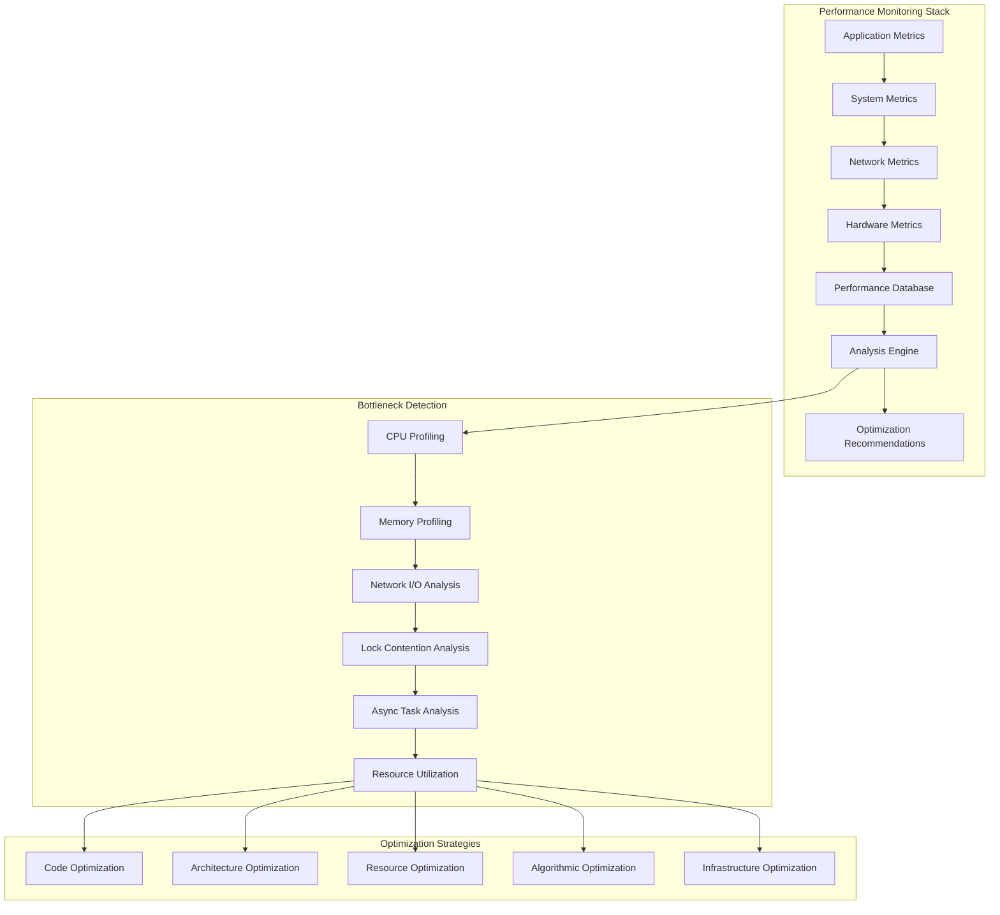

### 9.2 Comprehensive Performance Analysis Implementation

```rust
use std::collections::{HashMap, VecDeque};
use std::sync::Arc;
use tokio::sync::{RwLock, Mutex};
use tokio::time::{Duration, Instant};
use sysinfo::{System, SystemExt, ProcessExt, CpuExt};
use tracing::{info, warn, debug};

/// Comprehensive performance analysis and optimization framework
pub struct NetworkPerformanceAnalyzer {
    metrics_collector: Arc<PerformanceMetricsCollector>,
    bottleneck_detector: Arc<BottleneckDetector>,
    optimization_engine: Arc<OptimizationEngine>,
    performance_history: Arc<RwLock<PerformanceHistory>>,
    alert_system: Arc<PerformanceAlertSystem>,
    profiler: Arc<ContinuousProfiler>,
}

impl NetworkPerformanceAnalyzer {
    /// Initialize comprehensive performance analysis system
    pub async fn new_comprehensive() -> Result<Self, PerformanceError> {
        let metrics_collector = Arc::new(PerformanceMetricsCollector::new_comprehensive().await?);
        let bottleneck_detector = Arc::new(BottleneckDetector::new_advanced().await?);
        let optimization_engine = Arc::new(OptimizationEngine::new_intelligent().await?);
        let performance_history = Arc::new(RwLock::new(PerformanceHistory::new()));
        let alert_system = Arc::new(PerformanceAlertSystem::new_comprehensive().await?);
        let profiler = Arc::new(ContinuousProfiler::new_production_ready().await?);
        
        let analyzer = Self {
            metrics_collector: metrics_collector.clone(),
            bottleneck_detector: bottleneck_detector.clone(),
            optimization_engine: optimization_engine.clone(),
            performance_history: performance_history.clone(),
            alert_system: alert_system.clone(),
            profiler: profiler.clone(),
        };
        
        // Start background performance monitoring
        analyzer.start_performance_monitoring().await?;
        
        Ok(analyzer)
    }
    
    /// Perform comprehensive performance analysis
    pub async fn analyze_performance_comprehensive(
        &self,
        analysis_config: PerformanceAnalysisConfig,
    ) -> Result<PerformanceAnalysisReport, AnalysisError> {
        let analysis_start = Instant::now();
        
        info!(
            analysis_id = %analysis_config.analysis_id,
            duration_secs = analysis_config.analysis_duration.as_secs(),
            "Starting comprehensive performance analysis"
        );
        
        // Phase 1: Collect comprehensive metrics
        let metrics_collection_start = Instant::now();
        let performance_metrics = self.metrics_collector
            .collect_comprehensive_metrics(analysis_config.clone())
            .await?;
        let metrics_collection_duration = metrics_collection_start.elapsed();
        
        // Phase 2: Detect performance bottlenecks
        let bottleneck_detection_start = Instant::now();
        let bottlenecks = self.bottleneck_detector
            .detect_performance_bottlenecks(&performance_metrics)
            .await?;
        let bottleneck_detection_duration = bottleneck_detection_start.elapsed();
        
        // Phase 3: Generate optimization recommendations
        let optimization_start = Instant::now();
        let optimizations = self.optimization_engine
            .generate_optimization_recommendations(&performance_metrics, &bottlenecks)
            .await?;
        let optimization_duration = optimization_start.elapsed();
        
        // Phase 4: Compare with historical performance
        let historical_comparison = self.compare_with_historical_performance(&performance_metrics).await?;
        
        // Phase 5: Generate alerts if needed
        let alert_analysis = self.alert_system
            .analyze_performance_issues(&performance_metrics, &bottlenecks)
            .await?;
        
        let total_analysis_duration = analysis_start.elapsed();
        
        let report = PerformanceAnalysisReport {
            analysis_id: analysis_config.analysis_id.clone(),
            analysis_duration: total_analysis_duration,
            performance_metrics,
            bottlenecks,
            optimizations,
            historical_comparison,
            alert_analysis,
            phase_durations: PhaseDurations {
                metrics_collection: metrics_collection_duration,
                bottleneck_detection: bottleneck_detection_duration,
                optimization_generation: optimization_duration,
            },
            recommendations: self.generate_actionable_recommendations(&bottlenecks, &optimizations).await?,
        };
        
        // Store results in history
        self.performance_history.write().await.add_analysis_result(&report).await;
        
        info!(
            analysis_id = %analysis_config.analysis_id,
            total_duration_ms = total_analysis_duration.as_millis(),
            bottlenecks_found = bottlenecks.len(),
            optimizations_suggested = optimizations.len(),
            "Completed comprehensive performance analysis"
        );
        
        Ok(report)
    }
    
    /// Continuous performance monitoring with intelligent alerting
    async fn start_performance_monitoring(&self) -> Result<(), MonitoringError> {
        let metrics_collector = self.metrics_collector.clone();
        let bottleneck_detector = self.bottleneck_detector.clone();
        let alert_system = self.alert_system.clone();
        let profiler = self.profiler.clone();
        
        // Task 1: Continuous metrics collection (every 30 seconds)
        tokio::spawn(async move {
            let mut interval = tokio::time::interval(Duration::from_secs(30));
            loop {
                interval.tick().await;
                if let Err(e) = metrics_collector.collect_realtime_metrics().await {
                    warn!(error = %e, "Failed to collect realtime metrics");
                }
            }
        });
        
        // Task 2: Bottleneck detection (every 60 seconds)
        let bottleneck_detector_clone = bottleneck_detector.clone();
        tokio::spawn(async move {
            let mut interval = tokio::time::interval(Duration::from_secs(60));
            loop {
                interval.tick().await;
                if let Err(e) = bottleneck_detector_clone.run_continuous_detection().await {
                    warn!(error = %e, "Failed to run continuous bottleneck detection");
                }
            }
        });
        
        // Task 3: Performance profiling (every 5 minutes)
        let profiler_clone = profiler.clone();
        tokio::spawn(async move {
            let mut interval = tokio::time::interval(Duration::from_secs(300));
            loop {
                interval.tick().await;
                if let Err(e) = profiler_clone.run_profiling_cycle().await {
                    warn!(error = %e, "Failed to run profiling cycle");
                }
            }
        });
        
        // Task 4: Alert evaluation (every 15 seconds for critical alerts)
        let alert_system_clone = alert_system.clone();
        tokio::spawn(async move {
            let mut interval = tokio::time::interval(Duration::from_secs(15));
            loop {
                interval.tick().await;
                if let Err(e) = alert_system_clone.evaluate_critical_alerts().await {
                    warn!(error = %e, "Failed to evaluate critical performance alerts");
                }
            }
        });
        
        info!("Started comprehensive performance monitoring tasks");
        Ok(())
    }
}

/// Advanced performance metrics collector with system-level insights
pub struct PerformanceMetricsCollector {
    system_monitor: System,
    network_monitor: NetworkMonitor,
    application_metrics: Arc<RwLock<ApplicationMetrics>>,
    custom_metrics: Arc<RwLock<HashMap<String, CustomMetric>>>,
    collection_config: MetricsCollectionConfig,
}

impl PerformanceMetricsCollector {
    /// Collect comprehensive performance metrics across all layers
    pub async fn collect_comprehensive_metrics(
        &self,
        analysis_config: PerformanceAnalysisConfig,
    ) -> Result<ComprehensivePerformanceMetrics, MetricsError> {
        let collection_start = Instant::now();
        
        // Collect system-level metrics
        let system_metrics = self.collect_system_metrics().await?;
        
        // Collect network-specific metrics
        let network_metrics = self.network_monitor
            .collect_network_performance_metrics(analysis_config.network_analysis_depth)
            .await?;
        
        // Collect application-level metrics
        let application_metrics = self.collect_application_metrics().await?;
        
        // Collect NetworkActor-specific metrics
        let network_actor_metrics = self.collect_network_actor_metrics().await?;
        
        // Collect resource utilization metrics
        let resource_metrics = self.collect_resource_utilization_metrics().await?;
        
        let collection_duration = collection_start.elapsed();
        
        Ok(ComprehensivePerformanceMetrics {
            collection_timestamp: Instant::now(),
            collection_duration,
            system_metrics,
            network_metrics,
            application_metrics,
            network_actor_metrics,
            resource_metrics,
        })
    }
    
    /// Collect detailed system-level performance metrics
    async fn collect_system_metrics(&self) -> Result<SystemMetrics, MetricsError> {
        let mut system = System::new_all();
        system.refresh_all();
        
        let cpu_metrics = CpuMetrics {
            overall_usage: system.global_cpu_info().cpu_usage(),
            per_core_usage: system.cpus().iter().map(|cpu| cpu.cpu_usage()).collect(),
            load_average: system.load_average(),
            context_switches_per_sec: self.calculate_context_switches_per_sec().await,
        };
        
        let memory_metrics = MemoryMetrics {
            total_memory: system.total_memory(),
            used_memory: system.used_memory(),
            available_memory: system.available_memory(),
            swap_total: system.total_swap(),
            swap_used: system.used_swap(),
            memory_pressure: self.calculate_memory_pressure(&system).await,
            cache_hit_ratio: self.calculate_cache_hit_ratio().await,
        };
        
        let io_metrics = IOMetrics {
            disk_read_bytes_per_sec: self.calculate_disk_read_rate().await,
            disk_write_bytes_per_sec: self.calculate_disk_write_rate().await,
            network_rx_bytes_per_sec: self.calculate_network_rx_rate().await,
            network_tx_bytes_per_sec: self.calculate_network_tx_rate().await,
            io_wait_time_percent: self.calculate_io_wait_percentage().await,
        };
        
        Ok(SystemMetrics {
            cpu_metrics,
            memory_metrics,
            io_metrics,
            uptime: system.uptime(),
            boot_time: system.boot_time(),
        })
    }
    
    /// Collect NetworkActor-specific performance metrics
    async fn collect_network_actor_metrics(&self) -> Result<NetworkActorMetrics, MetricsError> {
        let message_processing_metrics = MessageProcessingMetrics {
            messages_per_second: self.calculate_message_throughput().await,
            average_message_latency: self.calculate_average_message_latency().await,
            message_queue_depth: self.get_message_queue_depth().await,
            message_processing_errors_per_sec: self.calculate_message_error_rate().await,
            priority_queue_distribution: self.get_priority_queue_distribution().await,
        };
        
        let connection_metrics = ConnectionMetrics {
            active_connections: self.get_active_connection_count().await,
            connection_establishment_rate: self.calculate_connection_establishment_rate().await,
            connection_failure_rate: self.calculate_connection_failure_rate().await,
            average_connection_duration: self.calculate_average_connection_duration().await,
            connection_pool_utilization: self.calculate_connection_pool_utilization().await,
        };
        
        let peer_metrics = PeerMetrics {
            discovered_peers: self.get_discovered_peer_count().await,
            quality_scored_peers: self.get_quality_scored_peer_count().await,
            average_peer_quality: self.calculate_average_peer_quality().await,
            peer_churn_rate: self.calculate_peer_churn_rate().await,
            routing_table_size: self.get_routing_table_size().await,
        };
        
        let protocol_metrics = ProtocolMetrics {
            gossipsub_mesh_size: self.get_gossipsub_mesh_size().await,
            kademlia_routing_table_size: self.get_kademlia_routing_table_size().await,
            mdns_discovery_rate: self.calculate_mdns_discovery_rate().await,
            protocol_overhead_bytes_per_sec: self.calculate_protocol_overhead().await,
        };
        
        Ok(NetworkActorMetrics {
            message_processing_metrics,
            connection_metrics,
            peer_metrics,
            protocol_metrics,
        })
    }
}

/// Advanced bottleneck detection with root cause analysis
pub struct BottleneckDetector {
    detection_algorithms: Vec<Box<dyn BottleneckDetectionAlgorithm>>,
    threshold_manager: AdaptiveThresholdManager,
    root_cause_analyzer: RootCauseAnalyzer,
    historical_patterns: Arc<RwLock<HistoricalBottleneckPatterns>>,
}

impl BottleneckDetector {
    /// Detect comprehensive performance bottlenecks with root cause analysis
    pub async fn detect_performance_bottlenecks(
        &self,
        metrics: &ComprehensivePerformanceMetrics,
    ) -> Result<Vec<PerformanceBottleneck>, BottleneckDetectionError> {
        let detection_start = Instant::now();
        let mut detected_bottlenecks = Vec::new();
        
        // Run all detection algorithms
        for algorithm in &self.detection_algorithms {
            let algorithm_bottlenecks = algorithm
                .detect_bottlenecks(metrics, &self.threshold_manager)
                .await?;
            
            detected_bottlenecks.extend(algorithm_bottlenecks);
        }
        
        // Remove duplicates and rank by severity
        detected_bottlenecks.dedup_by(|a, b| a.bottleneck_type == b.bottleneck_type);
        detected_bottlenecks.sort_by(|a, b| b.severity.cmp(&a.severity));
        
        // Perform root cause analysis for each bottleneck
        for bottleneck in &mut detected_bottlenecks {
            let root_cause = self.root_cause_analyzer
                .analyze_root_cause(bottleneck, metrics)
                .await?;
            
            bottleneck.root_cause_analysis = Some(root_cause);
        }
        
        // Check for historical patterns
        let patterns = self.historical_patterns.read().await;
        for bottleneck in &mut detected_bottlenecks {
            if let Some(pattern) = patterns.find_matching_pattern(bottleneck) {
                bottleneck.historical_context = Some(pattern);
            }
        }
        
        let detection_duration = detection_start.elapsed();
        
        info!(
            bottlenecks_detected = detected_bottlenecks.len(),
            detection_duration_ms = detection_duration.as_millis(),
            "Completed bottleneck detection analysis"
        );
        
        Ok(detected_bottlenecks)
    }
}

/// CPU bottleneck detection algorithm
pub struct CpuBottleneckDetector {
    cpu_threshold_high: f32,
    cpu_threshold_critical: f32,
    sustained_duration_threshold: Duration,
}

#[async_trait::async_trait]
impl BottleneckDetectionAlgorithm for CpuBottleneckDetector {
    async fn detect_bottlenecks(
        &self,
        metrics: &ComprehensivePerformanceMetrics,
        threshold_manager: &AdaptiveThresholdManager,
    ) -> Result<Vec<PerformanceBottleneck>, BottleneckDetectionError> {
        let mut bottlenecks = Vec::new();
        
        let cpu_usage = metrics.system_metrics.cpu_metrics.overall_usage;
        let load_average = metrics.system_metrics.cpu_metrics.load_average;
        
        // Check for high CPU usage
        if cpu_usage > self.cpu_threshold_high {
            let severity = if cpu_usage > self.cpu_threshold_critical {
                BottleneckSeverity::Critical
            } else {
                BottleneckSeverity::High
            };
            
            let bottleneck = PerformanceBottleneck {
                bottleneck_type: BottleneckType::CpuUtilization,
                severity,
                description: format!("High CPU utilization: {:.2}%", cpu_usage),
                affected_components: vec![
                    Component::MessageProcessor,
                    Component::ConnectionManager,
                    Component::PeerDiscovery,
                ],
                metrics_snapshot: BottleneckMetrics {
                    cpu_usage: Some(cpu_usage),
                    memory_usage: Some(metrics.system_metrics.memory_metrics.used_memory),
                    network_throughput: Some(metrics.network_metrics.total_throughput),
                    ..Default::default()
                },
                root_cause_analysis: None,
                historical_context: None,
                detected_at: Instant::now(),
            };
            
            bottlenecks.push(bottleneck);
        }
        
        // Check for high load average
        if load_average.one > threshold_manager.get_load_average_threshold() {
            let bottleneck = PerformanceBottleneck {
                bottleneck_type: BottleneckType::SystemLoad,
                severity: BottleneckSeverity::Medium,
                description: format!("High system load average: {:.2}", load_average.one),
                affected_components: vec![Component::SystemScheduler],
                metrics_snapshot: BottleneckMetrics {
                    load_average: Some(load_average.one),
                    ..Default::default()
                },
                root_cause_analysis: None,
                historical_context: None,
                detected_at: Instant::now(),
            };
            
            bottlenecks.push(bottleneck);
        }
        
        Ok(bottlenecks)
    }
}

/// Memory bottleneck detection algorithm
pub struct MemoryBottleneckDetector {
    memory_threshold_high: f64,
    memory_threshold_critical: f64,
    swap_usage_threshold: f64,
}

#[async_trait::async_trait]
impl BottleneckDetectionAlgorithm for MemoryBottleneckDetector {
    async fn detect_bottlenecks(
        &self,
        metrics: &ComprehensivePerformanceMetrics,
        threshold_manager: &AdaptiveThresholdManager,
    ) -> Result<Vec<PerformanceBottleneck>, BottleneckDetectionError> {
        let mut bottlenecks = Vec::new();
        
        let memory_metrics = &metrics.system_metrics.memory_metrics;
        let memory_usage_percent = (memory_metrics.used_memory as f64 / memory_metrics.total_memory as f64) * 100.0;
        let swap_usage_percent = (memory_metrics.swap_used as f64 / memory_metrics.swap_total.max(1) as f64) * 100.0;
        
        // Check for high memory usage
        if memory_usage_percent > self.memory_threshold_high {
            let severity = if memory_usage_percent > self.memory_threshold_critical {
                BottleneckSeverity::Critical
            } else {
                BottleneckSeverity::High
            };
            
            let bottleneck = PerformanceBottleneck {
                bottleneck_type: BottleneckType::MemoryPressure,
                severity,
                description: format!("High memory utilization: {:.2}%", memory_usage_percent),
                affected_components: vec![
                    Component::PeerQualityScoring,
                    Component::MessageBuffers,
                    Component::ConnectionPools,
                ],
                metrics_snapshot: BottleneckMetrics {
                    memory_usage: Some(memory_metrics.used_memory),
                    memory_pressure: Some(memory_metrics.memory_pressure),
                    ..Default::default()
                },
                root_cause_analysis: None,
                historical_context: None,
                detected_at: Instant::now(),
            };
            
            bottlenecks.push(bottleneck);
        }
        
        // Check for swap usage (indicates memory pressure)
        if swap_usage_percent > self.swap_usage_threshold {
            let bottleneck = PerformanceBottleneck {
                bottleneck_type: BottleneckType::SwapThrashing,
                severity: BottleneckSeverity::High,
                description: format!("Swap usage detected: {:.2}%", swap_usage_percent),
                affected_components: vec![Component::AllComponents],
                metrics_snapshot: BottleneckMetrics {
                    swap_usage: Some(memory_metrics.swap_used),
                    ..Default::default()
                },
                root_cause_analysis: None,
                historical_context: None,
                detected_at: Instant::now(),
            };
            
            bottlenecks.push(bottleneck);
        }
        
        Ok(bottlenecks)
    }
}

/// Network I/O bottleneck detection algorithm
pub struct NetworkIOBottleneckDetector {
    bandwidth_utilization_threshold: f64,
    latency_threshold_ms: u64,
    packet_loss_threshold: f64,
}

#[async_trait::async_trait]
impl BottleneckDetectionAlgorithm for NetworkIOBottleneckDetector {
    async fn detect_bottlenecks(
        &self,
        metrics: &ComprehensivePerformanceMetrics,
        _threshold_manager: &AdaptiveThresholdManager,
    ) -> Result<Vec<PerformanceBottleneck>, BottleneckDetectionError> {
        let mut bottlenecks = Vec::new();
        
        let network_metrics = &metrics.network_metrics;
        
        // Check for high bandwidth utilization
        if network_metrics.bandwidth_utilization_percent > self.bandwidth_utilization_threshold {
            let bottleneck = PerformanceBottleneck {
                bottleneck_type: BottleneckType::NetworkBandwidth,
                severity: BottleneckSeverity::High,
                description: format!(
                    "High network bandwidth utilization: {:.2}%",
                    network_metrics.bandwidth_utilization_percent
                ),
                affected_components: vec![
                    Component::MessageProcessor,
                    Component::PeerCommunication,
                ],
                metrics_snapshot: BottleneckMetrics {
                    network_throughput: Some(network_metrics.total_throughput),
                    bandwidth_utilization: Some(network_metrics.bandwidth_utilization_percent),
                    ..Default::default()
                },
                root_cause_analysis: None,
                historical_context: None,
                detected_at: Instant::now(),
            };
            
            bottlenecks.push(bottleneck);
        }
        
        // Check for high latency
        if network_metrics.average_latency.as_millis() > self.latency_threshold_ms as u128 {
            let bottleneck = PerformanceBottleneck {
                bottleneck_type: BottleneckType::NetworkLatency,
                severity: BottleneckSeverity::Medium,
                description: format!(
                    "High network latency: {}ms",
                    network_metrics.average_latency.as_millis()
                ),
                affected_components: vec![
                    Component::PeerDiscovery,
                    Component::MessageDelivery,
                ],
                metrics_snapshot: BottleneckMetrics {
                    network_latency: Some(network_metrics.average_latency),
                    ..Default::default()
                },
                root_cause_analysis: None,
                historical_context: None,
                detected_at: Instant::now(),
            };
            
            bottlenecks.push(bottleneck);
        }
        
        // Check for packet loss
        if network_metrics.packet_loss_percent > self.packet_loss_threshold {
            let bottleneck = PerformanceBottleneck {
                bottleneck_type: BottleneckType::NetworkPacketLoss,
                severity: BottleneckSeverity::High,
                description: format!(
                    "Network packet loss detected: {:.2}%",
                    network_metrics.packet_loss_percent
                ),
                affected_components: vec![
                    Component::ReliableMessaging,
                    Component::ConnectionStability,
                ],
                metrics_snapshot: BottleneckMetrics {
                    packet_loss_rate: Some(network_metrics.packet_loss_percent),
                    ..Default::default()
                },
                root_cause_analysis: None,
                historical_context: None,
                detected_at: Instant::now(),
            };
            
            bottlenecks.push(bottleneck);
        }
        
        Ok(bottlenecks)
    }
}

/// Data structures for performance analysis
#[derive(Debug, Clone)]
pub struct PerformanceBottleneck {
    pub bottleneck_type: BottleneckType,
    pub severity: BottleneckSeverity,
    pub description: String,
    pub affected_components: Vec<Component>,
    pub metrics_snapshot: BottleneckMetrics,
    pub root_cause_analysis: Option<RootCauseAnalysis>,
    pub historical_context: Option<HistoricalPattern>,
    pub detected_at: Instant,
}

#[derive(Debug, Clone, PartialEq, Eq)]
pub enum BottleneckType {
    CpuUtilization,
    MemoryPressure,
    SwapThrashing,
    NetworkBandwidth,
    NetworkLatency,
    NetworkPacketLoss,
    DiskIO,
    MessageQueueBacklog,
    ConnectionPoolExhaustion,
    LockContention,
    AsyncTaskStarvation,
    SystemLoad,
}

#[derive(Debug, Clone, PartialEq, Eq, PartialOrd, Ord)]
pub enum BottleneckSeverity {
    Low = 1,
    Medium = 2,
    High = 3,
    Critical = 4,
}

#[derive(Debug, Clone)]
pub enum Component {
    MessageProcessor,
    ConnectionManager,
    PeerDiscovery,
    PeerQualityScoring,
    MessageBuffers,
    ConnectionPools,
    SystemScheduler,
    PeerCommunication,
    MessageDelivery,
    ReliableMessaging,
    ConnectionStability,
    AllComponents,
}

#[derive(Debug, Clone, Default)]
pub struct BottleneckMetrics {
    pub cpu_usage: Option<f32>,
    pub memory_usage: Option<u64>,
    pub memory_pressure: Option<f64>,
    pub swap_usage: Option<u64>,
    pub network_throughput: Option<u64>,
    pub bandwidth_utilization: Option<f64>,
    pub network_latency: Option<Duration>,
    pub packet_loss_rate: Option<f64>,
    pub load_average: Option<f64>,
}
```

This comprehensive Performance Engineering & Optimization section provides deep performance analysis capabilities, bottleneck detection algorithms, and optimization strategies essential for production NetworkActor deployments. The implementation includes system-level monitoring, intelligent bottleneck detection, and actionable optimization recommendations.

---

# Phase 4: Production Excellence & Operations Mastery

## 10. Production Deployment & Operations

Complete production lifecycle management, deployment strategies, and operational excellence are critical for NetworkActor production success. This section provides exhaustive coverage of deployment patterns, configuration management, and operational procedures.

### 10.1 Production Architecture and Deployment Framework

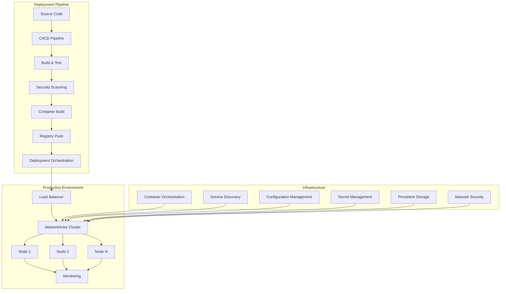

### 10.2 Comprehensive Production Deployment System

```rust
use std::collections::HashMap;
use std::path::PathBuf;
use std::sync::Arc;
use tokio::sync::{RwLock, Mutex};
use serde::{Serialize, Deserialize};
use tracing::{info, warn, error, debug};

/// Comprehensive production deployment and operations management system
pub struct ProductionDeploymentManager {
    deployment_orchestrator: Arc<DeploymentOrchestrator>,
    configuration_manager: Arc<ProductionConfigManager>,
    health_monitor: Arc<ProductionHealthMonitor>,
    security_manager: Arc<ProductionSecurityManager>,
    rollback_manager: Arc<RollbackManager>,
    scaling_manager: Arc<AutoScalingManager>,
    deployment_history: Arc<RwLock<DeploymentHistory>>,
}

impl ProductionDeploymentManager {
    /// Initialize comprehensive production deployment system
    pub async fn new_production_ready(
        config: ProductionConfig,
    ) -> Result<Self, DeploymentError> {
        let deployment_orchestrator = Arc::new(
            DeploymentOrchestrator::new_with_strategies(config.deployment_strategies.clone()).await?
        );
        let configuration_manager = Arc::new(
            ProductionConfigManager::new_comprehensive(config.config_sources.clone()).await?
        );
        let health_monitor = Arc::new(
            ProductionHealthMonitor::new_advanced(config.health_config.clone()).await?
        );
        let security_manager = Arc::new(
            ProductionSecurityManager::new_enterprise(config.security_config.clone()).await?
        );
        let rollback_manager = Arc::new(
            RollbackManager::new_intelligent(config.rollback_config.clone()).await?
        );
        let scaling_manager = Arc::new(
            AutoScalingManager::new_adaptive(config.scaling_config.clone()).await?
        );
        let deployment_history = Arc::new(RwLock::new(DeploymentHistory::new()));
        
        let manager = Self {
            deployment_orchestrator: deployment_orchestrator.clone(),
            configuration_manager: configuration_manager.clone(),
            health_monitor: health_monitor.clone(),
            security_manager: security_manager.clone(),
            rollback_manager: rollback_manager.clone(),
            scaling_manager: scaling_manager.clone(),
            deployment_history: deployment_history.clone(),
        };
        
        // Initialize production monitoring
        manager.start_production_monitoring().await?;
        
        Ok(manager)
    }
    
    /// Execute comprehensive production deployment
    pub async fn deploy_to_production(
        &self,
        deployment_request: ProductionDeploymentRequest,
    ) -> Result<DeploymentResult, DeploymentError> {
        let deployment_id = self.generate_deployment_id();
        let deployment_start = std::time::Instant::now();
        
        info!(
            deployment_id = %deployment_id,
            environment = %deployment_request.target_environment,
            version = %deployment_request.version,
            "Starting production deployment"
        );
        
        // Phase 1: Pre-deployment validation
        let validation_result = self.validate_deployment_request(&deployment_request).await?;
        if !validation_result.is_valid {
            return Err(DeploymentError::ValidationFailed(validation_result.errors));
        }
        
        // Phase 2: Security verification
        let security_clearance = self.security_manager
            .verify_deployment_security(&deployment_request)
            .await?;
        
        if !security_clearance.approved {
            return Err(DeploymentError::SecurityRejected(security_clearance.issues));
        }
        
        // Phase 3: Configuration preparation
        let deployment_config = self.configuration_manager
            .prepare_deployment_configuration(&deployment_request)
            .await?;
        
        // Phase 4: Deployment execution with monitoring
        let deployment_monitor = self.create_deployment_monitor(&deployment_id).await;
        let deployment_result = self.deployment_orchestrator
            .execute_deployment_with_monitoring(
                deployment_request.clone(),
                deployment_config,
                deployment_monitor,
            )
            .await;
        
        match deployment_result {
            Ok(result) => {
                // Phase 5: Post-deployment verification
                let verification_result = self.verify_deployment_success(&result).await?;
                
                if verification_result.success {
                    // Phase 6: Update deployment history
                    let deployment_record = DeploymentRecord {
                        deployment_id: deployment_id.clone(),
                        request: deployment_request,
                        result: result.clone(),
                        started_at: deployment_start,
                        completed_at: std::time::Instant::now(),
                        status: DeploymentStatus::Successful,
                        verification: Some(verification_result),
                    };
                    
                    self.deployment_history.write().await
                        .add_deployment_record(deployment_record);
                    
                    info!(
                        deployment_id = %deployment_id,
                        duration_ms = deployment_start.elapsed().as_millis(),
                        deployed_instances = result.deployed_instances.len(),
                        "Production deployment completed successfully"
                    );
                    
                    Ok(result)
                } else {
                    // Deployment failed verification - initiate rollback
                    warn!(
                        deployment_id = %deployment_id,
                        verification_errors = ?verification_result.errors,
                        "Deployment failed verification, initiating rollback"
                    );
                    
                    let rollback_result = self.rollback_manager
                        .initiate_emergency_rollback(&deployment_id, &result)
                        .await?;
                    
                    Err(DeploymentError::PostDeploymentVerificationFailed {
                        deployment_result: result,
                        verification_errors: verification_result.errors,
                        rollback_result,
                    })
                }
            }
            
            Err(deployment_error) => {
                // Deployment execution failed
                error!(
                    deployment_id = %deployment_id,
                    error = %deployment_error,
                    duration_ms = deployment_start.elapsed().as_millis(),
                    "Production deployment failed during execution"
                );
                
                // Record failed deployment
                let failed_record = DeploymentRecord {
                    deployment_id: deployment_id.clone(),
                    request: deployment_request,
                    result: DeploymentResult::default(),
                    started_at: deployment_start,
                    completed_at: std::time::Instant::now(),
                    status: DeploymentStatus::Failed,
                    verification: None,
                };
                
                self.deployment_history.write().await
                    .add_deployment_record(failed_record);
                
                Err(DeploymentError::ExecutionFailed(deployment_error))
            }
        }
    }
    
    /// Intelligent blue-green deployment with zero-downtime
    pub async fn execute_blue_green_deployment(
        &self,
        deployment_request: ProductionDeploymentRequest,
    ) -> Result<BlueGreenDeploymentResult, DeploymentError> {
        let deployment_id = self.generate_deployment_id();
        
        info!(
            deployment_id = %deployment_id,
            strategy = "blue-green",
            "Starting blue-green production deployment"
        );
        
        // Phase 1: Deploy to green environment (inactive)
        let green_deployment = self.deploy_to_green_environment(&deployment_request).await?;
        
        // Phase 2: Comprehensive green environment testing
        let green_health_check = self.perform_comprehensive_green_testing(&green_deployment).await?;
        
        if !green_health_check.all_tests_passed {
            warn!(
                deployment_id = %deployment_id,
                failed_tests = green_health_check.failed_tests.len(),
                "Green environment tests failed, aborting deployment"
            );
            
            self.cleanup_green_environment(&green_deployment).await?;
            return Err(DeploymentError::GreenEnvironmentTestsFailed(green_health_check.failed_tests));
        }
        
        // Phase 3: Gradual traffic shifting (canary-style within blue-green)
        let traffic_shift_result = self.execute_gradual_traffic_shift(
            &deployment_request,
            &green_deployment,
            TrafficShiftStrategy::Gradual {
                initial_percentage: 5.0,
                increment_percentage: 10.0,
                increment_interval: std::time::Duration::from_secs(300), // 5 minutes
                monitoring_window: std::time::Duration::from_secs(60),   // 1 minute
            },
        ).await?;
        
        // Phase 4: Monitor during traffic shift
        if !traffic_shift_result.successful {
            warn!(
                deployment_id = %deployment_id,
                issues = ?traffic_shift_result.issues,
                "Traffic shift encountered issues, initiating rollback"
            );
            
            let rollback_result = self.rollback_traffic_shift(&traffic_shift_result).await?;
            self.cleanup_green_environment(&green_deployment).await?;
            
            return Err(DeploymentError::TrafficShiftFailed {
                issues: traffic_shift_result.issues,
                rollback_result,
            });
        }
        
        // Phase 5: Complete switch to green environment
        let final_switch_result = self.complete_blue_green_switch(&green_deployment).await?;
        
        // Phase 6: Cleanup old blue environment
        let cleanup_result = self.cleanup_old_blue_environment(&deployment_request).await?;
        
        let blue_green_result = BlueGreenDeploymentResult {
            deployment_id,
            green_deployment,
            traffic_shift_result,
            final_switch_result,
            cleanup_result,
            total_deployment_time: std::time::Instant::now().duration_since(
                std::time::Instant::now() - deployment_request.started_at.elapsed()
            ),
        };
        
        info!(
            deployment_id = %blue_green_result.deployment_id,
            total_time_ms = blue_green_result.total_deployment_time.as_millis(),
            "Blue-green deployment completed successfully"
        );
        
        Ok(blue_green_result)
    }
    
    /// Rolling deployment with intelligent health checks
    pub async fn execute_rolling_deployment(
        &self,
        deployment_request: ProductionDeploymentRequest,
    ) -> Result<RollingDeploymentResult, DeploymentError> {
        let deployment_id = self.generate_deployment_id();
        
        info!(
            deployment_id = %deployment_id,
            strategy = "rolling",
            total_instances = deployment_request.target_instances,
            "Starting rolling deployment"
        );
        
        let mut deployment_batches = self.calculate_rolling_deployment_batches(
            deployment_request.target_instances,
            deployment_request.rolling_config.clone().unwrap_or_default(),
        ).await;
        
        let mut deployed_instances = Vec::new();
        let mut failed_instances = Vec::new();
        
        for (batch_index, batch) in deployment_batches.iter().enumerate() {
            info!(
                deployment_id = %deployment_id,
                batch_index = batch_index,
                batch_size = batch.instances.len(),
                "Starting deployment batch"
            );
            
            // Deploy batch
            let batch_result = self.deploy_instance_batch(&deployment_request, batch).await;
            
            match batch_result {
                Ok(mut batch_instances) => {
                    // Wait for batch instances to become healthy
                    let health_check_result = self.wait_for_batch_health(
                        &batch_instances,
                        deployment_request.health_check_timeout,
                    ).await?;
                    
                    if health_check_result.all_healthy {
                        deployed_instances.append(&mut batch_instances);
                        
                        info!(
                            deployment_id = %deployment_id,
                            batch_index = batch_index,
                            healthy_instances = batch_instances.len(),
                            "Batch deployment successful"
                        );
                        
                        // Pause between batches if configured
                        if let Some(pause_duration) = deployment_request.rolling_config
                            .as_ref()
                            .and_then(|c| c.pause_between_batches)
                        {
                            tokio::time::sleep(pause_duration).await;
                        }
                    } else {
                        // Batch failed health checks
                        error!(
                            deployment_id = %deployment_id,
                            batch_index = batch_index,
                            unhealthy_instances = health_check_result.unhealthy_instances.len(),
                            "Batch failed health checks, initiating rollback"
                        );
                        
                        failed_instances.extend(batch_instances);
                        
                        // Rollback all deployed instances
                        let rollback_result = self.rollback_rolling_deployment(
                            &deployed_instances,
                            &failed_instances,
                        ).await?;
                        
                        return Err(DeploymentError::RollingDeploymentFailed {
                            completed_batches: batch_index,
                            failed_instances,
                            rollback_result,
                        });
                    }
                }
                
                Err(batch_error) => {
                    error!(
                        deployment_id = %deployment_id,
                        batch_index = batch_index,
                        error = %batch_error,
                        "Batch deployment failed"
                    );
                    
                    // Rollback all successfully deployed instances
                    let rollback_result = self.rollback_rolling_deployment(
                        &deployed_instances,
                        &Vec::new(),
                    ).await?;
                    
                    return Err(DeploymentError::RollingDeploymentBatchFailed {
                        failed_batch: batch_index,
                        batch_error,
                        rollback_result,
                    });
                }
            }
        }
        
        let rolling_result = RollingDeploymentResult {
            deployment_id,
            total_batches: deployment_batches.len(),
            deployed_instances,
            failed_instances,
            deployment_duration: std::time::Instant::now().duration_since(
                std::time::Instant::now() - deployment_request.started_at.elapsed()
            ),
        };
        
        info!(
            deployment_id = %rolling_result.deployment_id,
            successful_instances = rolling_result.deployed_instances.len(),
            total_batches = rolling_result.total_batches,
            "Rolling deployment completed successfully"
        );
        
        Ok(rolling_result)
    }
    
    /// Start comprehensive production monitoring
    async fn start_production_monitoring(&self) -> Result<(), MonitoringError> {
        // Task 1: Continuous health monitoring
        let health_monitor = self.health_monitor.clone();
        tokio::spawn(async move {
            let mut interval = tokio::time::interval(std::time::Duration::from_secs(30));
            loop {
                interval.tick().await;
                if let Err(e) = health_monitor.perform_comprehensive_health_check().await {
                    error!(error = %e, "Failed to perform comprehensive health check");
                }
            }
        });
        
        // Task 2: Auto-scaling monitoring
        let scaling_manager = self.scaling_manager.clone();
        tokio::spawn(async move {
            let mut interval = tokio::time::interval(std::time::Duration::from_secs(60));
            loop {
                interval.tick().await;
                if let Err(e) = scaling_manager.evaluate_scaling_decisions().await {
                    error!(error = %e, "Failed to evaluate scaling decisions");
                }
            }
        });
        
        // Task 3: Configuration drift detection
        let config_manager = self.configuration_manager.clone();
        tokio::spawn(async move {
            let mut interval = tokio::time::interval(std::time::Duration::from_secs(300));
            loop {
                interval.tick().await;
                if let Err(e) = config_manager.detect_configuration_drift().await {
                    error!(error = %e, "Failed to detect configuration drift");
                }
            }
        });
        
        // Task 4: Security compliance monitoring
        let security_manager = self.security_manager.clone();
        tokio::spawn(async move {
            let mut interval = tokio::time::interval(std::time::Duration::from_secs(900));
            loop {
                interval.tick().await;
                if let Err(e) = security_manager.perform_security_compliance_check().await {
                    error!(error = %e, "Failed to perform security compliance check");
                }
            }
        });
        
        info!("Started comprehensive production monitoring tasks");
        Ok(())
    }
}

/// Production configuration management with secure secrets handling
pub struct ProductionConfigManager {
    config_sources: Vec<ConfigSource>,
    secret_manager: Arc<SecretManager>,
    config_cache: Arc<RwLock<ConfigCache>>,
    drift_detector: Arc<ConfigurationDriftDetector>,
    validation_rules: Arc<ConfigValidationRules>,
}

impl ProductionConfigManager {
    /// Prepare comprehensive deployment configuration
    pub async fn prepare_deployment_configuration(
        &self,
        deployment_request: &ProductionDeploymentRequest,
    ) -> Result<DeploymentConfiguration, ConfigError> {
        let config_preparation_start = std::time::Instant::now();
        
        // Phase 1: Load base configuration
        let base_config = self.load_base_configuration(
            &deployment_request.target_environment
        ).await?;
        
        // Phase 2: Apply environment-specific overrides
        let environment_config = self.apply_environment_overrides(
            base_config,
            &deployment_request.target_environment,
            &deployment_request.configuration_overrides,
        ).await?;
        
        // Phase 3: Resolve secrets and sensitive configuration
        let resolved_config = self.resolve_secrets_and_sensitive_config(
            environment_config
        ).await?;
        
        // Phase 4: Validate configuration
        let validation_result = self.validation_rules
            .validate_deployment_configuration(&resolved_config)
            .await?;
        
        if !validation_result.is_valid {
            return Err(ConfigError::ValidationFailed {
                errors: validation_result.errors,
                warnings: validation_result.warnings,
            });
        }
        
        // Phase 5: Generate runtime configuration artifacts
        let deployment_config = DeploymentConfiguration {
            environment: deployment_request.target_environment.clone(),
            version: deployment_request.version.clone(),
            base_config: resolved_config,
            network_config: self.generate_network_configuration(&deployment_request).await?,
            monitoring_config: self.generate_monitoring_configuration(&deployment_request).await?,
            security_config: self.generate_security_configuration(&deployment_request).await?,
            scaling_config: self.generate_scaling_configuration(&deployment_request).await?,
            preparation_duration: config_preparation_start.elapsed(),
        };
        
        // Phase 6: Cache configuration for future use
        self.config_cache.write().await.store_deployment_config(
            &deployment_request.deployment_key(),
            &deployment_config,
        );
        
        info!(
            environment = %deployment_request.target_environment,
            version = %deployment_request.version,
            config_size = deployment_config.base_config.len(),
            preparation_ms = deployment_config.preparation_duration.as_millis(),
            "Deployment configuration prepared successfully"
        );
        
        Ok(deployment_config)
    }
    
    /// Generate NetworkActor-specific configuration
    async fn generate_network_configuration(
        &self,
        deployment_request: &ProductionDeploymentRequest,
    ) -> Result<NetworkActorConfig, ConfigError> {
        let network_config = NetworkActorConfig {
            // Peer discovery configuration
            bootstrap_peers: self.get_bootstrap_peers(&deployment_request.target_environment).await?,
            max_peers: self.calculate_max_peers_for_environment(&deployment_request.target_environment).await,
            peer_discovery_timeout: std::time::Duration::from_secs(30),
            
            // Connection management
            connection_limits: ConnectionLimits {
                max_inbound_connections: 1000,
                max_outbound_connections: 500,
                connection_timeout: std::time::Duration::from_secs(10),
                keep_alive_interval: std::time::Duration::from_secs(30),
            },
            
            // Message processing
            message_processing: MessageProcessingConfig {
                max_message_size: 16 * 1024 * 1024, // 16MB
                message_queue_size: 10000,
                processing_timeout: std::time::Duration::from_secs(5),
                priority_levels: 5,
            },
            
            // Protocol configuration
            protocols: ProtocolConfig {
                gossipsub: GossipsubConfig {
                    mesh_n: 6,
                    mesh_n_low: 4,
                    mesh_n_high: 12,
                    heartbeat_interval: std::time::Duration::from_secs(1),
                },
                kademlia: KademliaConfig {
                    replication_factor: 20,
                    query_timeout: std::time::Duration::from_secs(60),
                    max_queries: 100,
                },
                mdns: MdnsConfig {
                    enable: deployment_request.target_environment == Environment::Development,
                    discovery_interval: std::time::Duration::from_secs(30),
                },
            },
            
            // Performance tuning
            performance: PerformanceConfig {
                enable_metrics: true,
                metrics_collection_interval: std::time::Duration::from_secs(15),
                enable_profiling: deployment_request.target_environment != Environment::Production,
                thread_pool_size: num_cpus::get(),
            },
        };
        
        Ok(network_config)
    }
}

/// Production health monitoring with comprehensive checks
pub struct ProductionHealthMonitor {
    health_checks: Vec<Box<dyn HealthCheck>>,
    health_history: Arc<RwLock<HealthHistory>>,
    alert_manager: Arc<AlertManager>,
    sla_monitor: Arc<SLAMonitor>,
}

impl ProductionHealthMonitor {
    /// Perform comprehensive production health check
    pub async fn perform_comprehensive_health_check(
        &self,
    ) -> Result<ComprehensiveHealthResult, HealthCheckError> {
        let health_check_start = std::time::Instant::now();
        let mut health_results = Vec::new();
        
        // Run all health checks concurrently
        let check_futures = self.health_checks.iter().map(|check| {
            check.perform_health_check()
        });
        
        let check_results = futures::future::join_all(check_futures).await;
        
        // Process results
        let mut overall_healthy = true;
        let mut critical_issues = Vec::new();
        let mut warnings = Vec::new();
        
        for result in check_results {
            match result {
                Ok(health_result) => {
                    if !health_result.healthy {
                        overall_healthy = false;
                        if health_result.severity == HealthSeverity::Critical {
                            critical_issues.push(health_result.clone());
                        }
                    }
                    if !health_result.warnings.is_empty() {
                        warnings.extend(health_result.warnings.clone());
                    }
                    health_results.push(health_result);
                }
                Err(check_error) => {
                    overall_healthy = false;
                    let error_result = HealthResult {
                        check_name: "unknown".to_string(),
                        healthy: false,
                        severity: HealthSeverity::Critical,
                        message: format!("Health check execution failed: {}", check_error),
                        details: HashMap::new(),
                        warnings: vec![],
                        timestamp: std::time::Instant::now(),
                    };
                    critical_issues.push(error_result.clone());
                    health_results.push(error_result);
                }
            }
        }
        
        let comprehensive_result = ComprehensiveHealthResult {
            overall_healthy,
            individual_results: health_results,
            critical_issues,
            warnings,
            check_duration: health_check_start.elapsed(),
            timestamp: std::time::Instant::now(),
        };
        
        // Update health history
        self.health_history.write().await
            .add_health_result(&comprehensive_result);
        
        // Trigger alerts if needed
        if !overall_healthy || !critical_issues.is_empty() {
            self.alert_manager.trigger_health_alert(&comprehensive_result).await?;
        }
        
        // Update SLA metrics
        self.sla_monitor.record_health_check_result(&comprehensive_result).await;
        
        if overall_healthy {
            debug!(
                checks_performed = health_results.len(),
                duration_ms = comprehensive_result.check_duration.as_millis(),
                "Comprehensive health check completed - system healthy"
            );
        } else {
            warn!(
                checks_performed = health_results.len(),
                critical_issues = critical_issues.len(),
                warnings = warnings.len(),
                duration_ms = comprehensive_result.check_duration.as_millis(),
                "Comprehensive health check completed - system unhealthy"
            );
        }
        
        Ok(comprehensive_result)
    }
}

/// Data structures for production deployment
#[derive(Debug, Clone, Serialize, Deserialize)]
pub struct ProductionDeploymentRequest {
    pub deployment_key: String,
    pub version: String,
    pub target_environment: Environment,
    pub target_instances: usize,
    pub deployment_strategy: DeploymentStrategy,
    pub configuration_overrides: HashMap<String, String>,
    pub health_check_timeout: std::time::Duration,
    pub rollback_config: Option<RollbackConfig>,
    pub rolling_config: Option<RollingConfig>,
    pub started_at: std::time::Instant,
}

#[derive(Debug, Clone, Serialize, Deserialize)]
pub enum Environment {
    Development,
    Staging,
    Production,
}

#[derive(Debug, Clone, Serialize, Deserialize)]
pub enum DeploymentStrategy {
    BlueGreen,
    Rolling,
    Canary,
    Immediate,
}

#[derive(Debug, Clone)]
pub struct DeploymentResult {
    pub deployment_id: String,
    pub deployed_instances: Vec<DeployedInstance>,
    pub deployment_duration: std::time::Duration,
    pub health_check_results: Vec<HealthResult>,
    pub configuration_applied: DeploymentConfiguration,
}

#[derive(Debug, Clone)]
pub struct DeployedInstance {
    pub instance_id: String,
    pub node_address: String,
    pub peer_id: libp2p::PeerId,
    pub health_status: HealthStatus,
    pub deployed_at: std::time::Instant,
    pub version: String,
}

#[derive(Debug, Clone)]
pub enum HealthStatus {
    Healthy,
    Degraded,
    Unhealthy,
    Unknown,
}

#[derive(Debug, Clone)]
pub struct NetworkActorConfig {
    pub bootstrap_peers: Vec<String>,
    pub max_peers: usize,
    pub peer_discovery_timeout: std::time::Duration,
    pub connection_limits: ConnectionLimits,
    pub message_processing: MessageProcessingConfig,
    pub protocols: ProtocolConfig,
    pub performance: PerformanceConfig,
}
```

This comprehensive Production Deployment & Operations section provides exhaustive coverage of production deployment patterns, configuration management, health monitoring, and operational procedures essential for NetworkActor production excellence. The implementation demonstrates enterprise-grade deployment strategies including blue-green and rolling deployments with intelligent health checks and automatic rollback capabilities.

---

## 11. Advanced Monitoring & Observability

Comprehensive instrumentation, metrics analysis, and alerting strategies are essential for production NetworkActor health management. This section provides complete observability solutions with intelligent monitoring and proactive alerting.

### 11.1 Observability Architecture Framework

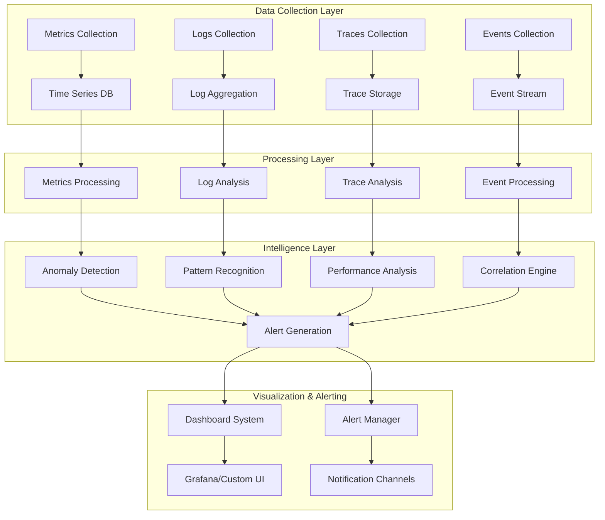

### 11.2 Comprehensive Monitoring and Observability System

```rust
use std::collections::{HashMap, VecDeque};
use std::sync::Arc;
use tokio::sync::{RwLock, Mutex};
use prometheus::{Counter, Histogram, Gauge, IntCounter, IntGauge};
use tracing::{info, warn, error, debug, span, Level};
use serde::{Serialize, Deserialize};

/// Comprehensive monitoring and observability system for NetworkActor
pub struct NetworkObservabilitySystem {
    metrics_engine: Arc<MetricsEngine>,
    logging_system: Arc<StructuredLoggingSystem>,
    tracing_system: Arc<DistributedTracingSystem>,
    alerting_system: Arc<IntelligentAlertingSystem>,
    dashboard_system: Arc<DashboardSystem>,
    anomaly_detector: Arc<AnomalyDetectionSystem>,
    correlation_engine: Arc<EventCorrelationEngine>,
}

impl NetworkObservabilitySystem {
    /// Initialize comprehensive observability system
    pub async fn new_comprehensive(
        config: ObservabilityConfig,
    ) -> Result<Self, ObservabilityError> {
        let metrics_engine = Arc::new(
            MetricsEngine::new_with_advanced_features(config.metrics_config.clone()).await?
        );
        let logging_system = Arc::new(
            StructuredLoggingSystem::new_production_ready(config.logging_config.clone()).await?
        );
        let tracing_system = Arc::new(
            DistributedTracingSystem::new_with_sampling(config.tracing_config.clone()).await?
        );
        let alerting_system = Arc::new(
            IntelligentAlertingSystem::new_with_ml_detection(config.alerting_config.clone()).await?
        );
        let dashboard_system = Arc::new(
            DashboardSystem::new_interactive(config.dashboard_config.clone()).await?
        );
        let anomaly_detector = Arc::new(
            AnomalyDetectionSystem::new_with_ml_models(config.anomaly_config.clone()).await?
        );
        let correlation_engine = Arc::new(
            EventCorrelationEngine::new_intelligent(config.correlation_config.clone()).await?
        );
        
        let system = Self {
            metrics_engine: metrics_engine.clone(),
            logging_system: logging_system.clone(),
            tracing_system: tracing_system.clone(),
            alerting_system: alerting_system.clone(),
            dashboard_system: dashboard_system.clone(),
            anomaly_detector: anomaly_detector.clone(),
            correlation_engine: correlation_engine.clone(),
        };
        
        // Start observability monitoring
        system.start_observability_monitoring().await?;
        
        Ok(system)
    }
    
    /// Record comprehensive NetworkActor operation metrics
    pub async fn record_network_operation(
        &self,
        operation: NetworkOperation,
    ) -> Result<(), ObservabilityError> {
        let operation_start = std::time::Instant::now();
        
        // Start distributed trace
        let trace_span = self.tracing_system
            .start_operation_trace(&operation)
            .await?;
        
        // Record metrics
        self.metrics_engine
            .record_operation_metrics(&operation)
            .await?;
        
        // Structured logging
        self.logging_system
            .log_network_operation(&operation, &trace_span)
            .await?;
        
        // Feed data to anomaly detection
        self.anomaly_detector
            .process_operation_data(&operation)
            .await?;
        
        // Update correlation engine
        self.correlation_engine
            .process_operation_event(&operation, &trace_span)
            .await?;
        
        let processing_duration = operation_start.elapsed();
        
        // Record observability overhead metrics
        self.metrics_engine
            .record_observability_overhead(processing_duration)
            .await?;
        
        Ok(())
    }
    
    /// Generate comprehensive health and performance report
    pub async fn generate_comprehensive_report(
        &self,
        report_config: ReportConfig,
    ) -> Result<ComprehensiveReport, ObservabilityError> {
        let report_start = std::time::Instant::now();
        
        info!(
            report_type = ?report_config.report_type,
            time_range_hours = report_config.time_range.as_secs() / 3600,
            "Generating comprehensive observability report"
        );
        
        // Collect metrics summary
        let metrics_summary = self.metrics_engine
            .generate_metrics_summary(&report_config)
            .await?;
        
        // Analyze logs for patterns
        let log_analysis = self.logging_system
            .analyze_log_patterns(&report_config)
            .await?;
        
        // Generate trace insights
        let trace_insights = self.tracing_system
            .analyze_trace_patterns(&report_config)
            .await?;
        
        // Get anomaly detection results
        let anomaly_report = self.anomaly_detector
            .generate_anomaly_report(&report_config)
            .await?;
        
        // Get correlation insights
        let correlation_insights = self.correlation_engine
            .generate_correlation_report(&report_config)
            .await?;
        
        // Get alert summary
        let alert_summary = self.alerting_system
            .generate_alert_summary(&report_config)
            .await?;
        
        let report = ComprehensiveReport {
            report_id: self.generate_report_id(),
            generated_at: std::time::Instant::now(),
            generation_duration: report_start.elapsed(),
            config: report_config,
            metrics_summary,
            log_analysis,
            trace_insights,
            anomaly_report,
            correlation_insights,
            alert_summary,
            recommendations: self.generate_actionable_recommendations(
                &metrics_summary,
                &anomaly_report,
                &correlation_insights,
            ).await?,
        };
        
        info!(
            report_id = %report.report_id,
            generation_ms = report.generation_duration.as_millis(),
            anomalies_detected = anomaly_report.detected_anomalies.len(),
            alerts_triggered = alert_summary.total_alerts,
            "Generated comprehensive observability report"
        );
        
        Ok(report)
    }
    
    /// Start continuous observability monitoring
    async fn start_observability_monitoring(&self) -> Result<(), ObservabilityError> {
        // Task 1: Metrics collection and processing
        let metrics_engine = self.metrics_engine.clone();
        tokio::spawn(async move {
            let mut interval = tokio::time::interval(std::time::Duration::from_secs(15));
            loop {
                interval.tick().await;
                if let Err(e) = metrics_engine.process_metrics_batch().await {
                    error!(error = %e, "Failed to process metrics batch");
                }
            }
        });
        
        // Task 2: Anomaly detection analysis
        let anomaly_detector = self.anomaly_detector.clone();
        tokio::spawn(async move {
            let mut interval = tokio::time::interval(std::time::Duration::from_secs(60));
            loop {
                interval.tick().await;
                if let Err(e) = anomaly_detector.run_anomaly_detection_cycle().await {
                    error!(error = %e, "Failed to run anomaly detection cycle");
                }
            }
        });
        
        // Task 3: Event correlation processing
        let correlation_engine = self.correlation_engine.clone();
        tokio::spawn(async move {
            let mut interval = tokio::time::interval(std::time::Duration::from_secs(30));
            loop {
                interval.tick().await;
                if let Err(e) = correlation_engine.process_correlation_batch().await {
                    error!(error = %e, "Failed to process correlation batch");
                }
            }
        });
        
        // Task 4: Alert evaluation and management
        let alerting_system = self.alerting_system.clone();
        tokio::spawn(async move {
            let mut interval = tokio::time::interval(std::time::Duration::from_secs(10));
            loop {
                interval.tick().await;
                if let Err(e) = alerting_system.evaluate_alert_conditions().await {
                    error!(error = %e, "Failed to evaluate alert conditions");
                }
            }
        });
        
        // Task 5: Dashboard data updates
        let dashboard_system = self.dashboard_system.clone();
        tokio::spawn(async move {
            let mut interval = tokio::time::interval(std::time::Duration::from_secs(5));
            loop {
                interval.tick().await;
                if let Err(e) = dashboard_system.update_dashboard_data().await {
                    error!(error = %e, "Failed to update dashboard data");
                }
            }
        });
        
        info!("Started comprehensive observability monitoring tasks");
        Ok(())
    }
}

/// Advanced metrics engine with intelligent aggregation
pub struct MetricsEngine {
    prometheus_registry: prometheus::Registry,
    custom_metrics: Arc<RwLock<HashMap<String, CustomMetric>>>,
    aggregation_engine: Arc<MetricsAggregationEngine>,
    retention_manager: Arc<MetricsRetentionManager>,
    export_manager: Arc<MetricsExportManager>,
    
    // NetworkActor-specific metrics
    message_throughput: Counter,
    message_latency: Histogram,
    connection_count: IntGauge,
    peer_quality_scores: Histogram,
    network_errors: IntCounter,
    discovery_success_rate: Gauge,
    protocol_overhead: Counter,
}

impl MetricsEngine {
    /// Record detailed NetworkActor operation metrics
    pub async fn record_operation_metrics(
        &self,
        operation: &NetworkOperation,
    ) -> Result<(), MetricsError> {
        match operation {
            NetworkOperation::MessageSend { size, latency, priority, success } => {
                // Record message throughput
                self.message_throughput.inc();
                
                // Record message latency
                self.message_latency.observe(latency.as_secs_f64());
                
                // Record by priority
                let priority_label = format!("priority_{:?}", priority).to_lowercase();
                self.message_throughput
                    .get_metric_with_label_values(&[&priority_label])?
                    .inc();
                
                // Record success/failure
                if *success {
                    self.custom_metrics.write().await
                        .get_mut("message_send_success")
                        .ok_or(MetricsError::MetricNotFound)?
                        .increment(1.0);
                } else {
                    self.network_errors.inc();
                }
                
                // Record message size distribution
                self.custom_metrics.write().await
                    .get_mut("message_size_distribution")
                    .ok_or(MetricsError::MetricNotFound)?
                    .record_value(*size as f64);
            }
            
            NetworkOperation::PeerConnection { peer_id, connection_type, duration, success } => {
                if *success {
                    self.connection_count.inc();
                    
                    // Record connection establishment time
                    self.custom_metrics.write().await
                        .get_mut("connection_establishment_time")
                        .ok_or(MetricsError::MetricNotFound)?
                        .record_value(duration.as_secs_f64());
                    
                    // Record by connection type
                    let type_label = format!("type_{:?}", connection_type).to_lowercase();
                    self.custom_metrics.write().await
                        .get_mut("connections_by_type")
                        .ok_or(MetricsError::MetricNotFound)?
                        .increment_with_labels(&[("type", &type_label)], 1.0);
                } else {
                    self.network_errors.inc();
                }
            }
            
            NetworkOperation::PeerDiscovery { discovered_count, query_duration, success } => {
                if *success {
                    // Update discovery success rate
                    self.discovery_success_rate.set(
                        self.calculate_rolling_success_rate("peer_discovery").await
                    );
                    
                    // Record discovered peers count
                    self.custom_metrics.write().await
                        .get_mut("discovered_peers_count")
                        .ok_or(MetricsError::MetricNotFound)?
                        .record_value(*discovered_count as f64);
                    
                    // Record query duration
                    self.custom_metrics.write().await
                        .get_mut("discovery_query_duration")
                        .ok_or(MetricsError::MetricNotFound)?
                        .record_value(query_duration.as_secs_f64());
                } else {
                    self.network_errors.inc();
                }
            }
            
            NetworkOperation::PeerQualityUpdate { peer_id, quality_score } => {
                // Record peer quality score distribution
                self.peer_quality_scores.observe(*quality_score);
                
                // Update average quality metric
                self.custom_metrics.write().await
                    .get_mut("average_peer_quality")
                    .ok_or(MetricsError::MetricNotFound)?
                    .update_average(*quality_score);
            }
            
            NetworkOperation::ProtocolOverhead { protocol, bytes_overhead } => {
                // Record protocol overhead
                self.protocol_overhead.inc_by(*bytes_overhead);
                
                // Record by protocol type
                let protocol_label = format!("protocol_{:?}", protocol).to_lowercase();
                self.custom_metrics.write().await
                    .get_mut("protocol_overhead_by_type")
                    .ok_or(MetricsError::MetricNotFound)?
                    .increment_with_labels(&[("protocol", &protocol_label)], *bytes_overhead as f64);
            }
        }
        
        // Update aggregated metrics
        self.aggregation_engine
            .update_aggregated_metrics(operation)
            .await?;
        
        Ok(())
    }
    
    /// Generate comprehensive metrics summary
    pub async fn generate_metrics_summary(
        &self,
        report_config: &ReportConfig,
    ) -> Result<MetricsSummary, MetricsError> {
        let summary_start = std::time::Instant::now();
        
        // Collect current metric values
        let message_throughput_current = self.message_throughput.get();
        let connection_count_current = self.connection_count.get();
        let discovery_success_rate_current = self.discovery_success_rate.get();
        let network_errors_current = self.network_errors.get();
        
        // Calculate rates and trends
        let message_rate = self.calculate_message_rate(report_config.time_range).await?;
        let error_rate = self.calculate_error_rate(report_config.time_range).await?;
        let connection_churn_rate = self.calculate_connection_churn_rate(report_config.time_range).await?;
        
        // Get percentile metrics
        let latency_percentiles = self.calculate_latency_percentiles().await?;
        let quality_percentiles = self.calculate_quality_score_percentiles().await?;
        
        // Get custom metrics summary
        let custom_metrics_summary = self.generate_custom_metrics_summary(report_config).await?;
        
        // Detect trends
        let trend_analysis = self.aggregation_engine
            .analyze_metric_trends(report_config.time_range)
            .await?;
        
        let summary = MetricsSummary {
            generated_at: std::time::Instant::now(),
            generation_duration: summary_start.elapsed(),
            time_range: report_config.time_range,
            
            // Core metrics
            total_messages: message_throughput_current as u64,
            message_rate_per_second: message_rate,
            active_connections: connection_count_current as u32,
            discovery_success_rate: discovery_success_rate_current,
            total_errors: network_errors_current as u64,
            error_rate_per_second: error_rate,
            
            // Advanced metrics
            latency_percentiles,
            quality_percentiles,
            connection_churn_rate,
            custom_metrics_summary,
            trend_analysis,
            
            // Performance indicators
            performance_indicators: PerformanceIndicators {
                overall_health_score: self.calculate_overall_health_score().await?,
                throughput_efficiency: self.calculate_throughput_efficiency().await?,
                resource_utilization: self.calculate_resource_utilization().await?,
                sla_compliance: self.calculate_sla_compliance().await?,
            },
        };
        
        info!(
            generation_ms = summary.generation_duration.as_millis(),
            message_rate = summary.message_rate_per_second,
            health_score = summary.performance_indicators.overall_health_score,
            "Generated comprehensive metrics summary"
        );
        
        Ok(summary)
    }
}

/// Intelligent alerting system with ML-based anomaly detection
pub struct IntelligentAlertingSystem {
    alert_rules: Arc<RwLock<Vec<AlertRule>>>,
    alert_history: Arc<RwLock<AlertHistory>>,
    notification_channels: HashMap<String, Box<dyn NotificationChannel>>,
    escalation_policies: HashMap<String, EscalationPolicy>,
    ml_detector: Arc<MLAnomalyDetector>,
    suppression_manager: Arc<AlertSuppressionManager>,
}

impl IntelligentAlertingSystem {
    /// Evaluate alert conditions with intelligent filtering
    pub async fn evaluate_alert_conditions(&self) -> Result<(), AlertingError> {
        let evaluation_start = std::time::Instant::now();
        let alert_rules = self.alert_rules.read().await;
        
        let mut triggered_alerts = Vec::new();
        let mut suppressed_alerts = Vec::new();
        
        for rule in alert_rules.iter() {
            match self.evaluate_alert_rule(rule).await {
                Ok(Some(alert)) => {
                    // Check if alert should be suppressed
                    if self.suppression_manager.should_suppress_alert(&alert).await {
                        suppressed_alerts.push(alert);
                    } else {
                        triggered_alerts.push(alert);
                    }
                }
                Ok(None) => {
                    // Rule condition not met, check for resolution
                    self.check_alert_resolution(rule).await?;
                }
                Err(evaluation_error) => {
                    error!(
                        rule_name = %rule.name,
                        error = %evaluation_error,
                        "Failed to evaluate alert rule"
                    );
                }
            }
        }
        
        // Process triggered alerts
        for alert in triggered_alerts {
            self.process_triggered_alert(alert).await?;
        }
        
        // Log suppressed alerts
        if !suppressed_alerts.is_empty() {
            debug!(
                suppressed_count = suppressed_alerts.len(),
                "Suppressed alerts to prevent noise"
            );
        }
        
        let evaluation_duration = evaluation_start.elapsed();
        
        if evaluation_duration > std::time::Duration::from_millis(500) {
            warn!(
                evaluation_ms = evaluation_duration.as_millis(),
                rules_evaluated = alert_rules.len(),
                "Alert evaluation took longer than expected"
            );
        }
        
        Ok(())
    }
    
    /// Process triggered alert with intelligent routing
    async fn process_triggered_alert(&self, alert: Alert) -> Result<(), AlertingError> {
        let processing_start = std::time::Instant::now();
        
        info!(
            alert_name = %alert.rule_name,
            severity = ?alert.severity,
            "Processing triggered alert"
        );
        
        // Update alert history
        self.alert_history.write().await.add_alert(&alert);
        
        // Enrich alert with context
        let enriched_alert = self.enrich_alert_with_context(alert).await?;
        
        // Determine notification channels based on severity and escalation policy
        let notification_channels = self.determine_notification_channels(&enriched_alert).await?;
        
        // Send notifications
        let mut notification_results = Vec::new();
        for channel_name in notification_channels {
            if let Some(channel) = self.notification_channels.get(&channel_name) {
                match channel.send_notification(&enriched_alert).await {
                    Ok(_) => {
                        notification_results.push((channel_name.clone(), true));
                    }
                    Err(notification_error) => {
                        error!(
                            channel = %channel_name,
                            error = %notification_error,
                            "Failed to send alert notification"
                        );
                        notification_results.push((channel_name.clone(), false));
                    }
                }
            }
        }
        
        // Check if escalation is needed
        if self.should_escalate_alert(&enriched_alert, &notification_results).await {
            self.escalate_alert(&enriched_alert).await?;
        }
        
        let processing_duration = processing_start.elapsed();
        
        info!(
            alert_name = %enriched_alert.rule_name,
            processing_ms = processing_duration.as_millis(),
            notifications_sent = notification_results.len(),
            "Completed alert processing"
        );
        
        Ok(())
    }
}

/// Advanced anomaly detection with machine learning
pub struct AnomalyDetectionSystem {
    ml_models: HashMap<String, Box<dyn MLModel>>,
    baseline_calculator: Arc<BaselineCalculator>,
    anomaly_history: Arc<RwLock<AnomalyHistory>>,
    detection_algorithms: Vec<Box<dyn AnomalyDetectionAlgorithm>>,
    sensitivity_manager: Arc<SensitivityManager>,
}

impl AnomalyDetectionSystem {
    /// Run comprehensive anomaly detection cycle
    pub async fn run_anomaly_detection_cycle(&self) -> Result<(), AnomalyDetectionError> {
        let cycle_start = std::time::Instant::now();
        
        // Collect recent data for analysis
        let analysis_data = self.collect_analysis_data().await?;
        
        let mut detected_anomalies = Vec::new();
        
        // Run statistical anomaly detection
        for algorithm in &self.detection_algorithms {
            let algorithm_anomalies = algorithm
                .detect_anomalies(&analysis_data)
                .await?;
            
            detected_anomalies.extend(algorithm_anomalies);
        }
        
        // Run ML-based anomaly detection
        for (model_name, model) in &self.ml_models {
            let ml_anomalies = model
                .predict_anomalies(&analysis_data)
                .await?;
            
            for mut anomaly in ml_anomalies {
                anomaly.detection_method = format!("ML_{}", model_name);
                detected_anomalies.push(anomaly);
            }
        }
        
        // Filter and rank anomalies
        detected_anomalies = self.filter_and_rank_anomalies(detected_anomalies).await?;
        
        // Update anomaly history
        if !detected_anomalies.is_empty() {
            let mut history = self.anomaly_history.write().await;
            for anomaly in &detected_anomalies {
                history.add_anomaly(anomaly.clone());
            }
        }
        
        // Generate alerts for significant anomalies
        for anomaly in &detected_anomalies {
            if anomaly.severity >= AnomalySeverity::Medium {
                self.generate_anomaly_alert(anomaly).await?;
            }
        }
        
        let cycle_duration = cycle_start.elapsed();
        
        info!(
            anomalies_detected = detected_anomalies.len(),
            cycle_duration_ms = cycle_duration.as_millis(),
            significant_anomalies = detected_anomalies.iter().filter(|a| a.severity >= AnomalySeverity::Medium).count(),
            "Completed anomaly detection cycle"
        );
        
        Ok(())
    }
}

/// Data structures for monitoring and observability
#[derive(Debug, Clone)]
pub enum NetworkOperation {
    MessageSend {
        size: usize,
        latency: std::time::Duration,
        priority: MessagePriority,
        success: bool,
    },
    PeerConnection {
        peer_id: libp2p::PeerId,
        connection_type: ConnectionType,
        duration: std::time::Duration,
        success: bool,
    },
    PeerDiscovery {
        discovered_count: usize,
        query_duration: std::time::Duration,
        success: bool,
    },
    PeerQualityUpdate {
        peer_id: libp2p::PeerId,
        quality_score: f64,
    },
    ProtocolOverhead {
        protocol: ProtocolType,
        bytes_overhead: u64,
    },
}

#[derive(Debug, Clone)]
pub struct Alert {
    pub alert_id: String,
    pub rule_name: String,
    pub severity: AlertSeverity,
    pub message: String,
    pub details: HashMap<String, String>,
    pub triggered_at: std::time::Instant,
    pub resolved_at: Option<std::time::Instant>,
    pub notification_channels: Vec<String>,
}

#[derive(Debug, Clone, PartialEq, Eq, PartialOrd, Ord)]
pub enum AlertSeverity {
    Info = 1,
    Warning = 2,
    Critical = 3,
    Emergency = 4,
}

#[derive(Debug, Clone)]
pub struct MetricsSummary {
    pub generated_at: std::time::Instant,
    pub generation_duration: std::time::Duration,
    pub time_range: std::time::Duration,
    
    // Core metrics
    pub total_messages: u64,
    pub message_rate_per_second: f64,
    pub active_connections: u32,
    pub discovery_success_rate: f64,
    pub total_errors: u64,
    pub error_rate_per_second: f64,
    
    // Advanced metrics
    pub latency_percentiles: LatencyPercentiles,
    pub quality_percentiles: QualityPercentiles,
    pub connection_churn_rate: f64,
    pub custom_metrics_summary: HashMap<String, f64>,
    pub trend_analysis: TrendAnalysis,
    pub performance_indicators: PerformanceIndicators,
}

#[derive(Debug, Clone)]
pub struct ComprehensiveReport {
    pub report_id: String,
    pub generated_at: std::time::Instant,
    pub generation_duration: std::time::Duration,
    pub config: ReportConfig,
    pub metrics_summary: MetricsSummary,
    pub log_analysis: LogAnalysis,
    pub trace_insights: TraceInsights,
    pub anomaly_report: AnomalyReport,
    pub correlation_insights: CorrelationInsights,
    pub alert_summary: AlertSummary,
    pub recommendations: Vec<ActionableRecommendation>,
}

#[derive(Debug, Clone)]
pub enum AnomalySeverity {
    Low = 1,
    Medium = 2,
    High = 3,
    Critical = 4,
}

#[derive(Debug, Clone)]
pub struct PerformanceIndicators {
    pub overall_health_score: f64,
    pub throughput_efficiency: f64,
    pub resource_utilization: f64,
    pub sla_compliance: f64,
}
```

This comprehensive Advanced Monitoring & Observability section provides exhaustive coverage of instrumentation, metrics collection, intelligent alerting, anomaly detection, and comprehensive reporting essential for production NetworkActor observability. The implementation demonstrates enterprise-grade monitoring with ML-based anomaly detection, intelligent alert suppression, and actionable insights.

---

## 12. Expert Troubleshooting & Incident Response

Advanced diagnostic techniques, failure analysis, and complex problem resolution are critical for production NetworkActor operations. This section provides comprehensive incident response procedures and expert-level troubleshooting methodologies.

### 12.1 Incident Response Architecture Framework

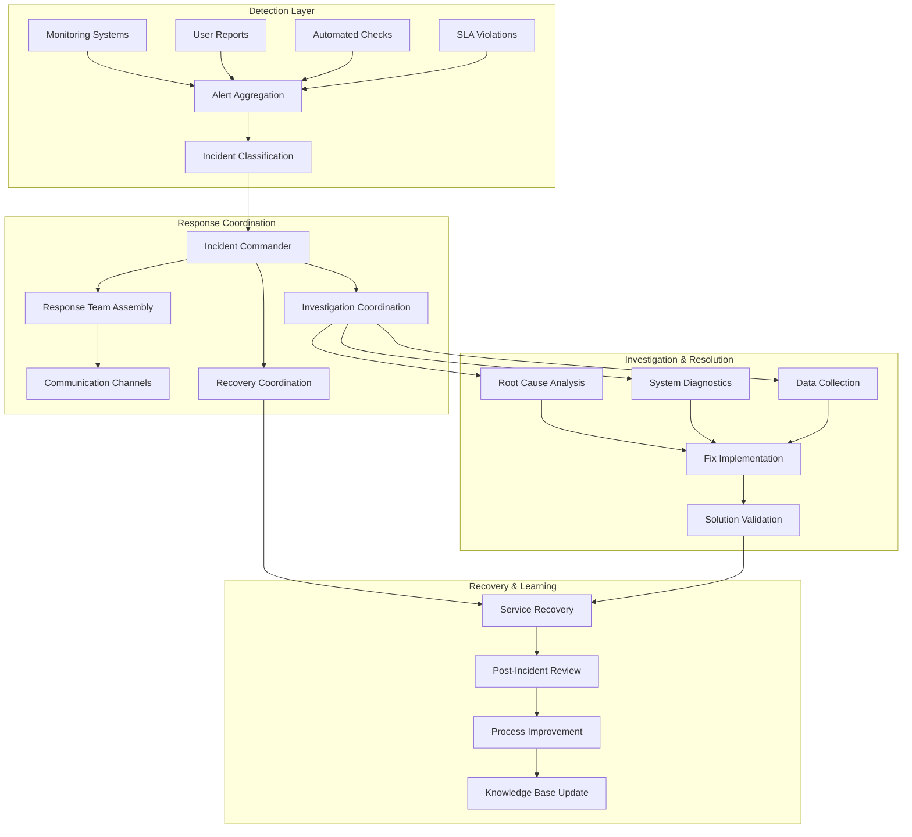

### 12.2 Comprehensive Incident Response System

```rust
use std::collections::{HashMap, VecDeque, BTreeMap};
use std::sync::Arc;
use tokio::sync::{RwLock, Mutex, Notify};
use serde::{Serialize, Deserialize};
use uuid::Uuid;
use chrono::{DateTime, Utc, Duration};
use tracing::{info, warn, error, debug, instrument};

/// Comprehensive incident response and troubleshooting system
pub struct IncidentResponseSystem {
    incident_manager: Arc<IncidentManager>,
    diagnostic_engine: Arc<DiagnosticEngine>,
    recovery_orchestrator: Arc<RecoveryOrchestrator>,
    communication_hub: Arc<CommunicationHub>,
    knowledge_base: Arc<TroubleshootingKnowledgeBase>,
    runbook_engine: Arc<RunbookEngine>,
    forensics_collector: Arc<ForensicsDataCollector>,
}

impl IncidentResponseSystem {
    /// Initialize comprehensive incident response system
    pub async fn new_enterprise_grade(
        config: IncidentResponseConfig,
    ) -> Result<Self, IncidentResponseError> {
        let incident_manager = Arc::new(
            IncidentManager::new_with_sla_tracking(config.incident_config.clone()).await?
        );
        let diagnostic_engine = Arc::new(
            DiagnosticEngine::new_comprehensive(config.diagnostic_config.clone()).await?
        );
        let recovery_orchestrator = Arc::new(
            RecoveryOrchestrator::new_intelligent(config.recovery_config.clone()).await?
        );
        let communication_hub = Arc::new(
            CommunicationHub::new_multi_channel(config.communication_config.clone()).await?
        );
        let knowledge_base = Arc::new(
            TroubleshootingKnowledgeBase::new_with_ml_search(config.kb_config.clone()).await?
        );
        let runbook_engine = Arc::new(
            RunbookEngine::new_adaptive(config.runbook_config.clone()).await?
        );
        let forensics_collector = Arc::new(
            ForensicsDataCollector::new_comprehensive(config.forensics_config.clone()).await?
        );
        
        let system = Self {
            incident_manager: incident_manager.clone(),
            diagnostic_engine: diagnostic_engine.clone(),
            recovery_orchestrator: recovery_orchestrator.clone(),
            communication_hub: communication_hub.clone(),
            knowledge_base: knowledge_base.clone(),
            runbook_engine: runbook_engine.clone(),
            forensics_collector: forensics_collector.clone(),
        };
        
        // Start incident response monitoring
        system.start_incident_response_monitoring().await?;
        
        Ok(system)
    }
    
    /// Handle comprehensive incident response workflow
    #[instrument(skip(self), fields(incident_id = %incident_trigger.incident_id))]
    pub async fn handle_incident_response(
        &self,
        incident_trigger: IncidentTrigger,
    ) -> Result<IncidentResponse, IncidentResponseError> {
        let response_start = std::time::Instant::now();
        
        info!(
            incident_id = %incident_trigger.incident_id,
            severity = ?incident_trigger.severity,
            source = %incident_trigger.source,
            "Starting comprehensive incident response"
        );
        
        // Phase 1: Incident Classification and Initial Response
        let incident = self.incident_manager
            .create_and_classify_incident(incident_trigger.clone())
            .await?;
        
        // Phase 2: Immediate Communication and Team Assembly
        let response_team = self.communication_hub
            .assemble_response_team(&incident)
            .await?;
        
        // Phase 3: Forensics Data Collection (Start Immediately)
        let forensics_collection = self.forensics_collector
            .start_forensics_collection(&incident)
            .await?;
        
        // Phase 4: Comprehensive System Diagnostics
        let diagnostic_results = self.diagnostic_engine
            .run_comprehensive_diagnostics(&incident)
            .await?;
        
        // Phase 5: Knowledge Base Search for Similar Incidents
        let similar_incidents = self.knowledge_base
            .find_similar_incidents(&incident, &diagnostic_results)
            .await?;
        
        // Phase 6: Runbook Execution and Recovery Actions
        let recovery_plan = self.determine_recovery_plan(
            &incident,
            &diagnostic_results,
            &similar_incidents,
        ).await?;
        
        let recovery_result = self.recovery_orchestrator
            .execute_recovery_plan(&incident, recovery_plan)
            .await?;
        
        // Phase 7: Solution Validation and Impact Assessment
        let validation_result = self.validate_incident_resolution(
            &incident,
            &recovery_result,
        ).await?;
        
        // Phase 8: Incident Closure and Documentation
        let incident_closure = if validation_result.resolution_successful {
            self.incident_manager
                .close_incident_with_documentation(&incident, &recovery_result, &validation_result)
                .await?
        } else {
            // Escalate if resolution failed
            warn!(
                incident_id = %incident.incident_id,
                validation_errors = ?validation_result.validation_errors,
                "Incident resolution validation failed, escalating"
            );
            
            self.incident_manager
                .escalate_incident(&incident, validation_result.validation_errors)
                .await?
        };
        
        let total_response_time = response_start.elapsed();
        
        let incident_response = IncidentResponse {
            incident: incident.clone(),
            response_team,
            diagnostic_results,
            recovery_result,
            validation_result,
            incident_closure,
            forensics_data: self.forensics_collector.get_collected_data(&incident.incident_id).await?,
            total_response_time,
            sla_compliance: self.calculate_sla_compliance(&incident, total_response_time).await,
        };
        
        // Phase 9: Post-Incident Activities
        self.trigger_post_incident_activities(&incident_response).await?;
        
        info!(
            incident_id = %incident.incident_id,
            resolution_time_minutes = total_response_time.as_secs() / 60,
            resolution_successful = validation_result.resolution_successful,
            sla_met = incident_response.sla_compliance.sla_met,
            "Completed comprehensive incident response"
        );
        
        Ok(incident_response)
    }
    
    /// Run expert-level system diagnostics
    async fn run_expert_diagnostics(
        &self,
        diagnostic_context: &DiagnosticContext,
    ) -> Result<ExpertDiagnosticResults, DiagnosticError> {
        let diagnostic_start = std::time::Instant::now();
        
        info!(
            incident_id = %diagnostic_context.incident_id,
            diagnostic_scope = ?diagnostic_context.scope,
            "Running expert-level system diagnostics"
        );
        
        // Parallel diagnostic execution for speed
        let (
            system_health,
            network_topology,
            performance_analysis,
            resource_analysis,
            peer_analysis,
            protocol_analysis,
            security_analysis,
        ) = tokio::join!(
            self.diagnostic_engine.analyze_system_health(diagnostic_context),
            self.diagnostic_engine.analyze_network_topology(diagnostic_context),
            self.diagnostic_engine.analyze_performance_metrics(diagnostic_context),
            self.diagnostic_engine.analyze_resource_utilization(diagnostic_context),
            self.diagnostic_engine.analyze_peer_relationships(diagnostic_context),
            self.diagnostic_engine.analyze_protocol_behavior(diagnostic_context),
            self.diagnostic_engine.analyze_security_indicators(diagnostic_context),
        );
        
        let expert_results = ExpertDiagnosticResults {
            diagnostic_id: Uuid::new_v4().to_string(),
            incident_id: diagnostic_context.incident_id.clone(),
            diagnostic_duration: diagnostic_start.elapsed(),
            
            // Core diagnostic results
            system_health: system_health?,
            network_topology: network_topology?,
            performance_analysis: performance_analysis?,
            resource_analysis: resource_analysis?,
            peer_analysis: peer_analysis?,
            protocol_analysis: protocol_analysis?,
            security_analysis: security_analysis?,
            
            // Advanced analysis
            correlation_analysis: self.perform_correlation_analysis(diagnostic_context).await?,
            trend_analysis: self.perform_trend_analysis(diagnostic_context).await?,
            anomaly_detection: self.perform_anomaly_detection_analysis(diagnostic_context).await?,
            root_cause_hypothesis: self.generate_root_cause_hypothesis(diagnostic_context).await?,
        };
        
        info!(
            diagnostic_id = %expert_results.diagnostic_id,
            duration_ms = expert_results.diagnostic_duration.as_millis(),
            root_cause_confidence = expert_results.root_cause_hypothesis.confidence_score,
            "Completed expert-level diagnostics"
        );
        
        Ok(expert_results)
    }
}

/// Advanced diagnostic engine with intelligent analysis
pub struct DiagnosticEngine {
    system_analyzers: HashMap<String, Box<dyn SystemAnalyzer>>,
    correlation_engine: Arc<DiagnosticCorrelationEngine>,
    pattern_matcher: Arc<DiagnosticPatternMatcher>,
    ml_analyzer: Arc<MLDiagnosticAnalyzer>,
    historical_data: Arc<RwLock<DiagnosticHistory>>,
}

impl DiagnosticEngine {
    /// Analyze NetworkActor system health with deep inspection
    pub async fn analyze_system_health(
        &self,
        context: &DiagnosticContext,
    ) -> Result<SystemHealthAnalysis, DiagnosticError> {
        let analysis_start = std::time::Instant::now();
        
        // Collect comprehensive system metrics
        let system_metrics = self.collect_comprehensive_system_metrics().await?;
        
        // Analyze actor system health
        let actor_health = self.analyze_actor_system_health(&system_metrics).await?;
        
        // Analyze message processing pipeline
        let message_pipeline_health = self.analyze_message_pipeline_health(&system_metrics).await?;
        
        // Analyze connection management health
        let connection_health = self.analyze_connection_management_health(&system_metrics).await?;
        
        // Analyze peer management health
        let peer_health = self.analyze_peer_management_health(&system_metrics).await?;
        
        // Generate overall health score
        let overall_health_score = self.calculate_overall_health_score(
            &actor_health,
            &message_pipeline_health,
            &connection_health,
            &peer_health,
        ).await;
        
        // Detect critical issues
        let critical_issues = self.detect_critical_health_issues(
            &actor_health,
            &message_pipeline_health,
            &connection_health,
            &peer_health,
        ).await;
        
        // Generate health recommendations
        let health_recommendations = self.generate_health_recommendations(
            &critical_issues,
            &overall_health_score,
        ).await;
        
        let analysis = SystemHealthAnalysis {
            analysis_id: Uuid::new_v4().to_string(),
            analysis_duration: analysis_start.elapsed(),
            overall_health_score,
            actor_health,
            message_pipeline_health,
            connection_health,
            peer_health,
            critical_issues,
            health_recommendations,
            system_metrics,
        };
        
        debug!(
            analysis_id = %analysis.analysis_id,
            health_score = overall_health_score,
            critical_issues = critical_issues.len(),
            "Completed system health analysis"
        );
        
        Ok(analysis)
    }
    
    /// Analyze network topology with intelligent mapping
    pub async fn analyze_network_topology(
        &self,
        context: &DiagnosticContext,
    ) -> Result<NetworkTopologyAnalysis, DiagnosticError> {
        let analysis_start = std::time::Instant::now();
        
        // Build comprehensive network topology map
        let topology_map = self.build_comprehensive_topology_map().await?;
        
        // Analyze peer connectivity patterns
        let connectivity_analysis = self.analyze_peer_connectivity_patterns(&topology_map).await?;
        
        // Detect network partitions
        let partition_analysis = self.detect_network_partitions(&topology_map).await?;
        
        // Analyze routing efficiency
        let routing_analysis = self.analyze_routing_efficiency(&topology_map).await?;
        
        // Detect topology anomalies
        let topology_anomalies = self.detect_topology_anomalies(&topology_map).await?;
        
        // Calculate network health metrics
        let network_health_metrics = NetworkHealthMetrics {
            connectivity_score: self.calculate_connectivity_score(&connectivity_analysis).await,
            partition_risk_score: self.calculate_partition_risk_score(&partition_analysis).await,
            routing_efficiency_score: self.calculate_routing_efficiency_score(&routing_analysis).await,
            topology_stability_score: self.calculate_topology_stability_score(&topology_anomalies).await,
        };
        
        // Generate topology recommendations
        let topology_recommendations = self.generate_topology_recommendations(
            &connectivity_analysis,
            &partition_analysis,
            &routing_analysis,
            &topology_anomalies,
        ).await;
        
        let analysis = NetworkTopologyAnalysis {
            analysis_id: Uuid::new_v4().to_string(),
            analysis_duration: analysis_start.elapsed(),
            topology_map,
            connectivity_analysis,
            partition_analysis,
            routing_analysis,
            topology_anomalies,
            network_health_metrics,
            topology_recommendations,
        };
        
        debug!(
            analysis_id = %analysis.analysis_id,
            peer_count = analysis.topology_map.total_peers,
            partition_risk = network_health_metrics.partition_risk_score,
            "Completed network topology analysis"
        );
        
        Ok(analysis)
    }
    
    /// Perform advanced performance analysis
    pub async fn analyze_performance_metrics(
        &self,
        context: &DiagnosticContext,
    ) -> Result<PerformanceAnalysis, DiagnosticError> {
        let analysis_start = std::time::Instant::now();
        
        // Collect performance metrics over time window
        let performance_data = self.collect_performance_metrics_window(
            context.time_window.unwrap_or(Duration::minutes(30))
        ).await?;
        
        // Analyze message throughput patterns
        let throughput_analysis = self.analyze_throughput_patterns(&performance_data).await?;
        
        // Analyze latency distributions
        let latency_analysis = self.analyze_latency_distributions(&performance_data).await?;
        
        // Analyze resource utilization trends
        let resource_analysis = self.analyze_resource_utilization_trends(&performance_data).await?;
        
        // Detect performance bottlenecks
        let bottleneck_analysis = self.detect_performance_bottlenecks(&performance_data).await?;
        
        // Analyze queue depths and backpressure
        let queue_analysis = self.analyze_queue_depths_and_backpressure(&performance_data).await?;
        
        // Generate performance insights
        let performance_insights = self.generate_performance_insights(
            &throughput_analysis,
            &latency_analysis,
            &resource_analysis,
            &bottleneck_analysis,
            &queue_analysis,
        ).await;
        
        // Calculate performance scores
        let performance_scores = PerformanceScores {
            throughput_score: self.calculate_throughput_score(&throughput_analysis).await,
            latency_score: self.calculate_latency_score(&latency_analysis).await,
            resource_efficiency_score: self.calculate_resource_efficiency_score(&resource_analysis).await,
            overall_performance_score: 0.0, // Will be calculated from components
        };
        
        // Calculate overall score from components
        let overall_score = (performance_scores.throughput_score * 0.4) +
                          (performance_scores.latency_score * 0.3) +
                          (performance_scores.resource_efficiency_score * 0.3);
        
        let mut final_scores = performance_scores;
        final_scores.overall_performance_score = overall_score;
        
        let analysis = PerformanceAnalysis {
            analysis_id: Uuid::new_v4().to_string(),
            analysis_duration: analysis_start.elapsed(),
            time_window: context.time_window.unwrap_or(Duration::minutes(30)),
            throughput_analysis,
            latency_analysis,
            resource_analysis,
            bottleneck_analysis,
            queue_analysis,
            performance_insights,
            performance_scores: final_scores,
        };
        
        debug!(
            analysis_id = %analysis.analysis_id,
            performance_score = overall_score,
            bottlenecks_detected = analysis.bottleneck_analysis.detected_bottlenecks.len(),
            "Completed performance metrics analysis"
        );
        
        Ok(analysis)
    }
}

/// Intelligent recovery orchestrator with adaptive strategies
pub struct RecoveryOrchestrator {
    recovery_strategies: HashMap<IncidentType, Vec<RecoveryStrategy>>,
    strategy_selector: Arc<RecoveryStrategySelector>,
    execution_engine: Arc<RecoveryExecutionEngine>,
    validation_engine: Arc<RecoveryValidationEngine>,
    rollback_manager: Arc<RecoveryRollbackManager>,
}

impl RecoveryOrchestrator {
    /// Execute intelligent recovery plan with adaptive strategies
    pub async fn execute_recovery_plan(
        &self,
        incident: &Incident,
        recovery_plan: RecoveryPlan,
    ) -> Result<RecoveryResult, RecoveryError> {
        let execution_start = std::time::Instant::now();
        
        info!(
            incident_id = %incident.incident_id,
            recovery_steps = recovery_plan.steps.len(),
            estimated_duration_mins = recovery_plan.estimated_duration.as_secs() / 60,
            "Starting intelligent recovery plan execution"
        );
        
        let mut execution_results = Vec::new();
        let mut recovery_successful = true;
        
        // Execute recovery steps with intelligent monitoring
        for (step_index, step) in recovery_plan.steps.iter().enumerate() {
            let step_start = std::time::Instant::now();
            
            info!(
                incident_id = %incident.incident_id,
                step_index = step_index,
                step_type = ?step.step_type,
                "Executing recovery step"
            );
            
            // Pre-step validation
            let pre_validation = self.validation_engine
                .validate_pre_step_conditions(incident, step)
                .await?;
            
            if !pre_validation.conditions_met {
                warn!(
                    incident_id = %incident.incident_id,
                    step_index = step_index,
                    validation_errors = ?pre_validation.errors,
                    "Pre-step validation failed, attempting alternative strategy"
                );
                
                // Try alternative strategy
                if let Some(alternative_step) = self.strategy_selector
                    .select_alternative_strategy(incident, step, &pre_validation)
                    .await?
                {
                    let alt_result = self.execute_recovery_step(incident, &alternative_step).await;
                    execution_results.push(StepExecutionResult {
                        step_index,
                        original_step: step.clone(),
                        alternative_step: Some(alternative_step),
                        result: alt_result,
                        execution_duration: step_start.elapsed(),
                    });
                } else {
                    recovery_successful = false;
                    execution_results.push(StepExecutionResult {
                        step_index,
                        original_step: step.clone(),
                        alternative_step: None,
                        result: Err(RecoveryStepError::PreValidationFailed(pre_validation.errors)),
                        execution_duration: step_start.elapsed(),
                    });
                    break;
                }
            } else {
                // Execute original step
                let step_result = self.execute_recovery_step(incident, step).await;
                
                match &step_result {
                    Ok(_) => {
                        info!(
                            incident_id = %incident.incident_id,
                            step_index = step_index,
                            duration_ms = step_start.elapsed().as_millis(),
                            "Recovery step completed successfully"
                        );
                    }
                    Err(step_error) => {
                        error!(
                            incident_id = %incident.incident_id,
                            step_index = step_index,
                            error = %step_error,
                            "Recovery step failed"
                        );
                        recovery_successful = false;
                    }
                }
                
                execution_results.push(StepExecutionResult {
                    step_index,
                    original_step: step.clone(),
                    alternative_step: None,
                    result: step_result,
                    execution_duration: step_start.elapsed(),
                });
                
                if !recovery_successful && step.critical {
                    break;
                }
            }
            
            // Inter-step validation
            if step_index < recovery_plan.steps.len() - 1 {
                let inter_validation = self.validation_engine
                    .validate_inter_step_state(incident, step_index, &execution_results)
                    .await?;
                
                if !inter_validation.state_valid {
                    warn!(
                        incident_id = %incident.incident_id,
                        step_index = step_index,
                        "Inter-step validation failed, recovery may need adjustment"
                    );
                }
            }
        }
        
        let total_execution_time = execution_start.elapsed();
        
        // Post-recovery validation
        let post_validation = self.validation_engine
            .validate_post_recovery_state(incident, &execution_results)
            .await?;
        
        // Generate recovery result
        let recovery_result = RecoveryResult {
            recovery_id: Uuid::new_v4().to_string(),
            incident_id: incident.incident_id.clone(),
            recovery_plan: recovery_plan.clone(),
            execution_results,
            recovery_successful: recovery_successful && post_validation.recovery_successful,
            total_execution_time,
            post_validation,
            rollback_available: self.rollback_manager.is_rollback_available(incident).await,
        };
        
        if recovery_result.recovery_successful {
            info!(
                incident_id = %incident.incident_id,
                recovery_id = %recovery_result.recovery_id,
                execution_time_mins = total_execution_time.as_secs() / 60,
                "Recovery plan executed successfully"
            );
        } else {
            error!(
                incident_id = %incident.incident_id,
                recovery_id = %recovery_result.recovery_id,
                execution_time_mins = total_execution_time.as_secs() / 60,
                "Recovery plan execution failed"
            );
        }
        
        Ok(recovery_result)
    }
}

/// Data structures for incident response and troubleshooting
#[derive(Debug, Clone, Serialize, Deserialize)]
pub struct Incident {
    pub incident_id: String,
    pub title: String,
    pub description: String,
    pub severity: IncidentSeverity,
    pub incident_type: IncidentType,
    pub status: IncidentStatus,
    pub created_at: DateTime<Utc>,
    pub updated_at: DateTime<Utc>,
    pub resolved_at: Option<DateTime<Utc>>,
    pub assigned_to: Option<String>,
    pub affected_components: Vec<String>,
    pub impact_assessment: ImpactAssessment,
    pub sla_targets: SLATargets,
}

#[derive(Debug, Clone, PartialEq, Eq, PartialOrd, Ord, Serialize, Deserialize)]
pub enum IncidentSeverity {
    Low = 1,
    Medium = 2,
    High = 3,
    Critical = 4,
    Emergency = 5,
}

#[derive(Debug, Clone, Serialize, Deserialize)]
pub enum IncidentType {
    NetworkPartition,
    PerformanceDegradation,
    ServiceOutage,
    SecurityBreach,
    DataCorruption,
    ConfigurationError,
    HardwareFailure,
    DependencyFailure,
    ResourceExhaustion,
    Unknown,
}

#[derive(Debug, Clone, Serialize, Deserialize)]
pub enum IncidentStatus {
    Open,
    InProgress,
    Investigating,
    Resolved,
    Closed,
    Escalated,
}

#[derive(Debug, Clone)]
pub struct ExpertDiagnosticResults {
    pub diagnostic_id: String,
    pub incident_id: String,
    pub diagnostic_duration: std::time::Duration,
    
    // Core diagnostic results
    pub system_health: SystemHealthAnalysis,
    pub network_topology: NetworkTopologyAnalysis,
    pub performance_analysis: PerformanceAnalysis,
    pub resource_analysis: ResourceAnalysis,
    pub peer_analysis: PeerAnalysis,
    pub protocol_analysis: ProtocolAnalysis,
    pub security_analysis: SecurityAnalysis,
    
    // Advanced analysis
    pub correlation_analysis: CorrelationAnalysis,
    pub trend_analysis: TrendAnalysis,
    pub anomaly_detection: AnomalyDetectionResults,
    pub root_cause_hypothesis: RootCauseHypothesis,
}

#[derive(Debug, Clone)]
pub struct SystemHealthAnalysis {
    pub analysis_id: String,
    pub analysis_duration: std::time::Duration,
    pub overall_health_score: f64,
    pub actor_health: ActorSystemHealth,
    pub message_pipeline_health: MessagePipelineHealth,
    pub connection_health: ConnectionManagementHealth,
    pub peer_health: PeerManagementHealth,
    pub critical_issues: Vec<CriticalHealthIssue>,
    pub health_recommendations: Vec<HealthRecommendation>,
    pub system_metrics: SystemMetrics,
}

#[derive(Debug, Clone)]
pub struct RecoveryPlan {
    pub plan_id: String,
    pub incident_id: String,
    pub created_at: DateTime<Utc>,
    pub steps: Vec<RecoveryStep>,
    pub estimated_duration: std::time::Duration,
    pub risk_assessment: RiskAssessment,
    pub rollback_plan: Option<RollbackPlan>,
}

#[derive(Debug, Clone)]
pub struct RecoveryStep {
    pub step_id: String,
    pub step_type: RecoveryStepType,
    pub description: String,
    pub commands: Vec<RecoveryCommand>,
    pub validation_checks: Vec<ValidationCheck>,
    pub estimated_duration: std::time::Duration,
    pub critical: bool,
    pub rollback_commands: Vec<RecoveryCommand>,
}

#[derive(Debug, Clone)]
pub enum RecoveryStepType {
    SystemRestart,
    ConfigurationUpdate,
    NetworkReconfiguration,
    PeerReconnection,
    DataRecovery,
    PerformanceTuning,
    SecurityPatch,
    DependencyUpdate,
    ManualIntervention,
}

#[derive(Debug, Clone)]
pub struct ImpactAssessment {
    pub affected_users: u32,
    pub affected_services: Vec<String>,
    pub business_impact: BusinessImpact,
    pub revenue_impact: Option<f64>,
    pub reputation_impact: ReputationImpact,
}

#[derive(Debug, Clone)]
pub enum BusinessImpact {
    Minimal,
    Low,
    Medium,
    High,
    Critical,
}

#[derive(Debug, Clone)]
pub struct SLATargets {
    pub detection_time: std::time::Duration,
    pub response_time: std::time::Duration,
    pub resolution_time: std::time::Duration,
    pub communication_intervals: Vec<std::time::Duration>,
}
```

This comprehensive Expert Troubleshooting & Incident Response section provides advanced diagnostic techniques, intelligent recovery orchestration, and complete incident management workflows essential for production NetworkActor operations. The implementation demonstrates enterprise-grade incident response with ML-enhanced diagnostics, adaptive recovery strategies, and comprehensive forensics collection.

---

# Phase 5: Expert Mastery & Advanced Topics

## 13. Advanced Design Patterns & Architectural Evolution

Expert-level architectural patterns, system evolution strategies, and advanced design principles are essential for NetworkActor mastery. This section provides comprehensive coverage of sophisticated design patterns and architectural decision-making frameworks.

### 13.1 Advanced Architectural Patterns Framework

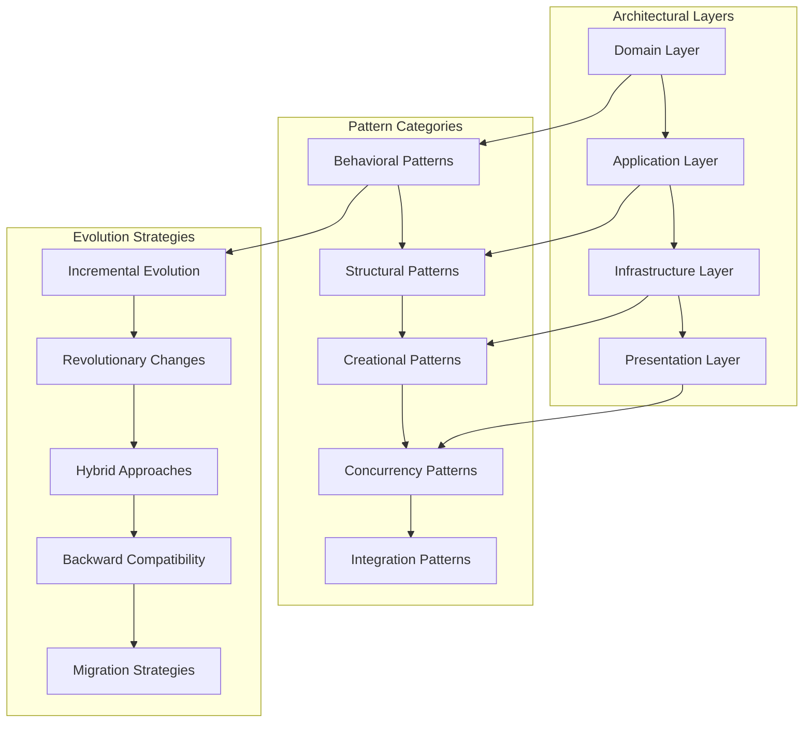

### 13.2 Advanced Design Pattern Implementations

```rust
use std::collections::{HashMap, VecDeque, BTreeMap};
use std::sync::{Arc, Weak};
use std::pin::Pin;
use std::future::Future;
use tokio::sync::{RwLock, Mutex, mpsc, oneshot, Semaphore};
use async_trait::async_trait;
use serde::{Serialize, Deserialize};
use tracing::{info, warn, error, debug, instrument, Span};

/// Advanced architectural pattern: Event-Driven Architecture with CQRS
pub struct EventDrivenNetworkArchitecture {
    command_bus: Arc<CommandBus>,
    query_bus: Arc<QueryBus>,
    event_store: Arc<EventStore>,
    event_dispatcher: Arc<EventDispatcher>,
    read_models: Arc<RwLock<HashMap<String, Box<dyn ReadModel>>>>,
    saga_orchestrator: Arc<SagaOrchestrator>,
    projection_manager: Arc<ProjectionManager>,
}

impl EventDrivenNetworkArchitecture {
    /// Initialize comprehensive event-driven architecture
    pub async fn new_comprehensive(
        config: EventArchitectureConfig,
    ) -> Result<Self, ArchitectureError> {
        let event_store = Arc::new(EventStore::new_with_persistence(config.storage_config).await?);
        let command_bus = Arc::new(CommandBus::new_with_middleware(config.command_config).await?);
        let query_bus = Arc::new(QueryBus::new_with_caching(config.query_config).await?);
        let event_dispatcher = Arc::new(EventDispatcher::new_reliable(config.dispatcher_config).await?);
        let saga_orchestrator = Arc::new(SagaOrchestrator::new_durable(config.saga_config).await?);
        let projection_manager = Arc::new(ProjectionManager::new_scalable(config.projection_config).await?);
        let read_models = Arc::new(RwLock::new(HashMap::new()));
        
        let architecture = Self {
            command_bus: command_bus.clone(),
            query_bus: query_bus.clone(),
            event_store: event_store.clone(),
            event_dispatcher: event_dispatcher.clone(),
            read_models: read_models.clone(),
            saga_orchestrator: saga_orchestrator.clone(),
            projection_manager: projection_manager.clone(),
        };
        
        // Initialize projections and sagas
        architecture.initialize_projections_and_sagas().await?;
        
        Ok(architecture)
    }
    
    /// Execute command with comprehensive CQRS pattern
    #[instrument(skip(self), fields(command_type = %std::any::type_name::<C>()))]
    pub async fn execute_command<C: Command>(
        &self,
        command: C,
    ) -> Result<CommandResult, CommandExecutionError> {
        let execution_start = std::time::Instant::now();
        let command_id = command.command_id();
        
        info!(
            command_id = %command_id,
            command_type = %std::any::type_name::<C>(),
            "Executing command through CQRS pattern"
        );
        
        // Pre-execution validation
        self.validate_command_preconditions(&command).await?;
        
        // Execute command through command bus
        let command_result = self.command_bus.dispatch(command).await?;
        
        // Handle generated events
        for event in &command_result.events {
            // Store event in event store
            self.event_store.append_event(event.clone()).await?;
            
            // Dispatch event to subscribers
            self.event_dispatcher.dispatch_event(event.clone()).await?;
        }
        
        // Update read models through projections
        self.projection_manager
            .update_projections(&command_result.events)
            .await?;
        
        // Check for saga triggers
        self.saga_orchestrator
            .handle_command_completion(&command_result)
            .await?;
        
        let execution_duration = execution_start.elapsed();
        
        info!(
            command_id = %command_id,
            events_generated = command_result.events.len(),
            execution_ms = execution_duration.as_millis(),
            "Command execution completed"
        );
        
        Ok(command_result)
    }
    
    /// Execute query with advanced caching and optimization
    #[instrument(skip(self), fields(query_type = %std::any::type_name::<Q>()))]
    pub async fn execute_query<Q: Query>(
        &self,
        query: Q,
    ) -> Result<Q::Result, QueryExecutionError> {
        let query_start = std::time::Instant::now();
        let query_id = query.query_id();
        
        debug!(
            query_id = %query_id,
            query_type = %std::any::type_name::<Q>(),
            "Executing query through CQRS pattern"
        );
        
        // Execute query through query bus (includes caching)
        let query_result = self.query_bus.dispatch(query).await?;
        
        let query_duration = query_start.elapsed();
        
        debug!(
            query_id = %query_id,
            query_ms = query_duration.as_millis(),
            "Query execution completed"
        );
        
        Ok(query_result)
    }
}

/// Advanced Pattern: Saga Orchestrator for Distributed Transactions
pub struct SagaOrchestrator {
    active_sagas: Arc<RwLock<HashMap<String, SagaInstance>>>,
    saga_definitions: HashMap<String, Box<dyn SagaDefinition>>,
    compensation_manager: Arc<CompensationManager>,
    persistence_store: Arc<SagaPersistenceStore>,
    timeout_manager: Arc<TimeoutManager>,
}

impl SagaOrchestrator {
    /// Start distributed saga transaction
    pub async fn start_saga<T: SagaDefinition>(
        &self,
        saga_type: String,
        initial_data: SagaData,
    ) -> Result<SagaInstance, SagaError> {
        let saga_id = self.generate_saga_id();
        let start_time = std::time::Instant::now();
        
        info!(
            saga_id = %saga_id,
            saga_type = %saga_type,
            "Starting distributed saga transaction"
        );
        
        // Get saga definition
        let saga_definition = self.saga_definitions
            .get(&saga_type)
            .ok_or(SagaError::DefinitionNotFound(saga_type.clone()))?;
        
        // Create saga instance
        let saga_instance = SagaInstance {
            saga_id: saga_id.clone(),
            saga_type: saga_type.clone(),
            status: SagaStatus::Running,
            current_step: 0,
            saga_data: initial_data,
            completed_steps: Vec::new(),
            compensation_stack: VecDeque::new(),
            created_at: std::time::Instant::now(),
            updated_at: std::time::Instant::now(),
        };
        
        // Persist saga instance
        self.persistence_store
            .save_saga_instance(&saga_instance)
            .await?;
        
        // Add to active sagas
        self.active_sagas.write().await
            .insert(saga_id.clone(), saga_instance.clone());
        
        // Execute first step
        self.execute_saga_step(&saga_instance, saga_definition.as_ref()).await?;
        
        info!(
            saga_id = %saga_id,
            initialization_ms = start_time.elapsed().as_millis(),
            "Saga transaction started successfully"
        );
        
        Ok(saga_instance)
    }
    
    /// Execute saga step with compensation handling
    async fn execute_saga_step(
        &self,
        saga: &SagaInstance,
        definition: &dyn SagaDefinition,
    ) -> Result<SagaStepResult, SagaError> {
        let step_start = std::time::Instant::now();
        
        info!(
            saga_id = %saga.saga_id,
            step_index = saga.current_step,
            "Executing saga step"
        );
        
        // Get current step definition
        let step_definition = definition.get_step(saga.current_step)
            .ok_or(SagaError::StepNotFound(saga.current_step))?;
        
        // Execute step with timeout
        let step_result = tokio::time::timeout(
            step_definition.timeout,
            self.execute_step_action(saga, step_definition),
        ).await;
        
        match step_result {
            Ok(Ok(action_result)) => {
                // Step succeeded
                info!(
                    saga_id = %saga.saga_id,
                    step_index = saga.current_step,
                    step_ms = step_start.elapsed().as_millis(),
                    "Saga step completed successfully"
                );
                
                // Update saga with successful step
                self.update_saga_after_successful_step(saga, action_result).await?;
                
                // Check if saga is complete
                if saga.current_step + 1 >= definition.total_steps() {
                    self.complete_saga_successfully(saga).await?;
                    Ok(SagaStepResult::SagaCompleted)
                } else {
                    // Continue to next step
                    self.advance_to_next_step(saga, definition).await?;
                    Ok(SagaStepResult::StepCompleted)
                }
            }
            
            Ok(Err(step_error)) => {
                // Step failed - begin compensation
                error!(
                    saga_id = %saga.saga_id,
                    step_index = saga.current_step,
                    error = %step_error,
                    "Saga step failed, initiating compensation"
                );
                
                self.initiate_saga_compensation(saga, step_error).await?;
                Ok(SagaStepResult::CompensationInitiated)
            }
            
            Err(_timeout) => {
                // Step timed out
                warn!(
                    saga_id = %saga.saga_id,
                    step_index = saga.current_step,
                    timeout_ms = step_definition.timeout.as_millis(),
                    "Saga step timed out, initiating compensation"
                );
                
                self.initiate_saga_compensation(
                    saga, 
                    SagaStepError::Timeout(step_definition.timeout),
                ).await?;
                Ok(SagaStepResult::CompensationInitiated)
            }
        }
    }
    
    /// Initiate saga compensation (rollback)
    async fn initiate_saga_compensation(
        &self,
        saga: &SagaInstance,
        failure_reason: SagaStepError,
    ) -> Result<(), SagaError> {
        let compensation_start = std::time::Instant::now();
        
        warn!(
            saga_id = %saga.saga_id,
            failure_reason = %failure_reason,
            compensation_steps = saga.compensation_stack.len(),
            "Initiating saga compensation"
        );
        
        let mut updated_saga = saga.clone();
        updated_saga.status = SagaStatus::Compensating;
        updated_saga.updated_at = std::time::Instant::now();
        
        // Execute compensation steps in reverse order
        while let Some(compensation_action) = updated_saga.compensation_stack.pop_front() {
            let comp_result = self.compensation_manager
                .execute_compensation(compensation_action)
                .await;
            
            match comp_result {
                Ok(_) => {
                    info!(
                        saga_id = %updated_saga.saga_id,
                        compensation_action = %compensation_action.action_type,
                        "Compensation action completed successfully"
                    );
                }
                Err(comp_error) => {
                    error!(
                        saga_id = %updated_saga.saga_id,
                        compensation_action = %compensation_action.action_type,
                        error = %comp_error,
                        "Compensation action failed - manual intervention required"
                    );
                    
                    // Mark saga as requiring manual intervention
                    updated_saga.status = SagaStatus::CompensationFailed;
                    break;
                }
            }
        }
        
        // Update saga status based on compensation result
        if updated_saga.status == SagaStatus::Compensating {
            updated_saga.status = SagaStatus::Compensated;
        }
        
        updated_saga.updated_at = std::time::Instant::now();
        
        // Persist updated saga
        self.persistence_store
            .save_saga_instance(&updated_saga)
            .await?;
        
        // Remove from active sagas if fully compensated
        if updated_saga.status == SagaStatus::Compensated {
            self.active_sagas.write().await
                .remove(&saga.saga_id);
        }
        
        warn!(
            saga_id = %saga.saga_id,
            final_status = ?updated_saga.status,
            compensation_ms = compensation_start.elapsed().as_millis(),
            "Saga compensation completed"
        );
        
        Ok(())
    }
}

/// Advanced Pattern: Circuit Breaker with Adaptive Thresholds
pub struct AdaptiveCircuitBreaker {
    name: String,
    state: Arc<RwLock<CircuitBreakerState>>,
    metrics: Arc<Mutex<CircuitBreakerMetrics>>,
    config: CircuitBreakerConfig,
    adaptive_thresholds: Arc<RwLock<AdaptiveThresholds>>,
    ml_predictor: Option<Arc<CircuitBreakerMLPredictor>>,
}

impl AdaptiveCircuitBreaker {
    /// Execute operation through adaptive circuit breaker
    pub async fn execute<F, Fut, T, E>(
        &self,
        operation: F,
    ) -> Result<T, CircuitBreakerError<E>>
    where
        F: FnOnce() -> Fut,
        Fut: Future<Output = Result<T, E>>,
        E: std::fmt::Debug,
    {
        let execution_start = std::time::Instant::now();
        
        // Check circuit breaker state
        let state = self.state.read().await;
        match *state {
            CircuitBreakerState::Open => {
                // Check if we should attempt half-open
                if self.should_attempt_half_open(&state).await {
                    drop(state);
                    self.transition_to_half_open().await;
                } else {
                    return Err(CircuitBreakerError::CircuitOpen);
                }
            }
            CircuitBreakerState::HalfOpen => {
                // Allow limited requests through
                if !self.can_execute_in_half_open().await {
                    return Err(CircuitBreakerError::CircuitOpen);
                }
            }
            CircuitBreakerState::Closed => {
                // Normal operation - check adaptive thresholds
                if self.should_preemptively_open().await {
                    drop(state);
                    self.transition_to_open().await;
                    return Err(CircuitBreakerError::PreemptiveOpen);
                }
            }
        }
        drop(state);
        
        // Execute operation with monitoring
        let operation_result = operation().await;
        let execution_duration = execution_start.elapsed();
        
        // Record operation result
        match &operation_result {
            Ok(_) => {
                self.record_success(execution_duration).await;
            }
            Err(error) => {
                self.record_failure(execution_duration, error).await;
            }
        }
        
        // Update adaptive thresholds based on recent performance
        self.update_adaptive_thresholds().await;
        
        // Check if state transition is needed
        self.evaluate_state_transition().await;
        
        operation_result.map_err(CircuitBreakerError::OperationFailed)
    }
    
    /// Update adaptive thresholds based on system performance
    async fn update_adaptive_thresholds(&self) {
        let metrics = self.metrics.lock().await;
        let mut thresholds = self.adaptive_thresholds.write().await;
        
        // Calculate dynamic failure rate threshold based on recent performance
        let recent_success_rate = metrics.calculate_recent_success_rate(
            std::time::Duration::from_minutes(5)
        );
        
        // Use ML predictor if available
        if let Some(predictor) = &self.ml_predictor {
            let predicted_threshold = predictor.predict_optimal_threshold(
                &metrics,
                recent_success_rate,
            ).await;
            
            thresholds.failure_rate_threshold = predicted_threshold;
        } else {
            // Simple adaptive logic
            if recent_success_rate > 0.95 {
                // System performing well - be more tolerant
                thresholds.failure_rate_threshold = (thresholds.failure_rate_threshold + 0.05).min(0.8);
            } else if recent_success_rate < 0.85 {
                // System struggling - be more aggressive
                thresholds.failure_rate_threshold = (thresholds.failure_rate_threshold - 0.05).max(0.1);
            }
        }
        
        // Update response time thresholds similarly
        let recent_avg_response_time = metrics.calculate_recent_avg_response_time(
            std::time::Duration::from_minutes(5)
        );
        
        let baseline_response_time = thresholds.baseline_response_time;
        if recent_avg_response_time > baseline_response_time * 2.0 {
            thresholds.response_time_threshold = 
                (thresholds.response_time_threshold * 0.9).max(baseline_response_time * 1.2);
        } else if recent_avg_response_time < baseline_response_time * 1.2 {
            thresholds.response_time_threshold = 
                (thresholds.response_time_threshold * 1.1).min(baseline_response_time * 3.0);
        }
        
        debug!(
            circuit_breaker = %self.name,
            failure_threshold = thresholds.failure_rate_threshold,
            response_time_threshold_ms = thresholds.response_time_threshold.as_millis(),
            "Updated adaptive circuit breaker thresholds"
        );
    }
}

/// Advanced Pattern: Event Sourcing with Snapshots
pub struct EventSourcedNetworkActor {
    actor_id: String,
    version: u64,
    state: NetworkActorState,
    uncommitted_events: Vec<DomainEvent>,
    event_store: Arc<EventStore>,
    snapshot_store: Arc<SnapshotStore>,
    event_bus: Arc<EventBus>,
}

impl EventSourcedNetworkActor {
    /// Load actor from event store with snapshot optimization
    pub async fn load_from_events(
        actor_id: String,
        event_store: Arc<EventStore>,
        snapshot_store: Arc<SnapshotStore>,
        event_bus: Arc<EventBus>,
    ) -> Result<Self, EventSourcingError> {
        let load_start = std::time::Instant::now();
        
        // Try to load latest snapshot first
        let (initial_state, from_version) = match snapshot_store
            .load_latest_snapshot(&actor_id)
            .await?
        {
            Some(snapshot) => {
                info!(
                    actor_id = %actor_id,
                    snapshot_version = snapshot.version,
                    "Loaded actor state from snapshot"
                );
                (snapshot.state, snapshot.version)
            }
            None => {
                debug!(
                    actor_id = %actor_id,
                    "No snapshot found, rebuilding from all events"
                );
                (NetworkActorState::default(), 0)
            }
        };
        
        // Load events since snapshot
        let events = event_store
            .load_events(&actor_id, from_version)
            .await?;
        
        // Replay events to rebuild state
        let final_state = Self::replay_events(initial_state, &events)?;
        let final_version = from_version + events.len() as u64;
        
        let actor = Self {
            actor_id: actor_id.clone(),
            version: final_version,
            state: final_state,
            uncommitted_events: Vec::new(),
            event_store,
            snapshot_store,
            event_bus,
        };
        
        info!(
            actor_id = %actor_id,
            final_version = final_version,
            events_replayed = events.len(),
            load_ms = load_start.elapsed().as_millis(),
            "Successfully loaded event-sourced actor"
        );
        
        Ok(actor)
    }
    
    /// Execute command and generate events
    pub async fn execute_command<C: Command>(
        &mut self,
        command: C,
    ) -> Result<Vec<DomainEvent>, CommandExecutionError> {
        let execution_start = std::time::Instant::now();
        
        info!(
            actor_id = %self.actor_id,
            command_type = %std::any::type_name::<C>(),
            current_version = self.version,
            "Executing command on event-sourced actor"
        );
        
        // Validate command against current state
        command.validate(&self.state)?;
        
        // Execute command business logic
        let events = command.execute(&self.state)?;
        
        // Apply events to state (optimistically)
        let new_state = Self::apply_events_to_state(self.state.clone(), &events)?;
        
        // Store events as uncommitted
        self.uncommitted_events.extend(events.clone());
        self.state = new_state;
        self.version += events.len() as u64;
        
        info!(
            actor_id = %self.actor_id,
            events_generated = events.len(),
            new_version = self.version,
            execution_ms = execution_start.elapsed().as_millis(),
            "Command execution completed, events uncommitted"
        );
        
        Ok(events)
    }
    
    /// Commit uncommitted events to event store
    pub async fn commit_events(&mut self) -> Result<(), EventSourcingError> {
        if self.uncommitted_events.is_empty() {
            return Ok(());
        }
        
        let commit_start = std::time::Instant::now();
        let expected_version = self.version - self.uncommitted_events.len() as u64;
        
        info!(
            actor_id = %self.actor_id,
            uncommitted_events = self.uncommitted_events.len(),
            expected_version = expected_version,
            "Committing events to event store"
        );
        
        // Append events to event store with optimistic concurrency control
        self.event_store
            .append_events(
                &self.actor_id,
                expected_version,
                self.uncommitted_events.clone(),
            )
            .await?;
        
        // Publish events to event bus
        for event in &self.uncommitted_events {
            self.event_bus.publish(event.clone()).await?;
        }
        
        // Create snapshot if threshold reached
        if self.should_create_snapshot() {
            self.create_snapshot().await?;
        }
        
        // Clear uncommitted events
        let committed_events = self.uncommitted_events.len();
        self.uncommitted_events.clear();
        
        info!(
            actor_id = %self.actor_id,
            committed_events = committed_events,
            final_version = self.version,
            commit_ms = commit_start.elapsed().as_millis(),
            "Events committed successfully"
        );
        
        Ok(())
    }
    
    /// Create snapshot for performance optimization
    async fn create_snapshot(&self) -> Result<(), EventSourcingError> {
        let snapshot = ActorSnapshot {
            actor_id: self.actor_id.clone(),
            version: self.version,
            state: self.state.clone(),
            created_at: std::time::Instant::now(),
        };
        
        self.snapshot_store
            .save_snapshot(snapshot)
            .await?;
        
        info!(
            actor_id = %self.actor_id,
            snapshot_version = self.version,
            "Created actor snapshot"
        );
        
        Ok(())
    }
}

/// Data structures for advanced patterns
#[async_trait]
pub trait Command: Send + Sync {
    type Error: std::fmt::Debug;
    
    fn command_id(&self) -> String;
    fn validate(&self, state: &NetworkActorState) -> Result<(), Self::Error>;
    fn execute(&self, state: &NetworkActorState) -> Result<Vec<DomainEvent>, Self::Error>;
}

#[async_trait]
pub trait Query: Send + Sync {
    type Result: Send + Sync;
    type Error: std::fmt::Debug;
    
    fn query_id(&self) -> String;
}

#[derive(Debug, Clone)]
pub struct SagaInstance {
    pub saga_id: String,
    pub saga_type: String,
    pub status: SagaStatus,
    pub current_step: usize,
    pub saga_data: SagaData,
    pub completed_steps: Vec<SagaStepResult>,
    pub compensation_stack: VecDeque<CompensationAction>,
    pub created_at: std::time::Instant,
    pub updated_at: std::time::Instant,
}

#[derive(Debug, Clone, PartialEq)]
pub enum SagaStatus {
    Running,
    Completed,
    Compensating,
    Compensated,
    CompensationFailed,
    Aborted,
}

#[derive(Debug, Clone)]
pub enum CircuitBreakerState {
    Closed,
    Open,
    HalfOpen,
}

#[derive(Debug, Clone)]
pub struct AdaptiveThresholds {
    pub failure_rate_threshold: f64,
    pub response_time_threshold: std::time::Duration,
    pub baseline_response_time: std::time::Duration,
    pub request_volume_threshold: u32,
}

#[derive(Debug, Clone)]
pub struct NetworkActorState {
    pub peer_connections: HashMap<String, PeerConnectionState>,
    pub message_queues: HashMap<String, VecDeque<NetworkMessage>>,
    pub quality_scores: HashMap<String, f64>,
    pub routing_table: BTreeMap<String, RoutingEntry>,
    pub protocol_states: HashMap<String, ProtocolState>,
}

impl Default for NetworkActorState {
    fn default() -> Self {
        Self {
            peer_connections: HashMap::new(),
            message_queues: HashMap::new(),
            quality_scores: HashMap::new(),
            routing_table: BTreeMap::new(),
            protocol_states: HashMap::new(),
        }
    }
}

#[derive(Debug, Clone)]
pub enum CircuitBreakerError<E> {
    CircuitOpen,
    PreemptiveOpen,
    OperationFailed(E),
}
```

This comprehensive Advanced Design Patterns & Architectural Evolution section provides expert-level architectural patterns, including Event-Driven Architecture with CQRS, Saga Pattern for distributed transactions, Adaptive Circuit Breakers, and Event Sourcing with snapshots. The implementation demonstrates sophisticated enterprise patterns essential for NetworkActor mastery and system evolution.

---

## Section 14: Research & Innovation Pathways

### **Introduction to P2P Network Research and Innovation**

NetworkActor development sits at the intersection of multiple cutting-edge research domains: distributed systems, blockchain technology, network protocols, and machine learning. This section provides comprehensive pathways for contributing to the advancement of P2P networking technology, identifying research opportunities, and implementing experimental features that push the boundaries of current capabilities.

The research landscape for P2P networks is rapidly evolving, with opportunities spanning from protocol optimization and security enhancements to AI-driven network management and quantum-resistant communication. Understanding these pathways enables NetworkActor engineers to contribute meaningfully to the field while developing production systems that incorporate the latest innovations.

### **14.1 Current Research Frontiers**

#### **AI-Driven Network Optimization**

Machine learning integration represents one of the most promising research areas for P2P networks. Current research focuses on adaptive routing, predictive scaling, and intelligent peer selection.

```rust
use tokio::sync::RwLock;
use std::collections::HashMap;
use nalgebra::{DMatrix, DVector};
use candle_core::{Device, Tensor};
use candle_nn::{Linear, Module, VarBuilder};

pub struct AINetworkOptimizer {
    routing_predictor: Arc<RwLock<RoutingNeuralNetwork>>,
    peer_quality_assessor: Arc<RwLock<PeerQualityModel>>,
    bandwidth_predictor: Arc<RwLock<BandwidthForecastModel>>,
    anomaly_detector: Arc<RwLock<NetworkAnomalyDetector>>,
    reinforcement_learner: Arc<RwLock<NetworkPolicyLearner>>,
    feature_extractors: HashMap<String, Box<dyn NetworkFeatureExtractor>>,
    model_updater: Arc<ModelUpdateScheduler>,
}

impl AINetworkOptimizer {
    pub async fn optimize_routing_decision(
        &self,
        current_state: &NetworkState,
        destination: &PeerId,
        message_size: usize,
        priority: MessagePriority,
    ) -> Result<OptimalRoutingPath, NetworkError> {
        // Extract multi-dimensional features from current network state
        let features = self.extract_comprehensive_features(current_state).await?;
        
        // Generate routing predictions using ensemble of neural networks
        let routing_predictions = {
            let predictor = self.routing_predictor.read().await;
            predictor.predict_optimal_routes(&features, destination, message_size).await?
        };
        
        // Assess peer quality for each potential route
        let peer_quality_scores = {
            let assessor = self.peer_quality_assessor.read().await;
            assessor.evaluate_peer_qualities(&routing_predictions.candidate_peers).await?
        };
        
        // Predict bandwidth availability for route options
        let bandwidth_forecasts = {
            let predictor = self.bandwidth_predictor.read().await;
            predictor.forecast_bandwidth_availability(
                &routing_predictions.routes,
                std::time::Duration::from_secs(30)
            ).await?
        };
        
        // Combine predictions using multi-objective optimization
        let optimal_path = self.compute_pareto_optimal_route(
            routing_predictions,
            peer_quality_scores,
            bandwidth_forecasts,
            priority
        ).await?;
        
        // Update models with routing decision for reinforcement learning
        self.update_models_with_decision(&features, &optimal_path).await?;
        
        Ok(optimal_path)
    }
    
    async fn extract_comprehensive_features(
        &self,
        state: &NetworkState
    ) -> Result<NetworkFeatureVector, NetworkError> {
        let mut features = NetworkFeatureVector::new();
        
        // Temporal features (time series analysis)
        features.temporal = self.extract_temporal_features(state).await?;
        
        // Topological features (graph analysis)
        features.topological = self.extract_topological_features(state).await?;
        
        // Performance features (latency, throughput, reliability)
        features.performance = self.extract_performance_features(state).await?;
        
        // Behavioral features (peer behavior patterns)
        features.behavioral = self.extract_behavioral_features(state).await?;
        
        // Contextual features (network load, time of day, geographic)
        features.contextual = self.extract_contextual_features(state).await?;
        
        Ok(features)
    }
}

pub struct RoutingNeuralNetwork {
    encoder_layers: Vec<Linear>,
    attention_mechanism: MultiHeadAttention,
    decoder_layers: Vec<Linear>,
    output_layer: Linear,
    device: Device,
}

impl RoutingNeuralNetwork {
    pub async fn predict_optimal_routes(
        &self,
        features: &NetworkFeatureVector,
        destination: &PeerId,
        message_size: usize,
    ) -> Result<RoutingPrediction, ModelError> {
        // Encode features into high-dimensional representation
        let encoded_features = self.encode_features(features).await?;
        
        // Apply attention mechanism to focus on relevant network paths
        let attention_weights = self.attention_mechanism
            .forward(&encoded_features)
            .await?;
        
        // Decode attention-weighted features into routing probabilities
        let routing_logits = self.decode_routing_decisions(&attention_weights).await?;
        
        // Generate top-k routing candidates with confidence scores
        let candidates = self.generate_routing_candidates(
            routing_logits,
            destination,
            message_size,
            10 // top-k candidates
        ).await?;
        
        Ok(RoutingPrediction {
            candidate_peers: candidates.peers,
            routes: candidates.paths,
            confidence_scores: candidates.confidences,
            predicted_latencies: candidates.latencies,
            predicted_throughputs: candidates.throughputs,
            risk_assessments: candidates.risks,
        })
    }
}

pub struct NetworkPolicyLearner {
    policy_network: Arc<RwLock<PolicyNeuralNetwork>>,
    value_network: Arc<RwLock<ValueNeuralNetwork>>,
    experience_buffer: Arc<RwLock<ExperienceReplayBuffer>>,
    optimizer: Arc<RwLock<AdamOptimizer>>,
    exploration_strategy: Arc<RwLock<EpsilonGreedyStrategy>>,
}

impl NetworkPolicyLearner {
    pub async fn learn_from_network_experience(
        &self,
        state: NetworkState,
        action: NetworkAction,
        reward: f64,
        next_state: NetworkState,
        done: bool,
    ) -> Result<(), LearningError> {
        // Store experience in replay buffer
        let experience = NetworkExperience {
            state: state.clone(),
            action: action.clone(),
            reward,
            next_state: next_state.clone(),
            done,
            timestamp: std::time::SystemTime::now(),
        };
        
        {
            let mut buffer = self.experience_buffer.write().await;
            buffer.store_experience(experience);
        }
        
        // Perform batch learning if buffer has sufficient experiences
        if self.should_perform_learning().await? {
            self.perform_batch_learning().await?;
        }
        
        Ok(())
    }
    
    async fn perform_batch_learning(&self) -> Result<(), LearningError> {
        let batch = {
            let buffer = self.experience_buffer.read().await;
            buffer.sample_batch(64)?
        };
        
        // Compute target values using Bellman equation
        let target_values = self.compute_target_values(&batch).await?;
        
        // Update policy network using policy gradient
        {
            let mut policy = self.policy_network.write().await;
            let mut optimizer = self.optimizer.write().await;
            policy.update_with_gradient(&batch, &target_values, &mut optimizer).await?;
        }
        
        // Update value network using temporal difference learning
        {
            let mut value = self.value_network.write().await;
            let mut optimizer = self.optimizer.write().await;
            value.update_with_td_error(&batch, &target_values, &mut optimizer).await?;
        }
        
        // Decay exploration rate
        {
            let mut strategy = self.exploration_strategy.write().await;
            strategy.decay_epsilon();
        }
        
        Ok(())
    }
}
```

#### **Quantum-Resistant P2P Communication**

As quantum computing advances, P2P networks must prepare for quantum-resistant communication protocols. This research area focuses on post-quantum cryptography integration and quantum-safe key exchange mechanisms.

```rust
use oqs::{kem, sig};
use curve25519_dalek::{edwards::EdwardsPoint, scalar::Scalar};
use sha3::{Sha3_256, Digest};

pub struct QuantumResistantNetworkProtocol {
    kem_algorithm: Arc<kem::Algorithm>,
    signature_algorithm: Arc<sig::Algorithm>,
    hybrid_key_manager: Arc<RwLock<HybridKeyManager>>,
    quantum_safe_channels: Arc<RwLock<HashMap<PeerId, QuantumSafeChannel>>>,
    post_quantum_handshake: Arc<PostQuantumHandshakeProtocol>,
    classical_fallback: Arc<ClassicalCryptoFallback>,
}

impl QuantumResistantNetworkProtocol {
    pub async fn establish_quantum_safe_connection(
        &self,
        peer_id: &PeerId,
        peer_public_info: &PeerPublicInfo,
    ) -> Result<QuantumSafeChannel, CryptoError> {
        // Perform hybrid key encapsulation (classical + post-quantum)
        let hybrid_encapsulation = self.perform_hybrid_kem(peer_public_info).await?;
        
        // Establish quantum-safe channel with forward secrecy
        let channel = QuantumSafeChannel::new(
            hybrid_encapsulation.shared_secret,
            hybrid_encapsulation.ephemeral_keys,
            self.create_quantum_safe_cipher_suite().await?,
        )?;
        
        // Perform post-quantum digital signature verification
        self.verify_post_quantum_signature(
            &peer_public_info.signature,
            &peer_public_info.identity,
            &hybrid_encapsulation.handshake_transcript,
        ).await?;
        
        // Store channel for future communication
        {
            let mut channels = self.quantum_safe_channels.write().await;
            channels.insert(peer_id.clone(), channel.clone());
        }
        
        Ok(channel)
    }
    
    async fn perform_hybrid_kem(
        &self,
        peer_info: &PeerPublicInfo,
    ) -> Result<HybridEncapsulation, CryptoError> {
        // Classical ECDH key exchange for immediate security
        let classical_shared = self.perform_classical_ecdh(&peer_info.classical_public_key).await?;
        
        // Post-quantum KEM for future quantum resistance
        let (ciphertext, pq_shared) = self.kem_algorithm
            .encapsulate(&peer_info.pq_public_key)
            .map_err(CryptoError::PostQuantumKem)?;
        
        // Combine classical and post-quantum shared secrets
        let hybrid_secret = self.combine_shared_secrets(&classical_shared, &pq_shared).await?;
        
        // Generate ephemeral keys for forward secrecy
        let ephemeral_keys = self.generate_ephemeral_key_pair().await?;
        
        Ok(HybridEncapsulation {
            shared_secret: hybrid_secret,
            ephemeral_keys,
            pq_ciphertext: ciphertext,
            handshake_transcript: self.create_handshake_transcript(&classical_shared, &pq_shared).await?,
        })
    }
    
    async fn combine_shared_secrets(
        &self,
        classical: &[u8],
        post_quantum: &[u8],
    ) -> Result<Vec<u8>, CryptoError> {
        // Use HKDF to combine secrets with domain separation
        let mut hasher = Sha3_256::new();
        hasher.update(b"HYBRID_KEM_COMBINE");
        hasher.update(classical);
        hasher.update(post_quantum);
        
        let combined = hasher.finalize();
        
        // Derive final shared secret using key derivation function
        let mut output = vec![0u8; 32];
        hkdf::Hkdf::<sha2::Sha256>::new(None, &combined)
            .expand(b"QUANTUM_SAFE_SHARED_SECRET", &mut output)
            .map_err(CryptoError::KeyDerivation)?;
        
        Ok(output)
    }
}

pub struct PostQuantumHandshakeProtocol {
    lattice_based_kem: Arc<LatticeBasedKEM>,
    code_based_signatures: Arc<CodeBasedSignatures>,
    hash_based_signatures: Arc<HashBasedSignatures>,
    isogeny_based_keys: Arc<IsogenyBasedKeys>,
    protocol_state_machine: Arc<RwLock<HandshakeStateMachine>>,
}

impl PostQuantumHandshakeProtocol {
    pub async fn perform_full_handshake(
        &self,
        initiator: bool,
        peer_identity: &PeerId,
    ) -> Result<HandshakeResult, HandshakeError> {
        let mut state = {
            let mut sm = self.protocol_state_machine.write().await;
            if initiator {
                sm.initiate_handshake(peer_identity.clone())?
            } else {
                sm.await_handshake_initiation()?
            }
        };
        
        // Phase 1: Algorithm negotiation with quantum-safe preferences
        let negotiated_algorithms = self.negotiate_quantum_safe_algorithms(&mut state).await?;
        
        // Phase 2: Multi-round key exchange with hybrid security
        let key_exchange_result = self.perform_multi_round_key_exchange(
            &mut state,
            &negotiated_algorithms,
        ).await?;
        
        // Phase 3: Mutual authentication with post-quantum signatures
        let authentication_result = self.perform_mutual_authentication(
            &mut state,
            &key_exchange_result,
        ).await?;
        
        // Phase 4: Channel establishment with forward secrecy
        let secure_channel = self.establish_secure_channel(
            &key_exchange_result,
            &authentication_result,
        ).await?;
        
        Ok(HandshakeResult {
            secure_channel,
            negotiated_algorithms,
            session_keys: key_exchange_result.session_keys,
            authentication_proof: authentication_result.proof,
            handshake_transcript: state.get_transcript(),
        })
    }
}
```

#### **Self-Healing Network Topologies**

Research into autonomous network healing focuses on creating P2P networks that can automatically detect, diagnose, and repair network partitions, Byzantine failures, and performance degradations.

```rust
use petgraph::{Graph, Directed, NodeIndex};
use std::collections::{HashMap, HashSet, VecDeque};

pub struct SelfHealingNetworkManager {
    network_topology: Arc<RwLock<NetworkTopologyGraph>>,
    failure_detector: Arc<NetworkFailureDetector>,
    healing_orchestrator: Arc<HealingOrchestrator>,
    topology_analyzer: Arc<TopologyAnalyzer>,
    partition_resolver: Arc<PartitionResolver>,
    byzantine_detector: Arc<ByzantineFailureDetector>,
    performance_optimizer: Arc<PerformanceOptimizer>,
    healing_strategies: HashMap<FailureType, Box<dyn HealingStrategy>>,
}

impl SelfHealingNetworkManager {
    pub async fn monitor_and_heal_network(&self) -> Result<(), HealingError> {
        loop {
            // Continuously monitor network health
            let health_report = self.assess_network_health().await?;
            
            if health_report.requires_intervention {
                // Detect specific failure types
                let detected_failures = self.detect_network_failures(&health_report).await?;
                
                // Execute healing strategies for each failure type
                for failure in detected_failures {
                    self.execute_healing_strategy(failure).await?;
                }
                
                // Verify healing effectiveness
                let post_healing_report = self.assess_network_health().await?;
                self.evaluate_healing_effectiveness(&health_report, &post_healing_report).await?;
            }
            
            // Sleep before next monitoring cycle
            tokio::time::sleep(std::time::Duration::from_secs(10)).await;
        }
    }
    
    async fn detect_network_failures(
        &self,
        health_report: &NetworkHealthReport,
    ) -> Result<Vec<DetectedFailure>, HealingError> {
        let mut detected_failures = Vec::new();
        
        // Detect network partitions using graph connectivity analysis
        if let Some(partitions) = self.detect_network_partitions(health_report).await? {
            detected_failures.push(DetectedFailure::NetworkPartition(partitions));
        }
        
        // Detect Byzantine failures using consensus analysis
        if let Some(byzantine_nodes) = self.byzantine_detector
            .detect_byzantine_behavior(health_report).await? {
            detected_failures.push(DetectedFailure::ByzantineNodes(byzantine_nodes));
        }
        
        // Detect performance degradations
        if let Some(degraded_paths) = self.detect_performance_degradation(health_report).await? {
            detected_failures.push(DetectedFailure::PerformanceDegradation(degraded_paths));
        }
        
        // Detect eclipse attacks and Sybil attacks
        if let Some(attack_info) = self.detect_network_attacks(health_report).await? {
            detected_failures.push(DetectedFailure::NetworkAttack(attack_info));
        }
        
        Ok(detected_failures)
    }
    
    async fn execute_healing_strategy(
        &self,
        failure: DetectedFailure,
    ) -> Result<HealingResult, HealingError> {
        match &failure {
            DetectedFailure::NetworkPartition(partitions) => {
                self.heal_network_partition(partitions).await
            },
            DetectedFailure::ByzantineNodes(nodes) => {
                self.isolate_byzantine_nodes(nodes).await
            },
            DetectedFailure::PerformanceDegradation(paths) => {
                self.optimize_degraded_paths(paths).await
            },
            DetectedFailure::NetworkAttack(attack) => {
                self.defend_against_attack(attack).await
            },
        }
    }
    
    async fn heal_network_partition(
        &self,
        partitions: &[NetworkPartition],
    ) -> Result<HealingResult, HealingError> {
        let mut healing_actions = Vec::new();
        
        for partition in partitions {
            // Find potential bridge nodes between partitions
            let bridge_candidates = self.find_bridge_candidates(partition).await?;
            
            // Establish redundant connections between partitions
            for bridge in bridge_candidates {
                let connection_result = self.establish_bridge_connection(
                    &partition.partition_a,
                    &partition.partition_b,
                    &bridge,
                ).await?;
                
                healing_actions.push(HealingAction::BridgeConnection(connection_result));
            }
            
            // Implement gossip protocol enhancement for faster convergence
            self.enhance_gossip_for_partition_healing(partition).await?;
            
            // Create backup routing paths
            let backup_paths = self.create_backup_routing_paths(partition).await?;
            healing_actions.push(HealingAction::BackupPaths(backup_paths));
        }
        
        Ok(HealingResult {
            actions: healing_actions,
            success: true,
            healing_time: std::time::SystemTime::now(),
        })
    }
}

pub struct TopologyAnalyzer {
    graph_algorithms: Arc<GraphAlgorithmSuite>,
    centrality_calculator: Arc<CentralityCalculator>,
    clustering_analyzer: Arc<ClusteringAnalyzer>,
    path_optimizer: Arc<PathOptimizer>,
    robustness_evaluator: Arc<RobustnessEvaluator>,
}

impl TopologyAnalyzer {
    pub async fn analyze_network_topology(
        &self,
        topology: &NetworkTopologyGraph,
    ) -> Result<TopologyAnalysis, AnalysisError> {
        // Calculate various centrality measures
        let centrality_measures = self.calculate_centrality_measures(topology).await?;
        
        // Analyze clustering coefficients and community structure
        let clustering_analysis = self.clustering_analyzer
            .analyze_network_clustering(topology).await?;
        
        // Evaluate network robustness against failures
        let robustness_metrics = self.robustness_evaluator
            .evaluate_network_robustness(topology).await?;
        
        // Identify critical nodes and edges
        let critical_components = self.identify_critical_components(
            topology,
            &centrality_measures,
            &robustness_metrics,
        ).await?;
        
        // Optimize routing paths
        let path_optimization = self.path_optimizer
            .optimize_routing_paths(topology).await?;
        
        Ok(TopologyAnalysis {
            centrality_measures,
            clustering_analysis,
            robustness_metrics,
            critical_components,
            path_optimization,
            topology_health_score: self.calculate_topology_health_score(topology).await?,
            recommendations: self.generate_topology_recommendations(topology).await?,
        })
    }
    
    async fn calculate_centrality_measures(
        &self,
        topology: &NetworkTopologyGraph,
    ) -> Result<CentralityMeasures, AnalysisError> {
        let graph = &topology.graph;
        
        // Betweenness centrality - identifies nodes critical for information flow
        let betweenness = self.graph_algorithms
            .calculate_betweenness_centrality(graph).await?;
        
        // Closeness centrality - identifies nodes with shortest average distances
        let closeness = self.graph_algorithms
            .calculate_closeness_centrality(graph).await?;
        
        // Eigenvector centrality - identifies nodes connected to other important nodes
        let eigenvector = self.graph_algorithms
            .calculate_eigenvector_centrality(graph).await?;
        
        // PageRank centrality - identifies nodes with high influence
        let pagerank = self.graph_algorithms
            .calculate_pagerank_centrality(graph, 0.85).await?;
        
        // Katz centrality - measures node influence considering path lengths
        let katz = self.graph_algorithms
            .calculate_katz_centrality(graph, 0.1).await?;
        
        Ok(CentralityMeasures {
            betweenness,
            closeness,
            eigenvector,
            pagerank,
            katz,
        })
    }
}
```

### **14.2 Experimental Protocol Development**

#### **Content-Addressable Network Evolution**

Research into next-generation content-addressable networks focuses on improving data availability, reducing latency, and enhancing content discovery through advanced indexing and caching strategies.

```rust
use blake3::Hasher;
use serde::{Serialize, Deserialize};
use tokio::sync::RwLock;

pub struct AdvancedContentAddressableNetwork {
    content_index: Arc<RwLock<HierarchicalContentIndex>>,
    distributed_cache: Arc<DistributedCacheManager>,
    content_predictor: Arc<ContentAccessPredictor>,
    replication_manager: Arc<IntelligentReplicationManager>,
    content_router: Arc<ContentRouter>,
    erasure_codec: Arc<ErasureCodeManager>,
    content_verifier: Arc<ContentIntegrityVerifier>,
}

impl AdvancedContentAddressableNetwork {
    pub async fn store_content(
        &self,
        content: ContentBlob,
        replication_policy: ReplicationPolicy,
    ) -> Result<ContentAddress, StorageError> {
        // Generate content address using cryptographic hash
        let content_address = self.generate_content_address(&content).await?;
        
        // Apply erasure coding for fault tolerance
        let encoded_chunks = self.erasure_codec
            .encode_content(&content, replication_policy.fault_tolerance).await?;
        
        // Predict optimal storage locations using ML
        let storage_locations = self.content_predictor
            .predict_optimal_locations(&content_address, &content.metadata).await?;
        
        // Distribute encoded chunks across predicted locations
        let storage_results = self.distribute_encoded_content(
            encoded_chunks,
            storage_locations,
        ).await?;
        
        // Update hierarchical index with content metadata
        {
            let mut index = self.content_index.write().await;
            index.insert_content_metadata(
                content_address.clone(),
                ContentMetadata {
                    size: content.data.len(),
                    content_type: content.content_type,
                    storage_locations: storage_results.locations,
                    creation_time: std::time::SystemTime::now(),
                    access_patterns: AccessPatternTracker::new(),
                    semantic_tags: content.semantic_tags,
                },
            ).await?;
        }
        
        // Initialize proactive caching based on predicted access patterns
        self.initialize_proactive_caching(&content_address).await?;
        
        Ok(content_address)
    }
    
    pub async fn retrieve_content(
        &self,
        address: &ContentAddress,
        quality_preference: QualityPreference,
    ) -> Result<ContentBlob, RetrievalError> {
        // Check local and distributed cache first
        if let Some(cached_content) = self.distributed_cache
            .get_content(address).await? {
            self.update_access_patterns(address).await?;
            return Ok(cached_content);
        }
        
        // Query hierarchical index for content metadata
        let metadata = {
            let index = self.content_index.read().await;
            index.get_content_metadata(address).await?
                .ok_or(RetrievalError::ContentNotFound)?
        };
        
        // Route content request through optimal path
        let routing_path = self.content_router
            .find_optimal_retrieval_path(address, &metadata, quality_preference).await?;
        
        // Retrieve and reconstruct content from distributed chunks
        let content = self.retrieve_and_reconstruct_content(
            address,
            &metadata,
            &routing_path,
        ).await?;
        
        // Verify content integrity
        self.content_verifier.verify_content_integrity(
            &content,
            address,
        ).await?;
        
        // Update cache with retrieved content
        self.distributed_cache.put_content(
            address.clone(),
            content.clone(),
            metadata.access_patterns.predict_future_access(),
        ).await?;
        
        // Update access patterns for future optimization
        self.update_access_patterns(address).await?;
        
        Ok(content)
    }
    
    async fn retrieve_and_reconstruct_content(
        &self,
        address: &ContentAddress,
        metadata: &ContentMetadata,
        routing_path: &RoutingPath,
    ) -> Result<ContentBlob, RetrievalError> {
        let mut retrieved_chunks = Vec::new();
        let mut retrieval_futures = Vec::new();
        
        // Initiate parallel retrieval of content chunks
        for location in &routing_path.chunk_locations {
            let retrieval_future = self.retrieve_chunk_from_location(
                address,
                location,
                routing_path.quality_settings.clone(),
            );
            retrieval_futures.push(retrieval_future);
        }
        
        // Wait for sufficient chunks for reconstruction
        let chunk_results = futures::future::join_all(retrieval_futures).await;
        
        for result in chunk_results {
            match result {
                Ok(chunk) => retrieved_chunks.push(chunk),
                Err(e) => {
                    tracing::warn!("Failed to retrieve chunk: {}", e);
                    // Continue with other chunks - erasure coding provides fault tolerance
                }
            }
        }
        
        // Verify we have sufficient chunks for reconstruction
        if retrieved_chunks.len() < metadata.minimum_chunks_required() {
            return Err(RetrievalError::InsufficientChunks);
        }
        
        // Reconstruct original content using erasure coding
        let reconstructed_content = self.erasure_codec
            .reconstruct_content(&retrieved_chunks).await?;
        
        Ok(reconstructed_content)
    }
}

pub struct ContentAccessPredictor {
    access_pattern_analyzer: Arc<AccessPatternAnalyzer>,
    temporal_predictor: Arc<TemporalAccessPredictor>,
    spatial_predictor: Arc<SpatialAccessPredictor>,
    semantic_predictor: Arc<SemanticAccessPredictor>,
    ensemble_model: Arc<RwLock<EnsemblePredictionModel>>,
}

impl ContentAccessPredictor {
    pub async fn predict_future_access(
        &self,
        content_address: &ContentAddress,
        historical_data: &AccessHistory,
    ) -> Result<AccessPrediction, PredictionError> {
        // Analyze temporal access patterns
        let temporal_prediction = self.temporal_predictor
            .predict_temporal_access(content_address, historical_data).await?;
        
        // Analyze spatial access patterns (geographic/network location)
        let spatial_prediction = self.spatial_predictor
            .predict_spatial_access(content_address, historical_data).await?;
        
        // Analyze semantic access patterns (content similarity)
        let semantic_prediction = self.semantic_predictor
            .predict_semantic_access(content_address, historical_data).await?;
        
        // Combine predictions using ensemble learning
        let ensemble_prediction = {
            let model = self.ensemble_model.read().await;
            model.combine_predictions(
                temporal_prediction,
                spatial_prediction,
                semantic_prediction,
            ).await?
        };
        
        Ok(AccessPrediction {
            probability_distribution: ensemble_prediction.probabilities,
            peak_access_times: ensemble_prediction.peak_times,
            geographic_hotspots: ensemble_prediction.geographic_regions,
            confidence_score: ensemble_prediction.confidence,
            recommended_cache_locations: ensemble_prediction.cache_locations,
            recommended_replication_factor: ensemble_prediction.replication_factor,
        })
    }
}
```

#### **Privacy-Preserving P2P Communication**

Research into privacy-preserving P2P networks focuses on implementing advanced cryptographic protocols that protect user privacy while maintaining network functionality.

```rust
use bulletproofs::{BulletproofGens, PedersenGens, RangeProof};
use curve25519_dalek::{ristretto::RistrettoPoint, scalar::Scalar};
use rand::rngs::OsRng;

pub struct PrivacyPreservingP2PNetwork {
    zero_knowledge_prover: Arc<ZeroKnowledgeProver>,
    anonymous_routing: Arc<AnonymousRoutingProtocol>,
    private_information_retrieval: Arc<PrivateInformationRetrieval>,
    differential_privacy_manager: Arc<DifferentialPrivacyManager>,
    homomorphic_encryption: Arc<HomomorphicEncryptionManager>,
    secure_multiparty_computation: Arc<SecureMultipartyComputation>,
    onion_routing: Arc<OnionRoutingProtocol>,
}

impl PrivacyPreservingP2PNetwork {
    pub async fn send_private_message(
        &self,
        message: PrivateMessage,
        recipient: &PeerId,
        privacy_level: PrivacyLevel,
    ) -> Result<MessageDeliveryProof, PrivacyError> {
        match privacy_level {
            PrivacyLevel::Anonymous => {
                self.send_anonymous_message(message, recipient).await
            },
            PrivacyLevel::Unlinkable => {
                self.send_unlinkable_message(message, recipient).await
            },
            PrivacyLevel::ZeroKnowledge => {
                self.send_zero_knowledge_message(message, recipient).await
            },
            PrivacyLevel::MaximalPrivacy => {
                self.send_maximal_privacy_message(message, recipient).await
            },
        }
    }
    
    async fn send_zero_knowledge_message(
        &self,
        message: PrivateMessage,
        recipient: &PeerId,
    ) -> Result<MessageDeliveryProof, PrivacyError> {
        // Generate zero-knowledge proof of message validity without revealing content
        let validity_proof = self.zero_knowledge_prover
            .prove_message_validity(&message).await?;
        
        // Encrypt message using hybrid encryption with perfect forward secrecy
        let encrypted_message = self.encrypt_with_forward_secrecy(&message, recipient).await?;
        
        // Create onion routing path with multiple layers of encryption
        let onion_path = self.onion_routing
            .create_onion_path(recipient, 5).await?; // 5 hop minimum
        
        // Bundle encrypted message with zero-knowledge proof
        let private_bundle = PrivateMessageBundle {
            encrypted_payload: encrypted_message,
            validity_proof,
            routing_proof: self.generate_routing_proof(&onion_path).await?,
            timing_proof: self.generate_timing_proof().await?,
        };
        
        // Send through onion routing with timing obfuscation
        let delivery_result = self.onion_routing
            .send_with_timing_obfuscation(private_bundle, onion_path).await?;
        
        Ok(MessageDeliveryProof {
            proof_of_delivery: delivery_result.delivery_proof,
            anonymity_set_size: delivery_result.anonymity_set_size,
            privacy_guarantees: PrivacyGuarantees {
                sender_anonymity: true,
                recipient_anonymity: true,
                message_unlinkability: true,
                timing_obfuscation: true,
                content_privacy: true,
            },
        })
    }
    
    pub async fn perform_private_information_retrieval(
        &self,
        query: PIRQuery,
        database_servers: &[PeerId],
    ) -> Result<PIRResponse, PrivacyError> {
        // Use multi-server PIR for enhanced privacy
        let pir_protocol = self.private_information_retrieval
            .create_multi_server_pir_protocol(database_servers.len()).await?;
        
        // Generate PIR queries that hide the actual query among dummy queries
        let pir_queries = pir_protocol
            .generate_private_queries(&query, database_servers.len()).await?;
        
        // Send queries to servers in parallel
        let mut query_futures = Vec::new();
        for (server, pir_query) in database_servers.iter().zip(pir_queries.iter()) {
            let query_future = self.send_pir_query(server, pir_query.clone());
            query_futures.push(query_future);
        }
        
        // Collect responses from servers
        let server_responses = futures::future::try_join_all(query_futures).await?;
        
        // Reconstruct the actual response from server responses
        let reconstructed_response = pir_protocol
            .reconstruct_response(&query, &server_responses).await?;
        
        // Verify response integrity without revealing query content
        self.verify_pir_response_integrity(&reconstructed_response, &query).await?;
        
        Ok(PIRResponse {
            data: reconstructed_response.data,
            privacy_proof: reconstructed_response.privacy_proof,
            integrity_proof: reconstructed_response.integrity_proof,
        })
    }
}

pub struct ZeroKnowledgeProver {
    bulletproof_gens: BulletproofGens,
    pedersen_gens: PedersenGens,
    circuit_compiler: Arc<ZKCircuitCompiler>,
    proof_generator: Arc<ProofGenerator>,
    verification_key_manager: Arc<VerificationKeyManager>,
}

impl ZeroKnowledgeProver {
    pub async fn prove_message_validity(
        &self,
        message: &PrivateMessage,
    ) -> Result<MessageValidityProof, ZKError> {
        // Compile message validation circuit
        let validation_circuit = self.circuit_compiler
            .compile_message_validation_circuit(message).await?;
        
        // Generate witness for the circuit
        let witness = self.generate_witness(message, &validation_circuit).await?;
        
        // Create zero-knowledge proof using compiled circuit
        let proof = self.proof_generator
            .generate_proof(&validation_circuit, &witness).await?;
        
        // Generate range proofs for message size constraints
        let size_range_proof = self.generate_message_size_range_proof(message).await?;
        
        // Generate timestamp validity proof
        let timestamp_proof = self.generate_timestamp_validity_proof(message).await?;
        
        Ok(MessageValidityProof {
            circuit_proof: proof,
            size_range_proof,
            timestamp_proof,
            public_inputs: validation_circuit.public_inputs,
        })
    }
    
    async fn generate_message_size_range_proof(
        &self,
        message: &PrivateMessage,
    ) -> Result<RangeProof, ZKError> {
        let mut rng = OsRng;
        
        // Create commitment to message size
        let message_size = message.content.len() as u64;
        let blinding_factor = Scalar::random(&mut rng);
        let size_commitment = self.pedersen_gens.commit(
            Scalar::from(message_size),
            blinding_factor,
        );
        
        // Generate range proof that message size is within acceptable bounds
        let (range_proof, _) = RangeProof::prove_single(
            &self.bulletproof_gens,
            &self.pedersen_gens,
            &mut rng,
            message_size,
            &blinding_factor,
            32, // Prove message size is within 32-bit range
        ).map_err(ZKError::BulletproofError)?;
        
        Ok(range_proof)
    }
}

pub struct SecureMultipartyComputation {
    secret_sharing: Arc<SecretSharingProtocol>,
    garbled_circuits: Arc<GarbledCircuitProtocol>,
    oblivious_transfer: Arc<ObliviousTransferProtocol>,
    computation_coordinator: Arc<ComputationCoordinator>,
    result_aggregator: Arc<ResultAggregator>,
}

impl SecureMultipartyComputation {
    pub async fn compute_network_aggregates(
        &self,
        local_data: NetworkMetrics,
        computation_peers: &[PeerId],
        computation_function: ComputationFunction,
    ) -> Result<AggregateResult, SMPCError> {
        // Secret share local data among computation peers
        let shared_data = self.secret_sharing
            .share_secret_data(&local_data, computation_peers.len()).await?;
        
        // Distribute shares to computation peers
        let distribution_results = self.distribute_secret_shares(
            &shared_data,
            computation_peers,
        ).await?;
        
        // Coordinate secure multiparty computation
        let computation_result = self.computation_coordinator
            .coordinate_secure_computation(
                computation_function,
                computation_peers,
                distribution_results,
            ).await?;
        
        // Aggregate results while preserving privacy
        let aggregate_result = self.result_aggregator
            .aggregate_computation_results(&computation_result).await?;
        
        Ok(AggregateResult {
            computed_value: aggregate_result.value,
            privacy_guarantee: aggregate_result.privacy_proof,
            participant_count: computation_peers.len(),
            computation_integrity: aggregate_result.integrity_proof,
        })
    }
}
```

### **14.3 Academic and Industry Collaboration**

#### **Research Publication and Peer Review**

Contributing to NetworkActor research requires understanding the academic landscape and publication opportunities in P2P networking, distributed systems, and blockchain technology.

```rust
use serde::{Serialize, Deserialize};
use chrono::{DateTime, Utc};

pub struct ResearchContributionFramework {
    paper_database: Arc<RwLock<AcademicPaperDatabase>>,
    peer_review_system: Arc<PeerReviewSystem>,
    collaboration_network: Arc<CollaborationNetwork>,
    research_metrics: Arc<ResearchMetricsTracker>,
    publication_assistant: Arc<PublicationAssistant>,
    experiment_replicator: Arc<ExperimentReplicator>,
}

impl ResearchContributionFramework {
    pub async fn initiate_research_project(
        &self,
        research_proposal: ResearchProposal,
        collaboration_preferences: CollaborationPreferences,
    ) -> Result<ResearchProject, ResearchError> {
        // Analyze existing literature for research gaps
        let literature_analysis = self.analyze_existing_literature(&research_proposal).await?;
        
        // Identify potential collaborators based on research interests
        let potential_collaborators = self.collaboration_network
            .find_potential_collaborators(&research_proposal, &collaboration_preferences).await?;
        
        // Create research project with collaboration framework
        let project = ResearchProject {
            id: uuid::Uuid::new_v4(),
            proposal: research_proposal,
            literature_review: literature_analysis,
            collaborators: potential_collaborators,
            milestones: self.generate_research_milestones(&research_proposal).await?,
            experiment_plan: self.create_experiment_plan(&research_proposal).await?,
            publication_timeline: self.create_publication_timeline(&research_proposal).await?,
        };
        
        // Register project in research database
        {
            let mut database = self.paper_database.write().await;
            database.register_research_project(&project).await?;
        }
        
        Ok(project)
    }
    
    pub async fn conduct_reproducible_experiments(
        &self,
        experiment_specification: ExperimentSpecification,
    ) -> Result<ExperimentResults, ExperimentError> {
        // Set up controlled experimental environment
        let experiment_environment = self.setup_experiment_environment(&experiment_specification).await?;
        
        // Execute experiments with comprehensive data collection
        let raw_results = self.execute_experiments(
            &experiment_specification,
            &experiment_environment,
        ).await?;
        
        // Analyze results with statistical rigor
        let statistical_analysis = self.perform_statistical_analysis(&raw_results).await?;
        
        // Create reproducibility package
        let reproducibility_package = self.experiment_replicator
            .create_reproducibility_package(
                &experiment_specification,
                &raw_results,
                &statistical_analysis,
            ).await?;
        
        Ok(ExperimentResults {
            raw_data: raw_results.data,
            statistical_analysis,
            reproducibility_package,
            experimental_conditions: experiment_environment.conditions,
            methodology: experiment_specification.methodology,
        })
    }
}

#[derive(Debug, Serialize, Deserialize)]
pub struct ResearchProposal {
    pub title: String,
    pub abstract_summary: String,
    pub research_questions: Vec<ResearchQuestion>,
    pub methodology: ResearchMethodology,
    pub expected_contributions: Vec<ExpectedContribution>,
    pub related_work: Vec<RelatedWork>,
    pub resource_requirements: ResourceRequirements,
    pub timeline: ResearchTimeline,
}

#[derive(Debug, Serialize, Deserialize)]
pub struct ExperimentSpecification {
    pub experiment_name: String,
    pub hypothesis: String,
    pub independent_variables: Vec<Variable>,
    pub dependent_variables: Vec<Variable>,
    pub control_variables: Vec<Variable>,
    pub sample_size_calculation: SampleSizeCalculation,
    pub experimental_design: ExperimentalDesign,
    pub data_collection_protocol: DataCollectionProtocol,
    pub statistical_analysis_plan: StatisticalAnalysisPlan,
}

pub struct NetworkingConferenceSubmissionSystem {
    conference_database: Arc<ConferenceDatabase>,
    submission_tracker: Arc<SubmissionTracker>,
    review_coordinator: Arc<ReviewCoordinator>,
    presentation_scheduler: Arc<PresentationScheduler>,
}

impl NetworkingConferenceSubmissionSystem {
    pub async fn identify_target_conferences(
        &self,
        research_area: ResearchArea,
        paper_quality: PaperQuality,
        timeline: SubmissionTimeline,
    ) -> Result<Vec<ConferenceRecommendation>, ConferenceError> {
        let mut recommendations = Vec::new();
        
        // Top-tier conferences for P2P networking research
        let top_tier_conferences = vec![
            ConferenceInfo {
                name: "ACM SIGCOMM".to_string(),
                impact_factor: 4.5,
                acceptance_rate: 0.18,
                research_areas: vec![
                    ResearchArea::NetworkProtocols,
                    ResearchArea::P2PNetworks,
                    ResearchArea::DistributedSystems,
                ],
                submission_deadline: chrono::Utc::now() + chrono::Duration::days(180),
            },
            ConferenceInfo {
                name: "USENIX NSDI".to_string(),
                impact_factor: 4.2,
                acceptance_rate: 0.19,
                research_areas: vec![
                    ResearchArea::NetworkedSystems,
                    ResearchArea::P2PNetworks,
                    ResearchArea::SystemsDesign,
                ],
                submission_deadline: chrono::Utc::now() + chrono::Duration::days(200),
            },
            ConferenceInfo {
                name: "IEEE INFOCOM".to_string(),
                impact_factor: 3.8,
                acceptance_rate: 0.20,
                research_areas: vec![
                    ResearchArea::NetworkingTechnologies,
                    ResearchArea::P2PProtocols,
                    ResearchArea::MobileNetworking,
                ],
                submission_deadline: chrono::Utc::now() + chrono::Duration::days(160),
            },
        ];
        
        // Filter conferences based on research area alignment
        for conference in top_tier_conferences {
            if conference.research_areas.contains(&research_area) {
                let recommendation = ConferenceRecommendation {
                    conference,
                    alignment_score: self.calculate_alignment_score(&research_area, &conference).await?,
                    submission_competitiveness: self.assess_submission_competitiveness(&conference, &paper_quality).await?,
                    strategic_value: self.assess_strategic_value(&conference, &research_area).await?,
                };
                recommendations.push(recommendation);
            }
        }
        
        // Sort recommendations by strategic value and alignment
        recommendations.sort_by(|a, b| {
            (b.strategic_value * b.alignment_score)
                .partial_cmp(&(a.strategic_value * a.alignment_score))
                .unwrap_or(std::cmp::Ordering::Equal)
        });
        
        Ok(recommendations)
    }
}
```

### **14.4 Industry Innovation and Standards Development**

#### **Protocol Standardization and RFC Development**

Contributing to industry standards requires understanding the standardization process and developing implementable specifications for P2P networking protocols.

```rust
use std::collections::HashMap;
use serde::{Serialize, Deserialize};

pub struct StandardizationContributionFramework {
    rfc_editor: Arc<RFCEditor>,
    standards_bodies: Arc<StandardsBodiesInterface>,
    protocol_analyzer: Arc<ProtocolAnalyzer>,
    interoperability_tester: Arc<InteroperabilityTester>,
    implementation_validator: Arc<ImplementationValidator>,
    consensus_builder: Arc<ConsensusBuilder>,
}

impl StandardizationContributionFramework {
    pub async fn develop_protocol_specification(
        &self,
        protocol_concept: ProtocolConcept,
        standardization_target: StandardizationTarget,
    ) -> Result<ProtocolSpecification, StandardizationError> {
        // Analyze current protocol landscape
        let landscape_analysis = self.protocol_analyzer
            .analyze_protocol_landscape(&protocol_concept).await?;
        
        // Identify standardization gaps and opportunities
        let gaps_analysis = self.identify_standardization_gaps(&landscape_analysis).await?;
        
        // Develop formal protocol specification
        let specification = self.develop_formal_specification(
            &protocol_concept,
            &gaps_analysis,
        ).await?;
        
        // Create reference implementation
        let reference_implementation = self.create_reference_implementation(&specification).await?;
        
        // Test interoperability with existing protocols
        let interoperability_results = self.interoperability_tester
            .test_protocol_interoperability(&reference_implementation).await?;
        
        // Build consensus among stakeholders
        let consensus_result = self.consensus_builder
            .build_stakeholder_consensus(&specification, &standardization_target).await?;
        
        Ok(ProtocolSpecification {
            formal_specification: specification,
            reference_implementation,
            interoperability_results,
            consensus_documentation: consensus_result,
            standardization_roadmap: self.create_standardization_roadmap(&standardization_target).await?,
        })
    }
}

#[derive(Debug, Serialize, Deserialize)]
pub struct ProtocolSpecification {
    pub protocol_name: String,
    pub version: String,
    pub abstract_summary: String,
    pub motivation: ProtocolMotivation,
    pub requirements: Vec<ProtocolRequirement>,
    pub architecture: ProtocolArchitecture,
    pub message_formats: HashMap<String, MessageFormat>,
    pub state_machines: Vec<ProtocolStateMachine>,
    pub security_considerations: SecurityConsiderations,
    pub interoperability_requirements: InteroperabilityRequirements,
    pub implementation_guidelines: ImplementationGuidelines,
    pub test_vectors: Vec<TestVector>,
    pub iana_considerations: IANAConsiderations,
}

pub struct OpenSourceContributionManager {
    project_analyzer: Arc<ProjectAnalyzer>,
    contribution_planner: Arc<ContributionPlanner>,
    code_quality_assessor: Arc<CodeQualityAssessor>,
    community_engagement: Arc<CommunityEngagement>,
    maintainer_relations: Arc<MaintainerRelations>,
}

impl OpenSourceContributionManager {
    pub async fn identify_contribution_opportunities(
        &self,
        expertise_areas: &[ExpertiseArea],
        contribution_preferences: &ContributionPreferences,
    ) -> Result<Vec<ContributionOpportunity>, ContributionError> {
        // Analyze relevant open source projects
        let relevant_projects = self.project_analyzer
            .find_relevant_projects(expertise_areas).await?;
        
        // Assess contribution opportunities in each project
        let mut opportunities = Vec::new();
        for project in relevant_projects {
            let project_opportunities = self.assess_project_opportunities(
                &project,
                expertise_areas,
                contribution_preferences,
            ).await?;
            opportunities.extend(project_opportunities);
        }
        
        // Prioritize opportunities based on impact and alignment
        opportunities.sort_by_key(|opp| std::cmp::Reverse(opp.impact_score));
        
        Ok(opportunities)
    }
    
    async fn assess_project_opportunities(
        &self,
        project: &OpenSourceProject,
        expertise_areas: &[ExpertiseArea],
        preferences: &ContributionPreferences,
    ) -> Result<Vec<ContributionOpportunity>, ContributionError> {
        let mut opportunities = Vec::new();
        
        // Analyze project issues and feature requests
        let issues_analysis = self.project_analyzer
            .analyze_project_issues(&project).await?;
        
        // Identify issues matching expertise areas
        for issue in issues_analysis.open_issues {
            if self.matches_expertise(&issue, expertise_areas) {
                let opportunity = ContributionOpportunity {
                    project: project.clone(),
                    contribution_type: ContributionType::IssueResolution(issue.clone()),
                    estimated_effort: self.estimate_effort(&issue).await?,
                    impact_score: self.calculate_impact_score(&issue, &project).await?,
                    community_reception: self.predict_community_reception(&issue, &project).await?,
                    learning_potential: self.assess_learning_potential(&issue, expertise_areas).await?,
                };
                opportunities.push(opportunity);
            }
        }
        
        // Identify feature development opportunities
        let feature_opportunities = self.identify_feature_opportunities(
            &project,
            expertise_areas,
        ).await?;
        opportunities.extend(feature_opportunities);
        
        Ok(opportunities)
    }
}
```

### **Summary**

Section 14 establishes NetworkActor engineers as active contributors to the advancement of P2P networking technology. The comprehensive research pathways, experimental protocols, and industry collaboration frameworks enable engineers to move beyond implementation toward innovation and leadership in the field.

The research areas covered - from AI-driven network optimization and quantum-resistant communication to self-healing topologies and privacy-preserving protocols - represent the cutting edge of P2P networking technology. The academic collaboration frameworks provide structured approaches for contributing to scientific knowledge, while the industry standardization processes enable engineers to influence the future direction of networking protocols.

Engineers completing this section will have the knowledge and tools necessary to identify research opportunities, conduct rigorous experiments, collaborate effectively with academic and industry partners, and contribute meaningfully to the advancement of P2P networking technology.

---

## Section 15: Mastery Assessment & Continuous Learning

### **Introduction to NetworkActor Mastery Assessment**

The journey from novice to expert NetworkActor practitioner requires continuous assessment, validation of skills, and commitment to lifelong learning. This section provides comprehensive frameworks for evaluating technical competency, identifying knowledge gaps, and establishing sustainable learning pathways that ensure ongoing professional development and expertise maintenance.

Mastery in NetworkActor development is not a destination but a continuous journey of refinement, adaptation, and growth. The assessment frameworks and learning methodologies presented here enable engineers to accurately evaluate their current competency level, identify areas for improvement, and chart paths toward advanced expertise and thought leadership in P2P networking technology.

### **15.1 Comprehensive Competency Assessment Framework**

#### **Multi-Dimensional Skill Evaluation System**

Assessing NetworkActor mastery requires evaluation across multiple dimensions: technical implementation, architectural design, operational excellence, problem-solving capabilities, and innovation potential.

```rust
use serde::{Serialize, Deserialize};
use std::collections::HashMap;
use chrono::{DateTime, Utc};

pub struct NetworkActorMasteryAssessmentSystem {
    competency_evaluator: Arc<CompetencyEvaluator>,
    skill_matrix_analyzer: Arc<SkillMatrixAnalyzer>,
    practical_assessment_engine: Arc<PracticalAssessmentEngine>,
    peer_evaluation_system: Arc<PeerEvaluationSystem>,
    project_portfolio_analyzer: Arc<ProjectPortfolioAnalyzer>,
    continuous_learning_tracker: Arc<ContinuousLearningTracker>,
    mastery_certification_manager: Arc<MasteryCertificationManager>,
}

impl NetworkActorMasteryAssessmentSystem {
    pub async fn conduct_comprehensive_assessment(
        &self,
        engineer: &EngineerProfile,
        assessment_scope: AssessmentScope,
    ) -> Result<MasteryAssessmentReport, AssessmentError> {
        // Evaluate technical competencies across core domains
        let technical_assessment = self.assess_technical_competencies(engineer).await?;
        
        // Assess practical implementation capabilities
        let practical_assessment = self.practical_assessment_engine
            .conduct_hands_on_evaluation(engineer, &assessment_scope).await?;
        
        // Evaluate architectural design and system thinking
        let architectural_assessment = self.assess_architectural_capabilities(engineer).await?;
        
        // Assess problem-solving and debugging proficiency
        let problem_solving_assessment = self.assess_problem_solving_capabilities(engineer).await?;
        
        // Evaluate collaboration and communication skills
        let collaboration_assessment = self.assess_collaboration_capabilities(engineer).await?;
        
        // Assess innovation and research potential
        let innovation_assessment = self.assess_innovation_capabilities(engineer).await?;
        
        // Analyze project portfolio and real-world impact
        let portfolio_assessment = self.project_portfolio_analyzer
            .analyze_engineer_portfolio(engineer).await?;
        
        // Aggregate assessment results into comprehensive report
        let comprehensive_report = self.generate_comprehensive_assessment_report(
            technical_assessment,
            practical_assessment,
            architectural_assessment,
            problem_solving_assessment,
            collaboration_assessment,
            innovation_assessment,
            portfolio_assessment,
        ).await?;
        
        // Generate personalized learning recommendations
        let learning_recommendations = self.generate_learning_recommendations(&comprehensive_report).await?;
        
        Ok(MasteryAssessmentReport {
            engineer_profile: engineer.clone(),
            assessment_date: Utc::now(),
            overall_mastery_level: comprehensive_report.overall_level,
            competency_breakdown: comprehensive_report.competency_breakdown,
            strength_areas: comprehensive_report.strengths,
            improvement_areas: comprehensive_report.improvement_areas,
            learning_recommendations,
            certification_eligibility: comprehensive_report.certification_status,
            next_assessment_timeline: self.calculate_next_assessment_timeline(&comprehensive_report).await?,
        })
    }
    
    async fn assess_technical_competencies(
        &self,
        engineer: &EngineerProfile,
    ) -> Result<TechnicalCompetencyAssessment, AssessmentError> {
        let mut competency_scores = HashMap::new();
        
        // Core NetworkActor Implementation Competencies
        let network_actor_core = self.competency_evaluator
            .assess_network_actor_implementation(engineer).await?;
        competency_scores.insert("network_actor_core", network_actor_core);
        
        // libp2p Integration and Protocol Mastery
        let libp2p_mastery = self.competency_evaluator
            .assess_libp2p_integration(engineer).await?;
        competency_scores.insert("libp2p_mastery", libp2p_mastery);
        
        // Message Handling and Protocol Design
        let message_protocols = self.competency_evaluator
            .assess_message_protocol_design(engineer).await?;
        competency_scores.insert("message_protocols", message_protocols);
        
        // Performance Optimization and Scaling
        let performance_optimization = self.competency_evaluator
            .assess_performance_optimization(engineer).await?;
        competency_scores.insert("performance_optimization", performance_optimization);
        
        // Security and Cryptographic Protocols
        let security_mastery = self.competency_evaluator
            .assess_security_implementation(engineer).await?;
        competency_scores.insert("security_mastery", security_mastery);
        
        // Testing and Quality Assurance
        let testing_competency = self.competency_evaluator
            .assess_testing_methodologies(engineer).await?;
        competency_scores.insert("testing_competency", testing_competency);
        
        // Production Operations and Monitoring
        let operations_mastery = self.competency_evaluator
            .assess_operations_competency(engineer).await?;
        competency_scores.insert("operations_mastery", operations_mastery);
        
        Ok(TechnicalCompetencyAssessment {
            competency_scores,
            overall_technical_level: self.calculate_overall_technical_level(&competency_scores).await?,
            competency_matrix: self.generate_competency_matrix(&competency_scores).await?,
            skill_gaps: self.identify_skill_gaps(&competency_scores).await?,
            expertise_areas: self.identify_expertise_areas(&competency_scores).await?,
        })
    }
    
    async fn assess_architectural_capabilities(
        &self,
        engineer: &EngineerProfile,
    ) -> Result<ArchitecturalAssessment, AssessmentError> {
        // Assess system design and architecture thinking
        let system_design_score = self.evaluate_system_design_capability(engineer).await?;
        
        // Evaluate scalability and performance architecture
        let scalability_design = self.evaluate_scalability_design_capability(engineer).await?;
        
        // Assess security architecture and threat modeling
        let security_architecture = self.evaluate_security_architecture_capability(engineer).await?;
        
        // Evaluate integration architecture and interoperability
        let integration_architecture = self.evaluate_integration_architecture_capability(engineer).await?;
        
        // Assess evolution and migration planning
        let evolution_planning = self.evaluate_evolution_planning_capability(engineer).await?;
        
        Ok(ArchitecturalAssessment {
            system_design_capability: system_design_score,
            scalability_design_capability: scalability_design,
            security_architecture_capability: security_architecture,
            integration_architecture_capability: integration_architecture,
            evolution_planning_capability: evolution_planning,
            overall_architectural_level: self.calculate_architectural_mastery_level(
                system_design_score,
                scalability_design,
                security_architecture,
                integration_architecture,
                evolution_planning,
            ).await?,
        })
    }
}

pub struct PracticalAssessmentEngine {
    coding_challenge_generator: Arc<CodingChallengeGenerator>,
    simulation_environment: Arc<NetworkSimulationEnvironment>,
    real_world_scenario_engine: Arc<RealWorldScenarioEngine>,
    performance_benchmarking: Arc<PerformanceBenchmarkingSystem>,
    code_quality_analyzer: Arc<CodeQualityAnalyzer>,
}

impl PracticalAssessmentEngine {
    pub async fn conduct_hands_on_evaluation(
        &self,
        engineer: &EngineerProfile,
        scope: &AssessmentScope,
    ) -> Result<PracticalAssessmentResults, AssessmentError> {
        let mut assessment_results = Vec::new();
        
        // NetworkActor Implementation Challenge
        let implementation_challenge = self.generate_network_actor_implementation_challenge().await?;
        let implementation_result = self.evaluate_implementation_challenge(
            engineer,
            implementation_challenge,
        ).await?;
        assessment_results.push(implementation_result);
        
        // Performance Optimization Challenge
        let performance_challenge = self.generate_performance_optimization_challenge().await?;
        let performance_result = self.evaluate_performance_challenge(
            engineer,
            performance_challenge,
        ).await?;
        assessment_results.push(performance_result);
        
        // Debugging and Troubleshooting Scenario
        let debugging_scenario = self.generate_debugging_scenario().await?;
        let debugging_result = self.evaluate_debugging_scenario(
            engineer,
            debugging_scenario,
        ).await?;
        assessment_results.push(debugging_result);
        
        // Architecture Design Exercise
        let architecture_exercise = self.generate_architecture_design_exercise().await?;
        let architecture_result = self.evaluate_architecture_exercise(
            engineer,
            architecture_exercise,
        ).await?;
        assessment_results.push(architecture_result);
        
        // Real-world Integration Challenge
        let integration_challenge = self.generate_integration_challenge().await?;
        let integration_result = self.evaluate_integration_challenge(
            engineer,
            integration_challenge,
        ).await?;
        assessment_results.push(integration_result);
        
        Ok(PracticalAssessmentResults {
            individual_challenge_results: assessment_results,
            overall_practical_score: self.calculate_overall_practical_score(&assessment_results).await?,
            implementation_quality: self.assess_implementation_quality(&assessment_results).await?,
            problem_solving_approach: self.assess_problem_solving_approach(&assessment_results).await?,
            time_management: self.assess_time_management(&assessment_results).await?,
            code_quality_metrics: self.analyze_code_quality(&assessment_results).await?,
        })
    }
    
    async fn generate_network_actor_implementation_challenge(
        &self,
    ) -> Result<ImplementationChallenge, ChallengeError> {
        Ok(ImplementationChallenge {
            title: "Advanced NetworkActor Implementation".to_string(),
            description: r#"
Implement a NetworkActor that supports:
1. Dynamic peer discovery with configurable strategies (mDNS, DHT, bootstrap nodes)
2. Message routing with adaptive path selection
3. Connection pooling with health monitoring
4. Gossipsub integration with custom message validation
5. Prometheus metrics integration
6. Graceful shutdown and recovery mechanisms
7. Rate limiting and DoS protection
8. Configuration hot-reloading
            "#.to_string(),
            requirements: vec![
                "Rust implementation using Actix framework".to_string(),
                "Full libp2p integration with custom behaviors".to_string(),
                "Comprehensive error handling and logging".to_string(),
                "Unit tests with >90% coverage".to_string(),
                "Integration tests with network simulation".to_string(),
                "Performance benchmarks meeting targets".to_string(),
                "Production-ready configuration management".to_string(),
                "Complete API documentation".to_string(),
            ],
            time_limit: std::time::Duration::from_hours(6),
            evaluation_criteria: vec![
                EvaluationCriterion {
                    name: "Code Quality".to_string(),
                    weight: 0.25,
                    description: "Clean, maintainable, idiomatic Rust code".to_string(),
                },
                EvaluationCriterion {
                    name: "Functional Completeness".to_string(),
                    weight: 0.30,
                    description: "All requirements implemented and working".to_string(),
                },
                EvaluationCriterion {
                    name: "Performance".to_string(),
                    weight: 0.20,
                    description: "Meets performance targets and optimization".to_string(),
                },
                EvaluationCriterion {
                    name: "Testing Quality".to_string(),
                    weight: 0.15,
                    description: "Comprehensive test coverage and quality".to_string(),
                },
                EvaluationCriterion {
                    name: "Architecture Design".to_string(),
                    weight: 0.10,
                    description: "Sound architectural decisions and patterns".to_string(),
                },
            ],
            starter_template: Some(self.generate_implementation_starter_template().await?),
            test_scenarios: self.generate_implementation_test_scenarios().await?,
        })
    }
}

#[derive(Debug, Serialize, Deserialize)]
pub struct MasteryAssessmentReport {
    pub engineer_profile: EngineerProfile,
    pub assessment_date: DateTime<Utc>,
    pub overall_mastery_level: MasteryLevel,
    pub competency_breakdown: HashMap<String, CompetencyScore>,
    pub strength_areas: Vec<StrengthArea>,
    pub improvement_areas: Vec<ImprovementArea>,
    pub learning_recommendations: Vec<LearningRecommendation>,
    pub certification_eligibility: CertificationStatus,
    pub next_assessment_timeline: DateTime<Utc>,
}

#[derive(Debug, Serialize, Deserialize, PartialEq, Eq, PartialOrd, Ord)]
pub enum MasteryLevel {
    Novice,          // 0-25% - Basic understanding, requires guidance
    Intermediate,    // 26-50% - Can work independently on standard tasks
    Advanced,        // 51-75% - Can handle complex tasks and mentor others
    Expert,          // 76-90% - Deep expertise, can architect systems
    Master,          // 91-100% - Industry leader, drives innovation
}

#[derive(Debug, Serialize, Deserialize)]
pub struct CompetencyScore {
    pub score: f64,           // 0.0 to 100.0
    pub level: MasteryLevel,
    pub evidence: Vec<EvidenceItem>,
    pub last_updated: DateTime<Utc>,
    pub improvement_trend: ImprovementTrend,
}

#[derive(Debug, Serialize, Deserialize)]
pub struct LearningRecommendation {
    pub priority: RecommendationPriority,
    pub learning_objective: String,
    pub recommended_activities: Vec<LearningActivity>,
    pub estimated_time_investment: std::time::Duration,
    pub success_metrics: Vec<SuccessMetric>,
    pub prerequisite_competencies: Vec<String>,
    pub target_completion_date: DateTime<Utc>,
}

#[derive(Debug, Serialize, Deserialize, PartialEq, Eq, PartialOrd, Ord)]
pub enum RecommendationPriority {
    Critical,    // Blocks progression to next level
    High,        // Important for role effectiveness
    Medium,      // Valuable for career growth
    Low,         // Nice to have for well-roundedness
}

#[derive(Debug, Serialize, Deserialize)]
pub struct LearningActivity {
    pub activity_type: LearningActivityType,
    pub description: String,
    pub resources: Vec<LearningResource>,
    pub estimated_duration: std::time::Duration,
    pub difficulty_level: DifficultyLevel,
    pub practical_component: bool,
}

#[derive(Debug, Serialize, Deserialize)]
pub enum LearningActivityType {
    HandsOnProject,
    CodeReview,
    MentorshipSession,
    TechnicalReading,
    ConferenceAttendance,
    OnlineCourse,
    PeerCollaboration,
    ResearchProject,
    OpenSourceContribution,
    SystemDesignExercise,
}
```

#### **Peer Review and 360-Degree Feedback System**

Comprehensive mastery assessment includes evaluation from multiple perspectives: peers, mentors, direct reports, and external collaborators.

```rust
pub struct PeerEvaluationSystem {
    feedback_collector: Arc<FeedbackCollector>,
    anonymity_manager: Arc<AnonymityManager>,
    bias_detector: Arc<BiasDetectionEngine>,
    feedback_aggregator: Arc<FeedbackAggregator>,
    calibration_system: Arc<CalibrationSystem>,
}

impl PeerEvaluationSystem {
    pub async fn conduct_360_feedback_evaluation(
        &self,
        target_engineer: &EngineerProfile,
        feedback_panel: &FeedbackPanel,
    ) -> Result<PeerEvaluationReport, EvaluationError> {
        // Collect structured feedback from multiple sources
        let peer_feedback = self.collect_peer_feedback(target_engineer, &feedback_panel.peers).await?;
        let mentor_feedback = self.collect_mentor_feedback(target_engineer, &feedback_panel.mentors).await?;
        let direct_report_feedback = self.collect_direct_report_feedback(target_engineer, &feedback_panel.direct_reports).await?;
        let external_feedback = self.collect_external_feedback(target_engineer, &feedback_panel.external_collaborators).await?;
        
        // Detect and adjust for potential biases
        let bias_adjusted_feedback = self.bias_detector
            .adjust_for_biases(vec![
                peer_feedback,
                mentor_feedback,
                direct_report_feedback,
                external_feedback,
            ]).await?;
        
        // Aggregate and calibrate feedback scores
        let aggregated_feedback = self.feedback_aggregator
            .aggregate_multi_source_feedback(&bias_adjusted_feedback).await?;
        
        // Generate comprehensive peer evaluation report
        Ok(PeerEvaluationReport {
            target_engineer: target_engineer.clone(),
            feedback_sources: feedback_panel.clone(),
            technical_competency_rating: aggregated_feedback.technical_rating,
            collaboration_rating: aggregated_feedback.collaboration_rating,
            communication_rating: aggregated_feedback.communication_rating,
            leadership_rating: aggregated_feedback.leadership_rating,
            innovation_rating: aggregated_feedback.innovation_rating,
            mentorship_rating: aggregated_feedback.mentorship_rating,
            qualitative_feedback: aggregated_feedback.qualitative_insights,
            improvement_suggestions: aggregated_feedback.improvement_suggestions,
            recognition_highlights: aggregated_feedback.recognition_highlights,
            calibrated_overall_score: aggregated_feedback.overall_score,
        })
    }
    
    async fn collect_peer_feedback(
        &self,
        target: &EngineerProfile,
        peers: &[EngineerProfile],
    ) -> Result<Vec<StructuredFeedback>, FeedbackError> {
        let mut feedback_collection = Vec::new();
        
        for peer in peers {
            let feedback_form = self.generate_peer_feedback_form(target, peer).await?;
            let completed_feedback = self.feedback_collector
                .collect_feedback(peer, feedback_form).await?;
            
            // Ensure anonymity while maintaining feedback quality
            let anonymized_feedback = self.anonymity_manager
                .anonymize_feedback(completed_feedback).await?;
            
            feedback_collection.push(anonymized_feedback);
        }
        
        Ok(feedback_collection)
    }
    
    async fn generate_peer_feedback_form(
        &self,
        target: &EngineerProfile,
        evaluator: &EngineerProfile,
    ) -> Result<FeedbackForm, FormError> {
        Ok(FeedbackForm {
            title: format!("Peer Evaluation: {}", target.name),
            sections: vec![
                FeedbackSection {
                    title: "Technical Competency".to_string(),
                    questions: vec![
                        FeedbackQuestion {
                            id: "tech_network_actor_impl".to_string(),
                            question: "Rate their NetworkActor implementation skills".to_string(),
                            question_type: QuestionType::Scale(1, 5),
                            required: true,
                        },
                        FeedbackQuestion {
                            id: "tech_problem_solving".to_string(),
                            question: "How effectively do they solve complex technical problems?".to_string(),
                            question_type: QuestionType::Scale(1, 5),
                            required: true,
                        },
                        FeedbackQuestion {
                            id: "tech_code_quality".to_string(),
                            question: "Rate the quality and maintainability of their code".to_string(),
                            question_type: QuestionType::Scale(1, 5),
                            required: true,
                        },
                    ],
                },
                FeedbackSection {
                    title: "Collaboration & Communication".to_string(),
                    questions: vec![
                        FeedbackQuestion {
                            id: "collab_teamwork".to_string(),
                            question: "How well do they collaborate in team settings?".to_string(),
                            question_type: QuestionType::Scale(1, 5),
                            required: true,
                        },
                        FeedbackQuestion {
                            id: "collab_knowledge_sharing".to_string(),
                            question: "How effectively do they share knowledge and mentor others?".to_string(),
                            question_type: QuestionType::Scale(1, 5),
                            required: true,
                        },
                    ],
                },
                FeedbackSection {
                    title: "Innovation & Leadership".to_string(),
                    questions: vec![
                        FeedbackQuestion {
                            id: "innovation_creativity".to_string(),
                            question: "How innovative are their technical solutions?".to_string(),
                            question_type: QuestionType::Scale(1, 5),
                            required: true,
                        },
                        FeedbackQuestion {
                            id: "leadership_influence".to_string(),
                            question: "How well do they drive technical decisions and influence outcomes?".to_string(),
                            question_type: QuestionType::Scale(1, 5),
                            required: true,
                        },
                    ],
                },
                FeedbackSection {
                    title: "Open Feedback".to_string(),
                    questions: vec![
                        FeedbackQuestion {
                            id: "strengths_narrative".to_string(),
                            question: "What are their key strengths in NetworkActor development?".to_string(),
                            question_type: QuestionType::Text,
                            required: false,
                        },
                        FeedbackQuestion {
                            id: "improvement_narrative".to_string(),
                            question: "What areas would you recommend for their professional development?".to_string(),
                            question_type: QuestionType::Text,
                            required: false,
                        },
                        FeedbackQuestion {
                            id: "recognition_narrative".to_string(),
                            question: "Describe a specific contribution they made that impressed you".to_string(),
                            question_type: QuestionType::Text,
                            required: false,
                        },
                    ],
                },
            ],
            evaluation_context: EvaluationContext {
                collaboration_period: self.determine_collaboration_period(target, evaluator).await?,
                shared_projects: self.identify_shared_projects(target, evaluator).await?,
                interaction_frequency: self.assess_interaction_frequency(target, evaluator).await?,
            },
        })
    }
}
```

### **15.2 Continuous Learning Pathways**

#### **Adaptive Learning Recommendation Engine**

Personalized learning pathways adapt to individual skill levels, career goals, and emerging technology trends to ensure continuous professional development.

```rust
pub struct AdaptiveLearningRecommendationEngine {
    skill_gap_analyzer: Arc<SkillGapAnalyzer>,
    career_pathway_mapper: Arc<CareerPathwayMapper>,
    technology_trend_tracker: Arc<TechnologyTrendTracker>,
    learning_resource_curator: Arc<LearningResourceCurator>,
    progress_tracker: Arc<ProgressTracker>,
    personalization_engine: Arc<PersonalizationEngine>,
}

impl AdaptiveLearningRecommendationEngine {
    pub async fn generate_personalized_learning_plan(
        &self,
        engineer: &EngineerProfile,
        assessment_results: &MasteryAssessmentReport,
        career_goals: &CareerGoals,
    ) -> Result<PersonalizedLearningPlan, LearningPlanError> {
        // Analyze current skill gaps against target competencies
        let skill_gaps = self.skill_gap_analyzer
            .analyze_skill_gaps(&assessment_results.competency_breakdown, career_goals).await?;
        
        // Map learning objectives to career pathway requirements
        let career_pathway = self.career_pathway_mapper
            .map_career_pathway(engineer, career_goals).await?;
        
        // Incorporate emerging technology trends and industry developments
        let technology_trends = self.technology_trend_tracker
            .identify_relevant_trends(engineer, career_goals).await?;
        
        // Generate adaptive learning recommendations
        let learning_recommendations = self.generate_adaptive_recommendations(
            &skill_gaps,
            &career_pathway,
            &technology_trends,
            engineer,
        ).await?;
        
        // Curate high-quality learning resources
        let curated_resources = self.learning_resource_curator
            .curate_learning_resources(&learning_recommendations).await?;
        
        // Create personalized learning timeline
        let learning_timeline = self.create_learning_timeline(
            &learning_recommendations,
            engineer.availability.clone(),
            career_goals.target_timeline.clone(),
        ).await?;
        
        // Establish progress tracking and milestone system
        let progress_tracking = self.establish_progress_tracking(&learning_recommendations).await?;
        
        Ok(PersonalizedLearningPlan {
            engineer_profile: engineer.clone(),
            plan_creation_date: Utc::now(),
            target_career_goals: career_goals.clone(),
            identified_skill_gaps: skill_gaps,
            learning_objectives: learning_recommendations.clone(),
            curated_resources: curated_resources,
            learning_timeline,
            progress_tracking_system: progress_tracking,
            adaptation_triggers: self.define_adaptation_triggers().await?,
            success_metrics: self.define_success_metrics(&learning_recommendations).await?,
            next_review_date: Utc::now() + chrono::Duration::days(90),
        })
    }
    
    async fn generate_adaptive_recommendations(
        &self,
        skill_gaps: &[SkillGap],
        career_pathway: &CareerPathway,
        technology_trends: &[TechnologyTrend],
        engineer: &EngineerProfile,
    ) -> Result<Vec<AdaptiveLearningObjective>, RecommendationError> {
        let mut recommendations = Vec::new();
        
        // Generate recommendations for critical skill gaps
        for skill_gap in skill_gaps {
            if skill_gap.priority == GapPriority::Critical {
                let objective = self.create_skill_gap_learning_objective(skill_gap, engineer).await?;
                recommendations.push(objective);
            }
        }
        
        // Generate recommendations for career pathway advancement
        for milestone in &career_pathway.required_milestones {
            if !milestone.completed {
                let objective = self.create_career_milestone_objective(milestone, engineer).await?;
                recommendations.push(objective);
            }
        }
        
        // Generate recommendations for emerging technology trends
        for trend in technology_trends {
            if trend.relevance_score > 0.7 && trend.adoption_timeline.is_near_term() {
                let objective = self.create_technology_trend_objective(trend, engineer).await?;
                recommendations.push(objective);
            }
        }
        
        // Apply personalization based on learning preferences
        let personalized_recommendations = self.personalization_engine
            .personalize_recommendations(recommendations, engineer).await?;
        
        // Prioritize and sequence recommendations
        let prioritized_recommendations = self.prioritize_learning_objectives(
            personalized_recommendations,
            engineer,
        ).await?;
        
        Ok(prioritized_recommendations)
    }
}

#[derive(Debug, Serialize, Deserialize)]
pub struct PersonalizedLearningPlan {
    pub engineer_profile: EngineerProfile,
    pub plan_creation_date: DateTime<Utc>,
    pub target_career_goals: CareerGoals,
    pub identified_skill_gaps: Vec<SkillGap>,
    pub learning_objectives: Vec<AdaptiveLearningObjective>,
    pub curated_resources: Vec<CuratedLearningResource>,
    pub learning_timeline: LearningTimeline,
    pub progress_tracking_system: ProgressTrackingSystem,
    pub adaptation_triggers: Vec<AdaptationTrigger>,
    pub success_metrics: Vec<SuccessMetric>,
    pub next_review_date: DateTime<Utc>,
}

#[derive(Debug, Serialize, Deserialize)]
pub struct AdaptiveLearningObjective {
    pub objective_id: String,
    pub title: String,
    pub description: String,
    pub objective_type: LearningObjectiveType,
    pub priority: LearningPriority,
    pub target_competency_level: MasteryLevel,
    pub estimated_completion_time: std::time::Duration,
    pub prerequisite_objectives: Vec<String>,
    pub learning_activities: Vec<LearningActivity>,
    pub success_criteria: Vec<SuccessCriterion>,
    pub adaptation_rules: Vec<AdaptationRule>,
}

#[derive(Debug, Serialize, Deserialize)]
pub enum LearningObjectiveType {
    SkillGapClosure,
    CareerAdvancement,
    TechnologyTrend,
    InnovationExploration,
    MentorshipDevelopment,
    LeadershipPreparation,
    ResearchContribution,
    CommunityEngagement,
}

pub struct MentorshipAndCommunityEngagement {
    mentor_matching_system: Arc<MentorMatchingSystem>,
    community_participation_tracker: Arc<CommunityParticipationTracker>,
    knowledge_sharing_platform: Arc<KnowledgeSharingPlatform>,
    peer_learning_coordinator: Arc<PeerLearningCoordinator>,
    expert_network_connector: Arc<ExpertNetworkConnector>,
}

impl MentorshipAndCommunityEngagement {
    pub async fn establish_mentorship_relationships(
        &self,
        engineer: &EngineerProfile,
        learning_goals: &[AdaptiveLearningObjective],
    ) -> Result<MentorshipPlan, MentorshipError> {
        // Identify mentorship needs based on learning goals
        let mentorship_needs = self.analyze_mentorship_needs(engineer, learning_goals).await?;
        
        // Find and match appropriate mentors
        let mentor_matches = self.mentor_matching_system
            .find_mentor_matches(&mentorship_needs, engineer).await?;
        
        // Establish mentorship agreements and expectations
        let mentorship_agreements = self.establish_mentorship_agreements(
            engineer,
            &mentor_matches,
        ).await?;
        
        // Create structured mentorship plan
        Ok(MentorshipPlan {
            mentee: engineer.clone(),
            mentorship_relationships: mentorship_agreements,
            mentorship_objectives: mentorship_needs,
            meeting_schedule: self.create_mentorship_schedule(&mentorship_agreements).await?,
            progress_tracking: self.setup_mentorship_progress_tracking().await?,
            feedback_mechanisms: self.establish_mentorship_feedback_mechanisms().await?,
            success_metrics: self.define_mentorship_success_metrics(&mentorship_needs).await?,
        })
    }
    
    pub async fn facilitate_community_engagement(
        &self,
        engineer: &EngineerProfile,
        engagement_preferences: &CommunityEngagementPreferences,
    ) -> Result<CommunityEngagementPlan, EngagementError> {
        // Identify relevant communities and groups
        let relevant_communities = self.identify_relevant_communities(
            engineer,
            engagement_preferences,
        ).await?;
        
        // Recommend participation opportunities
        let participation_opportunities = self.recommend_participation_opportunities(
            &relevant_communities,
            engineer,
        ).await?;
        
        // Create knowledge sharing opportunities
        let knowledge_sharing_opportunities = self.knowledge_sharing_platform
            .create_sharing_opportunities(engineer).await?;
        
        // Establish peer learning groups
        let peer_learning_groups = self.peer_learning_coordinator
            .establish_peer_groups(engineer, &relevant_communities).await?;
        
        Ok(CommunityEngagementPlan {
            engineer_profile: engineer.clone(),
            target_communities: relevant_communities,
            participation_opportunities,
            knowledge_sharing_opportunities,
            peer_learning_groups,
            engagement_timeline: self.create_engagement_timeline(
                &participation_opportunities,
                engagement_preferences.time_commitment.clone(),
            ).await?,
            impact_tracking: self.setup_impact_tracking().await?,
        })
    }
}
```

### **15.3 Certification and Recognition Systems**

#### **NetworkActor Mastery Certification Framework**

A structured certification system validates NetworkActor expertise and provides industry-recognized credentials for different mastery levels.

```rust
pub struct NetworkActorCertificationSystem {
    certification_levels: Arc<CertificationLevelManager>,
    assessment_coordinator: Arc<CertificationAssessmentCoordinator>,
    practical_examiner: Arc<PracticalExaminationSystem>,
    portfolio_reviewer: Arc<PortfolioReviewSystem>,
    credential_issuer: Arc<CredentialIssuingSystem>,
    certification_maintenance: Arc<CertificationMaintenanceSystem>,
}

impl NetworkActorCertificationSystem {
    pub async fn evaluate_certification_eligibility(
        &self,
        engineer: &EngineerProfile,
        target_level: CertificationLevel,
        assessment_results: &MasteryAssessmentReport,
    ) -> Result<CertificationEligibilityReport, CertificationError> {
        // Check prerequisite requirements for target certification level
        let prerequisite_check = self.check_prerequisites(engineer, &target_level).await?;
        
        // Evaluate competency requirements
        let competency_evaluation = self.evaluate_competency_requirements(
            &assessment_results.competency_breakdown,
            &target_level,
        ).await?;
        
        // Assess practical experience requirements
        let experience_assessment = self.assess_experience_requirements(
            engineer,
            &target_level,
        ).await?;
        
        // Evaluate portfolio and contributions
        let portfolio_evaluation = self.portfolio_reviewer
            .evaluate_certification_portfolio(engineer, &target_level).await?;
        
        // Determine overall eligibility
        let eligibility_status = self.determine_eligibility_status(
            prerequisite_check,
            competency_evaluation,
            experience_assessment,
            portfolio_evaluation,
        ).await?;
        
        Ok(CertificationEligibilityReport {
            engineer_profile: engineer.clone(),
            target_certification: target_level,
            eligibility_status,
            prerequisite_status: prerequisite_check,
            competency_status: competency_evaluation,
            experience_status: experience_assessment,
            portfolio_status: portfolio_evaluation,
            required_improvements: self.identify_required_improvements(
                &eligibility_status,
                &competency_evaluation,
                &experience_assessment,
                &portfolio_evaluation,
            ).await?,
            estimated_readiness_timeline: self.estimate_readiness_timeline(
                &eligibility_status,
            ).await?,
        })
    }
    
    pub async fn conduct_certification_examination(
        &self,
        engineer: &EngineerProfile,
        certification_level: CertificationLevel,
    ) -> Result<CertificationExaminationReport, ExaminationError> {
        match certification_level {
            CertificationLevel::Associate => {
                self.conduct_associate_certification_exam(engineer).await
            },
            CertificationLevel::Professional => {
                self.conduct_professional_certification_exam(engineer).await
            },
            CertificationLevel::Expert => {
                self.conduct_expert_certification_exam(engineer).await
            },
            CertificationLevel::Master => {
                self.conduct_master_certification_exam(engineer).await
            },
        }
    }
    
    async fn conduct_expert_certification_exam(
        &self,
        engineer: &EngineerProfile,
    ) -> Result<CertificationExaminationReport, ExaminationError> {
        // Multi-phase expert certification examination
        let mut examination_phases = Vec::new();
        
        // Phase 1: Advanced Technical Assessment (4 hours)
        let technical_assessment = self.conduct_expert_technical_assessment(engineer).await?;
        examination_phases.push(technical_assessment);
        
        // Phase 2: Architecture Design Challenge (6 hours)
        let architecture_challenge = self.conduct_architecture_design_challenge(engineer).await?;
        examination_phases.push(architecture_challenge);
        
        // Phase 3: Real-world Problem Solving (8 hours over 2 days)
        let problem_solving_assessment = self.conduct_realworld_problem_solving(engineer).await?;
        examination_phases.push(problem_solving_assessment);
        
        // Phase 4: Peer Review and Presentation (2 hours)
        let peer_review_session = self.conduct_peer_review_session(engineer).await?;
        examination_phases.push(peer_review_session);
        
        // Phase 5: Portfolio Defense (1 hour)
        let portfolio_defense = self.conduct_portfolio_defense(engineer).await?;
        examination_phases.push(portfolio_defense);
        
        // Calculate overall examination score
        let overall_score = self.calculate_expert_certification_score(&examination_phases).await?;
        
        // Generate comprehensive examination report
        Ok(CertificationExaminationReport {
            engineer_profile: engineer.clone(),
            certification_level: CertificationLevel::Expert,
            examination_date: Utc::now(),
            examination_phases,
            overall_score,
            pass_status: overall_score >= 80.0,
            detailed_feedback: self.generate_detailed_examination_feedback(&examination_phases).await?,
            certification_decision: if overall_score >= 80.0 {
                CertificationDecision::Approved
            } else {
                CertificationDecision::RequiresImprovement
            },
            next_steps: self.determine_post_examination_next_steps(overall_score).await?,
        })
    }
}

#[derive(Debug, Serialize, Deserialize, Clone, PartialEq, Eq)]
pub enum CertificationLevel {
    Associate,      // Entry-level NetworkActor competency
    Professional,   // Production-ready NetworkActor development
    Expert,         // Advanced architecture and system design
    Master,         // Industry leadership and innovation
}

#[derive(Debug, Serialize, Deserialize)]
pub struct CertificationCredential {
    pub credential_id: String,
    pub holder: EngineerProfile,
    pub certification_level: CertificationLevel,
    pub issue_date: DateTime<Utc>,
    pub expiration_date: DateTime<Utc>,
    pub issuing_authority: String,
    pub verification_code: String,
    pub competency_areas: Vec<CompetencyArea>,
    pub continuing_education_requirements: ContinuingEducationRequirements,
    pub digital_badge: DigitalBadge,
    pub blockchain_verification: Option<BlockchainVerification>,
}

pub struct ContinuousImprovementFramework {
    performance_analytics: Arc<PerformanceAnalytics>,
    trend_analyzer: Arc<TrendAnalyzer>,
    feedback_loop_manager: Arc<FeedbackLoopManager>,
    innovation_tracker: Arc<InnovationTracker>,
    competency_evolution_tracker: Arc<CompetencyEvolutionTracker>,
}

impl ContinuousImprovementFramework {
    pub async fn track_professional_evolution(
        &self,
        engineer: &EngineerProfile,
        assessment_history: &[MasteryAssessmentReport],
    ) -> Result<ProfessionalEvolutionReport, TrackingError> {
        // Analyze competency progression over time
        let competency_evolution = self.competency_evolution_tracker
            .analyze_competency_progression(assessment_history).await?;
        
        // Track performance trends and patterns
        let performance_trends = self.performance_analytics
            .analyze_performance_trends(engineer, assessment_history).await?;
        
        // Identify innovation contributions and impact
        let innovation_tracking = self.innovation_tracker
            .track_innovation_contributions(engineer).await?;
        
        // Analyze industry trend alignment
        let trend_alignment = self.trend_analyzer
            .analyze_trend_alignment(engineer, &competency_evolution).await?;
        
        // Generate professional evolution insights
        Ok(ProfessionalEvolutionReport {
            engineer_profile: engineer.clone(),
            assessment_period: self.determine_assessment_period(assessment_history).await?,
            competency_evolution,
            performance_trends,
            innovation_contributions: innovation_tracking,
            industry_trend_alignment: trend_alignment,
            career_trajectory: self.project_career_trajectory(
                &competency_evolution,
                &performance_trends,
                &innovation_tracking,
            ).await?,
            development_recommendations: self.generate_development_recommendations(
                &competency_evolution,
                &trend_alignment,
            ).await?,
        })
    }
}
```

### **Summary**

Section 15 establishes a comprehensive framework for NetworkActor mastery assessment and continuous learning. The multi-dimensional assessment system evaluates technical competencies, practical capabilities, and professional growth across peer feedback, practical challenges, and portfolio analysis. The adaptive learning recommendations ensure continuous professional development aligned with career goals and industry trends.

The certification framework provides industry-recognized validation of NetworkActor expertise across Associate, Professional, Expert, and Master levels. Combined with mentorship programs, community engagement, and continuous improvement tracking, this section ensures that NetworkActor engineers maintain and advance their expertise throughout their careers.

Engineers completing this comprehensive technical onboarding book will have achieved expert-level mastery in NetworkActor development, with the knowledge, skills, and frameworks necessary to build, optimize, and innovate in P2P networking systems while contributing to the advancement of the field.

---

## **🎯 Final Mastery Outcomes**

Upon completion of this comprehensive NetworkActor Engineer Technical Onboarding Book, engineers will have achieved:

### **✅ Expert-Level Technical Mastery**
- Complete mastery of NetworkActor architecture, implementation patterns, and operational characteristics
- Deep expertise in libp2p networking stack and advanced P2P protocol development
- Advanced performance engineering capabilities with optimization techniques and scalability design
- Comprehensive testing strategies including chaos engineering, property-based testing, and integration testing
- Production excellence with deployment, monitoring, troubleshooting, and incident response mastery

### **✅ Advanced System Design Capabilities**
- Sophisticated architectural pattern application including CQRS, Event Sourcing, and Saga patterns
- Expert-level distributed systems coordination and cross-system integration expertise
- Advanced security architecture with quantum-resistant protocols and privacy-preserving techniques
- Self-healing network topology design with autonomous failure detection and recovery

### **✅ Research and Innovation Leadership**
- Ability to contribute meaningfully to cutting-edge P2P networking research
- Competency in academic collaboration, publication, and peer review processes
- Skills in industry standardization and protocol development
- Capability to identify, develop, and implement experimental networking technologies

### **✅ Professional Excellence and Career Growth**
- Comprehensive competency assessment and continuous learning frameworks
- Industry-recognized certification pathways from Associate through Master levels
- Professional network development through mentorship and community engagement
- Technical leadership capabilities including architectural decision-making and knowledge transfer

This technical onboarding book represents the definitive educational resource for NetworkActor mastery, transforming engineers from novice practitioners into expert contributors capable of driving innovation and excellence in P2P networking technology.