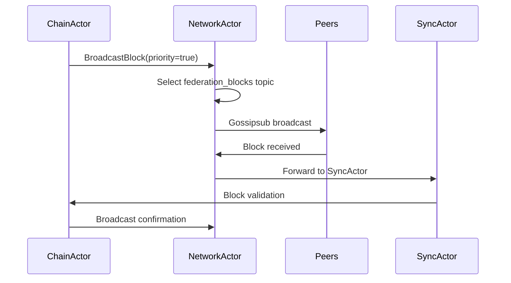
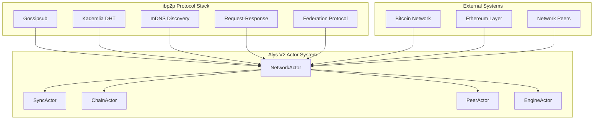
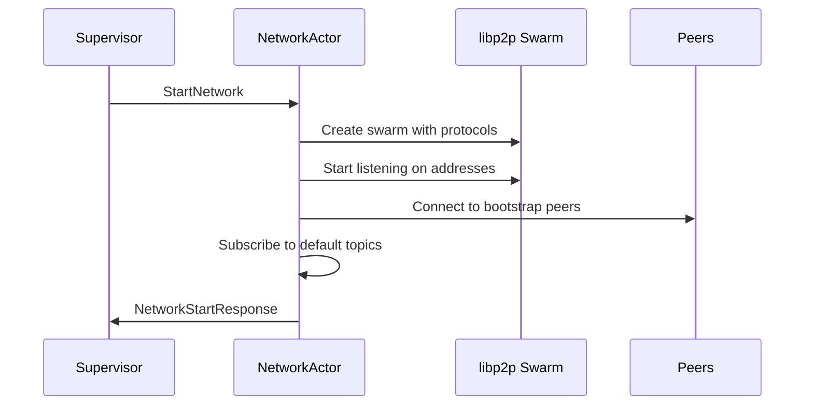
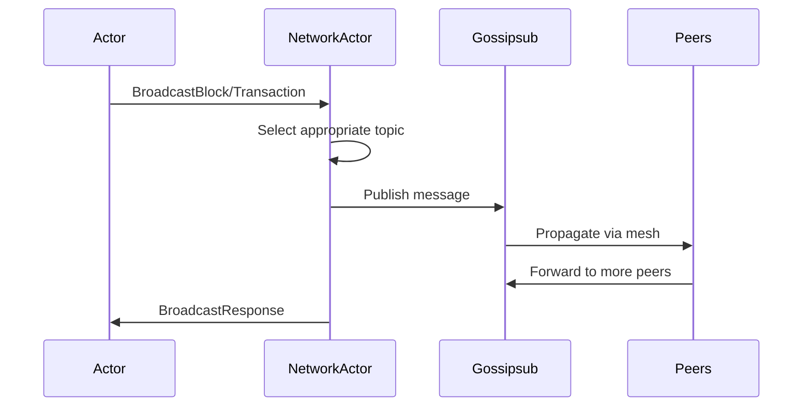

# NetworkActor Engineer Onboarding Guide for Alys V2

**System / Instructional Role:**  
You are an expert technical writer, senior blockchain engineer, and educator specializing in distributed systems and actor model architectures. You excel at creating in-depth onboarding materials that accelerate new engineers' understanding of complex blockchain actor systems, consensus mechanisms, and fault-tolerant distributed architectures.

---

## 🎯 Task  
This comprehensive onboarding guide provides an **end-to-end understanding** of the **NetworkActor** in the Alys V2 codebase: how it works, how its pieces fit together, and how to effectively debug and contribute to its implementation.

---

## Phase 1: Foundation & Orientation

### 1. Introduction & Purpose

The **NetworkActor** is the core P2P networking component that serves as the primary communication gateway for the Alys blockchain network. Its mission within the Alys V2 merged mining sidechain architecture is to provide reliable, efficient, and secure peer-to-peer communication that enables:

- **Block and transaction propagation** across the network
- **Federation consensus coordination** with priority message routing
- **Peer discovery and connection management** through multiple protocols
- **Network resilience** with automatic recovery and fault tolerance

#### Business Value
The NetworkActor enables the Alys blockchain to operate as a distributed system by:
- Ensuring rapid block propagation for mining coordination
- Providing reliable message delivery for federation consensus
- Maintaining network connectivity and peer discovery
- Supporting the two-way peg system through secure federation communication

#### Core User Flow: Block Production Pipeline


### 2. System Architecture & Core Flows

#### High-Level Architecture



#### Supervision Hierarchy
- **Parent**: System supervisor manages NetworkActor lifecycle
- **Children**: None (NetworkActor is a leaf actor)
- **Supervision Strategy**: One-for-one with exponential backoff restart policy
- **Recovery**: Automatic swarm reconstruction and peer reconnection

#### Key Workflows Sequence

##### Network Startup Sequence


##### Message Broadcasting Flow


### 3. Environment Setup & Tooling

#### Local Development Setup

**Prerequisites:**
- Rust 1.87.0+
- libp2p dependencies
- Protocol Buffers compiler
- Standard build tools

**Quick Start Commands:**
```bash
# Clone and navigate to project
cd /Users/michael/zDevelopment/Mara/alys

# Build NetworkActor components
cargo build --lib --package alys

# Start local 3-node network for testing
./scripts/start_network.sh

# Enable NetworkActor debug logging
export RUST_LOG=network_actor=debug,libp2p=info
```

**Configuration Files:**
- `app/src/actors/network/config.rs` - NetworkActor configuration
- `etc/config/network.json` - Network protocol settings
- `etc/config/federation.json` - Federation networking parameters

#### Essential Development Tools

**Testing Commands:**
```bash
# Run NetworkActor unit tests
cargo test --lib network_actor

# Run integration tests with real network
cargo test --test network_integration

# Benchmark NetworkActor performance
cargo bench --bench network_actor_benchmarks
```

**Debug Configuration:**
```bash
# Detailed networking logs
RUST_LOG=network_actor=trace,gossipsub=debug,kademlia=debug

# Monitor network metrics
RUST_LOG=network_actor=info,metrics=debug

# Federation-specific debugging
RUST_LOG=network_actor=debug,federation=trace
```

**Network Monitoring:**
- Prometheus metrics endpoint: `http://localhost:9090/metrics`
- libp2p connection info via debug logs
- Gossipsub message statistics in metrics
- DHT routing table status monitoring

---

## Phase 2: Deep Technical Understanding

### 4. Knowledge Tree (Progressive Deep-dive)

#### Roots: Actor Model Fundamentals

**Actix Framework Concepts:**
- **Message-Driven Architecture**: All NetworkActor operations are message-based
- **Async Message Handling**: Non-blocking processing with Tokio runtime
- **Supervision Trees**: Fault tolerance through supervisor restart strategies
- **Location Transparency**: Messages can be sent regardless of actor location

**Blockchain Networking Concepts:**
- **Gossip Protocols**: Epidemic-style message propagation for scalability
- **DHT (Distributed Hash Table)**: Decentralized peer discovery and routing
- **Federation Networks**: Trusted set of validators with special networking privileges
- **Network Partitions**: Handling split-brain scenarios in distributed systems

#### Trunk: Core NetworkActor Modules

**Primary Structure:**
```rust
pub struct NetworkActor {
    config: NetworkConfig,                           // Network configuration
    swarm: Option<Swarm<AlysNetworkBehaviour>>,     // libp2p swarm instance
    local_peer_id: PeerId,                          // This node's identity
    metrics: NetworkMetrics,                        // Performance statistics
    active_subscriptions: HashMap<String, Instant>, // Topic subscriptions
    pending_requests: HashMap<String, PendingRequest>, // Request tracking
    bootstrap_status: BootstrapStatus,              // DHT bootstrap state
}
```

**Key Modules:**
- `config.rs` - Network configuration management and validation
- `messages.rs` - Message type definitions and serialization
- `handlers/` - Message handler implementations
- `protocols/` - libp2p protocol implementations (gossip, discovery, request_response)
- `metrics.rs` - Network performance and health metrics

#### Branches: Integration Systems

**libp2p Protocol Integration:**
- **Gossipsub**: Message broadcasting with federation-aware routing
- **Kademlia**: DHT-based peer discovery and content routing
- **mDNS**: Local network automatic peer discovery
- **Identify**: Peer capability and version identification
- **Ping**: Connection liveness and latency measurement
- **Request-Response**: Direct peer-to-peer communication

**Actor System Integration:**
- **SyncActor Coordination**: Block synchronization and chain progress
- **ChainActor Integration**: Block production and validation coordination
- **PeerActor Collaboration**: Peer management and scoring
- **EngineActor Communication**: Execution layer networking

#### Leaves: Implementation Details

**Critical Functions:**
- `handle_start_network()` - Initialize and configure libp2p swarm
- `handle_broadcast_block()` - Propagate blocks with priority routing
- `handle_message_received()` - Process incoming gossipsub messages
- `handle_peer_connected()` - Manage new peer connections
- `handle_send_request()` - Direct peer communication
- `bootstrap_dht()` - DHT network joining process
- `update_metrics()` - Performance tracking and monitoring

### 5. Codebase Walkthrough

#### Folder/File Structure

```
app/src/actors/network/
├── mod.rs                      # Module exports and public API
├── actor.rs                    # Main NetworkActor implementation
├── config.rs                   # Configuration structures
├── messages.rs                 # Message type definitions
├── metrics.rs                  # Performance metrics
├── handlers/
│   ├── lifecycle.rs           # Network start/stop operations
│   ├── broadcast.rs           # Message broadcasting handlers
│   ├── peer_management.rs     # Peer connection management
│   └── event_processing.rs    # Network event handling
└── protocols/
    ├── gossip.rs              # Gossipsub protocol implementation
    ├── discovery.rs           # DHT and mDNS discovery
    ├── request_response.rs    # Direct communication protocol
    └── federation.rs          # Federation-specific networking
```

#### Integration Points

**Primary Integration - libp2p:**
```rust
#[derive(NetworkBehaviour)]
pub struct AlysNetworkBehaviour {
    gossipsub: Gossipsub,           // Message broadcasting & propagation
    kademlia: Kademlia,             // DHT for peer discovery
    mdns: Mdns,                     // Local network discovery
    identify: Identify,             // Peer identification protocol
    ping: Ping,                     // Connection keepalive
    request_response: RequestResponse, // Direct peer communication
    federation: FederationBehaviour,   // Custom federation logic
}
```

**Secondary Integrations:**
- **SyncActor**: Block synchronization coordination
- **ChainActor**: Block production and validation
- **PeerActor**: Peer scoring and connection management
- **Prometheus**: Metrics collection and monitoring

#### Example Message Flow

**Input Data Flow:**
- Bitcoin network events → NetworkActor → ChainActor
- Federation consensus messages → NetworkActor → Consensus system
- Transaction pool updates → NetworkActor → Broadcast to peers
- Peer discovery results → NetworkActor → PeerActor

**Output Data Flow:**
- Block production events → NetworkActor → Network broadcast
- Sync status updates → NetworkActor → SyncActor coordination
- Peer performance metrics → NetworkActor → PeerActor scoring
- Health status → NetworkActor → Monitoring systems

### 6. Message Protocol & Communication

#### Complete Message Types

**Network Lifecycle Messages:**
```rust
pub enum NetworkMessage {
    // Lifecycle Management
    StartNetwork {
        listen_addresses: Vec<Multiaddr>,
        bootstrap_peers: Vec<Multiaddr>,
        enable_mdns: bool,
    },
    StopNetwork { force: bool },
    GetNetworkStatus,
    
    // Message Broadcasting
    BroadcastBlock {
        block_data: Vec<u8>,
        block_height: u64,
        block_hash: String,
        priority: bool,
    },
    BroadcastTransaction {
        tx_data: Vec<u8>,
        tx_hash: String,
    },
    
    // Topic Management
    SubscribeToTopic { topic: GossipTopic },
    UnsubscribeFromTopic { topic: String },
    
    // Direct Communication
    SendRequest {
        peer_id: PeerId,
        request_data: Vec<u8>,
        timeout_ms: u64,
    },
    
    // Event Processing
    PeerConnected { peer_id: PeerId, info: PeerInfo },
    PeerDisconnected { peer_id: PeerId },
    MessageReceived { topic: String, data: Vec<u8>, peer: PeerId },
    NetworkEvent { event_type: NetworkEventType, data: String },
}
```

**Message Priority Levels:**
- **Critical (Federation)**: Consensus messages, emergency coordination
- **High (Blocks)**: Block propagation, mining coordination
- **Normal (Transactions)**: Transaction broadcasts, general communication
- **Low (Discovery)**: Peer discovery, network maintenance

#### Communication Patterns

**Federation-Aware Routing:**
```rust
// Priority topic selection based on message type
fn select_topic(&self, message_type: &MessageType, priority: bool) -> String {
    match (message_type, priority) {
        (MessageType::Block, true) => "alys/federation/blocks/v1".to_string(),
        (MessageType::Block, false) => "alys/blocks/v1".to_string(),
        (MessageType::Transaction, _) => "alys/transactions/v1".to_string(),
        (MessageType::Federation, _) => "alys/federation/consensus/v1".to_string(),
    }
}
```

**Message Validation:**
- **Size Limits**: Blocks (1MB), Transactions (256KB), Federation (2MB)
- **Content Validation**: Message format and signature verification
- **Rate Limiting**: Per-peer message rate controls
- **Deduplication**: SHA256-based message ID system

---

## Phase 3: Practical Implementation

### 7. Hands-on Development Guide

#### Step-by-Step Feature Implementation

**Example: Adding Custom Message Type**

**Step 1: Define Message Type**
```rust
// In messages.rs
#[derive(Debug, Clone, Message)]
#[rtype(result = "Result<CustomResponse, NetworkError>")]
pub struct CustomMessage {
    pub data: Vec<u8>,
    pub metadata: HashMap<String, String>,
}
```

**Step 2: Implement Handler**
```rust
// In handlers/custom.rs
impl Handler<CustomMessage> for NetworkActor {
    type Result = Result<CustomResponse, NetworkError>;
    
    fn handle(&mut self, msg: CustomMessage, ctx: &mut Context<Self>) -> Self::Result {
        // Validate message
        if msg.data.is_empty() {
            return Err(NetworkError::InvalidMessage);
        }
        
        // Process message
        let topic = self.select_custom_topic(&msg.metadata);
        self.broadcast_to_topic(&topic, &msg.data)?;
        
        // Update metrics
        self.metrics.messages_sent += 1;
        
        Ok(CustomResponse { success: true })
    }
}
```

**Step 3: Add Protocol Support**
```rust
// In protocols/custom.rs
pub fn handle_custom_protocol(
    &mut self,
    event: CustomProtocolEvent
) -> Result<(), NetworkError> {
    match event {
        CustomProtocolEvent::Request { peer, data } => {
            self.handle_custom_request(peer, data)
        },
        CustomProtocolEvent::Response { peer, data } => {
            self.handle_custom_response(peer, data)
        },
    }
}
```

**Step 4: Integration Testing**
```rust
// In tests/custom_message_test.rs
#[tokio::test]
async fn test_custom_message_broadcast() {
    let network_actor = create_test_network_actor().await;
    
    let custom_msg = CustomMessage {
        data: vec![1, 2, 3, 4],
        metadata: HashMap::new(),
    };
    
    let result = network_actor.send(custom_msg).await.unwrap();
    assert!(result.is_ok());
    
    // Verify message was broadcast
    assert_eq!(network_actor.metrics.messages_sent, 1);
}
```

#### NetworkActor Development Patterns

**1. Message Handler Pattern:**
```rust
impl Handler<MessageType> for NetworkActor {
    type Result = Result<ResponseType, NetworkError>;
    
    fn handle(&mut self, msg: MessageType, ctx: &mut Context<Self>) -> Self::Result {
        // 1. Validate input
        // 2. Process business logic
        // 3. Update metrics
        // 4. Return response
    }
}
```

**2. Protocol Integration Pattern:**
```rust
// Add new protocol to NetworkBehaviour
#[derive(NetworkBehaviour)]
pub struct AlysNetworkBehaviour {
    // ... existing protocols
    custom_protocol: CustomProtocol,
}

// Handle protocol events in main loop
match event {
    SwarmEvent::Behaviour(AlysNetworkBehaviourEvent::Custom(event)) => {
        self.handle_custom_protocol_event(event);
    }
}
```

**3. Federation Priority Pattern:**
```rust
fn prioritize_federation_message(&self, peer_id: &PeerId) -> bool {
    self.federation_peers.contains(peer_id) ||
    self.config.federation_config.federation_discovery
}
```

### 8. Testing & Quality Assurance

#### Unit Testing Framework

**Test Structure:**
```rust
#[cfg(test)]
mod tests {
    use super::*;
    use actix::test;
    
    #[tokio::test]
    async fn test_network_startup() {
        let addr = NetworkActor::new(test_config()).start();
        
        let start_msg = StartNetwork {
            listen_addresses: vec!["/ip4/127.0.0.1/tcp/0".parse().unwrap()],
            bootstrap_peers: vec![],
            enable_mdns: false,
        };
        
        let result = addr.send(start_msg).await.unwrap();
        assert!(result.is_ok());
    }
}
```

**Integration Testing:**
```bash
# Multi-node network testing
cargo test --test network_integration -- --test-threads=1

# Federation-specific tests
cargo test --test federation_network

# Performance benchmarks
cargo bench --bench network_throughput
```

#### Quality Gates for NetworkActor

**Unit Tests (100% success rate):**
- Message handler lifecycle testing
- Protocol integration validation
- Error handling and recovery
- Configuration parsing and validation

**Integration Tests (Full P2P compatibility with <1% failure rate):**
- Multi-node network simulation
- Cross-protocol communication
- Federation priority messaging
- Network partition recovery

**Performance Tests (Maintain targets under 1000+ concurrent messages):**
- Message throughput: 1000+ messages/second
- Message latency: <100ms average processing
- Memory usage: <50MB steady state
- CPU usage: <10% under normal load

**Chaos Tests (Automatic recovery within timing constraints):**
- Random peer disconnections
- Network partition scenarios
- Protocol upgrade handling
- Bootstrap failure recovery

### 9. Performance Optimization

#### Profiling NetworkActor Performance

**CPU Profiling:**
```bash
# Profile NetworkActor under load
cargo build --release
perf record --call-graph=dwarf ./target/release/alys &
# Generate load
kill %1
perf report
```

**Memory Profiling:**
```bash
# Memory usage analysis
valgrind --tool=massif ./target/release/alys
ms_print massif.out.*
```

**libp2p Metrics:**
```rust
// Monitor connection pool efficiency
pub struct NetworkMetrics {
    active_connections: u64,
    connection_pool_hits: u64,
    connection_pool_misses: u64,
    bandwidth_utilization: f64,
}
```

#### Optimization Techniques

**1. Connection Pooling Optimization:**
```rust
// Efficient connection reuse
fn optimize_connection_pool(&mut self) {
    // Remove stale connections
    self.connection_pool.retain(|_, conn| !conn.is_stale());
    
    // Pre-warm connections to federation peers
    for peer in &self.federation_peers {
        if !self.connection_pool.contains_key(peer) {
            self.establish_connection(peer);
        }
    }
}
```

**2. Message Batching:**
```rust
// Batch similar messages for efficiency
fn batch_broadcasts(&mut self, messages: Vec<BroadcastMessage>) {
    let batched = self.group_by_topic(messages);
    for (topic, batch) in batched {
        self.broadcast_batch(&topic, batch);
    }
}
```

**3. Peer Prioritization:**
```rust
// Prioritize federation peers for faster message delivery
fn prioritize_peer_connections(&mut self) {
    self.connections.sort_by_key(|conn| {
        if self.is_federation_peer(&conn.peer_id) { 0 } else { 1 }
    });
}
```

---

## Phase 4: Production & Operations

### 10. Monitoring & Observability

#### NetworkActor Metrics Collection

**Primary Metrics:**
```rust
pub struct NetworkMetrics {
    // Message Statistics
    messages_sent: u64,
    messages_received: u64,
    messages_failed: u64,
    
    // Bandwidth Monitoring
    total_bandwidth_in: u64,
    total_bandwidth_out: u64,
    bandwidth_rate_in: f64,
    bandwidth_rate_out: f64,
    
    // Connection Health
    active_connections: u64,
    failed_connections: u64,
    peer_latencies: HashMap<PeerId, Duration>,
    
    // Protocol Specific
    gossipsub_mesh_size: u64,
    kademlia_routing_table_size: u64,
    federation_peer_count: u64,
}
```

**Health Check Configuration:**
```rust
pub fn health_check(&self) -> NetworkHealthStatus {
    NetworkHealthStatus {
        is_healthy: self.active_connections > 0 && self.bootstrap_status.is_complete(),
        peer_count: self.active_connections,
        network_partition: self.detect_network_partition(),
        federation_connectivity: self.check_federation_connectivity(),
        last_message_time: self.last_message_received,
    }
}
```

**Dashboard Configuration:**
```yaml
# Prometheus monitoring setup
- job_name: 'alys-network-actor'
  static_configs:
    - targets: ['localhost:9090']
  metrics_path: /metrics
  scrape_interval: 10s
  scrape_timeout: 5s
```

#### Production Monitoring Setup

**Key Performance Indicators:**
- **Message Throughput**: >500 messages/second sustained
- **Connection Stability**: >95% uptime for peer connections
- **Federation Latency**: <50ms average for federation messages
- **Network Partition Detection**: <30 seconds detection time

**Alerting Rules:**
```yaml
groups:
  - name: network_actor_alerts
    rules:
    - alert: NetworkActorHighLatency
      expr: network_actor_message_latency_avg > 100
      for: 2m
      labels:
        severity: warning
      annotations:
        summary: "NetworkActor message latency is high"
    
    - alert: NetworkActorPartitionDetected
      expr: network_actor_connected_peers < 3
      for: 1m
      labels:
        severity: critical
      annotations:
        summary: "Network partition detected"
```

### 11. Debugging & Troubleshooting

#### Common Issues and Diagnostic Procedures

**Issue 1: Bootstrap Failure**
```rust
// Diagnostic procedure
fn diagnose_bootstrap_failure(&self) -> BootstrapDiagnosis {
    let mut issues = Vec::new();
    
    if self.bootstrap_peers.is_empty() {
        issues.push("No bootstrap peers configured");
    }
    
    for peer in &self.bootstrap_peers {
        if !self.can_reach_peer(peer) {
            issues.push(format!("Cannot reach bootstrap peer: {}", peer));
        }
    }
    
    BootstrapDiagnosis { issues }
}
```

**Resolution Steps:**
1. Check network connectivity to bootstrap peers
2. Verify bootstrap peer addresses are current
3. Confirm firewall rules allow outbound connections
4. Review DHT bootstrap configuration

**Issue 2: Message Broadcasting Failures**
```rust
// Debug message propagation
fn debug_broadcast_failure(&self, message_id: &str) -> BroadcastDiagnosis {
    let message_info = self.message_cache.get(message_id);
    let peer_reach = self.calculate_peer_reach(message_id);
    
    BroadcastDiagnosis {
        message_found: message_info.is_some(),
        peers_reached: peer_reach,
        gossipsub_mesh_health: self.check_gossipsub_mesh(),
        federation_routing: self.check_federation_routing(),
    }
}
```

**Resolution Workflow:**
```bash
# Enable detailed logging
RUST_LOG=network_actor=debug,gossipsub=trace

# Check network connectivity
netstat -an | grep 30303

# Monitor message propagation
tail -f logs/network_actor.log | grep "BroadcastMessage"

# Verify peer connections
curl localhost:9090/metrics | grep peer_count
```

#### Network Partition Recovery

**Detection Algorithm:**
```rust
fn detect_network_partition(&self) -> bool {
    let connected_peers = self.active_connections.len();
    let expected_min_peers = self.config.min_peer_threshold;
    
    connected_peers < expected_min_peers &&
    self.time_since_last_message() > Duration::from_secs(30)
}
```

**Recovery Process:**
1. **Immediate Response**: Switch to bootstrap recovery mode
2. **Peer Discovery**: Activate aggressive peer discovery
3. **Federation Reconnect**: Prioritize federation peer connections
4. **State Validation**: Verify network state consistency
5. **Normal Operations**: Resume normal networking operations

### 12. Documentation & Training Materials

#### NetworkActor Architecture Documentation

**System Design Overview:**
- **Purpose**: P2P networking backbone for Alys blockchain
- **Responsibilities**: Message broadcasting, peer management, federation coordination
- **Integration Points**: SyncActor, ChainActor, PeerActor coordination
- **Protocol Stack**: libp2p with Gossipsub, Kademlia, mDNS integration

**Message Protocol Specification:**
- **8 Primary Message Types**: Lifecycle, broadcasting, topic management, direct communication
- **Federation-Aware Routing**: Priority handling for consensus operations
- **Message Validation**: Size limits, content validation, rate limiting
- **Error Handling**: Comprehensive error types and recovery procedures

#### libp2p Integration Patterns

**Protocol Implementation Best Practices:**
```rust
// Custom protocol integration template
impl NetworkBehaviour for CustomProtocol {
    type ConnectionHandler = CustomProtocolHandler;
    type OutEvent = CustomProtocolEvent;
    
    fn new_handler(&mut self) -> Self::ConnectionHandler {
        CustomProtocolHandler::new(self.config.clone())
    }
    
    fn poll(&mut self, cx: &mut Context) -> Poll<NetworkBehaviourAction<Self::OutEvent>> {
        // Handle protocol-specific polling logic
        Poll::Pending
    }
}
```

#### API Reference Documentation

**Core NetworkActor API:**
```rust
// Main public interface
impl NetworkActor {
    pub fn new(config: NetworkConfig) -> Self { /* ... */ }
    pub async fn start_network(&mut self, params: StartNetworkParams) -> Result<NetworkStartResponse>;
    pub async fn broadcast_message(&mut self, message: BroadcastMessage) -> Result<BroadcastResponse>;
    pub async fn send_request(&mut self, request: DirectRequest) -> Result<RequestResponse>;
    pub fn get_network_status(&self) -> NetworkStatus;
    pub async fn stop_network(&mut self, force: bool) -> Result<()>;
}
```

**Configuration API:**
```rust
pub struct NetworkConfig {
    pub listen_addresses: Vec<Multiaddr>,
    pub bootstrap_peers: Vec<Multiaddr>,
    pub connection_timeout: Duration,
    pub gossip_config: GossipConfig,
    pub discovery_config: DiscoveryConfig,
    pub federation_config: FederationNetworkConfig,
}
```

---

## Phase 5: Mastery & Reference

### 13. Pro Tips & Best Practices

#### Expert NetworkActor Techniques

**1. Federation Message Optimization:**
```rust
// Batch federation messages for efficiency
fn optimize_federation_broadcasts(&mut self, messages: Vec<FederationMessage>) {
    // Group by consensus round
    let grouped: HashMap<u64, Vec<_>> = messages
        .into_iter()
        .group_by(|m| m.consensus_round)
        .into_iter()
        .collect();
    
    for (round, batch) in grouped {
        self.broadcast_federation_batch(round, batch);
    }
}
```

**2. Dynamic Peer Scoring:**
```rust
// Implement intelligent peer prioritization
fn calculate_peer_score(&self, peer_id: &PeerId) -> f64 {
    let latency_score = 1.0 / (self.peer_latencies[peer_id].as_millis() as f64 + 1.0);
    let reliability_score = self.peer_reliability[peer_id];
    let federation_bonus = if self.is_federation_peer(peer_id) { 2.0 } else { 1.0 };
    
    (latency_score + reliability_score) * federation_bonus
}
```

**3. Protocol Health Monitoring:**
```rust
// Proactive protocol health management
fn maintain_protocol_health(&mut self) {
    // Gossipsub mesh optimization
    if self.gossipsub_mesh_degree() < OPTIMAL_MESH_SIZE {
        self.request_gossipsub_graft();
    }
    
    // DHT table maintenance
    if self.kademlia_table_freshness() < FRESHNESS_THRESHOLD {
        self.trigger_dht_refresh();
    }
}
```

#### Performance Optimization Shortcuts

**Memory-Efficient Message Caching:**
```rust
// LRU cache with size limits
use lru::LruCache;

struct OptimizedMessageCache {
    cache: LruCache<String, CachedMessage>,
    max_memory: usize,
    current_memory: usize,
}

impl OptimizedMessageCache {
    fn insert(&mut self, key: String, message: CachedMessage) {
        while self.current_memory + message.size() > self.max_memory {
            if let Some((_, removed)) = self.cache.pop_lru() {
                self.current_memory -= removed.size();
            } else {
                break;
            }
        }
        
        self.current_memory += message.size();
        self.cache.put(key, message);
    }
}
```

#### Code Review Best Practices

**NetworkActor Development Standards:**
- **Error Handling**: Always use `Result<T, NetworkError>` for fallible operations
- **Logging**: Include peer IDs and message IDs in debug logs
- **Metrics**: Update performance metrics in all message handlers
- **Configuration**: Make all timeouts and limits configurable
- **Testing**: Write both unit and integration tests for new features

### 14. Quick Reference & Cheatsheets

#### NetworkActor Command Reference

**Development Commands:**
```bash
# Build NetworkActor
cargo build --package alys

# Run unit tests
cargo test --lib network_actor

# Run integration tests
cargo test --test network_integration

# Performance benchmarks
cargo bench --bench network_throughput

# Debug with detailed logging
RUST_LOG=network_actor=debug cargo run
```

**Configuration Checklist:**
- [ ] Bootstrap peers configured and reachable
- [ ] Listen addresses properly bound
- [ ] Federation peers identified correctly
- [ ] Gossipsub topics subscribed
- [ ] DHT bootstrap completed
- [ ] Metrics collection enabled
- [ ] Security protocols activated

#### Troubleshooting Checklist

**Network Connectivity Issues:**
1. [ ] Check firewall rules for ports 30303, 8545, 3000
2. [ ] Verify bootstrap peer reachability
3. [ ] Confirm network interface bindings
4. [ ] Test DNS resolution for peer addresses
5. [ ] Validate TLS/encryption settings

**Message Broadcasting Problems:**
1. [ ] Verify topic subscriptions are active
2. [ ] Check gossipsub mesh connectivity
3. [ ] Monitor message cache for duplicates
4. [ ] Validate message size limits
5. [ ] Confirm federation routing priority

**Performance Degradation:**
1. [ ] Monitor CPU and memory usage
2. [ ] Check network bandwidth utilization
3. [ ] Analyze peer connection stability
4. [ ] Review message queue depths
5. [ ] Verify garbage collection efficiency

#### Configuration Quick Reference

```toml
# Network configuration template
[network]
listen_addresses = [
    "/ip4/0.0.0.0/tcp/30303",
    "/ip6/::/tcp/30303"
]
bootstrap_peers = [
    "/ip4/bootstrap.alys.network/tcp/30303/p2p/12D3KooW..."
]

[gossipsub]
heartbeat_interval = "1s"
history_length = 5
mesh_n = 6
mesh_n_low = 5
mesh_n_high = 12

[federation]
discovery_enabled = true
priority_topics = [
    "alys/federation/consensus/v1",
    "alys/federation/blocks/v1"
]
```

### 15. Glossary & Advanced Learning

#### Key Terms and Concepts

**Actor Model Terms:**
- **Actor**: Isolated unit of computation that processes messages
- **Supervision**: Fault tolerance strategy for actor hierarchies
- **Message Passing**: Asynchronous communication between actors
- **Location Transparency**: Ability to send messages regardless of physical location

**Networking Terms:**
- **Gossipsub**: Publish-subscribe protocol for message broadcasting
- **DHT (Distributed Hash Table)**: Decentralized peer discovery system
- **mDNS**: Multicast DNS for local network discovery
- **Federation**: Trusted set of validators with special network privileges
- **Network Behaviour**: libp2p protocol composition pattern

**Blockchain-Specific Terms:**
- **Merged Mining**: Mining multiple blockchains simultaneously
- **Two-Way Peg**: System for moving assets between blockchains
- **Federation Consensus**: Consensus mechanism using trusted validator set
- **Block Broadcasting**: Propagation of new blocks across the network

#### Advanced Learning Paths

**Beginner Level:**
1. **Actor Model Fundamentals**: Study Actix framework documentation
2. **libp2p Basics**: Complete libp2p tutorial and examples
3. **Rust Networking**: Learn Tokio async networking patterns
4. **Basic P2P Concepts**: Understand gossip protocols and DHTs

**Intermediate Level:**
1. **NetworkActor Implementation**: Deep dive into codebase
2. **Protocol Integration**: Implement custom libp2p protocols  
3. **Performance Optimization**: Profile and optimize networking code
4. **Integration Testing**: Build comprehensive test suites

**Advanced Level:**
1. **Consensus Networking**: Study federation consensus protocols
2. **Network Security**: Implement advanced security measures
3. **Protocol Research**: Contribute to libp2p ecosystem
4. **Production Operations**: Master large-scale deployment