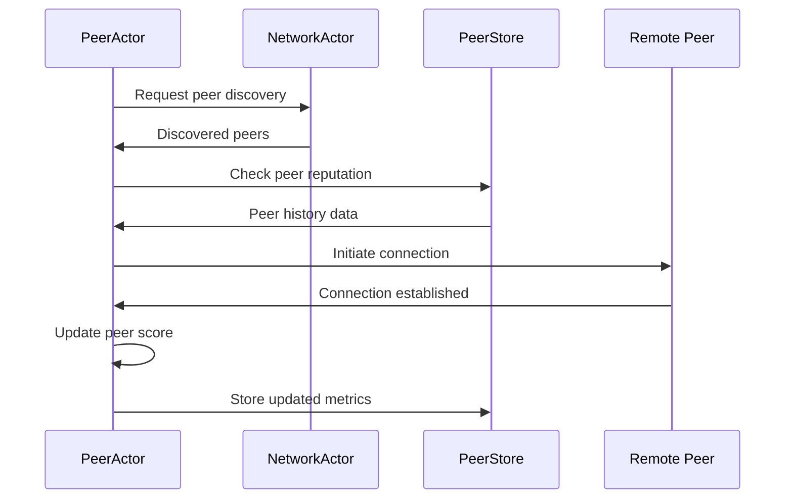
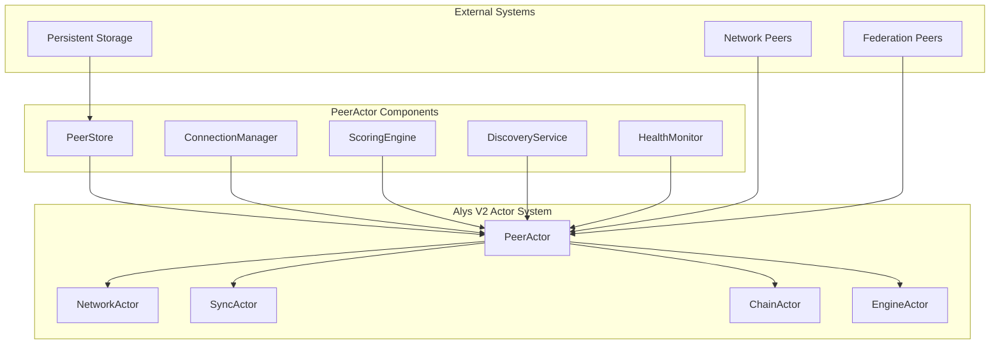
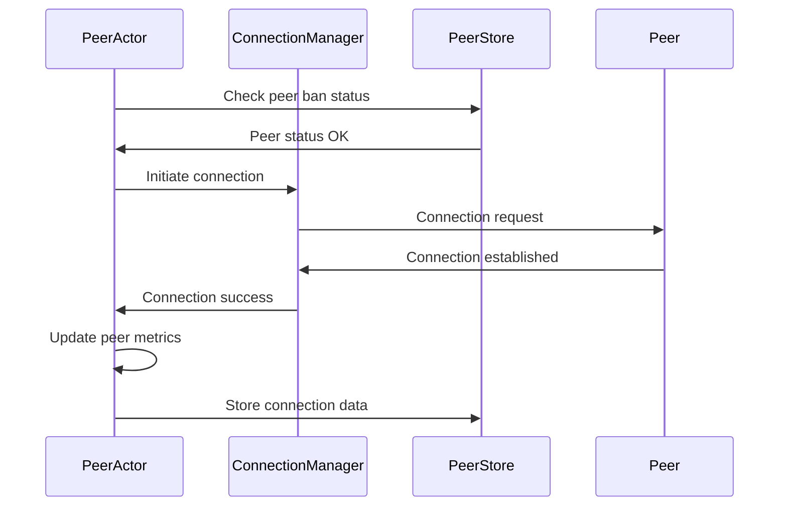
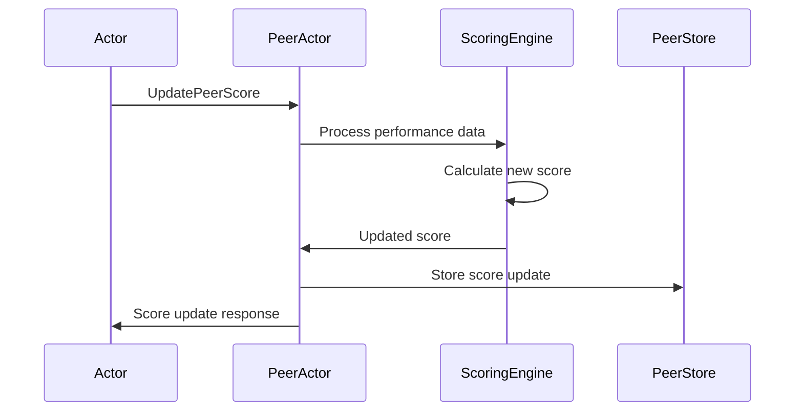

# PeerActor Engineer Onboarding Guide for Alys V2

**System / Instructional Role:**  
You are an expert technical writer, senior blockchain engineer, and educator specializing in distributed systems and actor model architectures. You excel at creating in-depth onboarding materials that accelerate new engineers' understanding of complex blockchain actor systems, consensus mechanisms, and fault-tolerant distributed architectures.

---

## 🎯 Task  
This comprehensive onboarding guide provides an **end-to-end understanding** of the **PeerActor** in the Alys V2 codebase: how it works, how its pieces fit together, and how to effectively debug and contribute to its implementation.

---

## Phase 1: Foundation & Orientation

### 1. Introduction & Purpose

The **PeerActor** is the peer connection management and scoring component responsible for maintaining optimal peer relationships, connection quality assessment, and federation peer prioritization. Its mission within the Alys V2 merged mining sidechain architecture is to ensure the network operates with the highest quality peer connections by:

- **Managing 1000+ concurrent peer connections** with intelligent scoring and selection
- **Providing federation peer prioritization** for consensus operations
- **Maintaining connection quality assessment** through continuous monitoring
- **Coordinating peer discovery** with NetworkActor for optimal network topology

#### Business Value
The PeerActor enables the Alys blockchain to operate efficiently by:
- Ensuring high-quality connections for reliable block propagation
- Prioritizing federation peers for consensus operations
- Reducing network latency through optimal peer selection
- Providing resilient connectivity through intelligent peer management

#### Core User Flow: Peer Connection Lifecycle


### 2. System Architecture & Core Flows

#### High-Level Architecture



#### Supervision Hierarchy
- **Parent**: System supervisor manages PeerActor lifecycle
- **Children**: Component managers (ConnectionManager, ScoringEngine, HealthMonitor)
- **Supervision Strategy**: One-for-one with incremental backoff restart policy
- **Recovery**: Automatic peer data restoration and connection re-establishment

#### Key Workflows Sequence

##### Peer Connection Establishment


##### Peer Scoring Update Flow


### 3. Environment Setup & Tooling

#### Local Development Setup

**Prerequisites:**
- Rust 1.87.0+
- Database dependencies (SQLite/PostgreSQL)
- Network testing tools
- Standard build tools

**Quick Start Commands:**
```bash
# Clone and navigate to project
cd /Users/michael/zDevelopment/Mara/alys

# Build PeerActor components
cargo build --lib --package alys

# Start local 3-node network for peer testing
./scripts/start_network.sh

# Enable PeerActor debug logging
export RUST_LOG=peer_actor=debug,connection_manager=info
```

**Configuration Files:**
- `app/src/actors/network/peer/config.rs` - PeerActor configuration
- `etc/config/peers.json` - Peer management settings
- `etc/config/scoring.json` - Scoring algorithm parameters

#### Essential Development Tools

**Testing Commands:**
```bash
# Run PeerActor unit tests
cargo test --lib peer_actor

# Run peer management integration tests
cargo test --test peer_integration

# Benchmark peer scoring performance
cargo bench --bench peer_scoring_benchmarks
```

**Debug Configuration:**
```bash
# Detailed peer management logs
RUST_LOG=peer_actor=trace,scoring_engine=debug,connection_manager=debug

# Monitor peer scoring metrics
RUST_LOG=peer_actor=info,scoring=debug

# Federation peer debugging
RUST_LOG=peer_actor=debug,federation_peers=trace
```

**Peer Monitoring:**
- Peer metrics endpoint: `http://localhost:9090/metrics/peers`
- Connection status dashboard in logs
- Scoring distribution monitoring
- Ban list and cleanup tracking

---

## Phase 2: Deep Technical Understanding

### 4. Knowledge Tree (Progressive Deep-dive)

#### Roots: Actor Model Fundamentals

**Actix Framework Concepts:**
- **Message-Driven Architecture**: All PeerActor operations are message-based
- **Async Message Handling**: Non-blocking peer operations with Tokio runtime
- **Supervision Trees**: Fault tolerance through supervisor restart strategies
- **Component Isolation**: Separated concerns for scoring, connections, and storage

**Peer Management Concepts:**
- **Connection Pooling**: Efficient management of limited connection resources
- **Reputation Systems**: Long-term peer behavior assessment and scoring
- **Federation Networks**: Special handling for trusted validator peers
- **Discovery Coordination**: Integration with network-wide peer discovery

#### Trunk: Core PeerActor Modules

**Primary Structure:**
```rust
pub struct PeerActor {
    config: PeerConfig,                    // Peer management configuration
    peer_store: PeerStore,                 // Persistent peer information storage
    connection_manager: ConnectionManager, // Active connection management
    scoring_engine: ScoringEngine,         // Peer performance scoring
    discovery_service: DiscoveryService,   // Peer discovery coordination
    health_monitor: HealthMonitor,         // Connection health tracking
    metrics: PeerMetrics,                  // Performance and usage metrics
}
```

**Key Modules:**
- `config.rs` - Peer management configuration and validation
- `messages.rs` - Message type definitions for peer operations
- `handlers/` - Message handler implementations
- `peer_store.rs` - Persistent peer data management
- `scoring.rs` - Peer scoring algorithms and reputation
- `connection_manager.rs` - Connection lifecycle management

#### Branches: Integration Systems

**Actor System Integration:**
- **NetworkActor Coordination**: Peer discovery and connection events
- **SyncActor Integration**: Optimal peer selection for sync operations
- **ChainActor Collaboration**: Federation peer management for consensus
- **EngineActor Communication**: Peer selection for execution layer operations

**Data Management Systems:**
- **Persistent Storage**: Long-term peer reputation and history
- **Connection State**: Active connection tracking and management
- **Scoring Engine**: Multi-factor peer performance assessment
- **Health Monitoring**: Continuous connection quality assessment

#### Leaves: Implementation Details

**Critical Functions:**
- `handle_connect_to_peer()` - Establish connection with priority handling
- `handle_update_peer_score()` - Process peer performance updates
- `calculate_peer_score()` - Multi-factor scoring algorithm implementation
- `handle_get_best_peers()` - Select optimal peers for operations
- `handle_ban_peer()` - Ban management with duration and severity
- `monitor_peer_health()` - Continuous health assessment
- `cleanup_stale_data()` - Maintenance and resource management

### 5. Codebase Walkthrough

#### Folder/File Structure

```
app/src/actors/network/peer/
├── mod.rs                      # Module exports and public API
├── actor.rs                    # Main PeerActor implementation
├── config.rs                   # Configuration structures
├── messages.rs                 # Message type definitions
├── metrics.rs                  # Performance metrics and monitoring
├── handlers/
│   ├── connection.rs          # Connection management handlers
│   ├── scoring.rs             # Peer scoring handlers
│   ├── discovery.rs           # Discovery coordination handlers
│   └── health.rs              # Health monitoring handlers
├── components/
│   ├── peer_store.rs          # Persistent peer data storage
│   ├── connection_manager.rs  # Connection lifecycle management
│   ├── scoring_engine.rs      # Peer performance scoring
│   └── health_monitor.rs      # Connection health tracking
└── utils/
    ├── scoring_utils.rs       # Scoring calculation utilities
    └── connection_utils.rs    # Connection helper functions
```

#### Integration Points

**Primary Integration - NetworkActor:**
```rust
// Coordination with NetworkActor for peer discovery
pub struct DiscoveryCoordination {
    network_actor: Addr<NetworkActor>,
    discovery_requests: HashMap<String, DiscoveryRequest>,
    discovered_peers: Vec<PeerInfo>,
}
```

**Secondary Integrations:**
- **SyncActor**: Provides optimal peers for sync operations
- **ChainActor**: Manages federation peer connections
- **Persistent Storage**: Long-term peer data and reputation
- **Prometheus**: Metrics collection and monitoring

#### Example Message Flow

**Input Data Flow:**
- NetworkActor peer discovery results → PeerActor → Connection attempts
- Actor performance reports → PeerActor → Scoring updates
- Federation peer notifications → PeerActor → Priority handling
- Health monitoring data → PeerActor → Connection quality assessment

**Output Data Flow:**
- Optimal peer selections → Requesting actors
- Connection status updates → NetworkActor
- Performance metrics → Monitoring systems
- Ban list updates → NetworkActor and security systems

### 6. Message Protocol & Communication

#### Complete Message Types

**Connection Management Messages:**
```rust
pub enum PeerMessage {
    // Connection Management
    ConnectToPeer {
        peer_id: Option<PeerId>,
        address: Multiaddr,
        priority: ConnectionPriority,
    },
    DisconnectPeer {
        peer_id: PeerId,
        reason: String,
        ban_duration: Option<Duration>,
    },
    GetPeerStatus { peer_id: PeerId },
    GetConnectedPeers { filter_criteria: Option<PeerFilter> },
    
    // Peer Scoring & Selection
    UpdatePeerScore {
        peer_id: PeerId,
        interaction_type: InteractionType,
        performance_data: PerformanceData,
    },
    GetBestPeers {
        count: usize,
        operation_type: OperationType,
        exclude_peers: Vec<PeerId>,
    },
    BanPeer {
        peer_id: PeerId,
        duration: BanDuration,
        reason: String,
        severity: BanSeverity,
    },
    GetPeerScore { peer_id: PeerId },
    
    // Discovery Operations
    StartDiscovery {
        discovery_type: DiscoveryType,
        target_count: usize,
        filters: Vec<PeerFilter>,
    },
    StopDiscovery,
}
```

**Connection Priority Levels:**
```rust
pub enum ConnectionPriority {
    Low,        // Background connections
    Normal,     // Standard peer connections
    High,       // Important peer connections (good performers)
    Federation, // Federation consensus peers (highest priority)
}
```

#### Communication Patterns

**Multi-Factor Scoring Algorithm:**
```rust
// Comprehensive peer scoring implementation
fn calculate_peer_score(peer: &PeerData) -> f64 {
    let latency_score = 1.0 - (peer.avg_latency.as_secs_f64() / MAX_ACCEPTABLE_LATENCY);
    let reliability_score = peer.success_rate;
    let availability_score = peer.uptime_percentage;
    let freshness_score = time_decay_factor(peer.last_interaction);
    
    let base_score = (latency_score * 0.3) + 
                     (reliability_score * 0.4) + 
                     (availability_score * 0.2) + 
                     (freshness_score * 0.1);
    
    // Federation peer bonus
    let final_score = if peer.is_federation_peer {
        base_score * FEDERATION_BONUS_MULTIPLIER // 1.5x bonus
    } else {
        base_score
    };
    
    final_score.clamp(0.0, 1.0)
}
```

**Performance Data Types:**
- **Latency Metrics**: Connection response times and round-trip measurements
- **Reliability Metrics**: Success rates for requests and operations
- **Availability Metrics**: Uptime percentage and connection stability
- **Bandwidth Metrics**: Data transfer rates and efficiency

---

## Phase 3: Practical Implementation

### 7. Hands-on Development Guide

#### Step-by-Step Feature Implementation

**Example: Adding Custom Peer Scoring Factor**

**Step 1: Extend Performance Data**
```rust
// In peer_data.rs
#[derive(Debug, Clone, Serialize, Deserialize)]
pub struct PerformanceData {
    pub latency: Duration,
    pub success_rate: f64,
    pub uptime_percentage: f64,
    pub last_interaction: Instant,
    // Add new scoring factor
    pub protocol_compliance: f64,  // New factor
}
```

**Step 2: Update Scoring Algorithm**
```rust
// In scoring_engine.rs
impl ScoringEngine {
    pub fn calculate_peer_score(&self, peer: &PeerData) -> f64 {
        let latency_score = self.calculate_latency_score(&peer);
        let reliability_score = peer.success_rate;
        let availability_score = peer.uptime_percentage;
        let freshness_score = self.time_decay_factor(peer.last_interaction);
        let compliance_score = peer.protocol_compliance; // New factor
        
        let base_score = (latency_score * 0.25) +      // Adjusted weights
                         (reliability_score * 0.35) +  // Adjusted weights
                         (availability_score * 0.20) + 
                         (freshness_score * 0.10) +
                         (compliance_score * 0.10);    // New factor
        
        if peer.is_federation_peer {
            base_score * FEDERATION_BONUS_MULTIPLIER
        } else {
            base_score
        }.clamp(0.0, 1.0)
    }
}
```

**Step 3: Add Message Handler**
```rust
// In handlers/scoring.rs
impl Handler<UpdateProtocolCompliance> for PeerActor {
    type Result = Result<(), PeerError>;
    
    fn handle(&mut self, msg: UpdateProtocolCompliance, ctx: &mut Context<Self>) -> Self::Result {
        // Validate compliance data
        if msg.compliance_score < 0.0 || msg.compliance_score > 1.0 {
            return Err(PeerError::InvalidComplianceScore);
        }
        
        // Update peer data
        if let Some(peer) = self.peer_store.get_mut(&msg.peer_id) {
            peer.performance_data.protocol_compliance = msg.compliance_score;
            
            // Recalculate peer score
            let new_score = self.scoring_engine.calculate_peer_score(peer);
            peer.current_score = new_score;
            
            // Update metrics
            self.metrics.scoring_updates += 1;
            
            // Persist changes
            self.peer_store.save(peer)?;
        }
        
        Ok(())
    }
}
```

**Step 4: Integration Testing**
```rust
// In tests/custom_scoring_test.rs
#[tokio::test]
async fn test_protocol_compliance_scoring() {
    let peer_actor = create_test_peer_actor().await;
    
    // Add peer with compliance data
    let peer_id = PeerId::random();
    let update_msg = UpdateProtocolCompliance {
        peer_id,
        compliance_score: 0.95,
    };
    
    let result = peer_actor.send(update_msg).await.unwrap();
    assert!(result.is_ok());
    
    // Verify score calculation
    let score_msg = GetPeerScore { peer_id };
    let score_response = peer_actor.send(score_msg).await.unwrap();
    
    assert!(score_response.score > 0.8); // High compliance should boost score
}
```

#### PeerActor Development Patterns

**1. Connection Management Pattern:**
```rust
impl Handler<MessageType> for PeerActor {
    type Result = Result<ResponseType, PeerError>;
    
    fn handle(&mut self, msg: MessageType, ctx: &mut Context<Self>) -> Self::Result {
        // 1. Validate connection limits
        // 2. Check peer ban status
        // 3. Process connection request
        // 4. Update metrics and store
        // 5. Return response
    }
}
```

**2. Scoring Update Pattern:**
```rust
// Consistent scoring update workflow
fn update_peer_performance(&mut self, peer_id: &PeerId, performance: PerformanceData) -> Result<(), PeerError> {
    // 1. Retrieve existing peer data
    let peer = self.peer_store.get_mut(peer_id)?;
    
    // 2. Update performance metrics
    peer.update_performance(performance);
    
    // 3. Recalculate score
    let new_score = self.scoring_engine.calculate_peer_score(peer);
    peer.current_score = new_score;
    
    // 4. Persist changes
    self.peer_store.save(peer)?;
    
    // 5. Update metrics
    self.metrics.score_updates += 1;
    
    Ok(())
}
```

**3. Federation Priority Pattern:**
```rust
fn prioritize_federation_peers(&self, peers: &mut Vec<PeerInfo>) {
    peers.sort_by(|a, b| {
        match (a.is_federation_peer, b.is_federation_peer) {
            (true, false) => std::cmp::Ordering::Less,    // Federation first
            (false, true) => std::cmp::Ordering::Greater, // Non-federation second
            _ => a.score.partial_cmp(&b.score).unwrap_or(std::cmp::Ordering::Equal).reverse(),
        }
    });
}
```

### 8. Testing & Quality Assurance

#### Unit Testing Framework

**Test Structure:**
```rust
#[cfg(test)]
mod tests {
    use super::*;
    use actix::test;
    
    #[tokio::test]
    async fn test_peer_connection_lifecycle() {
        let addr = PeerActor::new(test_config()).start();
        
        let connect_msg = ConnectToPeer {
            peer_id: Some(PeerId::random()),
            address: "/ip4/127.0.0.1/tcp/30303".parse().unwrap(),
            priority: ConnectionPriority::Normal,
        };
        
        let result = addr.send(connect_msg).await.unwrap();
        assert!(result.is_ok());
        
        // Verify connection is tracked
        let status_msg = GetConnectedPeers { filter_criteria: None };
        let peers = addr.send(status_msg).await.unwrap();
        assert_eq!(peers.peers.len(), 1);
    }
}
```

**Integration Testing:**
```bash
# Multi-peer system testing
cargo test --test peer_management_integration -- --test-threads=1

# Federation peer testing
cargo test --test federation_peer_management

# Performance benchmarks
cargo bench --bench peer_scoring_performance
```

#### Quality Gates for PeerActor

**Unit Tests (100% success rate):**
- Scoring algorithm correctness and edge cases
- Connection lifecycle management
- Ban system duration and cleanup
- Federation peer prioritization

**Integration Tests (1000+ peer management with <1% failure rate):**
- Large-scale peer connection management
- Cross-actor peer coordination
- Performance under high peer churn
- Federation peer handling accuracy

**Performance Tests (Maintain targets under high load):**
- Connection throughput: 100+ connections/second
- Scoring updates: 1000+ updates/second
- Memory usage: <100MB for 1000 peers
- Response latency: <50ms for peer operations

**Chaos Tests (Automatic recovery within timing constraints):**
- Random peer disconnections and reconnections
- Network partition scenarios
- Database corruption recovery
- Federation peer failure handling

### 9. Performance Optimization

#### Profiling PeerActor Performance

**CPU Profiling:**
```bash
# Profile PeerActor under load
cargo build --release
perf record --call-graph=dwarf ./target/release/alys &
# Generate peer load
kill %1
perf report
```

**Memory Profiling:**
```bash
# Memory usage analysis with 1000+ peers
valgrind --tool=massif ./target/release/alys
ms_print massif.out.*
```

**Peer Management Metrics:**
```rust
// Monitor peer store efficiency
pub struct PeerMetrics {
    active_connections: u64,
    peer_store_size: u64,
    scoring_calculations_per_second: u64,
    memory_usage_bytes: u64,
    connection_success_rate: f64,
}
```

#### Optimization Techniques

**1. Efficient Peer Storage:**
```rust
// Optimized peer data structure with memory pooling
struct OptimizedPeerStore {
    peers: HashMap<PeerId, Box<StoredPeer>>,  // Boxed to reduce stack usage
    peer_pool: Vec<Box<StoredPeer>>,          // Pre-allocated peer objects
    stale_cleanup_interval: Duration,
}

impl OptimizedPeerStore {
    fn add_peer(&mut self, peer_id: PeerId, peer_info: PeerInfo) {
        // Reuse from pool if available
        let peer_box = self.peer_pool.pop()
            .unwrap_or_else(|| Box::new(StoredPeer::default()));
        
        *peer_box = StoredPeer::from(peer_info);
        self.peers.insert(peer_id, peer_box);
    }
    
    fn remove_peer(&mut self, peer_id: &PeerId) -> Option<Box<StoredPeer>> {
        if let Some(peer) = self.peers.remove(peer_id) {
            // Return to pool for reuse
            self.peer_pool.push(peer);
            Some(peer)
        } else {
            None
        }
    }
}
```

**2. Batch Scoring Updates:**
```rust
// Batch scoring updates for efficiency
fn batch_score_updates(&mut self, updates: Vec<ScoreUpdate>) {
    let mut peer_updates = HashMap::new();
    
    // Group updates by peer
    for update in updates {
        peer_updates.entry(update.peer_id)
            .or_insert_with(Vec::new)
            .push(update);
    }
    
    // Process all updates for each peer at once
    for (peer_id, peer_updates) in peer_updates {
        if let Some(peer) = self.peer_store.get_mut(&peer_id) {
            for update in peer_updates {
                peer.update_performance(update.performance_data);
            }
            
            // Single score calculation per peer
            let new_score = self.scoring_engine.calculate_peer_score(peer);
            peer.current_score = new_score;
        }
    }
}
```

**3. Connection Priority Queuing:**
```rust
// Priority queue for efficient connection management
use std::collections::BinaryHeap;

struct PriorityConnectionManager {
    high_priority_queue: BinaryHeap<ConnectionRequest>,
    normal_priority_queue: BinaryHeap<ConnectionRequest>,
    active_connections: HashMap<PeerId, Connection>,
    max_connections: usize,
}

impl PriorityConnectionManager {
    fn process_connection_requests(&mut self) {
        while self.active_connections.len() < self.max_connections {
            // Process high priority first
            if let Some(request) = self.high_priority_queue.pop() {
                self.establish_connection(request);
            } else if let Some(request) = self.normal_priority_queue.pop() {
                self.establish_connection(request);
            } else {
                break;
            }
        }
    }
}
```

---

## Phase 4: Production & Operations

### 10. Monitoring & Observability

#### PeerActor Metrics Collection

**Primary Metrics:**
```rust
pub struct PeerMetrics {
    // Connection Statistics
    total_connections: u64,
    active_connections: u64,
    failed_connections: u64,
    connection_success_rate: f64,
    
    // Peer Performance
    average_peer_score: f64,
    score_distribution: HashMap<String, u64>, // Score ranges
    federation_peer_count: u64,
    banned_peer_count: u64,
    
    // System Performance
    scoring_calculations_per_second: u64,
    peer_store_size: u64,
    memory_usage_bytes: u64,
    cpu_usage_percent: f64,
    
    // Discovery Performance
    discovery_requests: u64,
    discovery_success_rate: f64,
    peers_discovered_per_hour: u64,
}
```

**Health Check Configuration:**
```rust
pub fn health_check(&self) -> PeerHealthStatus {
    PeerHealthStatus {
        is_healthy: self.active_connections > self.config.min_connections,
        connection_count: self.active_connections,
        peer_quality_average: self.calculate_average_score(),
        federation_connectivity: self.check_federation_peers(),
        ban_list_size: self.get_banned_peer_count(),
        last_discovery_time: self.last_successful_discovery,
    }
}
```

**Dashboard Configuration:**
```yaml
# Prometheus monitoring setup for PeerActor
- job_name: 'alys-peer-actor'
  static_configs:
    - targets: ['localhost:9090']
  metrics_path: /metrics/peers
  scrape_interval: 15s
  scrape_timeout: 10s
```

#### Production Monitoring Setup

**Key Performance Indicators:**
- **Connection Quality**: >0.7 average peer score
- **Connection Stability**: >95% connection success rate
- **Federation Coverage**: >80% federation peers connected
- **Discovery Efficiency**: >90% discovery success rate

**Alerting Rules:**
```yaml
groups:
  - name: peer_actor_alerts
    rules:
    - alert: PeerActorLowQualityPeers
      expr: peer_actor_average_score < 0.5
      for: 5m
      labels:
        severity: warning
      annotations:
        summary: "PeerActor average peer quality is low"
    
    - alert: PeerActorConnectionFailures
      expr: peer_actor_connection_success_rate < 0.8
      for: 2m
      labels:
        severity: critical
      annotations:
        summary: "High peer connection failure rate"
        
    - alert: PeerActorFederationDisconnected
      expr: peer_actor_federation_peers < 3
      for: 1m
      labels:
        severity: critical
      annotations:
        summary: "Insufficient federation peer connections"
```

### 11. Debugging & Troubleshooting

#### Common Issues and Diagnostic Procedures

**Issue 1: Low Peer Quality Scores**
```rust
// Diagnostic procedure for peer quality issues
fn diagnose_peer_quality(&self) -> PeerQualityDiagnosis {
    let mut issues = Vec::new();
    let score_distribution = self.calculate_score_distribution();
    
    if score_distribution.low_scores > 0.5 {
        issues.push("High percentage of low-quality peers");
    }
    
    if self.metrics.connection_success_rate < 0.8 {
        issues.push("Poor connection success rate affecting scores");
    }
    
    if self.last_discovery_time.elapsed() > Duration::from_hours(1) {
        issues.push("Stale peer discovery affecting peer quality");
    }
    
    PeerQualityDiagnosis {
        issues,
        average_score: self.calculate_average_score(),
        recommendations: self.generate_quality_recommendations(),
    }
}
```

**Resolution Steps:**
1. Review peer scoring algorithm weights
2. Check network connectivity to high-quality peers
3. Trigger new peer discovery operations
4. Review federation peer status and connectivity
5. Analyze ban list for false positives

**Issue 2: Connection Management Failures**
```rust
// Debug connection management issues
fn debug_connection_failures(&self) -> ConnectionDiagnosis {
    let failed_attempts = self.get_failed_connection_attempts();
    let connection_limits = self.check_connection_limits();
    
    ConnectionDiagnosis {
        failure_rate: self.calculate_failure_rate(),
        common_failure_reasons: self.analyze_failure_patterns(),
        resource_constraints: connection_limits,
        recommended_actions: self.generate_connection_recommendations(),
    }
}
```

**Resolution Workflow:**
```bash
# Enable detailed peer management logging
RUST_LOG=peer_actor=debug,connection_manager=trace

# Check peer store integrity
curl localhost:9090/debug/peer_store/validate

# Monitor connection attempts in real-time
tail -f logs/peer_actor.log | grep "ConnectionAttempt"

# Verify peer scoring distribution
curl localhost:9090/metrics/peers | grep score_distribution
```

#### Federation Peer Management Issues

**Detection Algorithm:**
```rust
fn detect_federation_issues(&self) -> FederationDiagnosis {
    let federation_peers = self.get_federation_peers();
    let connected_federation = federation_peers.iter()
        .filter(|p| p.is_connected())
        .count();
    
    FederationDiagnosis {
        total_federation_peers: federation_peers.len(),
        connected_federation_peers: connected_federation,
        connection_health: self.assess_federation_health(),
        priority_handling: self.verify_federation_priority(),
    }
}
```

**Recovery Process:**
1. **Immediate Response**: Prioritize federation peer connections
2. **Discovery**: Trigger targeted federation peer discovery
3. **Connection Recovery**: Attempt reconnection with exponential backoff
4. **Health Assessment**: Validate federation peer performance
5. **Monitoring**: Enhanced monitoring for federation connectivity

### 12. Documentation & Training Materials

#### PeerActor Architecture Documentation

**System Design Overview:**
- **Purpose**: Intelligent peer connection management for optimal network performance
- **Responsibilities**: Connection lifecycle, peer scoring, federation prioritization
- **Integration Points**: NetworkActor, SyncActor, ChainActor coordination
- **Scalability**: Designed for 1000+ concurrent peer connections

**Message Protocol Specification:**
- **9 Primary Message Types**: Connection management, scoring, discovery operations
- **Multi-Factor Scoring**: Latency, reliability, availability, federation bonus
- **Connection Priorities**: Low, Normal, High, Federation priority levels
- **Ban Management**: Temporary, extended, and permanent banning capabilities

#### Peer Scoring Algorithm Documentation

**Scoring Factor Implementation:**
```rust
// Comprehensive scoring algorithm documentation
pub struct ScoringFactors {
    pub latency: f64,      // 30% weight - Connection responsiveness
    pub reliability: f64,  // 40% weight - Success rate for operations
    pub availability: f64, // 20% weight - Uptime and stability
    pub freshness: f64,    // 10% weight - Recent activity
    pub federation_bonus: f64, // 50% bonus for federation peers
}

impl ScoringFactors {
    pub fn calculate_composite_score(&self) -> f64 {
        let base_score = (self.latency * 0.3) +
                         (self.reliability * 0.4) +
                         (self.availability * 0.2) +
                         (self.freshness * 0.1);
        
        if self.federation_bonus > 0.0 {
            base_score * 1.5 // Federation bonus multiplier
        } else {
            base_score
        }.clamp(0.0, 1.0)
    }
}
```

#### API Reference Documentation

**Core PeerActor API:**
```rust
// Main public interface
impl PeerActor {
    pub fn new(config: PeerConfig) -> Self { /* ... */ }
    pub async fn connect_to_peer(&mut self, params: ConnectToPeerParams) -> Result<ConnectionResponse>;
    pub async fn get_best_peers(&mut self, request: BestPeersRequest) -> Result<BestPeersResponse>;
    pub async fn update_peer_score(&mut self, update: PeerScoreUpdate) -> Result<()>;
    pub async fn ban_peer(&mut self, ban: PeerBan) -> Result<BanResponse>;
    pub fn get_peer_metrics(&self) -> PeerMetrics;
}
```

**Configuration API:**
```rust
pub struct PeerConfig {
    pub max_connections: usize,
    pub max_federation_peers: usize,
    pub connection_timeout: Duration,
    pub health_check_interval: Duration,
    pub score_decay_interval: Duration,
    pub ban_check_interval: Duration,
    pub discovery_config: DiscoveryConfig,
    pub scoring_config: ScoringConfig,
}
```

---

## Phase 5: Mastery & Reference

### 13. Pro Tips & Best Practices

#### Expert PeerActor Techniques

**1. Adaptive Scoring Weights:**
```rust
// Dynamically adjust scoring weights based on network conditions
fn adapt_scoring_weights(&mut self, network_conditions: &NetworkConditions) {
    match network_conditions.primary_issue {
        NetworkIssue::HighLatency => {
            self.scoring_config.latency_weight = 0.5;  // Increased emphasis
            self.scoring_config.reliability_weight = 0.3; // Reduced emphasis
        },
        NetworkIssue::UnreliableConnections => {
            self.scoring_config.reliability_weight = 0.6; // Increased emphasis
            self.scoring_config.latency_weight = 0.2;     // Reduced emphasis
        },
        NetworkIssue::PeerChurn => {
            self.scoring_config.availability_weight = 0.4; // Increased emphasis
            self.scoring_config.freshness_weight = 0.2;    // Increased emphasis
        },
        _ => {
            // Reset to default weights
            self.scoring_config = ScoringConfig::default();
        }
    }
}
```

**2. Intelligent Connection Throttling:**
```rust
// Advanced connection rate limiting based on peer quality
struct AdaptiveConnectionThrottler {
    base_rate_limit: u32,
    quality_threshold: f64,
    current_rate_limit: u32,
}

impl AdaptiveConnectionThrottler {
    fn adjust_rate_limit(&mut self, peer_quality_avg: f64) {
        if peer_quality_avg > self.quality_threshold {
            // High quality peers - increase connection rate
            self.current_rate_limit = (self.base_rate_limit * 1.5) as u32;
        } else {
            // Low quality peers - decrease connection rate
            self.current_rate_limit = (self.base_rate_limit * 0.7) as u32;
        }
    }
}
```

**3. Predictive Peer Management:**
```rust
// Proactive peer replacement based on trend analysis
fn predict_peer_performance(&self, peer: &StoredPeer) -> PeerTrend {
    let recent_scores: Vec<f64> = peer.score_history
        .iter()
        .rev()
        .take(10)
        .map(|h| h.score)
        .collect();
    
    if recent_scores.len() < 5 {
        return PeerTrend::Insufficient;
    }
    
    let slope = calculate_trend_slope(&recent_scores);
    match slope {
        s if s > 0.05 => PeerTrend::Improving,
        s if s < -0.05 => PeerTrend::Degrading,
        _ => PeerTrend::Stable,
    }
}
```

#### Performance Optimization Shortcuts

**Memory-Efficient Peer Tracking:**
```rust
// Compact peer representation for memory efficiency
use bit_vec::BitVec;

struct CompactPeerTracker {
    peer_bitmap: BitVec,        // Track active peers with bits
    peer_index: HashMap<PeerId, usize>, // Map peer ID to bit index
    score_ranges: [u16; 4],     // Count peers in score ranges
}

impl CompactPeerTracker {
    fn update_peer_score(&mut self, peer_id: &PeerId, new_score: f64) {
        if let Some(&index) = self.peer_index.get(peer_id) {
            self.peer_bitmap.set(index, true);
            
            // Update score range counters efficiently
            let range_index = ((new_score * 4.0) as usize).min(3);
            self.score_ranges[range_index] += 1;
        }
    }
}
```

#### Code Review Best Practices

**PeerActor Development Standards:**
- **Error Handling**: Always use `Result<T, PeerError>` for fallible operations
- **Async Operations**: Use proper async/await patterns for I/O operations
- **Metrics Updates**: Update performance metrics in all message handlers
- **Resource Management**: Implement proper cleanup for peer connections
- **Testing**: Write both unit and integration tests for new scoring features

### 14. Quick Reference & Cheatsheets

#### PeerActor Command Reference

**Development Commands:**
```bash
# Build PeerActor
cargo build --package alys --lib

# Run unit tests
cargo test --lib peer_actor

# Run integration tests
cargo test --test peer_integration

# Performance benchmarks
cargo bench --bench peer_scoring

# Debug with detailed logging
RUST_LOG=peer_actor=debug,scoring_engine=trace cargo run
```

**Configuration Checklist:**
- [ ] Maximum connection limits configured appropriately
- [ ] Federation peer identities properly configured
- [ ] Scoring algorithm weights tuned for network
- [ ] Ban duration policies established
- [ ] Health monitoring intervals set
- [ ] Persistent storage configured and tested
- [ ] Metrics collection enabled

#### Troubleshooting Checklist

**Connection Management Issues:**
1. [ ] Check connection limits and resource availability
2. [ ] Verify peer ban list for false positives
3. [ ] Confirm network connectivity to target peers
4. [ ] Review connection timeout settings
5. [ ] Validate peer priority configuration

**Scoring System Problems:**
1. [ ] Verify scoring weight configuration
2. [ ] Check performance data collection accuracy
3. [ ] Review federation peer bonus application
4. [ ] Analyze score distribution patterns
5. [ ] Confirm score decay functionality

**Performance Degradation:**
1. [ ] Monitor memory usage for peer store
2. [ ] Check CPU usage for scoring calculations
3. [ ] Analyze connection establishment rates
4. [ ] Review database query performance
5. [ ] Verify garbage collection efficiency

#### Configuration Quick Reference

```toml
# PeerActor configuration template
[peer_management]
max_connections = 100
max_federation_peers = 20
connection_timeout = "30s"
health_check_interval = "60s"

[scoring]
latency_weight = 0.3
reliability_weight = 0.4
availability_weight = 0.2
freshness_weight = 0.1
federation_bonus = 1.5

[ban_management]
default_ban_duration = "24h"
max_ban_duration = "7d"
ban_cleanup_interval = "1h"
```

### 15. Glossary & Advanced Learning

#### Key Terms and Concepts

**Peer Management Terms:**
- **Connection Pool**: Limited set of active peer connections managed efficiently
- **Peer Scoring**: Multi-factor algorithm for assessing peer quality and reliability
- **Federation Peers**: Trusted validator nodes with special network privileges
- **Ban Management**: System for temporarily or permanently excluding problematic peers

**Performance Terms:**
- **Score Distribution**: Statistical analysis of peer quality across the network
- **Connection Churn**: Rate of peer connections and disconnections
- **Health Monitoring**: Continuous assessment of peer connection quality
- **Adaptive Throttling**: Dynamic adjustment of connection rates based on conditions

**System Architecture Terms:**
- **Persistent Storage**: Long-term storage of peer reputation and history data
- **Component Isolation**: Separation of concerns between scoring, connections, and storage
- **Integration Patterns**: Standardized methods for coordinating with other actors
- **Resource Management**: Efficient allocation and cleanup of system resources

#### Advanced Learning Paths

**Beginner Level:**
1. **Actor Model Fundamentals**: Study Actix framework and message passing patterns
2. **Peer-to-Peer Networking**: Learn P2P networking concepts and protocols
3. **Database Management**: Understand persistent storage and data management
4. **Basic Scoring Algorithms**: Learn reputation systems and peer quality assessment

**Intermediate Level:**
1. **PeerActor Implementation**: Deep dive into codebase and message handling
2. **Advanced Scoring**: Implement custom scoring factors and algorithms
3. **Performance Optimization**: Profile and optimize peer management operations
4. **Integration Testing**: Build comprehensive test suites for peer management

**Advanced Level:**
1. **Distributed Systems**: Study consensus protocols and distributed peer management
2. **Network Security**: Implement advanced security measures for peer networks
3. **Algorithm Research**: Contribute to peer scoring and reputation research
4. **Production Operations**: Master large-scale peer management deployment

#### Certification Pathways

**PeerActor Expertise Levels:**
- **Associate**: Basic understanding, can make simple configuration changes
- **Professional**: Can implement new scoring features and debug issues
- **Expert**: Can architect peer management solutions and optimize performance
- **Master**: Can research and develop new peer management algorithms

**Validation Assessments:**
- **Practical Implementation**: Build a custom peer scoring factor
- **Integration Testing**: Create multi-actor peer coordination tests
- **Performance Analysis**: Optimize PeerActor for specific network conditions
- **System Design**: Design peer management solution for new requirements

#### Continued Learning Resources

**Documentation:**
- [Peer-to-Peer Networking Fundamentals](https://example.com/p2p-fundamentals)
- [Reputation Systems in Distributed Networks](https://example.com/reputation-systems)
- [Actix Actor Framework Advanced Patterns](https://actix.rs/docs/advanced)

**Research Papers:**
- "Reputation-Based Trust Management in Peer-to-Peer Networks"
- "Adaptive Peer Selection Algorithms for Blockchain Networks"
- "Connection Management Strategies in Large-Scale P2P Systems"

**Community:**
- Alys Developer Discord
- Peer-to-Peer Networking Working Group
- Distributed Systems Research Community

---

This comprehensive PeerActor onboarding guide provides the foundation for engineers to understand, develop, and operate the intelligent peer management system of the Alys blockchain. The progressive structure ensures efficient learning from basic concepts to advanced implementation patterns, enabling productive contribution to the PeerActor codebase and optimal peer network management.