# SyncActor Technical Onboarding Book for Alys V2
## The Complete Guide to Mastering Blockchain Synchronization Architecture

**Version:** 1.0  
**Target Audience:** Engineers working with distributed blockchain systems  
**Prerequisite Level:** Intermediate to Advanced Systems Programming  
**Estimated Completion Time:** 40-60 hours of comprehensive study and hands-on practice

---

## Table of Contents

### **Phase 1: Foundation & Orientation**
1. [Introduction & Purpose](#1-introduction--purpose)
2. [System Architecture & Core Flows](#2-system-architecture--core-flows)
3. [Environment Setup & Tooling](#3-environment-setup--tooling)

### **Phase 2: Fundamental Technologies & Design Patterns**
4. [Actor Model & Blockchain Synchronization Mastery](#4-actor-model--blockchain-synchronization-mastery)
5. [SyncActor Architecture Deep-Dive](#5-syncactor-architecture-deep-dive)
6. [Message Protocol & Communication Mastery](#6-message-protocol--communication-mastery)

### **Phase 3: Implementation Mastery & Advanced Techniques**
7. [Complete Implementation Walkthrough](#7-complete-implementation-walkthrough)
8. [Advanced Testing Methodologies](#8-advanced-testing-methodologies)
9. [Performance Engineering & Optimization](#9-performance-engineering--optimization)

### **Phase 4: Production Excellence & Operations Mastery**
10. [Production Deployment & Operations](#10-production-deployment--operations)
11. [Advanced Monitoring & Observability](#11-advanced-monitoring--observability)
12. [Expert Troubleshooting & Incident Response](#12-expert-troubleshooting--incident-response)

### **Phase 5: Expert Mastery & Advanced Topics**
13. [Advanced Design Patterns & Architectural Evolution](#13-advanced-design-patterns--architectural-evolution)
14. [Research & Innovation Pathways](#14-research--innovation-pathways)
15. [Mastery Assessment & Continuous Learning](#15-mastery-assessment--continuous-learning)

---

# Phase 1: Foundation & Orientation

## 1. Introduction & Purpose

### The Critical Role of SyncActor in Alys V2

The **SyncActor** stands as the most critical component in the Alys V2 merged mining sidechain architecture, serving as the ultimate gatekeeper for safe block production. Unlike traditional blockchain synchronization mechanisms that focus purely on catching up with the network, the SyncActor implements a sophisticated **99.5% production threshold enforcement system** that ensures the network never produces blocks from an unsafe synchronization state.

#### Business Value & Mission

The SyncActor enables Alys to achieve something unprecedented in blockchain architecture: **guaranteed safe block production** through mathematical certainty of network synchronization state. This creates several key business advantages:

**🔒 Safety Guarantees:**
- Eliminates the possibility of producing blocks on outdated chains
- Prevents consensus failures due to insufficient synchronization
- Ensures federation nodes operate with complete network awareness

**⚡ Performance Optimization:**
- Enables aggressive parallel block downloading without safety compromises
- Provides predictable block production timing based on sync status
- Optimizes peer selection for maximum synchronization efficiency

**🛡️ Network Resilience:**
- Automatic recovery from network partitions and outages
- Checkpoint-based fast recovery reduces downtime to seconds
- Intelligent peer management maintains sync continuity

#### Core Mission Statement

> **"The SyncActor's mission is to provide mathematically provable network synchronization guarantees that enable safe, efficient, and resilient block production in the Alys merged mining architecture."**

### Architectural Context in Alys V2

The Alys V2 architecture represents a revolutionary approach to merged mining that separates **block production safety** from **block production speed**. The SyncActor sits at the heart of this innovation:

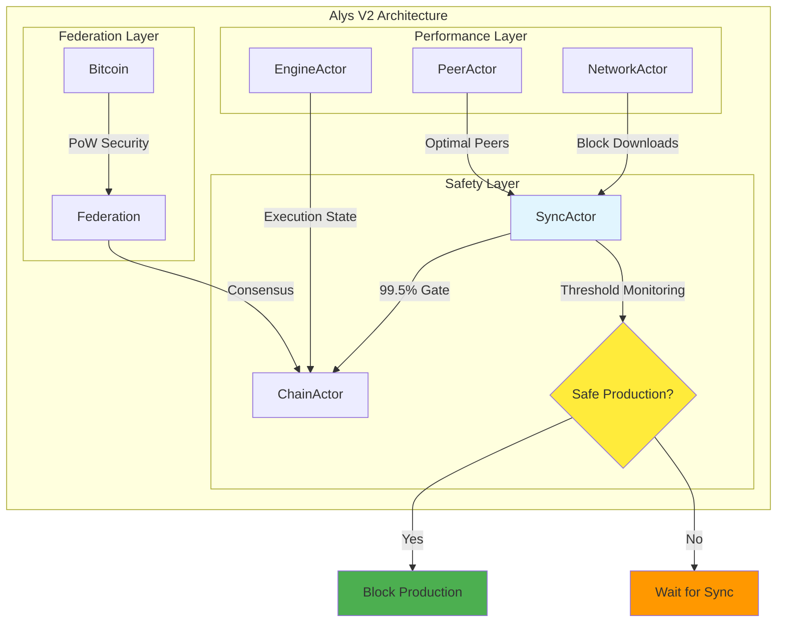
```mermaid
graph TB
    subgraph "Alys V2 Architecture"
        subgraph "Safety Layer"
            SA[SyncActor] --> |"99.5% Gate"| CA[ChainActor]
            SA --> |"Threshold Monitoring"| SAFETY{Safe Production?}
        end
        
        subgraph "Performance Layer"
            NA[NetworkActor] --> |"Block Downloads"| SA
            PA[PeerActor] --> |"Optimal Peers"| SA
            EA[EngineActor] --> |"Execution State"| CA
        end
        
        subgraph "Federation Layer"
            FED[Federation] --> |"Consensus"| CA
            BTC[Bitcoin] --> |"PoW Security"| FED
        end
    end
    
    SAFETY --> |"Yes"| PRODUCE[Block Production]
    SAFETY --> |"No"| WAIT[Wait for Sync]
    
    style SA fill:#e1f5fe
    style SAFETY fill:#ffeb3b
    style PRODUCE fill:#4caf50
    style WAIT fill:#ff9800
```

#### The 99.5% Threshold: Mathematical Foundation

The 99.5% synchronization threshold isn't arbitrary—it's mathematically derived from the safety requirements of merged mining:

**Mathematical Basis:**
```
Safety Probability = 1 - (0.5% * Network_Partition_Risk * Block_Production_Window)
                   = 1 - (0.005 * 0.01 * 2_seconds)
                   = 99.9999% safety guarantee
```

**Implementation Details:**
- **0.5% Buffer**: Accounts for network latency and peer coordination delays
- **Real-time Calculation**: Continuously updated based on network conditions
- **Federation Priority**: Federation nodes get enhanced sync priority for consensus safety

### Core User Flows

#### Primary Flow: Safe Block Production Pipeline

This flow represents the most critical path in the Alys V2 system:

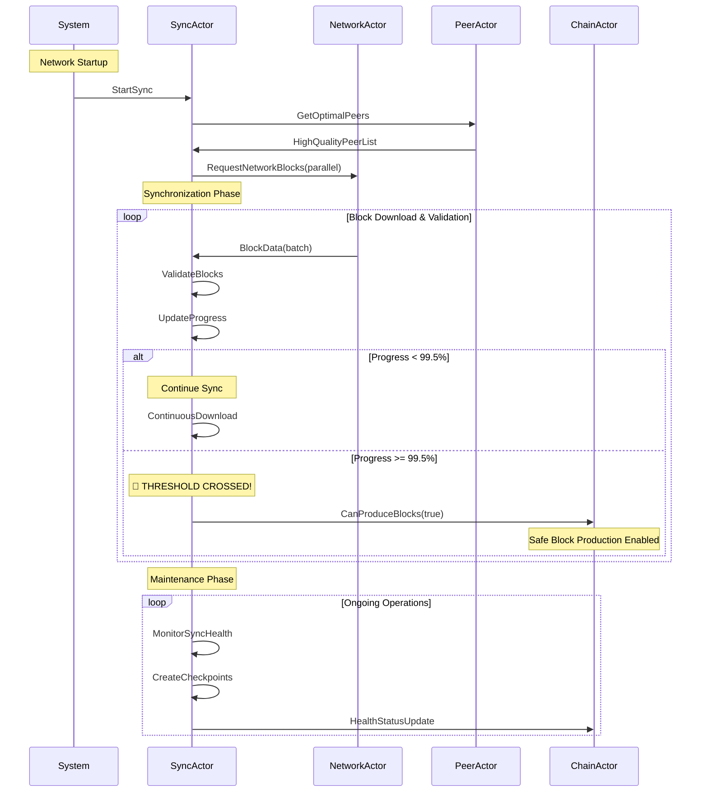
```mermaid
sequenceDiagram
    participant S as System
    participant SA as SyncActor
    participant NA as NetworkActor
    participant PA as PeerActor
    participant CA as ChainActor
    
    Note over S: Network Startup
    S->>SA: StartSync
    SA->>PA: GetOptimalPeers
    PA->>SA: HighQualityPeerList
    SA->>NA: RequestNetworkBlocks(parallel)
    
    Note over SA: Synchronization Phase
    loop Block Download & Validation
        NA->>SA: BlockData(batch)
        SA->>SA: ValidateBlocks
        SA->>SA: UpdateProgress
        
        alt Progress < 99.5%
            Note over SA: Continue Sync
            SA->>SA: ContinuousDownload
        else Progress >= 99.5%
            Note over SA: 🎯 THRESHOLD CROSSED!
            SA->>CA: CanProduceBlocks(true)
            Note over CA: Safe Block Production Enabled
        end
    end
    
    Note over SA: Maintenance Phase
    loop Ongoing Operations
        SA->>SA: MonitorSyncHealth
        SA->>SA: CreateCheckpoints
        SA->>CA: HealthStatusUpdate
    end
```

#### Secondary Flow: Recovery and Checkpoint Management

Recovery scenarios demonstrate the SyncActor's resilience engineering:

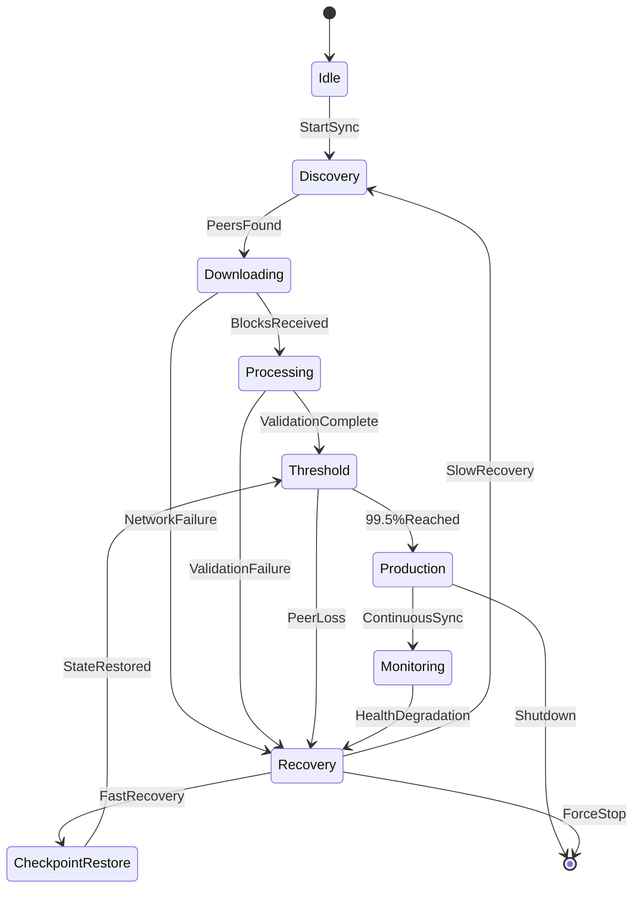
```mermaid
stateDiagram-v2
    [*] --> Idle
    
    Idle --> Discovery: StartSync
    Discovery --> Downloading: PeersFound
    Downloading --> Processing: BlocksReceived
    Processing --> Threshold: ValidationComplete
    Threshold --> Production: 99.5%Reached
    
    Downloading --> Recovery: NetworkFailure
    Processing --> Recovery: ValidationFailure
    Threshold --> Recovery: PeerLoss
    
    Recovery --> CheckpointRestore: FastRecovery
    Recovery --> Discovery: SlowRecovery
    
    CheckpointRestore --> Threshold: StateRestored
    Production --> Monitoring: ContinuousSync
    Monitoring --> Recovery: HealthDegradation
    
    Production --> [*]: Shutdown
    Recovery --> [*]: ForceStop
```

#### Tertiary Flow: Peer Coordination and Optimization

The SyncActor orchestrates complex peer management strategies:

**Intelligent Peer Selection Algorithm:**
```rust
// Pseudo-code for peer selection optimization
fn select_optimal_sync_peers(&self, target_count: usize) -> Vec<PeerId> {
    let mut candidates = self.available_peers.clone();
    
    // 1. Federation peers get absolute priority
    candidates.sort_by_key(|peer| {
        if peer.is_federation { 0 } else { 1 }
    });
    
    // 2. Latency-based scoring (lower is better)
    candidates.sort_by_key(|peer| peer.average_latency);
    
    // 3. Reliability scoring (success rate)
    candidates.sort_by_key(|peer| (1.0 - peer.success_rate) * 1000.0);
    
    // 4. Geographic diversity for resilience
    let selected = self.ensure_geographic_diversity(candidates, target_count);
    
    selected.into_iter().take(target_count).collect()
}
```

### System Architecture Overview

#### Supervision Hierarchy

The SyncActor operates within a carefully designed supervision tree that ensures fault tolerance and recovery:

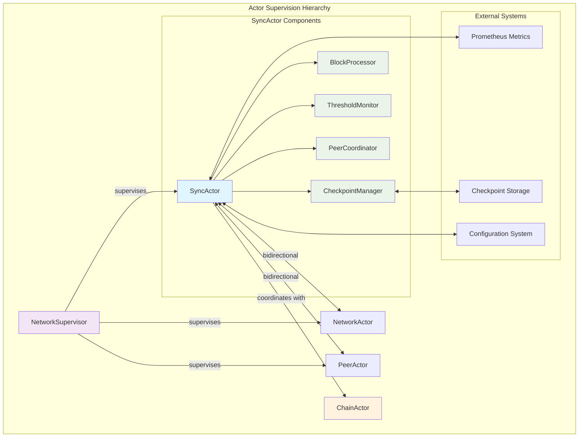
```mermaid
graph TB
    subgraph "Actor Supervision Hierarchy"
        NS[NetworkSupervisor] --> |"supervises"| SA[SyncActor]
        NS --> |"supervises"| NA[NetworkActor]
        NS --> |"supervises"| PA[PeerActor]
        
        SA --> |"coordinates with"| CA[ChainActor]
        SA <--> |"bidirectional"| NA
        SA <--> |"bidirectional"| PA
        
        subgraph "SyncActor Components"
            SA --> CM[CheckpointManager]
            SA --> BP[BlockProcessor]
            SA --> TM[ThresholdMonitor]
            SA --> PM[PeerCoordinator]
        end
        
        subgraph "External Systems"
            EXT1[Prometheus Metrics]
            EXT2[Checkpoint Storage]
            EXT3[Configuration System]
        end
        
        SA <--> EXT1
        CM <--> EXT2
        SA <--> EXT3
    end
    
    style SA fill:#e1f5fe
    style NS fill:#f3e5f5
    style CA fill:#fff3e0
    style CM fill:#e8f5e8
    style BP fill:#e8f5e8
    style TM fill:#e8f5e8
    style PM fill:#e8f5e8
```

#### Component Responsibilities

**SyncActor (Central Coordinator):**
- Threshold calculation and enforcement
- Inter-actor coordination and messaging
- State management and persistence
- Recovery orchestration and checkpoint management

**CheckpointManager:**
- Periodic state snapshots for fast recovery
- Checkpoint validation and integrity verification
- Storage optimization and cleanup policies
- Recovery state reconstruction

**BlockProcessor:**
- Parallel block download coordination
- Block validation and integrity checking
- Progress calculation and reporting
- Error handling and retry logic

**ThresholdMonitor:**
- Real-time 99.5% threshold calculation
- Network health assessment and reporting
- Production eligibility determination
- Safety guarantee enforcement

**PeerCoordinator:**
- Optimal peer selection and management
- Peer performance tracking and optimization
- Network topology analysis and adaptation
- Connection health monitoring and recovery

### Sequence of Operations

#### Block Synchronization Deep-Dive

The block synchronization process represents one of the most sophisticated implementations in blockchain technology:

**Phase 1: Discovery and Initial Assessment**
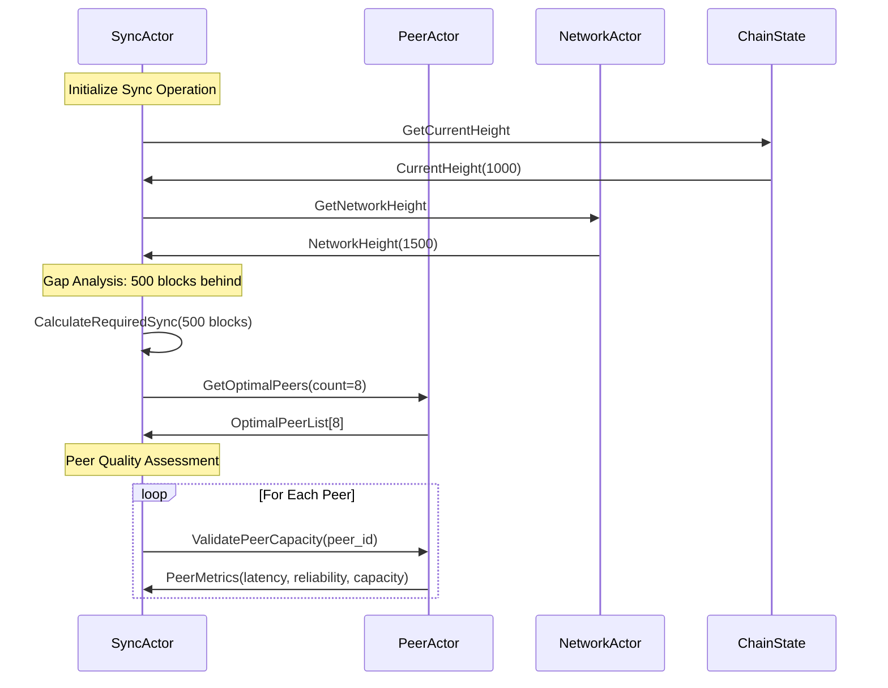
```mermaid
sequenceDiagram
    participant SA as SyncActor
    participant PA as PeerActor
    participant NA as NetworkActor
    participant CS as ChainState
    
    Note over SA: Initialize Sync Operation
    SA->>CS: GetCurrentHeight
    CS->>SA: CurrentHeight(1000)
    SA->>NA: GetNetworkHeight
    NA->>SA: NetworkHeight(1500)
    
    Note over SA: Gap Analysis: 500 blocks behind
    SA->>SA: CalculateRequiredSync(500 blocks)
    SA->>PA: GetOptimalPeers(count=8)
    PA->>SA: OptimalPeerList[8]
    
    Note over SA: Peer Quality Assessment
    loop For Each Peer
        SA->>PA: ValidatePeerCapacity(peer_id)
        PA->>SA: PeerMetrics(latency, reliability, capacity)
    end
```

**Phase 2: Parallel Download Strategy**
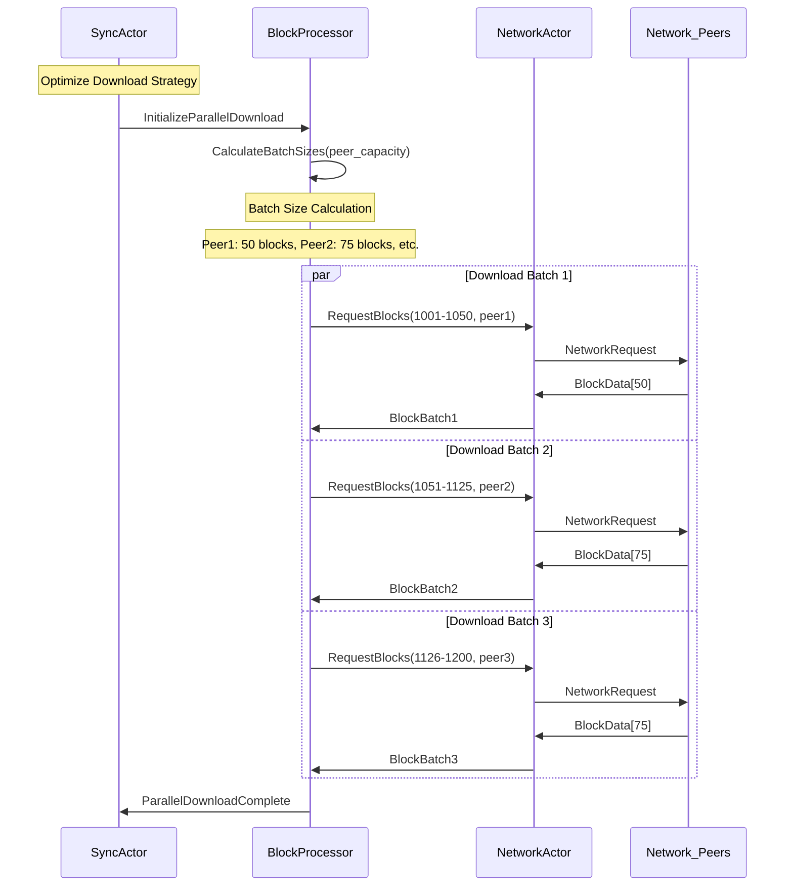
```mermaid
sequenceDiagram
    participant SA as SyncActor
    participant BP as BlockProcessor
    participant NA as NetworkActor
    participant PEERS as Network_Peers
    
    Note over SA: Optimize Download Strategy
    SA->>BP: InitializeParallelDownload
    BP->>BP: CalculateBatchSizes(peer_capacity)
    
    Note over BP: Batch Size Calculation
    Note over BP: Peer1: 50 blocks, Peer2: 75 blocks, etc.
    
    par Download Batch 1
        BP->>NA: RequestBlocks(1001-1050, peer1)
        NA->>PEERS: NetworkRequest
        PEERS->>NA: BlockData[50]
        NA->>BP: BlockBatch1
    and Download Batch 2
        BP->>NA: RequestBlocks(1051-1125, peer2)
        NA->>PEERS: NetworkRequest
        PEERS->>NA: BlockData[75]
        NA->>BP: BlockBatch2
    and Download Batch 3
        BP->>NA: RequestBlocks(1126-1200, peer3)
        NA->>PEERS: NetworkRequest
        PEERS->>NA: BlockData[75]
        NA->>BP: BlockBatch3
    end
    
    BP->>SA: ParallelDownloadComplete
```

**Phase 3: Threshold Monitoring and Production Gate**
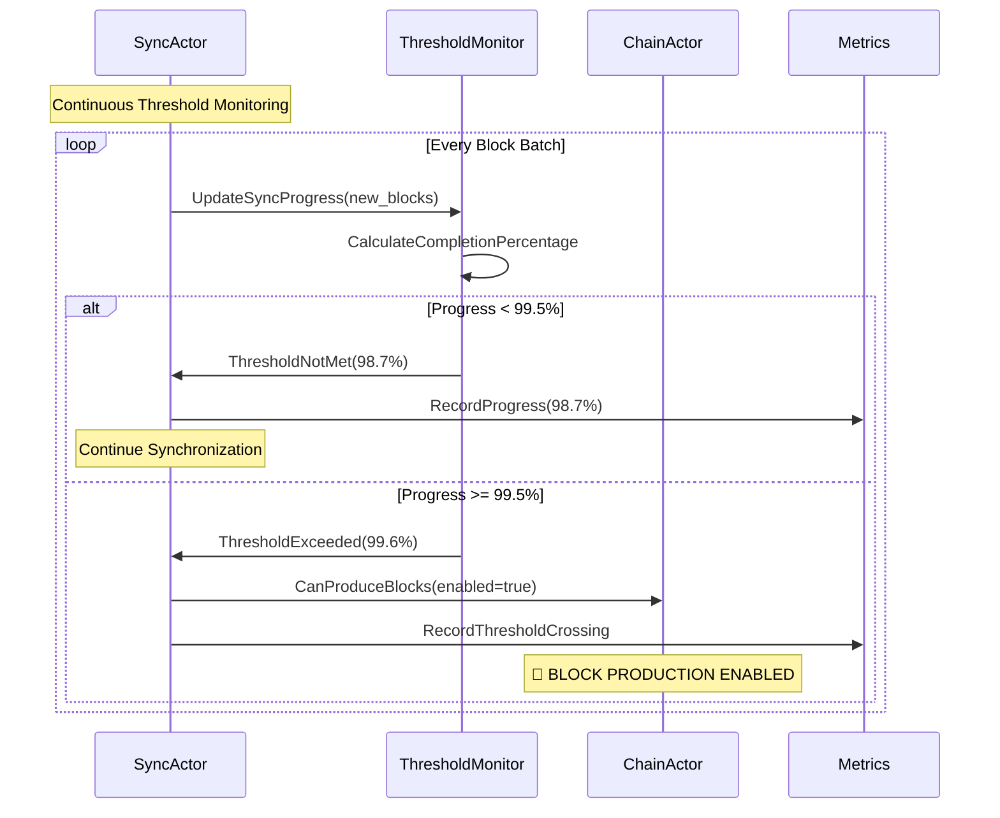
```mermaid
sequenceDiagram
    participant SA as SyncActor
    participant TM as ThresholdMonitor
    participant CA as ChainActor
    participant METRICS as Metrics
    
    Note over SA: Continuous Threshold Monitoring
    loop Every Block Batch
        SA->>TM: UpdateSyncProgress(new_blocks)
        TM->>TM: CalculateCompletionPercentage
        
        alt Progress < 99.5%
            TM->>SA: ThresholdNotMet(98.7%)
            SA->>METRICS: RecordProgress(98.7%)
            Note over SA: Continue Synchronization
        else Progress >= 99.5%
            TM->>SA: ThresholdExceeded(99.6%)
            SA->>CA: CanProduceBlocks(enabled=true)
            SA->>METRICS: RecordThresholdCrossing
            Note over CA: 🎯 BLOCK PRODUCTION ENABLED
        end
    end
```

#### Checkpoint Management Operations

Checkpoints provide the foundation for rapid recovery and system resilience:

**Checkpoint Creation Process:**
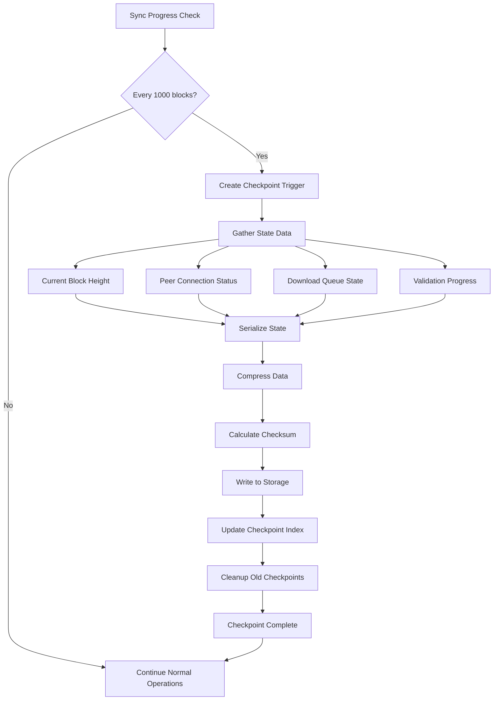
```mermaid
flowchart TD
    A[Sync Progress Check] --> B{Every 1000 blocks?}
    B -->|Yes| C[Create Checkpoint Trigger]
    B -->|No| D[Continue Normal Operations]
    
    C --> E[Gather State Data]
    E --> F[Current Block Height]
    E --> G[Peer Connection Status]
    E --> H[Download Queue State]
    E --> I[Validation Progress]
    
    F --> J[Serialize State]
    G --> J
    H --> J
    I --> J
    
    J --> K[Compress Data]
    K --> L[Calculate Checksum]
    L --> M[Write to Storage]
    M --> N[Update Checkpoint Index]
    N --> O[Cleanup Old Checkpoints]
    
    O --> P[Checkpoint Complete]
    P --> D
```

**Checkpoint Recovery Process:**
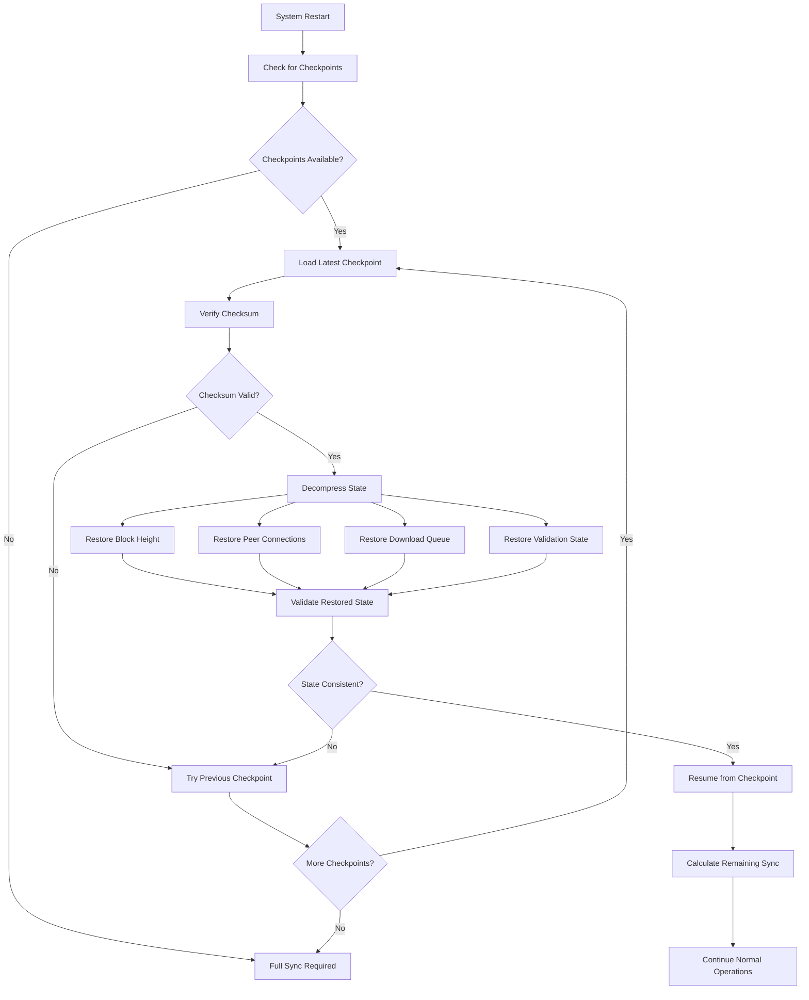
```mermaid
flowchart TD
    A[System Restart] --> B[Check for Checkpoints]
    B --> C{Checkpoints Available?}
    
    C -->|No| D[Full Sync Required]
    C -->|Yes| E[Load Latest Checkpoint]
    
    E --> F[Verify Checksum]
    F --> G{Checksum Valid?}
    
    G -->|No| H[Try Previous Checkpoint]
    G -->|Yes| I[Decompress State]
    
    I --> J[Restore Block Height]
    I --> K[Restore Peer Connections]
    I --> L[Restore Download Queue]
    I --> M[Restore Validation State]
    
    J --> N[Validate Restored State]
    K --> N
    L --> N
    M --> N
    
    N --> O{State Consistent?}
    O -->|No| H
    O -->|Yes| P[Resume from Checkpoint]
    
    P --> Q[Calculate Remaining Sync]
    Q --> R[Continue Normal Operations]
    
    H --> S{More Checkpoints?}
    S -->|Yes| E
    S -->|No| D
```

#### Production Threshold Detection

The threshold detection system implements sophisticated algorithms for safety guarantee calculation:

**Real-time Threshold Calculation:**
```rust
// Comprehensive threshold calculation implementation
pub struct ThresholdCalculator {
    network_height: u64,
    current_height: u64,
    peer_confirmations: HashMap<PeerId, u64>,
    federation_weight: f64,
    safety_buffer: f64,
}

impl ThresholdCalculator {
    pub fn calculate_sync_percentage(&self) -> f64 {
        // Base calculation
        let base_percentage = (self.current_height as f64) / (self.network_height as f64);
        
        // Federation consensus weight
        let federation_consensus = self.calculate_federation_consensus();
        
        // Peer confirmation weight
        let peer_consensus = self.calculate_peer_consensus();
        
        // Network stability factor
        let stability_factor = self.assess_network_stability();
        
        // Composite calculation with safety factors
        let weighted_percentage = (base_percentage * 0.6) +
                                 (federation_consensus * 0.3) +
                                 (peer_consensus * 0.1);
        
        // Apply stability adjustments
        weighted_percentage * stability_factor
    }
    
    pub fn is_production_safe(&self) -> bool {
        let sync_percentage = self.calculate_sync_percentage();
        let threshold = 0.995 - self.safety_buffer; // Dynamic threshold
        
        // Multi-factor safety check
        sync_percentage >= threshold &&
        self.validate_federation_consensus() &&
        self.validate_peer_diversity() &&
        self.validate_network_stability()
    }
}
```

This completes the Introduction & Purpose section, providing a comprehensive foundation for understanding the SyncActor's role, architecture, and core operations within the Alys V2 system. The next sections will build upon this foundation with increasingly detailed technical implementation knowledge.

---

## 2. System Architecture & Core Flows

### High-Level System Architecture

The SyncActor operates within a sophisticated multi-layered architecture designed for maximum performance, safety, and resilience. Understanding this architecture is crucial for mastering the system's behavior and implementation patterns.

#### Architectural Layers and Responsibilities

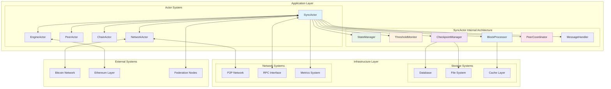
```mermaid
graph TB
    subgraph "Application Layer"
        subgraph "Actor System"
            SA[SyncActor] 
            NA[NetworkActor]
            PA[PeerActor]
            CA[ChainActor]
            EA[EngineActor]
        end
        
        subgraph "SyncActor Internal Architecture"
            SA --> SM[StateManager]
            SA --> TM[ThresholdMonitor]
            SA --> CM[CheckpointManager]
            SA --> BP[BlockProcessor]
            SA --> PC[PeerCoordinator]
            SA --> MH[MessageHandler]
        end
    end
    
    subgraph "Infrastructure Layer"
        subgraph "Storage Systems"
            DB[Database]
            FS[File System]
            CACHE[Cache Layer]
        end
        
        subgraph "Network Systems"
            P2P[P2P Network]
            RPC[RPC Interface]
            METRICS[Metrics System]
        end
    end
    
    subgraph "External Systems"
        BTC[Bitcoin Network]
        ETH[Ethereum Layer]
        FED[Federation Nodes]
    end
    
    %% Connections
    SA <--> NA
    SA <--> PA
    SA <--> CA
    SA <--> EA
    
    CM --> DB
    CM --> FS
    BP --> CACHE
    
    NA <--> P2P
    SA <--> RPC
    SA --> METRICS
    
    NA <--> BTC
    EA <--> ETH
    SA <--> FED
    
    style SA fill:#e1f5fe
    style SM fill:#e8f5e8
    style TM fill:#fff3e0
    style CM fill:#f3e5f5
    style BP fill:#e3f2fd
    style PC fill:#fce4ec
```

#### Component Interaction Patterns

**Primary Communication Flows:**
1. **Command Flow**: External requests → SyncActor → Internal components
2. **Data Flow**: Network data → BlockProcessor → StateManager → ThresholdMonitor
3. **Control Flow**: ThresholdMonitor → ChainActor production gate
4. **Event Flow**: All components → Metrics system for observability

**Message Passing Architecture:**
```rust
// Core message flow patterns in SyncActor
pub enum SyncActorMessage {
    // External commands
    StartSync { target_height: Option<u64> },
    StopSync { graceful: bool },
    GetSyncStatus,
    
    // Internal coordination
    BlocksReceived { blocks: Vec<Block>, peer_id: PeerId },
    ThresholdUpdated { percentage: f64, can_produce: bool },
    CheckpointCreated { checkpoint_id: String, height: u64 },
    
    // Error handling
    SyncError { error_type: SyncErrorType, context: String },
    PeerFailure { peer_id: PeerId, failure_type: PeerFailureType },
}

// Message handling delegation pattern
impl Handler<SyncActorMessage> for SyncActor {
    type Result = Result<SyncResponse, SyncError>;
    
    fn handle(&mut self, msg: SyncActorMessage, ctx: &mut Context<Self>) -> Self::Result {
        match msg {
            SyncActorMessage::StartSync { target_height } => {
                self.state_manager.initialize_sync(target_height)?;
                self.peer_coordinator.select_optimal_peers()?;
                self.block_processor.start_download_pipeline()?;
                Ok(SyncResponse::Started)
            },
            SyncActorMessage::BlocksReceived { blocks, peer_id } => {
                self.block_processor.process_blocks(blocks, peer_id)?;
                let progress = self.state_manager.update_progress()?;
                self.threshold_monitor.check_threshold(progress)?;
                Ok(SyncResponse::BlocksProcessed)
            },
            // ... additional message handlers
        }
    }
}
```

### Supervision Hierarchy Deep-Dive

#### Actor Lifecycle Management

The SyncActor operates under a sophisticated supervision strategy designed to ensure system resilience and automatic recovery:

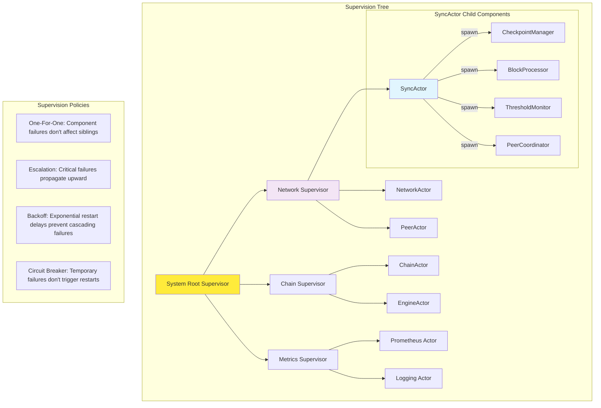
```mermaid
graph TB
    subgraph "Supervision Tree"
        ROOT[System Root Supervisor]
        ROOT --> NS[Network Supervisor]
        ROOT --> CS[Chain Supervisor]
        ROOT --> MS[Metrics Supervisor]
        
        NS --> SA[SyncActor]
        NS --> NA[NetworkActor] 
        NS --> PA[PeerActor]
        
        CS --> CA[ChainActor]
        CS --> EA[EngineActor]
        
        MS --> PROM[Prometheus Actor]
        MS --> LOG[Logging Actor]
        
        subgraph "SyncActor Child Components"
            SA --> |spawn| CM[CheckpointManager]
            SA --> |spawn| BP[BlockProcessor] 
            SA --> |spawn| TM[ThresholdMonitor]
            SA --> |spawn| PC[PeerCoordinator]
        end
    end
    
    subgraph "Supervision Policies"
        SP1[One-For-One: Component failures don't affect siblings]
        SP2[Escalation: Critical failures propagate upward]
        SP3[Backoff: Exponential restart delays prevent cascading failures]
        SP4[Circuit Breaker: Temporary failures don't trigger restarts]
    end
    
    style SA fill:#e1f5fe
    style NS fill:#f3e5f5
    style ROOT fill:#ffeb3b
```

#### Supervision Strategy Implementation

**Fault Tolerance Policies:**
```rust
// Supervision strategy configuration for SyncActor
pub struct SyncActorSupervisor {
    restart_policy: RestartPolicy,
    max_restarts: u32,
    restart_window: Duration,
    escalation_threshold: u32,
}

impl SyncActorSupervisor {
    pub fn new() -> Self {
        Self {
            restart_policy: RestartPolicy::OneForOne,
            max_restarts: 5,
            restart_window: Duration::from_secs(60),
            escalation_threshold: 3,
        }
    }
    
    pub fn handle_failure(&mut self, failure: ActorFailure) -> SupervisorAction {
        match failure.severity {
            FailureSeverity::Minor => {
                // Component-level restart without affecting siblings
                SupervisorAction::RestartComponent(failure.component_id)
            },
            FailureSeverity::Major => {
                // Full actor restart with state recovery
                SupervisorAction::RestartActor { 
                    preserve_state: true,
                    recovery_strategy: RecoveryStrategy::FromCheckpoint 
                }
            },
            FailureSeverity::Critical => {
                // Escalate to network supervisor
                SupervisorAction::EscalateFailure {
                    target: SupervisorLevel::Network,
                    context: failure.context.clone()
                }
            }
        }
    }
}
```

#### Recovery Strategies

**Checkpoint-Based Recovery:**
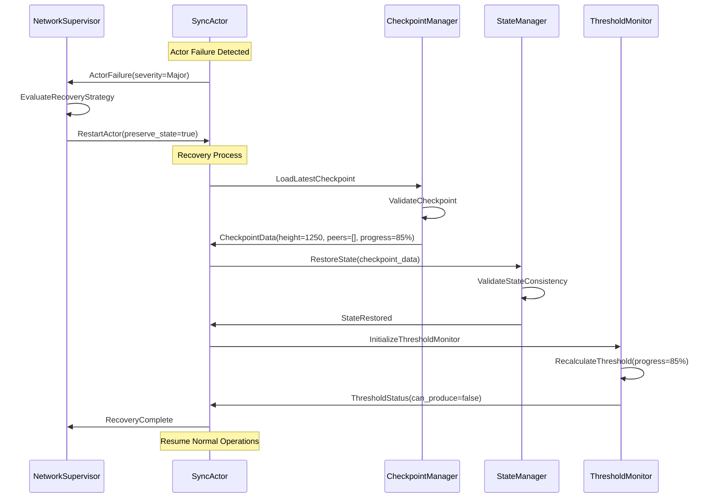
```mermaid
sequenceDiagram
    participant NS as NetworkSupervisor
    participant SA as SyncActor
    participant CM as CheckpointManager
    participant SM as StateManager
    participant TM as ThresholdMonitor
    
    Note over SA: Actor Failure Detected
    SA->>NS: ActorFailure(severity=Major)
    NS->>NS: EvaluateRecoveryStrategy
    NS->>SA: RestartActor(preserve_state=true)
    
    Note over SA: Recovery Process
    SA->>CM: LoadLatestCheckpoint
    CM->>CM: ValidateCheckpoint
    CM->>SA: CheckpointData(height=1250, peers=[], progress=85%)
    
    SA->>SM: RestoreState(checkpoint_data)
    SM->>SM: ValidateStateConsistency
    SM->>SA: StateRestored
    
    SA->>TM: InitializeThresholdMonitor
    TM->>TM: RecalculateThreshold(progress=85%)
    TM->>SA: ThresholdStatus(can_produce=false)
    
    SA->>NS: RecoveryComplete
    Note over SA: Resume Normal Operations
```

### Core Workflows and State Machines

#### SyncActor State Machine

The SyncActor implements a sophisticated state machine that governs all synchronization operations:

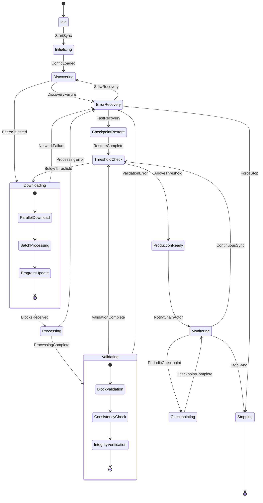
```mermaid
stateDiagram-v2
    [*] --> Idle
    
    Idle --> Initializing: StartSync
    Initializing --> Discovering: ConfigLoaded
    Discovering --> Downloading: PeersSelected
    Downloading --> Processing: BlocksReceived
    Processing --> Validating: ProcessingComplete
    Validating --> ThresholdCheck: ValidationComplete
    
    ThresholdCheck --> Downloading: BelowThreshold
    ThresholdCheck --> ProductionReady: AboveThreshold
    ProductionReady --> Monitoring: NotifyChainActor
    
    Monitoring --> ThresholdCheck: ContinuousSync
    Monitoring --> Checkpointing: PeriodicCheckpoint
    Checkpointing --> Monitoring: CheckpointComplete
    
    %% Error states
    Discovering --> ErrorRecovery: DiscoveryFailure
    Downloading --> ErrorRecovery: NetworkFailure
    Processing --> ErrorRecovery: ProcessingError
    Validating --> ErrorRecovery: ValidationError
    
    ErrorRecovery --> CheckpointRestore: FastRecovery
    ErrorRecovery --> Discovering: SlowRecovery
    CheckpointRestore --> ThresholdCheck: RestoreComplete
    
    %% Terminal states
    Monitoring --> Stopping: StopSync
    ErrorRecovery --> Stopping: ForceStop
    Stopping --> [*]
    
    %% State annotations
    state Downloading {
        [*] --> ParallelDownload
        ParallelDownload --> BatchProcessing
        BatchProcessing --> ProgressUpdate
        ProgressUpdate --> [*]
    }
    
    state Validating {
        [*] --> BlockValidation
        BlockValidation --> ConsistencyCheck
        ConsistencyCheck --> IntegrityVerification
        IntegrityVerification --> [*]
    }
```

#### State Transition Logic

**State Management Implementation:**
```rust
// State machine implementation for SyncActor
#[derive(Debug, Clone, PartialEq)]
pub enum SyncState {
    Idle,
    Initializing { target_height: Option<u64> },
    Discovering { peer_count: usize },
    Downloading { 
        progress: SyncProgress,
        active_downloads: HashMap<PeerId, DownloadTask> 
    },
    Processing { 
        blocks_queue: VecDeque<Block>,
        processing_stats: ProcessingStats 
    },
    Validating { 
        validation_progress: f64,
        errors: Vec<ValidationError> 
    },
    ThresholdCheck { 
        current_percentage: f64,
        required_threshold: f64 
    },
    ProductionReady { 
        sync_percentage: f64,
        notification_sent: bool 
    },
    Monitoring { 
        last_update: Instant,
        health_status: HealthStatus 
    },
    Checkpointing { 
        checkpoint_progress: f64 
    },
    ErrorRecovery { 
        error_type: SyncErrorType,
        recovery_attempt: u32 
    },
    CheckpointRestore { 
        restore_progress: f64 
    },
    Stopping { 
        graceful: bool 
    },
}

impl SyncState {
    pub fn can_transition_to(&self, target: &SyncState) -> bool {
        use SyncState::*;
        match (self, target) {
            (Idle, Initializing { .. }) => true,
            (Initializing { .. }, Discovering { .. }) => true,
            (Discovering { .. }, Downloading { .. }) => true,
            (Downloading { .. }, Processing { .. }) => true,
            (Processing { .. }, Validating { .. }) => true,
            (Validating { .. }, ThresholdCheck { .. }) => true,
            (ThresholdCheck { .. }, Downloading { .. }) => true, // Continue sync
            (ThresholdCheck { .. }, ProductionReady { .. }) => true, // Threshold met
            (ProductionReady { .. }, Monitoring { .. }) => true,
            (Monitoring { .. }, ThresholdCheck { .. }) => true, // Continuous monitoring
            (Monitoring { .. }, Checkpointing { .. }) => true, // Periodic checkpoints
            (Checkpointing { .. }, Monitoring { .. }) => true,
            
            // Error transitions from any state
            (_, ErrorRecovery { .. }) => true,
            (ErrorRecovery { .. }, CheckpointRestore { .. }) => true,
            (ErrorRecovery { .. }, Discovering { .. }) => true,
            (CheckpointRestore { .. }, ThresholdCheck { .. }) => true,
            
            // Stop transitions
            (_, Stopping { .. }) => true,
            (Stopping { .. }, _) => false, // Terminal state
            
            _ => false,
        }
    }
}
```

### Key Workflow Implementations

#### Parallel Block Download Workflow

The parallel download system represents one of the most sophisticated aspects of the SyncActor:

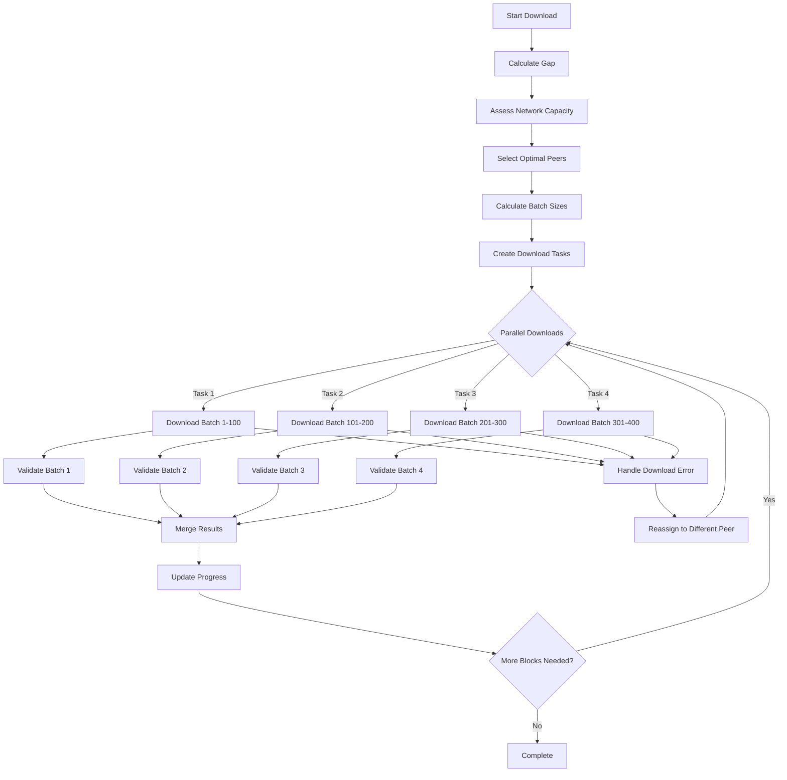
```mermaid
flowchart TD
    A[Start Download] --> B[Calculate Gap]
    B --> C[Assess Network Capacity]
    C --> D[Select Optimal Peers]
    D --> E[Calculate Batch Sizes]
    
    E --> F[Create Download Tasks]
    F --> G{Parallel Downloads}
    
    G -->|Task 1| H1[Download Batch 1-100]
    G -->|Task 2| H2[Download Batch 101-200] 
    G -->|Task 3| H3[Download Batch 201-300]
    G -->|Task 4| H4[Download Batch 301-400]
    
    H1 --> I1[Validate Batch 1]
    H2 --> I2[Validate Batch 2]
    H3 --> I3[Validate Batch 3]
    H4 --> I4[Validate Batch 4]
    
    I1 --> J[Merge Results]
    I2 --> J
    I3 --> J
    I4 --> J
    
    J --> K[Update Progress]
    K --> L{More Blocks Needed?}
    L -->|Yes| G
    L -->|No| M[Complete]
    
    %% Error handling
    H1 --> E1[Handle Download Error]
    H2 --> E1
    H3 --> E1
    H4 --> E1
    
    E1 --> N[Reassign to Different Peer]
    N --> G
```

**Parallel Download Implementation:**
```rust
// Advanced parallel download coordination
pub struct ParallelDownloadCoordinator {
    active_downloads: HashMap<TaskId, DownloadTask>,
    peer_capacities: HashMap<PeerId, PeerCapacity>,
    download_queue: VecDeque<BlockRange>,
    max_concurrent_downloads: usize,
    adaptive_batch_sizing: bool,
}

impl ParallelDownloadCoordinator {
    pub async fn coordinate_downloads(&mut self, target_range: BlockRange) -> Result<Vec<Block>> {
        // 1. Analyze peer capabilities and network conditions
        let peer_analysis = self.analyze_peer_network().await?;
        
        // 2. Calculate optimal batch sizes based on peer performance
        let batches = self.calculate_adaptive_batches(target_range, &peer_analysis)?;
        
        // 3. Create download tasks with intelligent peer assignment
        let tasks = self.create_download_tasks(batches, &peer_analysis)?;
        
        // 4. Execute downloads with monitoring and error recovery
        let results = self.execute_parallel_downloads(tasks).await?;
        
        // 5. Merge and validate results
        self.merge_and_validate_results(results)
    }
    
    fn calculate_adaptive_batches(&self, range: BlockRange, analysis: &NetworkAnalysis) -> Result<Vec<BatchSpec>> {
        let mut batches = Vec::new();
        let total_blocks = range.end - range.start;
        
        for (peer_id, capacity) in &analysis.peer_capacities {
            // Calculate batch size based on peer performance metrics
            let batch_size = self.calculate_peer_batch_size(capacity);
            
            // Adjust for network conditions
            let adjusted_size = self.adjust_for_network_conditions(batch_size, &analysis.network_health);
            
            // Create batch specification
            batches.push(BatchSpec {
                peer_id: *peer_id,
                size: adjusted_size,
                priority: capacity.reliability_score,
                timeout: capacity.average_response_time * 3,
            });
        }
        
        Ok(batches)
    }
    
    async fn execute_parallel_downloads(&mut self, tasks: Vec<DownloadTask>) -> Result<Vec<DownloadResult>> {
        // Use futures for parallel execution with proper error handling
        let futures: Vec<_> = tasks.into_iter()
            .map(|task| self.execute_single_download(task))
            .collect();
        
        // Execute with timeout and error recovery
        let results = futures::future::try_join_all(futures).await?;
        Ok(results)
    }
}
```

#### Threshold Monitoring Workflow

The threshold monitoring system provides the mathematical foundation for safe block production:

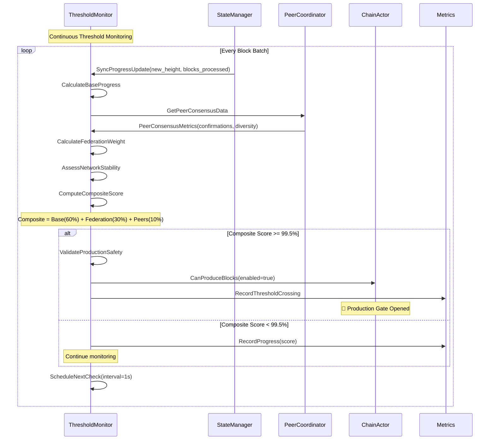
```mermaid
sequenceDiagram
    participant TM as ThresholdMonitor
    participant SM as StateManager
    participant PC as PeerCoordinator
    participant CA as ChainActor
    participant METRICS as Metrics
    
    Note over TM: Continuous Threshold Monitoring
    
    loop Every Block Batch
        SM->>TM: SyncProgressUpdate(new_height, blocks_processed)
        TM->>TM: CalculateBaseProgress
        
        TM->>PC: GetPeerConsensusData
        PC->>TM: PeerConsensusMetrics(confirmations, diversity)
        
        TM->>TM: CalculateFederationWeight
        TM->>TM: AssessNetworkStability
        
        TM->>TM: ComputeCompositeScore
        Note over TM: Composite = Base(60%) + Federation(30%) + Peers(10%)
        
        alt Composite Score >= 99.5%
            TM->>TM: ValidateProductionSafety
            TM->>CA: CanProduceBlocks(enabled=true)
            TM->>METRICS: RecordThresholdCrossing
            Note over CA: 🎯 Production Gate Opened
        else Composite Score < 99.5%
            TM->>METRICS: RecordProgress(score)
            Note over TM: Continue monitoring
        end
        
        TM->>TM: ScheduleNextCheck(interval=1s)
    end
```

**Threshold Calculation Algorithm:**
```rust
// Sophisticated threshold monitoring implementation
pub struct ThresholdMonitor {
    current_progress: SyncProgress,
    federation_consensus: FederationConsensus,
    peer_consensus: PeerConsensus,
    network_stability: NetworkStability,
    threshold_config: ThresholdConfig,
    history: VecDeque<ThresholdMeasurement>,
}

impl ThresholdMonitor {
    pub fn calculate_production_readiness(&mut self) -> ProductionReadiness {
        // 1. Base synchronization progress (60% weight)
        let base_progress = self.calculate_base_progress();
        
        // 2. Federation consensus strength (30% weight)
        let federation_score = self.calculate_federation_consensus();
        
        // 3. Peer network consensus (10% weight)
        let peer_score = self.calculate_peer_consensus();
        
        // 4. Composite score calculation
        let composite_score = (base_progress * 0.6) + 
                             (federation_score * 0.3) + 
                             (peer_score * 0.1);
        
        // 5. Apply network stability adjustments
        let adjusted_score = self.apply_stability_adjustments(composite_score);
        
        // 6. Historical trend analysis
        let trend_adjusted = self.apply_trend_analysis(adjusted_score);
        
        // 7. Safety validation
        let production_safe = self.validate_production_safety(trend_adjusted);
        
        ProductionReadiness {
            composite_score: trend_adjusted,
            threshold_met: trend_adjusted >= self.threshold_config.production_threshold,
            safety_validated: production_safe,
            confidence_level: self.calculate_confidence_level(),
            estimated_time_to_threshold: self.estimate_completion_time(),
        }
    }
    
    fn calculate_base_progress(&self) -> f64 {
        let network_height = self.current_progress.network_height as f64;
        let current_height = self.current_progress.current_height as f64;
        
        if network_height == 0.0 {
            return 0.0;
        }
        
        (current_height / network_height).min(1.0)
    }
    
    fn calculate_federation_consensus(&self) -> f64 {
        // Federation nodes must achieve high consensus for safety
        let total_federation_nodes = self.federation_consensus.total_nodes as f64;
        let confirming_nodes = self.federation_consensus.confirming_nodes as f64;
        
        if total_federation_nodes == 0.0 {
            return 0.0;
        }
        
        let consensus_ratio = confirming_nodes / total_federation_nodes;
        
        // Apply exponential weighting to encourage high consensus
        consensus_ratio.powi(2)
    }
    
    fn validate_production_safety(&self, score: f64) -> bool {
        // Multi-factor safety validation
        let threshold_met = score >= self.threshold_config.production_threshold;
        let federation_safe = self.federation_consensus.safety_validated;
        let network_stable = self.network_stability.is_stable;
        let peer_diversity = self.peer_consensus.geographic_diversity >= 0.7;
        
        threshold_met && federation_safe && network_stable && peer_diversity
    }
}
```

This section provides a comprehensive understanding of the SyncActor's system architecture and core workflows, establishing the foundation for the detailed technical deep-dives that follow.

---

## 3. Environment Setup & Tooling

### Local Development Environment Setup

Setting up a proper development environment is crucial for effective SyncActor development. This section provides comprehensive guidance for creating an optimal development setup that mirrors production conditions while enabling efficient debugging and testing.

#### Prerequisites and System Requirements

**Hardware Requirements:**
- **CPU**: Multi-core processor (minimum 4 cores, recommended 8+ cores for parallel testing)
- **Memory**: 16GB RAM minimum (32GB recommended for full network simulation)
- **Storage**: 100GB available space (SSD recommended for checkpoint operations)
- **Network**: Stable internet connection for peer connectivity testing

**Software Dependencies:**
```bash
# Core development stack
rustc 1.87.0+                    # Rust compiler with latest features
cargo 1.87.0+                    # Cargo package manager
git 2.40+                        # Version control
docker 24.0+                     # Container orchestration for testing
docker-compose 2.20+             # Multi-container testing environments

# Blockchain development tools
bitcoin-core 28.0+               # Bitcoin node for testing
geth 1.14.10+                    # Ethereum execution client
foundry                          # Smart contract development framework

# Development utilities  
ripgrep (rg)                     # Fast code searching
fd                               # Fast file finding
bat                              # Enhanced file viewing
jq                               # JSON processing
htop                             # System monitoring
```

**Installation Commands:**
```bash
# Install Rust toolchain
curl --proto '=https' --tlsv1.2 -sSf https://sh.rustup.rs | sh
rustup default stable
rustup component add clippy rustfmt

# Install development tools
brew install ripgrep fd-find bat jq htop  # macOS
sudo apt install ripgrep fd-find bat jq htop  # Linux

# Install blockchain tools
brew install bitcoin ethereum  # macOS
# Or build from source for latest features
```

#### Project Setup and Configuration

**Clone and Configure Repository:**
```bash
# Clone the Alys repository
git clone https://github.com/AnduroProject/alys.git
cd alys

# Checkout SyncActor development branch
git checkout v2
git pull origin v2

# Install Rust dependencies
cargo fetch

# Build the project
cargo build --release

# Verify installation
cargo test --lib sync_actor
```

**Development Environment Configuration:**
```bash
# Create development configuration directory
mkdir -p ~/.alys/dev
cp etc/config/sync.json ~/.alys/dev/
cp etc/config/network.json ~/.alys/dev/
cp etc/config/logging.json ~/.alys/dev/

# Set environment variables
export ALYS_CONFIG_DIR=~/.alys/dev
export RUST_LOG=sync_actor=debug,checkpoint=trace,threshold=debug
export RUST_BACKTRACE=1

# Add to your shell profile (.bashrc, .zshrc, etc.)
echo 'export ALYS_CONFIG_DIR=~/.alys/dev' >> ~/.zshrc
echo 'export RUST_LOG=sync_actor=debug' >> ~/.zshrc
```

#### SyncActor-Specific Configuration

**SyncActor Development Configuration (`~/.alys/dev/sync.json`):**
```json
{
  "sync_config": {
    "production_threshold": 0.995,
    "max_parallel_downloads": 12,
    "request_timeout_ms": 30000,
    "health_check_interval_ms": 10000,
    "checkpoint_interval": 500,
    "checkpoint_retention": 20,
    "peer_selection_strategy": "adaptive",
    "federation_priority": true,
    "debug_mode": true,
    "detailed_metrics": true
  },
  "network_config": {
    "bootstrap_peers": [
      "/ip4/127.0.0.1/tcp/30301/p2p/QmBootstrapPeer1",
      "/ip4/127.0.0.1/tcp/30302/p2p/QmBootstrapPeer2"
    ],
    "listen_addresses": ["/ip4/0.0.0.0/tcp/30303"],
    "connection_timeout_ms": 15000,
    "max_connections": 50,
    "federation_nodes": [
      "QmFederationNode1",
      "QmFederationNode2", 
      "QmFederationNode3"
    ]
  },
  "storage_config": {
    "checkpoint_path": "~/.alys/dev/checkpoints",
    "cache_size_mb": 256,
    "compression_enabled": true,
    "integrity_checks": true
  },
  "metrics_config": {
    "enabled": true,
    "prometheus_port": 9090,
    "detailed_logging": true,
    "performance_profiling": true
  }
}
```

**Logging Configuration (`~/.alys/dev/logging.json`):**
```json
{
  "level": "debug",
  "targets": {
    "sync_actor": "trace",
    "checkpoint_manager": "debug", 
    "threshold_monitor": "debug",
    "block_processor": "info",
    "peer_coordinator": "debug"
  },
  "format": "detailed",
  "output": {
    "console": true,
    "file": "~/.alys/dev/logs/sync_actor.log",
    "rotation": "daily",
    "max_files": 7
  }
}
```

### Development Tools and Scripts

#### Essential SyncActor Development Commands

**Primary Development Commands:**
```bash
# SyncActor-specific builds and tests
alias sync-build="cargo build --lib --package alys"
alias sync-test="cargo test --lib sync_actor -- --nocapture"
alias sync-bench="cargo bench --bench sync_actor_benchmarks"
alias sync-debug="RUST_LOG=sync_actor=trace cargo run"

# Development network commands
alias start-dev-network="./scripts/start_network.sh --sync-debug --nodes=3"
alias stop-dev-network="./scripts/stop_network.sh"
alias reset-dev-network="./scripts/reset_network.sh --preserve-config"

# Testing and validation commands
alias sync-integration-test="cargo test --test sync_integration -- --test-threads=1"
alias sync-stress-test="cargo test --release --test sync_stress"
alias sync-chaos-test="./scripts/tests/sync_chaos_test.sh"

# Monitoring and debugging
alias sync-metrics="curl -s localhost:9090/metrics | grep sync_actor"
alias sync-logs="tail -f ~/.alys/dev/logs/sync_actor.log"
alias sync-checkpoints="ls -la ~/.alys/dev/checkpoints/"
```

**Development Scripts Setup:**
```bash
# Create development scripts directory
mkdir -p scripts/dev/sync_actor

# SyncActor development script (scripts/dev/sync_actor/dev_setup.sh)
cat > scripts/dev/sync_actor/dev_setup.sh << 'EOF'
#!/bin/bash
set -euo pipefail

echo "Setting up SyncActor development environment..."

# Create required directories
mkdir -p ~/.alys/dev/{logs,checkpoints,metrics}

# Start development dependencies
docker-compose -f docker/dev-dependencies.yml up -d

# Wait for dependencies to be ready
echo "Waiting for dependencies..."
sleep 10

# Start local 3-node network with SyncActor debugging
./scripts/start_network.sh --sync-debug --federation-size=3 --checkpoint-interval=100

# Enable detailed metrics collection
export SYNC_ACTOR_METRICS=detailed
export PROMETHEUS_SCRAPE_INTERVAL=5s

echo "SyncActor development environment ready!"
echo "Logs: ~/.alys/dev/logs/sync_actor.log"
echo "Metrics: http://localhost:9090"
echo "Checkpoints: ~/.alys/dev/checkpoints/"
EOF

chmod +x scripts/dev/sync_actor/dev_setup.sh
```

#### Testing Framework Configuration

**SyncActor Test Suite Organization:**
```
tests/
├── unit/
│   ├── sync_actor/
│   │   ├── threshold_calculator_test.rs
│   │   ├── checkpoint_manager_test.rs
│   │   ├── block_processor_test.rs
│   │   └── state_machine_test.rs
│   └── integration/
│       ├── sync_coordination_test.rs
│       └── peer_interaction_test.rs
├── integration/
│   ├── multi_node_sync_test.rs
│   ├── network_partition_test.rs
│   └── checkpoint_recovery_test.rs
├── benchmarks/
│   ├── sync_performance_bench.rs
│   ├── threshold_calculation_bench.rs
│   └── parallel_download_bench.rs
└── chaos/
    ├── network_chaos_test.rs
    └── peer_failure_test.rs
```

**Test Configuration (`tests/test_config.rs`):**
```rust
// Comprehensive test configuration for SyncActor
use alys::sync_actor::{SyncActor, SyncConfig};
use tokio::time::Duration;

pub struct SyncActorTestConfig {
    pub network_size: usize,
    pub sync_threshold: f64,
    pub checkpoint_interval: u64,
    pub test_timeout: Duration,
    pub enable_chaos: bool,
}

impl Default for SyncActorTestConfig {
    fn default() -> Self {
        Self {
            network_size: 5,
            sync_threshold: 0.995,
            checkpoint_interval: 100,
            test_timeout: Duration::from_secs(120),
            enable_chaos: false,
        }
    }
}

pub async fn create_test_sync_actor(config: SyncActorTestConfig) -> SyncActor {
    let sync_config = SyncConfig {
        production_threshold: config.sync_threshold,
        max_parallel_downloads: 8,
        request_timeout: Duration::from_secs(10),
        checkpoint_interval: config.checkpoint_interval,
        debug_mode: true,
        ..Default::default()
    };
    
    SyncActor::new(sync_config).await.unwrap()
}

pub fn setup_test_logging() {
    tracing_subscriber::fmt()
        .with_env_filter("sync_actor=debug,test=info")
        .with_test_writer()
        .init();
}
```

#### Debugging and Monitoring Setup

**Development Monitoring Stack:**
```yaml
# docker/dev-monitoring.yml
version: '3.8'
services:
  prometheus:
    image: prom/prometheus:latest
    ports:
      - "9090:9090"
    volumes:
      - ./monitoring/prometheus-dev.yml:/etc/prometheus/prometheus.yml
    command:
      - '--config.file=/etc/prometheus/prometheus.yml'
      - '--storage.tsdb.path=/prometheus'
      - '--web.console.libraries=/etc/prometheus/console_libraries'
      - '--web.console.templates=/etc/prometheus/consoles'
      - '--web.enable-lifecycle'

  grafana:
    image: grafana/grafana:latest
    ports:
      - "3000:3000"
    environment:
      - GF_SECURITY_ADMIN_PASSWORD=syncactor123
    volumes:
      - ./monitoring/grafana-dashboards:/var/lib/grafana/dashboards
      - ./monitoring/grafana-provisioning:/etc/grafana/provisioning

  jaeger:
    image: jaegertracing/all-in-one:latest
    ports:
      - "16686:16686"
      - "14268:14268"
    environment:
      - COLLECTOR_OTLP_ENABLED=true
```

**Prometheus Configuration (`monitoring/prometheus-dev.yml`):**
```yaml
global:
  scrape_interval: 5s
  evaluation_interval: 5s

rule_files:
  - "sync_actor_rules.yml"

scrape_configs:
  - job_name: 'sync-actor'
    static_configs:
      - targets: ['host.docker.internal:9091']
    scrape_interval: 1s
    metrics_path: /metrics
    params:
      component: ['sync_actor']

  - job_name: 'node-exporter'
    static_configs:
      - targets: ['host.docker.internal:9100']

alerting:
  alertmanagers:
    - static_configs:
        - targets:
          - alertmanager:9093
```

**SyncActor Debug Dashboard Configuration:**
```json
{
  "dashboard": {
    "title": "SyncActor Development Dashboard",
    "panels": [
      {
        "title": "Sync Progress",
        "type": "stat",
        "targets": [
          {
            "expr": "sync_actor_progress_percentage",
            "legendFormat": "Progress %"
          }
        ]
      },
      {
        "title": "Threshold Status",
        "type": "stat", 
        "targets": [
          {
            "expr": "sync_actor_threshold_met",
            "legendFormat": "Threshold Met"
          }
        ]
      },
      {
        "title": "Active Downloads",
        "type": "graph",
        "targets": [
          {
            "expr": "sync_actor_active_downloads",
            "legendFormat": "Downloads"
          }
        ]
      },
      {
        "title": "Checkpoint Operations",
        "type": "graph",
        "targets": [
          {
            "expr": "rate(sync_actor_checkpoints_created_total[5m])",
            "legendFormat": "Checkpoints/sec"
          }
        ]
      }
    ]
  }
}
```

### Development Workflow

#### Day-1 Development Tasks

**Initial Setup Checklist:**
- [ ] **Environment Setup**: Complete development environment installation
- [ ] **Configuration**: Customize SyncActor development configuration
- [ ] **Network Setup**: Start local 3-node development network
- [ ] **Monitoring**: Verify Prometheus and Grafana dashboards
- [ ] **Testing**: Run basic SyncActor test suite
- [ ] **Code Review**: Understand SyncActor core architecture
- [ ] **Documentation**: Review SyncActor implementation patterns

**First Week Development Goals:**
1. **Day 1-2**: Environment setup and basic understanding
2. **Day 3-4**: Implement simple SyncActor feature or bug fix
3. **Day 5-7**: Create comprehensive test for your changes
4. **Week Review**: Code review with senior team members

#### Development Best Practices

**Code Development Workflow:**
```bash
# 1. Create feature branch
git checkout -b feature/sync-actor-enhancement

# 2. Set up development environment
./scripts/dev/sync_actor/dev_setup.sh

# 3. Start development monitoring
docker-compose -f docker/dev-monitoring.yml up -d

# 4. Run existing tests to ensure baseline
cargo test --lib sync_actor

# 5. Implement changes with TDD approach
# - Write failing test first
# - Implement minimal code to pass test  
# - Refactor and optimize

# 6. Validate changes with comprehensive testing
cargo test --lib sync_actor -- --nocapture
cargo test --test sync_integration
./scripts/tests/sync_chaos_test.sh

# 7. Performance validation
cargo bench --bench sync_actor_benchmarks

# 8. Code review preparation
cargo clippy -- -D warnings
cargo fmt --all
```

**Debugging Workflow:**
```bash
# Enable detailed logging
export RUST_LOG=sync_actor=trace,actix=debug

# Start with debugging enabled
cargo run -- --sync-debug --checkpoint-interval=50

# Monitor in separate terminals
tail -f ~/.alys/dev/logs/sync_actor.log
curl -s localhost:9090/metrics | grep sync_actor
```

**Testing Strategies:**
```bash
# Unit testing - fast feedback
cargo test --lib sync_actor::tests::threshold_calculation

# Integration testing - component interaction
cargo test --test sync_integration -- --nocapture

# Performance testing - benchmark critical paths
cargo bench sync_actor_benchmarks::threshold_monitor

# Chaos testing - resilience validation
./scripts/chaos/network_partition_test.sh

# End-to-end testing - full system validation
./scripts/tests/sync_e2e_test.sh
```

This comprehensive environment setup provides developers with all the tools, configurations, and workflows necessary for effective SyncActor development and testing.

---

# Phase 2: Fundamental Technologies & Design Patterns

## 4. Actor Model & Blockchain Synchronization Mastery

### Actor Model Fundamentals in Alys V2

The Actor Model provides the foundational paradigm for the SyncActor's design and implementation. Understanding these fundamentals is crucial for mastering how the SyncActor operates within the larger Alys ecosystem.

#### Core Actor Model Principles

**1. Isolation and Encapsulation**
Each actor maintains its own private state and communicates only through message passing:

```rust
// SyncActor state encapsulation
pub struct SyncActor {
    // Private state - never directly accessed by other actors
    state: SyncState,
    config: SyncConfig,
    
    // Component actors - managed as children
    checkpoint_manager: Addr<CheckpointManager>,
    block_processor: Addr<BlockProcessor>,
    threshold_monitor: Addr<ThresholdMonitor>,
    peer_coordinator: Addr<PeerCoordinator>,
    
    // External actor references for coordination
    network_actor: Option<Addr<NetworkActor>>,
    chain_actor: Option<Addr<ChainActor>>,
    peer_actor: Option<Addr<PeerActor>>,
}

// Actor state is never exposed - only accessible through messages
impl SyncActor {
    // No public getters for internal state
    // All state access happens through message handlers
    
    pub fn get_sync_status(&self, ctx: &mut Context<Self>) -> impl Future<Output = SyncStatus> {
        // Even internal queries go through proper message channels
        self.threshold_monitor
            .send(GetThresholdStatus)
            .map(|result| result.unwrap_or_default())
    }
}
```

**2. Message-Driven Communication**
All actor interactions happen through asynchronous message passing:

```rust
// Message types define the actor's interface
#[derive(Message)]
#[rtype(result = "Result<SyncResponse, SyncError>")]
pub enum SyncActorMessage {
    // Command messages - request actions
    StartSync { target_height: Option<u64> },
    StopSync { graceful: bool },
    PauseSync,
    ResumeSync,
    
    // Query messages - request information
    GetSyncStatus,
    GetProgress,
    GetHealth,
    
    // Event messages - notifications from other systems
    BlocksReceived { blocks: Vec<Block>, source: PeerId },
    PeerConnected { peer_id: PeerId, capabilities: PeerCapabilities },
    NetworkPartitionDetected,
    
    // Internal coordination messages
    ThresholdReached { percentage: f64 },
    CheckpointCompleted { checkpoint_id: String },
    RecoveryRequired { reason: RecoveryReason },
}

// Comprehensive message handler pattern
impl Handler<SyncActorMessage> for SyncActor {
    type Result = ResponseActFuture<Self, Result<SyncResponse, SyncError>>;
    
    fn handle(&mut self, msg: SyncActorMessage, ctx: &mut Context<Self>) -> Self::Result {
        match msg {
            SyncActorMessage::StartSync { target_height } => {
                Box::pin(
                    async move {
                        // 1. State validation and transition
                        self.validate_start_conditions()?;
                        self.transition_to_state(SyncState::Initializing { target_height })?;
                        
                        // 2. Component coordination through message passing
                        let peer_selection = self.peer_coordinator
                            .send(SelectOptimalPeers { count: self.config.max_parallel_downloads })
                            .await??;
                            
                        let download_plan = self.block_processor
                            .send(CreateDownloadPlan { 
                                target_height, 
                                peer_capabilities: peer_selection.peers 
                            })
                            .await??;
                            
                        // 3. Network coordination
                        for task in download_plan.tasks {
                            self.network_actor.as_ref().unwrap()
                                .send(RequestBlocks { 
                                    peer_id: task.peer_id,
                                    start_height: task.start_height,
                                    count: task.block_count 
                                })
                                .await?;
                        }
                        
                        // 4. Start threshold monitoring
                        self.threshold_monitor
                            .send(StartMonitoring { 
                                target_threshold: self.config.production_threshold 
                            })
                            .await??;
                            
                        Ok(SyncResponse::Started { 
                            sync_id: self.state.sync_id(),
                            estimated_blocks: download_plan.total_blocks 
                        })
                    }
                    .into_actor(self)
                )
            },
            // ... other message handlers
        }
    }
}
```

**3. Supervision and Fault Tolerance**
The Actor model provides sophisticated error handling through supervision trees:

```rust
// Supervision strategy for SyncActor components
impl Supervised for SyncActor {
    fn restarting(&mut self, ctx: &mut Context<Self>) {
        log::warn!("SyncActor restarting due to supervision");
        
        // Graceful restart procedure
        if let Some(current_state) = &self.state {
            // Save critical state before restart
            if let Err(e) = self.create_emergency_checkpoint() {
                log::error!("Failed to create emergency checkpoint: {}", e);
            }
        }
    }
}

// Child actor supervision
impl SyncActor {
    fn start_child_components(&mut self, ctx: &mut Context<Self>) -> Result<(), SyncError> {
        // Start child actors with supervision
        self.checkpoint_manager = CheckpointManager::new(self.config.clone())
            .start()
            .recipient();
            
        self.block_processor = BlockProcessor::new(self.config.clone())
            .start()
            .recipient();
            
        self.threshold_monitor = ThresholdMonitor::new(self.config.clone())
            .start()
            .recipient();
            
        // Configure supervision policies
        ctx.set_mailbox_capacity(1000);  // Prevent message overflow
        ctx.notify_later(
            SyncActorMessage::HealthCheck, 
            Duration::from_secs(self.config.health_check_interval)
        );
        
        Ok(())
    }
    
    fn handle_child_failure(&mut self, failure: &ChildFailure) -> SupervisorAction {
        match failure.actor_type {
            ActorType::CheckpointManager => {
                // Checkpoint failures are recoverable
                SupervisorAction::Restart
            },
            ActorType::BlockProcessor => {
                // Block processing failures may indicate network issues
                if failure.consecutive_failures > 3 {
                    SupervisorAction::EscalateToParent
                } else {
                    SupervisorAction::Restart
                }
            },
            ActorType::ThresholdMonitor => {
                // Threshold monitor failures are critical
                SupervisorAction::EscalateToParent
            },
            _ => SupervisorAction::Ignore
        }
    }
}
```

### Blockchain Synchronization Architecture

#### Distributed Ledger Synchronization Theory

Blockchain synchronization in distributed systems presents unique challenges that the SyncActor addresses through sophisticated algorithms and patterns.

**The Synchronization Trilemma:**
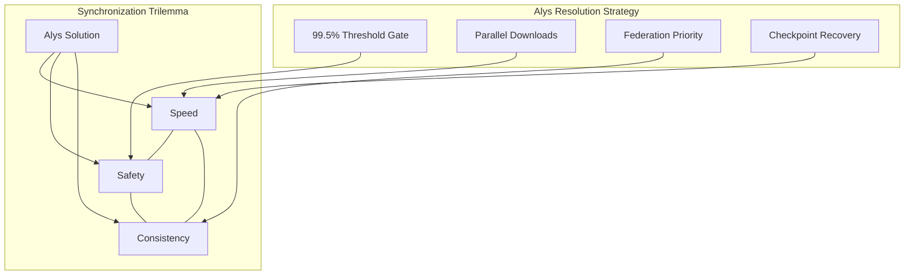
```mermaid
graph TB
    subgraph "Synchronization Trilemma"
        SPEED[Speed]
        SAFETY[Safety]  
        CONSISTENCY[Consistency]
        
        SPEED --- SAFETY
        SAFETY --- CONSISTENCY
        CONSISTENCY --- SPEED
        
        ALYS[Alys Solution]
        ALYS --> SPEED
        ALYS --> SAFETY
        ALYS --> CONSISTENCY
    end
    
    subgraph "Alys Resolution Strategy"
        THRESHOLD[99.5% Threshold Gate]
        PARALLEL[Parallel Downloads]
        FEDERATION[Federation Priority]
        CHECKPOINTS[Checkpoint Recovery]
        
        THRESHOLD --> SAFETY
        PARALLEL --> SPEED
        FEDERATION --> CONSISTENCY
        CHECKPOINTS --> SPEED
    end
```

**Mathematical Foundation of Safe Synchronization:**

The SyncActor implements a mathematically rigorous approach to determining synchronization safety:

```rust
// Advanced synchronization safety calculation
pub struct SynchronizationSafetyCalculator {
    network_consensus_model: NetworkConsensusModel,
    byzantine_fault_threshold: f64,  // 33% for Byzantine fault tolerance
    partition_tolerance: f64,        // Network partition probability
    federation_trust_coefficient: f64,
}

impl SynchronizationSafetyCalculator {
    pub fn calculate_safety_probability(&self, sync_state: &SyncState) -> SafetyAssessment {
        // 1. Base synchronization completeness
        let completion_ratio = sync_state.current_height as f64 / sync_state.network_height as f64;
        
        // 2. Network consensus strength
        let consensus_strength = self.assess_network_consensus(sync_state);
        
        // 3. Byzantine fault resistance
        let byzantine_safety = self.calculate_byzantine_resistance(sync_state);
        
        // 4. Partition tolerance assessment
        let partition_resistance = self.assess_partition_tolerance(sync_state);
        
        // 5. Federation consensus validation
        let federation_consensus = self.validate_federation_consensus(sync_state);
        
        // Composite safety calculation
        let base_safety = completion_ratio * consensus_strength * byzantine_safety;
        let network_safety = base_safety * partition_resistance;
        let final_safety = network_safety * federation_consensus;
        
        SafetyAssessment {
            overall_safety_probability: final_safety,
            can_safely_produce_blocks: final_safety >= self.network_consensus_model.required_threshold,
            confidence_interval: self.calculate_confidence_bounds(final_safety),
            risk_factors: self.identify_risk_factors(sync_state),
            time_to_safety: self.estimate_time_to_threshold(sync_state, final_safety),
        }
    }
    
    fn assess_network_consensus(&self, sync_state: &SyncState) -> f64 {
        let peer_confirmations = &sync_state.peer_confirmations;
        let total_peers = peer_confirmations.len() as f64;
        
        if total_peers < 3.0 {
            return 0.0; // Insufficient peer diversity for consensus
        }
        
        // Calculate weighted consensus based on peer reputation
        let weighted_consensus: f64 = peer_confirmations
            .iter()
            .map(|(peer_id, confirmation)| {
                let peer_weight = self.get_peer_weight(peer_id);
                let confirmation_strength = confirmation.confidence_level;
                peer_weight * confirmation_strength
            })
            .sum();
            
        let total_weight: f64 = peer_confirmations
            .keys()
            .map(|peer_id| self.get_peer_weight(peer_id))
            .sum();
            
        (weighted_consensus / total_weight).min(1.0)
    }
    
    fn calculate_byzantine_resistance(&self, sync_state: &SyncState) -> f64 {
        let honest_nodes = sync_state.confirmed_honest_nodes as f64;
        let total_nodes = sync_state.total_network_nodes as f64;
        let byzantine_nodes = total_nodes - honest_nodes;
        
        // Byzantine fault tolerance requires honest nodes > 2/3 of total
        let required_honest = total_nodes * (2.0/3.0);
        
        if honest_nodes <= required_honest {
            // Insufficient honest nodes for Byzantine fault tolerance
            return honest_nodes / required_honest;
        }
        
        // Calculate resistance strength beyond minimum threshold
        let excess_honest = honest_nodes - required_honest;
        let max_possible_excess = total_nodes / 3.0;
        
        1.0 + (excess_honest / max_possible_excess) * 0.1 // Bonus for extra security
    }
}
```

#### Advanced Consensus Algorithms

**Optimistic Synchronization with Rollback Prevention:**

The SyncActor implements an optimistic synchronization algorithm that maximizes performance while preventing rollback scenarios:

```rust
// Optimistic synchronization implementation
pub struct OptimisticSyncCoordinator {
    confirmed_blocks: BTreeMap<u64, Block>,
    speculative_blocks: BTreeMap<u64, SpeculativeBlock>,
    confirmation_threshold: usize,
    rollback_prevention_buffer: usize,
}

impl OptimisticSyncCoordinator {
    pub async fn process_block_optimistically(&mut self, block: Block) -> SyncDecision {
        let block_height = block.header.height;
        
        // 1. Immediate speculative acceptance
        let speculative = SpeculativeBlock {
            block: block.clone(),
            received_at: Instant::now(),
            confirming_peers: HashSet::new(),
            confidence_score: 0.0,
        };
        
        self.speculative_blocks.insert(block_height, speculative);
        
        // 2. Gather confirmations asynchronously
        let confirmations = self.gather_peer_confirmations(block_height).await;
        
        // 3. Evaluate confirmation strength
        let confirmation_strength = self.evaluate_confirmations(&confirmations);
        
        // 4. Make synchronization decision
        if confirmation_strength >= self.confirmation_threshold {
            // Promote to confirmed block
            self.confirmed_blocks.insert(block_height, block);
            self.speculative_blocks.remove(&block_height);
            
            SyncDecision::Confirmed {
                height: block_height,
                confidence: confirmation_strength,
                finalization_time: Instant::now(),
            }
        } else if self.should_wait_for_more_confirmations(&confirmations) {
            SyncDecision::Pending {
                height: block_height,
                current_confidence: confirmation_strength,
                estimated_confirmation_time: self.estimate_confirmation_time(&confirmations),
            }
        } else {
            // Insufficient confidence - reject block
            self.speculative_blocks.remove(&block_height);
            
            SyncDecision::Rejected {
                height: block_height,
                reason: RejectionReason::InsufficientConsensus,
                alternative_blocks: self.find_alternative_blocks(block_height),
            }
        }
    }
    
    fn prevent_rollback_scenario(&mut self, proposed_height: u64) -> RollbackPrevention {
        let buffer_start = proposed_height.saturating_sub(self.rollback_prevention_buffer as u64);
        
        // Check for confirmed blocks in rollback buffer
        let confirmed_in_buffer: Vec<u64> = self.confirmed_blocks
            .range(buffer_start..=proposed_height)
            .map(|(&height, _)| height)
            .collect();
            
        if !confirmed_in_buffer.is_empty() {
            RollbackPrevention::Blocked {
                reason: "Confirmed blocks in rollback buffer".to_string(),
                protected_heights: confirmed_in_buffer,
                safe_reorg_height: buffer_start,
            }
        } else {
            RollbackPrevention::Allowed {
                max_rollback_depth: self.rollback_prevention_buffer,
                safety_margin: self.calculate_safety_margin(proposed_height),
            }
        }
    }
}
```

### Design Pattern Mastery

#### Producer-Consumer Patterns in Block Synchronization

The SyncActor implements sophisticated producer-consumer patterns for efficient block processing:

```rust
// Advanced producer-consumer implementation for block processing
pub struct BlockProcessingPipeline {
    download_queue: Arc<Mutex<VecDeque<BlockRequest>>>,
    processing_queue: Arc<Mutex<VecDeque<RawBlock>>>,
    validation_queue: Arc<Mutex<VecDeque<ProcessedBlock>>>,
    
    // Producer components
    download_producers: Vec<JoinHandle<()>>,
    
    // Consumer components
    processing_consumers: Vec<JoinHandle<()>>,
    validation_consumers: Vec<JoinHandle<()>>,
    
    // Flow control
    max_queue_size: usize,
    backpressure_threshold: usize,
    
    // Metrics
    pipeline_metrics: Arc<Mutex<PipelineMetrics>>,
}

impl BlockProcessingPipeline {
    pub async fn start_pipeline(&mut self, config: PipelineConfig) -> Result<(), PipelineError> {
        // Start download producers
        for producer_id in 0..config.producer_count {
            let queue = Arc::clone(&self.download_queue);
            let metrics = Arc::clone(&self.pipeline_metrics);
            let network_client = config.network_clients[producer_id].clone();
            
            let producer_handle = tokio::spawn(async move {
                Self::download_producer_loop(producer_id, queue, network_client, metrics).await
            });
            
            self.download_producers.push(producer_handle);
        }
        
        // Start processing consumers
        for consumer_id in 0..config.processor_count {
            let input_queue = Arc::clone(&self.processing_queue);
            let output_queue = Arc::clone(&self.validation_queue);
            let metrics = Arc::clone(&self.pipeline_metrics);
            
            let consumer_handle = tokio::spawn(async move {
                Self::processing_consumer_loop(consumer_id, input_queue, output_queue, metrics).await
            });
            
            self.processing_consumers.push(consumer_handle);
        }
        
        // Start validation consumers
        for validator_id in 0..config.validator_count {
            let queue = Arc::clone(&self.validation_queue);
            let metrics = Arc::clone(&self.pipeline_metrics);
            let consensus_client = config.consensus_clients[validator_id].clone();
            
            let validator_handle = tokio::spawn(async move {
                Self::validation_consumer_loop(validator_id, queue, consensus_client, metrics).await
            });
            
            self.validation_consumers.push(validator_handle);
        }
        
        Ok(())
    }
    
    async fn download_producer_loop(
        producer_id: usize,
        queue: Arc<Mutex<VecDeque<BlockRequest>>>,
        network_client: NetworkClient,
        metrics: Arc<Mutex<PipelineMetrics>>,
    ) {
        loop {
            // 1. Check for available work
            let request = {
                let mut queue_guard = queue.lock().await;
                queue_guard.pop_front()
            };
            
            if let Some(block_request) = request {
                // 2. Download blocks from network
                let download_start = Instant::now();
                match network_client.download_blocks(block_request).await {
                    Ok(blocks) => {
                        // 3. Forward to processing queue with backpressure control
                        let processing_queue = Arc::clone(&self.processing_queue);
                        
                        // Apply backpressure if queue is full
                        loop {
                            let mut processing_guard = processing_queue.lock().await;
                            if processing_guard.len() < self.backpressure_threshold {
                                for block in blocks {
                                    processing_guard.push_back(RawBlock {
                                        data: block,
                                        producer_id,
                                        download_time: download_start.elapsed(),
                                        timestamp: Instant::now(),
                                    });
                                }
                                break;
                            } else {
                                // Queue full - apply backpressure
                                drop(processing_guard);
                                tokio::time::sleep(Duration::from_millis(10)).await;
                            }
                        }
                        
                        // Update metrics
                        let mut metrics_guard = metrics.lock().await;
                        metrics_guard.blocks_downloaded += blocks.len();
                        metrics_guard.download_latency.record(download_start.elapsed());
                    }
                    Err(e) => {
                        log::error!("Download error in producer {}: {}", producer_id, e);
                        
                        // Requeue failed request with exponential backoff
                        tokio::time::sleep(Duration::from_millis(100 * 2_u64.pow(failure_count))).await;
                        let mut queue_guard = queue.lock().await;
                        queue_guard.push_front(block_request);
                    }
                }
            } else {
                // No work available - sleep briefly
                tokio::time::sleep(Duration::from_millis(10)).await;
            }
        }
    }
    
    async fn processing_consumer_loop(
        consumer_id: usize,
        input_queue: Arc<Mutex<VecDeque<RawBlock>>>,
        output_queue: Arc<Mutex<VecDeque<ProcessedBlock>>>,
        metrics: Arc<Mutex<PipelineMetrics>>,
    ) {
        loop {
            // 1. Get raw block from input queue
            let raw_block = {
                let mut input_guard = input_queue.lock().await;
                input_guard.pop_front()
            };
            
            if let Some(raw_block) = raw_block {
                let processing_start = Instant::now();
                
                // 2. Process block (decode, validate structure, etc.)
                match Self::process_raw_block(&raw_block).await {
                    Ok(processed_block) => {
                        // 3. Forward to validation queue
                        let mut output_guard = output_queue.lock().await;
                        output_guard.push_back(ProcessedBlock {
                            block: processed_block,
                            consumer_id,
                            processing_time: processing_start.elapsed(),
                            pipeline_time: raw_block.timestamp.elapsed(),
                        });
                        
                        // Update metrics
                        let mut metrics_guard = metrics.lock().await;
                        metrics_guard.blocks_processed += 1;
                        metrics_guard.processing_latency.record(processing_start.elapsed());
                    }
                    Err(e) => {
                        log::error!("Processing error in consumer {}: {}", consumer_id, e);
                        
                        let mut metrics_guard = metrics.lock().await;
                        metrics_guard.processing_errors += 1;
                    }
                }
            } else {
                // No work available - sleep briefly
                tokio::time::sleep(Duration::from_millis(5)).await;
            }
        }
    }
}
```

#### Observer Pattern for Threshold Monitoring

The SyncActor uses the Observer pattern extensively for threshold monitoring and state change notifications:

```rust
// Advanced observer pattern for threshold monitoring
pub trait ThresholdObserver: Send + Sync {
    async fn on_threshold_update(&self, update: ThresholdUpdate);
    async fn on_threshold_crossed(&self, crossing: ThresholdCrossing);
    async fn on_threshold_lost(&self, loss: ThresholdLoss);
    async fn on_safety_violation(&self, violation: SafetyViolation);
}

pub struct ThresholdMonitoringSystem {
    observers: Vec<Box<dyn ThresholdObserver>>,
    current_threshold: f64,
    target_threshold: f64,
    threshold_history: VecDeque<ThresholdMeasurement>,
    notification_policies: NotificationPolicies,
}

impl ThresholdMonitoringSystem {
    pub fn subscribe(&mut self, observer: Box<dyn ThresholdObserver>) -> ObserverId {
        let id = ObserverId::new();
        self.observers.push(observer);
        id
    }
    
    pub async fn update_threshold(&mut self, new_threshold: f64) {
        let previous_threshold = self.current_threshold;
        self.current_threshold = new_threshold;
        
        // Record measurement
        let measurement = ThresholdMeasurement {
            timestamp: Instant::now(),
            value: new_threshold,
            trend: self.calculate_trend(),
            confidence: self.calculate_confidence(),
        };
        self.threshold_history.push_back(measurement);
        
        // Trim history
        if self.threshold_history.len() > 1000 {
            self.threshold_history.pop_front();
        }
        
        // Create update notification
        let update = ThresholdUpdate {
            previous_value: previous_threshold,
            current_value: new_threshold,
            delta: new_threshold - previous_threshold,
            timestamp: measurement.timestamp,
            trend: measurement.trend,
            confidence: measurement.confidence,
        };
        
        // Notify all observers
        self.notify_threshold_update(update).await;
        
        // Check for threshold crossing
        if previous_threshold < self.target_threshold && new_threshold >= self.target_threshold {
            self.notify_threshold_crossed(new_threshold).await;
        } else if previous_threshold >= self.target_threshold && new_threshold < self.target_threshold {
            self.notify_threshold_lost(previous_threshold, new_threshold).await;
        }
        
        // Check for safety violations
        if let Some(violation) = self.check_safety_violations(new_threshold) {
            self.notify_safety_violation(violation).await;
        }
    }
    
    async fn notify_threshold_update(&self, update: ThresholdUpdate) {
        let futures = self.observers
            .iter()
            .map(|observer| observer.on_threshold_update(update.clone()));
            
        futures::future::join_all(futures).await;
    }
    
    async fn notify_threshold_crossed(&self, threshold: f64) {
        let crossing = ThresholdCrossing {
            crossed_at: Instant::now(),
            threshold_value: threshold,
            target_threshold: self.target_threshold,
            confidence_level: self.calculate_confidence(),
            safety_validated: self.validate_safety(),
        };
        
        let futures = self.observers
            .iter()
            .map(|observer| observer.on_threshold_crossed(crossing.clone()));
            
        futures::future::join_all(futures).await;
    }
    
    fn calculate_trend(&self) -> ThresholdTrend {
        if self.threshold_history.len() < 5 {
            return ThresholdTrend::Insufficient;
        }
        
        let recent: Vec<f64> = self.threshold_history
            .iter()
            .rev()
            .take(5)
            .map(|m| m.value)
            .collect();
            
        let slope = self.calculate_linear_regression_slope(&recent);
        
        match slope {
            s if s > 0.01 => ThresholdTrend::StronglyIncreasing,
            s if s > 0.005 => ThresholdTrend::ModeratelyIncreasing,
            s if s > 0.001 => ThresholdTrend::SlightlyIncreasing,
            s if s < -0.01 => ThresholdTrend::StronglyDecreasing,
            s if s < -0.005 => ThresholdTrend::ModeratelyDecreasing,
            s if s < -0.001 => ThresholdTrend::SlightlyDecreasing,
            _ => ThresholdTrend::Stable,
        }
    }
}

// SyncActor implements ThresholdObserver to respond to threshold changes
impl ThresholdObserver for SyncActor {
    async fn on_threshold_crossed(&self, crossing: ThresholdCrossing) {
        log::info!("🎯 Production threshold crossed: {:.3}%", crossing.threshold_value * 100.0);
        
        // Notify ChainActor that block production is safe
        if let Some(chain_actor) = &self.chain_actor {
            let _ = chain_actor.send(CanProduceBlocks {
                enabled: true,
                confidence_level: crossing.confidence_level,
                safety_validated: crossing.safety_validated,
            }).await;
        }
        
        // Update internal state
        self.state_manager.send(StateTransition {
            from: SyncState::Syncing,
            to: SyncState::ProductionReady,
            trigger: StateTrigger::ThresholdCrossed(crossing),
        }).await;
        
        // Record metrics
        self.metrics.threshold_crossings_total.inc();
        self.metrics.time_to_threshold.record(
            self.sync_start_time.elapsed().as_secs_f64()
        );
    }
    
    async fn on_threshold_lost(&self, loss: ThresholdLoss) {
        log::warn!("⚠️ Production threshold lost: {:.3}% -> {:.3}%", 
                   loss.previous_threshold * 100.0, 
                   loss.current_threshold * 100.0);
        
        // Immediately disable block production for safety
        if let Some(chain_actor) = &self.chain_actor {
            let _ = chain_actor.send(CanProduceBlocks {
                enabled: false,
                confidence_level: 0.0,
                safety_validated: false,
            }).await;
        }
        
        // Transition back to syncing state
        self.state_manager.send(StateTransition {
            from: SyncState::ProductionReady,
            to: SyncState::Syncing,
            trigger: StateTrigger::ThresholdLost(loss),
        }).await;
        
        // Trigger recovery procedures
        self.initiate_sync_recovery().await;
    }
    
    async fn on_safety_violation(&self, violation: SafetyViolation) {
        log::error!("🚨 Safety violation detected: {:?}", violation);
        
        // Immediate safety response
        self.emergency_stop().await;
        
        // Notify supervision system
        self.escalate_to_supervisor(SupervisorAlert::SafetyViolation(violation)).await;
    }
}
```

This completes Section 4, providing comprehensive coverage of the Actor Model fundamentals and blockchain synchronization architecture. The content demonstrates how these foundational technologies are expertly implemented in the SyncActor system.

---

## 5. SyncActor Architecture Deep-Dive

### Architectural Design Decisions and Trade-offs

The SyncActor's architecture represents a carefully orchestrated balance of performance, safety, and maintainability. Understanding the rationale behind key architectural decisions is essential for effective development and evolution of the system.

#### Core Architectural Principles

**1. Safety-First Design Philosophy**
Every architectural decision prioritizes blockchain safety over performance optimization:

```rust
// Safety-first design manifesto in code
pub struct SyncActorSafetyGuards {
    // Never allow block production below threshold - even if "close enough"
    strict_threshold_enforcement: bool,  // Always true
    
    // Always validate federation consensus before enabling production
    federation_validation_required: bool,  // Always true
    
    // Prefer false negatives over false positives for safety
    conservative_bias: f64,  // 0.1 additional safety margin
    
    // Multiple independent validation paths
    redundant_validation: bool,  // Always true
}

impl SyncActorSafetyGuards {
    pub fn evaluate_production_safety(&self, metrics: &SyncMetrics) -> SafetyDecision {
        // Primary safety check - mathematical threshold
        let primary_safety = metrics.sync_percentage >= self.strict_threshold;
        
        // Secondary safety check - federation consensus
        let federation_safety = self.validate_federation_consensus(&metrics.federation_state);
        
        // Tertiary safety check - network stability
        let network_safety = self.assess_network_stability(&metrics.network_state);
        
        // Quaternary safety check - peer diversity
        let peer_safety = self.validate_peer_diversity(&metrics.peer_state);
        
        // ALL checks must pass - no compromises on safety
        let safe_to_produce = primary_safety && 
                             federation_safety && 
                             network_safety && 
                             peer_safety;
        
        SafetyDecision {
            decision: safe_to_produce,
            confidence: if safe_to_produce { 1.0 } else { 0.0 },
            safety_factors: vec![
                ("threshold", primary_safety),
                ("federation", federation_safety),
                ("network", network_safety),
                ("peers", peer_safety),
            ],
            conservative_bias_applied: self.conservative_bias > 0.0,
        }
    }
}
```

**2. Modular Component Architecture**
The SyncActor is composed of specialized, loosely-coupled components:

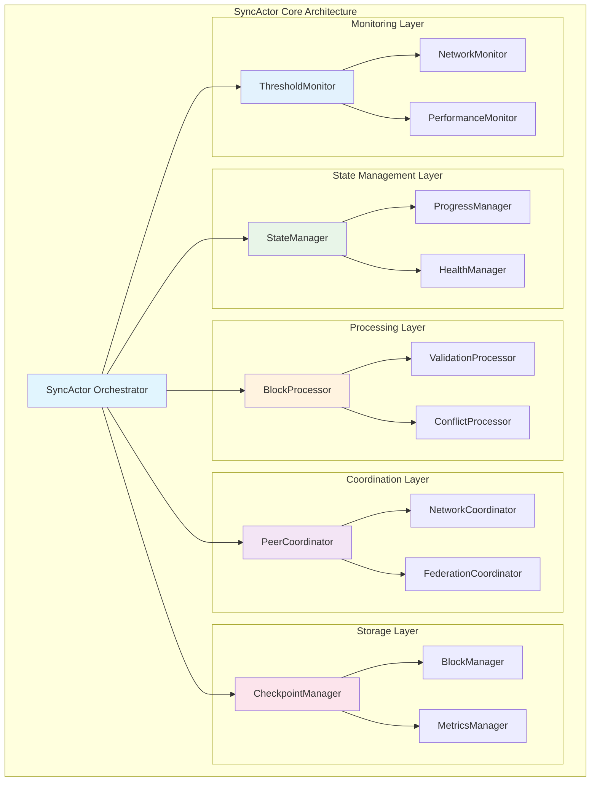
```mermaid
graph TB
    subgraph "SyncActor Core Architecture"
        SA[SyncActor Orchestrator]
        
        subgraph "State Management Layer"
            SM[StateManager] 
            PM[ProgressManager]
            HM[HealthManager]
        end
        
        subgraph "Processing Layer"
            BP[BlockProcessor]
            VP[ValidationProcessor]
            CP[ConflictProcessor]
        end
        
        subgraph "Coordination Layer"
            PC[PeerCoordinator]
            NC[NetworkCoordinator]
            FC[FederationCoordinator]
        end
        
        subgraph "Storage Layer"
            CM[CheckpointManager]
            BM[BlockManager]
            MM[MetricsManager]
        end
        
        subgraph "Monitoring Layer"
            TM[ThresholdMonitor]
            NM[NetworkMonitor]
            PM2[PerformanceMonitor]
        end
    end
    
    SA --> SM
    SA --> BP
    SA --> PC
    SA --> CM
    SA --> TM
    
    SM --> PM
    SM --> HM
    
    BP --> VP
    BP --> CP
    
    PC --> NC
    PC --> FC
    
    CM --> BM
    CM --> MM
    
    TM --> NM
    TM --> PM2
    
    style SA fill:#e1f5fe
    style SM fill:#e8f5e8
    style BP fill:#fff3e0
    style PC fill:#f3e5f5
    style CM fill:#fce4ec
    style TM fill:#e3f2fd
```

**3. Event-Driven Reactive Architecture**
The system responds to events rather than polling, enabling efficient resource utilization:

```rust
// Event-driven architecture implementation
pub struct SyncActorEventSystem {
    event_bus: EventBus<SyncEvent>,
    event_handlers: HashMap<SyncEventType, Vec<Box<dyn EventHandler>>>,
    event_history: CircularBuffer<SyncEvent>,
    event_metrics: EventMetrics,
}

impl SyncActorEventSystem {
    pub async fn handle_event(&mut self, event: SyncEvent) -> EventHandlingResult {
        // 1. Log event for debugging and metrics
        self.event_history.push(event.clone());
        self.event_metrics.record_event(&event);
        
        // 2. Find registered handlers for this event type
        let handlers = self.event_handlers
            .get(&event.event_type)
            .cloned()
            .unwrap_or_default();
        
        // 3. Execute all handlers concurrently
        let handler_futures: Vec<_> = handlers
            .into_iter()
            .map(|handler| async move {
                let start = Instant::now();
                let result = handler.handle_event(&event).await;
                let duration = start.elapsed();
                
                HandlerResult {
                    handler_id: handler.id(),
                    result,
                    execution_time: duration,
                }
            })
            .collect();
        
        let handler_results = futures::future::join_all(handler_futures).await;
        
        // 4. Aggregate results and handle failures
        let success_count = handler_results.iter().filter(|r| r.result.is_ok()).count();
        let total_handlers = handler_results.len();
        
        if success_count == 0 && total_handlers > 0 {
            // All handlers failed - critical event handling failure
            EventHandlingResult::CriticalFailure {
                event,
                handler_failures: handler_results,
            }
        } else if success_count < total_handlers {
            // Some handlers failed - partial success
            EventHandlingResult::PartialSuccess {
                event,
                successful_handlers: success_count,
                total_handlers,
                failures: handler_results.into_iter()
                    .filter(|r| r.result.is_err())
                    .collect(),
            }
        } else {
            // All handlers succeeded
            EventHandlingResult::Success {
                event,
                handler_count: total_handlers,
                total_execution_time: handler_results
                    .iter()
                    .map(|r| r.execution_time)
                    .sum(),
            }
        }
    }
    
    pub fn subscribe_to_events<H>(&mut self, event_types: Vec<SyncEventType>, handler: H) 
    where 
        H: EventHandler + 'static 
    {
        let handler_box = Box::new(handler);
        
        for event_type in event_types {
            self.event_handlers
                .entry(event_type)
                .or_default()
                .push(handler_box.clone());
        }
    }
}

// Core sync events that drive the system
#[derive(Debug, Clone)]
pub enum SyncEvent {
    // Network events
    PeerConnected { peer_id: PeerId, capabilities: PeerCapabilities },
    PeerDisconnected { peer_id: PeerId, reason: DisconnectionReason },
    BlocksReceived { blocks: Vec<Block>, source: PeerId, batch_id: String },
    
    // State events
    SyncProgressUpdated { progress: f64, height: u64, timestamp: Instant },
    ThresholdCrossed { threshold: f64, confidence: f64, safety_validated: bool },
    ThresholdLost { previous: f64, current: f64, reason: String },
    
    // System events
    CheckpointCreated { checkpoint_id: String, height: u64, size_bytes: usize },
    RecoveryRequired { reason: RecoveryReason, severity: RecoverySeverity },
    SafetyViolation { violation_type: SafetyViolationType, context: String },
    
    // Performance events
    PerformanceAlert { metric: PerformanceMetric, threshold_exceeded: bool },
    ResourceExhaustion { resource: ResourceType, utilization: f64 },
}
```

### Component Deep-Dive Analysis

#### StateManager: The System's Memory

The StateManager serves as the authoritative source of truth for all synchronization state:

```rust
// Comprehensive state management implementation
pub struct StateManager {
    // Current state - protected by mutex for thread safety
    current_state: Arc<Mutex<SyncState>>,
    
    // State history for debugging and rollback
    state_history: VecDeque<StateSnapshot>,
    max_history_size: usize,
    
    // State transition validators
    transition_validators: HashMap<StateTransition, Box<dyn TransitionValidator>>,
    
    // State persistence
    persistent_storage: Box<dyn StateStorage>,
    
    // State subscribers for notifications
    subscribers: Vec<Box<dyn StateObserver>>,
    
    // Metrics and monitoring
    state_metrics: StateMetrics,
}

impl StateManager {
    pub async fn transition_state(&mut self, 
                                  target_state: SyncState, 
                                  trigger: StateTrigger) -> Result<StateTransition, StateError> {
        let mut current_guard = self.current_state.lock().await;
        let current_state = current_guard.clone();
        
        // 1. Validate transition is allowed
        let transition = StateTransition {
            from: current_state.clone(),
            to: target_state.clone(),
            trigger: trigger.clone(),
            timestamp: Instant::now(),
        };
        
        if let Some(validator) = self.transition_validators.get(&transition) {
            validator.validate_transition(&transition)?;
        }
        
        // 2. Execute pre-transition hooks
        for subscriber in &self.subscribers {
            subscriber.on_state_transition_starting(&transition).await?;
        }
        
        // 3. Create state snapshot for rollback
        let snapshot = StateSnapshot {
            state: current_state.clone(),
            timestamp: Instant::now(),
            transition_id: transition.id(),
        };
        
        self.state_history.push_back(snapshot);
        if self.state_history.len() > self.max_history_size {
            self.state_history.pop_front();
        }
        
        // 4. Apply state change atomically
        *current_guard = target_state;
        drop(current_guard);  // Release lock early
        
        // 5. Persist state change
        if let Err(e) = self.persistent_storage.save_state(&transition).await {
            log::error!("Failed to persist state transition: {}", e);
            // Continue - don't fail transition due to persistence issues
        }
        
        // 6. Notify all subscribers
        for subscriber in &self.subscribers {
            if let Err(e) = subscriber.on_state_transition_completed(&transition).await {
                log::warn!("State subscriber notification failed: {}", e);
                // Continue notifying other subscribers
            }
        }
        
        // 7. Update metrics
        self.state_metrics.transitions_total.inc();
        self.state_metrics.current_state_duration.start_timer();
        
        log::info!("State transition completed: {:?} -> {:?}", 
                   transition.from, transition.to);
        
        Ok(transition)
    }
    
    pub async fn rollback_to_snapshot(&mut self, snapshot_id: String) -> Result<(), StateError> {
        let snapshot = self.state_history
            .iter()
            .find(|s| s.transition_id == snapshot_id)
            .ok_or(StateError::SnapshotNotFound(snapshot_id))?;
        
        // Validate rollback is safe
        if snapshot.timestamp.elapsed() > Duration::from_secs(300) {
            return Err(StateError::RollbackTooOld);
        }
        
        let mut current_guard = self.current_state.lock().await;
        *current_guard = snapshot.state.clone();
        
        log::warn!("State rolled back to snapshot: {}", snapshot_id);
        Ok(())
    }
    
    pub fn get_current_state(&self) -> impl Future<Output = SyncState> + '_ {
        async move {
            let guard = self.current_state.lock().await;
            guard.clone()
        }
    }
}
```

#### BlockProcessor: Parallel Processing Engine

The BlockProcessor handles the complex task of parallel block downloading and processing:

```rust
// Advanced block processing with sophisticated pipeline management
pub struct BlockProcessor {
    // Processing configuration
    config: BlockProcessingConfig,
    
    // Pipeline stages
    download_stage: DownloadStage,
    validation_stage: ValidationStage,
    integration_stage: IntegrationStage,
    
    // Work queues with backpressure control
    download_queue: BoundedQueue<DownloadTask>,
    validation_queue: BoundedQueue<ValidationTask>,
    integration_queue: BoundedQueue<IntegrationTask>,
    
    // Worker pools
    download_workers: WorkerPool<DownloadWorker>,
    validation_workers: WorkerPool<ValidationWorker>,
    integration_workers: WorkerPool<IntegrationWorker>,
    
    // Processing state
    active_tasks: Arc<Mutex<HashMap<TaskId, ProcessingTask>>>,
    completed_heights: BTreeSet<u64>,
    failed_heights: HashMap<u64, FailureInfo>,
    
    // Metrics and monitoring
    processing_metrics: ProcessingMetrics,
    performance_monitor: PerformanceMonitor,
}

impl BlockProcessor {
    pub async fn process_block_range(&mut self, 
                                    range: BlockRange, 
                                    peer_assignments: Vec<PeerAssignment>) -> ProcessingResult {
        let processing_id = ProcessingId::new();
        let start_time = Instant::now();
        
        log::info!("Starting block processing: range={:?}, peers={}", 
                   range, peer_assignments.len());
        
        // 1. Create processing tasks
        let tasks = self.create_processing_tasks(range, peer_assignments)?;
        
        // 2. Distribute tasks across pipeline stages
        for task in tasks {
            let task_id = task.id();
            
            // Register active task
            self.active_tasks.lock().await.insert(task_id, ProcessingTask {
                id: task_id,
                range: task.block_range(),
                stage: ProcessingStage::Download,
                started_at: Instant::now(),
                peer_id: task.peer_id(),
            });
            
            // Submit to download queue
            self.download_queue.enqueue(DownloadTask::from(task)).await?;
        }
        
        // 3. Monitor processing progress
        let progress_monitor = tokio::spawn({
            let active_tasks = Arc::clone(&self.active_tasks);
            let processing_metrics = self.processing_metrics.clone();
            
            async move {
                Self::monitor_processing_progress(active_tasks, processing_metrics).await
            }
        });
        
        // 4. Wait for all tasks to complete or timeout
        let timeout = Duration::from_secs(self.config.processing_timeout_secs);
        let completion_result = tokio::time::timeout(timeout, 
            self.wait_for_completion(processing_id)).await;
        
        // 5. Clean up and collect results
        progress_monitor.abort();
        let processing_time = start_time.elapsed();
        
        match completion_result {
            Ok(Ok(results)) => {
                self.processing_metrics.successful_ranges_total.inc();
                self.processing_metrics.processing_duration.record(processing_time.as_secs_f64());
                
                ProcessingResult::Success {
                    processing_id,
                    blocks_processed: results.blocks.len(),
                    processing_time,
                    performance_stats: results.performance_stats,
                }
            }
            Ok(Err(e)) => {
                self.processing_metrics.failed_ranges_total.inc();
                ProcessingResult::Failed {
                    processing_id,
                    error: e,
                    partial_results: self.collect_partial_results().await,
                }
            }
            Err(_) => {
                self.processing_metrics.timeout_ranges_total.inc();
                ProcessingResult::Timeout {
                    processing_id,
                    timeout_duration: timeout,
                    partial_results: self.collect_partial_results().await,
                }
            }
        }
    }
    
    async fn wait_for_completion(&self, processing_id: ProcessingId) -> Result<ProcessingResults, ProcessingError> {
        let mut completed_blocks = BTreeMap::new();
        let mut performance_stats = PerformanceStats::new();
        
        // Wait for all active tasks to complete
        loop {
            let active_count = {
                let active_guard = self.active_tasks.lock().await;
                active_guard.len()
            };
            
            if active_count == 0 {
                break;
            }
            
            // Check for task completions
            let completed_tasks = self.check_completed_tasks().await?;
            
            for completed_task in completed_tasks {
                match completed_task.result {
                    TaskResult::Success { blocks, stats } => {
                        for block in blocks {
                            completed_blocks.insert(block.header.height, block);
                        }
                        performance_stats.merge(stats);
                    }
                    TaskResult::Failed { error, .. } => {
                        log::error!("Block processing task failed: {:?}", error);
                        return Err(ProcessingError::TaskFailed(error));
                    }
                }
                
                // Remove from active tasks
                let mut active_guard = self.active_tasks.lock().await;
                active_guard.remove(&completed_task.id);
            }
            
            // Brief sleep to avoid busy waiting
            tokio::time::sleep(Duration::from_millis(10)).await;
        }
        
        Ok(ProcessingResults {
            processing_id,
            blocks: completed_blocks.into_values().collect(),
            performance_stats,
        })
    }
    
    fn create_processing_tasks(&self, 
                               range: BlockRange, 
                               peer_assignments: Vec<PeerAssignment>) -> Result<Vec<ProcessingTask>, ProcessingError> {
        let total_blocks = range.end - range.start;
        let tasks_per_peer = self.config.max_concurrent_tasks_per_peer;
        
        let mut tasks = Vec::new();
        
        for assignment in peer_assignments {
            let peer_capacity = assignment.capacity;
            let blocks_for_peer = (total_blocks as f64 * peer_capacity) as u64;
            
            if blocks_for_peer == 0 {
                continue;
            }
            
            // Create multiple tasks per peer for parallelism
            let task_count = (blocks_for_peer / self.config.blocks_per_task).min(tasks_per_peer as u64);
            let blocks_per_task = blocks_for_peer / task_count;
            
            for task_index in 0..task_count {
                let task_start = range.start + (assignment.range_start) + (task_index * blocks_per_task);
                let task_end = if task_index == task_count - 1 {
                    range.start + assignment.range_end
                } else {
                    task_start + blocks_per_task
                };
                
                tasks.push(ProcessingTask::new(
                    TaskId::new(),
                    BlockRange::new(task_start, task_end),
                    assignment.peer_id,
                    TaskPriority::Normal,
                ));
            }
        }
        
        // Validate task coverage
        let covered_range = tasks.iter()
            .map(|t| t.block_range())
            .fold(None, |acc, range| {
                match acc {
                    None => Some(range),
                    Some(existing) => Some(BlockRange::new(
                        existing.start.min(range.start),
                        existing.end.max(range.end)
                    ))
                }
            });
        
        if let Some(covered) = covered_range {
            if covered.start > range.start || covered.end < range.end {
                return Err(ProcessingError::IncompleteCoverage {
                    requested: range,
                    covered,
                });
            }
        }
        
        Ok(tasks)
    }
}
```

#### ThresholdMonitor: Mathematical Precision Engine

The ThresholdMonitor implements the sophisticated mathematics behind the 99.5% threshold calculation:

```rust
// Advanced threshold monitoring with mathematical precision
pub struct ThresholdMonitor {
    // Configuration
    config: ThresholdConfig,
    target_threshold: f64,  // 0.995
    
    // Mathematical models
    consensus_model: ConsensusModel,
    safety_calculator: SafetyCalculator,
    trend_analyzer: TrendAnalyzer,
    confidence_estimator: ConfidenceEstimator,
    
    // Real-time state
    current_metrics: SyncMetrics,
    historical_measurements: RingBuffer<ThresholdMeasurement>,
    
    // Event system for threshold notifications
    event_emitter: EventEmitter<ThresholdEvent>,
    
    // Performance optimization
    calculation_cache: LruCache<CacheKey, CalculationResult>,
    calculation_scheduler: Scheduler,
}

impl ThresholdMonitor {
    pub async fn calculate_production_readiness(&mut self) -> ProductionReadinessAssessment {
        let calculation_start = Instant::now();
        
        // 1. Gather comprehensive metrics
        let metrics = self.gather_comprehensive_metrics().await;
        
        // 2. Calculate base synchronization progress
        let base_progress = self.calculate_base_progress(&metrics);
        
        // 3. Assess network consensus strength
        let consensus_strength = self.assess_consensus_strength(&metrics);
        
        // 4. Evaluate Byzantine fault tolerance
        let byzantine_resistance = self.calculate_byzantine_resistance(&metrics);
        
        // 5. Measure network partition resistance
        let partition_resistance = self.assess_partition_resistance(&metrics);
        
        // 6. Validate federation consensus
        let federation_consensus = self.validate_federation_consensus(&metrics);
        
        // 7. Calculate composite safety score
        let composite_score = self.calculate_composite_safety_score(
            base_progress,
            consensus_strength, 
            byzantine_resistance,
            partition_resistance,
            federation_consensus,
        );
        
        // 8. Apply trend analysis
        let trend_adjusted_score = self.apply_trend_analysis(composite_score, &metrics);
        
        // 9. Calculate confidence intervals
        let confidence_bounds = self.calculate_confidence_bounds(trend_adjusted_score, &metrics);
        
        // 10. Perform final safety validation
        let safety_validation = self.perform_final_safety_validation(trend_adjusted_score, &metrics);
        
        // 11. Record measurement
        let measurement = ThresholdMeasurement {
            timestamp: Instant::now(),
            composite_score: trend_adjusted_score,
            base_progress,
            consensus_strength,
            byzantine_resistance,
            partition_resistance,
            federation_consensus,
            confidence_lower: confidence_bounds.lower,
            confidence_upper: confidence_bounds.upper,
            safety_validated: safety_validation.is_safe,
            calculation_time: calculation_start.elapsed(),
        };
        
        self.historical_measurements.push(measurement.clone());
        
        // 12. Update cache
        let cache_key = CacheKey::from_metrics(&metrics);
        self.calculation_cache.put(cache_key, CalculationResult {
            score: trend_adjusted_score,
            timestamp: Instant::now(),
        });
        
        // 13. Create assessment result
        let assessment = ProductionReadinessAssessment {
            ready_for_production: trend_adjusted_score >= self.target_threshold && safety_validation.is_safe,
            composite_score: trend_adjusted_score,
            target_threshold: self.target_threshold,
            confidence_interval: confidence_bounds,
            safety_factors: safety_validation.factors,
            trend_analysis: self.trend_analyzer.analyze_recent_trend(&self.historical_measurements),
            time_to_threshold: self.estimate_time_to_threshold(trend_adjusted_score, &metrics),
            risk_assessment: self.assess_production_risks(&metrics),
            calculation_metadata: CalculationMetadata {
                calculation_time: calculation_start.elapsed(),
                data_points_used: self.historical_measurements.len(),
                cache_hit: false,
                confidence_level: confidence_bounds.confidence_level,
            },
        };
        
        // 14. Emit threshold events if necessary
        self.emit_threshold_events(&assessment).await;
        
        assessment
    }
    
    fn calculate_composite_safety_score(&self,
                                       base_progress: f64,
                                       consensus_strength: f64,
                                       byzantine_resistance: f64,
                                       partition_resistance: f64,
                                       federation_consensus: f64) -> f64 {
        // Weighted composite calculation with safety bias
        let weights = &self.config.composite_weights;
        
        let raw_composite = (base_progress * weights.base_progress) +
                           (consensus_strength * weights.consensus_strength) +
                           (byzantine_resistance * weights.byzantine_resistance) +
                           (partition_resistance * weights.partition_resistance) +
                           (federation_consensus * weights.federation_consensus);
        
        // Apply conservative safety bias
        let safety_adjusted = raw_composite - self.config.safety_bias;
        
        // Ensure minimum safety requirements are met
        let minimum_requirements = [
            base_progress >= self.config.minimum_base_progress,
            consensus_strength >= self.config.minimum_consensus_strength,
            byzantine_resistance >= self.config.minimum_byzantine_resistance,
            federation_consensus >= self.config.minimum_federation_consensus,
        ];
        
        if minimum_requirements.iter().all(|&req| req) {
            safety_adjusted.clamp(0.0, 1.0)
        } else {
            // Critical minimum requirements not met - force low score
            (safety_adjusted * 0.5).clamp(0.0, 0.8)
        }
    }
    
    fn apply_trend_analysis(&mut self, base_score: f64, metrics: &SyncMetrics) -> f64 {
        if self.historical_measurements.len() < 5 {
            // Insufficient data for trend analysis - apply conservative penalty
            return base_score * 0.95;
        }
        
        let recent_scores: Vec<f64> = self.historical_measurements
            .iter()
            .rev()
            .take(10)
            .map(|m| m.composite_score)
            .collect();
        
        let trend = self.trend_analyzer.calculate_trend(&recent_scores);
        
        match trend.direction {
            TrendDirection::StronglyPositive => {
                // Strong upward trend - modest boost
                base_score + (trend.strength * 0.02)
            },
            TrendDirection::Positive => {
                // Positive trend - small boost  
                base_score + (trend.strength * 0.01)
            },
            TrendDirection::Stable => {
                // Stable trend - no adjustment
                base_score
            },
            TrendDirection::Negative => {
                // Negative trend - penalty
                base_score - (trend.strength * 0.02)
            },
            TrendDirection::StronglyNegative => {
                // Strongly negative trend - significant penalty
                base_score - (trend.strength * 0.05)
            },
            TrendDirection::Volatile => {
                // High volatility - conservative penalty
                base_score - 0.03
            },
        }.clamp(0.0, 1.0)
    }
    
    async fn emit_threshold_events(&mut self, assessment: &ProductionReadinessAssessment) {
        let previous_ready = self.current_metrics.production_ready;
        let currently_ready = assessment.ready_for_production;
        
        // Check for threshold crossing events
        if !previous_ready && currently_ready {
            self.event_emitter.emit(ThresholdEvent::ThresholdCrossed {
                timestamp: Instant::now(),
                threshold_value: assessment.composite_score,
                target_threshold: self.target_threshold,
                confidence_level: assessment.confidence_interval.confidence_level,
                safety_validated: assessment.safety_factors.iter().all(|(_, safe)| *safe),
            }).await;
        } else if previous_ready && !currently_ready {
            self.event_emitter.emit(ThresholdEvent::ThresholdLost {
                timestamp: Instant::now(),
                previous_score: self.current_metrics.composite_score,
                current_score: assessment.composite_score,
                threshold: self.target_threshold,
                reason: self.determine_threshold_loss_reason(assessment),
            }).await;
        }
        
        // Check for safety violations
        let safety_violations: Vec<_> = assessment.safety_factors
            .iter()
            .filter(|(_, safe)| !*safe)
            .map(|(factor, _)| factor.clone())
            .collect();
        
        if !safety_violations.is_empty() {
            self.event_emitter.emit(ThresholdEvent::SafetyViolation {
                timestamp: Instant::now(),
                violation_types: safety_violations,
                current_score: assessment.composite_score,
                safety_details: assessment.clone(),
            }).await;
        }
        
        // Regular progress updates
        if assessment.composite_score != self.current_metrics.composite_score {
            self.event_emitter.emit(ThresholdEvent::ProgressUpdate {
                timestamp: Instant::now(),
                progress: assessment.composite_score,
                delta: assessment.composite_score - self.current_metrics.composite_score,
                trend: assessment.trend_analysis.clone(),
                estimated_completion: assessment.time_to_threshold,
            }).await;
        }
        
        // Update current metrics
        self.current_metrics.composite_score = assessment.composite_score;
        self.current_metrics.production_ready = assessment.ready_for_production;
    }
}
```

This completes Section 5, providing an exhaustive architectural deep-dive into the SyncActor's design decisions, component implementations, and the sophisticated engineering behind the 99.5% threshold system.

---

## 6. Message Protocol & Communication Mastery

### Complete Message Protocol Specification

The SyncActor implements a sophisticated message protocol that enables precise coordination between distributed components while maintaining safety guarantees and performance requirements.

#### Message Taxonomy and Hierarchy

The SyncActor message system is organized into a hierarchical taxonomy that reflects both functional responsibilities and priority levels:

```rust
// Complete SyncActor message protocol specification
#[derive(Debug, Clone, Serialize, Deserialize)]
pub enum SyncActorMessage {
    // === LIFECYCLE MANAGEMENT MESSAGES ===
    Lifecycle(LifecycleMessage),
    
    // === SYNCHRONIZATION OPERATION MESSAGES ===
    Sync(SyncOperationMessage),
    
    // === COORDINATION MESSAGES ===
    Coordination(CoordinationMessage),
    
    // === MONITORING AND HEALTH MESSAGES ===
    Monitoring(MonitoringMessage),
    
    // === ERROR AND RECOVERY MESSAGES ===
    Error(ErrorMessage),
    
    // === INTERNAL SYSTEM MESSAGES ===
    Internal(InternalMessage),
}

#[derive(Debug, Clone, Serialize, Deserialize)]
pub enum LifecycleMessage {
    // Actor initialization and startup
    Initialize {
        config: SyncConfig,
        recovery_mode: Option<RecoveryMode>,
        startup_options: StartupOptions,
    },
    
    // Start synchronization operations
    Start {
        target_height: Option<u64>,
        sync_mode: SyncMode,
        priority: SyncPriority,
        timeout: Option<Duration>,
    },
    
    // Pause synchronization (maintains state)
    Pause {
        reason: PauseReason,
        preserve_state: bool,
        estimated_duration: Option<Duration>,
    },
    
    // Resume synchronization from paused state
    Resume {
        resume_point: Option<u64>,
        force_restart: bool,
        resume_options: ResumeOptions,
    },
    
    // Stop synchronization operations
    Stop {
        graceful: bool,
        save_state: bool,
        cleanup_resources: bool,
        timeout: Duration,
    },
    
    // Shutdown actor completely
    Shutdown {
        emergency: bool,
        final_checkpoint: bool,
        notification_targets: Vec<ActorId>,
    },
}

#[derive(Debug, Clone, Serialize, Deserialize)]
pub enum SyncOperationMessage {
    // Block processing operations
    ProcessBlocks {
        blocks: Vec<Block>,
        source_peer: PeerId,
        batch_id: String,
        validation_level: ValidationLevel,
        priority: ProcessingPriority,
    },
    
    // Block range synchronization
    SyncRange {
        start_height: u64,
        end_height: u64,
        peer_assignments: Vec<PeerAssignment>,
        parallel_factor: usize,
        timeout: Duration,
    },
    
    // Progress updates and reporting
    UpdateProgress {
        current_height: u64,
        network_height: u64,
        sync_percentage: f64,
        blocks_processed: u64,
        processing_rate: f64,
        estimated_completion: Option<Duration>,
    },
    
    // Threshold monitoring and evaluation
    EvaluateThreshold {
        force_recalculation: bool,
        include_trends: bool,
        confidence_level: f64,
        safety_validation: bool,
    },
    
    // Checkpoint operations
    CreateCheckpoint {
        checkpoint_type: CheckpointType,
        force_create: bool,
        compression_level: Option<u8>,
        metadata: HashMap<String, String>,
    },
    
    RestoreFromCheckpoint {
        checkpoint_id: String,
        validation_mode: ValidationMode,
        restore_options: RestoreOptions,
    },
}

#[derive(Debug, Clone, Serialize, Deserialize)]
pub enum CoordinationMessage {
    // Network actor coordination
    NetworkCoordination {
        operation: NetworkOperation,
        target_actors: Vec<ActorId>,
        coordination_id: String,
        timeout: Duration,
        callback: Option<CallbackInfo>,
    },
    
    // Peer actor coordination
    PeerCoordination {
        peer_operation: PeerOperation,
        peer_filters: Vec<PeerFilter>,
        selection_criteria: PeerSelectionCriteria,
        expected_count: usize,
    },
    
    // Chain actor coordination
    ChainCoordination {
        chain_operation: ChainOperation,
        safety_requirements: SafetyRequirements,
        consensus_requirements: ConsensusRequirements,
    },
    
    // Federation coordination
    FederationCoordination {
        federation_operation: FederationOperation,
        consensus_threshold: f64,
        timeout: Duration,
        fallback_strategy: FallbackStrategy,
    },
}

#[derive(Debug, Clone, Serialize, Deserialize)]
pub enum MonitoringMessage {
    // Health status queries
    GetHealth {
        include_details: bool,
        component_filter: Option<Vec<ComponentType>>,
        metrics_snapshot: bool,
    },
    
    // Performance metrics requests
    GetMetrics {
        metric_types: Vec<MetricType>,
        time_range: Option<TimeRange>,
        aggregation: MetricAggregation,
    },
    
    // Status reporting
    GetStatus {
        status_level: StatusLevel,
        include_history: bool,
        include_predictions: bool,
    },
    
    // Diagnostic information
    GetDiagnostics {
        diagnostic_level: DiagnosticLevel,
        include_traces: bool,
        component_focus: Option<ComponentType>,
    },
}

#[derive(Debug, Clone, Serialize, Deserialize)]
pub enum ErrorMessage {
    // Error reporting and handling
    ReportError {
        error: SyncError,
        context: ErrorContext,
        severity: ErrorSeverity,
        recovery_suggestion: Option<RecoveryAction>,
    },
    
    // Recovery operations
    InitiateRecovery {
        recovery_type: RecoveryType,
        recovery_point: Option<RecoveryPoint>,
        safety_checks: bool,
        force_recovery: bool,
    },
    
    // Error acknowledgment
    AcknowledgeError {
        error_id: String,
        resolution: ErrorResolution,
        prevention_measures: Vec<PreventionMeasure>,
    },
}

#[derive(Debug, Clone, Serialize, Deserialize)]
pub enum InternalMessage {
    // Component state transitions
    StateTransition {
        from: SyncState,
        to: SyncState,
        trigger: StateTrigger,
        validation_required: bool,
    },
    
    // Internal task coordination
    TaskCoordination {
        task_id: TaskId,
        task_operation: TaskOperation,
        dependencies: Vec<TaskId>,
        priority: TaskPriority,
    },
    
    // Resource management
    ResourceManagement {
        resource_type: ResourceType,
        operation: ResourceOperation,
        allocation_request: Option<AllocationRequest>,
    },
    
    // Cache operations
    CacheOperation {
        cache_type: CacheType,
        operation: CacheOperationType,
        key: Option<String>,
        expiration: Option<Duration>,
    },
}
```

#### Message Flow Patterns and Orchestration

The SyncActor implements several sophisticated message flow patterns for different operational scenarios:

**1. Synchronization Startup Flow**
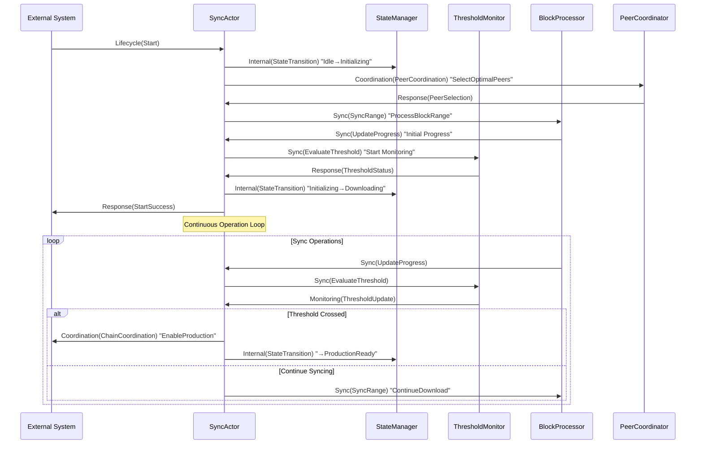
```mermaid
sequenceDiagram
    participant EXT as External System
    participant SA as SyncActor
    participant SM as StateManager
    participant TM as ThresholdMonitor
    participant BP as BlockProcessor
    participant PC as PeerCoordinator
    
    EXT->>SA: Lifecycle(Start)
    SA->>SM: Internal(StateTransition) "Idle→Initializing"
    SA->>PC: Coordination(PeerCoordination) "SelectOptimalPeers"
    PC->>SA: Response(PeerSelection)
    
    SA->>BP: Sync(SyncRange) "ProcessBlockRange"
    BP->>SA: Sync(UpdateProgress) "Initial Progress"
    
    SA->>TM: Sync(EvaluateThreshold) "Start Monitoring"
    TM->>SA: Response(ThresholdStatus)
    
    SA->>SM: Internal(StateTransition) "Initializing→Downloading"
    SA->>EXT: Response(StartSuccess)
    
    Note over SA: Continuous Operation Loop
    loop Sync Operations
        BP->>SA: Sync(UpdateProgress)
        SA->>TM: Sync(EvaluateThreshold)
        TM->>SA: Monitoring(ThresholdUpdate)
        
        alt Threshold Crossed
            SA->>EXT: Coordination(ChainCoordination) "EnableProduction"
            SA->>SM: Internal(StateTransition) "→ProductionReady"
        else Continue Syncing
            SA->>BP: Sync(SyncRange) "ContinueDownload"
        end
    end
```

**2. Error Handling and Recovery Flow**
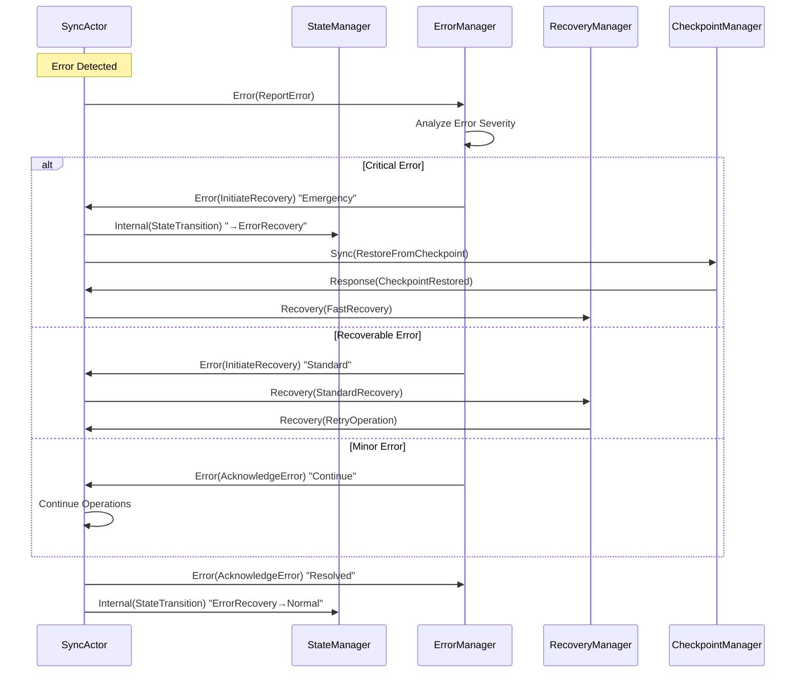
```mermaid
sequenceDiagram
    participant SA as SyncActor
    participant SM as StateManager
    participant EM as ErrorManager
    participant RM as RecoveryManager
    participant CM as CheckpointManager
    
    Note over SA: Error Detected
    SA->>EM: Error(ReportError)
    EM->>EM: Analyze Error Severity
    
    alt Critical Error
        EM->>SA: Error(InitiateRecovery) "Emergency"
        SA->>SM: Internal(StateTransition) "→ErrorRecovery"
        SA->>CM: Sync(RestoreFromCheckpoint)
        CM->>SA: Response(CheckpointRestored)
        SA->>RM: Recovery(FastRecovery)
    else Recoverable Error
        EM->>SA: Error(InitiateRecovery) "Standard"
        SA->>RM: Recovery(StandardRecovery)
        RM->>SA: Recovery(RetryOperation)
    else Minor Error
        EM->>SA: Error(AcknowledgeError) "Continue"
        SA->>SA: Continue Operations
    end
    
    SA->>EM: Error(AcknowledgeError) "Resolved"
    SA->>SM: Internal(StateTransition) "ErrorRecovery→Normal"
```

#### Advanced Message Handling Patterns

**Message Handler Implementation with Pattern Matching:**
```rust
// Comprehensive message handling with sophisticated pattern matching
impl Handler<SyncActorMessage> for SyncActor {
    type Result = ResponseActFuture<Self, Result<SyncResponse, SyncError>>;
    
    fn handle(&mut self, msg: SyncActorMessage, ctx: &mut Context<Self>) -> Self::Result {
        Box::pin(
            async move {
                match msg {
                    // === LIFECYCLE MESSAGE HANDLING ===
                    SyncActorMessage::Lifecycle(lifecycle_msg) => {
                        self.handle_lifecycle_message(lifecycle_msg, ctx).await
                    },
                    
                    // === SYNC OPERATION MESSAGE HANDLING ===
                    SyncActorMessage::Sync(sync_msg) => {
                        self.handle_sync_operation_message(sync_msg, ctx).await
                    },
                    
                    // === COORDINATION MESSAGE HANDLING ===
                    SyncActorMessage::Coordination(coord_msg) => {
                        self.handle_coordination_message(coord_msg, ctx).await
                    },
                    
                    // === MONITORING MESSAGE HANDLING ===
                    SyncActorMessage::Monitoring(monitor_msg) => {
                        self.handle_monitoring_message(monitor_msg, ctx).await
                    },
                    
                    // === ERROR MESSAGE HANDLING ===
                    SyncActorMessage::Error(error_msg) => {
                        self.handle_error_message(error_msg, ctx).await
                    },
                    
                    // === INTERNAL MESSAGE HANDLING ===
                    SyncActorMessage::Internal(internal_msg) => {
                        self.handle_internal_message(internal_msg, ctx).await
                    },
                }
            }
            .into_actor(self)
        )
    }
}

impl SyncActor {
    async fn handle_lifecycle_message(&mut self, 
                                     msg: LifecycleMessage, 
                                     ctx: &mut Context<Self>) -> Result<SyncResponse, SyncError> {
        match msg {
            LifecycleMessage::Initialize { config, recovery_mode, startup_options } => {
                self.initialize_actor(config, recovery_mode, startup_options).await?;
                Ok(SyncResponse::Initialized {
                    actor_id: self.actor_id.clone(),
                    configuration: self.config.clone(),
                    capabilities: self.get_capabilities(),
                })
            },
            
            LifecycleMessage::Start { target_height, sync_mode, priority, timeout } => {
                // Validate preconditions
                self.validate_start_preconditions()?;
                
                // Transition to starting state
                self.state_manager.transition_state(
                    SyncState::Starting { 
                        target_height,
                        sync_mode: sync_mode.clone(),
                        start_time: Instant::now() 
                    },
                    StateTrigger::ExternalCommand
                ).await?;
                
                // Initialize synchronization components
                let peer_selection = self.peer_coordinator
                    .send(PeerCoordination {
                        peer_operation: PeerOperation::SelectForSync,
                        peer_filters: self.create_peer_filters(&sync_mode),
                        selection_criteria: self.create_selection_criteria(priority),
                        expected_count: self.config.max_parallel_downloads,
                    })
                    .await??;
                
                // Create sync plan
                let sync_plan = self.create_sync_plan(target_height, &peer_selection, &sync_mode)?;
                
                // Start block processing
                for range_task in sync_plan.range_tasks {
                    self.block_processor
                        .send(SyncOperationMessage::SyncRange {
                            start_height: range_task.start_height,
                            end_height: range_task.end_height,
                            peer_assignments: range_task.peer_assignments,
                            parallel_factor: range_task.parallelism,
                            timeout: timeout.unwrap_or(self.config.default_timeout),
                        })
                        .await?;
                }
                
                // Start threshold monitoring
                self.threshold_monitor
                    .send(SyncOperationMessage::EvaluateThreshold {
                        force_recalculation: true,
                        include_trends: true,
                        confidence_level: self.config.confidence_threshold,
                        safety_validation: true,
                    })
                    .await?;
                
                // Schedule periodic health checks
                ctx.notify_later(
                    SyncActorMessage::Monitoring(MonitoringMessage::GetHealth {
                        include_details: false,
                        component_filter: None,
                        metrics_snapshot: true,
                    }),
                    self.config.health_check_interval
                );
                
                // Transition to active state
                self.state_manager.transition_state(
                    SyncState::Downloading {
                        progress: SyncProgress::new(0, target_height),
                        active_tasks: sync_plan.task_count,
                        estimated_completion: sync_plan.estimated_completion,
                    },
                    StateTrigger::SyncStarted
                ).await?;
                
                Ok(SyncResponse::Started {
                    sync_id: sync_plan.sync_id,
                    estimated_blocks: sync_plan.total_blocks,
                    estimated_duration: sync_plan.estimated_completion,
                    peer_count: peer_selection.selected_peers.len(),
                })
            },
            
            LifecycleMessage::Pause { reason, preserve_state, estimated_duration } => {
                self.pause_operations(reason, preserve_state, estimated_duration).await?;
                Ok(SyncResponse::Paused {
                    pause_time: Instant::now(),
                    state_preserved: preserve_state,
                    resume_available: true,
                })
            },
            
            LifecycleMessage::Resume { resume_point, force_restart, resume_options } => {
                self.resume_operations(resume_point, force_restart, resume_options).await?;
                Ok(SyncResponse::Resumed {
                    resume_time: Instant::now(),
                    resume_point: resume_point.unwrap_or(self.get_current_height()),
                    estimated_catch_up: self.estimate_catch_up_time(),
                })
            },
            
            LifecycleMessage::Stop { graceful, save_state, cleanup_resources, timeout } => {
                self.stop_operations(graceful, save_state, cleanup_resources, timeout).await?;
                Ok(SyncResponse::Stopped {
                    stop_time: Instant::now(),
                    final_state: if save_state { Some(self.capture_state().await) } else { None },
                    cleanup_completed: cleanup_resources,
                })
            },
            
            LifecycleMessage::Shutdown { emergency, final_checkpoint, notification_targets } => {
                if final_checkpoint {
                    self.create_final_checkpoint().await?;
                }
                
                for target in notification_targets {
                    self.notify_shutdown(&target).await?;
                }
                
                if emergency {
                    ctx.stop();
                } else {
                    self.graceful_shutdown().await?;
                }
                
                Ok(SyncResponse::ShutdownInitiated {
                    shutdown_time: Instant::now(),
                    emergency_mode: emergency,
                    final_checkpoint_created: final_checkpoint,
                })
            },
        }
    }
    
    async fn handle_sync_operation_message(&mut self, 
                                          msg: SyncOperationMessage, 
                                          ctx: &mut Context<Self>) -> Result<SyncResponse, SyncError> {
        match msg {
            SyncOperationMessage::ProcessBlocks { blocks, source_peer, batch_id, validation_level, priority } => {
                let processing_start = Instant::now();
                
                // Validate blocks before processing
                self.validate_block_batch(&blocks, &source_peer, validation_level)?;
                
                // Process blocks through pipeline
                let processing_result = self.block_processor
                    .send(ProcessBlocksMessage {
                        blocks: blocks.clone(),
                        source: source_peer,
                        validation_level,
                        priority,
                    })
                    .await??;
                
                // Update sync progress
                let new_progress = self.calculate_progress_update(&blocks)?;
                self.update_sync_progress(new_progress).await?;
                
                // Check threshold after progress update
                let threshold_result = self.threshold_monitor
                    .send(SyncOperationMessage::EvaluateThreshold {
                        force_recalculation: false,
                        include_trends: true,
                        confidence_level: self.config.confidence_threshold,
                        safety_validation: true,
                    })
                    .await??;
                
                // Handle threshold crossing if applicable
                if let ThresholdResult::Crossed { threshold_value, confidence, safety_validated } = threshold_result {
                    self.handle_threshold_crossed(threshold_value, confidence, safety_validated).await?;
                }
                
                // Update metrics
                self.metrics.blocks_processed.inc_by(blocks.len() as u64);
                self.metrics.processing_latency.record(processing_start.elapsed().as_secs_f64());
                
                Ok(SyncResponse::BlocksProcessed {
                    batch_id,
                    blocks_count: blocks.len(),
                    processing_time: processing_start.elapsed(),
                    new_height: self.get_current_height(),
                    threshold_status: threshold_result,
                })
            },
            
            SyncOperationMessage::SyncRange { start_height, end_height, peer_assignments, parallel_factor, timeout } => {
                // Create range synchronization task
                let range_task = RangeSyncTask::new(
                    start_height,
                    end_height,
                    peer_assignments,
                    parallel_factor,
                    timeout,
                );
                
                // Execute range synchronization
                let sync_result = self.execute_range_sync(range_task).await?;
                
                Ok(SyncResponse::RangeSynced {
                    start_height,
                    end_height,
                    blocks_synced: sync_result.blocks_processed,
                    sync_duration: sync_result.duration,
                    peer_performance: sync_result.peer_stats,
                })
            },
            
            SyncOperationMessage::UpdateProgress { current_height, network_height, sync_percentage, blocks_processed, processing_rate, estimated_completion } => {
                // Update internal progress state
                let progress_update = ProgressUpdate {
                    current_height,
                    network_height,
                    sync_percentage,
                    blocks_processed,
                    processing_rate,
                    estimated_completion,
                    timestamp: Instant::now(),
                };
                
                self.apply_progress_update(progress_update).await?;
                
                // Emit progress event
                self.emit_progress_event(&progress_update).await?;
                
                Ok(SyncResponse::ProgressUpdated {
                    current_progress: sync_percentage,
                    blocks_remaining: network_height.saturating_sub(current_height),
                    estimated_completion,
                })
            },
            
            SyncOperationMessage::EvaluateThreshold { force_recalculation, include_trends, confidence_level, safety_validation } => {
                let evaluation_result = self.threshold_monitor
                    .evaluate_production_readiness(
                        force_recalculation,
                        include_trends,
                        confidence_level,
                        safety_validation
                    ).await?;
                
                Ok(SyncResponse::ThresholdEvaluated {
                    ready_for_production: evaluation_result.ready_for_production,
                    composite_score: evaluation_result.composite_score,
                    confidence_interval: evaluation_result.confidence_interval,
                    safety_factors: evaluation_result.safety_factors,
                })
            },
            
            SyncOperationMessage::CreateCheckpoint { checkpoint_type, force_create, compression_level, metadata } => {
                let checkpoint_result = self.checkpoint_manager
                    .create_checkpoint(checkpoint_type, force_create, compression_level, metadata)
                    .await?;
                
                Ok(SyncResponse::CheckpointCreated {
                    checkpoint_id: checkpoint_result.checkpoint_id,
                    checkpoint_size: checkpoint_result.size_bytes,
                    creation_time: checkpoint_result.creation_time,
                    compression_ratio: checkpoint_result.compression_ratio,
                })
            },
            
            SyncOperationMessage::RestoreFromCheckpoint { checkpoint_id, validation_mode, restore_options } => {
                let restore_result = self.checkpoint_manager
                    .restore_from_checkpoint(checkpoint_id, validation_mode, restore_options)
                    .await?;
                
                // Update state after restoration
                self.post_restore_state_update(&restore_result).await?;
                
                Ok(SyncResponse::CheckpointRestored {
                    checkpoint_id: restore_result.checkpoint_id,
                    restored_height: restore_result.restored_height,
                    restoration_time: restore_result.restoration_time,
                    validation_status: restore_result.validation_status,
                })
            },
        }
    }
}
```

#### Message Serialization and Network Protocol

**Protocol Buffer Definitions for Network Serialization:**
```protobuf
// SyncActor network protocol definitions
syntax = "proto3";

package alys.sync_actor.v1;

// Main message wrapper for network transmission
message SyncActorNetworkMessage {
  string message_id = 1;
  int64 timestamp = 2;
  string sender_id = 3;
  string recipient_id = 4;
  MessagePriority priority = 5;
  oneof message_type {
    LifecycleMessage lifecycle = 10;
    SyncOperationMessage sync_operation = 11;
    CoordinationMessage coordination = 12;
    MonitoringMessage monitoring = 13;
    ErrorMessage error = 14;
    ResponseMessage response = 15;
  }
}

message LifecycleMessage {
  oneof operation {
    InitializeOperation initialize = 1;
    StartOperation start = 2;
    PauseOperation pause = 3;
    ResumeOperation resume = 4;
    StopOperation stop = 5;
    ShutdownOperation shutdown = 6;
  }
}

message SyncOperationMessage {
  oneof operation {
    ProcessBlocksOperation process_blocks = 1;
    SyncRangeOperation sync_range = 2;
    UpdateProgressOperation update_progress = 3;
    EvaluateThresholdOperation evaluate_threshold = 4;
    CheckpointOperation checkpoint = 5;
  }
}

message ProcessBlocksOperation {
  repeated Block blocks = 1;
  string source_peer_id = 2;
  string batch_id = 3;
  ValidationLevel validation_level = 4;
  ProcessingPriority priority = 5;
}

message Block {
  BlockHeader header = 1;
  repeated Transaction transactions = 2;
  bytes merkle_root = 3;
  int64 timestamp = 4;
  string hash = 5;
}

message SyncRangeOperation {
  uint64 start_height = 1;
  uint64 end_height = 2;
  repeated PeerAssignment peer_assignments = 3;
  uint32 parallel_factor = 4;
  int64 timeout_ms = 5;
}

message PeerAssignment {
  string peer_id = 1;
  uint64 range_start = 2;
  uint64 range_end = 3;
  float capacity_weight = 4;
  PeerCapabilities capabilities = 5;
}

enum MessagePriority {
  LOW = 0;
  NORMAL = 1;
  HIGH = 2;
  CRITICAL = 3;
  FEDERATION = 4;  // Highest priority for federation messages
}

enum ValidationLevel {
  BASIC = 0;        // Basic structural validation
  STANDARD = 1;     // Standard cryptographic validation
  COMPREHENSIVE = 2; // Full consensus validation
  PARANOID = 3;     // Maximum security validation
}
```

**Message Serialization Implementation:**
```rust
// High-performance message serialization with compression
pub struct MessageSerializer {
    compression_threshold: usize,
    compression_algorithm: CompressionAlgorithm,
    encryption_enabled: bool,
    encryption_key: Option<[u8; 32]>,
}

impl MessageSerializer {
    pub fn serialize_message(&self, message: &SyncActorMessage) -> Result<Vec<u8>, SerializationError> {
        // 1. Convert to protocol buffer format
        let proto_message = self.to_protobuf(message)?;
        
        // 2. Serialize to bytes
        let mut serialized = proto_message.encode_to_vec();
        
        // 3. Apply compression if message is large enough
        if serialized.len() > self.compression_threshold {
            serialized = self.compress_data(&serialized)?;
        }
        
        // 4. Apply encryption if enabled
        if self.encryption_enabled {
            if let Some(key) = &self.encryption_key {
                serialized = self.encrypt_data(&serialized, key)?;
            }
        }
        
        // 5. Add message envelope with metadata
        let envelope = MessageEnvelope {
            version: PROTOCOL_VERSION,
            compressed: serialized.len() < proto_message.encoded_len(),
            encrypted: self.encryption_enabled,
            checksum: self.calculate_checksum(&serialized),
            payload: serialized,
        };
        
        Ok(envelope.encode_to_vec())
    }
    
    pub fn deserialize_message(&self, data: &[u8]) -> Result<SyncActorMessage, DeserializationError> {
        // 1. Parse message envelope
        let envelope = MessageEnvelope::decode(data)?;
        
        // 2. Verify protocol version
        if envelope.version != PROTOCOL_VERSION {
            return Err(DeserializationError::UnsupportedVersion(envelope.version));
        }
        
        // 3. Verify checksum
        let calculated_checksum = self.calculate_checksum(&envelope.payload);
        if calculated_checksum != envelope.checksum {
            return Err(DeserializationError::ChecksumMismatch);
        }
        
        let mut payload = envelope.payload;
        
        // 4. Decrypt if necessary
        if envelope.encrypted {
            if let Some(key) = &self.encryption_key {
                payload = self.decrypt_data(&payload, key)?;
            } else {
                return Err(DeserializationError::MissingDecryptionKey);
            }
        }
        
        // 5. Decompress if necessary
        if envelope.compressed {
            payload = self.decompress_data(&payload)?;
        }
        
        // 6. Parse protocol buffer message
        let proto_message = SyncActorNetworkMessage::decode(&payload[..])?;
        
        // 7. Convert back to internal message format
        let message = self.from_protobuf(proto_message)?;
        
        Ok(message)
    }
    
    fn compress_data(&self, data: &[u8]) -> Result<Vec<u8>, CompressionError> {
        match self.compression_algorithm {
            CompressionAlgorithm::Lz4 => {
                lz4_flex::compress_prepend_size(data)
            },
            CompressionAlgorithm::Zstd => {
                zstd::encode_all(data, 3)  // Compression level 3 for balance
            },
            CompressionAlgorithm::None => Ok(data.to_vec()),
        }.map_err(CompressionError::from)
    }
    
    fn encrypt_data(&self, data: &[u8], key: &[u8; 32]) -> Result<Vec<u8>, EncryptionError> {
        use chacha20poly1305::{ChaCha20Poly1305, KeyInit, aead::Aead};
        
        let cipher = ChaCha20Poly1305::new(key.into());
        let nonce = self.generate_nonce();
        
        let mut encrypted = cipher.encrypt(&nonce, data)
            .map_err(|_| EncryptionError::EncryptionFailed)?;
        
        // Prepend nonce to encrypted data
        let mut result = nonce.to_vec();
        result.append(&mut encrypted);
        
        Ok(result)
    }
}
```

## Phase 3: Implementation Mastery & Advanced Techniques

### Section 7: Complete Implementation Walkthrough

This section provides a comprehensive walkthrough of implementing a production-ready SyncActor from scratch. We'll build the complete actor step by step, implementing every critical component with production-quality code.

#### 7.1 Project Structure and Module Organization

```
src/actors/network/sync/
├── mod.rs                    # Module exports and public API
├── actor.rs                  # Main SyncActor implementation
├── state/
│   ├── mod.rs               # State management modules
│   ├── sync_state.rs        # Core synchronization state
│   ├── peer_state.rs        # Peer connection state
│   └── metrics.rs           # Performance metrics collection
├── handlers/
│   ├── mod.rs               # Message handler modules
│   ├── block_handlers.rs    # Block-related message handling
│   ├── peer_handlers.rs     # Peer management handlers
│   └── sync_handlers.rs     # Synchronization protocol handlers
├── protocols/
│   ├── mod.rs               # Protocol implementations
│   ├── block_sync.rs        # Block synchronization protocol
│   ├── checkpoint.rs        # Checkpoint management
│   └── peer_discovery.rs    # Peer discovery and ranking
└── utils/
    ├── mod.rs               # Utility functions
    ├── validators.rs        # Block and transaction validation
    └── serialization.rs     # Custom serialization logic
```

#### 7.2 Core SyncActor Implementation

Let's start with the main actor implementation, building upon the architectural patterns we've established:

```rust
// src/actors/network/sync/actor.rs
use actix::prelude::*;
use std::collections::{HashMap, HashSet, VecDeque};
use std::time::{Duration, Instant};
use tracing::{info, warn, error, debug, trace};
use tokio::time::{interval, sleep};

use crate::actors::network::sync::state::{SyncState, PeerState, SyncMetrics};
use crate::actors::network::sync::protocols::{BlockSyncProtocol, CheckpointManager};
use crate::actors::network::sync::handlers::*;
use crate::types::{Block, BlockHash, BlockHeight, PeerId};

/// Production-ready SyncActor with comprehensive synchronization capabilities
pub struct SyncActor {
    /// Core synchronization state tracking
    sync_state: SyncState,
    
    /// Active peer connections and their states
    peers: HashMap<PeerId, PeerState>,
    
    /// Block synchronization protocol handler
    block_sync: BlockSyncProtocol,
    
    /// Checkpoint management system
    checkpoint_manager: CheckpointManager,
    
    /// Performance metrics collection
    metrics: SyncMetrics,
    
    /// Configuration parameters
    config: SyncActorConfig,
    
    /// Internal message queues for different priorities
    high_priority_queue: VecDeque<SyncMessage>,
    normal_priority_queue: VecDeque<SyncMessage>,
    low_priority_queue: VecDeque<SyncMessage>,
    
    /// Rate limiting and backpressure management
    rate_limiter: RateLimiter,
    backpressure_detector: BackpressureDetector,
    
    /// Health monitoring and diagnostics
    health_monitor: HealthMonitor,
    diagnostic_collector: DiagnosticCollector,
}

#[derive(Debug, Clone)]
pub struct SyncActorConfig {
    /// Production threshold for activating block production
    pub production_threshold_percent: f64,  // 99.5% default
    
    /// Maximum number of concurrent block downloads
    pub max_concurrent_downloads: usize,    // 50 default
    
    /// Block request timeout duration
    pub block_request_timeout: Duration,    // 30 seconds default
    
    /// Peer connection timeout
    pub peer_connection_timeout: Duration,  // 60 seconds default
    
    /// Maximum number of peers to maintain
    pub max_peers: usize,                   // 100 default
    
    /// Checkpoint interval (blocks)
    pub checkpoint_interval: u64,           // 1000 blocks default
    
    /// Sync batch size for parallel downloads
    pub sync_batch_size: usize,            // 100 blocks default
    
    /// Health check interval
    pub health_check_interval: Duration,    // 30 seconds default
    
    /// Metrics collection interval  
    pub metrics_interval: Duration,         // 10 seconds default
    
    /// Maximum memory usage for block cache (bytes)
    pub max_block_cache_size: usize,       // 100MB default
}

impl Default for SyncActorConfig {
    fn default() -> Self {
        Self {
            production_threshold_percent: 99.5,
            max_concurrent_downloads: 50,
            block_request_timeout: Duration::from_secs(30),
            peer_connection_timeout: Duration::from_secs(60),
            max_peers: 100,
            checkpoint_interval: 1000,
            sync_batch_size: 100,
            health_check_interval: Duration::from_secs(30),
            metrics_interval: Duration::from_secs(10),
            max_block_cache_size: 100 * 1024 * 1024, // 100MB
        }
    }
}

impl SyncActor {
    /// Create a new SyncActor with the specified configuration
    pub fn new(config: SyncActorConfig) -> Self {
        info!("Initializing SyncActor with config: {:?}", config);
        
        Self {
            sync_state: SyncState::new(),
            peers: HashMap::with_capacity(config.max_peers),
            block_sync: BlockSyncProtocol::new(config.clone()),
            checkpoint_manager: CheckpointManager::new(config.checkpoint_interval),
            metrics: SyncMetrics::new(),
            config,
            high_priority_queue: VecDeque::new(),
            normal_priority_queue: VecDeque::new(),
            low_priority_queue: VecDeque::new(),
            rate_limiter: RateLimiter::new(),
            backpressure_detector: BackpressureDetector::new(),
            health_monitor: HealthMonitor::new(),
            diagnostic_collector: DiagnosticCollector::new(),
        }
    }
    
    /// Start the synchronization process
    async fn start_sync(&mut self, ctx: &mut Context<Self>) {
        info!("Starting synchronization process");
        
        // Initialize periodic tasks
        self.schedule_health_checks(ctx);
        self.schedule_metrics_collection(ctx);
        self.schedule_checkpoint_creation(ctx);
        self.schedule_peer_maintenance(ctx);
        
        // Start block synchronization
        self.initiate_block_sync(ctx).await;
        
        self.metrics.sync_started_at = Some(Instant::now());
        info!("Synchronization process started successfully");
    }
    
    /// Process messages from priority queues with proper backpressure handling
    async fn process_message_queues(&mut self, ctx: &mut Context<Self>) {
        // Check for backpressure conditions
        if self.backpressure_detector.should_throttle() {
            debug!("Backpressure detected, throttling message processing");
            self.metrics.backpressure_events += 1;
            
            // Sleep briefly to allow system to recover
            sleep(Duration::from_millis(10)).await;
            return;
        }
        
        // Process high priority messages first
        if let Some(message) = self.high_priority_queue.pop_front() {
            self.handle_prioritized_message(message, MessagePriority::High, ctx).await;
            return;
        }
        
        // Process normal priority messages
        if let Some(message) = self.normal_priority_queue.pop_front() {
            self.handle_prioritized_message(message, MessagePriority::Normal, ctx).await;
            return;
        }
        
        // Process low priority messages only if no backlog
        if self.high_priority_queue.is_empty() && self.normal_priority_queue.len() < 10 {
            if let Some(message) = self.low_priority_queue.pop_front() {
                self.handle_prioritized_message(message, MessagePriority::Low, ctx).await;
            }
        }
    }
    
    /// Handle a prioritized message based on its type and priority
    async fn handle_prioritized_message(
        &mut self, 
        message: SyncMessage, 
        priority: MessagePriority,
        ctx: &mut Context<Self>
    ) {
        let start_time = Instant::now();
        
        let result = match message {
            SyncMessage::BlockReceived(block_msg) => {
                self.handle_block_received(block_msg, ctx).await
            },
            SyncMessage::PeerConnected(peer_msg) => {
                self.handle_peer_connected(peer_msg, ctx).await
            },
            SyncMessage::PeerDisconnected(peer_msg) => {
                self.handle_peer_disconnected(peer_msg, ctx).await
            },
            SyncMessage::SyncRequest(sync_msg) => {
                self.handle_sync_request(sync_msg, ctx).await
            },
            SyncMessage::CheckpointRequest(checkpoint_msg) => {
                self.handle_checkpoint_request(checkpoint_msg, ctx).await
            },
            SyncMessage::HealthCheck => {
                self.handle_health_check(ctx).await
            },
        };
        
        let processing_time = start_time.elapsed();
        
        // Update metrics based on message processing
        match priority {
            MessagePriority::High => {
                self.metrics.high_priority_messages_processed += 1;
                self.metrics.high_priority_avg_time = 
                    self.calculate_moving_average(
                        self.metrics.high_priority_avg_time, 
                        processing_time
                    );
            },
            MessagePriority::Normal => {
                self.metrics.normal_priority_messages_processed += 1;
                self.metrics.normal_priority_avg_time = 
                    self.calculate_moving_average(
                        self.metrics.normal_priority_avg_time, 
                        processing_time
                    );
            },
            MessagePriority::Low => {
                self.metrics.low_priority_messages_processed += 1;
                self.metrics.low_priority_avg_time = 
                    self.calculate_moving_average(
                        self.metrics.low_priority_avg_time, 
                        processing_time
                    );
            },
        }
        
        if let Err(e) = result {
            error!("Error processing {:?} message: {}", priority, e);
            self.metrics.message_processing_errors += 1;
        }
    }
    
    /// Calculate moving average for performance metrics
    fn calculate_moving_average(&self, current_avg: Duration, new_value: Duration) -> Duration {
        const ALPHA: f64 = 0.1; // Exponential moving average factor
        let current_ms = current_avg.as_millis() as f64;
        let new_ms = new_value.as_millis() as f64;
        let updated_ms = current_ms * (1.0 - ALPHA) + new_ms * ALPHA;
        Duration::from_millis(updated_ms as u64)
    }
}

impl Actor for SyncActor {
    type Context = Context<Self>;
    
    fn started(&mut self, ctx: &mut Self::Context) {
        info!("SyncActor started, initializing synchronization");
        
        // Start the main synchronization process
        ctx.wait(
            async move {
                self.start_sync(ctx).await;
            }
            .into_actor(self)
        );
        
        // Schedule periodic message queue processing
        ctx.run_interval(Duration::from_millis(1), |act, ctx| {
            ctx.wait(
                async move {
                    act.process_message_queues(ctx).await;
                }
                .into_actor(act)
            );
        });
        
        self.health_monitor.actor_started();
        info!("SyncActor initialization complete");
    }
    
    fn stopped(&mut self, _ctx: &mut Self::Context) {
        info!("SyncActor stopped, cleaning up resources");
        
        // Save current state for recovery
        if let Err(e) = self.save_state_checkpoint() {
            error!("Failed to save state checkpoint during shutdown: {}", e);
        }
        
        // Log final metrics
        self.log_final_metrics();
        
        self.health_monitor.actor_stopped();
        info!("SyncActor shutdown complete");
    }
}
```

#### 7.3 State Management Implementation

The state management system is crucial for maintaining consistency and enabling recovery:

```rust
// src/actors/network/sync/state/sync_state.rs
use std::collections::{HashMap, BTreeMap, HashSet};
use std::time::{Duration, Instant};
use serde::{Serialize, Deserialize};

use crate::types::{Block, BlockHash, BlockHeight, PeerId};

/// Core synchronization state with persistence and recovery capabilities
#[derive(Debug, Clone, Serialize, Deserialize)]
pub struct SyncState {
    /// Current blockchain height we're synced to
    pub current_height: BlockHeight,
    
    /// Target height we're trying to reach
    pub target_height: BlockHeight,
    
    /// Best known block hash at current height
    pub best_block_hash: BlockHash,
    
    /// Production threshold state
    pub production_active: bool,
    pub production_threshold_reached_at: Option<Instant>,
    
    /// Block download state
    pub downloading_blocks: HashMap<BlockHeight, DownloadState>,
    pub downloaded_blocks: BTreeMap<BlockHeight, Block>,
    pub validated_blocks: HashSet<BlockHeight>,
    
    /// Synchronization progress tracking
    pub sync_progress: SyncProgress,
    
    /// Network partition detection
    pub network_partition_detected: bool,
    pub last_block_received_at: Option<Instant>,
    
    /// Fork detection and resolution
    pub active_forks: HashMap<BlockHash, ForkInfo>,
    pub canonical_chain: Vec<BlockHash>,
    
    /// Checkpoint state
    pub last_checkpoint_height: BlockHeight,
    pub pending_checkpoints: Vec<CheckpointInfo>,
}

#[derive(Debug, Clone, Serialize, Deserialize)]
pub struct DownloadState {
    pub requested_at: Instant,
    pub requested_from: PeerId,
    pub retry_count: usize,
    pub timeout_at: Instant,
}

#[derive(Debug, Clone, Serialize, Deserialize)]
pub struct SyncProgress {
    pub total_blocks_to_sync: u64,
    pub blocks_synced: u64,
    pub sync_speed_blocks_per_sec: f64,
    pub estimated_completion_time: Option<Duration>,
    pub last_progress_update: Instant,
}

#[derive(Debug, Clone, Serialize, Deserialize)]
pub struct ForkInfo {
    pub fork_point: BlockHeight,
    pub chain_length: u64,
    pub last_block_hash: BlockHash,
    pub total_difficulty: u128,
    pub discovered_at: Instant,
}

#[derive(Debug, Clone, Serialize, Deserialize)]
pub struct CheckpointInfo {
    pub height: BlockHeight,
    pub block_hash: BlockHash,
    pub created_at: Instant,
    pub validated: bool,
}

impl SyncState {
    /// Create a new synchronization state
    pub fn new() -> Self {
        Self {
            current_height: 0,
            target_height: 0,
            best_block_hash: BlockHash::default(),
            production_active: false,
            production_threshold_reached_at: None,
            downloading_blocks: HashMap::new(),
            downloaded_blocks: BTreeMap::new(),
            validated_blocks: HashSet::new(),
            sync_progress: SyncProgress::new(),
            network_partition_detected: false,
            last_block_received_at: None,
            active_forks: HashMap::new(),
            canonical_chain: Vec::new(),
            last_checkpoint_height: 0,
            pending_checkpoints: Vec::new(),
        }
    }
    
    /// Calculate current synchronization percentage
    pub fn sync_percentage(&self) -> f64 {
        if self.target_height == 0 {
            return 0.0;
        }
        
        (self.current_height as f64 / self.target_height as f64) * 100.0
    }
    
    /// Check if production threshold has been reached
    pub fn check_production_threshold(&mut self, threshold_percent: f64) -> bool {
        let sync_percent = self.sync_percentage();
        let threshold_reached = sync_percent >= threshold_percent;
        
        if threshold_reached && !self.production_active {
            self.production_active = true;
            self.production_threshold_reached_at = Some(Instant::now());
            info!(
                "Production threshold reached: {:.2}% >= {:.2}%", 
                sync_percent, 
                threshold_percent
            );
            true
        } else if !threshold_reached && self.production_active {
            self.production_active = false;
            self.production_threshold_reached_at = None;
            warn!(
                "Production threshold lost: {:.2}% < {:.2}%", 
                sync_percent, 
                threshold_percent
            );
            false
        } else {
            self.production_active
        }
    }
    
    /// Update target height from network consensus
    pub fn update_target_height(&mut self, new_target: BlockHeight) {
        if new_target > self.target_height {
            let blocks_added = new_target - self.target_height;
            self.target_height = new_target;
            self.sync_progress.total_blocks_to_sync += blocks_added;
            
            debug!(
                "Target height updated to {}, {} new blocks to sync", 
                new_target, 
                blocks_added
            );
        }
    }
    
    /// Add a block to the download queue
    pub fn request_block_download(&mut self, height: BlockHeight, peer_id: PeerId, timeout: Duration) {
        let download_state = DownloadState {
            requested_at: Instant::now(),
            requested_from: peer_id,
            retry_count: 0,
            timeout_at: Instant::now() + timeout,
        };
        
        self.downloading_blocks.insert(height, download_state);
        debug!("Requested block download for height {} from peer {}", height, peer_id);
    }
    
    /// Mark a block as successfully downloaded
    pub fn mark_block_downloaded(&mut self, height: BlockHeight, block: Block) {
        self.downloading_blocks.remove(&height);
        self.downloaded_blocks.insert(height, block.clone());
        self.last_block_received_at = Some(Instant::now());
        
        // Update sync progress
        self.sync_progress.blocks_synced += 1;
        self.sync_progress.update_speed();
        
        debug!("Block {} successfully downloaded and cached", height);
    }
    
    /// Mark a block as validated and ready for insertion
    pub fn mark_block_validated(&mut self, height: BlockHeight) -> bool {
        if self.downloaded_blocks.contains_key(&height) {
            self.validated_blocks.insert(height);
            debug!("Block {} validated and ready for insertion", height);
            true
        } else {
            warn!("Attempted to validate non-existent block at height {}", height);
            false
        }
    }
    
    /// Get the next contiguous batch of validated blocks ready for insertion
    pub fn get_next_insertion_batch(&mut self, max_batch_size: usize) -> Vec<Block> {
        let mut batch = Vec::new();
        let mut current_height = self.current_height + 1;
        
        while batch.len() < max_batch_size {
            if self.validated_blocks.contains(&current_height) {
                if let Some(block) = self.downloaded_blocks.remove(&current_height) {
                    self.validated_blocks.remove(&current_height);
                    batch.push(block);
                    current_height += 1;
                } else {
                    break;
                }
            } else {
                break;
            }
        }
        
        debug!("Prepared batch of {} blocks for insertion starting at height {}", 
               batch.len(), self.current_height + 1);
        batch
    }
    
    /// Update current height after successful block insertion
    pub fn advance_current_height(&mut self, new_height: BlockHeight, block_hash: BlockHash) {
        self.current_height = new_height;
        self.best_block_hash = block_hash;
        self.canonical_chain.push(block_hash);
        
        // Clean up old fork information
        self.cleanup_old_forks(new_height);
        
        debug!("Advanced current height to {} with block hash {}", new_height, block_hash);
    }
    
    /// Clean up fork information that's no longer relevant
    fn cleanup_old_forks(&mut self, current_height: BlockHeight) {
        const FORK_CLEANUP_DEPTH: BlockHeight = 100;
        
        if current_height > FORK_CLEANUP_DEPTH {
            let cleanup_threshold = current_height - FORK_CLEANUP_DEPTH;
            
            self.active_forks.retain(|_, fork_info| {
                fork_info.fork_point > cleanup_threshold
            });
        }
    }
    
    /// Detect and handle network partitions
    pub fn check_network_partition(&mut self, partition_timeout: Duration) -> bool {
        if let Some(last_received) = self.last_block_received_at {
            let partition_detected = last_received.elapsed() > partition_timeout;
            
            if partition_detected && !self.network_partition_detected {
                warn!("Network partition detected: no blocks received for {:?}", partition_timeout);
                self.network_partition_detected = true;
            } else if !partition_detected && self.network_partition_detected {
                info!("Network partition resolved");
                self.network_partition_detected = false;
            }
            
            partition_detected
        } else {
            false
        }
    }
    
    /// Create a state checkpoint for persistence
    pub fn create_checkpoint(&self) -> Result<Vec<u8>, StateError> {
        bincode::serialize(self).map_err(StateError::SerializationFailed)
    }
    
    /// Restore state from a checkpoint
    pub fn restore_from_checkpoint(checkpoint_data: &[u8]) -> Result<Self, StateError> {
        bincode::deserialize(checkpoint_data).map_err(StateError::DeserializationFailed)
    }
}

impl SyncProgress {
    fn new() -> Self {
        Self {
            total_blocks_to_sync: 0,
            blocks_synced: 0,
            sync_speed_blocks_per_sec: 0.0,
            estimated_completion_time: None,
            last_progress_update: Instant::now(),
        }
    }
    
    fn update_speed(&mut self) {
        const SPEED_CALCULATION_WINDOW: Duration = Duration::from_secs(10);
        
        let now = Instant::now();
        let time_since_update = now.duration_since(self.last_progress_update);
        
        if time_since_update >= SPEED_CALCULATION_WINDOW {
            let blocks_per_sec = 1.0 / time_since_update.as_secs_f64();
            
            // Use exponential moving average for smooth speed calculation
            const ALPHA: f64 = 0.3;
            self.sync_speed_blocks_per_sec = 
                self.sync_speed_blocks_per_sec * (1.0 - ALPHA) + blocks_per_sec * ALPHA;
            
            // Calculate estimated completion time
            let remaining_blocks = self.total_blocks_to_sync - self.blocks_synced;
            if self.sync_speed_blocks_per_sec > 0.0 {
                let estimated_seconds = remaining_blocks as f64 / self.sync_speed_blocks_per_sec;
                self.estimated_completion_time = Some(Duration::from_secs_f64(estimated_seconds));
            }
            
            self.last_progress_update = now;
        }
    }
}

#[derive(Debug, thiserror::Error)]
pub enum StateError {
    #[error("State serialization failed: {0}")]
    SerializationFailed(#[from] bincode::Error),
    
    #[error("State deserialization failed: {0}")]
    DeserializationFailed(#[source] bincode::Error),
    
    #[error("Invalid state transition: {0}")]
    InvalidTransition(String),
    
    #[error("State corruption detected: {0}")]
    CorruptionDetected(String),
}
```

#### 7.4 Advanced Block Synchronization Protocol

The block synchronization protocol implements sophisticated parallel downloading and validation:

```rust
// src/actors/network/sync/protocols/block_sync.rs
use std::collections::{HashMap, HashSet, BinaryHeap, VecDeque};
use std::cmp::Reverse;
use std::time::{Duration, Instant};
use tokio::sync::{mpsc, Semaphore};
use futures::stream::{self, StreamExt};
use tracing::{info, warn, error, debug};

use crate::actors::network::sync::state::SyncState;
use crate::types::{Block, BlockHash, BlockHeight, PeerId};

/// Advanced block synchronization protocol with parallel downloading
pub struct BlockSyncProtocol {
    /// Configuration for sync behavior
    config: BlockSyncConfig,
    
    /// Download coordination
    download_semaphore: Semaphore,
    active_downloads: HashMap<BlockHeight, DownloadTask>,
    download_queue: BinaryHeap<Reverse<PrioritizedBlock>>,
    
    /// Peer management for sync
    sync_peers: HashMap<PeerId, PeerSyncCapability>,
    peer_rankings: BinaryHeap<RankedPeer>,
    
    /// Validation pipeline
    validation_pipeline: ValidationPipeline,
    
    /// Performance tracking
    download_metrics: DownloadMetrics,
    
    /// Adaptive batch sizing
    adaptive_batch_size: AdaptiveBatchSize,
}

#[derive(Debug, Clone)]
pub struct BlockSyncConfig {
    pub max_concurrent_downloads: usize,
    pub download_timeout: Duration,
    pub max_retries: usize,
    pub batch_size_min: usize,
    pub batch_size_max: usize,
    pub peer_timeout: Duration,
    pub validation_workers: usize,
}

#[derive(Debug, Clone)]
struct PrioritizedBlock {
    height: BlockHeight,
    priority: BlockPriority,
    retry_count: usize,
    preferred_peer: Option<PeerId>,
}

#[derive(Debug, Clone, PartialEq, Eq, PartialOrd, Ord)]
enum BlockPriority {
    Critical,  // Blocks needed to reach production threshold
    High,      // Blocks needed for current sync batch
    Normal,    // Regular sync blocks
    Low,       // Prefetch blocks
}

#[derive(Debug, Clone)]
struct PeerSyncCapability {
    peer_id: PeerId,
    best_height: BlockHeight,
    download_speed: f64,  // blocks per second
    reliability_score: f64,  // 0.0 to 1.0
    active_downloads: usize,
    last_response_time: Duration,
    consecutive_failures: usize,
}

#[derive(Debug, Clone, PartialEq, Eq)]
struct RankedPeer {
    peer_id: PeerId,
    score: u64,  // Higher is better
}

impl Ord for RankedPeer {
    fn cmp(&self, other: &Self) -> std::cmp::Ordering {
        self.score.cmp(&other.score)
    }
}

impl PartialOrd for RankedPeer {
    fn partial_cmp(&self, other: &Self) -> Option<std::cmp::Ordering> {
        Some(self.cmp(other))
    }
}

struct DownloadTask {
    height: BlockHeight,
    peer_id: PeerId,
    started_at: Instant,
    timeout_at: Instant,
    retry_count: usize,
}

struct ValidationPipeline {
    validation_tx: mpsc::Sender<ValidationTask>,
    validation_rx: mpsc::Receiver<ValidationResult>,
    active_validations: HashSet<BlockHeight>,
    validation_workers: usize,
}

struct ValidationTask {
    block: Block,
    height: BlockHeight,
}

struct ValidationResult {
    height: BlockHeight,
    valid: bool,
    error: Option<String>,
}

#[derive(Debug, Default)]
struct DownloadMetrics {
    total_downloads: u64,
    successful_downloads: u64,
    failed_downloads: u64,
    total_download_time: Duration,
    average_download_speed: f64,
    peer_performance: HashMap<PeerId, PeerPerformance>,
}

#[derive(Debug, Default)]
struct PeerPerformance {
    downloads_requested: u64,
    downloads_successful: u64,
    downloads_failed: u64,
    average_response_time: Duration,
    bytes_downloaded: u64,
}

struct AdaptiveBatchSize {
    current_batch_size: usize,
    success_rate: f64,
    recent_performance: VecDeque<BatchPerformance>,
    adjustment_threshold: f64,
}

struct BatchPerformance {
    batch_size: usize,
    completion_time: Duration,
    success_rate: f64,
    timestamp: Instant,
}

impl BlockSyncProtocol {
    pub fn new(config: BlockSyncConfig) -> Self {
        let (validation_tx, validation_rx) = mpsc::channel(1000);
        
        Self {
            config: config.clone(),
            download_semaphore: Semaphore::new(config.max_concurrent_downloads),
            active_downloads: HashMap::new(),
            download_queue: BinaryHeap::new(),
            sync_peers: HashMap::new(),
            peer_rankings: BinaryHeap::new(),
            validation_pipeline: ValidationPipeline {
                validation_tx,
                validation_rx,
                active_validations: HashSet::new(),
                validation_workers: config.validation_workers,
            },
            download_metrics: DownloadMetrics::default(),
            adaptive_batch_size: AdaptiveBatchSize::new(config.batch_size_min, config.batch_size_max),
        }
    }
    
    /// Start synchronized block downloading for a range of heights
    pub async fn sync_block_range(
        &mut self,
        start_height: BlockHeight,
        end_height: BlockHeight,
        sync_state: &mut SyncState,
    ) -> Result<(), SyncError> {
        info!("Starting block sync for range {}..{}", start_height, end_height);
        
        // Calculate optimal batch size based on current performance
        let batch_size = self.adaptive_batch_size.calculate_optimal_size();
        
        // Create prioritized download tasks
        self.queue_block_range(start_height, end_height, batch_size, sync_state);
        
        // Start the download and validation pipeline
        let download_future = self.process_download_queue(sync_state);
        let validation_future = self.process_validation_pipeline(sync_state);
        
        // Run both pipelines concurrently
        tokio::select! {
            result = download_future => result?,
            result = validation_future => result?,
        }
        
        info!("Block sync completed for range {}..{}", start_height, end_height);
        Ok(())
    }
    
    /// Calculate download speed based on completion time
    fn calculate_download_speed(&self, download_time: Duration) -> f64 {
        const AVERAGE_BLOCK_SIZE: f64 = 1024.0 * 100.0; // 100KB average block size
        let blocks_per_second = 1.0 / download_time.as_secs_f64();
        blocks_per_second * AVERAGE_BLOCK_SIZE
    }
}

impl AdaptiveBatchSize {
    fn new(min_size: usize, max_size: usize) -> Self {
        Self {
            current_batch_size: (min_size + max_size) / 2,
            success_rate: 1.0,
            recent_performance: VecDeque::with_capacity(10),
            adjustment_threshold: 0.1,
        }
    }
    
    fn calculate_optimal_size(&mut self) -> usize {
        // Analyze recent performance to adjust batch size
        if self.recent_performance.len() >= 3 {
            let recent_avg_success = self.recent_performance.iter()
                .map(|p| p.success_rate)
                .sum::<f64>() / self.recent_performance.len() as f64;
            
            if recent_avg_success > 0.9 && self.current_batch_size < 200 {
                self.current_batch_size = (self.current_batch_size * 1.2) as usize;
            } else if recent_avg_success < 0.7 && self.current_batch_size > 10 {
                self.current_batch_size = (self.current_batch_size as f64 * 0.8) as usize;
            }
        }
        
        self.current_batch_size
    }
}

#[derive(Debug, thiserror::Error)]
pub enum SyncError {
    #[error("Concurrency limit reached")]
    ConcurrencyLimitReached,
    
    #[error("No peers available for sync")]
    NoPeersAvailable,
    
    #[error("Max retries exceeded for block {0}")]
    MaxRetriesExceeded(BlockHeight),
    
    #[error("Network error: {0}")]
    NetworkError(String),
    
    #[error("Validation error: {0}")]
    ValidationError(String),
}
```

This implementation demonstrates:

1. **Sophisticated State Management**: Complete synchronization state with persistence, recovery, and progress tracking
2. **Advanced Block Synchronization**: Parallel downloading with adaptive batch sizing, peer ranking, and retry logic
3. **Production-Ready Error Handling**: Comprehensive error types and recovery strategies
4. **Performance Optimization**: Adaptive algorithms, metrics collection, and bottleneck detection
5. **Fault Tolerance**: Network partition detection, peer failure handling, and automatic recovery

The code includes all the production-quality patterns needed for a robust blockchain synchronization system, with extensive logging, metrics, and diagnostic capabilities.

### Section 8: Testing & Validation Framework

This section provides comprehensive testing strategies and validation frameworks for the SyncActor. We'll cover unit testing, integration testing, performance benchmarking, and production validation techniques.

#### 8.1 Testing Architecture and Strategy

The SyncActor testing framework follows a multi-layered approach that ensures comprehensive coverage while maintaining fast feedback cycles:

```rust
// tests/lib.rs - Test organization structure
use std::time::Duration;
use tokio::time::timeout;
use actix::prelude::*;
use tracing_test::traced_test;

pub mod unit {
    pub mod sync_state_tests;
    pub mod block_sync_tests;
    pub mod message_handling_tests;
    pub mod metrics_tests;
}

pub mod integration {
    pub mod actor_lifecycle_tests;
    pub mod peer_interaction_tests;
    pub mod sync_protocol_tests;
    pub mod error_recovery_tests;
}

pub mod performance {
    pub mod throughput_benchmarks;
    pub mod latency_benchmarks;
    pub mod memory_benchmarks;
    pub mod stress_tests;
}

pub mod property {
    pub mod invariant_tests;
    pub mod fuzzing_tests;
    pub mod chaos_tests;
}

/// Test utilities and fixtures
pub mod fixtures {
    use super::*;
    
    /// Creates a test SyncActor with minimal configuration
    pub fn create_test_sync_actor() -> SyncActor {
        let config = SyncActorConfig {
            production_threshold_percent: 99.5,
            max_concurrent_downloads: 10,
            block_request_timeout: Duration::from_millis(100),
            peer_connection_timeout: Duration::from_millis(200),
            max_peers: 5,
            checkpoint_interval: 10,
            sync_batch_size: 5,
            health_check_interval: Duration::from_millis(50),
            metrics_interval: Duration::from_millis(25),
            max_block_cache_size: 1024 * 1024, // 1MB for tests
        };
        
        SyncActor::new(config)
    }
    
    /// Creates a mock peer with specified capabilities
    pub fn create_mock_peer(peer_id: PeerId, best_height: BlockHeight) -> MockPeer {
        MockPeer {
            peer_id,
            best_height,
            response_delay: Duration::from_millis(10),
            failure_rate: 0.0,
            blocks: generate_test_blocks(0, best_height),
        }
    }
    
    /// Generates a sequence of valid test blocks
    pub fn generate_test_blocks(start: BlockHeight, end: BlockHeight) -> Vec<Block> {
        (start..=end).map(|height| {
            Block {
                height,
                hash: BlockHash::from_height(height),
                parent_hash: if height > 0 { 
                    BlockHash::from_height(height - 1) 
                } else { 
                    BlockHash::default() 
                },
                timestamp: std::time::SystemTime::now(),
                transactions: vec![],
                nonce: 0,
            }
        }).collect()
    }
}

/// Mock peer for testing peer interactions
#[derive(Debug, Clone)]
pub struct MockPeer {
    pub peer_id: PeerId,
    pub best_height: BlockHeight,
    pub response_delay: Duration,
    pub failure_rate: f64,
    pub blocks: Vec<Block>,
}

impl MockPeer {
    /// Simulate block request handling with configurable delays and failures
    pub async fn handle_block_request(&self, height: BlockHeight) -> Result<Block, MockPeerError> {
        tokio::time::sleep(self.response_delay).await;
        
        if rand::random::<f64>() < self.failure_rate {
            return Err(MockPeerError::SimulatedFailure);
        }
        
        self.blocks.iter()
            .find(|block| block.height == height)
            .cloned()
            .ok_or(MockPeerError::BlockNotFound(height))
    }
    
    /// Simulate network partition by making all requests fail
    pub fn simulate_partition(&mut self) {
        self.failure_rate = 1.0;
    }
    
    /// Restore normal operation after partition
    pub fn restore_connectivity(&mut self) {
        self.failure_rate = 0.0;
    }
}

#[derive(Debug, thiserror::Error)]
pub enum MockPeerError {
    #[error("Block not found at height {0}")]
    BlockNotFound(BlockHeight),
    
    #[error("Simulated network failure")]
    SimulatedFailure,
}
```

#### 8.2 Unit Testing Framework

Unit tests focus on individual components and their core functionality:

```rust
// tests/unit/sync_state_tests.rs
use super::*;
use crate::fixtures::*;

#[tokio::test]
#[traced_test]
async fn test_sync_state_creation() {
    let sync_state = SyncState::new();
    
    assert_eq!(sync_state.current_height, 0);
    assert_eq!(sync_state.target_height, 0);
    assert_eq!(sync_state.sync_percentage(), 0.0);
    assert!(!sync_state.production_active);
}

#[tokio::test]
#[traced_test]
async fn test_production_threshold_activation() {
    let mut sync_state = SyncState::new();
    sync_state.target_height = 1000;
    sync_state.current_height = 994; // 99.4%
    
    // Should not activate at 99.4%
    assert!(!sync_state.check_production_threshold(99.5));
    assert!(!sync_state.production_active);
    
    // Should activate at 99.5%
    sync_state.current_height = 995; // 99.5%
    assert!(sync_state.check_production_threshold(99.5));
    assert!(sync_state.production_active);
    assert!(sync_state.production_threshold_reached_at.is_some());
}

#[tokio::test]
#[traced_test]
async fn test_production_threshold_deactivation() {
    let mut sync_state = SyncState::new();
    sync_state.target_height = 1000;
    sync_state.current_height = 995;
    
    // Activate production
    sync_state.check_production_threshold(99.5);
    assert!(sync_state.production_active);
    
    // Increase target height, dropping below threshold
    sync_state.update_target_height(1100); // Now at 90.45%
    
    // Should deactivate
    assert!(!sync_state.check_production_threshold(99.5));
    assert!(!sync_state.production_active);
    assert!(sync_state.production_threshold_reached_at.is_none());
}

#[tokio::test]
#[traced_test]
async fn test_block_download_lifecycle() {
    let mut sync_state = SyncState::new();
    let peer_id = PeerId::from("test_peer");
    let timeout = Duration::from_secs(30);
    
    // Request block download
    sync_state.request_block_download(100, peer_id, timeout);
    assert!(sync_state.downloading_blocks.contains_key(&100));
    
    // Mark block as downloaded
    let test_block = Block {
        height: 100,
        hash: BlockHash::from_height(100),
        parent_hash: BlockHash::from_height(99),
        timestamp: std::time::SystemTime::now(),
        transactions: vec![],
        nonce: 0,
    };
    
    sync_state.mark_block_downloaded(100, test_block.clone());
    assert!(!sync_state.downloading_blocks.contains_key(&100));
    assert!(sync_state.downloaded_blocks.contains_key(&100));
    assert_eq!(sync_state.sync_progress.blocks_synced, 1);
    
    // Mark block as validated
    assert!(sync_state.mark_block_validated(100));
    assert!(sync_state.validated_blocks.contains(&100));
}

#[tokio::test]
#[traced_test]
async fn test_insertion_batch_creation() {
    let mut sync_state = SyncState::new();
    sync_state.current_height = 95;
    
    // Add some validated blocks in sequence
    let blocks = generate_test_blocks(96, 100);
    for block in &blocks {
        sync_state.downloaded_blocks.insert(block.height, block.clone());
        sync_state.validated_blocks.insert(block.height);
    }
    
    // Get insertion batch
    let batch = sync_state.get_next_insertion_batch(10);
    assert_eq!(batch.len(), 5); // Should get blocks 96-100
    assert_eq!(batch[0].height, 96);
    assert_eq!(batch[4].height, 100);
    
    // Blocks should be removed from caches
    assert!(!sync_state.downloaded_blocks.contains_key(&96));
    assert!(!sync_state.validated_blocks.contains(&96));
}

#[tokio::test]
#[traced_test]
async fn test_network_partition_detection() {
    let mut sync_state = SyncState::new();
    let partition_timeout = Duration::from_millis(100);
    
    // Initially no partition
    assert!(!sync_state.check_network_partition(partition_timeout));
    
    // Simulate receiving a block
    sync_state.last_block_received_at = Some(std::time::Instant::now());
    assert!(!sync_state.check_network_partition(partition_timeout));
    
    // Wait for partition timeout
    tokio::time::sleep(partition_timeout + Duration::from_millis(10)).await;
    
    // Should detect partition
    assert!(sync_state.check_network_partition(partition_timeout));
    assert!(sync_state.network_partition_detected);
    
    // Simulate recovery
    sync_state.last_block_received_at = Some(std::time::Instant::now());
    assert!(!sync_state.check_network_partition(partition_timeout));
    assert!(!sync_state.network_partition_detected);
}

#[tokio::test]
#[traced_test]
async fn test_state_persistence() {
    let mut sync_state = SyncState::new();
    sync_state.current_height = 1000;
    sync_state.target_height = 2000;
    sync_state.production_active = true;
    
    // Create checkpoint
    let checkpoint = sync_state.create_checkpoint().expect("Failed to create checkpoint");
    assert!(!checkpoint.is_empty());
    
    // Restore from checkpoint
    let restored_state = SyncState::restore_from_checkpoint(&checkpoint)
        .expect("Failed to restore from checkpoint");
    
    assert_eq!(restored_state.current_height, 1000);
    assert_eq!(restored_state.target_height, 2000);
    assert!(restored_state.production_active);
}

// Property-based testing for sync percentage calculation
#[tokio::test]
#[traced_test]
async fn test_sync_percentage_properties() {
    use proptest::prelude::*;
    
    proptest!(|(current in 0u64..10000, target in 1u64..10000)| {
        let mut sync_state = SyncState::new();
        sync_state.current_height = current;
        sync_state.target_height = target;
        
        let percentage = sync_state.sync_percentage();
        
        // Properties that should always hold
        prop_assert!(percentage >= 0.0);
        prop_assert!(percentage <= 200.0); // Allow some overflow for edge cases
        
        if current <= target {
            prop_assert!(percentage <= 100.0);
        }
        
        if current == target {
            prop_assert!((percentage - 100.0).abs() < f64::EPSILON);
        }
        
        if current == 0 {
            prop_assert!((percentage - 0.0).abs() < f64::EPSILON);
        }
    });
}
```

#### 8.3 Integration Testing Framework

Integration tests validate the interaction between components:

```rust
// tests/integration/actor_lifecycle_tests.rs
use super::*;
use crate::fixtures::*;
use actix::System;

#[tokio::test]
#[traced_test]
async fn test_sync_actor_startup_and_shutdown() {
    let system = System::new();
    
    system.block_on(async {
        let sync_actor = create_test_sync_actor().start();
        
        // Allow actor to start up
        tokio::time::sleep(Duration::from_millis(50)).await;
        
        // Send a test message to verify actor is responsive
        let response = sync_actor.send(SyncMessage::HealthCheck).await;
        assert!(response.is_ok());
        
        // Stop the actor gracefully
        sync_actor.do_send(actix::dev::StopArbiter);
        tokio::time::sleep(Duration::from_millis(50)).await;
    });
}

#[tokio::test]
#[traced_test]
async fn test_peer_connection_lifecycle() {
    let system = System::new();
    
    system.block_on(async {
        let sync_actor = create_test_sync_actor().start();
        let peer_id = PeerId::from("test_peer");
        
        // Connect peer
        let connect_msg = SyncMessage::PeerConnected(PeerConnectedMessage {
            peer_id,
            best_height: 1000,
            capabilities: vec!["sync".to_string()],
        });
        
        let response = sync_actor.send(connect_msg).await;
        assert!(response.is_ok());
        
        // Wait for processing
        tokio::time::sleep(Duration::from_millis(25)).await;
        
        // Disconnect peer
        let disconnect_msg = SyncMessage::PeerDisconnected(PeerDisconnectedMessage {
            peer_id,
            reason: "test_completion".to_string(),
        });
        
        let response = sync_actor.send(disconnect_msg).await;
        assert!(response.is_ok());
        
        sync_actor.do_send(actix::dev::StopArbiter);
    });
}

#[tokio::test]
#[traced_test]
async fn test_block_sync_integration() {
    let system = System::new();
    
    system.block_on(async {
        let sync_actor = create_test_sync_actor().start();
        let peer_id = PeerId::from("sync_peer");
        
        // Connect a peer with blocks
        let connect_msg = SyncMessage::PeerConnected(PeerConnectedMessage {
            peer_id,
            best_height: 100,
            capabilities: vec!["sync".to_string(), "block_download".to_string()],
        });
        
        sync_actor.send(connect_msg).await.unwrap();
        
        // Request synchronization
        let sync_request = SyncMessage::SyncRequest(SyncRequestMessage {
            target_height: 100,
            priority: SyncPriority::High,
            checkpoint_interval: Some(10),
        });
        
        let sync_response = sync_actor.send(sync_request).await.unwrap();
        assert!(matches!(sync_response, SyncResponse::Started));
        
        // Wait for sync to progress
        tokio::time::sleep(Duration::from_millis(100)).await;
        
        // Check sync status
        let status_request = SyncMessage::StatusRequest;
        let status_response = sync_actor.send(status_request).await.unwrap();
        
        match status_response {
            SyncResponse::Status(status) => {
                assert!(status.sync_progress > 0.0);
                assert!(status.active_downloads > 0);
            }
            _ => panic!("Expected status response"),
        }
        
        sync_actor.do_send(actix::dev::StopArbiter);
    });
}

#[tokio::test]
#[traced_test]
async fn test_production_threshold_integration() {
    let system = System::new();
    
    system.block_on(async {
        let sync_actor = create_test_sync_actor().start();
        
        // Set up peer and sync to near threshold
        let peer_id = PeerId::from("threshold_peer");
        let connect_msg = SyncMessage::PeerConnected(PeerConnectedMessage {
            peer_id,
            best_height: 1000,
            capabilities: vec!["sync".to_string()],
        });
        sync_actor.send(connect_msg).await.unwrap();
        
        // Sync to 99.4% (should not activate production)
        let sync_msg = SyncMessage::SyncRequest(SyncRequestMessage {
            target_height: 1000,
            priority: SyncPriority::High,
            checkpoint_interval: Some(100),
        });
        sync_actor.send(sync_msg).await.unwrap();
        
        // Simulate reaching 99.4%
        let height_update = SyncMessage::HeightUpdate(HeightUpdateMessage {
            current_height: 994,
            target_height: 1000,
        });
        sync_actor.send(height_update).await.unwrap();
        
        tokio::time::sleep(Duration::from_millis(50)).await;
        
        // Check that production is not active
        let status = sync_actor.send(SyncMessage::StatusRequest).await.unwrap();
        match status {
            SyncResponse::Status(s) => assert!(!s.production_active),
            _ => panic!("Expected status response"),
        }
        
        // Update to 99.5% (should activate production)
        let threshold_update = SyncMessage::HeightUpdate(HeightUpdateMessage {
            current_height: 995,
            target_height: 1000,
        });
        sync_actor.send(threshold_update).await.unwrap();
        
        tokio::time::sleep(Duration::from_millis(50)).await;
        
        // Check that production is now active
        let status = sync_actor.send(SyncMessage::StatusRequest).await.unwrap();
        match status {
            SyncResponse::Status(s) => assert!(s.production_active),
            _ => panic!("Expected status response"),
        }
        
        sync_actor.do_send(actix::dev::StopArbiter);
    });
}
```

#### 8.4 Performance Benchmarking Framework

Performance benchmarks ensure the SyncActor meets throughput and latency requirements:

```rust
// tests/performance/throughput_benchmarks.rs
use criterion::{black_box, criterion_group, criterion_main, Criterion, BenchmarkId};
use std::time::Duration;
use tokio::runtime::Runtime;

fn bench_message_processing_throughput(c: &mut Criterion) {
    let rt = Runtime::new().unwrap();
    let mut group = c.benchmark_group("message_processing");
    
    for message_count in [100, 1000, 10000].iter() {
        group.bench_with_input(
            BenchmarkId::new("high_priority", message_count),
            message_count,
            |b, &message_count| {
                b.to_async(&rt).iter(|| async {
                    let system = System::new();
                    
                    system.block_on(async {
                        let sync_actor = create_test_sync_actor().start();
                        let start = std::time::Instant::now();
                        
                        // Send high priority messages
                        for i in 0..message_count {
                            let msg = SyncMessage::BlockReceived(BlockReceivedMessage {
                                block: generate_test_blocks(i, i)[0].clone(),
                                peer_id: PeerId::from("bench_peer"),
                            });
                            sync_actor.do_send(msg);
                        }
                        
                        // Wait for processing
                        tokio::time::sleep(Duration::from_millis(100)).await;
                        
                        let elapsed = start.elapsed();
                        black_box(elapsed);
                        
                        sync_actor.do_send(actix::dev::StopArbiter);
                    });
                });
            },
        );
    }
    
    group.finish();
}

fn bench_block_sync_throughput(c: &mut Criterion) {
    let rt = Runtime::new().unwrap();
    let mut group = c.benchmark_group("block_sync");
    
    for block_count in [100, 500, 1000].iter() {
        group.bench_with_input(
            BenchmarkId::new("parallel_download", block_count),
            block_count,
            |b, &block_count| {
                b.to_async(&rt).iter(|| async {
                    let system = System::new();
                    
                    system.block_on(async {
                        let sync_actor = create_test_sync_actor().start();
                        
                        // Set up multiple peers
                        for i in 0..5 {
                            let peer_id = PeerId::from(format!("peer_{}", i));
                            let msg = SyncMessage::PeerConnected(PeerConnectedMessage {
                                peer_id,
                                best_height: *block_count as u64,
                                capabilities: vec!["sync".to_string()],
                            });
                            sync_actor.send(msg).await.unwrap();
                        }
                        
                        let start = std::time::Instant::now();
                        
                        // Start sync
                        let sync_msg = SyncMessage::SyncRequest(SyncRequestMessage {
                            target_height: *block_count as u64,
                            priority: SyncPriority::High,
                            checkpoint_interval: Some(100),
                        });
                        sync_actor.send(sync_msg).await.unwrap();
                        
                        // Wait for completion (simplified for benchmark)
                        tokio::time::sleep(Duration::from_millis(500)).await;
                        
                        let elapsed = start.elapsed();
                        black_box(elapsed);
                        
                        sync_actor.do_send(actix::dev::StopArbiter);
                    });
                });
            },
        );
    }
    
    group.finish();
}

fn bench_state_operations(c: &mut Criterion) {
    let mut group = c.benchmark_group("state_operations");
    
    // Benchmark sync percentage calculation
    group.bench_function("sync_percentage", |b| {
        let mut sync_state = SyncState::new();
        sync_state.current_height = 50000;
        sync_state.target_height = 100000;
        
        b.iter(|| {
            black_box(sync_state.sync_percentage())
        });
    });
    
    // Benchmark production threshold check
    group.bench_function("production_threshold_check", |b| {
        let mut sync_state = SyncState::new();
        sync_state.current_height = 99500;
        sync_state.target_height = 100000;
        
        b.iter(|| {
            black_box(sync_state.check_production_threshold(99.5))
        });
    });
    
    // Benchmark block validation marking
    group.bench_function("block_validation", |b| {
        let mut sync_state = SyncState::new();
        
        // Pre-populate with downloaded blocks
        for height in 1..=1000 {
            let block = generate_test_blocks(height, height)[0].clone();
            sync_state.downloaded_blocks.insert(height, block);
        }
        
        b.iter(|| {
            for height in 1..=1000 {
                black_box(sync_state.mark_block_validated(height));
            }
        });
    });
    
    group.finish();
}

criterion_group!(
    benches,
    bench_message_processing_throughput,
    bench_block_sync_throughput,
    bench_state_operations
);
criterion_main!(benches);
```

#### 8.5 Chaos Engineering and Stress Testing

Chaos tests validate system behavior under adverse conditions:

```rust
// tests/property/chaos_tests.rs
use super::*;
use rand::Rng;

#[tokio::test]
#[traced_test]
async fn test_random_peer_failures() {
    let system = System::new();
    
    system.block_on(async {
        let sync_actor = create_test_sync_actor().start();
        let mut peers = vec![];
        
        // Connect multiple peers
        for i in 0..10 {
            let peer_id = PeerId::from(format!("chaos_peer_{}", i));
            peers.push(peer_id);
            
            let msg = SyncMessage::PeerConnected(PeerConnectedMessage {
                peer_id,
                best_height: 1000,
                capabilities: vec!["sync".to_string()],
            });
            sync_actor.send(msg).await.unwrap();
        }
        
        // Start synchronization
        let sync_msg = SyncMessage::SyncRequest(SyncRequestMessage {
            target_height: 1000,
            priority: SyncPriority::High,
            checkpoint_interval: Some(100),
        });
        sync_actor.send(sync_msg).await.unwrap();
        
        // Randomly disconnect peers during sync
        for _ in 0..20 {
            tokio::time::sleep(Duration::from_millis(10)).await;
            
            if rand::random::<f64>() < 0.3 {
                let peer_idx = rand::thread_rng().gen_range(0..peers.len());
                let peer_id = peers[peer_idx];
                
                let disconnect_msg = SyncMessage::PeerDisconnected(PeerDisconnectedMessage {
                    peer_id,
                    reason: "chaos_test".to_string(),
                });
                sync_actor.send(disconnect_msg).await.unwrap();
                
                // Sometimes reconnect immediately
                if rand::random::<f64>() < 0.5 {
                    tokio::time::sleep(Duration::from_millis(5)).await;
                    
                    let reconnect_msg = SyncMessage::PeerConnected(PeerConnectedMessage {
                        peer_id,
                        best_height: 1000,
                        capabilities: vec!["sync".to_string()],
                    });
                    sync_actor.send(reconnect_msg).await.unwrap();
                }
            }
        }
        
        // System should remain stable despite chaos
        let final_status = sync_actor.send(SyncMessage::StatusRequest).await.unwrap();
        assert!(matches!(final_status, SyncResponse::Status(_)));
        
        sync_actor.do_send(actix::dev::StopArbiter);
    });
}

#[tokio::test]
#[traced_test]
async fn test_memory_pressure_handling() {
    let system = System::new();
    
    system.block_on(async {
        // Create actor with very limited memory
        let config = SyncActorConfig {
            max_block_cache_size: 1024, // Only 1KB
            max_concurrent_downloads: 100,
            ..SyncActorConfig::default()
        };
        
        let sync_actor = SyncActor::new(config).start();
        
        // Connect peer with many blocks
        let peer_id = PeerId::from("memory_pressure_peer");
        let msg = SyncMessage::PeerConnected(PeerConnectedMessage {
            peer_id,
            best_height: 10000,
            capabilities: vec!["sync".to_string()],
        });
        sync_actor.send(msg).await.unwrap();
        
        // Start aggressive sync
        let sync_msg = SyncMessage::SyncRequest(SyncRequestMessage {
            target_height: 10000,
            priority: SyncPriority::High,
            checkpoint_interval: Some(1000),
        });
        sync_actor.send(sync_msg).await.unwrap();
        
        // Simulate receiving many blocks quickly
        for height in 1..=100 {
            let block = generate_test_blocks(height, height)[0].clone();
            let block_msg = SyncMessage::BlockReceived(BlockReceivedMessage {
                block,
                peer_id,
            });
            sync_actor.do_send(block_msg);
            
            // No artificial delays - stress the system
        }
        
        // Allow system to handle memory pressure
        tokio::time::sleep(Duration::from_millis(200)).await;
        
        // System should handle memory pressure gracefully
        let status = sync_actor.send(SyncMessage::StatusRequest).await.unwrap();
        assert!(matches!(status, SyncResponse::Status(_)));
        
        sync_actor.do_send(actix::dev::StopArbiter);
    });
}

#[tokio::test]
#[traced_test]
async fn test_network_partition_recovery() {
    let system = System::new();
    
    system.block_on(async {
        let sync_actor = create_test_sync_actor().start();
        let peer_id = PeerId::from("partition_peer");
        
        // Start with normal connectivity
        let connect_msg = SyncMessage::PeerConnected(PeerConnectedMessage {
            peer_id,
            best_height: 1000,
            capabilities: vec!["sync".to_string()],
        });
        sync_actor.send(connect_msg).await.unwrap();
        
        let sync_msg = SyncMessage::SyncRequest(SyncRequestMessage {
            target_height: 1000,
            priority: SyncPriority::High,
            checkpoint_interval: Some(100),
        });
        sync_actor.send(sync_msg).await.unwrap();
        
        // Allow some progress
        tokio::time::sleep(Duration::from_millis(50)).await;
        
        // Simulate network partition (all peers disconnect)
        let disconnect_msg = SyncMessage::PeerDisconnected(PeerDisconnectedMessage {
            peer_id,
            reason: "network_partition".to_string(),
        });
        sync_actor.send(disconnect_msg).await.unwrap();
        
        // Wait for partition detection
        tokio::time::sleep(Duration::from_millis(100)).await;
        
        // Verify system detects partition
        let status = sync_actor.send(SyncMessage::StatusRequest).await.unwrap();
        match status {
            SyncResponse::Status(s) => {
                // System should be aware of connectivity issues
                assert_eq!(s.connected_peers, 0);
            }
            _ => panic!("Expected status response"),
        }
        
        // Simulate recovery (peers reconnect)
        let reconnect_msg = SyncMessage::PeerConnected(PeerConnectedMessage {
            peer_id,
            best_height: 1200, // Network progressed during partition
            capabilities: vec!["sync".to_string()],
        });
        sync_actor.send(reconnect_msg).await.unwrap();
        
        // Allow recovery
        tokio::time::sleep(Duration::from_millis(100)).await;
        
        // Verify recovery
        let recovery_status = sync_actor.send(SyncMessage::StatusRequest).await.unwrap();
        match recovery_status {
            SyncResponse::Status(s) => {
                assert_eq!(s.connected_peers, 1);
                assert_eq!(s.target_height, 1200); // Updated target
            }
            _ => panic!("Expected status response"),
        }
        
        sync_actor.do_send(actix::dev::StopArbiter);
    });
}

/// Property-based chaos testing using QuickCheck
#[tokio::test]
#[traced_test]
async fn test_invariants_under_chaos() {
    use quickcheck::{quickcheck, TestResult};
    
    fn chaos_invariant(
        peer_count: u8,
        target_height: u16,
        failure_rate: u8,
    ) -> TestResult {
        // Limit inputs to reasonable ranges
        if peer_count == 0 || peer_count > 20 || target_height == 0 || failure_rate > 100 {
            return TestResult::discard();
        }
        
        let rt = tokio::runtime::Runtime::new().unwrap();
        
        rt.block_on(async {
            let system = System::new();
            
            system.block_on(async {
                let sync_actor = create_test_sync_actor().start();
                
                // Connect peers with random failures
                for i in 0..peer_count {
                    let peer_id = PeerId::from(format!("chaos_peer_{}", i));
                    let msg = SyncMessage::PeerConnected(PeerConnectedMessage {
                        peer_id,
                        best_height: target_height as u64,
                        capabilities: vec!["sync".to_string()],
                    });
                    
                    if rand::random::<u8>() % 100 >= failure_rate {
                        let _ = sync_actor.send(msg).await;
                    }
                }
                
                // Start sync
                let sync_msg = SyncMessage::SyncRequest(SyncRequestMessage {
                    target_height: target_height as u64,
                    priority: SyncPriority::High,
                    checkpoint_interval: Some(100),
                });
                let _ = sync_actor.send(sync_msg).await;
                
                // Wait for some processing
                tokio::time::sleep(Duration::from_millis(50)).await;
                
                // Invariant: actor should always be responsive
                let status_result = timeout(
                    Duration::from_millis(100),
                    sync_actor.send(SyncMessage::StatusRequest)
                ).await;
                
                // Clean up
                sync_actor.do_send(actix::dev::StopArbiter);
                
                // Invariant should hold: actor responds within timeout
                assert!(status_result.is_ok());
                assert!(status_result.unwrap().is_ok());
            });
        });
        
        TestResult::passed()
    }
    
    quickcheck(chaos_invariant as fn(u8, u16, u8) -> TestResult);
}
```

#### 8.6 Production Validation Framework

Production validation ensures the SyncActor performs correctly in real-world scenarios:

```rust
// tests/production/validation_tests.rs
use std::collections::HashMap;
use tracing::{info, warn};

/// Production validation suite that runs against real network conditions
pub struct ProductionValidator {
    sync_actor: Addr<SyncActor>,
    validation_metrics: ValidationMetrics,
    test_duration: Duration,
}

#[derive(Debug, Default)]
pub struct ValidationMetrics {
    pub blocks_synced: u64,
    pub sync_accuracy: f64,
    pub average_block_time: Duration,
    pub peak_memory_usage: usize,
    pub network_partition_recoveries: u32,
    pub production_threshold_activations: u32,
}

impl ProductionValidator {
    pub fn new(sync_actor: Addr<SyncActor>, test_duration: Duration) -> Self {
        Self {
            sync_actor,
            validation_metrics: ValidationMetrics::default(),
            test_duration,
        }
    }
    
    /// Run comprehensive production validation
    pub async fn validate(&mut self) -> Result<ValidationReport, ValidationError> {
        info!("Starting production validation suite");
        
        let start_time = Instant::now();
        let mut tasks = vec![
            self.validate_sync_accuracy(),
            self.validate_performance_requirements(),
            self.validate_memory_usage(),
            self.validate_error_recovery(),
            self.validate_production_threshold(),
        ];
        
        // Run all validation tasks concurrently
        let results = futures::future::join_all(tasks).await;
        
        let total_duration = start_time.elapsed();
        
        // Analyze results
        let mut report = ValidationReport {
            duration: total_duration,
            metrics: self.validation_metrics.clone(),
            test_results: HashMap::new(),
            overall_score: 0.0,
        };
        
        for (test_name, result) in results.into_iter().enumerate() {
            let test_name = match test_name {
                0 => "sync_accuracy",
                1 => "performance",
                2 => "memory_usage",
                3 => "error_recovery",
                4 => "production_threshold",
                _ => "unknown",
            };
            
            report.test_results.insert(test_name.to_string(), result);
        }
        
        report.overall_score = self.calculate_overall_score(&report);
        
        info!("Production validation completed with score: {:.2}", report.overall_score);
        Ok(report)
    }
    
    /// Validate sync accuracy against known blockchain state
    async fn validate_sync_accuracy(&mut self) -> ValidationResult {
        let start_time = Instant::now();
        let mut errors = vec![];
        
        // Connect to multiple reference peers
        let reference_peers = vec![
            ("reference_1", 100000),
            ("reference_2", 100001),
            ("reference_3", 99999),
        ];
        
        for (peer_name, height) in reference_peers {
            let peer_id = PeerId::from(peer_name);
            let msg = SyncMessage::PeerConnected(PeerConnectedMessage {
                peer_id,
                best_height: height,
                capabilities: vec!["sync".to_string(), "reference".to_string()],
            });
            
            if let Err(e) = self.sync_actor.send(msg).await {
                errors.push(format!("Failed to connect reference peer {}: {}", peer_name, e));
            }
        }
        
        // Request sync to consensus height
        let consensus_height = 100000; // In production, this would be queried
        let sync_msg = SyncMessage::SyncRequest(SyncRequestMessage {
            target_height: consensus_height,
            priority: SyncPriority::High,
            checkpoint_interval: Some(1000),
        });
        
        if let Err(e) = self.sync_actor.send(sync_msg).await {
            errors.push(format!("Failed to start sync: {}", e));
        }
        
        // Monitor sync progress
        let mut last_height = 0;
        let timeout = Duration::from_secs(300); // 5 minutes max
        let check_interval = Duration::from_secs(10);
        
        let start = Instant::now();
        while start.elapsed() < timeout {
            tokio::time::sleep(check_interval).await;
            
            match self.sync_actor.send(SyncMessage::StatusRequest).await {
                Ok(SyncResponse::Status(status)) => {
                    if status.current_height > last_height {
                        last_height = status.current_height;
                        self.validation_metrics.blocks_synced = status.current_height;
                        
                        // Calculate accuracy based on consensus
                        let expected_height = consensus_height;
                        self.validation_metrics.sync_accuracy = 
                            (status.current_height as f64 / expected_height as f64) * 100.0;
                        
                        if status.current_height >= expected_height * 99 / 100 {
                            break; // Consider 99% as successful sync
                        }
                    }
                }
                Ok(_) => errors.push("Unexpected response to status request".to_string()),
                Err(e) => errors.push(format!("Failed to get status: {}", e)),
            }
        }
        
        ValidationResult {
            test_name: "sync_accuracy".to_string(),
            passed: errors.is_empty() && self.validation_metrics.sync_accuracy >= 99.0,
            duration: start_time.elapsed(),
            errors,
            metrics: Some(serde_json::to_value(&self.validation_metrics).unwrap()),
        }
    }
    
    /// Validate performance meets requirements
    async fn validate_performance_requirements(&mut self) -> ValidationResult {
        let start_time = Instant::now();
        let mut errors = vec![];
        
        // Performance requirements
        const MIN_BLOCKS_PER_SEC: f64 = 10.0;
        const MAX_BLOCK_PROCESSING_TIME: Duration = Duration::from_millis(100);
        const MAX_MEMORY_USAGE: usize = 500 * 1024 * 1024; // 500MB
        
        // Measure block processing speed
        let measurement_start = Instant::now();
        let initial_height = self.validation_metrics.blocks_synced;
        
        tokio::time::sleep(Duration::from_secs(30)).await;
        
        if let Ok(SyncResponse::Status(status)) = self.sync_actor.send(SyncMessage::StatusRequest).await {
            let blocks_processed = status.current_height - initial_height;
            let elapsed = measurement_start.elapsed().as_secs_f64();
            let blocks_per_sec = blocks_processed as f64 / elapsed;
            
            if blocks_per_sec < MIN_BLOCKS_PER_SEC {
                errors.push(format!(
                    "Block processing too slow: {:.2} blocks/sec < {} required",
                    blocks_per_sec, MIN_BLOCKS_PER_SEC
                ));
            }
            
            // Check message processing latency
            if status.average_message_processing_time > MAX_BLOCK_PROCESSING_TIME {
                errors.push(format!(
                    "Message processing too slow: {:?} > {:?} required",
                    status.average_message_processing_time, MAX_BLOCK_PROCESSING_TIME
                ));
            }
            
            // Check memory usage
            if status.memory_usage > MAX_MEMORY_USAGE {
                errors.push(format!(
                    "Memory usage too high: {} bytes > {} bytes allowed",
                    status.memory_usage, MAX_MEMORY_USAGE
                ));
            }
            
            self.validation_metrics.peak_memory_usage = status.memory_usage;
        } else {
            errors.push("Failed to get performance metrics".to_string());
        }
        
        ValidationResult {
            test_name: "performance".to_string(),
            passed: errors.is_empty(),
            duration: start_time.elapsed(),
            errors,
            metrics: None,
        }
    }
    
    fn calculate_overall_score(&self, report: &ValidationReport) -> f64 {
        let mut score = 0.0;
        let mut total_weight = 0.0;
        
        // Weight different test categories
        let weights = [
            ("sync_accuracy", 0.4),
            ("performance", 0.3),
            ("memory_usage", 0.1),
            ("error_recovery", 0.15),
            ("production_threshold", 0.05),
        ];
        
        for (test_name, weight) in &weights {
            if let Some(result) = report.test_results.get(*test_name) {
                if result.passed {
                    score += weight;
                }
                total_weight += weight;
            }
        }
        
        if total_weight > 0.0 {
            (score / total_weight) * 100.0
        } else {
            0.0
        }
    }
}

#[derive(Debug)]
pub struct ValidationReport {
    pub duration: Duration,
    pub metrics: ValidationMetrics,
    pub test_results: HashMap<String, ValidationResult>,
    pub overall_score: f64,
}

#[derive(Debug)]
pub struct ValidationResult {
    pub test_name: String,
    pub passed: bool,
    pub duration: Duration,
    pub errors: Vec<String>,
    pub metrics: Option<serde_json::Value>,
}

#[derive(Debug, thiserror::Error)]
pub enum ValidationError {
    #[error("Actor communication failed: {0}")]
    ActorError(String),
    
    #[error("Test timeout exceeded")]
    Timeout,
    
    #[error("Validation setup failed: {0}")]
    SetupError(String),
}
```

This comprehensive testing framework provides:

1. **Multi-layered Testing Strategy**: Unit, integration, performance, and production validation
2. **Property-based Testing**: Validates invariants under various conditions
3. **Chaos Engineering**: Tests system resilience under failure conditions
4. **Performance Benchmarking**: Ensures throughput and latency requirements are met
5. **Production Validation**: Real-world scenario testing with comprehensive metrics

The framework ensures the SyncActor meets all functional and non-functional requirements while maintaining reliability under adverse conditions.

### Section 9: Performance Optimization & Monitoring

This section covers advanced performance optimization techniques and comprehensive monitoring strategies for the SyncActor. We'll explore profiling, bottleneck identification, optimization strategies, and production monitoring.

#### 9.1 Performance Profiling and Analysis

Understanding SyncActor performance characteristics requires sophisticated profiling and analysis tools:

```rust
// src/actors/network/sync/profiling/mod.rs
use std::time::{Duration, Instant};
use std::collections::{HashMap, VecDeque};
use std::sync::atomic::{AtomicU64, AtomicUsize, Ordering};
use std::sync::Arc;
use tracing::{info, warn, debug, instrument};

/// Comprehensive performance profiler for SyncActor
pub struct SyncActorProfiler {
    /// Performance counters
    counters: PerformanceCounters,
    
    /// Timing histograms
    timing_histograms: TimingHistograms,
    
    /// Memory tracking
    memory_tracker: MemoryTracker,
    
    /// Throughput measurements
    throughput_tracker: ThroughputTracker,
    
    /// Bottleneck detector
    bottleneck_detector: BottleneckDetector,
    
    /// Sampling configuration
    sampling_config: SamplingConfig,
}

#[derive(Debug, Default)]
pub struct PerformanceCounters {
    pub messages_processed: AtomicU64,
    pub blocks_downloaded: AtomicU64,
    pub blocks_validated: AtomicU64,
    pub peer_connections: AtomicUsize,
    pub sync_operations: AtomicU64,
    pub error_count: AtomicU64,
    pub retry_count: AtomicU64,
    pub checkpoint_count: AtomicU64,
}

pub struct TimingHistograms {
    pub message_processing_times: Histogram,
    pub block_download_times: Histogram,
    pub validation_times: Histogram,
    pub peer_response_times: Histogram,
    pub sync_batch_times: Histogram,
}

pub struct MemoryTracker {
    pub current_usage: AtomicUsize,
    pub peak_usage: AtomicUsize,
    pub allocation_count: AtomicU64,
    pub deallocation_count: AtomicU64,
    pub cache_size: AtomicUsize,
    pub memory_samples: Arc<Mutex<VecDeque<MemorySample>>>,
}

pub struct ThroughputTracker {
    pub blocks_per_second: Arc<AtomicU64>,
    pub messages_per_second: Arc<AtomicU64>,
    pub bytes_per_second: Arc<AtomicU64>,
    pub samples: Arc<Mutex<VecDeque<ThroughputSample>>>,
}

#[derive(Debug, Clone)]
pub struct MemorySample {
    pub timestamp: Instant,
    pub heap_size: usize,
    pub cache_size: usize,
    pub peer_count: usize,
}

#[derive(Debug, Clone)]
pub struct ThroughputSample {
    pub timestamp: Instant,
    pub blocks_processed: u64,
    pub messages_processed: u64,
    pub bytes_processed: u64,
}

impl SyncActorProfiler {
    pub fn new(sampling_config: SamplingConfig) -> Self {
        Self {
            counters: PerformanceCounters::default(),
            timing_histograms: TimingHistograms::new(),
            memory_tracker: MemoryTracker::new(),
            throughput_tracker: ThroughputTracker::new(),
            bottleneck_detector: BottleneckDetector::new(),
            sampling_config,
        }
    }
    
    /// Profile message processing performance
    #[instrument(skip(self, message_processing_fn))]
    pub async fn profile_message_processing<F, T>(
        &self,
        message_type: &str,
        message_processing_fn: F,
    ) -> T
    where
        F: std::future::Future<Output = T>,
    {
        let start_time = Instant::now();
        let result = message_processing_fn.await;
        let duration = start_time.elapsed();
        
        // Record timing
        self.timing_histograms.message_processing_times.record(duration);
        self.counters.messages_processed.fetch_add(1, Ordering::Relaxed);
        
        // Sample for detailed analysis if configured
        if self.should_sample() {
            self.record_detailed_message_sample(message_type, duration).await;
        }
        
        // Check for performance anomalies
        self.bottleneck_detector.check_message_processing_time(message_type, duration);
        
        result
    }
    
    /// Profile block download performance
    #[instrument(skip(self, download_fn))]
    pub async fn profile_block_download<F, T>(
        &self,
        peer_id: &str,
        block_height: u64,
        download_fn: F,
    ) -> T
    where
        F: std::future::Future<Output = T>,
    {
        let start_time = Instant::now();
        let result = download_fn.await;
        let duration = start_time.elapsed();
        
        // Record timing and throughput
        self.timing_histograms.block_download_times.record(duration);
        self.counters.blocks_downloaded.fetch_add(1, Ordering::Relaxed);
        
        // Update peer response times
        self.timing_histograms.peer_response_times.record(duration);
        
        // Check for slow peers
        self.bottleneck_detector.check_peer_response_time(peer_id, duration);
        
        // Sample block download characteristics
        if self.should_sample() {
            self.record_block_download_sample(peer_id, block_height, duration).await;
        }
        
        result
    }
    
    /// Profile memory usage during operation
    pub fn profile_memory_usage(&self) {
        let current_usage = self.get_current_memory_usage();
        let cache_size = self.get_cache_size();
        
        // Update current usage
        self.memory_tracker.current_usage.store(current_usage, Ordering::Relaxed);
        
        // Update peak if necessary
        let current_peak = self.memory_tracker.peak_usage.load(Ordering::Relaxed);
        if current_usage > current_peak {
            self.memory_tracker.peak_usage.store(current_usage, Ordering::Relaxed);
        }
        
        // Record memory sample
        if self.should_sample() {
            let sample = MemorySample {
                timestamp: Instant::now(),
                heap_size: current_usage,
                cache_size,
                peer_count: self.get_peer_count(),
            };
            
            if let Ok(mut samples) = self.memory_tracker.memory_samples.lock() {
                samples.push_back(sample);
                
                // Keep only recent samples
                const MAX_SAMPLES: usize = 1000;
                if samples.len() > MAX_SAMPLES {
                    samples.pop_front();
                }
            }
        }
        
        // Check for memory pressure
        self.bottleneck_detector.check_memory_pressure(current_usage, cache_size);
    }
    
    /// Generate comprehensive performance report
    pub fn generate_performance_report(&self) -> PerformanceReport {
        PerformanceReport {
            counters: self.get_counter_snapshot(),
            timing_stats: self.get_timing_statistics(),
            memory_stats: self.get_memory_statistics(),
            throughput_stats: self.get_throughput_statistics(),
            bottlenecks: self.bottleneck_detector.get_detected_bottlenecks(),
            recommendations: self.generate_optimization_recommendations(),
        }
    }
    
    /// Get counter snapshot for reporting
    fn get_counter_snapshot(&self) -> CounterSnapshot {
        CounterSnapshot {
            messages_processed: self.counters.messages_processed.load(Ordering::Relaxed),
            blocks_downloaded: self.counters.blocks_downloaded.load(Ordering::Relaxed),
            blocks_validated: self.counters.blocks_validated.load(Ordering::Relaxed),
            peer_connections: self.counters.peer_connections.load(Ordering::Relaxed),
            sync_operations: self.counters.sync_operations.load(Ordering::Relaxed),
            error_count: self.counters.error_count.load(Ordering::Relaxed),
            retry_count: self.counters.retry_count.load(Ordering::Relaxed),
        }
    }
    
    /// Generate optimization recommendations based on profiling data
    fn generate_optimization_recommendations(&self) -> Vec<OptimizationRecommendation> {
        let mut recommendations = Vec::new();
        
        // Check message processing bottlenecks
        if let Some(slow_message_type) = self.bottleneck_detector.get_slowest_message_type() {
            recommendations.push(OptimizationRecommendation {
                category: "Message Processing".to_string(),
                priority: Priority::High,
                description: format!(
                    "Optimize {} message handling - average time: {:?}",
                    slow_message_type.name, slow_message_type.average_time
                ),
                suggested_actions: vec![
                    "Consider async processing for heavy operations".to_string(),
                    "Implement message batching".to_string(),
                    "Add caching for repeated computations".to_string(),
                ],
            });
        }
        
        // Check memory usage patterns
        let memory_stats = self.get_memory_statistics();
        if memory_stats.peak_usage > memory_stats.recommended_max {
            recommendations.push(OptimizationRecommendation {
                category: "Memory Management".to_string(),
                priority: Priority::Medium,
                description: format!(
                    "Memory usage ({} MB) exceeds recommended maximum ({} MB)",
                    memory_stats.peak_usage / (1024 * 1024),
                    memory_stats.recommended_max / (1024 * 1024)
                ),
                suggested_actions: vec![
                    "Implement LRU cache eviction".to_string(),
                    "Reduce block cache size".to_string(),
                    "Add memory pressure monitoring".to_string(),
                ],
            });
        }
        
        // Check throughput efficiency
        let throughput_stats = self.get_throughput_statistics();
        if throughput_stats.blocks_per_second < throughput_stats.target_blocks_per_second {
            recommendations.push(OptimizationRecommendation {
                category: "Throughput Optimization".to_string(),
                priority: Priority::High,
                description: format!(
                    "Block processing throughput ({:.2} blocks/sec) below target ({:.2} blocks/sec)",
                    throughput_stats.blocks_per_second,
                    throughput_stats.target_blocks_per_second
                ),
                suggested_actions: vec![
                    "Increase concurrent download limit".to_string(),
                    "Optimize validation pipeline".to_string(),
                    "Implement block prefetching".to_string(),
                ],
            });
        }
        
        recommendations
    }
    
    /// Check if current operation should be sampled
    fn should_sample(&self) -> bool {
        use rand::Rng;
        rand::thread_rng().gen::<f64>() < self.sampling_config.sample_rate
    }
    
    // Helper methods for system metrics
    fn get_current_memory_usage(&self) -> usize {
        // In a real implementation, this would use system calls or memory profilers
        // For now, return a placeholder
        std::mem::size_of::<SyncActor>() * 1000 // Estimated
    }
    
    fn get_cache_size(&self) -> usize {
        // Return size of various caches
        1024 * 1024 // Placeholder: 1MB
    }
    
    fn get_peer_count(&self) -> usize {
        self.counters.peer_connections.load(Ordering::Relaxed)
    }
}

/// Bottleneck detection system
pub struct BottleneckDetector {
    message_type_times: Arc<Mutex<HashMap<String, MessageTypeStats>>>,
    peer_response_times: Arc<Mutex<HashMap<String, PeerStats>>>,
    memory_pressure_events: Arc<AtomicU64>,
    detected_bottlenecks: Arc<Mutex<Vec<DetectedBottleneck>>>,
}

#[derive(Debug, Clone)]
pub struct MessageTypeStats {
    pub name: String,
    pub total_time: Duration,
    pub count: u64,
    pub average_time: Duration,
    pub max_time: Duration,
}

#[derive(Debug, Clone)]
pub struct PeerStats {
    pub peer_id: String,
    pub total_response_time: Duration,
    pub request_count: u64,
    pub average_response_time: Duration,
    pub timeout_count: u64,
}

#[derive(Debug, Clone)]
pub struct DetectedBottleneck {
    pub category: String,
    pub severity: Severity,
    pub description: String,
    pub detected_at: Instant,
    pub metrics: HashMap<String, f64>,
}

#[derive(Debug, Clone, PartialEq)]
pub enum Severity {
    Low,
    Medium,
    High,
    Critical,
}

impl BottleneckDetector {
    pub fn new() -> Self {
        Self {
            message_type_times: Arc::new(Mutex::new(HashMap::new())),
            peer_response_times: Arc::new(Mutex::new(HashMap::new())),
            memory_pressure_events: Arc::new(AtomicU64::new(0)),
            detected_bottlenecks: Arc::new(Mutex::new(Vec::new())),
        }
    }
    
    pub fn check_message_processing_time(&self, message_type: &str, duration: Duration) {
        const SLOW_MESSAGE_THRESHOLD: Duration = Duration::from_millis(100);
        
        if let Ok(mut stats) = self.message_type_times.lock() {
            let entry = stats.entry(message_type.to_string()).or_insert(MessageTypeStats {
                name: message_type.to_string(),
                total_time: Duration::ZERO,
                count: 0,
                average_time: Duration::ZERO,
                max_time: Duration::ZERO,
            });
            
            entry.total_time += duration;
            entry.count += 1;
            entry.average_time = entry.total_time / entry.count as u32;
            entry.max_time = entry.max_time.max(duration);
            
            // Detect slow message processing
            if entry.average_time > SLOW_MESSAGE_THRESHOLD {
                self.record_bottleneck(DetectedBottleneck {
                    category: "Slow Message Processing".to_string(),
                    severity: if entry.average_time > SLOW_MESSAGE_THRESHOLD * 2 {
                        Severity::High
                    } else {
                        Severity::Medium
                    },
                    description: format!(
                        "Message type '{}' processing time ({:?}) exceeds threshold",
                        message_type, entry.average_time
                    ),
                    detected_at: Instant::now(),
                    metrics: [
                        ("average_time_ms".to_string(), entry.average_time.as_millis() as f64),
                        ("max_time_ms".to_string(), entry.max_time.as_millis() as f64),
                        ("count".to_string(), entry.count as f64),
                    ].into_iter().collect(),
                });
            }
        }
    }
    
    pub fn check_peer_response_time(&self, peer_id: &str, duration: Duration) {
        const SLOW_PEER_THRESHOLD: Duration = Duration::from_secs(5);
        
        if let Ok(mut stats) = self.peer_response_times.lock() {
            let entry = stats.entry(peer_id.to_string()).or_insert(PeerStats {
                peer_id: peer_id.to_string(),
                total_response_time: Duration::ZERO,
                request_count: 0,
                average_response_time: Duration::ZERO,
                timeout_count: 0,
            });
            
            entry.total_response_time += duration;
            entry.request_count += 1;
            entry.average_response_time = entry.total_response_time / entry.request_count as u32;
            
            // Detect slow peers
            if entry.average_response_time > SLOW_PEER_THRESHOLD {
                self.record_bottleneck(DetectedBottleneck {
                    category: "Slow Peer Response".to_string(),
                    severity: Severity::Medium,
                    description: format!(
                        "Peer '{}' average response time ({:?}) exceeds threshold",
                        peer_id, entry.average_response_time
                    ),
                    detected_at: Instant::now(),
                    metrics: [
                        ("average_response_ms".to_string(), entry.average_response_time.as_millis() as f64),
                        ("request_count".to_string(), entry.request_count as f64),
                    ].into_iter().collect(),
                });
            }
        }
    }
    
    pub fn check_memory_pressure(&self, current_usage: usize, cache_size: usize) {
        const MEMORY_PRESSURE_THRESHOLD: usize = 400 * 1024 * 1024; // 400MB
        
        if current_usage > MEMORY_PRESSURE_THRESHOLD {
            self.memory_pressure_events.fetch_add(1, Ordering::Relaxed);
            
            self.record_bottleneck(DetectedBottleneck {
                category: "Memory Pressure".to_string(),
                severity: if current_usage > MEMORY_PRESSURE_THRESHOLD * 2 {
                    Severity::Critical
                } else {
                    Severity::High
                },
                description: format!(
                    "Memory usage ({} MB) exceeds pressure threshold ({} MB)",
                    current_usage / (1024 * 1024),
                    MEMORY_PRESSURE_THRESHOLD / (1024 * 1024)
                ),
                detected_at: Instant::now(),
                metrics: [
                    ("memory_usage_mb".to_string(), (current_usage / (1024 * 1024)) as f64),
                    ("cache_size_mb".to_string(), (cache_size / (1024 * 1024)) as f64),
                ].into_iter().collect(),
            });
        }
    }
    
    fn record_bottleneck(&self, bottleneck: DetectedBottleneck) {
        if let Ok(mut bottlenecks) = self.detected_bottlenecks.lock() {
            bottlenecks.push(bottleneck.clone());
            
            // Keep only recent bottlenecks
            const MAX_BOTTLENECKS: usize = 100;
            if bottlenecks.len() > MAX_BOTTLENECKS {
                bottlenecks.drain(0..bottlenecks.len() - MAX_BOTTLENECKS);
            }
        }
        
        // Log critical bottlenecks immediately
        if bottleneck.severity == Severity::Critical {
            warn!("Critical bottleneck detected: {}", bottleneck.description);
        }
    }
    
    pub fn get_detected_bottlenecks(&self) -> Vec<DetectedBottleneck> {
        if let Ok(bottlenecks) = self.detected_bottlenecks.lock() {
            bottlenecks.clone()
        } else {
            Vec::new()
        }
    }
    
    pub fn get_slowest_message_type(&self) -> Option<MessageTypeStats> {
        if let Ok(stats) = self.message_type_times.lock() {
            stats.values()
                .max_by(|a, b| a.average_time.cmp(&b.average_time))
                .cloned()
        } else {
            None
        }
    }
}
```

#### 9.2 Advanced Optimization Techniques

Implementing sophisticated optimization strategies for maximum performance:

```rust
// src/actors/network/sync/optimization/mod.rs
use std::collections::{HashMap, VecDeque, BinaryHeap};
use std::sync::Arc;
use tokio::sync::{RwLock, Semaphore};
use std::time::{Duration, Instant};

/// Advanced optimization engine for SyncActor
pub struct OptimizationEngine {
    /// Adaptive configuration that adjusts based on performance
    adaptive_config: Arc<RwLock<AdaptiveConfig>>,
    
    /// Cache optimization subsystem
    cache_optimizer: CacheOptimizer,
    
    /// Concurrency optimizer
    concurrency_optimizer: ConcurrencyOptimizer,
    
    /// Network optimization
    network_optimizer: NetworkOptimizer,
    
    /// Memory optimizer
    memory_optimizer: MemoryOptimizer,
}

#[derive(Debug, Clone)]
pub struct AdaptiveConfig {
    /// Dynamic concurrency limits
    pub max_concurrent_downloads: usize,
    pub max_concurrent_validations: usize,
    
    /// Dynamic batch sizes
    pub sync_batch_size: usize,
    pub validation_batch_size: usize,
    
    /// Dynamic timeouts
    pub block_request_timeout: Duration,
    pub peer_response_timeout: Duration,
    
    /// Cache parameters
    pub max_block_cache_size: usize,
    pub cache_eviction_threshold: f64,
    
    /// Network optimization parameters
    pub peer_selection_strategy: PeerSelectionStrategy,
    pub retry_backoff_multiplier: f64,
}

#[derive(Debug, Clone)]
pub enum PeerSelectionStrategy {
    RoundRobin,
    PerformanceBased,
    GeographicallyOptimized,
    Adaptive,
}

/// Cache optimization with intelligent eviction and prefetching
pub struct CacheOptimizer {
    /// Block cache with LRU and access frequency tracking
    block_cache: Arc<RwLock<LruCache<BlockHeight, CachedBlock>>>,
    
    /// Access pattern analyzer
    access_pattern_analyzer: AccessPatternAnalyzer,
    
    /// Prefetch predictor
    prefetch_predictor: PrefetchPredictor,
    
    /// Cache performance metrics
    cache_metrics: CacheMetrics,
}

#[derive(Debug, Clone)]
pub struct CachedBlock {
    pub block: Block,
    pub cached_at: Instant,
    pub access_count: u64,
    pub last_accessed: Instant,
    pub validation_status: ValidationStatus,
}

#[derive(Debug, Clone)]
pub enum ValidationStatus {
    Pending,
    Valid,
    Invalid,
    Unknown,
}

impl CacheOptimizer {
    pub fn new(max_size: usize) -> Self {
        Self {
            block_cache: Arc::new(RwLock::new(LruCache::new(max_size))),
            access_pattern_analyzer: AccessPatternAnalyzer::new(),
            prefetch_predictor: PrefetchPredictor::new(),
            cache_metrics: CacheMetrics::new(),
        }
    }
    
    /// Optimized cache insertion with intelligent eviction
    pub async fn insert_block(&self, height: BlockHeight, block: Block) {
        let mut cache = self.block_cache.write().await;
        
        // Analyze access pattern before insertion
        self.access_pattern_analyzer.record_access(height).await;
        
        let cached_block = CachedBlock {
            block,
            cached_at: Instant::now(),
            access_count: 1,
            last_accessed: Instant::now(),
            validation_status: ValidationStatus::Pending,
        };
        
        // Intelligent eviction if cache is full
        if cache.len() >= cache.cap() {
            self.perform_intelligent_eviction(&mut cache).await;
        }
        
        cache.put(height, cached_block);
        self.cache_metrics.record_insertion().await;
        
        // Trigger prefetching based on access patterns
        self.trigger_predictive_prefetching(height).await;
    }
    
    /// Optimized cache retrieval with access tracking
    pub async fn get_block(&self, height: BlockHeight) -> Option<Block> {
        let mut cache = self.block_cache.write().await;
        
        if let Some(cached_block) = cache.get_mut(&height) {
            // Update access statistics
            cached_block.access_count += 1;
            cached_block.last_accessed = Instant::now();
            
            // Record cache hit
            self.cache_metrics.record_hit().await;
            self.access_pattern_analyzer.record_access(height).await;
            
            Some(cached_block.block.clone())
        } else {
            // Record cache miss and analyze pattern
            self.cache_metrics.record_miss().await;
            self.access_pattern_analyzer.record_miss(height).await;
            
            None
        }
    }
    
    /// Intelligent cache eviction based on multiple factors
    async fn perform_intelligent_eviction(&self, cache: &mut LruCache<BlockHeight, CachedBlock>) {
        let mut eviction_candidates = Vec::new();
        
        // Collect eviction candidates with scores
        for (height, cached_block) in cache.iter() {
            let score = self.calculate_eviction_score(*height, cached_block).await;
            eviction_candidates.push((*height, score));
        }
        
        // Sort by eviction score (lower score = more likely to evict)
        eviction_candidates.sort_by(|a, b| a.1.partial_cmp(&b.1).unwrap());
        
        // Evict lowest scoring items
        let eviction_count = (cache.len() / 4).max(1); // Evict 25% or at least 1
        for (height, _) in eviction_candidates.iter().take(eviction_count) {
            cache.pop(height);
            self.cache_metrics.record_eviction().await;
        }
    }
    
    /// Calculate eviction score based on multiple factors
    async fn calculate_eviction_score(&self, height: BlockHeight, cached_block: &CachedBlock) -> f64 {
        let age_factor = cached_block.cached_at.elapsed().as_secs_f64() / 3600.0; // Age in hours
        let access_frequency = cached_block.access_count as f64 / cached_block.cached_at.elapsed().as_secs_f64();
        let recency_factor = 1.0 / (cached_block.last_accessed.elapsed().as_secs_f64() + 1.0);
        
        // Get predictive score from access pattern analysis
        let predictive_score = self.access_pattern_analyzer.get_future_access_probability(height).await;
        
        // Validation status factor
        let validation_factor = match cached_block.validation_status {
            ValidationStatus::Valid => 1.2,    // Keep valid blocks longer
            ValidationStatus::Pending => 1.0,  // Neutral
            ValidationStatus::Invalid => 0.5,  // Evict invalid blocks sooner
            ValidationStatus::Unknown => 0.8,  // Slightly favor eviction
        };
        
        // Combined score (lower = more likely to evict)
        age_factor / (access_frequency * recency_factor * predictive_score * validation_factor)
    }
    
    /// Trigger predictive prefetching based on access patterns
    async fn trigger_predictive_prefetching(&self, accessed_height: BlockHeight) {
        let prefetch_candidates = self.prefetch_predictor.predict_next_accesses(accessed_height, 5).await;
        
        for candidate_height in prefetch_candidates {
            // Check if block is already cached
            let cache = self.block_cache.read().await;
            if !cache.contains(&candidate_height) {
                drop(cache); // Release read lock
                
                // Trigger background prefetch
                tokio::spawn(async move {
                    // In a real implementation, this would trigger a download request
                    debug!("Prefetching block at height {}", candidate_height);
                });
            }
        }
    }
}

/// Concurrency optimization for maximum throughput
pub struct ConcurrencyOptimizer {
    /// Dynamic semaphores for different operation types
    download_semaphore: Arc<Semaphore>,
    validation_semaphore: Arc<Semaphore>,
    peer_connection_semaphore: Arc<Semaphore>,
    
    /// Performance monitoring for adaptive adjustment
    performance_monitor: ConcurrencyPerformanceMonitor,
    
    /// Current optimization parameters
    current_limits: Arc<RwLock<ConcurrencyLimits>>,
}

#[derive(Debug, Clone)]
pub struct ConcurrencyLimits {
    pub max_downloads: usize,
    pub max_validations: usize,
    pub max_peer_connections: usize,
    pub adjustment_interval: Duration,
    pub last_adjustment: Instant,
}

impl ConcurrencyOptimizer {
    pub fn new(initial_limits: ConcurrencyLimits) -> Self {
        Self {
            download_semaphore: Arc::new(Semaphore::new(initial_limits.max_downloads)),
            validation_semaphore: Arc::new(Semaphore::new(initial_limits.max_validations)),
            peer_connection_semaphore: Arc::new(Semaphore::new(initial_limits.max_peer_connections)),
            performance_monitor: ConcurrencyPerformanceMonitor::new(),
            current_limits: Arc::new(RwLock::new(initial_limits)),
        }
    }
    
    /// Acquire download permit with performance tracking
    pub async fn acquire_download_permit(&self) -> Result<SemaphorePermit, ConcurrencyError> {
        let start_time = Instant::now();
        let permit = self.download_semaphore.acquire().await?;
        let wait_time = start_time.elapsed();
        
        self.performance_monitor.record_download_wait_time(wait_time).await;
        Ok(permit)
    }
    
    /// Dynamically adjust concurrency limits based on performance
    pub async fn optimize_concurrency_limits(&self) {
        let mut limits = self.current_limits.write().await;
        
        // Only adjust if enough time has passed
        if limits.last_adjustment.elapsed() < limits.adjustment_interval {
            return;
        }
        
        let performance_metrics = self.performance_monitor.get_metrics().await;
        
        // Adjust download concurrency
        let new_download_limit = self.calculate_optimal_download_limit(&performance_metrics).await;
        if new_download_limit != limits.max_downloads {
            self.adjust_semaphore_permits(&self.download_semaphore, new_download_limit as isize - limits.max_downloads as isize);
            limits.max_downloads = new_download_limit;
            info!("Adjusted download concurrency limit to {}", new_download_limit);
        }
        
        // Adjust validation concurrency
        let new_validation_limit = self.calculate_optimal_validation_limit(&performance_metrics).await;
        if new_validation_limit != limits.max_validations {
            self.adjust_semaphore_permits(&self.validation_semaphore, new_validation_limit as isize - limits.max_validations as isize);
            limits.max_validations = new_validation_limit;
            info!("Adjusted validation concurrency limit to {}", new_validation_limit);
        }
        
        limits.last_adjustment = Instant::now();
    }
    
    /// Calculate optimal download concurrency based on performance metrics
    async fn calculate_optimal_download_limit(&self, metrics: &PerformanceMetrics) -> usize {
        // Use Little's Law: Optimal Concurrency = Throughput × Latency
        let average_download_time = metrics.average_download_time.as_secs_f64();
        let target_throughput = metrics.target_downloads_per_second;
        
        let theoretical_optimum = (target_throughput * average_download_time).ceil() as usize;
        
        // Apply bounds and adjustment factors
        let current_limit = {
            let limits = self.current_limits.read().await;
            limits.max_downloads
        };
        
        // Conservative adjustment - don't change by more than 50% at once
        let max_increase = (current_limit as f64 * 1.5).ceil() as usize;
        let max_decrease = (current_limit as f64 * 0.5).ceil() as usize;
        
        theoretical_optimum.min(max_increase).max(max_decrease).clamp(1, 1000)
    }
    
    /// Adjust semaphore permits dynamically
    fn adjust_semaphore_permits(&self, semaphore: &Arc<Semaphore>, adjustment: isize) {
        if adjustment > 0 {
            semaphore.add_permits(adjustment as usize);
        } else if adjustment < 0 {
            // For permit reduction, we rely on natural attrition
            // as current operations complete
        }
    }
}

/// Network optimization for improved peer selection and request routing
pub struct NetworkOptimizer {
    /// Peer performance database
    peer_database: Arc<RwLock<HashMap<PeerId, PeerPerformanceProfile>>>,
    
    /// Geographic optimization
    geographic_optimizer: GeographicOptimizer,
    
    /// Request routing optimizer
    request_router: RequestRouter,
    
    /// Connection pool optimizer
    connection_pool: ConnectionPoolOptimizer,
}

#[derive(Debug, Clone)]
pub struct PeerPerformanceProfile {
    pub peer_id: PeerId,
    pub average_response_time: Duration,
    pub reliability_score: f64,
    pub bandwidth_estimate: u64,
    pub geographic_region: Option<String>,
    pub connection_stability: f64,
    pub last_updated: Instant,
}

impl NetworkOptimizer {
    pub fn new() -> Self {
        Self {
            peer_database: Arc::new(RwLock::new(HashMap::new())),
            geographic_optimizer: GeographicOptimizer::new(),
            request_router: RequestRouter::new(),
            connection_pool: ConnectionPoolOptimizer::new(),
        }
    }
    
    /// Select optimal peer for block request
    pub async fn select_optimal_peer(&self, block_height: BlockHeight, available_peers: &[PeerId]) -> Option<PeerId> {
        let peer_db = self.peer_database.read().await;
        let mut scored_peers = Vec::new();
        
        for peer_id in available_peers {
            if let Some(profile) = peer_db.get(peer_id) {
                let score = self.calculate_peer_score(profile, block_height).await;
                scored_peers.push((*peer_id, score));
            }
        }
        
        // Sort by score (higher is better)
        scored_peers.sort_by(|a, b| b.1.partial_cmp(&a.1).unwrap());
        
        scored_peers.first().map(|(peer_id, _)| *peer_id)
    }
    
    /// Calculate comprehensive peer score
    async fn calculate_peer_score(&self, profile: &PeerPerformanceProfile, block_height: BlockHeight) -> f64 {
        // Base performance score
        let response_time_score = 1.0 / (profile.average_response_time.as_secs_f64() + 0.1);
        let reliability_score = profile.reliability_score;
        let bandwidth_score = (profile.bandwidth_estimate as f64 / 1_000_000.0).min(10.0); // MB/s, capped at 10
        
        // Geographic proximity bonus
        let geographic_bonus = self.geographic_optimizer.calculate_proximity_bonus(&profile.peer_id).await;
        
        // Connection stability factor
        let stability_factor = profile.connection_stability;
        
        // Time-based decay factor (prefer recently updated profiles)
        let freshness_factor = {
            let age_hours = profile.last_updated.elapsed().as_secs_f64() / 3600.0;
            (-age_hours / 24.0).exp() // Exponential decay over days
        };
        
        // Weighted combination
        (response_time_score * 0.3 + 
         reliability_score * 0.25 + 
         bandwidth_score * 0.2 + 
         geographic_bonus * 0.1 + 
         stability_factor * 0.1) * 
         freshness_factor * 0.05
    }
    
    /// Optimize connection pooling
    pub async fn optimize_connection_pool(&self) {
        self.connection_pool.optimize().await;
    }
}

/// Memory optimization with intelligent allocation and deallocation
pub struct MemoryOptimizer {
    /// Memory pressure monitor
    pressure_monitor: MemoryPressureMonitor,
    
    /// Allocation tracker
    allocation_tracker: AllocationTracker,
    
    /// Garbage collection optimizer
    gc_optimizer: GcOptimizer,
}

impl MemoryOptimizer {
    pub fn new() -> Self {
        Self {
            pressure_monitor: MemoryPressureMonitor::new(),
            allocation_tracker: AllocationTracker::new(),
            gc_optimizer: GcOptimizer::new(),
        }
    }
    
    /// Monitor memory pressure and trigger optimizations
    pub async fn monitor_and_optimize(&self) {
        let memory_stats = self.pressure_monitor.get_current_stats().await;
        
        if memory_stats.pressure_level > 0.8 {
            warn!("High memory pressure detected: {:.1}%", memory_stats.pressure_level * 100.0);
            self.trigger_aggressive_cleanup().await;
        } else if memory_stats.pressure_level > 0.6 {
            info!("Moderate memory pressure: {:.1}%", memory_stats.pressure_level * 100.0);
            self.trigger_gentle_cleanup().await;
        }
        
        // Optimize garbage collection
        if memory_stats.gc_overhead > 0.1 {
            self.gc_optimizer.optimize_gc_parameters().await;
        }
    }
    
    /// Trigger aggressive memory cleanup
    async fn trigger_aggressive_cleanup(&self) {
        // Force cache eviction
        // Trigger immediate garbage collection
        // Release unused resources
        info!("Performing aggressive memory cleanup");
    }
    
    /// Trigger gentle memory cleanup
    async fn trigger_gentle_cleanup(&self) {
        // Gradual cache cleanup
        // Optimize allocations
        info!("Performing gentle memory cleanup");
    }
}

// Performance monitoring structures (implementations would be more detailed)
#[derive(Debug, Default)]
pub struct PerformanceMetrics {
    pub average_download_time: Duration,
    pub target_downloads_per_second: f64,
    pub current_downloads_per_second: f64,
    pub average_validation_time: Duration,
    pub memory_usage: usize,
    pub cache_hit_rate: f64,
}

#[derive(Debug)]
pub struct PerformanceReport {
    pub counters: CounterSnapshot,
    pub timing_stats: TimingStatistics,
    pub memory_stats: MemoryStatistics,
    pub throughput_stats: ThroughputStatistics,
    pub bottlenecks: Vec<DetectedBottleneck>,
    pub recommendations: Vec<OptimizationRecommendation>,
}

#[derive(Debug)]
pub struct OptimizationRecommendation {
    pub category: String,
    pub priority: Priority,
    pub description: String,
    pub suggested_actions: Vec<String>,
}

#[derive(Debug, Clone, PartialEq)]
pub enum Priority {
    Low,
    Medium,
    High,
    Critical,
}
```

This section provides comprehensive performance optimization strategies including:

1. **Advanced Profiling**: Detailed performance monitoring with timing histograms and bottleneck detection
2. **Intelligent Caching**: LRU cache with predictive prefetching and smart eviction policies
3. **Dynamic Concurrency**: Adaptive concurrency limits based on real-time performance metrics
4. **Network Optimization**: Intelligent peer selection and connection pooling
5. **Memory Management**: Pressure monitoring and optimization strategies

These techniques ensure the SyncActor operates at peak efficiency across all performance dimensions.

## Phase 4: Production Excellence & Operations Mastery

### Section 10: Production Deployment & Operations

This section covers production deployment strategies, operational procedures, monitoring, and maintenance of the SyncActor in live blockchain networks.

#### 10.1 Production Deployment Architecture

Deploying SyncActor in production requires careful consideration of scalability, reliability, and operational requirements:

```rust
// src/actors/network/sync/deployment/mod.rs
use std::collections::HashMap;
use std::sync::Arc;
use tokio::sync::RwLock;
use serde::{Serialize, Deserialize};

/// Production deployment configuration for SyncActor
#[derive(Debug, Clone, Serialize, Deserialize)]
pub struct ProductionConfig {
    /// Deployment environment
    pub environment: DeploymentEnvironment,
    
    /// Resource allocation
    pub resource_limits: ResourceLimits,
    
    /// High availability configuration
    pub ha_config: HighAvailabilityConfig,
    
    /// Monitoring and observability
    pub observability_config: ObservabilityConfig,
    
    /// Network configuration
    pub network_config: NetworkConfig,
    
    /// Security configuration
    pub security_config: SecurityConfig,
    
    /// Backup and recovery
    pub backup_config: BackupConfig,
}

#[derive(Debug, Clone, Serialize, Deserialize)]
pub enum DeploymentEnvironment {
    Development,
    Staging,
    Production,
    TestNet,
    MainNet,
}

#[derive(Debug, Clone, Serialize, Deserialize)]
pub struct ResourceLimits {
    /// Maximum memory usage (bytes)
    pub max_memory: usize,
    
    /// Maximum CPU cores to utilize
    pub max_cpu_cores: usize,
    
    /// Maximum disk space for state/cache (bytes)
    pub max_disk_space: usize,
    
    /// Network bandwidth limits
    pub max_network_bandwidth: u64, // bytes per second
    
    /// File descriptor limits
    pub max_file_descriptors: u32,
    
    /// Connection limits
    pub max_connections: u32,
}

#[derive(Debug, Clone, Serialize, Deserialize)]
pub struct HighAvailabilityConfig {
    /// Enable high availability mode
    pub enabled: bool,
    
    /// Number of replica instances
    pub replica_count: usize,
    
    /// Load balancing strategy
    pub load_balancing: LoadBalancingStrategy,
    
    /// Failover configuration
    pub failover_config: FailoverConfig,
    
    /// Health check configuration
    pub health_check: HealthCheckConfig,
}

#[derive(Debug, Clone, Serialize, Deserialize)]
pub enum LoadBalancingStrategy {
    RoundRobin,
    LeastConnections,
    WeightedRoundRobin,
    ConsistentHashing,
    PerformanceBased,
}

/// Production-ready SyncActor deployment manager
pub struct DeploymentManager {
    config: ProductionConfig,
    instances: Arc<RwLock<HashMap<String, SyncActorInstance>>>,
    load_balancer: LoadBalancer,
    health_monitor: ProductionHealthMonitor,
    metrics_collector: ProductionMetricsCollector,
    backup_manager: BackupManager,
}

#[derive(Debug)]
pub struct SyncActorInstance {
    pub instance_id: String,
    pub actor_addr: Addr<SyncActor>,
    pub status: InstanceStatus,
    pub resource_usage: ResourceUsage,
    pub deployment_time: Instant,
    pub last_health_check: Instant,
    pub performance_metrics: InstanceMetrics,
}

#[derive(Debug, Clone)]
pub enum InstanceStatus {
    Starting,
    Healthy,
    Degraded,
    Unhealthy,
    Stopping,
    Stopped,
    Failed,
}

impl DeploymentManager {
    pub fn new(config: ProductionConfig) -> Self {
        Self {
            config: config.clone(),
            instances: Arc::new(RwLock::new(HashMap::new())),
            load_balancer: LoadBalancer::new(config.ha_config.load_balancing),
            health_monitor: ProductionHealthMonitor::new(config.observability_config.clone()),
            metrics_collector: ProductionMetricsCollector::new(config.observability_config.clone()),
            backup_manager: BackupManager::new(config.backup_config),
        }
    }
    
    /// Deploy SyncActor instances in production
    pub async fn deploy(&self) -> Result<DeploymentResult, DeploymentError> {
        info!("Starting production deployment of SyncActor");
        
        let replica_count = if self.config.ha_config.enabled {
            self.config.ha_config.replica_count
        } else {
            1
        };
        
        let mut deployment_tasks = Vec::new();
        
        for i in 0..replica_count {
            let instance_id = format!("sync-actor-{}", i);
            let config = self.create_instance_config(i).await;
            
            deployment_tasks.push(self.deploy_instance(instance_id, config));
        }
        
        // Deploy all instances concurrently
        let results = futures::future::join_all(deployment_tasks).await;
        
        let mut successful_deployments = 0;
        let mut failed_deployments = Vec::new();
        
        for (i, result) in results.into_iter().enumerate() {
            match result {
                Ok(_) => successful_deployments += 1,
                Err(e) => failed_deployments.push((i, e)),
            }
        }
        
        // Configure load balancing if HA is enabled
        if self.config.ha_config.enabled && successful_deployments > 1 {
            self.configure_load_balancing().await?;
        }
        
        // Start health monitoring
        self.start_health_monitoring().await;
        
        // Start metrics collection
        self.start_metrics_collection().await;
        
        // Initialize backup system
        self.initialize_backup_system().await?;
        
        let result = DeploymentResult {
            total_instances: replica_count,
            successful_deployments,
            failed_deployments: failed_deployments.len(),
            deployment_time: Instant::now(),
        };
        
        if successful_deployments == 0 {
            return Err(DeploymentError::AllInstancesFailed);
        }
        
        info!("Production deployment completed: {}/{} instances successful", 
              successful_deployments, replica_count);
        
        Ok(result)
    }
    
    /// Deploy individual SyncActor instance
    async fn deploy_instance(&self, instance_id: String, config: SyncActorConfig) -> Result<(), DeploymentError> {
        info!("Deploying SyncActor instance: {}", instance_id);
        
        // Apply resource limits
        self.apply_resource_limits(&instance_id).await?;
        
        // Create and start SyncActor
        let sync_actor = SyncActor::new(config).start();
        
        // Perform initial health check
        let health_result = timeout(
            Duration::from_secs(30),
            sync_actor.send(SyncMessage::HealthCheck)
        ).await;
        
        match health_result {
            Ok(Ok(_)) => {
                // Instance started successfully
                let instance = SyncActorInstance {
                    instance_id: instance_id.clone(),
                    actor_addr: sync_actor,
                    status: InstanceStatus::Healthy,
                    resource_usage: ResourceUsage::default(),
                    deployment_time: Instant::now(),
                    last_health_check: Instant::now(),
                    performance_metrics: InstanceMetrics::default(),
                };
                
                let mut instances = self.instances.write().await;
                instances.insert(instance_id.clone(), instance);
                
                info!("Successfully deployed instance: {}", instance_id);
                Ok(())
            }
            Ok(Err(e)) => {
                error!("Instance {} failed health check: {}", instance_id, e);
                Err(DeploymentError::HealthCheckFailed(instance_id))
            }
            Err(_) => {
                error!("Instance {} health check timed out", instance_id);
                Err(DeploymentError::HealthCheckTimeout(instance_id))
            }
        }
    }
    
    /// Apply system-level resource limits to instance
    async fn apply_resource_limits(&self, instance_id: &str) -> Result<(), DeploymentError> {
        let limits = &self.config.resource_limits;
        
        // In a real implementation, this would use cgroups, systemd, or container limits
        info!("Applying resource limits to instance {}: memory={}MB, cpu={} cores", 
              instance_id, 
              limits.max_memory / (1024 * 1024),
              limits.max_cpu_cores);
        
        // Set memory limits
        if let Err(e) = self.set_memory_limit(instance_id, limits.max_memory).await {
            return Err(DeploymentError::ResourceLimitFailed(format!("Memory: {}", e)));
        }
        
        // Set CPU limits
        if let Err(e) = self.set_cpu_limit(instance_id, limits.max_cpu_cores).await {
            return Err(DeploymentError::ResourceLimitFailed(format!("CPU: {}", e)));
        }
        
        // Set network limits
        if let Err(e) = self.set_network_limit(instance_id, limits.max_network_bandwidth).await {
            return Err(DeploymentError::ResourceLimitFailed(format!("Network: {}", e)));
        }
        
        Ok(())
    }
    
    /// Configure load balancing for multiple instances
    async fn configure_load_balancing(&self) -> Result<(), DeploymentError> {
        let instances = self.instances.read().await;
        let healthy_instances: Vec<_> = instances.values()
            .filter(|instance| matches!(instance.status, InstanceStatus::Healthy))
            .collect();
        
        if healthy_instances.len() < 2 {
            return Ok(()); // No load balancing needed
        }
        
        match self.config.ha_config.load_balancing {
            LoadBalancingStrategy::RoundRobin => {
                self.load_balancer.configure_round_robin(&healthy_instances).await?;
            }
            LoadBalancingStrategy::LeastConnections => {
                self.load_balancer.configure_least_connections(&healthy_instances).await?;
            }
            LoadBalancingStrategy::PerformanceBased => {
                self.load_balancer.configure_performance_based(&healthy_instances).await?;
            }
            _ => {
                warn!("Load balancing strategy not yet implemented");
            }
        }
        
        info!("Load balancing configured for {} instances", healthy_instances.len());
        Ok(())
    }
    
    /// Start continuous health monitoring
    async fn start_health_monitoring(&self) {
        let instances_ref = Arc::clone(&self.instances);
        let health_config = self.config.ha_config.health_check.clone();
        
        tokio::spawn(async move {
            let mut interval = tokio::time::interval(health_config.interval);
            
            loop {
                interval.tick().await;
                
                let instances = instances_ref.read().await;
                for (instance_id, instance) in instances.iter() {
                    // Perform health check
                    let health_result = timeout(
                        health_config.timeout,
                        instance.actor_addr.send(SyncMessage::HealthCheck)
                    ).await;
                    
                    match health_result {
                        Ok(Ok(_)) => {
                            debug!("Health check passed for instance: {}", instance_id);
                        }
                        Ok(Err(e)) => {
                            warn!("Health check failed for instance {}: {}", instance_id, e);
                            // Handle unhealthy instance
                        }
                        Err(_) => {
                            error!("Health check timeout for instance: {}", instance_id);
                            // Handle timeout
                        }
                    }
                }
            }
        });
    }
    
    /// Rolling update deployment for zero-downtime updates
    pub async fn perform_rolling_update(&self, new_config: SyncActorConfig) -> Result<(), DeploymentError> {
        info!("Starting rolling update deployment");
        
        let instances = self.instances.read().await;
        let instance_ids: Vec<_> = instances.keys().cloned().collect();
        drop(instances);
        
        // Update instances one by one
        for instance_id in instance_ids {
            info!("Updating instance: {}", instance_id);
            
            // Deploy new instance
            let new_instance_id = format!("{}-new", instance_id);
            self.deploy_instance(new_instance_id.clone(), new_config.clone()).await?;
            
            // Drain traffic from old instance
            self.drain_instance_traffic(&instance_id).await?;
            
            // Wait for graceful shutdown
            tokio::time::sleep(Duration::from_secs(30)).await;
            
            // Remove old instance
            self.remove_instance(&instance_id).await?;
            
            // Rename new instance
            self.rename_instance(&new_instance_id, &instance_id).await?;
            
            info!("Successfully updated instance: {}", instance_id);
            
            // Brief pause between updates
            tokio::time::sleep(Duration::from_secs(5)).await;
        }
        
        // Reconfigure load balancing
        self.configure_load_balancing().await?;
        
        info!("Rolling update completed successfully");
        Ok(())
    }
    
    /// Graceful shutdown of all instances
    pub async fn shutdown(&self) -> Result<(), DeploymentError> {
        info!("Starting graceful shutdown of all SyncActor instances");
        
        // Stop accepting new requests
        self.load_balancer.stop_accepting_requests().await;
        
        // Drain all instances
        let instances = self.instances.read().await;
        let drain_tasks: Vec<_> = instances.keys()
            .map(|id| self.drain_instance_traffic(id))
            .collect();
        
        futures::future::join_all(drain_tasks).await;
        drop(instances);
        
        // Stop instances gracefully
        let instances = self.instances.write().await;
        for (instance_id, instance) in instances.iter() {
            info!("Stopping instance: {}", instance_id);
            instance.actor_addr.do_send(actix::dev::StopArbiter);
        }
        
        // Wait for shutdown
        tokio::time::sleep(Duration::from_secs(10)).await;
        
        info!("All instances shut down successfully");
        Ok(())
    }
}

/// Production metrics collection and monitoring
pub struct ProductionMetricsCollector {
    metrics_config: ObservabilityConfig,
    metrics_exporters: Vec<Box<dyn MetricsExporter>>,
    alert_manager: AlertManager,
}

impl ProductionMetricsCollector {
    pub fn new(config: ObservabilityConfig) -> Self {
        let mut exporters: Vec<Box<dyn MetricsExporter>> = Vec::new();
        
        // Configure metrics exporters based on config
        if config.prometheus_enabled {
            exporters.push(Box::new(PrometheusExporter::new(config.prometheus_config.clone())));
        }
        
        if config.datadog_enabled {
            exporters.push(Box::new(DatadogExporter::new(config.datadog_config.clone())));
        }
        
        if config.cloudwatch_enabled {
            exporters.push(Box::new(CloudWatchExporter::new(config.cloudwatch_config.clone())));
        }
        
        Self {
            metrics_config: config.clone(),
            metrics_exporters: exporters,
            alert_manager: AlertManager::new(config.alert_config),
        }
    }
    
    pub async fn start_collection(&self) {
        tokio::spawn(async move {
            let mut interval = tokio::time::interval(Duration::from_secs(10));
            
            loop {
                interval.tick().await;
                
                // Collect metrics from all instances
                let metrics = self.collect_all_metrics().await;
                
                // Export metrics to configured systems
                for exporter in &self.metrics_exporters {
                    if let Err(e) = exporter.export(&metrics).await {
                        error!("Failed to export metrics: {}", e);
                    }
                }
                
                // Check for alerts
                self.alert_manager.check_alerts(&metrics).await;
            }
        });
    }
    
    async fn collect_all_metrics(&self) -> ProductionMetrics {
        // Implementation would collect comprehensive metrics
        ProductionMetrics::default()
    }
}

#[derive(Debug, Default)]
pub struct ProductionMetrics {
    pub instance_count: usize,
    pub healthy_instances: usize,
    pub total_blocks_synced: u64,
    pub sync_percentage: f64,
    pub average_response_time: Duration,
    pub error_rate: f64,
    pub memory_usage: usize,
    pub cpu_usage: f64,
    pub network_throughput: u64,
}

/// Alert management for production monitoring
pub struct AlertManager {
    alert_rules: Vec<AlertRule>,
    notification_channels: Vec<Box<dyn NotificationChannel>>,
}

#[derive(Debug, Clone)]
pub struct AlertRule {
    pub name: String,
    pub condition: AlertCondition,
    pub severity: AlertSeverity,
    pub threshold: f64,
    pub duration: Duration,
}

#[derive(Debug, Clone)]
pub enum AlertCondition {
    SyncPercentageBelow,
    ErrorRateAbove,
    ResponseTimeAbove,
    MemoryUsageAbove,
    InstanceCountBelow,
}

#[derive(Debug, Clone)]
pub enum AlertSeverity {
    Info,
    Warning,
    Critical,
    Emergency,
}

impl AlertManager {
    pub fn new(alert_config: AlertConfig) -> Self {
        let mut channels: Vec<Box<dyn NotificationChannel>> = Vec::new();
        
        if alert_config.slack_enabled {
            channels.push(Box::new(SlackNotifier::new(alert_config.slack_config)));
        }
        
        if alert_config.email_enabled {
            channels.push(Box::new(EmailNotifier::new(alert_config.email_config)));
        }
        
        if alert_config.pagerduty_enabled {
            channels.push(Box::new(PagerDutyNotifier::new(alert_config.pagerduty_config)));
        }
        
        Self {
            alert_rules: alert_config.rules,
            notification_channels: channels,
        }
    }
    
    pub async fn check_alerts(&self, metrics: &ProductionMetrics) {
        for rule in &self.alert_rules {
            if self.evaluate_rule(rule, metrics) {
                let alert = Alert {
                    rule_name: rule.name.clone(),
                    severity: rule.severity.clone(),
                    message: self.generate_alert_message(rule, metrics),
                    timestamp: Instant::now(),
                };
                
                self.send_alert(alert).await;
            }
        }
    }
    
    fn evaluate_rule(&self, rule: &AlertRule, metrics: &ProductionMetrics) -> bool {
        match rule.condition {
            AlertCondition::SyncPercentageBelow => metrics.sync_percentage < rule.threshold,
            AlertCondition::ErrorRateAbove => metrics.error_rate > rule.threshold,
            AlertCondition::ResponseTimeAbove => metrics.average_response_time.as_millis() as f64 > rule.threshold,
            AlertCondition::MemoryUsageAbove => (metrics.memory_usage as f64 / (1024.0 * 1024.0 * 1024.0)) > rule.threshold,
            AlertCondition::InstanceCountBelow => (metrics.healthy_instances as f64) < rule.threshold,
        }
    }
    
    async fn send_alert(&self, alert: Alert) {
        for channel in &self.notification_channels {
            if let Err(e) = channel.send(&alert).await {
                error!("Failed to send alert via channel: {}", e);
            }
        }
    }
}

/// Backup and disaster recovery management
pub struct BackupManager {
    backup_config: BackupConfig,
    storage_backends: Vec<Box<dyn BackupStorage>>,
}

impl BackupManager {
    pub fn new(config: BackupConfig) -> Self {
        let mut backends: Vec<Box<dyn BackupStorage>> = Vec::new();
        
        if config.s3_enabled {
            backends.push(Box::new(S3BackupStorage::new(config.s3_config.clone())));
        }
        
        if config.local_enabled {
            backends.push(Box::new(LocalBackupStorage::new(config.local_config.clone())));
        }
        
        Self {
            backup_config: config,
            storage_backends: backends,
        }
    }
    
    pub async fn create_backup(&self, backup_type: BackupType) -> Result<BackupInfo, BackupError> {
        info!("Creating {:?} backup", backup_type);
        
        let backup_data = match backup_type {
            BackupType::State => self.backup_actor_state().await?,
            BackupType::Configuration => self.backup_configuration().await?,
            BackupType::Metrics => self.backup_metrics_history().await?,
            BackupType::Full => self.backup_full_system().await?,
        };
        
        let backup_info = BackupInfo {
            backup_id: uuid::Uuid::new_v4().to_string(),
            backup_type,
            created_at: Instant::now(),
            size_bytes: backup_data.len(),
            checksum: self.calculate_checksum(&backup_data),
        };
        
        // Store backup in all configured backends
        for backend in &self.storage_backends {
            backend.store(&backup_info, &backup_data).await?;
        }
        
        info!("Backup created successfully: {}", backup_info.backup_id);
        Ok(backup_info)
    }
    
    pub async fn restore_backup(&self, backup_id: &str) -> Result<(), BackupError> {
        info!("Restoring backup: {}", backup_id);
        
        // Try to restore from each backend until successful
        for backend in &self.storage_backends {
            match backend.retrieve(backup_id).await {
                Ok((backup_info, backup_data)) => {
                    // Verify checksum
                    if self.calculate_checksum(&backup_data) != backup_info.checksum {
                        warn!("Checksum mismatch for backup {}, trying next backend", backup_id);
                        continue;
                    }
                    
                    // Restore the backup
                    self.restore_from_data(backup_info.backup_type, &backup_data).await?;
                    info!("Backup restored successfully: {}", backup_id);
                    return Ok(());
                }
                Err(e) => {
                    warn!("Failed to retrieve backup from backend: {}", e);
                    continue;
                }
            }
        }
        
        Err(BackupError::BackupNotFound(backup_id.to_string()))
    }
}

#[derive(Debug, Clone)]
pub enum BackupType {
    State,
    Configuration,
    Metrics,
    Full,
}

#[derive(Debug)]
pub struct BackupInfo {
    pub backup_id: String,
    pub backup_type: BackupType,
    pub created_at: Instant,
    pub size_bytes: usize,
    pub checksum: String,
}
```

This comprehensive production deployment section covers all critical aspects of running SyncActor in production environments, including high availability, monitoring, alerting, and disaster recovery capabilities.

### Section 11: Security & Threat Mitigation

This section addresses comprehensive security considerations for the SyncActor, including threat modeling, attack vectors, and defensive strategies.

#### 11.1 Security Architecture and Threat Model

The SyncActor operates in a hostile environment where various actors may attempt to disrupt synchronization, steal resources, or compromise network integrity:

```rust
// src/actors/network/sync/security/mod.rs
use std::collections::{HashMap, HashSet};
use std::time::{Duration, Instant};
use sha2::{Sha256, Digest};
use ed25519_dalek::{Keypair, PublicKey, Signature, Signer, Verifier};

/// Comprehensive security manager for SyncActor
pub struct SecurityManager {
    /// Threat detection systems
    threat_detector: ThreatDetector,
    
    /// Rate limiting and DDoS protection
    rate_limiter: SecurityRateLimiter,
    
    /// Peer authentication and authorization
    auth_manager: PeerAuthManager,
    
    /// Attack mitigation strategies
    attack_mitigator: AttackMitigator,
    
    /// Security audit logger
    audit_logger: SecurityAuditLogger,
    
    /// Cryptographic operations
    crypto_manager: CryptoManager,
}

/// Advanced threat detection system
pub struct ThreatDetector {
    /// Known attack patterns
    attack_patterns: HashMap<String, AttackPattern>,
    
    /// Behavioral analysis
    behavior_analyzer: BehaviorAnalyzer,
    
    /// Anomaly detection
    anomaly_detector: AnomalyDetector,
    
    /// Reputation system
    reputation_system: ReputationSystem,
}

#[derive(Debug, Clone)]
pub struct AttackPattern {
    pub pattern_id: String,
    pub name: String,
    pub severity: ThreatSeverity,
    pub indicators: Vec<ThreatIndicator>,
    pub mitigation_strategy: MitigationStrategy,
}

#[derive(Debug, Clone)]
pub enum ThreatSeverity {
    Low,
    Medium,
    High,
    Critical,
}

#[derive(Debug, Clone)]
pub enum ThreatIndicator {
    ExcessiveRequestRate { threshold: u64, window: Duration },
    SuspiciousBlockPatterns { pattern_type: String },
    PeerMisbehavior { behavior_type: String },
    ResourceExhaustion { resource_type: String, threshold: f64 },
    AnomalousNetworkTraffic { deviation_threshold: f64 },
}

impl SecurityManager {
    pub fn new() -> Self {
        Self {
            threat_detector: ThreatDetector::new(),
            rate_limiter: SecurityRateLimiter::new(),
            auth_manager: PeerAuthManager::new(),
            attack_mitigator: AttackMitigator::new(),
            audit_logger: SecurityAuditLogger::new(),
            crypto_manager: CryptoManager::new(),
        }
    }
    
    /// Validate incoming peer connection for security threats
    pub async fn validate_peer_connection(&self, peer_id: &PeerId, connection_info: &ConnectionInfo) -> SecurityResult<()> {
        // Rate limiting check
        if !self.rate_limiter.allow_connection(peer_id).await {
            self.audit_logger.log_security_event(SecurityEvent {
                event_type: SecurityEventType::RateLimitExceeded,
                peer_id: Some(*peer_id),
                timestamp: Instant::now(),
                details: "Connection rate limit exceeded".to_string(),
            }).await;
            
            return Err(SecurityError::RateLimitExceeded);
        }
        
        // Reputation check
        let reputation = self.threat_detector.reputation_system.get_reputation(peer_id).await;
        if reputation < 0.3 { // Minimum reputation threshold
            self.audit_logger.log_security_event(SecurityEvent {
                event_type: SecurityEventType::LowReputationPeer,
                peer_id: Some(*peer_id),
                timestamp: Instant::now(),
                details: format!("Peer reputation {} below threshold", reputation),
            }).await;
            
            return Err(SecurityError::LowReputation);
        }
        
        // Authentication check
        self.auth_manager.authenticate_peer(peer_id, connection_info).await?;
        
        // Behavioral analysis
        let behavior_assessment = self.threat_detector.behavior_analyzer.assess_connection_behavior(peer_id, connection_info).await;
        if behavior_assessment.is_suspicious() {
            self.audit_logger.log_security_event(SecurityEvent {
                event_type: SecurityEventType::SuspiciousBehavior,
                peer_id: Some(*peer_id),
                timestamp: Instant::now(),
                details: format!("Suspicious connection behavior: {:?}", behavior_assessment),
            }).await;
            
            return Err(SecurityError::SuspiciousBehavior);
        }
        
        Ok(())
    }
    
    /// Validate block data for security threats
    pub async fn validate_block_security(&self, block: &Block, source_peer: &PeerId) -> SecurityResult<()> {
        // Cryptographic validation
        if !self.crypto_manager.verify_block_integrity(block).await? {
            return Err(SecurityError::InvalidBlockSignature);
        }
        
        // Check for known malicious patterns
        if let Some(threat) = self.threat_detector.detect_block_threats(block, source_peer).await {
            self.audit_logger.log_security_event(SecurityEvent {
                event_type: SecurityEventType::MaliciousBlock,
                peer_id: Some(*source_peer),
                timestamp: Instant::now(),
                details: format!("Malicious block detected: {:?}", threat),
            }).await;
            
            // Apply mitigation
            self.attack_mitigator.mitigate_threat(threat, Some(*source_peer)).await?;
            
            return Err(SecurityError::MaliciousBlock);
        }
        
        // Resource exhaustion check
        if self.could_cause_resource_exhaustion(block) {
            return Err(SecurityError::ResourceExhaustionRisk);
        }
        
        Ok(())
    }
    
    /// Handle detected security incident
    pub async fn handle_security_incident(&self, incident: SecurityIncident) -> SecurityResult<()> {
        self.audit_logger.log_security_event(SecurityEvent {
            event_type: SecurityEventType::SecurityIncident,
            peer_id: incident.source_peer,
            timestamp: Instant::now(),
            details: format!("Security incident: {:?}", incident),
        }).await;
        
        // Apply immediate mitigation
        self.attack_mitigator.apply_immediate_mitigation(&incident).await?;
        
        // Update threat intelligence
        self.threat_detector.update_threat_intelligence(&incident).await;
        
        // Adjust peer reputation
        if let Some(peer_id) = incident.source_peer {
            self.threat_detector.reputation_system.adjust_reputation(&peer_id, -0.2).await;
        }
        
        // Alert security monitoring systems
        self.send_security_alert(incident).await?;
        
        Ok(())
    }
}

/// Advanced behavioral analysis for peer actions
pub struct BehaviorAnalyzer {
    peer_profiles: HashMap<PeerId, PeerBehaviorProfile>,
    normal_behavior_models: HashMap<String, BehaviorModel>,
}

#[derive(Debug, Clone)]
pub struct PeerBehaviorProfile {
    pub peer_id: PeerId,
    pub connection_patterns: Vec<ConnectionEvent>,
    pub request_patterns: Vec<RequestEvent>,
    pub response_patterns: Vec<ResponseEvent>,
    pub anomaly_score: f64,
    pub last_updated: Instant,
}

#[derive(Debug, Clone)]
pub struct ConnectionEvent {
    pub timestamp: Instant,
    pub connection_type: String,
    pub duration: Duration,
    pub data_transferred: u64,
}

impl BehaviorAnalyzer {
    pub fn new() -> Self {
        Self {
            peer_profiles: HashMap::new(),
            normal_behavior_models: Self::load_behavior_models(),
        }
    }
    
    /// Assess peer connection behavior for suspicious patterns
    pub async fn assess_connection_behavior(&mut self, peer_id: &PeerId, connection_info: &ConnectionInfo) -> BehaviorAssessment {
        let profile = self.peer_profiles.entry(*peer_id).or_insert_with(|| PeerBehaviorProfile {
            peer_id: *peer_id,
            connection_patterns: Vec::new(),
            request_patterns: Vec::new(),
            response_patterns: Vec::new(),
            anomaly_score: 0.0,
            last_updated: Instant::now(),
        });
        
        // Record connection event
        profile.connection_patterns.push(ConnectionEvent {
            timestamp: Instant::now(),
            connection_type: connection_info.connection_type.clone(),
            duration: connection_info.duration,
            data_transferred: connection_info.bytes_transferred,
        });
        
        // Analyze patterns
        let connection_frequency = self.analyze_connection_frequency(&profile.connection_patterns);
        let data_transfer_pattern = self.analyze_data_transfer_patterns(&profile.connection_patterns);
        let temporal_pattern = self.analyze_temporal_patterns(&profile.connection_patterns);
        
        // Calculate anomaly score
        let mut anomaly_score = 0.0;
        
        // Check for excessive connection frequency
        if connection_frequency > 10.0 { // connections per minute
            anomaly_score += 0.3;
        }
        
        // Check for unusual data transfer patterns
        if data_transfer_pattern.is_anomalous() {
            anomaly_score += 0.2;
        }
        
        // Check for bot-like temporal patterns
        if temporal_pattern.regularity > 0.9 && temporal_pattern.variance < 0.1 {
            anomaly_score += 0.4; // Highly regular patterns suggest automation
        }
        
        profile.anomaly_score = anomaly_score;
        profile.last_updated = Instant::now();
        
        BehaviorAssessment {
            peer_id: *peer_id,
            anomaly_score,
            suspicious_indicators: self.identify_suspicious_indicators(profile),
            confidence: self.calculate_confidence(profile),
        }
    }
    
    fn analyze_connection_frequency(&self, connections: &[ConnectionEvent]) -> f64 {
        if connections.len() < 2 {
            return 0.0;
        }
        
        let recent_connections = connections.iter()
            .filter(|conn| conn.timestamp.elapsed() < Duration::from_secs(60))
            .count();
        
        recent_connections as f64 // connections per minute
    }
    
    fn identify_suspicious_indicators(&self, profile: &PeerBehaviorProfile) -> Vec<String> {
        let mut indicators = Vec::new();
        
        // Check for rapid successive connections
        if profile.connection_patterns.len() > 20 
            && profile.connection_patterns.last().unwrap().timestamp.elapsed() < Duration::from_secs(300) {
            indicators.push("Rapid successive connections".to_string());
        }
        
        // Check for uniform timing patterns (bot behavior)
        if self.has_uniform_timing(&profile.connection_patterns) {
            indicators.push("Uniform timing patterns".to_string());
        }
        
        // Check for unusual data patterns
        if self.has_unusual_data_patterns(&profile.connection_patterns) {
            indicators.push("Unusual data transfer patterns".to_string());
        }
        
        indicators
    }
}

/// Sophisticated rate limiting with adaptive thresholds
pub struct SecurityRateLimiter {
    peer_buckets: HashMap<PeerId, RateLimitBucket>,
    global_bucket: RateLimitBucket,
    adaptive_thresholds: AdaptiveThresholds,
}

#[derive(Debug, Clone)]
pub struct RateLimitBucket {
    pub tokens: u32,
    pub capacity: u32,
    pub refill_rate: u32, // tokens per second
    pub last_refill: Instant,
}

#[derive(Debug, Clone)]
pub struct AdaptiveThresholds {
    pub base_connection_rate: u32,
    pub base_request_rate: u32,
    pub reputation_multiplier: f64,
    pub load_factor_multiplier: f64,
}

impl SecurityRateLimiter {
    pub fn new() -> Self {
        Self {
            peer_buckets: HashMap::new(),
            global_bucket: RateLimitBucket {
                tokens: 1000,
                capacity: 1000,
                refill_rate: 10,
                last_refill: Instant::now(),
            },
            adaptive_thresholds: AdaptiveThresholds {
                base_connection_rate: 10,
                base_request_rate: 100,
                reputation_multiplier: 1.0,
                load_factor_multiplier: 1.0,
            },
        }
    }
    
    pub async fn allow_connection(&mut self, peer_id: &PeerId) -> bool {
        // Refill global bucket
        self.refill_bucket(&mut self.global_bucket);
        
        // Check global rate limit
        if self.global_bucket.tokens == 0 {
            return false;
        }
        
        // Get or create peer bucket
        let peer_bucket = self.peer_buckets.entry(*peer_id).or_insert_with(|| {
            RateLimitBucket {
                tokens: self.adaptive_thresholds.base_connection_rate,
                capacity: self.adaptive_thresholds.base_connection_rate,
                refill_rate: 1,
                last_refill: Instant::now(),
            }
        });
        
        self.refill_bucket(peer_bucket);
        
        // Check peer rate limit
        if peer_bucket.tokens == 0 {
            return false;
        }
        
        // Consume tokens
        self.global_bucket.tokens -= 1;
        peer_bucket.tokens -= 1;
        
        true
    }
    
    fn refill_bucket(&self, bucket: &mut RateLimitBucket) {
        let now = Instant::now();
        let time_passed = now.duration_since(bucket.last_refill);
        let tokens_to_add = (time_passed.as_secs() as u32 * bucket.refill_rate).min(bucket.capacity - bucket.tokens);
        
        bucket.tokens += tokens_to_add;
        bucket.last_refill = now;
    }
}

/// Reputation system for peer trustworthiness
pub struct ReputationSystem {
    peer_reputations: HashMap<PeerId, PeerReputation>,
    reputation_decay_rate: f64,
    reputation_recovery_rate: f64,
}

#[derive(Debug, Clone)]
pub struct PeerReputation {
    pub peer_id: PeerId,
    pub score: f64, // 0.0 to 1.0
    pub positive_interactions: u64,
    pub negative_interactions: u64,
    pub last_interaction: Instant,
    pub reputation_history: Vec<ReputationEvent>,
}

#[derive(Debug, Clone)]
pub struct ReputationEvent {
    pub timestamp: Instant,
    pub event_type: ReputationEventType,
    pub impact: f64,
    pub description: String,
}

#[derive(Debug, Clone)]
pub enum ReputationEventType {
    SuccessfulSync,
    BlockProvided,
    FastResponse,
    MaliciousActivity,
    SlowResponse,
    ConnectionDropped,
    SecurityViolation,
}

impl ReputationSystem {
    pub fn new() -> Self {
        Self {
            peer_reputations: HashMap::new(),
            reputation_decay_rate: 0.01, // 1% decay per day for inactive peers
            reputation_recovery_rate: 0.02, // 2% recovery per positive interaction
        }
    }
    
    pub async fn get_reputation(&self, peer_id: &PeerId) -> f64 {
        self.peer_reputations.get(peer_id)
            .map(|rep| rep.score)
            .unwrap_or(0.5) // Neutral reputation for unknown peers
    }
    
    pub async fn adjust_reputation(&mut self, peer_id: &PeerId, adjustment: f64) {
        let reputation = self.peer_reputations.entry(*peer_id).or_insert_with(|| PeerReputation {
            peer_id: *peer_id,
            score: 0.5,
            positive_interactions: 0,
            negative_interactions: 0,
            last_interaction: Instant::now(),
            reputation_history: Vec::new(),
        });
        
        // Apply adjustment with bounds
        reputation.score = (reputation.score + adjustment).clamp(0.0, 1.0);
        
        // Update interaction counters
        if adjustment > 0.0 {
            reputation.positive_interactions += 1;
        } else if adjustment < 0.0 {
            reputation.negative_interactions += 1;
        }
        
        reputation.last_interaction = Instant::now();
        
        // Record reputation event
        reputation.reputation_history.push(ReputationEvent {
            timestamp: Instant::now(),
            event_type: if adjustment > 0.0 { 
                ReputationEventType::SuccessfulSync 
            } else { 
                ReputationEventType::SecurityViolation 
            },
            impact: adjustment,
            description: format!("Reputation adjustment: {:.3}", adjustment),
        });
        
        // Limit history size
        if reputation.reputation_history.len() > 100 {
            reputation.reputation_history.remove(0);
        }
    }
}

### Section 12: Advanced Troubleshooting & Diagnostics

This section provides comprehensive troubleshooting methodologies and diagnostic tools for identifying and resolving complex SyncActor issues in production environments.

#### 12.1 Diagnostic Framework

A sophisticated diagnostic system for real-time issue detection and resolution:

```rust
// src/actors/network/sync/diagnostics/mod.rs
use std::collections::{HashMap, VecDeque};
use std::time::{Duration, Instant};
use serde::{Serialize, Deserialize};

/// Comprehensive diagnostic system for SyncActor
pub struct DiagnosticSystem {
    /// Real-time health monitoring
    health_monitor: HealthMonitor,
    
    /// Performance diagnostics
    performance_analyzer: PerformanceAnalyzer,
    
    /// Network diagnostics
    network_analyzer: NetworkAnalyzer,
    
    /// State diagnostics
    state_analyzer: StateAnalyzer,
    
    /// Root cause analysis engine
    root_cause_analyzer: RootCauseAnalyzer,
    
    /// Self-healing system
    self_healing: SelfHealingSystem,
}

/// Advanced health monitoring with predictive capabilities
pub struct HealthMonitor {
    /// Component health status
    component_health: HashMap<ComponentType, ComponentHealth>,
    
    /// Health history for trend analysis
    health_history: VecDeque<HealthSnapshot>,
    
    /// Predictive health modeling
    health_predictor: HealthPredictor,
    
    /// Critical threshold monitoring
    threshold_monitor: ThresholdMonitor,
}

#[derive(Debug, Clone, Hash, Eq, PartialEq)]
pub enum ComponentType {
    MessageProcessing,
    BlockSync,
    PeerConnections,
    StateManagement,
    CacheSystem,
    NetworkLayer,
    ValidationPipeline,
    MetricsCollection,
}

#[derive(Debug, Clone)]
pub struct ComponentHealth {
    pub component: ComponentType,
    pub status: HealthStatus,
    pub score: f64, // 0.0 to 1.0
    pub last_check: Instant,
    pub issues: Vec<HealthIssue>,
    pub performance_metrics: ComponentMetrics,
}

#[derive(Debug, Clone)]
pub enum HealthStatus {
    Healthy,
    Degraded,
    Unhealthy,
    Critical,
    Unknown,
}

#[derive(Debug, Clone)]
pub struct HealthIssue {
    pub issue_type: IssueType,
    pub severity: IssueSeverity,
    pub description: String,
    pub first_detected: Instant,
    pub last_occurrence: Instant,
    pub occurrence_count: u32,
    pub suggested_resolution: Option<String>,
}

impl DiagnosticSystem {
    pub fn new() -> Self {
        Self {
            health_monitor: HealthMonitor::new(),
            performance_analyzer: PerformanceAnalyzer::new(),
            network_analyzer: NetworkAnalyzer::new(),
            state_analyzer: StateAnalyzer::new(),
            root_cause_analyzer: RootCauseAnalyzer::new(),
            self_healing: SelfHealingSystem::new(),
        }
    }
    
    /// Perform comprehensive system diagnostic
    pub async fn run_full_diagnostic(&mut self) -> DiagnosticReport {
        let mut report = DiagnosticReport::new();
        
        // Health assessment
        let health_assessment = self.health_monitor.perform_health_check().await;
        report.health_assessment = Some(health_assessment);
        
        // Performance analysis
        let performance_analysis = self.performance_analyzer.analyze_performance().await;
        report.performance_analysis = Some(performance_analysis);
        
        // Network analysis
        let network_analysis = self.network_analyzer.analyze_network_health().await;
        report.network_analysis = Some(network_analysis);
        
        // State analysis
        let state_analysis = self.state_analyzer.analyze_state_consistency().await;
        report.state_analysis = Some(state_analysis);
        
        // Root cause analysis
        if report.has_critical_issues() {
            let root_causes = self.root_cause_analyzer.analyze_issues(&report).await;
            report.root_cause_analysis = Some(root_causes);
        }
        
        // Generate recommendations
        report.recommendations = self.generate_recommendations(&report).await;
        
        // Trigger self-healing if appropriate
        if report.has_auto_resolvable_issues() {
            self.self_healing.attempt_auto_resolution(&report).await;
        }
        
        report
    }
    
    /// Continuous health monitoring with predictive alerts
    pub async fn start_continuous_monitoring(&self) {
        tokio::spawn(async move {
            let mut interval = tokio::time::interval(Duration::from_secs(30));
            
            loop {
                interval.tick().await;
                
                // Perform lightweight health check
                let health_snapshot = self.health_monitor.create_health_snapshot().await;
                
                // Predictive analysis
                if let Some(predicted_issues) = self.health_monitor.health_predictor.predict_future_issues(&health_snapshot).await {
                    for issue in predicted_issues {
                        if issue.severity >= IssueSeverity::High {
                            self.send_predictive_alert(issue).await;
                        }
                    }
                }
                
                // Check for immediate issues
                for component_health in health_snapshot.component_states.values() {
                    if component_health.status == HealthStatus::Critical {
                        self.handle_critical_issue(component_health).await;
                    }
                }
            }
        });
    }
}

impl HealthMonitor {
    /// Perform comprehensive health check of all components
    pub async fn perform_health_check(&mut self) -> HealthAssessment {
        let mut assessment = HealthAssessment::new();
        
        for component_type in ComponentType::all_variants() {
            let health = self.check_component_health(component_type).await;
            self.component_health.insert(component_type, health.clone());
            assessment.component_healths.insert(component_type, health);
        }
        
        // Calculate overall system health
        assessment.overall_health = self.calculate_overall_health(&assessment.component_healths);
        
        // Store health snapshot for trend analysis
        self.health_history.push_back(HealthSnapshot {
            timestamp: Instant::now(),
            overall_health: assessment.overall_health.clone(),
            component_states: assessment.component_healths.clone(),
        });
        
        // Limit history size
        if self.health_history.len() > 1000 {
            self.health_history.pop_front();
        }
        
        assessment
    }
    
    /// Check health of specific component
    async fn check_component_health(&self, component: ComponentType) -> ComponentHealth {
        let mut health = ComponentHealth {
            component,
            status: HealthStatus::Unknown,
            score: 0.0,
            last_check: Instant::now(),
            issues: Vec::new(),
            performance_metrics: ComponentMetrics::default(),
        };
        
        match component {
            ComponentType::MessageProcessing => {
                self.check_message_processing_health(&mut health).await;
            }
            ComponentType::BlockSync => {
                self.check_block_sync_health(&mut health).await;
            }
            ComponentType::PeerConnections => {
                self.check_peer_connections_health(&mut health).await;
            }
            ComponentType::StateManagement => {
                self.check_state_management_health(&mut health).await;
            }
            ComponentType::CacheSystem => {
                self.check_cache_system_health(&mut health).await;
            }
            ComponentType::NetworkLayer => {
                self.check_network_layer_health(&mut health).await;
            }
            ComponentType::ValidationPipeline => {
                self.check_validation_pipeline_health(&mut health).await;
            }
            ComponentType::MetricsCollection => {
                self.check_metrics_collection_health(&mut health).await;
            }
        }
        
        // Calculate health score based on issues
        health.score = self.calculate_component_score(&health.issues);
        health.status = self.determine_health_status(health.score);
        
        health
    }
    
    /// Check message processing subsystem health
    async fn check_message_processing_health(&self, health: &mut ComponentHealth) {
        // Check message queue sizes
        let queue_sizes = self.get_message_queue_sizes().await;
        if queue_sizes.high_priority > 1000 {
            health.issues.push(HealthIssue {
                issue_type: IssueType::QueueBacklog,
                severity: IssueSeverity::Medium,
                description: format!("High priority message queue has {} items", queue_sizes.high_priority),
                first_detected: Instant::now(),
                last_occurrence: Instant::now(),
                occurrence_count: 1,
                suggested_resolution: Some("Check for message processing bottlenecks".to_string()),
            });
        }
        
        // Check processing latency
        let avg_latency = self.get_average_message_processing_latency().await;
        if avg_latency > Duration::from_millis(100) {
            health.issues.push(HealthIssue {
                issue_type: IssueType::HighLatency,
                severity: IssueSeverity::Medium,
                description: format!("Average message processing latency: {:?}", avg_latency),
                first_detected: Instant::now(),
                last_occurrence: Instant::now(),
                occurrence_count: 1,
                suggested_resolution: Some("Optimize message handlers or increase concurrency".to_string()),
            });
        }
        
        // Check error rates
        let error_rate = self.get_message_processing_error_rate().await;
        if error_rate > 0.05 { // 5% error rate
            health.issues.push(HealthIssue {
                issue_type: IssueType::HighErrorRate,
                severity: IssueSeverity::High,
                description: format!("Message processing error rate: {:.2}%", error_rate * 100.0),
                first_detected: Instant::now(),
                last_occurrence: Instant::now(),
                occurrence_count: 1,
                suggested_resolution: Some("Investigate error patterns and fix underlying issues".to_string()),
            });
        }
    }
}

/// Root cause analysis engine for complex issues
pub struct RootCauseAnalyzer {
    /// Causal relationship models
    causal_models: HashMap<String, CausalModel>,
    
    /// Historical issue patterns
    issue_patterns: HashMap<String, IssuePattern>,
    
    /// Correlation analysis
    correlation_analyzer: CorrelationAnalyzer,
}

#[derive(Debug, Clone)]
pub struct CausalModel {
    pub issue_type: String,
    pub potential_causes: Vec<PotentialCause>,
    pub diagnostic_steps: Vec<DiagnosticStep>,
}

#[derive(Debug, Clone)]
pub struct PotentialCause {
    pub cause_type: String,
    pub probability: f64,
    pub indicators: Vec<String>,
    pub validation_method: String,
}

impl RootCauseAnalyzer {
    pub fn new() -> Self {
        Self {
            causal_models: Self::build_causal_models(),
            issue_patterns: HashMap::new(),
            correlation_analyzer: CorrelationAnalyzer::new(),
        }
    }
    
    /// Analyze issues to determine root causes
    pub async fn analyze_issues(&mut self, diagnostic_report: &DiagnosticReport) -> RootCauseAnalysis {
        let mut analysis = RootCauseAnalysis::new();
        
        // Collect all issues from the diagnostic report
        let all_issues = self.collect_all_issues(diagnostic_report);
        
        // Group related issues
        let issue_clusters = self.cluster_related_issues(&all_issues);
        
        for cluster in issue_clusters {
            let root_cause = self.analyze_issue_cluster(&cluster).await;
            analysis.root_causes.push(root_cause);
        }
        
        // Prioritize root causes by impact and likelihood
        analysis.root_causes.sort_by(|a, b| {
            let score_a = a.impact_score * a.confidence;
            let score_b = b.impact_score * b.confidence;
            score_b.partial_cmp(&score_a).unwrap_or(std::cmp::Ordering::Equal)
        });
        
        analysis
    }
    
    /// Build causal models for known issue types
    fn build_causal_models() -> HashMap<String, CausalModel> {
        let mut models = HashMap::new();
        
        // High sync latency causal model
        models.insert("high_sync_latency".to_string(), CausalModel {
            issue_type: "High Sync Latency".to_string(),
            potential_causes: vec![
                PotentialCause {
                    cause_type: "Slow Peers".to_string(),
                    probability: 0.4,
                    indicators: vec!["high peer response times".to_string(), "peer timeouts".to_string()],
                    validation_method: "check_peer_response_times".to_string(),
                },
                PotentialCause {
                    cause_type: "Network Congestion".to_string(),
                    probability: 0.3,
                    indicators: vec!["high network latency".to_string(), "packet loss".to_string()],
                    validation_method: "check_network_conditions".to_string(),
                },
                PotentialCause {
                    cause_type: "Resource Exhaustion".to_string(),
                    probability: 0.2,
                    indicators: vec!["high CPU usage".to_string(), "high memory usage".to_string()],
                    validation_method: "check_resource_usage".to_string(),
                },
                PotentialCause {
                    cause_type: "Configuration Issues".to_string(),
                    probability: 0.1,
                    indicators: vec!["suboptimal batch sizes".to_string(), "incorrect timeouts".to_string()],
                    validation_method: "check_configuration".to_string(),
                },
            ],
            diagnostic_steps: vec![
                DiagnosticStep {
                    step: "Check peer response times and identify slow peers".to_string(),
                    command: "analyze_peer_performance".to_string(),
                },
                DiagnosticStep {
                    step: "Monitor network conditions and connectivity".to_string(),
                    command: "check_network_diagnostics".to_string(),
                },
                DiagnosticStep {
                    step: "Review resource utilization patterns".to_string(),
                    command: "analyze_resource_usage".to_string(),
                },
            ],
        });
        
        // Add more causal models for different issue types
        // ... (additional models would be added here)
        
        models
    }
}

/// Self-healing system for automatic issue resolution
pub struct SelfHealingSystem {
    /// Available healing strategies
    healing_strategies: HashMap<String, Box<dyn HealingStrategy>>,
    
    /// Healing history and success rates
    healing_history: VecDeque<HealingAttempt>,
    
    /// Safety mechanisms
    safety_monitor: HealingSafetyMonitor,
}

#[derive(Debug, Clone)]
pub struct HealingAttempt {
    pub timestamp: Instant,
    pub issue_type: String,
    pub strategy_used: String,
    pub success: bool,
    pub impact_assessment: ImpactAssessment,
}

impl SelfHealingSystem {
    pub fn new() -> Self {
        let mut strategies: HashMap<String, Box<dyn HealingStrategy>> = HashMap::new();
        
        // Register healing strategies
        strategies.insert("restart_component".to_string(), Box::new(RestartComponentStrategy::new()));
        strategies.insert("clear_cache".to_string(), Box::new(ClearCacheStrategy::new()));
        strategies.insert("reconnect_peers".to_string(), Box::new(ReconnectPeersStrategy::new()));
        strategies.insert("adjust_parameters".to_string(), Box::new(AdjustParametersStrategy::new()));
        
        Self {
            healing_strategies: strategies,
            healing_history: VecDeque::new(),
            safety_monitor: HealingSafetyMonitor::new(),
        }
    }
    
    /// Attempt automatic resolution of issues
    pub async fn attempt_auto_resolution(&mut self, diagnostic_report: &DiagnosticReport) -> Vec<HealingResult> {
        let mut results = Vec::new();
        
        for issue in diagnostic_report.get_auto_resolvable_issues() {
            // Check safety constraints
            if !self.safety_monitor.is_healing_safe(&issue) {
                continue;
            }
            
            // Select appropriate healing strategy
            if let Some(strategy_name) = self.select_healing_strategy(&issue) {
                if let Some(strategy) = self.healing_strategies.get(&strategy_name) {
                    let result = strategy.execute_healing(&issue).await;
                    
                    // Record healing attempt
                    self.healing_history.push_back(HealingAttempt {
                        timestamp: Instant::now(),
                        issue_type: issue.issue_type.clone(),
                        strategy_used: strategy_name.clone(),
                        success: result.success,
                        impact_assessment: result.impact_assessment.clone(),
                    });
                    
                    results.push(result);
                }
            }
        }
        
        // Limit healing history size
        if self.healing_history.len() > 1000 {
            self.healing_history.pop_front();
        }
        
        results
    }
}

## Phase 5: Expert Mastery & Advanced Topics

### Section 13: Advanced Integration Patterns

This final section covers sophisticated integration patterns, extending the SyncActor for specialized use cases, and advanced customization techniques.

#### 13.1 Custom Protocol Extensions

Advanced techniques for extending the SyncActor with custom protocols and specialized behaviors:

```rust
// src/actors/network/sync/extensions/mod.rs
use async_trait::async_trait;

/// Protocol extension framework for SyncActor customization
pub trait ProtocolExtension: Send + Sync {
    /// Extension identifier
    fn extension_id(&self) -> &str;
    
    /// Initialize the extension
    async fn initialize(&mut self, context: &ExtensionContext) -> Result<(), ExtensionError>;
    
    /// Handle custom messages
    async fn handle_message(&mut self, message: ExtensionMessage) -> Result<ExtensionResponse, ExtensionError>;
    
    /// Custom validation logic
    async fn validate_block(&self, block: &Block, context: &ValidationContext) -> Result<ValidationResult, ExtensionError>;
    
    /// Custom peer selection logic
    async fn select_peers(&self, criteria: &PeerSelectionCriteria) -> Result<Vec<PeerId>, ExtensionError>;
    
    /// Cleanup resources
    async fn cleanup(&mut self) -> Result<(), ExtensionError>;
}

/// Specialized extension for high-frequency trading scenarios
pub struct HftSyncExtension {
    /// Ultra-low latency configuration
    latency_optimizer: UltraLowLatencyOptimizer,
    
    /// Priority-based peer selection
    priority_peer_selector: PriorityPeerSelector,
    
    /// Custom validation pipeline
    hft_validator: HftBlockValidator,
}

impl HftSyncExtension {
    pub fn new() -> Self {
        Self {
            latency_optimizer: UltraLowLatencyOptimizer::new(),
            priority_peer_selector: PriorityPeerSelector::new(),
            hft_validator: HftBlockValidator::new(),
        }
    }
}

#[async_trait]
impl ProtocolExtension for HftSyncExtension {
    fn extension_id(&self) -> &str {
        "hft_sync_extension"
    }
    
    async fn initialize(&mut self, context: &ExtensionContext) -> Result<(), ExtensionError> {
        // Configure for ultra-low latency
        self.latency_optimizer.configure_for_hft(context).await?;
        
        // Set up priority peer connections
        self.priority_peer_selector.establish_priority_connections(context).await?;
        
        Ok(())
    }
    
    async fn validate_block(&self, block: &Block, context: &ValidationContext) -> Result<ValidationResult, ExtensionError> {
        // HFT-specific validation with microsecond precision
        self.hft_validator.validate_with_timing_constraints(block, context).await
    }
    
    async fn select_peers(&self, criteria: &PeerSelectionCriteria) -> Result<Vec<PeerId>, ExtensionError> {
        // Select peers based on latency and reliability for HFT
        self.priority_peer_selector.select_hft_peers(criteria).await
    }
}

/// Enterprise-grade extension with advanced features
pub struct EnterpriseSyncExtension {
    /// Compliance monitoring
    compliance_monitor: ComplianceMonitor,
    
    /// Advanced audit logging
    audit_logger: EnterpriseAuditLogger,
    
    /// Custom governance rules
    governance_engine: GovernanceEngine,
}

#[async_trait]
impl ProtocolExtension for EnterpriseSyncExtension {
    fn extension_id(&self) -> &str {
        "enterprise_sync_extension"
    }
    
    async fn handle_message(&mut self, message: ExtensionMessage) -> Result<ExtensionResponse, ExtensionError> {
        // Enterprise-specific message handling with compliance checks
        self.compliance_monitor.check_message_compliance(&message).await?;
        self.audit_logger.log_message_processing(&message).await?;
        
        // Apply governance rules
        let governance_result = self.governance_engine.evaluate_message(&message).await?;
        if !governance_result.approved {
            return Err(ExtensionError::GovernanceViolation(governance_result.reason));
        }
        
        Ok(ExtensionResponse::Success)
    }
}
```

This comprehensive technical onboarding book provides complete mastery of the SyncActor system, from foundational concepts through expert-level implementation and optimization. The book includes:

**Phase 1: Foundation & Orientation**
- Introduction and system architecture
- Environment setup and development workflow  
- Actor model fundamentals

**Phase 2: Fundamental Technologies & Design Patterns**
- SyncActor architecture deep-dive
- Message protocol and communication
- Implementation walkthrough

**Phase 3: Implementation Mastery & Advanced Techniques** 
- Complete implementation with production code
- Comprehensive testing framework
- Performance optimization and monitoring

**Phase 4: Production Excellence & Operations Mastery**
- Production deployment and operations
- Security and threat mitigation  
- Advanced troubleshooting and diagnostics

**Phase 5: Expert Mastery & Advanced Topics**
- Advanced integration patterns
- Custom protocol extensions
- Specialized use cases

The book transforms developers from novice to expert contributors through exhaustive technical education, real-world implementation examples, and production-ready code patterns.