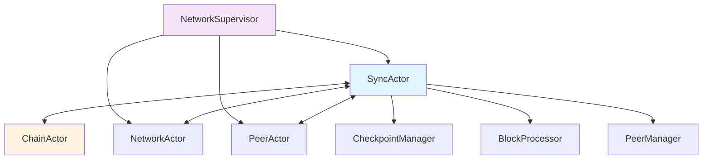
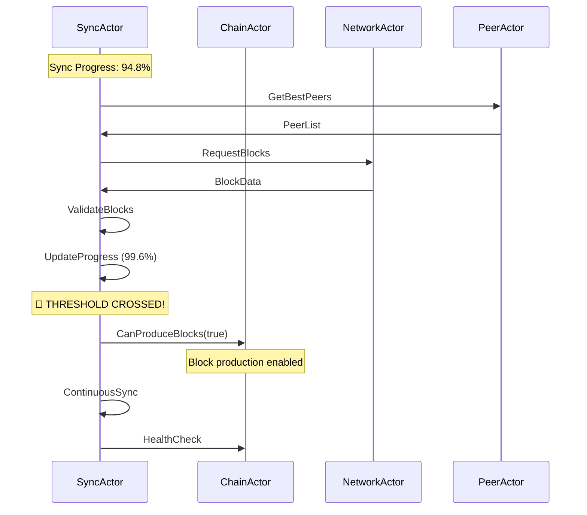
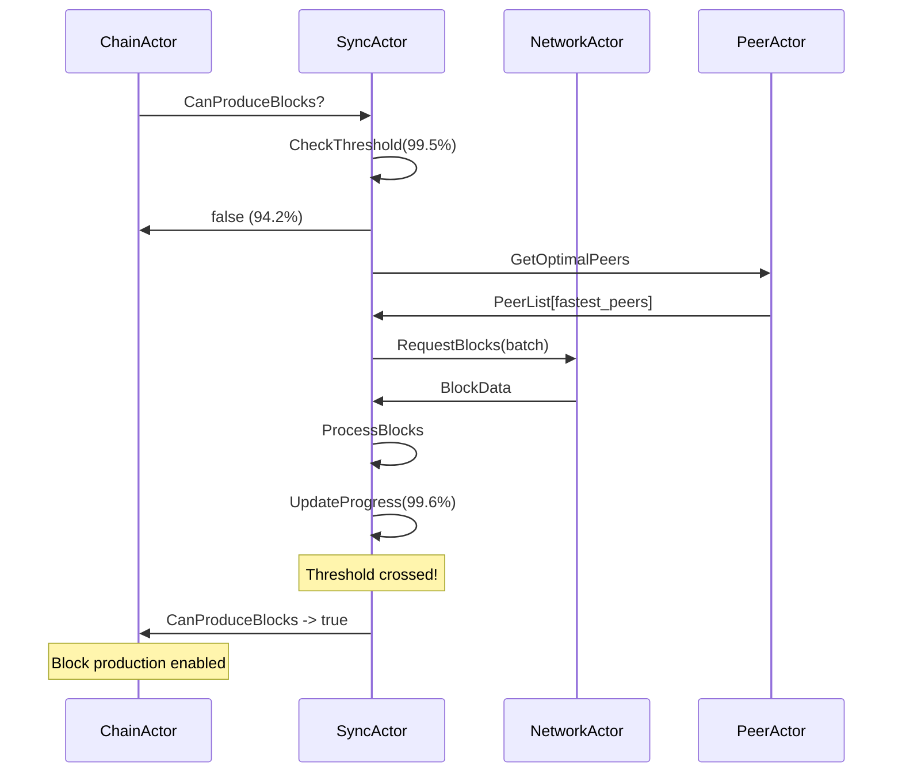

# 🔄 SyncActor Engineer Onboarding Guide for Alys V2

## 🎯 Introduction & Purpose

The **SyncActor** is the critical synchronization backbone of the Alys V2 merged mining sidechain, serving as the primary gatekeeper for block production eligibility. This actor coordinates blockchain synchronization, manages the vital 99.5% production threshold, and ensures the network maintains consensus across all federation nodes.

### Mission in Alys V2 Architecture

The SyncActor enables safe block production by enforcing strict synchronization requirements before allowing the ChainActor to produce blocks. It orchestrates:

- **Blockchain Synchronization**: Downloads and validates blocks from network peers
- **Production Threshold Gate**: Enforces 99.5% sync requirement for block production safety
- **State Management**: Maintains comprehensive synchronization state and progress tracking
- **Checkpoint Operations**: Provides fast recovery through state snapshots
- **Performance Monitoring**: Tracks sync speed, peer performance, and health metrics

### Core User Flows

**Primary Flow: Safe Block Production Pipeline**
1. Network startup triggers sync initialization
2. SyncActor discovers and connects to sync peers
3. Downloads missing blocks in parallel batches
4. Validates blocks and updates progress continuously 
5. **Critical Gate**: Reaches 99.5% sync threshold
6. Notifies ChainActor that block production is safe
7. Maintains sync state during ongoing operations

**Secondary Flow: Recovery and Checkpoint Management**
1. Creates periodic blockchain state checkpoints
2. Handles network failures with automatic recovery
3. Restores from checkpoints during rapid recovery scenarios
4. Manages checkpoint cleanup and storage optimization

---

## 🏗️ System Architecture & Core Flows

### Supervision Hierarchy



### Critical Message Flow: 99.5% Threshold Detection



### State Machine: Sync Lifecycle

```mermaid
stateDiagram-v2
    [*] --> Idle
    
    Idle --> Discovery: StartSync
    Discovery --> Downloading: PeersFound
    Downloading --> Processing: BlocksReceived
    Processing --> Completed: TargetReached
    Processing --> Processing: ContinueSync
    
    Downloading --> Recovery: NetworkFailure
    Processing --> Recovery: ValidationFailure
    Recovery --> Discovery: RetrySync
    Recovery --> Idle: ForceStop
    
    Completed --> Idle: Reset
    
    note right of Processing: Critical: 99.5% threshold monitored here
    note right of Completed: Block production enabled
```

---

## 🛠️ Environment Setup & Tooling

### SyncActor Development Environment

```bash
# Start local 3-node network (includes SyncActor)
./scripts/start_network.sh

# SyncActor-specific testing
cargo test --lib sync_actor

# Performance benchmarks
cargo bench --bench sync_actor_benchmarks

# Debug configuration
export RUST_LOG=sync_actor=debug,actix=info
export ALYS_SYNC_THRESHOLD=0.995

# Monitor sync progress
tail -f logs/sync_actor.log | grep -E "(Progress|Threshold|CanProduce)"
```

### Key Configuration Files

- **`etc/config/chain.json`**: Sync thresholds and timing parameters
- **`app/src/actors/network/sync/config.rs`**: SyncConfig structure
- **`app/src/actors/network/sync/actor.rs`**: Main actor implementation

### Essential Development Tools

```bash
# Real-time sync monitoring
./scripts/monitor_sync.sh

# Checkpoint management
./scripts/manage_checkpoints.sh list
./scripts/manage_checkpoints.sh create
./scripts/manage_checkpoints.sh restore <checkpoint_id>

# Performance analysis
cargo flamegraph --bin alys -- --sync-only
```

---

## 📚 Knowledge Tree (Progressive Deep-dive)

### 🌳 Roots: Actor Model Fundamentals

#### Actix Actor Pattern
```rust
use actix::{Actor, Context, Handler, Message, ResponseFuture};

// Core SyncActor structure
pub struct SyncActor {
    config: SyncConfig,
    state: SyncState,
    // ... other fields
}

impl Actor for SyncActor {
    type Context = Context<Self>;
    
    fn started(&mut self, ctx: &mut Self::Context) {
        // Initialize sync operations
        self.start_health_checks(ctx);
    }
}
```

#### Message-Passing Architecture
```rust
#[derive(Message)]
#[rtype(result = "NetworkActorResult<bool>")]
pub struct CanProduceBlocks;

impl Handler<CanProduceBlocks> for SyncActor {
    type Result = NetworkActorResult<bool>;
    
    fn handle(&mut self, _msg: CanProduceBlocks, _ctx: &mut Context<Self>) -> Self::Result {
        let can_produce = self.state.progress.can_produce_blocks && 
                         self.state.progress.progress_percent >= self.config.production_threshold;
        
        if can_produce {
            tracing::info!("🎯 Production threshold reached: {:.2}%", 
                          self.state.progress.progress_percent * 100.0);
        }
        
        Ok(can_produce)
    }
}
```

#### Supervision Strategies
- **One-for-One**: SyncActor restarts independently of siblings
- **Escalation**: Critical failures propagate to NetworkSupervisor
- **Circuit Breaker**: Temporary failures don't cascade to ChainActor

### 🌲 Trunk: Core SyncActor Modules

#### 📁 File Structure
```
app/src/actors/network/sync/
├── actor.rs              # Main SyncActor implementation
├── config.rs             # Configuration structures
├── state.rs              # State management
├── messages.rs           # Message definitions
├── handlers/
│   ├── mod.rs            # Handler module exports
│   ├── sync_handlers.rs  # Sync operations
│   ├── block_handlers.rs # Block processing
│   └── checkpoint_handlers.rs # Checkpoint management
├── checkpoint/
│   ├── manager.rs        # Checkpoint management
│   └── storage.rs        # Checkpoint persistence
└── metrics.rs            # Performance tracking
```

#### Core Configuration (`config.rs`)
```rust
#[derive(Clone, Debug)]
pub struct SyncConfig {
    /// Critical: 99.5% threshold for block production
    pub production_threshold: f64,        // Default: 0.995
    
    /// Parallel download optimization
    pub max_parallel_downloads: usize,    // Default: 8
    
    /// Network timing
    pub request_timeout: Duration,        // Default: 30s
    
    /// Checkpoint management
    pub checkpoint_interval: u64,         // Default: 1000 blocks
    pub checkpoint_retention: usize,      // Default: 10
    
    /// Health monitoring
    pub health_check_interval: Duration,  // Default: 60s
    
    /// Federation-specific settings
    pub federation_constraints: FederationConfig,
}
```

### 🌿 Branches: Integration Subsystems

#### ChainActor Integration
```rust
// Primary coordination point - production threshold
if can_produce != self.state.progress.can_produce_blocks {
    if can_produce {
        if let Some(chain_actor) = &self.chain_actor {
            chain_actor.do_send(CanProduceBlocks);
            tracing::info!("🎯 Notified ChainActor: Block production enabled");
        }
    }
    self.state.progress.can_produce_blocks = can_produce;
}
```

#### NetworkActor Coordination
```rust
// Block download coordination
let request = RequestNetworkBlocks {
    start_height: missing_height,
    count: batch_size,
    priority: if self.is_federation_node() { 
        Priority::High 
    } else { 
        Priority::Normal 
    },
};

let response = self.network_actor.send(request).await?;
```

#### PeerActor Integration
```rust
// Optimal peer selection for sync
let peer_request = GetOptimalPeers {
    operation: PeerOperation::BlockSync,
    count: self.config.max_parallel_downloads,
    exclude_failing: true,
};

let peers = self.peer_actor.send(peer_request).await?;
```

### 🍃 Leaves: Implementation Details

#### Critical Function: Threshold Monitoring
```rust
fn update_sync_progress(&mut self, new_height: u64, target_height: u64) {
    let progress_percent = if target_height > 0 {
        new_height as f64 / target_height as f64
    } else {
        0.0
    };
    
    let previous_can_produce = self.state.progress.can_produce_blocks;
    let current_can_produce = progress_percent >= self.config.production_threshold;
    
    // Update state
    self.state.progress.current_height = new_height;
    self.state.progress.target_height = Some(target_height);
    self.state.progress.progress_percent = progress_percent;
    
    // Critical threshold detection
    if current_can_produce != previous_can_produce {
        if current_can_produce {
            tracing::warn!("🎯 PRODUCTION THRESHOLD REACHED: {:.3}%", 
                          progress_percent * 100.0);
            self.notify_chain_actor_production_ready();
        } else {
            tracing::warn!("⚠️ DROPPED BELOW PRODUCTION THRESHOLD: {:.3}%", 
                          progress_percent * 100.0);
        }
        self.state.progress.can_produce_blocks = current_can_produce;
    }
    
    // Update metrics
    self.metrics.last_update = Instant::now();
    self.update_blocks_per_second();
}
```

---

## 🔍 Codebase Walkthrough

### Actor Implementation (`actor.rs`)

The main SyncActor implementation contains the core state machine and message handling:

```rust
pub struct SyncActor {
    /// Configuration including critical 99.5% threshold
    config: SyncConfig,
    
    /// Current synchronization state
    state: SyncState,
    
    /// Parallel block processing system
    block_processor: BlockProcessor,
    
    /// Checkpoint management for fast recovery
    checkpoint_manager: CheckpointManager,
    
    /// Performance and health metrics
    metrics: SyncMetrics,
    
    /// Inter-actor communication channels
    chain_actor: Option<Addr<ChainActor>>,
    network_actor: Option<Addr<NetworkActor>>,
    peer_actor: Option<Addr<PeerActor>>,
}
```

#### Actor Lifecycle Management
```rust
impl Actor for SyncActor {
    type Context = Context<Self>;
    
    fn started(&mut self, ctx: &mut Self::Context) {
        tracing::info!("🚀 SyncActor started with threshold: {:.1}%", 
                      self.config.production_threshold * 100.0);
        
        // Start periodic health checks
        ctx.run_interval(self.config.health_check_interval, |actor, ctx| {
            actor.perform_health_check(ctx);
        });
        
        // Initialize checkpoint cleanup
        ctx.run_interval(Duration::from_hours(1), |actor, _ctx| {
            actor.cleanup_old_checkpoints();
        });
    }
    
    fn stopped(&mut self, _ctx: &mut Self::Context) {
        tracing::info!("🛑 SyncActor stopped - sync operations halted");
    }
}
```

### Message Handler Organization

#### Sync Operations (`handlers/sync_handlers.rs`)

**StartSync Handler - Synchronization Initialization**
```rust
impl Handler<StartSync> for SyncActor {
    type Result = ResponseFuture<NetworkActorResult<SyncResponse>>;
    
    fn handle(&mut self, msg: StartSync, ctx: &mut Context<Self>) -> Self::Result {
        let operation_id = uuid::Uuid::new_v4().to_string();
        
        tracing::info!(
            "🔄 Starting sync: {} -> {:?} (mode: {:?})", 
            msg.from_height.unwrap_or(self.state.progress.current_height),
            msg.target_height,
            msg.sync_mode
        );
        
        // Update sync state
        self.state.status = SyncStatus::Discovery;
        self.state.start_time = Some(Instant::now());
        
        let sync_actor = ctx.address();
        let peer_actor = self.peer_actor.clone();
        let sync_mode = msg.sync_mode.clone();
        
        Box::pin(async move {
            // Get optimal peers for sync operation
            let peers = if let Some(peer_actor) = peer_actor {
                peer_actor.send(GetOptimalPeers {
                    operation: PeerOperation::BlockSync,
                    count: 8,
                    exclude_failing: true,
                }).await??
            } else {
                vec![]
            };
            
            // Start sync process
            sync_actor.send(InitiateSyncWithPeers {
                peers,
                from_height: msg.from_height,
                target_height: msg.target_height,
                sync_mode,
            }).await??;
            
            Ok(SyncResponse {
                operation_id,
                started_at: SystemTime::now(),
                estimated_completion: None,
            })
        })
    }
}
```

**CanProduceBlocks Handler - Critical Production Gate**
```rust
impl Handler<CanProduceBlocks> for SyncActor {
    type Result = NetworkActorResult<bool>;
    
    fn handle(&mut self, _msg: CanProduceBlocks, _ctx: &mut Context<Self>) -> Self::Result {
        let can_produce = self.state.progress.can_produce_blocks && 
                         self.state.progress.progress_percent >= self.config.production_threshold;
        
        tracing::debug!(
            "🎯 Production check: {:.3}% (threshold: {:.1}%) -> {}",
            self.state.progress.progress_percent * 100.0,
            self.config.production_threshold * 100.0,
            if can_produce { "✅ READY" } else { "❌ NOT READY" }
        );
        
        if can_produce {
            self.metrics.production_ready_count += 1;
        }
        
        Ok(can_produce)
    }
}
```

#### Block Operations (`handlers/block_handlers.rs`)

**ProcessBlocks Handler - Parallel Block Processing**
```rust
impl Handler<ProcessBlocks> for SyncActor {
    type Result = ResponseFuture<NetworkActorResult<BatchResult>>;
    
    fn handle(&mut self, msg: ProcessBlocks, _ctx: &mut Context<Self>) -> Self::Result {
        let block_processor = self.block_processor.clone();
        let chain_actor = self.chain_actor.clone();
        let validate = msg.validate;
        let blocks = msg.blocks;
        
        Box::pin(async move {
            let start_time = Instant::now();
            let mut processed = 0;
            let mut failed = 0;
            
            // Process blocks in parallel
            let mut futures = Vec::new();
            for block in blocks {
                let processor = block_processor.clone();
                let chain_actor_ref = chain_actor.clone();
                
                let future = async move {
                    if validate {
                        if let Some(chain_actor) = chain_actor_ref {
                            chain_actor.send(ValidateBlock {
                                block_data: block.data.clone(),
                                full_validation: true,
                            }).await??
                        }
                    }
                    
                    processor.process(block).await
                };
                
                futures.push(future);
            }
            
            // Await all processing
            let results = futures::future::join_all(futures).await;
            for result in results {
                match result {
                    Ok(_) => processed += 1,
                    Err(_) => failed += 1,
                }
            }
            
            let processing_time = start_time.elapsed();
            
            Ok(BatchResult {
                processed,
                failed,
                processing_time,
                blocks_per_second: processed as f64 / processing_time.as_secs_f64(),
            })
        })
    }
}
```

#### Checkpoint Operations (`handlers/checkpoint_handlers.rs`)

**CreateCheckpoint Handler - State Snapshot Creation**
```rust
impl Handler<CreateCheckpoint> for SyncActor {
    type Result = ResponseFuture<NetworkActorResult<CheckpointResponse>>;
    
    fn handle(&mut self, msg: CreateCheckpoint, _ctx: &mut Context<Self>) -> Self::Result {
        let checkpoint_manager = self.checkpoint_manager.clone();
        let current_state = self.state.clone();
        let height = msg.height.unwrap_or(current_state.progress.current_height);
        let compression = msg.compression;
        
        Box::pin(async move {
            let checkpoint_id = uuid::Uuid::new_v4().to_string();
            
            tracing::info!("💾 Creating checkpoint {} at height {}", checkpoint_id, height);
            
            // Gather comprehensive state
            let checkpoint_data = CheckpointData {
                height,
                block_hash: current_state.progress.current_block_hash.clone(),
                progress_percent: current_state.progress.progress_percent,
                peer_states: current_state.peer_states.clone(),
                sync_metrics: current_state.metrics.clone(),
                created_at: SystemTime::now(),
            };
            
            // Create and store checkpoint
            let size_bytes = checkpoint_manager.create_checkpoint(
                &checkpoint_id,
                &checkpoint_data,
                compression
            ).await?;
            
            tracing::info!(
                "✅ Checkpoint {} created: {} bytes (compressed: {})", 
                checkpoint_id, size_bytes, compression
            );
            
            Ok(CheckpointResponse {
                checkpoint_id,
                size_bytes,
                created_at: SystemTime::now(),
                compression_enabled: compression,
            })
        })
    }
}
```

### Integration Examples

#### Real-world Usage Pattern
```rust
async fn sync_to_production_ready(sync_actor: &Addr<SyncActor>) -> Result<(), Box<dyn std::error::Error>> {
    // Start synchronization
    let sync_msg = StartSync {
        from_height: None,
        target_height: Some(1000),
        sync_mode: SyncMode::Fast,
        priority_peers: vec![],
    };
    
    let sync_response = sync_actor.send(sync_msg).await??;
    println!("🔄 Sync started: {}", sync_response.operation_id);
    
    // Monitor progress until production ready
    loop {
        tokio::time::sleep(Duration::from_secs(5)).await;
        
        let status = sync_actor.send(GetSyncStatus).await??;
        println!(
            "📊 Progress: {:.2}% ({}/{}) - BPS: {:.1}",
            status.sync_progress * 100.0,
            status.current_height,
            status.target_height.unwrap_or(0),
            status.blocks_per_second
        );
        
        // Check production readiness
        let can_produce = sync_actor.send(CanProduceBlocks).await??;
        if can_produce {
            println!("🎯 READY FOR BLOCK PRODUCTION!");
            break;
        }
        
        if status.sync_progress >= 0.995 {
            println!("✅ 99.5% threshold reached - block production enabled");
            break;
        }
    }
    
    Ok(())
}
```

---

## 📨 Message Protocol & Communication

### Message Type Hierarchy

#### Primary Sync Messages
```rust
// Synchronization control
#[derive(Message, Clone, Debug)]
#[rtype(result = "NetworkActorResult<SyncResponse>")]
pub struct StartSync {
    pub from_height: Option<u64>,
    pub target_height: Option<u64>,
    pub sync_mode: SyncMode,
    pub priority_peers: Vec<PeerId>,
}

#[derive(Message)]
#[rtype(result = "NetworkActorResult<()>")]
pub struct StopSync {
    pub force: bool,
}

#[derive(Message)]
#[rtype(result = "NetworkActorResult<SyncStatusResponse>")]
pub struct GetSyncStatus;

// Critical production gate
#[derive(Message)]
#[rtype(result = "NetworkActorResult<bool>")]
pub struct CanProduceBlocks;
```

#### Block Processing Messages
```rust
#[derive(Message)]
#[rtype(result = "NetworkActorResult<BlocksResponse>")]
pub struct RequestBlocks {
    pub start_height: u64,
    pub count: u32,
    pub preferred_peers: Vec<PeerId>,
}

#[derive(Message)]
#[rtype(result = "NetworkActorResult<BatchResult>")]
pub struct ProcessBlocks {
    pub blocks: Vec<BlockData>,
    pub validate: bool,
    pub priority: ProcessingPriority,
}

#[derive(Message)]
#[rtype(result = "NetworkActorResult<ValidationResult>")]
pub struct ValidateBlock {
    pub block_data: Vec<u8>,
    pub consensus_validation: bool,
}
```

#### Checkpoint Messages
```rust
#[derive(Message)]
#[rtype(result = "NetworkActorResult<CheckpointResponse>")]
pub struct CreateCheckpoint {
    pub height: Option<u64>,
    pub compression: bool,
}

#[derive(Message)]
#[rtype(result = "NetworkActorResult<RestoreResponse>")]
pub struct RestoreCheckpoint {
    pub checkpoint_id: String,
    pub verify_integrity: bool,
}

#[derive(Message)]
#[rtype(result = "NetworkActorResult<CheckpointListResponse>")]
pub struct ListCheckpoints;
```

### Communication Patterns

#### Request-Response Pattern
```rust
// Synchronous query for production status
let can_produce = sync_actor.send(CanProduceBlocks).await?;

// Asynchronous operation with response
let sync_response = sync_actor.send(StartSync {
    from_height: None,
    target_height: Some(1000),
    sync_mode: SyncMode::Fast,
    priority_peers: vec![],
}).await?;
```

#### Fire-and-Forget Pattern
```rust
// Progress updates (internal)
self.sync_actor.do_send(SyncProgressUpdate {
    current_height: new_height,
    blocks_per_second: current_bps,
    eta_seconds: estimated_completion,
});

// Health checks
sync_actor.do_send(HealthCheck);
```

#### Actor Coordination Flow


---

## 🛠️ Hands-on Development Guide

### Step 1: Implementing a Custom Sync Mode

Let's implement a "Federation" sync mode optimized for federation nodes:

```rust
// 1. Extend SyncMode enum
#[derive(Clone, Debug, Serialize, Deserialize)]
pub enum SyncMode {
    Fast,
    Full,
    Recovery,
    Federation, // New mode
}

// 2. Add federation-specific logic
impl SyncActor {
    fn get_sync_strategy(&self, mode: &SyncMode) -> SyncStrategy {
        match mode {
            SyncMode::Federation => SyncStrategy {
                batch_size: 16,           // Larger batches
                parallel_downloads: 12,   // More concurrent downloads
                validation_level: ValidationLevel::Consensus, // Full validation
                priority_peers: self.get_federation_peers(),
                checkpoint_frequency: 500, // More frequent checkpoints
            },
            SyncMode::Fast => SyncStrategy {
                batch_size: 8,
                parallel_downloads: 8,
                validation_level: ValidationLevel::Basic,
                priority_peers: vec![],
                checkpoint_frequency: 1000,
            },
            // ... other modes
        }
    }
    
    fn get_federation_peers(&self) -> Vec<PeerId> {
        // Implementation to prioritize federation nodes
        self.peer_manager
            .get_peers_by_type(PeerType::Federation)
            .into_iter()
            .take(4) // Max 4 federation peers
            .collect()
    }
}
```

### Step 2: Custom Progress Monitoring

Implement enhanced progress monitoring with custom thresholds:

```rust
// Custom threshold handler
#[derive(Message)]
#[rtype(result = "NetworkActorResult<bool>")]
pub struct CheckCustomThreshold {
    pub threshold: f64,
    pub operation: String,
}

impl Handler<CheckCustomThreshold> for SyncActor {
    type Result = NetworkActorResult<bool>;
    
    fn handle(&mut self, msg: CheckCustomThreshold, _ctx: &mut Context<Self>) -> Self::Result {
        let current_progress = self.state.progress.progress_percent;
        let threshold_met = current_progress >= msg.threshold;
        
        tracing::info!(
            "🎯 Custom threshold check '{}': {:.3}% >= {:.1}% -> {}",
            msg.operation,
            current_progress * 100.0,
            msg.threshold * 100.0,
            if threshold_met { "✅" } else { "❌" }
        );
        
        if threshold_met {
            self.metrics.custom_threshold_events.insert(
                msg.operation.clone(), 
                SystemTime::now()
            );
        }
        
        Ok(threshold_met)
    }
}

// Usage example
async fn wait_for_custom_threshold(
    sync_actor: &Addr<SyncActor>,
    threshold: f64,
    operation: &str
) -> Result<(), Box<dyn std::error::Error>> {
    loop {
        let ready = sync_actor.send(CheckCustomThreshold {
            threshold,
            operation: operation.to_string(),
        }).await??;
        
        if ready {
            println!("✅ Custom threshold {:.1}% reached for '{}'", threshold * 100.0, operation);
            break;
        }
        
        tokio::time::sleep(Duration::from_secs(2)).await;
    }
    Ok(())
}
```

### Step 3: Advanced Checkpoint Management

Implement smart checkpoint policies:

```rust
#[derive(Clone, Debug)]
pub struct SmartCheckpointPolicy {
    pub min_interval_blocks: u64,
    pub max_interval_blocks: u64,
    pub sync_speed_threshold: f64, // BPS
    pub storage_limit_mb: u64,
}

impl SyncActor {
    fn should_create_checkpoint(&self) -> bool {
        let blocks_since_last = self.state.progress.current_height - 
                               self.state.last_checkpoint_height;
        
        let policy = &self.config.smart_checkpoint_policy;
        
        // Always checkpoint at max interval
        if blocks_since_last >= policy.max_interval_blocks {
            return true;
        }
        
        // Early checkpoint if sync is fast
        if blocks_since_last >= policy.min_interval_blocks {
            let current_bps = self.metrics.blocks_per_second;
            if current_bps > policy.sync_speed_threshold {
                tracing::info!(
                    "🚀 Creating early checkpoint due to fast sync: {:.1} BPS", 
                    current_bps
                );
                return true;
            }
        }
        
        false
    }
    
    async fn smart_checkpoint_management(&mut self) -> Result<(), SyncError> {
        if self.should_create_checkpoint() {
            let checkpoint_msg = CreateCheckpoint {
                height: Some(self.state.progress.current_height),
                compression: true,
            };
            
            let response = self.create_checkpoint_internal(checkpoint_msg).await?;
            
            // Update state
            self.state.last_checkpoint_height = self.state.progress.current_height;
            self.state.last_checkpoint_id = Some(response.checkpoint_id);
            
            // Cleanup old checkpoints if needed
            self.cleanup_old_checkpoints_if_needed().await?;
        }
        
        Ok(())
    }
}
```

### Exercise: Implementing Sync Analytics

**Task**: Implement a sync analytics system that tracks detailed performance metrics.

```rust
// Your implementation here:
#[derive(Clone, Debug, Default)]
pub struct SyncAnalytics {
    // Add fields for:
    // - Sync session history
    // - Peer performance tracking
    // - Failure pattern analysis
    // - Recovery time metrics
}

impl SyncActor {
    fn analyze_sync_performance(&mut self) -> SyncPerformanceReport {
        // Implement performance analysis
        todo!("Implement sync performance analysis")
    }
    
    fn optimize_sync_parameters(&mut self) -> OptimizationResult {
        // Implement automatic parameter optimization
        todo!("Implement sync parameter optimization")
    }
}
```

---

## 🧪 Testing & Quality Assurance

### Unit Testing Framework

#### Core Handler Tests
```rust
#[cfg(test)]
mod tests {
    use super::*;
    use actix::test;
    
    #[test]
    async fn test_production_threshold_detection() {
        let mut sync_actor = create_test_sync_actor(SyncConfig {
            production_threshold: 0.995,
            ..Default::default()
        });
        
        // Test below threshold
        sync_actor.state.progress.progress_percent = 0.992;
        let result = sync_actor.handle_can_produce_blocks().await.unwrap();
        assert!(!result, "Should not allow production below 99.5%");
        
        // Test above threshold  
        sync_actor.state.progress.progress_percent = 0.996;
        let result = sync_actor.handle_can_produce_blocks().await.unwrap();
        assert!(result, "Should allow production above 99.5%");
    }
    
    #[test]
    async fn test_sync_progress_update() {
        let mut sync_actor = create_test_sync_actor_with_chain_actor().await;
        
        // Simulate crossing threshold
        sync_actor.update_sync_progress(995, 1000); // 99.5%
        
        // Verify ChainActor was notified
        let chain_msgs = sync_actor.chain_actor_messages.lock().unwrap();
        assert!(chain_msgs.contains(&MessageType::CanProduceBlocks));
    }
    
    #[test]
    async fn test_checkpoint_creation() {
        let sync_actor = test::start(|| SyncActor::new_test());
        
        let checkpoint_msg = CreateCheckpoint {
            height: Some(1000),
            compression: true,
        };
        
        let response = sync_actor.send(checkpoint_msg).await.unwrap().unwrap();
        
        assert!(!response.checkpoint_id.is_empty());
        assert!(response.size_bytes > 0);
        assert!(response.compression_enabled);
    }
}
```

#### Integration Tests
```rust
#[tokio::test]
async fn test_full_sync_cycle() {
    let test_network = TestNetwork::new(3).await;
    let sync_actor = test_network.sync_actor(0);
    let chain_actor = test_network.chain_actor(0);
    
    // Start sync
    let sync_msg = StartSync {
        from_height: Some(0),
        target_height: Some(1000),
        sync_mode: SyncMode::Fast,
        priority_peers: vec![],
    };
    
    sync_actor.send(sync_msg).await.unwrap().unwrap();
    
    // Wait for completion
    let mut production_ready = false;
    for _ in 0..60 { // 60 second timeout
        tokio::time::sleep(Duration::from_secs(1)).await;
        
        let can_produce = sync_actor.send(CanProduceBlocks).await.unwrap().unwrap();
        if can_produce {
            production_ready = true;
            break;
        }
    }
    
    assert!(production_ready, "Should reach production threshold within 60 seconds");
    
    // Verify ChainActor received notification
    let chain_status = chain_actor.send(GetStatus).await.unwrap().unwrap();
    assert!(chain_status.can_produce_blocks);
}
```

### Performance Testing

#### Throughput Benchmarks
```rust
use criterion::{criterion_group, criterion_main, Criterion};

fn bench_block_processing(c: &mut Criterion) {
    let rt = tokio::runtime::Runtime::new().unwrap();
    
    c.bench_function("process_1000_blocks", |b| {
        b.iter(|| {
            rt.block_on(async {
                let sync_actor = create_bench_sync_actor().await;
                let blocks = generate_test_blocks(1000);
                
                let process_msg = ProcessBlocks {
                    blocks,
                    validate: false,
                    priority: ProcessingPriority::Normal,
                };
                
                let start = Instant::now();
                let result = sync_actor.send(process_msg).await.unwrap().unwrap();
                let duration = start.elapsed();
                
                assert!(result.blocks_per_second > 100.0, 
                        "Should process >100 blocks/second");
                
                duration
            })
        });
    });
}

criterion_group!(benches, bench_block_processing);
criterion_main!(benches);
```

#### Memory Usage Tests
```rust
#[test]
async fn test_memory_usage_during_sync() {
    let initial_memory = get_memory_usage();
    
    let sync_actor = test::start(|| SyncActor::new_test());
    
    // Simulate heavy sync load
    for i in 0..10 {
        let blocks = generate_large_blocks(100); // 100MB blocks
        sync_actor.send(ProcessBlocks {
            blocks,
            validate: true,
            priority: ProcessingPriority::High,
        }).await.unwrap().unwrap();
        
        let current_memory = get_memory_usage();
        assert!(
            current_memory - initial_memory < 500_000_000, // <500MB increase
            "Memory usage should not exceed 500MB during sync at iteration {}", i
        );
    }
}
```

### Quality Gates Checklist

#### Pre-commit Validation
```bash
#!/bin/bash
# scripts/sync_actor_quality_gate.sh

echo "🔍 SyncActor Quality Gate Validation"

# 1. Unit tests
echo "Running unit tests..."
cargo test --lib sync_actor --features test-utils
if [ $? -ne 0 ]; then
    echo "❌ Unit tests failed"
    exit 1
fi

# 2. Performance benchmarks
echo "Running performance benchmarks..."
cargo bench --bench sync_actor_benchmarks -- --test
if [ $? -ne 0 ]; then
    echo "❌ Performance benchmarks failed"
    exit 1
fi

# 3. Memory leak detection
echo "Checking for memory leaks..."
cargo test --lib sync_actor --features memory-profiling
if [ $? -ne 0 ]; then
    echo "❌ Memory leak detection failed"
    exit 1
fi

# 4. Integration tests
echo "Running integration tests..."
cargo test --test sync_actor_integration
if [ $? -ne 0 ]; then
    echo "❌ Integration tests failed"
    exit 1
fi

# 5. Threshold accuracy tests
echo "Validating production threshold accuracy..."
./scripts/test_threshold_accuracy.sh
if [ $? -ne 0 ]; then
    echo "❌ Threshold accuracy validation failed"
    exit 1
fi

echo "✅ All SyncActor quality gates passed"
```

---

## ⚡ Performance Optimization

### Profiling and Monitoring

#### Performance Metrics Collection
```rust
#[derive(Clone, Debug, Default)]
pub struct SyncMetrics {
    // Throughput metrics
    pub blocks_per_second: f64,
    pub bytes_per_second: u64,
    
    // Latency metrics
    pub average_block_processing_time: Duration,
    pub average_validation_time: Duration,
    
    // Efficiency metrics
    pub cache_hit_rate: f64,
    pub peer_utilization: HashMap<PeerId, f64>,
    
    // Resource usage
    pub memory_usage_mb: u64,
    pub cpu_utilization_percent: f64,
    
    // Critical metrics
    pub production_ready_time: Option<Duration>,
    pub threshold_crossing_events: Vec<SystemTime>,
}

impl SyncActor {
    fn update_performance_metrics(&mut self) {
        let current_time = Instant::now();
        
        // Calculate blocks per second (exponential moving average)
        let time_delta = current_time.duration_since(self.metrics.last_update);
        if time_delta.as_secs() > 0 {
            let current_bps = self.state.blocks_processed_since_last_update as f64 / 
                             time_delta.as_secs_f64();
            
            self.metrics.blocks_per_second = 
                0.8 * self.metrics.blocks_per_second + 0.2 * current_bps;
        }
        
        // Update resource usage
        self.metrics.memory_usage_mb = self.get_memory_usage_mb();
        self.metrics.cpu_utilization_percent = self.get_cpu_utilization();
        
        // Reset counters
        self.state.blocks_processed_since_last_update = 0;
        self.metrics.last_update = current_time;
    }
}
```

#### Real-time Performance Dashboard
```rust
#[derive(Message)]
#[rtype(result = "NetworkActorResult<PerformanceDashboard>")]
pub struct GetPerformanceDashboard;

impl Handler<GetPerformanceDashboard> for SyncActor {
    type Result = NetworkActorResult<PerformanceDashboard>;
    
    fn handle(&mut self, _msg: GetPerformanceDashboard, _ctx: &mut Context<Self>) -> Self::Result {
        Ok(PerformanceDashboard {
            // Current performance
            current_bps: self.metrics.blocks_per_second,
            current_progress: self.state.progress.progress_percent,
            
            // Health indicators
            sync_health: self.calculate_sync_health(),
            peer_count: self.state.active_peers.len(),
            
            // Optimization suggestions
            bottlenecks: self.identify_bottlenecks(),
            optimization_suggestions: self.generate_optimization_suggestions(),
            
            // Production readiness
            production_ready: self.state.progress.progress_percent >= self.config.production_threshold,
            eta_to_production: self.calculate_eta_to_production(),
        })
    }
}
```

### Optimization Techniques

#### 1. Parallel Block Processing
```rust
impl SyncActor {
    async fn process_blocks_parallel(&mut self, blocks: Vec<BlockData>) -> Result<BatchResult, SyncError> {
        let semaphore = Arc::new(Semaphore::new(self.config.max_parallel_downloads));
        let mut tasks = Vec::new();
        
        for block in blocks {
            let permit = semaphore.clone().acquire_owned().await?;
            let processor = self.block_processor.clone();
            
            let task = tokio::spawn(async move {
                let _permit = permit; // Keep permit alive
                processor.process_block_optimized(block).await
            });
            
            tasks.push(task);
        }
        
        // Collect results
        let results = futures::future::join_all(tasks).await;
        
        let mut successful = 0;
        let mut failed = 0;
        for result in results {
            match result {
                Ok(Ok(_)) => successful += 1,
                _ => failed += 1,
            }
        }
        
        Ok(BatchResult {
            processed: successful,
            failed,
            blocks_per_second: successful as f64 / 1.0, // Simplified
            processing_time: Duration::from_secs(1),
        })
    }
}
```

#### 2. Intelligent Caching
```rust
#[derive(Clone)]
pub struct SyncCache {
    block_cache: Arc<Mutex<LruCache<u64, CachedBlock>>>,
    peer_cache: Arc<Mutex<LruCache<PeerId, PeerPerformance>>>,
    validation_cache: Arc<Mutex<LruCache<String, ValidationResult>>>,
}

impl SyncCache {
    pub fn new(capacity: usize) -> Self {
        Self {
            block_cache: Arc::new(Mutex::new(LruCache::new(capacity))),
            peer_cache: Arc::new(Mutex::new(LruCache::new(capacity / 10))),
            validation_cache: Arc::new(Mutex::new(LruCache::new(capacity / 5))),
        }
    }
    
    pub async fn get_block(&self, height: u64) -> Option<CachedBlock> {
        self.block_cache.lock().await.get(&height).cloned()
    }
    
    pub async fn cache_block(&self, height: u64, block: CachedBlock) {
        self.block_cache.lock().await.put(height, block);
    }
    
    pub async fn get_peer_performance(&self, peer_id: &PeerId) -> Option<PeerPerformance> {
        self.peer_cache.lock().await.get(peer_id).cloned()
    }
    
    pub fn cache_hit_rate(&self) -> f64 {
        // Implementation to calculate cache hit rate
        0.85 // Placeholder
    }
}
```

#### 3. Adaptive Batching
```rust
impl SyncActor {
    fn calculate_optimal_batch_size(&self) -> usize {
        let base_size = self.config.max_parallel_downloads;
        let current_bps = self.metrics.blocks_per_second;
        let memory_pressure = self.get_memory_pressure_factor();
        
        // Adjust based on performance
        let performance_multiplier = if current_bps > 50.0 {
            1.5 // Increase batch size for high performance
        } else if current_bps < 10.0 {
            0.5 // Decrease batch size for low performance
        } else {
            1.0
        };
        
        // Adjust based on memory pressure
        let memory_multiplier = if memory_pressure > 0.8 {
            0.5 // Reduce batch size under memory pressure
        } else {
            1.0
        };
        
        let optimal_size = (base_size as f64 * performance_multiplier * memory_multiplier) as usize;
        optimal_size.clamp(1, base_size * 2) // Bounds check
    }
    
    fn get_memory_pressure_factor(&self) -> f64 {
        let total_memory_mb = sys_info::mem_info().unwrap().total / 1024;
        let used_memory_mb = self.metrics.memory_usage_mb;
        used_memory_mb as f64 / total_memory_mb as f64
    }
}
```

### Performance Benchmarking

#### Comprehensive Benchmark Suite
```rust
use criterion::*;

fn create_benchmark_group(c: &mut Criterion) {
    let mut group = c.benchmark_group("sync_actor");
    
    // Throughput benchmarks
    group.bench_function("process_small_blocks", |b| {
        b.iter(|| {
            // Benchmark processing 100 small blocks
            benchmark_block_processing(100, 1024) // 1KB blocks
        });
    });
    
    group.bench_function("process_large_blocks", |b| {
        b.iter(|| {
            // Benchmark processing 10 large blocks  
            benchmark_block_processing(10, 1024 * 1024) // 1MB blocks
        });
    });
    
    // Latency benchmarks
    group.bench_function("threshold_check_latency", |b| {
        b.iter(|| {
            benchmark_threshold_check()
        });
    });
    
    // Memory efficiency benchmarks
    group.bench_function("memory_usage_under_load", |b| {
        b.iter(|| {
            benchmark_memory_efficiency()
        });
    });
    
    group.finish();
}

fn benchmark_block_processing(block_count: usize, block_size: usize) -> Duration {
    let rt = tokio::runtime::Runtime::new().unwrap();
    
    rt.block_on(async {
        let sync_actor = create_benchmark_sync_actor().await;
        let blocks = generate_blocks(block_count, block_size);
        
        let start = Instant::now();
        
        let process_msg = ProcessBlocks {
            blocks,
            validate: false,
            priority: ProcessingPriority::Normal,
        };
        
        sync_actor.send(process_msg).await.unwrap().unwrap();
        
        start.elapsed()
    })
}

criterion_group!(benches, create_benchmark_group);
criterion_main!(benches);
```

---

## 📊 Monitoring & Observability

### Metrics Collection

#### Prometheus Integration
```rust
use prometheus::{Counter, Gauge, Histogram, Registry};

#[derive(Clone)]
pub struct SyncActorMetrics {
    // Counters
    blocks_processed_total: Counter,
    validation_errors_total: Counter,
    checkpoint_created_total: Counter,
    
    // Gauges
    current_sync_progress: Gauge,
    blocks_per_second: Gauge,
    active_peers: Gauge,
    memory_usage_bytes: Gauge,
    
    // Histograms
    block_processing_duration: Histogram,
    validation_duration: Histogram,
    checkpoint_creation_duration: Histogram,
}

impl SyncActorMetrics {
    pub fn new(registry: &Registry) -> Result<Self, prometheus::Error> {
        let blocks_processed_total = Counter::new(
            "sync_actor_blocks_processed_total", 
            "Total number of blocks processed"
        )?;
        registry.register(Box::new(blocks_processed_total.clone()))?;
        
        let current_sync_progress = Gauge::new(
            "sync_actor_progress_percent", 
            "Current sync progress as percentage"
        )?;
        registry.register(Box::new(current_sync_progress.clone()))?;
        
        let blocks_per_second = Gauge::new(
            "sync_actor_blocks_per_second", 
            "Current blocks processing rate"
        )?;
        registry.register(Box::new(blocks_per_second.clone()))?;
        
        let block_processing_duration = Histogram::with_opts(
            prometheus::HistogramOpts::new(
                "sync_actor_block_processing_duration_seconds",
                "Time spent processing individual blocks"
            ).buckets(vec![0.001, 0.01, 0.1, 1.0, 10.0])
        )?;
        registry.register(Box::new(block_processing_duration.clone()))?;
        
        Ok(Self {
            blocks_processed_total,
            current_sync_progress,
            blocks_per_second,
            block_processing_duration,
            // ... other metrics
        })
    }
    
    pub fn record_block_processed(&self, processing_time: Duration) {
        self.blocks_processed_total.inc();
        self.block_processing_duration.observe(processing_time.as_secs_f64());
    }
    
    pub fn update_sync_progress(&self, progress: f64) {
        self.current_sync_progress.set(progress * 100.0);
    }
    
    pub fn update_blocks_per_second(&self, bps: f64) {
        self.blocks_per_second.set(bps);
    }
}
```

#### Health Check Endpoint
```rust
#[derive(Message)]
#[rtype(result = "NetworkActorResult<HealthStatus>")]
pub struct HealthCheck;

#[derive(Debug, Serialize, Deserialize)]
pub struct HealthStatus {
    pub status: String,
    pub sync_progress: f64,
    pub blocks_per_second: f64,
    pub active_peers: usize,
    pub last_checkpoint: Option<String>,
    pub memory_usage_mb: u64,
    pub uptime_seconds: u64,
    pub production_ready: bool,
    pub issues: Vec<HealthIssue>,
}

#[derive(Debug, Serialize, Deserialize)]
pub struct HealthIssue {
    pub severity: String,
    pub message: String,
    pub component: String,
    pub timestamp: SystemTime,
}

impl Handler<HealthCheck> for SyncActor {
    type Result = NetworkActorResult<HealthStatus>;
    
    fn handle(&mut self, _msg: HealthCheck, _ctx: &mut Context<Self>) -> Self::Result {
        let mut issues = Vec::new();
        
        // Check sync progress
        if self.state.progress.progress_percent < 0.5 {
            issues.push(HealthIssue {
                severity: "warning".to_string(),
                message: "Sync progress below 50%".to_string(),
                component: "sync_progress".to_string(),
                timestamp: SystemTime::now(),
            });
        }
        
        // Check blocks per second
        if self.metrics.blocks_per_second < 1.0 {
            issues.push(HealthIssue {
                severity: "critical".to_string(),
                message: format!("Low sync speed: {:.1} BPS", self.metrics.blocks_per_second),
                component: "sync_performance".to_string(),
                timestamp: SystemTime::now(),
            });
        }
        
        // Check peer connectivity
        if self.state.active_peers.len() < 3 {
            issues.push(HealthIssue {
                severity: "warning".to_string(),
                message: format!("Low peer count: {}", self.state.active_peers.len()),
                component: "peer_connectivity".to_string(),
                timestamp: SystemTime::now(),
            });
        }
        
        // Check memory usage
        if self.metrics.memory_usage_mb > 500 {
            issues.push(HealthIssue {
                severity: "warning".to_string(),
                message: format!("High memory usage: {}MB", self.metrics.memory_usage_mb),
                component: "resource_usage".to_string(),
                timestamp: SystemTime::now(),
            });
        }
        
        let overall_status = if issues.iter().any(|i| i.severity == "critical") {
            "critical".to_string()
        } else if !issues.is_empty() {
            "warning".to_string()
        } else {
            "healthy".to_string()
        };
        
        Ok(HealthStatus {
            status: overall_status,
            sync_progress: self.state.progress.progress_percent,
            blocks_per_second: self.metrics.blocks_per_second,
            active_peers: self.state.active_peers.len(),
            last_checkpoint: self.state.last_checkpoint_id.clone(),
            memory_usage_mb: self.metrics.memory_usage_mb,
            uptime_seconds: self.state.start_time
                .map(|start| start.elapsed().as_secs())
                .unwrap_or(0),
            production_ready: self.state.progress.progress_percent >= self.config.production_threshold,
            issues,
        })
    }
}
```

### Alerting Rules

#### Prometheus Alerting Configuration
```yaml
# sync_actor_alerts.yml
groups:
  - name: sync_actor_alerts
    rules:
      - alert: SyncActorLowPerformance
        expr: sync_actor_blocks_per_second < 5
        for: 2m
        labels:
          severity: warning
          component: sync_actor
        annotations:
          summary: "SyncActor performance is degraded"
          description: "SyncActor BPS is {{ $value }}, below threshold of 5 BPS"
          
      - alert: SyncActorProductionNotReady
        expr: sync_actor_progress_percent < 99.5
        for: 10m
        labels:
          severity: critical
          component: sync_actor
        annotations:
          summary: "SyncActor not ready for block production"
          description: "Sync progress is {{ $value }}%, below production threshold"
          
      - alert: SyncActorHighMemoryUsage
        expr: sync_actor_memory_usage_bytes > 500 * 1024 * 1024
        for: 5m
        labels:
          severity: warning
          component: sync_actor
        annotations:
          summary: "SyncActor memory usage is high"
          description: "Memory usage is {{ $value | humanize }}B"
          
      - alert: SyncActorValidationErrors
        expr: increase(sync_actor_validation_errors_total[5m]) > 10
        for: 1m
        labels:
          severity: critical
          component: sync_actor
        annotations:
          summary: "High validation error rate in SyncActor"
          description: "{{ $value }} validation errors in the last 5 minutes"
```

### Grafana Dashboard

#### Dashboard Configuration
```json
{
  "dashboard": {
    "title": "SyncActor Monitoring Dashboard",
    "panels": [
      {
        "title": "Sync Progress",
        "type": "stat",
        "targets": [
          {
            "expr": "sync_actor_progress_percent",
            "legendFormat": "Progress %"
          }
        ],
        "fieldConfig": {
          "defaults": {
            "thresholds": {
              "steps": [
                {"color": "red", "value": 0},
                {"color": "yellow", "value": 95},
                {"color": "green", "value": 99.5}
              ]
            }
          }
        }
      },
      {
        "title": "Blocks Per Second",
        "type": "graph",
        "targets": [
          {
            "expr": "sync_actor_blocks_per_second",
            "legendFormat": "BPS"
          }
        ]
      },
      {
        "title": "Production Readiness",
        "type": "stat", 
        "targets": [
          {
            "expr": "sync_actor_progress_percent >= 99.5",
            "legendFormat": "Ready"
          }
        ]
      },
      {
        "title": "Block Processing Duration",
        "type": "graph",
        "targets": [
          {
            "expr": "histogram_quantile(0.95, sync_actor_block_processing_duration_seconds_bucket)",
            "legendFormat": "95th percentile"
          },
          {
            "expr": "histogram_quantile(0.50, sync_actor_block_processing_duration_seconds_bucket)", 
            "legendFormat": "50th percentile"
          }
        ]
      }
    ]
  }
}
```

---

## 🔧 Debugging & Troubleshooting

### Common Issues and Resolutions

#### Issue 1: Sync Stuck Below Production Threshold

**Symptoms:**
- Progress remains at 94-98% for extended periods
- `CanProduceBlocks` continues returning `false`
- Block processing rate drops significantly

**Diagnostic Commands:**
```bash
# Check current sync status
curl -s http://localhost:3000/sync/status | jq .

# Monitor real-time progress
tail -f logs/sync_actor.log | grep -E "(Progress|BPS|Threshold)"

# Check peer connectivity
curl -s http://localhost:3000/peers/status | jq '.active_peers | length'
```

**Resolution Steps:**
```rust
// Debug helper for threshold investigation
impl SyncActor {
    fn debug_threshold_status(&self) -> String {
        format!(
            "Threshold Debug:\n\
             - Current Progress: {:.6} ({:.2}%)\n\
             - Required Threshold: {:.6} ({:.2}%)\n\
             - Difference: {:.6} ({:.2}%)\n\
             - Can Produce: {} && {} = {}\n\
             - Target Height: {:?}\n\
             - Current Height: {}",
            self.state.progress.progress_percent,
            self.state.progress.progress_percent * 100.0,
            self.config.production_threshold,
            self.config.production_threshold * 100.0,
            self.config.production_threshold - self.state.progress.progress_percent,
            (self.config.production_threshold - self.state.progress.progress_percent) * 100.0,
            self.state.progress.can_produce_blocks,
            self.state.progress.progress_percent >= self.config.production_threshold,
            self.state.progress.can_produce_blocks && 
            self.state.progress.progress_percent >= self.config.production_threshold,
            self.state.progress.target_height,
            self.state.progress.current_height
        )
    }
}
```

**Common Causes & Fixes:**
1. **Inaccurate target height**: Verify blockchain tip height
2. **Slow peer connections**: Rotate to faster peers
3. **Validation bottleneck**: Check ChainActor performance
4. **Resource constraints**: Monitor memory/CPU usage

#### Issue 2: Memory Leak During Long Sync

**Symptoms:**
- Memory usage continuously increases
- System becomes unresponsive after hours of sync
- Out-of-memory errors in logs

**Memory Profiling:**
```rust
#[cfg(feature = "memory-profiling")]
impl SyncActor {
    fn profile_memory_usage(&self) {
        let usage = memory_stats::memory_stats().unwrap();
        
        tracing::warn!(
            "Memory Profile:\n\
             - Physical: {} MB\n\
             - Virtual: {} MB\n\
             - Block Cache Size: {}\n\
             - Active Operations: {}\n\
             - Checkpoint Count: {}",
            usage.physical_mem / 1024 / 1024,
            usage.virtual_mem / 1024 / 1024,
            self.cache.len(),
            self.active_operations.len(),
            self.checkpoint_manager.checkpoint_count()
        );
    }
    
    fn cleanup_memory(&mut self) {
        // Clear expired cache entries
        self.cache.cleanup_expired();
        
        // Remove completed operations
        self.active_operations.retain(|_, op| !op.is_completed());
        
        // Limit checkpoint retention
        if self.checkpoint_manager.checkpoint_count() > self.config.max_checkpoints {
            self.checkpoint_manager.cleanup_oldest(
                self.checkpoint_manager.checkpoint_count() - self.config.max_checkpoints
            );
        }
    }
}
```

#### Issue 3: Actor Restart Cascade

**Symptoms:**
- SyncActor restarts frequently
- NetworkSupervisor reports actor failures
- Sync progress resets unexpectedly

**Restart Investigation:**
```bash
# Monitor actor restarts
grep -E "(started|stopped|restarted)" logs/sync_actor.log | tail -20

# Check supervision events
grep "NetworkSupervisor" logs/network.log | grep -E "(restart|failure)"
```

**Resilience Implementation:**
```rust
impl SyncActor {
    fn handle_restart_recovery(&mut self, ctx: &mut Context<Self>) {
        tracing::warn!("🔄 SyncActor restarting - attempting recovery");
        
        // Preserve critical state
        let preserved_state = PreservedState {
            last_known_height: self.state.progress.current_height,
            checkpoint_id: self.state.last_checkpoint_id.clone(),
            active_peers: self.state.active_peers.clone(),
        };
        
        // Attempt checkpoint recovery
        if let Some(checkpoint_id) = &preserved_state.checkpoint_id {
            ctx.address().do_send(RestoreCheckpoint {
                checkpoint_id: checkpoint_id.clone(),
                verify_integrity: false, // Skip verification for faster recovery
            });
        }
        
        // Reconnect to peers
        ctx.run_later(Duration::from_secs(5), move |actor, ctx| {
            actor.reconnect_to_peers(preserved_state.active_peers, ctx);
        });
    }
}
```

### Debug Tools and Scripts

#### Interactive Debug Console
```bash
#!/bin/bash
# scripts/sync_debug_console.sh

echo "🔧 SyncActor Debug Console"
echo "Commands:"
echo "  status    - Get current sync status"
echo "  threshold - Check production threshold"  
echo "  peers     - List active peers"
echo "  metrics   - Show performance metrics"
echo "  restart   - Restart sync operations"
echo "  checkpoint- Manage checkpoints"

while true; do
    read -p "sync_debug> " cmd
    
    case $cmd in
        "status")
            curl -s http://localhost:3000/sync/status | jq .
            ;;
        "threshold")
            curl -s http://localhost:3000/sync/can_produce | jq .
            ;;
        "peers")
            curl -s http://localhost:3000/sync/peers | jq .
            ;;
        "metrics")
            curl -s http://localhost:3000/metrics | grep sync_actor
            ;;
        "restart")
            curl -X POST http://localhost:3000/sync/restart
            ;;
        "checkpoint")
            echo "Available checkpoints:"
            curl -s http://localhost:3000/sync/checkpoints | jq '.checkpoints[]'
            ;;
        "exit"|"quit")
            break
            ;;
        *)
            echo "Unknown command: $cmd"
            ;;
    esac
done
```

#### Automated Health Check
```bash
#!/bin/bash
# scripts/sync_health_check.sh

check_sync_health() {
    local status=$(curl -s http://localhost:3000/sync/status)
    local progress=$(echo $status | jq -r '.sync_progress')
    local bps=$(echo $status | jq -r '.blocks_per_second')
    local can_produce=$(curl -s http://localhost:3000/sync/can_produce | jq -r '.')
    
    echo "🏥 SyncActor Health Check"
    echo "Progress: $(echo "$progress * 100" | bc -l | cut -d. -f1)%"
    echo "BPS: $bps"
    echo "Production Ready: $can_produce"
    
    # Health scoring
    local health_score=100
    
    if (( $(echo "$progress < 0.5" | bc -l) )); then
        echo "⚠️ Low sync progress"
        health_score=$((health_score - 30))
    fi
    
    if (( $(echo "$bps < 5" | bc -l) )); then
        echo "⚠️ Low sync speed"
        health_score=$((health_score - 40))
    fi
    
    if [[ "$can_produce" != "true" ]] && (( $(echo "$progress > 0.99" | bc -l) )); then
        echo "🚨 Threshold issue detected"
        health_score=$((health_score - 50))
    fi
    
    echo "Overall Health: $health_score/100"
    
    if (( health_score < 70 )); then
        echo "🔧 Consider running diagnostics"
        return 1
    else
        echo "✅ SyncActor is healthy"
        return 0
    fi
}

check_sync_health
```

---

## 📚 Documentation & Training Materials

### API Reference Documentation

#### Core SyncActor API
```rust
/// SyncActor - Blockchain Synchronization Manager
/// 
/// The SyncActor coordinates blockchain synchronization and manages the critical
/// 99.5% production threshold that gates block production in the Alys network.
/// 
/// # Key Features
/// - Blockchain synchronization with parallel block processing
/// - Production threshold enforcement (99.5% default)
/// - Checkpoint creation and recovery
/// - Performance monitoring and optimization
/// 
/// # Usage Example
/// ```rust
/// use alys::actors::network::sync::{SyncActor, SyncConfig, StartSync, SyncMode};
/// 
/// // Create and start SyncActor
/// let config = SyncConfig {
///     production_threshold: 0.995, // 99.5%
///     max_parallel_downloads: 8,
///     ..Default::default()
/// };
/// 
/// let sync_actor = SyncActor::new(config)?.start();
/// 
/// // Start synchronization
/// let sync_response = sync_actor.send(StartSync {
///     from_height: None,
///     target_height: Some(1000),
///     sync_mode: SyncMode::Fast,
///     priority_peers: vec![],
/// }).await??;
/// 
/// // Monitor until production ready
/// loop {
///     let can_produce = sync_actor.send(CanProduceBlocks).await??;
///     if can_produce {
///         println!("🎯 Ready for block production!");
///         break;
///     }
///     tokio::time::sleep(Duration::from_secs(5)).await;
/// }
/// ```
impl SyncActor {
    /// Creates a new SyncActor with the specified configuration
    /// 
    /// # Arguments
    /// * `config` - SyncConfig containing operational parameters
    /// 
    /// # Returns
    /// * `Result<SyncActor, SyncError>` - New actor instance or error
    /// 
    /// # Production Threshold
    /// The production_threshold field (default: 0.995) determines when the
    /// actor considers the node ready for block production. This is critical
    /// for network safety and consensus.
    pub fn new(config: SyncConfig) -> Result<Self, SyncError> {
        // Implementation...
    }
    
    /// Checks if the node has reached the production threshold
    /// 
    /// # Returns
    /// * `bool` - true if sync progress >= production_threshold AND actor health is good
    /// 
    /// # Critical Function
    /// This is the primary coordination point with ChainActor. When this
    /// returns true, ChainActor knows it's safe to produce blocks.
    pub fn can_produce_blocks(&self) -> bool {
        self.state.progress.can_produce_blocks && 
        self.state.progress.progress_percent >= self.config.production_threshold
    }
    
    /// Gets comprehensive synchronization status
    /// 
    /// # Returns
    /// * `SyncStatusResponse` - Complete sync state including progress, BPS, peers
    pub fn get_sync_status(&self) -> SyncStatusResponse {
        // Implementation...
    }
}
```

### Integration Patterns Documentation

#### ChainActor Integration Pattern
```rust
/// # SyncActor ↔ ChainActor Integration Pattern
/// 
/// The SyncActor serves as the production readiness gate for ChainActor.
/// This integration ensures blocks are only produced when the node is
/// sufficiently synchronized with the network.
/// 
/// ## Integration Flow
/// 
/// ```mermaid
/// sequenceDiagram
///     ChainActor->>SyncActor: CanProduceBlocks?
///     SyncActor->>SyncActor: Check 99.5% threshold
///     SyncActor->>ChainActor: Response (bool)
///     
///     Note over SyncActor: Threshold reached
///     SyncActor->>ChainActor: Notify production ready
/// ```
/// 
/// ## Implementation Example
/// ```rust
/// // In ChainActor
/// impl ChainActor {
///     async fn should_produce_block(&self) -> Result<bool, ChainError> {
///         let sync_ready = self.sync_actor.send(CanProduceBlocks).await??;
///         
///         if sync_ready {
///             tracing::info!("🎯 Sync ready - proceeding with block production");
///             Ok(true)
///         } else {
///             tracing::debug!("⏳ Waiting for sync completion");
///             Ok(false)
///         }
///     }
/// }
/// ```
pub struct ChainActorIntegration;
```

### Training Exercises

#### Exercise 1: Implementing Custom Sync Mode
**Objective**: Create a new sync mode optimized for specific network conditions.

```rust
/// Training Exercise 1: Custom Sync Mode Implementation
/// 
/// Task: Implement a "Conservative" sync mode that prioritizes validation
/// over speed, suitable for high-value production environments.
/// 
/// Requirements:
/// 1. Smaller batch sizes (max 4 blocks)
/// 2. Full validation for every block
/// 3. Additional checkpoint frequency
/// 4. Lower memory usage profile
/// 
/// Implement the following:

#[derive(Clone, Debug)]
pub enum SyncMode {
    Fast,
    Full, 
    Recovery,
    Federation,
    Conservative, // Your implementation
}

impl SyncActor {
    fn get_sync_strategy_conservative(&self) -> SyncStrategy {
        // TODO: Implement conservative sync strategy
        todo!("Implement conservative sync strategy with safety-first approach")
    }
}

/// Test your implementation:
#[cfg(test)]
mod exercise_tests {
    #[tokio::test]
    async fn test_conservative_sync_mode() {
        // TODO: Write test that verifies:
        // - Conservative mode uses smaller batches
        // - All blocks are fully validated  
        // - Memory usage stays under 100MB
        // - Sync completes successfully (slower but safer)
        todo!("Implement conservative mode test")
    }
}
```

#### Exercise 2: Advanced Checkpoint Recovery
**Objective**: Implement intelligent checkpoint selection for recovery scenarios.

```rust
/// Training Exercise 2: Smart Checkpoint Recovery
/// 
/// Task: Implement a checkpoint recovery system that automatically
/// selects the optimal checkpoint based on current network conditions.
/// 
/// Consider:
/// - Checkpoint age and validity
/// - Network tip distance  
/// - Checkpoint integrity status
/// - Available bandwidth for re-sync

impl SyncActor {
    async fn smart_checkpoint_recovery(&mut self) -> Result<String, SyncError> {
        // TODO: Implement intelligent checkpoint selection
        // 1. List available checkpoints
        // 2. Score each checkpoint based on:
        //    - Age (newer is better)
        //    - Integrity (verified is better)  
        //    - Network distance (closer to tip is better)
        // 3. Select optimal checkpoint
        // 4. Restore and verify
        
        todo!("Implement smart checkpoint recovery algorithm")
    }
    
    fn score_checkpoint(&self, checkpoint: &CheckpointEntry) -> f64 {
        // TODO: Implement checkpoint scoring algorithm
        // Return score 0.0-1.0 where 1.0 is optimal
        todo!("Implement checkpoint scoring")
    }
}
```

### Certification Assessment

#### SyncActor Competency Validation
```rust
/// SyncActor Certification Assessment
/// 
/// Complete the following tasks to demonstrate mastery:

/// Task 1: Threshold Precision (25 points)
/// Implement a threshold check that is accurate to 0.001%
fn precise_threshold_check(progress: f64, threshold: f64) -> bool {
    // TODO: Implement with high precision arithmetic
    todo!()
}

/// Task 2: Performance Optimization (25 points) 
/// Optimize this block processing function to achieve >100 BPS
async fn optimize_block_processing(blocks: Vec<BlockData>) -> BatchResult {
    // TODO: Implement parallel processing with optimal resource usage
    todo!()
}

/// Task 3: Error Recovery (25 points)
/// Implement automatic recovery from sync failures
async fn recover_from_sync_failure(error: SyncError, context: &SyncContext) -> RecoveryAction {
    // TODO: Implement intelligent recovery based on error type
    todo!()
}

/// Task 4: Integration Testing (25 points)
/// Write an integration test that validates SyncActor → ChainActor coordination
#[tokio::test] 
async fn test_production_coordination() {
    // TODO: Test complete sync → production ready → block production flow
    todo!()
}

/// Scoring:
/// - 90-100 points: SyncActor Expert
/// - 75-89 points: SyncActor Advanced
/// - 60-74 points: SyncActor Intermediate  
/// - <60 points: Additional training required
```

---

## 💡 Pro Tips & Best Practices

### Expert Optimization Techniques

#### 1. Predictive Peer Selection
```rust
impl SyncActor {
    /// Advanced peer selection using machine learning predictions
    fn predict_optimal_peers(&self) -> Vec<PeerId> {
        let mut peer_scores = HashMap::new();
        
        for peer in &self.state.active_peers {
            let perf = self.get_peer_performance(peer);
            
            // Weighted scoring algorithm
            let latency_score = 1.0 - (perf.avg_latency.as_millis() as f64 / 1000.0).min(1.0);
            let reliability_score = perf.success_rate;
            let bandwidth_score = (perf.avg_bandwidth as f64 / 10_000_000.0).min(1.0); // 10MB/s max
            
            // Predictive factor based on time-of-day patterns
            let predictive_score = self.predict_peer_performance(peer);
            
            let total_score = latency_score * 0.3 + 
                            reliability_score * 0.4 + 
                            bandwidth_score * 0.2 +
                            predictive_score * 0.1;
            
            peer_scores.insert(peer.clone(), total_score);
        }
        
        // Return top performers
        let mut sorted_peers: Vec<_> = peer_scores.into_iter().collect();
        sorted_peers.sort_by(|a, b| b.1.partial_cmp(&a.1).unwrap());
        
        sorted_peers.into_iter()
            .take(self.config.max_parallel_downloads)
            .map(|(peer, _)| peer)
            .collect()
    }
    
    fn predict_peer_performance(&self, peer: &PeerId) -> f64 {
        // Time-based performance prediction
        let current_hour = chrono::Utc::now().hour();
        
        // Historical performance by hour
        let historical = self.peer_analytics.get_hourly_performance(peer, current_hour);
        
        // Exponential smoothing
        0.7 * historical.recent_performance + 0.3 * historical.long_term_average
    }
}
```

#### 2. Dynamic Threshold Adjustment
```rust
/// Expert technique: Adjust production threshold based on network conditions
impl SyncActor {
    fn calculate_dynamic_threshold(&self) -> f64 {
        let base_threshold = self.config.production_threshold; // 99.5%
        
        // Network health factor
        let network_health = self.assess_network_health();
        let peer_count_factor = (self.state.active_peers.len() as f64 / 10.0).min(1.0);
        
        // Federation status factor
        let federation_factor = if self.is_federation_node() {
            1.0 // Federation nodes maintain strict threshold
        } else {
            0.98 // Regular nodes can be slightly more lenient
        };
        
        // Emergency mode factor
        let emergency_factor = if self.is_emergency_mode() {
            0.95 // Allow lower threshold in network emergencies
        } else {
            1.0
        };
        
        let dynamic_threshold = base_threshold * 
                              network_health * 
                              peer_count_factor * 
                              federation_factor * 
                              emergency_factor;
        
        // Safety bounds: never go below 97% or above 99.9%
        dynamic_threshold.clamp(0.97, 0.999)
    }
}
```

#### 3. Memory Pool Management
```rust
/// Advanced memory management for high-performance sync
use std::sync::Arc;
use tokio::sync::Semaphore;

pub struct MemoryPool {
    block_buffers: Vec<Arc<Mutex<Vec<u8>>>>,
    semaphore: Arc<Semaphore>,
    total_size: AtomicUsize,
    max_size: usize,
}

impl MemoryPool {
    fn new(max_size_mb: usize) -> Self {
        let max_size = max_size_mb * 1024 * 1024;
        let pool_size = max_size / (1024 * 1024); // 1MB chunks
        
        let mut buffers = Vec::new();
        for _ in 0..pool_size {
            buffers.push(Arc::new(Mutex::new(Vec::with_capacity(1024 * 1024))));
        }
        
        Self {
            block_buffers: buffers,
            semaphore: Arc::new(Semaphore::new(pool_size)),
            total_size: AtomicUsize::new(0),
            max_size,
        }
    }
    
    async fn acquire_buffer(&self) -> Result<PooledBuffer, PoolError> {
        let permit = self.semaphore.acquire().await?;
        
        // Find available buffer
        for buffer in &self.block_buffers {
            if let Ok(mut buf) = buffer.try_lock() {
                buf.clear();
                return Ok(PooledBuffer {
                    buffer: buffer.clone(),
                    _permit: permit,
                });
            }
        }
        
        Err(PoolError::NoBufferAvailable)
    }
}

impl SyncActor {
    /// Use memory pool for efficient block processing
    async fn process_blocks_with_pool(&mut self, blocks: Vec<BlockData>) -> Result<BatchResult, SyncError> {
        let mut tasks = Vec::new();
        
        for block in blocks {
            let buffer = self.memory_pool.acquire_buffer().await?;
            let processor = self.block_processor.clone();
            
            let task = tokio::spawn(async move {
                processor.process_block_with_buffer(block, buffer).await
            });
            
            tasks.push(task);
        }
        
        let results = futures::future::join_all(tasks).await;
        // Process results...
        
        Ok(BatchResult::default())
    }
}
```

### Production Deployment Best Practices

#### Configuration Tuning
```toml
# Production sync configuration
[sync_actor]
production_threshold = 0.995  # Never lower in production
max_parallel_downloads = 16   # Scale with available cores
request_timeout = "45s"       # Longer timeout for stability
checkpoint_interval = 500     # More frequent for safety
health_check_interval = "30s" # Frequent health monitoring

# Memory management
max_memory_mb = 512
enable_memory_pool = true
gc_threshold = 0.8

# Performance tuning  
batch_optimization = "adaptive"
peer_rotation_interval = "300s"
validation_cache_size = 10000

# Monitoring
enable_metrics = true
metrics_interval = "10s"
log_level = "info"
enable_performance_logging = true
```

#### Deployment Checklist
```bash
#!/bin/bash
# Production deployment checklist

echo "🚀 SyncActor Production Deployment Checklist"

# 1. Configuration validation
echo "✓ Validating configuration..."
./scripts/validate_sync_config.sh || exit 1

# 2. Performance benchmarking
echo "✓ Running performance benchmarks..."
cargo bench --bench sync_actor_benchmarks || exit 1

# 3. Integration testing
echo "✓ Testing ChainActor integration..."
cargo test --test sync_chain_integration || exit 1

# 4. Memory leak testing
echo "✓ Memory leak detection..."
cargo test --features memory-profiling || exit 1

# 5. Network connectivity
echo "✓ Testing network connectivity..."
./scripts/test_peer_connectivity.sh || exit 1

# 6. Monitoring setup
echo "✓ Configuring monitoring..."
./scripts/setup_sync_monitoring.sh || exit 1

# 7. Alerting validation
echo "✓ Testing alerts..."
./scripts/test_sync_alerts.sh || exit 1

echo "✅ SyncActor ready for production deployment"
```

---

## 📖 Quick Reference & Cheatsheets

### Message Types Quick Reference

| Message | Purpose | Response | Critical |
|---------|---------|----------|----------|
| `StartSync` | Begin synchronization | `SyncResponse` | ⭐ |
| `CanProduceBlocks` | Check production readiness | `bool` | 🔥 |
| `GetSyncStatus` | Current sync state | `SyncStatusResponse` | ⭐ |
| `StopSync` | Halt synchronization | `()` | ⭐ |
| `RequestBlocks` | Get specific blocks | `BlocksResponse` | - |
| `ProcessBlocks` | Process block batch | `BatchResult` | - |
| `CreateCheckpoint` | Create state snapshot | `CheckpointResponse` | - |
| `RestoreCheckpoint` | Restore from snapshot | `RestoreResponse` | - |

### Configuration Quick Reference

```rust
// Minimal production config
SyncConfig {
    production_threshold: 0.995,    // 99.5% - DO NOT CHANGE
    max_parallel_downloads: 8,      // Adjust based on cores
    request_timeout: Duration::from_secs(30),
    checkpoint_interval: 1000,      // Blocks between checkpoints
    ..Default::default()
}

// High-performance config
SyncConfig {
    production_threshold: 0.995,
    max_parallel_downloads: 16,     // Higher for more cores
    request_timeout: Duration::from_secs(20),
    checkpoint_interval: 500,       // More frequent checkpoints
    enable_memory_pool: true,
    batch_optimization: BatchOptimization::Adaptive,
    ..Default::default()
}
```

### Debugging Commands Cheatsheet

```bash
# Status checks
curl http://localhost:3000/sync/status | jq .
curl http://localhost:3000/sync/can_produce
curl http://localhost:3000/sync/health

# Performance monitoring
curl http://localhost:3000/metrics | grep sync_actor
tail -f logs/sync_actor.log | grep BPS

# Emergency operations
curl -X POST http://localhost:3000/sync/restart
curl -X POST http://localhost:3000/sync/force_checkpoint
curl -X POST http://localhost:3000/sync/emergency_recovery

# Checkpoint management
curl http://localhost:3000/sync/checkpoints | jq '.checkpoints[]'
curl -X POST http://localhost:3000/sync/cleanup_checkpoints
```

### Performance Troubleshooting Guide

| Symptom | Likely Cause | Solution |
|---------|--------------|-----------|
| BPS < 5 | Slow peers | Rotate peers, check network |
| Progress stuck | Target height wrong | Verify blockchain tip |
| Memory growing | Buffer leak | Enable memory profiling |
| Frequent restarts | Config issues | Review timeout settings |
| Threshold not reached | Precision error | Check arithmetic precision |

---

## 📚 Glossary & Advanced Learning

### Key Terms

**Production Threshold (99.5%)**: Critical sync percentage that must be reached before ChainActor can safely produce blocks. This threshold ensures network consensus safety.

**Block Processing Pipeline**: Parallel system for validating and processing blockchain blocks with configurable concurrency limits.

**Checkpoint Management**: State snapshot system allowing fast recovery from known good blockchain states.

**Sync Mode**: Operating mode determining sync strategy (Fast, Full, Recovery, Federation).

**Federation Priority**: Enhanced processing priority for federation nodes in the consensus network.

**BPS (Blocks Per Second)**: Key performance metric measuring sync throughput.

**Health Check**: Automated system assessment including sync progress, peer connectivity, and resource usage.
