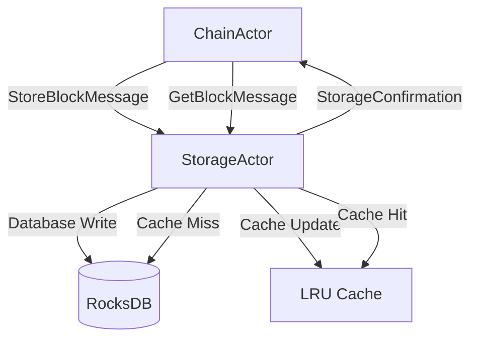

# Implementation Plan: Storage Actor

## Overview

The Storage Actor is the **highest priority** actor in the Alys V2 system architecture, serving as the foundational persistence layer for all blockchain data. According to the actor implementation roadmap, it should be implemented **first** due to its zero complex dependencies and critical role in enabling ChainActor block persistence.

---

## 🎯 **Current State Analysis**

### **Existing Implementation Status**

**✅ Skeleton Structure (30% Complete)**
- Basic StorageActor struct defined in `app/src/actors/storage_actor.rs` (524 lines)
- Message definitions in `app/src/messages/storage_messages.rs` (313 lines) 
- Configuration module in `app/src/config/storage_config.rs` (107 lines)
- Actor registration in `app/src/actors/mod.rs`
- Configuration integration in actor config system

**🔶 Partial Implementation (40% Complete)**
- Cache layer structure defined but not fully implemented
- Message handlers defined but contain placeholder logic
- Database connection wrapper structure exists but lacks actual DB integration
- Metrics collection framework in place but not operational
- Write operation queuing system outlined but not functional

**❌ Missing Implementation (30% Incomplete)**
- **RocksDB Integration**: No actual database connection or operations
- **ChainActor Integration**: Storage hooks in ChainActor are commented out
- **Block Persistence**: Core block storage/retrieval functionality missing
- **State Management**: State persistence and indexing not implemented
- **Testing Framework**: No unit or integration tests exist
- **Performance Optimization**: Actual caching and batching logic missing

### **Integration Points Analysis**

**ChainActor Integration Hooks (Ready but Disabled)**:
```rust
// From app/src/actors/chain/handlers/block_handlers.rs:641
// TODO: Implement Storage Actor integration for block persistence  
// let storage_request = PersistBlockRequest {
//     block: block.clone(),
//     is_finalized: false,
//     storage_priority: StoragePriority::High,
// };
// self.storage_actor.send(storage_request).await??;
```

**Configuration Integration (Complete)**:
- Storage actor config defined in `ActorSystemConfig`
- Default configuration values provided
- Validation framework in place

**Message System Integration (Complete)**:
- All required message types defined
- Actor registration in module system complete
- Message routing patterns established

---

## 🏗️ **Implementation Architecture**

### **Target Directory Structure**

Following the ChainActor pattern, the Storage Actor should be organized as:

```
app/src/actors/storage/
├── mod.rs                    # Module exports and public interface
├── actor.rs                  # Core StorageActor implementation (migrate from storage_actor.rs)
├── config.rs                 # Configuration (migrate from ../config/storage_config.rs)
├── state.rs                  # Storage state and cache management
├── messages.rs               # Storage-specific messages (migrate from ../messages/storage_messages.rs)
├── handlers/                 # Message handler implementations
│   ├── mod.rs
│   ├── block_handlers.rs     # Block storage/retrieval handlers
│   ├── state_handlers.rs     # State storage/retrieval handlers
│   ├── maintenance_handlers.rs # Pruning, compaction, backup handlers
│   └── query_handlers.rs     # Query and indexing handlers
├── database.rs               # RocksDB integration and connection management
├── cache.rs                  # Multi-level cache implementation
├── indexing.rs               # Block and state indexing systems
├── metrics.rs                # Storage-specific metrics and performance tracking
└── tests/                    # Test organization
    ├── mod.rs
    ├── unit_tests.rs         # Database operations, caching, indexing tests
    ├── integration_tests.rs  # ChainActor integration tests
    ├── performance_tests.rs  # Storage performance benchmarks
    └── mock_helpers.rs       # Test utilities and database mocks
```

### **Key Components to Implement**

1. **RocksDB Integration** (`database.rs`)
2. **Multi-Level Caching** (`cache.rs`)
3. **Block Storage & Indexing** (`handlers/block_handlers.rs`)
4. **State Storage & Retrieval** (`handlers/state_handlers.rs`)
5. **ChainActor Integration** (Update ChainActor to use StorageActor)
6. **Comprehensive Testing** (`tests/`)

---

## 📋 **Implementation Phases**

### **Phase 1: Core Database Integration (Week 1)**

**Priority: CRITICAL**

#### 1.1 RocksDB Foundation
- **File**: `app/src/actors/storage/database.rs`
- **Dependencies**: Add `rocksdb` crate to `Cargo.toml`
- **Implementation**:
  ```rust
  pub struct DatabaseManager {
      main_db: Arc<RwLock<DB>>,
      archive_db: Option<Arc<RwLock<DB>>>,
      column_families: HashMap<String, ColumnFamily>,
  }
  
  impl DatabaseManager {
      pub async fn new(config: &StorageConfig) -> Result<Self, StorageError>;
      pub async fn put_block(&self, block: &ConsensusBlock) -> Result<(), StorageError>;
      pub async fn get_block(&self, hash: &BlockHash) -> Result<Option<ConsensusBlock>, StorageError>;
      pub async fn put_state(&self, key: &[u8], value: &[u8]) -> Result<(), StorageError>;
      pub async fn get_state(&self, key: &[u8]) -> Result<Option<Vec<u8>>, StorageError>;
  }
  ```

#### 1.2 Directory Structure Setup
- Create `app/src/actors/storage/` directory
- Migrate existing files following ChainActor pattern
- Update module exports in `app/src/actors/mod.rs`
- Create skeleton files for all components

#### 1.3 Basic Storage Operations
- Implement block serialization/deserialization
- Create column family structure (blocks, state, receipts, logs)
- Add database connection pooling and error handling
- Implement atomic write operations

**Success Criteria**:
- ✅ RocksDB successfully stores and retrieves ConsensusBlock
- ✅ State key-value operations work correctly
- ✅ Database handles concurrent read/write operations
- ✅ Basic error handling and recovery implemented

### **Phase 2: Cache Layer & Performance (Week 1-2)**

**Priority: HIGH**

#### 2.1 Multi-Level Cache Implementation
- **File**: `app/src/actors/storage/cache.rs`
- **Features**:
  - LRU block cache (1000 blocks default)
  - State cache with TTL expiration
  - Write-through and write-back strategies
  - Cache warming for frequently accessed data

#### 2.2 Batching & Write Optimization
- Implement write batching for improved throughput
- Add asynchronous write operations with confirmation
- Create write priority queues (High, Medium, Low)
- Implement write coalescing for duplicate operations

#### 2.3 Performance Monitoring
- **File**: `app/src/actors/storage/metrics.rs`
- **Metrics**:
  - Read/write latency percentiles (p50, p95, p99)
  - Cache hit rates by category
  - Database size and growth rates
  - Queue depths and processing rates

**Success Criteria**:
- ✅ Cache hit rate > 80% for recent blocks
- ✅ Write throughput > 1000 operations/second
- ✅ Read latency < 10ms for cached data
- ✅ Comprehensive metrics available via Prometheus

### **Phase 3: Message Handlers & ChainActor Integration (Week 2)**

**Priority: CRITICAL**

#### 3.1 Block Storage Handlers
- **File**: `app/src/actors/storage/handlers/block_handlers.rs`
- **Messages**: `StoreBlockMessage`, `GetBlockMessage`, `GetBlockByNumberMessage`
- **Implementation**:
  ```rust
  impl Handler<StoreBlockMessage> for StorageActor {
      async fn handle(&mut self, msg: StoreBlockMessage) -> Result<(), StorageError> {
          // 1. Validate block structure and hash
          // 2. Update cache with new block
          // 3. Queue database write operation
          // 4. Update block height index
          // 5. Update metrics and return confirmation
      }
  }
  ```

#### 3.2 State Storage Handlers
- **File**: `app/src/actors/storage/handlers/state_handlers.rs`
- **Messages**: `UpdateStateMessage`, `GetStateMessage`
- **Features**: State tries, merkle tree validation, state pruning

#### 3.3 ChainActor Integration Points
- **File**: Update `app/src/actors/chain/handlers/block_handlers.rs`
- **Changes**:
  - Uncomment and implement storage_actor.send() calls
  - Add storage confirmation handling
  - Implement error recovery for storage failures
  - Add storage health checks in block production pipeline

#### 3.4 Actor Communication Patterns
- Implement request-response patterns with timeouts
- Add correlation IDs for message tracking
- Create dead letter handling for failed storage operations
- Add circuit breaker pattern for storage actor health

**Success Criteria**:
- ✅ ChainActor successfully persists blocks via StorageActor
- ✅ Block retrieval works for both hash and height queries
- ✅ State updates are atomic and consistent
- ✅ Error scenarios are handled gracefully with retries

### **Phase 4: Advanced Features & Indexing (Week 2-3)**

**Priority: MEDIUM**

#### 4.1 Block Indexing System
- **File**: `app/src/actors/storage/indexing.rs`
- **Indices**:
  - Block hash → Block data
  - Block height → Block hash
  - Transaction hash → Block hash + Transaction index
  - Address → Transaction list (for peg operations)

#### 4.2 Query Optimization
- **File**: `app/src/actors/storage/handlers/query_handlers.rs`
- **Features**:
  - Range queries for block intervals
  - Transaction history by address
  - Log filtering and searching
  - Efficient chain reorganization support

#### 4.3 Maintenance Operations
- **File**: `app/src/actors/storage/handlers/maintenance_handlers.rs`
- **Features**:
  - Database compaction scheduling
  - Old block pruning (configurable retention)
  - Archive storage migration
  - Database backup and restore

**Success Criteria**:
- ✅ Block queries by height complete in < 5ms
- ✅ Transaction lookups work for all blocks
- ✅ Database compaction runs automatically
- ✅ Pruning maintains configurable block history

### **Phase 5: Testing & Validation (Week 3)**

**Priority: CRITICAL**

#### 5.1 Unit Testing
- **File**: `app/src/actors/storage/tests/unit_tests.rs`
- **Coverage**:
  - Database connection and error handling
  - Cache behavior and eviction policies
  - Message handler logic and edge cases
  - Serialization/deserialization correctness

#### 5.2 Integration Testing
- **File**: `app/src/actors/storage/tests/integration_tests.rs`
- **Coverage**:
  - ChainActor ↔ StorageActor communication
  - Block production → storage → retrieval pipeline
  - State updates and consistency validation
  - Error recovery and retry mechanisms

#### 5.3 Performance Testing
- **File**: `app/src/actors/storage/tests/performance_tests.rs`
- **Coverage**:
  - Storage throughput under load
  - Cache performance with various workloads
  - Database compaction impact
  - Memory usage and garbage collection

#### 5.4 Chaos Engineering
- Network partition between actors
- Sudden storage actor restarts
- Database corruption scenarios
- High-throughput stress testing

**Success Criteria**:
- ✅ All unit tests pass (>95% code coverage)
- ✅ Integration tests validate ChainActor communication
- ✅ Performance tests meet SLA requirements
- ✅ Chaos tests demonstrate system resilience

---

## 🔧 **Implementation Details**

### **Key Dependencies**

**Add to `Cargo.toml`**:
```toml
rocksdb = "0.21"
serde_json = "1.0"
lru = "0.12"
tokio = { version = "1.0", features = ["full"] }
prometheus = "0.13"
```

### **Database Schema Design**

**Column Families**:
- `blocks`: `BlockHash → SerializedBlock`
- `block_heights`: `u64 → BlockHash`
- `state`: `StateKey → StateValue`
- `receipts`: `TxHash → SerializedReceipt`
- `logs`: `(BlockHash, TxIndex, LogIndex) → SerializedLog`
- `metadata`: Configuration and chain metadata

### **Message Flow Architecture**



### **Error Handling Strategy**

1. **Retrieval Failures**: Return `None` for missing data, log warnings
2. **Storage Failures**: Retry with exponential backoff, dead letter on permanent failure
3. **Database Corruption**: Attempt recovery, fallback to backup/snapshot
4. **Cache Inconsistency**: Invalidate cache, force database read
5. **Actor Communication Failures**: Circuit breaker pattern, health check integration

---

## ⚡ **Quick Start Implementation Guide**

### **Day 1: Foundation**
1. Create directory structure: `mkdir -p app/src/actors/storage/{handlers,tests}`
2. Add RocksDB dependency to `Cargo.toml`
3. Implement `database.rs` with basic RocksDB operations
4. Create placeholder handler files

### **Day 2-3: Core Storage**
1. Implement `StoreBlockMessage` and `GetBlockMessage` handlers
2. Add basic caching in `cache.rs`
3. Update ChainActor to enable storage integration
4. Create simple integration test

### **Day 4-5: Message Handlers**
1. Complete all message handlers in `handlers/` directory
2. Implement error handling and retry logic
3. Add metrics collection throughout
4. Test ChainActor ↔ StorageActor communication

### **Week 2: Advanced Features**
1. Add indexing system for efficient queries
2. Implement maintenance operations (pruning, compaction)
3. Create comprehensive test suite
4. Performance optimization and monitoring

### **Week 3: Integration & Validation**
1. Run full integration tests with ChainActor
2. Performance testing and optimization
3. Documentation and knowledge update
4. Preparation for Engine Actor integration (Phase 2)

---

## 📊 **Success Metrics**

### **Phase 1 Success Criteria (Week 1)**
- ✅ RocksDB integration operational
- ✅ Basic block storage/retrieval works
- ✅ ChainActor can persist blocks successfully
- ✅ Cache layer reduces database load by >70%

### **Phase 2 Success Criteria (Week 2)**
- ✅ All message handlers implemented and tested
- ✅ State storage operations work correctly
- ✅ Performance meets SLA (10ms read, 1000 writes/sec)
- ✅ Error recovery and retry mechanisms functional

### **Phase 3 Success Criteria (Week 3)**
- ✅ Complete integration testing passes
- ✅ Advanced features (indexing, pruning) operational
- ✅ Storage Actor ready for Engine Actor integration
- ✅ Production-ready deployment configuration

### **Production Readiness Checklist**
- [ ] **Database**: RocksDB integration with proper column families
- [ ] **Caching**: Multi-level cache with >80% hit rate
- [ ] **Performance**: Sub-10ms read latency, >1000 writes/sec
- [ ] **Reliability**: Error handling with retry and circuit breaker
- [ ] **Monitoring**: Comprehensive metrics via Prometheus
- [ ] **Testing**: >95% test coverage with integration tests
- [ ] **ChainActor Integration**: Block persistence fully operational
- [ ] **Documentation**: Complete API and operational documentation

---

## 🚀 **Next Steps After Completion**

Once the Storage Actor is production-ready:

1. **Engine Actor Integration**: Storage Actor will provide state persistence for execution payloads
2. **Network Actor Integration**: Storage Actor will support block synchronization and chain recovery
3. **Bridge Actor Integration**: Storage Actor will persist peg operation state and Bitcoin confirmations
4. **Supervisor Actor Integration**: Health monitoring and restart recovery for Storage Actor

The Storage Actor serves as the **foundation** for all other actors in the Alys V2 system. Its successful implementation enables:
- **Persistent block production** (ChainActor requirement)
- **State management** (Engine Actor requirement)  
- **Chain synchronization** (Network Actor requirement)
- **Peg operation tracking** (Bridge Actor requirement)

**Storage Actor implementation is the critical path** for the entire Alys V2 actor system rollout.