# StorageActor Engineer Onboarding Guide - Alys V2

> **🎯 Mission**: Master the StorageActor - Alys V2's persistent data management powerhouse that handles blockchain state, block storage, and high-performance indexing operations.

---

## 1. Introduction & Purpose

### What is the StorageActor?

The **StorageActor** is the central persistence layer of the Alys V2 merged mining sidechain, responsible for managing all blockchain data storage, retrieval, and indexing operations. It serves as the foundation that enables the entire system to maintain blockchain state across restarts, provide fast data access, and support complex queries.


### Core Mission

The StorageActor's mission is to provide:
- **🔒 Reliable Persistence**: Ensure blockchain data survives system restarts and failures
- **⚡ High Performance**: Sub-10ms cached reads, sub-50ms database writes
- **🔍 Advanced Querying**: Fast block-height lookups, transaction searches, address histories
- **🛠️ Maintenance Operations**: Database compaction, pruning, snapshots, and recovery
- **📊 Observability**: Comprehensive metrics and health monitoring

---

## 2. System Architecture & Core Flows

### StorageActor Architecture Overview

```mermaid
graph TB
    subgraph "StorageActor Internal Architecture"
        MSG[Message Router] --> HAND[Handler Layer]
        HAND --> CACHE[Multi-Level Cache]
        HAND --> DB[Database Layer]
        HAND --> IDX[Indexing System]
        
        subgraph "Cache Hierarchy"
            CACHE --> BC[Block Cache<br/>1000 entries]
            CACHE --> SC[State Cache<br/>10000 entries] 
            CACHE --> RC[Receipt Cache<br/>5000 entries]
        end
        
        subgraph "Database Schema"
            DB --> CF1[Blocks CF]
            DB --> CF2[Block Heights CF]
            DB --> CF3[State CF]
            DB --> CF4[Receipts CF]
            DB --> CF5[Logs CF]
            DB --> CF6[Metadata CF]
            DB --> CF7[Chain Head CF]
        end
        
        subgraph "Indexing Components"
            IDX --> BTH[Block→Height Index]
            IDX --> THB[TxHash→Block Index]
            IDX --> ATH[Address→Tx Index]
            IDX --> LGI[Log Index]
        end
    end
```



### Core Data Flows

#### 1. Block Storage Flow

```mermaid
sequenceDiagram
    participant CA as ChainActor
    participant SA as StorageActor
    participant DB as RocksDB
    participant IDX as Indexing
    participant CACHE as Cache
    
    CA->>SA: StoreBlockMessage
    SA->>CACHE: Update block cache
    SA->>DB: Write to blocks CF
    SA->>IDX: Update block→height index
    SA->>IDX: Update tx→block index
    SA->>SA: Update metrics
    SA-->>CA: Success response
```


#### 2. Block Retrieval Flow


### Performance Characteristics

| Operation | Target | Typical | Cache Hit Rate |
|-----------|--------|---------|---------------|
| Block Read (cached) | <10ms | 2-5ms | >90% |
| Block Write | <50ms | 20-30ms | N/A |
| State Query (cached) | <5ms | 1-3ms | >85% |
| Index Lookup | <15ms | 8-12ms | >80% |
| Database Compaction | <30s | 15-20s | N/A |

---

## 3. Knowledge Tree (Progressive Deep-dive)

### 🌱 Roots: Foundation Concepts

#### Actor Model Fundamentals
- **Message Passing**: All operations via typed messages with correlation IDs
- **State Isolation**: No shared mutable state - all data owned by the actor
- **Supervision**: Fault tolerance through actor restart strategies
- **Async Processing**: Non-blocking I/O with Actix runtime

#### Blockchain Storage Concepts
- **Block Storage**: Immutable blockchain blocks with metadata
- **State Trees**: Merkle-trie based state management
- **Transaction Receipts**: Execution results and event logs
- **Indexing**: Fast lookup structures for queries

### 🌳 Trunk: Core StorageActor Modules

#### `actor.rs` - Main Actor Implementation
```rust
pub struct StorageActor {
    /// RocksDB database instance
    database: Arc<RwLock<Database>>,
    /// Multi-level LRU cache system
    cache: Arc<RwLock<StorageCache>>,
    /// Advanced indexing system
    indexing: Arc<RwLock<StorageIndexing>>,
    /// Performance metrics
    metrics: StorageMetrics,
    /// Actor configuration
    config: StorageConfig,
}
```

#### `messages.rs` - Message Protocol
```rust
// Primary storage operations
pub struct StoreBlockMessage {
    pub block: ConsensusBlock,
    pub canonical: bool,
    pub correlation_id: Option<Uuid>,
}

pub struct GetBlockMessage {
    pub block_hash: BlockHash,
    pub correlation_id: Option<Uuid>,
}

// Advanced query operations
pub struct GetBlockByHeightMessage {
    pub height: u64,
    pub correlation_id: Option<Uuid>,
}

pub struct QueryLogsMessage {
    pub from_block: Option<u64>,
    pub to_block: Option<u64>,
    pub address: Option<Address>,
    pub topics: Vec<H256>,
}
```

#### `database.rs` - RocksDB Integration
```rust
pub struct Database {
    /// Main RocksDB instance
    db: Arc<DB>,
    /// Column families for different data types
    column_families: HashMap<String, ColumnFamily>,
    /// Write options for performance tuning
    write_options: WriteOptions,
    /// Read options for consistency
    read_options: ReadOptions,
}

// Column Family Organization
const BLOCKS_CF: &str = "blocks";
const BLOCK_HEIGHTS_CF: &str = "block_heights";  
const STATE_CF: &str = "state";
const RECEIPTS_CF: &str = "receipts";
const LOGS_CF: &str = "logs";
const METADATA_CF: &str = "metadata";
const CHAIN_HEAD_CF: &str = "chain_head";
```

#### `cache.rs` - Multi-Level Caching
```rust
pub struct StorageCache {
    /// Block cache with TTL expiration
    blocks: Arc<RwLock<LruCache<BlockHash, Arc<ConsensusBlock>>>>,
    /// State cache for frequent reads
    state: Arc<RwLock<LruCache<StateKey, Arc<StateValue>>>>,
    /// Receipt cache for transaction queries
    receipts: Arc<RwLock<LruCache<H256, Arc<TransactionReceipt>>>>,
    /// Cache statistics and metrics
    stats: CacheStats,
}

// Cache Configuration
const BLOCK_CACHE_SIZE: usize = 1000;
const STATE_CACHE_SIZE: usize = 10000;
const RECEIPT_CACHE_SIZE: usize = 5000;
const CACHE_TTL: Duration = Duration::from_secs(3600);
```

#### `indexing.rs` - Advanced Indexing System
```rust
pub struct StorageIndexing {
    /// Block height to hash mapping
    block_height_index: Arc<RwLock<HashMap<u64, BlockHash>>>,
    /// Transaction hash to block info mapping  
    tx_index: Arc<RwLock<HashMap<H256, TransactionInfo>>>,
    /// Address to transaction list mapping
    address_index: Arc<RwLock<HashMap<Address, Vec<H256>>>>,
    /// Log index for event queries
    log_index: Arc<RwLock<HashMap<LogKey, Vec<EventLog>>>>,
    /// Index statistics
    stats: IndexingStats,
}
```

### 🌿 Branches: Integration & Subsystems

#### ChainActor Integration
- **Block Coordination**: Receive new blocks for storage
- **State Updates**: Handle state transitions from block execution
- **Reorg Handling**: Manage chain reorganizations and rollbacks

#### Supervision Strategy
```rust
impl Supervised for StorageActor {
    fn restarting(&mut self, ctx: &mut Context<Self>) {
        // Verify database integrity
        self.verify_database_integrity();
        // Rebuild indexes if needed
        self.rebuild_indexes_if_needed();
        // Reset cache
        self.cache.write().unwrap().clear();
        // Update metrics
        self.metrics.record_restart();
    }
}
```

#### Metrics Collection
```rust
pub struct StorageMetrics {
    pub blocks_stored: Counter,
    pub blocks_retrieved: Counter,
    pub cache_hits: Counter,
    pub cache_misses: Counter,
    pub database_errors: Counter,
    pub operation_duration: Histogram,
}
```

### 🍃 Leaves: Implementation Details

#### Key Handler Functions

**Block Storage Handler**
```rust
impl Handler<StoreBlockMessage> for StorageActor {
    type Result = ResponseFuture<Result<(), StorageError>>;
    
    fn handle(&mut self, msg: StoreBlockMessage, _ctx: &mut Context<Self>) -> Self::Result {
        let database = self.database.clone();
        let cache = self.cache.clone();
        let indexing = self.indexing.clone();
        let metrics = self.metrics.clone();
        
        Box::pin(async move {
            // 1. Serialize block data
            let block_data = serialize_block(&msg.block)?;
            let block_hash = msg.block.hash();
            
            // 2. Write to database
            let mut db = database.write().await;
            db.put_block(block_hash, &block_data)?;
            
            // 3. Update cache
            let mut cache_guard = cache.write().await;
            cache_guard.insert_block(block_hash, Arc::new(msg.block.clone()));
            
            // 4. Update indexes
            let mut idx = indexing.write().await;
            idx.index_block(&msg.block).await?;
            
            // 5. Update metrics
            metrics.blocks_stored.inc();
            
            Ok(())
        })
    }
}
```

**Advanced Query Handler**
```rust
impl Handler<GetBlockByHeightMessage> for StorageActor {
    type Result = ResponseFuture<Result<Option<ConsensusBlock>, StorageError>>;
    
    fn handle(&mut self, msg: GetBlockByHeightMessage, _ctx: &mut Context<Self>) -> Self::Result {
        let indexing = self.indexing.clone();
        let cache = self.cache.clone();
        let database = self.database.clone();
        let metrics = self.metrics.clone();
        
        Box::pin(async move {
            // 1. Get block hash from height index
            let idx = indexing.read().await;
            let block_hash = match idx.get_block_hash_by_height(msg.height).await? {
                Some(hash) => hash,
                None => return Ok(None),
            };
            
            // 2. Check cache first
            {
                let cache_guard = cache.read().await;
                if let Some(block) = cache_guard.get_block(&block_hash) {
                    metrics.cache_hits.inc();
                    return Ok(Some((*block).clone()));
                }
            }
            
            // 3. Fallback to database
            metrics.cache_misses.inc();
            let db = database.read().await;
            let block_data = db.get_block(block_hash)?;
            
            match block_data {
                Some(data) => {
                    let block = deserialize_block(&data)?;
                    
                    // Update cache for future reads
                    let mut cache_guard = cache.write().await;
                    cache_guard.insert_block(block_hash, Arc::new(block.clone()));
                    
                    Ok(Some(block))
                },
                None => Ok(None)
            }
        })
    }
}
```

---

## 4. Codebase Walkthrough

### Directory Structure Deep-dive

```
app/src/actors/storage/
├── actor.rs              # Main StorageActor implementation
├── cache.rs               # Multi-level LRU cache system  
├── database.rs            # RocksDB integration and schema
├── indexing.rs            # Advanced indexing system
├── messages.rs            # Complete message protocol
├── metrics.rs             # Prometheus metrics integration
├── mod.rs                # Module exports and re-exports
├── handlers/              # Message handlers organized by category
│   ├── block_handlers.rs  # Block storage/retrieval handlers
│   ├── state_handlers.rs  # State management handlers  
│   ├── query_handlers.rs  # Advanced query handlers
│   ├── maintenance_handlers.rs # DB maintenance handlers
│   └── mod.rs            # Handler module exports
└── tests/                # Comprehensive test suite
    ├── unit_tests.rs     # Unit tests for components
    ├── integration_test.rs # Basic integration tests
    ├── integration_test_enhanced.rs # Advanced integration tests
    ├── performance_tests.rs # Performance benchmarks
    ├── chaos_tests.rs    # Chaos engineering tests
    ├── mock_helpers.rs   # Test utilities and mocks
    └── mod.rs           # Test module organization
```

### Key Integration Points

#### 1. RocksDB Column Family Schema
```rust
// Database initialization with column families
let cf_opts = Options::default();
cf_opts.set_max_write_buffer_number(4);
cf_opts.set_write_buffer_size(64 * 1024 * 1024); // 64MB

let column_families = vec![
    ("blocks", &cf_opts),          // Block data storage
    ("block_heights", &cf_opts),   // Height→Hash mapping  
    ("state", &cf_opts),           // World state storage
    ("receipts", &cf_opts),        // Transaction receipts
    ("logs", &cf_opts),            // Event logs
    ("metadata", &cf_opts),        // Chain metadata
    ("chain_head", &cf_opts),      // Current chain head
];
```

#### 2. Cache Integration Patterns
```rust
// Cache-through pattern for reads
async fn get_block_with_cache(&self, hash: BlockHash) -> Result<Option<ConsensusBlock>, StorageError> {
    // 1. Check cache first
    if let Some(cached) = self.cache.get_block(&hash).await {
        self.metrics.cache_hits.inc();
        return Ok(Some(cached));
    }
    
    // 2. Cache miss - read from database
    self.metrics.cache_misses.inc();
    let block = self.database.get_block(hash).await?;
    
    // 3. Update cache for future reads
    if let Some(ref b) = block {
        self.cache.insert_block(hash, b.clone()).await;
    }
    
    Ok(block)
}
```

#### 3. Message Flow Examples

**Complete Block Storage Flow**
```rust
// Input: StoreBlockMessage from ChainActor
let store_msg = StoreBlockMessage {
    block: ConsensusBlock {
        parent_hash: Hash256::from_str("0x1234...")?,
        slot: 12345,
        execution_payload: ExecutionPayload { /* ... */ },
        // ... other fields
    },
    canonical: true,
    correlation_id: Some(Uuid::new_v4()),
};

// Output: Success acknowledgment
let result: Result<(), StorageError> = storage_actor
    .send(store_msg)
    .await?;
```

**Advanced Query Example**
```rust
// Input: Query logs by address and topic
let query_msg = QueryLogsMessage {
    from_block: Some(1000),
    to_block: Some(2000), 
    address: Some(Address::from_str("0xabcd..."))),
    topics: vec![H256::from_str("0x1234...").unwrap()],
    limit: Some(100),
    correlation_id: Some(Uuid::new_v4()),
};

// Output: Filtered event logs
let result: Result<Vec<EventLog>, StorageError> = storage_actor
    .send(query_msg)
    .await?;
```

---

## 5. Procedural Debugging & Worked Examples

### Common Debugging Scenarios

#### 1. Database Corruption Recovery

**🔍 Problem**: StorageActor fails to start due to database corruption

**📊 Symptoms**:
- Actor restart loops
- RocksDB corruption errors in logs
- Performance metrics show zero throughput

**🔧 Debug Steps**:
```bash
# 1. Check RocksDB logs
tail -f /path/to/rocksdb/LOG

# 2. Verify database integrity
RUST_LOG=storage_actor=debug,rocksdb=debug cargo run -- --verify-db

# 3. Manual recovery if needed
RUST_LOG=storage_actor=debug cargo run -- --repair-db

# 4. Rebuild indexes
RUST_LOG=storage_actor=debug cargo run -- --rebuild-indexes
```

**💡 Solution Pattern**:
```rust
impl StorageActor {
    async fn handle_database_corruption(&mut self) -> Result<(), StorageError> {
        warn!("Database corruption detected, attempting recovery");
        
        // 1. Close current database handle
        self.database.write().await.close()?;
        
        // 2. Attempt RocksDB repair
        DB::repair(&Options::default(), &self.config.db_path)?;
        
        // 3. Reopen with recovery options
        let mut options = Options::default();
        options.set_paranoid_checks(true);
        self.database = Arc::new(RwLock::new(
            Database::open_with_recovery(&options, &self.config.db_path)?
        ));
        
        // 4. Rebuild indexes
        self.rebuild_all_indexes().await?;
        
        info!("Database recovery completed successfully");
        Ok(())
    }
}
```

#### 2. Cache Invalidation Issues

**🔍 Problem**: Stale data returned from cache after chain reorg

**📊 Symptoms**:
- Inconsistent block data between calls
- Cache hit rate abnormally high
- Client queries return outdated information

**🔧 Debug Steps**:
```rust
// Enable cache debugging
RUST_LOG=storage_actor::cache=debug

// Check cache statistics  
let stats = storage_actor.send(GetCacheStatsMessage).await?;
println!("Cache stats: {:?}", stats);

// Manual cache invalidation
let _ = storage_actor.send(InvalidateCacheMessage {
    cache_type: CacheType::Blocks,
    correlation_id: Some(Uuid::new_v4()),
}).await?;
```

**💡 Solution Pattern**:
```rust
impl StorageActor {
    async fn handle_chain_reorg(&mut self, reorg_info: ChainReorgInfo) -> Result<(), StorageError> {
        info!("Handling chain reorganization from block {}", reorg_info.fork_point);
        
        // 1. Invalidate affected cache entries
        let mut cache = self.cache.write().await;
        for height in reorg_info.fork_point..=reorg_info.old_head_height {
            if let Some(hash) = self.indexing.read().await.get_block_hash_by_height(height).await? {
                cache.invalidate_block(&hash);
            }
        }
        
        // 2. Update indexes for new canonical chain
        for (height, new_hash) in reorg_info.new_canonical_blocks {
            self.indexing.write().await.update_block_height_mapping(height, new_hash).await?;
        }
        
        // 3. Update chain head
        self.update_chain_head(reorg_info.new_head_hash).await?;
        
        info!("Chain reorganization handled successfully");
        Ok(())
    }
}
```

---

## 6. Environment Setup & Tooling

### Local Development Setup

#### Prerequisites
```bash
# Rust toolchain
rustup install stable
rustup component add clippy rustfmt

# System dependencies
sudo apt-get update
sudo apt-get install -y \
    build-essential \
    clang \
    cmake \
    pkg-config \
    libssl-dev \
    librocksdb-dev
```

#### Storage-Specific Configuration
```bash
# 1. Clone and setup Alys
git clone https://github.com/AnduroProject/alys.git
cd alys

# 2. Create storage data directory
mkdir -p data/storage/rocksdb
mkdir -p data/storage/snapshots

# 3. Configure environment
export RUST_LOG="storage_actor=debug,rocksdb=info"
export ALYS_STORAGE_PATH="./data/storage/rocksdb"
export ALYS_STORAGE_CACHE_SIZE="1000"

# 4. Initialize database with proper column families
cargo run --bin init-storage-db -- \
    --path ./data/storage/rocksdb \
    --column-families blocks,block_heights,state,receipts,logs,metadata,chain_head
```

### Essential Development Commands

#### Storage Testing Commands
```bash
# Unit tests - fast feedback loop
cargo test --lib storage --features test-utils

# Integration tests - requires RocksDB
cargo test actors::storage --release

# Performance benchmarks
cargo test --release --test performance_tests -- --ignored --nocapture

# Chaos engineering tests
cargo test --release --test chaos_tests -- --ignored --nocapture

# Specific test suites
cargo test storage_actor_lifecycle_test --release -- --nocapture
cargo test storage_indexing_performance --release -- --nocapture
```

#### Database Management Commands
```bash
# Database status check
cargo run --bin storage-admin -- status --db-path ./data/storage/rocksdb

# Manual compaction
cargo run --bin storage-admin -- compact --db-path ./data/storage/rocksdb

# Create snapshot
cargo run --bin storage-admin -- snapshot --db-path ./data/storage/rocksdb --output ./data/snapshots/

# Database repair (if corrupted)
cargo run --bin storage-admin -- repair --db-path ./data/storage/rocksdb

# Rebuild indexes
cargo run --bin storage-admin -- rebuild-indexes --db-path ./data/storage/rocksdb
```

---

## 7. Testing & CI/CD Integration

### Testing Strategy Overview

The StorageActor employs a comprehensive 5-tier testing strategy:


### Test Suite Categories

#### 1. Unit Tests (`unit_tests.rs`)
- **Focus**: Individual component testing (cache, database, indexing)
- **Runtime**: <5 seconds
- **Dependencies**: Mock RocksDB and in-memory structures
- **Coverage**: 90%+ line coverage for core logic

#### 2. Integration Tests (`integration_test_enhanced.rs`)
- **Focus**: Full actor lifecycle with real RocksDB
- **Runtime**: 30-60 seconds  
- **Dependencies**: Local RocksDB instance
- **Scenarios**: Actor restart, message handling, ChainActor coordination

#### 3. Performance Tests (`performance_tests.rs`)
- **Focus**: Throughput and latency benchmarks
- **Runtime**: 2-5 minutes
- **Targets**: >1000 ops/sec, <10ms cache reads, <50ms DB writes
- **Scenarios**: Concurrent operations, cache efficiency, database optimization

#### 4. Chaos Tests (`chaos_tests.rs`)
- **Focus**: Failure recovery and resilience
- **Runtime**: 5-10 minutes
- **Scenarios**: Database corruption, network failures, memory pressure
- **Recovery**: <5 second actor restart, data integrity verification

#### 5. End-to-End Tests
- **Focus**: Full blockchain integration
- **Runtime**: 10-30 minutes
- **Scenarios**: Block production cycle, reorg handling, query operations
- **Integration**: ChainActor, EngineActor, NetworkActor coordination

---

## 8. Pro Tips & Quick Reference

### 🚀 Performance Optimization Tips

#### Cache Tuning
```rust
// Optimal cache sizes for different workloads
match workload_type {
    WorkloadType::BlockSync => {
        // High sequential reads
        config.block_cache_size = 2000;
        config.state_cache_size = 5000;
        config.receipt_cache_size = 1000;
    },
    WorkloadType::QueryHeavy => {
        // Random access patterns  
        config.block_cache_size = 500;
        config.state_cache_size = 20000;
        config.receipt_cache_size = 10000;
    },
    WorkloadType::WriteHeavy => {
        // Minimize cache overhead
        config.block_cache_size = 100;
        config.state_cache_size = 1000; 
        config.receipt_cache_size = 500;
    }
}
```

#### RocksDB Tuning
```rust
// Production-optimized RocksDB settings
let mut db_options = Options::default();

// Write performance
db_options.set_max_write_buffer_number(6);
db_options.set_write_buffer_size(128 * 1024 * 1024); // 128MB
db_options.set_max_bytes_for_level_base(512 * 1024 * 1024); // 512MB

// Read performance  
db_options.set_max_open_files(10000);
db_options.set_use_direct_reads(true);
db_options.set_use_direct_io_for_flush_and_compaction(true);

// Compaction
db_options.set_level0_file_num_compaction_trigger(4);
db_options.set_level0_slowdown_writes_trigger(20);
db_options.set_level0_stop_writes_trigger(36);
```

### 🐛 Debugging Shortcuts

#### Quick Health Check
```bash
# One-liner health check
curl -s http://localhost:8080/health/storage | jq '.status,.last_operation,.cache_hit_rate'

# Performance snapshot  
curl -s http://localhost:9090/metrics | grep -E 'storage_(operations|latency|errors)' | head -10

# Database size check
du -sh ./data/storage/rocksdb/
```

#### Log Analysis Patterns  
```bash
# Find performance bottlenecks
journalctl -u alys-node | grep -E 'storage_actor.*took.*ms' | awk '{print $NF}' | sort -n | tail -20

# Cache miss analysis
journalctl -u alys-node | grep 'cache_miss' | grep -o 'key=[^[:space:]]*' | sort | uniq -c | sort -nr

# Error pattern analysis
journalctl -u alys-node --since "1 hour ago" | grep -E 'storage.*ERROR' | grep -o 'error=[^[:space:]]*' | sort | uniq -c
```

### 📝 Development Cheatsheet

#### Common Message Patterns
```rust
// Store block with full error handling
let result = storage_actor.send(StoreBlockMessage {
    block: block.clone(),
    canonical: true,
    correlation_id: Some(Uuid::new_v4()),
}).await
.map_err(|e| StorageError::ActorMailboxError(e))?
.map_err(|e| StorageError::DatabaseError(e))?;

// Query with timeout
let result = timeout(
    Duration::from_secs(30),
    storage_actor.send(QueryLogsMessage {
        from_block: Some(1000),
        to_block: Some(2000), 
        address: Some(contract_address),
        topics: vec![event_topic],
        limit: Some(100),
        correlation_id: Some(Uuid::new_v4()),
    })
).await
.map_err(|_| StorageError::Timeout)?
.map_err(|e| StorageError::ActorMailboxError(e))?
.map_err(|e| StorageError::QueryError(e))?;
```

### 🔧 Quick Commands Reference

| Task | Command |
|------|---------|
| **Development** |  |
| Run unit tests | `cargo test --lib storage --features test-utils` |
| Run integration tests | `cargo test actors::storage --release` |  
| Run performance tests | `cargo test --release --test performance_tests -- --ignored` |
| Start with debug logging | `RUST_LOG=storage_actor=debug cargo run` |
| **Database** | |
| Check DB status | `cargo run --bin storage-admin -- status --db-path ./data/storage` |
| Compact database | `cargo run --bin storage-admin -- compact --db-path ./data/storage` |
| Create snapshot | `cargo run --bin storage-admin -- snapshot --output ./snapshots/` |
| **Monitoring** | |
| Check actor health | `curl -s http://localhost:8080/health/storage \| jq` |
| View metrics | `curl -s http://localhost:9090/metrics \| grep storage_actor` |
| Check database size | `du -sh ./data/storage/rocksdb/` |

---

## 9. Glossary & Further Learning Paths

### 📚 Key Terms

**Actor Model Terms**
- **Actor**: Isolated computational unit that processes messages sequentially
- **Message Passing**: Communication mechanism between actors via typed messages  
- **Supervision**: Fault tolerance strategy where supervisor actors restart failed children
- **Mailbox**: Queue where actors receive and process incoming messages
- **Context**: Actor runtime environment providing lifecycle and messaging capabilities

**Storage System Terms**
- **Column Family (CF)**: RocksDB namespace for organizing different data types
- **LRU Cache**: Least Recently Used cache eviction policy for memory management
- **Write-Ahead Log (WAL)**: Durability mechanism ensuring writes survive system crashes
- **Compaction**: Background process that reorganizes and optimizes database files
- **Bloom Filter**: Probabilistic data structure for fast "not found" responses

**Blockchain Storage Terms**  
- **Canonical Block**: Block that's part of the main chain (not orphaned)
- **Block Height**: Sequential number indicating block position in the chain
- **State Root**: Merkle root hash representing the entire blockchain state
- **Receipt**: Transaction execution result including gas used and logs
- **Event Log**: Blockchain event emitted by smart contract execution
- **Chain Reorganization**: Process of switching to a different chain branch

### 🎓 Learning Paths

#### 🔰 Beginner Path: Foundation Concepts
1. **Actor Model Fundamentals**
   - Read: [Actor Model Wikipedia](https://en.wikipedia.org/wiki/Actor_model)
   - Tutorial: [Actix Documentation](https://actix.rs/docs/)
   - Practice: Build simple calculator actor
   
2. **RocksDB Basics**
   - Read: [RocksDB Wiki](https://github.com/facebook/rocksdb/wiki)
   - Tutorial: [RocksDB Rust Bindings](https://docs.rs/rocksdb/latest/rocksdb/)
   - Practice: Create key-value store with column families

3. **Blockchain Storage Concepts** 
   - Read: [Blockchain Storage Patterns](https://ethereum.org/en/developers/docs/data-structures-and-encoding/)
   - Study: Ethereum state tries and storage layout
   - Practice: Implement simple block storage

#### 🚀 Intermediate Path: StorageActor Mastery
1. **Message Protocol Design**
   - Study: `app/src/actors/storage/messages.rs`
   - Practice: Add custom message types
   - Exercise: Implement message correlation tracking

2. **Caching Strategies**
   - Study: `app/src/actors/storage/cache.rs`
   - Learn: LRU vs LFU vs TTL eviction policies
   - Practice: Optimize cache sizes for different workloads

3. **Database Schema Design**
   - Study: `app/src/actors/storage/database.rs`
   - Learn: Column family organization patterns
   - Practice: Design schema for new data types

4. **Error Handling & Recovery**
   - Study: `app/src/actors/storage/handlers/`
   - Learn: Graceful degradation patterns
   - Practice: Implement retry mechanisms

#### ⚡ Advanced Path: Performance & Reliability
1. **Performance Optimization**
   - Study: `app/src/actors/storage/tests/performance_tests.rs`
   - Learn: Profiling tools (perf, Valgrind, flamegraph)
   - Practice: Optimize for different hardware configurations

2. **Chaos Engineering** 
   - Study: `app/src/actors/storage/tests/chaos_tests.rs`
   - Learn: Failure injection and recovery testing
   - Practice: Design resilience tests for production scenarios

3. **Monitoring & Observability**
   - Study: `app/src/actors/storage/metrics.rs`
   - Learn: Prometheus metrics patterns
   - Practice: Create custom dashboards

### 📖 Recommended Resources

#### Books
- **"Designing Data-Intensive Applications"** by Martin Kleppmann - Essential for understanding storage systems
- **"Database Internals"** by Alex Petrov - Deep dive into database implementation details
- **"Blockchain Basics"** by Daniel Drescher - Foundation concepts for blockchain storage

#### Documentation
- [Actix Actor Framework](https://actix.rs/docs/) - Official Actix documentation
- [RocksDB Documentation](https://github.com/facebook/rocksdb/wiki) - Comprehensive RocksDB guide
- [Rust Async Book](https://rust-lang.github.io/async-book/) - Async programming in Rust

### 🎯 Hands-On Exercises

#### Exercise 1: Custom Message Handler
```rust
// Implement a custom message for batch block operations
#[derive(Message, Debug, Clone)]
#[rtype(result = "Result<BatchResult, StorageError>")]
pub struct BatchStoreBlocksMessage {
    pub blocks: Vec<ConsensusBlock>,
    pub correlation_id: Option<Uuid>,
}

// TODO: Implement handler with proper error handling and metrics
impl Handler<BatchStoreBlocksMessage> for StorageActor {
    // Your implementation here
}
```

#### Exercise 2: Cache Optimization  
```rust
// Analyze and optimize cache performance for query-heavy workload
async fn optimize_for_query_workload(storage: &mut StorageActor) {
    // TODO: 
    // 1. Measure current cache hit rates
    // 2. Adjust cache sizes based on access patterns  
    // 3. Implement cache warming strategies
    // 4. Validate performance improvements
}
```

### 💡 Next Steps

After mastering the StorageActor, consider exploring:

1. **ChainActor Integration**: Learn how StorageActor coordinates with ChainActor for block processing
2. **Network Layer**: Understand how blockchain data flows from P2P network through storage
3. **Bridge Operations**: Study how peg-in/peg-out operations interact with storage systems
4. **Mining Integration**: Learn storage requirements for merged mining operations
5. **Monitoring & Alerting**: Implement production monitoring for storage health and performance

---

> **🎉 Congratulations!** You've completed the StorageActor onboarding guide. You should now have a comprehensive understanding of Alys V2's storage architecture and be ready to contribute effectively to the storage system. For questions or contributions, refer to the [contribution guidelines](../../../CONTRIBUTING.md) and engage with the development community.