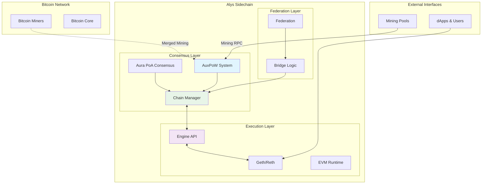
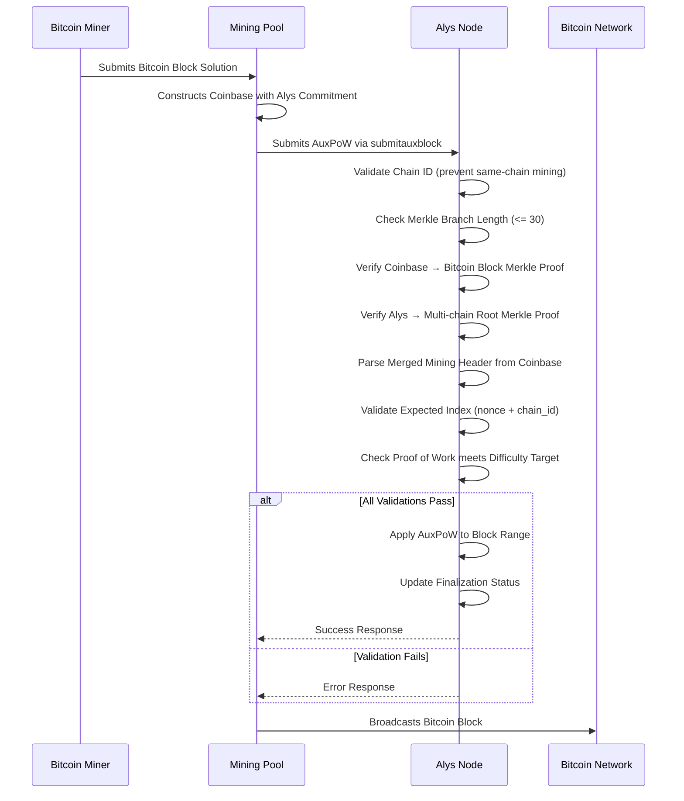
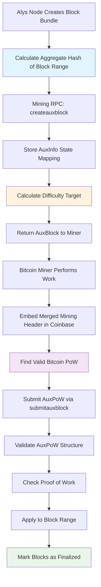
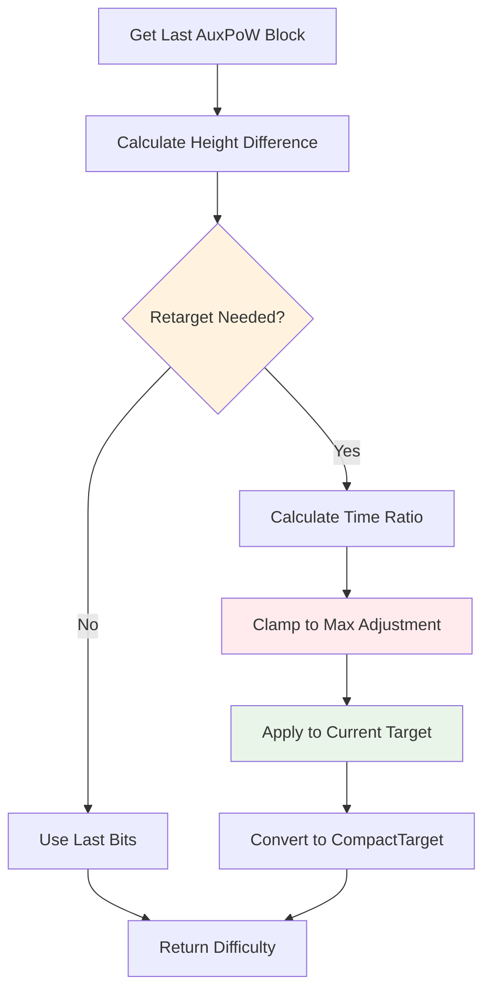
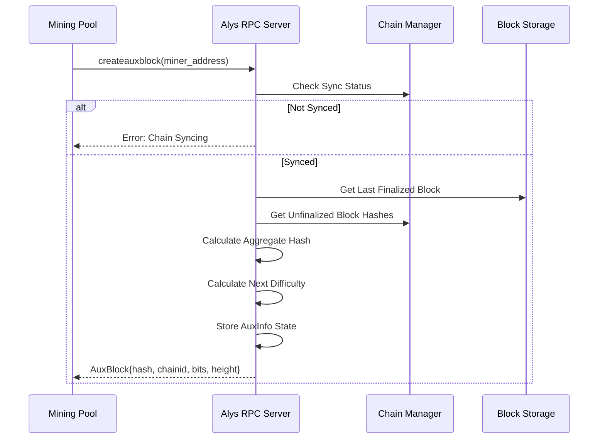
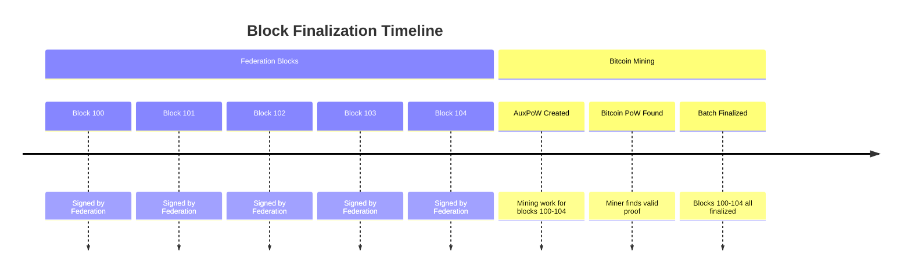
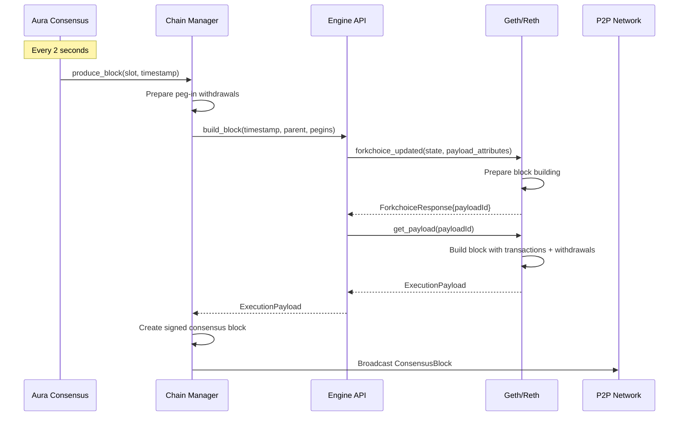
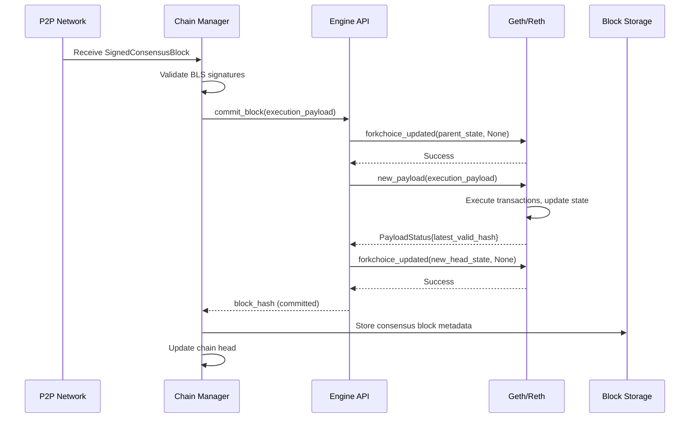
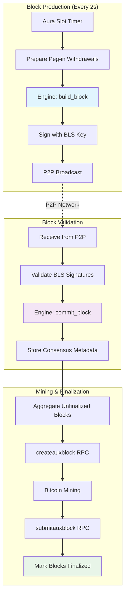
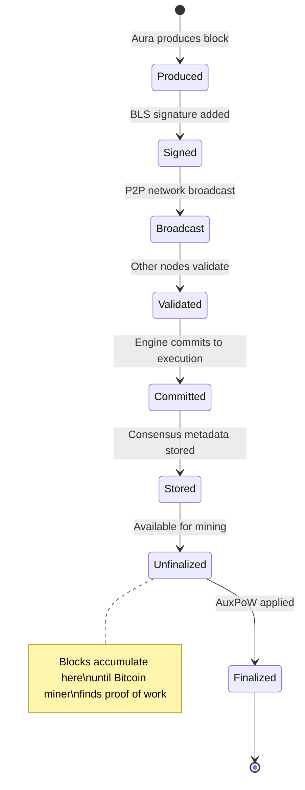

# Alys Core Components: AuxPoW, Mining, and Execution Payloads

**A Comprehensive Technical Guide for New Engineers**

This guide provides an in-depth technical overview of three critical components in the Alys Bitcoin sidechain: **AuxPoW (Auxiliary Proof of Work)**, **Mining Systems**, and **Execution Payload Management**. These components work together to implement Alys's innovative "optimistic merged mining" consensus mechanism.

## Table of Contents

1. [System Overview](#system-overview)
2. [AuxPoW (Auxiliary Proof of Work)](#auxpow-auxiliary-proof-of-work)
3. [Mining System](#mining-system)
4. [Execution Payload Management](#execution-payload-management)
5. [Component Integration](#component-integration)
6. [Development Guide](#development-guide)
7. [Troubleshooting](#troubleshooting)

## System Overview

### What is Alys?

Alys is a Bitcoin sidechain that combines **Bitcoin's security** with **Ethereum's programmability**. It achieves this through a hybrid consensus mechanism called "optimistic merged mining":

- **Fast Block Production**: Federation produces signed blocks optimistically every 2 seconds
- **Bitcoin Security**: Bitcoin miners provide cryptographic finalization through merged mining
- **EVM Compatibility**: Full Ethereum Virtual Machine support for smart contracts

### Architecture Context



## AuxPoW (Auxiliary Proof of Work)

### What is AuxPoW?

AuxPoW (Auxiliary Proof of Work) is a merged mining protocol that allows Bitcoin miners to simultaneously mine Bitcoin and Alys without additional computational work. When a Bitcoin miner finds a valid proof-of-work for Bitcoin, the same work can be used to finalize batches of Alys blocks.

### Core Concepts

#### 1. Merged Mining Header

**Location**: `app/src/auxpow.rs:112-197`

```rust
struct MergedMiningHeader {
    magic: [u8; 4],                    // 0xfabe6d6d ("fabemm")
    block_hash: BlockHash,             // Alys block hash commitment
    merkle_size: u32,                  // Size of merkle tree
    merkle_nonce: u32,                 // Randomization nonce
}
```

The merged mining header is embedded in Bitcoin coinbase transactions to commit to auxiliary chains:

**Magic Bytes**: `[0xfa, 0xbe, b'm', b'm']` - "fabemm" identifies merged mining data
**Block Hash**: SHA256 hash of the Alys block being finalized
**Merkle Size**: Must be power of 2, used for multi-chain merged mining
**Merkle Nonce**: Random value for positioning in merkle tree

#### 2. AuxPoW Structure

**Location**: `app/src/auxpow.rs:251-294`

```rust
pub struct AuxPow {
    pub coinbase_txn: Transaction,        // Bitcoin coinbase transaction
    pub block_hash: BlockHash,            // Parent Bitcoin block hash
    pub coinbase_branch: MerkleBranch,    // Merkle proof: coinbase → Bitcoin block
    pub blockchain_branch: MerkleBranch,  // Merkle proof: Alys → multi-chain root
    pub parent_block: Header,             // Bitcoin block header with PoW
}
```

### AuxPoW Validation Process



#### Key Validation Steps

**Location**: `app/src/auxpow.rs:311-371`

1. **Chain ID Check**: Prevents auxiliary chain from mining itself
   ```rust
   if self.get_parent_chain_id() == chain_id {
       return Err(AuxPowError::ParentHasChainId);
   }
   ```

2. **Merkle Branch Validation**: Ensures legitimate merkle tree structure
   ```rust
   if self.blockchain_branch.branch_hash.len() > 30 {
       return Err(AuxPowError::MerkleBranchTooLong);
   }
   ```

3. **Coinbase Merkle Proof**: Verifies coinbase transaction is in Bitcoin block
   ```rust
   let merkle_root = self.coinbase_branch.check_merkle_branch(
       TxMerkleNode::from_raw_hash(self.coinbase_txn.txid().to_raw_hash())
   );
   if merkle_root != self.parent_block.merkle_root {
       return Err(AuxPowError::MerkleRootIncorrect);
   }
   ```

4. **Expected Index Calculation**: Prevents selective mining attacks
   ```rust
   fn get_expected_index(nonce: u32, chain_id: u32, h: usize) -> u64 {
       let m = 1 << h;
       let mut rand = nonce as u64;
       rand = rand * 1103515245 + 12345;  // Linear congruential generator
       rand %= m;
       rand += chain_id as u64;
       rand = rand * 1103515245 + 12345;
       rand %= m;
       rand
   }
   ```

### AuxPoW Creation Flow



## Mining System

### Mining Architecture Overview

The Alys mining system implements Bitcoin-style difficulty adjustment with modifications for the 2-second block time and batch finalization model.

#### Core Components

**Location**: `app/src/auxpow_miner.rs:333-504`

```rust
pub struct AuxPowMiner<BI: BlockIndex, CM: ChainManager<BI>> {
    state: BTreeMap<BlockHash, AuxInfo>,           // Track pending mining work
    chain: Arc<CM>,                                // Chain state interface  
    retarget_params: BitcoinConsensusParams,       // Difficulty adjustment parameters
}
```

### Difficulty Adjustment Algorithm

#### Parameters

**Location**: `app/src/auxpow_miner.rs:114-144`

```rust
pub struct BitcoinConsensusParams {
    pub pow_limit: u32,              // Maximum target (easiest difficulty)
    pub pow_lower_limit: u32,        // Minimum target (hardest difficulty) 
    pub pow_target_timespan: u64,    // Expected time between difficulty adjustments
    pub pow_target_spacing: u64,     // Expected time between blocks
    pub pow_no_retargeting: bool,    // Disable difficulty adjustment (testing)
    pub max_pow_adjustment: u8,      // Maximum adjustment percentage per retarget
}
```

**Default Bitcoin Mainnet Values**:
- Target Timespan: 2 weeks (1,209,600 seconds)
- Target Spacing: 10 minutes (600 seconds) 
- Max Adjustment: 20% (can make mining 20% easier or harder)
- Adjustment Interval: 2016 blocks

#### Alys Modifications

Unlike Bitcoin's fixed interval retargeting, Alys uses **adaptive retargeting** based on:

1. **Height-Based Triggers**: Retarget when head height is multiple of adjustment interval
2. **Time-Based Triggers**: Retarget when time since last AuxPoW exceeds interval
3. **Block Gap Consideration**: Account for gaps between AuxPoW submissions

**Location**: `app/src/auxpow_miner.rs:272-287`

```rust
fn is_retarget_height(
    chain_head_height: u64,
    height_difference: &u32, 
    params: &BitcoinConsensusParams,
) -> bool {
    let adjustment_interval = params.difficulty_adjustment_interval();
    let height_is_multiple = chain_head_height % adjustment_interval == 0;
    let gap_exceeds_interval = height_difference > &(adjustment_interval as u32);
    
    height_is_multiple || gap_exceeds_interval
}
```

#### Calculation Process

**Location**: `app/src/auxpow_miner.rs:189-270`



**Key Algorithm**: 

```rust
fn calculate_next_work_required(
    auxpow_height_difference: u32,    // Blocks since last AuxPoW
    last_bits: u32,                   // Previous difficulty
    params: &BitcoinConsensusParams,
) -> CompactTarget {
    // Calculate actual vs target timespan ratio
    let ratio = Decimal::from(auxpow_height_difference) 
                / Decimal::from(params.pow_target_spacing);
    
    // Clamp to maximum adjustment bounds
    let max_adjustment = Decimal::from(params.max_pow_adjustment) / dec!(100);
    let ratio = if ratio < dec!(1) {
        ratio.max(max_adjustment)      // Make easier (higher target)
    } else {
        ratio.min(dec!(1) + max_adjustment)  // Make harder (lower target)  
    };
    
    // Apply adjustment to current target
    let target = uint256_target_from_compact(last_bits);
    let adjusted_target = target * Uint256::from(ratio * dec!(100)) / Uint256::from(100);
    
    target_to_compact_lossy(adjusted_target)
}
```

### Mining RPC Interface

#### createauxblock

**Location**: `app/src/auxpow_miner.rs:357-419`

Creates mining work for Bitcoin miners:



**Response Format**:
```json
{
  "hash": "df8be27164c84d325c77ef9383abf47c0c7ff06c66ccda3447b585c50872d010",
  "chainid": 0,
  "previousblockhash": "0f9188f13cb7b2c71f2a335e3a4fc328bf5beb436012afca590b1a11466e2206", 
  "coinbasevalue": 0,
  "bits": "207fffff",
  "height": 42
}
```

#### submitauxblock

**Location**: `app/src/auxpow_miner.rs:428-495`

Processes mining solution from Bitcoin miners:

```rust
pub async fn submit_aux_block(
    &mut self, 
    hash: BlockHash,     // Hash from createauxblock
    auxpow: AuxPow       // Proof of work solution
) -> Result<()> {
    // Retrieve stored mining work state
    let AuxInfo { start_hash, end_hash, address, .. } = 
        self.state.remove(&hash).ok_or("Unknown block")?;
    
    // Validate proof of work
    if !auxpow.check_proof_of_work(bits) {
        return Err("Invalid PoW");
    }
    
    // Validate AuxPoW structure  
    auxpow.check(hash, chain_id)?;
    
    // Apply to blockchain
    self.chain.push_auxpow(start_hash, end_hash, bits, chain_id, height, auxpow, address).await;
    Ok(())
}
```

### Block Batch Finalization

Alys finalizes blocks in **batches** rather than individually to improve Bitcoin transaction efficiency:



**Benefits**:
- **Efficiency**: One Bitcoin transaction finalizes multiple Alys blocks
- **Cost Reduction**: Amortizes Bitcoin network fees across many blocks  
- **Scalability**: Supports high-throughput block production

## Execution Payload Management

### Engine API Integration

Alys uses the standard Ethereum **Engine API** to communicate with execution clients (Geth/Reth). This provides a clean separation between consensus logic and execution logic.

#### Architecture

**Location**: `app/src/engine.rs:78-82`

```rust
pub struct Engine {
    pub api: HttpJsonRpc,                         // Authenticated Engine API (port 8551)
    pub execution_api: HttpJsonRpc,               // Public JSON-RPC (port 8545)
    finalized: RwLock<Option<ExecutionBlockHash>>, // Thread-safe finalized block tracker
}
```

**Dual RPC Design**:
- **Engine API (8551)**: Privileged operations with JWT authentication
- **Public RPC (8545)**: User-facing queries (MetaMask, dApps)

### Block Building Process



#### Build Block Implementation

**Location**: `app/src/engine.rs:97-172`

```rust
pub async fn build_block(
    &self,
    timestamp: Duration,                    // Block timestamp
    payload_head: Option<ExecutionBlockHash>, // Parent block hash
    add_balances: Vec<AddBalance>,          // Peg-in deposits as withdrawals
) -> Result<ExecutionPayload<MainnetEthSpec>, Error> {
    
    // Create payload attributes
    let payload_attributes = PayloadAttributes::new(
        timestamp.as_secs(),
        Default::default(),                 // randao (unused in PoA)  
        Address::from_str(DEAD_ADDRESS).unwrap(), // Burn transaction fees
        Some(add_balances.into_iter().map(Into::into).collect()), // Peg-ins as withdrawals
    );
    
    // Set forkchoice state
    let forkchoice_state = ForkchoiceState {
        head_block_hash: head,
        finalized_block_hash: finalized,
        safe_block_hash: finalized,         // In PoA, safe = finalized
    };
    
    // Request block building
    let response = self.api
        .forkchoice_updated(forkchoice_state, Some(payload_attributes))
        .await?;
    let payload_id = response.payload_id.ok_or(Error::PayloadIdUnavailable)?;
    
    // Get built execution payload
    let response = self.api
        .get_payload::<MainnetEthSpec>(types::ForkName::Capella, payload_id)
        .await?;
    
    Ok(response.execution_payload_ref().clone_from_ref())
}
```

### Innovative Peg-in Design

Alys repurposes Ethereum's **withdrawal mechanism** to implement Bitcoin peg-in deposits:

**Location**: `app/src/engine.rs:57-74`

```rust
pub struct AddBalance(Address, ConsensusAmount);

impl From<AddBalance> for Withdrawal {
    fn from(value: AddBalance) -> Self {
        Withdrawal {
            index: 0,
            validator_index: 0,
            address: value.0,       // Peg-in recipient address
            amount: (value.1).0,    // Amount in Gwei (1 satoshi = 10 Gwei)
        }
    }
}
```

**Why This Works**:
- **Atomic Processing**: Withdrawals are processed atomically with block execution
- **Gas-Free**: Withdrawals don't consume gas, perfect for deposits
- **Standard Compatibility**: Works with any Ethereum execution client
- **State Root Integrity**: Maintains Ethereum state transition validity

### Block Commitment Process



#### Commit Implementation

**Location**: `app/src/engine.rs:174-230`

```rust
pub async fn commit_block(
    &self,
    execution_payload: ExecutionPayload<MainnetEthSpec>,
) -> Result<ExecutionBlockHash, Error> {
    
    let finalized = self.finalized.read().await.unwrap_or_default();
    
    // Step 1: Prepare forkchoice for execution
    self.api.forkchoice_updated(
        ForkchoiceState {
            head_block_hash: execution_payload.parent_hash(),
            safe_block_hash: finalized,
            finalized_block_hash: finalized,
        },
        None,
    ).await?;
    
    // Step 2: Execute the payload
    let response = self.api
        .new_payload::<MainnetEthSpec>(execution_payload)
        .await?;
    let head = response.latest_valid_hash.ok_or(Error::InvalidBlockHash)?;
    
    // Step 3: Update canonical chain
    self.api.forkchoice_updated(
        ForkchoiceState {
            head_block_hash: head,
            safe_block_hash: finalized,
            finalized_block_hash: finalized,
        },
        None,
    ).await?;
    
    Ok(head)
}
```

## Component Integration

### Complete Block Lifecycle



### Data Flow Between Components

#### 1. Consensus → Engine API

```rust
// app/src/chain.rs:produce_block()
let payload = self.engine.build_block(
    timestamp,
    prev_payload_head,
    add_balances,  // Peg-ins converted to withdrawals
).await?;
```

#### 2. Engine API → Execution Client

```rust  
// app/src/engine.rs:build_block()
let response = self.api
    .forkchoice_updated(forkchoice_state, Some(payload_attributes))
    .await?;
    
let payload_response = self.api
    .get_payload::<MainnetEthSpec>(types::ForkName::Capella, payload_id)
    .await?;
```

#### 3. Mining → Chain State

```rust
// app/src/auxpow_miner.rs:submit_aux_block()
self.chain.push_auxpow(
    start_hash,    // First block in range
    end_hash,      // Last block in range  
    bits,          // Difficulty target
    chain_id,      // Alys chain identifier
    height,        // Block height
    auxpow,        // Proof of work
    address,       // Mining reward address
).await;
```

### State Management

#### Block States



#### Critical State Synchronization

**Location**: `app/src/chain.rs:128-149`

```rust
pub struct Chain<DB> {
    engine: Engine,                           // Execution layer interface
    storage: Storage<MainnetEthSpec, DB>,     // Consensus block storage
    head: RwLock<Option<BlockRef>>,          // Current chain head
    queued_pow: RwLock<Option<AuxPowHeader>>, // Pending AuxPoW
    queued_pegins: RwLock<BTreeMap<Txid, PegInInfo>>, // Pending peg-ins
    // ... other fields
}
```

**Synchronization Challenges**:
1. **Execution vs Consensus Head**: Engine tracks execution state, Chain tracks consensus
2. **Finalization Lag**: Execution blocks exist before consensus finalization
3. **Peg-in Timing**: Bitcoin confirmations vs Alys block production
4. **Mining Windows**: Coordinating createauxblock with submitauxblock

## Development Guide

### Running Local Development

#### 1. Start Multi-Node Network

```bash
./scripts/start_network.sh
```

This starts:
- 3 Alys consensus nodes (ports 3000, 3001, 3002)
- 3 Geth execution clients (ports 8545, 8546, 8547)  
- Bitcoin Core regtest node (port 18443)
- Automatic block production and mining

#### 2. Test Mining Interface

```bash
# Create mining work
curl -X POST http://localhost:3000 \
  -H "Content-Type: application/json" \
  -d '{
    "jsonrpc": "2.0",
    "method": "createauxblock", 
    "params": ["0x742d35Cc6Cc2eEaF0A54b4D1E889639eA2B24d9e"],
    "id": 1
  }'
```

Response:
```json
{
  "result": {
    "hash": "df8be27164c84d325c77ef9383abf47c0c7ff06c66ccda3447b585c50872d010",
    "chainid": 0,
    "bits": "207fffff", 
    "height": 42
  }
}
```

#### 3. Submit AuxPoW Solution

```bash  
# Submit proof of work (normally done by mining pools)
curl -X POST http://localhost:3000 \
  -H "Content-Type: application/json" \
  -d '{
    "jsonrpc": "2.0",
    "method": "submitauxblock",
    "params": ["df8be27164c84d325c77ef9383abf47c0c7ff06c66ccda3447b585c50872d010", "01000000..."],
    "id": 2  
  }'
```

### Testing Framework Integration

#### Unit Tests

```rust
// app/src/auxpow.rs:test module
#[tokio::test]
async fn test_miner() {
    let sidechain_hash = sha256d::Hash::from_byte_array(Hash256::random().to_fixed_bytes()).into();
    let target = auxpow_miner::target_to_compact_lossy(Uint256::max_value() / 16);
    
    let aux_pow = AuxPow::mine(sidechain_hash, target, 0).await;
    
    aux_pow.check(sidechain_hash, 0).unwrap();
    assert!(aux_pow.check_proof_of_work(target));
}
```

#### Integration Tests

```bash
# Test complete block production flow
./scripts/tests/1_produce_signed_blocks.sh

# Test merged mining functionality  
./scripts/tests/2_merged_mining.sh

# Test peg-in operations
./scripts/tests/3_peg_in.sh
```

### Monitoring and Metrics

#### Key Metrics to Monitor

**AuxPoW Metrics**:
```rust
// app/src/metrics.rs
AUXPOW_CREATE_BLOCK_CALLS    // Mining work requests
AUXPOW_SUBMIT_BLOCK_CALLS    // Mining solution submissions  
AUXPOW_HASHES_PROCESSED      // Block batch sizes
```

**Engine API Metrics**:  
```rust
ENGINE_BUILD_BLOCK_CALLS     // Block building requests
ENGINE_COMMIT_BLOCK_CALLS    // Block commitment operations
```

**Chain Metrics**:
```rust
CHAIN_BLOCK_HEIGHT           // Current block height
CHAIN_LAST_APPROVED_BLOCK    // Last finalized block
CHAIN_PEGIN_TOTALS          // Peg-in operation counts
```

#### Prometheus Queries

```promql
# Mining work creation rate
rate(auxpow_create_block_calls_total{result="success"}[5m])

# Block building success rate  
rate(engine_build_block_calls_total{result="success"}[5m]) / 
rate(engine_build_block_calls_total[5m])

# Finalization lag (blocks without PoW)
chain_block_height - chain_last_approved_block
```

## Troubleshooting

### Common Issues

#### 1. Mining RPC Failures

**Symptom**: `createauxblock` returns "Chain Syncing"

**Causes**:
- Node not fully synchronized with peers
- Missing execution client connectivity
- Storage database corruption

**Solutions**:
```bash
# Check sync status
curl -X POST http://localhost:3000 \
  -H "Content-Type: application/json" \  
  -d '{"jsonrpc": "2.0", "method": "net_peerCount", "params": [], "id": 1}'

# Check execution client connectivity
curl -X POST http://localhost:8545 \
  -H "Content-Type: application/json" \
  -d '{"jsonrpc": "2.0", "method": "eth_blockNumber", "params": [], "id": 1}'
```

#### 2. AuxPoW Validation Errors

**Symptom**: `submitauxblock` returns validation errors

**Common Error Types**:

| Error | Cause | Solution |
|-------|--------|----------|
| `ParentHasChainId` | Mining same chain | Check chain ID configuration |
| `MerkleBranchTooLong` | Invalid merkle proof | Verify mining pool setup |
| `MerkleRootIncorrect` | Coinbase not in block | Check Bitcoin block validity |
| `WrongIndex` | Incorrect nonce/chain_id | Verify expected index calculation |
| `InvalidPoW` | Insufficient difficulty | Check target calculation |

**Debug Steps**:
```rust
// Enable debug logging
RUST_LOG=debug ./target/debug/alys

// Check AuxPoW structure
println!("AuxPoW: {:#?}", auxpow);
println!("Expected chain_id: {}", chain_id);
println!("Parent chain_id: {}", auxpow.get_parent_chain_id());
```

#### 3. Engine API Communication Failures

**Symptom**: Block building fails with Engine API errors

**JWT Authentication Issues**:
```bash
# Verify JWT secret file
cat /path/to/jwtsecret.hex
# Should contain 64 hex characters (32 bytes)

# Test authenticated connection
curl -X POST http://localhost:8551 \
  -H "Content-Type: application/json" \
  -H "Authorization: Bearer $(cat /path/to/jwt_secret)" \
  -d '{"jsonrpc": "2.0", "method": "engine_exchangeCapabilities", "params": [], "id": 1}'
```

**Forkchoice State Issues**:
```rust
// Check for missing execution payloads
if let Err(Error::PayloadIdUnavailable) = result {
    warn!("Execution client missing parent block, triggering sync");
    self.sync_to_head().await?;
}
```

#### 4. Peg-in Processing Delays

**Symptom**: Bitcoin deposits not appearing in Alys

**Confirmation Requirements**:
- Bitcoin transactions need **6 confirmations** minimum
- Peg-in processing occurs during block production
- Bridge must be actively monitoring Bitcoin network

**Debugging**:
```bash
# Check Bitcoin Core connectivity
bitcoin-cli -regtest getblockcount

# Check bridge status  
curl -X POST http://localhost:3000 \
  -H "Content-Type: application/json" \
  -d '{"jsonrpc": "2.0", "method": "getdepositaddress", "params": [], "id": 1}'

# Monitor peg-in metrics
curl http://localhost:9001/metrics | grep pegin
```

### Performance Optimization

#### Block Building Optimization

```rust
// app/src/engine.rs optimizations
const ENGINE_API_QUERY_RETRY_COUNT: i32 = 1;  // Reduce for faster failure detection

// Connection pooling for high-throughput scenarios
pub struct EnginePool {
    authenticated_pool: ConnectionPool,
    public_pool: ConnectionPool, 
    health_checker: HealthMonitor,
}
```

#### Mining Efficiency

```rust
// Background mining process
pub fn spawn_background_miner<DB: ItemStore<MainnetEthSpec>>(chain: Arc<Chain<DB>>) {
    let task = async move {
        let mut miner = AuxPowMiner::new(chain.clone(), chain.retarget_params.clone());
        loop {
            if let Ok(aux_block) = miner.create_aux_block(EvmAddress::zero()).await {
                let auxpow = AuxPow::mine(aux_block.hash, aux_block.bits, aux_block.chain_id).await;
                miner.submit_aux_block(aux_block.hash, auxpow).await.ok();
            } else {
                sleep(Duration::from_millis(250)).await;  // Backoff on failure
            }
        }
    };
}
```

### Advanced Configuration

#### Custom Difficulty Parameters

```rust
// Modify consensus parameters for different networks
let retarget_params = BitcoinConsensusParams {
    pow_limit: 486604799,              // Easiest difficulty (Bitcoin mainnet)
    pow_target_timespan: 14 * 24 * 60 * 60,  // 2 weeks
    pow_target_spacing: 10 * 60,       // 10 minutes per block
    pow_no_retargeting: false,         // Enable difficulty adjustment
    max_pow_adjustment: 20,            // Max 20% adjustment per retarget
};
```

#### Engine API Tuning

```rust  
// Optimize Engine API timeouts
let engine_config = EngineConfig {
    forkchoice_timeout: Duration::from_secs(5),
    get_payload_timeout: Duration::from_secs(3),  
    new_payload_timeout: Duration::from_secs(10),
    max_retries: 2,
};
```

This comprehensive guide provides the foundation for understanding and working with Alys's core components. The integration of AuxPoW, mining systems, and execution payload management creates a sophisticated blockchain architecture that successfully bridges Bitcoin's security model with Ethereum's programmability.

---

**Key Takeaways for New Engineers:**

1. **AuxPoW** enables Bitcoin miners to provide security without additional computation
2. **Mining System** adapts Bitcoin's difficulty adjustment for 2-second block times  
3. **Execution Payloads** leverage standard Ethereum infrastructure with innovative peg-in design
4. **Component Integration** requires careful synchronization between consensus and execution layers
5. **Development Environment** provides comprehensive testing and monitoring capabilities

For additional technical details, refer to the knowledge graphs in `docs/knowledge/` and explore the well-documented codebase starting with the files referenced throughout this guide.