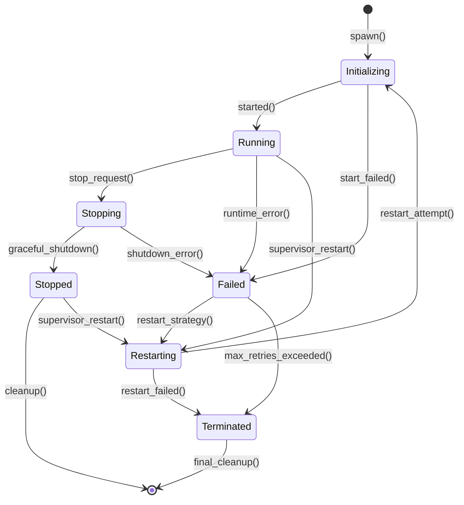

# Alys V2 Actor Lifecycle Management

## Overview

The Alys V2 actor system implements a comprehensive lifecycle management system that handles actor initialization, running state, graceful shutdown, and fault recovery. This document describes the actor lifecycle states, transitions, and management strategies.

## Actor Lifecycle States

### Core States

```rust
#[derive(Debug, Clone, Copy, PartialEq, Eq)]
pub enum ActorState {
    /// Actor is being initialized
    Initializing,
    /// Actor is running normally
    Running,
    /// Actor is stopping gracefully
    Stopping,
    /// Actor has stopped cleanly
    Stopped,
    /// Actor has failed and may restart
    Failed,
    /// Actor is being restarted
    Restarting,
    /// Actor has been terminated permanently
    Terminated,
}
```

### State Transitions



## Actor Trait Implementation

### AlysActor Trait

```rust
use async_trait::async_trait;
use std::time::Duration;

#[async_trait]
pub trait AlysActor: Actor + Send + 'static {
    type Config: Clone + Send + Sync + 'static;
    type Error: std::error::Error + Send + Sync + 'static;
    
    /// Create new actor instance with configuration
    fn new(config: Self::Config) -> Result<Self, Self::Error>
    where
        Self: Sized;
    
    /// Initialize actor resources and dependencies
    async fn initialize(&mut self, ctx: &mut Context<Self>) -> Result<(), Self::Error>;
    
    /// Start actor operations
    async fn started(&mut self, ctx: &mut Context<Self>) -> Result<(), Self::Error>;
    
    /// Handle graceful shutdown
    async fn stopping(&mut self, ctx: &mut Context<Self>) -> Result<(), Self::Error>;
    
    /// Cleanup resources
    async fn stopped(&mut self, ctx: &mut Context<Self>);
    
    /// Health check implementation
    async fn health_check(&self) -> Result<HealthStatus, Self::Error>;
    
    /// Get actor metrics
    fn metrics(&self) -> ActorMetrics;
    
    /// Handle configuration updates
    async fn handle_config_update(&mut self, config: Self::Config) -> Result<(), Self::Error>;
}
```

### Actor Implementation Example

```rust
use actix::prelude::*;
use async_trait::async_trait;

pub struct ChainActor {
    config: ChainConfig,
    state: ChainState,
    engine_actor: Addr<EngineActor>,
    bridge_actor: Addr<BridgeActor>,
    metrics: ChainMetrics,
    health_status: HealthStatus,
}

#[async_trait]
impl AlysActor for ChainActor {
    type Config = ChainConfig;
    type Error = ChainError;
    
    fn new(config: ChainConfig) -> Result<Self, ChainError> {
        Ok(Self {
            config,
            state: ChainState::default(),
            engine_actor: Default::default(), // Set during initialization
            bridge_actor: Default::default(), // Set during initialization
            metrics: ChainMetrics::default(),
            health_status: HealthStatus::Initializing,
        })
    }
    
    async fn initialize(&mut self, ctx: &mut Context<Self>) -> Result<(), ChainError> {
        info!("Initializing ChainActor");
        
        // Connect to dependent actors
        self.engine_actor = EngineActor::start_supervised(
            self.config.engine.clone(),
            ctx.address(),
        ).await?;
        
        self.bridge_actor = BridgeActor::start_supervised(
            self.config.bridge.clone(),
            ctx.address(),
        ).await?;
        
        // Load genesis block
        self.state.load_genesis(&self.config.genesis_path).await?;
        
        // Initialize metrics
        self.metrics.initialize();
        
        self.health_status = HealthStatus::Healthy;
        Ok(())
    }
    
    async fn started(&mut self, ctx: &mut Context<Self>) -> Result<(), ChainError> {
        info!("ChainActor started successfully");
        
        // Start periodic tasks
        self.start_slot_timer(ctx);
        self.start_health_monitor(ctx);
        self.start_metrics_collector(ctx);
        
        // Register with system registry
        SystemRegistry::register_actor("chain", ctx.address()).await;
        
        Ok(())
    }
    
    async fn stopping(&mut self, _ctx: &mut Context<Self>) -> Result<(), ChainError> {
        info!("ChainActor stopping gracefully");
        
        // Complete pending operations
        self.complete_pending_operations().await?;
        
        // Save current state
        self.state.save_checkpoint().await?;
        
        // Stop dependent actors
        self.engine_actor.send(StopActor).await.ok();
        self.bridge_actor.send(StopActor).await.ok();
        
        self.health_status = HealthStatus::Stopping;
        Ok(())
    }
    
    async fn stopped(&mut self, _ctx: &mut Context<Self>) {
        info!("ChainActor stopped");
        
        // Cleanup resources
        self.state.cleanup().await;
        self.metrics.finalize();
        
        // Unregister from system registry
        SystemRegistry::unregister_actor("chain").await.ok();
        
        self.health_status = HealthStatus::Stopped;
    }
    
    async fn health_check(&self) -> Result<HealthStatus, ChainError> {
        // Check actor dependencies
        let engine_health = self.engine_actor
            .send(HealthCheckRequest)
            .await
            .map_err(|_| ChainError::DependencyUnavailable)?;
            
        let bridge_health = self.bridge_actor
            .send(HealthCheckRequest)
            .await
            .map_err(|_| ChainError::DependencyUnavailable)?;
        
        // Aggregate health status
        let overall_health = match (engine_health?, bridge_health?) {
            (HealthStatus::Healthy, HealthStatus::Healthy) => HealthStatus::Healthy,
            (HealthStatus::Degraded, _) | (_, HealthStatus::Degraded) => HealthStatus::Degraded,
            _ => HealthStatus::Unhealthy,
        };
        
        Ok(overall_health)
    }
    
    fn metrics(&self) -> ActorMetrics {
        ActorMetrics {
            messages_processed: self.metrics.messages_processed,
            messages_failed: self.metrics.messages_failed,
            uptime: self.metrics.start_time.elapsed(),
            memory_usage: self.metrics.memory_usage(),
            cpu_usage: self.metrics.cpu_usage(),
            custom: serde_json::json!({
                "blocks_processed": self.metrics.blocks_processed,
                "current_slot": self.state.current_slot,
                "chain_height": self.state.chain_height,
            }),
        }
    }
    
    async fn handle_config_update(&mut self, config: ChainConfig) -> Result<(), ChainError> {
        info!("Updating ChainActor configuration");
        
        // Validate new configuration
        config.validate()?;
        
        // Update configuration hot-reload style
        self.config = config.clone();
        
        // Notify dependent actors of config changes
        self.engine_actor.send(ConfigUpdate { config: config.engine }).await?;
        self.bridge_actor.send(ConfigUpdate { config: config.bridge }).await?;
        
        Ok(())
    }
}
```

## Supervision Strategies

### RestartStrategy Types

```rust
#[derive(Debug, Clone, Copy)]
pub enum RestartStrategy {
    /// Restart immediately
    Immediate {
        max_retries: u32,
        within: Duration,
    },
    /// Restart with exponential backoff
    ExponentialBackoff {
        initial_delay: Duration,
        max_delay: Duration,
        multiplier: f64,
        max_retries: u32,
    },
    /// Circuit breaker pattern
    CircuitBreaker {
        failure_threshold: u32,
        recovery_timeout: Duration,
        success_threshold: u32,
    },
    /// Never restart
    Never,
}
```

### Supervisor Implementation

```rust
pub struct ActorSupervisor<A: AlysActor> {
    config: SupervisorConfig<A>,
    actor_addr: Option<Addr<A>>,
    state: SupervisorState,
    restart_history: VecDeque<SystemTime>,
    circuit_breaker: Option<CircuitBreaker>,
}

impl<A: AlysActor> ActorSupervisor<A> {
    pub async fn start_supervised(&mut self) -> Result<Addr<A>, SupervisorError> {
        match self.state {
            SupervisorState::Stopped => self.start_actor().await,
            SupervisorState::Running => Ok(self.actor_addr.as_ref().unwrap().clone()),
            SupervisorState::Failed => self.restart_actor().await,
            SupervisorState::CircuitOpen => Err(SupervisorError::CircuitOpen),
        }
    }
    
    async fn start_actor(&mut self) -> Result<Addr<A>, SupervisorError> {
        info!(actor = type_name::<A>(), "Starting supervised actor");
        
        // Create actor instance
        let actor = A::new(self.config.actor_config.clone())
            .map_err(SupervisorError::ActorCreationFailed)?;
        
        // Start actor with supervisor context
        let addr = Actor::start_in_arbiter(&Arbiter::current(), |ctx| {
            // Set up supervision
            ctx.set_mailbox_capacity(self.config.mailbox_capacity);
            
            // Initialize actor
            let init_future = actor.initialize(ctx);
            ctx.spawn(async move {
                if let Err(e) = init_future.await {
                    error!("Actor initialization failed: {}", e);
                    // Supervisor will handle the failure
                }
            }.into_actor(&actor));
            
            actor
        });
        
        self.actor_addr = Some(addr.clone());
        self.state = SupervisorState::Running;
        
        Ok(addr)
    }
    
    async fn restart_actor(&mut self) -> Result<Addr<A>, SupervisorError> {
        info!(actor = type_name::<A>(), "Restarting supervised actor");
        
        // Check restart strategy
        match self.config.restart_strategy {
            RestartStrategy::Immediate { max_retries, within } => {
                if !self.should_restart_immediate(max_retries, within) {
                    return Err(SupervisorError::MaxRetriesExceeded);
                }
            }
            RestartStrategy::ExponentialBackoff { .. } => {
                let delay = self.calculate_backoff_delay();
                tokio::time::sleep(delay).await;
            }
            RestartStrategy::CircuitBreaker { .. } => {
                if !self.circuit_breaker_allow_restart() {
                    return Err(SupervisorError::CircuitOpen);
                }
            }
            RestartStrategy::Never => {
                return Err(SupervisorError::RestartDisabled);
            }
        }
        
        // Stop existing actor if still running
        if let Some(addr) = &self.actor_addr {
            addr.send(StopActor).await.ok();
        }
        
        // Record restart attempt
        self.restart_history.push_back(SystemTime::now());
        
        // Start new actor instance
        self.start_actor().await
    }
    
    pub fn handle_actor_failure(&mut self, error: ActorError) {
        error!(
            actor = type_name::<A>(),
            error = %error,
            "Supervised actor failed"
        );
        
        self.state = SupervisorState::Failed;
        
        // Update circuit breaker state
        if let Some(cb) = &mut self.circuit_breaker {
            cb.record_failure();
        }
        
        // Schedule restart based on strategy
        match self.config.restart_strategy {
            RestartStrategy::Never => {
                self.state = SupervisorState::Terminated;
            }
            _ => {
                // Restart will be handled by supervisor loop
            }
        }
    }
}
```

## Health Monitoring

### Health Status Types

```rust
#[derive(Debug, Clone, Copy, PartialEq, Eq)]
pub enum HealthStatus {
    /// Actor is initializing
    Initializing,
    /// Actor is healthy and operational
    Healthy,
    /// Actor is operational but degraded
    Degraded,
    /// Actor is unhealthy but may recover
    Unhealthy,
    /// Actor is stopping
    Stopping,
    /// Actor has stopped
    Stopped,
}
```

### Health Monitor Implementation

```rust
pub struct ActorHealthMonitor {
    checks: HashMap<String, Box<dyn HealthCheck>>,
    status_history: VecDeque<(SystemTime, HealthStatus)>,
    alert_thresholds: HealthThresholds,
}

impl ActorHealthMonitor {
    pub async fn check_health(&mut self) -> HealthStatus {
        let mut results = Vec::new();
        
        // Run all health checks
        for (name, check) in &self.checks {
            match check.check().await {
                Ok(status) => {
                    results.push(status);
                    debug!(check = name, status = ?status, "Health check passed");
                }
                Err(e) => {
                    results.push(HealthStatus::Unhealthy);
                    warn!(check = name, error = %e, "Health check failed");
                }
            }
        }
        
        // Aggregate results
        let overall_status = self.aggregate_health_status(&results);
        
        // Record status history
        self.status_history.push_back((SystemTime::now(), overall_status));
        if self.status_history.len() > 100 {
            self.status_history.pop_front();
        }
        
        overall_status
    }
    
    fn aggregate_health_status(&self, results: &[HealthStatus]) -> HealthStatus {
        if results.is_empty() {
            return HealthStatus::Unhealthy;
        }
        
        let unhealthy_count = results.iter()
            .filter(|&s| *s == HealthStatus::Unhealthy)
            .count();
        let degraded_count = results.iter()
            .filter(|&s| *s == HealthStatus::Degraded)
            .count();
        
        let unhealthy_ratio = unhealthy_count as f64 / results.len() as f64;
        let degraded_ratio = degraded_count as f64 / results.len() as f64;
        
        if unhealthy_ratio >= self.alert_thresholds.unhealthy_threshold {
            HealthStatus::Unhealthy
        } else if degraded_ratio >= self.alert_thresholds.degraded_threshold {
            HealthStatus::Degraded
        } else {
            HealthStatus::Healthy
        }
    }
}
```

## Configuration Hot-Reload

### Configuration Management

```rust
pub struct ConfigurationManager<T: Clone + Send + Sync + 'static> {
    current_config: Arc<RwLock<T>>,
    watchers: Vec<ConfigWatcher>,
    subscribers: HashMap<ActorId, Addr<dyn ConfigUpdateHandler<T>>>,
}

impl<T: Clone + Send + Sync + 'static> ConfigurationManager<T> {
    pub async fn update_config(&self, new_config: T) -> Result<(), ConfigError> {
        // Validate configuration
        self.validate_config(&new_config).await?;
        
        // Update current configuration
        {
            let mut config = self.current_config.write().await;
            *config = new_config.clone();
        }
        
        // Notify all subscribers
        let mut update_futures = Vec::new();
        for (actor_id, subscriber) in &self.subscribers {
            let update_future = subscriber.send(ConfigUpdateMessage {
                config: new_config.clone(),
            });
            update_futures.push((actor_id.clone(), update_future));
        }
        
        // Wait for all updates to complete
        for (actor_id, future) in update_futures {
            match future.await {
                Ok(Ok(())) => {
                    debug!(actor = %actor_id, "Configuration update successful");
                }
                Ok(Err(e)) => {
                    error!(actor = %actor_id, error = %e, "Configuration update failed");
                    // Could implement rollback strategy here
                }
                Err(e) => {
                    error!(actor = %actor_id, error = %e, "Failed to send configuration update");
                }
            }
        }
        
        Ok(())
    }
}
```

## Graceful Shutdown

### Shutdown Coordinator

```rust
pub struct ShutdownCoordinator {
    actors: HashMap<String, ActorShutdownInfo>,
    shutdown_order: Vec<String>,
    shutdown_timeout: Duration,
    force_kill_timeout: Duration,
}

impl ShutdownCoordinator {
    pub async fn shutdown_system(&mut self) -> Result<(), ShutdownError> {
        info!("Starting graceful system shutdown");
        
        // Phase 1: Signal all actors to stop accepting new work
        self.signal_shutdown_preparation().await;
        
        // Phase 2: Shutdown actors in reverse dependency order
        for actor_name in self.shutdown_order.iter().rev() {
            if let Some(actor_info) = self.actors.get(actor_name) {
                self.shutdown_actor_gracefully(actor_info).await?;
            }
        }
        
        // Phase 3: Force kill any remaining actors
        self.force_kill_remaining_actors().await;
        
        info!("System shutdown completed");
        Ok(())
    }
    
    async fn shutdown_actor_gracefully(
        &self, 
        actor_info: &ActorShutdownInfo
    ) -> Result<(), ShutdownError> {
        info!(actor = %actor_info.name, "Shutting down actor gracefully");
        
        // Send shutdown signal
        let shutdown_future = actor_info.addr.send(ShutdownSignal {
            graceful: true,
            timeout: self.shutdown_timeout,
        });
        
        // Wait for graceful shutdown or timeout
        match tokio::time::timeout(self.shutdown_timeout, shutdown_future).await {
            Ok(Ok(())) => {
                info!(actor = %actor_info.name, "Actor shutdown successfully");
                Ok(())
            }
            Ok(Err(e)) => {
                warn!(
                    actor = %actor_info.name,
                    error = %e,
                    "Actor shutdown failed, will force kill"
                );
                self.force_kill_actor(actor_info).await
            }
            Err(_) => {
                warn!(
                    actor = %actor_info.name,
                    timeout = ?self.shutdown_timeout,
                    "Actor shutdown timed out, will force kill"
                );
                self.force_kill_actor(actor_info).await
            }
        }
    }
}
```

## Metrics and Observability

### Actor Metrics Collection

```rust
#[derive(Debug, Clone)]
pub struct ActorMetrics {
    pub actor_name: String,
    pub actor_id: String,
    pub state: ActorState,
    pub uptime: Duration,
    pub messages_processed: u64,
    pub messages_failed: u64,
    pub message_rate: f64,
    pub error_rate: f64,
    pub memory_usage: u64,
    pub cpu_usage: f64,
    pub custom: serde_json::Value,
}

pub struct MetricsCollector {
    metrics_store: HashMap<String, ActorMetrics>,
    exporters: Vec<Box<dyn MetricsExporter>>,
}

impl MetricsCollector {
    pub async fn collect_actor_metrics(&mut self, actor: &dyn AlysActor) {
        let metrics = actor.metrics();
        self.metrics_store.insert(metrics.actor_id.clone(), metrics.clone());
        
        // Export to configured exporters
        for exporter in &self.exporters {
            exporter.export_metrics(&metrics).await.ok();
        }
    }
}
```

This comprehensive lifecycle management system provides:

- **Predictable State Management**: Clear state transitions and lifecycle hooks
- **Fault Tolerance**: Multiple restart strategies and circuit breakers
- **Health Monitoring**: Comprehensive health checks and status tracking
- **Configuration Management**: Hot-reload without service interruption
- **Graceful Shutdown**: Ordered shutdown with proper cleanup
- **Observability**: Detailed metrics and monitoring capabilities
- **Resource Management**: Proper resource allocation and cleanup