# Alys V2 Actor Communication Flow Diagrams

## System Overview Architecture

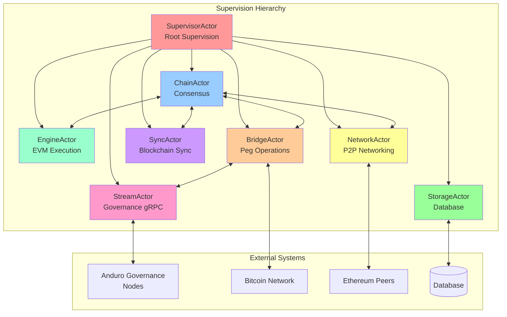

## 1. Block Production Flow

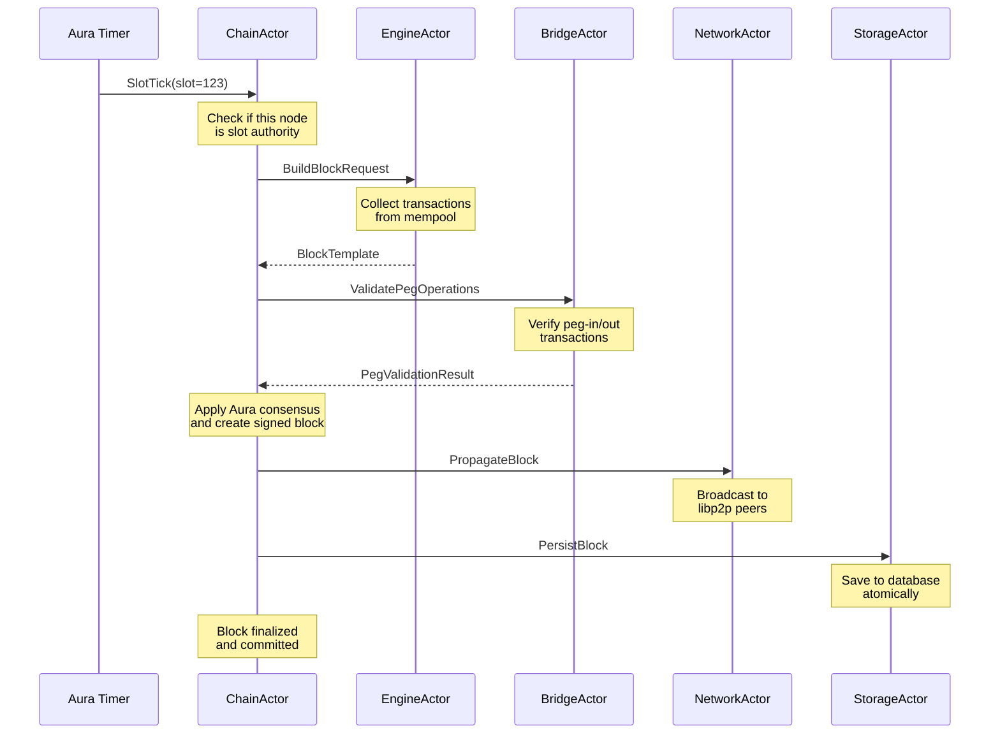

## 2. Bitcoin Peg-In Operation Flow

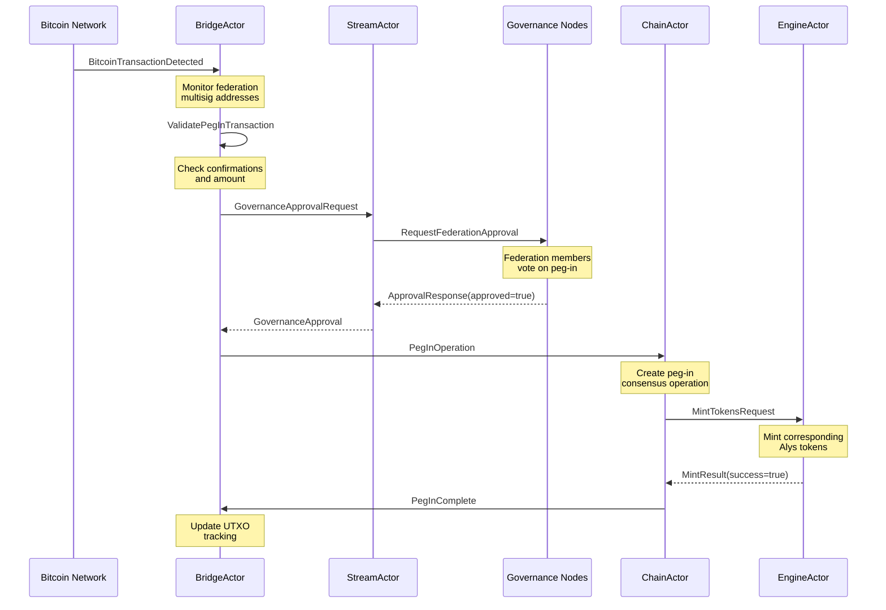

## 3. Ethereum Peg-Out Operation Flow

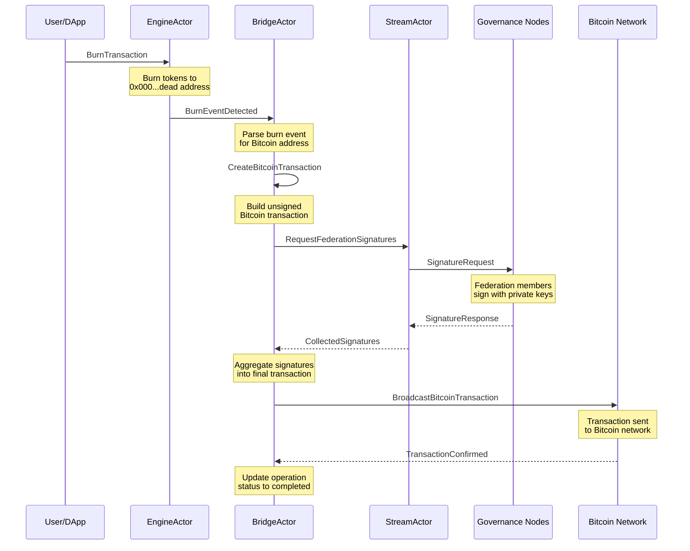

## 4. Blockchain Sync Recovery Flow

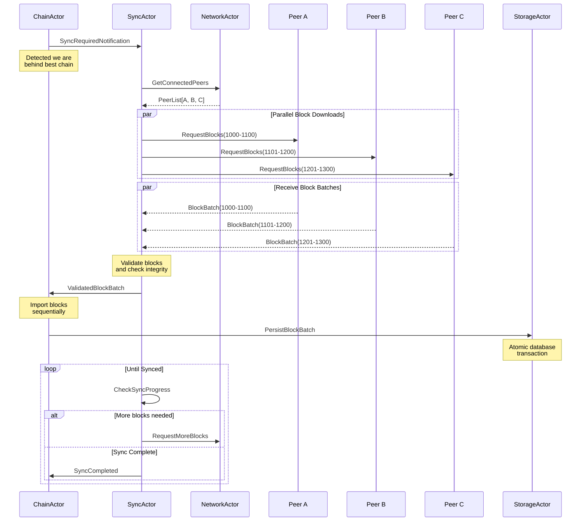

## 5. Governance Message Routing

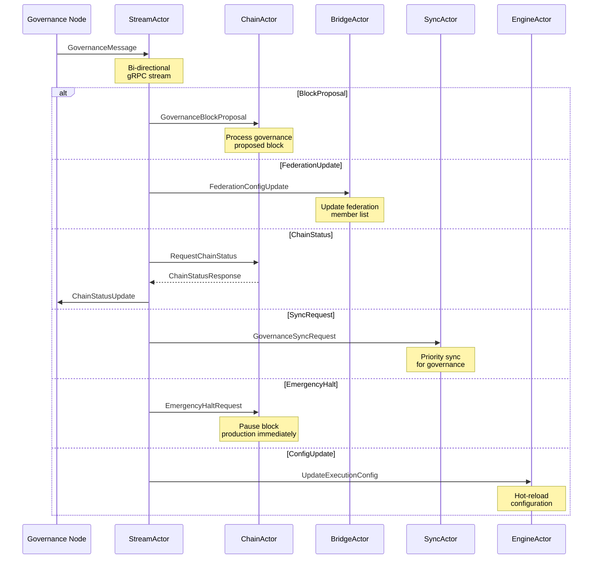

## 6. Actor Supervision and Fault Recovery

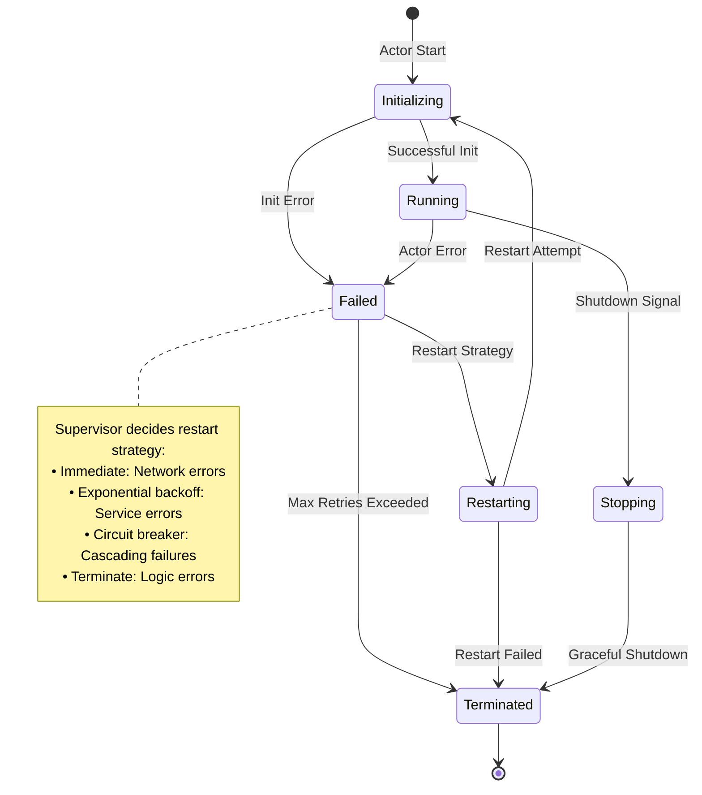

## 7. Message Type Categories

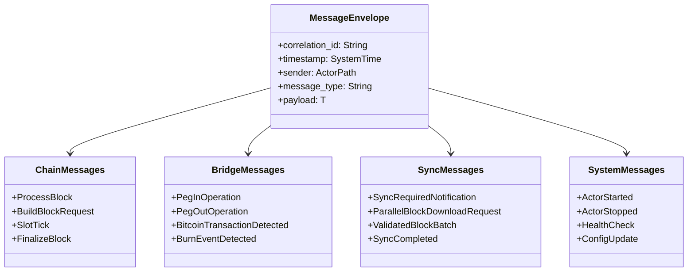

## 8. Actor State Machines

### ChainActor State Machine
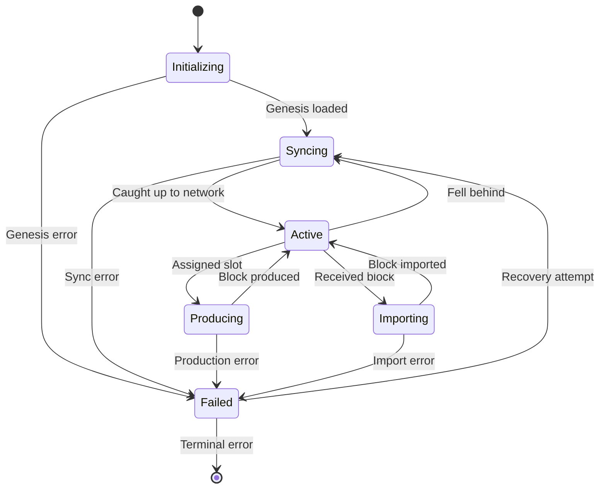

### BridgeActor State Machine
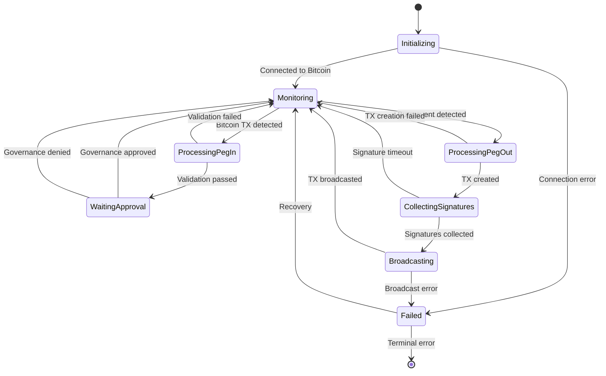

## Performance Characteristics

### Message Throughput Targets
- **ChainActor**: 1,000 messages/second (block production)
- **NetworkActor**: 10,000 messages/second (peer communication)  
- **BridgeActor**: 100 messages/second (peg operations)
- **SyncActor**: 5,000 messages/second (sync operations)
- **StorageActor**: 2,000 messages/second (database ops)

### Latency Requirements
- **Intra-actor messaging**: <1ms p99
- **Cross-actor messaging**: <5ms p99
- **External system calls**: <100ms p99
- **Database operations**: <10ms p99

### Backpressure Management
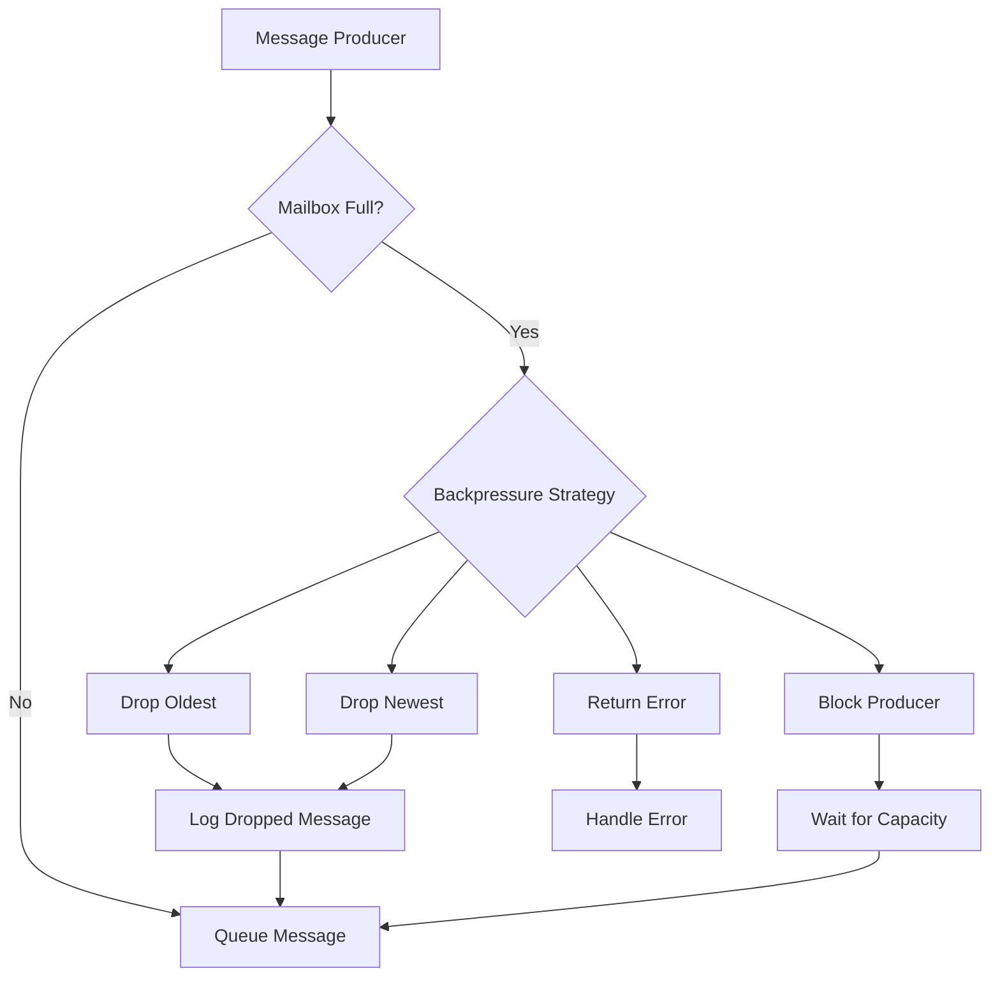

This communication flow architecture ensures:
- **Fault Isolation**: Actor failures don't cascade
- **Scalability**: Parallel message processing  
- **Maintainability**: Clear component boundaries
- **Observability**: Full message tracing and metrics
- **Reliability**: Comprehensive error handling and recovery