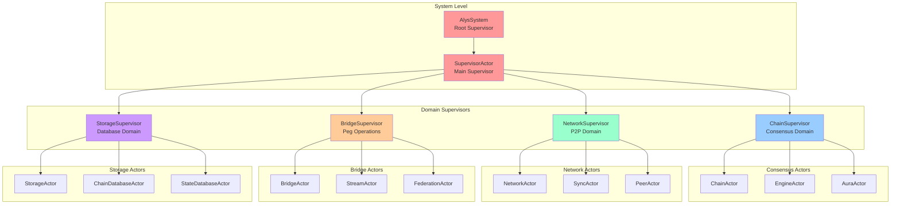
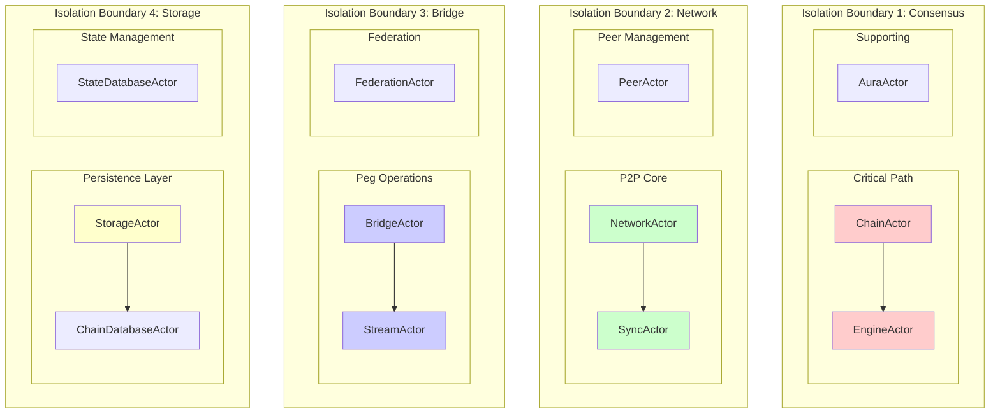

# Alys V2 Actor Supervision Hierarchy

## Overview

The Alys V2 actor system implements a hierarchical supervision tree that provides fault tolerance, automatic recovery, and system resilience. This document describes the supervision architecture, restart strategies, and fault isolation boundaries.

## Supervision Tree Structure

### Root Supervision Hierarchy



### Fault Isolation Boundaries



## Supervision Strategies

### Restart Strategy Implementation

```rust
use std::time::{Duration, SystemTime};
use serde::{Deserialize, Serialize};

/// Supervision restart strategies
#[derive(Debug, Clone, Serialize, Deserialize)]
pub enum RestartStrategy {
    /// Restart immediately on failure
    OneForOne {
        max_retries: u32,
        within_time: Duration,
    },
    /// Restart failed actor and all siblings
    OneForAll {
        max_retries: u32,
        within_time: Duration,
    },
    /// Restart failed actor and actors started after it
    RestForOne {
        max_retries: u32,
        within_time: Duration,
    },
    /// Custom restart logic
    Custom {
        strategy_name: String,
        parameters: serde_json::Value,
    },
}

/// Supervision escalation strategies
#[derive(Debug, Clone, Serialize, Deserialize)]
pub enum EscalationStrategy {
    /// Escalate to parent supervisor
    Escalate,
    /// Stop the failing subtree
    Stop,
    /// Resume with degraded functionality
    Resume,
    /// Restart entire subtree
    RestartSubtree,
}

/// Supervision decision based on error type
#[derive(Debug, Clone)]
pub enum SupervisionDecision {
    /// Restart the failed actor
    Restart,
    /// Resume the actor (ignore failure)
    Resume,
    /// Stop the actor
    Stop,
    /// Escalate to parent supervisor
    Escalate,
}
```

### SupervisorActor Implementation

```rust
use actix::prelude::*;
use std::collections::HashMap;
use tracing::{error, info, warn};

pub struct SupervisorActor {
    config: SupervisorConfig,
    supervised_actors: HashMap<String, SupervisedActor>,
    restart_history: HashMap<String, RestartHistory>,
    health_monitor: HealthMonitor,
    metrics: SupervisorMetrics,
}

#[derive(Debug, Clone)]
pub struct SupervisedActor {
    pub name: String,
    pub actor_type: String,
    pub address: Recipient<SupervisionMessage>,
    pub restart_strategy: RestartStrategy,
    pub escalation_strategy: EscalationStrategy,
    pub health_check_interval: Duration,
    pub last_health_check: Option<SystemTime>,
    pub current_state: ActorState,
}

#[derive(Debug, Clone)]
pub struct RestartHistory {
    pub attempts: Vec<SystemTime>,
    pub last_success: Option<SystemTime>,
    pub consecutive_failures: u32,
}

impl Actor for SupervisorActor {
    type Context = Context<Self>;
    
    fn started(&mut self, ctx: &mut Self::Context) {
        info!("SupervisorActor started");
        
        // Start health monitoring
        self.start_health_monitoring(ctx);
        
        // Start supervised actors
        self.start_all_supervised_actors(ctx);
        
        // Schedule periodic tasks
        self.schedule_periodic_tasks(ctx);
    }
    
    fn stopping(&mut self, _ctx: &mut Self::Context) -> Running {
        info!("SupervisorActor stopping - shutting down supervised actors");
        
        // Gracefully stop all supervised actors
        self.stop_all_supervised_actors();
        
        Running::Stop
    }
}

impl SupervisorActor {
    pub fn new(config: SupervisorConfig) -> Self {
        Self {
            config,
            supervised_actors: HashMap::new(),
            restart_history: HashMap::new(),
            health_monitor: HealthMonitor::new(),
            metrics: SupervisorMetrics::default(),
        }
    }
    
    pub fn supervise_actor<A: AlysActor>(
        &mut self,
        name: String,
        config: A::Config,
        restart_strategy: RestartStrategy,
    ) -> Result<(), SupervisorError> {
        info!(actor = %name, "Adding actor to supervision");
        
        let supervised_actor = SupervisedActor {
            name: name.clone(),
            actor_type: std::any::type_name::<A>().to_string(),
            address: Recipient::new(), // Will be set when actor starts
            restart_strategy,
            escalation_strategy: EscalationStrategy::Escalate,
            health_check_interval: Duration::from_secs(30),
            last_health_check: None,
            current_state: ActorState::Initializing,
        };
        
        self.supervised_actors.insert(name.clone(), supervised_actor);
        self.restart_history.insert(name, RestartHistory {
            attempts: Vec::new(),
            last_success: None,
            consecutive_failures: 0,
        });
        
        Ok(())
    }
    
    fn start_all_supervised_actors(&mut self, ctx: &mut Context<Self>) {
        for (name, actor) in &mut self.supervised_actors {
            if let Err(e) = self.start_supervised_actor(name, ctx) {
                error!(
                    actor = %name,
                    error = %e,
                    "Failed to start supervised actor"
                );
            }
        }
    }
    
    fn start_supervised_actor(
        &mut self,
        actor_name: &str,
        ctx: &mut Context<Self>,
    ) -> Result<(), SupervisorError> {
        let supervised_actor = self.supervised_actors.get_mut(actor_name)
            .ok_or(SupervisorError::ActorNotFound)?;
        
        info!(actor = %actor_name, "Starting supervised actor");
        
        // TODO: Start actual actor based on type
        // This would use a factory pattern to create actors of different types
        
        supervised_actor.current_state = ActorState::Running;
        Ok(())
    }
    
    fn handle_actor_failure(
        &mut self,
        actor_name: &str,
        error: ActorError,
        ctx: &mut Context<Self>,
    ) {
        error!(
            actor = %actor_name,
            error = %error,
            "Supervised actor failed"
        );
        
        self.metrics.failures += 1;
        
        let decision = self.make_supervision_decision(actor_name, &error);
        
        match decision {
            SupervisionDecision::Restart => {
                self.restart_actor(actor_name, ctx);
            }
            SupervisionDecision::Resume => {
                warn!(actor = %actor_name, "Resuming failed actor");
            }
            SupervisionDecision::Stop => {
                self.stop_actor(actor_name);
            }
            SupervisionDecision::Escalate => {
                self.escalate_failure(actor_name, error);
            }
        }
    }
    
    fn make_supervision_decision(
        &self,
        actor_name: &str,
        error: &ActorError,
    ) -> SupervisionDecision {
        // Check restart limits
        if let Some(history) = self.restart_history.get(actor_name) {
            if history.consecutive_failures >= self.config.max_consecutive_failures {
                return SupervisionDecision::Stop;
            }
        }
        
        // Make decision based on error type
        match error {
            ActorError::Configuration(_) => SupervisionDecision::Stop,
            ActorError::Network(_) => SupervisionDecision::Restart,
            ActorError::Database(_) => SupervisionDecision::Restart,
            ActorError::Logic(_) => SupervisionDecision::Escalate,
            ActorError::Timeout(_) => SupervisionDecision::Resume,
            ActorError::Resource(_) => SupervisionDecision::Restart,
            _ => SupervisionDecision::Restart,
        }
    }
    
    fn restart_actor(&mut self, actor_name: &str, ctx: &mut Context<Self>) {
        info!(actor = %actor_name, "Restarting failed actor");
        
        // Update restart history
        if let Some(history) = self.restart_history.get_mut(actor_name) {
            history.attempts.push(SystemTime::now());
            history.consecutive_failures += 1;
        }
        
        // Get restart strategy
        let restart_strategy = self.supervised_actors
            .get(actor_name)
            .map(|a| a.restart_strategy.clone())
            .unwrap_or_else(|| RestartStrategy::OneForOne {
                max_retries: 3,
                within_time: Duration::from_secs(60),
            });
        
        match restart_strategy {
            RestartStrategy::OneForOne { max_retries, within_time } => {
                if self.should_restart(actor_name, max_retries, within_time) {
                    self.restart_single_actor(actor_name, ctx);
                } else {
                    warn!(actor = %actor_name, "Max restart attempts exceeded");
                    self.stop_actor(actor_name);
                }
            }
            RestartStrategy::OneForAll { max_retries, within_time } => {
                if self.should_restart(actor_name, max_retries, within_time) {
                    self.restart_all_actors(ctx);
                } else {
                    warn!("Max restart attempts exceeded - stopping all actors");
                    self.stop_all_supervised_actors();
                }
            }
            RestartStrategy::RestForOne { max_retries, within_time } => {
                if self.should_restart(actor_name, max_retries, within_time) {
                    self.restart_actor_and_dependents(actor_name, ctx);
                } else {
                    self.stop_actor_and_dependents(actor_name);
                }
            }
            RestartStrategy::Custom { strategy_name, parameters } => {
                self.apply_custom_restart_strategy(&strategy_name, parameters, actor_name, ctx);
            }
        }
        
        self.metrics.restarts += 1;
    }
    
    fn should_restart(
        &self,
        actor_name: &str,
        max_retries: u32,
        within_time: Duration,
    ) -> bool {
        if let Some(history) = self.restart_history.get(actor_name) {
            let now = SystemTime::now();
            let recent_attempts = history.attempts.iter()
                .filter(|&&attempt_time| {
                    now.duration_since(attempt_time)
                        .map(|d| d <= within_time)
                        .unwrap_or(false)
                })
                .count();
                
            recent_attempts < max_retries as usize
        } else {
            true
        }
    }
    
    fn start_health_monitoring(&mut self, ctx: &mut Context<Self>) {
        ctx.run_interval(Duration::from_secs(30), |actor, ctx| {
            actor.check_all_actor_health(ctx);
        });
    }
    
    fn check_all_actor_health(&mut self, _ctx: &mut Context<Self>) {
        for (name, supervised_actor) in &mut self.supervised_actors {
            if supervised_actor.current_state == ActorState::Running {
                // Send health check message
                // This would be implemented with actual health check logic
                
                supervised_actor.last_health_check = Some(SystemTime::now());
            }
        }
    }
}
```

## Domain-Specific Supervisors

### ChainSupervisor

```rust
pub struct ChainSupervisor {
    config: ChainSupervisorConfig,
    chain_actor: Option<Addr<ChainActor>>,
    engine_actor: Option<Addr<EngineActor>>,
    aura_actor: Option<Addr<AuraActor>>,
    state: ChainSupervisorState,
}

impl ChainSupervisor {
    pub fn new(config: ChainSupervisorConfig) -> Self {
        Self {
            config,
            chain_actor: None,
            engine_actor: None,
            aura_actor: None,
            state: ChainSupervisorState::Initializing,
        }
    }
    
    async fn start_consensus_actors(&mut self) -> Result<(), ChainSupervisorError> {
        info!("Starting consensus domain actors");
        
        // Start EngineActor first (dependency of ChainActor)
        self.engine_actor = Some(
            EngineActor::start_supervised(self.config.engine.clone()).await?
        );
        
        // Start AuraActor
        self.aura_actor = Some(
            AuraActor::start_supervised(self.config.aura.clone()).await?
        );
        
        // Start ChainActor last (depends on others)
        self.chain_actor = Some(
            ChainActor::start_supervised(
                self.config.chain.clone(),
                self.engine_actor.as_ref().unwrap().clone(),
                self.aura_actor.as_ref().unwrap().clone(),
            ).await?
        );
        
        self.state = ChainSupervisorState::Running;
        Ok(())
    }
    
    fn handle_chain_actor_failure(&mut self, error: ChainError) -> SupervisionDecision {
        match error {
            ChainError::ExecutionClientUnavailable => {
                // Restart EngineActor first, then ChainActor
                SupervisionDecision::Restart
            }
            ChainError::ConsensusFailure => {
                // This is critical - escalate to system supervisor
                SupervisionDecision::Escalate
            }
            ChainError::BlockValidationFailed => {
                // Temporary issue - resume operation
                SupervisionDecision::Resume
            }
            _ => SupervisionDecision::Restart,
        }
    }
}
```

### NetworkSupervisor

```rust
pub struct NetworkSupervisor {
    config: NetworkSupervisorConfig,
    network_actor: Option<Addr<NetworkActor>>,
    sync_actor: Option<Addr<SyncActor>>,
    peer_actors: HashMap<String, Addr<PeerActor>>,
    connection_manager: ConnectionManager,
}

impl NetworkSupervisor {
    fn handle_network_partition(&mut self) -> SupervisionDecision {
        warn!("Network partition detected - implementing recovery strategy");
        
        // Stop all peer actors
        for (peer_id, peer_actor) in &self.peer_actors {
            peer_actor.do_send(StopActor);
        }
        self.peer_actors.clear();
        
        // Restart network discovery
        self.connection_manager.restart_discovery();
        
        SupervisionDecision::Restart
    }
    
    fn handle_sync_failure(&mut self, error: SyncError) -> SupervisionDecision {
        match error {
            SyncError::PeerUnavailable => {
                // Find alternative peers
                self.connection_manager.find_alternative_peers();
                SupervisionDecision::Restart
            }
            SyncError::InvalidBlockReceived => {
                // Blacklist peer and continue
                SupervisionDecision::Resume
            }
            SyncError::ConsensusConflict => {
                // Fork detected - escalate for chain reorganization
                SupervisionDecision::Escalate
            }
            _ => SupervisionDecision::Restart,
        }
    }
}
```

### BridgeSupervisor

```rust
pub struct BridgeSupervisor {
    config: BridgeSupervisorConfig,
    bridge_actor: Option<Addr<BridgeActor>>,
    stream_actor: Option<Addr<StreamActor>>,
    federation_actor: Option<Addr<FederationActor>>,
    emergency_mode: bool,
}

impl BridgeSupervisor {
    fn handle_federation_failure(&mut self, error: FederationError) -> SupervisionDecision {
        match error {
            FederationError::KeyManagementFailure => {
                // Critical security issue - trigger emergency mode
                self.trigger_emergency_mode("Federation key management failure");
                SupervisionDecision::Stop
            }
            FederationError::ConsensusTimeout => {
                // Governance connectivity issue - restart
                SupervisionDecision::Restart
            }
            FederationError::InsufficientSignatures => {
                // Normal federation operation issue - resume
                SupervisionDecision::Resume
            }
            _ => SupervisionDecision::Restart,
        }
    }
    
    fn trigger_emergency_mode(&mut self, reason: &str) {
        error!(reason = reason, "Triggering bridge emergency mode");
        
        self.emergency_mode = true;
        
        // Stop all peg operations
        if let Some(bridge_actor) = &self.bridge_actor {
            bridge_actor.do_send(EmergencyHalt {
                reason: reason.to_string(),
            });
        }
        
        // Notify governance
        if let Some(stream_actor) = &self.stream_actor {
            stream_actor.do_send(EmergencyNotification {
                severity: EmergencySeverity::Critical,
                message: reason.to_string(),
            });
        }
    }
}
```

## Error Classification and Response

### Error Categories

```rust
#[derive(Debug, Clone)]
pub enum ErrorSeverity {
    /// Low impact, automatic recovery
    Low,
    /// Medium impact, restart recommended
    Medium,
    /// High impact, escalation required
    High,
    /// Critical system failure
    Critical,
}

#[derive(Debug, Clone)]
pub enum ErrorCategory {
    /// Temporary network issues
    Network(NetworkErrorType),
    /// Database connectivity/corruption
    Database(DatabaseErrorType),
    /// Configuration errors
    Configuration(ConfigErrorType),
    /// Resource exhaustion
    Resource(ResourceErrorType),
    /// Logic/business rule violations
    Logic(LogicErrorType),
    /// External system failures
    External(ExternalErrorType),
}

impl ErrorCategory {
    pub fn severity(&self) -> ErrorSeverity {
        match self {
            ErrorCategory::Network(NetworkErrorType::ConnectionTimeout) => ErrorSeverity::Low,
            ErrorCategory::Network(NetworkErrorType::PeerDisconnected) => ErrorSeverity::Low,
            ErrorCategory::Network(NetworkErrorType::ProtocolViolation) => ErrorSeverity::Medium,
            
            ErrorCategory::Database(DatabaseErrorType::ConnectionLost) => ErrorSeverity::Medium,
            ErrorCategory::Database(DatabaseErrorType::Corruption) => ErrorSeverity::Critical,
            
            ErrorCategory::Configuration(_) => ErrorSeverity::High,
            
            ErrorCategory::Resource(ResourceErrorType::OutOfMemory) => ErrorSeverity::Critical,
            ErrorCategory::Resource(ResourceErrorType::DiskFull) => ErrorSeverity::High,
            
            ErrorCategory::Logic(_) => ErrorSeverity::High,
            
            ErrorCategory::External(ExternalErrorType::BitcoinNodeDown) => ErrorSeverity::High,
            ErrorCategory::External(ExternalErrorType::GovernanceUnavailable) => ErrorSeverity::Medium,
        }
    }
    
    pub fn recommended_action(&self) -> SupervisionDecision {
        match (self, self.severity()) {
            (_, ErrorSeverity::Low) => SupervisionDecision::Resume,
            (_, ErrorSeverity::Medium) => SupervisionDecision::Restart,
            (_, ErrorSeverity::High) => SupervisionDecision::Escalate,
            (_, ErrorSeverity::Critical) => SupervisionDecision::Stop,
        }
    }
}
```

## Metrics and Monitoring

### Supervision Metrics

```rust
#[derive(Debug, Default, Clone)]
pub struct SupervisorMetrics {
    pub actors_started: u64,
    pub actors_stopped: u64,
    pub failures: u64,
    pub restarts: u64,
    pub escalations: u64,
    pub health_checks: u64,
    pub health_check_failures: u64,
    pub uptime: Duration,
    pub last_restart: Option<SystemTime>,
    pub error_rates: HashMap<String, f64>,
}

impl SupervisorMetrics {
    pub fn failure_rate(&self, actor_type: &str) -> f64 {
        self.error_rates.get(actor_type).copied().unwrap_or(0.0)
    }
    
    pub fn overall_health_score(&self) -> f64 {
        if self.health_checks == 0 {
            return 0.0;
        }
        
        let success_rate = 1.0 - (self.health_check_failures as f64 / self.health_checks as f64);
        let stability_factor = if self.restarts > 0 {
            1.0 / (1.0 + self.restarts as f64 / 100.0)
        } else {
            1.0
        };
        
        success_rate * stability_factor
    }
}
```

### Health Dashboard

```rust
pub struct SupervisionDashboard {
    supervisors: HashMap<String, SupervisorMetrics>,
    alert_thresholds: AlertThresholds,
    notification_channels: Vec<Box<dyn NotificationChannel>>,
}

impl SupervisionDashboard {
    pub async fn check_system_health(&mut self) -> SystemHealthReport {
        let mut report = SystemHealthReport::default();
        
        for (name, metrics) in &self.supervisors {
            let health_score = metrics.overall_health_score();
            
            if health_score < self.alert_thresholds.critical {
                report.critical_issues.push(format!(
                    "Supervisor {} health score: {:.2}", name, health_score
                ));
            } else if health_score < self.alert_thresholds.warning {
                report.warnings.push(format!(
                    "Supervisor {} health degraded: {:.2}", name, health_score
                ));
            }
            
            report.overall_health = report.overall_health.min(health_score);
        }
        
        // Send alerts if necessary
        if !report.critical_issues.is_empty() {
            self.send_critical_alert(&report).await;
        }
        
        report
    }
}
```

This supervision hierarchy provides:

- **Fault Isolation**: Failures contained within domain boundaries
- **Automatic Recovery**: Multiple restart strategies based on error types
- **Escalation Paths**: Clear escalation for unrecoverable failures
- **Health Monitoring**: Continuous health checks and alerting
- **Emergency Procedures**: Coordinated emergency response
- **Metrics and Observability**: Comprehensive supervision metrics
- **Configuration Management**: Hot-reload of supervision policies