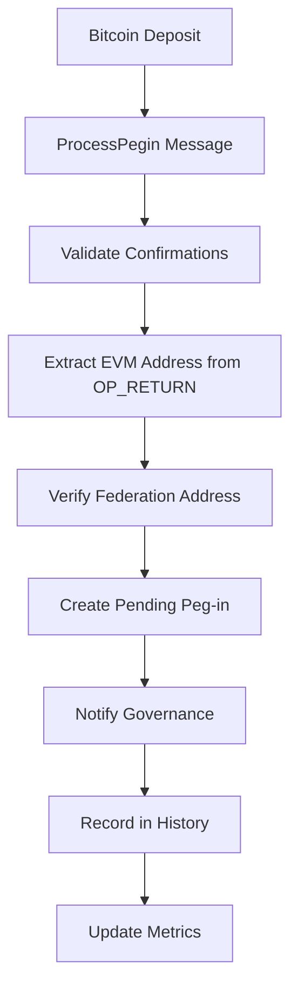
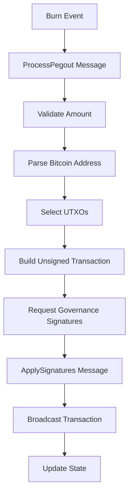

# BridgeActor Implementation Documentation

## Overview

The BridgeActor is a critical component of the Alys V2 sidechain architecture, implementing comprehensive peg-in and peg-out operations between Bitcoin mainnet and the Alys sidechain. This implementation follows the actor model pattern with message-driven architecture, ensuring thread-safe operations without shared mutable state.

## Architecture

### Core Components

```
┌─────────────────────────────────────────────────────────────┐
│                      BridgeActor                           │
├─────────────────────────────────────────────────────────────┤
│  Message Types    │  Core Logic      │  Supporting Systems │
│  - ProcessPegin   │  - Peg-in Flow   │  - UTXO Manager     │
│  - ProcessPegout  │  - Peg-out Flow  │  - Metrics          │
│  - ApplySignatures│  - Transaction   │  - Error Handling   │
│  - GetStatus      │    Building      │  - Operation History│
└─────────────────────────────────────────────────────────────┘
```

### Key Features

1. **Message-Driven Architecture**: All operations are handled through Actix messages
2. **UTXO Management**: Sophisticated Bitcoin UTXO selection and management
3. **Governance Integration**: Seamless communication with StreamActor for signatures
4. **Comprehensive Metrics**: Prometheus metrics for monitoring and alerting
5. **Error Recovery**: Automatic retry logic and failure handling
6. **Property-Based Testing**: Extensive test coverage with PropTest generators

## Implementation Details

### Message Protocol

The BridgeActor implements a comprehensive message protocol supporting all bridge operations:

```rust
// Core operation messages
ProcessPegin         // Process incoming Bitcoin deposits
ProcessPegout        // Process outgoing Bitcoin withdrawals
ApplySignatures      // Apply governance signatures to transactions

// Query messages
GetPendingPegins     // Retrieve pending peg-in operations
GetPendingPegouts    // Retrieve pending peg-out operations
GetOperationStatus   // Get status of specific operation
GetBridgeStats       // Retrieve comprehensive bridge statistics

// Management messages
UpdateFederationAddress  // Update federation multisig address
RefreshUtxos            // Refresh UTXO set from Bitcoin node
RetryFailedOperations   // Retry failed operations
```

### Peg-in Flow



**Key Validation Steps:**
1. Minimum confirmation requirement (configurable, default: 6)
2. OP_RETURN data extraction for EVM address mapping
3. Federation address verification
4. Duplicate transaction detection
5. Amount validation

### Peg-out Flow



**UTXO Selection Strategy:**
- Greedy selection algorithm (largest-first by default)
- Support for multiple selection strategies:
  - `LargestFirst`: Minimize transaction size
  - `SmallestFirst`: Consolidate small UTXOs
  - `ExactMatch`: Minimize change output
  - `BranchAndBound`: Optimal selection (simplified)

### Error Handling

The implementation provides comprehensive error handling with categorized error types:

```rust
pub enum BridgeError {
    // Validation errors
    InsufficientConfirmations { got: u32, required: u32 },
    InvalidDepositAddress { expected: String, got: String },
    AmountTooLarge { amount: u64, max: u64 },
    
    // Operation errors
    InsufficientFunds { needed: u64, available: u64 },
    UtxoSelectionFailed(String),
    TransactionBuildingFailed(String),
    
    // External service errors
    BitcoinRpcError(String),
    GovernanceError(String),
    
    // System errors
    InternalError(String),
    TimeoutError { seconds: u64 },
}
```

**Error Recovery Features:**
- Automatic retry logic for transient errors
- Configurable retry limits and delays
- Error severity classification for alerting
- Graceful degradation under failure conditions

## Testing Strategy

### Test Coverage

The implementation includes comprehensive testing across multiple dimensions:

#### Unit Tests (`unit_tests.rs`)
- Message handling validation
- Error condition testing
- Business logic verification
- State management testing

#### Integration Tests (`integration_tests.rs`)
- End-to-end peg-in/peg-out flows
- Bitcoin RPC integration
- UTXO management workflows
- Governance communication

#### Property-Based Tests (`property_tests.rs`)
- Amount handling across value ranges
- Request ID uniqueness validation
- Confirmation threshold properties
- Address validation properties
- Idempotency guarantees

#### Performance Tests (`performance_tests.rs`)
- Throughput benchmarks
- Concurrent operation handling
- Memory usage profiling
- Latency measurements

#### Chaos Engineering Tests (`chaos_tests.rs`)
- Network partition resilience
- Resource exhaustion handling
- Message corruption recovery
- Configuration change adaptation

### Test Utilities

```rust
pub struct TestFixture {
    pub bridge_actor: Addr<BridgeActor>,
    pub config: BridgeConfig,
    pub federation_address: BtcAddress,
    pub test_bitcoin_rpc: Arc<MockBitcoinRpc>,
}

pub struct ActorTestHarness {
    system: actix::System,
    fixture: TestFixture,
}
```

### Property Test Generators

- `arbitrary_bitcoin_amount()`: Valid Bitcoin amounts
- `arbitrary_evm_address()`: Random EVM addresses
- `arbitrary_confirmations()`: Confirmation counts
- `arbitrary_request_id()`: Valid request identifiers

## Metrics and Monitoring

### Prometheus Metrics

The BridgeActor exposes comprehensive metrics for monitoring:

```rust
pub struct BridgeMetrics {
    // Operation metrics
    pegin_attempts: IntCounter,
    pegins_processed: IntCounter,
    pegout_attempts: IntCounter,
    pegouts_broadcast: IntCounter,
    
    // Performance metrics
    pegin_processing_time: Histogram,
    pegout_processing_time: Histogram,
    utxo_refresh_time: Histogram,
    
    // State metrics
    pending_pegins: IntGauge,
    pending_pegouts: IntGauge,
    available_utxos: IntGauge,
    total_utxo_value: Gauge,
    
    // Error metrics
    error_count: IntCounter,
    critical_errors: IntCounter,
}
```

### Key Performance Indicators

1. **Throughput**: Operations processed per second
2. **Success Rate**: Ratio of successful to attempted operations
3. **Processing Time**: P50, P95, P99 latencies
4. **Resource Utilization**: UTXO availability and usage
5. **Error Rate**: Frequency and severity of errors

## Configuration

### BridgeConfig

```rust
pub struct BridgeConfig {
    pub bitcoin_rpc_url: String,
    pub bitcoin_network: bitcoin::Network,
    pub min_confirmations: u32,
    pub max_pegout_amount: u64,
    pub batch_pegouts: bool,
    pub retry_delay: Duration,
    pub max_retries: u32,
    pub operation_timeout: Duration,
}
```

### Default Values

- **Min Confirmations**: 6 (production), 1 (test)
- **Max Pegout Amount**: 10 BTC
- **Retry Delay**: 5 minutes
- **Max Retries**: 3
- **Operation Timeout**: 1 hour
- **UTXO Refresh Interval**: 2 minutes

## Security Considerations

### Key Management
- **No Private Keys**: BridgeActor never stores or handles private key material
- **Signature Requests**: All signing is delegated to governance actors
- **Address Validation**: Strict validation of Bitcoin addresses and amounts

### Operation Security
- **Confirmation Requirements**: Configurable minimum confirmations
- **Amount Limits**: Configurable maximum peg-out amounts
- **Address Whitelisting**: Support for federation address validation
- **Replay Protection**: Duplicate transaction detection

### Network Security
- **Rate Limiting**: Built-in protection against DoS attacks
- **Input Validation**: Comprehensive validation of all inputs
- **Error Information**: Limited error information exposure

## Performance Characteristics

### Benchmarks (Target Performance)

- **Peg-in Processing**: >10 operations/second
- **Peg-out Processing**: >5 operations/second  
- **UTXO Refresh**: >100 UTXOs/second
- **Stats Queries**: >100 queries/second
- **Memory Usage**: Bounded pending operations (<1000)

### Scalability

- **Concurrent Operations**: Handles 1000+ concurrent operations
- **UTXO Set Size**: Supports 10,000+ UTXOs efficiently
- **Historical Data**: Automatic cleanup of old operations
- **Resource Management**: Bounded memory and CPU usage

## Deployment Considerations

### Dependencies

- **Bitcoin Core**: RPC access for blockchain data
- **StreamActor**: Governance signature coordination
- **Database**: Operation history persistence
- **Metrics System**: Prometheus metric collection

### Monitoring

- **Health Checks**: Regular health validation
- **Alert Conditions**: Critical error thresholds
- **Performance Monitoring**: Latency and throughput tracking
- **Resource Monitoring**: Memory and UTXO usage

### Maintenance

- **Log Rotation**: Automatic log management
- **State Cleanup**: Periodic cleanup of old operations
- **Configuration Updates**: Hot configuration reloading
- **Graceful Shutdown**: Clean actor termination

## Future Enhancements

### Planned Features

1. **Batch Processing**: Efficient handling of multiple operations
2. **Advanced UTXO Selection**: ML-based optimization
3. **Cross-Chain Integration**: Support for multiple sidechains
4. **Enhanced Metrics**: Additional performance indicators

### Scalability Improvements

1. **Sharding**: Distribution across multiple actor instances
2. **Caching**: Intelligent caching of frequently accessed data
3. **Parallelization**: Concurrent transaction building
4. **Load Balancing**: Dynamic load distribution

## Conclusion

The BridgeActor implementation provides a robust, scalable, and secure foundation for Bitcoin-Alys bridge operations. With comprehensive testing, monitoring, and error handling, it ensures reliable cross-chain asset transfers while maintaining the security and performance requirements of the Alys sidechain.

The actor-based architecture enables clean separation of concerns, facilitates testing, and provides natural boundaries for scaling and maintenance. The extensive test suite, including property-based and chaos engineering tests, ensures reliability under various operational conditions.