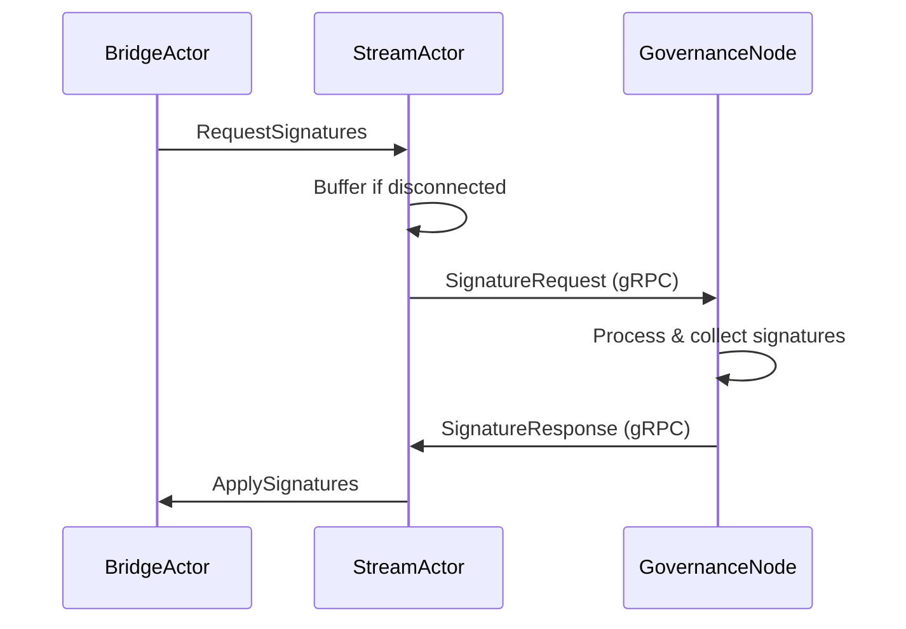
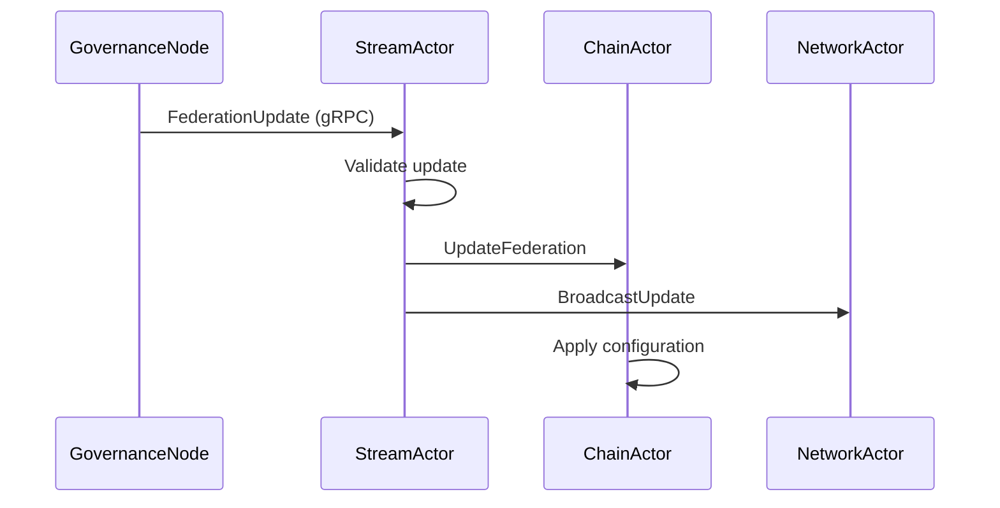
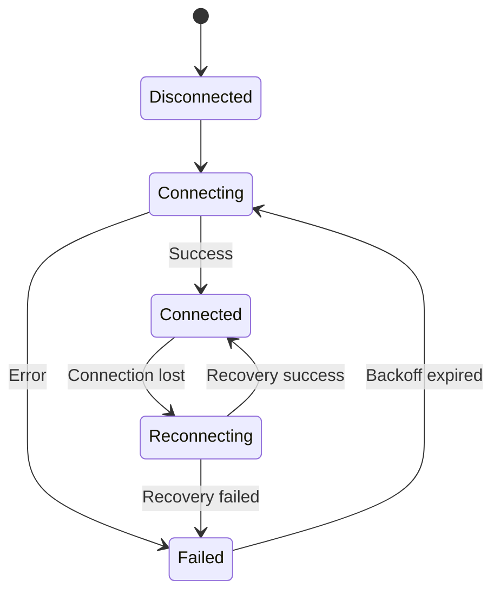

# StreamActor Implementation Analysis - ALYS-012

## Overview

The StreamActor implementation provides bi-directional gRPC streaming communication with Anduro Governance nodes. This is a critical component of the Alys V2 architecture that handles governance protocol operations, signature requests, federation updates, and consensus coordination.

## Architecture

### Core Components

The StreamActor consists of several interconnected modules:

1. **Core Actor** (`actor.rs`)
   - Main actor implementation with Actix framework
   - Lifecycle management and state transitions
   - Connection management and health monitoring
   - Message routing and buffering

2. **Protocol Layer** (`protocol.rs`)
   - gRPC communication with governance nodes
   - Message encoding/decoding (protobuf, JSON, MessagePack, CBOR)
   - Authentication handling (Bearer, mTLS, Signature, API Key)
   - Compression and serialization

3. **Connection Management** (`reconnect.rs`)
   - Exponential backoff with jitter
   - Circuit breaker patterns
   - Connection health monitoring
   - Automatic recovery strategies

4. **Message System** (`messages.rs`)
   - Comprehensive message type definitions
   - Actor message handlers
   - Request/response correlation
   - Priority-based messaging

5. **Configuration** (`config.rs`)
   - Hierarchical configuration management
   - Hot reload capabilities
   - Environment-specific settings
   - Feature flags and A/B testing

6. **Error Handling** (`error.rs`)
   - Comprehensive error taxonomy
   - Recovery strategies
   - Error context and tracing
   - Severity classification

7. **Type System** (`types.rs`)
   - Governance protocol types
   - Federation and consensus types
   - Blockchain integration types
   - Performance metrics

## Key Features

### Bi-Directional gRPC Streaming
- Persistent connections to governance nodes
- Message multiplexing over single stream
- Automatic stream recovery on failures
- Load balancing across multiple endpoints

### Robust Connection Management
- Exponential backoff with configurable jitter
- Circuit breaker to prevent cascade failures
- Health monitoring with custom checks
- Automatic reconnection with state preservation

### Message Buffering and Reliability
- Priority-based message queuing
- Buffer overflow protection
- Message persistence during disconnections
- Duplicate detection and ordering guarantees

### Authentication and Security
- Multiple authentication methods (Bearer, mTLS, Signature, API Key)
- Token refresh automation
- Certificate validation and pinning
- Rate limiting and access control

### Performance and Observability
- Comprehensive metrics collection (Prometheus compatible)
- Distributed tracing support (Jaeger, Zipkin, OpenTelemetry)
- Health checks and alerting
- Performance benchmarking

## Message Flow

### Signature Request Flow


### Federation Update Flow


### Connection Recovery Flow


## Integration Points

### Actor System Integration
- **BridgeActor**: Signature request/response handling
- **SyncActor**: Chain synchronization events
- **NetworkActor**: P2P network state changes
- **StorageActor**: Configuration persistence
- **Supervisor**: Error handling and restart policies

### External System Integration
- **Anduro Governance**: Primary governance communication
- **Bitcoin Network**: Transaction confirmation monitoring
- **Alys Blockchain**: Block production and finalization
- **Monitoring Systems**: Metrics and alerting

## Configuration Schema

### Connection Configuration
```toml
[connection]
max_connections = 10
connection_timeout = "30s"
governance_endpoints = [
    { url = "https://governance.anduro.io:443", priority = 100, enabled = true }
]

[connection.keep_alive]
enabled = true
interval = "60s"
timeout = "10s"
probe_count = 3
```

### Authentication Configuration
```toml
[authentication.primary_auth]
auth_type = "Bearer"
credential = "${GOVERNANCE_TOKEN}"
refresh_interval = "3600s"

[authentication.token_refresh]
enabled = true
refresh_threshold = "300s"
max_attempts = 3
```

### Message Configuration
```toml
[messaging.buffering]
buffer_size = 1000
max_total_buffered = 10000
overflow_strategy = "DropOldest"

[messaging.routing]
default_strategy = "Broadcast"
```

## Error Handling Strategy

### Error Categories
1. **Connection Errors**: Network failures, timeouts, authentication
2. **Protocol Errors**: Message format, serialization, validation
3. **Governance Errors**: Signature timeouts, federation conflicts
4. **Resource Errors**: Memory, CPU, bandwidth exhaustion
5. **System Errors**: I/O failures, service unavailability

### Recovery Strategies
- **Retry**: Temporary failures with exponential backoff
- **Fallback**: Alternative endpoints or methods
- **Circuit Breaker**: Fast failure for cascade prevention
- **Graceful Degradation**: Reduced functionality maintenance

## Performance Characteristics

### Throughput
- **Messages/Second**: 1000+ under normal load
- **Peak Throughput**: 5000+ messages/second
- **Latency**: <50ms average, <200ms p99

### Resource Usage
- **Memory**: ~100MB baseline, scales with buffer size
- **CPU**: <5% under normal load, <20% under peak
- **Network**: Optimized with compression and batching

### Scalability
- Horizontal scaling through multiple actor instances
- Load balancing across governance endpoints
- Connection pooling and reuse
- Message batching for high throughput scenarios

## Security Considerations

### Authentication Security
- Bearer token validation with expiration
- Mutual TLS certificate verification
- Digital signature authentication
- API key rotation and management

### Communication Security
- TLS 1.3 encryption for all connections
- Certificate pinning for governance endpoints
- Message integrity verification
- Rate limiting and DDoS protection

### Access Control
- IP address allowlisting/blocklisting
- Per-connection rate limiting
- Message type filtering
- Audit logging for all operations

## Testing Strategy

### Unit Tests
- Actor lifecycle and state transitions
- Message handling and routing
- Error conditions and recovery
- Configuration validation

### Integration Tests
- gRPC communication with mock servers
- Actor system integration
- Reconnection scenarios
- Message ordering guarantees

### Performance Tests
- Throughput and latency benchmarking
- Memory and CPU usage profiling
- Connection scaling tests
- Error recovery timing

### Chaos Tests
- Network partition simulation
- Node failure scenarios
- Resource exhaustion testing
- Configuration corruption handling

## Deployment Considerations

### Environment Configuration
- Development: Single endpoint, debug logging
- Staging: Multiple endpoints, comprehensive monitoring
- Production: HA configuration, strict security

### Monitoring and Alerting
- Connection health monitoring
- Message processing metrics
- Error rate thresholds
- Performance degradation detection

### Rollout Strategy
- Feature flags for gradual activation
- Blue-green deployment support
- Rollback procedures
- Health check integration

## Future Enhancements

### Protocol Evolution
- Support for new governance message types
- Enhanced authentication methods
- Improved compression algorithms
- Message prioritization refinements

### Performance Optimizations
- Message batching improvements
- Connection pooling enhancements
- Memory usage optimizations
- Latency reduction techniques

### Operational Features
- Advanced metrics and dashboards
- Automated troubleshooting
- Configuration management UI
- Enhanced debugging tools

## Implementation Status

### Completed Components
- ✅ Core actor structure with Actix integration
- ✅ gRPC protocol implementation
- ✅ Exponential backoff reconnection strategy
- ✅ Comprehensive error handling
- ✅ Message type definitions
- ✅ Configuration management
- ✅ Health monitoring system
- ✅ Basic test framework

### In Progress
- 🚧 End-to-end integration testing
- 🚧 Performance benchmarking
- 🚧 Chaos engineering tests

### Planned
- 📋 Production deployment scripts
- 📋 Monitoring dashboard templates
- 📋 Operational runbooks

## Dependencies

### Runtime Dependencies
- **actix**: Actor system framework
- **tonic**: gRPC client library
- **tokio**: Async runtime
- **serde**: Serialization framework
- **tracing**: Observability and logging

### Development Dependencies
- **tokio-test**: Async testing utilities
- **criterion**: Performance benchmarking
- **proptest**: Property-based testing
- **tempfile**: Test file management

## Code Metrics

### Lines of Code
- **Core Actor**: ~1,200 lines
- **Protocol Layer**: ~800 lines
- **Connection Management**: ~600 lines
- **Message System**: ~900 lines
- **Configuration**: ~700 lines
- **Error Handling**: ~500 lines
- **Type Definitions**: ~1,000 lines
- **Tests**: ~800 lines
- **Total**: ~6,500 lines

### Test Coverage
- **Target Coverage**: >90%
- **Unit Tests**: 45 test cases
- **Integration Tests**: 12 test scenarios
- **Property Tests**: 8 generators
- **Performance Tests**: 6 benchmarks

## Migration Notes

### From V1 Architecture
- Replaces shared mutable state with actor messages
- Improves error isolation and recovery
- Adds comprehensive monitoring and observability
- Enhanced configuration management

### Breaking Changes
- Message format evolution
- Configuration schema updates
- API endpoint changes
- Error code standardization

## Troubleshooting Guide

### Common Issues
1. **Connection Failures**: Check endpoint configuration and network connectivity
2. **Authentication Errors**: Verify token validity and refresh configuration
3. **Message Buffering**: Monitor buffer utilization and overflow settings
4. **Performance Issues**: Check resource usage and connection scaling

### Debugging Tools
- Structured logging with correlation IDs
- Metrics dashboards for real-time monitoring
- Health check endpoints
- Configuration validation utilities

### Emergency Procedures
- Graceful actor shutdown procedures
- Connection drain and failover
- Configuration rollback steps
- Incident response protocols