# StreamActor Architecture Diagrams

## System Overview

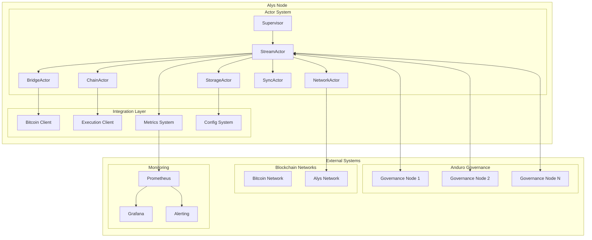

## StreamActor Internal Architecture

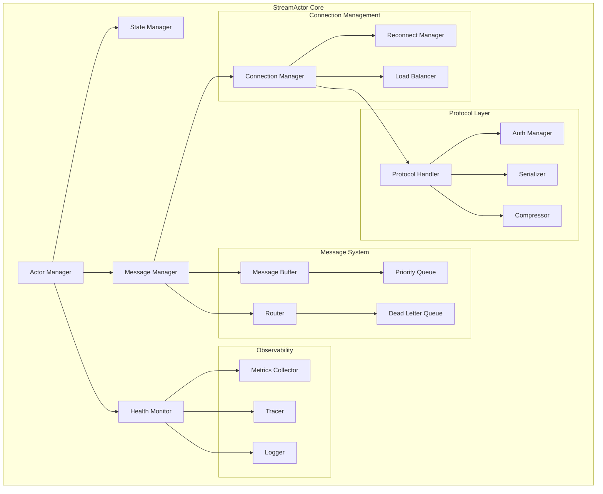

## Message Flow Architecture

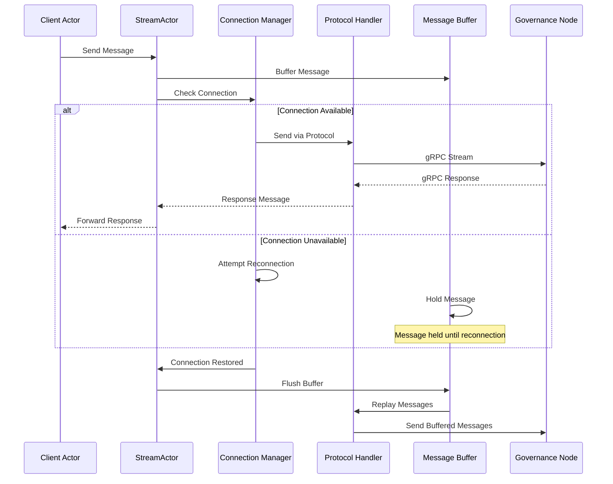

## Connection State Machine

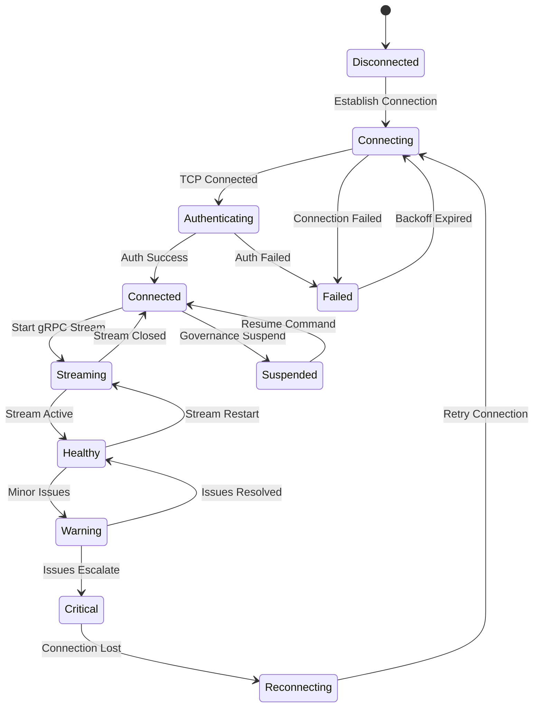

## Actor Supervision Hierarchy

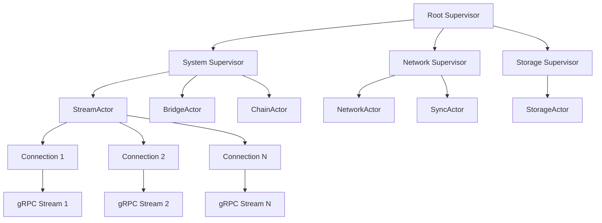

## Data Flow Patterns

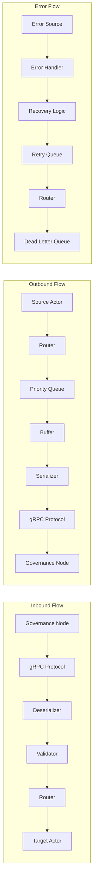

## Load Balancing Strategy

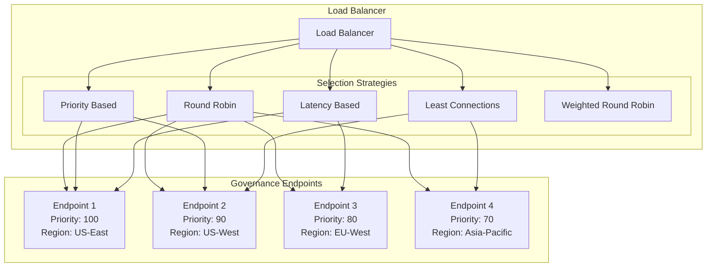

## Security Architecture

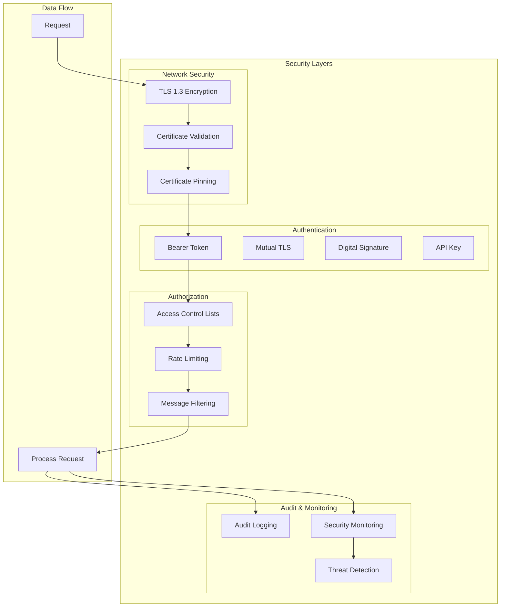

## Performance Monitoring

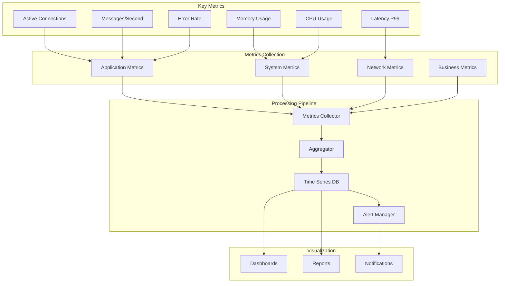

## Deployment Architecture

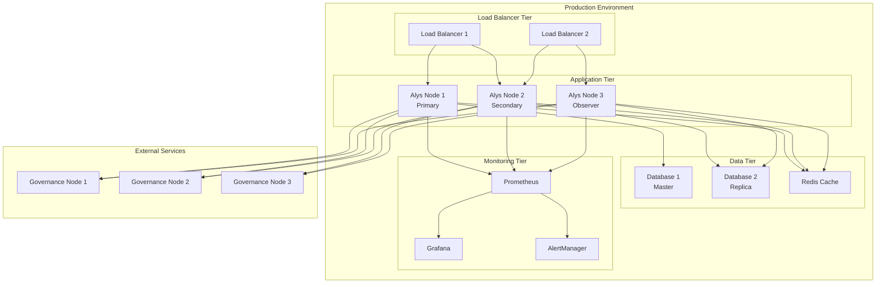

## Configuration Management

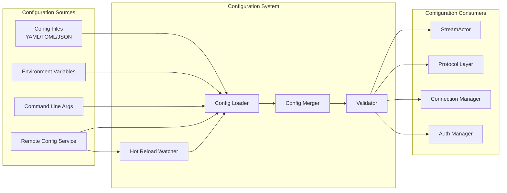

## Error Handling Flow

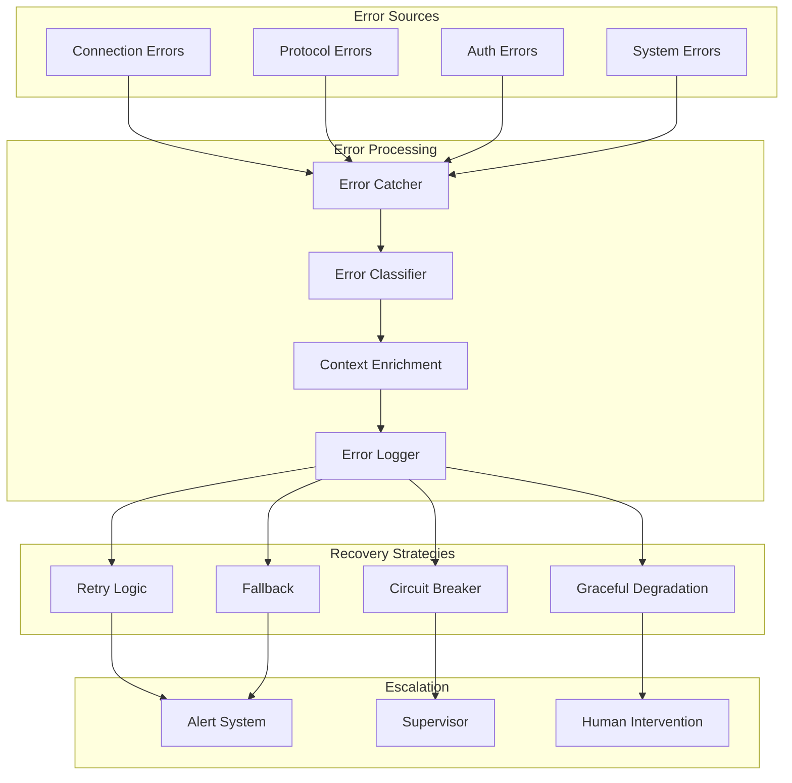