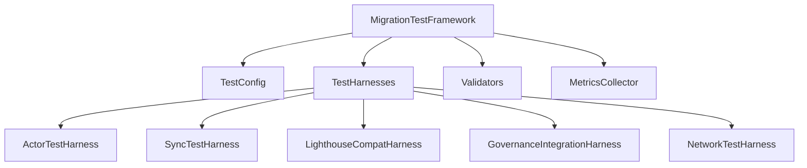
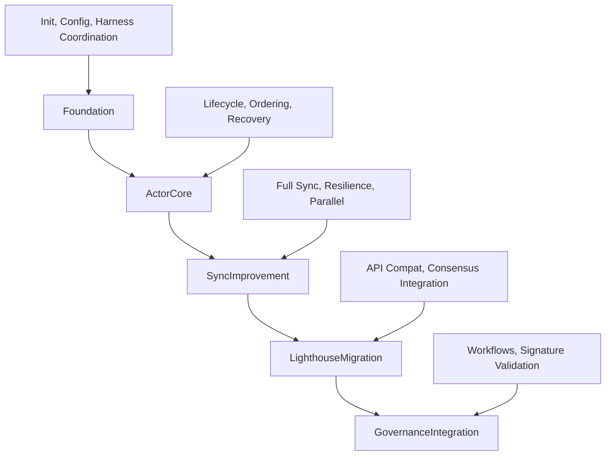
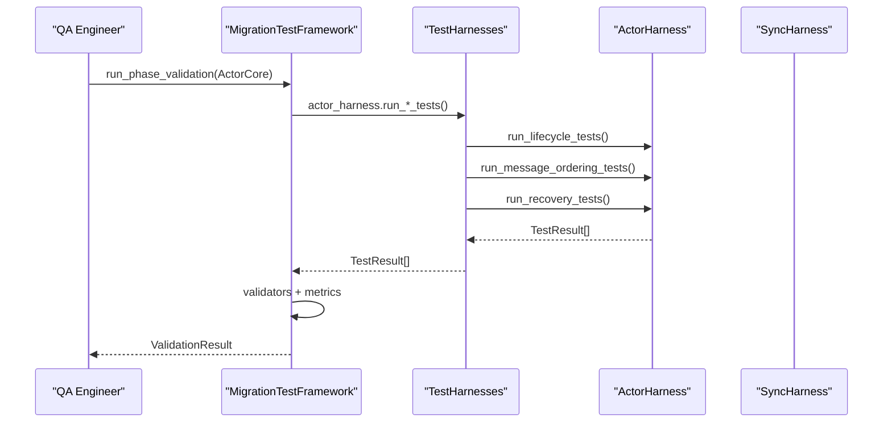
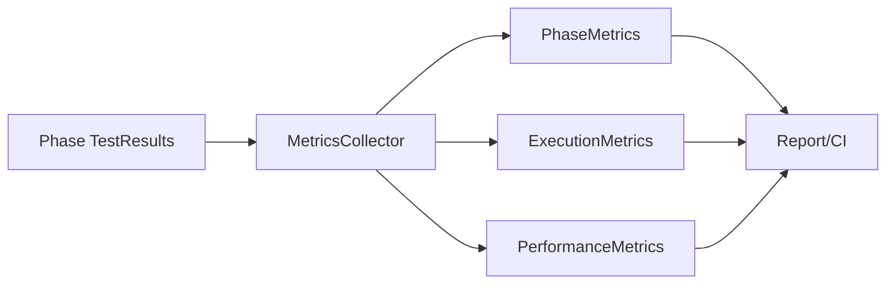

# Alys V2 Testing Framework — QA Onboarding Guide

## Who this is for
QA engineers joining Alys V2. This guide gets you productive fast with the testing framework: local setup, how to run and extend tests, CI/CD integration, and practical workflows.

## TL;DR Quickstart
- Install prerequisites (Rust, Docker, tooling)
- Build the workspace and the tests crate
- Run the test coordinator service (optional dashboard/API)
- Execute end-to-end workflows locally

```bash
# 1) Prereqs
brew install rustup-init docker
rustup-init -y
source "$HOME/.cargo/env"
rustup toolchain install stable
rustup default stable

# 2) Workspace build
cd /Users/michael/zDevelopment/Mara/alys
cargo build --workspace

# 3) Run tests crate unit tests
cargo test -p alys-test-framework

# 4) (Optional) Start the Test Coordinator API + Report server
cargo run -p alys-test-framework --bin test-coordinator -- \
  --config /Users/michael/zDevelopment/Mara/alys/tests/test-config/test-coordinator.toml

# 5) Run comprehensive scenarios script (aggregated E2E)
bash tests/scripts/run_comprehensive_tests.sh
```

### Recommended env vars
```bash
export RUST_LOG=info,alys=debug
export TEST_PARALLEL=true
export TEST_CHAOS_ENABLED=false       # enable for chaos runs
export TEST_PERFORMANCE_TRACKING=true
export TEST_COVERAGE_ENABLED=true
export TEST_DATA_DIR=/tmp/alys-test
```

---

## Framework overview

The testing framework is centered on `MigrationTestFramework`, which orchestrates runtime, configuration, harnesses, validation, and metrics across the five migration phases.



### Migration phases


### Key code references

- Framework orchestrator
```26:39:tests/src/framework/mod.rs
pub struct MigrationTestFramework {
    runtime: Arc<Runtime>,
    config: TestConfig,
    harnesses: TestHarnesses,
    validators: Validators,
    metrics: MetricsCollector,
    start_time: SystemTime,
}
```

- Configuration system
```6:41:tests/src/framework/config.rs
#[derive(Debug, Clone, Serialize, Deserialize)]
pub struct TestConfig {
    pub parallel_tests: bool,
    pub chaos_enabled: bool,
    pub performance_tracking: bool,
    pub coverage_enabled: bool,
    pub docker_compose_file: String,
    pub test_data_dir: PathBuf,
    pub network: NetworkConfig,
    pub actor_system: ActorSystemConfig,
    pub sync: SyncConfig,
    pub performance: PerformanceConfig,
    pub chaos: ChaosConfig,
}
```

- Harness collection
```31:52:tests/src/framework/harness/mod.rs
pub struct TestHarnesses {
    pub actor_harness: ActorTestHarness,
    pub sync_harness: SyncTestHarness,
    pub lighthouse_harness: LighthouseCompatHarness,
    pub governance_harness: GovernanceIntegrationHarness,
    pub network_harness: NetworkTestHarness,
    runtime: Arc<Runtime>,
    config: TestConfig,
}
```

- Validators
```102:151:tests/src/framework/validators.rs
impl Validators {
    pub fn new() -> Result<Self> {
        let mut phase_validators: HashMap<MigrationPhase, Box<dyn PhaseValidator>> = HashMap::new();
        phase_validators.insert(MigrationPhase::Foundation, Box::new(FoundationValidator));
        phase_validators.insert(MigrationPhase::ActorCore, Box::new(ActorCoreValidator));
        phase_validators.insert(MigrationPhase::SyncImprovement, Box::new(SyncImprovementValidator));
        phase_validators.insert(MigrationPhase::LighthouseMigration, Box::new(LighthouseMigrationValidator));
        phase_validators.insert(MigrationPhase::GovernanceIntegration, Box::new(GovernanceIntegrationValidator));
        let result_validators: Vec<Box<dyn ResultValidator>> = vec![
            Box::new(DurationValidator { max_duration: Duration::from_secs(300) }),
            Box::new(SuccessRateValidator { min_success_rate: 0.95 }),
            Box::new(PerformanceRegressionValidator { baseline_metrics: HashMap::new(), regression_threshold: 0.15 }),
        ];
        Ok(Self { phase_validators, result_validators, metrics: ValidatorMetrics::default() })
    }
}
```

- Metrics
```134:151:tests/src/framework/metrics.rs
impl MetricsCollector {
    pub fn new(config: TestConfig) -> Result<Self> {
        let collector = Self {
            config,
            phase_metrics: Arc::new(Mutex::new(HashMap::new())),
            resource_metrics: Arc::new(Mutex::new(ResourceMetrics::default())),
            execution_metrics: Arc::new(Mutex::new(ExecutionMetrics::default())),
            performance_metrics: Arc::new(Mutex::new(PerformanceMetrics::default())),
            start_time: SystemTime::now(),
        };
        Ok(collector)
    }
}
```

---

## Local environment setup

- Rust toolchain: stable; Tokio-based runtime
- Docker (optional) for integration environments
- macOS 14+ and Linux supported

```bash
# Rust and components
rustup component add clippy rustfmt

# Verify
cargo --version
rustc --version

# Docker (start desktop or daemon as needed)
docker --version
```

### Workspace build and smoke test
```bash
cd /Users/michael/zDevelopment/Mara/alys
cargo build --workspace
cargo test -p alys-test-framework -- --nocapture
```

### Using configuration presets
- Development: `TestConfig::development()` — reduced load, easier debugging
- CI/CD: `TestConfig::ci_cd()` — parallel, chaos, coverage enabled

```372:386:tests/src/framework/config.rs
pub fn ci_cd() -> Self {
    let mut config = Self::default();
    config.parallel_tests = true;
    config.chaos_enabled = true;
    config.performance_tracking = true;
    config.coverage_enabled = true;
    config.test_data_dir = PathBuf::from("/tmp/alys-ci-test");
    config.sync.sync_timeout_seconds = 180;
    config.chaos.test_duration_minutes = 5;
    config
}
```

---

## Interacting with the framework

### Option A: Test Coordinator service (API + reports)
Binary: `tests/src/bin/test_coordinator.rs`

Run it:
```bash
cargo run -p alys-test-framework --bin test-coordinator -- --config tests/test-config/test-coordinator.toml
# API:    http://127.0.0.1:8080
# Reports: http://127.0.0.1:8081
```

Core startup:
```250:327:tests/src/bin/test_coordinator.rs
#[tokio::main]
async fn main() -> Result<()> {
    let args = Args::parse();
    let config = load_config(&args.config)?;
    init_logging(&config.logging)?;
    let db = init_database(&config.database).await?;
    let state = AppState { /* ... */ };
    let app_state = Arc::new(state);
    start_health_checker(app_state.clone()).await;
    start_cleanup_task(app_state.clone()).await;
    let api_router = build_api_router(app_state.clone());
    let report_router = build_report_router(app_state.clone());
    let api_server = start_api_server(&config.server, api_router);
    let report_server = start_report_server(&config.server, report_router);
    tokio::try_join!(api_server, report_server)?;
    Ok(())
}
```

Useful endpoints:
- GET `/health`
- GET `/status`
- GET `/test-runs`
- POST `/test-runs` (scaffold)

### Option B: Directly invoke phases/harnesses

Common entrypoint:
```149:190:tests/src/framework/mod.rs
pub async fn run_phase_validation(&self, phase: MigrationPhase) -> ValidationResult { /* ... */ }
```

Run all harness tests:
```bash
cargo test -p alys-test-framework -- --nocapture
```

---

## End-to-end workflows

### Workflow 1: Foundation
```bash
cargo test -p alys-test-framework -- --nocapture --test-threads=1
```
Validates: initialization, configuration, harness coordination.

```192:221:tests/src/framework/mod.rs
async fn validate_foundation(&self) -> Vec<TestResult> { /* ... */ }
```

### Workflow 2: ActorCore (lifecycle, ordering, recovery)
```bash
RUST_LOG=info,alys=debug cargo test -p alys-test-framework -- --nocapture | grep -i actor
```

### Workflow 3: SyncImprovement (full/parallel/resilience)
```bash
RUST_LOG=info cargo test -p alys-test-framework -- --nocapture | grep -i sync
```

### Workflow 4: Lighthouse
```bash
cargo test -p alys-test-framework -- --nocapture | grep -i lighthouse
```

### Workflow 5: Governance
```bash
cargo test -p alys-test-framework -- --nocapture | grep -i governance
```

### Workflow 6: Network and Chaos (optional)
Network harness covers P2P basics. Chaos framework supports fault injection.

Selected chaos entrypoints:
```602:639:tests/src/framework/chaos.rs
pub fn new(config: ChaosConfig) -> Result<Self> { /* ... */ }
pub async fn run_comprehensive_chaos_test(&self) -> Result<ChaosReport> { /* ... */ }
```

---

## CI/CD integration

### Suggested steps
```yaml
steps:
  - uses: actions/checkout@v4
  - uses: dtolnay/rust-toolchain@stable
  - run: cargo build --workspace --locked
  - run: RUST_LOG=info TEST_COVERAGE_ENABLED=true cargo test -p alys-test-framework -- --nocapture
  - run: cargo bench -p alys-test-framework || true
  - name: Archive test artifacts
    run: |
      mkdir -p artifacts
      cp -R target/performance artifacts/ || true
      cp -R target/flamegraphs artifacts/ || true
```

Coordinator in CI (optional): expose `/metrics`, persist reports under `/static`.

---

## Extending tests quickly
- Add generators in `tests/src/framework/generators.rs`
- Add harness tests under `tests/src/framework/harness/`
- Add validations in `tests/src/framework/validators.rs`

Shared trait:
```181:209:tests/src/framework/harness/mod.rs
pub trait TestHarness: Send + Sync { /* lifecycle + metrics */ }
```

---

## Troubleshooting
- macOS toolchain: install Xcode CLT (`xcode-select --install`).
- Timeouts: `TEST_PARALLEL=false` and `--test-threads=1`.
- Docker issues: ensure daemon is running and resources sized appropriately.

---

## Pro Tips!
- Rerun failed: `cargo test -p alys-test-framework -- --failed --nocapture`
- Filter by name: `cargo test -p alys-test-framework actor -- --nocapture`
- Quieter: `cargo test -p alys-test-framework -q`
- Deep logs: `RUST_LOG=alys=trace,hyper=warn`
- Perf artifacts: open `target/performance/flamegraph.svg`
- Reports via coordinator under `/static`

---

## Reference diagrams

### Harness interaction


### Metrics rollup


---

Happy testing! Start with a harness test, wire it into `MigrationTestFramework`, then surface outcomes via validators and metrics.

