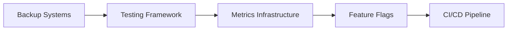
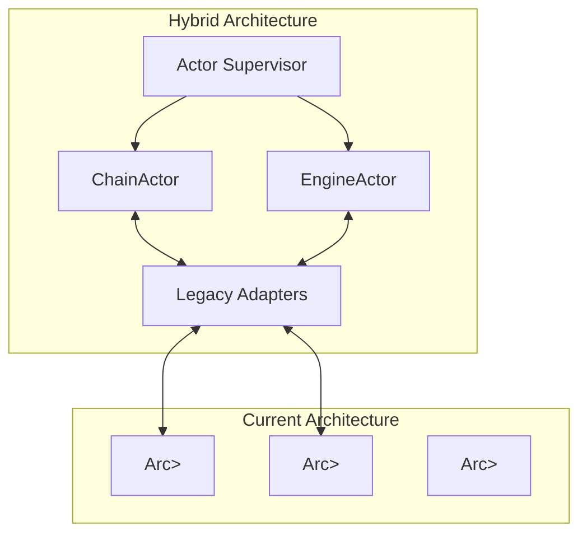
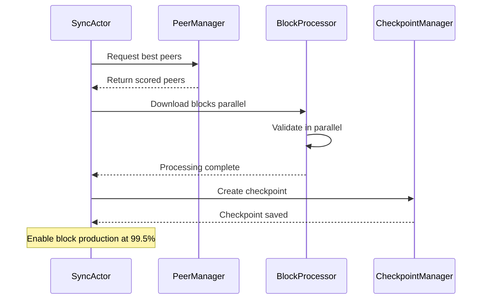
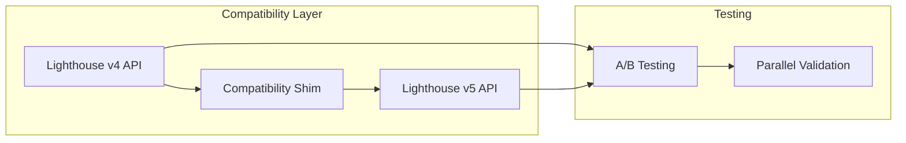
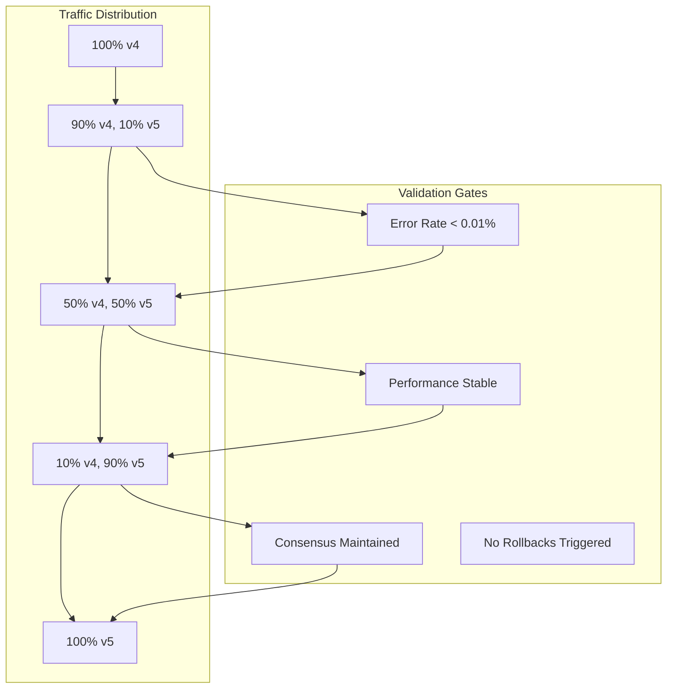
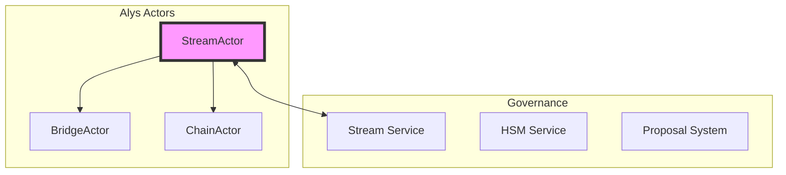
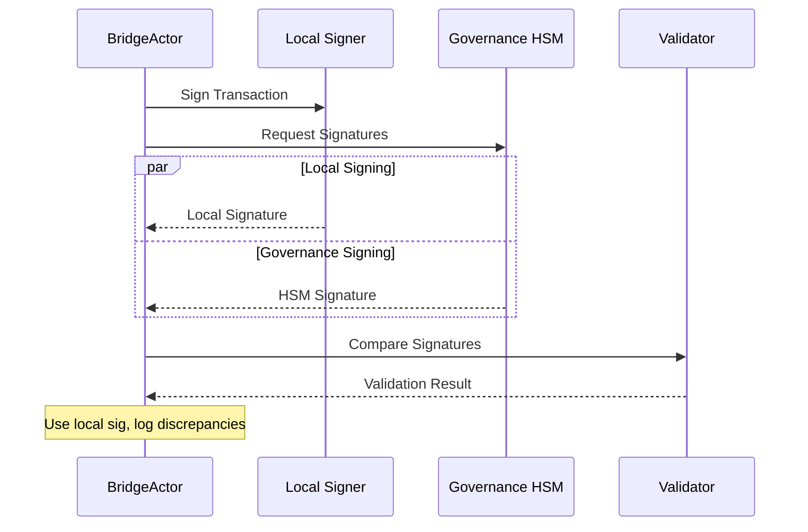
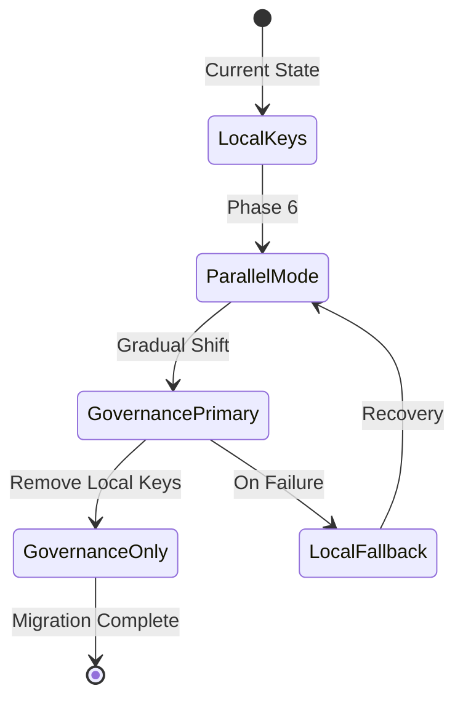
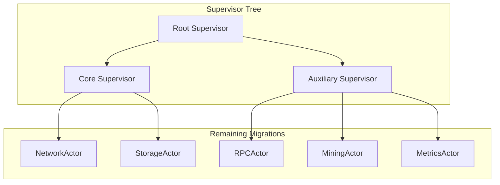
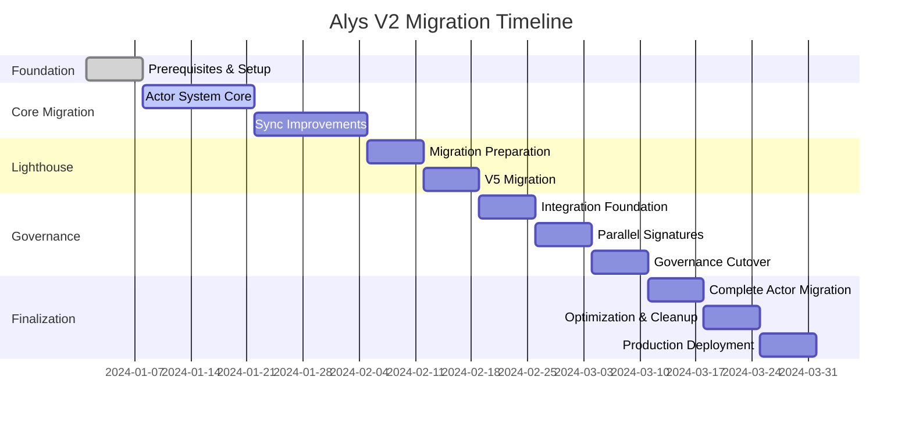

# Alys V2 Migration Master Plan & Roadmap

## Executive Summary

This document serves as the master migration plan for transforming Alys from its current monolithic architecture to a modern, actor-based system with improved syncing, updated Lighthouse dependencies, and full Anduro Governance integration. The migration is carefully sequenced to ensure system stability, enable granular testing at each phase, and maintain backward compatibility throughout the transition.

NOTE: The driver for this migration is the need to migrate to Anduro Governance.

## Migration Overview

### Strategic Goals
1. **Architecture Modernization**: Transition from shared mutable state to actor-based message passing
2. **Sync Reliability**: Fix historical syncing issues that prevent block production
3. **Dependency Updates**: Migrate from Lighthouse v4 (git rev) to v5+ (versioned)
4. **Governance Integration**: Abstract all cryptographic operations to Anduro Governance HSM
5. **Operational Excellence**: Improve testing, monitoring, and deployment practices

### Critical Principles
- **Zero Downtime**: All changes must be deployable without service interruption
- **Incremental Progress**: Each phase must be independently valuable and testable
- **Rollback Capability**: Every change must be reversible within 5 minutes
- **Continuous Validation**: Testing gates between each phase ensure stability

## Phase 0: Foundation & Prerequisites (Week 1)

### Objectives
Establish the groundwork for migration without changing existing functionality.

### Tasks


### Implementation Steps

#### 0.1 Backup and Recovery Systems
```bash
#!/bin/bash
# scripts/backup_current_state.sh
set -e

BACKUP_DIR="/var/backups/alys/pre-migration-$(date +%Y%m%d)"
mkdir -p $BACKUP_DIR

# Backup database
pg_dump alys_db > $BACKUP_DIR/database.sql

# Backup configuration
cp -r /etc/alys $BACKUP_DIR/config

# Backup state
cp -r /var/lib/alys $BACKUP_DIR/state

# Create restoration script
cat > $BACKUP_DIR/restore.sh << 'EOF'
#!/bin/bash
systemctl stop alys
pg_restore < database.sql
cp -r config/* /etc/alys/
cp -r state/* /var/lib/alys/
systemctl start alys
EOF

chmod +x $BACKUP_DIR/restore.sh
echo "Backup completed: $BACKUP_DIR"
```

#### 0.2 Comprehensive Testing Framework
```rust
// tests/framework/mod.rs
pub struct MigrationTestFramework {
    pub harnesses: TestHarnesses,
    pub validators: Validators,
    pub metrics: MetricsCollector,
}

pub struct TestHarnesses {
    pub sync_harness: SyncTestHarness,
    pub actor_harness: ActorTestHarness,
    pub lighthouse_harness: LighthouseCompatHarness,
    pub governance_harness: GovernanceIntegrationHarness,
}

impl MigrationTestFramework {
    pub async fn run_phase_validation(&self, phase: MigrationPhase) -> ValidationResult {
        match phase {
            MigrationPhase::Foundation => self.validate_foundation().await,
            MigrationPhase::ActorCore => self.validate_actor_core().await,
            MigrationPhase::SyncImprovement => self.validate_sync().await,
            MigrationPhase::LighthouseMigration => self.validate_lighthouse().await,
            MigrationPhase::GovernanceIntegration => self.validate_governance().await,
        }
    }
}
```

#### 0.3 Feature Flag System
```toml
# config/features.toml
[features]
actor_system = false
improved_sync = false
lighthouse_v5 = false
governance_integration = false
parallel_validation = false

[rollout]
canary_percentage = 0
gradual_rollout = true
rollback_on_error = true
```

### Testing Checkpoint
- [ ] All existing tests pass
- [ ] Backup and restore procedures verified
- [ ] Metrics collection operational
- [ ] Feature flags functioning
- [ ] CI/CD pipeline ready

### Rollback Plan
No rollback needed - foundation changes are additive only.

---

## Phase 1: Actor System Core (Weeks 2-3)

### Objectives
Introduce actor system foundation without disrupting existing components.

### Dependencies
- Phase 0 complete
- Actix framework integrated
- Message protocols defined

### Architecture Transition


### Implementation Steps

#### 1.1 Actor Supervisor Setup
```rust
// app/src/actors/supervisor.rs
pub struct AlysSupervisor {
    config: AlysConfig,
    system: System,
    registry: ActorRegistry,
}

impl AlysSupervisor {
    pub async fn start_gradual(config: AlysConfig) -> Result<Self> {
        let system = System::new();
        let registry = ActorRegistry::new();
        
        // Start core actors with legacy adapters
        if config.features.actor_system {
            let chain_actor = ChainActor::with_legacy_adapter(
                config.chain_config.clone()
            ).start();
            registry.register("chain", chain_actor);
            
            let engine_actor = EngineActor::with_legacy_adapter(
                config.engine_config.clone()
            ).start();
            registry.register("engine", engine_actor);
        }
        
        Ok(Self { config, system, registry })
    }
}
```

#### 1.2 Legacy Adapter Pattern
```rust
// app/src/actors/adapters.rs
pub struct LegacyChainAdapter {
    actor: Addr<ChainActor>,
    legacy: Arc<RwLock<Chain>>,
}

impl LegacyChainAdapter {
    pub async fn process_block(&self, block: SignedConsensusBlock) -> Result<()> {
        if self.is_actor_enabled() {
            // Route through actor
            self.actor.send(ProcessBlock { block }).await?
        } else {
            // Use legacy path
            self.legacy.write().await.import_block(block).await
        }
    }
}
```

### Testing Checkpoint
- [ ] Actor system starts without affecting legacy code
- [ ] Messages route correctly through adapters
- [ ] No performance degradation
- [ ] Can toggle between actor and legacy modes
- [ ] All existing functionality preserved

### Rollback Plan
```bash
# Disable actor system via feature flag
echo "actor_system = false" >> /etc/alys/features.toml
systemctl restart alys
```

---

## Phase 2: Sync System Improvements (Weeks 4-5)

### Objectives
Replace problematic sync implementation with robust actor-based solution.

### Dependencies
- Phase 1 complete (actor system operational)
- Checkpoint system implemented
- Peer scoring metrics available

### Critical Changes


### Implementation Steps

#### 2.1 SyncActor Deployment
```rust
// app/src/actors/sync_actor.rs
impl SyncActor {
    pub async fn start_with_recovery(&mut self) -> Result<()> {
        // Check for existing checkpoints
        if let Some(checkpoint) = self.checkpoint_manager.find_latest() {
            info!("Recovering from checkpoint at height {}", checkpoint.height);
            self.state = SyncState::DownloadingBlocks {
                start_height: checkpoint.height,
                current_height: checkpoint.height,
                target_height: self.get_network_height().await?,
                batch_size: 256,
                peers: vec![],
            };
        } else {
            self.state = SyncState::Discovering {
                started_at: Instant::now(),
                attempts: 0,
            };
        }
        
        self.run_sync_loop().await
    }
}
```

#### 2.2 Gradual Sync Migration
```rust
// Enable progressive sync improvements
pub struct HybridSyncManager {
    legacy_sync: Arc<Chain>,
    new_sync: Addr<SyncActor>,
    feature_flags: FeatureFlags,
}

impl HybridSyncManager {
    pub async fn sync(&self) -> Result<()> {
        if self.feature_flags.improved_sync {
            // Use new sync with monitoring
            let result = self.new_sync.send(StartSync).await?;
            
            // Fallback to legacy on failure
            if result.is_err() && self.feature_flags.sync_fallback {
                warn!("New sync failed, falling back to legacy");
                self.legacy_sync.sync().await
            } else {
                result
            }
        } else {
            self.legacy_sync.sync().await
        }
    }
}
```

### Testing Checkpoint
- [ ] Sync from genesis completes successfully
- [ ] Checkpoint recovery works
- [ ] Parallel validation improves performance by >2x
- [ ] Block production enables at 99.5% sync
- [ ] Network partitions handled gracefully
- [ ] Peer scoring improves sync reliability

### Performance Validation
```rust
#[test]
async fn validate_sync_performance() {
    let metrics_before = collect_sync_metrics_legacy().await;
    let metrics_after = collect_sync_metrics_actor().await;
    
    assert!(metrics_after.blocks_per_second > metrics_before.blocks_per_second * 2.0);
    assert!(metrics_after.recovery_time < Duration::from_secs(30));
    assert!(metrics_after.production_threshold == 0.995);
}
```

### Rollback Plan
```bash
# Revert to legacy sync
echo "improved_sync = false" >> /etc/alys/features.toml
systemctl restart alys
# Legacy sync will resume from last known good state
```

---

## Phase 3: Lighthouse Migration Preparation (Week 6)

### Objectives
Prepare for Lighthouse v5 migration with compatibility layer and testing.

### Dependencies
- Phases 1-2 complete
- Compatibility layer implemented
- A/B testing framework ready

### Migration Strategy


### Implementation Steps

#### 3.1 Compatibility Layer
```rust
// crates/lighthouse-compat/src/lib.rs
pub struct LighthouseCompatLayer {
    v4_engine: Option<EngineV4>,
    v5_engine: Option<EngineV5>,
    migration_state: MigrationState,
}

impl LighthouseCompatLayer {
    pub async fn build_block(&self, params: BlockParams) -> Result<ExecutionPayload> {
        match self.migration_state {
            MigrationState::V4Only => {
                self.v4_engine.as_ref().unwrap().build_block(params).await
            }
            MigrationState::Testing => {
                // Run both, compare results
                let v4_future = self.v4_engine.as_ref().unwrap().build_block(params.clone());
                let v5_future = self.v5_engine.as_ref().unwrap().build_block(params);
                
                let (v4_result, v5_result) = tokio::join!(v4_future, v5_future);
                
                self.compare_and_log_results(&v4_result, &v5_result);
                
                // Return v4 result during testing
                v4_result
            }
            MigrationState::V5Primary => {
                // V5 primary, v4 fallback
                match self.v5_engine.as_ref().unwrap().build_block(params.clone()).await {
                    Ok(payload) => Ok(payload),
                    Err(e) => {
                        warn!("V5 failed, falling back to v4: {}", e);
                        self.v4_engine.as_ref().unwrap().build_block(params).await
                    }
                }
            }
            MigrationState::V5Only => {
                self.v5_engine.as_ref().unwrap().build_block(params).await
            }
        }
    }
}
```

#### 3.2 A/B Testing Setup
```yaml
# docker-compose.lighthouse-test.yml
version: '3.8'
services:
  alys-lighthouse-test:
    image: alys:lighthouse-migration
    environment:
      - LIGHTHOUSE_AB_TEST=true
      - LIGHTHOUSE_V4_ENDPOINT=http://lighthouse-v4:8551
      - LIGHTHOUSE_V5_ENDPOINT=http://lighthouse-v5:8551
      - COMPARISON_LOG_PATH=/var/log/alys/lighthouse-comparison.log
    volumes:
      - ./test-data:/var/lib/alys
      - ./logs:/var/log/alys
```

### Testing Checkpoint
- [ ] Compatibility layer handles all API calls
- [ ] V4 and V5 produce equivalent results
- [ ] Performance metrics collected for both versions
- [ ] No signature verification issues
- [ ] Storage migration tested
- [ ] Rollback procedures verified

### Rollback Plan
```bash
# Quick rollback to v4 only
echo "lighthouse_v5 = false" >> /etc/alys/features.toml
echo "lighthouse_v4 = true" >> /etc/alys/features.toml
systemctl restart alys
```

---

## Phase 4: Lighthouse V5 Migration (Week 7)

### Objectives
Execute controlled migration from Lighthouse v4 to v5.

### Dependencies
- Phase 3 complete (compatibility validated)
- Canary deployment successful
- Rollback procedures tested

### Rollout Strategy


### Implementation Steps

#### 4.1 Gradual Traffic Shift
```rust
// app/src/lighthouse_migration.rs
pub struct LighthouseMigrationController {
    traffic_splitter: TrafficSplitter,
    health_monitor: HealthMonitor,
    rollback_trigger: RollbackTrigger,
}

impl LighthouseMigrationController {
    pub async fn execute_migration(&mut self) -> Result<()> {
        let stages = vec![
            (Duration::from_hours(6), 10),   // 10% for 6 hours
            (Duration::from_hours(12), 25),  // 25% for 12 hours
            (Duration::from_hours(24), 50),  // 50% for 24 hours
            (Duration::from_hours(12), 75),  // 75% for 12 hours
            (Duration::from_hours(6), 90),   // 90% for 6 hours
            (Duration::from_hours(24), 100), // 100% final
        ];
        
        for (duration, percentage) in stages {
            info!("Shifting {}% traffic to Lighthouse v5", percentage);
            self.traffic_splitter.set_v5_percentage(percentage).await?;
            
            // Monitor for duration
            let monitoring = self.monitor_health_for(duration);
            tokio::pin!(monitoring);
            
            tokio::select! {
                result = monitoring => {
                    if let Err(e) = result {
                        error!("Health check failed: {}", e);
                        self.initiate_rollback().await?;
                        return Err(e);
                    }
                }
                _ = self.rollback_trigger.wait() => {
                    warn!("Manual rollback triggered");
                    self.initiate_rollback().await?;
                    return Err(Error::ManualRollback);
                }
            }
            
            info!("Stage complete: {}% traffic on v5", percentage);
        }
        
        Ok(())
    }
}
```

### Testing Checkpoint
- [ ] 10% canary shows no issues for 6 hours
- [ ] 50% split maintains consensus
- [ ] 90% migration stable for 6 hours
- [ ] 100% migration successful
- [ ] All validators updated
- [ ] Performance meets or exceeds v4

### Rollback Plan
```bash
#!/bin/bash
# Automated rollback on any issue
if [ $(curl -s http://localhost:9090/metrics | grep error_rate | awk '{print $2}') > 0.01 ]; then
    echo "Error rate exceeded threshold, rolling back"
    echo "lighthouse_v5_percentage = 0" > /etc/alys/emergency.conf
    systemctl reload alys
fi
```

---

## Phase 5: Governance Integration Foundation (Week 8)

### Objectives
Establish connection to Anduro Governance without removing local key management yet.

### Dependencies
- Phases 1-4 complete
- Governance test environment available
- Stream connection stable

### Integration Architecture


### Implementation Steps

#### 5.1 StreamActor Implementation
```rust
// app/src/actors/stream_actor.rs
pub struct StreamActor {
    config: StreamConfig,
    connection: Option<StreamConnection>,
    reconnect_strategy: ExponentialBackoff,
    message_buffer: VecDeque<PendingMessage>,
    health_status: HealthStatus,
}

impl StreamActor {
    pub async fn establish_connection(&mut self) -> Result<()> {
        let mut attempts = 0;
        loop {
            match self.connect_to_governance().await {
                Ok(stream) => {
                    info!("Connected to Anduro Governance");
                    self.connection = Some(stream);
                    self.health_status = HealthStatus::Connected;
                    
                    // Flush buffered messages
                    while let Some(msg) = self.message_buffer.pop_front() {
                        self.send_message(msg).await?;
                    }
                    
                    return Ok(());
                }
                Err(e) => {
                    attempts += 1;
                    let backoff = self.reconnect_strategy.next_backoff(attempts);
                    warn!("Connection failed (attempt {}): {}. Retrying in {:?}", 
                          attempts, e, backoff);
                    tokio::time::sleep(backoff).await;
                }
            }
        }
    }
}
```

### Testing Checkpoint
- [ ] StreamActor connects to governance
- [ ] Reconnection works after disconnection
- [ ] Message buffering prevents loss
- [ ] Health monitoring accurate
- [ ] No impact on existing operations

### Rollback Plan
```bash
# Disable governance connection
echo "governance_integration = false" >> /etc/alys/features.toml
systemctl restart alys
# System continues with local key management
```

---

## Phase 6: Parallel Signature Collection (Week 9)

### Objectives
Run governance signatures in parallel with local signatures for validation.

### Dependencies
- Phase 5 complete (StreamActor operational)
- Test federation configured in governance
- Comparison metrics available

### Parallel Validation Flow


### Implementation Steps

#### 6.1 Parallel Signature Validation
```rust
pub struct ParallelSignatureValidator {
    local_signer: LocalSigner,
    governance_client: Addr<StreamActor>,
    metrics: SignatureMetrics,
}

impl ParallelSignatureValidator {
    pub async fn sign_with_validation(&self, tx: Transaction) -> Result<SignedTransaction> {
        // Sign locally
        let local_sig_future = self.local_signer.sign(&tx);
        
        // Request governance signature
        let gov_sig_future = self.governance_client.send(
            RequestSignature { tx: tx.clone() }
        );
        
        // Execute in parallel
        let (local_result, gov_result) = tokio::join!(local_sig_future, gov_sig_future);
        
        // Compare and log
        match (&local_result, &gov_result) {
            (Ok(local), Ok(gov)) => {
                if local.signature != gov.signature {
                    self.metrics.record_discrepancy();
                    warn!("Signature mismatch for tx {:?}", tx.hash());
                } else {
                    self.metrics.record_match();
                }
            }
            (Ok(_), Err(e)) => {
                self.metrics.record_governance_failure();
                warn!("Governance signing failed: {}", e);
            }
            (Err(e), Ok(_)) => {
                self.metrics.record_local_failure();
                error!("Local signing failed: {}", e);
            }
            (Err(e1), Err(e2)) => {
                error!("Both signing methods failed: local={}, gov={}", e1, e2);
                return Err(Error::SigningFailed);
            }
        }
        
        // Use local signature for now
        local_result
    }
}
```

### Testing Checkpoint
- [ ] Parallel signing operational
- [ ] Signature comparison metrics collected
- [ ] No performance degradation
- [ ] Discrepancy rate < 0.1%
- [ ] Governance latency acceptable
- [ ] Fallback to local signing works

---

## Phase 7: Governance Cutover (Week 10)

### Objectives
Switch from local key management to Anduro Governance HSM.

### Dependencies
- Phase 6 complete (parallel validation successful)
- Governance HSM fully configured
- All federation members ready

### Cutover Process


### Implementation Steps

#### 7.1 Gradual Responsibility Transfer
```rust
pub enum SignatureMode {
    LocalOnly,
    LocalPrimary { governance_backup: bool },
    GovernancePrimary { local_backup: bool },
    GovernanceOnly,
}

impl BridgeActor {
    pub async fn transition_to_governance(&mut self) -> Result<()> {
        let transitions = vec![
            (SignatureMode::LocalPrimary { governance_backup: true }, Duration::from_hours(24)),
            (SignatureMode::GovernancePrimary { local_backup: true }, Duration::from_hours(48)),
            (SignatureMode::GovernanceOnly, Duration::from_hours(168)), // 1 week monitoring
        ];
        
        for (mode, duration) in transitions {
            info!("Transitioning to {:?}", mode);
            self.signature_mode = mode;
            
            // Monitor for duration
            let start = Instant::now();
            while start.elapsed() < duration {
                if self.check_health().await.is_err() {
                    warn!("Health check failed, reverting");
                    self.signature_mode = SignatureMode::LocalPrimary { 
                        governance_backup: false 
                    };
                    return Err(Error::TransitionFailed);
                }
                tokio::time::sleep(Duration::from_secs(60)).await;
            }
        }
        
        // Remove local keys after successful transition
        self.secure_key_removal().await?;
        Ok(())
    }
}
```

### Testing Checkpoint
- [ ] Governance signing working for all operations
- [ ] Peg-in operations successful
- [ ] Peg-out operations successful
- [ ] Federation updates handled
- [ ] No signature failures in 48 hours
- [ ] Local keys securely removed

### Rollback Plan
```rust
// Emergency local key restoration
impl EmergencyKeyRestore {
    pub async fn restore_local_keys(&self) -> Result<()> {
        // Restore from secure backup
        let encrypted_keys = self.load_emergency_backup()?;
        let keys = self.decrypt_with_threshold(encrypted_keys)?;
        
        // Reinitialize local signer
        self.local_signer.initialize(keys)?;
        
        // Switch mode
        self.set_signature_mode(SignatureMode::LocalOnly)?;
        
        warn!("Emergency key restoration complete");
        Ok(())
    }
}
```

---

## Phase 8: Complete Actor Migration (Week 11)

### Objectives
Complete migration of all remaining components to actor model.

### Dependencies
- Phases 1-7 complete
- All critical paths migrated
- Actor patterns proven stable

### Final Components


### Implementation Steps

#### 8.1 Complete Actor System
```rust
pub struct CompleteActorSystem {
    root_supervisor: Addr<RootSupervisor>,
    core_actors: HashMap<String, Addr<dyn Actor>>,
    auxiliary_actors: HashMap<String, Addr<dyn Actor>>,
}

impl CompleteActorSystem {
    pub async fn finalize_migration(&mut self) -> Result<()> {
        // Migrate remaining components
        let migrations = vec![
            self.migrate_network_to_actor(),
            self.migrate_storage_to_actor(),
            self.migrate_rpc_to_actor(),
            self.migrate_mining_to_actor(),
        ];
        
        for migration in migrations {
            migration.await?;
            
            // Validate after each migration
            self.validate_system_health().await?;
        }
        
        // Remove all legacy code paths
        self.cleanup_legacy_code().await?;
        
        Ok(())
    }
}
```

### Testing Checkpoint
- [ ] All components migrated to actors
- [ ] No Arc<RwLock<>> patterns remain
- [ ] Supervision trees functioning
- [ ] Error recovery automated
- [ ] Performance improved across all metrics
- [ ] Clean separation of concerns achieved

---

## Phase 9: Optimization and Cleanup (Week 12)

### Objectives
Optimize performance, remove technical debt, and finalize v2 architecture.

### Tasks
- Remove compatibility layers
- Optimize actor message passing
- Finalize monitoring and alerting
- Update all documentation
- Performance tuning

### Performance Targets
| Metric | Current | Target | Achieved |
|--------|---------|--------|----------|
| Block Production | 2s | 1.5s | [ ] |
| Sync Speed | 100 blocks/s | 500 blocks/s | [ ] |
| Signature Collection | 10s | 3s | [ ] |
| Memory Usage | 8GB | 4GB | [ ] |
| CPU Usage | 60% | 30% | [ ] |

---

## Phase 10: Production Deployment (Week 13)

### Objectives
Deploy fully migrated system to production environments.

### Deployment Strategy
1. **Testnet First**: Full deployment on testnet for 1 week
2. **Canary Nodes**: Deploy to 10% of mainnet validators
3. **Gradual Rollout**: Increase by 25% every 48 hours
4. **Full Deployment**: Complete migration after 1 week stable

### Final Validation Checklist
- [ ] All tests passing (unit, integration, e2e)
- [ ] Performance targets met
- [ ] Security audit completed
- [ ] Documentation updated
- [ ] Monitoring comprehensive
- [ ] Rollback procedures tested
- [ ] Team trained on new architecture

---

## Risk Matrix and Mitigation

### Critical Risks

| Risk | Impact | Probability | Mitigation | Contingency |
|------|--------|-------------|------------|-------------|
| Consensus Failure | Critical | Low | Gradual rollout, extensive testing | Immediate rollback |
| Data Loss | Critical | Very Low | Multiple backups, checkpoints | Restore from backup |
| Performance Degradation | High | Medium | A/B testing, metrics monitoring | Revert affected component |
| Governance Unavailable | High | Low | Local fallback, buffering | Use local keys temporarily |
| Sync Failures | Medium | Medium | Checkpoint system, peer diversity | Legacy sync fallback |

### Risk Mitigation Strategies

#### 1. Continuous Monitoring
```yaml
# monitoring/alerts.yml
alerts:
  - name: consensus_failure
    condition: consensus_participation < 95%
    severity: critical
    action: page_oncall
    
  - name: performance_degradation
    condition: block_time > 3s for 5m
    severity: high
    action: investigate_and_rollback
    
  - name: sync_stalled
    condition: blocks_behind > 100 for 10m
    severity: medium
    action: restart_sync_actor
```

#### 2. Automated Rollback
```rust
pub struct AutomatedRollback {
    triggers: Vec<RollbackTrigger>,
    rollback_plan: RollbackPlan,
}

impl AutomatedRollback {
    pub async fn monitor(&self) {
        for trigger in &self.triggers {
            if trigger.should_rollback().await {
                error!("Rollback triggered: {:?}", trigger);
                self.execute_rollback().await;
                break;
            }
        }
    }
}
```

---

## Success Metrics

### Technical Metrics
- **Sync Reliability**: 99.9% success rate
- **Block Production**: No missed slots
- **Signature Collection**: < 5s average
- **Error Rate**: < 0.01%
- **Recovery Time**: < 30s

### Operational Metrics
- **Deployment Time**: < 2 hours
- **Rollback Time**: < 5 minutes
- **Monitoring Coverage**: 100%
- **Test Coverage**: > 90%
- **Documentation**: 100% complete

---

## Timeline Summary



---

## Post-Migration

### Maintenance Plan
1. **Weekly Reviews**: Performance metrics and error analysis
2. **Monthly Updates**: Dependency updates and security patches
3. **Quarterly Audits**: Architecture review and optimization
4. **Annual Planning**: Major version upgrades

### Future Enhancements
- [ ] Multi-chain support
- [ ] Advanced monitoring with AI/ML
- [ ] Horizontal scaling capabilities
- [ ] Plugin architecture for extensions
- [ ] GraphQL API layer

---

## Conclusion

This master migration plan provides a structured, low-risk path from Alys's current architecture to a modern, resilient system. The phased approach ensures:

1. **Continuous Operation**: No service interruptions during migration
2. **Granular Testing**: Each phase independently validated
3. **Quick Recovery**: Rollback possible at any stage
4. **Progressive Improvement**: Each phase delivers immediate value

The careful ordering of operations ensures that:
- Actor foundation enables all subsequent improvements
- Sync fixes unblock reliable block production
- Lighthouse update provides modern consensus features
- Governance integration enhances security
- Final optimization delivers peak performance

By following this roadmap, Alys will transform into a robust, maintainable, and scalable sidechain platform ready for future growth.