# Alys V2 Migration

## Key Changes:
- **Actor Model**: Message-passing architecture with fault isolation
- **Lighthouse V5**: Modern consensus with compatibility layer
- **Anduro Governance**: HSM abstraction for all cryptographic operations

## Timeline: 13 Weeks
- **Weeks 1-2**: Foundation & Testing Infrastructure
- **Weeks 3-6**: Actor System Implementation  
- **Weeks 7-9**: Lighthouse & Sync Migration
- **Weeks 10-12**: Governance Integration
- **Week 13**: Production Deployment

<br>

# V2 System Architecture Overview

## High-Level Component Architecture


## Actor System Architecture Details


<br>

# Core System Flows
## Block Production Flow


## Block Import and Validation Flow


## Syncing Flow (Parallel Architecture)


## Peg-In Flow (Bitcoin → Alys)


## Peg-Out Flow (Alys → Bitcoin)


## AuxPow Mining Coordination Flow


## Actor Failure and Recovery Flow

```mermaid
sequenceDiagram
    participant SUP as Supervisor
    participant CA as ChainActor
    participant EA as EngineActor
    participant Monitor as HealthMonitor
    
    CA->>EA: BuildBlock(params)
    EA->>EA: 💥 PANIC! (connection lost)
    
    SUP->>Monitor: ActorTerminated(EngineActor, reason: panic)
    Monitor->>Monitor: Check restart policy
    
    alt Restart Allowed
        Monitor->>SUP: RestartActor(EngineActor)
        SUP->>SUP: Create new EngineActor
        SUP->>EA: Initialize(config)
        EA->>EA: Reconnect to Geth
        EA-->>SUP: ActorReady
        
        SUP->>CA: EngineActorRestored(new_addr)
        CA->>CA: Update engine_actor reference
        
        CA->>EA: BuildBlock(params) [RETRY]
        EA-->>CA: ExecutionPayload [SUCCESS]
    else Max Restarts Exceeded  
        Monitor->>SUP: EscalateFault(EngineActor, too_many_restarts)
        SUP->>SUP: Alert operations team
        SUP->>SUP: Enter degraded mode
    end
```



<br>

# Actor Model Transformation

## Current Architecture Problems

```rust
// TODAY: Shared mutable state nightmare
pub struct Chain {
    sync_status: Arc<RwLock<SyncStatus>>,
    head: Arc<RwLock<Option<BlockRef>>>,
    peers: Arc<RwLock<HashSet<PeerId>>>,
    engine: Arc<RwLock<Engine>>,
    bridge: Arc<RwLock<Bridge>>,
    // 20+ more Arc<RwLock<>> fields...
}

// Deadlock waiting to happen
async fn process_block(&self, block: Block) {
    let sync = self.sync_status.write().await;  // Lock 1
    let head = self.head.write().await;         // Lock 2
    let engine = self.engine.write().await;     // Lock 3
    // What if another thread locks in different order?
}
```

## Actor-Based Solution

```rust
// FUTURE: Message-passing with isolated state
pub struct ChainActor {
    // Owned state - no Arc, no RwLock
    head: BlockRef,
    sync_status: SyncStatus,
    
    // Child actors for delegation
    engine: Addr<EngineActor>,
    bridge: Addr<BridgeActor>,
    sync: Addr<SyncActor>,
}

// No deadlocks possible
impl Handler<ProcessBlock> for ChainActor {
    async fn handle(&mut self, msg: ProcessBlock) -> Result<()> {
        // Direct state access - no locks
        let validated = self.validate_block(&msg.block)?;
        
        // Async message to engine - no blocking
        self.engine.send(ExecuteBlock(validated)).await?;
        
        // Update own state
        self.head = msg.block.hash();
        Ok(())
    }
}
```

<br>

# Syncing Performance Improvements

## Current Sync Disaster

```rust
// PROBLEM: All-or-nothing sync
pub async fn sync(self: Arc<Self>) {
    *self.sync_status.write().await = SyncStatus::InProgress;
    
    loop {
        // Download 1024 blocks
        let blocks = download_blocks(1024).await?;
        
        // Process sequentially
        for block in blocks {
            match self.process_block(block).await {
                Err(_) => {
                    // ANY error = start over from genesis!
                    self.rollback_to_genesis().await;
                    return;
                }
            }
        }
    }
}

// Can't produce blocks even at 99.9% synced
if !self.sync_status.is_synced() {
    return Err(Error::NotSynced);
}
```

## New Parallel Sync Architecture

```rust
pub struct SyncActor {
    state: SyncState,
    checkpoint_manager: CheckpointManager,
    workers: Vec<BlockValidatorWorker>,
}

enum SyncState {
    Discovering { attempts: u32 },
    DownloadingHeaders { progress: f64 },
    DownloadingBlocks { current: u64, target: u64 },
    CatchingUp { blocks_behind: u64 },  // CAN PRODUCE BLOCKS!
    Synced { peer_height: u64 },
    Failed { recoverable: bool },
}

// Parallel validation with checkpointing
async fn sync_blocks(&mut self) {
    // Download from multiple peers
    let futures = self.peers
        .take(3)
        .map(|peer| download_batch(peer, 256));
    
    let batches = join_all(futures).await;
    
    // Validate in parallel
    let validated = self.workers
        .par_iter()
        .map(|w| w.validate_batch(batch))
        .collect();
    
    // Checkpoint every 100 blocks
    if height % 100 == 0 {
        self.checkpoint_manager.save(height).await;
    }
}
```

<br>

## Benchmark Results

```
Current Implementation:
- Sequential processing: 50 blocks/sec
- No checkpointing: Restart from genesis on failure
- Binary state: Can't produce until 100% synced
- Single peer: Network bottleneck

New Implementation:
- Parallel validation: 250 blocks/sec (5x faster)
- Checkpoint recovery: Resume from last checkpoint
- Gradual production: Start at 99.5% synced
- Multi-peer download: 3x bandwidth utilization
```

## Recovery Demonstration

```rust
// Checkpoint system prevents full resync
pub struct CheckpointManager {
    checkpoints: BTreeMap<u64, BlockCheckpoint>,
    interval: u64, // Every 100 blocks
}

// Test: Sync failure and recovery
#[test]
async fn test_checkpoint_recovery() {
    // Sync to block 5000
    sync_actor.sync_to(5000).await;
    
    // Simulate crash at block 2500
    sync_actor.crash_at(2500);
    
    // Restart - recovers from checkpoint
    let new_actor = SyncActor::new();
    new_actor.start_sync().await;
    
    // Resumes from 2400, not 0!
    assert_eq!(new_actor.starting_height(), 2400);
}
```

<br>

# Lighthouse V5 Migration

## Breaking Changes & Solutions

### API Evolution
```rust
// Lighthouse v4 (current)
pub struct ExecutionPayloadCapella {
    pub block_hash: Hash256,
    pub transactions: Vec<Transaction>,
    pub withdrawals: Vec<Withdrawal>,
    // ... 13 fields
}

// Lighthouse v5 (target)
pub struct ExecutionPayloadDeneb {
    pub block_hash: Hash256,
    pub transactions: Vec<Transaction>,
    pub withdrawals: Vec<Withdrawal>,
    pub blob_gas_used: Option<u64>,      // NEW
    pub excess_blob_gas: Option<u64>,    // NEW
    pub parent_beacon_block_root: H256,  // NEW
    // ... 16 fields
}
```

### Compatibility Layer Strategy

```rust
// Gradual migration with both versions
pub enum LighthouseVersion {
    V4(ExecutionPayloadCapella),
    V5(ExecutionPayloadDeneb),
}

// Run both in parallel for validation
pub async fn parallel_execution(&self, block: Block) {
    let v4_result = self.engine_v4.execute(block.clone());
    let v5_result = self.engine_v5.execute(block.clone());
    
    let (v4, v5) = join!(v4_result, v5_result);
    
    // Compare results
    if v4 != v5 {
        self.metrics.record_mismatch();
        warn!("V4/V5 mismatch: {:?} vs {:?}", v4, v5);
    }
}
```

<br>

# Lighthouse Migration Timeline
## Phased Rollout Plan


## Risk Mitigation

| Risk | Impact | Mitigation |
|------|--------|------------|
| API Breaking Changes | High | Compatibility layer with type conversion |
| Performance Regression | Medium | A/B testing with metrics comparison |
| Consensus Failure | Critical | Parallel validation, instant rollback |
| Data Corruption | Critical | Checksum validation, backup strategy |

<br>

# Governance Integration

## Current vs Future Key Management

### Today: Local HSM Risks
```rust
// SECURITY RISK: Keys in Alys
pub struct Federation {
    hsm: LocalHSM,
    keys: Vec<SecretKey>,  // 🚨 Local key material!
}

impl Federation {
    pub fn sign_transaction(&self, tx: Transaction) {
        // Alys performs cryptographic operations
        let signature = self.hsm.sign(&tx);  
    }
}
```

### Tomorrow: Anduro Governance Abstraction
```rust
// SECURE: No keys in Alys
pub struct StreamActor {
    governance_endpoint: String,
    // No HSM, no keys!
}

impl StreamActor {
    pub async fn request_signatures(&self, tx: Transaction) {
        // Send to governance for signing
        let request = SignatureRequest {
            tx_hex: hex::encode(&tx),
            chain: "alys",
        };
        
        // Governance handles ALL crypto
        self.stream.send(request).await;
    }
}
```

<br>

# Governance Communication Flow

## P2WSH Signature Collection


## Benefits
- **Zero Key Exposure**: Alys never touches private keys
- **Threshold Security**: M-of-N multisig via P2WSH
- **Federation Updates**: Dynamic membership without disruption
- **Cross-Chain Coordination**: Unified custody across Anduro

<br>

# V2 Codebase Structure

## Directory Layout Transformation

```
alys/
├── app/src/                          # Main application (current)
│   ├── actors/                       # NEW: Actor implementations
│   │   ├── supervisor.rs            # Root supervisor & fault tolerance
│   │   ├── chain_actor.rs          # Consensus coordination
│   │   ├── engine_actor.rs         # EVM execution interface  
│   │   ├── bridge_actor.rs         # Peg operations coordinator
│   │   ├── sync_actor.rs           # Parallel syncing logic
│   │   ├── network_actor.rs        # P2P networking
│   │   ├── stream_actor.rs         # Governance communication
│   │   └── storage_actor.rs        # Database operations
│   │
│   ├── messages/                    # NEW: Actor message definitions
│   │   ├── chain_messages.rs       # Block production/import messages
│   │   ├── bridge_messages.rs      # Peg-in/out operation messages
│   │   ├── sync_messages.rs        # Sync coordination messages
│   │   └── system_messages.rs      # System-wide control messages
│   │
│   ├── workflows/                   # NEW: Business logic flows
│   │   ├── block_production.rs     # Block production workflow
│   │   ├── block_import.rs         # Block validation workflow
│   │   ├── peg_operations.rs       # Peg-in/out workflows
│   │   └── sync_recovery.rs        # Sync & checkpoint recovery
│   │
│   ├── chain.rs                     # REFACTORED: Lightweight coordinator
│   ├── engine.rs                    # REFACTORED: Actor-wrapped engine
│   ├── aura.rs                      # Enhanced: Better signature handling
│   └── auxpow_miner.rs             # Enhanced: Actor integration
│
├── crates/                          # Support libraries
│   ├── federation/                  # REFACTORED: Governance integration
│   │   ├── stream_client.rs        # gRPC streaming to governance  
│   │   ├── p2wsh_manager.rs        # P2WSH multisig coordination
│   │   └── signature_collector.rs  # HSM signature collection
│   │
│   ├── lighthouse_wrapper/          # UPDATED: Lighthouse v5 compatibility
│   │   ├── v4_compat.rs           # Legacy v4 wrapper
│   │   ├── v5_engine.rs           # New v5 engine implementation
│   │   └── migration_utils.rs     # Migration helpers
│   │
│   ├── actor_system/               # NEW: Actor framework
│   │   ├── supervisor.rs           # Supervision trees
│   │   ├── mailbox.rs             # Message queuing
│   │   ├── lifecycle.rs           # Actor lifecycle management
│   │   └── metrics.rs             # Actor performance metrics
│   │
│   └── sync_engine/                # NEW: Advanced sync system
│       ├── parallel_processor.rs  # Parallel block validation
│       ├── checkpoint_manager.rs  # State checkpointing
│       ├── peer_manager.rs        # Intelligent peer selection
│       └── recovery_engine.rs     # Fault recovery logic
│
└── contracts/                      # Smart contracts (unchanged)
    └── Bridge.sol                  # Bridge contract for burn events
```

## Actor System Code Architecture

```rust
// app/src/actors/mod.rs
pub mod supervisor;
pub mod chain_actor;
pub mod engine_actor;
pub mod bridge_actor;
pub mod sync_actor;
pub mod stream_actor;

// Core actor traits
pub trait AlysActor: Actor {
    type Config: Clone + Send + 'static;
    type Metrics: Default + Clone;
    
    fn new(config: Self::Config) -> Self;
    fn metrics(&self) -> &Self::Metrics;
}

// Supervisor hierarchy
pub struct AlysSystem {
    pub chain_supervisor: Addr<ChainSupervisor>,
    pub network_supervisor: Addr<NetworkSupervisor>, 
    pub bridge_supervisor: Addr<BridgeSupervisor>,
    pub storage_supervisor: Addr<StorageSupervisor>,
}

// Message routing
pub enum SystemMessage {
    // Cross-actor coordination
    BlockProduced { height: u64, hash: H256 },
    SyncStatusChanged { synced: bool, height: u64 },
    PegOperation { op_type: PegType, status: PegStatus },
    
    // System control
    Shutdown,
    HealthCheck,
    MetricsReport,
}
```

## Key Data Structures

```rust
// app/src/types/mod.rs

/// Unified block representation
#[derive(Debug, Clone)]
pub struct ConsensusBlock {
    pub height: u64,
    pub parent_hash: H256,
    pub execution_payload: ExecutionPayload<MainnetEthSpec>,
    pub aura_signature: AuraSignature,
    pub auxpow: Option<AuxPowHeader>,
    pub withdrawals: Vec<Withdrawal>,  // Peg-ins as withdrawals
}

/// Actor-friendly sync progress tracking
#[derive(Debug, Clone)]
pub struct SyncProgress {
    pub state: SyncState,
    pub current_height: u64,
    pub target_height: u64,
    pub sync_speed: f64,           // blocks per second
    pub peer_count: usize,
    pub last_checkpoint: Option<u64>,
    pub can_produce_blocks: bool,   // NEW: Allow production at 99.5%
}

/// Enhanced peg operation tracking
#[derive(Debug, Clone)]
pub struct PegOperation {
    pub id: Uuid,
    pub op_type: PegType,
    pub state: PegState,
    pub bitcoin_tx: Option<Txid>,
    pub evm_tx: Option<H256>,
    pub amount: u64,
    pub created_at: DateTime<Utc>,
    pub governance_request_id: Option<String>,  // NEW: Governance tracking
}

/// Actor mailbox message envelope
#[derive(Debug)]
pub struct MessageEnvelope<T> {
    pub message: T,
    pub sender: Option<ActorId>,
    pub timestamp: Instant,
    pub trace_id: String,          // For distributed tracing
}
```

## Integration Points

```rust
// app/src/integration/mod.rs

/// External system interfaces
pub trait ExternalSystem {
    async fn health_check(&self) -> Result<HealthStatus>;
    async fn metrics(&self) -> Result<SystemMetrics>;
}

/// Governance integration
pub struct GovernanceClient {
    endpoint: String,
    stream: Option<Streaming<GovernanceMessage>>,
    reconnect_strategy: ExponentialBackoff,
}

impl GovernanceClient {
    pub async fn request_signatures(
        &self,
        tx_hex: String,
        chain: String,
    ) -> Result<SignatureResponse> {
        // gRPC streaming implementation
    }
    
    pub async fn register_peg_operation(
        &self, 
        operation: &PegOperation
    ) -> Result<()> {
        // Register operation with governance
    }
}

/// Bitcoin integration
pub struct BitcoinClient {
    core: Arc<BitcoinCoreClient>,
    utxo_tracker: Arc<UtxoTracker>,
    block_monitor: Arc<BlockMonitor>,
}

/// Execution client abstraction
pub enum ExecutionClient {
    Geth(GethClient),
    Reth(RethClient),  // Future support
}

impl ExecutionClient {
    pub async fn build_block(&self, attrs: PayloadAttributes) -> Result<ExecutionPayload> {
        match self {
            Self::Geth(client) => client.build_block_geth(attrs).await,
            Self::Reth(client) => client.build_block_reth(attrs).await,
        }
    }
}
```

## Configuration Architecture

```rust
// app/src/config/mod.rs

#[derive(Debug, Clone, Serialize, Deserialize)]
pub struct AlysConfig {
    pub network: NetworkConfig,
    pub consensus: ConsensusConfig,
    pub execution: ExecutionConfig,
    pub bridge: BridgeConfig,
    pub governance: GovernanceConfig,
    pub sync: SyncConfig,
    pub actors: ActorConfig,
}

#[derive(Debug, Clone)]
pub struct ActorConfig {
    pub supervisor_restart_strategy: RestartStrategy,
    pub mailbox_capacity: usize,
    pub max_concurrent_messages: usize,
    pub health_check_interval: Duration,
    pub metrics_collection_interval: Duration,
}

#[derive(Debug, Clone)]
pub struct SyncConfig {
    pub strategy: SyncStrategy,           // Parallel vs Sequential
    pub max_parallel_downloads: usize,   // Default: 3
    pub batch_size: BatchSizeStrategy,   // Adaptive vs Fixed
    pub checkpoint_interval: u64,        // Every N blocks
    pub production_threshold: f64,       // 99.5% = can produce blocks
    pub peer_selection: PeerSelectionStrategy,
    pub recovery: RecoveryConfig,
}

#[derive(Debug, Clone)]  
pub struct GovernanceConfig {
    pub endpoint: String,
    pub tls_config: TlsConfig,
    pub reconnect_strategy: ExponentialBackoff,
    pub signature_timeout: Duration,     // 30 seconds
    pub max_concurrent_requests: usize,  // 10
}
```

## Testing Architecture  

```rust
// tests/integration/actor_system_test.rs

pub struct ActorTestHarness {
    pub system: ActorSystem<TestConfig>,
    pub mock_governance: MockGovernanceServer,
    pub mock_bitcoin: MockBitcoinNetwork,
    pub mock_execution: MockExecutionClient,
    pub metrics_collector: TestMetricsCollector,
}

impl ActorTestHarness {
    pub async fn test_full_block_production_cycle(&mut self) -> Result<()> {
        // Test complete flow from timer tick to block finalization
        self.trigger_slot_timer(42).await?;
        self.verify_block_production().await?;
        self.verify_network_broadcast().await?;
        self.verify_execution_commitment().await?;
        Ok(())
    }
    
    pub async fn test_peg_operation_end_to_end(&mut self) -> Result<()> {
        // Test full peg-in: BTC deposit → EVM mint
        let pegin = self.simulate_bitcoin_deposit(1_000_000).await?;
        self.wait_for_confirmations(6).await?;
        self.verify_evm_withdrawal(pegin.evm_address).await?;
        
        // Test full peg-out: EVM burn → BTC transaction  
        let pegout = self.simulate_bridge_burn(1_000_000).await?;
        self.verify_governance_signature_request().await?;
        self.verify_bitcoin_broadcast().await?;
        Ok(())
    }
}

// Property-based testing
proptest! {
    #[test]
    fn actors_never_deadlock(
        num_messages in 1usize..1000,
        num_concurrent_actors in 1usize..50
    ) {
        // Property: No matter how many messages, actors never deadlock
        let runtime = tokio::runtime::Runtime::new().unwrap();
        runtime.block_on(async {
            let harness = ActorTestHarness::new().await;
            let result = harness.stress_test_messaging(
                num_messages, 
                num_concurrent_actors
            ).await;
            assert!(result.is_ok());
        });
    }
}
```

<br>

# Implementation Roadmap

## 18 Jira Tickets Across 10 Phases

### Phase 0-1: Foundation (Weeks 1-2)
- **ALYS-001**: Environment Preparation
- **ALYS-002**: Codebase Analysis & Dependency Mapping
- **ALYS-003**: Feature Flag System
- **ALYS-004**: Testing Infrastructure
- **ALYS-005**: Rollback Procedures

### Phase 2-3: Actor Core (Weeks 3-4)
- **ALYS-006**: Supervisor Implementation
- **ALYS-007**: ChainActor
- **ALYS-008**: EngineActor
- **ALYS-009**: BridgeActor

### Phase 4-5: Advanced Systems (Weeks 5-7)
- **ALYS-010**: SyncActor with Parallel Validation
- **ALYS-011**: Lighthouse V5 Compatibility Layer
- **ALYS-012**: StreamActor for Governance

### Phase 6-7: Integration (Weeks 8-10)
- **ALYS-013**: Parallel Signature Validation
- **ALYS-014**: Lighthouse V5 Migration Execution
- **ALYS-015**: Governance Cutover

### Phase 8-10: Production (Weeks 11-13)
- **ALYS-016**: Production Deployment
- **ALYS-017**: Performance Optimization
- **ALYS-018**: Documentation & Training

<br>

# Testing Strategy

## Comprehensive Test Coverage

### Unit Testing (90% Coverage)
```rust
#[test]
async fn test_actor_isolation() {
    let actor = ChainActor::new();
    
    // Send 1000 concurrent messages
    let futures = (0..1000)
        .map(|i| actor.send(ProcessBlock(block(i))))
        .collect::<Vec<_>>();
    
    // All should succeed without deadlock
    let results = join_all(futures).await;
    assert!(results.iter().all(|r| r.is_ok()));
}
```

### Integration Testing
```rust
#[test]
async fn test_full_peg_cycle() {
    let harness = TestHarness::new();
    
    // Peg-in from Bitcoin
    let pegin = harness.create_pegin(1_BTC);
    harness.process_pegin(pegin).await?;
    
    // Verify EVM credit
    assert_eq!(harness.evm_balance(addr), 1_BTC);
    
    // Peg-out to Bitcoin
    let pegout = harness.create_pegout(1_BTC);
    harness.process_pegout(pegout).await?;
    
    // Verify Bitcoin broadcast
    assert!(harness.btc_tx_confirmed());
}
```

### Chaos Testing
```rust
// Inject failures and verify recovery
async fn chaos_test() {
    let chaos = ChaosTest::new();
    
    chaos.inject(vec![
        NetworkPartition(Duration::from_secs(30)),
        ActorCrash("BridgeActor"),
        CorruptBlock(12345),
        SlowNetwork(500ms),
    ]);
    
    // System should recover
    assert!(chaos.verify_recovery().await);
}
```

---

# Performance Metrics

## Expected Improvements

| Component | Current | V2 Target | Method |
|-----------|---------|-----------|---------|
| **Sync Speed** | 50 blocks/s | 250 blocks/s | Parallel validation |
| **Block Production** | After 100% sync | At 99.5% sync | Gradual activation |
| **Signature Collection** | 10-30s | <5s | Governance streaming |
| **Actor Recovery** | Manual | <5s | Supervision trees |
| **Memory Usage** | 8GB baseline | 5GB baseline | Efficient actors |
| **Test Execution** | 45 min | 10 min | Parallel tests |
| **Code Complexity** | Cyclomatic: 15+ | Cyclomatic: <8 | Actor isolation |

## Monitoring Dashboard

```yaml
metrics:
  - actor_message_latency_p99: < 10ms
  - sync_blocks_per_second: > 200
  - governance_stream_uptime: > 99.9%
  - signature_collection_time_p95: < 5s
  - actor_restart_frequency: < 1/hour
  - memory_growth_rate: < 100MB/day
```

---

# Migration Execution Plan

## Zero-Downtime Strategy

### 1. Feature Flag Rollout
```rust
if feature_enabled("actor_system") {
    ActorSystem::handle_request(req).await
} else {
    LegacySystem::handle_request(req).await
}
```

### 2. Canary Deployment
- 10% traffic → Actor system
- Monitor for 24 hours
- Gradual increase: 25% → 50% → 100%

### 3. Rollback Capability
```bash
# Instant rollback if issues detected
./scripts/rollback_v2.sh
# - Reverts feature flags
# - Restores legacy code path
# - Maintains state consistency
```

### 4. State Migration
```rust
// Gradual state migration
async fn migrate_to_actors() {
    let legacy_state = read_legacy_state();
    
    // Convert to actor messages
    for (key, value) in legacy_state {
        actor.send(ImportState { key, value }).await?;
    }
    
    // Verify consistency
    assert_eq!(
        legacy_state.hash(),
        actor.send(GetStateHash).await?
    );
}
```

---

# Risk Analysis & Mitigation

## Technical Risks

| Risk | Probability | Impact | Mitigation |
|------|------------|--------|------------|
| Actor message overflow | Medium | High | Bounded channels, backpressure |
| Lighthouse V5 breaking changes | High | High | Compatibility layer, gradual migration |
| Governance stream disconnection | Medium | Critical | Reconnection logic, message buffering |
| Sync checkpoint corruption | Low | High | Multiple checkpoints, validation |
| Performance regression | Low | Medium | A/B testing, metrics monitoring |

## Operational Risks

| Risk | Impact | Mitigation |
|------|--------|------------|
| Extended downtime | Critical | Blue-green deployment, instant rollback |
| Integration failures | High | Feature flags, modular rollout |

---

# Success Criteria

## Phase Gate Requirements

### Foundation Complete (Week 2)
✅ Testing infrastructure operational  
✅ Feature flags implemented  
✅ Rollback procedures tested  
✅ Dependency analysis complete

### Actor System Live (Week 6)
✅ All core actors implemented  
✅ Supervision tree operational  
✅ Message routing working  
✅ No deadlocks detected

### Sync Improved (Week 8)
✅ Parallel validation working  
✅ Checkpoint recovery tested  
✅ 5x performance improvement  
✅ Can produce at 99.5% synced

### Governance Integrated (Week 11)
✅ Stream connection stable  
✅ No local keys remain  
✅ Signature collection <5s  
✅ Federation updates working

### Production Ready (Week 13)
✅ All tests passing (>90% coverage)  
✅ Performance targets met  
✅ Zero downtime migration complete  
✅ Team trained on new architecture

---

# Development Responsibilities

### Core Infrastructure
- Actor system implementation
- Supervision tree setup
- Message routing infrastructure
- Performance optimization

### Blockchain
- ChainActor implementation
- SyncActor with parallel processing
- Checkpoint system
- Block production changes

### Bridge
- BridgeActor refactoring
- Governance integration
- P2WSH implementation
- Peg operation testing

### DevOps
- CI/CD pipeline updates
- Monitoring setup
- Deployment automation
- Rollback procedures

<br>

# Q&A Topics

## Common Concerns

### "Why Actor Model?"
- **Eliminates deadlocks** through message passing
- **Enables true parallelism** with isolated state
- **Provides fault tolerance** via supervision
- **Improves testability** dramatically

### "What about performance overhead?"
- Message passing overhead: ~1-2μs
- Massively offset by parallel processing gains
- Better cache locality with actor isolation
- Proven in production (WhatsApp: 2M connections/server)

### "What if governance stream fails?"
- Exponential backoff reconnection
- Message buffering during disconnection
- Local cache for recent operations
- Emergency fallback procedures

<br>

# Next Steps

## Immediate Actions (This Week)

1. **Team Kickoff**
   - Review this presentation
   - Assign JIRA tickets
   - Set up development environments

2. **Environment Setup**
   - Deploy test infrastructure
   - Configure feature flags
   - Set up monitoring

3. **Begin Foundation Phase**
   - Start ALYS-001 through ALYS-005
   - Daily standups for coordination
   - Weekly architecture reviews

## Success Metrics Review (Weekly)

- Sprint velocity tracking
- Test coverage progression  
- Performance benchmarks
- Risk mitigation status

<br>

# Appendix: Code Examples

## Actor Message Handling

```rust
// Clean, testable, concurrent
impl Handler<ProcessPegout> for BridgeActor {
    type Result = ResponseActFuture<Self, Result<TxId>>;
    
    fn handle(&mut self, msg: ProcessPegout, _ctx: &mut Context<Self>) -> Self::Result {
        Box::pin(async move {
            // Build unsigned transaction
            let unsigned_tx = self.build_tx(msg.amount, msg.destination)?;
            
            // Request signatures from governance
            let signatures = self.stream_actor
                .send(RequestSignatures { tx: unsigned_tx })
                .await??;
            
            // Apply signatures and broadcast
            let signed_tx = self.apply_signatures(unsigned_tx, signatures)?;
            let txid = self.broadcast(signed_tx).await?;
            
            Ok(txid)
        }.into_actor(self))
    }
}
```

## Parallel Sync Implementation

```rust
// 5x faster than sequential
pub async fn parallel_sync(&mut self, blocks: Vec<Block>) -> Result<()> {
    // Stage 1: Parallel signature validation
    let validated = blocks
        .par_iter()
        .map(|b| self.validate_signatures(b))
        .collect::<Result<Vec<_>>>()?;
    
    // Stage 2: Parallel parent verification  
    let parent_verified = validated
        .par_iter()
        .map(|b| self.verify_parent(b))
        .collect::<Result<Vec<_>>>()?;
    
    // Stage 3: Sequential execution (required)
    for block in parent_verified {
        self.execute_block(block).await?;
        
        // Checkpoint every 100 blocks
        if block.height % 100 == 0 {
            self.create_checkpoint(block).await?;
        }
    }
    
    Ok(())
}
```

## Resources

- Actor Model Guide: `docs/actor-model-guide.md`
- Lighthouse Migration: `docs/lighthouse-migration.md`
- Testing Strategy: `docs/testing-strategy.md`
- Runbooks: `docs/operations/runbooks/`

## Remember Our Goals:
- **50% code complexity reduction**
- **5x sync performance improvement**  
- **Zero cryptographic operations in Alys**
- **< 5 second actor recovery**
- **90%+ test coverage**
