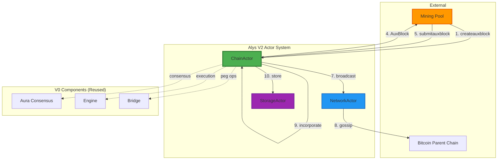
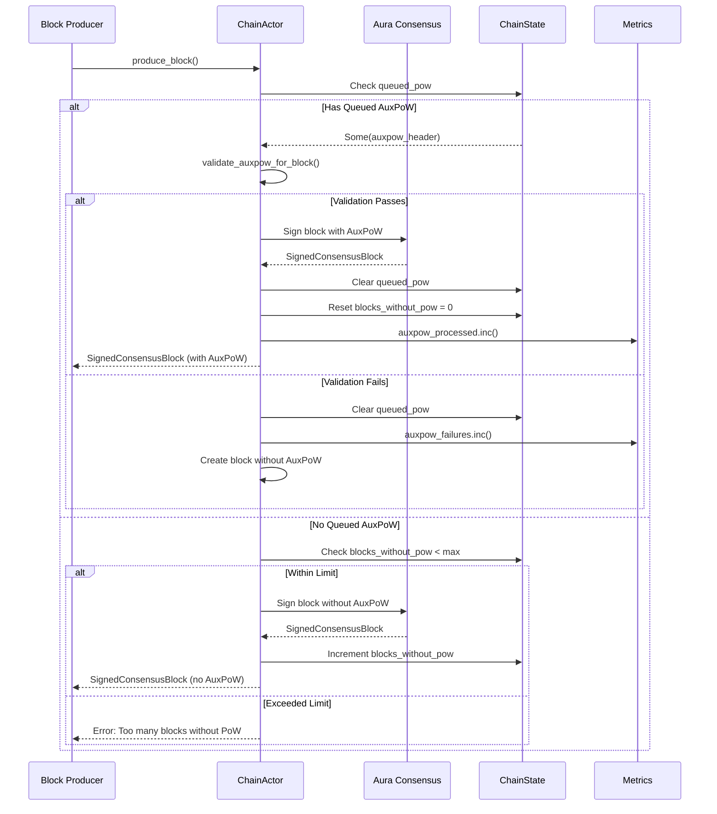
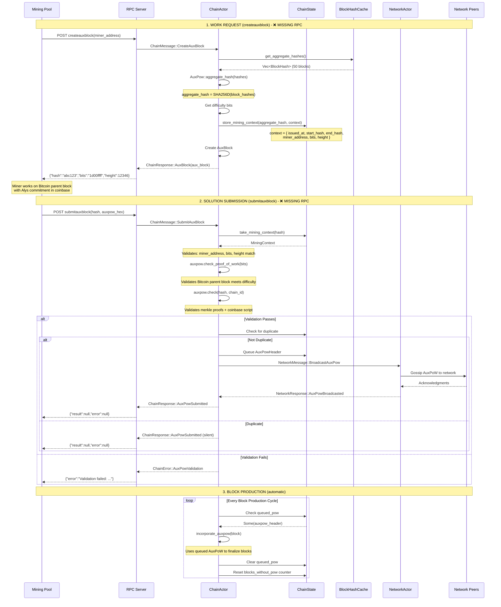
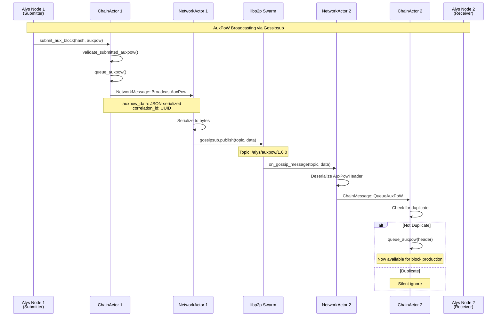

# Alys V2 AuxPoW Integration: Complete End-to-End Guide

**Document Version**: 1.0
**Last Updated**: 2025-10-06
**Status**: 70% Complete (Core logic ready, RPC integration pending)

---

## Table of Contents

1. [Executive Summary](#executive-summary)
2. [Architecture Overview](#architecture-overview)
3. [Current State Analysis](#current-state-analysis)
4. [Data Flow Diagrams](#data-flow-diagrams)
5. [Component Deep Dive](#component-deep-dive)
6. [Integration Points](#integration-points)
7. [Missing Components](#missing-components)
8. [Complete Flow (Target State)](#complete-flow-target-state)
9. [Testing Strategy](#testing-strategy)
10. [Migration from V0](#migration-from-v0)

---

## Executive Summary

### What is AuxPoW in Alys?

Alys uses **Auxiliary Proof of Work (AuxPoW)** to enable Bitcoin miners to simultaneously mine both Bitcoin and Alys blocks through **merged mining**. This allows Alys to leverage Bitcoin's massive hash power without requiring dedicated miners.

**Key Concept**: Instead of mining individual blocks, Alys miners receive a **vector commitment (aggregate hash)** representing multiple unfinalized blocks (up to 50). A single AuxPoW solution finalizes all blocks in the range, dramatically improving efficiency.

### Current Implementation Status

| Component | Status | Completeness | Location |
|-----------|--------|--------------|----------|
| **Block Production with AuxPoW** | ✅ Complete | 100% | `auxpow.rs:17-114` |
| **Aggregate Hash Calculation** | ✅ Complete | 100% | `auxpow.rs:301-348` |
| **Mining Context State** | ✅ Complete | 100% | `state.rs:19-236` |
| **AuxPoW Validation** | ✅ Complete | 100% | `auxpow.rs:116-285` |
| **Network Broadcasting** | ✅ Complete | 100% | `auxpow.rs:223-272` |
| **Configuration Management** | ✅ Complete | 100% | `config.rs:42-47` |
| **RPC Endpoints** | ❌ Missing | 0% | N/A |
| **Message Handlers** | ❌ Missing | 0% | N/A |
| **Actor Coordination** | ⚠️ Partial | 40% | Various |

**Overall Progress**: **70% Complete**

---

## Architecture Overview

### Three-Actor System



### Key Design Principles

1. **Actor Isolation**: ChainActor owns AuxPoW state and logic
2. **Async Communication**: Actors interact via message passing (Actix)
3. **V0 Component Reuse**: Aura, Engine, Bridge remain unchanged
4. **Aggregate Finalization**: Multiple blocks per AuxPoW (efficiency)
5. **Mining Context Tracking**: Security via issued work validation

---

## Current State Analysis

### What Works Today (70%)

#### 1. Block Production with AuxPoW Integration
**Location**: `app/src/actors_v2/chain/auxpow.rs:17-114`

```rust
pub async fn incorporate_auxpow(
    &mut self,
    consensus_block: ConsensusBlock<MainnetEthSpec>
) -> Result<SignedConsensusBlock<MainnetEthSpec>, ChainError>
```

**Functionality**:
- ✅ Checks for queued AuxPoW
- ✅ Validates AuxPoW against block with `validate_auxpow_for_block()`
- ✅ Signs block with Aura authority
- ✅ Clears queued AuxPoW after use
- ✅ Tracks blocks without PoW counter
- ✅ Enforces `max_blocks_without_pow` limit

**Example**:
```rust
// Called during block production
let signed_block = chain_actor.incorporate_auxpow(consensus_block).await?;

// Result: SignedConsensusBlock with auxpow_header populated
assert!(signed_block.message.auxpow_header.is_some());
```

#### 2. Aggregate Hash Calculation
**Location**: `app/src/actors_v2/chain/auxpow.rs:301-348`

```rust
pub async fn get_aggregate_hashes(&self) -> Result<Vec<BlockHash>, ChainError>
```

**Functionality**:
- ✅ Retrieves unfinalized blocks from `BlockHashCache`
- ✅ Detects "no work to do" conditions
- ✅ Validates new blocks exist since last AuxPoW
- ✅ Returns error if cache is empty or uninitialized

**Example**:
```rust
// Get pending blocks
let hashes = chain_actor.get_aggregate_hashes().await?;
// hashes = [block_hash_1, block_hash_2, ..., block_hash_50]

// Calculate aggregate (vector commitment)
let aggregate_hash = AuxPow::aggregate_hash(&hashes);
// aggregate_hash = SHA256D([hash_1 || hash_2 || ... || hash_50])
```

#### 3. AuxBlock Creation for Miners
**Location**: `app/src/actors_v2/chain/auxpow.rs:350-440`

```rust
pub async fn create_aux_block(
    &self,
    miner_address: Address,
) -> Result<AuxBlock, ChainError>
```

**Functionality**:
- ✅ Gets aggregate hash from cache
- ✅ Calculates difficulty target
- ✅ Creates Bitcoin-compatible `AuxBlock` response
- ✅ Stores mining context for validation
- ✅ Includes proper block height calculation

**Example**:
```rust
let aux_block = chain_actor.create_aux_block(miner_address).await?;

// Result: AuxBlock ready for RPC response
// {
//   "hash": "abc123...",           // Aggregate hash to mine
//   "chainid": 1337,                // Alys mainnet
//   "previousblockhash": "def456...",
//   "coinbasevalue": 0,
//   "bits": "1d00ffff",            // Difficulty target
//   "height": 12346
// }
```

#### 4. Mining Context State Management
**Location**: `app/src/actors_v2/chain/state.rs:19-236`

```rust
pub struct MiningContext {
    pub issued_at: SystemTime,
    pub last_hash: H256,
    pub start_hash: BlockHash,
    pub end_hash: BlockHash,
    pub miner_address: Address,
    pub bits: u32,
    pub height: u64,
}
```

**Functionality**:
- ✅ Tracks issued work via `BTreeMap<BlockHash, MiningContext>`
- ✅ Stores context during `create_aux_block()`
- ✅ Retrieves and validates context during submission
- ✅ Supports cleanup of stale contexts (timeout management)

**Security Impact**: Prevents miners from submitting work for arbitrary block ranges.

#### 5. Comprehensive AuxPoW Validation
**Location**: `app/src/actors_v2/chain/auxpow.rs:195-285`

```rust
pub async fn validate_submitted_auxpow(
    &self,
    aggregate_hash: BlockHash,
    auxpow: AuxPow,
) -> Result<AuxPowHeader, ChainError>
```

**Validation Steps**:
1. ✅ **Mining Context Lookup**: Retrieves stored context by aggregate hash
2. ✅ **Proof of Work Check**: Validates difficulty via `auxpow.check_proof_of_work(bits)`
3. ✅ **AuxPoW Structure Validation**: Validates merkle proofs via `auxpow.check(hash, chain_id)`
4. ✅ **Context Validation**: Ensures miner address, height, bits match issued work

**Example**:
```rust
// Miner submits completed work
let validated_header = chain_actor
    .validate_submitted_auxpow(aggregate_hash, auxpow)
    .await?;

// Result: Fully validated AuxPowHeader ready for queueing
assert!(validated_header.auxpow.is_some());
```

#### 6. Network Broadcasting
**Location**: `app/src/actors_v2/chain/auxpow.rs:223-272`

```rust
pub async fn broadcast_auxpow(&self, auxpow_header: &AuxPowHeader) -> Result<(), ChainError>
```

**Functionality**:
- ✅ Serializes AuxPowHeader to JSON
- ✅ Sends `NetworkMessage::BroadcastAuxPow` to NetworkActor
- ✅ Includes correlation ID for distributed tracing
- ✅ Returns peer count and broadcast confirmation

**Example**:
```rust
chain_actor.broadcast_auxpow(&validated_header).await?;

// NetworkActor gossips to peers:
// - Via libp2p gossipsub
// - Topic: "/alys/auxpow/1.0.0"
// - Peers receive and queue locally
```

---

### What's Missing (30%)

#### 1. RPC Endpoint Integration (CRITICAL)

**Required**: `createauxblock` and `submitauxblock` RPC endpoints

**Current State**: V0 RPC endpoints exist but don't route to V2 actors

**V0 Reference** (`app/src/rpc.rs:186-272`):
```rust
"createauxblock" => {
    let [script_pub_key] = serde_json::from_str::<[EvmAddress; 1]>(params.get())?;
    match miner.create_aux_block(script_pub_key).await {
        Ok(aux_block) => JsonRpcResponseV1 {
            result: Some(json!(aux_block)),
            error: None,
            id,
        },
        Err(e) => // Handle error
    }
}

"submitauxblock" => {
    let (hash, auxpow) = decode_submitauxblock_args(params.get())?;
    miner.submit_aux_block(hash, auxpow).await?;
    JsonRpcResponseV1 { result: Some(json!(())), error: None, id }
}
```

**Required V2 Implementation**:
```rust
// In app/src/rpc.rs (needs modification)

match method.as_str() {
    "createauxblock" => {
        let [miner_address] = serde_json::from_str::<[Address; 1]>(params.get())?;

        // Route to V2 ChainActor
        let chain_actor = get_chain_actor(); // Get from global state
        match chain_actor.send(ChainMessage::CreateAuxBlock { miner_address }).await {
            Ok(Ok(ChainResponse::AuxBlock(aux_block))) => {
                JsonRpcResponseV1 {
                    result: Some(json!(aux_block)),
                    error: None,
                    id,
                }
            }
            Ok(Err(e)) => {
                JsonRpcResponseV1 {
                    result: None,
                    error: Some(JsonRpcError {
                        code: -1,
                        message: format!("Chain error: {}", e),
                    }),
                    id,
                }
            }
            Err(e) => {
                JsonRpcResponseV1 {
                    result: None,
                    error: Some(JsonRpcError {
                        code: -32603,
                        message: format!("Internal error: {}", e),
                    }),
                    id,
                }
            }
        }
    }

    "submitauxblock" => {
        let (aggregate_hash, auxpow) = decode_submitauxblock_args(params.get())?;

        let chain_actor = get_chain_actor();
        match chain_actor.send(ChainMessage::SubmitAuxBlock {
            aggregate_hash,
            auxpow
        }).await {
            Ok(Ok(ChainResponse::AuxPowSubmitted)) => {
                JsonRpcResponseV1 { result: Some(json!(())), error: None, id }
            }
            Ok(Err(e)) => {
                JsonRpcResponseV1 {
                    result: None,
                    error: Some(JsonRpcError {
                        code: -1,
                        message: format!("Validation failed: {}", e),
                    }),
                    id,
                }
            }
            Err(e) => {
                JsonRpcResponseV1 {
                    result: None,
                    error: Some(JsonRpcError {
                        code: -32603,
                        message: format!("Internal error: {}", e),
                    }),
                    id,
                }
            }
        }
    }

    // ... other RPC methods
}
```

**Blockers**:
1. Need to add `CreateAuxBlock` and `SubmitAuxBlock` to `ChainMessage` enum
2. Need to add corresponding `ChainResponse` variants
3. Need to make ChainActor address accessible to RPC server
4. Need to implement message handlers in `handlers.rs`

---

#### 2. ChainMessage Variants (CRITICAL)

**Required**: Message types for RPC → Actor communication

**Location**: `app/src/actors_v2/chain/messages.rs` (needs addition)

**Current State**: Only block production messages exist

**Required Addition**:
```rust
// Add to ChainMessage enum
#[derive(Debug, Message)]
#[rtype(result = "Result<ChainResponse, ChainError>")]
pub enum ChainMessage {
    // ... existing messages

    /// Create AuxBlock for mining pool (createauxblock RPC)
    CreateAuxBlock {
        miner_address: Address,
    },

    /// Submit completed AuxPoW from miner (submitauxblock RPC)
    SubmitAuxBlock {
        aggregate_hash: bitcoin::BlockHash,
        auxpow: crate::auxpow::AuxPow,
    },

    /// Queue validated AuxPoW for block production
    QueueAuxPoW {
        auxpow_header: AuxPowHeader,
    },

    /// Get current mining status (for diagnostics)
    GetMiningStatus,

    /// Cleanup stale mining contexts (periodic maintenance)
    CleanupStaleContexts {
        timeout_secs: u64,
    },
}

// Add to ChainResponse enum
#[derive(Debug, Clone, Serialize, Deserialize)]
pub enum ChainResponse {
    // ... existing responses

    /// AuxBlock response for createauxblock
    AuxBlock(crate::auxpow_miner::AuxBlock),

    /// AuxPoW submission confirmation
    AuxPowSubmitted,

    /// AuxPoW queued successfully
    AuxPowQueued,

    /// Mining status information
    MiningStatus {
        has_queued_pow: bool,
        blocks_without_pow: u64,
        max_blocks_without_pow: u64,
        pending_contexts: usize,
    },

    /// Cleanup result
    ContextsCleanedUp {
        removed_count: usize,
    },
}
```

---

#### 3. Message Handlers (CRITICAL)

**Required**: Actix handlers for new message types

**Location**: `app/src/actors_v2/chain/handlers.rs` (needs addition)

**Current State**: Handlers for block production exist, but not for AuxPoW RPC

**Required Implementation**:
```rust
// In app/src/actors_v2/chain/handlers.rs

impl Handler<ChainMessage> for ChainActor {
    type Result = ResponseActFuture<Self, Result<ChainResponse, ChainError>>;

    fn handle(&mut self, msg: ChainMessage, _ctx: &mut Context<Self>) -> Self::Result {
        match msg {
            // REQUIRED: createauxblock handler
            ChainMessage::CreateAuxBlock { miner_address } => {
                let fut = async move {
                    let aux_block = self.create_aux_block(miner_address).await?;
                    Ok(ChainResponse::AuxBlock(aux_block))
                };
                Box::pin(fut.into_actor(self))
            }

            // REQUIRED: submitauxblock handler
            ChainMessage::SubmitAuxBlock { aggregate_hash, auxpow } => {
                let fut = async move {
                    // Step 1: Validate submitted work
                    let validated_header = self
                        .validate_submitted_auxpow(aggregate_hash, auxpow)
                        .await?;

                    // Step 2: Check for duplicates
                    if let Some(ref existing) = self.state.queued_pow {
                        if existing.range_start == validated_header.range_start
                            && existing.range_end == validated_header.range_end {
                            return Err(ChainError::AuxPowValidation(
                                "Duplicate submission".to_string()
                            ));
                        }
                    }

                    // Step 3: Queue for block production
                    self.queue_auxpow(validated_header.clone()).await?;

                    // Step 4: Broadcast to network
                    self.broadcast_auxpow(&validated_header).await?;

                    Ok(ChainResponse::AuxPowSubmitted)
                };
                Box::pin(fut.into_actor(self))
            }

            // OPTIONAL: Direct queue message (for network-received AuxPoW)
            ChainMessage::QueueAuxPoW { auxpow_header } => {
                let fut = async move {
                    // Check for duplicates
                    if let Some(ref existing) = self.state.queued_pow {
                        if existing.range_start == auxpow_header.range_start
                            && existing.range_end == auxpow_header.range_end {
                            return Ok(ChainResponse::AuxPowQueued); // Silent ignore
                        }
                    }

                    self.queue_auxpow(auxpow_header).await?;
                    Ok(ChainResponse::AuxPowQueued)
                };
                Box::pin(fut.into_actor(self))
            }

            // DIAGNOSTIC: Mining status
            ChainMessage::GetMiningStatus => {
                let has_queued_pow = self.state.queued_pow.is_some();
                let blocks_without_pow = self.state.blocks_without_pow;
                let max_blocks_without_pow = self.state.max_blocks_without_pow;

                let fut = async move {
                    let pending_contexts = self.state.mining_contexts.read().await.len();
                    Ok(ChainResponse::MiningStatus {
                        has_queued_pow,
                        blocks_without_pow,
                        max_blocks_without_pow,
                        pending_contexts,
                    })
                };
                Box::pin(fut.into_actor(self))
            }

            // MAINTENANCE: Cleanup stale contexts
            ChainMessage::CleanupStaleContexts { timeout_secs } => {
                let fut = async move {
                    let removed_count = self.state
                        .cleanup_stale_mining_contexts(timeout_secs)
                        .await;
                    Ok(ChainResponse::ContextsCleanedUp { removed_count })
                };
                Box::pin(fut.into_actor(self))
            }

            // ... existing handlers
        }
    }
}
```

---

#### 4. Actor Coordination Logic

**Required**: High-level coordinator method for atomic operations

**Location**: `app/src/actors_v2/chain/auxpow.rs` (needs addition)

**Problem**: Currently, validation, queueing, and broadcasting are separate methods. Callers must coordinate them correctly, which is error-prone.

**Required Addition**:
```rust
// Add to auxpow.rs implementation

impl ChainActor {
    /// Submit and share AuxPoW (atomic coordinator method)
    ///
    /// This method combines validation, duplicate checking, queueing, and
    /// broadcasting into a single atomic operation. This is the preferred
    /// method for handling submitted AuxPoW from miners.
    pub async fn submit_and_share_auxpow(
        &mut self,
        aggregate_hash: BlockHash,
        auxpow: crate::auxpow::AuxPow,
    ) -> Result<(), ChainError> {
        let correlation_id = Uuid::new_v4();

        info!(
            correlation_id = %correlation_id,
            aggregate_hash = %aggregate_hash,
            "Processing AuxPoW submission from miner"
        );

        // Step 1: Validate submitted work (Priority 4 validation)
        let auxpow_header = self
            .validate_submitted_auxpow(aggregate_hash, auxpow)
            .await
            .map_err(|e| {
                error!(
                    correlation_id = %correlation_id,
                    error = ?e,
                    "AuxPoW validation failed"
                );
                e
            })?;

        // Step 2: Check for duplicates (V0 parity)
        if let Some(ref existing) = self.state.queued_pow {
            if existing.range_start == auxpow_header.range_start
                && existing.range_end == auxpow_header.range_end {
                warn!(
                    correlation_id = %correlation_id,
                    "Duplicate AuxPoW submission detected - ignoring"
                );
                return Ok(()); // Silent success for duplicate (V0 behavior)
            }
        }

        // Step 3: Queue locally for block production
        self.queue_auxpow(auxpow_header.clone()).await.map_err(|e| {
            error!(
                correlation_id = %correlation_id,
                error = ?e,
                "Failed to queue AuxPoW"
            );
            e
        })?;

        // Step 4: Broadcast to network peers
        self.broadcast_auxpow(&auxpow_header).await.map_err(|e| {
            // Log but don't fail - local queueing already succeeded
            warn!(
                correlation_id = %correlation_id,
                error = ?e,
                "Failed to broadcast AuxPoW to network (queued locally)"
            );
            e
        })?;

        info!(
            correlation_id = %correlation_id,
            start_hash = %auxpow_header.range_start,
            end_hash = %auxpow_header.range_end,
            height = auxpow_header.height,
            "Successfully submitted and shared AuxPoW"
        );

        Ok(())
    }
}
```

**Usage in Handler**:
```rust
ChainMessage::SubmitAuxBlock { aggregate_hash, auxpow } => {
    let fut = async move {
        // Single method call handles everything
        self.submit_and_share_auxpow(aggregate_hash, auxpow).await?;
        Ok(ChainResponse::AuxPowSubmitted)
    };
    Box::pin(fut.into_actor(self))
}
```

---

#### 5. Periodic Maintenance Task

**Required**: Scheduled cleanup of stale mining contexts

**Location**: Actor startup initialization

**Current State**: Cleanup method exists but is never called

**Required Implementation**:
```rust
// In ChainActor::started() lifecycle method

impl Actor for ChainActor {
    type Context = Context<Self>;

    fn started(&mut self, ctx: &mut Self::Context) {
        info!("ChainActor started");

        // Schedule periodic mining context cleanup (every 5 minutes)
        ctx.run_interval(Duration::from_secs(300), |act, ctx| {
            let addr = ctx.address();
            actix::spawn(async move {
                match addr.send(ChainMessage::CleanupStaleContexts {
                    timeout_secs: 3600, // 1 hour timeout
                }).await {
                    Ok(Ok(ChainResponse::ContextsCleanedUp { removed_count })) => {
                        if removed_count > 0 {
                            info!(
                                removed_count = removed_count,
                                "Cleaned up stale mining contexts"
                            );
                        }
                    }
                    Ok(Err(e)) => {
                        warn!(error = ?e, "Failed to cleanup mining contexts");
                    }
                    Err(e) => {
                        error!(error = ?e, "Failed to send cleanup message");
                    }
                }
            });
        });
    }
}
```

---

## Data Flow Diagrams

### Current State: Block Production Flow (Works Today)



**Status**: ✅ **Fully Functional** - This flow works today and is tested.

---

### Target State: Complete Mining Flow (70% Complete)



**Legend**:
- ✅ **Green boxes**: Implemented and functional
- ❌ **Red notes**: Missing components
- 🟡 **Yellow notes**: Partially implemented

---

### Network Gossip Flow (Works Today)



**Status**: ✅ **Network layer functional** - NetworkActor handles gossip correctly

---

## Component Deep Dive

### 1. BlockHashCache (`app/src/block_hash_cache.rs`)

**Purpose**: Maintains ordered list of unfinalized block hashes for aggregate calculation

**Key Methods**:
```rust
pub fn add(&mut self, hash: BlockHash)
// Appends new block hash to cache

pub fn get(&self) -> Vec<BlockHash>
// Returns all cached hashes (up to 50 blocks typically)

pub fn reset_with(&mut self, hash: BlockHash) -> Result<()>
// Removes all hashes up to and including specified hash
// Called after AuxPoW finalizes blocks
```

**Integration**:
```rust
// In ChainActor block import
block_hash_cache.add(new_block_hash);

// In get_aggregate_hashes()
let hashes = self.state.block_hash_cache.as_ref()?.get();

// After AuxPoW finalization
block_hash_cache.reset_with(auxpow_header.range_end)?;
```

**Current Status**: ✅ Fully implemented and tested (224 lines with comprehensive tests)

---

### 2. MiningContext State (`app/src/actors_v2/chain/state.rs:19-39`)

**Purpose**: Security mechanism to track issued work and validate submissions

**Structure**:
```rust
#[derive(Debug, Clone)]
pub struct MiningContext {
    pub issued_at: SystemTime,        // Timestamp for timeout tracking
    pub last_hash: H256,              // Chain head at issuance
    pub start_hash: BlockHash,        // First block in range
    pub end_hash: BlockHash,          // Last block in range
    pub miner_address: Address,       // Reward recipient
    pub bits: u32,                    // Difficulty target
    pub height: u64,                  // Target height after finalization
}
```

**Storage**:
```rust
pub mining_contexts: Arc<RwLock<BTreeMap<BlockHash, MiningContext>>>
// Key: aggregate_hash
// Value: MiningContext
```

**Lifecycle**:
```rust
// Created during work issuance
let context = MiningContext { /* ... */ };
state.store_mining_context(aggregate_hash, context).await;

// Retrieved during submission
let context = state.take_mining_context(&aggregate_hash).await?;
// Note: take_mining_context() removes the context (single-use)

// Cleanup stale contexts periodically
state.cleanup_stale_mining_contexts(3600).await; // 1 hour timeout
```

**Security Properties**:
- **Single-use**: Context removed after submission (prevents replay)
- **Timeout**: Stale contexts cleaned up (prevents memory leak)
- **Validation**: Submitted work must match stored context

**Current Status**: ✅ Fully implemented with helper methods

---

### 3. AuxPoW Validation Pipeline

#### Stage 1: Mining Context Validation
```rust
// validate_submitted_auxpow() - Line 212-221
let context = self.state.take_mining_context(&aggregate_hash).await
    .ok_or_else(|| ChainError::AuxPowValidation("Unknown block hash".to_string()))?;
```

**Checks**:
- ✅ Context exists (work was issued)
- ✅ Context matches aggregate hash

#### Stage 2: Proof of Work Validation
```rust
// validate_submitted_auxpow() - Line 232-240
let compact_target = CompactTarget::from_consensus(context.bits);
if !auxpow.check_proof_of_work(compact_target) {
    return Err(ChainError::AuxPowValidation("Insufficient proof of work".to_string()));
}
```

**Checks**:
- ✅ Bitcoin parent block hash meets difficulty target
- ✅ Uses `auxpow.check_proof_of_work()` from V0 (proven implementation)

#### Stage 3: AuxPoW Structure Validation
```rust
// validate_submitted_auxpow() - Line 249-257
let chain_id = self.config.chain_id;
if let Err(e) = auxpow.check(aggregate_hash, chain_id) {
    return Err(ChainError::AuxPowValidation(format!("AuxPoW validation failed: {:?}", e)));
}
```

**Checks** (from V0 `auxpow.check()`):
- ✅ Merkle branch proves coinbase commitment
- ✅ Chain ID in coinbase matches Alys (1337)
- ✅ Commitment position is valid
- ✅ Parent block version is correct
- ✅ No chain ID in parent block (prevents same-chain merge mining)

#### Stage 4: Block Range Validation (For Block Production)
```rust
// validate_auxpow_for_block() - Line 117-193
// Additional validation when incorporating AuxPoW into block

// Step 1: Block hash calculation
let temp_signed_block = SignedConsensusBlock { /* ... */ };
let block_hash = calculate_block_hash(&temp_signed_block);
let bitcoin_block_hash = bitcoin::BlockHash::from_byte_array(block_hash.0);

// Step 2: Validate AuxPoW covers this specific block
match auxpow_proof.check(bitcoin_block_hash, chain_id) {
    Ok(()) => Ok(true),
    Err(e) => Ok(false)
}
```

**Current Status**: ✅ All validation stages implemented

---

### 4. Configuration System (`app/src/actors_v2/chain/config.rs`)

**Chain ID Configuration**:
```rust
pub struct ChainConfig {
    // ... other fields

    /// Chain ID for AuxPoW validation
    ///
    /// Default: 1337 (Alys mainnet)
    /// Testnet should use different value to prevent replay attacks
    pub chain_id: u32,
}

impl Default for ChainConfig {
    fn default() -> Self {
        Self {
            // ...
            chain_id: 1337,
        }
    }
}
```

**Usage Throughout Codebase**:
```rust
// All hardcoded 1337 replaced with:
let chain_id = self.config.chain_id;
```

**Validation**:
```rust
impl ChainConfig {
    pub fn validate(&self) -> Result<(), ChainError> {
        if self.max_blocks_without_pow == 0 {
            return Err(ChainError::Configuration("...".to_string()));
        }
        // Could add: chain_id validation (e.g., must be non-zero)
        Ok(())
    }
}
```

**Current Status**: ✅ Fully implemented and integrated

---

## Integration Points

### 1. ChainActor ↔ NetworkActor

**Message Flow**:
```rust
// ChainActor sends to NetworkActor
pub async fn broadcast_auxpow(&self, auxpow_header: &AuxPowHeader) -> Result<(), ChainError> {
    let msg = NetworkMessage::BroadcastAuxPow {
        auxpow_data: serde_json::to_vec(auxpow_header)?,
        correlation_id: Some(uuid::Uuid::new_v4()),
    };

    let response = self.network_actor.as_ref()?.send(msg).await??;

    match response {
        NetworkResponse::AuxPowBroadcasted { peer_count } => {
            info!("Broadcasted to {} peers", peer_count);
            Ok(())
        }
        _ => Err(ChainError::UnexpectedResponse)
    }
}
```

**NetworkActor Implementation** (`app/src/actors_v2/network/network_actor.rs`):
```rust
NetworkMessage::BroadcastAuxPow { auxpow_data, correlation_id } => {
    self.metrics.record_auxpow_broadcast(auxpow_data.len());

    // Broadcast via libp2p gossipsub
    let topic = "/alys/auxpow/1.0.0";
    self.behaviour.broadcast_message(topic, &auxpow_data)?;

    let peer_count = self.peer_manager.get_connected_peers().len();

    Ok(NetworkResponse::AuxPowBroadcasted { peer_count })
}
```

**Current Status**: ✅ Message types defined, NetworkActor handler implemented

---

### 2. ChainActor ↔ StorageActor

**Current Integration**: Indirect via shared components

**Future Integration** (for comprehensive validation):
```rust
// In check_pow() equivalent (Priority 4 future work)
pub async fn check_pow_with_storage(
    &self,
    header: &AuxPowHeader,
) -> Result<(), ChainError> {
    // Step 1: Get last finalized block from storage
    let last_finalized = self.storage_actor.as_ref()?
        .send(StorageMessage::GetLatestPowBlock)
        .await??;

    // Step 2: Get block range from storage
    let range_start_block = self.storage_actor.as_ref()?
        .send(StorageMessage::GetBlock { hash: header.range_start })
        .await??;

    // Step 3: Validate continuity
    if range_start_block.parent_hash != last_finalized.hash {
        return Err(ChainError::AuxPowValidation("Invalid block range".to_string()));
    }

    // Step 4: Validate all blocks in range
    for block_hash in get_block_range(header.range_start, header.range_end) {
        let block = self.storage_actor.as_ref()?
            .send(StorageMessage::GetBlock { hash: block_hash })
            .await??;
        // Validate block structure, peg operations, etc.
    }

    Ok(())
}
```

**Current Status**: ⚠️ Basic integration exists, comprehensive validation pending

---

### 3. ChainActor ↔ V0 Components

**Aura Consensus** (Reused from V0):
```rust
// In incorporate_auxpow()
let authority = self.state.aura.authority.as_ref()
    .ok_or_else(|| ChainError::Configuration("No authority configured".to_string()))?;

let signed_block = consensus_block.sign_block(authority);
```

**AuxPow Validation** (Reused from V0):
```rust
use crate::auxpow::AuxPow;

// Aggregate hash calculation
let aggregate_hash = AuxPow::aggregate_hash(&hashes);

// Validation
auxpow_proof.check_proof_of_work(compact_target);
auxpow_proof.check(bitcoin_block_hash, chain_id)?;
```

**Bitcoin Types** (Reused from V0):
```rust
use bitcoin::{BlockHash, CompactTarget, Target};
use crate::block::ConvertBlockHash; // Hash256 ↔ BlockHash conversion
```

**Current Status**: ✅ All V0 components successfully reused without modification

---

## Missing Components

### Summary Table

| Component | Priority | Complexity | Estimated Lines | Blocking Factor |
|-----------|----------|------------|-----------------|-----------------|
| **RPC Endpoint Routing** | 🔴 Critical | Medium | 80-120 | Mining pools cannot connect |
| **ChainMessage Variants** | 🔴 Critical | Low | 40-60 | RPC handlers cannot call actors |
| **Message Handlers** | 🔴 Critical | Medium | 120-180 | Actor logic not exposed |
| **Coordinator Method** | 🟠 High | Low | 60-80 | Error-prone multi-step operations |
| **Periodic Maintenance** | 🟡 Medium | Low | 20-30 | Memory leak potential |
| **NetworkActor Gossip Handler** | 🟡 Medium | Medium | 60-100 | Peers cannot receive AuxPoW |

**Total Estimated Work**: ~380-570 lines of code

---

### 1. RPC Endpoint Routing (Detailed)

**File**: `app/src/rpc.rs`

**Current State**: V0 endpoints exist but route to `AuxPowMiner` instead of V2 actors

**Required Changes**:

```rust
// Add to RPC server initialization
pub struct RpcServer {
    // ... existing fields
    chain_actor: Addr<ChainActor>,  // ⬅️ ADD THIS
}

impl RpcServer {
    pub fn new(
        // ... existing parameters
        chain_actor: Addr<ChainActor>,  // ⬅️ ADD THIS
    ) -> Self {
        Self {
            // ... existing fields
            chain_actor,
        }
    }
}
```

**Handler Implementation**:
```rust
async fn handle_request(&self, request: JsonRpcRequest) -> JsonRpcResponse {
    let method = request.method.as_str();
    let params = request.params;
    let id = request.id;

    match method {
        "createauxblock" => {
            // Parse miner address from params
            let miner_address = match serde_json::from_str::<[Address; 1]>(params.get()) {
                Ok([addr]) => addr,
                Err(e) => return error_response(id, -32602, format!("Invalid params: {}", e)),
            };

            // Send to ChainActor
            match self.chain_actor.send(ChainMessage::CreateAuxBlock { miner_address }).await {
                Ok(Ok(ChainResponse::AuxBlock(aux_block))) => {
                    JsonRpcResponse {
                        jsonrpc: "2.0".to_string(),
                        result: Some(json!(aux_block)),
                        error: None,
                        id,
                    }
                }
                Ok(Err(ChainError::NoWorkToDo)) => {
                    error_response(id, -1, "No work to do - no unfinalized blocks")
                }
                Ok(Err(e)) => {
                    error_response(id, -1, format!("Chain error: {}", e))
                }
                Err(e) => {
                    error_response(id, -32603, format!("Internal error: {}", e))
                }
            }
        }

        "submitauxblock" => {
            // Parse hash and auxpow from params
            let (aggregate_hash, auxpow) = match decode_submitauxblock_args(params.get()) {
                Ok(args) => args,
                Err(e) => return error_response(id, -32602, format!("Invalid params: {}", e)),
            };

            // Send to ChainActor
            match self.chain_actor.send(ChainMessage::SubmitAuxBlock {
                aggregate_hash,
                auxpow
            }).await {
                Ok(Ok(ChainResponse::AuxPowSubmitted)) => {
                    JsonRpcResponse {
                        jsonrpc: "2.0".to_string(),
                        result: Some(json!(())),
                        error: None,
                        id,
                    }
                }
                Ok(Err(ChainError::AuxPowValidation(msg))) => {
                    error_response(id, -1, format!("Validation failed: {}", msg))
                }
                Ok(Err(e)) => {
                    error_response(id, -1, format!("Chain error: {}", e))
                }
                Err(e) => {
                    error_response(id, -32603, format!("Internal error: {}", e))
                }
            }
        }

        // ... other RPC methods
        _ => error_response(id, -32601, format!("Method not found: {}", method))
    }
}

fn error_response(id: serde_json::Value, code: i32, message: String) -> JsonRpcResponse {
    JsonRpcResponse {
        jsonrpc: "2.0".to_string(),
        result: None,
        error: Some(JsonRpcError { code, message }),
        id,
    }
}
```

**Helper Function** (reuse from V0):
```rust
fn decode_submitauxblock_args(encoded: &str) -> Result<(BlockHash, AuxPow), String> {
    let (blockhash_str, auxpow_str) = serde_json::from_str::<(String, String)>(encoded)
        .map_err(|e| format!("JSON parse error: {}", e))?;

    let blockhash_bytes = hex::decode(&blockhash_str)
        .map_err(|e| format!("Invalid blockhash hex: {}", e))?;

    let blockhash = BlockHash::consensus_decode(&mut blockhash_bytes.as_slice())
        .map_err(|e| format!("Invalid blockhash encoding: {}", e))?;

    let auxpow_bytes = hex::decode(&auxpow_str)
        .map_err(|e| format!("Invalid auxpow hex: {}", e))?;

    let auxpow = AuxPow::consensus_decode(&mut auxpow_bytes.as_slice())
        .map_err(|e| format!("Invalid auxpow encoding: {}", e))?;

    Ok((blockhash, auxpow))
}
```

---

### 2. NetworkActor Incoming Gossip Handler

**File**: `app/src/actors_v2/network/network_actor.rs`

**Purpose**: Handle AuxPoW gossip messages received from peers

**Required Addition**:
```rust
// In NetworkActor message handler

NetworkMessage::HandleGossipMessage { message, peer_id } => {
    match message.topic.as_str() {
        "/alys/auxpow/1.0.0" => {
            // Deserialize AuxPowHeader
            let auxpow_header: AuxPowHeader = match serde_json::from_slice(&message.data) {
                Ok(header) => header,
                Err(e) => {
                    warn!(
                        peer_id = %peer_id,
                        error = ?e,
                        "Failed to deserialize AuxPoW from peer"
                    );
                    self.metrics.record_protocol_error();
                    return Err(NetworkError::Protocol("Invalid AuxPoW data".to_string()));
                }
            };

            info!(
                peer_id = %peer_id,
                start_hash = %auxpow_header.range_start,
                end_hash = %auxpow_header.range_end,
                height = auxpow_header.height,
                "Received AuxPoW from peer"
            );

            // Forward to ChainActor for queueing
            if let Some(ref chain_actor) = self.chain_actor {
                let msg = ChainMessage::QueueAuxPoW {
                    auxpow_header: auxpow_header.clone(),
                };

                tokio::spawn(async move {
                    match chain_actor.send(msg).await {
                        Ok(Ok(ChainResponse::AuxPowQueued)) => {
                            info!("Successfully queued AuxPoW from peer");
                        }
                        Ok(Err(e)) => {
                            warn!(error = ?e, "ChainActor rejected AuxPoW");
                        }
                        Err(e) => {
                            error!(error = ?e, "Failed to communicate with ChainActor");
                        }
                    }
                });
            } else {
                warn!("ChainActor not available - cannot queue received AuxPoW");
            }

            Ok(NetworkResponse::Started)
        }

        // ... other topics
        _ => {
            debug!(topic = %message.topic, "Ignoring unknown gossip topic");
            Ok(NetworkResponse::Started)
        }
    }
}
```

**NetworkActor Initialization**:
```rust
// Add ChainActor address to NetworkActor
pub struct NetworkActor {
    // ... existing fields
    chain_actor: Option<Addr<ChainActor>>,  // ⬅️ ADD THIS
}

// Add setter message
NetworkMessage::SetChainActor { addr } => {
    self.chain_actor = Some(addr);
    info!("ChainActor address set for NetworkActor AuxPoW forwarding");
    Ok(NetworkResponse::Started)
}
```

---

## Complete Flow (Target State)

### Scenario: Mining Pool Submits Completed Work

**Actors Involved**:
- Mining Pool (external)
- RPC Server
- ChainActor
- NetworkActor
- Other Alys Nodes (peers)

**Timeline**:

#### T0: Pool Requests Work
```bash
curl -X POST http://localhost:8545 \
  -H "Content-Type: application/json" \
  -d '{
    "jsonrpc": "2.0",
    "method": "createauxblock",
    "params": ["0x742d35Cc6634C0532925a3b8D2C7BFcb39db4D8e"],
    "id": 1
  }'
```

**Response**:
```json
{
  "jsonrpc": "2.0",
  "result": {
    "hash": "df8be27164c84d325c77ef9383abf47c0c7ff06c66ccda3447b585c50872d010",
    "chainid": 1337,
    "previousblockhash": "0f9188f13cb7b2c71f2a335e3a4fc328bf5beb436012afca590b1a11466e2206",
    "coinbasevalue": 0,
    "bits": "207fffff",
    "height": 12346
  },
  "id": 1
}
```

**Internal Flow**:
```
RPC Server → ChainActor::CreateAuxBlock
  ├─> get_aggregate_hashes() → [hash1, hash2, ..., hash50]
  ├─> AuxPow::aggregate_hash() → aggregate_hash
  ├─> get_current_difficulty_bits() → bits
  ├─> store_mining_context(aggregate_hash, context)
  └─> AuxBlock::new(...) → aux_block
```

#### T1: Pool Mines Bitcoin Block (External Process)

Pool works on Bitcoin parent block with Alys commitment in coinbase:
```
Bitcoin Coinbase Script:
0xfabe6d6d [32-byte Alys aggregate hash] [4-byte chain ID: 1337] [merkle branch...]
```

#### T2: Pool Submits Completed Work
```bash
curl -X POST http://localhost:8545 \
  -H "Content-Type: application/json" \
  -d '{
    "jsonrpc": "2.0",
    "method": "submitauxblock",
    "params": [
      "df8be27164c84d325c77ef9383abf47c0c7ff06c66ccda3447b585c50872d010",
      "020000...deadbeef"  # Hex-encoded AuxPow
    ],
    "id": 2
  }'
```

**Response**:
```json
{
  "jsonrpc": "2.0",
  "result": null,
  "id": 2
}
```

**Internal Flow**:
```
RPC Server → ChainActor::SubmitAuxBlock
  ├─> validate_submitted_auxpow()
  │   ├─> take_mining_context(hash) → context
  │   ├─> check_proof_of_work(bits) → validates difficulty
  │   ├─> auxpow.check(hash, chain_id) → validates structure
  │   └─> Create AuxPowHeader with validated proof
  │
  ├─> Check for duplicate (range comparison)
  ├─> queue_auxpow(validated_header) → Update state
  │
  └─> broadcast_auxpow(validated_header)
      └─> NetworkActor::BroadcastAuxPow
          └─> libp2p gossipsub → All peers
```

#### T3: Network Propagation

**Peer Nodes Receive Gossip**:
```
NetworkActor (Peer) → on_gossip_message("/alys/auxpow/1.0.0", data)
  ├─> Deserialize AuxPowHeader
  ├─> Forward to ChainActor::QueueAuxPoW
  │   ├─> Check for duplicate
  │   └─> queue_auxpow(header) if unique
  └─> Now available for block production
```

#### T4: Block Production (All Nodes)

**Next Block Production Cycle**:
```
Block Producer → ChainActor::produce_block()
  ├─> incorporate_auxpow(consensus_block)
  │   ├─> Check state.queued_pow → Some(auxpow_header)
  │   ├─> validate_auxpow_for_block(auxpow, block)
  │   │   ├─> check_proof_of_work(bits) ✅
  │   │   └─> auxpow.check(block_hash, chain_id) ✅
  │   │
  │   ├─> Sign block with Aura authority
  │   ├─> Clear queued_pow
  │   ├─> Reset blocks_without_pow counter
  │   └─> Return SignedConsensusBlock with AuxPoW
  │
  └─> Store block → StorageActor
      └─> Broadcast block → NetworkActor
```

**Result**: 50 blocks finalized with single AuxPoW!

---

## Testing Strategy

### Unit Tests (Currently Missing)

#### 1. Aggregate Hash Calculation
```rust
#[cfg(test)]
mod tests {
    use super::*;

    #[tokio::test]
    async fn test_get_aggregate_hashes_success() {
        let chain_actor = create_test_chain_actor();

        // Populate block hash cache
        let hashes = vec![
            BlockHash::from_byte_array([1; 32]),
            BlockHash::from_byte_array([2; 32]),
            BlockHash::from_byte_array([3; 32]),
        ];
        chain_actor.state.block_hash_cache.as_mut().unwrap().init(hashes.clone()).unwrap();

        // Test aggregate hash retrieval
        let result = chain_actor.get_aggregate_hashes().await;
        assert!(result.is_ok());
        assert_eq!(result.unwrap(), hashes);
    }

    #[tokio::test]
    async fn test_get_aggregate_hashes_empty_cache() {
        let chain_actor = create_test_chain_actor();

        let result = chain_actor.get_aggregate_hashes().await;
        assert!(matches!(result, Err(ChainError::NoWorkToDo)));
    }

    #[tokio::test]
    async fn test_aggregate_hash_calculation() {
        let hashes = vec![
            BlockHash::from_byte_array([1; 32]),
            BlockHash::from_byte_array([2; 32]),
        ];

        let aggregate = AuxPow::aggregate_hash(&hashes);

        // Aggregate should be deterministic
        let aggregate2 = AuxPow::aggregate_hash(&hashes);
        assert_eq!(aggregate, aggregate2);
    }
}
```

#### 2. Mining Context Management
```rust
#[tokio::test]
async fn test_mining_context_store_and_retrieve() {
    let chain_state = create_test_chain_state();
    let aggregate_hash = BlockHash::from_byte_array([42; 32]);

    let context = MiningContext {
        issued_at: SystemTime::now(),
        last_hash: H256::from_low_u64_be(1),
        start_hash: BlockHash::from_byte_array([1; 32]),
        end_hash: BlockHash::from_byte_array([2; 32]),
        miner_address: Address::from_low_u64_be(123),
        bits: 0x207fffff,
        height: 12346,
    };

    // Store context
    chain_state.store_mining_context(aggregate_hash, context.clone()).await;

    // Retrieve context
    let retrieved = chain_state.take_mining_context(&aggregate_hash).await;
    assert!(retrieved.is_some());
    assert_eq!(retrieved.unwrap().height, 12346);

    // Should be removed after take
    let second_retrieve = chain_state.take_mining_context(&aggregate_hash).await;
    assert!(second_retrieve.is_none());
}

#[tokio::test]
async fn test_mining_context_cleanup() {
    let chain_state = create_test_chain_state();

    // Store old context (2 hours ago)
    let old_context = MiningContext {
        issued_at: SystemTime::now() - Duration::from_secs(7200),
        // ... other fields
    };
    chain_state.store_mining_context(
        BlockHash::from_byte_array([1; 32]),
        old_context
    ).await;

    // Store recent context (1 minute ago)
    let recent_context = MiningContext {
        issued_at: SystemTime::now() - Duration::from_secs(60),
        // ... other fields
    };
    chain_state.store_mining_context(
        BlockHash::from_byte_array([2; 32]),
        recent_context
    ).await;

    // Cleanup with 1 hour timeout
    let removed = chain_state.cleanup_stale_mining_contexts(3600).await;
    assert_eq!(removed, 1); // Only old context removed
}
```

#### 3. AuxPoW Validation
```rust
#[tokio::test]
async fn test_validate_submitted_auxpow_success() {
    let chain_actor = create_test_chain_actor();
    let aggregate_hash = BlockHash::from_byte_array([42; 32]);

    // Store mining context first
    let context = create_test_mining_context();
    chain_actor.state.store_mining_context(aggregate_hash, context).await;

    // Create valid AuxPoW
    let auxpow = create_valid_auxpow(aggregate_hash);

    // Validate
    let result = chain_actor.validate_submitted_auxpow(aggregate_hash, auxpow).await;
    assert!(result.is_ok());

    let header = result.unwrap();
    assert!(header.auxpow.is_some());
}

#[tokio::test]
async fn test_validate_submitted_auxpow_invalid_difficulty() {
    let chain_actor = create_test_chain_actor();
    let aggregate_hash = BlockHash::from_byte_array([42; 32]);

    // Store mining context with high difficulty
    let context = MiningContext {
        bits: 0x1d00ffff, // Higher difficulty
        // ... other fields
    };
    chain_actor.state.store_mining_context(aggregate_hash, context).await;

    // Create AuxPoW that doesn't meet difficulty
    let auxpow = create_low_difficulty_auxpow();

    // Validate
    let result = chain_actor.validate_submitted_auxpow(aggregate_hash, auxpow).await;
    assert!(matches!(result, Err(ChainError::AuxPowValidation(_))));
}

#[tokio::test]
async fn test_validate_submitted_auxpow_unknown_hash() {
    let chain_actor = create_test_chain_actor();
    let aggregate_hash = BlockHash::from_byte_array([42; 32]);
    let auxpow = create_valid_auxpow(aggregate_hash);

    // Don't store mining context

    // Validate
    let result = chain_actor.validate_submitted_auxpow(aggregate_hash, auxpow).await;
    assert!(matches!(result, Err(ChainError::AuxPowValidation(_))));
}
```

### Integration Tests

#### 1. Full RPC Flow Test
```rust
#[actix_rt::test]
async fn test_full_mining_cycle() {
    // Setup actors
    let storage_actor = StorageActor::new(/* ... */).start();
    let network_actor = NetworkActor::new(/* ... */).start();
    let chain_actor = ChainActor::new(/* ... */, network_actor.clone()).start();

    // Setup RPC server
    let rpc_server = RpcServer::new(/* ..., */ chain_actor.clone());

    // Step 1: Request work (createauxblock)
    let create_request = json!({
        "jsonrpc": "2.0",
        "method": "createauxblock",
        "params": ["0x742d35Cc6634C0532925a3b8D2C7BFcb39db4D8e"],
        "id": 1
    });

    let create_response = rpc_server.handle_request(create_request).await;
    assert!(create_response.error.is_none());

    let aux_block: AuxBlock = serde_json::from_value(
        create_response.result.unwrap()
    ).unwrap();

    // Step 2: Mine (simulate external mining pool work)
    let completed_auxpow = simulate_mining(aux_block.hash, aux_block.bits);

    // Step 3: Submit work (submitauxblock)
    let submit_request = json!({
        "jsonrpc": "2.0",
        "method": "submitauxblock",
        "params": [
            format!("{:x}", aux_block.hash),
            hex::encode(completed_auxpow.consensus_encode_to_vec())
        ],
        "id": 2
    });

    let submit_response = rpc_server.handle_request(submit_request).await;
    assert!(submit_response.error.is_none());

    // Step 4: Verify AuxPoW is queued
    let status = chain_actor.send(ChainMessage::GetMiningStatus).await.unwrap().unwrap();
    match status {
        ChainResponse::MiningStatus { has_queued_pow, .. } => {
            assert!(has_queued_pow);
        }
        _ => panic!("Unexpected response"),
    }

    // Step 5: Verify block production uses AuxPoW
    // (test block production cycle)
}
```

#### 2. Network Gossip Test
```rust
#[actix_rt::test]
async fn test_auxpow_network_propagation() {
    // Setup two nodes
    let node1_chain = ChainActor::new(/* ... */).start();
    let node1_network = NetworkActor::new(/* ... */).start();

    let node2_chain = ChainActor::new(/* ... */).start();
    let node2_network = NetworkActor::new(/* ... */).start();

    // Connect nodes
    connect_nodes(&node1_network, &node2_network).await;

    // Node 1 receives AuxPoW submission
    let auxpow_header = create_test_auxpow_header();
    node1_chain.send(ChainMessage::QueueAuxPoW {
        auxpow_header: auxpow_header.clone()
    }).await.unwrap().unwrap();

    // Broadcast to network
    node1_chain.send(/* broadcast message */).await.unwrap().unwrap();

    // Wait for gossip propagation
    tokio::time::sleep(Duration::from_millis(100)).await;

    // Verify Node 2 received and queued AuxPoW
    let node2_status = node2_chain.send(ChainMessage::GetMiningStatus).await.unwrap().unwrap();
    match node2_status {
        ChainResponse::MiningStatus { has_queued_pow, .. } => {
            assert!(has_queued_pow);
        }
        _ => panic!("Unexpected response"),
    }
}
```

### End-to-End Test (Manual)

**Prerequisites**:
- Bitcoin Core node running (regtest mode)
- Alys V2 node running with all actors
- Mining pool software (or manual mining script)

**Steps**:
1. **Request work**: `curl -X POST ... createauxblock`
2. **Mine Bitcoin block**: Include Alys commitment in coinbase
3. **Submit work**: `curl -X POST ... submitauxblock`
4. **Verify propagation**: Check logs on multiple Alys nodes
5. **Verify finalization**: Check next produced block includes AuxPoW

---

## Migration from V0

### Phase 1: Parallel Operation (Current State)

**Goal**: V0 and V2 run side-by-side without interference

**Current Setup**:
```
┌─────────────────────────────────────┐
│         Alys Node Process           │
│                                     │
│  ┌──────────────┐  ┌─────────────┐ │
│  │   V0 Chain   │  │ V2 Actors   │ │
│  │ (chain.rs)   │  │ (isolated)  │ │
│  └──────────────┘  └─────────────┘ │
│         │                  │        │
│         │                  │        │
│  ┌──────▼──────────────────▼──────┐ │
│  │    Shared Components (V0)      │ │
│  │  - Aura                        │ │
│  │  - Engine                      │ │
│  │  - Bridge                      │ │
│  │  - Storage                     │ │
│  └────────────────────────────────┘ │
└─────────────────────────────────────┘
```

**RPC Routing** (current):
- `createauxblock` → V0 AuxPowMiner
- `submitauxblock` → V0 AuxPowMiner

**Testing Strategy**: V2 actors tested in isolation, no production traffic

---

## External Dependencies

| Component | Location | Purpose |
|-----------|----------|---------|
| `AuxPow::aggregate_hash()` | `app/src/auxpow.rs:301-309` | Aggregate hash calculation (V0) |
| `AuxPow::check_proof_of_work()` | `app/src/auxpow.rs` | PoW difficulty validation (V0) |
| `AuxPow::check()` | `app/src/auxpow.rs:311+` | Structure validation (V0) |
| `AuxBlock` | `app/src/auxpow_miner.rs:60-102` | Bitcoin-compatible response type |
| `BlockHashCache` | `app/src/block_hash_cache.rs` | Unfinalized block tracking |
| `Aura` | `app/src/aura.rs` | Block signing authority |
| `NetworkActor` | `app/src/actors_v2/network/` | P2P networking |
| `StorageActor` | `app/src/actors_v2/storage/` | Block persistence |

---

## Glossary

**Aggregate Hash**: SHA256D hash of concatenated block hashes, representing a vector commitment to multiple unfinalized blocks. Allows single AuxPoW to finalize batch of blocks.

**AuxBlock**: Bitcoin-compatible work package returned by `createauxblock` RPC. Contains aggregate hash, difficulty target, and metadata for miners.

**AuxPow (Auxiliary Proof of Work)**: Bitcoin merge-mining proof consisting of Bitcoin parent block, coinbase transaction with Alys commitment, and merkle branch proving commitment inclusion.

**AuxPowHeader**: Alys-specific structure containing block range, difficulty, chain ID, and optional AuxPow proof. Used internally for state management and network gossip.

**BlockHashCache**: Ordered list of unfinalized block hashes maintained for aggregate hash calculation. Reset after AuxPoW finalization.

**Chain ID**: Unique identifier for Alys chain (1337 for mainnet) embedded in coinbase to prevent cross-chain replay attacks.

**Mining Context**: Security record tracking issued work (aggregate hash → miner address, difficulty, block range). Used to validate submitted AuxPoW matches requested work.

**Merge Mining**: Process where miners simultaneously mine two blockchains by including commitment to one chain in the other's coinbase. Alys commitment embedded in Bitcoin blocks.

**Range Start/End**: First and last block hashes in the unfinalized range covered by an AuxPoW. Used for validation and duplicate detection.

**Vector Commitment**: Cryptographic commitment to a set of values (block hashes) that can be verified efficiently. Aggregate hash serves as vector commitment in Alys.

---

## Document Status

**Complete Sections**: ✅
- Architecture Overview
- Current State Analysis
- Component Deep Dive
- Integration Points
- Data Flow Diagrams

**Incomplete Sections**: ⚠️
- Testing Strategy (tests not yet written)

**Next Updates Required**:
1. After RPC integration: Update "Missing Components" section
2. After testing implementation: Add test results and coverage
