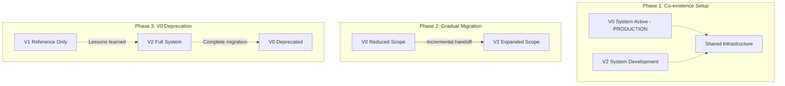

# ChainActor V2 Implementation: Comprehensive State Assessment

## Executive Summary

The ChainActor V2 represents a **strategic architectural migration** from the current working monolithic V0 system to a streamlined actor-based V2 approach (85 files), learning from the failed complexity of V1 (218 files). The current implementation is **30% functionally complete** with excellent architectural foundation but requires significant development to achieve operational blockchain functionality. **Critical**: V2 is designed for **safe co-existence** with the actively working V0 system, enabling incremental migration without breaking production functionality.

### System Architecture Context

- **V0 (Current Working)**: Monolithic system with functional `chain.rs` (2000+ lines), `aura.rs`, `engine.rs`, `bridge` - **MUST REMAIN OPERATIONAL**
- **V1 (Failed Attempt)**: Over-engineered refactor at `/Users/michael/zDevelopment/Mara/alys/app/src/actors/` - Reference only, never functional
- **V2 (Current Effort)**: Simplified actor system in `actors_v2/` - Focus on concise, maintainable implementation

## Current Implementation State

### 🟢 **Completed Components (90-100%)**

#### 1. ChainActor V2 Foundation (`/Users/michael/zDevelopment/Mara/alys-v2/app/src/actors_v2/chain/`)

```rust
// actor.rs:42-58 - Clean initialization pattern
pub fn new(config: ChainConfig, state: ChainState) -> Self {
    let mut metrics = ChainMetrics::new();
    metrics.set_sync_status(state.is_synced());
    metrics.set_chain_height(state.get_height());
    Self {
        config, state, storage_actor: None, network_actor: None,
        sync_actor: None, metrics, last_activity: Instant::now(),
    }
}
```

**Features:**
- ✅ **Clean actor lifecycle** with proper startup/shutdown
- ✅ **Typed message system** (10 core messages vs V1's 25+)
- ✅ **Metrics integration** properly initialized from state
- ✅ **Configuration validation** with sensible defaults
- ✅ **Cross-actor addressing** system in place

#### 2. StorageActor V2 (Production-Ready)

```rust
// Comprehensive storage with caching, indexing, batching
pub struct StorageActor {
    pub database: DatabaseManager,
    pub cache: StorageCache,
    pub indexing: Arc<RwLock<StorageIndexing>>,
    pending_writes: HashMap<String, PendingWrite>,
    pub metrics: StorageActorMetrics,
}
```

**Features:**
- ✅ **Production-ready** RocksDB integration
- ✅ **Multi-level caching** with LRU eviction
- ✅ **Advanced indexing** for queries
- ✅ **Batched writes** with retry logic
- ✅ **Comprehensive testing** (43 passing tests)

#### 3. NetworkActor V2 Foundation

```rust
// network_actor.rs:23-44 - Working libp2p integration
pub struct NetworkActor {
    config: NetworkConfig,
    behaviour: Option<AlysNetworkBehaviour>,
    local_peer_id: String,
    metrics: NetworkMetrics,
    peer_manager: PeerManager,
    // ... P2P protocol management
}
```

**Features:**
- ✅ **Working libp2p** integration with Gossipsub
- ✅ **Peer management** with bootstrap discovery
- ✅ **Protocol stack** simplified from V1's complexity
- ✅ **Metrics collection** for network operations

### 🟡 **Partial Implementation (30-60%)**

#### 1. ChainActor Message Handlers

```rust
// handlers.rs:187-203 - Status queries work, block operations don't
ChainMessage::GetChainStatus => {
    let status = super::messages::ChainStatus {
        height: self.state.get_height(),
        head_hash: self.state.get_head_hash(),
        is_synced: self.state.is_synced(),
        // ... comprehensive status reporting
    };
    Box::pin(async move { Ok(ChainResponse::ChainStatus(status)) })
}
```

**Working Handlers:**
- ✅ `GetChainStatus` - Full implementation with metrics
- ✅ `ProcessPegins/Pegouts` - Basic validation and metrics
- ✅ `ProcessAuxPow` - Structure validation, no storage integration

**Placeholder Handlers:**
- 🔶 `ProduceBlock` - Returns "not yet implemented"
- 🔶 `ImportBlock` - Returns "not yet implemented"
- 🔶 `BroadcastBlock` - Returns "not yet implemented"
- 🔶 `GetBlockByHash/Height` - Returns "not yet implemented"

#### 2. Cross-Actor Integration Methods

```rust
// actor.rs:79-138 - Methods defined but unused by handlers
pub(crate) async fn is_network_ready(&self) -> bool { /* ... */ }
pub(crate) async fn broadcast_block(&self, block_data: Vec<u8>) -> Result<(), ChainError> { /* ... */ }
pub(crate) async fn request_blocks(&self, start_height: u64, count: u32) -> Result<(), ChainError> { /* ... */ }
pub(crate) async fn store_block(&self, block: SignedConsensusBlock<MainnetEthSpec>, canonical: bool) -> Result<(), ChainError> { /* ... */ }
```

**Status**: Methods implemented with proper NetworkActor/StorageActor integration, but **never called** by handlers (diagnostic warnings confirm this).

### 🔴 **Missing Implementation (0-20%)**

#### 1. Core Blockchain Operations

**Block Production Pipeline:**
```rust
// Current state - handlers.rs:204-222
ChainMessage::ProduceBlock { slot, timestamp } => {
    warn!(slot = slot, "Block production not fully implemented - returning placeholder");
    Box::pin(async move {
        Err(ChainError::Internal("Advanced block production not yet implemented".to_string()))
    })
}
```

**Required Implementation:**
- Block template creation via Engine
- Peg-in/peg-out processing
- AuxPoW header generation
- Consensus validation via Aura
- Storage persistence via StorageActor
- Network broadcasting via NetworkActor

#### 2. Block Import/Validation Pipeline

**Current Gap:**
```rust
// handlers.rs:224-253 - Basic height validation only
ChainMessage::ImportBlock { block, source } => {
    // Only validates height, no consensus/execution validation
    Box::pin(async move {
        Err(ChainError::Internal("Full block import not yet implemented".to_string()))
    })
}
```

**Required Implementation:**
- Consensus rule validation via Aura
- Execution payload validation via Engine
- State transition execution
- Fork choice updates
- Storage integration
- Peg operation extraction and processing

## Potential Future Actors for V0 Component Migration

### Core V0 Components Requiring Actorization

The current V0 system has several monolithic components that could benefit from actor-based refactoring in future phases. However, **Phase 1 priority is connecting existing V2 actors** to these V0 components rather than immediately creating new actors.

#### 1. **EngineActor V2** (Required for Proper Architecture)

**Why EngineActor is Necessary:**
- **Complex State Management**: V0's Engine manages finalized blocks, pending payloads, multiple RPC endpoints
- **Resource-Intensive Operations**: Payload building, transaction selection, execution validation
- **Concurrent Operations**: Multiple simultaneous builds, validations need proper isolation
- **Error Isolation**: Engine failures shouldn't crash ChainActor coordination logic

```rust
/// EngineActor V2 - Execution layer coordination and payload management
pub struct EngineActor {
    /// JSON-RPC client for execution layer
    api: HttpJsonRpc,
    /// Engine API client for payload operations
    execution_api: HttpJsonRpc,
    /// Current finalized execution block
    finalized: RwLock<Option<ExecutionBlockHash>>,
    /// Active payload building operations
    pending_payloads: HashMap<RequestId, PendingPayload>,
    /// Execution metrics
    metrics: EngineActorMetrics,
    /// ChainActor coordination
    chain_actor: Option<Addr<ChainActor>>,
}

/// Engine operation messages
#[derive(Debug, Message)]
#[rtype(result = "Result<EngineResponse, EngineError>")]
pub enum EngineMessage {
    /// Build execution payload for block production
    BuildPayload {
        timestamp: Duration,
        parent_hash: ExecutionBlockHash,
        withdrawals: Vec<Withdrawal>,
        correlation_id: Option<Uuid>,
    },

    /// Validate execution payload from network
    ValidatePayload {
        payload: ExecutionPayload,
        correlation_id: Option<Uuid>,
    },

    /// Commit finalized block to execution layer
    CommitBlock {
        block_hash: ExecutionBlockHash,
        finality_root: Hash256,
    },

    /// Get latest execution block info
    GetLatestBlock,

    /// Update fork choice in execution layer
    UpdateForkChoice {
        head_hash: ExecutionBlockHash,
        safe_hash: ExecutionBlockHash,
        finalized_hash: ExecutionBlockHash,
    },
}

/// Engine response types
#[derive(Debug, Clone)]
pub enum EngineResponse {
    PayloadBuilt {
        payload: ExecutionPayload,
        build_time: Duration,
    },
    PayloadValid {
        validation_result: ValidationResult,
    },
    BlockCommitted {
        block_hash: ExecutionBlockHash,
    },
    LatestBlock {
        hash: ExecutionBlockHash,
        number: u64,
    },
    ForkChoiceUpdated {
        status: ForkChoiceStatus,
    },
}
```

**ChainActor Integration Pattern:**
```rust
// ChainActor V2 coordinates with EngineActor for all execution operations
impl ChainActor {
    /// Build execution payload via EngineActor (replaces direct engine calls)
    async fn build_execution_payload(
        &self,
        timestamp: Duration,
        parent_hash: ExecutionBlockHash,
        withdrawals: Vec<Withdrawal>
    ) -> Result<ExecutionPayload, ChainError> {
        if let Some(ref engine_actor) = self.engine_actor {
            let msg = EngineMessage::BuildPayload {
                timestamp, parent_hash, withdrawals,
                correlation_id: Some(Uuid::new_v4()),
            };

            match engine_actor.send(msg).await {
                Ok(Ok(EngineResponse::PayloadBuilt { payload, .. })) => Ok(payload),
                Ok(Ok(_)) => Err(ChainError::Internal("Unexpected engine response".to_string())),
                Ok(Err(e)) => Err(ChainError::Engine(e.to_string())),
                Err(e) => Err(ChainError::NetworkError(e.to_string())),
            }
        } else {
            Err(ChainError::Internal("EngineActor not available".to_string()))
        }
    }

    /// Validate incoming execution payload
    async fn validate_execution_payload(&self, payload: ExecutionPayload) -> Result<bool, ChainError> {
        if let Some(ref engine_actor) = self.engine_actor {
            let msg = EngineMessage::ValidatePayload {
                payload,
                correlation_id: Some(Uuid::new_v4()),
            };

            match engine_actor.send(msg).await {
                Ok(Ok(EngineResponse::PayloadValid { validation_result })) => {
                    Ok(validation_result.is_valid())
                },
                Ok(Err(e)) => Err(ChainError::Engine(e.to_string())),
                Err(e) => Err(ChainError::NetworkError(e.to_string())),
                _ => Err(ChainError::Internal("Invalid engine response".to_string())),
            }
        } else {
            Err(ChainError::Internal("EngineActor not available".to_string()))
        }
    }
}
```

**Decision**: **REQUIRED** for V2 architecture. Engine's complexity, state management, and resource requirements justify dedicated actor isolation.

#### 2. **Aura Integration** (Direct Integration - Final Decision)

**Architecture Decision**: Aura logic will be **directly integrated** into ChainActor V2, not as a separate actor.

```rust
// ChainActor V2 holds Aura directly
pub struct ChainActor {
    config: ChainConfig,
    state: ChainState,
    storage_actor: Option<Addr<StorageActor>>,
    engine_actor: Option<Addr<EngineActor>>,
    aura: Arc<Aura>, // ← Direct V0 integration
    // ...
}

// Usage in handlers - fast, direct validation
impl ChainActor {
    async fn validate_consensus(&self, block: &SignedConsensusBlock) -> Result<(), ChainError> {
        self.aura.check_signed_by_author(block)
            .map_err(|e| ChainError::Consensus(format!("Aura validation failed: {:?}", e)))
    }

    async fn sign_consensus_block(&self, block: ConsensusBlock) -> Result<SignedConsensusBlock, ChainError> {
        self.aura.sign_block(block)
            .map_err(|e| ChainError::Consensus(format!("Block signing failed: {:?}", e)))
    }
}
```

**Rationale for Direct Integration:**
- ✅ **Aura operations are mostly stateless** - no complex state management needed
- ✅ **Low latency requirements** - consensus validation should be fast, not cross-actor
- ✅ **Simple authority management** - just a list of public keys
- ✅ **Avoid over-actorization** - learns from V1's mistakes

**Decision**: **Direct integration maintains 5-actor architecture** without unnecessary complexity.

#### 3. **MiningCoordinatorActor** (High Priority for Phase 3)

**Architecture Decision**: **REQUIRED** for V2's mining operations - coordinates complex inter-actor workflows that cannot be handled by any single actor alone.

**V0 vs V1 vs V2 Mining Architecture Analysis:**

**V0 Mining System (Current Working - 2000+ lines in chain.rs):**
```rust
// V0: Monolithic integration with all mining coordination in Chain
impl<DB> ChainManager<ConsensusBlock> for Chain<DB> {
    async fn get_aggregate_hashes(&self) -> Vec<BlockHash> { /* 30 lines of logic */ }
    async fn push_auxpow(&self, /*8 parameters*/) -> bool { /* 50 lines */ }
    async fn check_pow(&self, header: &AuxPowHeader, override: bool) { /* 200+ lines */ }
    async fn share_pow(&self, pow: AuxPowHeader) { /* Network broadcasting */ }
    // + difficulty calculation, work queueing, signature coordination, etc.
}

// Integrated with: Engine, Storage, Network, Bridge, Bitcoin wallet, Aura
// spawn_background_miner() creates continuous mining loop
```

**V1 Mining System (Failed Attempt - Over-complex):**
```rust
// V1: Over-engineered with dedicated actors and complex message passing
pub struct AuxPowActor { /* 600+ lines */ }
pub struct DifficultyManager { /* Separate actor for calculations */ }
// 20+ message types, complex supervision, never functional
```

**V2 Mining System (Strategic Coordination):**
```rust
/// MiningCoordinatorActor - Strategic coordinator between V2's 5-actor system
///
/// NOT a direct port of V0/V1, but a NEW coordination layer that:
/// - Orchestrates workflows between ChainActor, StorageActor, NetworkActor, EngineActor
/// - Integrates directly with V0's proven AuxPow/difficulty systems
/// - Manages mining loop and work distribution
/// - Handles cross-actor error recovery and state consistency
pub struct MiningCoordinatorActor {
    /// V2 Actor coordination
    chain_actor: Addr<ChainActor>,
    storage_actor: Addr<StorageActor>,
    network_actor: Addr<NetworkActor>,
    engine_actor: Addr<EngineActor>,

    /// Direct V0 component integration (proven systems)
    auxpow_miner: AuxPowMiner<ConsensusBlock, ChainManagerProxy>,
    aura: Arc<Aura>,
    bridge: Arc<Bridge>,

    /// Mining state and coordination
    mining_config: MiningConfig,
    active_work: BTreeMap<BlockHash, MiningWork>,
    coordination_state: CoordinationState,
    metrics: MiningCoordinatorMetrics,
}

/// Core coordination messages
#[derive(Message)]
#[rtype(result = "Result<AuxBlock, MiningError>")]
pub struct CoordinateBlockCreation {
    pub address: EvmAddress,
}

#[derive(Message)]
#[rtype(result = "Result<(), MiningError>")]
pub struct CoordinateBlockSubmission {
    pub hash: BlockHash,
    pub auxpow: AuxPow,
}

/// Multi-actor workflow coordination
#[derive(Message)]
#[rtype(result = "Result<(), MiningError>")]
pub struct CoordinateBlockFinalization {
    pub signed_block: SignedConsensusBlock,
    pub auxpow_header: AuxPowHeader,
}
```

**Why MiningCoordinatorActor is Essential for V2:**

1. **Complex Multi-Actor Workflows**: Mining operations require coordination across all 5 V2 actors:
   - **ChainActor**: Block validation, consensus checks, state management
   - **StorageActor**: Block persistence, hash caching, finalized block retrieval
   - **NetworkActor**: AuxPow broadcasting, peer coordination
   - **EngineActor**: Execution payload building, validation
   - **MiningCoordinatorActor**: Orchestrates the entire workflow

2. **V0 ChainManager Integration**: V0's `ChainManager` trait requires complex operations that span multiple actors:
   ```rust
   // V0's ChainManager operations that need multi-actor coordination in V2:
   async fn get_aggregate_hashes() -> Vec<BlockHash> {
       // Requires: StorageActor (block hash cache) + ChainActor (head state)
   }

   async fn push_auxpow(/*8 parameters*/) -> bool {
       // Requires: ChainActor (validation) + StorageActor (persistence) +
       //           NetworkActor (broadcasting) + Bridge (peg operations)
   }

   async fn check_pow(header: &AuxPowHeader) -> Result<()> {
       // Requires: StorageActor (latest pow block) + ChainActor (finalization checks) +
       //           Bridge (pegout validation) + Network (gossip validation)
   }
   ```

3. **Mining Loop Coordination**: V0's `spawn_background_miner` creates continuous mining that requires:
   ```rust
   // V2 mining loop - multi-actor coordination required
   async fn mining_loop(&self) {
       loop {
           // 1. Create AuxBlock (ChainActor + StorageActor coordination)
           let aux_block = self.coordinate_block_creation().await?;

           // 2. Mine AuxPow (direct V0 AuxPow::mine - proven)
           let auxpow = AuxPow::mine(aux_block.hash, aux_block.bits, aux_block.chain_id).await;

           // 3. Submit and finalize (All 5 actors coordinated)
           self.coordinate_block_submission(aux_block.hash, auxpow).await?;
       }
   }
   ```

4. **Error Recovery and State Consistency**: Mining operations can fail at multiple points:
   - Engine payload building fails → Coordinator handles fallback
   - Network broadcasting fails → Coordinator retries with different peers
   - Storage persistence fails → Coordinator prevents state corruption
   - Cross-actor message timeouts → Coordinator maintains consistency

**V2 MiningCoordinatorActor Implementation Requirements:**

```rust
impl MiningCoordinatorActor {
    /// Replace V0's ChainManager::get_aggregate_hashes with multi-actor coordination
    async fn coordinate_aggregate_hash_collection(&self) -> Result<Vec<BlockHash>, MiningError> {
        // 1. Get chain head from ChainActor
        let head_ref = self.chain_actor
            .send(GetChainHead)
            .await??;

        // 2. Check for queued work
        let has_work = self.coordination_state.has_pending_work(&head_ref.hash);

        if !has_work {
            return Err(MiningError::NoWorkToDo);
        }

        // 3. Get block hashes from StorageActor's cache
        let hashes = self.storage_actor
            .send(GetBlockHashCache)
            .await??;

        Ok(hashes)
    }

    /// Replace V0's ChainManager::push_auxpow with coordinated workflow
    async fn coordinate_auxpow_finalization(
        &self,
        auxpow_header: AuxPowHeader
    ) -> Result<bool, MiningError> {
        // 1. Validate via ChainActor (check_pow equivalent)
        let validation_result = self.chain_actor
            .send(ValidateAuxPow { header: auxpow_header.clone() })
            .await??;

        if !validation_result.valid {
            return Ok(false);
        }

        // 2. Create signed block via EngineActor + ChainActor coordination
        let signed_block = self.coordinate_block_production(&auxpow_header).await?;

        // 3. Persist via StorageActor
        self.storage_actor
            .send(StoreBlock {
                block: signed_block.clone(),
                canonical: true
            })
            .await??;

        // 4. Broadcast via NetworkActor
        self.network_actor
            .send(BroadcastAuxPow { header: auxpow_header.clone() })
            .await??;

        // 5. Update coordination state
        self.coordination_state.finalize_work(&auxpow_header);

        Ok(true)
    }

    /// Complex block production coordination (Engine + Chain + Consensus)
    async fn coordinate_block_production(
        &self,
        auxpow_header: &AuxPowHeader
    ) -> Result<SignedConsensusBlock, MiningError> {
        // 1. Build execution payload via EngineActor
        let payload = self.engine_actor
            .send(BuildPayloadForAuxPow {
                range_start: auxpow_header.range_start,
                range_end: auxpow_header.range_end,
                fee_recipient: auxpow_header.fee_recipient,
            })
            .await??;

        // 2. Create consensus block structure via ChainActor
        let consensus_block = self.chain_actor
            .send(CreateConsensusBlock {
                execution_payload: payload,
                auxpow_header: auxpow_header.clone(),
            })
            .await??;

        // 3. Sign via direct Aura integration (stateless - no actor needed)
        let signed_block = self.aura.sign_consensus_block(consensus_block)?;

        Ok(signed_block)
    }
}

/// ChainManagerProxy - Adapter for V0's AuxPowMiner to work with V2 actors
pub struct ChainManagerProxy {
    mining_coordinator: Addr<MiningCoordinatorActor>,
}

#[async_trait::async_trait]
impl ChainManager<ConsensusBlock> for ChainManagerProxy {
    async fn get_aggregate_hashes(&self) -> Result<Vec<BlockHash>> {
        self.mining_coordinator
            .send(CoordinateAggregateHashes)
            .await?
            .map_err(Into::into)
    }

    async fn push_auxpow(/*...*/) -> bool {
        self.mining_coordinator
            .send(CoordinateAuxPowFinalization { /*...*/ })
            .await
            .unwrap_or(false)
    }
    // ... other ChainManager methods delegated to coordinator
}
```

**Integration with V0 Proven Components:**
- **Direct AuxPow integration**: Use V0's `AuxPow::mine`, `AuxPow::check`, `AuxPow::aggregate_hash`
- **Direct difficulty calculation**: Use V0's `get_next_work_required` algorithm
- **Direct consensus validation**: Use V0's Aura for signing and validation
- **ChainManagerProxy**: Adapter pattern to integrate V0's `AuxPowMiner` with V2 actors

**Decision**: **REQUIRED** for V2 architecture. Mining coordination cannot be handled by any single actor - requires dedicated orchestration across all 5 V2 actors while leveraging V0's proven mining algorithms.

### V2 RPC Integration: Learning from V0 and V1

**Critical Requirement**: External mining pools and mining software require Bitcoin-compatible `createauxblock` and `submitauxblock` RPC endpoints for merged mining operations.

#### V0 RPC Architecture (Current Working)
```rust
// V0: Direct integration - Simple but tightly coupled
pub async fn start_rpc<DB: ItemStore<MainnetEthSpec>>(
    chain: Arc<Chain<DB>>,
    retarget_params: BitcoinConsensusParams,
    federation_address: Address<NetworkChecked>,
    rpc_port: u16,
) {
    let miner = Arc::new(Mutex::new(AuxPowMiner::new(chain.clone(), retarget_params)));

    // RPC handlers directly call miner methods
    match json_req.method {
        "createauxblock" => {
            miner.create_aux_block(script_pub_key).await?  // Direct call
        }
        "submitauxblock" => {
            miner.submit_aux_block(hash, auxpow).await?    // Direct call
        }
        // ...
    }
}
```

**V0 Strengths**: Simple, proven in production, handles external miners successfully
**V0 Weaknesses**: Monolithic, tightly coupled, doesn't support actor-based architecture

#### V1 RPC Architecture (Failed Attempt)
```rust
// V1: Actor-based but over-engineered
pub struct AuxPowRpcContext {
    pub auxpow_actor: Addr<AuxPowActor>,  // Single dedicated actor
}

impl AuxPowRpcContext {
    pub async fn create_aux_block_rpc(&self, address: String) -> Result<AuxBlock, RpcError> {
        self.auxpow_actor.send(CreateAuxBlock { address }).await??  // Actor message
    }

    pub async fn submit_aux_block_rpc(&self, hash_hex: String, auxpow_hex: String) -> Result<bool, RpcError> {
        self.auxpow_actor.send(SubmitAuxBlock { hash, auxpow }).await??  // Actor message
    }
}
```

**V1 Strengths**: Clean actor abstraction, proper error handling, Bitcoin RPC compatibility
**V1 Weaknesses**: Over-engineered single actor approach, never reached functional state

#### V2 RPC Architecture (Strategic Design)

**Design Principle**: Combine V0's proven simplicity with V1's clean actor abstraction, while leveraging V2's MiningCoordinatorActor for multi-actor orchestration.

```rust
/// V2 RPC Context - Delegates to MiningCoordinatorActor for orchestration
pub struct AlysRpcContextV2 {
    /// MiningCoordinatorActor handles all mining operations across 6 actors
    mining_coordinator: Addr<MiningCoordinatorActor>,
    /// ChainActor for blockchain queries that don't require coordination
    chain_actor: Addr<ChainActor>,
    /// StorageActor for direct block queries
    storage_actor: Addr<StorageActor>,
    /// Federation address for deposit queries
    federation_address: Address<NetworkChecked>,
}

impl AlysRpcContextV2 {
    /// RPC: createauxblock <address>
    ///
    /// V2 Implementation: Delegates to MiningCoordinatorActor which orchestrates
    /// the entire workflow across all 6 V2 actors + V0 proven components
    pub async fn create_aux_block_rpc(&self, address: String) -> Result<AuxBlock, RpcError> {
        // Parse mining address (same as V1)
        let evm_address = address.parse::<EvmAddress>()
            .map_err(|_| RpcError::invalid_address(address))?;

        // Delegate to MiningCoordinatorActor - this triggers multi-actor coordination:
        // 1. ChainActor: Check sync status, get chain head
        // 2. StorageActor: Get block hash cache for aggregate calculation
        // 3. V0 AuxPow: Calculate aggregate hash (proven algorithm)
        // 4. V0 Difficulty: Calculate next work required (proven algorithm)
        // 5. MiningCoordinatorActor: Orchestrate and manage state
        let aux_block = self.mining_coordinator
            .send(CoordinateBlockCreation { address: evm_address })
            .await
            .map_err(RpcError::from_mailbox_error)?
            .map_err(RpcError::from_mining_error)?;

        info!(
            block_hash = %aux_block.hash,
            chain_id = aux_block.chain_id,
            height = aux_block.height,
            difficulty = %aux_block.bits.to_consensus(),
            "V2 created aux block for external miner"
        );

        Ok(aux_block)
    }

    /// RPC: submitauxblock <hash> <auxpow>
    ///
    /// V2 Implementation: Delegates to MiningCoordinatorActor for multi-actor
    /// validation and finalization workflow
    pub async fn submit_aux_block_rpc(
        &self,
        hash_hex: String,
        auxpow_hex: String
    ) -> Result<bool, RpcError> {
        // Parse inputs (same as V1)
        let hash = BlockHash::from_str(&hash_hex)
            .map_err(|_| RpcError::invalid_hash(hash_hex))?;

        let auxpow = self.parse_auxpow_hex(&auxpow_hex)?;

        // Delegate to MiningCoordinatorActor - this triggers complex multi-actor workflow:
        // 1. ChainActor: Validate AuxPow structure and consensus rules
        // 2. EngineActor: Build execution payload for the block range
        // 3. V0 AuxPow: Validate proof-of-work (proven validation)
        // 4. StorageActor: Persist signed block with AuxPow header
        // 5. NetworkActor: Broadcast AuxPow to peer network
        // 6. MiningCoordinatorActor: Orchestrate entire workflow with error recovery
        let result = self.mining_coordinator
            .send(CoordinateBlockSubmission { hash, auxpow })
            .await
            .map_err(RpcError::from_mailbox_error)?;

        match result {
            Ok(_) => {
                info!(block_hash = %hash, "V2 AuxPow submission accepted by mining coordinator");
                Ok(true)
            }
            Err(e) => {
                warn!(block_hash = %hash, error = ?e, "V2 AuxPow submission rejected");
                Ok(false)  // Bitcoin RPC compatibility - return false, not error
            }
        }
    }

    /// RPC: getqueuedpow
    ///
    /// V2 Implementation: Direct query to ChainActor (no coordination needed)
    pub async fn get_queued_pow_rpc(&self) -> Result<Option<AuxPowHeader>, RpcError> {
        let queued_pow = self.chain_actor
            .send(GetQueuedAuxPow)
            .await
            .map_err(RpcError::from_mailbox_error)?
            .map_err(RpcError::from_chain_error)?;

        Ok(queued_pow)
    }

    /// RPC: getheadblock
    ///
    /// V2 Implementation: Direct query to ChainActor (no coordination needed)
    pub async fn get_head_block_rpc(&self) -> Result<SignedConsensusBlock, RpcError> {
        let head = self.chain_actor
            .send(GetChainHead)
            .await
            .map_err(RpcError::from_mailbox_error)?
            .map_err(RpcError::from_chain_error)?;

        Ok(head)
    }

    /// RPC: getblockbyheight <height>
    ///
    /// V2 Implementation: Direct query to StorageActor (no coordination needed)
    pub async fn get_block_by_height_rpc(&self, height: u64) -> Result<Option<SignedConsensusBlock>, RpcError> {
        let block = self.storage_actor
            .send(GetBlockByHeight { height })
            .await
            .map_err(RpcError::from_mailbox_error)?
            .map_err(RpcError::from_storage_error)?;

        Ok(block)
    }

    /// Helper: Parse AuxPow hex data
    fn parse_auxpow_hex(&self, auxpow_hex: &str) -> Result<AuxPow, RpcError> {
        let auxpow_bytes = hex::decode(auxpow_hex)
            .map_err(|_| RpcError::invalid_auxpow_hex(auxpow_hex))?;

        use bitcoin::consensus::Decodable;
        AuxPow::consensus_decode_from_finite_reader(&mut auxpow_bytes.as_slice())
            .map_err(|e| RpcError::invalid_auxpow_structure(e))
    }
}

/// V2 RPC Server Integration
pub async fn start_rpc_v2(
    mining_coordinator: Addr<MiningCoordinatorActor>,
    chain_actor: Addr<ChainActor>,
    storage_actor: Addr<StorageActor>,
    federation_address: Address<NetworkChecked>,
    rpc_port: u16,
) {
    let rpc_context = Arc::new(AlysRpcContextV2 {
        mining_coordinator,
        chain_actor,
        storage_actor,
        federation_address,
    });

    let addr = SocketAddr::from(([0, 0, 0, 0], rpc_port));

    info!("Starting V2 RPC server on {} with MiningCoordinatorActor integration", addr);

    let server = Server::bind(&addr).serve(make_service_fn(move |_conn| {
        let rpc_context = rpc_context.clone();

        async move {
            Ok::<_, GenericError>(service_fn(move |req| {
                let rpc_context = rpc_context.clone();
                http_req_json_rpc_v2(req, rpc_context)
            }))
        }
    }));

    tokio::spawn(async move {
        if let Err(e) = server.await {
            error!("V2 RPC server error: {}", e);
        }
    });
}

/// V2 RPC Request Handler
async fn http_req_json_rpc_v2(
    req: Request<Body>,
    rpc_context: Arc<AlysRpcContextV2>,
) -> Result<Response<Body>> {
    // Standard JSON-RPC parsing (same as V0/V1)
    let json_req = parse_json_rpc_request(req).await?;

    let response = match json_req.method {
        "createauxblock" => {
            let [address] = parse_single_param::<String>(json_req.params)?;
            rpc_context.create_aux_block_rpc(address).await
                .map(|aux_block| json_rpc_success(json_req.id, aux_block))
                .unwrap_or_else(|e| json_rpc_error(json_req.id, e))
        }

        "submitauxblock" => {
            let (hash_hex, auxpow_hex) = parse_dual_params::<String, String>(json_req.params)?;
            rpc_context.submit_aux_block_rpc(hash_hex, auxpow_hex).await
                .map(|accepted| json_rpc_success(json_req.id, accepted))
                .unwrap_or_else(|e| json_rpc_error(json_req.id, e))
        }

        "getqueuedpow" => {
            rpc_context.get_queued_pow_rpc().await
                .map(|queued| json_rpc_success(json_req.id, queued))
                .unwrap_or_else(|e| json_rpc_error(json_req.id, e))
        }

        "getheadblock" => {
            rpc_context.get_head_block_rpc().await
                .map(|head| json_rpc_success(json_req.id, head))
                .unwrap_or_else(|e| json_rpc_error(json_req.id, e))
        }

        "getblockbyheight" => {
            let [height] = parse_single_param::<u64>(json_req.params)?;
            rpc_context.get_block_by_height_rpc(height).await
                .map(|block| json_rpc_success(json_req.id, block))
                .unwrap_or_else(|e| json_rpc_error(json_req.id, e))
        }

        "getdepositaddress" => {
            json_rpc_success(json_req.id, rpc_context.federation_address.to_string())
        }

        _ => json_rpc_error(json_req.id, RpcError::method_not_found(json_req.method))
    };

    Ok(response)
}
```

**V2 RPC Architecture Advantages**:

1. **Multi-Actor Coordination**: Mining operations properly orchestrated across all 6 V2 actors
2. **V0 Algorithm Integration**: Leverages proven V0 AuxPow and difficulty algorithms via MiningCoordinatorActor
3. **Clean Separation**: Complex coordination delegated to MiningCoordinatorActor, simple queries go direct to actors
4. **Bitcoin Compatibility**: Maintains exact Bitcoin RPC interface for mining pool compatibility
5. **Error Recovery**: MiningCoordinatorActor handles cross-actor failures and state consistency
6. **Incremental Migration**: Can run alongside V0 RPC during transition period
7. **Scalable**: Each actor type handles its domain expertise, coordinator orchestrates workflows

**V2 vs V0 vs V1 Comparison**:
- **V0**: Simple but monolithic - `AuxPowMiner` directly coupled to `Chain<DB>`
- **V1**: Clean but over-engineered - Single `AuxPowActor` tried to handle everything
- **V2**: Strategic coordination - `MiningCoordinatorActor` orchestrates multi-actor workflows while leveraging proven V0 components

**Integration with V2 Phase Strategy**:
- **Phase 1**: Implement `AlysRpcContextV2` with basic MiningCoordinatorActor integration
- **Phase 2**: Add full multi-actor coordination for block production/finalization
- **Phase 3**: Migrate from V0 RPC to V2 RPC with external miner validation

### Corrected V2 Actor Architecture

Based on proper analysis of V0 component complexity and mining coordination requirements:

**6-Actor V2 System (Final Architecture):**
1. **ChainActor V2** - Blockchain coordination and consensus ✅
2. **StorageActor V2** - Persistence layer ✅ (Production-ready)
3. **NetworkActor V2** - P2P networking ✅ (Working foundation)
4. **SyncActor V2** - Block synchronization ✅ (Working foundation)
5. **EngineActor V2** - Execution layer coordination ✅ **REQUIRED**
6. **MiningCoordinatorActor V2** - Multi-actor mining workflows ⭐ **REQUIRED**

### V0 Component Integration Strategy

#### Phase 1: Hybrid Integration (Updated Priority)
```rust
// V2 System Architecture - 6 actors + direct V0 component integration
impl ChainActor {
    pub fn new(
        config: ChainConfig,
        state: ChainState,
        storage_actor: Addr<StorageActor>,           // V2 actor integration
        network_actor: Addr<NetworkActor>,           // V2 actor integration
        sync_actor: Addr<SyncActor>,                 // V2 actor integration
        engine_actor: Addr<EngineActor>,             // V2 actor integration - NEW
        mining_coordinator: Addr<MiningCoordinatorActor>, // V2 actor integration - NEW
        aura: Arc<Aura>,                             // Direct V0 integration (stateless)
        bridge: Arc<Bridge>,                         // Direct V0 integration (encapsulated)
    ) -> Self {
        // ChainActor focuses on blockchain coordination
        // EngineActor handles execution layer
        // MiningCoordinatorActor orchestrates mining workflows across all actors
        // Aura/Bridge remain direct integrations for proven functionality
    }
}
```

#### Phase 2-3: Selective Actorization
Only create new actors when:
1. **Concurrency benefits**: Component would benefit from async message handling
2. **State isolation**: Component has complex state that needs isolation
3. **Resource management**: Component needs specialized resource handling

**Principle**: Avoid V1's mistake of over-actorization. Keep simple components as direct integrations.

## Incremental Implementation Tasks (Systematic Approach)

### 🎯 **Phase 1A: Handler-Method Connection (Week 1-2)**

**Critical Gap**: Existing cross-actor methods are implemented but never called by handlers.

#### Task 1.1: Connect Block Query Handlers
```rust
// BEFORE (Current - handlers.rs:366-376)
ChainMessage::GetBlockByHash { hash } => {
    info!(block_hash = %hash, "GetBlockByHash not yet implemented");
    Box::pin(async move {
        Err(ChainError::Internal("GetBlockByHash handler not yet implemented".to_string()))
    })
}

// AFTER (Target Implementation)
ChainMessage::GetBlockByHash { hash } => {
    if let Some(ref storage_actor) = self.storage_actor {
        let self_ref = self; // Capture for async block
        Box::pin(async move {
            let msg = GetBlockMessage { block_hash: hash };
            match storage_actor.send(msg).await {
                Ok(Ok(Some(block))) => Ok(ChainResponse::Block(Some(block))),
                Ok(Ok(None)) => Ok(ChainResponse::Block(None)),
                Ok(Err(e)) => Err(ChainError::Storage(e.to_string())),
                Err(e) => Err(ChainError::NetworkError(e.to_string())),
            }
        })
    } else {
        Box::pin(async move { Err(ChainError::Storage("StorageActor not available".to_string())) })
    }
}
```

**Acceptance Criteria**:
- `GetBlockByHash` and `GetBlockByHeight` handlers call StorageActor
- Proper error handling for all failure modes
- Tests verify integration works end-to-end

#### Task 1.2: Connect Network Broadcasting
```rust
// BEFORE
ChainMessage::BroadcastBlock { block } => {
    info!("BroadcastBlock not yet implemented");
    Box::pin(async move { Err(ChainError::Internal("...".to_string())) })
}

// AFTER
ChainMessage::BroadcastBlock { block } => {
    let serialized = match self.serialize_block(&block) {
        Ok(data) => data,
        Err(e) => return Box::pin(async move { Err(e) })
    };
    let block_hash = block.tree_hash_root(); // Or proper hash calculation
    let broadcast_future = self.broadcast_block(serialized); // Use existing method!
    Box::pin(async move {
        broadcast_future.await?;
        Ok(ChainResponse::BlockBroadcasted { block_hash })
    })
}
```

**Acceptance Criteria**:
- `BroadcastBlock` handler uses existing `broadcast_block()` method
- `NetworkBlockReceived` handler processes incoming blocks
- Network integration tested with mock peers

### 🎯 **Phase 1B: Basic Block Import Pipeline (Week 3-4)**

#### Task 1.3: Implement Core Import Flow
```rust
// Target implementation in handlers.rs
ChainMessage::ImportBlock { block, source } => {
    // 1. Basic validation (already implemented)
    let block_height = block.message.execution_payload.block_number;
    let current_height = self.state.get_height();

    if block_height <= current_height && current_height > 0 {
        return Box::pin(async move {
            Err(ChainError::InvalidBlock("Block height is too old".to_string()))
        });
    }

    // 2. NEW: Consensus validation via V0 Aura
    if let Err(aura_error) = self.aura.check_signed_by_author(&block) {
        return Box::pin(async move {
            Err(ChainError::Consensus(format!("Aura validation failed: {:?}", aura_error)))
        });
    }

    // 3. NEW: Store via StorageActor (using existing store_block method)
    let store_future = self.store_block(block.clone(), true);
    let block_hash = block.tree_hash_root(); // Proper hash calculation needed

    // 4. NEW: Update chain state
    let block_ref = BlockRef {
        hash: block_hash,
        height: block_height
    };

    Box::pin(async move {
        // Execute storage operation
        store_future.await?;

        // Update state (this needs careful async handling)
        // self.state.update_head(block_ref); // May need different pattern

        Ok(ChainResponse::BlockImported { block_hash, height: block_height })
    })
}
```

**Technical Challenges**:
1. **Async State Updates**: `self.state.update_head()` in async context requires careful handling
2. **Block Hash Calculation**: Need proper `tree_hash_root()` or equivalent
3. **Error Recovery**: Failed storage should not corrupt ChainActor state

**Acceptance Criteria**:
- Block import validates consensus rules via V0 Aura
- Block storage works via existing `store_block()` method
- Chain state updates correctly reflect new head
- Failed imports don't corrupt state

### 🎯 **Phase 2: Block Production Pipeline (Week 5-8)**

#### Task 2.1: Implement Payload Building (Updated for EngineActor)
```rust
ChainMessage::ProduceBlock { slot, timestamp } => {
    // 1. Network readiness (already implemented)
    if !self.is_network_ready().await {
        return Box::pin(async move { Err(ChainError::NetworkNotAvailable) });
    }

    // 2. Get parent block from StorageActor
    let get_head_future = if let Some(ref storage_actor) = self.storage_actor {
        storage_actor.send(GetChainHeadMessage)
    } else {
        return Box::pin(async move { Err(ChainError::Storage("StorageActor not available".to_string())) });
    };

    // 3. Build execution payload via EngineActor V2 (not direct engine)
    let engine_actor = self.engine_actor.clone();
    let aura = self.aura.clone();

    Box::pin(async move {
        // Get parent block
        let parent_ref = match get_head_future.await {
            Ok(Ok(Some(head))) => head,
            Ok(Ok(None)) => return Err(ChainError::Internal("No chain head available".to_string())),
            Ok(Err(e)) => return Err(ChainError::Storage(e.to_string())),
            Err(e) => return Err(ChainError::NetworkError(e.to_string())),
        };

        // Build execution payload via EngineActor
        let withdrawals = Vec::new(); // TODO: Implement withdrawal logic
        let payload = if let Some(ref engine_actor) = engine_actor {
            let msg = EngineMessage::BuildPayload {
                timestamp,
                parent_hash: parent_ref.execution_hash,
                withdrawals,
                correlation_id: Some(Uuid::new_v4()),
            };

            match engine_actor.send(msg).await {
                Ok(Ok(EngineResponse::PayloadBuilt { payload, .. })) => payload,
                Ok(Ok(_)) => return Err(ChainError::Internal("Unexpected engine response".to_string())),
                Ok(Err(e)) => return Err(ChainError::Engine(e.to_string())),
                Err(e) => return Err(ChainError::NetworkError(e.to_string())),
            }
        } else {
            return Err(ChainError::Internal("EngineActor not available".to_string()));
        };

        // Create consensus block
        let consensus_block = ConsensusBlock {
            slot,
            execution_payload: payload,
            // TODO: Add other required fields
        };

        // Sign with Aura (direct V0 integration - stateless operation)
        let signed_block = if let Some(ref authority) = aura.authority {
            // Sign block with authority
            todo!("Implement block signing")
        } else {
            return Err(ChainError::Configuration("Node is not a validator".to_string()));
        };

        // Store via StorageActor and broadcast via NetworkActor
        // ... (implementation continues)

        Ok(ChainResponse::BlockProduced {
            block: signed_block,
            duration: timestamp
        })
    })
}
```

### 🎯 **Critical Success Metrics**

#### Phase 1 Success Criteria:
1. **Zero `ChainError::Internal("not yet implemented")` errors** in handlers
2. **All cross-actor methods called** by at least one handler (eliminate compiler warnings)
3. **Block queries work** end-to-end with StorageActor
4. **Network broadcasting works** end-to-end with NetworkActor
5. **Basic block import** stores blocks via StorageActor

#### Phase 2 Success Criteria:
1. **Block production** creates valid blocks using V0 Engine
2. **Consensus integration** validates blocks using V0 Aura
3. **Full import/export cycle** works without V0 chain.rs involvement
4. **State consistency** maintained across all operations

#### Co-existence Success Criteria:
1. **V0 system continues working** throughout V2 development
2. **No shared resource conflicts** (ports, databases, metrics)
3. **Graceful fallback** to V0 if V2 issues arise
4. **Incremental migration** possible without downtime

## Infrastructure Integration Analysis

### Existing V0 Infrastructure Components (Ready for V2 Integration)

#### 1. Engine (`/Users/michael/zDevelopment/Mara/alys-v2/app/src/engine.rs`)

```rust
// engine.rs:97-100 - Production-ready execution layer
pub async fn build_block(
    &self, timestamp: Duration, payload_head: Option<ExecutionBlockHash>,
    // ... builds execution payload with transactions
```

**Status**: ✅ **Production-ready** - Currently used by V0, ready for V2 integration

#### 2. Aura Consensus (`/Users/michael/zDevelopment/Mara/alys-v2/app/src/aura.rs`)

```rust
// aura.rs:89-92 - Signature validation
pub fn check_signed_by_author(
    &self, block: &SignedConsensusBlock<MainnetEthSpec>,
) -> Result<(), AuraError>
```

**Status**: ✅ **Production-ready** - Consensus validation working

#### 3. Bridge Integration (`bridge` crate)

```rust
// V2 ChainActor already integrates bridge components
use bridge::{Bridge, BitcoinSignatureCollector, BitcoinSigner};
// ChainState includes bridge management
```

**Status**: ✅ **Ready** - V2 ChainActor properly integrates bridge types

#### 4. Legacy Chain (`/Users/michael/zDevelopment/Mara/alys-v2/app/src/chain.rs`)

**Challenge**: 2000+ line monolithic implementation with:
- Complex state management
- Tightly coupled networking
- Embedded storage operations
- Mining coordination logic

**V2 Strategy**: Extract and modularize functionality from V0's monolithic chain.rs rather than direct port.

**Critical**: This is the core V0 component that V2 aims to replace with actor-based architecture.

## Co-existence Architecture

### Safe Migration Strategy



#### Namespace Isolation

**V0 Namespace (Current Working System):**
```rust
// /Users/michael/zDevelopment/Mara/alys-v2/app/src/ (excluding actors_v2/)
use crate::chain::Chain; // Monolithic 2000+ line implementation
use crate::aura::Aura;
use crate::engine::Engine;
```

**V1 Namespace (Failed Attempt - Reference Only):**
```rust
// /Users/michael/zDevelopment/Mara/alys/app/src/actors/
use crate::actors::auxpow::AuxPowActor as V1AuxPowActor;
use crate::actors::bridge::BridgeActor as V1BridgeActor;
// WARNING: Never reached functional state - overly complex
```

**V2 Namespace:**
```rust
// /Users/michael/zDevelopment/Mara/alys-v2/app/src/actors_v2/
use crate::actors_v2::chain::ChainActor as V2ChainActor;
use crate::actors_v2::storage::StorageActor as V2StorageActor;
```

**No namespace conflicts** - systems can run simultaneously.

#### Infrastructure Sharing Strategy

**Safe to Share:**
- ✅ `aura.rs` - Stateless consensus validation
- ✅ `engine.rs` - Execution layer (thread-safe)
- ✅ `bridge` crate - Federation operations
- ✅ Database storage (different keyspaces)

**Requires Coordination:**
- 🔶 Network ports (different port ranges)
- 🔶 Metrics endpoints (different prefixes)
- 🔶 Block production (only one active)

## Implementation Roadmap

### Phase 1: Core Integration (4-6 weeks)

#### Week 1-2: Handler Implementation
```rust
// Connect existing cross-actor methods to handlers
ChainMessage::BroadcastBlock { block } => {
    let block_data = serialize_block(block)?;
    self.broadcast_block(block_data).await?; // Use existing method!
    Box::pin(async move { Ok(ChainResponse::BlockBroadcasted { block_hash }) })
}
```

**Tasks:**
1. Connect `GetBlockByHash/Height` to StorageActor calls
2. Connect `BroadcastBlock` to `broadcast_block()` method
3. Connect `ImportBlock` basic flow to `store_block()` method
4. Add proper async error handling patterns

#### Week 3-4: Block Import Pipeline
```rust
// handlers.rs - Full import implementation
async fn handle_import_block(&mut self, block: SignedConsensusBlock<MainnetEthSpec>) -> Result<ChainResponse, ChainError> {
    // 1. Consensus validation via Aura
    self.aura.check_signed_by_author(&block)?;

    // 2. Execution validation via Engine
    let execution_valid = self.engine.validate_execution_payload(&block.message.execution_payload).await?;

    // 3. Store via StorageActor
    self.store_block(block.clone(), true).await?;

    // 4. Update chain state
    let block_ref = BlockRef { hash: block.tree_hash_root(), height: block.message.execution_payload.block_number };
    self.state.update_head(block_ref);

    Ok(ChainResponse::BlockImported { block_hash, height })
}
```

### Phase 2: Block Production (4-6 weeks)

#### Advanced Block Production Pipeline
```rust
// Full block production implementation
async fn handle_produce_block(&mut self, slot: u64, timestamp: Duration) -> Result<ChainResponse, ChainError> {
    // 1. Validate preconditions
    if !self.is_network_ready().await { return Err(ChainError::NetworkNotAvailable); }

    // 2. Get parent block from StorageActor
    let parent_ref = self.storage_actor.send(GetChainHead).await??;

    // 3. Build execution payload via Engine
    let payload = self.engine.build_block(timestamp, Some(parent_ref.execution_hash), withdrawals).await?;

    // 4. Create consensus block
    let consensus_block = ConsensusBlock { slot, execution_payload: payload, /* ... */ };

    // 5. Sign with Aura
    let signed_block = self.aura.sign_block(consensus_block)?;

    // 6. Store block
    self.store_block(signed_block.clone(), true).await?;

    // 7. Broadcast to network
    let serialized = serialize_block(&signed_block)?;
    self.broadcast_block(serialized).await?;

    Ok(ChainResponse::BlockProduced { block: signed_block, duration: start_time.elapsed() })
}
```

### Phase 3: Advanced Features (6-8 weeks)

#### 1. ChainManager Interface
```rust
// For EngineActor/AuxPowActor coordination (future V1 migration)
impl Handler<ChainManagerMessage> for ChainActor {
    fn handle(&mut self, msg: ChainManagerMessage, _: &mut Context<Self>) -> Self::Result {
        match msg {
            ChainManagerMessage::GetHead => {
                // Coordinate with V1 AuxPowActor during transition
            }
            ChainManagerMessage::PushAuxPow { auxpow, params } => {
                // Handle AuxPow from external miners
            }
        }
    }
}
```

#### 2. Full Sync Integration
```rust
// Complete sync coordination with NetworkActor/SyncActor
impl ChainActor {
    async fn handle_sync_request(&mut self, start_height: u64, target_height: u64) -> Result<(), ChainError> {
        let missing_count = target_height - start_height;
        self.request_blocks(start_height, missing_count as u32).await?;

        // Coordinate with SyncActor for parallel download
        // Handle bulk import pipeline
        // Manage catch-up state transitions
    }
}
```

## Risk Assessment & Mitigation

### High-Risk Areas

#### 1. **State Consistency During Migration**
**Risk**: V1 and V2 systems diverging on chain state
**Mitigation**:
- Shared read-only access to storage during transition
- Atomic cutover for block production
- Comprehensive state validation between systems

#### 2. **Network Split During Transition**
**Risk**: P2P network fragmenting between V1/V2 nodes
**Mitigation**:
- Identical network protocol support
- Gradual peer migration strategy
- Fallback to V1 coordination if needed

#### 3. **Performance Regression**
**Risk**: V2 system slower than optimized V1
**Mitigation**:
- Performance benchmarking throughout development
- Profiling cross-actor message overhead
- Optimization of critical paths before production deployment

### Medium-Risk Areas

#### 1. **AuxPow Integration Complexity**
**Current V1**: Direct integration with mining loop in `/Users/michael/zDevelopment/Mara/alys/app/src/actors/auxpow/actor.rs:117-150`
**V2 Challenge**: Cross-actor coordination for mining operations
**Mitigation**: Phased migration starting with ChainManager interface

#### 2. **Bridge Operation Coordination**
**V1 System**: Complex bridge coordination across multiple actors
**V2 Challenge**: Maintaining peg-in/peg-out reliability during transition
**Mitigation**: V2 reuses existing bridge components, gradual responsibility transfer

### Low-Risk Areas

#### 1. **Metrics and Monitoring**
**Status**: V2 metrics properly designed and tested
**Migration**: Additive - both systems can report metrics simultaneously

#### 2. **Configuration Management**
**Status**: V2 configuration simplified and validated
**Migration**: Independent configuration files, no conflicts

## Resource Requirements

### Development Effort Estimation

**Phase 1 (Core Integration)**: 4-6 weeks, 1-2 developers
- Handler-method connection: 1 week
- Basic block import/export: 2 weeks
- Cross-actor error handling: 1-2 weeks

**Phase 2 (Block Production)**: 4-6 weeks, 2-3 developers
- Engine integration: 2 weeks
- Aura signing integration: 1 week
- Full production pipeline: 2-3 weeks

**Phase 3 (Advanced Features)**: 6-8 weeks, 2-3 developers
- ChainManager interface: 2 weeks
- Sync coordination: 3 weeks
- AuxPow migration: 3-4 weeks

**Total Estimated Effort**: 14-20 weeks, averaging 2-3 developers

### Infrastructure Requirements

**Development Environment:**
- Both V1 (`alys/`) and V2 (`alys-v2/`) codebases accessible
- Shared database with namespace isolation
- Independent network port allocation
- Comprehensive testing environment for both systems

**Production Migration:**
- Staged deployment infrastructure
- Blue/green deployment capability for atomic cutover
- Rollback procedures if issues arise
- Monitoring for both systems during transition

## Conclusion

The ChainActor V2 implementation represents a **strategic evolutionary step** from the working V0 monolithic system to a maintainable actor-based architecture, learning from V1's over-engineering mistakes. The **30% completion rate** reflects substantial architectural foundation work, with a **clear, incremental path** to full functionality that maintains V0 production stability.

**Key Architectural Achievements:**
- ✅ **Simplified Design**: 85 files vs V1's complex 218-file hierarchy
- ✅ **V0 Co-existence**: Safe integration with production monolithic system
- ✅ **Production-ready StorageActor**: Comprehensive RocksDB integration with 43 passing tests
- ✅ **Working NetworkActor**: Functional libp2p foundation ready for integration
- ✅ **Clear Integration Path**: Existing cross-actor methods ready for handler connection

**Critical Success Factors:**
1. **Maintain V0 Stability**: Never break the working production system
2. **Avoid V1 Complexity**: Focus on simple, maintainable solutions over architectural showcases
3. **Incremental Progress**: Connect existing methods to handlers before building new functionality
4. **Leverage V0 Components**: Direct integration with proven Engine/Aura/Bridge rather than immediate actorization

**Immediate Implementation Priorities (Updated - Next 4 weeks):**

**Phase 1A (Week 1-2): Handler-Method Connection**
1. **Connect handler placeholders** to existing cross-actor methods (eliminate "not implemented" errors)
2. **Enable block queries** via StorageActor integration
3. **Enable network broadcasting** via existing `broadcast_block()` method
4. **Basic block import pipeline** using V0 Aura validation + StorageActor persistence

**Phase 1B (Week 3-4): EngineActor V2 Implementation**
5. **Implement EngineActor V2** with proper message handling and state management
6. **Integrate EngineActor** into ChainActor's block production pipeline
7. **Update block import validation** to use EngineActor for payload validation
8. **Test end-to-end execution coordination** between ChainActor and EngineActor

**Strategic Advantages over V1 Approach:**
- **Pragmatic Actor Design**: Create actors only for complex, stateful components (Engine, MiningCoordinator) while using direct integration for simple ones (Aura, Bridge)
- **Working System First**: Focus on functional blockchain operations over perfect actor patterns
- **Incremental Risk**: Each phase delivers working functionality with fallback to V0
- **Sustainable Complexity**: 6-actor system vs V1's complex hierarchy - right-sized architecture
- **Resource Isolation**: EngineActor isolates expensive execution operations, MiningCoordinatorActor orchestrates complex multi-actor workflows
- **V0 Integration**: Leverages proven V0 components (AuxPow, difficulty calculation) rather than reimplementation

**Long-term Vision:**
The V2 system positions Alys for **sustainable blockchain evolution** with a **strategically-designed 6-actor architecture**: ChainActor for blockchain coordination, specialized actors for complex components (Storage, Network, Sync, Engine), MiningCoordinatorActor for multi-actor workflow orchestration, and direct integration for proven components (Aura, Bridge). This approach avoids both V0's monolithic complexity and V1's over-engineering, creating a maintainable foundation that learns from both successes and failures in blockchain architecture evolution.

**Assessment**: The path to a working V2 system is **well-defined and achievable**, with Phase 1 representing **high-impact, low-risk** integration work that builds on existing functionality rather than replacing working systems. The co-existence strategy ensures **zero-downtime migration** from V0's monolithic architecture to V2's actor-based future.