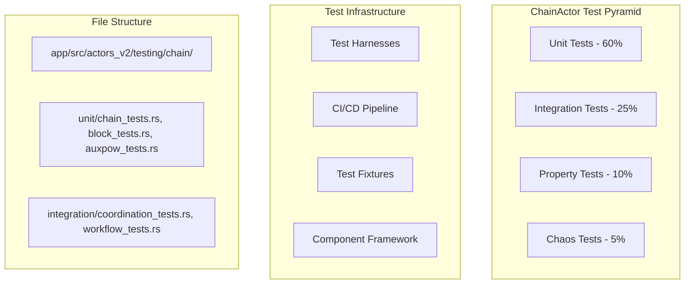
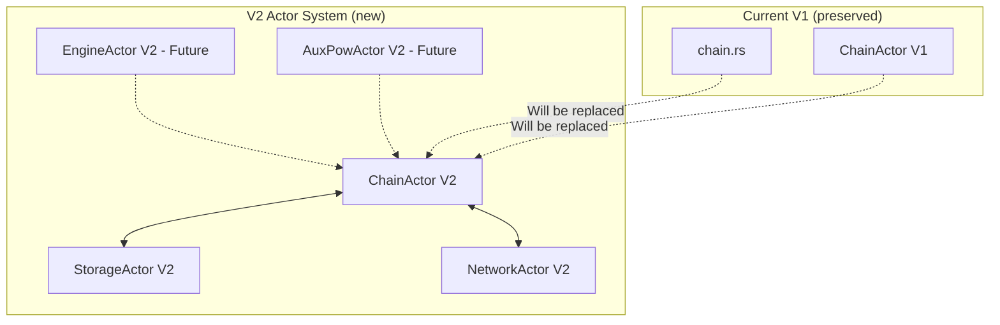

# Revised Systematic Plan for Porting ChainActor to V2

This is a comprehensive plan for porting the ChainActor from V1 to V2 while significantly simplifying its implementation.

## Architecture Clarification

**V1 System Issues:**
- ChainActor V1: Overly complex actor with 15+ modules, custom supervision, over-engineered metrics
- chain.rs V1: Monolithic ~2000 line file with shared mutable state, complex RwLock patterns
- Complex dependency: Custom `actor_system` crate + extensive supervision + complex configuration

**V2 System Goals:**
- Pure Actix (no `actor_system` crate) + essential blockchain operations
- Replace both V1 ChainActor complexity AND monolithic chain.rs
- Simplified but complete blockchain functionality
- Standard Actix actor patterns following StorageActor/NetworkActor V2 approach

## Phase 1: Dependency Cleanup & Foundation

### 1.1 Remove Custom Actor System Dependencies
**From V1:**
```rust
use actor_system::{Actor as AlysActor, ActorMetrics, AlysActorMessage, ActorError, SupervisionConfig, FederationConfig};
```

**To V2:**
```rust
// Use standard Actix patterns only
use actix::prelude::*;
```

### 1.2 Dependencies to Keep/Add

#### **Core Blockchain Dependencies (Keep)**
- **`lighthouse_wrapper`**: Ethereum consensus layer integration, execution payload handling
- **`bitcoin`**: Bitcoin types for AuxPoW operations (Txid, BlockHash, Transaction)
- **`bridge`**: Two-way peg operations (BitcoinSigner, Bridge, PegInInfo, UtxoManager)
- **`ethereum_types`**: Ethereum types (Address, H256, U256) for EVM integration
- **`eyre`**: Error handling and reporting framework

#### **Engine & Execution Dependencies (Keep)**
- **Engine**: Block building, execution payload creation, EL integration
- **Aura**: Proof-of-Authority consensus, validator rotation, slot scheduling
- **Storage integration**: Via StorageActor V2 for block persistence
- **Network integration**: Via NetworkActor V2 for block broadcasting

#### **AuxPoW & Mining Dependencies (Keep - for future EngineActor/AuxPowActor coordination)**
- **AuxPow types**: AuxPowHeader, difficulty calculation, merged mining validation
- **BitcoinConsensusParams**: Difficulty retargeting, mining parameters
- **ChainManager trait**: Interface that will be implemented by ChainActor for EngineActor/AuxPowActor

#### **Peg Operation Dependencies (Keep)**
- **BitcoinWallet**: UTXO management, transaction creation
- **BitcoinSignatureCollector**: Federation signature aggregation
- **PegInInfo/PegOutInfo**: Peg operation state and validation

#### **Framework Dependencies**
- **Keep:** `actix` (standard actor framework)
- **Keep:** `tokio` (async runtime)
- **Keep:** `tracing` (structured logging)
- **Remove:** `actor_system` references
- **Add to V2:** Missing blockchain dependencies identified during porting

### 1.3 Core Blockchain Operations (No Changes to Logic)
- **Keep:** Block production logic from chain.rs
- **Keep:** Block validation and consensus logic
- **Keep:** AuxPoW processing and finalization
- **Keep:** Peg-in/peg-out operations
- **Keep:** Fee distribution and miner rewards
- **Simplify:** Remove circuit breaker complexity, simplify sync status

## Phase 2: Pure Actix Actor Implementation

### 2.1 Actor Structure (Massive Simplification)
```rust
// V1 (complex approach with 15+ modules)
pub struct ChainActor {
    config: ChainActorConfig,           // Complex config with supervision
    chain_state: LocalChainState,       // Complex state management
    pending_blocks: HashMap<Hash256, PendingBlockInfo>,
    federation: FederationState,        // Over-engineered federation
    auxpow_state: AuxPowState,          // Complex AuxPoW state
    subscribers: HashMap<Uuid, BlockSubscriber>,
    metrics: ChainActorMetrics,         // Over-engineered metrics
    actor_addresses: ActorAddresses,    // Complex actor coordination
    validation_cache: ValidationCache,  // Complex validation caching
    health_monitor: ActorHealthMonitor, // Over-engineered health monitoring
    // ... 15+ additional complex fields
}

// V2 (simplified approach - core blockchain functionality)
pub struct ChainActor {
    // Core blockchain state (derived from chain.rs)
    engine: Engine,
    aura: Aura,
    head: Option<BlockRef>,
    sync_status: SyncStatus,

    // Essential AuxPoW and consensus
    queued_pow: Option<AuxPowHeader>,
    max_blocks_without_pow: u64,
    federation: Vec<Address>,

    // Peg operations (simplified from chain.rs)
    bridge: Bridge,
    queued_pegins: BTreeMap<Txid, PegInInfo>,
    bitcoin_wallet: BitcoinWallet,
    bitcoin_signature_collector: BitcoinSignatureCollector,
    maybe_bitcoin_signer: Option<BitcoinSigner>,

    // Essential configuration
    is_validator: bool,
    retarget_params: BitcoinConsensusParams,
    block_hash_cache: Option<BlockHashCache>,

    // Actor integration
    storage_actor: Option<Addr<StorageActor>>,
    network_actor: Option<Addr<NetworkActor>>,

    // Simple metrics
    metrics: ChainMetrics,
}
```

### 2.2 Remove Custom Actor System Integration
**Changes needed:**
- Remove `ActorMetrics` → Use direct prometheus metrics like StorageActor
- Remove `AlysActorMessage` → Use standard Actix `Message` trait
- Remove `ActorError` → Use `ChainError` directly
- Remove complex supervision → Use simple actor lifecycle
- Remove over-engineered health monitoring → Use basic health checks

## Phase 3: Message System (Simplified but Complete)

### 3.1 Essential Message Types (Reduce from 25+ to ~10)
**Core Operations:**
- `ProduceBlock` - Block production for validators
- `ImportBlock` - Block import from network/sync
- `ProcessAuxPow` - AuxPoW processing and finalization
- `ProcessPegins` - Peg-in operations
- `ProcessPegouts` - Peg-out operations
- `GetChainStatus` - Chain status queries
- `GetBlockByHeight` / `GetBlockByHash` - Block retrieval for RPC
- `BroadcastBlock` - Block broadcasting via NetworkActor

**ChainManager Interface (for future EngineActor/AuxPowActor coordination):**
- `IsSynced` - Check if chain is synchronized for mining decisions
- `GetHead` - Get current chain head for mining operations
- `GetAggregateHashes` - Get block hashes for aggregate hash calculation
- `GetLastFinalizedBlock` - Get most recent finalized block for mining
- `PushAuxPow` - Submit validated AuxPow for block finalization

**Future Expansion (Comment Placeholders):**
```rust
// TODO: Add when federation governance is implemented
// - `UpdateFederation` - Hot-reload federation membership and thresholds
// - `VerifyFederationSignature` - Validate federation member signatures
// - `MigrateFederation` - Handle federation configuration transitions
```

**Remove Complex Messages:**
- Complex subscription systems
- Over-engineered metrics messages
- Detailed validation messages with multiple levels
- Complex reorganization messages

### 3.2 Simplified Message Handlers
**Pattern to follow (like StorageActor):**
```rust
// V1 pattern - complex async handlers with supervision
impl Handler<ImportBlock> for ChainActor {
    type Result = ResponseActFuture<Self, Result<ImportBlockResult, ChainError>>;

    fn handle(&mut self, msg: ImportBlock, _: &mut Context<Self>) -> Self::Result {
        // Complex async processing with supervision callbacks
    }
}

// V2 pattern - simple handlers following StorageActor approach
impl Handler<ImportBlock> for ChainActor {
    type Result = ResponseFuture<Result<(), ChainError>>;

    fn handle(&mut self, msg: ImportBlock, _: &mut Context<Self>) -> Self::Result {
        // Clone components for async operation like StorageActor
        let engine = self.engine.clone();
        let storage_actor = self.storage_actor.clone();

        Box::pin(async move {
            // Simple async block processing
            // Core logic from chain.rs but actor-based
        })
    }
}
```

## Phase 4: Component Porting (Direct Migration from chain.rs)

### 4.1 Block Production Logic (`produce_block` from chain.rs)
- **Port:** Complete `produce_block` method from chain.rs:437-692
- **Integration:** Convert to `ProduceBlock` message handler
- **Simplification:** Remove complex rollback logic, simplify payload building
- **Keep:** Fee collection, peg-in processing, AuxPoW integration

### 4.2 Block Import and Processing (`process_block` from chain.rs)
- **Port:** Complete `process_block` method from chain.rs:923-1124
- **Integration:** Convert to `ImportBlock` message handler
- **Keep:** All validation logic, consensus checks, AuxPoW verification
- **Simplify:** Remove complex supervision patterns

### 4.3 AuxPoW Processing (`check_pow`, finalization logic)
- **Port:** AuxPoW validation from chain.rs:1293-1380
- **Port:** Finalization logic from chain.rs:1815-1841
- **Integration:** Convert to `ProcessAuxPow` message handler
- **Keep:** All Bitcoin merged mining logic intact

### 4.4 Peg Operations (`fill_pegins`, `create_pegout_payments`)
- **Port:** Peg-in processing from chain.rs:252-382
- **Port:** Peg-out creation from chain.rs:882-911
- **Integration:** Convert to `ProcessPegins` and `ProcessPegouts` handlers
- **Keep:** All Bridge integration and UTXO management

### 4.5 Chain State Management
- **Port:** Head tracking, sync status from chain.rs
- **Simplify:** Remove complex RwLock patterns, use actor state
- **Keep:** Block candidates, queued operations

## Phase 5: Handler Implementation Strategy

### 5.1 Core Message Handlers (Essential Blockchain Operations)
**Pattern to follow:**
```rust
// ProduceBlock handler - port chain.rs:437-692
impl Handler<ProduceBlock> for ChainActor {
    type Result = ResponseFuture<Result<SignedConsensusBlock, ChainError>>;
    // Port complete block production logic
}

// ImportBlock handler - port chain.rs:923-1124
impl Handler<ImportBlock> for ChainActor {
    type Result = ResponseFuture<Result<(), ChainError>>;
    // Port complete block validation and import logic
}

// ProcessAuxPow handler - port chain.rs:1293-1380 + finalization
impl Handler<ProcessAuxPow> for ChainActor {
    type Result = ResponseFuture<Result<bool, ChainError>>;
    // Port AuxPoW validation and finalization
}
```

### 5.2 Actor Integration (Following NetworkActor V2 Pattern)
**StorageActor Integration:**
```rust
// Store block via StorageActor (like SyncActor does)
if let Some(ref storage_actor) = self.storage_actor {
    let store_msg = StorageMessage::StoreBlock { block, canonical: true };
    storage_actor.send(store_msg).await?;
}
```

**NetworkActor Integration:**
```rust
// Broadcast block via NetworkActor
if let Some(ref network_actor) = self.network_actor {
    let broadcast_msg = NetworkMessage::BroadcastBlock { block_data, priority: true };
    network_actor.send(broadcast_msg).await?;
}
```

## Phase 6: File Structure

### 6.1 Directory Structure in `/app/src/actors_v2/chain/`
```
chain/
├── mod.rs              # Module exports
├── actor.rs            # Main ChainActor (simplified from V1 + chain.rs logic)
├── messages.rs         # Essential message types (10 vs 25+)
├── handlers.rs         # All message handlers (consolidated)
├── config.rs           # Simplified configuration
├── metrics.rs          # Basic metrics (not over-engineered)
├── state.rs            # Chain state management
└── error.rs            # Error types
```

### 6.2 Integration with V2 Cargo.toml
**Add dependencies:**
```toml
# Add blockchain-specific dependencies from chain.rs
bitcoin = "0.31"
bridge = { path = "../bridge" }  # If needed
lighthouse_wrapper = { path = "../lighthouse_wrapper" }
ethereum_types = "0.14"
eyre = "0.6"
```

## Phase 7: Testing Strategy (Based on StorageActor Framework)

### 7.1 Testing Architecture Overview

The ChainActor V2 employs a comprehensive testing strategy following StorageActor V2 patterns:



#### **Testing Principles (Following StorageActor Pattern)**
1. **Fast Feedback**: Unit tests run in <10ms each with component isolation
2. **Real Integration**: Actor tests create actual ChainActor instances
3. **Determinism**: Reproducible test data with predictable blockchain operations
4. **Comprehensive Coverage**: All essential blockchain functionality validated
5. **Production Realism**: Tests use actual message types and coordination patterns

### 7.2 Working Unit Testing Framework

#### **Core Testing Infrastructure** (`app/src/actors_v2/testing/chain/mod.rs`)

```rust
/// ChainActor specific test harness following StorageActor pattern
pub struct ChainTestHarness {
    pub base: BaseTestHarness<ChainActor>,
    pub temp_dir: TempDir,
    pub config: ChainConfig,
    pub mock_engine: MockEngine,
    pub mock_bridge: MockBridge,
}

#[async_trait]
impl ActorTestHarness for ChainTestHarness {
    type Actor = ChainActor;
    type Config = ChainConfig;
    type Message = ChainMessage;
    type Error = ChainTestError;

    async fn send_message(&mut self, message: Self::Message) -> Result<(), Self::Error> {
        self.base.start_operation().await;
        self.base.metrics.messages_sent += 1;

        // Use spawn_blocking following StorageActor pattern for async compatibility
        let result = match message {
            ChainMessage::ProduceBlock { slot, timestamp } => {
                let actor = self.base.get_actor_ref().await;
                tokio::task::spawn_blocking(move || {
                    let rt = tokio::runtime::Handle::current();
                    rt.block_on(async {
                        let _actor_guard = actor.read().await;
                        info!("Producing block for slot {} at timestamp {:?}", slot, timestamp);
                        Ok::<(), anyhow::Error>(())
                    })
                }).await.unwrap().map_err(|e| ChainTestError::BlockOperation(e.to_string()))
            },
            // Additional message handling...
        };

        match result {
            Ok(_) => {
                self.base.record_success().await;
                Ok(())
            },
            Err(e) => {
                self.base.record_error(&e.to_string()).await;
                Err(e)
            }
        }
    }
}
```

### 7.3 Test Categories and Implementation

#### **Unit Tests (60% of coverage)**
**File Structure:**
```
unit/
├── chain_actor_tests.rs        # Actor lifecycle, configuration, basic operations
├── block_production_tests.rs   # Block production logic and validation
├── block_import_tests.rs       # Block import and processing pipeline
├── auxpow_tests.rs             # AuxPoW processing and finalization
├── peg_operation_tests.rs      # Peg-in and peg-out operations
└── consensus_tests.rs          # Aura consensus and validator operations
```

**Example Test Implementation:**
```rust
#[actix::test]
async fn test_chain_actor_creation_and_configuration() {
    let mut harness = ChainTestHarness::new().await.unwrap();
    harness.setup().await.unwrap();

    // Test configuration validation
    assert!(harness.config.validate().is_ok());

    // Verify blockchain state consistency
    harness.verify_blockchain_state().await.unwrap();
    harness.teardown().await.unwrap();
}

#[actix::test]
async fn test_block_production_workflow() {
    let mut harness = ChainTestHarness::new().await.unwrap();
    harness.setup().await.unwrap();

    // Test block production for validator
    let produce_msg = ChainMessage::ProduceBlock {
        slot: 1,
        timestamp: Duration::from_secs(1000),
    };
    harness.send_message(produce_msg).await.unwrap();

    // Verify block was produced and broadcasted
    harness.verify_blockchain_state().await.unwrap();
    harness.teardown().await.unwrap();
}
```

#### **Integration Tests (25% of coverage)**
**File Structure:**
```
integration/
├── chain_coordination_tests.rs    # ChainActor ↔ StorageActor ↔ NetworkActor
├── blockchain_workflow_tests.rs   # End-to-end blockchain operations
├── auxpow_integration_tests.rs    # AuxPoW with mining workflow
└── peg_operation_integration_tests.rs # Cross-actor peg operations
```

**Example Integration Test:**
```rust
#[actix::test]
async fn test_chain_storage_network_coordination() {
    let mut env = ChainIntegrationTestEnvironment::new().await.unwrap();
    env.setup_coordination().await.unwrap();

    // Test complete block production → storage → broadcast workflow
    let block_msg = ChainMessage::ProduceBlock { slot: 1, timestamp: Duration::from_secs(1000) };
    env.chain_harness.send_message(block_msg).await.unwrap();

    // Verify storage received block
    let stored_blocks = env.storage_harness.get_stored_blocks().await.unwrap();
    assert!(!stored_blocks.is_empty());

    // Verify network broadcasted block
    let broadcast_messages = env.network_harness.get_broadcast_messages().await.unwrap();
    assert!(!broadcast_messages.is_empty());

    env.teardown().await.unwrap();
}
```

### 7.4 Test Execution Commands

#### **Basic Test Execution**
```bash
# Navigate to the app directory
cd app

# Run all ChainActor tests
cargo test --lib actors_v2::testing::chain

# Run specific test categories
cargo test --lib actors_v2::testing::chain::unit        # Unit tests
cargo test --lib actors_v2::testing::chain::integration # Integration tests
cargo test --lib actors_v2::testing::chain::property    # Property tests
cargo test --lib actors_v2::testing::chain::chaos       # Chaos tests
```

#### **Advanced Test Configuration**
```bash
# Run with debugging output
RUST_LOG=debug cargo test --lib actors_v2::testing::chain::unit -- --nocapture

# Run with custom configuration
CHAIN_TEST_CONFIG=test_config.json cargo test --lib actors_v2::testing::chain

# Run integration tests with coordination
cargo test --lib actors_v2::testing::chain::integration -- --test-threads=1
```

### 7.5 Test Migration Strategy

#### **Port from V1 Sources**
- **Essential blockchain tests** from both V1 ChainActor and chain.rs
- **Block production and validation tests** with actor patterns
- **AuxPoW processing tests** with mining integration
- **Peg operation tests** with Bridge integration

#### **Remove V1 Complexity**
- Over-engineered supervision tests
- Complex metrics and monitoring tests
- Custom `actor_system` integration tests

#### **Add V2 Specific Tests**
- **Actor coordination tests** with StorageActor V2 and NetworkActor V2
- **Message protocol tests** following StorageActor patterns
- **Performance tests** for blockchain operations

### 7.6 Continuous Integration Integration

**GitHub Actions Workflow** (`.github/workflows/v2-chain-testing.yml`):
```yaml
name: ChainActor V2 Testing

on: [push, pull_request]

jobs:
  chain-actor-tests:
    runs-on: ubuntu-latest
    steps:
      - uses: actions/checkout@v3
      - name: Setup Rust
        uses: actions-rs/toolchain@v1
        with:
          toolchain: stable
      - name: Run ChainActor Unit Tests
        run: cargo test --lib actors_v2::testing::chain::unit
      - name: Run ChainActor Integration Tests
        run: cargo test --lib actors_v2::testing::chain::integration
      - name: Run ChainActor Property Tests
        run: PROPTEST_CASES=1000 cargo test --lib actors_v2::testing::chain::property
      - name: Run ChainActor Chaos Tests (main branch only)
        if: github.ref == 'refs/heads/main'
        run: cargo test --lib actors_v2::testing::chain::chaos
```

## Implementation Strategy

### Priority 1: Core Actor Foundation (Straightforward)
1. Create basic ChainActor structure following StorageActor V2 pattern
2. Port essential blockchain state from chain.rs
3. Remove V1 ChainActor complexity and `actor_system` dependencies
4. Set up basic message system with ~10 essential messages

### Priority 2: Core Blockchain Logic Port (Direct Migration)
1. Port block production logic from chain.rs:437-692 to `ProduceBlock` handler
2. Port block import logic from chain.rs:923-1124 to `ImportBlock` handler
3. Port AuxPoW processing from chain.rs:1293-1380 to `ProcessAuxPow` handler
4. Port peg operations from chain.rs:252-382 and 882-911

### Priority 3: Actor Integration (Standard)
1. Integrate with StorageActor V2 for block storage
2. Integrate with NetworkActor V2 for block broadcasting
3. Add basic RPC endpoints for chain queries
4. Add essential metrics (not over-engineered)

### Priority 4: Testing and Validation (Following V2 Patterns)
1. Port essential tests from both V1 ChainActor and chain.rs
2. Follow StorageActor V2 testing patterns
3. Create integration tests for actor coordination
4. Validate end-to-end blockchain workflows

## Key Insight

This is primarily a **logic consolidation and simplification task**. We're taking:
- **Complex V1 ChainActor** (over-engineered, 15+ modules, custom supervision)
- **Monolithic chain.rs** (shared mutable state, ~2000 lines, complex async patterns)

And creating:
- **Simple ChainActor V2** (essential blockchain operations, standard Actix patterns)
- **Clean actor integration** (StorageActor + NetworkActor coordination)
- **Maintained functionality** (all essential blockchain logic preserved)

## Co-existence Strategy with Current Codebase

### Current Integration Approach
The ChainActor V2 will be developed in parallel with the existing codebase to ensure smooth transition:

#### **File Organization for Co-existence**
```
app/src/
├── chain.rs                           # V1 monolithic implementation (unchanged)
└── actors_v2/
    ├── chain/                         # V2 ChainActor (new)
    │   ├── actor.rs                   # Simplified ChainActor
    │   ├── messages.rs                # Essential messages + ChainManager interface
    │   └── handlers.rs                # Message handlers with chain.rs logic
    ├── storage/                       # StorageActor V2 (existing)
    └── network/                       # NetworkActor V2 (existing)
```

#### **Integration Points for Future EngineActor/AuxPowActor**
The ChainActor V2 will implement the `ChainManager` trait interface to support future actor integrations:

```rust
// ChainManager trait implementation for EngineActor/AuxPowActor coordination
#[async_trait]
impl ChainManager for ChainActor {
    async fn is_synced(&self) -> Result<bool> { /* Implementation */ }
    async fn get_head(&self) -> Result<SignedConsensusBlock> { /* Implementation */ }
    async fn get_aggregate_hashes(&self) -> Result<Vec<bitcoin::BlockHash>> { /* Implementation */ }
    async fn get_last_finalized_block(&self) -> Result<ConsensusBlock> { /* Implementation */ }
    async fn push_auxpow(&mut self, auxpow: AuxPow, params: AuxPowParams) -> Result<bool> { /* Implementation */ }
}
```

#### **Migration Strategy**
1. **Phase 1**: ChainActor V2 co-exists with V1 systems
2. **Phase 2**: EngineActor and AuxPowActor are ported to use ChainActor V2 interface
3. **Phase 3**: V1 chain.rs and ChainActor are deprecated once V2 ecosystem is complete

### Dependencies and Actor Coordination

#### **Actor Ecosystem Preparation**


**Estimated Effort:** Medium complexity - requires understanding blockchain logic from chain.rs and simplifying V1 ChainActor complexity, but follows established V2 patterns from StorageActor and NetworkActor implementations.

**Success Criteria:**
1. ChainActor V2 handles all essential blockchain operations
2. Clean integration with StorageActor V2 and NetworkActor V2
3. Maintains AuxPoW, peg operations, and consensus functionality
4. Implements ChainManager interface for future EngineActor/AuxPowActor integration
5. Co-exists cleanly with current V1 codebase
6. Follows standard Actix patterns without custom `actor_system`
7. Significantly simpler than V1 while preserving essential features