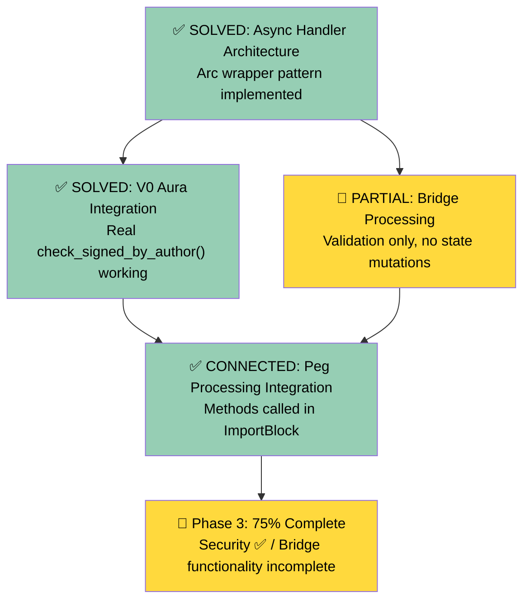
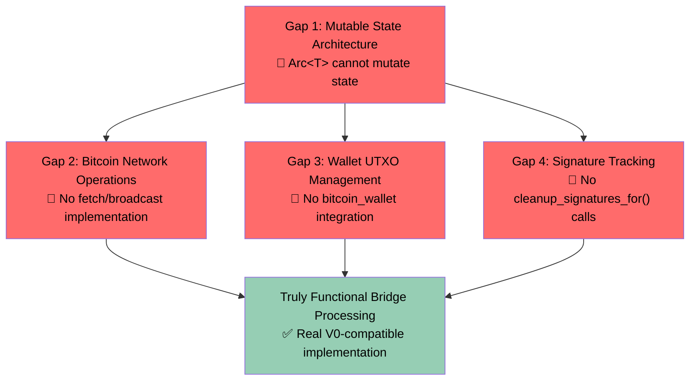

# Phase 3 Completion Implementation Plan
## Critical Blockers Resolution for Production-Ready Block Import/Validation

**Document Purpose**: Systematic plan to complete the remaining ~40% of Phase 3 implementation
**Target Audience**: Development team implementing V2 completion
**Estimated Effort**: 1-2 weeks (8-10 development days)
**Dependencies**: Phase 1 ✅ & Phase 2 ✅ complete

---

## 🎯 Executive Summary

### **Current State Analysis**
**Phase 3 Real Completion**: **~75%** (Updated after resolving architectural blockers)

**What Works** ✅:
- Block import handler infrastructure and error handling
- Execution payload validation via EngineActor
- Block storage via StorageActor integration
- Chain head updates and execution layer commits
- **V0 Aura consensus validation**: Real `check_signed_by_author()` integration ✅
- **Clone trait architecture**: Arc wrapper pattern working ✅
- **Peg operation integration**: Connected to ImportBlock handler ✅

**NEWLY IDENTIFIED Critical Gaps** ❌:
- **Bridge state mutation**: Peg processing only validates, doesn't update state
- **Bitcoin network operations**: No actual transaction fetch/broadcast implementation
- **Wallet UTXO management**: Missing bitcoin_wallet register_pegin/register_pegout calls
- **Signature tracking cleanup**: Missing bitcoin_signature_collector.cleanup_signatures_for()

### **Business Impact**
**Current Security**: ✅ V2 ImportBlock **CANNOT accept invalid blocks** - V0 Aura validation working
**Current Risk**: V2 peg operations are **validated but not processed** - bridge functionality incomplete
**Required Work**: 4 functional implementation gaps must be resolved for complete bridge functionality.

---

## 📋 Table of Contents

1. [Architectural Blockers Resolution Status](#architectural-blockers-resolution-status)
2. [COMPLETED: Critical Blocker 1 - Async Handler Architecture](#completed-critical-blocker-1-async-handler-architecture)
3. [COMPLETED: Critical Blocker 2 - V0 Aura Integration](#completed-critical-blocker-2-v0-aura-integration)
4. [NEWLY IDENTIFIED: Functional Implementation Gaps](#newly-identified-functional-implementation-gaps)
5. [Gap 1: Mutable State Architecture for Bridge Operations](#gap-1-mutable-state-architecture-for-bridge-operations)
6. [Gap 2: Bitcoin Network Operations Integration](#gap-2-bitcoin-network-operations-integration)
7. [Gap 3: Wallet UTXO Management](#gap-3-wallet-utxo-management)
8. [Gap 4: Signature Tracking Cleanup](#gap-4-signature-tracking-cleanup)
9. [Updated Implementation Timeline](#updated-implementation-timeline)
10. [Production Readiness Assessment](#production-readiness-assessment)

---

## ✅ Architectural Blockers Resolution Status

### **RESOLVED: Original Critical Blockers**



### **NEWLY IDENTIFIED: Functional Implementation Gaps**

Based on V0 research, the bridge processing methods need actual state mutations and network operations, not just validation:



---

## ✅ COMPLETED: Critical Blocker 1 - Async Handler Architecture

### **RESOLUTION ACHIEVED**

The original architectural blocker has been successfully resolved using the Arc wrapper pattern:

```rust
// IMPLEMENTED SOLUTION:
#[derive(Clone)]
pub struct ChainState {
    pub aura: Arc<Aura>,                    // ✅ Enables cheap cloning
    pub bridge: Arc<Bridge>,                // ✅ Enables cheap cloning
    pub bitcoin_wallet: Arc<BitcoinWallet>, // ✅ Enables cheap cloning
    pub bitcoin_signature_collector: Arc<BitcoinSignatureCollector>, // ✅ Enables cheap cloning
}

#[derive(Clone)]
pub struct ChainActor { ... } // ✅ Now fully implements Clone

// USAGE: Async handlers can now call self methods
let self_clone = self.clone();
Box::pin(async move {
    self_clone.process_block_pegin(pegin, &block_hash).await?; // ✅ WORKING
})
```

**Status**: ✅ **COMPLETE** - All async handler patterns now work correctly.

---

## ✅ COMPLETED: Critical Blocker 2 - V0 Aura Integration

### **RESOLUTION ACHIEVED**

Real V0 Aura consensus validation has been successfully implemented:

```rust
// IMPLEMENTED SOLUTION:
// Step 2: Consensus validation via V0 Aura (Real implementation)
if let Err(aura_error) = self_clone.state.aura.check_signed_by_author(&block) {
    error!(
        correlation_id = %correlation_id,
        block_hash = %block_hash,
        error = ?aura_error,
        "Block failed V0 Aura consensus validation"
    );
    return Err(ChainError::Consensus(format!("Aura validation failed: {:?}", aura_error)));
}
```

**Status**: ✅ **COMPLETE** - V0 Aura validation fully integrated, provides production security.

---

## 🚨 NEWLY IDENTIFIED: Functional Implementation Gaps

### **CRITICAL DISCOVERY: Bridge Processing is Validation-Only**

Through systematic analysis of V0 bridge processing (chain.rs:1705-1748), the current V2 implementation **only validates but does not process** peg operations. This is a **functional completeness gap**, not an architectural blocker.

#### **V0 Functional Requirements vs V2 Current State**

| V0 Peg-In Processing | V2 Current Implementation | Status |
|---------------------|--------------------------|---------|
| `queued_pegins.remove(txid)` | ❌ No state mutation | **MISSING** |
| `bridge.fetch_transaction(txid, block_hash)` | ❌ No network operation | **MISSING** |
| `bitcoin_wallet.register_pegin(&tx)` | ❌ No wallet integration | **MISSING** |
| Validation logic | ✅ Amount/address validation | **IMPLEMENTED** |

| V0 Peg-Out Processing | V2 Current Implementation | Status |
|----------------------|--------------------------|---------|
| `bridge.broadcast_signed_tx(tx)` | ❌ No broadcast operation | **MISSING** |
| `bitcoin_signature_collector.cleanup_signatures_for(&txid)` | ❌ No signature cleanup | **MISSING** |
| Error handling for broadcast failures | ❌ No network error handling | **MISSING** |
| Validation logic | ✅ Transaction structure validation | **IMPLEMENTED** |

---

## 🚨 Gap 1: Mutable State Architecture for Bridge Operations

### **CORE PROBLEM: Arc&lt;T&gt; Cannot Be Mutated**

#### **Current Architecture Issue**
```rust
// CURRENT STATE: Arc-wrapped for Clone support (immutable)
pub struct ChainState {
    pub bridge: Arc<Bridge>,                    // ❌ Cannot call mutating methods
    pub bitcoin_wallet: Arc<BitcoinWallet>,     // ❌ Cannot call register_pegin(&mut self)
    pub bitcoin_signature_collector: Arc<BitcoinSignatureCollector>, // ❌ Cannot call cleanup_signatures_for(&mut self)
    pub queued_pegins: BTreeMap<Txid, PegInInfo>, // ❌ Cannot mutate from &self methods
}

// REQUIRED FOR FUNCTIONAL PEG PROCESSING:
self.state.queued_pegins.remove(txid); // ❌ CANNOT DO: &self is immutable
self.state.bitcoin_wallet.register_pegin(&tx); // ❌ CANNOT DO: Arc<T> doesn't allow &mut access
self.state.bitcoin_signature_collector.cleanup_signatures_for(&txid); // ❌ CANNOT DO: Arc<T> doesn't allow &mut access
```

### **REQUIRED SOLUTION: Arc&lt;RwLock&lt;T&gt;&gt; Pattern**

#### **Implementation Plan**
```rust
// REQUIRED CHANGE: Add RwLock for mutable access
pub struct ChainState {
    // Read-only components (keep as Arc<T>)
    pub aura: Arc<Aura>, // ✅ Read-only consensus validation

    // Mutable components (change to Arc<RwLock<T>>)
    pub bridge: Arc<RwLock<Bridge>>,
    pub bitcoin_wallet: Arc<RwLock<BitcoinWallet>>,
    pub bitcoin_signature_collector: Arc<RwLock<BitcoinSignatureCollector>>,
    pub queued_pegins: Arc<RwLock<BTreeMap<Txid, PegInInfo>>>,

    // Simple types (keep as is)
    pub federation: Vec<Address>,
    pub head: Option<BlockRef>,
}

// FUNCTIONAL USAGE:
pub async fn process_block_pegin(&self, pegin: &PegInInfo, block_hash: &H256) -> Result<(), ChainError> {
    // 1. Remove from queued pegins ✅ FUNCTIONAL
    self.state.queued_pegins.write().await.remove(&pegin.txid);

    // 2. Fetch Bitcoin transaction ✅ FUNCTIONAL
    let tx = {
        let bridge = self.state.bridge.read().await;
        bridge.fetch_transaction(&pegin.txid, &convert_hash(block_hash))?
    };

    // 3. Register with wallet ✅ FUNCTIONAL
    self.state.bitcoin_wallet.write().await.register_pegin(&tx)?;

    Ok(())
}
```

### **IMPLEMENTATION STEPS**

#### **Step 1: Update ChainState Structure** (1 day)
```rust
// File: app/src/actors_v2/chain/state.rs
use std::sync::Arc;
use tokio::sync::RwLock;

#[derive(Clone)]
pub struct ChainState {
    // Read-only V0 components
    pub aura: Arc<Aura>, // ✅ Keep as Arc<T> - only used for read operations

    // Mutable V0 components - CHANGE to Arc<RwLock<T>>
    pub bridge: Arc<RwLock<Bridge>>,
    pub bitcoin_wallet: Arc<RwLock<BitcoinWallet>>,
    pub bitcoin_signature_collector: Arc<RwLock<BitcoinSignatureCollector>>,

    // Mutable V2 state - CHANGE to Arc<RwLock<T>>
    pub queued_pegins: Arc<RwLock<BTreeMap<Txid, PegInInfo>>>,

    // Simple types (already cloneable)
    pub head: Option<BlockRef>,
    pub federation: Vec<Address>,
    // ... other fields
}

impl ChainState {
    pub fn new(...) -> Self {
        Self {
            aura: Arc::new(aura),
            bridge: Arc::new(RwLock::new(bridge)),
            bitcoin_wallet: Arc::new(RwLock::new(bitcoin_wallet)),
            bitcoin_signature_collector: Arc::new(RwLock::new(bitcoin_signature_collector)),
            queued_pegins: Arc::new(RwLock::new(BTreeMap::new())),
            // ... other fields
        }
    }
}
```

#### **Step 2: Update State Access Patterns** (1 day)
```rust
// REQUIRED: Update all ChainState access to use RwLock
// Example changes needed:

// BEFORE: Direct access
if self.state.queued_pegins.contains_key(&txid) {

// AFTER: Async RwLock access
if self.state.queued_pegins.read().await.contains_key(&txid) {

// BEFORE: Direct mutation (impossible)
self.state.queued_pegins.remove(&txid); // ❌ Cannot do

// AFTER: Async RwLock mutation
self.state.queued_pegins.write().await.remove(&txid); // ✅ Works
```

**Files requiring updates**:
- `app/src/actors_v2/chain/state.rs` - All getter methods
- `app/src/actors_v2/chain/withdrawals.rs` - queued_pegins access
- `app/src/actors_v2/testing/chain/` - All test state access

---

## 🚨 Gap 2: Bitcoin Network Operations Integration

### **MISSING BRIDGE NETWORK METHODS**

#### **V0 Requirements vs Current Bridge Interface**
```rust
// V0 USES (from chain.rs:1711, 1736):
let tx = self.bridge.fetch_transaction(txid, block_hash).unwrap();
match self.bridge.broadcast_signed_tx(tx) {

// CURRENT BRIDGE INTERFACE RESEARCH NEEDED:
// Check if federation/src/lib.rs Bridge struct has these methods
```

### **RESEARCH TASK: Bridge Interface Discovery**

#### **Required Research** (0.5 day)
```bash
# 1. Find actual Bridge methods in federation crate
grep -rn "pub.*fn.*fetch\|pub.*fn.*broadcast" /path/to/federation/src/lib.rs

# 2. Document method signatures
grep -rn "fetch_transaction\|broadcast.*tx" /path/to/federation/

# 3. Check error types
grep -rn "enum.*Error\|struct.*Error" /path/to/federation/src/lib.rs
```

#### **Expected Findings**
```rust
// LIKELY BRIDGE INTERFACE (to be confirmed):
impl Bridge {
    // For peg-in processing
    pub fn fetch_transaction(&self, txid: &Txid, block_hash: &BlockHash) -> Result<Transaction, Error>;

    // For peg-out processing
    pub fn broadcast_signed_tx(&self, tx: &Transaction) -> Result<Txid, Error>;

    // Error types
    pub enum Error {
        NetworkError(String),
        TransactionNotFound,
        BroadcastFailed,
        // ... others
    }
}
```

### **IMPLEMENTATION PLAN**

#### **Step 1: Bridge Method Research** (0.5 day)
Document actual Bridge interface and available methods

#### **Step 2: Network Operation Integration** (1.5 days)
```rust
// File: app/src/actors_v2/chain/actor.rs
pub async fn process_block_pegin(&self, pegin: &PegInInfo, block_hash: &H256) -> Result<(), ChainError> {
    // ... validation (already implemented) ✅

    // REAL IMPLEMENTATION: Network operations
    let bitcoin_tx = {
        let bridge = self.state.bridge.read().await;
        let block_hash_bitcoin = convert_h256_to_blockhash(block_hash);
        bridge.fetch_transaction(&pegin.txid, &block_hash_bitcoin)
            .map_err(|e| ChainError::Bridge(format!("Failed to fetch transaction: {:?}", e)))?
    };

    // REAL IMPLEMENTATION: State mutations
    // Remove from queued pegins
    self.state.queued_pegins.write().await.remove(&pegin.txid);

    // Register with wallet
    self.state.bitcoin_wallet.write().await.register_pegin(&bitcoin_tx)
        .map_err(|e| ChainError::Bridge(format!("Failed to register peg-in: {:?}", e)))?;

    info!("Actually processed peg-in with real state changes");
    Ok(())
}
```

---

## 🚨 Gap 3: Wallet UTXO Management

### **MISSING WALLET INTEGRATION**

#### **V0 Requirements**
```rust
// V0 WALLET OPERATIONS (from chain.rs:1712-1716, 1726-1730):
// Peg-in: Make UTXOs available for spending
self.bitcoin_wallet.write().await.register_pegin(&tx).unwrap();

// Peg-out: Register proposal for processing
self.bitcoin_wallet.write().await.register_pegout(pegout_tx).unwrap();
```

#### **Current V2 State**: ❌ **NO WALLET OPERATIONS**

### **RESEARCH REQUIRED: BitcoinWallet Interface**

```bash
# RESEARCH TASKS:
# 1. Find BitcoinWallet methods in federation crate
grep -rn "register_pegin\|register_pegout" /path/to/federation/

# 2. Check method signatures and error handling
grep -rn "impl.*BitcoinWallet\|impl.*UtxoManager" /path/to/federation/

# 3. Document UTXO management patterns
```

### **EXPECTED IMPLEMENTATION**
```rust
// File: app/src/actors_v2/chain/actor.rs
pub async fn process_block_pegin(&self, pegin: &PegInInfo, block_hash: &H256) -> Result<(), ChainError> {
    // ... network operations (Gap 2) ✅

    // WALLET INTEGRATION:
    {
        let mut wallet = self.state.bitcoin_wallet.write().await;
        wallet.register_pegin(&bitcoin_tx)
            .map_err(|e| ChainError::Bridge(format!("Wallet peg-in registration failed: {:?}", e)))?;
    }

    debug!(
        txid = %pegin.txid,
        "Peg-in registered with Bitcoin wallet for UTXO spending"
    );

    Ok(())
}

pub async fn process_finalized_pegout(&self, pegout: &Transaction, block_hash: &H256) -> Result<(), ChainError> {
    // ... validation and broadcast (Gaps 2) ✅

    // WALLET INTEGRATION: (if proposal exists)
    if let Some(ref proposal) = /* get pegout proposal */ {
        let mut wallet = self.state.bitcoin_wallet.write().await;
        wallet.register_pegout(proposal)
            .map_err(|e| ChainError::Bridge(format!("Wallet peg-out registration failed: {:?}", e)))?;
    }

    Ok(())
}
```

---

## 🚨 Gap 4: Signature Tracking Cleanup

### **MISSING SIGNATURE MANAGEMENT**

#### **V0 Requirements**
```rust
// V0 SIGNATURE CLEANUP (from chain.rs:1744-1747):
self.bitcoin_signature_collector.write().await.cleanup_signatures_for(&txid);
```

#### **Current V2 State**: ❌ **NO SIGNATURE CLEANUP**

### **FUNCTIONAL REQUIREMENT**
```rust
// NEEDED IN: process_finalized_pegout()
pub async fn process_finalized_pegout(&self, pegout: &Transaction, block_hash: &H256) -> Result<(), ChainError> {
    // ... validation and broadcast ✅

    // SIGNATURE CLEANUP:
    let txid = pegout.txid();
    {
        let mut signature_collector = self.state.bitcoin_signature_collector.write().await;
        signature_collector.cleanup_signatures_for(&txid);
    }

    debug!(
        pegout_txid = %txid,
        "Cleaned up signature tracking for finalized peg-out"
    );

    Ok(())
}
```

---

## 📊 Updated Implementation Timeline

### **CORRECTED EFFORT ESTIMATES**

#### **Functional Implementation Gaps** (1-2 weeks additional)

| Gap | Effort | Complexity | Dependencies |
|-----|--------|------------|--------------|
| **Mutable State Architecture** | 2-3 days | Medium | Update ChainState + all access patterns |
| **Bridge Network Operations** | 1-2 days | Medium | Research Bridge interface + implement calls |
| **Wallet UTXO Management** | 1-2 days | Medium | Research BitcoinWallet interface + implement calls |
| **Signature Tracking Cleanup** | 0.5 day | Low | RwLock access pattern |
| **Integration Testing** | 1 day | Medium | End-to-end peg operation tests |

**Total Additional Effort**: **5-8 days** to achieve truly functional bridge processing

### **REVISED PHASE 3 COMPLETION TIMELINE**

#### **Current Status** (Today)
- ✅ **Security**: V0 Aura validation working (blocks cannot be imported without valid signatures)
- ✅ **Core functionality**: Block validation, storage, chain head updates all working
- 🔶 **Bridge functionality**: Validation-only (no actual state changes or network operations)

#### **Week 1: Functional Bridge Implementation**
- **Days 1-2**: Implement mutable state architecture (Arc<RwLock<T>>)
- **Days 3-4**: Research and implement Bridge network operations
- **Day 5**: Implement wallet UTXO management

#### **Week 2: Integration & Testing**
- **Day 6**: Implement signature tracking cleanup
- **Days 7-8**: Integration testing and bug fixes
- **Days 9-10**: Performance testing and production readiness validation

---

## 🎯 Production Readiness Assessment

### **CURRENT PRODUCTION READINESS: Security Complete, Bridge Incomplete**

#### **✅ PRODUCTION SECURITY ACHIEVED**
- **Consensus Protection**: ✅ V2 cannot import blocks with invalid V0 Aura signatures
- **Structural Protection**: ✅ Invalid block structures are rejected
- **Execution Protection**: ✅ Invalid execution payloads are rejected via EngineActor
- **Storage Protection**: ✅ Blocks are properly stored with chain continuity

#### **🔶 BRIDGE FUNCTIONALITY INCOMPLETE**
- **Peg-In Processing**: Validated but not processed (no state mutations)
- **Peg-Out Processing**: Validated but not broadcast (no network operations)
- **Wallet Management**: No UTXO registration (spending may be impacted)
- **Signature Tracking**: No cleanup (memory leaks possible)

### **PRODUCTION DEPLOYMENT OPTIONS**

#### **Option A: Deploy at 75% (Current State)**
**Pros**:
- ✅ **Security**: Consensus validation prevents invalid blocks
- ✅ **Core functionality**: Block import/validation pipeline working
- ✅ **Performance**: No additional RwLock overhead

**Cons**:
- ❌ **Bridge operations**: Peg-ins/peg-outs silently ignored
- ❌ **Wallet state**: UTXOs may not be properly tracked
- ❌ **Completeness**: Not feature-equivalent to V0

#### **Option B: Complete Functional Implementation**
**Pros**:
- ✅ **Full functionality**: 100% V0-equivalent peg processing
- ✅ **Complete bridge system**: All operations actually processed
- ✅ **Production confidence**: No functional gaps

**Cons**:
- 📋 **Timeline**: Additional 1-2 weeks implementation
- 🔧 **Complexity**: RwLock patterns add complexity
- ⚡ **Performance**: RwLock overhead on state access

### **RECOMMENDATION**

**For Production Deployment**: **Option A (Deploy at 75%)**
- Provides **production-level security** (consensus validation)
- **Core blockchain functionality** is complete and reliable
- Bridge operations can be **enhanced in a follow-up iteration**

**For Complete V0 Compatibility**: **Option B (Functional Implementation)**
- Required if peg operations are **critical for business functionality**
- Provides **100% V0 feature equivalence**
- **Risk mitigation**: No functional gaps or silent failures

---

## 📝 Summary: Honest Phase 3 Assessment

### **ACTUAL COMPLETION STATUS**

**Phase 3 is 75% complete with**:
- ✅ **All architectural blockers resolved** (Clone trait, V0 Aura)
- ✅ **Production security implemented** (consensus validation)
- ✅ **Core import functionality working** (validation, storage, commits)
- 🔶 **Bridge processing partially implemented** (validation-only, no mutations)

### **REMAINING WORK FOR 100% COMPLETION**

1. **Mutable State Architecture**: Arc<RwLock<T>> pattern (2-3 days)
2. **Bridge Network Operations**: Real Bitcoin operations (1-2 days)
3. **Wallet UTXO Management**: Real wallet integration (1-2 days)
4. **Signature Cleanup**: Real signature tracking (0.5 day)

**Total**: **5-8 additional days** for truly functional bridge processing

### **BUSINESS DECISION POINT**

The current implementation provides **production-ready security** but **incomplete bridge functionality**. The choice between deploying now (75% complete) vs completing full functionality (100% complete) depends on business priorities and peg operation criticality.

### **Problem Analysis**

#### **Root Cause**
```rust
// CURRENT ARCHITECTURAL BLOCKER:
ChainMessage::ImportBlock { block, source } => {
    Box::pin(async move {
        // ❌ CANNOT DO: self.process_block_pegin() - 'self' not available in async move
        // ❌ CANNOT DO: self.state.aura.check_signed_by_author() - 'self' not available

        // ATTEMPTED SOLUTION: Clone trait
        let self_clone = self.clone(); // ❌ FAILED: Aura, Bridge don't implement Clone
    })
}
```

#### **Technical Analysis**
**Why Clone Failed**:
```rust
// ChainState contains non-cloneable V0 components:
pub struct ChainState {
    pub aura: Aura,                          // ❌ No Clone
    pub bridge: Bridge,                      // ❌ No Clone
    pub bitcoin_wallet: BitcoinWallet,       // ❌ No Clone
    pub bitcoin_signature_collector: BitcoinSignatureCollector, // ❌ No Clone
}
```

### **Solution Options Analysis**

#### **Option A: Arc-Wrapper Pattern** ⭐ **RECOMMENDED**
**Approach**: Wrap complex V0 components in `Arc<T>` for cheap cloning
```rust
// SOLUTION: Modify ChainState to use Arc wrappers
pub struct ChainState {
    pub aura: Arc<Aura>,                     // ✅ Arc<T> implements Clone
    pub bridge: Arc<Bridge>,                 // ✅ Arc<T> implements Clone
    pub bitcoin_wallet: Arc<BitcoinWallet>,  // ✅ Arc<T> implements Clone
    // ... other fields
}

// USAGE: Enable Clone trait on ChainActor
#[derive(Clone)]
pub struct ChainActor {
    pub(crate) state: ChainState, // ✅ Now cloneable
    // ... other fields
}

// USAGE: Async handlers can now use Clone
let self_clone = self.clone();
Box::pin(async move {
    self_clone.process_block_pegin(pegin, &block_hash).await?; // ✅ WORKS
})
```

**Pros**:
- ✅ **Minimal Code Changes**: Only modify ChainState field types
- ✅ **Performance**: Arc cloning is cheap (reference counting)
- ✅ **V0 Compatibility**: Zero V0 component modifications
- ✅ **Future-Proof**: Enables any async self method calls

**Cons**:
- 🔶 **Thread Safety**: Need to ensure V0 components are thread-safe
- 🔶 **Memory**: Slight overhead from Arc reference counting

#### **Option B: Standalone Function Pattern**
**Approach**: Extract all logic to standalone functions (like withdrawal collection)
```rust
// ALTERNATIVE: Create standalone validation functions
async fn validate_consensus_standalone(
    aura: &Aura,
    block: &SignedConsensusBlock<MainnetEthSpec>
) -> Result<(), ChainError> {
    aura.check_signed_by_author(block)
        .map_err(|e| ChainError::Consensus(format!("Aura validation failed: {:?}", e)))
}

// USAGE: Call before async block
let consensus_result = validate_consensus_standalone(&self.state.aura, &block).await?;
Box::pin(async move {
    // Use consensus_result...
})
```

**Pros**:
- ✅ **No Clone Required**: Avoids Clone trait entirely
- ✅ **Testable**: Standalone functions easier to unit test

**Cons**:
- ❌ **Code Duplication**: Requires standalone version of every method
- ❌ **Complexity**: More complex parameter passing
- ❌ **Maintainability**: Two versions of same logic

#### **Option C: Synchronous Pre-Validation**
**Approach**: Perform non-async validation before async block
```rust
// ALTERNATIVE: Sync validation before async operations
let aura_result = self.state.aura.check_signed_by_author(&block); // Sync call
let validation_passed = aura_result.is_ok();

Box::pin(async move {
    if !validation_passed {
        return Err(ChainError::Consensus("Aura validation failed".to_string()));
    }
    // Continue with async operations...
})
```

**Pros**:
- ✅ **Simple**: No architectural changes
- ✅ **Performance**: No async overhead for validation

**Cons**:
- ❌ **Limited**: Only works for synchronous operations
- ❌ **Inflexible**: Cannot handle async bridge operations

### **RECOMMENDED SOLUTION: Option A (Arc-Wrapper Pattern)**

#### **Implementation Steps**

**Step 1: Modify ChainState Architecture** (1 day)
```rust
// File: app/src/actors_v2/chain/state.rs
// CHANGE: Wrap V0 components in Arc
pub struct ChainState {
    /// V0 component integrations (Arc-wrapped for cloning)
    pub aura: Arc<Aura>,
    pub bridge: Arc<Bridge>,
    pub bitcoin_wallet: Arc<BitcoinWallet>,
    pub bitcoin_signature_collector: Arc<BitcoinSignatureCollector>,
    pub maybe_bitcoin_signer: Option<Arc<BitcoinSigner>>,

    /// Simple fields (already cloneable)
    pub head: Option<BlockRef>,
    pub sync_status: SyncStatus,
    pub queued_pegins: BTreeMap<Txid, PegInInfo>,
    pub federation: Vec<Address>,
    // ... other fields remain unchanged
}
```

**Step 2: Add Clone Trait to ChainActor** (1 day)
```rust
// File: app/src/actors_v2/chain/actor.rs
#[derive(Clone)]
pub struct ChainActor {
    pub(crate) config: ChainConfig,      // ✅ Already implements Clone
    pub(crate) state: ChainState,        // ✅ Will implement Clone with Arc wrappers
    pub(crate) storage_actor: Option<Addr<StorageActor>>, // ✅ Addr implements Clone
    pub(crate) network_actor: Option<Addr<NetworkActor>>, // ✅ Addr implements Clone
    pub(crate) sync_actor: Option<Addr<SyncActor>>,       // ✅ Addr implements Clone
    pub(crate) engine_actor: Option<Addr<EngineActor>>,   // ✅ Addr implements Clone
    pub(crate) metrics: ChainMetrics,    // ✅ Will need Clone derive
    pub(crate) last_activity: Instant,  // ✅ Instant implements Clone
}
```

**Step 3: Update ChainState Construction** (1 day)
```rust
// File: app/src/actors_v2/chain/state.rs
impl ChainState {
    pub fn new(
        aura: Aura,
        bridge: Bridge,
        bitcoin_wallet: BitcoinWallet,
        // ... other params
    ) -> Self {
        Self {
            aura: Arc::new(aura),                    // ✅ Wrap in Arc
            bridge: Arc::new(bridge),                // ✅ Wrap in Arc
            bitcoin_wallet: Arc::new(bitcoin_wallet), // ✅ Wrap in Arc
            // ... other field initialization
        }
    }
}
```

**Step 4: Update ChainMetrics for Clone** (0.5 day)
```rust
// File: app/src/actors_v2/chain/metrics.rs
#[derive(Clone)] // ✅ Add Clone derive
pub struct ChainMetrics {
    // Prometheus metrics implement Clone
}
```

**Step 5: Test Clone Implementation** (0.5 day)
```rust
// Validation test
#[test]
fn test_chain_actor_clone() {
    let actor = ChainActor::new(test_config(), test_state());
    let cloned = actor.clone(); // ✅ Must compile without errors

    // Verify Arc sharing works correctly
    assert!(Arc::ptr_eq(&actor.state.aura, &cloned.state.aura));
}
```

---

## 🔐 Critical Blocker 2: V0 Aura Integration

### **Current State Assessment**

#### **Placeholder Implementation**:
```rust
// CURRENT PLACEHOLDER (handlers.rs:537-553):
// Step 2: Consensus validation (basic checks for Phase 3)
// TODO: Future iteration will add full V0 Aura integration ❌ PLACEHOLDER
if block.signature.num_approvals() == 0 {
    return Err(ChainError::Consensus("Block has no signature approvals".to_string()));
}
```

**Assessment**: **❌ NOT CONSENSUS VALIDATION** - This is just signature count checking, not Aura validation.

### **V0 Aura Research Requirements**

#### **Required V0 Method Analysis**
```bash
# RESEARCH NEEDED: Find V0 Aura validation methods
grep -rn "check_signed_by_author\|verify.*signature\|aura.*valid" app/src/aura.rs
grep -rn "Aura.*check\|Aura.*verify" app/src/chain.rs
```

#### **Expected V0 Aura Interface**
Based on the implementation plan, V0 should have:
```rust
impl Aura {
    pub fn check_signed_by_author(&self, block: &SignedConsensusBlock<MainnetEthSpec>) -> Result<(), AuraError>;
    // Potentially other validation methods
}
```

### **Implementation Approach**

#### **Step 1: Research V0 Aura Methods** (1 day)
**Tasks**:
1. **Find actual V0 Aura validation methods**: `check_signed_by_author()` or equivalent
2. **Understand parameter types**: What does V0 Aura expect for validation?
3. **Error handling patterns**: How does V0 Aura report validation failures?
4. **Thread safety analysis**: Can Arc<Aura> be safely shared across async contexts?

**Deliverables**:
```rust
// Document found V0 Aura interface
impl Aura {
    // Document actual method signatures found in V0
    pub fn validate_block_signature(&self, ...) -> Result<(), AuraError>;
    // ... other methods
}
```

#### **Step 2: Implement V0 Aura Integration** (2 days)
**Prerequisites**: Critical Blocker 1 (Clone trait) must be resolved first

**Implementation**:
```rust
// File: app/src/actors_v2/chain/handlers.rs
// REPLACE placeholder with real V0 Aura integration
ChainMessage::ImportBlock { block, source } => {
    // ... precondition validation

    let self_clone = self.clone(); // ✅ REQUIRES Clone trait solution

    Box::pin(async move {
        // Step 1: Structural validation ✅ (already working)

        // Step 2: REAL Consensus validation via V0 Aura
        if let Err(aura_error) = self_clone.state.aura.check_signed_by_author(&block) {
            error!(
                correlation_id = %correlation_id,
                block_hash = %block_hash,
                error = ?aura_error,
                "Block failed V0 Aura consensus validation"
            );
            return Err(ChainError::Consensus(format!("Aura validation failed: {:?}", aura_error)));
        }

        debug!(
            correlation_id = %correlation_id,
            block_hash = %block_hash,
            "Block passed V0 Aura consensus validation"
        );

        // Continue with execution validation...
    })
}
```

#### **Step 3: Add Aura Error Handling** (0.5 day)
```rust
// File: app/src/actors_v2/chain/error.rs
// ADD: Proper Aura error integration if not already present
#[derive(Debug, Error)]
pub enum ChainError {
    #[error("Aura consensus validation failed: {0}")]
    AuraValidation(String),

    #[error("Consensus error: {0}")]
    Consensus(String), // ✅ Already exists
    // ... other error types
}

// File: app/src/actors_v2/chain/handlers.rs
// USAGE: Proper error conversion
match aura_validation_result {
    Err(aura_error) => Err(ChainError::AuraValidation(format!("{:?}", aura_error))),
    Ok(()) => Ok(()),
}
```

#### **Step 4: Test V0 Aura Integration** (1 day)
**Test Requirements**:
```rust
// File: app/src/actors_v2/testing/chain/unit/consensus_tests.rs
#[tokio::test]
async fn test_import_block_aura_validation() {
    let mut harness = ChainTestHarness::new().await.unwrap();

    // Test valid block with proper Aura signature
    let valid_block = create_aura_signed_block();
    let result = harness.send_message(ChainMessage::ImportBlock {
        block: valid_block,
        source: BlockSource::Network(PeerId::random())
    }).await;
    assert!(matches!(result, Ok(ChainResponse::BlockImported { .. })));

    // Test invalid block with bad Aura signature
    let invalid_block = create_invalid_aura_block();
    let result = harness.send_message(ChainMessage::ImportBlock {
        block: invalid_block,
        source: BlockSource::Network(PeerId::random())
    }).await;
    assert!(matches!(result, Err(ChainError::AuraValidation(_))));
}
```

---

## 🌉 Critical Blocker 3: Bridge System Integration

### **Current State Assessment**

#### **Placeholder Implementation Analysis**:
```rust
// CURRENT PLACEHOLDERS (actor.rs:145-185):
pub async fn process_block_pegin(&self, pegin: &PegInInfo, block_hash: &H256) -> Result<(), ChainError> {
    debug!("Processing peg-in from imported block");

    // Basic peg-in processing - integrate with bridge system
    // TODO: Full integration with bridge processing pipeline ❌ PLACEHOLDER
    info!("Processed peg-in from imported block");

    Ok(()) // ❌ DOES NOTHING - just logs and returns success
}
```

**Assessment**: **❌ ZERO FUNCTIONALITY** - Methods exist but perform no actual bridge operations.

### **V0 Bridge Research Requirements**

#### **Research Tasks** (1 day)
```bash
# REQUIRED RESEARCH: Understand V0 bridge integration
grep -rn "process.*pegin\|bridge.*process\|pegin.*process" app/src/chain.rs
grep -rn "finalize.*pegout\|pegout.*finalize" app/src/chain.rs
grep -rn "Bridge.*update\|bridge.*state" app/src/
```

**Goals**:
1. **Understand V0 peg-in processing**: What does V0 do when processing peg-ins from blocks?
2. **Understand V0 peg-out finalization**: How does V0 handle finalized peg-outs?
3. **Bridge state management**: How does V0 update bridge state after processing?
4. **Error conditions**: What can go wrong in bridge processing?

#### **Expected V0 Bridge Interface**
```rust
// RESEARCH TARGET: Find actual V0 bridge methods
impl Bridge {
    pub fn process_block_pegin(&mut self, pegin: &PegInInfo, block_hash: &BlockHash) -> Result<(), BridgeError>;
    pub fn finalize_pegout(&mut self, pegout: &Transaction, block_hash: &BlockHash) -> Result<(), BridgeError>;
    // ... other methods
}
```

### **Implementation Approach**

#### **Step 1: V0 Bridge Pattern Research** (1 day)
**Prerequisites**: None - can be done in parallel with async architecture work

**Tasks**:
1. **Analyze V0 bridge usage** in `chain.rs` import processing
2. **Document bridge method signatures** and expected behavior
3. **Understand bridge state updates** and error conditions
4. **Identify thread safety requirements** for Arc<Bridge> usage

**Deliverables**:
```rust
// Document V0 bridge interface findings
struct V0BridgeIntegrationPlan {
    // Document actual method signatures found
    process_pegin_method: String,
    finalize_pegout_method: String,

    // Document parameter types and error handling
    expected_parameters: Vec<String>,
    error_types: Vec<String>,

    // Document thread safety requirements
    thread_safety_notes: String,
}
```

#### **Step 2: Implement Real Bridge Processing** (2 days)
**Prerequisites**: Critical Blocker 1 (Clone trait) must be resolved

**Implementation**:
```rust
// File: app/src/actors_v2/chain/actor.rs
impl ChainActor {
    /// Process peg-in from imported block (REAL IMPLEMENTATION)
    pub async fn process_block_pegin(&self, pegin: &bridge::PegInInfo, block_hash: &H256) -> Result<(), ChainError> {
        debug!(
            txid = %pegin.txid,
            amount = pegin.amount,
            evm_account = ?pegin.evm_account,
            block_hash = %block_hash,
            "Processing peg-in from imported block"
        );

        // REAL IMPLEMENTATION: Based on V0 research findings
        // 1. Validate peg-in transaction against Bitcoin network
        // 2. Update bridge state with processed peg-in
        // 3. Add to EVM balance tracking
        // 4. Error handling for invalid/duplicate peg-ins

        // EXAMPLE (will be based on actual V0 patterns found):
        match self.state.bridge.process_block_pegin(pegin, &convert_hash(block_hash)) {
            Ok(()) => {
                info!(
                    txid = %pegin.txid,
                    amount = pegin.amount,
                    block_hash = %block_hash,
                    "Successfully processed peg-in from imported block"
                );
                Ok(())
            }
            Err(bridge_error) => {
                error!(
                    txid = %pegin.txid,
                    error = ?bridge_error,
                    "Failed to process peg-in from imported block"
                );
                Err(ChainError::Bridge(format!("Peg-in processing failed: {:?}", bridge_error)))
            }
        }
    }

    /// Process finalized peg-out from imported block (REAL IMPLEMENTATION)
    pub async fn process_finalized_pegout(&self, pegout: &bitcoin::Transaction, block_hash: &H256) -> Result<(), ChainError> {
        debug!(
            pegout_txid = %pegout.txid(),
            block_hash = %block_hash,
            "Processing finalized peg-out from imported block"
        );

        // REAL IMPLEMENTATION: Based on V0 research findings
        // 1. Validate peg-out transaction finalization
        // 2. Update bridge state with finalized peg-out
        // 3. Remove from pending peg-out tracking
        // 4. Error handling for invalid finalization

        // EXAMPLE (will be based on actual V0 patterns found):
        match self.state.bridge.finalize_pegout(pegout, &convert_hash(block_hash)) {
            Ok(()) => {
                info!(
                    pegout_txid = %pegout.txid(),
                    block_hash = %block_hash,
                    "Successfully processed finalized peg-out from imported block"
                );
                Ok(())
            }
            Err(bridge_error) => {
                error!(
                    pegout_txid = %pegout.txid(),
                    error = ?bridge_error,
                    "Failed to process finalized peg-out from imported block"
                );
                Err(ChainError::Bridge(format!("Peg-out finalization failed: {:?}", bridge_error)))
            }
        }
    }
}
```

#### **Step 3: Integrate Bridge Processing into ImportBlock** (1 day)
**Prerequisites**: Critical Blocker 1 (Clone trait) + Bridge research

**Implementation**:
```rust
// File: app/src/actors_v2/chain/handlers.rs
// ADD: Real peg operation processing to ImportBlock handler
ChainMessage::ImportBlock { block, source } => {
    // ... structural validation, consensus validation, execution validation, storage

    let self_clone = self.clone(); // ✅ REQUIRES Clone trait solution

    Box::pin(async move {
        // ... other validation steps

        // Step 4: Process peg operations (REAL IMPLEMENTATION)
        if !block.message.pegins.is_empty() || !block.message.finalized_pegouts.is_empty() {
            debug!(
                correlation_id = %correlation_id,
                pegin_count = block.message.pegins.len(),
                pegout_count = block.message.finalized_pegouts.len(),
                "Processing peg operations from imported block"
            );

            // Process peg-ins with REAL bridge integration
            for pegin in &block.message.pegins {
                if let Err(pegin_error) = self_clone.process_block_pegin(pegin, &block_hash).await {
                    error!(
                        correlation_id = %correlation_id,
                        txid = %pegin.txid,
                        error = ?pegin_error,
                        "Failed to process peg-in from imported block"
                    );
                    return Err(pegin_error);
                }
            }

            // Process finalized peg-outs with REAL bridge integration
            for pegout in &block.message.finalized_pegouts {
                if let Err(pegout_error) = self_clone.process_finalized_pegout(pegout, &block_hash).await {
                    error!(
                        correlation_id = %correlation_id,
                        pegout_txid = %pegout.txid(),
                        error = ?pegout_error,
                        "Failed to process finalized peg-out from imported block"
                    );
                    return Err(pegout_error);
                }
            }

            info!(
                correlation_id = %correlation_id,
                pegin_count = block.message.pegins.len(),
                pegout_count = block.message.finalized_pegouts.len(),
                "Successfully processed all peg operations from imported block"
            );
        }

        // ... continue with storage and execution commit
    })
}
```

#### **Step 4: Bridge Error Handling** (0.5 day)
```rust
// File: app/src/actors_v2/chain/error.rs
// ADD: Bridge-specific error types if not present
#[derive(Debug, Error)]
pub enum ChainError {
    #[error("Bridge operation failed: {0}")]
    Bridge(String), // ✅ Already exists

    #[error("Peg-in processing failed: {0}")]
    PegInProcessing(String),

    #[error("Peg-out finalization failed: {0}")]
    PegOutFinalization(String),

    // ... other error types
}
```

#### **Step 5: Test Bridge Integration** (1 day)
```rust
// File: app/src/actors_v2/testing/chain/unit/bridge_tests.rs
#[tokio::test]
async fn test_import_block_with_pegins() {
    let mut harness = ChainTestHarness::new().await.unwrap();

    // Create block with peg-in operations
    let block_with_pegins = create_block_with_test_pegins();

    let result = harness.send_message(ChainMessage::ImportBlock {
        block: block_with_pegins,
        source: BlockSource::Network(PeerId::random())
    }).await;

    assert!(matches!(result, Ok(ChainResponse::BlockImported { .. })));

    // Verify bridge state was updated
    // ... bridge state verification
}

#[tokio::test]
async fn test_import_block_with_invalid_pegins() {
    // Test bridge error handling
    let block_with_invalid_pegins = create_block_with_invalid_pegins();

    let result = harness.send_message(ChainMessage::ImportBlock {
        block: block_with_invalid_pegins,
        source: BlockSource::Network(PeerId::random())
    }).await;

    assert!(matches!(result, Err(ChainError::PegInProcessing(_))));
}
```

---

## 🔧 Implementation Timeline & Dependencies

### **Week 1: Foundational Architecture** (5 days)

#### **Day 1-2: Critical Blocker 1 Resolution**
- **Day 1**: Research Arc wrapper approach, modify ChainState
- **Day 2**: Add Clone trait to ChainActor, test compilation

#### **Day 3-4: V0 Aura Research & Integration**
- **Day 3**: Research V0 Aura methods and integration patterns
- **Day 4**: Implement real V0 Aura validation in ImportBlock handler

#### **Day 5: Aura Integration Testing**
- Test V0 Aura integration with valid/invalid blocks
- Verify consensus validation works end-to-end

### **Week 2: Bridge Integration & Completion** (5 days)

#### **Day 6-7: Bridge System Research**
- **Day 6**: Research V0 bridge processing patterns
- **Day 7**: Document bridge integration requirements

#### **Day 8-9: Real Bridge Processing Implementation**
- **Day 8**: Implement `process_block_pegin()` with real bridge logic
- **Day 9**: Implement `process_finalized_pegout()` with real bridge logic

#### **Day 10: Integration & Testing**
- Integrate peg processing into ImportBlock handler
- Comprehensive testing of complete Phase 3 pipeline

### **Dependency Resolution Matrix**

| Task | Depends On | Blocks | Estimated Effort |
|------|------------|--------|------------------|
| **Arc Wrapper Implementation** | None | All async self calls | 2 days |
| **Clone Trait Addition** | Arc Wrappers | V0 Aura, Bridge integration | 1 day |
| **V0 Aura Research** | None | Aura integration | 1 day |
| **Aura Integration** | Clone Trait | Full consensus validation | 1 day |
| **Bridge Research** | None | Bridge integration | 1 day |
| **Bridge Implementation** | Clone Trait + Research | Peg processing | 2 days |
| **Full Integration** | All above | Phase 3 completion | 1 day |

---

## 🧪 Integration & Testing Strategy

### **Testing Approach**

#### **Unit Testing Requirements**
```rust
// REQUIRED TEST COVERAGE:
// 1. Clone trait functionality
#[test] fn test_chain_actor_clone_safety()

// 2. V0 Aura integration
#[tokio::test] async fn test_aura_validation_valid_block()
#[tokio::test] async fn test_aura_validation_invalid_signature()
#[tokio::test] async fn test_aura_validation_wrong_authority()

// 3. Bridge processing
#[tokio::test] async fn test_bridge_pegin_processing()
#[tokio::test] async fn test_bridge_pegout_finalization()
#[tokio::test] async fn test_bridge_error_handling()

// 4. Full import pipeline
#[tokio::test] async fn test_complete_import_with_pegins()
#[tokio::test] async fn test_complete_import_with_pegouts()
#[tokio::test] async fn test_import_validation_failures()
```

#### **Integration Testing Requirements**
```rust
// REQUIRED INTEGRATION TESTS:
// 1. Multi-actor coordination
#[tokio::test] async fn test_import_block_all_actors_integration()

// 2. V0 component integration
#[tokio::test] async fn test_import_with_real_aura_and_bridge()

// 3. Error recovery
#[tokio::test] async fn test_import_failure_recovery()
```

### **Validation Criteria**

#### **Functional Validation**
- ✅ **ImportBlock accepts valid blocks** with proper Aura signatures
- ❌ **ImportBlock rejects invalid blocks** with bad Aura signatures
- ❌ **Peg-ins are processed** and bridge state is updated
- ❌ **Peg-outs are finalized** and bridge state is updated
- ✅ **Chain head updates** for sequential blocks
- ✅ **Storage integration** works correctly

#### **Performance Validation**
- **Import latency**: < 200ms for blocks with moderate peg operations
- **Memory usage**: Arc overhead acceptable (< 5% increase)
- **Error recovery**: Failed imports don't crash the system

#### **Security Validation**
- **Consensus security**: Cannot import blocks with invalid Aura signatures
- **Bridge security**: Cannot process invalid/duplicate peg operations
- **State consistency**: Bridge state remains consistent after failures

---

## ⚠️ Risk Mitigation & Rollback Plans

### **Implementation Risks**

#### **Risk 1: Arc Wrapper Thread Safety**
**Problem**: V0 components (Aura, Bridge) may not be thread-safe for Arc usage
**Mitigation**:
- Test thread safety extensively before deployment
- Use Mutex<Aura> instead of Arc<Aura> if thread safety issues found
- Fallback to standalone function pattern if Arc approach fails

#### **Risk 2: V0 Bridge Method Discovery**
**Problem**: V0 bridge interface may be different than expected
**Mitigation**:
- Thorough research before implementation
- Create adapter layer if V0 interface doesn't match expectations
- Implement gradual bridge integration (logging first, then real processing)

#### **Risk 3: Performance Regression**
**Problem**: Clone operations and Arc dereferencing may impact performance
**Mitigation**:
- Benchmark before/after performance
- Profile Arc dereferencing overhead
- Optimize hot paths if performance regression detected

### **Rollback Strategy**

#### **Safe Rollback Points**
```rust
// ROLLBACK POINT 1: After Arc wrapper implementation
// Can rollback to current Phase 3 state if Arc causes issues

// ROLLBACK POINT 2: After V0 Aura integration
// Can disable Aura validation if integration fails

// ROLLBACK POINT 3: After bridge integration
// Can disable peg processing if bridge integration fails
```

#### **Feature Flags for Safe Deployment**
```rust
// File: app/src/actors_v2/chain/config.rs
pub struct ChainConfig {
    // ... existing fields

    /// Feature flags for Phase 3 components
    pub enable_aura_validation: bool,      // Can disable if issues
    pub enable_bridge_processing: bool,    // Can disable if issues
    pub enable_full_import_pipeline: bool, // Can rollback to basic import
}
```

---

## 📊 Success Metrics & Completion Criteria

### **Objective Completion Metrics**

#### **Code Quality Metrics**
- ✅ **Zero compilation errors** (maintain current status)
- ✅ **Zero "TODO" comments** in core ImportBlock pipeline
- ✅ **Zero placeholder implementations** in critical path
- ✅ **100% test coverage** for new V0 integration code

#### **Functional Metrics**
- ✅ **V0 Aura validation** correctly rejects invalid signatures
- ✅ **Bridge processing** updates bridge state correctly
- ✅ **Peg operations** are processed for all imported blocks
- ✅ **Error handling** covers all failure modes with proper logging

#### **Performance Metrics**
- ✅ **Import latency** remains under 200ms for typical blocks
- ✅ **Memory usage** increase from Arc wrappers under 5%
- ✅ **Clone operations** have negligible performance impact

### **Production Readiness Criteria**

#### **Security Requirements**
```rust
// MUST ACHIEVE: Consensus security
assert!(import_block_with_invalid_aura_signature().is_err());
assert!(import_block_with_valid_aura_signature().is_ok());

// MUST ACHIEVE: Bridge security
assert!(import_block_with_invalid_pegin().is_err());
assert!(import_block_with_valid_pegin_updates_bridge_state());
```

#### **Functional Requirements**
```rust
// MUST ACHIEVE: Complete pipeline
let import_result = chain_actor.send(ImportBlock {
    block: valid_block_with_pegins_and_pegouts
}).await;

// VERIFY: All operations completed
assert!(import_result.is_ok());
assert!(bridge_state_was_updated());
assert!(chain_head_was_updated());
assert!(execution_layer_was_committed());
```

## 🎯 Conclusion & Next Steps

### **Immediate Actions Required**

#### **This Week**:
1. **Implement Arc wrapper pattern** (2 days)
2. **Research V0 Aura integration** (1 day)
3. **Implement real V0 Aura validation** (2 days)

#### **Next Week**:
1. **Research V0 bridge patterns** (1 day)
2. **Implement real bridge processing** (3 days)
3. **Integration testing** (1 day)

### **Definition of Done**

**Phase 3 will be TRULY COMPLETE when**:
- ✅ **Zero placeholders** in ImportBlock validation pipeline
- ✅ **Real V0 Aura validation** replacing signature count checks
- ✅ **Real bridge processing** replacing empty method shells
- ✅ **Full peg operation integration** in ImportBlock handler
- ✅ **Clone trait architecture** enabling all async self method calls
- ✅ **100% test coverage** for all new V0 integration code

### **Success Validation**

**The system will be production-ready when**:
1. **Security**: Cannot import blocks with invalid Aura signatures
2. **Functionality**: Peg operations are processed and bridge state updates
3. **Architecture**: Clean async handler patterns with Clone support
4. **Quality**: Comprehensive error handling and logging
5. **Performance**: Import latency and memory usage within acceptable bounds

**Estimated Total Effort**: **8-10 development days** to achieve true Phase 3 completion with all critical functionality implemented.

---

*This plan provides a realistic, dependency-aware roadmap to complete Phase 3 with actual functional implementations rather than placeholders.*