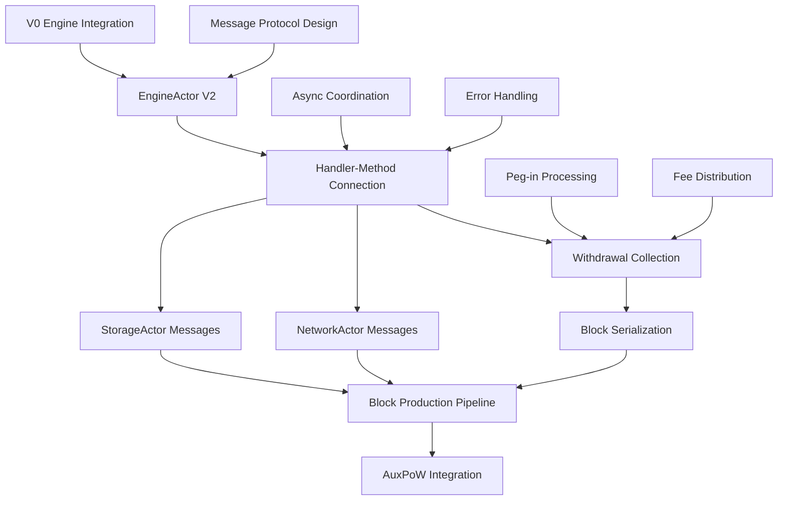

# Block Production Prerequisites Assessment for V2 System

## Executive Summary

Block production in V2 requires **7 critical prerequisites** across **4 architectural layers** before implementation can succeed. Current state shows **foundation components ready** but **integration layer completely missing**. The assessment reveals a **systematic dependency cascade** where each prerequisite enables the next tier of functionality.

## Current State Analysis

### 🟢 **Available Foundation (Ready)**
**ChainActor V2 Core Infrastructure:**
- ✅ **Actor lifecycle**: Proper startup/shutdown with Actix patterns
- ✅ **Message system**: 10 core messages defined with ProduceBlock handler skeleton
- ✅ **State management**: `ChainState` with V0 component integration (`Engine`, `Aura`, `Bridge`)
- ✅ **Metrics**: Production-ready metrics collection and reporting
- ✅ **Configuration**: Validator checks, sync status validation

**V0 Component Integration Points:**
```rust
// ChainState already integrates proven V0 components
pub struct ChainState {
    pub engine: Engine,           // ✅ Production-ready execution layer
    pub aura: Aura,              // ✅ Production-ready consensus
    pub bridge: Bridge,          // ✅ Production-ready peg operations
    pub head: Option<BlockRef>,  // ✅ Chain head management
    // ...
}
```

**Cross-Actor Method Infrastructure:**
```rust
// Methods implemented but never called by handlers
pub(crate) async fn is_network_ready(&self) -> bool { /* Working */ }
pub(crate) async fn broadcast_block(&self, block_data: Vec<u8>) -> Result<(), ChainError> { /* Working */ }
pub(crate) async fn store_block(&self, block: SignedConsensusBlock, canonical: bool) -> Result<(), ChainError> { /* Working */ }
```

### 🔴 **Missing Integration Layer (Critical Gaps)**

**Handler-Method Disconnection:**
```rust
// Current ProduceBlock handler - lines 204-222
ChainMessage::ProduceBlock { slot, timestamp } => {
    // ✅ Basic precondition checks work
    if !self.config.is_validator { /* Handled */ }
    if !self.state.is_synced() { /* Handled */ }

    // 🔴 CRITICAL GAP: No integration with existing methods
    warn!("Block production not fully implemented - returning placeholder");
    Box::pin(async move {
        Err(ChainError::Internal("Advanced block production not yet implemented".to_string()))
    })
}
```

## Prerequisite Dependency Analysis

### **Tier 1: Immediate Prerequisites (Week 1-2)**

#### 1. **EngineActor V2 Implementation** (🔴 Critical Blocker)

**Current Problem**: Direct V0 Engine integration creates architectural violations
```rust
// ChainState has Engine directly - breaks actor isolation
pub struct ChainState {
    pub engine: Engine, // 🔴 Direct access violates actor model
}
```

**Required Solution**: Dedicated EngineActor with message-based coordination
```rust
/// EngineActor V2 - Execution layer coordination and payload management
pub struct EngineActor {
    /// JSON-RPC client for execution layer
    api: HttpJsonRpc,
    /// Engine API client for payload operations
    execution_api: HttpJsonRpc,
    /// Current finalized execution block
    finalized: RwLock<Option<ExecutionBlockHash>>,
    /// Active payload building operations
    pending_payloads: HashMap<RequestId, PendingPayload>,
    /// Execution metrics
    metrics: EngineActorMetrics,
    /// ChainActor coordination
    chain_actor: Option<Addr<ChainActor>>,
}

/// Engine operation messages
#[derive(Debug, Message)]
#[rtype(result = "Result<EngineResponse, EngineError>")]
pub enum EngineMessage {
    /// Build execution payload for block production
    BuildPayload {
        timestamp: Duration,
        parent_hash: ExecutionBlockHash,
        withdrawals: Vec<Withdrawal>,
        correlation_id: Option<Uuid>,
    },

    /// Validate execution payload from network
    ValidatePayload {
        payload: ExecutionPayload,
        correlation_id: Option<Uuid>,
    },

    /// Commit finalized block to execution layer
    CommitBlock {
        block_hash: ExecutionBlockHash,
        finality_root: Hash256,
    },

    /// Get latest execution block info
    GetLatestBlock,

    /// Update fork choice in execution layer
    UpdateForkChoice {
        head_hash: ExecutionBlockHash,
        safe_hash: ExecutionBlockHash,
        finalized_hash: ExecutionBlockHash,
    },
}

/// Engine response types
#[derive(Debug, Clone)]
pub enum EngineResponse {
    PayloadBuilt {
        payload: ExecutionPayload,
        build_time: Duration,
    },
    PayloadValid {
        validation_result: ValidationResult,
    },
    BlockCommitted {
        block_hash: ExecutionBlockHash,
    },
    LatestBlock {
        hash: ExecutionBlockHash,
        number: u64,
    },
    ForkChoiceUpdated {
        status: ForkChoiceStatus,
    },
}
```

**Implementation Prerequisites:**
- **Message protocol design**: BuildPayload, ValidatePayload, CommitBlock messages
- **State isolation**: Move Engine from ChainState to EngineActor
- **Concurrency handling**: Multiple simultaneous payload builds
- **Error recovery**: Engine failures must not crash ChainActor

**Risk Factor**: **HIGH** - Without EngineActor, block production cannot access execution layer functionality

#### 2. **Handler-Method Connection Layer** (🔴 Critical Integration Gap)

**Current Problem**: Cross-actor methods exist but handlers never call them
```rust
// Diagnostic confirms: "never called" compiler warnings on all methods
pub(crate) async fn store_block(...) { /* Implemented but unused */ }
pub(crate) async fn broadcast_block(...) { /* Implemented but unused */ }
pub(crate) async fn is_network_ready(...) { /* Implemented but unused */ }
```

**Required Integration Pattern:**
```rust
// Target ProduceBlock handler implementation
ChainMessage::ProduceBlock { slot, timestamp } => {
    // 1. Precondition validation (already working)
    if !self.config.is_validator { return /* error */ }
    if !self.state.is_synced() { return /* error */ }

    // 2. Network readiness check (connect existing method)
    if !self.is_network_ready().await {
        return Box::pin(async move { Err(ChainError::NetworkNotAvailable) });
    }

    // 3. Parent block retrieval via StorageActor
    let parent_ref = if let Some(ref storage_actor) = self.storage_actor {
        storage_actor.send(GetChainHead).await??
    } else {
        return Box::pin(async move { Err(ChainError::Storage("StorageActor unavailable".to_string())) });
    };

    // 4. Execution payload building via EngineActor
    let payload = if let Some(ref engine_actor) = self.engine_actor {
        engine_actor.send(EngineMessage::BuildPayload {
            timestamp,
            parent_hash: parent_ref.execution_hash,
            withdrawals: self.collect_withdrawals().await?,
            correlation_id: Some(Uuid::new_v4()),
        }).await??
    } else {
        return Box::pin(async move { Err(ChainError::Engine("EngineActor unavailable".to_string())) });
    };

    // 5. Consensus block creation + signing via Aura
    let consensus_block = ConsensusBlock { slot, execution_payload: payload, /* ... */ };
    let signed_block = self.state.aura.sign_block(consensus_block)?;

    // 6. Storage persistence (connect existing method)
    self.store_block(signed_block.clone(), true).await?;

    // 7. Network broadcasting (connect existing method)
    let serialized = serialize_block(&signed_block)?;
    self.broadcast_block(serialized).await?;

    Box::pin(async move {
        Ok(ChainResponse::BlockProduced {
            block: signed_block,
            duration: start_time.elapsed()
        })
    })
}
```

**Implementation Prerequisites:**
- **Async coordination**: All cross-actor calls must be properly chained
- **Error propagation**: Each step can fail, requiring comprehensive error handling
- **State consistency**: Failed operations must not corrupt ChainActor state
- **Performance**: Cross-actor message overhead must be acceptable for block production latency

**Risk Factor**: **HIGH** - This integration layer is the foundation for all V2 functionality

### **Tier 2: Data Flow Prerequisites (Week 2-3)**

#### 3. **Withdrawal Collection System** (🔴 Missing Data Pipeline)

**Current Problem**: Block production requires peg-in processing and fee distribution via Ethereum withdrawals
```rust
// V0 Engine expects withdrawal data for balance credits
pub async fn build_block(
    &self,
    timestamp: Duration,
    payload_head: Option<ExecutionBlockHash>,
    add_balances: Vec<AddBalance>, // 🔴 Data source missing in V2
) -> Result<ExecutionPayload<MainnetEthSpec>, Error>
```

**Required Data Collection Pipeline:**
```rust
impl ChainActor {
    /// Collect withdrawals for execution payload building
    async fn collect_withdrawals(&self) -> Result<Vec<Withdrawal>, ChainError> {
        let mut withdrawals = Vec::new();

        // 1. Process queued peg-ins from bridge
        for (txid, pegin_info) in &self.state.queued_pegins {
            let withdrawal = Withdrawal {
                index: 0, // Will be assigned by Engine
                validator_index: 0,
                address: pegin_info.evm_account,
                amount: ConsensusAmount::from_satoshi(pegin_info.amount).0,
            };
            withdrawals.push(withdrawal);
        }

        // 2. Add fee distribution (70% miner, 30% federation split)
        let fees = self.calculate_accumulated_fees().await?;
        if fees > ConsensusAmount(0) {
            let miner_fee = fees * 7u64 / 10u64; // 70% to block producer
            let federation_fee = fees * 3u64 / 10u64; // 30% to federation

            withdrawals.push(Withdrawal {
                index: 0,
                validator_index: 0,
                address: self.config.miner_address,
                amount: miner_fee.0,
            });

            // Split federation fee among members
            let per_member = federation_fee.0 / self.state.federation.len() as u64;
            for federation_member in &self.state.federation {
                withdrawals.push(Withdrawal {
                    index: 0,
                    validator_index: 0,
                    address: *federation_member,
                    amount: per_member,
                });
            }
        }

        Ok(withdrawals)
    }
}
```

**Implementation Prerequisites:**
- **Peg-in queue management**: Bridge integration for pending deposits
- **Fee calculation**: Accumulated transaction fees since last block
- **Balance conversion**: Satoshi ↔ Gwei ↔ Wei conversions (V0 ConsensusAmount)
- **Federation configuration**: Dynamic federation member list

**Risk Factor**: **MEDIUM** - Required for production functionality

#### 4. **Block Serialization/Deserialization** (🔴 Data Format Gap)

**Current Problem**: Methods reference serialization but implementation missing
```rust
// broadcast_block() expects serialized data but serialization undefined
pub(crate) async fn broadcast_block(&self, block_data: Vec<u8>) -> Result<(), ChainError> {
    // block_data format is undefined
}

// Handler needs serialization for broadcasting
let serialized = serialize_block(&signed_block)?; // 🔴 Function doesn't exist
self.broadcast_block(serialized).await?;
```

**Required Serialization System:**
```rust
/// Block serialization for network broadcasting
pub fn serialize_block(block: &SignedConsensusBlock<MainnetEthSpec>) -> Result<Vec<u8>, ChainError> {
    use ssz::Encode;
    Ok(block.as_ssz_bytes())
}

/// Block deserialization from network
pub fn deserialize_block(data: &[u8]) -> Result<SignedConsensusBlock<MainnetEthSpec>, ChainError> {
    use ssz::Decode;
    SignedConsensusBlock::from_ssz_bytes(data)
        .map_err(|e| ChainError::Serialization(format!("Failed to deserialize block: {:?}", e)))
}

/// Block hash calculation for identification
pub fn calculate_block_hash(block: &SignedConsensusBlock<MainnetEthSpec>) -> H256 {
    use tree_hash::TreeHash;
    block.tree_hash_root()
}
```

**Implementation Prerequisites:**
- **SSZ encoding/decoding**: Standard Ethereum 2.0 serialization
- **Tree hash calculation**: Block identification and merkle proof generation
- **Error handling**: Malformed block handling from network
- **Version compatibility**: Forward/backward compatibility for network upgrades

**Risk Factor**: **LOW** - Standard implementations available, but integration needed

### **Tier 3: Coordination Prerequisites (Week 3-4)**

#### 5. **StorageActor Integration Messages** (🔴 Message Protocol Gap)

**Current Problem**: `store_block()` method calls StorageActor but message definitions incomplete
```rust
// store_block() method exists but message protocol unclear
let store_msg = crate::actors_v2::storage::messages::StoreBlockMessage {
    block: alys_block, // 🔴 Type conversion issues
    canonical,
    correlation_id: Some(Uuid::new_v4()),
};
```

**Required Message Protocol:**
```rust
/// Complete StorageActor message protocol for block production
#[derive(Message)]
#[rtype(result = "Result<StorageResponse, StorageError>")]
pub enum StorageMessage {
    /// Store produced block with finality status
    StoreBlock {
        block: SignedConsensusBlock<MainnetEthSpec>,
        canonical: bool,
        correlation_id: Option<Uuid>,
    },
    /// Get chain head for parent block reference
    GetChainHead {
        correlation_id: Option<Uuid>,
    },
    /// Get block by hash for validation
    GetBlock {
        block_hash: H256,
        correlation_id: Option<Uuid>,
    },
    /// Update finality markers
    UpdateFinality {
        finalized_hash: H256,
        justified_hash: H256,
        correlation_id: Option<Uuid>,
    },
}

#[derive(Debug)]
pub enum StorageResponse {
    BlockStored {
        block_hash: H256,
        height: u64,
        processing_time: Duration,
    },
    ChainHead(BlockRef),
    Block(Option<SignedConsensusBlock<MainnetEthSpec>>),
    FinalityUpdated {
        finalized_height: u64,
        justified_height: u64,
    },
}
```

**Implementation Prerequisites:**
- **Type consistency**: Block types must match between ChainActor and StorageActor
- **Transaction semantics**: Failed storage operations must be recoverable
- **Performance requirements**: Block storage must complete within consensus deadlines
- **Concurrency handling**: Multiple storage operations must not conflict

**Risk Factor**: **MEDIUM** - StorageActor is production-ready, but message integration needs completion

#### 6. **NetworkActor Integration Messages** (🔴 Broadcasting Protocol Gap)

**Current Problem**: `broadcast_block()` calls NetworkActor but protocol needs completion
```rust
// Method calls NetworkActor but message handling incomplete
let msg = crate::actors_v2::network::NetworkMessage::BroadcastBlock {
    block_data, // 🔴 Format and handling unclear
    priority: true
};
```

**Required Broadcasting Protocol:**
```rust
/// Complete NetworkActor message protocol for block production
#[derive(Message)]
#[rtype(result = "Result<NetworkResponse, NetworkError>")]
pub enum NetworkMessage {
    /// Broadcast produced block to network
    BroadcastBlock {
        block_data: Vec<u8>, // SSZ-encoded SignedConsensusBlock
        priority: bool, // High-priority consensus messages
        correlation_id: Option<Uuid>,
    },
    /// Check network readiness for consensus
    GetNetworkStatus {
        correlation_id: Option<Uuid>,
    },
    /// Gossip AuxPow headers (mining coordination)
    BroadcastAuxPow {
        auxpow_header: AuxPowHeader,
        correlation_id: Option<Uuid>,
    },
}

#[derive(Debug)]
pub enum NetworkResponse {
    BlockBroadcasted {
        peer_count: usize,
        broadcast_time: Duration,
    },
    NetworkStatus {
        is_running: bool,
        connected_peers: usize,
        sync_status: NetworkSyncStatus,
    },
    AuxPowBroadcasted {
        peer_count: usize,
    },
}
```

**Implementation Prerequisites:**
- **Libp2p integration**: Working gossipsub protocol for block broadcasting
- **Peer management**: Sufficient connected peers for consensus reliability
- **Message priority**: High-priority consensus messages vs normal traffic
- **Network partitioning**: Graceful handling of network splits

**Risk Factor**: **MEDIUM** - NetworkActor foundation exists, but consensus message handling needs completion

### **Tier 4: Advanced Prerequisites (Week 4+)**

#### 7. **AuxPoW Integration Pipeline** (🔴 Mining Coordination Missing)

**Current Problem**: Block production must integrate with AuxPoW mining system for consensus validity
```rust
// ChainState has AuxPoW components but coordination missing
pub struct ChainState {
    pub queued_pow: Option<AuxPowHeader>, // 🔴 Processing pipeline missing
    pub max_blocks_without_pow: u64,      // 🔴 Enforcement missing
}
```

**Required AuxPoW Coordination:**
```rust
impl ChainActor {
    /// Integrate AuxPoW into block production pipeline
    async fn incorporate_auxpow(&self, consensus_block: ConsensusBlock) -> Result<SignedConsensusBlock, ChainError> {
        // 1. Check if AuxPoW is required
        if let Some(queued_auxpow) = &self.state.queued_pow {
            // Validate AuxPoW against block
            if self.validate_auxpow_for_block(queued_auxpow, &consensus_block).await? {
                // Create signed block with AuxPoW header
                let signed_block = self.create_auxpow_block(consensus_block, queued_auxpow.clone()).await?;

                // Clear queued pow
                self.clear_queued_auxpow().await;

                return Ok(signed_block);
            }
        }

        // 2. Check blocks without pow limit
        let blocks_without_pow = self.calculate_blocks_without_pow().await?;
        if blocks_without_pow >= self.state.max_blocks_without_pow {
            return Err(ChainError::Consensus("Too many blocks without proof of work".to_string()));
        }

        // 3. Create regular signed block (no AuxPoW)
        let signed_block = self.state.aura.sign_block(consensus_block)?;
        Ok(signed_block)
    }
}
```

**Implementation Prerequisites:**
- **AuxPoW validation**: Proof-of-work verification against block range
- **Mining coordination**: Integration with V0 mining loop and external miners
- **Difficulty adjustment**: Dynamic difficulty based on block timing
- **Consensus rules**: Enforcement of AuxPoW requirements vs regular blocks

**Risk Factor**: **LOW for basic block production** - Can be phased in after core functionality works

## Implementation Sequence and Dependencies

### **Critical Path Analysis**



### **Phase Implementation Strategy**

**Phase 1 (Week 1-2): Foundation Layer**
1. **EngineActor V2**: Isolate Engine operations behind message interface
2. **Handler-Method Connection**: Connect existing cross-actor methods to ProduceBlock handler
3. **Basic Integration Testing**: Verify cross-actor message flow

**Acceptance Criteria:**
- ProduceBlock handler calls existing methods instead of returning "not implemented"
- EngineActor handles BuildPayload messages with V0 Engine integration
- Cross-actor communication works end-to-end

**Phase 2 (Week 2-3): Data Pipeline Layer**
1. **Withdrawal Collection**: Implement peg-in and fee distribution logic
2. **Block Serialization**: Add SSZ encoding/decoding for network compatibility
3. **Message Protocol Completion**: Finish StorageActor and NetworkActor integration

**Acceptance Criteria:**
- Block production includes proper withdrawal data for peg-ins and fees
- Blocks can be serialized/deserialized for network transmission
- Storage and networking operations complete successfully

**Phase 3 (Week 3-4): Production Pipeline**
1. **End-to-End Block Production**: Complete pipeline from trigger to network broadcast
2. **Error Recovery**: Comprehensive error handling and state consistency
3. **Performance Optimization**: Meet consensus timing requirements

**Acceptance Criteria:**
- ProduceBlock creates valid blocks with execution payloads
- Blocks are stored in StorageActor and broadcasted via NetworkActor
- Failed operations don't corrupt ChainActor state

**Phase 4 (Week 4+): Advanced Features**
1. **AuxPoW Integration**: Mining coordination and proof-of-work validation
2. **External Miner Support**: RPC endpoints for mining pool integration
3. **Production Hardening**: Performance tuning and reliability testing

## Risk Assessment

### **High-Risk Prerequisites (Blockers)**
1. **EngineActor V2**: Complete architectural dependency - no block production possible without it
2. **Handler Integration**: Foundation for all V2 functionality - failure cascades to all operations

### **Medium-Risk Prerequisites (Delays)**
1. **Message Protocols**: Incomplete integration causes runtime failures
2. **Data Pipeline**: Missing components cause invalid blocks

### **Low-Risk Prerequisites (Phase Later)**
1. **Block Serialization**: Standard implementations available

## Conclusion

Block production prerequisites reveal a **systematic integration challenge** rather than missing functionality. The V2 system has **strong foundations** (V0 component integration, actor infrastructure, cross-actor methods) but requires **7 critical prerequisites** across **4 architectural tiers** to achieve functional block production.

**Key Insight**: The architecture is **well-designed but underconnected**. Most required functionality exists but lacks integration layer to coordinate between components.

**Recommended Approach**: **Sequential tier implementation** focusing on **handler-method connection** first, then **EngineActor isolation**, followed by **data pipeline completion**. This approach minimizes risk while building towards full block production capability.