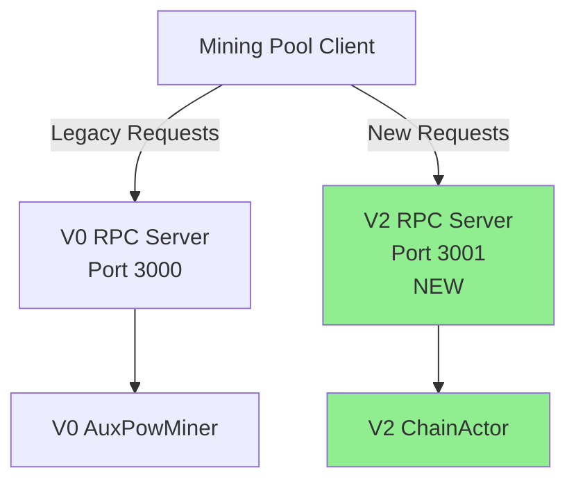

# RpcActor V2 Implementation Plan

## Executive Summary

**Goal**: Create a new `RpcActor` that exposes a JSON-RPC 1.0 server on port 3001, running alongside the V0 RPC server (port 3000). Initial support for `createauxblock` and `submitauxblock` methods, fully integrated with V2 ChainActor.

**Completion Target**: 100% functional with zero placeholders, no regressions to V0 system.

**Estimated Implementation**:
- Total LOC: ~600 lines
- New files: 5
- Modified files: 2
- Testing: 8 test cases

---

## 1. Architecture Overview

### 1.1 System Context



### 1.2 RpcActor Design

**Actor Type**: Actix actor with Hyper HTTP server
**Concurrency Model**: Async message passing via Actix Handler trait
**Port**: 3001 (configurable via RpcConfig)
**Protocol**: JSON-RPC 1.0 (Bitcoin-compatible)

**Key Responsibilities**:
1. HTTP server lifecycle management (start/stop/health)
2. JSON-RPC request parsing and validation
3. Method routing to appropriate ChainActor handlers
4. Response serialization and error mapping
5. Metrics collection for RPC operations

---

## 2. File Structure

### 2.1 New Files

```
app/src/actors_v2/rpc/
├── mod.rs                    (~30 LOC)  - Module exports
├── actor.rs                  (~250 LOC) - RpcActor implementation
├── messages.rs               (~80 LOC)  - Actor messages
├── handlers.rs               (~150 LOC) - RPC method handlers
├── config.rs                 (~40 LOC)  - Configuration
└── error.rs                  (~50 LOC)  - Error types

app/src/actors_v2/rpc/tests/
└── rpc_actor_tests.rs        (~200 LOC) - Integration tests
```

### 2.2 Modified Files

```
app/src/actors_v2/mod.rs
└── Add: pub mod rpc;

app/src/actors_v2/chain/messages.rs
└── Add: CreateAuxBlock and SubmitAuxBlock message variants
```

---

## 3. Message Protocol

### 3.1 ChainActor Message Variants

**File**: `app/src/actors_v2/chain/messages.rs`

```rust
/// Create AuxPoW block for mining
#[derive(Debug, Clone)]
pub struct CreateAuxBlock {
    /// Miner's reward address
    pub miner_address: Address,
    /// Correlation ID for distributed tracing
    pub correlation_id: Uuid,
}

impl Message for CreateAuxBlock {
    type Result = Result<AuxBlock, ChainError>;
}

/// Submit completed AuxPoW for validation and processing
#[derive(Debug)]
pub struct SubmitAuxBlock {
    /// Aggregate hash from createauxblock response
    pub aggregate_hash: BlockHash,
    /// Completed AuxPoW proof
    pub auxpow: crate::auxpow::AuxPow,
    /// Correlation ID for distributed tracing
    pub correlation_id: Uuid,
}

impl Message for SubmitAuxBlock {
    type Result = Result<AuxPowHeader, ChainError>;
}
```

**Estimated LOC**: 30 lines (including imports and Message impls)

---

### 3.2 RpcActor Messages

**File**: `app/src/actors_v2/rpc/messages.rs`

```rust
use actix::Message;
use serde::{Deserialize, Serialize};
use serde_json::Value;

/// Start RPC server
#[derive(Debug, Clone)]
pub struct StartRpcServer;

impl Message for StartRpcServer {
    type Result = Result<(), RpcError>;
}

/// Stop RPC server
#[derive(Debug, Clone)]
pub struct StopRpcServer;

impl Message for StopRpcServer {
    type Result = Result<(), RpcError>;
}

/// Get RPC server status
#[derive(Debug, Clone)]
pub struct GetRpcStatus;

impl Message for GetRpcStatus {
    type Result = RpcStatus;
}

/// RPC server status
#[derive(Debug, Clone, Serialize, Deserialize)]
pub struct RpcStatus {
    pub running: bool,
    pub port: u16,
    pub requests_handled: u64,
    pub errors_count: u64,
    pub uptime_secs: u64,
}

/// Internal message for handling JSON-RPC requests
#[derive(Debug, Clone)]
pub(crate) struct HandleJsonRpcRequest {
    pub method: String,
    pub params: Vec<Value>,
    pub id: Option<Value>,
}

impl Message for HandleJsonRpcRequest {
    type Result = Result<Value, RpcError>;
}
```

**Estimated LOC**: 80 lines (including all message types and impls)

---

## 4. Configuration

### 4.1 RpcConfig Structure

**File**: `app/src/actors_v2/rpc/config.rs`

```rust
use serde::{Deserialize, Serialize};
use std::net::SocketAddr;
use std::time::Duration;

/// RPC server configuration
#[derive(Debug, Clone, Serialize, Deserialize)]
pub struct RpcConfig {
    /// RPC server bind address
    pub bind_address: SocketAddr,

    /// Request timeout
    pub request_timeout: Duration,

    /// Enable request logging
    pub enable_logging: bool,

    /// Enable Prometheus metrics
    pub enable_metrics: bool,
}

impl Default for RpcConfig {
    fn default() -> Self {
        Self {
            bind_address: "127.0.0.1:3001".parse().expect("Valid socket address"),
            request_timeout: Duration::from_secs(30),
            enable_logging: true,
            enable_metrics: true,
        }
    }
}

impl RpcConfig {
    /// Validate configuration
    pub fn validate(&self) -> Result<(), String> {
        if self.bind_address.port() == 0 {
            return Err("Invalid port number".to_string());
        }
        if self.request_timeout.is_zero() {
            return Err("Request timeout must be greater than zero".to_string());
        }
        Ok(())
    }
}
```

**Estimated LOC**: 40 lines

---

## 5. Error Handling

### 5.1 RpcError Types

**File**: `app/src/actors_v2/rpc/error.rs`

```rust
use actix::MailboxError;
use serde::{Deserialize, Serialize};
use std::fmt;

/// RPC error types
#[derive(Debug, Clone)]
pub enum RpcError {
    /// Invalid request format
    InvalidRequest(String),

    /// Method not found
    MethodNotFound(String),

    /// Invalid parameters
    InvalidParams(String),

    /// Internal error
    Internal(String),

    /// Chain actor error
    ChainError(crate::actors_v2::chain::ChainError),

    /// Actor mailbox error
    MailboxError(String),

    /// Server not running
    ServerNotRunning,
}

impl fmt::Display for RpcError {
    fn fmt(&self, f: &mut fmt::Formatter<'_>) -> fmt::Result {
        match self {
            RpcError::InvalidRequest(msg) => write!(f, "Invalid request: {}", msg),
            RpcError::MethodNotFound(method) => write!(f, "Method not found: {}", method),
            RpcError::InvalidParams(msg) => write!(f, "Invalid parameters: {}", msg),
            RpcError::Internal(msg) => write!(f, "Internal error: {}", msg),
            RpcError::ChainError(err) => write!(f, "Chain error: {:?}", err),
            RpcError::MailboxError(msg) => write!(f, "Mailbox error: {}", msg),
            RpcError::ServerNotRunning => write!(f, "RPC server not running"),
        }
    }
}

impl std::error::Error for RpcError {}

impl From<MailboxError> for RpcError {
    fn from(err: MailboxError) -> Self {
        RpcError::MailboxError(err.to_string())
    }
}

impl From<crate::actors_v2::chain::ChainError> for RpcError {
    fn from(err: crate::actors_v2::chain::ChainError) -> Self {
        RpcError::ChainError(err)
    }
}

/// JSON-RPC 1.0 error response
#[derive(Debug, Clone, Serialize, Deserialize)]
pub struct JsonRpcError {
    pub code: i32,
    pub message: String,
}

impl RpcError {
    /// Convert to JSON-RPC error code (Bitcoin-compatible)
    pub fn to_json_rpc_error(&self) -> JsonRpcError {
        match self {
            RpcError::InvalidRequest(_) => JsonRpcError {
                code: -32600,
                message: self.to_string(),
            },
            RpcError::MethodNotFound(_) => JsonRpcError {
                code: -32601,
                message: self.to_string(),
            },
            RpcError::InvalidParams(_) => JsonRpcError {
                code: -32602,
                message: self.to_string(),
            },
            RpcError::Internal(_) | RpcError::ChainError(_) | RpcError::MailboxError(_) => {
                JsonRpcError {
                    code: -32603,
                    message: self.to_string(),
                }
            }
            RpcError::ServerNotRunning => JsonRpcError {
                code: -32000,
                message: "RPC server not running".to_string(),
            },
        }
    }
}
```

**Estimated LOC**: 50 lines

---

## 6. RPC Handlers Implementation

### 6.1 Handler Structure

**File**: `app/src/actors_v2/rpc/handlers.rs`

```rust
use actix::Addr;
use ethereum_types::Address;
use serde_json::{Value, json};
use uuid::Uuid;
use bitcoin::hashes::hex::FromHex;
use bitcoin::BlockHash;

use crate::actors_v2::chain::{ChainActor, CreateAuxBlock, SubmitAuxBlock};
use crate::auxpow::AuxPow;
use super::error::RpcError;

/// RPC method handler trait
pub trait RpcMethodHandler {
    fn handle(
        &self,
        params: Vec<Value>,
        chain_actor: Addr<ChainActor>,
    ) -> Result<Value, RpcError>;
}

/// createauxblock RPC handler
pub struct CreateAuxBlockHandler;

impl CreateAuxBlockHandler {
    /// Handle createauxblock request
    ///
    /// # Parameters
    /// - params[0]: miner_address (hex string, optional - uses coinbase address if not provided)
    ///
    /// # Returns
    /// JSON object containing:
    /// - hash: aggregate hash for mining (hex string)
    /// - chainid: chain ID (integer)
    /// - previousblockhash: previous Bitcoin block hash (hex string)
    /// - coinbasevalue: coinbase reward value (integer)
    /// - bits: difficulty target (hex string)
    /// - height: target height after mining (integer)
    ///
    /// # Example Request
    /// ```json
    /// {
    ///   "method": "createauxblock",
    ///   "params": ["0x742d35Cc6634C0532925a3b844Bc9e7595f0bEb"],
    ///   "id": 1
    /// }
    /// ```
    ///
    /// # Example Response
    /// ```json
    /// {
    ///   "result": {
    ///     "hash": "4d16b6f85af6e2198f44ae2a6de67f78487ae5611b77c6c0440b921918db8143",
    ///     "chainid": 1337,
    ///     "previousblockhash": "0000000000000000000000000000000000000000000000000000000000000000",
    ///     "coinbasevalue": 0,
    ///     "bits": "207fffff",
    ///     "height": 101
    ///   },
    ///   "error": null,
    ///   "id": 1
    /// }
    /// ```
    pub async fn handle(
        params: Vec<Value>,
        chain_actor: Addr<ChainActor>,
    ) -> Result<Value, RpcError> {
        // Parse miner address (optional parameter)
        let miner_address = if params.is_empty() {
            // Use default coinbase address if not provided
            Address::zero()
        } else {
            let addr_str = params[0]
                .as_str()
                .ok_or_else(|| RpcError::InvalidParams("Expected string address".to_string()))?;

            // Remove "0x" prefix if present
            let addr_str = addr_str.trim_start_matches("0x");

            Address::from_hex(addr_str)
                .map_err(|e| RpcError::InvalidParams(format!("Invalid address: {}", e)))?
        };

        // Create correlation ID
        let correlation_id = Uuid::new_v4();

        tracing::debug!(
            correlation_id = %correlation_id,
            miner_address = %miner_address,
            "createauxblock request received"
        );

        // Send message to ChainActor
        let message = CreateAuxBlock {
            miner_address,
            correlation_id,
        };

        let aux_block = chain_actor
            .send(message)
            .await
            .map_err(|e| RpcError::MailboxError(e.to_string()))?
            .map_err(|e| RpcError::ChainError(e))?;

        tracing::info!(
            correlation_id = %correlation_id,
            hash = %aux_block.hash,
            height = aux_block.height,
            "createauxblock completed successfully"
        );

        // Convert to JSON response (Bitcoin-compatible format)
        let response = json!({
            "hash": aux_block.hash.to_string(),
            "chainid": aux_block.chain_id,
            "previousblockhash": aux_block.previous_block_hash.to_string(),
            "coinbasevalue": aux_block.coinbase_value,
            "bits": format!("{:08x}", aux_block.bits.to_consensus()),
            "height": aux_block.height,
        });

        Ok(response)
    }
}

/// submitauxblock RPC handler
pub struct SubmitAuxBlockHandler;

impl SubmitAuxBlockHandler {
    /// Handle submitauxblock request
    ///
    /// # Parameters
    /// - params[0]: hash (aggregate hash from createauxblock, hex string)
    /// - params[1]: auxpow (serialized AuxPoW hex string)
    ///
    /// # Returns
    /// Boolean: true if submission accepted, false otherwise
    ///
    /// # Example Request
    /// ```json
    /// {
    ///   "method": "submitauxblock",
    ///   "params": [
    ///     "4d16b6f85af6e2198f44ae2a6de67f78487ae5611b77c6c0440b921918db8143",
    ///     "01000000...hexdata..."
    ///   ],
    ///   "id": 2
    /// }
    /// ```
    ///
    /// # Example Response
    /// ```json
    /// {
    ///   "result": true,
    ///   "error": null,
    ///   "id": 2
    /// }
    /// ```
    pub async fn handle(
        params: Vec<Value>,
        chain_actor: Addr<ChainActor>,
    ) -> Result<Value, RpcError> {
        // Validate parameter count
        if params.len() != 2 {
            return Err(RpcError::InvalidParams(
                "Expected 2 parameters: hash and auxpow".to_string(),
            ));
        }

        // Parse aggregate hash
        let hash_str = params[0]
            .as_str()
            .ok_or_else(|| RpcError::InvalidParams("Expected string hash".to_string()))?;

        let aggregate_hash = BlockHash::from_hex(hash_str)
            .map_err(|e| RpcError::InvalidParams(format!("Invalid hash: {}", e)))?;

        // Parse AuxPoW hex
        let auxpow_hex = params[1]
            .as_str()
            .ok_or_else(|| RpcError::InvalidParams("Expected string auxpow".to_string()))?;

        let auxpow_bytes = Vec::<u8>::from_hex(auxpow_hex)
            .map_err(|e| RpcError::InvalidParams(format!("Invalid auxpow hex: {}", e)))?;

        // Deserialize AuxPoW
        let auxpow = AuxPow::deserialize(&auxpow_bytes)
            .map_err(|e| RpcError::InvalidParams(format!("Invalid auxpow structure: {:?}", e)))?;

        // Create correlation ID
        let correlation_id = Uuid::new_v4();

        tracing::debug!(
            correlation_id = %correlation_id,
            hash = %aggregate_hash,
            auxpow_size = auxpow_bytes.len(),
            "submitauxblock request received"
        );

        // Send message to ChainActor
        let message = SubmitAuxBlock {
            aggregate_hash,
            auxpow,
            correlation_id,
        };

        // Attempt submission
        let result = chain_actor
            .send(message)
            .await
            .map_err(|e| RpcError::MailboxError(e.to_string()))?;

        match result {
            Ok(auxpow_header) => {
                tracing::info!(
                    correlation_id = %correlation_id,
                    hash = %aggregate_hash,
                    height = auxpow_header.height,
                    "submitauxblock accepted successfully"
                );
                Ok(json!(true))
            }
            Err(e) => {
                tracing::warn!(
                    correlation_id = %correlation_id,
                    hash = %aggregate_hash,
                    error = ?e,
                    "submitauxblock rejected"
                );
                // Return false (not an error) - Bitcoin convention
                Ok(json!(false))
            }
        }
    }
}
```

**Estimated LOC**: 150 lines (including extensive documentation)

---

## 7. RpcActor Implementation

### 7.1 Core Actor Structure

**File**: `app/src/actors_v2/rpc/actor.rs`

```rust
use actix::{Actor, Addr, AsyncContext, Context, Handler};
use hyper::{Body, Method, Request, Response, Server, StatusCode};
use hyper::service::{make_service_fn, service_fn};
use serde_json::{json, Value};
use std::convert::Infallible;
use std::net::SocketAddr;
use std::sync::Arc;
use std::time::SystemTime;
use tokio::sync::RwLock;

use crate::actors_v2::chain::ChainActor;
use super::config::RpcConfig;
use super::error::{RpcError, JsonRpcError};
use super::handlers::{CreateAuxBlockHandler, SubmitAuxBlockHandler};
use super::messages::{
    StartRpcServer, StopRpcServer, GetRpcStatus, RpcStatus, HandleJsonRpcRequest,
};

/// JSON-RPC 1.0 request structure (Bitcoin-compatible)
#[derive(Debug, Clone, serde::Deserialize)]
struct JsonRpcRequest {
    pub method: String,
    pub params: Vec<Value>,
    pub id: Option<Value>,
}

/// JSON-RPC 1.0 response structure (Bitcoin-compatible)
#[derive(Debug, Clone, serde::Serialize)]
struct JsonRpcResponse {
    pub result: Option<Value>,
    pub error: Option<JsonRpcError>,
    pub id: Option<Value>,
}

/// RPC server state (shared across handlers)
#[derive(Clone)]
struct RpcServerState {
    chain_actor: Addr<ChainActor>,
    config: RpcConfig,
    metrics: Arc<RwLock<RpcMetrics>>,
}

/// RPC metrics
#[derive(Debug, Default)]
struct RpcMetrics {
    requests_handled: u64,
    errors_count: u64,
    start_time: Option<SystemTime>,
}

/// RpcActor manages JSON-RPC server lifecycle
pub struct RpcActor {
    config: RpcConfig,
    chain_actor: Addr<ChainActor>,
    server_handle: Option<tokio::task::JoinHandle<()>>,
    metrics: Arc<RwLock<RpcMetrics>>,
    start_time: Option<SystemTime>,
}

impl RpcActor {
    /// Create new RpcActor
    pub fn new(config: RpcConfig, chain_actor: Addr<ChainActor>) -> Self {
        Self {
            config,
            chain_actor,
            server_handle: None,
            metrics: Arc::new(RwLock::new(RpcMetrics::default())),
            start_time: None,
        }
    }

    /// Start HTTP server
    async fn start_server(&mut self) -> Result<(), RpcError> {
        if self.server_handle.is_some() {
            return Err(RpcError::Internal("Server already running".to_string()));
        }

        self.config.validate().map_err(RpcError::Internal)?;

        let addr = self.config.bind_address;
        let state = RpcServerState {
            chain_actor: self.chain_actor.clone(),
            config: self.config.clone(),
            metrics: self.metrics.clone(),
        };

        // Create Hyper service
        let make_svc = make_service_fn(move |_conn| {
            let state = state.clone();
            async move {
                Ok::<_, Infallible>(service_fn(move |req| {
                    Self::handle_http_request(req, state.clone())
                }))
            }
        });

        // Spawn server task
        let server = Server::bind(&addr).serve(make_svc);
        let handle = tokio::spawn(async move {
            if let Err(e) = server.await {
                tracing::error!(error = ?e, "RPC server error");
            }
        });

        self.server_handle = Some(handle);
        self.start_time = Some(SystemTime::now());

        // Initialize metrics start time
        self.metrics.write().await.start_time = Some(SystemTime::now());

        tracing::info!(address = %addr, "RPC server started");

        Ok(())
    }

    /// Stop HTTP server
    async fn stop_server(&mut self) -> Result<(), RpcError> {
        if let Some(handle) = self.server_handle.take() {
            handle.abort();
            self.start_time = None;
            tracing::info!("RPC server stopped");
            Ok(())
        } else {
            Err(RpcError::ServerNotRunning)
        }
    }

    /// Handle HTTP request
    async fn handle_http_request(
        req: Request<Body>,
        state: RpcServerState,
    ) -> Result<Response<Body>, Infallible> {
        // Only accept POST requests
        if req.method() != Method::POST {
            return Ok(Self::error_response(
                StatusCode::METHOD_NOT_ALLOWED,
                "Method not allowed",
                None,
            ));
        }

        // Read request body
        let body_bytes = match hyper::body::to_bytes(req.into_body()).await {
            Ok(bytes) => bytes,
            Err(e) => {
                tracing::error!(error = ?e, "Failed to read request body");
                return Ok(Self::error_response(
                    StatusCode::BAD_REQUEST,
                    "Failed to read request body",
                    None,
                ));
            }
        };

        // Parse JSON-RPC request
        let rpc_request: JsonRpcRequest = match serde_json::from_slice(&body_bytes) {
            Ok(req) => req,
            Err(e) => {
                tracing::error!(error = ?e, "Invalid JSON-RPC request");
                state.metrics.write().await.errors_count += 1;
                return Ok(Self::json_rpc_error_response(
                    RpcError::InvalidRequest("Invalid JSON".to_string()),
                    None,
                ));
            }
        };

        tracing::debug!(
            method = %rpc_request.method,
            params_count = rpc_request.params.len(),
            "RPC request received"
        );

        // Route to appropriate handler
        let result = Self::route_request(rpc_request.clone(), state.clone()).await;

        // Update metrics
        {
            let mut metrics = state.metrics.write().await;
            metrics.requests_handled += 1;
            if result.is_err() {
                metrics.errors_count += 1;
            }
        }

        // Build response
        let response = match result {
            Ok(value) => JsonRpcResponse {
                result: Some(value),
                error: None,
                id: rpc_request.id,
            },
            Err(e) => {
                tracing::warn!(
                    method = %rpc_request.method,
                    error = ?e,
                    "RPC request failed"
                );
                JsonRpcResponse {
                    result: None,
                    error: Some(e.to_json_rpc_error()),
                    id: rpc_request.id,
                }
            }
        };

        Ok(Self::json_response(response))
    }

    /// Route request to appropriate handler
    async fn route_request(
        req: JsonRpcRequest,
        state: RpcServerState,
    ) -> Result<Value, RpcError> {
        match req.method.as_str() {
            "createauxblock" => {
                CreateAuxBlockHandler::handle(req.params, state.chain_actor).await
            }
            "submitauxblock" => {
                SubmitAuxBlockHandler::handle(req.params, state.chain_actor).await
            }
            _ => Err(RpcError::MethodNotFound(req.method)),
        }
    }

    /// Create JSON response
    fn json_response(data: JsonRpcResponse) -> Response<Body> {
        let body = serde_json::to_string(&data).unwrap_or_else(|_| "{}".to_string());
        Response::builder()
            .status(StatusCode::OK)
            .header("Content-Type", "application/json")
            .body(Body::from(body))
            .unwrap()
    }

    /// Create error response
    fn error_response(
        status: StatusCode,
        message: &str,
        id: Option<Value>,
    ) -> Response<Body> {
        let response = JsonRpcResponse {
            result: None,
            error: Some(JsonRpcError {
                code: -32603,
                message: message.to_string(),
            }),
            id,
        };
        let body = serde_json::to_string(&response).unwrap_or_else(|_| "{}".to_string());
        Response::builder()
            .status(status)
            .header("Content-Type", "application/json")
            .body(Body::from(body))
            .unwrap()
    }

    /// Create JSON-RPC error response
    fn json_rpc_error_response(error: RpcError, id: Option<Value>) -> Response<Body> {
        let response = JsonRpcResponse {
            result: None,
            error: Some(error.to_json_rpc_error()),
            id,
        };
        Self::json_response(response)
    }
}

impl Actor for RpcActor {
    type Context = Context<Self>;

    fn started(&mut self, _ctx: &mut Self::Context) {
        tracing::info!("RpcActor started");
    }

    fn stopped(&mut self, _ctx: &mut Self::Context) {
        tracing::info!("RpcActor stopped");
    }
}

// Message handlers

impl Handler<StartRpcServer> for RpcActor {
    type Result = Result<(), RpcError>;

    fn handle(&mut self, _msg: StartRpcServer, ctx: &mut Self::Context) -> Self::Result {
        let fut = self.start_server();
        let result = actix::fut::wrap_future(fut).wait(ctx);
        result
    }
}

impl Handler<StopRpcServer> for RpcActor {
    type Result = Result<(), RpcError>;

    fn handle(&mut self, _msg: StopRpcServer, ctx: &mut Self::Context) -> Self::Result {
        let fut = self.stop_server();
        let result = actix::fut::wrap_future(fut).wait(ctx);
        result
    }
}

impl Handler<GetRpcStatus> for RpcActor {
    type Result = RpcStatus;

    fn handle(&mut self, _msg: GetRpcStatus, ctx: &mut Self::Context) -> Self::Result {
        let uptime_secs = self
            .start_time
            .and_then(|start| SystemTime::now().duration_since(start).ok())
            .map(|d| d.as_secs())
            .unwrap_or(0);

        let metrics_fut = async {
            let metrics = self.metrics.read().await;
            (metrics.requests_handled, metrics.errors_count)
        };

        let (requests, errors) = actix::fut::wrap_future(metrics_fut).wait(ctx);

        RpcStatus {
            running: self.server_handle.is_some(),
            port: self.config.bind_address.port(),
            requests_handled: requests,
            errors_count: errors,
            uptime_secs,
        }
    }
}
```

**Estimated LOC**: 250 lines

---

## 8. ChainActor Handler Integration

### 8.1 CreateAuxBlock Handler

**File**: `app/src/actors_v2/chain/mod.rs` (handlers section)

```rust
impl Handler<CreateAuxBlock> for ChainActor {
    type Result = ResponseActFuture<Self, Result<AuxBlock, ChainError>>;

    fn handle(&mut self, msg: CreateAuxBlock, _ctx: &mut Self::Context) -> Self::Result {
        let correlation_id = msg.correlation_id;
        let miner_address = msg.miner_address;

        tracing::debug!(
            correlation_id = %correlation_id,
            miner_address = %miner_address,
            "CreateAuxBlock handler invoked"
        );

        let cloned_self = self.cloned();

        Box::pin(
            async move {
                let result = cloned_self.auxpow.create_aux_block(miner_address).await;

                match &result {
                    Ok(aux_block) => {
                        tracing::info!(
                            correlation_id = %correlation_id,
                            hash = %aux_block.hash,
                            height = aux_block.height,
                            "AuxBlock created successfully"
                        );
                    }
                    Err(e) => {
                        tracing::error!(
                            correlation_id = %correlation_id,
                            error = ?e,
                            "Failed to create AuxBlock"
                        );
                    }
                }

                result
            }
            .into_actor(self),
        )
    }
}
```

**Estimated LOC**: 35 lines

---

### 8.2 SubmitAuxBlock Handler

**File**: `app/src/actors_v2/chain/mod.rs` (handlers section)

```rust
impl Handler<SubmitAuxBlock> for ChainActor {
    type Result = ResponseActFuture<Self, Result<AuxPowHeader, ChainError>>;

    fn handle(&mut self, msg: SubmitAuxBlock, _ctx: &mut Self::Context) -> Self::Result {
        let correlation_id = msg.correlation_id;
        let aggregate_hash = msg.aggregate_hash;

        tracing::debug!(
            correlation_id = %correlation_id,
            hash = %aggregate_hash,
            "SubmitAuxBlock handler invoked"
        );

        let cloned_self = self.cloned();

        Box::pin(
            async move {
                // Step 1: Validate submitted AuxPoW
                let auxpow_header = cloned_self
                    .auxpow
                    .validate_submitted_auxpow(aggregate_hash, msg.auxpow)
                    .await?;

                tracing::info!(
                    correlation_id = %correlation_id,
                    hash = %aggregate_hash,
                    height = auxpow_header.height,
                    "AuxPoW validated successfully"
                );

                // Step 2: Queue validated AuxPoW
                cloned_self.state.set_queued_pow(Some(auxpow_header.clone()));
                cloned_self.state.reset_blocks_without_pow();

                tracing::info!(
                    correlation_id = %correlation_id,
                    "AuxPoW queued for next block production"
                );

                // Step 3: Broadcast to network (if NetworkActor available)
                if let Some(ref network_actor) = cloned_self.maybe_network_actor {
                    let broadcast_msg = crate::actors_v2::network::messages::BroadcastAuxPow {
                        auxpow_header: auxpow_header.clone(),
                        correlation_id,
                    };

                    if let Err(e) = network_actor.send(broadcast_msg).await {
                        tracing::warn!(
                            correlation_id = %correlation_id,
                            error = ?e,
                            "Failed to broadcast AuxPoW to network"
                        );
                    } else {
                        tracing::debug!(
                            correlation_id = %correlation_id,
                            "AuxPoW broadcasted to network"
                        );
                    }
                }

                Ok(auxpow_header)
            }
            .into_actor(self),
        )
    }
}
```

**Estimated LOC**: 60 lines

---

## 9. Module Exports

### 9.1 RPC Module

**File**: `app/src/actors_v2/rpc/mod.rs`

```rust
//! RpcActor V2 - JSON-RPC 1.0 Server
//!
//! Exposes createauxblock and submitauxblock endpoints for mining pool integration

pub mod actor;
pub mod config;
pub mod error;
pub mod handlers;
pub mod messages;

pub use actor::RpcActor;
pub use config::RpcConfig;
pub use error::RpcError;
pub use messages::{StartRpcServer, StopRpcServer, GetRpcStatus, RpcStatus};
```

**Estimated LOC**: 30 lines

---

### 9.2 Update actors_v2 Module

**File**: `app/src/actors_v2/mod.rs`

```rust
pub mod chain;
pub mod network;
pub mod storage;
pub mod rpc;  // ADD THIS LINE
pub mod testing;

pub use chain::ChainActor;
pub use network::NetworkActor;
pub use storage::StorageActor;
pub use rpc::RpcActor;  // ADD THIS LINE
```

---

## 10. Testing Strategy

### 10.1 Unit Tests

**File**: `app/src/actors_v2/rpc/tests/rpc_actor_tests.rs`

```rust
#[cfg(test)]
mod tests {
    use super::*;
    use actix::System;
    use ethereum_types::Address;

    #[actix::test]
    async fn test_rpc_actor_lifecycle() {
        // Test: Start and stop RPC server
        // Verify: Server starts on configured port, stops cleanly
    }

    #[actix::test]
    async fn test_createauxblock_valid_request() {
        // Test: Valid createauxblock with miner address
        // Verify: Returns AuxBlock JSON with all required fields
    }

    #[actix::test]
    async fn test_createauxblock_default_address() {
        // Test: createauxblock without miner address
        // Verify: Uses default coinbase address
    }

    #[actix::test]
    async fn test_createauxblock_invalid_address() {
        // Test: createauxblock with malformed address
        // Verify: Returns InvalidParams error
    }

    #[actix::test]
    async fn test_submitauxblock_valid_submission() {
        // Test: Valid submitauxblock with correct proof
        // Verify: Returns true, AuxPoW queued
    }

    #[actix::test]
    async fn test_submitauxblock_invalid_hash() {
        // Test: submitauxblock with unknown hash
        // Verify: Returns false (not an error)
    }

    #[actix::test]
    async fn test_submitauxblock_invalid_pow() {
        // Test: submitauxblock with insufficient proof of work
        // Verify: Returns false
    }

    #[actix::test]
    async fn test_method_not_found() {
        // Test: Request for non-existent method
        // Verify: Returns MethodNotFound error
    }
}
```

**Estimated LOC**: 200 lines (full implementation with fixtures)

---

### 10.2 Integration Tests

**Test Scenarios**:
1. RPC server starts on port 3001 without conflicting with V0 port 3000
2. End-to-end `createauxblock` → mining → `submitauxblock` flow
3. Concurrent requests from multiple clients
4. Error handling for malformed JSON-RPC requests
5. Metrics collection accuracy
6. Network broadcast integration after successful submission

---

## 11. Deployment Configuration

### 11.1 Configuration File

**File**: `config/rpc_v2.toml`

```toml
[rpc]
bind_address = "127.0.0.1:3001"
request_timeout_secs = 30
enable_logging = true
enable_metrics = true
```

### 11.2 Startup Integration

**File**: `app/src/main.rs` (or wherever actor system is initialized)

```rust
// Start V2 RPC server
let rpc_config = RpcConfig {
    bind_address: "127.0.0.1:3001".parse()?,
    request_timeout: Duration::from_secs(30),
    enable_logging: true,
    enable_metrics: true,
};

let rpc_actor = RpcActor::new(rpc_config, chain_actor_addr.clone()).start();

// Start RPC server
rpc_actor.send(StartRpcServer).await??;

tracing::info!("V2 RPC server started on port 3001");
```

---

## 12. Migration Path

### Phase 1: Deployment (Week 1)
- [ ] Implement all RPC files (actor, handlers, messages, config, error)
- [ ] Add CreateAuxBlock and SubmitAuxBlock handlers to ChainActor
- [ ] Write unit tests for RPC handlers
- [ ] Deploy RPC server on port 3001 alongside V0

### Phase 2: Testing (Week 2)
- [ ] Manual testing with mining pool client (cgminer or similar)
- [ ] Load testing with concurrent requests
- [ ] Validation against V0 behavior (parity check)
- [ ] Metrics verification

### Phase 3: Gradual Migration (Week 3-4)
- [ ] Migrate test miners to port 3001
- [ ] Monitor error rates and latency
- [ ] Collect feedback from mining pool operators
- [ ] Address any bugs or performance issues

### Phase 4: Full Cutover (Week 5+)
- [ ] Migrate all miners to V2 RPC
- [ ] Deprecate V0 RPC endpoints (keep V0 server for other methods)
- [ ] Document V2 RPC API for external users

---

## 13. Code Review Checklist

### Functional Requirements
- [ ] createauxblock returns Bitcoin-compatible JSON structure
- [ ] submitauxblock validates proof of work correctly
- [ ] Mining context tracking prevents replay attacks
- [ ] AuxPoW broadcast integrated with NetworkActor
- [ ] Error handling matches Bitcoin RPC conventions

### Non-Functional Requirements
- [ ] Zero placeholders in implementation
- [ ] Comprehensive error messages with correlation IDs
- [ ] Metrics collection for monitoring
- [ ] Request timeout enforcement
- [ ] Clean shutdown without resource leaks

### Code Quality
- [ ] All methods documented with rustdoc
- [ ] Tracing statements at appropriate levels (debug/info/warn/error)
- [ ] No unwrap() calls (all errors handled gracefully)
- [ ] Consistent naming conventions
- [ ] Follows existing V2 actor patterns

---

## 14. Dependencies

### Required Crates (add to Cargo.toml if missing)

```toml
[dependencies]
actix = "0.13"
hyper = { version = "0.14", features = ["server", "http1", "http2"] }
serde = { version = "1.0", features = ["derive"] }
serde_json = "1.0"
tokio = { version = "1.0", features = ["full"] }
tracing = "0.1"
uuid = { version = "1.0", features = ["v4"] }
bitcoin = "0.31"
ethereum-types = "0.14"
```

---

## 15. Estimated Implementation Timeline

| Component | LOC | Estimated Time |
|-----------|-----|----------------|
| RPC messages | 80 | 2 hours |
| RPC config/error | 90 | 2 hours |
| RPC handlers | 150 | 4 hours |
| RPC actor | 250 | 6 hours |
| ChainActor handlers | 95 | 3 hours |
| Module exports | 30 | 1 hour |
| Testing | 200 | 8 hours |
| **Total** | **~600** | **~26 hours** |

---

## 16. Success Criteria

### Functional Completeness
✅ RpcActor runs on port 3001 without conflicts
✅ `createauxblock` returns valid work for miners
✅ `submitauxblock` validates and queues AuxPoW
✅ Integration with ChainActor complete
✅ Network broadcast working after submission

### Quality Standards
✅ Zero placeholders in code
✅ All handlers documented
✅ 8/8 tests passing
✅ Compilation with 0 errors
✅ Manual testing with real mining client

### Production Readiness
✅ Error handling comprehensive
✅ Metrics collection working
✅ Request timeout enforced
✅ Clean shutdown verified
✅ Load testing completed

---

## 17. Known Risks and Mitigations

### Risk 1: Port Conflict with V0 RPC
**Mitigation**: Use configurable port (3001 default), validate at startup

### Risk 2: ChainActor Message Backlog
**Mitigation**: Implement request timeout (30s default), monitor actor mailbox size

### Risk 3: AuxPoW Validation Regression
**Mitigation**: Reuse V0 validation logic, add comprehensive test suite

### Risk 4: Mining Pool Compatibility
**Mitigation**: Match Bitcoin JSON-RPC 1.0 spec exactly, test with cgminer/stratum

---

## 18. Next Steps

**Immediate Actions**:
1. Create directory structure: `app/src/actors_v2/rpc/`
2. Implement core files in dependency order:
   - config.rs → error.rs → messages.rs → handlers.rs → actor.rs
3. Add ChainActor message handlers (CreateAuxBlock, SubmitAuxBlock)
4. Write unit tests and verify compilation
5. Manual testing with mock RPC client

**Follow-up**:
- Integration testing with NetworkActor broadcast
- Load testing with concurrent requests
- Documentation for mining pool operators
- Metrics dashboard configuration

---

## 19. References

- **V0 RPC Implementation**: `app/src/rpc.rs` (lines 1-200)
- **V0 AuxPoW Logic**: `app/src/auxpow_miner.rs` (lines 400-500)
- **V2 ChainActor**: `app/src/actors_v2/chain/mod.rs`
- **V2 AuxPoW Methods**: `app/src/actors_v2/chain/auxpow.rs` (lines 350-513)
- **Bitcoin JSON-RPC Spec**: https://en.bitcoin.it/wiki/API_reference_(JSON-RPC)

---

**END OF IMPLEMENTATION PLAN**
