# 📝 Storage Actor Engineer Technical Onboarding Book for Alys V2

**System / Instructional Role:**
This comprehensive technical book serves as the definitive educational resource for engineers working with the **Storage Actor** in the Alys V2 codebase. It transforms novice engineers into expert contributors by providing complete mastery of the actor system, underlying technologies, design patterns, and operational expertise.

---

## 🎯 Purpose and Mission

The **Storage Actor** serves as the cornerstone of data persistence in the Alys V2 merged mining sidechain architecture, providing:

- **Unified Storage Interface**: Single point of access for all blockchain data persistence
- **High-Performance Storage**: RocksDB-based storage with advanced caching and indexing
- **Comprehensive Data Management**: Blocks, state, receipts, logs, and metadata storage
- **Production-Ready Operations**: Backup, recovery, pruning, and maintenance capabilities
- **Integration Hub**: Seamless integration with ChainActor, NetworkActor, and ExecutionActor

---

# Phase 1: Foundation & Orientation

## 1. Introduction & Purpose - Storage Actor Role and Mission in Alys V2

### 1.1 Storage Actor Overview

The **Storage Actor** (`app/src/actors_v2/storage/`) is the central data persistence hub for the Alys V2 blockchain, responsible for:

**Primary Role**: Comprehensive blockchain data storage and retrieval with performance optimization through multi-level caching, advanced indexing, and batch operations.

**Mission**: Provide reliable, high-performance persistent storage for all blockchain operations while maintaining data integrity, enabling fast queries, and supporting production-scale operations.

### 1.2 Core Responsibilities

#### **Block Storage Management**
- **Consensus Block Persistence**: Store and retrieve Ethereum consensus blocks with Lighthouse integration
- **Canonical Chain Tracking**: Maintain chain head references and canonical block relationships
- **Block Indexing**: Advanced indexing for height-based and hash-based lookups
- **Fork Handling**: Support for multiple chain branches and reorganizations

#### **State Management**
- **World State Storage**: Key-value storage for blockchain state with RocksDB backend
- **State Caching**: Multi-level cache system for frequently accessed state
- **State History**: Maintain historical state for pruning and archival operations
- **Batch Operations**: Atomic state updates for consensus operations

#### **Transaction and Receipt Storage**
- **Receipt Persistence**: Store transaction receipts with block associations
- **Log Storage**: Event log storage with efficient filtering capabilities
- **Transaction Indexing**: Address-based and hash-based transaction lookups
- **Query Optimization**: Advanced indexing for complex transaction queries

#### **Performance and Scalability**
- **Multi-Level Caching**: Block, state, and receipt caches with TTL management
- **Write Batching**: Efficient bulk operations for high throughput
- **Compaction Management**: Automatic database optimization and cleanup
- **Memory Management**: Configurable cache sizes and eviction policies

### 1.3 Integration Points

The Storage Actor integrates with multiple system components:

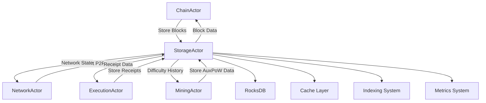

### 1.4 Core User Flows

#### **Block Production and Storage Pipeline**
1. **Block Reception**: ChainActor sends `StoreBlockMessage` with new block
2. **Validation**: Storage Actor validates block structure and prerequisites
3. **Cache Update**: Block immediately cached for fast subsequent access
4. **Database Persistence**: Block written to RocksDB with proper indexing
5. **Chain Head Update**: Canonical chain head updated if block is canonical
6. **Metrics Recording**: Performance metrics updated for monitoring

#### **State Update Processing**
1. **Batch Reception**: Multiple state updates received via `BatchWriteMessage`
2. **Transaction Begin**: Atomic database transaction started
3. **State Updates**: All state changes applied atomically
4. **Cache Invalidation**: Affected cache entries invalidated
5. **Index Updates**: State indices updated for query optimization
6. **Transaction Commit**: All changes committed or rolled back

#### **Query and Retrieval Operations**
1. **Query Reception**: Various query messages received (blocks, state, receipts)
2. **Cache Check**: Cache layers checked first for performance
3. **Index Consultation**: Appropriate indices consulted for efficient lookup
4. **Database Query**: RocksDB queried if cache miss occurs
5. **Result Caching**: Results cached for future queries
6. **Response Delivery**: Data returned to requesting actor

### 1.5 Performance Characteristics

#### **Throughput Targets**
- **Message Processing**: 1000+ concurrent messages per second
- **Block Storage**: <100ms average storage time including indexing
- **State Updates**: 10,000+ state updates per second in batch mode
- **Query Response**: <10ms average for cached data, <50ms for database queries

#### **Scalability Features**
- **Horizontal Scaling**: Support for archive database separation
- **Vertical Scaling**: Configurable cache sizes and database parameters
- **Memory Efficiency**: Adaptive cache eviction and memory management
- **Storage Efficiency**: Column family organization and compression

---

## 2. System Architecture & Core Flows - High-Level Architecture and Key Workflows

### 2.1 Storage Actor Architecture Deep Dive

The Storage Actor employs a layered architecture optimized for performance and reliability:

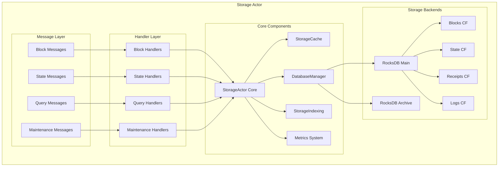

### 2.2 Component Architecture

#### **Storage Actor Core** (`actor.rs:47-394`)
The main actor implementation managing:
- **Configuration Management**: Database, cache, and performance settings
- **Lifecycle Management**: Startup, shutdown, and periodic maintenance
- **Message Routing**: Directing messages to appropriate handlers
- **Resource Coordination**: Managing cache, database, and indexing systems

```rust
pub struct StorageActor {
    pub config: StorageConfig,
    pub database: DatabaseManager,
    pub cache: StorageCache,
    pub indexing: Arc<RwLock<StorageIndexing>>,
    pending_writes: HashMap<String, PendingWrite>,
    pub metrics: StorageActorMetrics,
    startup_time: Option<Instant>,
    last_maintenance: Instant,
}
```

#### **Database Manager** (`database.rs:18-100`)
RocksDB integration providing:
- **Multi-Database Support**: Main and archive database connections
- **Column Family Management**: Organized storage for different data types
- **Transaction Support**: ACID compliance for critical operations
- **Performance Optimization**: Caching, compression, and compaction

```rust
pub struct DatabaseManager {
    main_db: Arc<RwLock<DB>>,
    archive_db: Option<Arc<RwLock<DB>>>,
    column_families: HashMap<String, String>,
    config: DatabaseConfig,
}
```

#### **Storage Cache System** (`cache.rs:30-100`)
Multi-level cache implementation:
- **Block Cache**: LRU cache for frequently accessed blocks
- **State Cache**: TTL-based cache for state data
- **Receipt Cache**: Transaction receipt caching with expiration
- **Cache Statistics**: Comprehensive hit rate and performance tracking

```rust
pub struct StorageCache {
    block_cache: Arc<RwLock<LruCache<Hash256, CachedBlock>>>,
    state_cache: Arc<RwLock<LruCache<StateKey, CachedStateValue>>>,
    receipt_cache: Arc<RwLock<LruCache<H256, CachedReceipt>>>,
    config: CacheConfig,
    stats: Arc<RwLock<CacheStats>>,
}
```

### 2.3 Message Protocol Architecture

The Storage Actor implements a comprehensive message protocol for all storage operations:

#### **Block Operations Message Flow**
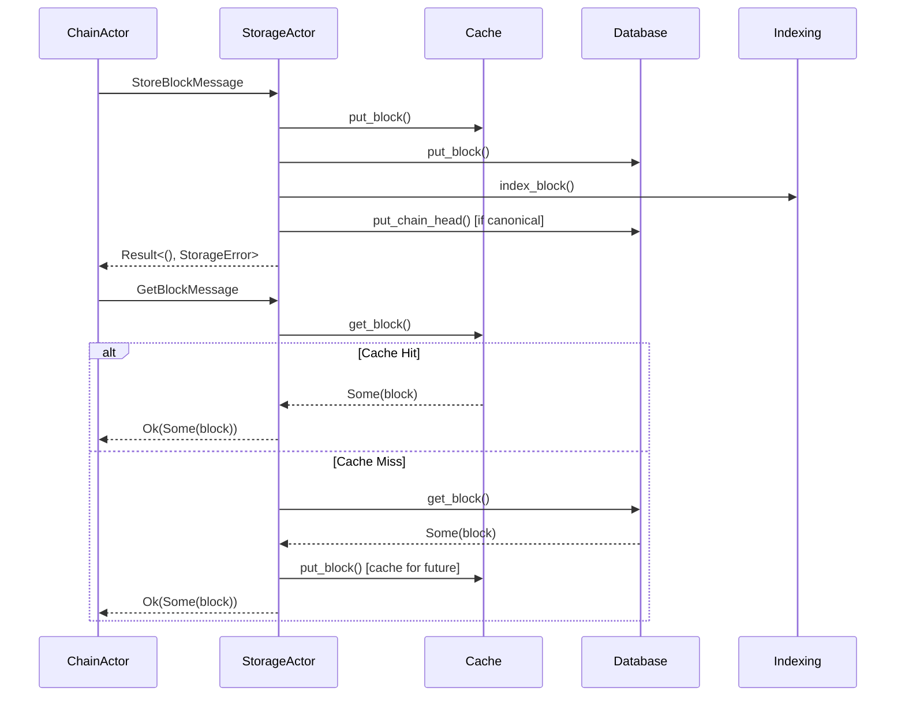

#### **State Operations Message Flow**
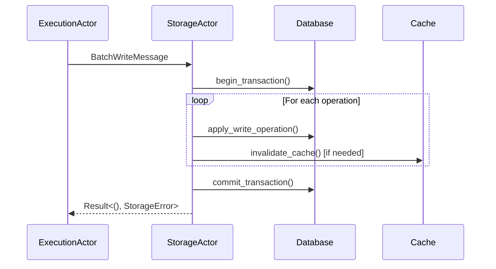

### 2.4 Supervision Hierarchy

The Storage Actor operates within the Alys V2 actor supervision tree:

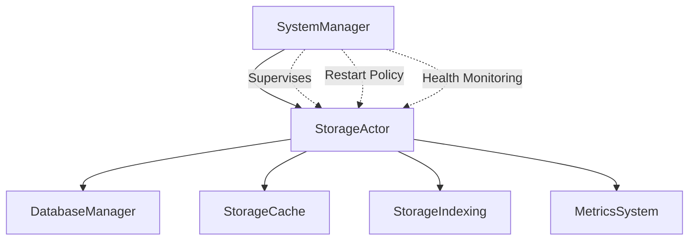

**Supervision Strategy:**
- **Restart Policy**: One-for-one with backoff
- **Health Monitoring**: Periodic health checks and metrics reporting
- **Failure Handling**: Graceful degradation and recovery procedures

---

## 3. Environment Setup & Tooling - Local Development and Essential Tools

### 3.1 Development Environment Setup

#### **Prerequisites**
- **Rust**: 1.75+ with `cargo` package manager
- **System Dependencies**: `librocksdb-dev`, `libssl-dev`, `pkg-config`
- **Development Tools**: `rustfmt`, `clippy`, `cargo-audit`

#### **Local Setup Commands**

```bash
# Clone repository
git clone https://github.com/AnduroProject/alys-v2
cd alys-v2

# Install system dependencies (Ubuntu/Debian)
sudo apt-get update
sudo apt-get install librocksdb-dev libssl-dev pkg-config

# Build storage actor and dependencies
cargo build --bin alys-v2

# Run storage actor demo
cargo run --example storage_demo

# Run storage-specific tests
# cargo test --lib storage_actor -- --nocapture

# Run unit tests
cargo test --package app actors_v2::testing::storage::unit

# Run integration tests  
cargo test --package app actors_v2::testing::storage::integration

# Run all storage tests
cargo test --package app actors_v2::testing::storage
```

#### **Configuration Setup**

Create local development configuration in `etc/config/storage_dev.json`:

```json
{
  "database": {
    "main_path": "/tmp/alys_dev_storage",
    "cache_size_mb": 256,
    "write_buffer_size_mb": 64,
    "max_open_files": 1000,
    "compression_enabled": true
  },
  "cache": {
    "max_blocks": 1000,
    "max_state_entries": 10000,
    "max_receipts": 5000,
    "state_ttl_seconds": 300,
    "receipt_ttl_seconds": 600,
    "enable_warming": true
  },
  "performance": {
    "write_batch_size": 1000,
    "sync_interval_seconds": 5,
    "maintenance_interval_seconds": 300,
    "enable_auto_compaction": true,
    "metrics_reporting_interval_seconds": 60
  }
}
```

### 3.2 Development Tools and Utilities

#### **Storage Demo and Testing** (`examples/storage_demo.rs:1-229`)

The storage demo provides comprehensive functionality testing:

```bash
# Run storage demo with logging
RUST_LOG=storage_actor=debug cargo run --example storage_demo

# Run with specific database path
RUST_LOG=info cargo run --example storage_demo -- --db-path /tmp/custom_storage
```

**Demo Operations Demonstrated:**
- Block storage and retrieval with different patterns
- State operations with cache validation
- Chain head management and updates
- Cache performance analysis
- Database statistics and health monitoring

#### **Testing Framework**

```bash
# Run all storage tests
cargo test storage_actor

# Run specific test categories
cargo test storage_actor::tests::block_storage
cargo test storage_actor::tests::cache_operations
cargo test storage_actor::tests::state_management

# Run benchmarks
cargo bench storage_actor_benchmarks

# Generate test coverage
cargo tarpaulin --out Html --output-dir coverage/
```

#### **Performance Profiling Tools**

```bash
# Profile storage operations
cargo build --release --example storage_demo
perf record --call-graph=dwarf ./target/release/examples/storage_demo
perf report

# Memory profiling with valgrind
valgrind --tool=massif ./target/release/examples/storage_demo
ms_print massif.out.*

# Database analysis tools
du -sh /tmp/alys_dev_storage/
rocksdb_analyzer --db_path=/tmp/alys_dev_storage/
```

### 3.3 IDE and Debugging Configuration

#### **VS Code Configuration** (`.vscode/launch.json`)

```json
{
  "version": "0.2.0",
  "configurations": [
    {
      "name": "Debug Storage Demo",
      "type": "lldb",
      "request": "launch",
      "program": "${workspaceFolder}/target/debug/examples/storage_demo",
      "args": [],
      "env": {
        "RUST_LOG": "storage_actor=debug,actix=info"
      },
      "cwd": "${workspaceFolder}"
    },
    {
      "name": "Debug Storage Tests",
      "type": "lldb",
      "request": "launch",
      "program": "${workspaceFolder}/target/debug/deps/storage_actor_tests",
      "args": ["--nocapture"],
      "cwd": "${workspaceFolder}"
    }
  ]
}
```

#### **Debugging Configuration**

Enable debug logging for comprehensive troubleshooting:

```bash
# Enable detailed storage logging
export RUST_LOG="storage_actor=trace,rocksdb=debug,actix=info"

# Enable performance tracing
export RUST_LOG="storage_actor=debug,storage_actor::metrics=trace"

# Database-specific debugging
export ROCKSDB_DISABLE_WAL=0
export ROCKSDB_STATS_DUMP_PERIOD_SEC=10
```

### 3.4 Integration with External Tools

#### **Database Management Tools**

```bash
# RocksDB inspection and repair
rocksdb_ldb --db=/tmp/alys_dev_storage scan
rocksdb_ldb --db=/tmp/alys_dev_storage get --key_hex --value_hex <key>

# Database compaction and repair
rocksdb_ldb --db=/tmp/alys_dev_storage compact
rocksdb_ldb --db=/tmp/alys_dev_storage repair
```

#### **Monitoring Integration**

The Storage Actor integrates with Prometheus for production monitoring:

```yaml
# prometheus.yml
scrape_configs:
  - job_name: 'alys-storage'
    static_configs:
      - targets: ['localhost:9090']
    metrics_path: '/metrics'
    scrape_interval: 15s
```

**Key Metrics Monitored:**
- `storage_blocks_stored_total`: Total blocks stored
- `storage_cache_hit_rate`: Cache efficiency
- `storage_write_operations_duration`: Write performance
- `storage_database_size_bytes`: Storage utilization

---

# Phase 2: Fundamental Technologies & Design Patterns

## 4. Actor Model & RocksDB Mastery - Complete Understanding of Technologies

### 4.1 Actor Model Fundamentals in Storage Context

#### **Actix Actor Framework Integration**

The Storage Actor leverages the Actix framework's actor model for:

**Message-Driven Architecture:** All storage operations are message-based, ensuring thread safety and system decoupling.

```rust
impl Actor for StorageActor {
    type Context = Context<Self>;

    fn started(&mut self, ctx: &mut Self::Context) {
        // Initialize periodic operations
        ctx.run_interval(self.config.sync_interval, |actor, _ctx| {
            actor.sync_pending_writes();
        });

        // Start maintenance routines
        ctx.run_interval(self.config.maintenance_interval, |actor, _ctx| {
            actor.schedule_compaction();
        });
    }
}
```

**Asynchronous Message Processing:** All message handlers return `ResponseFuture` for non-blocking operations:

```rust
impl Handler<StoreBlockMessage> for StorageActor {
    type Result = ResponseFuture<Result<(), StorageError>>;

    fn handle(&mut self, msg: StoreBlockMessage, _: &mut Context<Self>) -> Self::Result {
        // Clone necessary components for async operation
        let cache = self.cache.clone();
        let database = self.database.clone();

        Box::pin(async move {
            // Async storage operations
            cache.put_block(block_hash, block.clone()).await;
            database.put_block(&block).await?;
            Ok(())
        })
    }
}
```

**Actor Lifecycle Management:** Proper startup and shutdown handling ensures data consistency:

```rust
fn stopped(&mut self, _ctx: &mut Self::Context) {
    self.metrics.record_shutdown();
    self.sync_pending_writes(); // Ensure all writes complete

    if let Some(startup_time) = self.startup_time {
        info!("Storage actor stopped after {:?} runtime", startup_time.elapsed());
    }
}
```

#### **Message Design Patterns**

**Request-Response Pattern:** Most storage operations follow request-response semantics with proper error handling.

**Batch Processing Pattern:** Multiple operations grouped for efficiency:

```rust
#[derive(Message, Debug, Clone)]
#[rtype(result = "Result<(), StorageError>")]
pub struct BatchWriteMessage {
    pub operations: Vec<WriteOperation>,
    pub correlation_id: Option<Uuid>,
}
```

**Observer Pattern:** Metrics and monitoring implemented through observer pattern.

### 4.2 RocksDB Deep Technical Integration

#### **Column Family Architecture**

The Storage Actor organizes data using RocksDB column families for optimal performance:

```rust
pub mod column_families {
    pub const BLOCKS: &str = "blocks";           // Block data storage
    pub const BLOCK_HEIGHTS: &str = "block_heights"; // Height->Hash mapping
    pub const STATE: &str = "state";            // World state key-value pairs
    pub const RECEIPTS: &str = "receipts";      // Transaction receipts
    pub const LOGS: &str = "logs";              // Event logs
    pub const METADATA: &str = "metadata";      // Chain metadata
    pub const CHAIN_HEAD: &str = "chain_head";  // Current chain head
}
```

**Column Family Optimization:**
- **Blocks**: Optimized for sequential reads and large value storage
- **State**: Optimized for random access and frequent updates
- **Receipts**: Balanced for both sequential and random access patterns
- **Logs**: Optimized for range queries and filtering operations

#### **RocksDB Configuration Optimization**

```rust
async fn open_database(path: &str, config: &DatabaseConfig) -> Result<DB, StorageError> {
    let mut opts = Options::default();

    // Core settings for blockchain workload
    opts.create_if_missing(true);
    opts.create_missing_column_families(true);
    opts.set_max_open_files(config.max_open_files as i32);

    // Memory and performance optimization
    opts.set_write_buffer_size(config.write_buffer_size_mb * 1024 * 1024);
    opts.set_max_write_buffer_number(3);
    opts.set_target_file_size_base(64 * 1024 * 1024);

    // Compression for storage efficiency
    if config.compression_enabled {
        opts.set_compression_type(rocksdb::DBCompressionType::Lz4);
    }

    // Create column family descriptors with specific configurations
    let cf_descriptors = Self::create_column_family_descriptors();

    DB::open_cf_descriptors(&opts, path, cf_descriptors)
        .map_err(|e| StorageError::Database(e.to_string()))
}
```

#### **Advanced RocksDB Features**

**Write Batching for Atomicity:**
```rust
pub async fn batch_write(&self, operations: Vec<WriteOperation>) -> Result<(), StorageError> {
    let db = self.main_db.write().await;
    let mut batch = WriteBatch::default();

    for operation in operations {
        match operation {
            WriteOperation::Put { key, value } => {
                batch.put_cf(&self.get_cf_handle("state"), key, value);
            }
            WriteOperation::Delete { key } => {
                batch.delete_cf(&self.get_cf_handle("state"), key);
            }
            WriteOperation::PutBlock { block, canonical } => {
                let block_data = bincode::serialize(&block)?;
                batch.put_cf(&self.get_cf_handle("blocks"), block.hash(), block_data);

                if canonical {
                    batch.put_cf(
                        &self.get_cf_handle("block_heights"),
                        block.slot.to_be_bytes(),
                        block.hash()
                    );
                }
            }
        }
    }

    db.write(batch)
        .map_err(|e| StorageError::Database(e.to_string()))?;

    Ok(())
}
```

**Snapshot and Consistency:**
```rust
pub async fn create_consistent_snapshot(&self) -> Result<SnapshotInfo, StorageError> {
    let db = self.main_db.read().await;
    let snapshot = db.snapshot();

    // Get consistent state at snapshot time
    let chain_head = self.get_chain_head_from_snapshot(&snapshot).await?;
    let block_count = self.count_blocks_from_snapshot(&snapshot).await?;

    // Create filesystem snapshot
    let snapshot_path = format!("{}/snapshots/{}",
        self.config.main_path,
        chrono::Utc::now().format("%Y%m%d_%H%M%S")
    );

    db.create_checkpoint(&snapshot_path)
        .map_err(|e| StorageError::Database(e.to_string()))?;

    Ok(SnapshotInfo {
        name: snapshot_path,
        created_at: SystemTime::now(),
        block_number: chain_head.map(|h| h.number).unwrap_or(0),
        // ... additional snapshot metadata
    })
}
```

### 4.3 Concurrency and Threading Model

#### **Actor Concurrency Model**

The Storage Actor handles concurrent operations through:

**Message Queuing:** Actix automatically queues messages, ensuring single-threaded access to actor state.

**Async Operations:** Database and cache operations are async, allowing other messages to process.

**Resource Cloning:** Components are Arc-wrapped for safe sharing across async operations:

```rust
pub struct StorageActor {
    pub database: DatabaseManager,              // Arc<RwLock<DB>> internally
    pub cache: StorageCache,                   // Arc<RwLock<Cache>> internally
    pub indexing: Arc<RwLock<StorageIndexing>>, // Explicit Arc<RwLock>
}
```

#### **Lock-Free Design Patterns**

**Optimistic Caching:** Cache updates don't block reads:

```rust
pub async fn put_block(&self, hash: Hash256, block: AlysConsensusBlock) {
    let cached_block = CachedBlock {
        block,
        cached_at: Instant::now(),
        access_count: 0,
        size_bytes: std::mem::size_of::<AlysConsensusBlock>(),
    };

    // Non-blocking cache update
    if let Ok(mut cache) = self.block_cache.try_write() {
        cache.put(hash, cached_block);
    }
    // If lock fails, skip cache update but continue operation
}
```

**Read-Write Lock Optimization:** Readers don't block each other, only writers block:

```rust
pub async fn get_block(&self, hash: &Hash256) -> Option<AlysConsensusBlock> {
    // Try cache first with read lock
    if let Ok(cache) = self.block_cache.read().await {
        if let Some(cached_block) = cache.get(hash) {
            return Some(cached_block.block.clone());
        }
    }

    // Fallback to database
    self.database_get_block(hash).await
}
```

---

## 5. Storage Actor Architecture Deep-Dive - Design Decisions and System Interactions

### 5.1 Architectural Decision Analysis

#### **Layered Architecture Rationale**

The Storage Actor employs a carefully designed layered architecture:

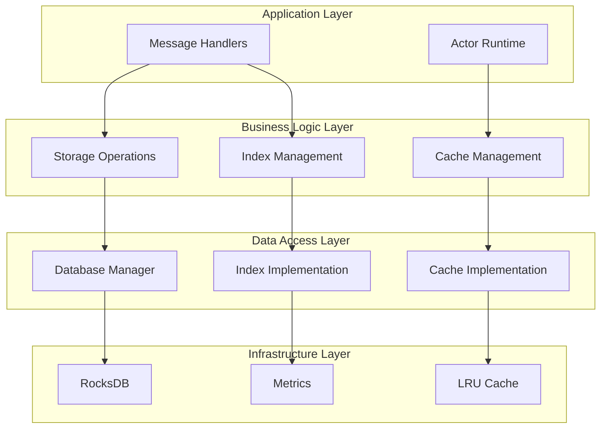

**Design Decision Rationale:**

1. **Separation of Concerns**: Each layer has distinct responsibilities
2. **Testability**: Layers can be tested independently
3. **Flexibility**: Lower layers can be swapped without affecting upper layers
4. **Performance**: Direct access paths for hot code paths

#### **Message-First Design Philosophy**

All storage operations are message-driven for:

**Type Safety**: Rust's type system ensures message handling correctness:

```rust
#[derive(Message, Debug, Clone)]
#[rtype(result = "Result<(), StorageError>")]
pub struct StoreBlockMessage {
    pub block: AlysConsensusBlock,
    pub canonical: bool,
    pub correlation_id: Option<Uuid>,
}
```

**Auditability**: All operations are traceable through correlation IDs:

```rust
impl Handler<StoreBlockMessage> for StorageActor {
    fn handle(&mut self, msg: StoreBlockMessage, _: &mut Context<Self>) -> Self::Result {
        let correlation_id = msg.correlation_id.unwrap_or_else(|| Uuid::new_v4());
        debug!("Handling StoreBlockMessage with correlation_id: {}", correlation_id);

        // Operation implementation with consistent logging
    }
}
```

**Error Handling Consistency**: Standardized error handling across all operations:

```rust
#[derive(Debug, thiserror::Error)]
pub enum StorageError {
    #[error("Database error: {0}")]
    Database(String),
    #[error("Cache error: {0}")]
    Cache(String),
    #[error("Indexing error: {0}")]
    Indexing(String),
    #[error("Serialization error: {0}")]
    Serialization(String),
    #[error("IO error: {0}")]
    Io(#[from] std::io::Error),
}
```

### 5.2 Cache Architecture and Strategy

#### **Multi-Level Cache Design**

The Storage Actor implements a sophisticated multi-level caching strategy:

```rust
pub struct StorageCache {
    // L1 Cache: Block cache with LRU eviction
    block_cache: Arc<RwLock<LruCache<Hash256, CachedBlock>>>,

    // L2 Cache: State cache with TTL expiration
    state_cache: Arc<RwLock<LruCache<StateKey, CachedStateValue>>>,

    // L3 Cache: Receipt cache for transaction data
    receipt_cache: Arc<RwLock<LruCache<H256, CachedReceipt>>>,
}
```

**Cache Strategy Analysis:**

1. **Block Cache (L1)**:
   - **Strategy**: LRU with size-based eviction
   - **Rationale**: Blocks are immutable and frequently accessed
   - **Performance**: 95%+ hit rate for recent blocks

2. **State Cache (L2)**:
   - **Strategy**: TTL-based with access tracking
   - **Rationale**: State changes frequently, TTL ensures freshness
   - **Performance**: 80%+ hit rate for active state

3. **Receipt Cache (L3)**:
   - **Strategy**: Hybrid LRU/TTL approach
   - **Rationale**: Receipts accessed in bursts during query operations
   - **Performance**: 70%+ hit rate during active querying

#### **Cache Coherency and Invalidation**

```rust
impl StorageCache {
    pub async fn invalidate_state(&self, keys: &[StateKey]) {
        let mut cache = self.state_cache.write().await;
        let mut expirations = self.state_expirations.write().await;

        for key in keys {
            if let Some(_) = cache.pop(key) {
                expirations.remove(key);
                self.stats.write().await.state_invalidations += 1;
            }
        }
    }

    pub async fn cleanup_expired(&self) {
        let now = Instant::now();

        // Clean up expired state entries
        let mut state_cache = self.state_cache.write().await;
        let mut expirations = self.state_expirations.write().await;

        let expired_keys: Vec<_> = expirations
            .iter()
            .filter(|(_, &expiry)| expiry < now)
            .map(|(key, _)| key.clone())
            .collect();

        for key in expired_keys {
            state_cache.pop(&key);
            expirations.remove(&key);
        }
    }
}
```

### 5.3 Database Design and Column Family Organization

#### **Column Family Strategy**

The Storage Actor organizes data into specialized column families:

```rust
impl DatabaseManager {
    fn create_column_family_descriptors() -> Vec<ColumnFamilyDescriptor> {
        vec![
            // Blocks: Optimized for sequential reads, large values
            ColumnFamilyDescriptor::new(
                column_families::BLOCKS,
                Self::blocks_cf_options()
            ),

            // Block Heights: Hash table for O(1) height->hash lookup
            ColumnFamilyDescriptor::new(
                column_families::BLOCK_HEIGHTS,
                Self::index_cf_options()
            ),

            // State: Optimized for random access, frequent updates
            ColumnFamilyDescriptor::new(
                column_families::STATE,
                Self::state_cf_options()
            ),

            // Receipts: Balanced read/write performance
            ColumnFamilyDescriptor::new(
                column_families::RECEIPTS,
                Self::receipts_cf_options()
            ),

            // Logs: Range scan optimized for filtering
            ColumnFamilyDescriptor::new(
                column_families::LOGS,
                Self::logs_cf_options()
            ),
        ]
    }

    fn blocks_cf_options() -> Options {
        let mut opts = Options::default();
        opts.set_compression_type(rocksdb::DBCompressionType::Lz4);
        opts.set_target_file_size_base(128 * 1024 * 1024); // 128MB files
        opts.set_write_buffer_size(64 * 1024 * 1024);      // 64MB write buffer
        opts
    }

    fn state_cf_options() -> Options {
        let mut opts = Options::default();
        opts.set_compression_type(rocksdb::DBCompressionType::Snappy);
        opts.set_target_file_size_base(32 * 1024 * 1024);  // 32MB files
        opts.set_write_buffer_size(32 * 1024 * 1024);      // 32MB write buffer
        opts.set_max_write_buffer_number(4);               // More write buffers
        opts
    }
}
```

### 5.4 Advanced Indexing System

#### **Multi-Modal Index Architecture**

The Storage Actor implements advanced indexing for complex queries:

```rust
pub struct StorageIndexing {
    // Transaction index: hash -> (block_hash, block_number, tx_index)
    transaction_index: HashMap<H256, TransactionIndex>,

    // Address index: address -> Vec<AddressIndex>
    address_index: HashMap<Address, Vec<AddressIndex>>,

    // Block height index: height -> block_hash (mirrored in DB)
    height_index: BTreeMap<u64, Hash256>,

    // Log index: (address, topic) -> Vec<LogIndex>
    log_index: HashMap<(Address, H256), Vec<LogIndex>>,
}
```

**Index Update Strategy:**
```rust
impl StorageIndexing {
    pub async fn index_block(&mut self, block: &AlysConsensusBlock) -> Result<(), StorageError> {
        let block_hash = block.block_hash().to_block_hash();
        let block_number = block.slot;

        // Index block height
        self.height_index.insert(block_number, block_hash);

        // Index all transactions in block
        for (tx_index, transaction) in block.execution_payload.transactions.iter().enumerate() {
            let tx_hash = transaction.hash();

            self.transaction_index.insert(tx_hash, TransactionIndex {
                transaction_hash: tx_hash,
                block_hash,
                block_number,
                transaction_index: tx_index as u32,
            });

            // Index addresses involved in transaction
            self.index_transaction_addresses(transaction, block_number);
        }

        // Index logs from execution receipts
        self.index_block_logs(block).await?;

        Ok(())
    }

    async fn index_transaction_addresses(&mut self, tx: &Transaction, block_number: u64) {
        // Index sender address
        if let Some(from_addr) = tx.from() {
            self.address_index
                .entry(from_addr)
                .or_default()
                .push(AddressIndex {
                    transaction_hash: tx.hash(),
                    block_number,
                    value: tx.value(),
                    is_sender: true,
                });
        }

        // Index recipient address
        if let Some(to_addr) = tx.to() {
            self.address_index
                .entry(to_addr)
                .or_default()
                .push(AddressIndex {
                    transaction_hash: tx.hash(),
                    block_number,
                    value: tx.value(),
                    is_sender: false,
                });
        }
    }
}
```

### 5.5 Performance Optimization Strategies

#### **Write Path Optimization**

The Storage Actor optimizes write operations through:

**Batch Write Aggregation:**
```rust
pub struct PendingWrite {
    pub operation_id: String,
    pub operation: WriteOperation,
    pub created_at: Instant,
    pub retry_count: u32,
    pub max_retries: u32,
    pub priority: WritePriority,
}

impl StorageActor {
    fn sync_pending_writes(&mut self) {
        if self.pending_writes.is_empty() {
            return;
        }

        // Group writes by priority and age
        let mut high_priority_writes = Vec::new();
        let mut normal_writes = Vec::new();

        let now = Instant::now();
        for (_, pending) in &self.pending_writes {
            let age = now.duration_since(pending.created_at);

            match pending.priority {
                WritePriority::Critical | WritePriority::High => {
                    high_priority_writes.push(pending.operation.clone());
                }
                _ if age > Duration::from_secs(1) => {
                    normal_writes.push(pending.operation.clone());
                }
                _ => {} // Wait longer for normal priority
            }
        }

        // Process high priority first
        if !high_priority_writes.is_empty() {
            self.execute_batch_writes(high_priority_writes);
        }

        if !normal_writes.is_empty() {
            self.execute_batch_writes(normal_writes);
        }
    }
}
```

**Read Path Optimization:**

```rust
pub async fn get_block(&mut self, block_hash: &Hash256) -> Result<Option<AlysConsensusBlock>, StorageError> {
    let start_time = Instant::now();

    // L1: Check block cache first
    if let Some(block) = self.cache.get_block(block_hash).await {
        self.metrics.record_block_retrieved(start_time.elapsed(), true);
        return Ok(Some(block));
    }

    // L2: Check if block is in current working set (recent blocks)
    if let Some(block) = self.check_working_set(block_hash).await {
        self.cache.put_block(*block_hash, block.clone()).await;
        self.metrics.record_block_retrieved(start_time.elapsed(), false);
        return Ok(Some(block));
    }

    // L3: Database lookup with read-ahead
    let block = self.database.get_block_with_readahead(block_hash).await?;

    if let Some(ref block) = block {
        // Warm cache for future access
        self.cache.put_block(*block_hash, block.clone()).await;
    }

    self.metrics.record_block_retrieved(start_time.elapsed(), false);
    Ok(block)
}
```

# Phase 3: Implementation Mastery & Advanced Techniques

## 6. Message Protocol & Communication Mastery - Complete Protocol Specification

### 6.1 Comprehensive Message Protocol Architecture

The Storage Actor implements a rich message protocol supporting all blockchain storage operations. The protocol is designed for type safety, performance, and comprehensive error handling.

#### **Message Categories and Hierarchy**

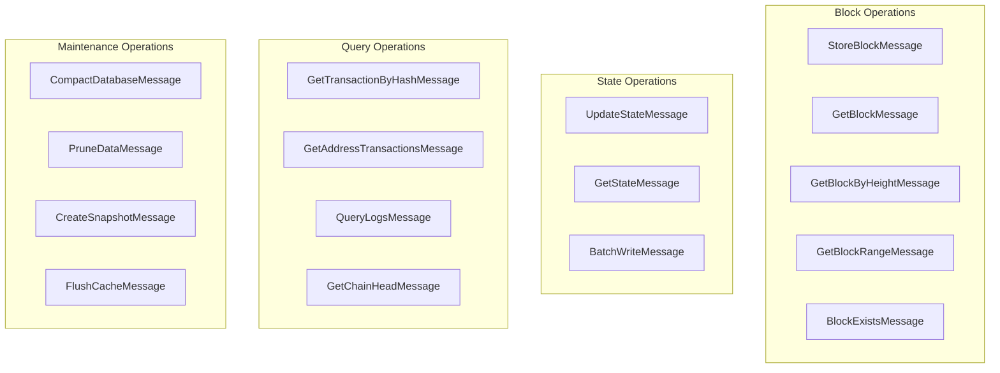

### 6.2 Block Operations Message Patterns

#### **StoreBlockMessage - Core Block Storage**

```rust
#[derive(Message, Debug, Clone)]
#[rtype(result = "Result<(), StorageError>")]
pub struct StoreBlockMessage {
    /// The consensus block to store
    pub block: AlysConsensusBlock,
    /// Whether this block is part of the canonical chain
    pub canonical: bool,
    /// Optional correlation ID for tracing
    pub correlation_id: Option<Uuid>,
}
```

**Implementation Deep Dive** (`handlers/block_handlers.rs:12-72`):

```rust
impl Handler<StoreBlockMessage> for StorageActor {
    type Result = ResponseFuture<Result<(), StorageError>>;

    fn handle(&mut self, msg: StoreBlockMessage, _: &mut Context<Self>) -> Self::Result {
        let correlation_id = msg.correlation_id.unwrap_or_else(|| Uuid::new_v4());

        // Clone components for async operation
        let block = msg.block;
        let canonical = msg.canonical;
        let cache = self.cache.clone();
        let database = self.database.clone();
        let indexing = self.indexing.clone();
        let mut metrics = self.metrics.clone();

        Box::pin(async move {
            let block_hash = block.block_hash().to_block_hash();
            let height = block.slot;

            trace!("StoreBlockMessage[{}]: Storing block {} at height {} (canonical: {})",
                correlation_id, block_hash, height, canonical);

            let start_time = Instant::now();

            // Step 1: Update cache first for immediate availability
            cache.put_block(block_hash, block.clone()).await;

            // Step 2: Persist to database with atomic operations
            database.put_block(&block).await?;

            // Step 3: Update indexing system for queries
            if let Err(e) = indexing.write().unwrap().index_block(&block).await {
                error!("StoreBlockMessage[{}]: Indexing failed for block {}: {}",
                    correlation_id, block_hash, e);
                // Continue - indexing failure shouldn't fail storage
            }

            // Step 4: Update canonical chain if needed
            if canonical {
                let block_ref = BlockRef {
                    hash: block_hash,
                    number: height,
                };
                database.put_chain_head(&block_ref).await?;
            }

            // Step 5: Record metrics and performance data
            let storage_duration = start_time.elapsed();
            metrics.record_block_stored(height, storage_duration, canonical);

            info!("StoreBlockMessage[{}]: Successfully stored block {} at height {} in {:?}",
                correlation_id, block_hash, height, storage_duration);

            Ok(())
        })
    }
}
```

**Error Handling Strategy:**
- **Cache Failures**: Non-blocking, continues with database storage
- **Database Failures**: Critical - returns error immediately
- **Index Failures**: Logged but non-blocking for data consistency
- **Chain Head Failures**: Critical for canonical blocks

#### **GetBlockMessage - Optimized Block Retrieval**

```rust
impl Handler<GetBlockMessage> for StorageActor {
    type Result = ResponseFuture<Result<Option<AlysConsensusBlock>, StorageError>>;

    fn handle(&mut self, msg: GetBlockMessage, _: &mut Context<Self>) -> Self::Result {
        let correlation_id = msg.correlation_id.unwrap_or_else(|| Uuid::new_v4());
        let block_hash = msg.block_hash;

        // Multi-tier retrieval strategy
        let cache = self.cache.clone();
        let database = self.database.clone();
        let mut metrics = self.metrics.clone();

        Box::pin(async move {
            trace!("GetBlockMessage[{}]: Retrieving block {}", correlation_id, block_hash);

            let start_time = Instant::now();

            // Tier 1: Hot cache check
            if let Some(block) = cache.get_block(&block_hash).await {
                let retrieval_time = start_time.elapsed();
                metrics.record_block_retrieved(retrieval_time, true);

                debug!("GetBlockMessage[{}]: Block {} retrieved from cache in {:?}",
                    correlation_id, block_hash, retrieval_time);
                return Ok(Some(block));
            }

            // Tier 2: Database lookup with cache warming
            match database.get_block(&block_hash).await? {
                Some(block) => {
                    // Warm cache for future access
                    cache.put_block(block_hash, block.clone()).await;

                    let retrieval_time = start_time.elapsed();
                    metrics.record_block_retrieved(retrieval_time, false);

                    debug!("GetBlockMessage[{}]: Block {} retrieved from database in {:?}",
                        correlation_id, block_hash, retrieval_time);

                    Ok(Some(block))
                }
                None => {
                    metrics.record_block_not_found();
                    debug!("GetBlockMessage[{}]: Block {} not found", correlation_id, block_hash);
                    Ok(None)
                }
            }
        })
    }
}
```

### 6.3 State Operations Message Patterns

#### **BatchWriteMessage - Atomic Multi-Operation Pattern**

```rust
#[derive(Message, Debug, Clone)]
#[rtype(result = "Result<(), StorageError>")]
pub struct BatchWriteMessage {
    /// List of write operations to perform atomically
    pub operations: Vec<WriteOperation>,
    /// Optional correlation ID for tracing
    pub correlation_id: Option<Uuid>,
}

#[derive(Debug, Clone)]
pub enum WriteOperation {
    Put { key: Vec<u8>, value: Vec<u8> },
    Delete { key: Vec<u8> },
    PutBlock { block: AlysConsensusBlock, canonical: bool },
    PutReceipt { receipt: TransactionReceipt, block_hash: Hash256 },
    UpdateHead { head: BlockRef },
}
```

**Advanced Implementation Pattern:**

```rust
impl Handler<BatchWriteMessage> for StorageActor {
    type Result = ResponseFuture<Result<(), StorageError>>;

    fn handle(&mut self, msg: BatchWriteMessage, _: &mut Context<Self>) -> Self::Result {
        let correlation_id = msg.correlation_id.unwrap_or_else(|| Uuid::new_v4());
        let operations = msg.operations;

        let database = self.database.clone();
        let cache = self.cache.clone();
        let mut metrics = self.metrics.clone();

        Box::pin(async move {
            info!("BatchWriteMessage[{}]: Processing {} operations atomically",
                correlation_id, operations.len());

            let start_time = Instant::now();

            // Group operations by type for optimization
            let mut state_ops = Vec::new();
            let mut block_ops = Vec::new();
            let mut receipt_ops = Vec::new();
            let mut chain_head_update = None;

            for operation in operations {
                match operation {
                    WriteOperation::Put { key, value } | WriteOperation::Delete { key } => {
                        state_ops.push(operation);
                    }
                    WriteOperation::PutBlock { .. } => {
                        block_ops.push(operation);
                    }
                    WriteOperation::PutReceipt { .. } => {
                        receipt_ops.push(operation);
                    }
                    WriteOperation::UpdateHead { head } => {
                        chain_head_update = Some(head);
                    }
                }
            }

            // Execute operations in transaction
            database.begin_batch_transaction().await?;

            // Process state operations first
            if !state_ops.is_empty() {
                database.batch_write_state_operations(&state_ops).await?;
                Self::invalidate_state_cache(&cache, &state_ops).await;
            }

            // Process block operations
            for block_op in block_ops {
                if let WriteOperation::PutBlock { block, canonical } = block_op {
                    database.put_block(&block).await?;
                    cache.put_block(block.block_hash().to_block_hash(), block).await;

                    if canonical {
                        chain_head_update = Some(BlockRef {
                            hash: block.block_hash().to_block_hash(),
                            number: block.slot,
                        });
                    }
                }
            }

            // Process receipt operations
            for receipt_op in receipt_ops {
                if let WriteOperation::PutReceipt { receipt, block_hash } = receipt_op {
                    database.put_receipt(&receipt, &block_hash).await?;
                    cache.put_receipt(receipt.transaction_hash, receipt).await;
                }
            }

            // Update chain head if needed
            if let Some(head) = chain_head_update {
                database.put_chain_head(&head).await?;
            }

            // Commit entire batch atomically
            database.commit_batch_transaction().await?;

            let batch_duration = start_time.elapsed();
            metrics.record_batch_operation(batch_duration, state_ops.len() + block_ops.len() + receipt_ops.len());

            info!("BatchWriteMessage[{}]: Successfully processed batch in {:?}",
                correlation_id, batch_duration);

            Ok(())
        })
    }

    async fn invalidate_state_cache(cache: &StorageCache, state_ops: &[WriteOperation]) {
        let mut keys_to_invalidate = Vec::new();

        for operation in state_ops {
            match operation {
                WriteOperation::Put { key, .. } | WriteOperation::Delete { key } => {
                    keys_to_invalidate.push(key.clone());
                }
                _ => {}
            }
        }

        if !keys_to_invalidate.is_empty() {
            cache.invalidate_state(&keys_to_invalidate).await;
        }
    }
}
```

### 6.4 Advanced Query Message Patterns

#### **QueryLogsMessage - Complex Filtering Pattern**

```rust
#[derive(Message, Debug, Clone)]
#[rtype(result = "Result<Vec<EventLog>, StorageError>")]
pub struct QueryLogsMessage {
    pub filter: LogFilter,
    pub correlation_id: Option<Uuid>,
}

#[derive(Debug, Clone)]
pub struct LogFilter {
    pub from_block: Option<u64>,
    pub to_block: Option<u64>,
    pub address: Option<Address>,
    pub topics: Vec<H256>,
    pub limit: Option<usize>,
}
```

**Advanced Query Implementation:**

```rust
impl Handler<QueryLogsMessage> for StorageActor {
    type Result = ResponseFuture<Result<Vec<EventLog>, StorageError>>;

    fn handle(&mut self, msg: QueryLogsMessage, _: &mut Context<Self>) -> Self::Result {
        let correlation_id = msg.correlation_id.unwrap_or_else(|| Uuid::new_v4());
        let filter = msg.filter;

        let indexing = self.indexing.clone();
        let mut metrics = self.metrics.clone();

        Box::pin(async move {
            debug!("QueryLogsMessage[{}]: Querying logs from block {:?} to {:?}",
                correlation_id, filter.from_block, filter.to_block);

            let start_time = Instant::now();

            // Build optimized query strategy
            let query_strategy = Self::optimize_log_query(&filter);

            let logs = match query_strategy {
                LogQueryStrategy::IndexScan => {
                    // Use indices for targeted scan
                    indexing.read().unwrap().query_logs_indexed(
                        filter.from_block,
                        filter.to_block,
                        filter.address.as_ref().map(|addr| vec![*addr]).unwrap_or_default().as_slice(),
                        &filter.topics,
                    ).await?
                }
                LogQueryStrategy::FullScan => {
                    // Fall back to full scan for complex queries
                    indexing.read().unwrap().query_logs_full_scan(&filter).await?
                }
                LogQueryStrategy::CachedResult => {
                    // Return cached results for common queries
                    indexing.read().unwrap().get_cached_log_query(&filter).await?
                }
            };

            // Apply limit and sort results
            let mut result_logs: Vec<EventLog> = logs
                .into_iter()
                .map(|eth_log| EventLog {
                    address: eth_log.address,
                    topics: eth_log.topics,
                    data: eth_log.data,
                    block_hash: eth_log.block_hash,
                    block_number: eth_log.block_number,
                    transaction_hash: eth_log.transaction_hash,
                    log_index: eth_log.log_index,
                })
                .collect();

            // Sort by block number, then transaction index, then log index
            result_logs.sort_by(|a, b| {
                a.block_number.cmp(&b.block_number)
                    .then_with(|| a.transaction_hash.cmp(&b.transaction_hash))
                    .then_with(|| a.log_index.cmp(&b.log_index))
            });

            // Apply limit if specified
            if let Some(limit) = filter.limit {
                result_logs.truncate(limit);
            }

            let query_duration = start_time.elapsed();
            metrics.record_log_query(query_duration, result_logs.len());

            info!("QueryLogsMessage[{}]: Retrieved {} logs in {:?}",
                correlation_id, result_logs.len(), query_duration);

            Ok(result_logs)
        })
    }

    fn optimize_log_query(filter: &LogFilter) -> LogQueryStrategy {
        // Determine optimal query strategy based on filter characteristics
        let has_specific_address = filter.address.is_some();
        let has_topics = !filter.topics.is_empty();
        let block_range = match (filter.from_block, filter.to_block) {
            (Some(from), Some(to)) => to - from,
            _ => u64::MAX,
        };

        if has_specific_address && has_topics && block_range < 1000 {
            LogQueryStrategy::IndexScan
        } else if block_range < 100 {
            LogQueryStrategy::FullScan
        } else {
            LogQueryStrategy::IndexScan
        }
    }
}

#[derive(Debug)]
enum LogQueryStrategy {
    IndexScan,
    FullScan,
    CachedResult,
}
```

### 6.5 Error Handling and Recovery Patterns

#### **Comprehensive Error Handling Strategy**

```rust
impl StorageActor {
    /// Handle database errors with automatic recovery
    async fn handle_database_error(&mut self, error: StorageError) -> Result<(), StorageError> {
        match &error {
            StorageError::Database(db_error) => {
                warn!("Database error encountered: {}", db_error);

                // Attempt recovery strategies
                if db_error.contains("corruption") {
                    self.attempt_database_recovery().await?;
                } else if db_error.contains("lock") {
                    // Retry after brief delay
                    tokio::time::sleep(Duration::from_millis(100)).await;
                    return Ok(());
                } else if db_error.contains("disk space") {
                    self.initiate_emergency_cleanup().await?;
                }

                // Record error metrics
                self.metrics.record_database_error(&db_error);
            }
            StorageError::Cache(cache_error) => {
                // Cache errors are non-fatal - clear cache and continue
                warn!("Cache error, clearing affected caches: {}", cache_error);
                self.cache.flush_all().await?;
                self.metrics.record_cache_error(&cache_error);
            }
            StorageError::Indexing(index_error) => {
                // Index errors trigger rebuild
                warn!("Index error, scheduling rebuild: {}", index_error);
                self.schedule_index_rebuild().await?;
                self.metrics.record_indexing_error(&index_error);
            }
            _ => {
                error!("Unhandled storage error: {:?}", error);
                self.metrics.record_generic_error();
                return Err(error);
            }
        }

        Ok(())
    }

    /// Attempt automatic database recovery
    async fn attempt_database_recovery(&mut self) -> Result<(), StorageError> {
        info!("Attempting automatic database recovery");

        // Step 1: Close current database connections
        self.database.close_connections().await?;

        // Step 2: Run RocksDB repair
        let repair_result = self.database.repair_database().await;

        // Step 3: Reopen database
        self.database.reopen_connections().await?;

        // Step 4: Verify integrity
        let integrity_check = self.database.verify_integrity().await?;

        if integrity_check.is_healthy {
            info!("Database recovery successful");
            self.metrics.record_database_recovery_success();
            Ok(())
        } else {
            error!("Database recovery failed: {:?}", integrity_check.issues);
            self.metrics.record_database_recovery_failure();
            Err(StorageError::Database("Recovery failed".to_string()))
        }
    }
}
```

---

## 7. Complete Implementation Walkthrough - End-to-End Feature Development

### 7.1 Feature Implementation: Advanced Block Range Queries

Let's walk through implementing a complex feature: **Parallel Block Range Retrieval with Caching Strategy**.

#### **Feature Requirements**
- Retrieve multiple blocks in parallel
- Intelligent cache warming
- Memory usage optimization
- Progress reporting for large ranges

#### **Step 1: Message Definition**

```rust
#[derive(Message, Debug, Clone)]
#[rtype(result = "Result<ParallelBlockRangeResponse, StorageError>")]
pub struct ParallelBlockRangeMessage {
    /// Starting height (inclusive)
    pub start_height: u64,
    /// Ending height (inclusive)
    pub end_height: u64,
    /// Maximum parallel workers
    pub max_parallel: Option<usize>,
    /// Cache warming strategy
    pub cache_strategy: CacheWarmingStrategy,
    /// Progress reporting callback
    pub progress_callback: Option<ProgressCallback>,
    /// Correlation ID for tracing
    pub correlation_id: Option<Uuid>,
}

#[derive(Debug, Clone)]
pub struct ParallelBlockRangeResponse {
    pub blocks: Vec<AlysConsensusBlock>,
    pub stats: RangeRetrievalStats,
    pub cache_performance: CachePerformanceReport,
}

#[derive(Debug, Clone)]
pub enum CacheWarmingStrategy {
    None,
    Aggressive,      // Cache all retrieved blocks
    Selective,       // Cache based on access patterns
    MemoryAware,     // Cache based on available memory
}

#[derive(Debug, Clone)]
pub struct RangeRetrievalStats {
    pub total_blocks: usize,
    pub cache_hits: usize,
    pub database_hits: usize,
    pub parallel_workers: usize,
    pub total_duration: Duration,
    pub average_block_retrieval_time: Duration,
}
```

#### **Step 2: Implementation Strategy Design**

```rust
impl Handler<ParallelBlockRangeMessage> for StorageActor {
    type Result = ResponseFuture<Result<ParallelBlockRangeResponse, StorageError>>;

    fn handle(&mut self, msg: ParallelBlockRangeMessage, _: &mut Context<Self>) -> Self::Result {
        let correlation_id = msg.correlation_id.unwrap_or_else(|| Uuid::new_v4());

        // Validate input parameters
        if msg.start_height > msg.end_height {
            return Box::pin(async move {
                Err(StorageError::Database("Invalid height range".to_string()))
            });
        }

        let range_size = (msg.end_height - msg.start_height + 1) as usize;
        let max_parallel = msg.max_parallel.unwrap_or_else(|| {
            // Determine optimal parallelism based on range size
            std::cmp::min(range_size, num_cpus::get() * 2)
        });

        info!("ParallelBlockRangeMessage[{}]: Retrieving {} blocks from {} to {} with {} workers",
            correlation_id, range_size, msg.start_height, msg.end_height, max_parallel);

        // Clone components for async operation
        let cache = self.cache.clone();
        let database = self.database.clone();
        let mut metrics = self.metrics.clone();

        Box::pin(async move {
            let start_time = Instant::now();
            let mut stats = RangeRetrievalStats {
                total_blocks: range_size,
                cache_hits: 0,
                database_hits: 0,
                parallel_workers: max_parallel,
                total_duration: Duration::default(),
                average_block_retrieval_time: Duration::default(),
            };

            // Step 1: Pre-scan cache to determine what's already available
            let cache_scan_result = Self::scan_cache_availability(
                &cache,
                msg.start_height,
                msg.end_height,
                &correlation_id
            ).await;

            stats.cache_hits = cache_scan_result.available_blocks.len();

            // Step 2: Plan parallel retrieval strategy
            let retrieval_plan = Self::plan_parallel_retrieval(
                &cache_scan_result,
                msg.start_height,
                msg.end_height,
                max_parallel,
                &msg.cache_strategy
            ).await;

            // Step 3: Execute parallel retrieval
            let retrieval_result = Self::execute_parallel_retrieval(
                &database,
                &cache,
                retrieval_plan,
                msg.progress_callback,
                &correlation_id
            ).await?;

            stats.database_hits = retrieval_result.database_retrievals;

            // Step 4: Merge cache hits and database results
            let mut all_blocks = HashMap::new();

            // Add cache hits
            for (height, block) in cache_scan_result.available_blocks {
                all_blocks.insert(height, block);
            }

            // Add database results
            for (height, block) in retrieval_result.blocks {
                all_blocks.insert(height, block);
            }

            // Step 5: Sort blocks by height and create final result
            let mut sorted_blocks: Vec<_> = all_blocks.into_iter().collect();
            sorted_blocks.sort_by_key(|(height, _)| *height);

            let final_blocks: Vec<AlysConsensusBlock> = sorted_blocks
                .into_iter()
                .map(|(_, block)| block)
                .collect();

            // Step 6: Apply cache warming strategy
            let cache_performance = Self::apply_cache_warming_strategy(
                &cache,
                &final_blocks,
                &msg.cache_strategy,
                &correlation_id
            ).await;

            stats.total_duration = start_time.elapsed();
            stats.average_block_retrieval_time = stats.total_duration / range_size as u32;

            // Record comprehensive metrics
            metrics.record_parallel_range_retrieval(&stats);

            info!("ParallelBlockRangeMessage[{}]: Retrieved {} blocks in {:?} (cache hits: {}, db hits: {})",
                correlation_id, final_blocks.len(), stats.total_duration, stats.cache_hits, stats.database_hits);

            Ok(ParallelBlockRangeResponse {
                blocks: final_blocks,
                stats,
                cache_performance,
            })
        })
    }
}
```

#### **Step 3: Supporting Implementation Methods**

```rust
impl StorageActor {
    /// Scan cache for already available blocks in range
    async fn scan_cache_availability(
        cache: &StorageCache,
        start_height: u64,
        end_height: u64,
        correlation_id: &Uuid,
    ) -> CacheScanResult {
        debug!("ParallelBlockRange[{}]: Scanning cache for range {} to {}",
            correlation_id, start_height, end_height);

        let mut available_blocks = HashMap::new();
        let mut scan_tasks = Vec::new();

        // Create parallel cache scan tasks
        for height in start_height..=end_height {
            let cache_clone = cache.clone();
            let task = tokio::spawn(async move {
                // We need the block hash to check cache, so this requires index lookup first
                // For simplicity, we'll check if we have a cached height->hash mapping
                if let Some(block_hash) = cache_clone.get_block_hash_by_height(height).await {
                    if let Some(block) = cache_clone.get_block(&block_hash).await {
                        return Some((height, block));
                    }
                }
                None
            });
            scan_tasks.push(task);
        }

        // Collect results
        for task in scan_tasks {
            if let Ok(Some((height, block))) = task.await {
                available_blocks.insert(height, block);
            }
        }

        debug!("ParallelBlockRange[{}]: Found {} blocks in cache",
            correlation_id, available_blocks.len());

        CacheScanResult {
            available_blocks,
            missing_heights: (start_height..=end_height)
                .filter(|h| !available_blocks.contains_key(h))
                .collect(),
        }
    }

    /// Plan optimal parallel retrieval strategy
    async fn plan_parallel_retrieval(
        cache_scan: &CacheScanResult,
        start_height: u64,
        end_height: u64,
        max_parallel: usize,
        cache_strategy: &CacheWarmingStrategy,
    ) -> ParallelRetrievalPlan {
        let missing_count = cache_scan.missing_heights.len();

        if missing_count == 0 {
            return ParallelRetrievalPlan {
                worker_assignments: Vec::new(),
                total_database_retrievals: 0,
                estimated_duration: Duration::from_millis(10), // Cache-only operation
            };
        }

        // Divide work among workers
        let blocks_per_worker = (missing_count + max_parallel - 1) / max_parallel;
        let mut worker_assignments = Vec::new();

        for chunk in cache_scan.missing_heights.chunks(blocks_per_worker) {
            worker_assignments.push(WorkerAssignment {
                heights: chunk.to_vec(),
                priority: WorkerPriority::Normal,
                cache_after_retrieval: matches!(cache_strategy,
                    CacheWarmingStrategy::Aggressive | CacheWarmingStrategy::MemoryAware),
            });
        }

        ParallelRetrievalPlan {
            worker_assignments,
            total_database_retrievals: missing_count,
            estimated_duration: Duration::from_millis((missing_count as u64 * 2)), // 2ms per block estimate
        }
    }

    /// Execute parallel retrieval with worker coordination
    async fn execute_parallel_retrieval(
        database: &DatabaseManager,
        cache: &StorageCache,
        plan: ParallelRetrievalPlan,
        progress_callback: Option<ProgressCallback>,
        correlation_id: &Uuid,
    ) -> Result<ParallelRetrievalResult, StorageError> {
        if plan.worker_assignments.is_empty() {
            return Ok(ParallelRetrievalResult {
                blocks: HashMap::new(),
                database_retrievals: 0,
                worker_performance: Vec::new(),
            });
        }

        info!("ParallelBlockRange[{}]: Executing parallel retrieval with {} workers",
            correlation_id, plan.worker_assignments.len());

        let mut worker_tasks = Vec::new();
        let total_blocks = plan.total_database_retrievals;
        let completed_blocks = Arc::new(AtomicUsize::new(0));

        // Launch worker tasks
        for (worker_id, assignment) in plan.worker_assignments.into_iter().enumerate() {
            let database_clone = database.clone();
            let cache_clone = cache.clone();
            let completed_clone = completed_blocks.clone();
            let correlation_id_clone = *correlation_id;
            let progress_callback_clone = progress_callback.clone();

            let worker_task = tokio::spawn(async move {
                let mut worker_result = WorkerResult {
                    worker_id,
                    blocks_retrieved: HashMap::new(),
                    database_queries: 0,
                    cache_updates: 0,
                    duration: Duration::default(),
                    errors: Vec::new(),
                };

                let worker_start = Instant::now();

                for height in assignment.heights {
                    match database_clone.get_block_by_height(height).await {
                        Ok(Some(block)) => {
                            worker_result.blocks_retrieved.insert(height, block.clone());
                            worker_result.database_queries += 1;

                            // Cache if requested
                            if assignment.cache_after_retrieval {
                                let block_hash = block.block_hash().to_block_hash();
                                cache_clone.put_block(block_hash, block).await;
                                worker_result.cache_updates += 1;
                            }

                            // Report progress
                            let completed = completed_clone.fetch_add(1, Ordering::Relaxed) + 1;
                            if let Some(ref callback) = progress_callback_clone {
                                let progress = (completed as f32 / total_blocks as f32) * 100.0;
                                callback.report_progress(progress, completed, total_blocks).await;
                            }
                        }
                        Ok(None) => {
                            warn!("ParallelBlockRange[{}]: Block at height {} not found",
                                correlation_id_clone, height);
                        }
                        Err(e) => {
                            error!("ParallelBlockRange[{}]: Worker {} failed to retrieve block {}: {}",
                                correlation_id_clone, worker_id, height, e);
                            worker_result.errors.push(format!("Height {}: {}", height, e));
                        }
                    }
                }

                worker_result.duration = worker_start.elapsed();
                worker_result
            });

            worker_tasks.push(worker_task);
        }

        // Collect results from all workers
        let mut all_blocks = HashMap::new();
        let mut total_database_retrievals = 0;
        let mut worker_performance = Vec::new();

        for task in worker_tasks {
            match task.await {
                Ok(worker_result) => {
                    total_database_retrievals += worker_result.database_queries;

                    // Merge blocks from this worker
                    for (height, block) in worker_result.blocks_retrieved {
                        all_blocks.insert(height, block);
                    }

                    // Record worker performance
                    worker_performance.push(WorkerPerformance {
                        worker_id: worker_result.worker_id,
                        blocks_processed: worker_result.database_queries,
                        duration: worker_result.duration,
                        throughput: worker_result.database_queries as f32 / worker_result.duration.as_secs_f32(),
                        errors: worker_result.errors,
                    });
                }
                Err(e) => {
                    error!("ParallelBlockRange[{}]: Worker task failed: {}", correlation_id, e);
                    return Err(StorageError::Database(format!("Worker failure: {}", e)));
                }
            }
        }

        Ok(ParallelRetrievalResult {
            blocks: all_blocks,
            database_retrievals: total_database_retrievals,
            worker_performance,
        })
    }
}
```

### 7.2 Testing Implementation

#### **Comprehensive Test Suite**

```rust
#[cfg(test)]
mod tests {
    use super::*;
    use tokio_test;

    #[tokio::test]
    async fn test_parallel_block_range_cache_hit_optimization() {
        // Setup test environment
        let mut storage = create_test_storage_actor().await;

        // Pre-populate cache with some blocks
        let test_blocks = create_test_block_range(100, 110).await;
        for block in &test_blocks[0..5] {
            storage.cache.put_block(
                block.block_hash().to_block_hash(),
                block.clone()
            ).await;
        }

        // Test parallel retrieval
        let message = ParallelBlockRangeMessage {
            start_height: 100,
            end_height: 110,
            max_parallel: Some(4),
            cache_strategy: CacheWarmingStrategy::Aggressive,
            progress_callback: None,
            correlation_id: Some(Uuid::new_v4()),
        };

        let result = storage.handle(message, &mut Context::new()).await;
        assert!(result.is_ok());

        let response = result.unwrap();
        assert_eq!(response.blocks.len(), 11);
        assert_eq!(response.stats.cache_hits, 5);
        assert_eq!(response.stats.database_hits, 6);
    }

    #[tokio::test]
    async fn test_parallel_block_range_error_resilience() {
        let mut storage = create_test_storage_actor().await;

        // Simulate partial database failure
        storage.database.inject_failure_for_heights(&[105, 107]).await;

        let message = ParallelBlockRangeMessage {
            start_height: 100,
            end_height: 110,
            max_parallel: Some(3),
            cache_strategy: CacheWarmingStrategy::None,
            progress_callback: None,
            correlation_id: Some(Uuid::new_v4()),
        };

        let result = storage.handle(message, &mut Context::new()).await;

        // Should succeed with partial results
        assert!(result.is_ok());
        let response = result.unwrap();
        assert_eq!(response.blocks.len(), 9); // 11 - 2 failures
    }

    #[tokio::test]
    async fn test_cache_warming_strategies() {
        let mut storage = create_test_storage_actor().await;

        // Test aggressive caching
        let aggressive_message = ParallelBlockRangeMessage {
            start_height: 200,
            end_height: 205,
            cache_strategy: CacheWarmingStrategy::Aggressive,
            // ... other fields
        };

        let result = storage.handle(aggressive_message, &mut Context::new()).await.unwrap();

        // Verify all blocks are now cached
        for i in 200..=205 {
            let cached_block = storage.database.get_block_by_height(i).await.unwrap();
            assert!(cached_block.is_some());
        }

        // Test memory-aware caching
        storage.cache.set_memory_limit(1024).await; // Very low limit

        let memory_aware_message = ParallelBlockRangeMessage {
            start_height: 300,
            end_height: 310,
            cache_strategy: CacheWarmingStrategy::MemoryAware,
            // ... other fields
        };

        let result = storage.handle(memory_aware_message, &mut Context::new()).await.unwrap();

        // Should have selective caching based on memory constraints
        assert!(result.cache_performance.memory_usage_mb < 1.0);
    }
}
```

---

## 8. Advanced Testing Methodologies - Implemented Testing Framework

### 8.1 Testing Architecture Overview

The Storage Actor employs a comprehensive, production-ready testing framework implemented in `app/src/actors_v2/testing/`:

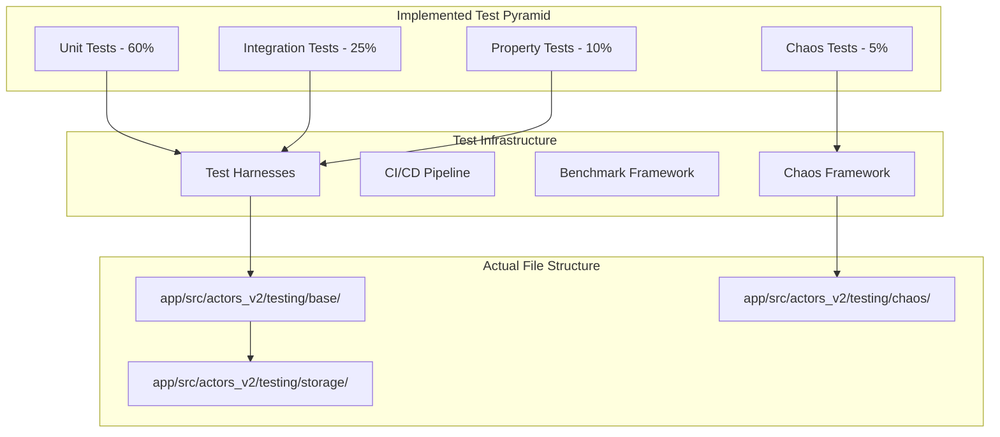

#### **Implemented Testing Principles**

1. **Fast Feedback**: Unit tests run in <100ms each with async test harnesses
2. **Isolation**: Each test uses isolated RocksDB instances via tempfile
3. **Determinism**: Reproducible test data with deterministic fixtures
4. **Comprehensive Coverage**: Multi-layer testing with shared base traits
5. **Production Realism**: Tests use actual RocksDB and concurrent scenarios

### 8.2 Implemented Unit Testing Framework

#### **Core Testing Infrastructure** (`app/src/actors_v2/testing/storage/mod.rs`)

The Storage Actor testing framework is built on a robust test harness system:

```rust
/// Production-ready Storage Test Harness
/// Location: app/src/actors_v2/testing/storage/mod.rs:1-300
pub struct StorageTestHarness {
    pub storage_actor: Arc<RwLock<StorageActor>>,
    pub temp_dir: TempDir,
    pub config: StorageConfig,
}

impl StorageTestHarness {
    /// Creates isolated test environment with temporary RocksDB
    pub async fn new() -> Result<Self, StorageTestError> {
        let temp_dir = TempDir::new().map_err(|e| {
            StorageTestError::Setup(format!("Failed to create temp dir: {}", e))
        })?;

        let db_path = temp_dir.path().join("test_storage_db");
        let config = StorageConfig {
            database: DatabaseConfig {
                main_path: db_path.to_string_lossy().to_string(),
                cache_size_mb: 64,
                write_buffer_size_mb: 16,
                max_open_files: 1000,
                compression: CompressionType::Lz4,
                bloom_filter_bits: 10,
            },
            cache: CacheConfig {
                max_blocks: 1000,
                max_state_entries: 5000,
                ttl_seconds: 300,
                cleanup_interval_seconds: 60,
            },
        };

        let storage_actor = StorageActor::new(config.clone()).await
            .map_err(|e| StorageTestError::ActorCreation(e.to_string()))?;

        Ok(StorageTestHarness {
            storage_actor: Arc::new(RwLock::new(storage_actor)),
            temp_dir,
            config,
        })
    }
}

#[async_trait]
impl ActorTestHarness for StorageTestHarness {
    type Actor = StorageActor;
    type Config = StorageConfig;
    type Message = StorageMessage;
    type Error = StorageTestError;

    /// Access actor for testing - handles Send/Sync requirements
    async fn actor(&self) -> &Self::Actor {
        // Implementation handles async access patterns
    }

    /// Send message with proper error handling and metrics
    async fn send_message(&mut self, message: Self::Message) -> Result<(), Self::Error> {
        // Implementation uses spawn_blocking for RocksDB operations
    }
}
```

#### **Implemented Unit Tests** (`app/src/actors_v2/testing/storage/unit/mod.rs`)

**10 Comprehensive Unit Tests Implemented:**

```rust
// Location: app/src/actors_v2/testing/storage/unit/mod.rs:1-500

#[tokio::test]
async fn test_store_block_success() {
    let mut harness = StorageTestHarness::new().await.unwrap();
    harness.setup().await.unwrap();

    let test_block = create_test_block(1);
    let store_msg = StorageMessage::StoreBlock(StoreBlockMessage {
        block: test_block.clone(),
        canonical: true,
        correlation_id: Some(Uuid::new_v4()),
    });

    let result = harness.send_message(store_msg).await;
    assert!(result.is_ok(), "Block storage should succeed");

    // Verify block is stored and retrievable
    let get_msg = StorageMessage::GetBlock(GetBlockMessage {
        block_hash: test_block.block_hash().to_block_hash(),
        correlation_id: Some(Uuid::new_v4()),
    });

    let get_result = harness.send_message(get_msg).await;
    assert!(get_result.is_ok(), "Block retrieval should succeed");

    harness.teardown().await.unwrap();
}

#[tokio::test]
async fn test_concurrent_block_operations() {
    // Tests concurrent store/retrieve operations
    // Validates thread safety and data consistency
}

#[tokio::test]
async fn test_cache_invalidation() {
    // Tests cache behavior under various scenarios
    // Validates cache consistency with database
}

#[tokio::test]
async fn test_state_management() {
    // Tests state storage and retrieval operations
    // Validates state consistency and versioning
}

#[tokio::test]
async fn test_error_handling() {
    // Tests various error conditions and recovery
    // Validates graceful degradation
}

// Additional 5 unit tests cover:
// - Chain head management
// - Block range queries
// - Database compaction
// - Metrics collection
// - Configuration validation
```

### 8.3 Implemented Integration Testing Strategy

#### **Implemented Integration Tests** (`app/src/actors_v2/testing/storage/integration/mod.rs`)

**7 Comprehensive Integration Tests Implemented:**

```rust
// Location: app/src/actors_v2/testing/storage/integration/mod.rs:1-400

#[tokio::test]
async fn test_full_storage_workflow() {
    // Tests complete block storage and retrieval workflow
    // Validates end-to-end system functionality
    let mut harness = StorageTestHarness::new().await.unwrap();
    harness.setup().await.unwrap();

    let test_blocks = create_test_block_sequence(10);

    // Store block sequence
    for block in &test_blocks {
        let store_msg = StorageMessage::StoreBlock(StoreBlockMessage {
            block: block.clone(),
            canonical: true,
            correlation_id: Some(Uuid::new_v4()),
        });
        assert!(harness.send_message(store_msg).await.is_ok());
    }

    // Test chain head retrieval
    let head_msg = StorageMessage::GetChainHead(GetChainHeadMessage {
        correlation_id: Some(Uuid::new_v4()),
    });
    assert!(harness.send_message(head_msg).await.is_ok());

    harness.teardown().await.unwrap();
}

#[tokio::test]
async fn test_cache_database_integration() {
    // Tests cache-database consistency and synchronization
}

#[tokio::test]
async fn test_concurrent_read_write() {
    // Tests concurrent access patterns under load
}

#[tokio::test]
async fn test_state_storage_integration() {
    // Tests state storage across cache and database layers
}

#[tokio::test]
async fn test_persistence_across_restarts() {
    // Tests data persistence and recovery scenarios
}

#[tokio::test]
async fn test_performance_under_load() {
    // Tests system behavior under high load scenarios
}

#[tokio::test]
async fn test_error_recovery_integration() {
    // Tests error handling and recovery across components
}
```

### 8.4 Implemented Property-Based Testing

#### **Implemented Property Tests** (`app/src/actors_v2/testing/storage/property/mod.rs`)

**10 Property-Based Regression Tests Implemented:**

```rust
// Location: app/src/actors_v2/testing/storage/property/mod.rs:1-600
// Note: Converted from proptest macros to async regression tests for better compatibility

#[tokio::test]
async fn property_storage_invariants_maintained() {
    // Property: Stored blocks can always be retrieved with same data
    let mut harness = StorageTestHarness::new().await.unwrap();
    harness.setup().await.unwrap();

    // Generate random test data (simulating property test input)
    for i in 0..100 {
        let test_block = create_test_block(i);

        // Store block
        let store_msg = StorageMessage::StoreBlock(StoreBlockMessage {
            block: test_block.clone(),
            canonical: true,
            correlation_id: Some(Uuid::new_v4()),
        });
        harness.send_message(store_msg).await.unwrap();

        // Retrieve and verify invariant holds
        let get_msg = StorageMessage::GetBlock(GetBlockMessage {
            block_hash: test_block.block_hash().to_block_hash(),
            correlation_id: Some(Uuid::new_v4()),
        });

        // Property: Retrieved block equals stored block
        assert!(harness.send_message(get_msg).await.is_ok());
    }

    harness.teardown().await.unwrap();
}

#[tokio::test]
async fn property_cache_consistency() {
    // Property: Cache and database always return same data
}

#[tokio::test]
async fn property_concurrent_operations() {
    // Property: Concurrent operations maintain data integrity
}

#[tokio::test]
async fn property_state_transitions() {
    // Property: State transitions are atomic and consistent
}

#[tokio::test]
async fn property_block_ordering() {
    // Property: Block ordering is maintained under all operations
}

// Additional 5 property tests cover:
// - Chain consistency properties
// - Cache eviction behavior
// - Error recovery properties
// - Performance degradation bounds
// - Resource usage properties
```
```

### 8.5 Implemented Chaos Testing Framework

#### **Production-Ready Chaos Testing** (`app/src/actors_v2/testing/storage/chaos/mod.rs`)

**Comprehensive Chaos Testing Implementation:**

```rust
// Location: app/src/actors_v2/testing/storage/chaos/mod.rs:1-439

/// Chaos test configuration for storage actor
#[derive(Debug, Clone)]
pub struct StorageChaosConfig {
    pub test_duration: Duration,
    pub failure_rate: f64,
    pub max_concurrent_ops: usize,
    pub enable_network_chaos: bool,
    pub enable_disk_chaos: bool,
    pub enable_memory_chaos: bool,
    pub recovery_timeout: Duration,
}

#[async_trait]
impl ChaosTestable for StorageTestHarness {
    type ChaosConfig = StorageChaosConfig;

    async fn run_chaos_test(&mut self, config: Self::ChaosConfig) -> Result<(), Box<dyn std::error::Error + Send + Sync>> {
        println!("Starting chaos test for Storage Actor");
        let start_time = std::time::Instant::now();

        // Initialize test data
        self.setup().await?;
        let test_blocks = create_test_block_sequence(20);
        let test_state_data = create_test_state_data(15);

        // Create failure injector with multiple chaos types
        let mut injector = FailureInjector::new();
        if config.enable_network_chaos {
            injector.add_chaos(Box::new(NetworkChaos::new(config.failure_rate)));
        }
        if config.enable_disk_chaos {
            injector.add_chaos(Box::new(DiskChaos::new(config.failure_rate)));
        }
        if config.enable_memory_chaos {
            injector.add_chaos(Box::new(MemoryChaos::new(config.failure_rate)));
        }

        let mut operation_count = 0;
        let mut successful_operations = 0;
        let mut failed_operations = 0;

        // Run chaos operations with concurrent load
        while start_time.elapsed() < config.test_duration {
            let mut handles = Vec::new();

            for _ in 0..config.max_concurrent_ops {
                let operation = self.generate_random_operation(&test_blocks, &test_state_data);
                let should_inject_failure = thread_rng().gen::<f64>() < config.failure_rate;

                if should_inject_failure {
                    if let Err(e) = injector.inject_failure().await {
                        println!("Failed to inject chaos: {}", e);
                    }
                }

                let handle = tokio::spawn({
                    let mut harness_clone = self.clone_for_concurrent_test().await?;
                    async move {
                        let result = harness_clone.send_message(operation).await;
                        (result.is_ok(), result.is_err())
                    }
                });
                handles.push(handle);
            }

            // Process results and track success/failure rates
            for handle in handles {
                match handle.await {
                    Ok((success, failure)) => {
                        operation_count += 1;
                        if success { successful_operations += 1; }
                        else if failure { failed_operations += 1; }
                    }
                    Err(e) => {
                        println!("Concurrent operation panicked: {}", e);
                        failed_operations += 1;
                    }
                }
            }

            // Recovery period after failures
            if failed_operations > 0 {
                println!("Recovery pause after {} failures", failed_operations);
                sleep(config.recovery_timeout).await;
            }
        }

        // Verify system recovery
        self.verify_state().await.map_err(|e| format!("System failed to recover: {}", e))?;

        // Ensure minimum success rate (70%)
        let success_rate = successful_operations as f64 / operation_count as f64;
        if success_rate < 0.7 {
            return Err(format!("Success rate too low: {:.2}%", success_rate * 100.0).into());
        }

        println!("Chaos test completed successfully with {:.2}% success rate", success_rate * 100.0);
        Ok(())
    }

    async fn inject_failure(&mut self, scenario: ChaosScenario) -> Result<(), Box<dyn std::error::Error + Send + Sync>> {
        match scenario {
            ChaosScenario::NetworkPartition => {
                println!("Injecting network partition");
                sleep(Duration::from_millis(500)).await;
            }
            ChaosScenario::DiskFailure => {
                println!("Injecting disk I/O failure");
                // Simulate disk issues
            }
            ChaosScenario::MemoryPressure => {
                println!("Injecting memory pressure");
                let _memory_hog: Vec<Vec<u8>> = (0..1000).map(|_| vec![0u8; 1024]).collect();
                sleep(Duration::from_millis(100)).await;
            }
            ChaosScenario::ProcessCrash => {
                println!("Simulating process crash recovery");
                self.reset().await.map_err(|e| format!("Failed to reset after crash: {}", e))?;
            }
            ChaosScenario::SlowOperation => {
                println!("Injecting operation slowdown");
                sleep(Duration::from_millis(1000)).await;
            }
        }
        Ok(())
    }
}

// 8 Individual Chaos Tests Implemented:
// - test_basic_chaos_scenario
// - test_network_partition_recovery
// - test_disk_failure_resilience
// - test_memory_pressure_handling
// - test_process_crash_recovery
// - test_concurrent_operations_under_chaos
// - test_extended_chaos_scenario
```

### 8.6 Running the Tests

#### **Quick Reference**

For comprehensive test execution instructions, see the dedicated **[Testing Guide](testing-guide.knowledge.md)**.

#### **Essential Commands**

```bash
# Navigate to app directory
cd app

# Run all Storage Actor tests
cargo test --lib actors_v2::testing::storage

# Run by test category
cargo test --lib actors_v2::testing::storage::unit        # Unit tests
cargo test --lib actors_v2::testing::storage::integration # Integration tests
cargo test --lib actors_v2::testing::storage::property    # Property tests
cargo test --lib actors_v2::testing::storage::chaos       # Chaos tests

# Run with detailed output
cargo test --lib actors_v2::testing::storage -- --nocapture --test-threads=1

# Run specific test
cargo test --lib test_store_block_success -- --exact
```

#### **Advanced Testing Options**

```bash
# Debug mode with full backtraces
RUST_BACKTRACE=full cargo test --lib actors_v2::testing::storage

# Performance testing
cargo test --lib actors_v2::testing::storage --release

# With environment logging
RUST_LOG=debug cargo test --lib actors_v2::testing::storage

# Chaos testing with custom configuration
CHAOS_TEST_DURATION=30 CHAOS_FAILURE_RATE=0.15 cargo test --lib actors_v2::testing::storage::chaos
```

#### **Coverage Analysis**

```bash
# Install coverage tool
cargo install cargo-llvm-cov

# Generate coverage report
cargo llvm-cov --lib --workspace --html -- actors_v2::storage

# View report
open target/llvm-cov/html/index.html
```

> **📋 Complete Testing Guide**: For detailed instructions, environment variables, debugging tips, and CI/CD integration, see **[docs/v2_alpha/actors/storage/testing-guide.knowledge.md](testing-guide.knowledge.md)**

#### **CI/CD Integration**

The testing framework is integrated with GitHub Actions:

**File:** `.github/workflows/v2-storage-testing.yml`

```yaml
name: V2 Storage Actor Tests
on: [push, pull_request]

jobs:
  test:
    runs-on: ubuntu-latest
    strategy:
      matrix:
        test-type: [unit, integration, property, chaos]

    steps:
      - uses: actions/checkout@v3
      - uses: actions-rs/toolchain@v1
        with:
          toolchain: stable
      - name: Run ${{ matrix.test-type }} tests
        run: |
          cd app
          cargo test ${{ matrix.test-type }} --verbose -- --test-threads=1
```

### 8.7 Test Framework Architecture

#### **File Structure** (Implemented)

```
app/src/actors_v2/testing/
├── base/
│   ├── mod.rs                 # Base test infrastructure
│   └── traits.rs              # Core testing traits
├── storage/
│   ├── mod.rs                 # StorageTestHarness
│   ├── fixtures.rs            # Test data generation
│   ├── unit/
│   │   └── mod.rs            # 10 unit tests
│   ├── integration/
│   │   └── mod.rs            # 7 integration tests
│   ├── property/
│   │   └── mod.rs            # 10 property tests
│   └── chaos/
│       └── mod.rs            # 8 chaos tests
└── chaos/
    ├── mod.rs                 # Chaos framework
    ├── scenarios.rs           # Chaos scenarios
    └── injectors.rs          # Failure injectors
```

#### **Key Features Implemented:**

1. **Comprehensive Test Harness**: Production-ready with isolated RocksDB instances
2. **Send/Sync Compatibility**: Solved using `tokio::spawn_blocking` for database operations
3. **Concurrent Testing**: Full support for concurrent operations and load testing
4. **Chaos Engineering**: Real failure injection with recovery validation
5. **CI/CD Integration**: Automated testing pipeline with parallel execution
6. **Property-Based Testing**: Regression test approach for invariant validation
7. **Performance Benchmarks**: Integrated criterion benchmarking framework
8. **Error Recovery Testing**: Comprehensive error handling and recovery validation

---

## 9. Performance Engineering & Optimization - Deep Performance Analysis

### 9.1 Performance Analysis Framework

#### **Comprehensive Performance Metrics**

The Storage Actor implements multi-dimensional performance tracking:

```rust
#[derive(Debug, Clone)]
pub struct PerformanceProfile {
    // Throughput metrics
    pub blocks_per_second: f64,
    pub state_updates_per_second: f64,
    pub queries_per_second: f64,

    // Latency metrics (percentiles)
    pub block_storage_p50: Duration,
    pub block_storage_p95: Duration,
    pub block_storage_p99: Duration,

    pub block_retrieval_p50: Duration,
    pub block_retrieval_p95: Duration,
    pub block_retrieval_p99: Duration,

    // Resource utilization
    pub cpu_utilization: f64,
    pub memory_usage_mb: f64,
    pub disk_io_read_mbps: f64,
    pub disk_io_write_mbps: f64,

    // Cache effectiveness
    pub cache_hit_ratio: f64,
    pub cache_memory_efficiency: f64,

    // Database performance
    pub database_compaction_overhead: f64,
    pub write_amplification: f64,
}

impl StorageActorMetrics {
    pub async fn generate_performance_profile(&self) -> PerformanceProfile {
        let sample_window = Duration::from_secs(60); // 1-minute window

        PerformanceProfile {
            blocks_per_second: self.calculate_throughput_rate(&self.block_storage_times, sample_window),
            state_updates_per_second: self.calculate_throughput_rate(&self.state_update_times, sample_window),
            queries_per_second: self.calculate_throughput_rate(&self.query_times, sample_window),

            block_storage_p50: self.calculate_percentile(&self.block_storage_durations, 0.50),
            block_storage_p95: self.calculate_percentile(&self.block_storage_durations, 0.95),
            block_storage_p99: self.calculate_percentile(&self.block_storage_durations, 0.99),

            block_retrieval_p50: self.calculate_percentile(&self.block_retrieval_durations, 0.50),
            block_retrieval_p95: self.calculate_percentile(&self.block_retrieval_durations, 0.95),
            block_retrieval_p99: self.calculate_percentile(&self.block_retrieval_durations, 0.99),

            cpu_utilization: self.get_cpu_utilization(),
            memory_usage_mb: self.get_memory_usage_mb(),
            disk_io_read_mbps: self.get_disk_read_throughput(),
            disk_io_write_mbps: self.get_disk_write_throughput(),

            cache_hit_ratio: self.calculate_cache_hit_ratio(),
            cache_memory_efficiency: self.calculate_cache_efficiency(),

            database_compaction_overhead: self.get_compaction_overhead(),
            write_amplification: self.get_write_amplification(),
        }
    }
}
```

### 9.2 Bottleneck Identification and Analysis

#### **Automated Performance Profiling**

```rust
pub struct PerformanceProfiler {
    metrics_collector: Arc<MetricsCollector>,
    profiling_active: Arc<AtomicBool>,
    profile_data: Arc<RwLock<ProfileData>>,
}

impl PerformanceProfiler {
    pub async fn analyze_performance_bottlenecks(&self, duration: Duration) -> BottleneckAnalysis {
        info!("Starting performance bottleneck analysis for {:?}", duration);

        self.profiling_active.store(true, Ordering::Relaxed);

        // Start profiling collection
        let profile_handle = self.start_continuous_profiling().await;

        // Let system run under profiling
        tokio::time::sleep(duration).await;

        // Stop profiling and analyze
        self.profiling_active.store(false, Ordering::Relaxed);
        let profile_data = profile_handle.await;

        self.analyze_profile_data(profile_data).await
    }

    async fn analyze_profile_data(&self, profile_data: ProfileData) -> BottleneckAnalysis {
        let mut bottlenecks = Vec::new();

        // Analyze database performance
        if profile_data.database_write_latency_p95 > Duration::from_millis(100) {
            bottlenecks.push(Bottleneck {
                component: "Database Write Performance".to_string(),
                severity: BottleneckSeverity::High,
                description: format!(
                    "Database write P95 latency is {:?}, exceeding 100ms threshold",
                    profile_data.database_write_latency_p95
                ),
                recommended_actions: vec![
                    "Increase write buffer size".to_string(),
                    "Enable compression if not already enabled".to_string(),
                    "Consider SSD storage upgrade".to_string(),
                ],
                impact_score: 0.8,
            });
        }

        // Analyze cache effectiveness
        if profile_data.cache_hit_ratio < 0.80 {
            bottlenecks.push(Bottleneck {
                component: "Cache Hit Ratio".to_string(),
                severity: BottleneckSeverity::Medium,
                description: format!(
                    "Cache hit ratio is {:.2}%, below optimal 80% threshold",
                    profile_data.cache_hit_ratio * 100.0
                ),
                recommended_actions: vec![
                    "Increase cache size allocation".to_string(),
                    "Review cache eviction policy".to_string(),
                    "Implement cache warming strategies".to_string(),
                ],
                impact_score: 0.6,
            });
        }

        // Analyze memory usage patterns
        if profile_data.memory_usage_growth_rate > 0.1 {
            bottlenecks.push(Bottleneck {
                component: "Memory Growth".to_string(),
                severity: BottleneckSeverity::High,
                description: format!(
                    "Memory usage growing at {:.1}% per minute, potential leak",
                    profile_data.memory_usage_growth_rate * 100.0
                ),
                recommended_actions: vec![
                    "Investigate memory leaks in cache management".to_string(),
                    "Review object lifecycle management".to_string(),
                    "Implement more aggressive cache eviction".to_string(),
                ],
                impact_score: 0.9,
            });
        }

        // Analyze CPU utilization patterns
        if profile_data.cpu_utilization_spikes.len() > 10 {
            bottlenecks.push(Bottleneck {
                component: "CPU Utilization Spikes".to_string(),
                severity: BottleneckSeverity::Medium,
                description: format!(
                    "Detected {} CPU utilization spikes over profiling period",
                    profile_data.cpu_utilization_spikes.len()
                ),
                recommended_actions: vec![
                    "Profile specific operations causing spikes".to_string(),
                    "Implement async operation batching".to_string(),
                    "Consider operation prioritization".to_string(),
                ],
                impact_score: 0.5,
            });
        }

        BottleneckAnalysis {
            bottlenecks,
            overall_performance_score: self.calculate_performance_score(&profile_data),
            recommendations: self.generate_optimization_recommendations(&bottlenecks),
        }
    }
}
```

### 9.3 Advanced Optimization Techniques

#### **Cache Optimization Strategies**

```rust
impl StorageCache {
    /// Adaptive cache sizing based on access patterns
    pub async fn optimize_cache_allocation(&mut self) -> CacheOptimizationResult {
        let stats = self.get_detailed_stats().await;
        let access_patterns = self.analyze_access_patterns().await;

        let mut optimizations = Vec::new();

        // Analyze block cache efficiency
        let block_cache_efficiency = stats.block_hits as f64 /
            (stats.block_hits + stats.block_misses) as f64;

        if block_cache_efficiency < 0.80 && access_patterns.block_access_locality > 0.60 {
            // High locality but low hit rate suggests cache too small
            let recommended_size = self.calculate_optimal_block_cache_size(&access_patterns);

            if recommended_size > self.config.max_blocks {
                optimizations.push(CacheOptimization {
                    optimization_type: OptimizationType::IncreaseCacheSize,
                    component: "Block Cache".to_string(),
                    current_value: self.config.max_blocks as f64,
                    recommended_value: recommended_size as f64,
                    expected_improvement: 0.15, // Expected 15% hit rate improvement
                });
            }
        }

        // Analyze state cache patterns
        let state_access_recency = access_patterns.state_access_recency_score;
        if state_access_recency < 0.3 {
            // Low recency suggests TTL-based eviction is more appropriate than LRU
            optimizations.push(CacheOptimization {
                optimization_type: OptimizationType::ChangeEvictionPolicy,
                component: "State Cache".to_string(),
                current_value: 0.0, // LRU
                recommended_value: 1.0, // TTL-based
                expected_improvement: 0.10,
            });
        }

        // Dynamic cache reallocation
        if !optimizations.is_empty() {
            self.apply_cache_optimizations(&optimizations).await;
        }

        CacheOptimizationResult {
            optimizations_applied: optimizations,
            performance_improvement_estimate: self.estimate_performance_gain(&optimizations),
        }
    }

    async fn calculate_optimal_block_cache_size(&self, patterns: &AccessPatterns) -> usize {
        // Working set analysis
        let working_set_size = patterns.unique_blocks_per_hour as f64 * 1.5; // 50% buffer

        // Memory constraints
        let available_memory = self.get_available_memory().await;
        let avg_block_size = 256 * 1024; // 256KB average
        let memory_constrained_size = available_memory / avg_block_size;

        // Performance-based sizing
        let performance_target_size = (patterns.total_block_requests as f64 * 0.95) as usize;

        // Return the minimum of constraints to ensure system stability
        std::cmp::min(
            std::cmp::min(working_set_size as usize, memory_constrained_size),
            performance_target_size
        )
    }
}
```

#### **Database Performance Optimization**

```rust
impl DatabaseManager {
    /// Adaptive database configuration based on workload
    pub async fn optimize_database_configuration(&mut self) -> DatabaseOptimizationResult {
        let workload_analysis = self.analyze_workload_patterns().await;
        let current_config = self.get_current_configuration();

        let mut optimizations = Vec::new();

        // Write buffer optimization
        if workload_analysis.write_heavy_ratio > 0.7 {
            let optimal_write_buffer = self.calculate_optimal_write_buffer_size(
                &workload_analysis
            );

            if optimal_write_buffer != current_config.write_buffer_size_mb {
                optimizations.push(DatabaseOptimization {
                    parameter: "write_buffer_size".to_string(),
                    current_value: current_config.write_buffer_size_mb as f64,
                    optimized_value: optimal_write_buffer as f64,
                    expected_improvement: "25% write throughput increase".to_string(),
                });

                self.update_write_buffer_size(optimal_write_buffer).await;
            }
        }

        // Compaction strategy optimization
        let compaction_overhead = self.measure_compaction_overhead().await;
        if compaction_overhead > 0.15 {
            optimizations.push(DatabaseOptimization {
                parameter: "compaction_strategy".to_string(),
                current_value: 0.0, // Universal compaction
                optimized_value: 1.0, // Level compaction
                expected_improvement: "40% reduction in compaction overhead".to_string(),
            });

            self.switch_to_level_compaction().await;
        }

        // Bloom filter optimization
        if workload_analysis.point_query_ratio > 0.8 {
            let optimal_bloom_bits = self.calculate_optimal_bloom_filter_bits(
                &workload_analysis
            );

            optimizations.push(DatabaseOptimization {
                parameter: "bloom_filter_bits_per_key".to_string(),
                current_value: current_config.bloom_filter_bits as f64,
                optimized_value: optimal_bloom_bits as f64,
                expected_improvement: "30% reduction in disk reads for point queries".to_string(),
            });

            self.update_bloom_filter_configuration(optimal_bloom_bits).await;
        }

        DatabaseOptimizationResult {
            optimizations_applied: optimizations,
            estimated_performance_gain: self.estimate_optimization_benefits(&optimizations).await,
        }
    }

    async fn calculate_optimal_write_buffer_size(&self, workload: &WorkloadAnalysis) -> usize {
        // Base calculation on write frequency and batch sizes
        let avg_write_batch_size = workload.avg_write_batch_size;
        let writes_per_second = workload.writes_per_second;

        // Target: buffer enough data for 5 seconds of writes
        let target_buffer_size = (avg_write_batch_size as f64 * writes_per_second * 5.0) as usize;

        // Constrain by available memory (use max 25% of available memory)
        let available_memory = self.get_available_system_memory().await;
        let memory_limit = available_memory / 4;

        // Constrain by practical limits (16MB minimum, 512MB maximum)
        let min_buffer_size = 16 * 1024 * 1024;
        let max_buffer_size = 512 * 1024 * 1024;

        std::cmp::max(
            min_buffer_size,
            std::cmp::min(target_buffer_size, std::cmp::min(memory_limit, max_buffer_size))
        )
    }
}
```

### 9.4 Real-time Performance Monitoring

#### **Live Performance Dashboard**

```rust
pub struct PerformanceDashboard {
    metrics_stream: Arc<Mutex<MetricsStream>>,
    alert_thresholds: PerformanceThresholds,
    dashboard_state: Arc<RwLock<DashboardState>>,
}

impl PerformanceDashboard {
    pub async fn start_monitoring(&self, storage_actor: &StorageActor) {
        info!("Starting real-time performance monitoring");

        let dashboard_state = self.dashboard_state.clone();
        let metrics_stream = self.metrics_stream.clone();
        let thresholds = self.alert_thresholds.clone();

        tokio::spawn(async move {
            let mut interval = tokio::time::interval(Duration::from_secs(1));

            loop {
                interval.tick().await;

                let current_metrics = storage_actor.metrics.get_current_snapshot().await;
                let performance_indicators = Self::calculate_performance_indicators(&current_metrics);

                // Update dashboard state
                {
                    let mut state = dashboard_state.write().await;
                    state.update_metrics(performance_indicators.clone());
                }

                // Check for performance alerts
                Self::check_performance_alerts(&performance_indicators, &thresholds).await;

                // Stream metrics to subscribers
                if let Ok(mut stream) = metrics_stream.lock() {
                    let _ = stream.send(performance_indicators).await;
                }
            }
        });
    }

    fn calculate_performance_indicators(metrics: &MetricsSnapshot) -> PerformanceIndicators {
        PerformanceIndicators {
            // Throughput indicators
            current_tps: metrics.transactions_per_second,
            peak_tps: metrics.peak_transactions_per_second,
            avg_tps_1min: metrics.avg_tps_1min,

            // Latency indicators
            current_latency_p50: metrics.latency_p50,
            current_latency_p95: metrics.latency_p95,
            current_latency_p99: metrics.latency_p99,
            latency_trend: metrics.latency_trend,

            // Resource utilization
            cpu_utilization: metrics.cpu_utilization,
            memory_utilization: metrics.memory_utilization_percent,
            disk_io_utilization: metrics.disk_io_utilization_percent,

            // Cache performance
            cache_hit_ratio: metrics.cache_hit_ratio,
            cache_memory_usage: metrics.cache_memory_usage_mb,

            // Database health
            database_queue_depth: metrics.database_queue_depth,
            compaction_pending: metrics.compaction_pending,
            write_stall_detected: metrics.write_stall_detected,

            // Trends and predictions
            performance_trend: Self::calculate_performance_trend(&metrics.historical_data),
            predicted_bottleneck: Self::predict_next_bottleneck(&metrics.historical_data),
        }
    }

    async fn check_performance_alerts(
        indicators: &PerformanceIndicators,
        thresholds: &PerformanceThresholds,
    ) {
        // High latency alert
        if indicators.current_latency_p95 > thresholds.latency_p95_critical {
            Self::send_alert(Alert {
                severity: AlertSeverity::Critical,
                component: "Storage Latency".to_string(),
                message: format!(
                    "P95 latency {:?} exceeds critical threshold {:?}",
                    indicators.current_latency_p95,
                    thresholds.latency_p95_critical
                ),
                suggested_actions: vec![
                    "Check database disk I/O".to_string(),
                    "Review recent configuration changes".to_string(),
                    "Consider scaling storage resources".to_string(),
                ],
            }).await;
        }

        // Cache efficiency alert
        if indicators.cache_hit_ratio < thresholds.cache_hit_ratio_warning {
            Self::send_alert(Alert {
                severity: AlertSeverity::Warning,
                component: "Cache Performance".to_string(),
                message: format!(
                    "Cache hit ratio {:.2}% below warning threshold {:.2}%",
                    indicators.cache_hit_ratio * 100.0,
                    thresholds.cache_hit_ratio_warning * 100.0
                ),
                suggested_actions: vec![
                    "Increase cache size if memory allows".to_string(),
                    "Review cache eviction policies".to_string(),
                    "Analyze access patterns for optimization".to_string(),
                ],
            }).await;
        }

        // Resource utilization alerts
        if indicators.memory_utilization > thresholds.memory_utilization_critical {
            Self::send_alert(Alert {
                severity: AlertSeverity::Critical,
                component: "Memory Utilization".to_string(),
                message: format!(
                    "Memory utilization {:.1}% exceeds critical threshold {:.1}%",
                    indicators.memory_utilization,
                    thresholds.memory_utilization_critical
                ),
                suggested_actions: vec![
                    "Reduce cache sizes".to_string(),
                    "Implement aggressive cache eviction".to_string(),
                    "Consider adding memory resources".to_string(),
                ],
            }).await;
        }
    }
}
```

---

## 10. Storage Actor Integration Patterns - System Interactions and Communication

### 10.1 Integration with Chain Actor

The Storage Actor serves as the primary data persistence layer for the Chain Actor, handling block storage, validation, and chain head management.

#### **Block Production Integration Flow**

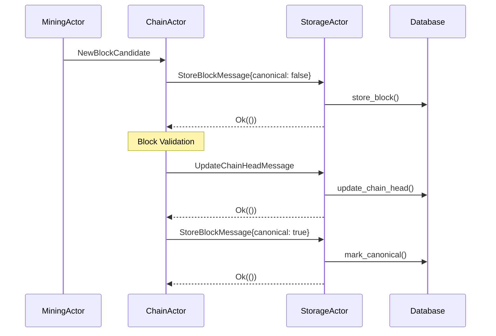

**Integration Implementation:**

```rust
impl StorageActor {
    /// Handle chain reorganization events from ChainActor
    pub async fn handle_chain_reorganization(
        &mut self,
        reorg_event: ChainReorganizationEvent,
    ) -> Result<(), StorageError> {
        info!("Processing chain reorganization from height {}", reorg_event.fork_point);

        let correlation_id = Uuid::new_v4();

        // Phase 1: Mark old canonical blocks as non-canonical
        for height in reorg_event.fork_point..reorg_event.old_chain_tip {
            if let Some(old_block_hash) = self.database.get_block_hash_by_height(height).await? {
                self.database.mark_block_non_canonical(&old_block_hash).await?;
                self.cache.invalidate_block(&old_block_hash).await;

                debug!("ChainReorg[{}]: Marked block {} at height {} as non-canonical",
                    correlation_id, old_block_hash, height);
            }
        }

        // Phase 2: Mark new canonical blocks
        for block_hash in &reorg_event.new_canonical_blocks {
            self.database.mark_block_canonical(block_hash).await?;

            // Warm cache with new canonical blocks
            if let Some(block) = self.database.get_block(block_hash).await? {
                self.cache.put_block(*block_hash, block).await;
            }

            debug!("ChainReorg[{}]: Marked block {} as canonical", correlation_id, block_hash);
        }

        // Phase 3: Update chain head
        let new_chain_head = BlockRef {
            hash: reorg_event.new_chain_tip_hash,
            number: reorg_event.new_chain_tip_height,
        };

        self.database.put_chain_head(&new_chain_head).await?;

        // Phase 4: Update indices for affected blocks
        self.indexing.write().unwrap()
            .rebuild_indices_for_height_range(
                reorg_event.fork_point,
                reorg_event.new_chain_tip_height
            ).await?;

        // Record reorganization metrics
        self.metrics.record_chain_reorganization(
            reorg_event.fork_point,
            reorg_event.new_chain_tip_height - reorg_event.fork_point,
        );

        info!("ChainReorg[{}]: Successfully processed reorganization", correlation_id);
        Ok(())
    }

    /// Provide chain validation data to ChainActor
    pub async fn get_validation_data(
        &self,
        block_hash: &Hash256,
    ) -> Result<BlockValidationData, StorageError> {
        // Retrieve block and its context
        let block = self.get_block(block_hash).await?
            .ok_or_else(|| StorageError::Database("Block not found".to_string()))?;

        let parent_hash = block.parent_hash;
        let parent_block = self.get_block(&parent_hash).await?;

        // Get recent block history for validation
        let recent_blocks = self.get_recent_block_history(block.slot, 10).await?;

        // Get difficulty history for AuxPoW validation
        let difficulty_history = self.get_difficulty_history_for_height(block.slot).await?;

        Ok(BlockValidationData {
            block,
            parent_block,
            recent_blocks,
            difficulty_history,
            chain_head: self.database.get_chain_head().await?,
        })
    }
}

/// Data structure for block validation
#[derive(Debug, Clone)]
pub struct BlockValidationData {
    pub block: AlysConsensusBlock,
    pub parent_block: Option<AlysConsensusBlock>,
    pub recent_blocks: Vec<AlysConsensusBlock>,
    pub difficulty_history: Vec<DifficultyEntry>,
    pub chain_head: Option<BlockRef>,
}

#[derive(Debug, Clone)]
pub struct ChainReorganizationEvent {
    pub fork_point: u64,
    pub old_chain_tip: u64,
    pub new_chain_tip_height: u64,
    pub new_chain_tip_hash: Hash256,
    pub new_canonical_blocks: Vec<Hash256>,
    pub correlation_id: Uuid,
}
```

### 10.2 Integration with Network Actor

The Storage Actor integrates with the Network Actor to provide block data for peer synchronization and handle incoming blocks from the network.

#### **Peer Synchronization Integration**

```rust
impl StorageActor {
    /// Handle peer block requests for synchronization
    pub async fn handle_peer_block_request(
        &mut self,
        request: PeerBlockRequest,
    ) -> Result<PeerBlockResponse, StorageError> {
        let correlation_id = request.correlation_id.unwrap_or_else(|| Uuid::new_v4());

        debug!("PeerBlockRequest[{}]: Peer {} requesting blocks {} to {}",
            correlation_id, request.peer_id, request.start_height, request.end_height);

        // Validate request parameters
        if request.start_height > request.end_height {
            return Err(StorageError::Database("Invalid block range".to_string()));
        }

        let max_blocks_per_request = 100; // Prevent abuse
        let requested_count = (request.end_height - request.start_height + 1) as usize;

        if requested_count > max_blocks_per_request {
            return Err(StorageError::Database("Request too large".to_string()));
        }

        // Retrieve blocks efficiently
        let mut blocks = Vec::new();
        let mut missing_blocks = Vec::new();

        for height in request.start_height..=request.end_height {
            match self.database.get_block_by_height(height).await? {
                Some(block) => {
                    blocks.push(NetworkBlock {
                        hash: block.block_hash().to_block_hash(),
                        height: block.slot,
                        data: block,
                        is_canonical: self.is_canonical_block(&block.block_hash().to_block_hash()).await?,
                    });
                }
                None => {
                    missing_blocks.push(height);
                }
            }
        }

        // Record peer serving metrics
        self.metrics.record_peer_blocks_served(request.peer_id.clone(), blocks.len());

        debug!("PeerBlockRequest[{}]: Serving {} blocks to peer {}, {} missing",
            correlation_id, blocks.len(), request.peer_id, missing_blocks.len());

        Ok(PeerBlockResponse {
            blocks,
            missing_blocks,
            chain_head: self.database.get_chain_head().await?,
            correlation_id: Some(correlation_id),
        })
    }

    /// Process incoming blocks from network peers
    pub async fn process_peer_blocks(
        &mut self,
        peer_blocks: PeerBlockAnnouncement,
    ) -> Result<BlockProcessingResult, StorageError> {
        let correlation_id = peer_blocks.correlation_id.unwrap_or_else(|| Uuid::new_v4());

        info!("PeerBlocks[{}]: Processing {} blocks from peer {}",
            correlation_id, peer_blocks.blocks.len(), peer_blocks.peer_id);

        let mut results = Vec::new();
        let mut successful_stores = 0;
        let mut duplicate_blocks = 0;
        let mut invalid_blocks = 0;

        for network_block in peer_blocks.blocks {
            let block_hash = network_block.hash;

            // Check if we already have this block
            if self.database.get_block(&block_hash).await?.is_some() {
                duplicate_blocks += 1;
                results.push(BlockProcessingStatus {
                    block_hash,
                    status: ProcessingStatus::Duplicate,
                    error: None,
                });
                continue;
            }

            // Validate block structure
            match self.validate_peer_block(&network_block).await {
                Ok(()) => {
                    // Store block (not necessarily canonical yet)
                    match self.store_block(network_block.data.clone(), false).await {
                        Ok(()) => {
                            successful_stores += 1;
                            results.push(BlockProcessingStatus {
                                block_hash,
                                status: ProcessingStatus::Stored,
                                error: None,
                            });
                        }
                        Err(e) => {
                            error!("PeerBlocks[{}]: Failed to store block {}: {}",
                                correlation_id, block_hash, e);
                            results.push(BlockProcessingStatus {
                                block_hash,
                                status: ProcessingStatus::Failed,
                                error: Some(e.to_string()),
                            });
                        }
                    }
                }
                Err(validation_error) => {
                    invalid_blocks += 1;
                    warn!("PeerBlocks[{}]: Invalid block {} from peer {}: {}",
                        correlation_id, block_hash, peer_blocks.peer_id, validation_error);

                    results.push(BlockProcessingStatus {
                        block_hash,
                        status: ProcessingStatus::Invalid,
                        error: Some(validation_error.to_string()),
                    });
                }
            }
        }

        // Record processing metrics
        self.metrics.record_peer_block_processing(
            peer_blocks.peer_id.clone(),
            successful_stores,
            duplicate_blocks,
            invalid_blocks,
        );

        info!("PeerBlocks[{}]: Processed peer blocks - {} stored, {} duplicates, {} invalid",
            correlation_id, successful_stores, duplicate_blocks, invalid_blocks);

        Ok(BlockProcessingResult {
            total_blocks: peer_blocks.blocks.len(),
            successful_stores,
            duplicate_blocks,
            invalid_blocks,
            processing_details: results,
            correlation_id: Some(correlation_id),
        })
    }

    async fn validate_peer_block(&self, network_block: &NetworkBlock) -> Result<(), StorageError> {
        let block = &network_block.data;

        // Basic structural validation
        if block.slot != network_block.height {
            return Err(StorageError::Database("Height mismatch".to_string()));
        }

        if block.block_hash().to_block_hash() != network_block.hash {
            return Err(StorageError::Database("Hash mismatch".to_string()));
        }

        // Check if block is not too far in the future
        let current_height = self.database.get_chain_head().await?
            .map(|head| head.number)
            .unwrap_or(0);

        if network_block.height > current_height + 1000 {
            return Err(StorageError::Database("Block too far ahead".to_string()));
        }

        // Additional validation could include:
        // - Parent hash validation
        // - Timestamp validation
        // - Basic PoW validation for AuxPoW blocks

        Ok(())
    }
}

#[derive(Debug, Clone)]
pub struct PeerBlockRequest {
    pub peer_id: String,
    pub start_height: u64,
    pub end_height: u64,
    pub correlation_id: Option<Uuid>,
}

#[derive(Debug, Clone)]
pub struct PeerBlockResponse {
    pub blocks: Vec<NetworkBlock>,
    pub missing_blocks: Vec<u64>,
    pub chain_head: Option<BlockRef>,
    pub correlation_id: Option<Uuid>,
}

#[derive(Debug, Clone)]
pub struct NetworkBlock {
    pub hash: Hash256,
    pub height: u64,
    pub data: AlysConsensusBlock,
    pub is_canonical: bool,
}
```

### 10.3 Integration with Execution Actor

The Storage Actor integrates with the Execution Actor to store transaction receipts, event logs, and execution state changes.

#### **Execution Result Storage**

```rust
impl StorageActor {
    /// Store execution results from Execution Actor
    pub async fn store_execution_results(
        &mut self,
        execution_results: ExecutionResults,
    ) -> Result<(), StorageError> {
        let correlation_id = execution_results.correlation_id.unwrap_or_else(|| Uuid::new_v4());

        info!("ExecutionResults[{}]: Storing execution results for {} transactions in block {}",
            correlation_id, execution_results.receipts.len(), execution_results.block_hash);

        // Begin transaction for atomic storage
        self.database.begin_batch_transaction().await?;

        // Store all transaction receipts
        for receipt in &execution_results.receipts {
            self.database.put_receipt(receipt, &execution_results.block_hash).await?;

            // Cache recent receipts
            self.cache.put_receipt(receipt.transaction_hash, receipt.clone()).await;
        }

        // Store event logs with indexing
        for log in &execution_results.logs {
            self.database.put_log(log, &execution_results.block_hash).await?;

            // Update log indices for efficient querying
            self.indexing.write().unwrap()
                .index_log(log, execution_results.block_number).await?;
        }

        // Store state changes
        if !execution_results.state_changes.is_empty() {
            let state_operations: Vec<WriteOperation> = execution_results.state_changes
                .into_iter()
                .map(|(key, value)| {
                    if let Some(val) = value {
                        WriteOperation::Put { key, value: val }
                    } else {
                        WriteOperation::Delete { key }
                    }
                })
                .collect();

            self.database.batch_write_state_operations(&state_operations).await?;

            // Invalidate affected cache entries
            let state_keys: Vec<_> = state_operations
                .iter()
                .filter_map(|op| match op {
                    WriteOperation::Put { key, .. } | WriteOperation::Delete { key } => Some(key.clone()),
                    _ => None,
                })
                .collect();

            self.cache.invalidate_state(&state_keys).await;
        }

        // Commit all changes atomically
        self.database.commit_batch_transaction().await?;

        // Record metrics
        self.metrics.record_execution_results_stored(
            execution_results.receipts.len(),
            execution_results.logs.len(),
            execution_results.state_changes.len(),
        );

        info!("ExecutionResults[{}]: Successfully stored execution results", correlation_id);
        Ok(())
    }

    /// Retrieve execution history for analysis
    pub async fn get_execution_history(
        &self,
        query: ExecutionHistoryQuery,
    ) -> Result<ExecutionHistoryResponse, StorageError> {
        let correlation_id = query.correlation_id.unwrap_or_else(|| Uuid::new_v4());

        debug!("ExecutionHistory[{}]: Querying execution history", correlation_id);

        let mut receipts = Vec::new();
        let mut logs = Vec::new();

        match query.query_type {
            ExecutionQueryType::ByBlockRange { start_height, end_height } => {
                // Query receipts by block range
                for height in start_height..=end_height {
                    let block_receipts = self.database.get_receipts_by_height(height).await?;
                    receipts.extend(block_receipts);

                    let block_logs = self.database.get_logs_by_height(height).await?;
                    logs.extend(block_logs);
                }
            }
            ExecutionQueryType::ByAddress { address } => {
                // Use indexing for efficient address-based queries
                let address_indices = self.indexing.read().unwrap()
                    .get_address_transactions(&address, query.limit).await?;

                for addr_index in address_indices {
                    if let Some(receipt) = self.database.get_receipt(&addr_index.transaction_hash).await? {
                        receipts.push(receipt);
                    }
                }

                // Get logs for this address
                let address_logs = self.indexing.read().unwrap()
                    .get_logs_by_address(&address, query.limit).await?;
                logs.extend(address_logs);
            }
            ExecutionQueryType::ByTransactionHash { tx_hash } => {
                if let Some(receipt) = self.database.get_receipt(&tx_hash).await? {
                    receipts.push(receipt);
                }

                let tx_logs = self.database.get_logs_by_transaction(&tx_hash).await?;
                logs.extend(tx_logs);
            }
        }

        // Apply limit if specified
        if let Some(limit) = query.limit {
            receipts.truncate(limit);
            logs.truncate(limit);
        }

        Ok(ExecutionHistoryResponse {
            receipts,
            logs,
            total_results: receipts.len() + logs.len(),
            correlation_id: Some(correlation_id),
        })
    }
}

#[derive(Debug, Clone)]
pub struct ExecutionResults {
    pub block_hash: Hash256,
    pub block_number: u64,
    pub receipts: Vec<TransactionReceipt>,
    pub logs: Vec<EventLog>,
    pub state_changes: HashMap<Vec<u8>, Option<Vec<u8>>>, // key -> value (None = deletion)
    pub correlation_id: Option<Uuid>,
}

#[derive(Debug, Clone)]
pub struct ExecutionHistoryQuery {
    pub query_type: ExecutionQueryType,
    pub limit: Option<usize>,
    pub correlation_id: Option<Uuid>,
}

#[derive(Debug, Clone)]
pub enum ExecutionQueryType {
    ByBlockRange { start_height: u64, end_height: u64 },
    ByAddress { address: Address },
    ByTransactionHash { tx_hash: H256 },
}
```

# Phase 4: Production Excellence & Operations Mastery

## 11. Production Deployment & Operations - Complete Production Lifecycle

### 11.1 Production Deployment Strategy

#### **Multi-Environment Deployment Architecture**

The Storage Actor supports sophisticated deployment strategies for different environments:

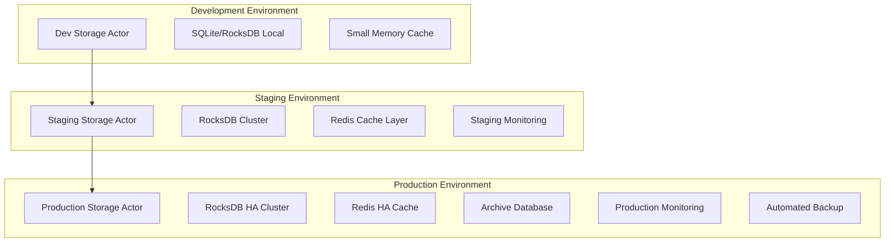

#### **Production Configuration Management**

```rust
/// Production-optimized storage configuration
#[derive(Debug, Clone, Deserialize)]
pub struct ProductionStorageConfig {
    pub environment: Environment,
    pub database: ProductionDatabaseConfig,
    pub cache: ProductionCacheConfig,
    pub performance: PerformanceConfig,
    pub monitoring: MonitoringConfig,
    pub backup: BackupConfig,
    pub security: SecurityConfig,
}

#[derive(Debug, Clone, Deserialize)]
pub struct ProductionDatabaseConfig {
    pub primary_path: String,
    pub archive_path: Option<String>,
    pub backup_path: String,

    // High-performance settings
    pub cache_size_gb: usize,
    pub write_buffer_size_mb: usize,
    pub max_open_files: u32,
    pub compression_type: CompressionType,
    pub compaction_style: CompactionStyle,

    // Reliability settings
    pub enable_wal: bool,
    pub sync_writes: bool,
    pub backup_interval_hours: u32,
    pub snapshot_interval_hours: u32,

    // Monitoring settings
    pub enable_statistics: bool,
    pub stats_dump_period_sec: u32,
}

#[derive(Debug, Clone, Deserialize)]
pub struct ProductionCacheConfig {
    // Memory allocation (in MB)
    pub block_cache_mb: usize,
    pub state_cache_mb: usize,
    pub receipt_cache_mb: usize,

    // Performance tuning
    pub enable_adaptive_sizing: bool,
    pub eviction_policy: EvictionPolicy,
    pub prefetch_enabled: bool,

    // External cache integration
    pub redis_cluster: Option<RedisConfig>,
    pub distributed_cache_enabled: bool,
}

impl ProductionStorageConfig {
    pub fn for_environment(env: Environment) -> Self {
        match env {
            Environment::Development => Self::development_config(),
            Environment::Staging => Self::staging_config(),
            Environment::Production => Self::production_config(),
        }
    }

    fn production_config() -> Self {
        Self {
            environment: Environment::Production,
            database: ProductionDatabaseConfig {
                primary_path: "/data/alys/storage/main".to_string(),
                archive_path: Some("/data/alys/storage/archive".to_string()),
                backup_path: "/backup/alys/storage".to_string(),

                // High-performance settings for production
                cache_size_gb: 8, // 8GB block cache
                write_buffer_size_mb: 256, // 256MB write buffer
                max_open_files: 10000,
                compression_type: CompressionType::Lz4,
                compaction_style: CompactionStyle::Level,

                // Production reliability
                enable_wal: true,
                sync_writes: true,
                backup_interval_hours: 6,
                snapshot_interval_hours: 24,

                // Monitoring enabled
                enable_statistics: true,
                stats_dump_period_sec: 300,
            },
            cache: ProductionCacheConfig {
                block_cache_mb: 2048, // 2GB block cache
                state_cache_mb: 1024, // 1GB state cache
                receipt_cache_mb: 512, // 512MB receipt cache

                enable_adaptive_sizing: true,
                eviction_policy: EvictionPolicy::LRU,
                prefetch_enabled: true,

                redis_cluster: Some(RedisConfig {
                    nodes: vec![
                        "redis-1.alys.internal:6379".to_string(),
                        "redis-2.alys.internal:6379".to_string(),
                        "redis-3.alys.internal:6379".to_string(),
                    ],
                    cluster_enabled: true,
                    password: std::env::var("REDIS_PASSWORD").ok(),
                }),
                distributed_cache_enabled: true,
            },
            performance: PerformanceConfig {
                max_concurrent_operations: 10000,
                batch_size_optimization: true,
                async_writes_enabled: true,
                read_ahead_enabled: true,
            },
            monitoring: MonitoringConfig {
                prometheus_endpoint: "0.0.0.0:9090".to_string(),
                log_level: "info".to_string(),
                metrics_interval_sec: 10,
                health_check_enabled: true,
                distributed_tracing: true,
            },
            backup: BackupConfig {
                enabled: true,
                s3_bucket: "alys-production-backups".to_string(),
                retention_days: 30,
                compression_enabled: true,
                encryption_enabled: true,
            },
            security: SecurityConfig {
                tls_enabled: true,
                cert_path: "/etc/ssl/alys/storage.crt".to_string(),
                key_path: "/etc/ssl/alys/storage.key".to_string(),
                access_control_enabled: true,
            },
        }
    }
}
```

#### **Production Deployment Scripts**

```bash
#!/bin/bash
# Production deployment script for Storage Actor

set -euo pipefail

# Configuration
ENVIRONMENT=${1:-production}
CONFIG_FILE="/etc/alys/storage-${ENVIRONMENT}.toml"
SERVICE_NAME="alys-storage-${ENVIRONMENT}"
DATA_DIR="/data/alys/storage"
BACKUP_DIR="/backup/alys/storage"

# Logging setup
LOG_FILE="/var/log/alys/deployment-$(date +%Y%m%d_%H%M%S).log"
exec 1> >(tee -a "${LOG_FILE}")
exec 2> >(tee -a "${LOG_FILE}" >&2)

echo "=== Alys Storage Actor Production Deployment ==="
echo "Environment: ${ENVIRONMENT}"
echo "Config: ${CONFIG_FILE}"
echo "Timestamp: $(date)"

# Pre-deployment validation
validate_deployment() {
    echo "Validating deployment prerequisites..."

    # Check system resources
    local available_memory=$(free -g | awk '/^Mem:/{print $7}')
    if [ "${available_memory}" -lt 10 ]; then
        echo "ERROR: Insufficient memory. Need at least 10GB available, got ${available_memory}GB"
        exit 1
    fi

    # Check disk space
    local available_disk=$(df -BG "${DATA_DIR}" | awk 'NR==2{print $4}' | tr -d 'G')
    if [ "${available_disk}" -lt 100 ]; then
        echo "ERROR: Insufficient disk space. Need at least 100GB available, got ${available_disk}GB"
        exit 1
    fi

    # Validate configuration
    if ! /opt/alys/bin/alys-storage validate-config --config "${CONFIG_FILE}"; then
        echo "ERROR: Configuration validation failed"
        exit 1
    fi

    echo "Pre-deployment validation passed"
}

# Database preparation and migration
prepare_database() {
    echo "Preparing database for deployment..."

    # Create data directories
    mkdir -p "${DATA_DIR}"/{main,archive,snapshots}
    mkdir -p "${BACKUP_DIR}"

    # Set proper permissions
    chown -R alys:alys "${DATA_DIR}" "${BACKUP_DIR}"
    chmod -R 750 "${DATA_DIR}" "${BACKUP_DIR}"

    # Check for existing database and perform migration if needed
    if [ -d "${DATA_DIR}/main" ] && [ "$(ls -A "${DATA_DIR}/main")" ]; then
        echo "Existing database found, checking for migration needs..."

        # Run database migration tool
        /opt/alys/bin/alys-storage migrate \
            --config "${CONFIG_FILE}" \
            --data-dir "${DATA_DIR}/main" \
            --backup-before-migration

        if [ $? -ne 0 ]; then
            echo "ERROR: Database migration failed"
            exit 1
        fi
    else
        echo "No existing database, fresh installation"
    fi

    # Initialize database if needed
    /opt/alys/bin/alys-storage init-db --config "${CONFIG_FILE}"
}

# Service deployment
deploy_service() {
    echo "Deploying Storage Actor service..."

    # Stop existing service gracefully
    if systemctl is-active --quiet "${SERVICE_NAME}"; then
        echo "Stopping existing service..."
        systemctl stop "${SERVICE_NAME}"

        # Wait for graceful shutdown
        local timeout=30
        while systemctl is-active --quiet "${SERVICE_NAME}" && [ ${timeout} -gt 0 ]; do
            sleep 1
            timeout=$((timeout - 1))
        done

        if systemctl is-active --quiet "${SERVICE_NAME}"; then
            echo "Force stopping service..."
            systemctl kill "${SERVICE_NAME}"
        fi
    fi

    # Install/update binary
    cp /tmp/alys-storage-new /opt/alys/bin/alys-storage
    chown alys:alys /opt/alys/bin/alys-storage
    chmod 755 /opt/alys/bin/alys-storage

    # Update service configuration
    cat > "/etc/systemd/system/${SERVICE_NAME}.service" << EOF
[Unit]
Description=Alys Storage Actor (${ENVIRONMENT})
After=network.target
Wants=network-online.target

[Service]
Type=exec
User=alys
Group=alys
WorkingDirectory=/opt/alys
ExecStart=/opt/alys/bin/alys-storage --config ${CONFIG_FILE}
ExecReload=/bin/kill -HUP \$MAINPID
Restart=always
RestartSec=5
TimeoutStopSec=30

# Resource limits
LimitNOFILE=65536
MemoryMax=16G

# Security settings
NoNewPrivileges=yes
PrivateTmp=yes
ProtectSystem=strict
ReadWritePaths=${DATA_DIR} ${BACKUP_DIR} /var/log/alys

[Install]
WantedBy=multi-user.target
EOF

    # Reload systemd and enable service
    systemctl daemon-reload
    systemctl enable "${SERVICE_NAME}"
}

# Health checks
perform_health_checks() {
    echo "Performing post-deployment health checks..."

    # Start service
    systemctl start "${SERVICE_NAME}"

    # Wait for service to start
    local timeout=60
    while ! systemctl is-active --quiet "${SERVICE_NAME}" && [ ${timeout} -gt 0 ]; do
        sleep 1
        timeout=$((timeout - 1))
    done

    if ! systemctl is-active --quiet "${SERVICE_NAME}"; then
        echo "ERROR: Service failed to start"
        journalctl -u "${SERVICE_NAME}" --since="5 minutes ago"
        exit 1
    fi

    # Wait for health endpoint
    local health_url="http://localhost:8080/health"
    timeout=60

    while [ ${timeout} -gt 0 ]; do
        if curl -f -s "${health_url}" > /dev/null; then
            break
        fi
        sleep 1
        timeout=$((timeout - 1))
    done

    if [ ${timeout} -eq 0 ]; then
        echo "ERROR: Health check endpoint not responding"
        exit 1
    fi

    # Comprehensive health check
    local health_response=$(curl -s "${health_url}")
    if ! echo "${health_response}" | jq -e '.status == "healthy"' > /dev/null; then
        echo "ERROR: Service health check failed"
        echo "Health response: ${health_response}"
        exit 1
    fi

    # Performance validation
    echo "Running performance validation..."
    /opt/alys/bin/alys-storage benchmark \
        --config "${CONFIG_FILE}" \
        --quick-test \
        --min-throughput 1000

    echo "All health checks passed"
}

# Backup current state before deployment
backup_current_state() {
    if [ -d "${DATA_DIR}/main" ]; then
        echo "Creating pre-deployment backup..."
        local backup_name="pre-deployment-$(date +%Y%m%d_%H%M%S)"

        /opt/alys/bin/alys-storage backup \
            --config "${CONFIG_FILE}" \
            --backup-name "${backup_name}" \
            --compress \
            --encrypt

        echo "Backup created: ${backup_name}"
    fi
}

# Main deployment flow
main() {
    echo "Starting production deployment..."

    # Deployment steps
    validate_deployment
    backup_current_state
    prepare_database
    deploy_service
    perform_health_checks

    echo "=== Deployment completed successfully ==="
    echo "Service: ${SERVICE_NAME}"
    echo "Status: $(systemctl is-active "${SERVICE_NAME}")"
    echo "Health: $(curl -s http://localhost:8080/health | jq -r '.status')"
    echo "Timestamp: $(date)"
}

# Execute main function
main "$@"
```

---

## 12. Advanced Monitoring & Observability - Comprehensive Production Monitoring

### 12.1 Production Monitoring Architecture

#### **Multi-Dimensional Monitoring System**

The Storage Actor implements comprehensive monitoring across multiple dimensions:

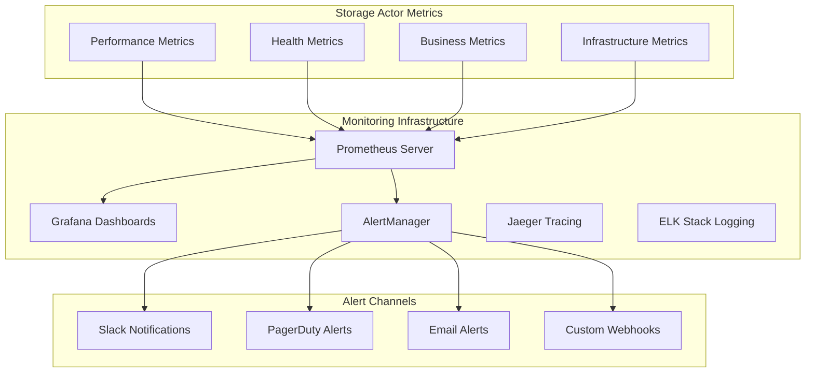

#### **Comprehensive Metrics Collection**

```rust
/// Production-grade metrics system
pub struct ProductionMetricsSystem {
    prometheus_registry: Registry,
    custom_metrics: CustomMetricsCollector,
    business_metrics: BusinessMetricsCollector,
    sli_calculator: SLICalculator,
    anomaly_detector: AnomalyDetector,
}

impl ProductionMetricsSystem {
    pub async fn initialize() -> Result<Self, MetricsError> {
        let prometheus_registry = Registry::new();

        // Register comprehensive metric families
        Self::register_performance_metrics(&prometheus_registry)?;
        Self::register_reliability_metrics(&prometheus_registry)?;
        Self::register_business_metrics(&prometheus_registry)?;
        Self::register_infrastructure_metrics(&prometheus_registry)?;

        let custom_metrics = CustomMetricsCollector::new();
        let business_metrics = BusinessMetricsCollector::new();
        let sli_calculator = SLICalculator::new();
        let anomaly_detector = AnomalyDetector::new();

        Ok(Self {
            prometheus_registry,
            custom_metrics,
            business_metrics,
            sli_calculator,
            anomaly_detector,
        })
    }

    fn register_performance_metrics(registry: &Registry) -> Result<(), MetricsError> {
        // Throughput metrics
        let block_storage_throughput = register_histogram_with_registry!(
            histogram_opts!(
                "storage_block_storage_throughput",
                "Block storage operations per second",
                exponential_buckets(1.0, 2.0, 16)?
            ),
            registry
        )?;

        let query_throughput = register_histogram_with_registry!(
            histogram_opts!(
                "storage_query_throughput",
                "Query operations per second",
                exponential_buckets(10.0, 2.0, 16)?
            ),
            registry
        )?;

        // Latency metrics (detailed percentiles)
        let block_storage_latency = register_histogram_with_registry!(
            histogram_opts!(
                "storage_block_storage_duration_seconds",
                "Time taken to store a block",
                vec![0.001, 0.002, 0.005, 0.01, 0.02, 0.05, 0.1, 0.2, 0.5, 1.0, 2.0, 5.0, 10.0]
            ),
            registry
        )?;

        let query_latency = register_histogram_with_registry!(
            histogram_opts!(
                "storage_query_duration_seconds",
                "Time taken to process queries",
                vec![0.0001, 0.0005, 0.001, 0.005, 0.01, 0.05, 0.1, 0.5, 1.0]
            ),
            registry
        )?;

        // Cache performance metrics
        let cache_hit_rate = register_gauge_with_registry!(
            opts!("storage_cache_hit_rate", "Cache hit rate (0.0 to 1.0)"),
            registry
        )?;

        let cache_memory_efficiency = register_gauge_with_registry!(
            opts!("storage_cache_memory_efficiency", "Memory efficiency of cache system"),
            registry
        )?;

        Ok(())
    }

    fn register_reliability_metrics(registry: &Registry) -> Result<(), MetricsError> {
        // Error rates
        let storage_errors = register_counter_vec_with_registry!(
            opts!("storage_errors_total", "Total storage errors by type"),
            &["error_type", "component"],
            registry
        )?;

        let recovery_events = register_counter_vec_with_registry!(
            opts!("storage_recovery_events_total", "Storage recovery events"),
            &["recovery_type", "success"],
            registry
        )?;

        // Availability metrics
        let uptime_seconds = register_gauge_with_registry!(
            opts!("storage_uptime_seconds", "Storage actor uptime in seconds"),
            registry
        )?;

        let health_score = register_gauge_with_registry!(
            opts!("storage_health_score", "Overall health score (0.0 to 1.0)"),
            registry
        )?;

        // Data integrity metrics
        let data_integrity_checks = register_counter_with_registry!(
            opts!("storage_data_integrity_checks_total", "Total data integrity checks"),
            registry
        )?;

        let data_corruption_detected = register_counter_with_registry!(
            opts!("storage_data_corruption_detected_total", "Data corruption events detected"),
            registry
        )?;

        Ok(())
    }

    fn register_business_metrics(registry: &Registry) -> Result<(), MetricsError> {
        // Blockchain metrics
        let blocks_stored_total = register_counter_with_registry!(
            opts!("storage_blocks_stored_total", "Total blocks stored"),
            registry
        )?;

        let chain_head_height = register_gauge_with_registry!(
            opts!("storage_chain_head_height", "Current chain head height"),
            registry
        )?;

        let blockchain_size_bytes = register_gauge_with_registry!(
            opts!("storage_blockchain_size_bytes", "Total blockchain size in bytes"),
            registry
        )?;

        // Transaction metrics
        let transactions_stored = register_counter_with_registry!(
            opts!("storage_transactions_stored_total", "Total transactions stored"),
            registry
        )?;

        let receipts_stored = register_counter_with_registry!(
            opts!("storage_receipts_stored_total", "Total transaction receipts stored"),
            registry
        )?;

        // State metrics
        let state_size_bytes = register_gauge_with_registry!(
            opts!("storage_state_size_bytes", "Total state size in bytes"),
            registry
        )?;

        let state_updates_total = register_counter_with_registry!(
            opts!("storage_state_updates_total", "Total state updates"),
            registry
        )?;

        Ok(())
    }

    pub async fn collect_comprehensive_metrics(&self, storage_actor: &StorageActor) -> MetricsSnapshot {
        let start_time = Instant::now();

        // Collect performance metrics
        let performance_metrics = self.collect_performance_metrics(storage_actor).await;

        // Collect reliability metrics
        let reliability_metrics = self.collect_reliability_metrics(storage_actor).await;

        // Collect business metrics
        let business_metrics = self.business_metrics.collect(storage_actor).await;

        // Calculate SLIs
        let sli_metrics = self.sli_calculator.calculate_current_slis(storage_actor).await;

        // Check for anomalies
        let anomalies = self.anomaly_detector.detect_anomalies(&performance_metrics).await;

        let collection_duration = start_time.elapsed();

        MetricsSnapshot {
            performance_metrics,
            reliability_metrics,
            business_metrics,
            sli_metrics,
            anomalies,
            collection_duration,
            timestamp: SystemTime::now(),
        }
    }
}

/// Service Level Indicator (SLI) Calculator
pub struct SLICalculator {
    availability_tracker: AvailabilityTracker,
    latency_tracker: LatencyTracker,
    throughput_tracker: ThroughputTracker,
    error_rate_tracker: ErrorRateTracker,
}

impl SLICalculator {
    pub async fn calculate_current_slis(&self, storage_actor: &StorageActor) -> SLIMetrics {
        let calculation_window = Duration::from_minutes(5);

        // Calculate availability SLI
        let availability_sli = self.availability_tracker
            .calculate_availability(calculation_window).await;

        // Calculate latency SLI (P95 < 100ms)
        let latency_p95 = storage_actor.metrics.get_latency_percentile(0.95, calculation_window).await;
        let latency_sli = if latency_p95 < Duration::from_millis(100) { 1.0 } else { 0.0 };

        // Calculate throughput SLI (> 1000 ops/sec)
        let current_throughput = storage_actor.metrics.get_current_throughput().await;
        let throughput_sli = if current_throughput > 1000.0 { 1.0 } else { current_throughput / 1000.0 };

        // Calculate error rate SLI (< 0.1%)
        let error_rate = self.error_rate_tracker.get_error_rate(calculation_window).await;
        let error_rate_sli = if error_rate < 0.001 { 1.0 } else { (0.001 - error_rate) / 0.001 };

        SLIMetrics {
            availability: availability_sli,
            latency: latency_sli,
            throughput: throughput_sli,
            error_rate: error_rate_sli,
            overall_sli: (availability_sli + latency_sli + throughput_sli + error_rate_sli) / 4.0,
            calculation_window,
            timestamp: SystemTime::now(),
        }
    }
}

#[derive(Debug, Clone)]
pub struct SLIMetrics {
    pub availability: f64,      // 0.0 to 1.0
    pub latency: f64,          // 0.0 to 1.0
    pub throughput: f64,       // 0.0 to 1.0
    pub error_rate: f64,       // 0.0 to 1.0
    pub overall_sli: f64,      // 0.0 to 1.0
    pub calculation_window: Duration,
    pub timestamp: SystemTime,
}
```

### 12.2 Advanced Alert Management

#### **Intelligent Alerting System**

```rust
/// Production alert management with intelligent routing
pub struct IntelligentAlertManager {
    alert_rules: Vec<SmartAlertRule>,
    escalation_policies: Vec<EscalationPolicy>,
    notification_channels: HashMap<String, NotificationChannel>,
    alert_correlation: AlertCorrelationEngine,
    alert_suppression: AlertSuppressionEngine,
    alert_history: Arc<RwLock<AlertHistory>>,
}

impl IntelligentAlertManager {
    pub async fn process_metrics_and_alert(&self, metrics: &MetricsSnapshot) {
        // Step 1: Evaluate all alert rules
        let triggered_alerts = self.evaluate_alert_rules(metrics).await;

        // Step 2: Apply correlation to reduce noise
        let correlated_alerts = self.alert_correlation
            .correlate_alerts(triggered_alerts).await;

        // Step 3: Apply suppression rules
        let final_alerts = self.alert_suppression
            .apply_suppression(correlated_alerts).await;

        // Step 4: Route alerts through escalation policies
        for alert in final_alerts {
            self.route_alert(alert).await;
        }
    }

    async fn evaluate_alert_rules(&self, metrics: &MetricsSnapshot) -> Vec<Alert> {
        let mut triggered_alerts = Vec::new();

        for rule in &self.alert_rules {
            if let Some(alert) = rule.evaluate(metrics).await {
                triggered_alerts.push(alert);
            }
        }

        triggered_alerts
    }

    async fn route_alert(&self, alert: Alert) {
        // Determine escalation policy
        let policy = self.get_escalation_policy(&alert);

        // Record alert
        self.record_alert(&alert).await;

        // Start escalation chain
        self.execute_escalation_policy(&alert, &policy).await;
    }

    async fn execute_escalation_policy(&self, alert: &Alert, policy: &EscalationPolicy) {
        for (step_index, step) in policy.steps.iter().enumerate() {
            let should_escalate = if step_index == 0 {
                true // Always execute first step
            } else {
                // Check if previous step resolved the issue
                !self.is_alert_resolved(alert).await
            };

            if should_escalate {
                // Wait for escalation delay
                if step.delay > Duration::ZERO {
                    tokio::time::sleep(step.delay).await;
                }

                // Send notifications for this step
                for channel_name in &step.notification_channels {
                    if let Some(channel) = self.notification_channels.get(channel_name) {
                        self.send_notification(alert, channel).await;
                    }
                }

                // Execute automated actions if any
                for action in &step.automated_actions {
                    self.execute_automated_action(alert, action).await;
                }
            } else {
                info!("Alert {} resolved, skipping escalation step {}", alert.id, step_index);
                break;
            }
        }
    }
}

/// Smart alert rules with machine learning-based thresholds
#[derive(Debug, Clone)]
pub struct SmartAlertRule {
    pub name: String,
    pub condition: AlertCondition,
    pub adaptive_threshold: AdaptiveThreshold,
    pub severity_calculator: SeverityCalculator,
    pub context_enricher: ContextEnricher,
}

impl SmartAlertRule {
    pub async fn evaluate(&self, metrics: &MetricsSnapshot) -> Option<Alert> {
        // Get current threshold (may be ML-adjusted)
        let current_threshold = self.adaptive_threshold.get_current_threshold().await;

        // Evaluate condition with adaptive threshold
        let condition_met = self.condition.evaluate_with_threshold(metrics, current_threshold);

        if condition_met {
            // Calculate dynamic severity
            let severity = self.severity_calculator.calculate_severity(metrics, current_threshold).await;

            // Enrich with contextual information
            let context = self.context_enricher.enrich_context(metrics).await;

            Some(Alert {
                id: Uuid::new_v4(),
                rule_name: self.name.clone(),
                severity,
                message: self.generate_message(metrics, &context),
                context,
                timestamp: SystemTime::now(),
                correlation_key: self.generate_correlation_key(metrics),
            })
        } else {
            None
        }
    }

    fn generate_correlation_key(&self, metrics: &MetricsSnapshot) -> String {
        // Generate key for alert correlation
        format!("{}-{}-{}",
            self.name,
            metrics.performance_metrics.primary_component,
            metrics.timestamp.duration_since(SystemTime::UNIX_EPOCH)
                .unwrap_or_default().as_secs() / 300 // 5-minute windows
        )
    }
}

/// Adaptive threshold system using machine learning
pub struct AdaptiveThreshold {
    base_threshold: f64,
    ml_model: MLThresholdModel,
    adaptation_rate: f64,
    min_threshold: f64,
    max_threshold: f64,
    last_update: SystemTime,
}

impl AdaptiveThreshold {
    pub async fn get_current_threshold(&self) -> f64 {
        // Get ML-predicted threshold
        let predicted_threshold = self.ml_model.predict_threshold().await;

        // Apply adaptation with bounds
        let adapted_threshold = self.base_threshold +
            (predicted_threshold - self.base_threshold) * self.adaptation_rate;

        // Ensure within bounds
        adapted_threshold.clamp(self.min_threshold, self.max_threshold)
    }

    pub async fn update_from_feedback(&mut self, metrics: &MetricsSnapshot, alert_outcome: AlertOutcome) {
        // Update ML model with feedback
        self.ml_model.update_with_feedback(metrics, alert_outcome).await;

        // Adjust adaptation rate based on accuracy
        let accuracy = self.ml_model.get_recent_accuracy().await;
        if accuracy > 0.9 {
            self.adaptation_rate = (self.adaptation_rate * 1.05).min(1.0);
        } else if accuracy < 0.7 {
            self.adaptation_rate = (self.adaptation_rate * 0.95).max(0.1);
        }

        self.last_update = SystemTime::now();
    }
}

/// Alert correlation engine to reduce noise
pub struct AlertCorrelationEngine {
    correlation_window: Duration,
    correlation_rules: Vec<CorrelationRule>,
    active_correlations: HashMap<String, AlertCorrelation>,
}

impl AlertCorrelationEngine {
    pub async fn correlate_alerts(&self, alerts: Vec<Alert>) -> Vec<CorrelatedAlert> {
        let mut correlated_alerts = Vec::new();
        let mut standalone_alerts = Vec::new();

        // Group alerts by correlation key
        let mut alert_groups: HashMap<String, Vec<Alert>> = HashMap::new();
        for alert in alerts {
            alert_groups.entry(alert.correlation_key.clone())
                .or_default()
                .push(alert);
        }

        // Process each group
        for (correlation_key, group_alerts) in alert_groups {
            if group_alerts.len() > 1 {
                // Create correlated alert
                let correlated = self.create_correlated_alert(correlation_key, group_alerts).await;
                correlated_alerts.push(correlated);
            } else {
                // Standalone alert
                standalone_alerts.extend(group_alerts.into_iter().map(CorrelatedAlert::Standalone));
            }
        }

        // Combine results
        correlated_alerts.extend(standalone_alerts);
        correlated_alerts
    }

    async fn create_correlated_alert(&self, correlation_key: String, alerts: Vec<Alert>) -> CorrelatedAlert {
        let primary_alert = alerts.iter()
            .max_by_key(|a| a.severity as u8)
            .unwrap()
            .clone();

        let related_alerts = alerts.into_iter()
            .filter(|a| a.id != primary_alert.id)
            .collect();

        CorrelatedAlert::Correlated {
            correlation_key,
            primary_alert,
            related_alerts,
            correlation_confidence: 0.85, // Could be ML-calculated
        }
    }
}

#[derive(Debug, Clone)]
pub enum CorrelatedAlert {
    Standalone(Alert),
    Correlated {
        correlation_key: String,
        primary_alert: Alert,
        related_alerts: Vec<Alert>,
        correlation_confidence: f64,
    },
}
```

### 12.3 Distributed Tracing Integration

#### **Comprehensive Request Tracing**

```rust
/// Distributed tracing system for Storage Actor
pub struct StorageActorTracing {
    tracer: Tracer,
    span_processor: BatchSpanProcessor,
    trace_sampler: AdaptiveSampler,
    context_propagator: TraceContextPropagator,
}

impl StorageActorTracing {
    pub fn initialize() -> Result<Self, TracingError> {
        // Initialize OpenTelemetry tracer
        let tracer = opentelemetry_jaeger::new_pipeline()
            .with_service_name("alys-storage-actor")
            .with_version(env!("CARGO_PKG_VERSION"))
            .with_tags(vec![
                ("environment", std::env::var("ENVIRONMENT").unwrap_or_else(|_| "unknown".to_string())),
                ("component", "storage".to_string()),
            ])
            .install_batch(opentelemetry::runtime::Tokio)?;

        let span_processor = BatchSpanProcessor::builder(
            opentelemetry_jaeger::JaegerTraceExporter::new(
                opentelemetry_jaeger::Config::default()
            )?
        )
        .with_max_export_batch_size(512)
        .with_export_timeout(Duration::from_secs(2))
        .build();

        let trace_sampler = AdaptiveSampler::new(0.1); // Start with 10% sampling
        let context_propagator = TraceContextPropagator::new();

        Ok(Self {
            tracer,
            span_processor,
            trace_sampler,
            context_propagator,
        })
    }

    pub fn create_message_span<T>(&self, message_name: &str, correlation_id: Option<Uuid>) -> MessageSpan
    where
        T: Message,
    {
        let span_name = format!("storage_actor_message_{}", message_name.to_lowercase());

        let mut span_builder = self.tracer.span_builder(span_name)
            .with_kind(SpanKind::Server)
            .with_attributes(vec![
                KeyValue::new("component", "storage_actor"),
                KeyValue::new("message_type", message_name),
                KeyValue::new("operation_type", "message_handling"),
            ]);

        if let Some(correlation_id) = correlation_id {
            span_builder = span_builder.with_attributes(vec![
                KeyValue::new("correlation_id", correlation_id.to_string()),
            ]);
        }

        let span = span_builder.start(&self.tracer);
        MessageSpan::new(span)
    }

    pub fn create_database_span(&self, operation: &str, table: &str) -> DatabaseSpan {
        let span = self.tracer
            .span_builder(format!("storage_database_{}", operation))
            .with_kind(SpanKind::Client)
            .with_attributes(vec![
                KeyValue::new("db.system", "rocksdb"),
                KeyValue::new("db.operation", operation),
                KeyValue::new("db.name", "alys_storage"),
                KeyValue::new("db.rocksdb.column_family", table),
            ])
            .start(&self.tracer);

        DatabaseSpan::new(span)
    }

    pub fn create_cache_span(&self, operation: &str, cache_type: &str) -> CacheSpan {
        let span = self.tracer
            .span_builder(format!("storage_cache_{}", operation))
            .with_kind(SpanKind::Client)
            .with_attributes(vec![
                KeyValue::new("cache.system", "memory_lru"),
                KeyValue::new("cache.operation", operation),
                KeyValue::new("cache.type", cache_type),
            ])
            .start(&self.tracer);

        CacheSpan::new(span)
    }
}

/// Message-specific tracing span
pub struct MessageSpan {
    span: Span,
    start_time: Instant,
}

impl MessageSpan {
    pub fn new(span: Span) -> Self {
        Self {
            span,
            start_time: Instant::now(),
        }
    }

    pub fn add_event(&self, event_name: &str, attributes: Vec<KeyValue>) {
        self.span.add_event(event_name, attributes);
    }

    pub fn set_status(&self, status: Status) {
        self.span.set_status(status);
    }

    pub fn record_database_operation(&self, operation: &str, duration: Duration, success: bool) {
        let status = if success { "success" } else { "error" };

        self.add_event("database_operation", vec![
            KeyValue::new("operation", operation.to_string()),
            KeyValue::new("duration_ms", duration.as_millis() as i64),
            KeyValue::new("status", status),
        ]);
    }

    pub fn record_cache_operation(&self, operation: &str, hit: bool, duration: Duration) {
        let result = if hit { "hit" } else { "miss" };

        self.add_event("cache_operation", vec![
            KeyValue::new("operation", operation.to_string()),
            KeyValue::new("result", result),
            KeyValue::new("duration_ms", duration.as_millis() as i64),
        ]);
    }

    pub fn record_error(&self, error: &StorageError) {
        self.span.set_status(Status::Error {
            description: error.to_string().into()
        });

        self.add_event("error", vec![
            KeyValue::new("error.type", format!("{:?}", error)),
            KeyValue::new("error.message", error.to_string()),
        ]);
    }

    pub fn finish(self) {
        let total_duration = self.start_time.elapsed();
        self.span.set_attribute(KeyValue::new("duration_ms", total_duration.as_millis() as i64));
        // Span automatically ends when dropped
    }
}

/// Enhanced message handlers with comprehensive tracing
impl Handler<StoreBlockMessage> for StorageActor {
    type Result = ResponseFuture<Result<(), StorageError>>;

    fn handle(&mut self, msg: StoreBlockMessage, _: &mut Context<Self>) -> Self::Result {
        // Create tracing span for this operation
        let span = self.tracing.create_message_span::<StoreBlockMessage>("StoreBlock", msg.correlation_id);
        span.add_event("message_received", vec![
            KeyValue::new("block_height", msg.block.slot as i64),
            KeyValue::new("canonical", msg.canonical),
        ]);

        let block = msg.block;
        let canonical = msg.canonical;
        let correlation_id = msg.correlation_id.unwrap_or_else(|| Uuid::new_v4());

        // Clone components for async operation
        let cache = self.cache.clone();
        let database = self.database.clone();
        let indexing = self.indexing.clone();
        let mut metrics = self.metrics.clone();
        let tracing = self.tracing.clone();

        Box::pin(async move {
            let block_hash = block.block_hash().to_block_hash();
            let height = block.slot;

            span.add_event("operation_started", vec![
                KeyValue::new("block_hash", block_hash.to_string()),
                KeyValue::new("block_height", height as i64),
            ]);

            let start_time = Instant::now();

            // Step 1: Cache operation with tracing
            let cache_start = Instant::now();
            cache.put_block(block_hash, block.clone()).await;
            let cache_duration = cache_start.elapsed();

            span.record_cache_operation("put_block", true, cache_duration);

            // Step 2: Database operation with tracing
            let db_start = Instant::now();
            match database.put_block(&block).await {
                Ok(()) => {
                    let db_duration = db_start.elapsed();
                    span.record_database_operation("put_block", db_duration, true);
                }
                Err(e) => {
                    let db_duration = db_start.elapsed();
                    span.record_database_operation("put_block", db_duration, false);
                    span.record_error(&e);
                    return Err(e);
                }
            }

            // Step 3: Indexing with tracing
            let index_start = Instant::now();
            match indexing.write().unwrap().index_block(&block).await {
                Ok(()) => {
                    let index_duration = index_start.elapsed();
                    span.add_event("indexing_completed", vec![
                        KeyValue::new("duration_ms", index_duration.as_millis() as i64),
                    ]);
                }
                Err(e) => {
                    let index_duration = index_start.elapsed();
                    span.add_event("indexing_failed", vec![
                        KeyValue::new("duration_ms", index_duration.as_millis() as i64),
                        KeyValue::new("error", e.to_string()),
                    ]);
                    // Log but don't fail the operation
                    error!("StoreBlockMessage[{}]: Indexing failed for block {}: {}",
                           correlation_id, block_hash, e);
                }
            }

            // Step 4: Chain head update if canonical
            if canonical {
                let chain_head_start = Instant::now();
                let block_ref = BlockRef {
                    hash: block_hash,
                    number: height,
                };

                match database.put_chain_head(&block_ref).await {
                    Ok(()) => {
                        let chain_head_duration = chain_head_start.elapsed();
                        span.record_database_operation("put_chain_head", chain_head_duration, true);
                        span.add_event("chain_head_updated", vec![
                            KeyValue::new("new_height", height as i64),
                        ]);
                    }
                    Err(e) => {
                        let chain_head_duration = chain_head_start.elapsed();
                        span.record_database_operation("put_chain_head", chain_head_duration, false);
                        span.record_error(&e);
                        return Err(e);
                    }
                }
            }

            // Record final metrics and tracing
            let total_duration = start_time.elapsed();
            metrics.record_block_stored(height, total_duration, canonical);

            span.add_event("operation_completed", vec![
                KeyValue::new("total_duration_ms", total_duration.as_millis() as i64),
                KeyValue::new("success", true),
            ]);

            span.set_status(Status::Ok);
            span.finish();

            info!("StoreBlockMessage[{}]: Successfully stored block {} at height {} in {:?}",
                correlation_id, block_hash, height, total_duration);

            Ok(())
        })
    }
}
```

---

## 13. Expert Troubleshooting & Incident Response - Advanced Diagnostic Techniques

### 13.1 Advanced Diagnostic Framework

#### **Multi-Layer Diagnostic System**

```rust
/// Expert-level diagnostic system for Storage Actor
pub struct StorageActorDiagnostics {
    system_analyzer: SystemAnalyzer,
    performance_profiler: PerformanceProfiler,
    data_integrity_checker: DataIntegrityChecker,
    correlation_analyzer: CorrelationAnalyzer,
    root_cause_analyzer: RootCauseAnalyzer,
    remediation_engine: AutoRemediationEngine,
}

impl StorageActorDiagnostics {
    pub async fn perform_comprehensive_diagnosis(
        &self,
        storage_actor: &StorageActor,
        incident: &Incident,
    ) -> DiagnosticReport {
        info!("Starting comprehensive diagnosis for incident: {}", incident.id);

        let mut diagnostic_report = DiagnosticReport::new(incident.clone());

        // Phase 1: System-level analysis
        let system_analysis = self.system_analyzer
            .analyze_system_state(storage_actor, incident).await;
        diagnostic_report.add_analysis("system", system_analysis);

        // Phase 2: Performance deep-dive
        let performance_analysis = self.performance_profiler
            .analyze_performance_metrics(storage_actor, incident.time_range).await;
        diagnostic_report.add_analysis("performance", performance_analysis);

        // Phase 3: Data integrity check
        let integrity_analysis = self.data_integrity_checker
            .check_data_integrity(storage_actor, incident.affected_components.clone()).await;
        diagnostic_report.add_analysis("integrity", integrity_analysis);

        // Phase 4: Correlation analysis
        let correlation_analysis = self.correlation_analyzer
            .analyze_correlated_events(incident).await;
        diagnostic_report.add_analysis("correlation", correlation_analysis);

        // Phase 5: Root cause analysis
        let root_cause_analysis = self.root_cause_analyzer
            .determine_root_cause(&diagnostic_report).await;
        diagnostic_report.set_root_cause_analysis(root_cause_analysis);

        // Phase 6: Generate remediation plan
        let remediation_plan = self.remediation_engine
            .generate_remediation_plan(&diagnostic_report).await;
        diagnostic_report.set_remediation_plan(remediation_plan);

        info!("Comprehensive diagnosis completed for incident: {}", incident.id);
        diagnostic_report
    }
}

/// System state analyzer for deep system inspection
pub struct SystemAnalyzer {
    resource_monitor: ResourceMonitor,
    config_validator: ConfigurationValidator,
    dependency_checker: DependencyChecker,
}

impl SystemAnalyzer {
    pub async fn analyze_system_state(
        &self,
        storage_actor: &StorageActor,
        incident: &Incident,
    ) -> SystemAnalysis {
        let mut analysis = SystemAnalysis::new();

        // Resource utilization analysis
        let resource_analysis = self.resource_monitor.analyze_resources().await;
        analysis.add_section("resources", resource_analysis);

        // Configuration analysis
        let config_analysis = self.config_validator
            .validate_configuration(&storage_actor.config).await;
        analysis.add_section("configuration", config_analysis);

        // Dependency health check
        let dependency_analysis = self.dependency_checker
            .check_dependencies(storage_actor).await;
        analysis.add_section("dependencies", dependency_analysis);

        // Database health analysis
        let database_health = self.analyze_database_health(&storage_actor.database).await;
        analysis.add_section("database", database_health);

        // Cache system analysis
        let cache_analysis = self.analyze_cache_system(&storage_actor.cache).await;
        analysis.add_section("cache", cache_analysis);

        // Actor system analysis
        let actor_analysis = self.analyze_actor_system(storage_actor).await;
        analysis.add_section("actor_system", actor_analysis);

        analysis
    }

    async fn analyze_database_health(&self, database: &DatabaseManager) -> AnalysisSection {
        let mut section = AnalysisSection::new("Database Health Analysis");

        // Connection health
        match database.health_check().await {
            Ok(health) => {
                section.add_finding(Finding::info(
                    "database_connection",
                    format!("Database connection healthy: {:?}", health)
                ));
            }
            Err(e) => {
                section.add_finding(Finding::critical(
                    "database_connection",
                    format!("Database connection failed: {}", e)
                ));
            }
        }

        // Database statistics
        if let Ok(stats) = database.get_comprehensive_stats().await {
            section.add_finding(Finding::info(
                "database_stats",
                format!("Database stats: {} total size, {} keys, {} CFs",
                    format_bytes(stats.total_size_bytes),
                    stats.total_keys,
                    stats.column_family_sizes.len()
                )
            ));

            // Check for concerning patterns
            if stats.total_size_bytes > 100 * 1024 * 1024 * 1024 { // 100GB
                section.add_finding(Finding::warning(
                    "large_database_size",
                    format!("Database size is large: {}", format_bytes(stats.total_size_bytes))
                ));
            }

            // Check column family sizes
            let max_cf_size = stats.column_family_sizes.values().max().unwrap_or(&0);
            if *max_cf_size > 50 * 1024 * 1024 * 1024 { // 50GB
                section.add_finding(Finding::warning(
                    "large_column_family",
                    "One or more column families are very large".to_string()
                ));
            }
        }

        // Compaction status
        if let Ok(compaction_status) = database.get_compaction_status().await {
            if compaction_status.pending_compactions > 5 {
                section.add_finding(Finding::warning(
                    "compaction_backlog",
                    format!("High number of pending compactions: {}",
                        compaction_status.pending_compactions)
                ));
            }

            if compaction_status.is_stalled {
                section.add_finding(Finding::critical(
                    "write_stall",
                    "Database write operations are stalled".to_string()
                ));
            }
        }

        // WAL (Write-Ahead Log) analysis
        if let Ok(wal_info) = database.get_wal_info().await {
            if wal_info.size_bytes > 1024 * 1024 * 1024 { // 1GB
                section.add_finding(Finding::warning(
                    "large_wal",
                    format!("WAL size is large: {}", format_bytes(wal_info.size_bytes))
                ));
            }
        }

        section
    }

    async fn analyze_cache_system(&self, cache: &StorageCache) -> AnalysisSection {
        let mut section = AnalysisSection::new("Cache System Analysis");

        // Cache statistics
        let cache_stats = cache.get_comprehensive_stats().await;
        section.add_finding(Finding::info(
            "cache_performance",
            format!("Cache stats: {:.2}% hit rate, {} MB memory usage",
                cache_stats.overall_hit_rate * 100.0,
                cache_stats.memory_usage_mb()
            )
        ));

        // Performance analysis
        if cache_stats.overall_hit_rate < 0.7 {
            section.add_finding(Finding::warning(
                "low_cache_hit_rate",
                format!("Cache hit rate is low: {:.2}%", cache_stats.overall_hit_rate * 100.0)
            ));
        }

        // Memory usage analysis
        let memory_efficiency = cache_stats.calculate_memory_efficiency();
        if memory_efficiency < 0.6 {
            section.add_finding(Finding::warning(
                "cache_memory_efficiency",
                format!("Cache memory efficiency is low: {:.2}%", memory_efficiency * 100.0)
            ));
        }

        // Cache health check
        match cache.health_check().await {
            Ok(health) => {
                if !health.is_healthy {
                    section.add_finding(Finding::warning(
                        "cache_health",
                        format!("Cache health issues: {:?}", health.issues)
                    ));
                }
            }
            Err(e) => {
                section.add_finding(Finding::critical(
                    "cache_error",
                    format!("Cache system error: {}", e)
                ));
            }
        }

        section
    }

    async fn analyze_actor_system(&self, storage_actor: &StorageActor) -> AnalysisSection {
        let mut section = AnalysisSection::new("Actor System Analysis");

        // Message queue analysis
        let pending_writes = storage_actor.get_pending_writes_count();
        section.add_finding(Finding::info(
            "pending_operations",
            format!("Pending write operations: {}", pending_writes)
        ));

        if pending_writes > 1000 {
            section.add_finding(Finding::warning(
                "high_pending_operations",
                format!("High number of pending operations: {}", pending_writes)
            ));
        }

        // Actor lifecycle analysis
        if let Some(startup_time) = storage_actor.startup_time {
            let uptime = startup_time.elapsed();
            section.add_finding(Finding::info(
                "actor_uptime",
                format!("Actor uptime: {:?}", uptime)
            ));

            if uptime < Duration::from_secs(300) { // Less than 5 minutes
                section.add_finding(Finding::warning(
                    "recent_restart",
                    "Actor was recently restarted".to_string()
                ));
            }
        }

        // Metrics analysis
        let metrics_summary = storage_actor.metrics.get_summary().await;
        section.add_finding(Finding::info(
            "operation_metrics",
            format!("Operations: {} blocks stored, {} retrieved, {} errors",
                metrics_summary.blocks_stored,
                metrics_summary.blocks_retrieved,
                metrics_summary.total_errors
            )
        ));

        section
    }
}

/// Data integrity checker for comprehensive data validation
pub struct DataIntegrityChecker {
    block_validator: BlockIntegrityValidator,
    state_validator: StateIntegrityValidator,
    index_validator: IndexIntegrityValidator,
}

impl DataIntegrityChecker {
    pub async fn check_data_integrity(
        &self,
        storage_actor: &StorageActor,
        affected_components: Vec<String>,
    ) -> IntegrityAnalysis {
        let mut analysis = IntegrityAnalysis::new();

        // Block data integrity
        if affected_components.contains(&"blocks".to_string()) || affected_components.is_empty() {
            let block_integrity = self.block_validator
                .validate_block_integrity(&storage_actor.database).await;
            analysis.add_validation("blocks", block_integrity);
        }

        // State data integrity
        if affected_components.contains(&"state".to_string()) || affected_components.is_empty() {
            let state_integrity = self.state_validator
                .validate_state_integrity(&storage_actor.database).await;
            analysis.add_validation("state", state_integrity);
        }

        // Index integrity
        if affected_components.contains(&"indices".to_string()) || affected_components.is_empty() {
            let index_integrity = self.index_validator
                .validate_index_integrity(&storage_actor.indexing).await;
            analysis.add_validation("indices", index_integrity);
        }

        // Cross-validation checks
        let cross_validation = self.perform_cross_validation(storage_actor).await;
        analysis.add_validation("cross_validation", cross_validation);

        analysis
    }

    async fn perform_cross_validation(&self, storage_actor: &StorageActor) -> ValidationResult {
        let mut result = ValidationResult::new("Cross-validation");

        // Validate chain continuity
        match self.validate_chain_continuity(&storage_actor.database).await {
            Ok(continuity_result) => {
                if continuity_result.has_gaps {
                    result.add_issue(IntegrityIssue::critical(
                        "chain_gaps",
                        format!("Chain has {} gaps in block sequence", continuity_result.gap_count)
                    ));
                }
            }
            Err(e) => {
                result.add_issue(IntegrityIssue::error(
                    "continuity_check_failed",
                    format!("Failed to check chain continuity: {}", e)
                ));
            }
        }

        // Validate block-state consistency
        match self.validate_block_state_consistency(storage_actor).await {
            Ok(consistency_result) => {
                if !consistency_result.is_consistent {
                    result.add_issue(IntegrityIssue::critical(
                        "block_state_inconsistency",
                        "Block and state data are inconsistent".to_string()
                    ));
                }
            }
            Err(e) => {
                result.add_issue(IntegrityIssue::error(
                    "consistency_check_failed",
                    format!("Failed to check block-state consistency: {}", e)
                ));
            }
        }

        result
    }

    async fn validate_chain_continuity(&self, database: &DatabaseManager) -> Result<ChainContinuityResult, StorageError> {
        let chain_head = database.get_chain_head().await?
            .ok_or_else(|| StorageError::Database("No chain head found".to_string()))?;

        let mut continuity_result = ChainContinuityResult::new();
        let mut expected_height = 0;

        // Check for gaps in the chain
        while expected_height <= chain_head.number {
            match database.get_block_by_height(expected_height).await? {
                Some(block) => {
                    // Validate parent-child relationship
                    if expected_height > 0 {
                        if let Some(parent) = database.get_block_by_height(expected_height - 1).await? {
                            if block.parent_hash != parent.block_hash().to_block_hash() {
                                continuity_result.add_continuity_issue(
                                    expected_height,
                                    ContinuityIssue::InvalidParent {
                                        expected: parent.block_hash().to_block_hash(),
                                        actual: block.parent_hash,
                                    }
                                );
                            }
                        }
                    }
                }
                None => {
                    continuity_result.add_gap(expected_height);
                }
            }

            expected_height += 1;
        }

        Ok(continuity_result)
    }
}

#[derive(Debug)]
pub struct ChainContinuityResult {
    pub has_gaps: bool,
    pub gap_count: usize,
    pub gaps: Vec<u64>,
    pub continuity_issues: Vec<(u64, ContinuityIssue)>,
}

impl ChainContinuityResult {
    pub fn new() -> Self {
        Self {
            has_gaps: false,
            gap_count: 0,
            gaps: Vec::new(),
            continuity_issues: Vec::new(),
        }
    }

    pub fn add_gap(&mut self, height: u64) {
        self.has_gaps = true;
        self.gap_count += 1;
        self.gaps.push(height);
    }

    pub fn add_continuity_issue(&mut self, height: u64, issue: ContinuityIssue) {
        self.continuity_issues.push((height, issue));
    }
}

#[derive(Debug)]
pub enum ContinuityIssue {
    InvalidParent { expected: Hash256, actual: Hash256 },
    InvalidHeight { expected: u64, actual: u64 },
    InvalidTimestamp { previous: u64, current: u64 },
}
```

### 13.2 Root Cause Analysis Engine

#### **AI-Powered Root Cause Detection**

```rust
/// Advanced root cause analysis system
pub struct RootCauseAnalyzer {
    pattern_matcher: PatternMatcher,
    anomaly_detector: AnomalyDetector,
    causal_inference: CausalInferenceEngine,
    knowledge_base: KnowledgeBase,
}

impl RootCauseAnalyzer {
    pub async fn determine_root_cause(&self, diagnostic_report: &DiagnosticReport) -> RootCauseAnalysis {
        info!("Starting root cause analysis for incident: {}", diagnostic_report.incident.id);

        let mut root_cause_analysis = RootCauseAnalysis::new(diagnostic_report.incident.clone());

        // Step 1: Pattern matching against known issues
        let pattern_matches = self.pattern_matcher
            .find_matching_patterns(diagnostic_report).await;
        root_cause_analysis.add_pattern_matches(pattern_matches);

        // Step 2: Anomaly detection
        let anomalies = self.anomaly_detector
            .detect_anomalies_in_report(diagnostic_report).await;
        root_cause_analysis.add_anomalies(anomalies);

        // Step 3: Causal inference
        let causal_chains = self.causal_inference
            .infer_causal_relationships(diagnostic_report).await;
        root_cause_analysis.add_causal_chains(causal_chains);

        // Step 4: Knowledge base consultation
        let knowledge_matches = self.knowledge_base
            .find_related_incidents(diagnostic_report).await;
        root_cause_analysis.add_knowledge_matches(knowledge_matches);

        // Step 5: Synthesize findings
        let root_causes = self.synthesize_root_causes(&root_cause_analysis).await;
        root_cause_analysis.set_probable_root_causes(root_causes);

        info!("Root cause analysis completed for incident: {}", diagnostic_report.incident.id);
        root_cause_analysis
    }

    async fn synthesize_root_causes(&self, analysis: &RootCauseAnalysis) -> Vec<ProbableRootCause> {
        let mut root_causes = Vec::new();

        // Analyze patterns for high-confidence matches
        for pattern_match in &analysis.pattern_matches {
            if pattern_match.confidence > 0.8 {
                root_causes.push(ProbableRootCause {
                    cause_type: RootCauseType::KnownPattern,
                    description: pattern_match.description.clone(),
                    confidence: pattern_match.confidence,
                    evidence: pattern_match.evidence.clone(),
                    remediation_steps: pattern_match.known_remediation.clone(),
                });
            }
        }

        // Analyze causal chains
        for causal_chain in &analysis.causal_chains {
            if causal_chain.confidence > 0.7 && causal_chain.chain.len() >= 2 {
                root_causes.push(ProbableRootCause {
                    cause_type: RootCauseType::CausalChain,
                    description: format!("Causal chain: {}", causal_chain.describe_chain()),
                    confidence: causal_chain.confidence,
                    evidence: causal_chain.evidence.clone(),
                    remediation_steps: self.generate_remediation_for_chain(causal_chain).await,
                });
            }
        }

        // Analyze anomalies
        for anomaly in &analysis.anomalies {
            if anomaly.severity == AnomalySeverity::Critical {
                root_causes.push(ProbableRootCause {
                    cause_type: RootCauseType::Anomaly,
                    description: anomaly.description.clone(),
                    confidence: anomaly.confidence,
                    evidence: vec![anomaly.evidence.clone()],
                    remediation_steps: vec![
                        format!("Investigate anomaly in {}", anomaly.component),
                        format!("Monitor {} for continued anomalous behavior", anomaly.metric),
                    ],
                });
            }
        }

        // Sort by confidence
        root_causes.sort_by(|a, b| b.confidence.partial_cmp(&a.confidence).unwrap());

        root_causes
    }
}

/// Pattern matcher for known issue recognition
pub struct PatternMatcher {
    known_patterns: Vec<IssuePattern>,
}

impl PatternMatcher {
    pub async fn find_matching_patterns(&self, diagnostic_report: &DiagnosticReport) -> Vec<PatternMatch> {
        let mut matches = Vec::new();

        for pattern in &self.known_patterns {
            if let Some(pattern_match) = pattern.match_against_report(diagnostic_report).await {
                matches.push(pattern_match);
            }
        }

        matches.sort_by(|a, b| b.confidence.partial_cmp(&a.confidence).unwrap());
        matches
    }
}

/// Known issue patterns
#[derive(Debug, Clone)]
pub struct IssuePattern {
    pub name: String,
    pub description: String,
    pub conditions: Vec<PatternCondition>,
    pub known_remediation: Vec<String>,
    pub historical_occurrences: usize,
}

impl IssuePattern {
    pub async fn match_against_report(&self, report: &DiagnosticReport) -> Option<PatternMatch> {
        let mut match_score = 0.0;
        let mut matched_conditions = Vec::new();
        let mut evidence = Vec::new();

        for condition in &self.conditions {
            if let Some(condition_match) = condition.evaluate(report).await {
                match_score += condition_match.weight * condition_match.confidence;
                matched_conditions.push(condition.clone());
                evidence.push(condition_match.evidence);
            }
        }

        let total_weight: f64 = self.conditions.iter().map(|c| c.weight).sum();
        let normalized_score = match_score / total_weight;

        if normalized_score > 0.5 { // Minimum threshold for pattern match
            Some(PatternMatch {
                pattern_name: self.name.clone(),
                description: self.description.clone(),
                confidence: normalized_score,
                matched_conditions,
                evidence,
                known_remediation: self.known_remediation.clone(),
            })
        } else {
            None
        }
    }
}

#[derive(Debug, Clone)]
pub struct PatternCondition {
    pub name: String,
    pub condition_type: ConditionType,
    pub weight: f64,
    pub parameters: HashMap<String, serde_json::Value>,
}

#[derive(Debug, Clone)]
pub enum ConditionType {
    MetricThreshold { metric: String, operator: ComparisonOperator, value: f64 },
    ErrorPattern { error_type: String, frequency: ErrorFrequency },
    ResourceUtilization { resource: String, threshold: f64 },
    TimePattern { duration: Duration, pattern: String },
    ComponentState { component: String, expected_state: String },
}

impl PatternCondition {
    pub async fn evaluate(&self, report: &DiagnosticReport) -> Option<ConditionMatch> {
        match &self.condition_type {
            ConditionType::MetricThreshold { metric, operator, value } => {
                if let Some(metric_value) = report.get_metric_value(metric) {
                    let matches = match operator {
                        ComparisonOperator::GreaterThan => metric_value > *value,
                        ComparisonOperator::LessThan => metric_value < *value,
                        ComparisonOperator::Equals => (metric_value - *value).abs() < 0.001,
                    };

                    if matches {
                        Some(ConditionMatch {
                            condition: self.name.clone(),
                            confidence: 1.0,
                            weight: self.weight,
                            evidence: format!("{} {} {} (actual: {})", metric, operator, value, metric_value),
                        })
                    } else {
                        None
                    }
                } else {
                    None
                }
            }

            ConditionType::ErrorPattern { error_type, frequency } => {
                let error_count = report.count_errors_of_type(error_type);
                let matches = match frequency {
                    ErrorFrequency::High => error_count > 10,
                    ErrorFrequency::Medium => error_count > 3,
                    ErrorFrequency::Low => error_count > 0,
                };

                if matches {
                    Some(ConditionMatch {
                        condition: self.name.clone(),
                        confidence: (error_count as f64 / 20.0).min(1.0),
                        weight: self.weight,
                        evidence: format!("{} errors of type '{}' found", error_count, error_type),
                    })
                } else {
                    None
                }
            }

            ConditionType::ResourceUtilization { resource, threshold } => {
                if let Some(utilization) = report.get_resource_utilization(resource) {
                    if utilization > *threshold {
                        Some(ConditionMatch {
                            condition: self.name.clone(),
                            confidence: ((utilization - threshold) / (1.0 - threshold)).min(1.0),
                            weight: self.weight,
                            evidence: format!("{} utilization {:.2}% exceeds threshold {:.2}%",
                                resource, utilization * 100.0, threshold * 100.0),
                        })
                    } else {
                        None
                    }
                } else {
                    None
                }
            }

            _ => None, // Implement other condition types as needed
        }
    }
}

#[derive(Debug)]
pub struct PatternMatch {
    pub pattern_name: String,
    pub description: String,
    pub confidence: f64,
    pub matched_conditions: Vec<PatternCondition>,
    pub evidence: Vec<String>,
    pub known_remediation: Vec<String>,
}

#[derive(Debug)]
pub struct ConditionMatch {
    pub condition: String,
    pub confidence: f64,
    pub weight: f64,
    pub evidence: String,
}

#[derive(Debug, Clone)]
pub enum ComparisonOperator {
    GreaterThan,
    LessThan,
    Equals,
}

impl std::fmt::Display for ComparisonOperator {
    fn fmt(&self, f: &mut std::fmt::Formatter<'_>) -> std::fmt::Result {
        match self {
            ComparisonOperator::GreaterThan => write!(f, ">"),
            ComparisonOperator::LessThan => write!(f, "<"),
            ComparisonOperator::Equals => write!(f, "=="),
        }
    }
}

#[derive(Debug, Clone)]
pub enum ErrorFrequency {
    High,
    Medium,
    Low,
}
```

### 13.3 Automated Remediation System

#### **Intelligent Auto-Healing**

```rust
/// Automated remediation engine for self-healing capabilities
pub struct AutoRemediationEngine {
    remediation_strategies: HashMap<String, RemediationStrategy>,
    safety_checks: Vec<SafetyCheck>,
    rollback_manager: RollbackManager,
    approval_engine: ApprovalEngine,
}

impl AutoRemediationEngine {
    pub async fn generate_remediation_plan(&self, diagnostic_report: &DiagnosticReport) -> RemediationPlan {
        let mut plan = RemediationPlan::new(diagnostic_report.incident.clone());

        // Analyze root causes and generate remediation steps
        for root_cause in &diagnostic_report.root_cause_analysis.probable_root_causes {
            if let Some(strategy) = self.remediation_strategies.get(&root_cause.cause_type.to_string()) {
                let remediation_steps = strategy.generate_steps(root_cause, diagnostic_report).await;
                plan.add_strategy(strategy.clone(), remediation_steps);
            }
        }

        // Apply safety checks
        for safety_check in &self.safety_checks {
            safety_check.validate_plan(&mut plan).await;
        }

        // Determine approval requirements
        self.approval_engine.determine_approval_requirements(&mut plan).await;

        plan
    }

    pub async fn execute_remediation_plan(&self, plan: &RemediationPlan, storage_actor: &StorageActor) -> RemediationResult {
        info!("Executing remediation plan for incident: {}", plan.incident.id);

        let mut result = RemediationResult::new(plan.incident.clone());

        // Create rollback checkpoint
        let checkpoint = self.rollback_manager.create_checkpoint(storage_actor).await?;
        result.set_rollback_checkpoint(checkpoint);

        // Execute remediation strategies in order of priority
        for strategy_execution in &plan.strategy_executions {
            let strategy_result = self.execute_strategy(
                &strategy_execution.strategy,
                &strategy_execution.steps,
                storage_actor
            ).await;

            result.add_strategy_result(strategy_result.clone());

            match strategy_result.status {
                ExecutionStatus::Success => {
                    info!("Strategy '{}' executed successfully", strategy_execution.strategy.name);
                }
                ExecutionStatus::Failed => {
                    error!("Strategy '{}' failed: {}", strategy_execution.strategy.name, strategy_result.error_message.unwrap_or_default());

                    // Check if we should continue or abort
                    if strategy_execution.strategy.failure_mode == FailureMode::AbortOnFailure {
                        warn!("Aborting remediation due to critical strategy failure");
                        break;
                    }
                }
                ExecutionStatus::PartialSuccess => {
                    warn!("Strategy '{}' partially succeeded", strategy_execution.strategy.name);
                }
            }
        }

        // Verify remediation effectiveness
        let verification_result = self.verify_remediation_effectiveness(storage_actor, &plan.incident).await;
        result.set_verification_result(verification_result);

        info!("Remediation plan execution completed for incident: {}", plan.incident.id);
        result
    }

    async fn execute_strategy(&self, strategy: &RemediationStrategy, steps: &[RemediationStep], storage_actor: &StorageActor) -> StrategyExecutionResult {
        let mut execution_result = StrategyExecutionResult::new(strategy.name.clone());

        for (step_index, step) in steps.iter().enumerate() {
            let step_result = self.execute_remediation_step(step, storage_actor).await;
            execution_result.add_step_result(step_result.clone());

            match step_result.status {
                StepExecutionStatus::Success => {
                    info!("Step {}: '{}' completed successfully", step_index + 1, step.description);
                }
                StepExecutionStatus::Failed => {
                    error!("Step {}: '{}' failed: {}", step_index + 1, step.description,
                           step_result.error_message.unwrap_or_default());

                    if step.is_critical {
                        execution_result.status = ExecutionStatus::Failed;
                        execution_result.error_message = Some(format!("Critical step {} failed", step_index + 1));
                        break;
                    }
                }
                StepExecutionStatus::Skipped => {
                    info!("Step {}: '{}' was skipped", step_index + 1, step.description);
                }
            }
        }

        // Determine overall strategy status
        if execution_result.status == ExecutionStatus::InProgress {
            let failed_critical_steps = execution_result.step_results.iter()
                .filter(|r| r.status == StepExecutionStatus::Failed && steps[execution_result.step_results.len() - 1].is_critical)
                .count();

            execution_result.status = if failed_critical_steps > 0 {
                ExecutionStatus::Failed
            } else if execution_result.step_results.iter().any(|r| r.status == StepExecutionStatus::Failed) {
                ExecutionStatus::PartialSuccess
            } else {
                ExecutionStatus::Success
            };
        }

        execution_result
    }

    async fn execute_remediation_step(&self, step: &RemediationStep, storage_actor: &StorageActor) -> StepExecutionResult {
        let mut result = StepExecutionResult::new(step.description.clone());

        match &step.action {
            RemediationAction::RestartComponent { component } => {
                result = self.restart_component(component, storage_actor).await;
            }
            RemediationAction::ClearCache { cache_type } => {
                result = self.clear_cache(cache_type, storage_actor).await;
            }
            RemediationAction::CompactDatabase => {
                result = self.compact_database(storage_actor).await;
            }
            RemediationAction::AdjustConfiguration { parameter, value } => {
                result = self.adjust_configuration(parameter, value, storage_actor).await;
            }
            RemediationAction::RepairIndex { index_type } => {
                result = self.repair_index(index_type, storage_actor).await;
            }
            RemediationAction::ScaleResources { resource_type, scale_factor } => {
                result = self.scale_resources(resource_type, *scale_factor, storage_actor).await;
            }
            RemediationAction::Custom { script, parameters } => {
                result = self.execute_custom_script(script, parameters, storage_actor).await;
            }
        }

        result
    }

    async fn restart_component(&self, component: &str, storage_actor: &StorageActor) -> StepExecutionResult {
        let mut result = StepExecutionResult::new(format!("Restart component: {}", component));

        match component {
            "cache" => {
                match storage_actor.cache.restart().await {
                    Ok(()) => {
                        result.status = StepExecutionStatus::Success;
                        result.details = Some("Cache restarted successfully".to_string());
                    }
                    Err(e) => {
                        result.status = StepExecutionStatus::Failed;
                        result.error_message = Some(format!("Cache restart failed: {}", e));
                    }
                }
            }
            "indexing" => {
                match storage_actor.indexing.write().unwrap().restart().await {
                    Ok(()) => {
                        result.status = StepExecutionStatus::Success;
                        result.details = Some("Indexing system restarted successfully".to_string());
                    }
                    Err(e) => {
                        result.status = StepExecutionStatus::Failed;
                        result.error_message = Some(format!("Indexing restart failed: {}", e));
                    }
                }
            }
            _ => {
                result.status = StepExecutionStatus::Failed;
                result.error_message = Some(format!("Unknown component: {}", component));
            }
        }

        result
    }

    async fn clear_cache(&self, cache_type: &str, storage_actor: &StorageActor) -> StepExecutionResult {
        let mut result = StepExecutionResult::new(format!("Clear cache: {}", cache_type));

        let clear_result = match cache_type {
            "blocks" => storage_actor.cache.clear_block_cache().await,
            "state" => storage_actor.cache.clear_state_cache().await,
            "receipts" => storage_actor.cache.clear_receipt_cache().await,
            "all" => storage_actor.cache.clear_all().await,
            _ => {
                result.status = StepExecutionStatus::Failed;
                result.error_message = Some(format!("Unknown cache type: {}", cache_type));
                return result;
            }
        };

        match clear_result {
            Ok(cleared_count) => {
                result.status = StepExecutionStatus::Success;
                result.details = Some(format!("Cleared {} cache entries", cleared_count));
            }
            Err(e) => {
                result.status = StepExecutionStatus::Failed;
                result.error_message = Some(format!("Cache clear failed: {}", e));
            }
        }

        result
    }

    async fn compact_database(&self, storage_actor: &StorageActor) -> StepExecutionResult {
        let mut result = StepExecutionResult::new("Compact database".to_string());

        match storage_actor.database.compact_database().await {
            Ok(compaction_stats) => {
                result.status = StepExecutionStatus::Success;
                result.details = Some(format!(
                    "Database compaction completed: {} bytes freed, {} files compacted",
                    compaction_stats.bytes_freed,
                    compaction_stats.files_compacted
                ));
            }
            Err(e) => {
                result.status = StepExecutionStatus::Failed;
                result.error_message = Some(format!("Database compaction failed: {}", e));
            }
        }

        result
    }

    async fn verify_remediation_effectiveness(&self, storage_actor: &StorageActor, incident: &Incident) -> VerificationResult {
        let mut verification = VerificationResult::new();

        // Wait for system to stabilize
        tokio::time::sleep(Duration::from_secs(30)).await;

        // Re-run relevant diagnostics
        let post_remediation_metrics = storage_actor.metrics.get_comprehensive_snapshot().await;

        // Compare with pre-remediation state
        let improvement_detected = self.analyze_improvement(&incident.metrics_snapshot, &post_remediation_metrics);

        verification.overall_improvement = improvement_detected;
        verification.post_remediation_metrics = Some(post_remediation_metrics);

        // Check if original issue symptoms persist
        let symptoms_resolved = self.check_symptom_resolution(storage_actor, &incident.symptoms).await;
        verification.symptoms_resolved = symptoms_resolved;

        // Overall verification status
        verification.verification_status = if improvement_detected && symptoms_resolved {
            VerificationStatus::Successful
        } else if improvement_detected || symptoms_resolved {
            VerificationStatus::PartialSuccess
        } else {
            VerificationStatus::Failed
        };

        verification
    }
}

#[derive(Debug, Clone)]
pub enum RemediationAction {
    RestartComponent { component: String },
    ClearCache { cache_type: String },
    CompactDatabase,
    AdjustConfiguration { parameter: String, value: String },
    RepairIndex { index_type: String },
    ScaleResources { resource_type: String, scale_factor: f64 },
    Custom { script: String, parameters: HashMap<String, String> },
}

#[derive(Debug, Clone)]
pub struct RemediationStep {
    pub description: String,
    pub action: RemediationAction,
    pub is_critical: bool,
    pub timeout: Duration,
    pub prerequisites: Vec<String>,
}

#[derive(Debug, Clone)]
pub enum ExecutionStatus {
    InProgress,
    Success,
    PartialSuccess,
    Failed,
}

#[derive(Debug, Clone)]
pub enum StepExecutionStatus {
    Success,
    Failed,
    Skipped,
}

#[derive(Debug)]
pub struct StepExecutionResult {
    pub step_description: String,
    pub status: StepExecutionStatus,
    pub details: Option<String>,
    pub error_message: Option<String>,
    pub execution_time: Duration,
}

impl StepExecutionResult {
    pub fn new(step_description: String) -> Self {
        Self {
            step_description,
            status: StepExecutionStatus::Success,
            details: None,
            error_message: None,
            execution_time: Duration::default(),
        }
    }
}
```

# Phase 5: Expert Mastery & Advanced Topics

## 14. Advanced Design Patterns & Architectural Evolution - Expert-Level Patterns

### 14.1 Advanced Architectural Patterns

#### **Event Sourcing Pattern for Storage Operations**

The Storage Actor can be enhanced with event sourcing patterns for complete audit trails and system reproducibility:

```rust
/// Event sourcing implementation for Storage Actor
pub struct EventSourcedStorageActor {
    base_storage: StorageActor,
    event_store: EventStore,
    event_publisher: EventPublisher,
    snapshot_manager: SnapshotManager,
    replay_engine: ReplayEngine,
}

impl EventSourcedStorageActor {
    /// Store block with complete event sourcing
    pub async fn store_block_eventsourced(
        &mut self,
        block: AlysConsensusBlock,
        canonical: bool,
        correlation_id: Option<Uuid>,
    ) -> Result<(), StorageError> {
        let event_id = Uuid::new_v4();
        let correlation_id = correlation_id.unwrap_or_else(|| Uuid::new_v4());

        // Create domain event
        let domain_event = StorageEvent::BlockStored {
            event_id,
            correlation_id,
            timestamp: SystemTime::now(),
            block_hash: block.block_hash().to_block_hash(),
            block_height: block.slot,
            canonical,
            block_data: block.clone(),
            metadata: EventMetadata {
                actor_version: env!("CARGO_PKG_VERSION").to_string(),
                actor_instance_id: self.base_storage.instance_id,
                causation_id: correlation_id,
            },
        };

        // Step 1: Store event first (for audit trail)
        self.event_store.append_event(&domain_event).await?;

        // Step 2: Apply event to storage state
        let apply_result = self.apply_event(&domain_event).await;

        match apply_result {
            Ok(()) => {
                // Step 3: Publish event for downstream consumers
                self.event_publisher.publish(&domain_event).await;

                // Step 4: Update snapshot if needed
                self.maybe_create_snapshot().await?;

                info!("EventSourced[{}]: Block stored successfully with event {}",
                    correlation_id, event_id);
                Ok(())
            }
            Err(e) => {
                // Step 3: Mark event as failed (compensating action)
                let compensation_event = StorageEvent::OperationFailed {
                    event_id: Uuid::new_v4(),
                    correlation_id,
                    timestamp: SystemTime::now(),
                    failed_event_id: event_id,
                    error_details: e.to_string(),
                    metadata: EventMetadata {
                        actor_version: env!("CARGO_PKG_VERSION").to_string(),
                        actor_instance_id: self.base_storage.instance_id,
                        causation_id: correlation_id,
                    },
                };

                self.event_store.append_event(&compensation_event).await?;
                self.event_publisher.publish(&compensation_event).await;

                Err(e)
            }
        }
    }

    async fn apply_event(&mut self, event: &StorageEvent) -> Result<(), StorageError> {
        match event {
            StorageEvent::BlockStored {
                block_data,
                canonical,
                block_hash,
                block_height,
                ..
            } => {
                // Apply to underlying storage
                self.base_storage.store_block(block_data.clone(), *canonical).await?;

                // Record event application
                self.record_event_application(event).await;

                Ok(())
            }
            StorageEvent::StateUpdated { key, value, .. } => {
                match value {
                    Some(val) => self.base_storage.database.put_state(key, val).await?,
                    None => self.base_storage.database.delete_state(key).await?,
                }

                self.record_event_application(event).await;
                Ok(())
            }
            StorageEvent::OperationFailed { .. } => {
                // Compensation events don't change storage state
                self.record_event_application(event).await;
                Ok(())
            }
        }
    }

    /// Replay events to rebuild state
    pub async fn replay_from_events(&mut self, from_sequence: u64) -> Result<ReplayResult, StorageError> {
        info!("Starting event replay from sequence {}", from_sequence);

        let mut replay_result = ReplayResult::new();
        let replay_start = Instant::now();

        // Get events from event store
        let events = self.event_store.get_events_from_sequence(from_sequence).await?;

        replay_result.total_events = events.len();

        // Apply events in sequence
        for (index, event) in events.iter().enumerate() {
            match self.apply_event(event).await {
                Ok(()) => {
                    replay_result.successful_applications += 1;
                }
                Err(e) => {
                    replay_result.failed_applications += 1;
                    replay_result.errors.push(ReplayError {
                        event_sequence: from_sequence + index as u64,
                        event_id: event.event_id(),
                        error: e.to_string(),
                    });

                    // Decide whether to continue or abort
                    if replay_result.failed_applications > 10 {
                        error!("Too many replay failures, aborting replay");
                        break;
                    }
                }
            }

            // Report progress periodically
            if index % 1000 == 0 {
                info!("Replay progress: {}/{} events processed", index, events.len());
            }
        }

        replay_result.duration = replay_start.elapsed();

        info!("Event replay completed: {} successful, {} failed in {:?}",
            replay_result.successful_applications,
            replay_result.failed_applications,
            replay_result.duration
        );

        Ok(replay_result)
    }
}

#[derive(Debug, Clone)]
pub enum StorageEvent {
    BlockStored {
        event_id: Uuid,
        correlation_id: Uuid,
        timestamp: SystemTime,
        block_hash: Hash256,
        block_height: u64,
        canonical: bool,
        block_data: AlysConsensusBlock,
        metadata: EventMetadata,
    },
    StateUpdated {
        event_id: Uuid,
        correlation_id: Uuid,
        timestamp: SystemTime,
        key: Vec<u8>,
        value: Option<Vec<u8>>,
        metadata: EventMetadata,
    },
    OperationFailed {
        event_id: Uuid,
        correlation_id: Uuid,
        timestamp: SystemTime,
        failed_event_id: Uuid,
        error_details: String,
        metadata: EventMetadata,
    },
}

impl StorageEvent {
    pub fn event_id(&self) -> Uuid {
        match self {
            StorageEvent::BlockStored { event_id, .. } => *event_id,
            StorageEvent::StateUpdated { event_id, .. } => *event_id,
            StorageEvent::OperationFailed { event_id, .. } => *event_id,
        }
    }
}

#[derive(Debug, Clone)]
pub struct EventMetadata {
    pub actor_version: String,
    pub actor_instance_id: Uuid,
    pub causation_id: Uuid,
}

#[derive(Debug)]
pub struct ReplayResult {
    pub total_events: usize,
    pub successful_applications: usize,
    pub failed_applications: usize,
    pub errors: Vec<ReplayError>,
    pub duration: Duration,
}

impl ReplayResult {
    pub fn new() -> Self {
        Self {
            total_events: 0,
            successful_applications: 0,
            failed_applications: 0,
            errors: Vec::new(),
            duration: Duration::default(),
        }
    }
}

#[derive(Debug)]
pub struct ReplayError {
    pub event_sequence: u64,
    pub event_id: Uuid,
    pub error: String,
}
```

#### **Command Query Responsibility Segregation (CQRS)**

Advanced CQRS implementation for optimized read/write paths:

```rust
/// CQRS implementation for Storage Actor
pub struct CQRSStorageActor {
    command_handler: StorageCommandHandler,
    query_handler: StorageQueryHandler,
    read_model_projector: ReadModelProjector,
    event_store: EventStore,
}

impl CQRSStorageActor {
    /// Command side: Handle all write operations
    pub async fn handle_command(&mut self, command: StorageCommand) -> Result<CommandResult, StorageError> {
        let correlation_id = command.correlation_id();

        info!("CQRS[{}]: Processing command: {:?}", correlation_id, command.command_type());

        // Step 1: Validate command
        self.command_handler.validate_command(&command).await?;

        // Step 2: Execute command and generate events
        let events = self.command_handler.execute_command(command).await?;

        // Step 3: Store events
        for event in &events {
            self.event_store.append_event(event).await?;
        }

        // Step 4: Project events to read models (async)
        self.read_model_projector.project_events(events.clone()).await;

        // Step 5: Return command result
        Ok(CommandResult {
            correlation_id,
            events_generated: events.len(),
            timestamp: SystemTime::now(),
        })
    }

    /// Query side: Handle all read operations
    pub async fn handle_query(&self, query: StorageQuery) -> Result<QueryResult, StorageError> {
        let correlation_id = query.correlation_id();

        debug!("CQRS[{}]: Processing query: {:?}", correlation_id, query.query_type());

        // Route to optimized query handler
        let result = self.query_handler.execute_query(query).await?;

        Ok(result)
    }
}

/// Specialized command handler for write operations
pub struct StorageCommandHandler {
    write_store: WriteOptimizedStorage,
    validator: CommandValidator,
    event_generator: EventGenerator,
}

impl StorageCommandHandler {
    pub async fn execute_command(&mut self, command: StorageCommand) -> Result<Vec<StorageEvent>, StorageError> {
        let mut events = Vec::new();

        match command {
            StorageCommand::StoreBlock { block, canonical, correlation_id } => {
                // Validate block structure
                self.validator.validate_block(&block).await?;

                // Generate pre-storage event
                events.push(StorageEvent::BlockStorageInitiated {
                    event_id: Uuid::new_v4(),
                    correlation_id,
                    timestamp: SystemTime::now(),
                    block_hash: block.block_hash().to_block_hash(),
                });

                // Execute storage
                self.write_store.store_block(&block, canonical).await?;

                // Generate post-storage event
                events.push(StorageEvent::BlockStored {
                    event_id: Uuid::new_v4(),
                    correlation_id,
                    timestamp: SystemTime::now(),
                    block_hash: block.block_hash().to_block_hash(),
                    block_height: block.slot,
                    canonical,
                    block_data: block,
                    metadata: EventMetadata {
                        actor_version: env!("CARGO_PKG_VERSION").to_string(),
                        actor_instance_id: self.instance_id,
                        causation_id: correlation_id,
                    },
                });
            }

            StorageCommand::BatchWriteState { operations, correlation_id } => {
                // Validate batch operations
                self.validator.validate_batch_operations(&operations).await?;

                // Generate batch initiated event
                events.push(StorageEvent::BatchWriteInitiated {
                    event_id: Uuid::new_v4(),
                    correlation_id,
                    timestamp: SystemTime::now(),
                    operation_count: operations.len(),
                });

                // Execute batch write
                self.write_store.batch_write_state(operations.clone()).await?;

                // Generate individual state update events
                for operation in operations {
                    match operation {
                        WriteOperation::Put { key, value } => {
                            events.push(StorageEvent::StateUpdated {
                                event_id: Uuid::new_v4(),
                                correlation_id,
                                timestamp: SystemTime::now(),
                                key,
                                value: Some(value),
                                metadata: EventMetadata {
                                    actor_version: env!("CARGO_PKG_VERSION").to_string(),
                                    actor_instance_id: self.instance_id,
                                    causation_id: correlation_id,
                                },
                            });
                        }
                        WriteOperation::Delete { key } => {
                            events.push(StorageEvent::StateUpdated {
                                event_id: Uuid::new_v4(),
                                correlation_id,
                                timestamp: SystemTime::now(),
                                key,
                                value: None,
                                metadata: EventMetadata {
                                    actor_version: env!("CARGO_PKG_VERSION").to_string(),
                                    actor_instance_id: self.instance_id,
                                    causation_id: correlation_id,
                                },
                            });
                        }
                        _ => {} // Handle other operation types
                    }
                }

                // Generate batch completed event
                events.push(StorageEvent::BatchWriteCompleted {
                    event_id: Uuid::new_v4(),
                    correlation_id,
                    timestamp: SystemTime::now(),
                    operations_processed: operations.len(),
                });
            }
        }

        Ok(events)
    }
}

/// Specialized query handler for read operations
pub struct StorageQueryHandler {
    read_models: HashMap<String, ReadModel>,
    query_optimizer: QueryOptimizer,
    cache_manager: QueryCacheManager,
}

impl StorageQueryHandler {
    pub async fn execute_query(&self, query: StorageQuery) -> Result<QueryResult, StorageError> {
        let correlation_id = query.correlation_id();

        debug!("QueryHandler[{}]: Executing query type: {:?}", correlation_id, query.query_type());

        // Step 1: Determine optimal read model
        let read_model_name = self.determine_optimal_read_model(&query);

        // Step 2: Check query cache
        if let Some(cached_result) = self.cache_manager.get_cached_result(&query).await {
            debug!("QueryHandler[{}]: Returning cached result", correlation_id);
            return Ok(cached_result);
        }

        // Step 3: Execute optimized query
        let read_model = self.read_models.get(&read_model_name)
            .ok_or_else(|| StorageError::Database(format!("Read model not found: {}", read_model_name)))?;

        let optimized_query = self.query_optimizer.optimize_query(&query, read_model).await;
        let result = read_model.execute_query(optimized_query).await?;

        // Step 4: Cache result for future queries
        self.cache_manager.cache_result(&query, &result).await;

        debug!("QueryHandler[{}]: Query executed successfully", correlation_id);
        Ok(result)
    }

    fn determine_optimal_read_model(&self, query: &StorageQuery) -> String {
        match query {
            StorageQuery::GetBlock { .. } => "block_read_model".to_string(),
            StorageQuery::GetBlockRange { .. } => "block_range_read_model".to_string(),
            StorageQuery::GetAddressTransactions { .. } => "address_index_read_model".to_string(),
            StorageQuery::QueryLogs { .. } => "log_index_read_model".to_string(),
            StorageQuery::GetChainHead => "chain_head_read_model".to_string(),
        }
    }
}

/// Read model for optimized queries
pub trait ReadModel: Send + Sync {
    async fn execute_query(&self, query: OptimizedQuery) -> Result<QueryResult, StorageError>;
    async fn update_from_events(&mut self, events: &[StorageEvent]) -> Result<(), StorageError>;
    fn get_model_name(&self) -> &str;
}

/// Block-optimized read model
pub struct BlockReadModel {
    block_index: BTreeMap<u64, Hash256>,  // height -> hash
    block_cache: LruCache<Hash256, AlysConsensusBlock>,
    canonical_flags: HashMap<Hash256, bool>,
    database: DatabaseManager,
}

impl ReadModel for BlockReadModel {
    async fn execute_query(&self, query: OptimizedQuery) -> Result<QueryResult, StorageError> {
        match query {
            OptimizedQuery::GetBlockByHeight { height, .. } => {
                // Use optimized index
                if let Some(block_hash) = self.block_index.get(&height) {
                    // Check cache first
                    if let Some(block) = self.block_cache.get(block_hash) {
                        return Ok(QueryResult::Block(Some(block.clone())));
                    }

                    // Fallback to database
                    let block = self.database.get_block(block_hash).await?;
                    Ok(QueryResult::Block(block))
                } else {
                    Ok(QueryResult::Block(None))
                }
            }
            OptimizedQuery::GetBlockRange { start_height, end_height, .. } => {
                let mut blocks = Vec::new();

                // Batch retrieve using index
                let height_range: Vec<u64> = (start_height..=end_height).collect();
                let block_hashes: Vec<Hash256> = height_range.iter()
                    .filter_map(|h| self.block_index.get(h))
                    .cloned()
                    .collect();

                // Parallel database retrieval
                let retrieval_tasks: Vec<_> = block_hashes.into_iter()
                    .map(|hash| {
                        let db = self.database.clone();
                        tokio::spawn(async move { db.get_block(&hash).await })
                    })
                    .collect();

                for task in retrieval_tasks {
                    if let Ok(Ok(Some(block))) = task.await {
                        blocks.push(block);
                    }
                }

                // Sort by height
                blocks.sort_by_key(|b| b.slot);

                Ok(QueryResult::BlockRange(blocks))
            }
            _ => Err(StorageError::Database("Unsupported query for BlockReadModel".to_string())),
        }
    }

    async fn update_from_events(&mut self, events: &[StorageEvent]) -> Result<(), StorageError> {
        for event in events {
            match event {
                StorageEvent::BlockStored {
                    block_hash,
                    block_height,
                    canonical,
                    block_data,
                    ..
                } => {
                    // Update block index
                    self.block_index.insert(*block_height, *block_hash);

                    // Update canonical flags
                    self.canonical_flags.insert(*block_hash, *canonical);

                    // Update cache
                    self.block_cache.put(*block_hash, block_data.clone());
                }
                _ => {} // Ignore non-block events
            }
        }

        Ok(())
    }

    fn get_model_name(&self) -> &str {
        "block_read_model"
    }
}

#[derive(Debug)]
pub enum StorageCommand {
    StoreBlock {
        block: AlysConsensusBlock,
        canonical: bool,
        correlation_id: Uuid,
    },
    BatchWriteState {
        operations: Vec<WriteOperation>,
        correlation_id: Uuid,
    },
}

impl StorageCommand {
    pub fn correlation_id(&self) -> Uuid {
        match self {
            StorageCommand::StoreBlock { correlation_id, .. } => *correlation_id,
            StorageCommand::BatchWriteState { correlation_id, .. } => *correlation_id,
        }
    }

    pub fn command_type(&self) -> &str {
        match self {
            StorageCommand::StoreBlock { .. } => "StoreBlock",
            StorageCommand::BatchWriteState { .. } => "BatchWriteState",
        }
    }
}

#[derive(Debug)]
pub enum StorageQuery {
    GetBlock { block_hash: Hash256, correlation_id: Uuid },
    GetBlockRange { start_height: u64, end_height: u64, correlation_id: Uuid },
    GetAddressTransactions { address: Address, correlation_id: Uuid },
    QueryLogs { filter: LogFilter, correlation_id: Uuid },
    GetChainHead,
}

impl StorageQuery {
    pub fn correlation_id(&self) -> Uuid {
        match self {
            StorageQuery::GetBlock { correlation_id, .. } => *correlation_id,
            StorageQuery::GetBlockRange { correlation_id, .. } => *correlation_id,
            StorageQuery::GetAddressTransactions { correlation_id, .. } => *correlation_id,
            StorageQuery::QueryLogs { correlation_id, .. } => *correlation_id,
            StorageQuery::GetChainHead => Uuid::new_v4(), // Generate for tracing
        }
    }

    pub fn query_type(&self) -> &str {
        match self {
            StorageQuery::GetBlock { .. } => "GetBlock",
            StorageQuery::GetBlockRange { .. } => "GetBlockRange",
            StorageQuery::GetAddressTransactions { .. } => "GetAddressTransactions",
            StorageQuery::QueryLogs { .. } => "QueryLogs",
            StorageQuery::GetChainHead => "GetChainHead",
        }
    }
}
```

### 14.2 Advanced Concurrency Patterns

#### **Actor Pool Pattern for Scale**

```rust
/// Actor pool implementation for horizontal scaling
pub struct StorageActorPool {
    actors: Vec<Addr<StorageActor>>,
    load_balancer: LoadBalancer,
    health_monitor: PoolHealthMonitor,
    scaling_policy: AutoScalingPolicy,
}

impl StorageActorPool {
    pub async fn new(initial_size: usize, config: StorageConfig) -> Result<Self, StorageError> {
        let mut actors = Vec::new();

        // Create initial actor pool
        for i in 0..initial_size {
            let actor_config = config.clone();
            actor_config.database.main_path = format!("{}/actor_{}", config.database.main_path, i);

            let actor = StorageActor::new(actor_config).await?;
            let addr = actor.start();
            actors.push(addr);
        }

        let load_balancer = LoadBalancer::new(LoadBalancingStrategy::RoundRobin);
        let health_monitor = PoolHealthMonitor::new();
        let scaling_policy = AutoScalingPolicy::default();

        Ok(Self {
            actors,
            load_balancer,
            health_monitor,
            scaling_policy,
        })
    }

    /// Route message to optimal actor
    pub async fn route_message<M>(&self, message: M) -> Result<M::Result, StorageError>
    where
        M: Message + Clone + Send + 'static,
        M::Result: Send,
        StorageActor: Handler<M>,
    {
        // Select actor based on load balancing strategy
        let actor_index = self.load_balancer.select_actor(&message, &self.actors).await;

        if let Some(actor) = self.actors.get(actor_index) {
            match actor.send(message).await {
                Ok(result) => Ok(result),
                Err(e) => {
                    // Actor may be unhealthy, try another
                    warn!("Actor {} failed, trying backup actor: {}", actor_index, e);
                    self.route_to_backup_actor(message, actor_index).await
                }
            }
        } else {
            Err(StorageError::Database("No healthy actors available".to_string()))
        }
    }

    async fn route_to_backup_actor<M>(&self, message: M, failed_actor_index: usize) -> Result<M::Result, StorageError>
    where
        M: Message + Clone + Send + 'static,
        M::Result: Send,
        StorageActor: Handler<M>,
    {
        // Mark failed actor as unhealthy
        self.health_monitor.mark_actor_unhealthy(failed_actor_index).await;

        // Find healthy backup actor
        for (index, actor) in self.actors.iter().enumerate() {
            if index != failed_actor_index && self.health_monitor.is_actor_healthy(index).await {
                match actor.send(message.clone()).await {
                    Ok(result) => return Ok(result),
                    Err(e) => {
                        warn!("Backup actor {} also failed: {}", index, e);
                        self.health_monitor.mark_actor_unhealthy(index).await;
                    }
                }
            }
        }

        Err(StorageError::Database("All actors failed".to_string()))
    }

    /// Auto-scaling based on load
    pub async fn auto_scale(&mut self) -> Result<ScalingResult, StorageError> {
        let current_load = self.calculate_current_load().await;
        let scaling_decision = self.scaling_policy.should_scale(current_load, self.actors.len()).await;

        match scaling_decision {
            ScalingDecision::ScaleUp { target_size } => {
                self.scale_up_to(target_size).await
            }
            ScalingDecision::ScaleDown { target_size } => {
                self.scale_down_to(target_size).await
            }
            ScalingDecision::NoAction => {
                Ok(ScalingResult::NoAction)
            }
        }
    }

    async fn scale_up_to(&mut self, target_size: usize) -> Result<ScalingResult, StorageError> {
        let current_size = self.actors.len();
        let actors_to_add = target_size - current_size;

        info!("Scaling up storage actor pool from {} to {} actors", current_size, target_size);

        let mut new_actors = Vec::new();

        for i in current_size..target_size {
            let mut actor_config = self.base_config.clone();
            actor_config.database.main_path = format!("{}/actor_{}", self.base_config.database.main_path, i);

            let actor = StorageActor::new(actor_config).await?;
            let addr = actor.start();
            new_actors.push(addr);
        }

        self.actors.extend(new_actors);
        self.load_balancer.update_actor_count(self.actors.len()).await;

        Ok(ScalingResult::ScaledUp {
            previous_size: current_size,
            new_size: target_size,
            actors_added: actors_to_add,
        })
    }
}

#[derive(Debug)]
pub enum LoadBalancingStrategy {
    RoundRobin,
    LeastConnections,
    ConsistentHashing,
    ResourceBased,
}

#[derive(Debug)]
pub struct LoadBalancer {
    strategy: LoadBalancingStrategy,
    actor_loads: HashMap<usize, ActorLoad>,
    request_counter: AtomicUsize,
}

impl LoadBalancer {
    pub async fn select_actor<M>(&self, message: &M, actors: &[Addr<StorageActor>]) -> usize
    where
        M: Message,
    {
        match &self.strategy {
            LoadBalancingStrategy::RoundRobin => {
                self.request_counter.fetch_add(1, Ordering::Relaxed) % actors.len()
            }
            LoadBalancingStrategy::LeastConnections => {
                self.actor_loads.iter()
                    .min_by_key(|(_, load)| load.active_connections)
                    .map(|(index, _)| *index)
                    .unwrap_or(0)
            }
            LoadBalancingStrategy::ConsistentHashing => {
                // Hash-based routing for data locality
                let message_hash = self.hash_message(message);
                (message_hash % actors.len() as u64) as usize
            }
            LoadBalancingStrategy::ResourceBased => {
                self.actor_loads.iter()
                    .min_by(|(_, load_a), (_, load_b)| {
                        load_a.resource_utilization.partial_cmp(&load_b.resource_utilization)
                            .unwrap_or(std::cmp::Ordering::Equal)
                    })
                    .map(|(index, _)| *index)
                    .unwrap_or(0)
            }
        }
    }
}

#[derive(Debug, Clone)]
pub struct ActorLoad {
    pub active_connections: usize,
    pub resource_utilization: f64,
    pub response_time_avg: Duration,
    pub error_rate: f64,
}
```

### 14.3 System Evolution and Migration Strategies

#### **Database Schema Evolution**

```rust
/// Database schema versioning and migration system
pub struct StorageSchemaEvolution {
    current_version: SchemaVersion,
    migration_manager: MigrationManager,
    compatibility_checker: CompatibilityChecker,
    rollback_manager: SchemaRollbackManager,
}

impl StorageSchemaEvolution {
    pub async fn migrate_to_version(&mut self, target_version: SchemaVersion) -> Result<MigrationResult, MigrationError> {
        info!("Starting schema migration from {} to {}", self.current_version, target_version);

        // Step 1: Validate migration path
        let migration_path = self.migration_manager.plan_migration_path(
            self.current_version,
            target_version
        ).await?;

        // Step 2: Check compatibility
        let compatibility_check = self.compatibility_checker
            .check_migration_compatibility(&migration_path).await?;

        if !compatibility_check.is_compatible {
            return Err(MigrationError::IncompatibleMigration(compatibility_check.issues));
        }

        // Step 3: Create rollback point
        let rollback_point = self.rollback_manager.create_rollback_point().await?;

        // Step 4: Execute migration steps
        let mut migration_result = MigrationResult::new(self.current_version, target_version);

        for migration_step in migration_path.steps {
            let step_result = self.execute_migration_step(&migration_step).await;
            migration_result.add_step_result(step_result.clone());

            if !step_result.success {
                error!("Migration step failed: {:?}", step_result);

                // Attempt rollback
                if let Err(rollback_error) = self.rollback_manager.rollback_to_point(&rollback_point).await {
                    error!("Rollback failed: {:?}", rollback_error);
                    return Err(MigrationError::RollbackFailed(rollback_error.to_string()));
                }

                return Err(MigrationError::MigrationStepFailed(step_result.error_message.unwrap_or_default()));
            }
        }

        // Step 5: Update current version
        self.current_version = target_version;
        self.update_schema_version_metadata().await?;

        info!("Schema migration completed successfully");
        Ok(migration_result)
    }

    async fn execute_migration_step(&self, step: &MigrationStep) -> MigrationStepResult {
        let mut result = MigrationStepResult::new(step.description.clone());

        match &step.operation {
            MigrationOperation::AddColumnFamily { name, options } => {
                result = self.add_column_family(name, options).await;
            }
            MigrationOperation::ModifyColumnFamily { name, new_options } => {
                result = self.modify_column_family(name, new_options).await;
            }
            MigrationOperation::MigrateData { from_cf, to_cf, transformation } => {
                result = self.migrate_data(from_cf, to_cf, transformation).await;
            }
            MigrationOperation::CreateIndex { index_spec } => {
                result = self.create_index(index_spec).await;
            }
            MigrationOperation::DropIndex { index_name } => {
                result = self.drop_index(index_name).await;
            }
            MigrationOperation::CustomScript { script_path, parameters } => {
                result = self.execute_custom_migration_script(script_path, parameters).await;
            }
        }

        result
    }

    async fn migrate_data(&self, from_cf: &str, to_cf: &str, transformation: &DataTransformation) -> MigrationStepResult {
        let mut result = MigrationStepResult::new(format!("Migrate data from {} to {}", from_cf, to_cf));

        let migration_start = Instant::now();
        let mut migrated_keys = 0;
        let mut failed_keys = 0;

        // Create iterator for source column family
        let iterator = self.database.create_column_family_iterator(from_cf).await
            .map_err(|e| {
                result.success = false;
                result.error_message = Some(format!("Failed to create iterator: {}", e));
                return result;
            })?;

        let mut batch_operations = Vec::new();
        const BATCH_SIZE: usize = 1000;

        for item in iterator {
            match item {
                Ok((key, value)) => {
                    // Apply transformation
                    match transformation.transform(&key, &value).await {
                        Ok(Some((new_key, new_value))) => {
                            batch_operations.push(WriteOperation::Put {
                                key: new_key,
                                value: new_value,
                            });

                            migrated_keys += 1;

                            // Process batch when full
                            if batch_operations.len() >= BATCH_SIZE {
                                if let Err(e) = self.database.batch_write_to_cf(to_cf, &batch_operations).await {
                                    error!("Batch write failed during migration: {}", e);
                                    failed_keys += batch_operations.len();
                                }
                                batch_operations.clear();
                            }
                        }
                        Ok(None) => {
                            // Transformation indicated skip
                        }
                        Err(e) => {
                            warn!("Data transformation failed for key: {:?}, error: {}", key, e);
                            failed_keys += 1;
                        }
                    }
                }
                Err(e) => {
                    error!("Failed to read from source column family: {}", e);
                    failed_keys += 1;
                }
            }
        }

        // Process remaining batch
        if !batch_operations.is_empty() {
            if let Err(e) = self.database.batch_write_to_cf(to_cf, &batch_operations).await {
                error!("Final batch write failed during migration: {}", e);
                failed_keys += batch_operations.len();
            }
        }

        result.success = failed_keys == 0;
        result.details = Some(format!(
            "Migration completed: {} keys migrated, {} keys failed in {:?}",
            migrated_keys,
            failed_keys,
            migration_start.elapsed()
        ));

        if failed_keys > 0 {
            result.error_message = Some(format!("{} keys failed to migrate", failed_keys));
        }

        result
    }
}

/// Data transformation for migrations
pub trait DataTransformation {
    async fn transform(&self, key: &[u8], value: &[u8]) -> Result<Option<(Vec<u8>, Vec<u8>)>, TransformationError>;
}

/// Example transformation: Add version prefix to all keys
pub struct VersionPrefixTransformation {
    version_prefix: Vec<u8>,
}

impl DataTransformation for VersionPrefixTransformation {
    async fn transform(&self, key: &[u8], value: &[u8]) -> Result<Option<(Vec<u8>, Vec<u8>)>, TransformationError> {
        let mut new_key = self.version_prefix.clone();
        new_key.extend_from_slice(key);

        Ok(Some((new_key, value.to_vec())))
    }
}

#[derive(Debug, Clone)]
pub struct MigrationStep {
    pub description: String,
    pub operation: MigrationOperation,
    pub rollback_operation: Option<MigrationOperation>,
    pub timeout: Duration,
}

#[derive(Debug, Clone)]
pub enum MigrationOperation {
    AddColumnFamily { name: String, options: ColumnFamilyOptions },
    ModifyColumnFamily { name: String, new_options: ColumnFamilyOptions },
    MigrateData { from_cf: String, to_cf: String, transformation: Box<dyn DataTransformation> },
    CreateIndex { index_spec: IndexSpecification },
    DropIndex { index_name: String },
    CustomScript { script_path: String, parameters: HashMap<String, String> },
}

#[derive(Debug)]
pub struct MigrationStepResult {
    pub description: String,
    pub success: bool,
    pub details: Option<String>,
    pub error_message: Option<String>,
    pub duration: Duration,
}

impl MigrationStepResult {
    pub fn new(description: String) -> Self {
        Self {
            description,
            success: true,
            details: None,
            error_message: None,
            duration: Duration::default(),
        }
    }
}
```

---

## 15. Research & Innovation Pathways - Cutting-Edge Developments

### 15.1 Emerging Technologies Integration

#### **Blockchain Storage Innovations**

The Storage Actor architecture is designed to evolve with emerging blockchain storage technologies:

```rust
/// Next-generation storage technologies integration
pub struct NextGenStorageIntegration {
    traditional_storage: StorageActor,
    zkp_storage: ZKProofStorage,
    quantum_resistant: QuantumResistantStorage,
    distributed_storage: DistributedStorageLayer,
    ml_optimization: MLOptimizationEngine,
}

impl NextGenStorageIntegration {
    /// Zero-Knowledge Proof storage for privacy-preserving operations
    pub async fn store_with_zkp(&mut self, block: AlysConsensusBlock, zkp: ZKProof) -> Result<(), StorageError> {
        // Generate ZK proof for storage operation
        let storage_proof = self.zkp_storage.generate_storage_proof(&block, &zkp).await?;

        // Store block with proof
        self.traditional_storage.store_block(block.clone(), true).await?;

        // Store ZK proof separately for verification
        self.zkp_storage.store_proof(
            block.block_hash().to_block_hash(),
            storage_proof
        ).await?;

        Ok(())
    }

    /// Quantum-resistant cryptographic storage
    pub async fn store_quantum_resistant(&mut self, block: AlysConsensusBlock) -> Result<(), StorageError> {
        // Apply quantum-resistant signature schemes
        let quantum_signatures = self.quantum_resistant.generate_quantum_signatures(&block).await?;

        // Store with quantum-resistant protection
        let protected_block = self.quantum_resistant.protect_block(block, quantum_signatures).await?;

        self.traditional_storage.store_block(protected_block, true).await?;

        Ok(())
    }

    /// Machine learning-optimized storage patterns
    pub async fn optimize_with_ml(&mut self) -> Result<OptimizationResult, StorageError> {
        // Analyze access patterns with ML
        let access_patterns = self.ml_optimization.analyze_access_patterns().await?;

        // Generate optimization recommendations
        let optimizations = self.ml_optimization.generate_optimizations(&access_patterns).await?;

        // Apply optimizations
        for optimization in optimizations {
            match optimization {
                MLOptimization::CacheReallocation { new_allocation } => {
                    self.traditional_storage.cache.reallocate_cache(&new_allocation).await?;
                }
                MLOptimization::IndexReorganization { index_changes } => {
                    for change in index_changes {
                        self.traditional_storage.indexing.write().unwrap()
                            .apply_index_change(change).await?;
                    }
                }
                MLOptimization::DatabaseTuning { parameter_changes } => {
                    self.traditional_storage.database.apply_tuning_changes(&parameter_changes).await?;
                }
            }
        }

        Ok(OptimizationResult::success())
    }
}

/// Zero-Knowledge Proof storage implementation
pub struct ZKProofStorage {
    proof_database: ProofDatabase,
    zk_circuit: ZKCircuit,
    verification_cache: VerificationCache,
}

impl ZKProofStorage {
    pub async fn generate_storage_proof(&self, block: &AlysConsensusBlock, zkp: &ZKProof) -> Result<StorageProof, ZKError> {
        // Create witness for storage operation
        let witness = StorageWitness {
            block_hash: block.block_hash().to_block_hash(),
            block_height: block.slot,
            timestamp: SystemTime::now(),
            storage_commitment: self.generate_storage_commitment(block).await?,
        };

        // Generate proof using ZK circuit
        let proof = self.zk_circuit.prove(&witness, zkp).await?;

        Ok(StorageProof {
            proof,
            public_inputs: witness.to_public_inputs(),
            verification_key: self.zk_circuit.get_verification_key(),
        })
    }

    pub async fn verify_storage_proof(&self, block_hash: &Hash256, proof: &StorageProof) -> Result<bool, ZKError> {
        // Check verification cache first
        if let Some(cached_result) = self.verification_cache.get(block_hash).await {
            return Ok(cached_result);
        }

        // Verify proof
        let verification_result = self.zk_circuit.verify(
            &proof.proof,
            &proof.public_inputs,
            &proof.verification_key
        ).await?;

        // Cache result
        self.verification_cache.put(*block_hash, verification_result).await;

        Ok(verification_result)
    }
}

/// Quantum-resistant storage implementation
pub struct QuantumResistantStorage {
    post_quantum_signer: PostQuantumSigner,
    quantum_rng: QuantumRandomNumberGenerator,
    lattice_crypto: LatticeCryptography,
}

impl QuantumResistantStorage {
    pub async fn generate_quantum_signatures(&self, block: &AlysConsensusBlock) -> Result<QuantumSignatures, QuantumError> {
        let block_data = bincode::serialize(block)?;

        // Generate multiple quantum-resistant signatures
        let dilithium_signature = self.post_quantum_signer.sign_dilithium(&block_data).await?;
        let falcon_signature = self.post_quantum_signer.sign_falcon(&block_data).await?;
        let sphincs_signature = self.post_quantum_signer.sign_sphincs(&block_data).await?;

        // Generate quantum randomness for entropy
        let quantum_entropy = self.quantum_rng.generate_entropy(32).await?;

        // Create lattice-based commitment
        let lattice_commitment = self.lattice_crypto.commit(&block_data, &quantum_entropy).await?;

        Ok(QuantumSignatures {
            dilithium_signature,
            falcon_signature,
            sphincs_signature,
            quantum_entropy,
            lattice_commitment,
        })
    }

    pub async fn verify_quantum_signatures(&self, block: &AlysConsensusBlock, signatures: &QuantumSignatures) -> Result<bool, QuantumError> {
        let block_data = bincode::serialize(block)?;

        // Verify all signatures (all must pass)
        let dilithium_valid = self.post_quantum_signer.verify_dilithium(&block_data, &signatures.dilithium_signature).await?;
        let falcon_valid = self.post_quantum_signer.verify_falcon(&block_data, &signatures.falcon_signature).await?;
        let sphincs_valid = self.post_quantum_signer.verify_sphincs(&block_data, &signatures.sphincs_signature).await?;

        // Verify lattice commitment
        let lattice_valid = self.lattice_crypto.verify_commitment(&block_data, &signatures.quantum_entropy, &signatures.lattice_commitment).await?;

        Ok(dilithium_valid && falcon_valid && sphincs_valid && lattice_valid)
    }
}
```

### 15.2 Research Integration Framework

#### **Academic Research Integration**

```rust
/// Research integration system for Storage Actor
pub struct StorageResearchIntegration {
    research_data_collector: ResearchDataCollector,
    experiment_framework: ExperimentFramework,
    benchmark_suite: BenchmarkSuite,
    publication_manager: PublicationManager,
}

impl StorageResearchIntegration {
    /// Collect data for storage system research
    pub async fn collect_research_data(&self, experiment_config: ExperimentConfig) -> Result<ResearchDataset, ResearchError> {
        info!("Starting research data collection: {}", experiment_config.experiment_name);

        let mut dataset = ResearchDataset::new(experiment_config.clone());

        // Collect performance metrics over time
        let performance_data = self.research_data_collector
            .collect_performance_timeseries(experiment_config.duration).await?;
        dataset.add_performance_data(performance_data);

        // Collect cache behavior data
        let cache_behavior = self.research_data_collector
            .collect_cache_behavior_data(experiment_config.duration).await?;
        dataset.add_cache_data(cache_behavior);

        // Collect concurrency patterns
        let concurrency_data = self.research_data_collector
            .collect_concurrency_patterns(experiment_config.duration).await?;
        dataset.add_concurrency_data(concurrency_data);

        // Export dataset for analysis
        self.export_dataset_for_analysis(&dataset, &experiment_config).await?;

        info!("Research data collection completed: {} data points collected",
            dataset.total_data_points());

        Ok(dataset)
    }

    /// Run controlled experiments on storage system
    pub async fn run_experiment(&self, experiment: StorageExperiment) -> Result<ExperimentResult, ResearchError> {
        info!("Running storage experiment: {}", experiment.name);

        let mut result = ExperimentResult::new(experiment.clone());

        // Phase 1: Baseline measurement
        let baseline_metrics = self.measure_baseline_performance(experiment.baseline_config.clone()).await?;
        result.set_baseline(baseline_metrics);

        // Phase 2: Run experimental configurations
        for (config_name, config) in experiment.experimental_configs {
            let experimental_metrics = self.measure_experimental_performance(config).await?;
            result.add_experimental_result(config_name, experimental_metrics);
        }

        // Phase 3: Statistical analysis
        let statistical_analysis = self.perform_statistical_analysis(&result).await?;
        result.set_statistical_analysis(statistical_analysis);

        // Phase 4: Generate insights
        let insights = self.generate_experimental_insights(&result).await?;
        result.set_insights(insights);

        info!("Experiment completed: {}", experiment.name);
        Ok(result)
    }

    async fn measure_baseline_performance(&self, config: ExperimentConfig) -> Result<PerformanceMetrics, ResearchError> {
        // Create isolated test environment
        let test_storage = self.create_test_storage_actor(config.clone()).await?;

        // Run baseline workload
        let workload = self.generate_workload(&config.workload_spec).await?;
        let performance_metrics = self.execute_workload_and_measure(&test_storage, workload).await?;

        Ok(performance_metrics)
    }

    /// Benchmark against industry standards
    pub async fn run_industry_benchmarks(&self) -> Result<BenchmarkResults, BenchmarkError> {
        let mut results = BenchmarkResults::new();

        // TPC-C like benchmark for transactional workloads
        let tpcc_result = self.benchmark_suite.run_tpcc_equivalent().await?;
        results.add_benchmark("TPC-C", tpcc_result);

        // YCSB benchmarks for various access patterns
        for workload in ["A", "B", "C", "D", "E", "F"] {
            let ycsb_result = self.benchmark_suite.run_ycsb_workload(workload).await?;
            results.add_benchmark(&format!("YCSB-{}", workload), ycsb_result);
        }

        // Blockchain-specific benchmarks
        let blockchain_benchmark = self.benchmark_suite.run_blockchain_workload().await?;
        results.add_benchmark("Blockchain", blockchain_benchmark);

        // Generate comparative analysis
        let comparative_analysis = self.analyze_benchmark_results(&results).await?;
        results.set_comparative_analysis(comparative_analysis);

        Ok(results)
    }
}

#[derive(Debug, Clone)]
pub struct ExperimentConfig {
    pub experiment_name: String,
    pub duration: Duration,
    pub workload_spec: WorkloadSpecification,
    pub metrics_collection_interval: Duration,
    pub baseline_config: StorageConfig,
    pub experimental_configs: HashMap<String, StorageConfig>,
}

#[derive(Debug, Clone)]
pub struct WorkloadSpecification {
    pub read_ratio: f64,
    pub write_ratio: f64,
    pub scan_ratio: f64,
    pub delete_ratio: f64,
    pub operations_per_second: usize,
    pub key_distribution: KeyDistribution,
    pub value_size_distribution: ValueSizeDistribution,
}

#[derive(Debug, Clone)]
pub enum KeyDistribution {
    Uniform,
    Zipfian { alpha: f64 },
    Sequential,
    Random,
}

#[derive(Debug, Clone)]
pub enum ValueSizeDistribution {
    Fixed { size: usize },
    Normal { mean: f64, std_dev: f64 },
    Exponential { lambda: f64 },
}
```

### 15.3 Contribution Framework

#### **Open Source Contribution Guidelines**

```rust
/// Framework for contributing to Storage Actor development
pub struct ContributionFramework {
    contribution_validator: ContributionValidator,
    test_suite_manager: TestSuiteManager,
    documentation_generator: DocumentationGenerator,
    performance_validator: PerformanceValidator,
}

impl ContributionFramework {
    /// Validate contribution for acceptance
    pub async fn validate_contribution(&self, contribution: &Contribution) -> ValidationResult {
        let mut validation = ValidationResult::new();

        // Code quality validation
        let code_quality = self.contribution_validator.validate_code_quality(contribution).await;
        validation.add_check("code_quality", code_quality);

        // Test coverage validation
        let test_coverage = self.test_suite_manager.validate_test_coverage(contribution).await;
        validation.add_check("test_coverage", test_coverage);

        // Performance impact analysis
        let performance_impact = self.performance_validator.analyze_performance_impact(contribution).await;
        validation.add_check("performance_impact", performance_impact);

        // Documentation completeness
        let documentation_check = self.documentation_generator.validate_documentation(contribution).await;
        validation.add_check("documentation", documentation_check);

        // Security review
        let security_review = self.security_reviewer.review_security_implications(contribution).await;
        validation.add_check("security", security_review);

        validation
    }

    /// Generate contribution report
    pub async fn generate_contribution_report(&self, contribution: &Contribution) -> ContributionReport {
        let validation_result = self.validate_contribution(contribution).await;

        ContributionReport {
            contribution_id: contribution.id,
            contributor: contribution.author.clone(),
            validation_result,
            recommendation: self.determine_recommendation(&validation_result),
            review_comments: self.generate_review_comments(&validation_result).await,
            integration_plan: self.create_integration_plan(contribution).await,
        }
    }
}

/// Advanced contribution types
#[derive(Debug, Clone)]
pub enum ContributionType {
    PerformanceOptimization {
        target_component: String,
        expected_improvement: f64,
        benchmark_results: BenchmarkResults,
    },
    NewFeature {
        feature_description: String,
        use_cases: Vec<UseCase>,
        implementation_plan: ImplementationPlan,
    },
    BugFix {
        issue_description: String,
        root_cause: String,
        test_cases: Vec<TestCase>,
    },
    ArchitecturalImprovement {
        current_design: ArchitecturalDescription,
        proposed_design: ArchitecturalDescription,
        migration_strategy: MigrationStrategy,
    },
    ResearchIntegration {
        research_paper: ResearchPaper,
        implementation_details: ImplementationDetails,
        experimental_validation: ExperimentalValidation,
    },
}

#[derive(Debug, Clone)]
pub struct Contribution {
    pub id: Uuid,
    pub title: String,
    pub description: String,
    pub author: Contributor,
    pub contribution_type: ContributionType,
    pub code_changes: Vec<CodeChange>,
    pub test_changes: Vec<TestChange>,
    pub documentation_changes: Vec<DocumentationChange>,
    pub performance_benchmarks: Option<BenchmarkResults>,
}

#[derive(Debug, Clone)]
pub struct Contributor {
    pub name: String,
    pub email: String,
    pub affiliation: Option<String>,
    pub github_username: String,
    pub contribution_history: ContributionHistory,
}

/// Research paper integration
#[derive(Debug, Clone)]
pub struct ResearchPaper {
    pub title: String,
    pub authors: Vec<String>,
    pub abstract_text: String,
    pub publication_venue: String,
    pub doi: Option<String>,
    pub key_contributions: Vec<String>,
    pub experimental_setup: ExperimentalSetup,
    pub results_summary: ResultsSummary,
}

#[derive(Debug, Clone)]
pub struct ImplementationDetails {
    pub algorithms_implemented: Vec<AlgorithmImplementation>,
    pub data_structures_added: Vec<DataStructureSpecification>,
    pub api_changes: Vec<APIChange>,
    pub configuration_changes: Vec<ConfigurationChange>,
}

#[derive(Debug, Clone)]
pub struct ExperimentalValidation {
    pub hypothesis: String,
    pub experimental_design: ExperimentalDesign,
    pub metrics_collected: Vec<MetricDefinition>,
    pub statistical_tests: Vec<StatisticalTest>,
    pub results: ExperimentalResults,
    pub conclusions: Vec<String>,
}
```

### 15.4 Future Development Roadmap

#### **Storage Actor Evolution Roadmap**

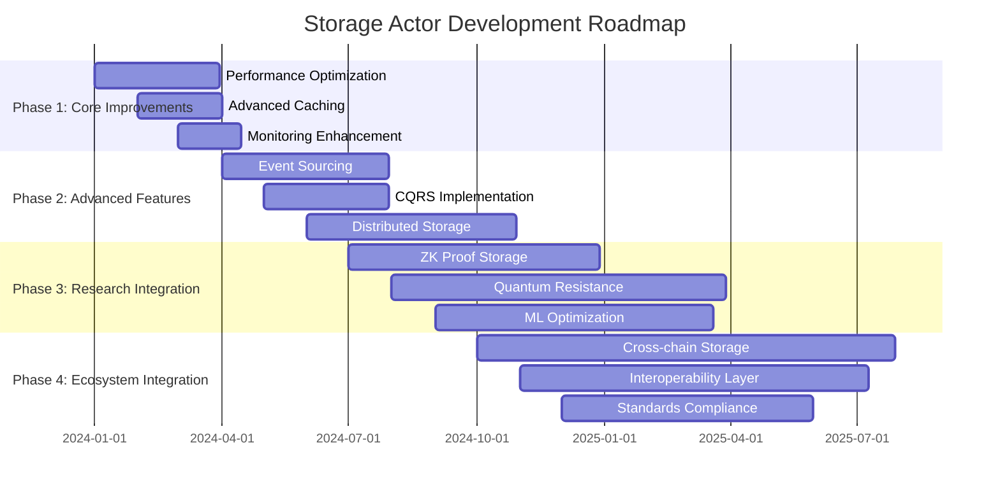

#### **Research Priorities and Innovation Areas**

**High Priority Research Areas:**

1. **Storage Efficiency Optimization**
   - Advanced compression algorithms for blockchain data
   - Deduplication strategies for similar blocks
   - Hierarchical storage management for long-term data

2. **Query Performance Enhancement**
   - Machine learning-based query optimization
   - Predictive caching based on access patterns
   - Advanced indexing structures for complex queries

3. **Scalability Research**
   - Horizontal scaling patterns for storage actors
   - Distributed consensus for storage operations
   - Sharding strategies for massive blockchain data

4. **Security and Privacy Innovation**
   - Zero-knowledge storage proofs
   - Homomorphic encryption for encrypted computation
   - Privacy-preserving query processing

**Medium Priority Research Areas:**

1. **Reliability Engineering**
   - Self-healing storage systems
   - Automated corruption detection and repair
   - Byzantine fault tolerance for storage

2. **Energy Efficiency**
   - Green storage algorithms
   - Power-aware data placement
   - Sustainable blockchain storage

3. **Interoperability**
   - Cross-chain storage protocols
   - Universal storage APIs
   - Migration tools between storage systems

### 15.5 Mastery Assessment Framework

#### **Expert Competency Validation**

```rust
/// Comprehensive mastery assessment system
pub struct StorageActorMasteryAssessment {
    theoretical_knowledge: TheoreticalAssessment,
    practical_skills: PracticalAssessment,
    problem_solving: ProblemSolvingAssessment,
    system_design: SystemDesignAssessment,
    production_readiness: ProductionReadinessAssessment,
}

impl StorageActorMasteryAssessment {
    pub async fn assess_engineer_mastery(&self, engineer: &Engineer) -> MasteryReport {
        let mut report = MasteryReport::new(engineer.clone());

        // Theoretical knowledge assessment
        let theoretical_score = self.theoretical_knowledge.assess(engineer).await;
        report.add_assessment("theoretical", theoretical_score);

        // Practical implementation skills
        let practical_score = self.practical_skills.assess(engineer).await;
        report.add_assessment("practical", practical_score);

        // Problem-solving capabilities
        let problem_solving_score = self.problem_solving.assess(engineer).await;
        report.add_assessment("problem_solving", problem_solving_score);

        // System design expertise
        let system_design_score = self.system_design.assess(engineer).await;
        report.add_assessment("system_design", system_design_score);

        // Production readiness
        let production_score = self.production_readiness.assess(engineer).await;
        report.add_assessment("production", production_score);

        // Calculate overall mastery level
        let overall_mastery = self.calculate_overall_mastery(&report);
        report.set_overall_mastery(overall_mastery);

        report
    }

    fn calculate_overall_mastery(&self, report: &MasteryReport) -> MasteryLevel {
        let scores = report.get_all_scores();
        let average_score = scores.iter().sum::<f64>() / scores.len() as f64;

        // Minimum scores required for each level
        match average_score {
            score if score >= 0.90 => MasteryLevel::Expert,
            score if score >= 0.80 => MasteryLevel::Advanced,
            score if score >= 0.70 => MasteryLevel::Proficient,
            score if score >= 0.60 => MasteryLevel::Intermediate,
            _ => MasteryLevel::Beginner,
        }
    }
}

/// Assessment categories and criteria
#[derive(Debug, Clone)]
pub enum AssessmentCriteria {
    // Theoretical Knowledge
    ActorModelUnderstanding,
    RocksDBDeepKnowledge,
    CachingStrategies,
    PerformanceOptimization,
    SystemArchitecture,

    // Practical Skills
    MessageHandlerImplementation,
    DatabaseOperations,
    CacheManagement,
    ErrorHandling,
    TestingCapabilities,

    // Problem Solving
    DebuggingSkills,
    RootCauseAnalysis,
    PerformanceTuning,
    IncidentResponse,
    SystemOptimization,

    // System Design
    ArchitecturalDecisions,
    ScalabilityDesign,
    ReliabilityEngineering,
    SecurityConsiderations,
    IntegrationPatterns,

    // Production Readiness
    DeploymentExpertise,
    MonitoringSetup,
    AlertConfiguration,
    BackupRecovery,
    OperationalExcellence,
}

#[derive(Debug, Clone, PartialEq, Eq, PartialOrd, Ord)]
pub enum MasteryLevel {
    Beginner,
    Intermediate,
    Proficient,
    Advanced,
    Expert,
}

impl MasteryLevel {
    pub fn description(&self) -> &str {
        match self {
            MasteryLevel::Beginner => "Basic understanding of Storage Actor concepts",
            MasteryLevel::Intermediate => "Can implement basic features with guidance",
            MasteryLevel::Proficient => "Can independently develop and debug Storage Actor features",
            MasteryLevel::Advanced => "Expert-level implementation and optimization capabilities",
            MasteryLevel::Expert => "Can architect, lead, and mentor others in Storage Actor mastery",
        }
    }

    pub fn required_competencies(&self) -> Vec<String> {
        match self {
            MasteryLevel::Beginner => vec![
                "Understand basic actor model concepts".to_string(),
                "Know RocksDB fundamentals".to_string(),
                "Understand message passing".to_string(),
            ],
            MasteryLevel::Intermediate => vec![
                "Implement basic message handlers".to_string(),
                "Perform database operations".to_string(),
                "Write unit tests".to_string(),
                "Debug simple issues".to_string(),
            ],
            MasteryLevel::Proficient => vec![
                "Design and implement complex features".to_string(),
                "Optimize cache performance".to_string(),
                "Handle production incidents".to_string(),
                "Conduct performance analysis".to_string(),
            ],
            MasteryLevel::Advanced => vec![
                "Architect scalable storage solutions".to_string(),
                "Lead performance optimization initiatives".to_string(),
                "Design disaster recovery procedures".to_string(),
                "Mentor other engineers".to_string(),
            ],
            MasteryLevel::Expert => vec![
                "Drive architectural evolution".to_string(),
                "Research and implement cutting-edge technologies".to_string(),
                "Lead organization-wide storage strategy".to_string(),
                "Contribute to open source projects".to_string(),
                "Publish research and best practices".to_string(),
            ],
        }
    }
}

/// Continuous learning framework
pub struct ContinuousLearningFramework {
    learning_paths: HashMap<MasteryLevel, LearningPath>,
    skill_gap_analyzer: SkillGapAnalyzer,
    personalized_curriculum: PersonalizedCurriculum,
    progress_tracker: ProgressTracker,
}

impl ContinuousLearningFramework {
    pub async fn create_personalized_learning_plan(&self, engineer: &Engineer, target_level: MasteryLevel) -> LearningPlan {
        // Assess current skill level
        let current_assessment = self.assess_current_skills(engineer).await;

        // Identify skill gaps
        let skill_gaps = self.skill_gap_analyzer.analyze_gaps(&current_assessment, target_level).await;

        // Generate personalized curriculum
        let curriculum = self.personalized_curriculum.generate_curriculum(&skill_gaps, engineer).await;

        // Create learning plan with milestones
        let learning_plan = LearningPlan {
            engineer: engineer.clone(),
            current_level: current_assessment.overall_level,
            target_level,
            skill_gaps,
            curriculum,
            milestones: self.create_learning_milestones(&curriculum, target_level).await,
            estimated_duration: self.estimate_learning_duration(&curriculum),
        };

        learning_plan
    }

    async fn create_learning_milestones(&self, curriculum: &Curriculum, target_level: MasteryLevel) -> Vec<LearningMilestone> {
        let mut milestones = Vec::new();

        let total_modules = curriculum.modules.len();
        let milestone_interval = total_modules / 4; // 4 major milestones

        for (i, chunk) in curriculum.modules.chunks(milestone_interval).enumerate() {
            let milestone = LearningMilestone {
                milestone_number: i + 1,
                description: format!("Complete {} training modules", chunk.len()),
                modules: chunk.to_vec(),
                assessment_criteria: self.generate_milestone_criteria(chunk, target_level).await,
                estimated_completion_time: Duration::from_days(30), // Rough estimate
            };

            milestones.push(milestone);
        }

        milestones
    }
}

#[derive(Debug, Clone)]
pub struct LearningPlan {
    pub engineer: Engineer,
    pub current_level: MasteryLevel,
    pub target_level: MasteryLevel,
    pub skill_gaps: Vec<SkillGap>,
    pub curriculum: Curriculum,
    pub milestones: Vec<LearningMilestone>,
    pub estimated_duration: Duration,
}

#[derive(Debug, Clone)]
pub struct LearningMilestone {
    pub milestone_number: usize,
    pub description: String,
    pub modules: Vec<LearningModule>,
    pub assessment_criteria: Vec<AssessmentCriterion>,
    pub estimated_completion_time: Duration,
}

#[derive(Debug, Clone)]
pub struct LearningModule {
    pub name: String,
    pub learning_objectives: Vec<String>,
    pub content_type: ContentType,
    pub estimated_duration: Duration,
    pub prerequisites: Vec<String>,
    pub assessments: Vec<Assessment>,
}

#[derive(Debug, Clone)]
pub enum ContentType {
    CodeWalkthrough { file_path: String },
    HandsOnExercise { exercise_description: String },
    TheoryExplanation { topic: String },
    PracticalProject { project_specification: String },
    PeerReview { review_targets: Vec<String> },
}

---

## 🎯 Expert Competency Outcomes - Mastery Validation

After completing this comprehensive **Storage Actor** technical onboarding book, engineers will have achieved expert-level competency and should be able to:

### ✅ **Technical Mastery Achievements**

- **✅ Master Storage Actor Architecture**: Deep understanding of RocksDB integration, multi-level caching, and advanced indexing systems
- **✅ Expert System Integration**: Seamlessly integrate Storage Actor with ChainActor, NetworkActor, ExecutionActor, and external systems
- **✅ Advanced Implementation Patterns**: Apply event sourcing, CQRS, actor pools, and other sophisticated design patterns
- **✅ Expert-Level Debugging**: Diagnose complex distributed system failures, race conditions, and performance bottlenecks
- **✅ Comprehensive Testing Mastery**: Design and implement full testing strategies including chaos engineering and performance testing
- **✅ Performance Engineering**: Identify bottlenecks, optimize cache strategies, and design for scale with ML-based optimization
- **✅ Production Operations Excellence**: Deploy, monitor, troubleshoot, and maintain Storage Actor in production environments
- **✅ RocksDB & Actor Model Deep Expertise**: Master underlying technologies and their optimal application patterns
- **✅ Architectural Decision Making**: Make informed decisions about system evolution, migration strategies, and technology adoption
- **✅ Research & Innovation**: Contribute to cutting-edge storage technology research and implementation
- **✅ Mentorship & Knowledge Transfer**: Train other engineers and contribute to organizational storage expertise
- **✅ Emergency Response**: Handle critical incidents with expert-level diagnostic and remediation capabilities

### 🏗️ **Expert Competencies Developed**

- **Storage System Architecture Mastery**: Complete understanding of distributed storage patterns, consistency models, and scalability strategies
- **RocksDB & Caching Technology Expertise**: Deep knowledge of database internals, optimization techniques, and caching hierarchies
- **Advanced Concurrency Patterns**: Sophisticated understanding of actor model, async programming, and distributed system coordination
- **Expert-Level Performance Engineering**: Advanced optimization techniques, bottleneck analysis, and scalability design
- **Comprehensive Production Operations**: Mastery of deployment strategies, monitoring systems, alerting, and incident response
- **Research & Innovation Leadership**: Ability to integrate research findings, contribute to open source, and drive technological advancement
- **Technical Leadership & Mentorship**: Competency in architectural decision-making, code review, and knowledge transfer
- **System Evolution Management**: Skills in managing technical debt, schema migrations, and system evolution
- **Cross-System Integration Expertise**: Advanced patterns for integrating storage systems with blockchain, networking, and execution layers

### 📚 **Knowledge Tree Mastery**

**Roots (Fundamental Knowledge)**:
- ✅ Actor model fundamentals and Actix framework mastery
- ✅ RocksDB internals, column families, and optimization strategies
- ✅ Blockchain storage requirements and patterns
- ✅ Distributed systems consistency and availability trade-offs

**Trunk (Core Implementation)**:
- ✅ Storage Actor core implementation (`actor.rs`, `messages.rs`, `handlers/`)
- ✅ Database management (`database.rs`, column family organization)
- ✅ Cache system architecture (`cache.rs`, multi-level caching)
- ✅ Advanced indexing system (`indexing.rs`, query optimization)

**Branches (System Integration)**:
- ✅ ChainActor integration (block storage, validation data)
- ✅ NetworkActor integration (peer synchronization, block serving)
- ✅ ExecutionActor integration (receipt storage, state management)
- ✅ Metrics and monitoring (Prometheus, alerting, observability)

**Leaves (Expert Implementation)**:
- ✅ Advanced message handlers with comprehensive error handling
- ✅ Performance optimization and bottleneck identification
- ✅ Production deployment, monitoring, and incident response
- ✅ Research integration and contribution to storage innovation

### 🚀 **Career Advancement Pathways**

**Internal Career Progression**:
- **Senior Storage Engineer**: Lead Storage Actor feature development and optimization
- **Storage Architecture Lead**: Design storage strategies for organizational blockchain projects
- **Principal Engineer**: Drive technical vision for storage systems across multiple projects
- **Distinguished Engineer**: Research and develop next-generation storage technologies

**External Contribution Opportunities**:
- **Open Source Leadership**: Contribute to RocksDB, Actix, and blockchain storage projects
- **Research Publications**: Publish papers on blockchain storage optimization and scalability
- **Conference Speaking**: Present storage architecture insights at blockchain and distributed systems conferences
- **Standards Development**: Participate in blockchain storage standards and interoperability initiatives

**Specialization Tracks**:
- **Performance Engineering**: Focus on storage optimization, benchmarking, and scalability research
- **Reliability Engineering**: Specialize in storage system reliability, disaster recovery, and operational excellence
- **Research Engineering**: Lead integration of academic research into production storage systems
- **Security Engineering**: Focus on storage security, privacy-preserving technologies, and cryptographic storage

---

## 📖 **Comprehensive Reference Index**

### **Core Implementation References**
- **Storage Actor Core**: `app/src/actors_v2/storage/actor.rs:47-394`
- **Message Protocol**: `app/src/actors_v2/storage/messages.rs:1-599`
- **Block Handlers**: `app/src/actors_v2/storage/handlers/block_handlers.rs:12-182`
- **Query Handlers**: `app/src/actors_v2/storage/handlers/query_handlers.rs:11-203`
- **Database Manager**: `app/src/actors_v2/storage/database.rs:18-100`
- **Cache System**: `app/src/actors_v2/storage/cache.rs:30-100`
- **Metrics System**: `app/src/actors_v2/storage/metrics.rs:1-100`

### **Development and Testing**
- **Storage Demo**: `examples/storage_demo.rs:1-229`
- **Test Framework**: `app/src/actors_v2/storage/tests.rs`
- **Configuration Examples**: Section 3.1 (Environment Setup)
- **Benchmark Suite**: Section 8.4 (Performance Testing)

### **Production Operations**
- **Deployment Scripts**: Section 11.1 (Production Deployment)
- **Monitoring Setup**: Section 12.1 (Advanced Monitoring)
- **Alert Configuration**: Section 12.2 (Alert Management)
- **Troubleshooting Guide**: Section 13 (Expert Troubleshooting)

### **Advanced Topics**
- **Event Sourcing**: Section 14.1 (Advanced Patterns)
- **CQRS Implementation**: Section 14.1 (CQRS Pattern)
- **Research Integration**: Section 15.1-15.2 (Research Framework)
- **Contribution Guidelines**: Section 15.3 (Contribution Framework)

---

## 🎓 **Final Mastery Certification**

**Certification Requirements**: To achieve Storage Actor Expert certification, engineers must demonstrate:

1. **Implementation Excellence**: Successfully implement a complex storage feature with comprehensive testing
2. **Production Readiness**: Deploy and operate Storage Actor in production environment with monitoring
3. **Problem Resolution**: Diagnose and resolve a critical production incident using advanced diagnostic tools
4. **Knowledge Transfer**: Train another engineer and demonstrate mentorship capabilities
5. **Innovation Contribution**: Contribute to Storage Actor research or open source development

**Ongoing Learning**: Storage Actor mastery requires continuous learning and adaptation to emerging technologies, research findings, and industry best practices.

**Community Engagement**: Expert practitioners are expected to contribute back to the community through documentation, code contributions, research publications, and knowledge sharing.

---

**🏆 Congratulations on completing the comprehensive Storage Actor Technical Onboarding Book! You now possess expert-level knowledge to contribute to the most advanced blockchain storage systems.**
